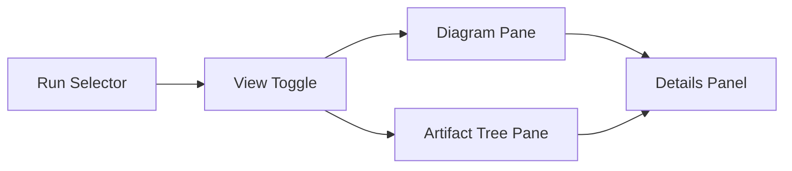

# NRC APS Review UI Specification

## 1. Objective

Design a read-only frontend review surface for NRC APS pipeline runs that makes the pipeline inspectable as both:

- a canonical system view
- a run-specific realized artifact graph

The first target is the latest completed reviewable NRC APS run, with support for browsing prior reviewable runs in the same surface.

## 2. Repo-Fit Authority Model

This specification relies on the following repo-confirmed authority surfaces:

- web/app entrypoint: `C:\Users\benny\OneDrive\Desktop\project6_REPO_MCP_FOLDER\backend\main.py`
- live connector API routes: `C:\Users\benny\OneDrive\Desktop\project6_REPO_MCP_FOLDER\backend\app\api\router.py`
- repo authority hierarchy: `C:\Users\benny\OneDrive\Desktop\project6_REPO_MCP_FOLDER\docs\nrc_adams\nrc_aps_authority_matrix.md`
- live NRC APS status surface: `C:\Users\benny\OneDrive\Desktop\project6_REPO_MCP_FOLDER\docs\nrc_adams\nrc_aps_status_handoff.md`
- current verified runtime example:
  - `C:\Users\benny\OneDrive\Desktop\project6_REPO_MCP_FOLDER\backend\app\storage_test_runtime\lc_e2e\20260327_062011\`
  - `C:\Users\benny\OneDrive\Desktop\project6_REPO_MCP_FOLDER\backend\app\storage_test_runtime\lc_e2e\20260327_062011\local_corpus_e2e_summary.json`

Important repo-confirmed facts:

- the live backend already serves web content from `backend/main.py`
- the backend already mounts `/storage`
- the live API exposes run-by-id, targets, events, reports, and content-units routes
- the live API does not currently expose a generic connector run listing route
- there is no existing standalone frontend app scaffold in the root repo

## 3. Product Goal

The product goal is to let a user understand a pipeline run from top to bottom without manually traversing JSON files and filesystem folders.

The UI must allow a user to:

- select a reviewable NRC APS run
- see the canonical pipeline shape
- see the selected run mapped onto that shape
- inspect the corresponding artifact tree
- click any diagram node and see its mapped files and metadata
- click any file tree node and see its mapped pipeline context

## 4. In Scope

- NRC APS only
- latest completed reviewable run as the default landing target
- historical run selection
- two views:
  - `Pipeline Overview`
  - `Run-specific Overview`
- interactive diagram pane
- interactive file-tree pane
- details panel
- read-only review endpoints
- read-only backend-served UI

## 5. Out Of Scope For V1

- live in-progress polling
- run execution controls
- file editing or mutation
- in-browser content preview
- cross-run comparison views
- non-NRC APS pipeline generalization
- generic repo or filesystem browsing

## 6. Required Invariants

- the review surface must be strictly read-only
- the review surface must not regenerate, repair, seed, or mutate runtime artifacts
- the review surface must not change run state
- the review surface must not depend on hand-maintained Mermaid text as its source of truth
- the review surface must not silently hide missing expected artifacts
- the review surface must remain bounded to allowed review roots only

## 7. User-Facing Views

### 7.1 Pipeline Overview

Purpose:

- show the stable, canonical NRC APS pipeline shape
- explain what stages exist and how they relate
- show a cleaner, more conceptual rendering than the run-specific view
- show category-level artifact expectations without tying the user to one exact run

This view is a system explanation surface.

### 7.2 Run-specific Overview

Purpose:

- render the selected run against the same canonical stage map
- show actual run ids, counts, file refs, downstream branch artifacts, and gate results

This view is an execution review surface.

## 8. Page Structure

Main layout:

- header
  - page title
  - run selector
  - view toggle
- body
  - left pane: diagram
  - right pane: artifact tree
- right-side drawer or right-side column
  - details for selected node/file

## 9. Interaction Model

### 9.1 Diagram Pane

Required v1 behaviors:

- zoom
- pan
- click node
- hover affordance
- visible selected state
- visible incomplete/missing state

Priority:

- diagram interaction is the primary interaction surface in v1

### 9.2 Artifact Tree Pane

Required v1 behaviors:

- expand/collapse
- lazy loading
- click-to-select
- highlight entries mapped to the selected diagram node
- highlight diagram node when a mapped file is selected

Default v1 presentation:

- strict filesystem tree rooted at the selected run's review-safe runtime/artifact roots
- no curated meaning-first grouping in the default mode
- auto-reveal the currently selected node's mapped files
- a curated review-tree mode may be added later if it does not complicate the first implementation path

### 9.3 Details Panel

Selecting either a diagram node or a file tree entry must open details.

Default v1 behavior:

- the details panel is a metadata-and-context surface
- the details panel should live in a right-side drawer or right-side column
- it is not a full raw file preview surface
- when available, it should include a small structured summary extracted from the selected artifact or stage
- full preview remains deferred
- when preview is added later, it should start with JSON/text only

Node details minimum content:

- node id
- node label
- stage family
- selected run id
- mapped file refs
- key counts/status
- expected artifact classes
- small structured summary when available
- mismatch or missing-artifact warnings

File details minimum content:

- canonical path
- file class
- mapped stage/node
- run id
- available summary metadata
- small structured summary when available

Examples of structured summary content:

- run reports:
  - selected/downloaded/failed counts
  - indexed content counts
- downstream artifacts:
  - citation totals
  - export/package counts
  - dossier/insight/challenge/review-packet counts
- file artifacts:
  - artifact class
  - size
  - modified time
  - mapped node id

## 10. Architecture Recommendation

Recommended architecture:

- backend-served additive UI
- additive read-only review endpoints
- renderer-independent review model
- Mermaid as the first renderer, not the model authority

Why this is the narrowest repo-fit path:

- the existing backend already serves web content
- the backend already owns the relevant APIs and storage mount
- there is no established standalone frontend scaffold to extend safely
- a separate frontend toolchain would broaden scope before the interaction model is proven

## 11. Review Model Layers

The system should use four conceptual layers:

1. `canonical_pipeline_definition`
2. `run_review_model`
3. `artifact_tree_model`
4. `details_model`

### 11.1 Canonical Pipeline Definition

Contains stable NRC APS node ids, edges, stage families, and expected artifact classes.

This layer must be shared by both views.

### 11.2 Run Review Model

Contains the selected run's realization of the canonical pipeline:

- actual counts
- actual run ids
- actual file refs
- stage states
- mismatch warnings

### 11.3 Artifact Tree Model

Contains the bounded, review-safe file tree for the selected run.

### 11.4 Details Model

Contains the data needed to populate the details panel from either a node selection or a file selection.

The details model should support:

- identity metadata
- pipeline context
- summary metrics
- warning state
- small structured summaries derived from the selected node/file when available

## 12. Source Of Truth Rules

Recommended default:

- use a hybrid authority model
- DB/API authority:
  - run existence
  - run identity
  - selector metadata
  - status/timestamps
- persisted artifact authority:
  - stage realization
  - file tree
  - counts shown in review
  - review evidence

If DB/API and persisted artifacts disagree:

- do not silently merge away the mismatch
- render the run using persisted review artifacts when sufficient
- show an explicit warning in details or run metadata

## 13. Reviewable Run Contract

A run is reviewable in v1 only if:

- it is an NRC APS run
- it is completed
- it has sufficient persisted artifacts to build:
  - the run-specific diagram
  - the artifact tree
  - the details panel mappings

Non-reviewable NRC APS runs should appear in the selector as disabled items with reasons when practical.

Fallback rule:

- if disabled-row support becomes an implementation blocker, the selector may temporarily show reviewable runs only
- this fallback should be treated as a temporary concession, not the preferred behavior

## 14. Tree Boundary Rules

The right-hand pane must not become a generic filesystem browser for the repo as a whole.

Allowed review roots are limited to:

- the selected run runtime root
- selected run report/artifact subtrees
- source corpus root only when used as part of the review display

Default presentation rule:

- render these allowed roots as a strict filesystem tree first
- defer any alternate curated/grouped tree mode until after the strict tree works cleanly

Excluded by default:

- unrelated repo folders
- arbitrary parent traversal
- hidden or private user directories

## 15. Failure And Incomplete-State Behavior

Run-level behavior:

- if no reviewable run exists, show the normal UI shell with disabled panes
- if a specific selected run is not reviewable, fail closed for that run and show a structured disabled-state explanation inside the shell

Node-level behavior:

- render expected nodes even when their artifacts are missing
- mark those nodes as incomplete or missing
- expose the missing refs in details

Do not:

- collapse away missing stages
- fabricate replacement values
- auto-rebuild or re-materialize missing artifacts

## 16. Tech Debt Avoidance Rules

- do not hardcode a single runtime path such as `20260327_062011`
- do not derive node ids from rendered labels
- do not encode run structure directly into Mermaid source text
- do not let the general and run-specific views drift into separate incompatible models
- do not couple the review UI to preview/editor behavior
- do not expose direct arbitrary path reads to the browser

## 17. Implementation Phases

### Phase 1: Model And Contract Freeze

- finalize authority model
- finalize reviewable-run criteria
- finalize canonical stage/node ids
- finalize route and model contracts

### Phase 2: Read-Only Backend Review API

- add run selector endpoint
- add canonical pipeline definition endpoint
- add run-specific overview endpoint
- add artifact tree endpoint
- add details endpoints

### Phase 3: UI Shell

- add backend-served review page
- add run selector
- add view toggle
- add layout shell for diagram, tree, details

### Phase 4: General Pipeline Overview

- render canonical pipeline definition
- render a cleaner, more conceptual stage map than the run-specific view
- support selection/highlight/details

### Phase 5: Run-specific Overview

- render selected run realization
- support node/file cross-highlighting
- show exact run artifact mappings

### Phase 6: Hardening

- empty states
- mismatch warnings
- missing-artifact behavior
- performance tightening on tree expansion

## 18. Acceptance Criteria

The first implementation is acceptable only if:

- opening the review page defaults to the latest completed reviewable NRC APS run
- historical reviewable NRC APS runs are selectable
- non-reviewable NRC APS runs are shown as disabled rows with reasons when practical
- the `Pipeline Overview` renders the canonical pipeline definition
- the `Pipeline Overview` is materially less dense than the run-specific view
- the `Run-specific Overview` renders actual selected-run mappings
- the right-hand pane defaults to a strict filesystem tree bounded to review-safe roots
- the strict filesystem tree auto-reveals the selected node's mapped files
- clicking a diagram node highlights corresponding tree entries and opens details
- clicking a tree entry highlights the mapped diagram node when available and opens details
- the surface is strictly read-only
- no existing connector execution/runtime behavior is modified
- missing or incomplete artifacts are shown explicitly

## 19. Residual Risks

- older runs may have schema/artifact drift that needs capability flags or versioning
- Mermaid may prove insufficient for the exact interaction fidelity desired
- tree size may require virtualization or more aggressive lazy loading later
- a preview/download feature added too early would broaden scope and threaten read-only simplicity

## 20. Planning Set Completeness

The planning set should be treated as complete only while these companion documents remain present and aligned:

- `nrc_aps_review_ui_implementation_blueprint.md`
  - freezes exact repo-fit modules, files, and edit boundaries
- `nrc_aps_review_ui_canonical_graph_registry.md`
  - freezes the exhaustive canonical node ids, edges, stage families, and view projections
- `nrc_aps_review_ui_mapping_and_reviewability_rules.md`
  - freezes review discovery, reviewability, mapping, and mismatch behavior
- `nrc_aps_review_ui_dependency_and_asset_strategy.md`
  - freezes the no-build asset policy, vendored browser assets, and static serving shape
- `nrc_aps_review_ui_validation_plan.md`
  - freezes the test matrix, golden runtime fixture usage, and non-regression checks
- `nrc_aps_review_ui_example_payloads.md`
  - freezes representative payload shapes using the verified reviewable run

There are no remaining critical product-scope questions for v1 in `nrc_aps_review_ui_open_decisions.md`. Remaining discretion is implementation-level only.
