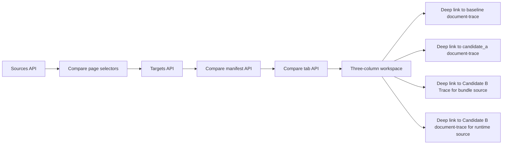

# NRC APS Workbench Compare Implementation Blueprint

## 1. Purpose

Define the narrowest repo-fit implementation path for the workbench compare workspace without widening the existing review UI or document-trace UI contracts.

## 2. Architecture Decision

Implement the compare workspace as a separate additive page plus a dedicated compare service.

Do not:

- retrofit the existing document-trace page into a tri-run compare page
- add Candidate B fields directly into the current single-run trace manifest
- make the frontend stitch together three variant models on its own

## 3. High-Level Flow

## 4. Planned Area Of Effect

### 4.1 Page routing

- `C:\Users\benny\OneDrive\Desktop\project6_REPO_MCP_FOLDER\backend\main.py`

Add one additive page shell route:

- `/review/nrc-aps/workbench-compare`

Reuse the existing `/review/nrc-aps/static` mount in `backend/main.py`.
Do not add a second static mount for this page.

### 4.2 API surface

- `C:\Users\benny\OneDrive\Desktop\project6_REPO_MCP_FOLDER\backend\app\api\review_nrc_aps.py`

Add four additive compare routes:

- `/workbench-compare/sources`
- `/workbench-compare/targets`
- `/workbench-compare/targets/{fixture_id}/manifest`
- `/workbench-compare/targets/{fixture_id}/tabs/{tab_id}`

Do not modify `backend/app/api/router.py` for this lane.
The existing `review_nrc_aps.router` mount already serves any additive routes added to `review_nrc_aps.py` under `/api/v1/review/nrc-aps/...`.

### 4.3 Schemas

- `C:\Users\benny\OneDrive\Desktop\project6_REPO_MCP_FOLDER\backend\app\schemas\review_nrc_aps.py`

Add dedicated compare schemas instead of overloading the existing single-run trace schemas.

### 4.4 Services

Primary new service:

- `C:\Users\benny\OneDrive\Desktop\project6_REPO_MCP_FOLDER\backend\app\services\review_nrc_aps_workbench_compare.py`

Expected responsibilities:

- discover compare sources
- classify baseline vs Candidate A runs
- discover allowlisted Candidate B bundles
- discover admitted Candidate B runtime runs as a separate source kind
- resolve a validated Candidate B bundle root from `candidate_b_bundle_id`
- resolve a validated Candidate B runtime binding from `candidate_b_run_id`
- map review-run targets to corpus `fixture_id`
- intersect targets across the selected sources
- compose compare manifest and compare tabs

Expected narrow shared-runtime extension:

- `C:\Users\benny\OneDrive\Desktop\project6_REPO_MCP_FOLDER\backend\app\services\review_nrc_aps_runtime.py`

Only if needed for:

- a public run-variant classification helper
- allowlisted local Candidate B bundle root discovery

Checkout-root note:

- the compare service must resolve the repo checkout root from `backend/app/services/` before scanning bundle roots
- use the same `Path(__file__).resolve()` style already used in the runtime/root helpers
- do not infer bundle roots from the current process cwd
- revalidate bundle ids by exact match to discovered roots, not just checkout-root containment

The existing path-safety helper pattern in `review_nrc_aps_document_trace.py` is not sufficient on its own for Candidate B bundle validation because it enforces single-root containment, not discovered-root identity.

Do not widen `review_nrc_aps_document_trace.py` into the compare owner.

### 4.5 Frontend assets

Add new static files:

- `C:\Users\benny\OneDrive\Desktop\project6_REPO_MCP_FOLDER\backend\app\review_ui\static\workbench_compare.html`
- `C:\Users\benny\OneDrive\Desktop\project6_REPO_MCP_FOLDER\backend\app\review_ui\static\workbench_compare.css`
- `C:\Users\benny\OneDrive\Desktop\project6_REPO_MCP_FOLDER\backend\app\review_ui\static\workbench_compare.js`

Reuse:

- `review.css` for shared tokens/layout conventions

Do not modify:

- `document_trace.html`
- `document_trace.css`
- `document_trace.js`

in the first pass unless a narrow navigation addition is explicitly reopened later.

### 4.6 Tests

Add:

- `C:\Users\benny\OneDrive\Desktop\project6_REPO_MCP_FOLDER\backend\tests\test_review_nrc_aps_workbench_compare_api.py`
- `C:\Users\benny\OneDrive\Desktop\project6_REPO_MCP_FOLDER\backend\tests\test_review_nrc_aps_workbench_compare_service.py`
- `C:\Users\benny\OneDrive\Desktop\project6_REPO_MCP_FOLDER\backend\tests\test_review_nrc_aps_workbench_compare_page.py`

## 5. Frozen Implementation Decisions

### 5.1 Separate page, not embedded compare mode

The workbench compare workspace is a separate page because:

- existing review/document-trace v1 scopes already freeze single-run behavior
- tri-run comparison needs different identity, different tabs, and different warnings
- Candidate B data can be bundle-based or admitted-runtime-based, and the selected source kind must remain explicit

### 5.2 Shared source header, not three source viewers

The compare page should show one shared source context header and deep links to source inspection.

Current shipped compare truth:

- baseline and Candidate A deep links point into the existing single-run document-trace page
- bundle-sourced Candidate B deep links point into the separate additive `Candidate B Trace` page
- runtime-sourced Candidate B deep links point into the existing single-run document-trace page for the admitted Candidate B runtime target
- Candidate B Trace remains a separate additive bundle surface and not a stealth document-trace parity claim

Do not render three full source viewers in v1.

### 5.3 Backend-owned alignment

The backend compare service owns:

- variant selection validation
- fixture mapping
- target intersection
- comparability classification

The frontend owns:

- selection state
- tab loading
- column rendering
- badge presentation

### 5.4 Strict fixture mapping

Mapping is intentionally strict:

- exact manifest-basename match on `trace.identity.source_file_name`
- no fuzzy title matching
- no accession-only fallback

If that proves too narrow in implementation, reopen it as a documented blocker instead of weakening it silently.

### 5.5 Candidate B bundle posture

Candidate B bundles are optional local operator evidence.

The compare workspace must:

- work when no Candidate B bundles are present by surfacing a clear unavailable state
- not assume a committed or tracked bundle root exists
- not assume a local archived proof bundle exists in every fresh implementation worktree
- not permit arbitrary bundle-path entry from the browser
- preserve `candidate_b_bundle_id` as bundle identity only; runtime Candidate B uses `candidate_b_source_kind=runtime` plus `candidate_b_run_id`

## 6. Data-Flow Breakdown

### 6.1 Sources step

The sources endpoint should:

1. discover reviewable runs
2. classify eligible `baseline` runs
3. classify eligible `candidate_a_page_evidence_v1` runs
4. discover allowlisted Candidate B bundles
5. return only clean, selectable sources

If any source class is empty, the endpoint still returns successfully with an empty list for that class.

### 6.2 Targets step

The targets endpoint should:

1. read the selected baseline run's document rows
2. read the selected Candidate A run's document rows
3. read the selected Candidate B bundle documents
4. map baseline/Candidate A rows to manifest-backed `fixture_id`
5. intersect the three source sets
6. return the surviving `fixture_id` target list

### 6.3 Manifest step

The manifest endpoint should:

1. revalidate the selected source combination
2. revalidate the selected `fixture_id`
3. build the shared identity summary
4. build deep links into baseline and Candidate A document trace plus Candidate B Trace
5. advertise tab availability

The manifest must not invent default selections when one required source class is empty.

### 6.4 Tab step

The tab endpoint should:

1. adapt baseline/Candidate A runtime outputs into compare-column payloads
2. adapt Candidate B compare/proof/baseline-summary outputs into compare-column payloads
3. attach comparability classes
4. return one aligned three-column tab payload

## 7. First-Pass Non-Goals

Do not use this lane to:

- change `project6.ps1`
- rerun Candidate B compare inside page requests
- create or update Candidate B bundles
- write files into `archive/`
- expose this page to arbitrary repos or corpora
- add export/download workflows
- add browser-side diff editing or annotation
- change `backend/app/api/router.py`

## 8. Expected Follow-Through After Implementation

The minimum doc sync for this lane is:

- `frontend_UI_plans/README.md`
- this workbench-compare planning set
- any narrow Candidate B planning note only if the implementation changes cross-pack assumptions
