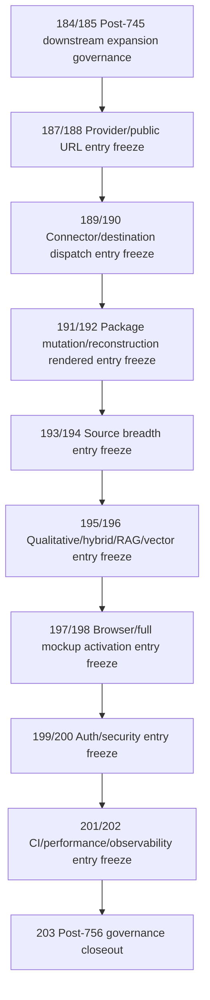

# Post-756 Layer 3 Governance Closeout

Status: current-main planning/control closeout after the post-745 downstream entry-freeze chain.

This document records that the post-745 downstream governance sequence has been carried through the bounded entry-freeze categories selected by `184_POST_745_DOWNSTREAM_EXPANSION_FREEZE.md` and the later roadmap references. It does not implement runtime behavior, change CI, add tests, add routes, change DTOs, edit models or migrations, change production services, add rendered UI controls, activate provider/public URLs, dispatch connectors/destinations, mutate packages, expand sources, activate broad qualitative/hybrid/RAG behavior, activate full mockups, change auth/security behavior, or create frontend-only durable authority.

## Authority Snapshot

- authoritative remote: `project6-origin/main`
- upstream downstream-governance root: `184_POST_745_DOWNSTREAM_EXPANSION_FREEZE.md` and `185_POST_745_DOWNSTREAM_EXPANSION_CONTRACT.md`
- current closeout branch: `codex/l3-post756-governance-closeout`
- current checker: `tools/l3-progress-check.py`
- current progress surfaces: `next_milestone_plans/layer3_progress_board.md`, `next_milestone_plans/layer3_progress_manifest.json`, and `next_milestone_plans/layer3_workbench_proof_manifest.json`

Live source, tests, routes, models, migrations, workflow files, rendered UI files, and checker behavior outrank this closeout.

## Completed Entry-Freeze Chain



Each entry freeze is planning/control only. The common selected decision is:

```yaml
entry_decision: deferred
selected_mode: null
runtime_status: not_implemented
```

## What Is Now Frozen

The following categories now have a current-main referenceable deferred entry boundary. The explicit file chain includes `187_PROVIDER_PUBLIC_URL_ENTRY_FREEZE.md`, `188_PROVIDER_PUBLIC_URL_ENTRY_CONTRACT.md`, `189_CONNECTOR_DESTINATION_ENTRY_FREEZE.md`, `190_CONNECTOR_DESTINATION_ENTRY_CONTRACT.md`, `191_PACKAGE_MUTATION_RENDERED_ENTRY_FREEZE.md`, `192_PACKAGE_MUTATION_RENDERED_ENTRY_CONTRACT.md`, `193_SOURCE_BREADTH_ENTRY_FREEZE.md`, `194_SOURCE_BREADTH_ENTRY_CONTRACT.md`, `195_QUAL_HYBRID_RAG_VECTOR_ENTRY_FREEZE.md`, `196_QUAL_HYBRID_RAG_VECTOR_ENTRY_CONTRACT.md`, `197_BROWSER_FULL_MOCKUP_ACTIVATION_ENTRY_FREEZE.md`, `198_BROWSER_FULL_MOCKUP_ACTIVATION_ENTRY_CONTRACT.md`, `199_AUTH_SECURITY_ENTRY_FREEZE.md`, `200_AUTH_SECURITY_ENTRY_CONTRACT.md`, `201_CI_PERFORMANCE_OBSERVABILITY_ENTRY_FREEZE.md`, and `202_CI_PERFORMANCE_OBSERVABILITY_ENTRY_CONTRACT.md`:

1. provider/public URL behavior;
2. connector/destination dispatch behavior;
3. rendered package mutation, reconstruction, replacement, and supersession behavior;
4. source breadth beyond the existing admitted source classes;
5. broad qualitative, qualitative cohort, comparative, hybrid, RAG, and vector behavior;
6. browser/full mockup activation and frontend durable-authority behavior;
7. Layer 3 auth/security, tenant/session ownership, operator permission, and security audit behavior;
8. CI/performance/observability hardening, performance budgets, flake policy, headed-browser CI, and telemetry/audit tracing behavior.

These boundaries are intentionally conservative. They preserve the already-live bounded Layer 3 paths while preventing accidental implementation of broad downstream behavior without a later exact implementation-entry freeze.

## Current Live Behavior Preserved

This closeout preserves these already-live or already-proven bounded surfaces without generalizing them:

- same-origin external export/download delivery and durable same-origin signed-reference behavior where already admitted;
- raw mixed existing-source materialization and rendered source/material/Gate B/Gate C/plan/execution/package/handoff/export controls where already proven;
- standalone APS qualitative path and its bounded package/handoff/export/APS/external export/download chain where already admitted;
- existing server-authoritative rendered workbench controls and headed/headless proof posture;
- current local/proxy deployment guardrails;
- current focused backend Layer 3 CI job and serial Chromium Playwright CI job;
- progress/proof manifest and checker guardrails.

## Current Non-Admissions

This closeout admits no:

- provider/public URL runtime;
- provider object write, public ACL, signed URL, URL revocation, or public proxy URL behavior;
- external connector invocation, connector-run creation for downstream dispatch, destination selection, or destination write;
- generic downstream dispatch;
- rendered package mutation control, package payload rewrite, package reconstruction, replacement payload generation, or supersession runtime beyond already-admitted exact backend/API authorities;
- source class expansion beyond `dataset_version` and `aps_content_document`;
- source adapter registry, local upload, local-directory ingestion, arbitrary local path input, broad file upload, web connector retrieval, or unbounded runtime DB source read;
- broad qualitative execution, qualitative associated-cohort execution, comparative execution, cross-document synthesis, hybrid execution, RAG/vector retrieval, vector index creation, embedding generation, prompt/model/provider runtime, or hidden LLM planning;
- full mockup activation, browser-local persistence as authority, frontend-only durable state, or theme-specific durable authority;
- route-level auth dependency change, authorization/permission enforcement change, tenant/session-owner runtime, proxy identity trust expansion, storage exposure expansion, or security audit-event runtime;
- CI workflow change, Playwright configuration change, performance budget gate, runtime timing assertion, headed browser CI matrix, sharding/parallelism change, observability event runtime, metrics/log shipping, dashboard, or artifact retention policy change.

## Implementation Entry Rule

No future implementation may start directly from this closeout. The next implementation must first add or update a more specific implementation-entry freeze that names exactly one selected mode and proves:

- owner route, service, rendered control, workflow, or config surface;
- request/config schema and response/artifact schema;
- DB rows read and written;
- files/artifacts read and written;
- idempotency and concurrency behavior;
- provider, connector, destination, package, source, security, CI, performance, or observability authority basis;
- headed and headless browser proof if rendered/browser behavior changes;
- `light`, `dark`, and `workbench` theme obligations if rendered UI changes;
- negative side effects that must remain absent;
- proof-checker and progress/proof manifest updates.

## Next Implementation-Eligible Decision

The next pass should not be broad implementation. It should be one of these narrow options, chosen only when there is a concrete product/operator need:

1. `ci_observability_gap_inventory_only` if the next concern is proof/runtime reliability rather than product capability.
2. `provider_public_url_authority_discovery_freeze_or_entry_freeze_update` if same-origin signed-reference delivery is insufficient for a named downstream use case.
3. `connector_destination_authority_discovery_freeze_or_entry_freeze_update` if a named downstream destination must receive packages directly.
4. `package_mutation_rendered_authority_discovery_freeze_or_entry_freeze_update` if rendered package mutation, reconstruction, replacement, or supersession becomes the concrete blocker.
5. `source_breadth_authority_discovery_freeze_or_entry_freeze_update` if source classes beyond the current admitted families are required.
6. `qual_hybrid_rag_authority_discovery_freeze_or_entry_freeze_update` if broad qualitative, hybrid, RAG, or vector behavior becomes the concrete blocker.
7. `browser_full_mockup_authority_discovery_freeze_or_entry_freeze_update` if full mockup activation or browser durable-authority behavior becomes the concrete blocker.
8. `auth_security_authority_discovery_freeze_or_entry_freeze_update` if nonlocal deployment or operator isolation becomes the concrete blocker.
9. `ci_performance_observability_authority_discovery_freeze_or_entry_freeze_update` if CI/performance/observability runtime hardening becomes the concrete blocker.

Until one of those is selected with evidence, remain in planning/control or audit mode.

## Stop Condition

Stop before implementation and return to planning if a proposed next task tries to implement provider URLs, connector/destination dispatch, package mutation, source expansion, broad qualitative/hybrid/RAG behavior, full mockup activation, auth/security behavior, CI/performance/observability runtime, or UI/browser durable authority without a later exact implementation-entry freeze and proof plan.
