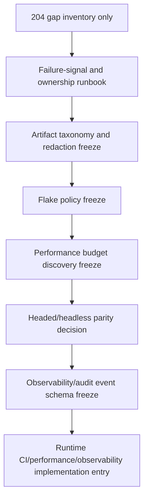

# CI Observability Gap Inventory

Status: planning/control gap inventory only for `ci_observability_gap_inventory_only`.

This document is a narrow follow-up to `201_CI_PERFORMANCE_OBSERVABILITY_ENTRY_FREEZE.md`, `202_CI_PERFORMANCE_OBSERVABILITY_ENTRY_CONTRACT.md`, and `203_POST_756_GOVERNANCE_CLOSEOUT.md`. It records the current-main CI/performance/observability gaps that must be resolved before any CI workflow, Playwright configuration, performance budget, observability runtime, audit-event runtime, metrics/log shipping, dashboard, artifact-retention, headed-browser CI, sharding, parallelism, route, DTO, model, migration, service, rendered UI, source, package, provider, connector, RAG/vector, mockup, auth/security, or frontend durable-authority implementation.

This pass admits no runtime behavior and changes no executable test or workflow. It is a referenceable inventory, not an implementation-entry freeze.

## Authority Snapshot

- authoritative remote: `project6-origin/main`
- governing freeze: `201_CI_PERFORMANCE_OBSERVABILITY_ENTRY_FREEZE.md`
- governing contract: `202_CI_PERFORMANCE_OBSERVABILITY_ENTRY_CONTRACT.md`
- post-chain closeout: `203_POST_756_GOVERNANCE_CLOSEOUT.md`
- current GitHub workflow: `.github/workflows/playwright.yml`
- current browser harness config: `playwright.config.js`
- current browser server harness: `backend/tests/review_browser_server.py`
- current checker: `tools/l3-progress-check.py`

Live source, workflow files, test files, routes, models, migrations, static UI files, and checker behavior outrank this inventory.

## Current Live CI And Browser Harness Posture

```yaml
current_live_posture:
  backend_layer3_api_job:
    workflow: .github/workflows/playwright.yml
    timeout_minutes: 20
    runner: ubuntu-latest
    python: '3.12'
    command: python -m pytest ./backend/tests/test_layer3_*.py -q
    status: live
  playwright_job:
    workflow: .github/workflows/playwright.yml
    timeout_minutes: 60
    runner: ubuntu-latest
    node: lts
    python: '3.12'
    browser_install: npx playwright install --with-deps chromium
    command: npx playwright test --project=chromium
    status: live
  playwright_config:
    config: playwright.config.js
    port: 8031
    fully_parallel: false
    workers: 1
    ci_retries: 2
    trace: on-first-retry
    reuse_existing_server: false
    reporter: html
    status: live
  artifact_posture:
    artifact: playwright-report
    retention_days: 30
    structured_runtime_receipt: false
    status: live_html_report_only
```

## Gap Identifiers

```yaml
gap_ids:
  - performance_budget_authority
  - flake_policy
  - headed_headless_parity
  - artifact_taxonomy_redaction
  - observability_event_schema
  - audit_trace_completeness
  - metrics_log_dashboard_target
  - runtime_isolation_scaling
  - secret_path_leakage
  - ownership_triage
```

## Gap Inventory

| Gap | Current evidence | Blocker | Required before implementation |
| --- | --- | --- | --- |
| Performance budget authority | Workflow echoes `playwright_browser_install_seconds` and `playwright_test_seconds` but asserts no budget. | No baseline, no allowed variance, no measurement owner, and no failure policy. | A later freeze must define measured segment, budget source, variance policy, CI/local applicability, and failure behavior. |
| Flake policy | Playwright retries on CI and runs serially, but no quarantine or classification policy is frozen. | A retry can hide intermittent failure without a durable flake ledger or owner. | A later freeze must define flake classification, quarantine/disable policy, re-enable criteria, and review surface. |
| Headed/headless parity | Local runbooks may compare headed/headless; CI currently runs one Chromium project. | No CI matrix decision, artifact cost model, or theme/responsive parity policy. | A later freeze must decide whether parity stays local-only or becomes CI-enforced, with port/state isolation proof. |
| Artifact taxonomy | CI uploads only `playwright-report` for 30 days. | No structured artifact naming, retention matrix, redaction model, or trace/screenshot/video policy. | A later freeze must define artifact families, retention, redaction, and failure-only vs always-on behavior. |
| Observability event schema | No Layer 3 CI/observability event runtime is admitted. | No event fields, redaction policy, run/session linkage, or response-safe receipt schema. | A later freeze must define server-authoritative event schema and prove it does not expose local paths, credentials, prompt/model internals, or browser storage. |
| Audit-trace completeness | Progress/proof manifests and checker guard planning state; they are not runtime audit events. | No completeness rule connecting CI jobs, API phases, rendered phases, artifacts, and package/export phases. | A later freeze must define what audit trace completeness means and how absence/failure is detected. |
| Metrics/log/dashboard target | Workflow logs are transient CI evidence; no metrics/log shipping/dashboard target is frozen. | No destination authority, access policy, retention policy, or operator use case. | A later freeze must name the destination or explicitly choose repo-local reports only. |
| Runtime isolation and scaling | Browser harness is fixed-port, single-worker, no existing server reuse. | Safe baseline does not yet scale to parallelism or sharding. | A later freeze must prove isolated state, port allocation, worker safety, and cleanup before changing workers/shards. |
| Secret and path leakage | Current docs forbid leakage, but no CI artifact/log redaction checker is admitted. | No scanner, no allowed/forbidden token pattern list, no artifact inspection policy. | A later freeze must define redaction scope and whether validation is local, CI, or both. |
| Ownership and triage | Current checks fail/pass but do not encode owner or severity. | No policy for who owns backend CI, browser harness CI, artifact failures, flake triage, or observability failures. | A later freeze must define owner surfaces and escalation/stop conditions. |

## Dependency Order



The order is conservative. Artifact and redaction policy should precede broader observability because telemetry without leakage rules is unsafe. Flake policy should precede budget enforcement because noisy tests make timing failures ambiguous. Headed/headless parity should follow the budget and flake decisions because it changes runtime cost and failure modes. Runtime observability should come last because it creates new durable surfaces.

## Candidate Future Passes

1. `ci_failure_signal_and_owner_runbook`: docs-only. Define how to interpret `backend-layer3-api` and `test` failures, who owns each surface, and when to stop vs retry.
2. `playwright_artifact_taxonomy_redaction_freeze`: planning/control. Define artifact families, retention, and leakage checks before any report/trace expansion.
3. `flake_policy_freeze`: planning/control. Define retry semantics, quarantine rules, and re-enable criteria before timing gates.
4. `performance_budget_discovery_freeze`: planning/control or measurement-only. Define what can be measured without enforcing a gate.
5. `headed_headless_parity_freeze`: planning/control. Decide local-only vs CI matrix and include `light`, `dark`, and `workbench` theme obligations if rendered behavior is assessed.
6. `observability_audit_event_schema_freeze`: planning/control. Define schema, redaction, storage, lifecycle, and receipt model before runtime instrumentation.
7. `ci_performance_observability_runtime_entry`: implementation-entry only after the prior authority decisions are frozen.

## Negative Invariants

- no CI workflow change;
- no Playwright configuration change;
- no backend or browser test dependency change;
- no test behavior change;
- no performance budget gate;
- no runtime timing assertion;
- no sharding or parallelism change;
- no headed browser CI matrix;
- no observability event runtime;
- no audit-event runtime;
- no metrics, log shipping, dashboard, or external telemetry target;
- no artifact retention policy change;
- no route/API behavior change;
- no DTO change;
- no model or migration change;
- no production service behavior change;
- no rendered UI control;
- no source expansion;
- no package mutation or reconstruction;
- no provider/public URL runtime;
- no connector or destination dispatch;
- no RAG/vector retrieval;
- no hidden LLM planning;
- no full mockup activation;
- no auth/security behavior change;
- no frontend-only durable authority;
- no local path, credential, token, prompt, metric payload, trace payload, provider URL, connector target, destination target, or browser storage leakage.

## Stop Condition

Stop before implementation if a proposed next task changes `.github/workflows/playwright.yml`, `playwright.config.js`, backend/browser test dependencies, runtime observability code, audit-event code, performance/timing gates, artifact retention behavior, headed CI, sharding, parallelism, rendered UI, route/DTO/model/migration/service behavior, source/package/provider/connector/RAG/mockup/auth behavior, or any durable frontend authority without a later exact implementation-entry freeze.
