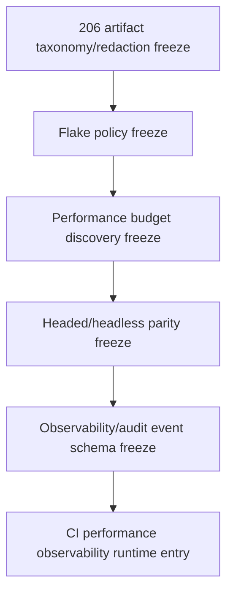

# Playwright Artifact Taxonomy Redaction Freeze

Status: planning/control freeze only for `playwright_artifact_taxonomy_redaction_freeze`.

This document is the narrow follow-up to `204_CI_OBSERVABILITY_GAP_INVENTORY.md` and `205_CI_FAILURE_SIGNAL_OWNER_RUNBOOK.md`. It freezes a referenceable artifact taxonomy and redaction boundary before any Playwright artifact expansion, trace/screenshot/video policy change, retention change, CI workflow change, Playwright configuration change, observability runtime, audit-event runtime, metrics/log shipping, dashboard, executable test behavior, route, DTO, model, migration, service, rendered UI, source, package, provider, connector, RAG/vector, mockup, auth/security, or frontend durable-authority implementation.

It admits no runtime behavior and changes no CI workflow, Playwright configuration, executable test, dependency, artifact upload behavior, or retention setting. Current main remains `playwright-report` upload only with 30-day retention and trace collection configured as `on-first-retry`.

## Authority Snapshot

- authoritative remote: `project6-origin/main`
- parent inventory: `204_CI_OBSERVABILITY_GAP_INVENTORY.md`
- parent runbook: `205_CI_FAILURE_SIGNAL_OWNER_RUNBOOK.md`
- governing freeze: `201_CI_PERFORMANCE_OBSERVABILITY_ENTRY_FREEZE.md`
- current workflow: `.github/workflows/playwright.yml`
- current Playwright config: `playwright.config.js`
- current checker: `tools/l3-progress-check.py`

Live workflow files, Playwright config, tests, source, GitHub check artifacts, and checker behavior outrank this freeze.

## Current Artifact Posture

```yaml
current_artifact_posture:
  uploaded_artifact_name: playwright-report
  uploaded_artifact_path: playwright-report/
  retention_days: 30
  reporter: html
  trace_policy: on-first-retry
  screenshot_policy: not_explicitly_enabled
  video_policy: not_explicitly_enabled
  structured_ci_receipt: not_implemented
  redaction_scanner: not_implemented
  status: live_html_report_only
```

## Frozen Artifact Families

These families are planning taxonomy labels only. They do not activate collection, upload, retention, or parsing.

| Artifact family | Current live status | Future admission requirement | Required redaction class |
| --- | --- | --- | --- |
| `html_report` | Live as `playwright-report/` upload for 30 days. | Already admitted only at current behavior. Any path/name/retention change requires later freeze. | `response_safe_ui_metadata_only` |
| `retry_trace` | Configured by Playwright as `trace: on-first-retry`; uploaded only insofar as it is part of current report behavior. | Any always-on trace, trace parsing, separate upload, or longer retention requires later freeze. | `trace_may_contain_dom_network_storage` |
| `screenshot` | Not explicitly enabled as a policy. | Any screenshot-on-failure or visual diff artifact requires later freeze with theme and sensitive-state rules. | `image_may_contain_ui_state` |
| `video` | Not explicitly enabled as a policy. | Any video capture or upload requires later freeze with retention, cost, and sensitive-state rules. | `video_may_contain_ui_state` |
| `server_log` | Not uploaded as a structured artifact. | Any server log artifact requires later freeze with path/secret/token redaction. | `log_may_contain_paths_env_errors` |
| `api_payload_receipt` | Not implemented. | Any request/response receipt requires later freeze with schema, allowlist, and payload elision rules. | `payload_may_contain_source_package_prompt_or_auth_data` |
| `performance_timing_receipt` | Not implemented beyond transient workflow echo lines. | Any durable timing artifact requires later performance budget discovery freeze. | `timing_metadata_only` |
| `observability_event_receipt` | Not implemented. | Any durable observability event requires later observability/audit schema freeze. | `event_schema_allowlist_only` |

## Redaction Boundary

```yaml
redaction_boundary:
  forbidden_in_artifacts:
    - local filesystem paths outside repo-relative safe labels
    - credentials or bearer tokens
    - proxy identity headers or auth internals
    - provider URLs or storage object URLs not explicitly admitted
    - connector targets or destination targets not explicitly admitted
    - source credential material
    - raw package payload bodies unless explicitly admitted
    - prompt text or model/provider internals
    - browser storage secrets
    - environment variable values except approved non-secret labels
    - database connection strings
    - arbitrary API request or response bodies
  allowed_without_later_freeze:
    - check name
    - workflow run URL
    - PR number
    - branch name
    - response-safe failure code
    - response-safe failure phase
    - repo-relative file label
    - test title
    - artifact family label
    - retention label for current playwright-report only
```

## Admission Rules For Later Passes

A future artifact or redaction implementation-entry freeze must name exactly one selected mode and prove:

1. artifact family being changed;
2. collection trigger: always, failure-only, retry-only, manual-only, or local-only;
3. upload path and retention;
4. whether the artifact is CI, local, or both;
5. schema or file format;
6. redaction method and forbidden-pattern list;
7. whether traces/screenshots/videos can contain rendered source, package, connector, auth, browser storage, prompt, or provider state;
8. who reviews leakage failures;
9. headed/headless and `light`, `dark`, and `workbench` theme obligations if rendered artifacts change;
10. negative side effects that remain absent.

## Dependency Order



Artifact taxonomy and redaction precede flake and performance policy because failure triage and timing evidence should not expand retained artifacts without leakage boundaries. Observability runtime remains later because it creates durable event surfaces beyond current HTML report evidence.

## Negative Invariants

- no CI workflow change;
- no Playwright configuration change;
- no backend or browser dependency change;
- no executable test change;
- no artifact upload behavior change;
- no artifact retention change;
- no trace policy change;
- no screenshot policy change;
- no video policy change;
- no server-log artifact creation;
- no API payload receipt artifact;
- no performance timing receipt artifact;
- no observability event receipt artifact;
- no redaction scanner runtime;
- no metrics/log shipping or dashboard;
- no performance budget or timing gate;
- no flake quarantine runtime;
- no headed-browser CI matrix;
- no sharding or parallelism;
- no route/API/DTO/model/migration/service behavior change;
- no rendered UI control;
- no source expansion;
- no package mutation or reconstruction;
- no provider/public URL runtime;
- no connector/destination dispatch;
- no RAG/vector retrieval;
- no hidden LLM planning;
- no full mockup activation;
- no auth/security behavior change;
- no frontend-only durable authority.

## Stop Condition

Stop before implementation if a proposed next task changes artifact collection, upload, retention, trace/screenshot/video policy, server logs, request/response receipts, performance timing receipts, observability/audit receipts, redaction scanning, CI workflows, Playwright config, tests, dependencies, route/DTO/model/migration/service behavior, rendered UI, source/package/provider/connector/RAG/mockup/auth behavior, or frontend durable authority without a later exact implementation-entry freeze.
