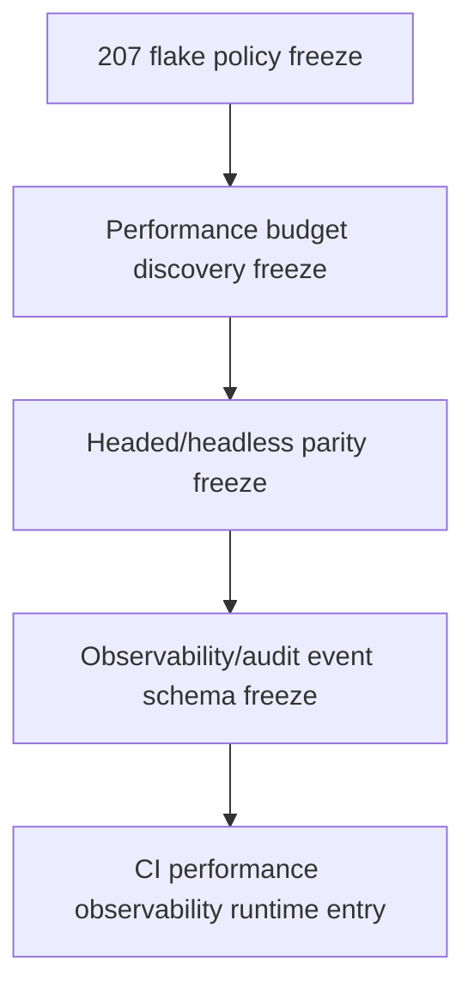

# Flake Policy Freeze

Status: planning/control freeze only for `flake_policy_freeze`.

This document is the narrow follow-up to `206_PLAYWRIGHT_ARTIFACT_TAXONOMY_REDACTION_FREEZE.md`. It freezes how current-main CI retry-pass and intermittent failures should be classified before any flake quarantine runtime, automatic rerun bot, performance budget, headed/headless matrix, sharding, parallelism, observability event runtime, audit-event runtime, CI workflow change, Playwright configuration change, executable test behavior change, dependency change, route, DTO, model, migration, service, rendered UI, source, package, provider, connector, RAG/vector, mockup, auth/security, or frontend durable-authority implementation.

It admits no runtime behavior and changes no CI workflow, Playwright configuration, retry count, worker count, executable test, dependency, artifact policy, quarantine rule, or branch protection. Current main remains a serial Chromium Playwright job with `retries: process.env.CI ? 2 : 0` and a focused backend Layer 3 pytest job.

## Authority Snapshot

- authoritative remote: `project6-origin/main`
- parent artifact freeze: `206_PLAYWRIGHT_ARTIFACT_TAXONOMY_REDACTION_FREEZE.md`
- parent runbook: `205_CI_FAILURE_SIGNAL_OWNER_RUNBOOK.md`
- parent gap inventory: `204_CI_OBSERVABILITY_GAP_INVENTORY.md`
- current workflow: `.github/workflows/playwright.yml`
- current Playwright config: `playwright.config.js`
- current checker: `tools/l3-progress-check.py`

Live workflow files, Playwright config, tests, GitHub check attempts, source, and checker behavior outrank this freeze.

## Current Retry Posture

```yaml
current_retry_posture:
  backend_layer3_api_retry_policy: no_explicit_pytest_retry
  playwright_retry_policy: retries_on_ci_only
  playwright_ci_retries: 2
  playwright_local_retries: 0
  workers: 1
  fully_parallel: false
  quarantine_runtime: not_implemented
  automatic_rerun_bot: not_implemented
  flake_ledger_runtime: not_implemented
  status: classification_only
```

## Flake Classification Vocabulary

```yaml
flake_classification:
  deterministic_failure:
    meaning: same command or same test fails consistently without repo-external cause
    merge_posture: block_until_fixed
  infrastructure_noise:
    meaning: package registry, GitHub runner, cancellation, or browser install infrastructure failure with explicit log evidence
    merge_posture: one_rerun_allowed
  candidate_flake:
    meaning: first attempt fails and retry passes, or failure cannot yet be reproduced but has no clear infrastructure cause
    merge_posture: inspect_attempt_evidence_before_merge
  recurring_flake:
    meaning: same test, phase, selector, or setup path has candidate flake evidence on more than one PR or main run
    merge_posture: block_new_scope_until_policy_or_fix
  unknown_intermittent:
    meaning: intermittent failure without enough preserved evidence for infrastructure or product classification
    merge_posture: stop_and_collect_evidence
```

## Merge Rules

| Classification | Merge allowed? | Required evidence | Required action |
| --- | --- | --- | --- |
| `deterministic_failure` | No. | Failing check URL, command, test/step, and failure text. | Fix or revert the causative change before merge. |
| `infrastructure_noise` | Yes after one successful rerun. | External package/runner/install/cancellation evidence. | Record rerun reason in the PR closeout. |
| `candidate_flake` | Conditionally. | First failed attempt, retry pass, trace/report availability, and affected test/phase. | Inspect before merge; repeated occurrence becomes `recurring_flake`. |
| `recurring_flake` | No for unrelated new scope. | At least two matching candidate flakes or a repeated timeout phase. | Freeze or implement a narrow flake fix before new capability/planning expansion. |
| `unknown_intermittent` | No. | Incomplete or ambiguous evidence. | Preserve logs/artifacts and classify before merge. |

## Rerun Boundary

A single rerun is acceptable only for:

- external package registry failure;
- GitHub runner stall or cancellation;
- transient Playwright browser install infrastructure failure;
- candidate flake where retry evidence is part of classification and no recurring pattern is known.

A rerun is not acceptable as a substitute for a fix when there is:

- deterministic pytest failure;
- deterministic Playwright assertion failure;
- application startup traceback;
- checker/proof/manifest failure;
- repeated timeout in the same phase;
- repeated selector or rendered state failure;
- recurring flake evidence.

## Evidence Ledger For Flake Reports

A flake report should preserve:

- PR number, branch, and commit;
- check name and workflow run URL;
- failed attempt number and retry result;
- failing command, test title, step, selector, or setup phase;
- whether trace/report was available under the current artifact policy;
- classification vocabulary value;
- whether the same class was seen before;
- merge decision and justification.

## Non-Admission

This freeze admits no:

- CI workflow change;
- Playwright configuration change;
- retry count change;
- no retry count change;
- worker count change;
- sharding or parallelism;
- executable test change;
- dependency change;
- automatic rerun bot;
- quarantine runtime;
- skip/xfail policy change;
- branch protection change;
- CODEOWNERS change;
- artifact upload or retention change;
- trace/screenshot/video policy change;
- performance budget or timing gate;
- headed-browser CI matrix;
- observability event runtime;
- audit-event runtime;
- metrics/log shipping or dashboard;
- route/API/DTO/model/migration/service behavior change;
- rendered UI control;
- source expansion;
- package mutation or reconstruction;
- provider/public URL runtime;
- connector/destination dispatch;
- RAG/vector retrieval;
- hidden LLM planning;
- full mockup activation;
- auth/security behavior change;
- frontend-only durable authority.

## Dependency Order



Flake policy precedes performance budget discovery because timing gates are not meaningful until retry-pass and intermittent failures have a classification rule. Headed/headless parity follows performance discovery because it changes runtime cost. Observability/audit schema remains later because it creates durable event surfaces.

## Stop Condition

Stop before implementation if a proposed next task changes retry behavior, quarantine behavior, rerun automation, skip/xfail behavior, workflow jobs, Playwright config, tests, dependencies, artifacts, performance gates, headed CI, sharding, observability runtime, audit-event runtime, route/DTO/model/migration/service behavior, rendered UI, source/package/provider/connector/RAG/mockup/auth behavior, or frontend durable authority without a later exact implementation-entry freeze.
