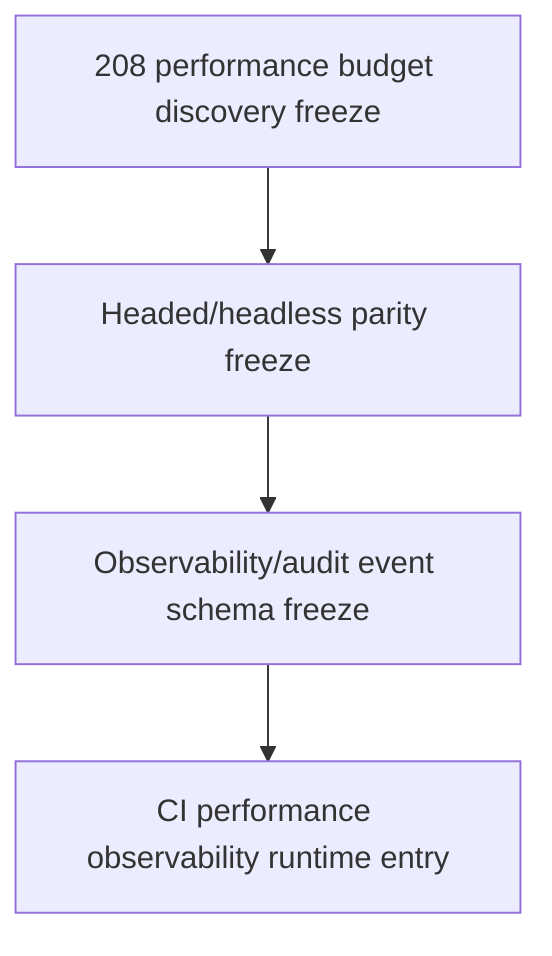

# Performance Budget Discovery Freeze

Status: planning/control freeze only for `performance_budget_discovery_freeze`.

This document is the narrow follow-up to `207_FLAKE_POLICY_FREEZE.md`. It defines what a later Layer 3 CI/performance discovery pass would have to measure and prove before any performance budget gate, timing assertion, workflow timeout change, Playwright configuration change, headed/headless matrix, sharding, parallelism, observability event runtime, audit-event runtime, metrics/log shipping, dashboard, executable test behavior, route, DTO, model, migration, service, rendered UI, source, package, provider, connector, RAG/vector, mockup, auth/security, or frontend durable-authority implementation.

It admits no runtime behavior and changes no CI workflow, Playwright configuration, timeout, retry, worker count, executable test, dependency, artifact policy, metric collection, or performance gate. The existing workflow echo lines for `playwright_browser_install_seconds` and `playwright_test_seconds` remain transient log hints only; they are not a budget, baseline, SLO, or merge gate.

## Authority Snapshot

- authoritative remote: `project6-origin/main`
- parent flake freeze: `207_FLAKE_POLICY_FREEZE.md`
- parent artifact freeze: `206_PLAYWRIGHT_ARTIFACT_TAXONOMY_REDACTION_FREEZE.md`
- current workflow: `.github/workflows/playwright.yml`
- current Playwright config: `playwright.config.js`
- current checker: `tools/l3-progress-check.py`

Live workflow files, Playwright config, tests, GitHub check results, source, and checker behavior outrank this freeze.

## Current Timing Posture

```yaml
current_timing_posture:
  backend_layer3_api_timeout_minutes: 20
  playwright_job_timeout_minutes: 60
  browser_install_echo: playwright_browser_install_seconds
  playwright_test_echo: playwright_test_seconds
  timing_gate: not_implemented
  timing_baseline: not_implemented
  variance_policy: not_implemented
  performance_budget_owner: not_implemented
  metrics_artifact: not_implemented
  status: transient_log_hints_only
```

## Discovery Segments

These segment labels are planning-only. They do not activate timing collection or gates.

| Segment | Current evidence | Future measurement requirement | Gate status now |
| --- | --- | --- | --- |
| `backend_layer3_api_pytest_duration` | The backend job runs `python -m pytest ./backend/tests/test_layer3_*.py -q` with a 20-minute job timeout. | Later freeze must define duration source, repeat count, variance, and owner. | `not_admitted` |
| `npm_install_duration` | The Playwright job runs `npm ci`. | Later freeze must decide whether dependency install time is budgeted or treated as infrastructure noise. | `not_admitted` |
| `browser_harness_dependency_install_duration` | The job installs browser harness Python requirements. | Later freeze must separate dependency install time from test runtime. | `not_admitted` |
| `playwright_browser_install_duration` | The workflow echoes `playwright_browser_install_seconds`. | Later freeze must classify browser install as infra, cache, or budgeted segment. | `not_admitted` |
| `playwright_test_duration` | The workflow echoes `playwright_test_seconds`. | Later freeze must define test-only timing source and variance policy. | `not_admitted` |
| `review_browser_server_startup_duration` | Playwright webServer has a 120000 ms startup timeout. | Later freeze must define startup measurement and failure classification before gating. | `not_admitted` |
| `rendered_layer3_path_duration` | No current durable per-flow timing receipt. | Later freeze must define server/browser phase boundaries before timing rendered paths. | `not_admitted` |

## Required Future Budget Contract

A later implementation-entry freeze for any budget or timing gate must define:

1. selected segment or segments;
2. measurement source: CI log, Playwright reporter, server receipt, or other named source;
3. baseline collection method and sample count;
4. allowed variance and platform assumptions;
5. local vs CI applicability;
6. retry and flake interaction;
7. artifact family and retention;
8. redaction posture;
9. owner for budget review;
10. failure action: warn, block, quarantine, or report-only;
11. no-cross-scope proof that timing does not admit source/package/provider/connector/RAG/mockup/auth behavior.

## Non-Admission

This freeze admits no:

- CI workflow change;
- Playwright configuration change;
- timeout change;
- retry count change;
- worker count change;
- sharding or parallelism;
- executable test change;
- dependency change;
- performance budget gate;
- no performance budget gate;
- runtime timing assertion;
- durable timing artifact;
- no durable timing artifact;
- metrics/log shipping or dashboard;
- observability event runtime;
- audit-event runtime;
- artifact upload or retention change;
- trace/screenshot/video policy change;
- flake quarantine runtime;
- headed-browser CI matrix;
- route/API/DTO/model/migration/service behavior change;
- rendered UI control;
- source expansion;
- package mutation or reconstruction;
- provider/public URL runtime;
- connector/destination dispatch;
- RAG/vector retrieval;
- hidden LLM planning;
- full mockup activation;
- auth/security behavior change;
- frontend-only durable authority.

## Dependency Order



Performance discovery precedes headed/headless parity because adding browser modes changes test cost and timing behavior. Observability/audit schema remains later because durable runtime events require measurement and redaction authority first.

## Stop Condition

Stop before implementation if a proposed next task changes workflow timing, job timeouts, Playwright timeouts, retries, workers, sharding, performance thresholds, timing assertions, durable timing artifacts, metrics, observability runtime, audit-event runtime, tests, dependencies, artifacts, headed CI, route/DTO/model/migration/service behavior, rendered UI, source/package/provider/connector/RAG/mockup/auth behavior, or frontend durable authority without a later exact implementation-entry freeze.
