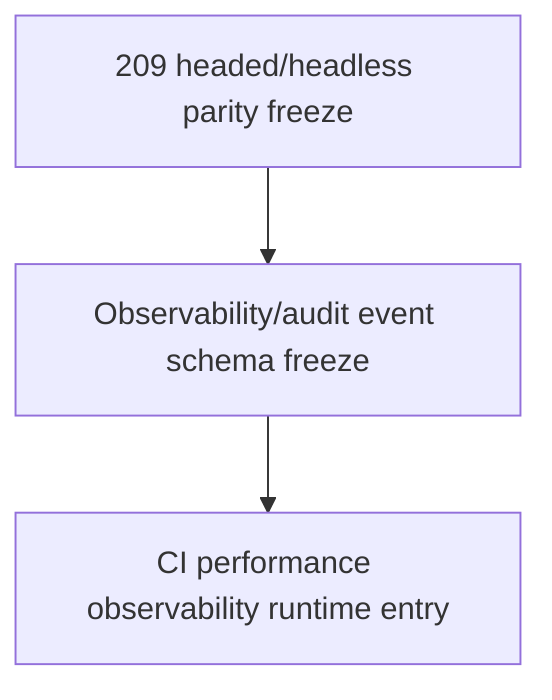

# Headed Headless Parity Freeze

Status: planning/control freeze only for `headed_headless_parity_freeze`.

This document is the narrow follow-up to `208_PERFORMANCE_BUDGET_DISCOVERY_FREEZE.md`. It freezes the requirements for any later headed/headless browser parity expansion before changing Playwright projects, CI browser matrix, headed-browser CI, theme proof, visual artifacts, screenshots, videos, trace policy, sharding, parallelism, performance budgets, observability event runtime, audit-event runtime, workflow jobs, Playwright configuration, executable tests, route, DTO, model, migration, service, rendered UI, source, package, provider, connector, RAG/vector, mockup, auth/security, or frontend durable authority.

It admits no runtime behavior and changes no CI workflow, Playwright configuration, browser project, headed mode, executable test, dependency, artifact policy, theme behavior, or rendered UI. Current main remains one serial Chromium project using `devices['Desktop Chrome']`, `workers: 1`, `fullyParallel: false`, fixed port `8031`, and CI headless execution under the existing Playwright runner behavior.

## Authority Snapshot

- authoritative remote: `project6-origin/main`
- parent performance freeze: `208_PERFORMANCE_BUDGET_DISCOVERY_FREEZE.md`
- parent flake freeze: `207_FLAKE_POLICY_FREEZE.md`
- parent artifact freeze: `206_PLAYWRIGHT_ARTIFACT_TAXONOMY_REDACTION_FREEZE.md`
- current Playwright config: `playwright.config.js`
- current workflow: `.github/workflows/playwright.yml`
- current checker: `tools/l3-progress-check.py`

Live workflow files, Playwright config, rendered UI source, tests, browser artifacts, GitHub check results, and checker behavior outrank this freeze.

## Current Browser Mode Posture

```yaml
current_browser_mode_posture:
  ci_project_count: 1
  ci_project_name: chromium
  ci_device_profile: Desktop Chrome
  headed_ci_matrix: not_implemented
  headed_local_runbook: operator_only_when_needed
  headless_ci_run: current_playwright_default
  workers: 1
  fully_parallel: false
  fixed_port: 8031
  theme_matrix_runtime: not_implemented
  visual_diff_runtime: not_implemented
  status: single_chromium_project_only
```

## Theme And UI Obligations For Later Changes

Any later rendered/browser implementation-entry freeze must explicitly classify the affected UI surfaces under:

```yaml
theme_obligations:
  required_theme_labels:
    - light
    - dark
    - workbench
  required_state_labels:
    - default
    - loading
    - disabled
    - error
    - focused
  required_viewport_labels:
    - desktop
    - narrow_or_mobile_if_surface_is_responsive
  forbidden_authority:
    - browser-local state as durable workflow authority
    - screenshot-only proof of server-side state
    - theme-specific durable authority divergence
```

These obligations are not active tests in this pass. They are the minimum future contract if rendered controls, visual artifacts, headed/headless CI, or browser proof scope changes.

## Parity Admission Requirements

A later headed/headless parity implementation-entry freeze must name exactly one selected mode and prove:

1. whether parity is local-only, CI-enforced, or both;
2. browser mode: headed Chromium, headless Chromium, or additional browser project;
3. exact Playwright config changes;
4. workflow job/matrix changes and expected runtime cost;
5. port and isolated runtime-state strategy;
6. artifact family and redaction posture;
7. theme/state/viewport coverage;
8. flake and timeout classification;
9. performance measurement impact;
10. no frontend-only durable authority;
11. no hidden source/package/provider/connector/RAG/mockup/auth expansion.

## Non-Admission

This freeze admits no:

- CI workflow change;
- Playwright configuration change;
- browser project change;
- headed-browser CI matrix;
- no headed-browser CI matrix;
- headed mode runtime;
- worker count change;
- sharding or parallelism;
- fixed-port behavior change;
- executable test change;
- dependency change;
- artifact upload or retention change;
- trace/screenshot/video policy change;
- visual diff runtime;
- theme test runtime;
- rendered UI control;
- browser-local durable authority;
- frontend-only durable authority;
- performance budget or timing gate;
- flake quarantine runtime;
- observability event runtime;
- audit-event runtime;
- metrics/log shipping or dashboard;
- route/API/DTO/model/migration/service behavior change;
- source expansion;
- package mutation or reconstruction;
- provider/public URL runtime;
- connector/destination dispatch;
- RAG/vector retrieval;
- hidden LLM planning;
- full mockup activation;
- auth/security behavior change.

## Dependency Order



Headed/headless parity remains before observability/audit schema because browser-mode expansion changes what evidence and artifacts may be produced. Observability runtime remains later because durable events must depend on already-frozen artifact, flake, performance, and browser parity boundaries.

## Stop Condition

Stop before implementation if a proposed next task changes browser modes, Playwright projects, headed CI, theme tests, visual artifacts, screenshot/video policy, workflow matrix, workers, sharding, fixed-port behavior, performance gates, observability runtime, audit-event runtime, executable tests, dependencies, route/DTO/model/migration/service behavior, rendered UI, source/package/provider/connector/RAG/mockup/auth behavior, or frontend durable authority without a later exact implementation-entry freeze.
