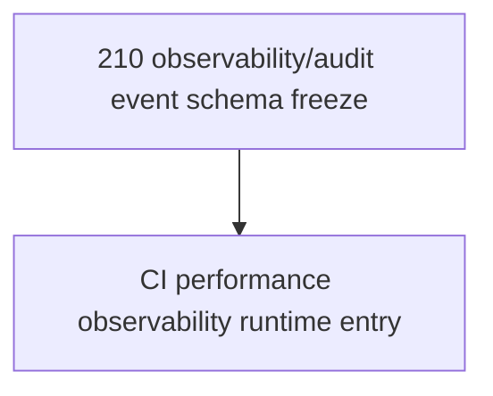

# Observability Audit Event Schema Freeze

Status: planning/control freeze only for `observability_audit_event_schema_freeze`.

This document is the narrow follow-up to `209_HEADED_HEADLESS_PARITY_FREEZE.md`. It freezes the schema boundaries and redaction requirements that any later Layer 3 CI/performance/observability runtime would need before adding durable observability events, audit-event runtime, telemetry receipts, metrics/log shipping, dashboards, CI workflow changes, Playwright configuration changes, artifact expansion, timing gates, headed/browser matrix changes, executable tests, route, DTO, model, migration, service, rendered UI, source, package, provider, connector, RAG/vector, mockup, auth/security, or frontend durable authority.

It admits no runtime behavior and changes no route, DTO, model, migration, service, CI workflow, Playwright config, executable test, dependency, artifact policy, metrics/log target, event writer, audit table, browser storage, or dashboard. Observability and audit events remain not implemented for this Layer 3 CI/performance lane.

## Authority Snapshot

- authoritative remote: `project6-origin/main`
- parent headed/headless freeze: `209_HEADED_HEADLESS_PARITY_FREEZE.md`
- parent performance freeze: `208_PERFORMANCE_BUDGET_DISCOVERY_FREEZE.md`
- parent artifact freeze: `206_PLAYWRIGHT_ARTIFACT_TAXONOMY_REDACTION_FREEZE.md`
- current workflow: `.github/workflows/playwright.yml`
- current Playwright config: `playwright.config.js`
- current checker: `tools/l3-progress-check.py`

Live source, routes, models, migrations, workflow files, Playwright config, tests, artifacts, GitHub check results, and checker behavior outrank this freeze.

## Current Observability Posture

```yaml
current_observability_posture:
  ci_observability_event_runtime: not_implemented
  ci_observability_audit_event_runtime: not_implemented
  metrics_log_shipping: not_implemented
  dashboard: not_implemented
  telemetry_receipt_artifact: not_implemented
  ci_observability_event_storage_table: not_implemented
  ci_observability_event_writer_service: not_implemented
  existing_signed_reference_audit_event_runtime: out_of_scope_existing_runtime
  existing_signed_reference_audit_event_storage_table: out_of_scope_existing_runtime
  browser_storage_authority: not_admitted
  status: schema_boundary_only
```

## Future Event Schema Allowlist

A later implementation-entry freeze may admit only response-safe fields from this allowlist unless it explicitly narrows and proves a different schema:

```yaml
future_event_schema_allowlist:
  required_identity_fields:
    - schema_id
    - schema_version
    - event_id
    - event_family
    - event_name
    - emitted_at_utc
  allowed_correlation_fields:
    - pr_number
    - branch_name
    - commit_sha
    - workflow_run_id
    - check_name
    - job_name
    - test_title
    - phase_label
    - route_label
    - session_ref
    - package_ref
    - artifact_family
  allowed_status_fields:
    - status
    - response_safe_failure_code
    - response_safe_failure_reason
    - retry_attempt
    - flake_classification
    - duration_ms
    - threshold_label
    - owner_label
  allowed_hash_fields:
    - policy_hash
    - artifact_hash
    - payload_shape_hash
  forbidden_authority_fields:
    - browser_local_state
    - raw_request_body
    - raw_response_body
    - raw_package_payload
    - prompt_text
    - model_provider_internal
    - credential_value
    - bearer_token
    - proxy_identity_header
    - database_url
    - local_absolute_path
    - provider_url
    - connector_target
    - destination_target
```

## Audit Completeness Questions Still Unresolved

These questions must be answered before runtime instrumentation:

1. Which event family is first: CI check receipt, browser proof receipt, performance receipt, artifact receipt, or runtime API audit receipt?
2. Is storage repo-local artifact, database row, CI artifact, or external telemetry target?
3. What is the retention policy?
4. What is the redaction scanner or review mechanism?
5. What event absence is a failure?
6. Which owner reviews event schema failures?
7. How are retries and flakes represented without hiding first-attempt failures?
8. How are headed/headless and theme labels represented without treating screenshots/browser state as durable authority?
9. How are source/package/provider/connector/RAG/mockup/auth surfaces explicitly excluded unless admitted by their own freeze?

## Non-Admission

This freeze admits no:

- observability event runtime;
- no observability event runtime;
- CI/performance/observability audit-event runtime;
- CI/performance/observability event writer service;
- CI/performance/observability event storage table;
- telemetry receipt artifact;
- metrics/log shipping;
- dashboard;
- CI workflow change;
- Playwright configuration change;
- executable test change;
- dependency change;
- artifact upload or retention change;
- trace/screenshot/video policy change;
- performance budget or timing gate;
- headed-browser CI matrix;
- sharding or parallelism;
- route/API/DTO/model/migration/service behavior change;
- rendered UI control;
- browser-local durable authority;
- frontend-only durable authority;
- source expansion;
- package mutation or reconstruction;
- provider/public URL runtime;
- connector/destination dispatch;
- RAG/vector retrieval;
- hidden LLM planning;
- full mockup activation;
- auth/security behavior change.

## Dependency Order



This is the last planning prerequisite in the current CI/performance/observability chain before a future runtime-entry decision. That runtime decision must still choose exactly one narrow mode and may still decide to remain planning-only.

## Stop Condition

Stop before implementation if a proposed next task writes events, creates event storage, changes routes/DTOs/models/migrations/services, changes CI workflows, changes Playwright config, adds telemetry/artifacts/metrics/dashboards, changes tests/dependencies, changes browser modes, adds timing gates, modifies rendered UI, or admits source/package/provider/connector/RAG/mockup/auth/frontend durable authority without a later exact implementation-entry freeze.
