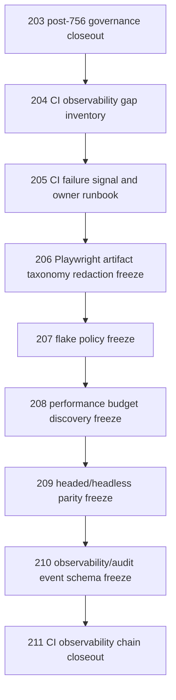

# CI Observability Chain Closeout

Status: current-main planning/control closeout for the CI/performance/observability prerequisite chain.

This document records that the post-756 CI/performance/observability planning chain has been carried through the bounded prerequisite freezes selected by `203_POST_756_GOVERNANCE_CLOSEOUT.md` and `204_CI_OBSERVABILITY_GAP_INVENTORY.md`. It does not implement runtime behavior, change CI, change Playwright configuration, add tests, add routes, change DTOs, edit models or migrations, change production services, add rendered UI controls, add CI/performance/observability events, add CI/performance/observability audit events, add metrics/log shipping, add dashboards, alter artifacts, activate headed CI, add performance gates, mutate packages, expand sources, activate provider/public URLs, dispatch connectors/destinations, activate RAG/vector behavior, activate full mockups, change auth/security behavior, or create frontend-only durable authority. Existing signed-reference audit-event runtime remains out of scope for this CI/performance/observability closeout.

## Authority Snapshot

- authoritative remote: `project6-origin/main`
- upstream closeout: `203_POST_756_GOVERNANCE_CLOSEOUT.md`
- current prerequisite chain: docs `204` through `210`
- current checker: `tools/l3-progress-check.py`
- current progress surfaces: `next_milestone_plans/layer3_progress_board.md`, `next_milestone_plans/layer3_progress_manifest.json`, and `next_milestone_plans/layer3_workbench_proof_manifest.json`

Live source, tests, routes, models, migrations, workflow files, Playwright config, rendered UI files, GitHub check results, and checker behavior outrank this closeout.

## Completed CI/Observability Planning Chain



The common selected posture remains:

```yaml
entry_decision: deferred
selected_runtime_mode: null
runtime_status: not_implemented
implementation_entry_required_before_runtime: true
```

## What Is Now Frozen

The following current-main reference boundaries now exist:

1. CI gap inventory and dependency order;
2. failure signal classification, logical owner labels, rerun limits, merge stop rules;
3. Playwright artifact taxonomy and redaction boundary;
4. flake classification vocabulary and retry-pass handling;
5. performance budget discovery segments and future budget contract;
6. headed/headless parity requirements, including `light`, `dark`, and `workbench` theme obligations;
7. observability/audit event schema allowlist and forbidden authority fields.

These are planning/control boundaries only. They preserve current CI behavior while preventing accidental runtime expansion.

## Current Live Behavior Preserved

This closeout preserves:

- current `backend-layer3-api` job running `python -m pytest ./backend/tests/test_layer3_*.py -q`;
- current `test` job running `npx playwright test --project=chromium`;
- current single Chromium project;
- current `workers: 1` and `fullyParallel: false` posture;
- current fixed port `8031` browser harness posture;
- current `trace: on-first-retry` setting;
- current `playwright-report` upload with 30-day retention;
- current absence of durable observability/audit event runtime;
- current checker/progress/proof guardrails.

## Current Non-Admissions

This closeout admits no:

- CI workflow change;
- Playwright configuration change;
- executable test change;
- dependency change;
- retry count change;
- worker count change;
- sharding or parallelism;
- headed-browser CI matrix;
- fixed-port behavior change;
- artifact upload or retention change;
- trace/screenshot/video policy change;
- server-log artifact;
- API payload receipt;
- performance timing receipt;
- observability event receipt;
- redaction scanner runtime;
- flake quarantine runtime;
- performance budget gate;
- runtime timing assertion;
- visual diff runtime;
- theme test runtime;
- observability event runtime;
- CI/performance/observability audit-event runtime;
- CI/performance/observability event writer service;
- CI/performance/observability event storage table;
- metrics/log shipping;
- dashboard;
- route/API/DTO/model/migration/service behavior change;
- rendered UI control;
- browser-local durable authority;
- frontend-only durable authority;
- source expansion;
- package mutation or reconstruction;
- provider/public URL runtime;
- connector/destination dispatch;
- RAG/vector retrieval;
- hidden LLM planning;
- full mockup activation;
- auth/security behavior change.

## Implementation Entry Rule

No future CI/performance/observability implementation may start directly from this closeout. A later exact implementation-entry freeze remains required before any runtime work. A later implementation-entry freeze must choose exactly one selected mode and prove:

- owner workflow, route, service, rendered control, artifact, event, or config surface;
- exact CI workflow or Playwright configuration change if any;
- request/config schema and response/artifact/event schema;
- DB rows read and written, if any;
- files/artifacts read and written;
- idempotency, concurrency, retry, and flake behavior;
- artifact retention and redaction behavior;
- headed/headless and `light`, `dark`, `workbench` theme obligations if browser/rendered scope changes;
- negative side effects that must remain absent;
- proof-checker and progress/proof manifest updates.

## Next Implementation-Eligible Decision

The next pass should not be broad runtime implementation. It should be one of:

1. `ci_performance_observability_runtime_entry_freeze_update` if there is a concrete need to implement one narrow CI/observability runtime mode;
2. `ci_observability_no_runtime_closeout` if the correct decision is to keep all CI/performance/observability work planning-only for now;
3. `provider_public_url_authority_discovery_freeze_or_entry_freeze_update` if downstream delivery, not CI reliability, is the next concrete blocker;
4. `connector_destination_authority_discovery_freeze_or_entry_freeze_update` if direct downstream dispatch is the next concrete blocker;
5. `source_breadth_authority_discovery_freeze_or_entry_freeze_update` if new source families are the next concrete blocker.

## Stop Condition

Stop before implementation if a proposed next task changes CI workflows, Playwright config, executable tests, dependencies, retry/worker/sharding behavior, browser modes, artifacts, timing gates, flake quarantine behavior, CI/performance/observability events, CI/performance/observability audit events, metrics/log shipping, dashboards, routes, DTOs, models, migrations, services, rendered UI, source/package/provider/connector/RAG/mockup/auth behavior, or frontend durable authority without a later exact implementation-entry freeze.
