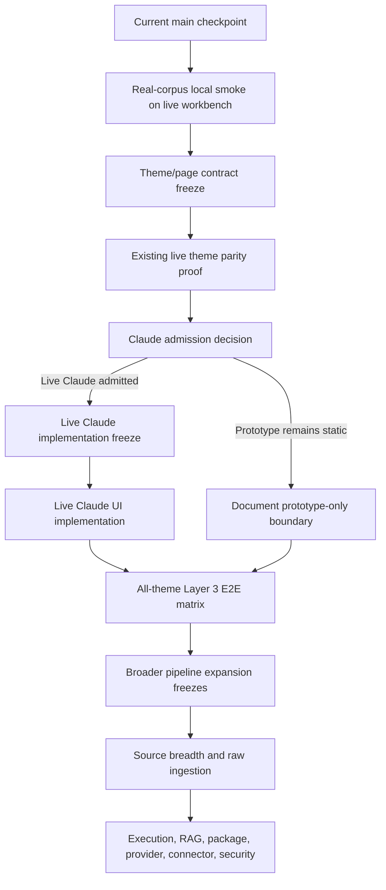

# Layer 3 Theme Pipeline Roadmap

Status: planning/control reference for theme-complete Layer 3 pipeline readiness.

This document plans from current main to a Layer 3 pipeline that can be exercised end to end through every admitted review page and every admitted theme, including a future live Claude theme only if that theme is explicitly admitted by a separate implementation-entry freeze. It does not implement or admit runtime behavior by itself.

## Authority Snapshot

- live authority: `project6-origin/main`
- audit anchor: `f956686b45337112d5cd1e28f5e1cfe28dac055f`
- live workbench route: `/review/layer3`
- static Claude prototype route: `/review/layer3/static/claude.html`
- governing raw mixed rendered UI docs: `155_RAW_MIXED_RENDERED_UI_FREEZE.md` and `156_RAW_MIXED_RENDERED_UI_CONTRACT.md`
- provider-private backend/API status doc: `233_PROVIDER_PRIVATE_SIGNED_URL_PREPARE_STATUS_API.md`
- proof/checker authority: `tools/l3-progress-check.py`, progress manifests, source, tests, and actual route behavior

Live source, tests, migrations, models, routes, and proof-checker behavior outrank this roadmap. This roadmap must not be used as proof that any future pass is live.

## Current Main Boundary

Current main admits a live rendered `/review/layer3` workbench using existing source authority and server-owned raw mixed materialization. The live workbench can expose and drive bounded Layer 3 flow controls for admitted `dataset_version` and `aps_content_document` source classes, including material preview, Gate B, Gate C, plan, execution, result review, package review, handoff/export, APS handoff dispatch, external export/download prepare, same-origin delivery, and same-origin signed-reference delivery where the server authority gates are satisfied.

Current main also admits backend/API-only provider-private signed URL prepare/status over existing external export/download readiness authority.

Current main does not admit arbitrary local-directory ingestion, upload ingestion, broad parser/OCR behavior, source adapter registry expansion, web connector retrieval, RAG/vector retrieval, broad package mutation/reconstruction, real connector/destination dispatch, provider network writes, provider-public URLs, hidden LLM planning, full mockup activation, or auth/security behavior changes.

The Claude route is currently a standalone static prototype/sample-state surface. It is reachable from the theme selector by redirect, but it is not a live pipeline skin over the same `/review/layer3` runtime. It must stay prototype-only until a dedicated freeze admits a live Claude implementation.

## Target State

The target state is:

- a single server-authoritative Layer 3 pipeline contract shared by all rendered themes;
- theme-specific presentation with no request payload, DB, artifact, source, package, provider, connector, or auth differences;
- all admitted review pages clearly classified as live runtime, static prototype, manual runbook surface, or deferred;
- headed and headless browser proof for every admitted live theme/page combination that can drive Layer 3 state;
- manual local real-corpus runbook coverage for operator inspection without implying unsupported arbitrary-folder ingestion;
- explicit no-go boundaries for deferred source, execution, package, delivery, provider, connector, mockup, and security categories.

## Cross-Cutting Engineering Guardrails

Every pass in this roadmap must preserve flexibility, non-fragility, modularity, and scalability by keeping presentation themes separate from runtime contracts. A theme may change layout, styling, focus behavior, and selector visibility only through the shared `/review/layer3` contract; it must not create theme-specific request payloads, browser-owned durable state, source authority, package semantics, provider behavior, connector behavior, or auth behavior.

Future expansion must enter through one bounded category at a time. New source families, execution modes, package behavior, provider URL behavior, connector dispatch, mockup activation, and security hardening each require their own freeze, owner surface, test plan, and fail-closed behavior. Do not treat the theme roadmap as permission to combine categories in one broad implementation pass.

The scalable path is contract-first: classify the page/theme, prove request-shape parity, prove DB/artifact side effects outside browser state, and then add only the smallest reusable helper or harness abstraction needed by the next admitted category. Avoid one-off theme forks, copied sample-state workflows, hidden fixture assumptions, and proof that depends on row order, timing, viewport coincidence, or local operator state unless those are declared contracts.

## Roadmap

### 1. Current Main Checkpoint

- goal: confirm live workbench, Claude prototype redirect, no open PRs, clean docs lane, progress checker pass.
- blocker: none for planning; live audit required before implementation.
- implementation-entry freeze needed: no.
- likely files: source/test/doc inspection only.
- required tests: `python .\tools\l3-progress-check.py`, `git diff --check`.
- negative invariants: no runtime changes.
- priority: P0.
- ordering reason: every later pass depends on the corrected Claude boundary after PR #794.

### 2. Real-Corpus Local Smoke On Live Workbench

- goal: prove the existing live `/review/layer3` workbench can be operated locally with staged real quantitative and qualitative material through the maximum currently supported path.
- blocker: current materialization requires server-owned manifest authority; arbitrary user folders are not a supported ingestion surface.
- implementation-entry freeze needed: no if runbook/test-only; yes if code changes are required.
- likely files: local run workspace only, existing backend startup, optional untracked run report.
- required tests: progress checker, raw mixed materialization tests if feasible, headed/headless browser/manual evidence.
- negative invariants: no local upload, local-directory ingestion, parser/OCR, source adapters, RAG/vector, provider network, connector dispatch, or product behavior change.
- priority: P1.
- ordering reason: validates the current operator path before expanding themes.

### 3. Theme/Page Contract Freeze

- goal: freeze which pages and themes are live, prototype, deferred, or out of scope.
- blocker: Claude is currently static prototype and must not be treated as live.
- implementation-entry freeze needed: yes before any UI behavior change.
- likely files: this planning pack, `layer3.html`, `layer3.js`, `layer3.css`, `claude.html`, Playwright specs.
- required tests: static assertions for theme selector behavior, absence of unsupported controls, headed/headless screenshots for touched pages.
- negative invariants: themes cannot alter API payloads, durable state, source authority, package behavior, provider behavior, connector behavior, or auth.
- priority: P1.
- ordering reason: prevents repeating accidental live-Claude scope widening.

### 4. Existing Live Theme Parity Proof

- goal: parameterize or add narrow proof that current live themes `system`, `light`, `dark`, and `workbench` preserve the same pipeline behavior.
- blocker: no blocker for existing live themes; avoid adding Claude.
- implementation-entry freeze needed: no if test-only and scoped to existing live themes.
- likely files: `e2e/layer3-workbench.spec.js`, `e2e/layer3-helpers.js`.
- required tests: headed and headless Chrome for source selection through external delivery where feasible; payload equality or request-shape proof across themes.
- negative invariants: no UI controls, no route/DTO/service/model changes, no Claude runtime claim.
- priority: P2.
- ordering reason: validates the already-admitted theme set before adding a new live theme.

### 5. Claude Admission Decision

- goal: decide whether Claude remains static prototype or becomes a live theme over the real workbench runtime.
- blocker: current Claude file is monolithic, sample-state oriented, and not bound to live Layer 3 API state.
- implementation-entry freeze needed: yes.
- likely files: `claude.html`, `layer3.html`, `layer3.js`, `layer3.css`, Playwright specs, static page tests.
- required tests: prototype-only guard if deferred; full live-theme E2E if admitted.
- negative invariants: no hidden sample data in user-manual/custom-spec fields unless it is connected to corpus authority; no browser-only durable authority; no extra product behavior.
- priority: P2.
- ordering reason: Claude should be decided after live theme parity is proven, not used as the proving ground for runtime behavior.

### 6. All-Theme Layer 3 E2E Matrix

- goal: prove each admitted live theme/page combination can drive the maximum supported Layer 3 path.
- blocker: route/theme classification must be frozen first.
- implementation-entry freeze needed: no for test-only matrix; yes if any UI behavior changes.
- likely files: Playwright specs/helpers and static page tests.
- required tests: API setup separated from UI actions; DB/artifact assertions from backend tests; browser proof for UI visibility, selection, state, delivery gates, and forbidden controls.
- negative invariants: no product expansion hidden in test setup; no broad source or delivery behavior.
- priority: P3.
- ordering reason: this is the first durable proof that "any admitted theme/page" is true.

### 7. Broader Pipeline Expansion Freezes

- goal: separately freeze and implement broader source, execution, output, package, provider, connector, mockup, and security categories.
- blocker: each category remains intentionally deferred unless separately frozen.
- implementation-entry freeze needed: yes for every category.
- likely files: category-specific services, API routes/DTOs, tests, UI only after separate UI freeze, models/migrations only after schema freeze.
- required tests: success, fail-closed, idempotency, concurrency, no forbidden side effects, headed/headless UI where visible.
- negative invariants: never combine source expansion, RAG/vector, package mutation, connector dispatch, provider URL, mockup activation, and auth/security in a single unbounded pass.
- priority: P4.
- ordering reason: broad capability should follow the bounded theme/page proof, not precede it.

## Stop Conditions

Stop before implementation if a planned pass requires any unfrozen behavior: local upload, local-directory ingestion, parser/OCR, source adapter registry, source-class expansion, web connector retrieval, RAG/vector retrieval, package mutation/reconstruction, connector/destination dispatch, provider network writes, provider-public URLs, full mockup activation, hidden LLM planning, model/migration changes, or auth/security changes.
