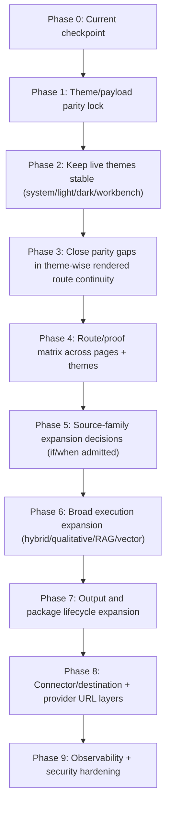

# Layer 3 Theme-to-Full-Pipeline Strategic Synthesis

Status: planning/reference-only, no runtime behavior change.

Purpose: consolidate current Layer 3 state from `project6-origin/main` into one bounded roadmap for **any admitted UI theme/page**, including the current Claude prototype boundary, and preserve a complete path to full Layer 3 pipeline operation without widening scope beyond frozen checkpoints.

## Authority Snapshot

- Branch authority: `project6-origin/main`
- Current worktree anchor: `0da71863e02c9f0936b6de5d60c0d41672e4dfe5` (`PR #795`).
- Canonical controls in scope:
  - `next_milestone_plans/Layer3_planning_docs/234_THEME_PIPELINE_ROADMAP.md`
  - `next_milestone_plans/Layer3_planning_docs/235_THEME_CONTRACTS.md`
  - `next_milestone_plans/Layer3_planning_docs/236_THEME_E2E_MATRIX.md`
  - `next_milestone_plans/Layer3_planning_docs/237_THEME_ENTRY_FREEZE.md`
  - `next_milestone_plans/Layer3_planning_docs/158_POST_730_PRACTICAL_READINESS.md` (historical readiness context at PR #730/731)
- Live tests/checker references: `tools/l3-progress-check.py`, `next_milestone_plans/layer3_progress_manifest.json`, `next_milestone_plans/layer3_workbench_proof_manifest.json`.

## Current Surface Reality (as of this working snapshot)

- **Live Layer 3 workbench route:** `/review/layer3`
- **Static prototype route:** `/review/layer3/static/claude.html`
- **Current Claude status:** prototype-only static surface; not a live pipeline theme.
- **Live themes on `/review/layer3`:** `system`, `light`, `dark`, `workbench` (presentation variants only).
- **Admitted source classes:** `dataset_version`, `aps_content_document` (server-owned manifest + hash flow for mixed input).
- **Non-admitted source classes and ingestion behavior:** no local-directory ingestion, no upload, no web connector retrieval, no source-adapter registry, no RAG/vector retrieval.
- **Deferred runtime categories:** provider-public URL, connector/destination dispatch, package mutation/reconstruction, full mockup activation, hidden LLM planning, auth/security behavior expansion.

## Theme/Page Readiness Matrix

| Theme or page | Route status | Max proven flow today | Blocked at |
| --- | --- | --- | --- |
| `system` (review workbench) | live | preflight -> Gate B -> Gate C -> plan preview -> plan approval -> execution selection -> execution start -> result status -> result review -> package preview -> package commit -> package submit -> handoff/export prepare -> APS handoff dispatch -> external export/download prepare -> external export/download deliver | none on route continuity; parity gaps remain for cross-theme validation depth |
| `light` | live | same as `system` | same as `system` |
| `dark` | live | same as `system` | same as `system` |
| `workbench` | live | same as `system` | same as `system` |
| `claude` selector | prototype-only redirect | static sample-state route only | runtime parity not admitted |
| `/review/layer3/static/claude.html` | static | manual or design-only proof only | not a live source of authority |

Notes:

- Execution-selection/start controls are now present on the rendered raw-mixed path and exercised through execution-start continuation in Playwright.
- Provider-private APIs remain backend/API-only unless a dedicated provider-private freeze admits rendered controls.

## Target State

`/review/layer3` should support a bounded, theme-consistent control path with these user-visible invariants across all admitted themes:

- same route contract and payload shape;
- same source/material/Gate B/Gate C/progression behavior;
- same package/handoff/external export-readiness behavior;
- same failure and idempotent behavior for unsupported attempts;
- same negative-side-effect absence.

Claude can only enter this target set as a dedicated runtime-admitted live theme under its own freeze; until then, it remains prototype.

## Execution Strategy (from current state to target)

## Priority Pass Set

1. **Theme runtime lock-in (P0-P1)**
   - finalize one pass-only statement: Claude remains static prototype
   - lock parity assertions for live themes on `/review/layer3`
   - required artifacts: `234`, `235`, `236`, `237`, plus Playwright proof

2. **Rendered parity lock-in (P1-P2)**
   - close remaining theme-wise continuity and parity gaps through rendered execution->delivery segments
   - keep route payloads and DB writes unchanged across themes
   - stop and escalate if controls cannot be hardened without unrelated category widening

3. **All-theme parity matrix closeout (P2-P3)**
    - prove each admitted page-theme pair has equivalent request/response, step transitions, and forbidden-control behavior
    - required coverage by headed and headless smoke
    - output format should include:
      - request/response shape parity assertions
      - explicit stop reasons for each unfinished segment
      - explicit negative-side-effect checks

4. **Deferred-category admission lanes (P3+)**
   one-lane-at-a-time only:
   - source-breadth/raw ingestion
   - broad analysis/runtime expansion
   - package mutation/reconstruction + replacement
   - destination/connector dispatch
   - provider-public URL or signed URL strategy
   - full mockup/UI expansion
   - auth/security and observability hardening

### Hard-Stop Gate for Theme-Readiness Evidence

- **Pass:** all admitted themes have equivalent route/contract behavior for every proven segment and the same forbidden-controls matrix.
- **Fail:** any admitted theme changes payload fields/DB writes, bypasses source/payload authority, or claims Claude parity without an admission freeze.
- **Partial pass:** only accepted when each unimplemented segment is explicitly listed under `Blocked at` with a testable blocker.

## Negative Invariants (must remain true in all passes until explicitly admitted)

- no local upload or local-directory ingestion
- no parser/OCR/source-adapter registry expansion
- no web connector retrieval
- no RAG/vector retrieval side paths
- no connector/destination dispatch or provider-network writes
- no hidden LLM controls
- no full mockup production behavior
- no schema/migration/runtime model expansion without separate freeze
- no UI controls that alter source authority or DB authority outside existing endpoints

## Double-Check Completeness Notes

- Reference consistency check: all referenced canonical docs in this packet exist in the same directory.
- Freeze alignment check: category ordering matches 234->237 and does not claim admission where freeze remains deferred.
- Blocker check: current major blocker is cross-category admission sequencing; `159_RAW_MIXED_RENDERED_DOWNSTREAM_BLOCKER.md` is historical evidence.
- Non-goal enforcement: this packet contains no route/service/model/migration changes.

## Stop Condition

Stop before implementation if any of these remain true:

- Claude is treated as live without an admission freeze
- historical claim of execution-select/start absence is used while asserting downstream rendered proof past plan approval
- any category above is executed without a dedicated category freeze
- any doc/task claims a route/UI behavior not present on current main
