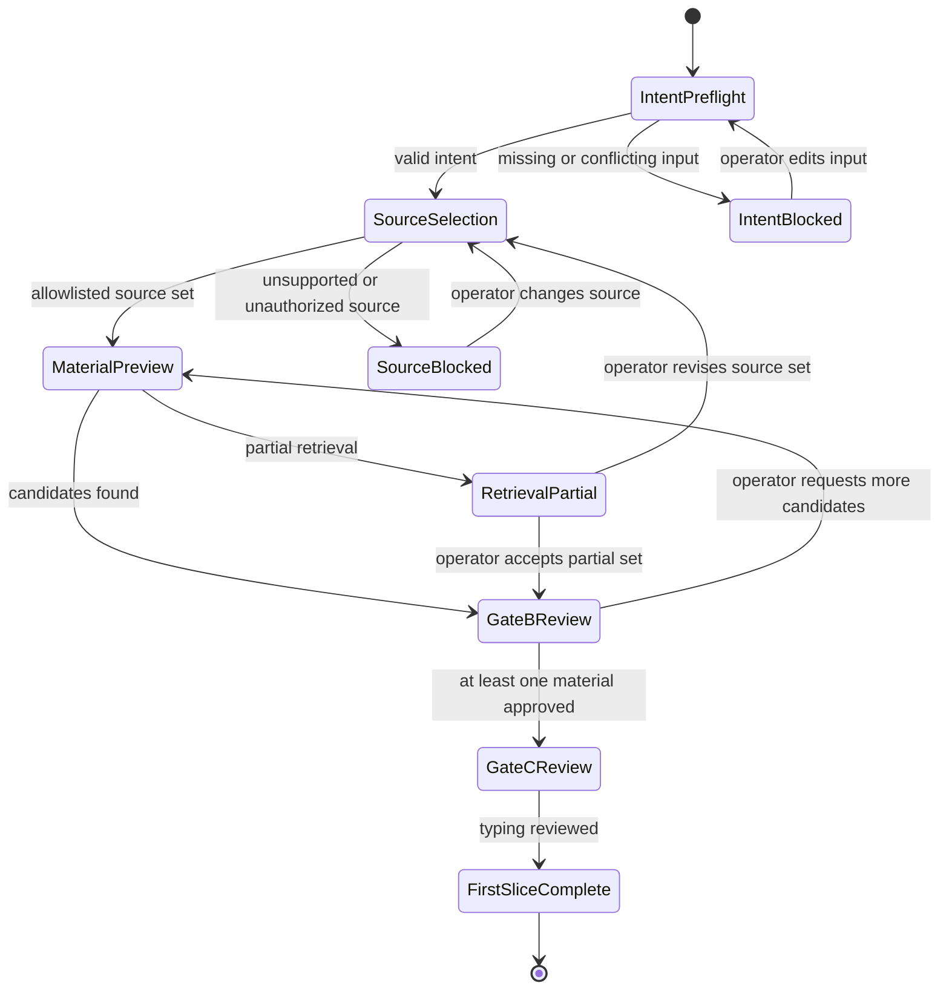
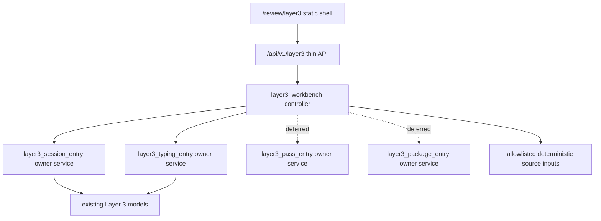

# 28 L3 Workbench First Slice Freeze

## Status
- planning-only
- not active implementation
- first-slice setup freeze for the deferred `future workbench route family`
- does not reopen the settled APS packet
- does not change merged milestone counts by itself
- does not make `/review/layer3` or `/api/v1/layer3/...` live

## Purpose
Freeze the narrowest implementation-entry shape that can turn the Layer 3 mockup intent into a usable repo-native workbench without treating the whole mockup set as implementation scope.

This doc exists so a later code pass can start from an exact, bounded target rather than re-deciding route ownership, UI layout posture, source handling, gate semantics, proof requirements, or no-go surfaces.

## Authority order
1. current `project6-origin/main` repo truth
2. `next_milestone_plans/layer3_progress_manifest.json`
3. `next_milestone_plans/layer3_progress_board.md`
4. `24_L3_WB_FREEZE.md`
5. `26_L3_WB_INPUTS.md`
6. `next_milestone_plans/layer3-mockups/mockup-spec.txt`
7. `next_milestone_plans/layer3-mockups/assets.md`

The repo-tracked mockup spec mirror is design intent and planning input. It is not repo-live implementation truth.

The asset inventory records the operator-local visual assets that informed the spec by path, size, timestamp, and SHA-256. It does not make the bitmap or SVG assets implementation dependencies.

## Repo-confirmed starting truth
- current `main` ships adjacent review, document-trace, Workbench Compare, Candidate B Trace, and analyst-insight surfaces
- current `main` does not ship `/review/layer3`
- current `main` does not ship `/api/v1/layer3/...`
- current `main` already includes Layer 3 owner services for session, typing, pass, and package entry
- current `main` already includes Layer 3 model and migration surfaces
- current `main` does not require React, a client-side router, a new component library, schema widening, or runtime snapshot DB writes for a first additive workbench slice

## First-slice decision
The first implementation slice should cover:
- intent intake and preflight
- source selection limited to deterministic, repo-supported source inputs
- retrieval/material preview using repo-proven token/query or fixture-backed retrieval first
- Gate B material review with durable decision semantics
- Gate C typing/unit review using the minimum adopted `source_shape` plus `analysis_modality` posture
- persistent contextual orientation for submitted intent and selected sources
- visible downstream placeholders for plan review, execution, results, and package review, clearly marked unavailable until later freezes activate them

The first implementation slice should not cover:
- quantitative pass execution UI
- qualitative execution
- hybrid execution
- RAG/vector indexing or semantic retrieval claims
- arbitrary local directory ingestion
- broad file upload handling
- package review or downstream handoff initiation
- multi-user collaboration or RBAC
- schema widening
- runtime snapshot DB writes
- rewrites of existing review/document-trace/Workbench Compare/Candidate B/analyst-insight surfaces

## Route and file ownership
If the first implementation pass is activated, the default exact owner surfaces are:

| Concern | Default owner surface | Rule |
| --- | --- | --- |
| page route | `backend/main.py` route for `/review/layer3` | additive route only |
| API include | `backend/app/api/router.py` include for `/api/v1/layer3` | additive include only |
| API module | `backend/app/api/layer3.py` | route handlers stay thin and controller-backed |
| controller/service | `backend/app/services/layer3_workbench.py` | orchestrates existing Layer 3 owner services |
| page shell | `backend/app/review_ui/static/layer3.html` | repo-native static shell |
| page styling | `backend/app/review_ui/static/layer3.css` | scoped to Layer 3 shell |
| page behavior | `backend/app/review_ui/static/layer3.js` | no hidden browser-only state machine |
| backend proof | `backend/tests/test_layer3_workbench.py` | service/controller proof |
| API proof | `backend/tests/test_layer3_api.py` | TestClient proof |
| page proof | `backend/tests/test_layer3_page.py` | route/static proof |
| browser proof | `e2e/layer3-workbench.spec.js` | headed and headless Chrome proof when UI is touched |

These filenames are defaults for the first implementation slice. A later activation pass may rename them only if it updates this doc or a superseding freeze with an explicit reason.

## API shape for the first slice
The first slice should expose API operations at `/api/v1/layer3/...` with these target responsibilities:

| Operation class | Target behavior | Write posture |
| --- | --- | --- |
| bootstrap | return UI config, supported source classes, gate labels, and unavailable downstream states | read-only |
| preflight | normalize submitted intent and manual constraints, report blockers, and identify missing required fields | read-only |
| selection commit | create or reuse a deliberate Layer 3 session through the existing session owner service | existing Layer 3 control persistence only |
| material preview | retrieve or assemble candidate material from allowlisted deterministic inputs | read-only unless recording existing session retrieval events through owner service |
| Gate B decision | record approved, denied, isolated, or flagged material decisions | existing Layer 3 control persistence only |
| Gate C typing preview | materialize or preview source units and typing posture through the existing typing owner service | existing Layer 3 control persistence only if explicitly committed |
| typing override | record bounded override reason, actor, before/after values, and must-remain-intact changes | existing Layer 3 control persistence only |

No first-slice API should write to review/runtime snapshot databases, create migrations, seed validation artifacts, or bypass existing Layer 3 owner services.

## UI layout and presentation
The first live UI should preserve the mockups' workflow language without copying diagram artifacts literally.

Required layout:
- top or left workflow stepper for intent, sources, Gate B, Gate C, plan, execution, results, and package
- compact persistent context rail showing submitted intent, active source set, session id, and current gate
- central work area that changes by state
- dense Gate B material ledger with filters, status chips, provenance fields, and detail drawer
- Gate C unit/group/set review area with expandable relationships and explicit source-shape/modality labels
- collapsible action/event/help panel for contextual explanation, recent decisions, and blockers
- clear unavailable state for downstream plan, execution, results, and package areas

Required presentation guardrails:
- statuses must use text labels, not color alone
- gates and lanes are semantic workflow regions, not decorative-only shapes
- large mockup diagrams are not a substitute for reviewable tables, ledgers, and drawers
- layout must remain usable on desktop and narrow viewport without text overlap
- no visible claim that qualitative, hybrid, RAG/vector, package handoff, or execution controls are active unless a later freeze implements them

## Interaction state machine

## Backend connection model

Connection rules:
- API handlers should not implement Layer 3 persistence rules directly.
- Browser code should not become the source of truth for gate transitions.
- Existing pass and package owner services remain deferred for UI activation unless a later freeze admits them.
- Adjacent review/APS/analyst-insight services may be linked or referenced, but they do not become the owner of the broader workbench.

## Gate B semantics
Gate B material review must support these states:
- `approved`: eligible for Gate C
- `denied`: explicitly excluded with reason
- `isolated`: preserved but not eligible for normal downstream processing
- `flagged`: needs attention before downstream eligibility
- `candidate`: uncommitted retrieval result

`remove` is not a durable material state in the first slice. It may only hide an uncommitted `candidate` from the local candidate list.

Gate B minimum fields:
- candidate id
- source label
- source type
- source/run/chunk reference when available
- matched term or query basis
- validation status
- duplicate status
- size or unit count
- current decision state
- operator reason for denied, isolated, flagged, or override actions

## Gate C semantics
Gate C must keep `source_shape` separate from `analysis_modality`.

Minimum supported `source_shape` values:
- `tabular_numeric`
- `time_series`
- `document_chunks`
- `mixed_source_payload`
- `bundle_artifact`

Minimum supported `analysis_modality` values:
- `quantitative`
- `qualitative`
- `hybrid`
- `bounded_review`
- `unsupported`

The first slice must not claim support for `entity_graph` unless a later freeze explicitly resolves its default behavior.

Every typing override must record:
- prior source shape and modality
- new source shape and modality
- actor
- timestamp
- reason
- whether must-remain-intact status changed

## Failure and empty states
The first implementation must define UI and API responses for:
- empty intent
- conflicting natural-language and manual constraints
- unsupported source
- unavailable source
- no retrieval candidates
- partial retrieval
- invalid material
- duplicate material
- no Gate B approved material
- unsupported typing
- failed typing materialization
- unavailable downstream plan or execution step

## Proof requirements
A first implementation pass is not complete unless it proves:
- `/review/layer3` page route exists and does not disturb existing review routes
- `/api/v1/layer3/...` endpoints exist under the additive router only
- bootstrap, preflight, material preview, Gate B decisions, Gate C typing preview, and typing override behavior are covered by backend tests
- adjacent `/review/nrc-aps`, document-trace, Workbench Compare, Candidate B Trace, and analyst-insight page/API tests still pass or are not touched
- headed Chrome and headless Chrome both prove shell reachability and the first-slice operator path when UI is touched
- no schema migration is added
- no runtime snapshot DB write path is added
- no RAG/vector, qualitative execution, hybrid execution, package review, or handoff affordance is presented as active

## Still unresolved after this freeze
- exact visual tokens, spacing values, and final design-system names
- final glossary for Gate A, Pre-3A, Sublayer 3A, Gate B, Gate C, Sublayer 3C, ingress object, material snapshot, and analysis plane
- exact confidence thresholds for typing automation
- exact APS document-derived unit granularity
- final performance limits for maximum materials, chunks, and unit counts
- full accessibility acceptance checklist beyond baseline semantic HTML, keyboard access, contrast, and non-color-only statuses
- qualitative single-item execution activation
- hybrid execution activation
- RAG/vector retrieval activation
- package review and downstream handoff activation
- RBAC and multi-user collaboration behavior

These unresolved items are not blockers for the first slice as long as the implementation keeps them unavailable, deferred, or explicitly out of scope.

## Stop conditions
Stop and reopen planning before coding if the implementation needs any of the following:
- new schema or migration
- runtime snapshot DB writes
- new frontend framework or component library
- arbitrary local filesystem ingestion
- RAG/vector indexing
- qualitative or hybrid execution
- package handoff
- edits to existing review/document-trace/Workbench Compare/Candidate B/analyst-insight owner behavior
- hidden LLM planning or unreviewed natural-language decomposition
