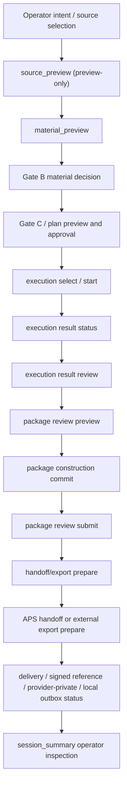
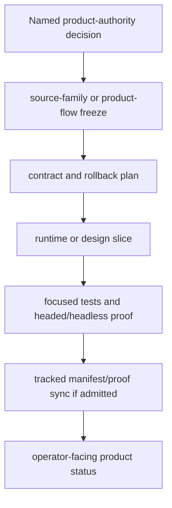

# Layer 3 Product-Flow Authority Map v1

Authority snapshot: fresh worktree `./worktrees/l3-flow-map`, branch `codex/l3-flow-map-v1`, final live `project6-origin/main` at `b9f06718b2c449d2683cc311d838200b0340c002`. Preflight began at `a83b3629f35aa8de96f2fb2c69d220354c98982c`; the worktree was fast-forwarded/rebased during verification after SEC batch 4, SEC diagnostic-framework runtime, and SEC report-leak guard work landed on main. This artifact is docs-only and non-SEC. It does not admit runtime behavior, API/UI changes, schema changes, manifest edits, or production-readiness claims.

## 1. Executive Product-Flow Map

Repo-confirmed Layer 3 product flow currently has an implemented non-SEC spine that moves operator-selected source inputs through preview, material authority, Gate B/Gate C planning, execution/result review, package review/commit/submit, handoff/export preparation, downstream delivery/status, and operator inspection through session summary/status surfaces. Runtime support is strongest for `aps_content_document`, APS-derived `dataset_version`, source-intake qualitative previews, source-directory text/table authority, source-directory hybrid context packet analysis, and bounded Candidate B status/proof surfaces. Planning docs describe wider activation, full mockup, source-family, provider, and product-authority targets, but those docs do not prove implementation. SEC XBRL/product facts exist as a separate active lane and are treated here only as a collision boundary.

## 2. Authority Ladder

| Authority layer | Current implemented support | Relevant source files | Proof or test evidence | Missing or deferred behavior |
| --- | --- | --- | --- | --- |
| Source intake authority | Preview-only `source_preview`; admitted source shapes include `dataset_version`, `aps_content_document`, source-intake records, source-directory ingestion, raw-mixed seed authority, and bounded Candidate B runtime/bundle authority. | `backend/app/api/layer3.py`; `backend/app/services/layer3_workbench.py`; `backend/app/services/layer3_source_intake.py`; `backend/app/services/layer3_source_directory_ingestion.py`; `backend/app/services/layer3_raw_mixed_bridge.py`; `backend/app/services/layer3_candidate_b_operator_status.py` | `backend/tests/test_layer3_workbench.py`; `backend/tests/test_layer3_api.py`; `backend/tests/test_layer3_source_directory_ingestion.py`; `backend/tests/test_layer3_raw_mixed_bridge.py` | No universal product-source registry; source-family expansion remains tranche-specific; broad mixed-source and full mockup activation are not admitted by this artifact. |
| Material/document authority | `material_preview` builds traceable candidates; APS document chunks and source-directory files have explicit identity/provenance checks; stale source-directory files fail closed. | `backend/app/services/layer3_workbench.py`; `backend/app/services/layer3_source_directory_material_admission.py`; `backend/app/services/layer3_aps_source_family.py` | `backend/tests/test_layer3_workbench.py`; `backend/tests/test_layer3_api.py`; `backend/tests/test_layer3_source_directory_ingestion.py`; `backend/tests/test_layer3_aps_source_family.py` | Material preview is not a universal parser/fact model; some families are partial or refused per `multi-ingest/README.md`. |
| Fact/dataset authority | Non-SEC dataset authority is through `DatasetVersion` provenance and APS/source-directory trace. SEC fact authority exists but is excluded from this pass. | `backend/app/services/layer3_workbench.py`; `backend/app/services/layer3_aps_source_family.py`; `backend/app/services/layer3_raw_mixed_bridge.py` | `backend/tests/test_layer3_workbench.py`; `backend/tests/test_layer3_api.py`; `backend/tests/test_layer3_raw_mixed_bridge.py` | No non-SEC universal fact authority layer; SEC fact authority must remain in the SEC lane. |
| Package authority | Implemented package-review preview, package construction commit, package-review submit, replacement/supersession helpers, and source-intake/source-directory variants. | `backend/app/api/layer3.py`; `backend/app/services/layer3_workbench.py`; `backend/app/services/layer3_package_review_contract.py`; `backend/app/services/layer3_package_entry.py` | `backend/tests/test_layer3_workbench.py`; `backend/tests/test_layer3_api.py`; `backend/tests/test_layer3_package_review_contract.py`; `backend/tests/test_layer3_package_entry.py` | Package authority is not a license to mutate arbitrary output packages; package replacement/activation remains bounded and separately authorized. |
| Review authority | Execution result review and package review require exact source/pass/preview identity, approved result-review state, no unresolved trace, and bounded operator decisions. | `backend/app/services/layer3_workbench.py`; `backend/app/services/layer3_execution_review.py`; `backend/app/services/layer3_package_review_contract.py` | `backend/tests/test_layer3_workbench.py`; `backend/tests/test_layer3_api.py`; `backend/tests/test_layer3_execution_review.py` | Review docs do not prove product correctness or full production readiness; they prove bounded state transitions and fail-closed checks. |
| Handoff/export authority | Handoff/export prepare, APS handoff dispatch, external export download prepare/deliver, signed-reference delivery, provider-private signed URL state, local outbox, external local export, and internal webhook dispatch are implemented in bounded forms. | `backend/app/api/layer3.py`; `backend/app/services/layer3_workbench.py`; `backend/app/services/layer3_handoff_contract.py`; `backend/app/services/layer3_handoff_export_response.py`; `backend/app/services/layer3_external_export_contract.py`; `backend/app/services/layer3_external_local_export.py`; `backend/app/services/layer3_server_owned_local_outbox_write.py`; `backend/app/services/layer3_connector_dispatch_entry.py`; `backend/app/services/layer3_provider_private_signed_url.py`; `backend/app/services/layer3_provider_private_signed_url_state.py`; `backend/app/services/layer3_signed_reference_state.py`; `backend/app/services/layer3_internal_webhook_connector.py` | `backend/tests/test_layer3_workbench.py`; `backend/tests/test_layer3_api.py`; `backend/tests/test_layer3_handoff_contract.py`; `backend/tests/test_layer3_handoff_export_response.py`; `backend/tests/test_layer3_external_export_contract.py`; `backend/tests/test_layer3_provider_private_signed_url_state.py`; `backend/tests/test_layer3_signed_reference_state.py`; `backend/tests/test_layer3_internal_webhook_connector.py`; `backend/tests/test_layer3_source_directory_vector_retrieval.py` | Generic provider-private use remains absent in some docs; real provider/object writes and public URL behavior require separate authority. |
| Operator inspection authority | Session summary composes current gate, review/package/handoff/export state, source-directory status, local outbox, provider/private/export state, and analysis environment projection. | `backend/app/services/layer3_workbench.py`; `backend/app/services/layer3_candidate_b_operator_status.py`; `backend/app/api/layer3.py` | `backend/tests/test_layer3_workbench.py`; `backend/tests/test_layer3_api.py`; `backend/tests/test_layer3_source_directory_vector_retrieval.py` | Operator status can become confusing because implemented, planned, stale, and SEC terms coexist across planning docs. |
| Delivery/archive/status authority | Status and delivery records exist for external export, signed reference, provider-private signed URL, server-owned local outbox, external local export, internal webhook, Candidate B, and source-directory flows. | `backend/app/services/layer3_workbench.py`; `backend/app/services/layer3_external_local_export.py`; `backend/app/services/layer3_provider_private_signed_url.py`; `backend/app/services/layer3_provider_private_signed_url_state.py`; `backend/app/services/layer3_signed_reference_state.py`; `backend/app/services/layer3_connector_dispatch_entry.py`; `backend/app/services/layer3_internal_webhook_connector.py`; `backend/app/services/layer3_candidate_b_operator_status.py` | `backend/tests/test_layer3_workbench.py`; `backend/tests/test_layer3_provider_private_signed_url_state.py`; `backend/tests/test_layer3_signed_reference_state.py`; `backend/tests/test_layer3_internal_webhook_connector.py`; `backend/tests/test_layer3_source_directory_vector_retrieval.py` | Delivery/archive is not a single cross-family product archive; SEC durable delivery/archive is separate and excluded. |

## 3. Current Implemented Flow

| Surface | File path | Role in product flow | What it proves | What it does not prove |
| --- | --- | --- | --- | --- |
| Layer 3 API routes | `backend/app/api/layer3.py` | Exposes non-SEC plan, source, material, package, review, handoff, export, source-directory, and Candidate B surfaces; SEC-specific routes were treated only as an excluded boundary. | Implemented API surface exists on current main. | Route presence alone does not prove all product flows are complete or production-ready. |
| Workbench orchestrator | `backend/app/services/layer3_workbench.py` | Central non-SEC flow from source/material preview through package/handoff/export/session summary. | Runtime state transitions, blocking checks, idempotency, and session summary assembly exist. | Does not prove every source family or target architecture is admitted. |
| APS source-family metadata | `backend/app/services/layer3_aps_source_family.py` | Maps parser families into admitted/deferred/refused source-family metadata. | Dataset-family source labels and admission states are surfaced. | Does not create parser support or materialization by itself. |
| Raw mixed bridge | `backend/app/services/layer3_raw_mixed_bridge.py` | Seeds server-owned mixed source authority for `dataset_version` plus `aps_content_document`. | Manifest hash, source classes, and existing source rows are validated. | It is seed/runtime-specific and does not admit arbitrary source packages. |
| Source-directory ingestion/material admission | `backend/app/services/layer3_source_directory_ingestion.py`; `backend/app/services/layer3_source_directory_material_admission.py` | Records redacted directory/file authority and admits text/table files into material preview/Gate B. | Server-owned directory authority and live-file drift checks exist. | It does not admit frontend-only authority, hidden path exposure, or unrestricted recursion. |
| Package review and handoff contracts | `backend/app/services/layer3_package_review_contract.py`; `backend/app/services/layer3_handoff_contract.py` | Define blocked fields and admitted request contracts for package/handoff transitions. | Non-admitted fields are blocked before state changes. | They are not product decisions; they enforce contract boundaries. |
| Export/delivery helpers | `backend/app/services/layer3_handoff_export_response.py`; `backend/app/services/layer3_external_export_contract.py`; `backend/app/services/layer3_external_local_export.py` | Build handoff/export responses, external export contracts, and local export state. | Export is bounded, statused, and redacted through server authority. | Does not prove real provider writes, public URLs, or generic connector expansion. |
| Operator status | `backend/app/services/layer3_candidate_b_operator_status.py`; `backend/app/services/layer3_workbench.py` | Provides Candidate B and session-level inspection/status projection. | Operator-visible state is derived from runtime/proof receipts and session records. | Historical Candidate B docs still need separate reading to avoid stale claims. |
| Focused tests | `backend/tests/test_layer3_workbench.py`; `backend/tests/test_layer3_api.py`; `backend/tests/test_layer3_source_directory_ingestion.py`; `backend/tests/test_layer3_source_directory_vector_retrieval.py`; `backend/tests/test_layer3_raw_mixed_bridge.py`; `backend/tests/test_layer3_aps_source_family.py` | Prove selected source/material/package/handoff/export/status paths. | The inspected current-main test corpus covers fail-closed and happy-path slices. | This pass did not run the full Layer 3 pytest suite. |

## 4. Planning / Frozen / Deferred Flow

| Item | Source doc | Planning status | What the doc proves | What it does not prove | Near-term influence |
| --- | --- | --- | --- | --- | --- |
| Current Layer 3 posture | `next_milestone_plans/layer3_progress_board.md`; `next_milestone_plans/layer3_progress_manifest.json`; `next_milestone_plans/layer3_workbench_proof_manifest.json` | Current tracked planning/proof docs, currently SEC-heavy. | The tracked milestone spine is frozen/validated and recent SEC posture is recorded. | Does not prove this non-SEC product-flow artifact or any new implementation. | Use as guardrail; do not edit during this pass. |
| Multi-ingest front door | `next_milestone_plans/multi-ingest/README.md` | Current mixed planning/status doc with older audit anchors. | Non-SEC source-family posture, implemented partial parser families, and fail-closed quality bar. | Does not prove every first-class typed source family is complete. | Strong source-family reference; avoid editing now. |
| Candidate B pack | `next_milestone_plans/candidate_b_workbench/README_CANDIDATE_B_OPENDATALOADER_PACK.md`; `MANIFEST.json` | Mixed current guardrail plus historical pack. | Candidate B bundle/runtime distinction and operator boundary history. | Does not prove current runtime behavior without source/tests. | Use as stale/current split example; avoid relying on it as runtime authority. |
| Doc unification pack | `next_milestone_plans/doc_unification/index.md` | Historical/superseded audit pack. | Shows prior authority-drift and stale-doc contamination risks. | Not a current planning front door. | Use only as risk evidence. |
| Product authority intake | `next_milestone_plans/Layer3_planning_docs/958-product-authority-intake.md` | No-runtime product-authority checkpoint. | New implementation requires a named product-authority answer or failed proof/remediation target. | Does not select implementation by itself. | High near-term governance relevance. |
| Output/package/handoff current-main sync | `next_milestone_plans/Layer3_planning_docs/947-output-review-package-handoff-activation-current-main-sync.md` | Older no-behavior sync. | Output/package/handoff is classified as interactive-live within bounded current-main evidence. | Does not admit full mockup activation or provider writes. | Useful context; verify against source before acting. |
| Full mockup freeze | `next_milestone_plans/Layer3_planning_docs/954-post-final-readiness-next-phase-selection-freeze.md` | Branch-local no-runtime freeze packet. | Full mockup activation remains blocked without product authority and rollback/proof. | Does not implement activation. | Containment reference only. |
| Source-directory provider-private lifecycle | `next_milestone_plans/Layer3_planning_docs/959-provider-private-source-directory-use.md` | Implementation/proof checkpoint. | One source-directory artifact-family provider-private lifecycle was selected and proved. | Does not admit generic provider-private use or broad provider writes. | Relevant to delivery/status mapping. |

## 5. Product-Flow Diagrams

Implemented flow:



Target/deferred flow, not implemented by this artifact:



## 6. Collision / Tech-Debt Risks

| Risk | Severity | Affected files or surfaces | Why it matters | Recommended containment |
| --- | --- | --- | --- | --- |
| Stale planning anchors | High | `multi-ingest/README.md`; Candidate B README; numbered planning docs | Older main hashes and historical pack language can be mistaken for current runtime truth. | Always re-ground in `project6-origin/main`, source, and tests before implementation. |
| Duplicate authority language | Medium | `Layer3_planning_docs`, Candidate B pack, `doc_unification` | Multiple docs discuss authority/freeze/admission with different eras and scopes. | Add future non-SEC supersession/front-door map before broad docs cleanup. |
| Mixed implemented/planned terminology | High | Progress board, manifests, planning docs | "Current", "branch-local", "sync", "proof", and "ready" can overclaim runtime if not classified. | Every artifact should label runtime, planning, stale, generated, and inference separately. |
| Overgrown manifests | Medium | `layer3_progress_manifest.json`; `layer3_workbench_proof_manifest.json` | Large shared manifests are expensive to audit and collision-prone during SEC work. | Avoid manifest edits unless the tranche explicitly changes tracked milestone claims. |
| SEC lane collision | High | Active SEC PRs, SEC diagnostics/tests, shared progress surfaces | Parallel SEC work can change main and shared posture quickly. | Keep this docs artifact isolated; re-fetch and re-check PRs before push/PR. |
| Product-flow gaps | Medium | Source-family registry, operator status, package/handoff docs | New source families can reach partial states without a single product-flow map. | Prioritize a non-SEC state/readiness map before new runtime broadening. |
| Provider/delivery overclaim | High | Provider-private, public URL, local outbox, external export docs | Delivery status can be mistaken for real provider/object write authority. | Preserve negative flags and require separate provider/public/connector freezes. |
| Candidate B historical/current drift | Medium | Candidate B planning pack and runtime/status services | Bundle-scoped historical posture differs from later runtime-source admission. | Treat planning pack as guardrail/history; use source/tests for runtime claims. |

## 7. High-ROI Next Candidates

| Rank | Candidate | Objective | Why it matters | Likely files touched | Collision risk | Test/proof requirement | Stop conditions | Type |
| --- | --- | --- | --- | --- | --- | --- | --- | --- |
| 1 | Non-SEC product-state/readiness map | Define one operator-facing state contract for source -> package -> handoff/export. | Reduces confusion across implemented/planned status surfaces. | New docs-only artifact, possibly later read-only diagnostic. | Low if isolated. | Progress check, target-selection validator, `node --check`; later focused tests if diagnostic. | Any manifest, SEC, runtime, or UI edit required. | Docs-only now. |
| 2 | Non-SEC planning supersession index | Map current, historical, stale, and deferred non-SEC planning docs. | Prevents stale-doc contamination and overclaiming. | New narrow index under a non-SEC folder. | Medium because planning docs are broad. | Link/path validation plus manifest non-edit confirmation. | Requires shared manifest edits or SEC docs. | Docs-only. |
| 3 | Source-family admission/readiness contract | Make admitted/refused/partial source families visible through one source-family authority table. | Parser additions otherwise create scattered semantics. | `layer3_aps_source_family.py`, docs, targeted tests if runtime. | Medium if SEC families are touched. | Unit tests for admission/refusal and no hidden source expansion. | SEC source-family changes or broad parser work. | Design first, runtime later. |
| 4 | Package/handoff/export operator status consolidation | Clarify package, handoff, external export, provider-private, local outbox, and webhook status sequence. | Prevents delivery/archive overclaim and operator confusion. | Docs first; maybe `layer3_workbench.py` status projection later. | Medium. | Existing focused tests plus status snapshot tests if runtime. | Public URL/provider/object writes implied. | Review/audit then runtime. |
| 5 | Source-directory artifact-family expansion freeze | Define the next exact source-directory artifact family before more provider/private or export work. | Keeps source-directory delivery extensible and bounded. | One planning freeze; runtime only later. | Low-medium. | Source-directory focused tests and headed/headless proof if rendered. | Generic provider-private route or broad connector required. | Design-only first. |
| 6 | Candidate B current-runtime boundary map | Separate bundle-scoped Trace, runtime-source admission, operator status, and future defaulting. | Candidate B has high historical/current drift risk. | Candidate B docs artifact; no runtime first. | Low if docs-only. | Existing Candidate B tests as evidence, no new proof run unless runtime touched. | Claims default promotion or runtime parity without source proof. | Docs-only/review. |
| 7 | Handoff/export negative authority checklist | Codify what must remain false for raw URLs, tokens, paths, provider writes, and public URLs. | Protects delivery surfaces from unsafe broadening. | Docs/checklist; maybe contract tests later. | Medium. | Contract tests if implemented. | Requires credential/provider config behavior. | Docs-only then tests. |
| 8 | Layer 3 source-to-package trace smoke | Add a focused current-main smoke around `dataset_version` and `aps_content_document` trace into package/handoff status. | Proves the highest-value implemented non-SEC path stays wired. | Tests only if authorized later. | Low. | Focused pytest with isolated DB state. | Any runtime change required for the smoke. | Review/audit or test-only later. |

## 8. Non-Goals

- No runtime implementation.
- No SEC XBRL work.
- No manifest edits.
- No `AGENTS.md` edits.
- No API/UI edits.
- No schema, persistence, model, or migration edits.
- No production-readiness claims.
- No PR or push unless explicitly authorized.

## 9. Source Inventory

| Source path | Classification | Why inspected | What it proves | What it does not prove | Confidence |
| --- | --- | --- | --- | --- | --- |
| `AGENTS.md` | Current tracked repo rule doc | Coordination, authority, planning, and SEC boundaries. | Root checkout is not implementation authority when dirty; Layer 3 planning docs must separate runtime from target state. | Does not prove implementation. | High |
| `backend/app/api/layer3.py` | Runtime route/API | Identify implemented API/product surfaces. | Routes exist for Layer 3 source/material/package/review/handoff/export/status families. | Does not prove each route is complete or production-ready. | High |
| `backend/app/services/layer3_workbench.py` | Live source code | Trace main implemented non-SEC product flow. | Core flow and session summary assembly exist. | Does not prove every source family is complete. | High |
| `backend/app/services/layer3_aps_source_family.py` | Live source code | Check source-family metadata. | APS-derived source families are classified as admitted/deferred/refused. | Does not implement parsing. | High |
| `backend/app/services/layer3_raw_mixed_bridge.py` | Live source code | Check mixed source authority. | Server-owned manifest/hash validation for mixed dataset/document sources exists. | Does not admit arbitrary mixed packages. | High |
| `backend/app/services/layer3_source_intake.py` | Live source code | Check source-intake authority surface. | Source-intake service exists and participates in product flow. | Did not inspect every branch of the service. | Medium |
| `backend/app/services/layer3_source_directory_ingestion.py` | Live source code | Check source-directory intake authority. | Redacted source-directory ingestion authority exists. | Does not prove provider/private delivery by itself. | High |
| `backend/app/services/layer3_source_directory_material_admission.py` | Live source code | Check material authority and stale-file behavior. | Source-directory material preview validates persisted authority and live file identity. | Does not admit broad source traversal. | High |
| `backend/app/services/layer3_package_review_contract.py` | Live source code | Check package request boundaries. | Package review/commit/submit blocked fields are explicit. | Does not create package runtime by itself. | High |
| `backend/app/services/layer3_handoff_contract.py` | Live source code | Check handoff request boundaries. | Handoff/export prepare blocked fields are explicit. | Does not prove downstream delivery. | High |
| `backend/app/services/layer3_handoff_export_response.py` | Live source code | Check handoff response authority. | Prepared handoff export envelopes include bounded authority metadata. | Does not admit external writes. | High |
| `backend/app/services/layer3_external_export_contract.py` | Live source code | Check external export request boundaries. | External export blocked fields are explicit. | Does not prove real provider/public URL behavior. | High |
| `backend/app/services/layer3_external_local_export.py` | Live source code | Check local export status. | External local export receipt/status support exists. | Does not imply all delivery families are implemented. | Medium |
| `backend/app/services/layer3_server_owned_local_outbox_write.py` | Live source code | Check local outbox write authority. | Server-owned local outbox write support exists. | Does not prove raw payload exposure is impossible without tests. | Medium |
| `backend/app/services/layer3_candidate_b_operator_status.py` | Live source code | Check Candidate B operator status. | Candidate B status validates receipts/hashes and exposes bounded projection. | Does not resolve historical Candidate B docs by itself. | High |
| `backend/app/services/layer3_package_entry.py` | Live source code | Check package-entry materialization and package state. | Package rows, package kinds, payload hashes, and deferred downstream flags are implemented. | Targeted search only; not every package branch was inspected. | Medium |
| `backend/app/services/layer3_execution_review.py` | Live source code | Check execution-review projection and fail-closed review item handling. | Result-review state, trace summary, blocked review fields, and downstream-disable projection exist. | Does not prove operator review quality. | Medium |
| `backend/app/services/layer3_connector_dispatch_entry.py` | Live source code | Check connector dispatch record authority. | Internal dispatch record support is bounded, with external connector/destination/provider URL writes disabled. | Does not prove real connector invocation. | Medium |
| `backend/app/services/layer3_provider_private_signed_url.py` | Live source code | Check provider-private prepare/status/revoke surface. | Provider-private signed URL prepare/status/revoke is bounded, redacted, and fake-provider based. | Does not prove real provider/object writes or public URL delivery. | Medium |
| `backend/app/services/layer3_provider_private_signed_url_state.py` | Live source code | Check durable provider-private URL receipt state. | Durable receipt, authority hashing, idempotency, stale-authority, replay, expiry, and revoke checks exist. | Does not expose or validate a real provider secret. | Medium |
| `backend/app/services/layer3_signed_reference_state.py` | Live source code | Check signed-reference durable state. | Token hashing, generated/used receipts, replay/revocation/expiry/authority mismatch checks exist. | Does not prove full external delivery by itself. | Medium |
| `backend/app/services/layer3_internal_webhook_connector.py` | Live source code | Check internal webhook dispatch/status authority. | Server-configured internal webhook dispatch/status uses existing authority chains, validates configured destination, records receipts, and disables provider/public URL behavior. | Does not prove arbitrary webhook URLs or credentialed destinations are admitted. | Medium |
| `backend/tests/test_layer3_workbench.py` | Test/proof | Check product-flow happy paths and fail-closed conditions. | Source-intake through package/handoff/export and session summary are tested. | This pass did not run the full file. | High |
| `backend/tests/test_layer3_api.py` | Test/proof | Check route-level API and source/material/package trace coverage. | API tests cover dataset/content trace, package, handoff, and many boundaries. | Large file; search was targeted. | Medium |
| `backend/tests/test_layer3_source_directory_ingestion.py` | Test/proof | Check source-directory authority and fail-closed behavior. | Ingestion/material preview/text index fail-closed tests exist. | Does not cover every downstream delivery step. | High |
| `backend/tests/test_layer3_source_directory_context_packet.py` | Test/proof | Check source-directory context packet authority. | Context packet deterministic/no-side-effect and stale-authority tests exist. | Did not inspect all vector retrieval flows. | Medium |
| `backend/tests/test_layer3_source_directory_vector_retrieval.py` | Test/proof | Check source-directory hybrid package/handoff/export/provider status. | Focused tests cover status, handoff, delivery, stale authority, and negative exposure flags. | Did not execute the file in this pass. | Medium |
| `backend/tests/test_layer3_aps_source_family.py` | Test/proof | Check source-family metadata tests. | Admission/refusal metadata tests exist. | Does not prove parser implementation. | High |
| `backend/tests/test_layer3_raw_mixed_bridge.py` | Test/proof | Check raw-mixed bridge tests. | Mixed source manifest validation and fail-closed tests exist. | Does not prove full product path. | High |
| `backend/tests/test_layer3_package_review_contract.py` | Test/proof | Check package-review contract tests. | Contract blocked-field behavior matches legacy workbench behavior. | Did not run this test in this pass. | Medium |
| `backend/tests/test_layer3_package_entry.py` | Test/proof | Check package-entry tests. | Package-entry tests cover package rows, payload hashes, warning/review-only states, and fail-closed missing output refs. | Did not run this test in this pass. | Medium |
| `backend/tests/test_layer3_execution_review.py` | Test/proof | Check execution-review tests. | Execution-review helpers preserve workbench projection and fail closed on malformed/oversized review items. | Did not run this test in this pass. | Medium |
| `backend/tests/test_layer3_handoff_contract.py` | Test/proof | Check handoff contract tests. | Handoff blocked-field behavior matches legacy workbench behavior. | Did not run this test in this pass. | Medium |
| `backend/tests/test_layer3_handoff_export_response.py` | Test/proof | Check handoff export response tests. | Handoff response projection preserves schemas, provenance, and disabled downstream flags. | Did not run this test in this pass. | Medium |
| `backend/tests/test_layer3_external_export_contract.py` | Test/proof | Check external export contract tests. | External export/download blocked fields, request fields, and readiness mismatch behavior are tested. | Did not run this test in this pass. | Medium |
| `backend/tests/test_layer3_provider_private_signed_url_state.py` | Test/proof | Check provider-private durable state tests. | Tests cover redaction, idempotency, stale authority, expiry, replay, and revoke behavior. | Did not run this test in this pass. | Medium |
| `backend/tests/test_layer3_provider_private_signed_url_fake_provider.py` | Test/proof | Check fake-provider tests. | Tests cover deterministic redacted fake-provider behavior and disabled real provider semantics. | Did not run this test in this pass. | Medium |
| `backend/tests/test_layer3_signed_reference_state.py` | Test/proof | Check signed-reference state tests. | Tests cover sanitized durable state, single-use replay rejection, revocation, expiry, and concurrency behavior. | Did not run this test in this pass. | Medium |
| `backend/tests/test_layer3_internal_webhook_connector.py` | Test/proof | Check internal webhook tests. | Test coverage includes rejection of credential-bearing configured webhook URLs. | Did not run this test in this pass and did not prove full dispatch behavior. | Medium |
| `next_milestone_plans/layer3_progress_board.md` | Current tracked planning doc | Identify current Layer 3 posture. | Current tracked board is SEC-heavy and records validate/proof posture. | Does not prove non-SEC implementation. | High |
| `next_milestone_plans/layer3_progress_manifest.json` | Current tracked planning/proof manifest | Identify current manifest posture. | Current manifest records recent SEC posture and frozen validation. | It is not edited here and does not prove this artifact. | High |
| `next_milestone_plans/layer3_workbench_proof_manifest.json` | Current tracked proof manifest | Identify proof surfaces. | Proof manifest records verification evidence and non-admission flags. | Does not replace live source/tests. | High |
| `next_milestone_plans/multi-ingest/README.md` | Current mixed planning/status doc | Source-family posture and deferred behavior. | Documents implemented partial parser/source-family support and quality bar. | Contains older main anchors and planning text. | Medium |
| `next_milestone_plans/candidate_b_workbench/README_CANDIDATE_B_OPENDATALOADER_PACK.md` | Mixed current/historical planning doc | Candidate B status/current-history split. | Shows Candidate B bundle/runtime distinction and historical drift. | Not runtime authority. | Medium |
| `next_milestone_plans/candidate_b_workbench/MANIFEST.json` | Intentionally scoped manifest | Candidate B pack inventory. | Declared pack files and status are valid as pack metadata. | Does not prove implementation. | Medium |
| `next_milestone_plans/doc_unification/index.md` | Stale/superseded planning doc | Stale-doc contamination risk. | Historical unification audit is explicitly not current front door. | Not current implementation or planning authority. | High |
| `next_milestone_plans/Layer3_planning_docs/958-product-authority-intake.md` | Current tracked planning doc | Product-authority stop/entry rules. | New implementation needs named product authority or specific remediation target. | Does not select runtime work. | High |
| `next_milestone_plans/Layer3_planning_docs/947-output-review-package-handoff-activation-current-main-sync.md` | Older current-main sync doc | Output/package/handoff classification. | Records older no-behavior sync and non-admission boundaries. | Must be rechecked against current source. | Medium |
| `next_milestone_plans/Layer3_planning_docs/954-post-final-readiness-next-phase-selection-freeze.md` | Frozen/deferred planning doc | Full mockup activation boundary. | Activation is blocked without product authority/rollback/proof. | Does not implement activation. | Medium |
| `next_milestone_plans/Layer3_planning_docs/959-provider-private-source-directory-use.md` | Implementation/proof planning doc | Source-directory provider-private lifecycle status. | One source-directory lifecycle slice was implemented/proved in that branch history. | Does not admit generic provider-private use. | Medium |
| GitHub PR `#2114` file list | Live GitHub state | Pre-edit SEC collision check. | At preflight, the active SEC PR touched diagnostics/tests only, not shared planning manifests or this artifact. | Superseded as live open-PR state after main advanced. | Medium |
| GitHub PR `#2115` file list | Live GitHub state | SEC collision check before and after main advanced. | Before merge, the active SEC PR touched SEC diagnostics/tests plus one SEC planning doc; after re-audit, that PR was merged into `project6-origin/main`. It did not touch this artifact, shared Layer 3 progress/proof manifests, or the progress board. | GitHub state may change after this artifact. | Medium |
| GitHub PR `#2116` file list | Live GitHub state | Pre-publication and post-merge SEC collision check. | Before merge, the active SEC PR touched SEC XBRL report-leak guard services/tests only; after final refresh, that PR was merged into `project6-origin/main`. It did not touch this artifact, shared Layer 3 progress/proof manifests, or the progress board. | GitHub state may change after this artifact. | Medium |

## 10. Verification

Pre-edit authority and coordination commands:

```powershell
git fetch project6-origin --prune
# PASS

git rev-parse project6-origin/main
# a83b3629f35aa8de96f2fb2c69d220354c98982c

git status --short --branch
# ## codex/l3-flow-map-v1...project6-origin/main

gh pr list --repo benjmcd/project6_REPO_MCP_FOLDER --state open
# Open SEC PR #2114 on codex/secxbrl-diagnostic-framework-batch4

gh pr view 2114 --repo benjmcd/project6_REPO_MCP_FOLDER --json number,title,headRefName,baseRefName,mergeStateStatus,files
# SEC diagnostics/tests only; no product-flow artifact, shared Layer 3 manifest, or progress-board overlap

git status --short -- ./next_milestone_plans/layer3-product-flow/layer3_product_flow_authority_map_v1.md
# Directory/file absent before creation; no existing uncommitted target-file change
```

Source inspection commands used targeted `rg` and `Get-Content` reads over the files in the source inventory above. Generated navigation aids such as Codesight were not used.

Final authority refresh after `project6-origin/main` advanced during this docs pass:

```powershell
git fetch project6-origin --prune
# PASS

git rev-parse project6-origin/main
# 1a5f3a48c83a6d0504fabff55f825785fec62833

git status --short --branch
# ## codex/l3-flow-map-v1...project6-origin/main [behind 2]
#  A next_milestone_plans/layer3-product-flow/layer3_product_flow_authority_map_v1.md

gh pr list --repo benjmcd/project6_REPO_MCP_FOLDER --state open
# Open SEC PR #2115 on codex/secxbrl-diagnostic-framework-runtime

gh pr view 2115 --repo benjmcd/project6_REPO_MCP_FOLDER --json number,title,headRefName,baseRefName,mergeStateStatus,files
# SEC diagnostics/tests plus one SEC planning doc; no product-flow artifact, shared Layer 3 progress/proof manifest, or progress-board overlap

git merge --ff-only project6-origin/main
# PASS; fast-forwarded from a83b3629 to 1a5f3a48
```

Post-write verification:

```powershell
git add -N ./next_milestone_plans/layer3-product-flow/layer3_product_flow_authority_map_v1.md
# PASS; used intent-to-add so git diff checks the new file

git diff --check
# PASS; LF-to-CRLF working-copy warning only for this Markdown file

python -B ./tools/l3-progress-check.py
# PASS: Layer 3 progress state check: PASS

python -B ./tools/l3-target-selection-validate.py --expect frozen
# PASS: Layer 3 target-selection validation: PASS (frozen)

node --check ./backend/app/review_ui/static/layer3.js
# PASS; no output

git status --short
#  A next_milestone_plans/layer3-product-flow/layer3_product_flow_authority_map_v1.md

git diff --name-only
# next_milestone_plans/layer3-product-flow/layer3_product_flow_authority_map_v1.md

git diff --stat
# One changed file, this Markdown artifact only; LF-to-CRLF working-copy warning only
```

Final closeout refresh after re-audit:

```powershell
git fetch project6-origin --prune
# PASS

git rev-parse project6-origin/main
# b9f06718b2c449d2683cc311d838200b0340c002

git diff --name-only HEAD..project6-origin/main
# SEC report-leak guard services/tests only before rebase; no product-flow artifact or shared progress/proof overlap

git rebase project6-origin/main
# PASS; rebased docs branch after #2116 landed

git status --short --branch
# ## codex/l3-flow-map-v1...project6-origin/main
#  A next_milestone_plans/layer3-product-flow/layer3_product_flow_authority_map_v1.md

gh pr list --repo benjmcd/project6_REPO_MCP_FOLDER --state open
# Before rebase: open SEC PR #2116 on codex/secxbrl-redaction-report-leaks
# After final refresh: open draft PR #2117 only

gh pr view 2116 --repo benjmcd/project6_REPO_MCP_FOLDER --json number,title,headRefName,baseRefName,mergeStateStatus,files
# SEC XBRL report-leak guard services/tests only before merge; no product-flow artifact, shared Layer 3 progress/proof manifest, or progress-board overlap

git diff --stat
# One changed file, this Markdown artifact only; LF-to-CRLF working-copy warning only
```

Re-audit validation after the `b9f06718` authority refresh:

```powershell
git diff --check
# PASS; LF-to-CRLF working-copy warning only for this Markdown file

python -B ./tools/l3-progress-check.py
# PASS: Layer 3 progress state check: PASS

python -B ./tools/l3-target-selection-validate.py --expect frozen
# PASS: Layer 3 target-selection validation: PASS (frozen)

node --check ./backend/app/review_ui/static/layer3.js
# PASS; no output

git status --short
#  A next_milestone_plans/layer3-product-flow/layer3_product_flow_authority_map_v1.md

git diff --name-only
# next_milestone_plans/layer3-product-flow/layer3_product_flow_authority_map_v1.md

rg -n "^# |^## " ./next_milestone_plans/layer3-product-flow/layer3_product_flow_authority_map_v1.md
# PASS; required sections 1-10 present

# PowerShell source-inventory path check over repo-local inventory rows
# PASS: all repo-local inventory paths exist
```

Final diff scope confirmed: only `next_milestone_plans/layer3-product-flow/layer3_product_flow_authority_map_v1.md`.
