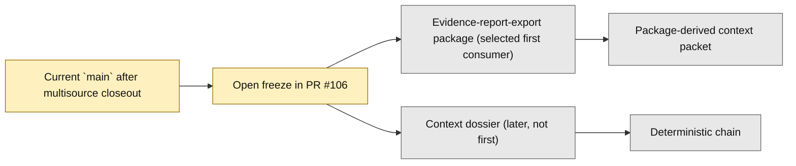

# Layer3 Progress Board

## Purpose

This file is the human-facing companion to `next_milestone_plans/layer3_progress_manifest.json`.
It tracks the bounded Layer3 Phase1A through APS multisource chain, plus the immediate first shared-consumer freeze that follows multisource.
It is intentionally scoped to:
- the landed milestone chain from Phase 1A feeder-ledger entry through APS multisource admission
- the now-landed docs-only closeout that followed multisource landing
- the current open branch-only freeze that selects the first downstream shared APS consumer beyond multisource

It is not a general whole-repo roadmap.
It does not replace GitHub PR state.

## Authority Order

Use this order when refreshing this board:
1. GitHub PR state for merged vs open
2. current `project6-origin/main` repo truth
3. active planning docs and freeze docs

Hard rule:
- do not mark a step as landed on `main` from planning-doc wording alone

## Current Snapshot

As of `2026-04-20`:
- seed local checkout used to prepare this artifact: `C:\Users\benny\OneDrive\Desktop\project6_REPO_MCP_FOLDER\worktrees\l3-progress-main`
- valid local authority rule: use any clean checkout whose contents match current `main`
- authoritative remote branch: `project6-origin/main`
- snapshot base `main` commit at last artifact refresh before this artifact pack itself merged: `5107ad15bef43b9aef913f163641bdc28f7b88d8`
- current `main` includes the bounded APS multisource implementation slice from PR `#101`
- current `main` also includes the docs-only multisource closeout from PR `#102`
- current branch state also carries open PR `#106`, a read-only freeze that selects `evidence_report_export_package` as the first downstream shared APS consumer beyond the landed multisource seam; it is not yet landed on `main`

## Program State Summary

- Done now on `main`: 12 merged milestones from Phase 1A feeder-ledger foundation through APS same-run multisource admission
- Current focus: land the open export-package first shared-consumer freeze from PR `#106`
- Candidate next consumers: selected first consumer `evidence_report_export_package`; later-but-not-first `context_dossier`
- Deferred but not active: 12 explicitly deferred scope items remain out until later freezes admit them

## Milestone Status

| Milestone | Current chain state | Governing doc | Key PRs | Notes |
| --- | --- | --- | --- | --- |
| Phase 1A feeder-ledger foundation | merged | `01_IMPLEMENTATION_ENTRY_BASELINE_REV2.md`, `03_PHASE1A_VALIDATION_AND_EXECUTION_PLAN_REV2.md` | `#69` | First bounded implementation-entry slice |
| Gate C entry bridge | merged | `04_GATEC_ENTRY_FREEZE.md` | `#70` | Opens the first Gate C implementation freeze |
| Gate C typing-unit slice | merged | `05_GATEC_IMPLEMENTATION_FREEZE.md` | `#71`, `#72` | First write-enabled Gate C slice |
| Gate C single-item pass-entry slice | merged | `06_GATEC_PASS_FREEZE.md` | `#73`, `#74`, `#75` | Adds plan/pass entry for the single-item quantitative path |
| Gate C associated-cohort slice | merged | `07_GATEC_COHORT_FREEZE.md` | `#77`, `#79`, `#80` | Extends Gate C to the bounded cohort path |
| Gate D package-entry slice | merged | `08_GATED_PACKAGE_FREEZE.md` | `#81`, `#82`, `#84` | Adds internal canonical package entry |
| APS evidence-bundle handoff | merged | `09_GATED_APS_HANDOFF_FREEZE.md` | `#85`, `#86`, `#87` | First APS-facing bounded handoff |
| APS citation-pack handoff | merged | `10_GATED_APS_CITATION_FREEZE.md` | `#88`, `#89`, `#90` | Next APS continuation beyond evidence-bundle |
| APS evidence-report handoff | merged | `11_GATED_APS_REPORT_FREEZE.md` | `#91`, `#92`, `#93` | Bounded report-family continuation |
| APS evidence-report-export handoff | merged | `12_GATED_APS_REPORT_EXPORT_FREEZE.md` | `#94`, `#95`, `#96` | Bounded export-family continuation |
| APS export-derived context-packet | merged | `13_GATED_APS_CONTEXT_FREEZE.md` | `#97`, `#98`, `#99` | Direct export-derived context path |
| APS same-run multisource admission | merged | `14_GATED_APS_MULTISOURCE_FREEZE.md` | `#100`, `#101`, `#102` | Implementation and its docs closeout are both landed on `main` |
| APS export-package first shared-consumer freeze | open | `15_GATED_APS_EXPORT_PACKAGE_FREEZE.md` | `#106` | Branch-local read-only freeze selects `evidence_report_export_package` as the first downstream shared APS consumer; not yet landed on `main` |

## What Is Complete

The Program State Summary and Milestone Status table above are the primary human-readable surfaces in this board.
The Mermaid views below are secondary visual aids only.

```mermaid
flowchart LR
    A["Phase 1A feeder-ledger"] --> B["Gate C entry bridge"]
    B --> C["Gate C typing-unit"]
    C --> D["Gate C pass-entry"]
    D --> E["Gate C cohort"]
    E --> F["Gate D package-entry"]
    F --> G["APS evidence-bundle handoff"]
    G --> H["APS citation-pack handoff"]
    H --> I["APS evidence-report handoff"]
    I --> J["APS evidence-report-export handoff"]
    J --> K["APS context-packet handoff"]
    K --> L["APS multisource admission"]

    classDef merged fill:#d8f5d0,stroke:#2f6b2f,color:#111;

    class A,B,C,D,E,F,G,H,I,J,K,L merged;
```

## Next Required Decision

The immediate required move is not another write-enabled implementation lane by default.
It is to land the open read-only freeze in PR `#106` that selects which downstream shared APS family will consume the now-landed multisource seam first.

Current bounded selection state:
- selected in the open branch-local freeze: `evidence_report_export_package`
- later but not first: `context_dossier`

Hard rule:
- do not open a direct write-enabled export-package or dossier implementation lane before PR `#106` merges and the freeze is post-merge audited

The textual section above remains primary if Mermaid rendering is unavailable.

## Deferred Scope

These remain explicitly out until later freezes admit them:
- direct `evidence_report_export_package` implementation
- package-derived context packet
- direct `context_dossier` implementation
- deterministic insight, deterministic challenge, and review-packet fan-out
- validate-only top-chain expansion
- route/UI widening
- runtime DB writes
- schema widening
- broader qualitative, hybrid, comparative, or cross-modal Layer3 breadth

## Refresh Inputs

Refresh this board against:
- `next_milestone_plans/layer3_progress_manifest.json`
- `next_milestone_plans/progress-ui-spec.md`
- `docs/nrc_adams/nrc_aps_status_handoff.md`
- `next_milestone_plans/README_LAYER3_PHASE1A_PACK.md`
- `next_milestone_plans/Layer3_planning_docs/01_IMPLEMENTATION_ENTRY_BASELINE_REV2.md`
- `next_milestone_plans/Layer3_planning_docs/03_PHASE1A_VALIDATION_AND_EXECUTION_PLAN_REV2.md`
- `next_milestone_plans/Layer3_planning_docs/04_GATEC_ENTRY_FREEZE.md` through `15_GATED_APS_EXPORT_PACKAGE_FREEZE.md`
- GitHub PR state for `#69`, `#70`, `#71`, `#72`, `#73`, `#74`, `#75`, `#77`, `#79`, `#80`, `#81`, `#82`, `#84`, `#85`, `#86`, `#87`, `#88`, `#89`, `#90`, `#91`, `#92`, `#93`, `#94`, `#95`, `#96`, `#97`, `#98`, `#99`, `#100`, `#101`, `#102`, and `#106`
