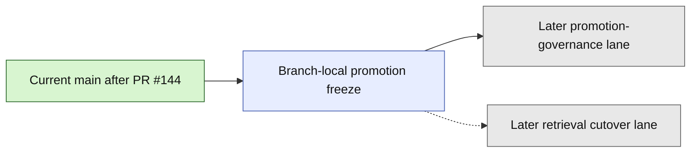

# Layer3 Progress Board

## Purpose

This file is the human-facing companion to `next_milestone_plans/layer3_progress_manifest.json`.
It tracks the bounded Layer3 Phase1A through APS validate-only runtime/report-ref chain already landed on current `main`, plus this branch-local read-only `23_GATED_APS_PROMOTION_FREEZE.md` continuation freeze beyond that landed boundary.

It is intentionally scoped to:
- the landed milestone chain from Phase 1A feeder-ledger foundation through the bounded dedicated validate-only runtime/report-ref implementation lane
- the branch-local read-only promotion continuation freeze carried by this checkout
- the next later family decision immediately beyond the landed dedicated validate-only boundary

It is not a general whole-repo roadmap.
It does not replace GitHub PR state.

## Authority Order

Use this order when refreshing this board:
1. GitHub PR state for merged vs open
2. current `project6-origin/main` repo truth
3. active planning docs and freeze docs

Hard rule:
- do not mark a step as landed on `main` from planning-doc wording alone

## Current Snapshot

As of `2026-04-21`:
- seed local checkout used to prepare this artifact: `C:\Users\benny\OneDrive\Desktop\project6_REPO_MCP_FOLDER\worktrees\l3-progress-main`
- valid local authority rule: use a clean checkout whose contents match the artifact state being refreshed; prefer current `main` for merged repo truth and the active branch checkout when an open or branch-only milestone is declared
- authoritative remote branch: `project6-origin/main`
- snapshot base `main` commit at this artifact refresh: `35032341d7352cbebc41e5bab94b816572995014`
- current `main` includes the bounded APS multisource implementation slice from PR `#101`
- current `main` also includes the docs-only multisource closeout from PR `#102`
- current `main` also includes the landed export-package first shared-consumer freeze from PR `#106` and its docs-only closeout from PR `#107`
- current `main` also includes the bounded export-package handoff implementation slice from PR `#109`, its docs-only closeout from PR `#110`, and the exact-run export/export-package gate-hardening follow-up from PR `#111` and `#112`
- current `main` now includes the landed package-derived-context freeze from PR `#113`, the bounded package-derived context handoff implementation slice from PR `#115`, the earlier hardening pass from PR `#116`, the post-PR116 docs/progress sync from PR `#117`, and the malformed-scoped candidate-discovery closeout from PR `#119`
- current `main` now includes the landed context-dossier freeze from PR `#118`, the post-PR118 docs/progress sync from PR `#120`, and the bounded `aps_context_dossier_handoff` implementation slice from PR `#121` plus its docs/progress closeout from PR `#122`
- current `main` now includes the post-PR122 artifact-state fix from PR `#123`
- current `main` now includes the landed deterministic-insight continuation freeze from PR `#124`, the bounded deterministic insight handoff implementation slice from PR `#126`, and the post-PR126 docs/progress sync from PR `#127`
- current `main` now includes the landed deterministic-challenge continuation freeze from PR `#128`, the post-PR128 docs/progress sync from PR `#129`, the bounded deterministic challenge handoff implementation slice from PR `#130`, and the post-PR130 docs/progress sync from PR `#131`
- current `main` now includes the landed deterministic challenge review-packet continuation freeze from PR `#132`, the post-PR132 docs/progress sync from PR `#133`, the bounded deterministic challenge review-packet handoff slice from PR `#134`, and the post-PR134 docs/progress sync from PR `#135`
- current `main` now includes the landed validate-only-gates continuation freeze from PR `#136`, the post-PR136 docs/progress sync from PR `#137`, the bounded validate-only gate-report refresh lane from PR `#138`, and the post-PR138 docs/progress sync from PR `#139`
- current `main` now includes the landed dedicated validate-only runtime/report-ref continuation freeze from PR `#140`, the post-PR140 docs/progress sync from PR `#141`, the post-PR141 docs/progress sync from PR `#142`, the bounded dedicated validate-only runtime/report-ref implementation lane from PR `#143`, and the post-PR143 docs/progress sync from PR `#144`
- no later post-validate-only freeze has yet landed on current `main`
- this branch now carries the read-only `23_GATED_APS_PROMOTION_FREEZE.md` freeze selecting promotion as the first later APS family beyond the landed dedicated validate-only runtime/report-ref boundary while keeping retrieval cutover later

## Program State Summary

- Done now on `main`: 28 merged milestones from Phase 1A feeder-ledger foundation through the landed APS dedicated validate-only runtime/report-ref implementation lane, plus the post-PR143 docs/progress sync from PR `#144`
- Current focus: this branch-local read-only `23_GATED_APS_PROMOTION_FREEZE.md` freeze
- Candidate next consumers: promotion is selected branch-locally as the first later APS family; retrieval cutover remains later; no separate repo-backed post-validate-only top-chain family is admitted here
- Deferred but not active: 9 explicitly deferred scope items remain out until later freezes admit them

## Milestone Table

| Milestone | Current chain state | Governing doc | Key PRs | Notes |
| --- | --- | --- | --- | --- |
| Phase 1A feeder-ledger foundation | merged | `01_IMPLEMENTATION_ENTRY_BASELINE_REV2.md`, `03_PHASE1A_VALIDATION_AND_EXECUTION_PLAN_REV2.md` | `#69` | First bounded implementation-entry slice |
| Gate C entry bridge | merged | `04_GATEC_ENTRY_FREEZE.md` | `#70` | Opens the first Gate C implementation freeze |
| Gate C typing-unit slice | merged | `05_GATEC_IMPLEMENTATION_FREEZE.md` | `#71`, `#72` | First write-enabled Gate C slice |
| Gate C single-item pass-entry slice | merged | `06_GATEC_PASS_FREEZE.md` | `#73`, `#74`, `#75` | Adds plan/pass entry for the single-item quantitative path |
| Gate C associated-cohort slice | merged | `07_GATEC_COHORT_FREEZE.md` | `#77`, `#79`, `#80` | Extends Gate C to the bounded cohort path |
| Gate D package-entry slice | merged | `08_GATED_PACKAGE_FREEZE.md` | `#81`, `#82`, `#84` | Adds internal canonical package entry |
| APS evidence-bundle handoff | merged | `09_GATED_APS_HANDOFF_FREEZE.md` | `#85`, `#86`, `#87` | First APS-facing bounded handoff |
| APS citation-pack handoff | merged | `10_GATED_APS_CITATION_FREEZE.md` | `#88`, `#89`, `#90` | Next APS continuation beyond evidence-bundle |
| APS evidence-report handoff | merged | `11_GATED_APS_REPORT_FREEZE.md` | `#91`, `#92`, `#93` | Bounded report-family continuation |
| APS evidence-report-export handoff | merged | `12_GATED_APS_REPORT_EXPORT_FREEZE.md` | `#94`, `#95`, `#96` | Bounded export-family continuation |
| APS export-derived context-packet | merged | `13_GATED_APS_CONTEXT_FREEZE.md` | `#97`, `#98`, `#99` | Direct export-derived context path |
| APS same-run multisource admission | merged | `14_GATED_APS_MULTISOURCE_FREEZE.md` | `#100`, `#101`, `#102` | Implementation and docs closeout are both landed on `main` |
| APS export-package first shared-consumer freeze | merged | `15_GATED_APS_EXPORT_PACKAGE_FREEZE.md` | `#106`, `#107` | Read-only freeze and docs closeout are both landed on `main` |
| APS evidence-report-export-package handoff | merged | `15_GATED_APS_EXPORT_PACKAGE_FREEZE.md` | `#109`, `#110`, `#111`, `#112` | Landed bounded implementation slice, docs closeout, and exact-run gate hardening |
| APS package-derived context continuation freeze | merged | `16_GATED_APS_PACKAGE_CONTEXT_FREEZE.md` | `#113` | Selects package-derived context packet as the next later shared APS family |
| APS package-derived context handoff | merged | `16_GATED_APS_PACKAGE_CONTEXT_FREEZE.md` | `#115`, `#116`, `#117`, `#119`, `#120` | Landed bounded handoff implementation slice plus hardening and docs/progress sync |
| APS context-dossier continuation freeze | merged | `17_GATED_APS_CONTEXT_DOSSIER_FREEZE.md` | `#118` | Preserves paired export-derived context packets as dossier inputs |
| APS context-dossier handoff | merged | `17_GATED_APS_CONTEXT_DOSSIER_FREEZE.md` | `#121`, `#122`, `#123` | Landed bounded implementation slice plus docs/progress and artifact-state closeout |
| APS deterministic-insight continuation freeze | merged | `18_GATED_APS_DETERMINISTIC_INSIGHT_FREEZE.md` | `#124`, `#125` | Landed read-only freeze plus merged-state docs/progress closeout |
| APS deterministic-insight handoff | merged | `18_GATED_APS_DETERMINISTIC_INSIGHT_FREEZE.md` | `#126`, `#127` | Landed bounded implementation slice plus docs/progress sync |
| APS deterministic-challenge continuation freeze | merged | `19_GATED_APS_DETERMINISTIC_CHALLENGE_FREEZE.md` | `#128`, `#129` | Landed read-only freeze plus docs/progress sync |
| APS deterministic-challenge handoff | merged | `19_GATED_APS_DETERMINISTIC_CHALLENGE_FREEZE.md` | `#130`, `#131` | Landed bounded implementation slice plus docs/progress sync |
| APS deterministic challenge review-packet continuation freeze | merged | `20_GATED_APS_REVIEW_PACKET_FREEZE.md` | `#132`, `#133` | Landed read-only freeze plus docs/progress sync |
| APS deterministic challenge review-packet handoff | merged | `20_GATED_APS_REVIEW_PACKET_FREEZE.md` | `#134`, `#135` | Landed bounded implementation slice plus docs/progress sync |
| APS validate-only-gates continuation freeze | merged | `21_GATED_APS_VALIDATE_ONLY_GATES_FREEZE.md` | `#136`, `#137` | Landed read-only freeze plus docs/progress sync |
| APS validate-only gate-report refresh lane | merged | `21_GATED_APS_VALIDATE_ONLY_GATES_FREEZE.md` | `#138`, `#139` | Landed bounded validate-only gate-report refresh lane plus docs/progress sync |
| APS dedicated validate-only runtime/report-ref continuation freeze | merged | `22_GATED_APS_VALIDATE_ONLY_RUNTIME_FREEZE.md` | `#140`, `#141`, `#142` | Landed read-only freeze plus both docs/progress sync passes |
| APS dedicated validate-only runtime/report-ref implementation lane | merged | `22_GATED_APS_VALIDATE_ONLY_RUNTIME_FREEZE.md` | `#143`, `#144` | Landed bounded implementation lane plus post-PR143 docs/progress sync |
| APS promotion continuation freeze | branch_only | `23_GATED_APS_PROMOTION_FREEZE.md` | none yet | This branch-local read-only freeze selects promotion as the first later APS family beyond the landed dedicated validate-only runtime/report-ref boundary while keeping retrieval cutover later |

## Completed Chain

The Program State Summary and Milestone Table above are the primary human-readable surfaces in this board.
The Mermaid views below are secondary visual aids only.

## Current Focus

The immediate active step in this checkout is the branch-local read-only `23_GATED_APS_PROMOTION_FREEZE.md` freeze.

Current bounded selection state:
- current `main` is settled through the dedicated validate-only runtime/report-ref implementation lane from PR `#143` and the post-PR143 docs/progress sync from PR `#144`
- no later post-validate-only freeze has yet landed on current `main`
- this branch now carries `23_GATED_APS_PROMOTION_FREEZE.md`
- that freeze selects promotion as the first later APS family beyond the landed dedicated validate-only runtime/report-ref boundary
- retrieval cutover remains later
- this branch does not admit promotion implementation changes, retrieval cutover changes, route/UI widening, runtime DB writes, or schema widening
- this branch does not invent a separate repo-backed post-validate-only top-chain family

Hard rule:
- do not skip directly from the landed dedicated validate-only runtime/report-ref boundary to retrieval cutover before the promotion family is settled

## Candidate Next Consumers

- `promotion`: selected branch-locally as the first later APS family beyond the landed dedicated validate-only runtime/report-ref boundary
- `retrieval_cutover`: still later; not admitted by this branch-local freeze

The textual section above remains primary if Mermaid rendering is unavailable.

## Deferred Scope

These remain explicitly out until later freezes admit them:
- direct shared `evidence_report_export_package` contract/runtime edits beyond the landed bounded export-package handoff and exact-run gate-hardening lane
- package-derived context implementation beyond the landed bounded handoff slice
- validate-only top-chain expansion
- future workbench route family
- broader qualitative, hybrid, comparative, or cross-modal Layer3 breadth
- runtime DB writes
- schema widening
- route/UI widening
- retrieval cutover

## Refresh Inputs

Refresh this board against:
- `next_milestone_plans/layer3_progress_manifest.json`
- `next_milestone_plans/progress-ui-spec.md`
- `next_milestone_plans/progress-prompt.md`
- `docs/nrc_adams/nrc_aps_status_handoff.md`
- `next_milestone_plans/README_LAYER3_PHASE1A_PACK.md`
- `next_milestone_plans/Layer3_planning_docs/01_IMPLEMENTATION_ENTRY_BASELINE_REV2.md`
- `next_milestone_plans/Layer3_planning_docs/03_PHASE1A_VALIDATION_AND_EXECUTION_PLAN_REV2.md`
- `next_milestone_plans/Layer3_planning_docs/04_GATEC_ENTRY_FREEZE.md` through `23_GATED_APS_PROMOTION_FREEZE.md`
- `backend/app/services/review_nrc_aps_graph.py`
- `backend/app/services/nrc_aps_validate_only_gates_contract.py`
- `backend/app/services/nrc_aps_validate_only_gates.py`
- `backend/app/services/nrc_aps_validate_only_gates_gate.py`
- `backend/app/services/review_nrc_aps_runtime.py`
- `backend/app/services/review_nrc_aps_gate_reports.py`
- `backend/app/services/connectors_sciencebase.py`
- `backend/app/services/nrc_aps_promotion_gate.py`
- `backend/app/services/nrc_aps_promotion_tuning.py`
- `backend/app/services/aps_retrieval_plane_cutover_validation.py`
- `tests/test_nrc_aps_promotion_gate.py`
- `tests/test_nrc_aps_promotion_tuning.py`
- `backend/tests/test_aps_retrieval_plane_cutover_validation.py`
- `backend/tests/test_aps_retrieval_plane_cutover_gate.py`
- `tools/nrc_aps_retrieval_cutover_gate.py`
- `project6.ps1`
- GitHub PR state for `#69`, `#70`, `#71`, `#72`, `#73`, `#74`, `#75`, `#77`, `#79`, `#80`, `#81`, `#82`, `#84`, `#85`, `#86`, `#87`, `#88`, `#89`, `#90`, `#91`, `#92`, `#93`, `#94`, `#95`, `#96`, `#97`, `#98`, `#99`, `#100`, `#101`, `#102`, `#106`, `#107`, `#108`, `#109`, `#110`, `#111`, `#112`, `#113`, `#115`, `#116`, `#117`, `#118`, `#119`, `#120`, `#121`, `#122`, `#123`, `#124`, `#125`, `#126`, `#127`, `#128`, `#129`, `#130`, `#131`, `#132`, `#133`, `#134`, `#135`, `#136`, `#137`, `#138`, `#139`, `#140`, `#141`, `#142`, `#143`, and `#144`
