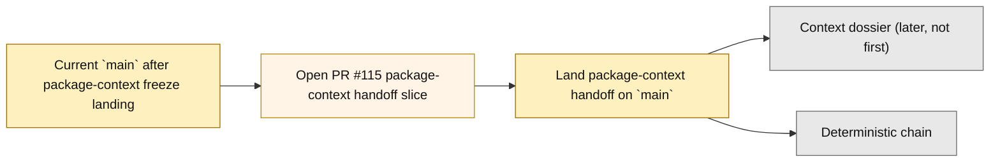

# Layer3 Progress Board

## Purpose

This file is the human-facing companion to `next_milestone_plans/layer3_progress_manifest.json`.
It tracks the bounded Layer3 Phase1A through APS multisource chain, plus the now-landed first shared-consumer freeze that follows multisource, plus the now-landed bounded export-package handoff implementation slice governed by that freeze, plus the now-landed package-derived-context freeze that follows that landed boundary, plus the current branch-local bounded package-derived context handoff implementation slice that follows that landed freeze.
It is intentionally scoped to:
- the landed milestone chain from Phase 1A feeder-ledger entry through APS multisource admission
- the now-landed docs-only closeout that followed multisource landing
- the landed first shared-consumer freeze that selects the first downstream shared APS consumer beyond multisource
- the now-landed bounded export-package handoff implementation slice on current `main`
- the now-landed package-derived-context freeze on current `main`
- the current branch-local bounded package-derived context handoff implementation slice beyond that landed freeze

It is not a general whole-repo roadmap.
It does not replace GitHub PR state.

## Authority Order

Use this order when refreshing this board:
1. GitHub PR state for merged vs open
2. current `project6-origin/main` repo truth
3. active planning docs and freeze docs

Hard rule:
- do not mark a step as landed on `main` from planning-doc wording alone

## Current Snapshot

As of `2026-04-20`:
- seed local checkout used to prepare this artifact: `C:\Users\benny\OneDrive\Desktop\project6_REPO_MCP_FOLDER\worktrees\l3-pkgctx-handoff`
- valid local authority rule: use a clean checkout whose contents match the artifact state being refreshed; prefer current `main` for merged repo truth and the active branch checkout when a branch-only milestone is declared
- authoritative remote branch: `project6-origin/main`
- snapshot base `main` commit at this artifact refresh: `7dd3d7b221faf36fc0550621cc14b9588b1ee64a`
- current `main` includes the bounded APS multisource implementation slice from PR `#101`
- current `main` also includes the docs-only multisource closeout from PR `#102`
- current `main` also includes the landed export-package first shared-consumer freeze from PR `#106` and its docs-only closeout from PR `#107`
- current `main` also now includes the bounded export-package handoff implementation slice from PR `#109` and its docs-only closeout from PR `#110`, rooted in `backend/app/services/layer3_aps_report_export_package_handoff.py` and `backend/tests/test_layer3_aps_report_export_package_handoff.py`
- current `main` also now includes the exact-run export/export-package gate-hardening follow-up from PR `#111` and PR `#112`
- current `main` now includes the landed `16_GATED_APS_PACKAGE_CONTEXT_FREEZE.md` package-derived-context freeze from PR `#113`
- current branch/workspace now also carries the bounded package-derived context handoff implementation slice rooted in `backend/app/services/layer3_aps_context_packet_package_handoff.py` and `backend/tests/test_layer3_aps_context_packet_package_handoff.py`, plus the narrow context-packet gate hardening in `backend/app/services/nrc_aps_context_packet_gate.py` and `backend/tests/test_layer3_aps_context_packet_handoff.py`; GitHub now confirms open PR `#115` for this slice, but it is not yet landed on current `main`

## Program State Summary

- Done now on `main`: 15 merged milestones from Phase 1A feeder-ledger foundation through the APS package-derived-context freeze
- Current focus: land the bounded package-derived context handoff open slice
- Candidate next consumers: package-derived context packet first; later-but-not-first `context_dossier`
- Deferred but not active: 12 explicitly deferred scope items remain out until later freezes admit them

## Milestone Status

| Milestone | Current chain state | Governing doc | Key PRs | Notes |
| --- | --- | --- | --- | --- |
| Phase 1A feeder-ledger foundation | merged | `01_IMPLEMENTATION_ENTRY_BASELINE_REV2.md`, `03_PHASE1A_VALIDATION_AND_EXECUTION_PLAN_REV2.md` | `#69` | First bounded implementation-entry slice |
| Gate C entry bridge | merged | `04_GATEC_ENTRY_FREEZE.md` | `#70` | Opens the first Gate C implementation freeze |
| Gate C typing-unit slice | merged | `05_GATEC_IMPLEMENTATION_FREEZE.md` | `#71`, `#72` | First write-enabled Gate C slice |
| Gate C single-item pass-entry slice | merged | `06_GATEC_PASS_FREEZE.md` | `#73`, `#74`, `#75` | Adds plan/pass entry for the single-item quantitative path |
| Gate C associated-cohort slice | merged | `07_GATEC_COHORT_FREEZE.md` | `#77`, `#79`, `#80` | Extends Gate C to the bounded cohort path |
| Gate D package-entry slice | merged | `08_GATED_PACKAGE_FREEZE.md` | `#81`, `#82`, `#84` | Adds internal canonical package entry |
| APS evidence-bundle handoff | merged | `09_GATED_APS_HANDOFF_FREEZE.md` | `#85`, `#86`, `#87` | First APS-facing bounded handoff |
| APS citation-pack handoff | merged | `10_GATED_APS_CITATION_FREEZE.md` | `#88`, `#89`, `#90` | Next APS continuation beyond evidence-bundle |
| APS evidence-report handoff | merged | `11_GATED_APS_REPORT_FREEZE.md` | `#91`, `#92`, `#93` | Bounded report-family continuation |
| APS evidence-report-export handoff | merged | `12_GATED_APS_REPORT_EXPORT_FREEZE.md` | `#94`, `#95`, `#96` | Bounded export-family continuation |
| APS export-derived context-packet | merged | `13_GATED_APS_CONTEXT_FREEZE.md` | `#97`, `#98`, `#99` | Direct export-derived context path |
| APS same-run multisource admission | merged | `14_GATED_APS_MULTISOURCE_FREEZE.md` | `#100`, `#101`, `#102` | Implementation and its docs closeout are both landed on `main` |
| APS export-package first shared-consumer freeze | merged | `15_GATED_APS_EXPORT_PACKAGE_FREEZE.md` | `#106` | Landed read-only freeze selects `evidence_report_export_package` as the first downstream shared APS consumer on `main` |
| APS evidence-report-export-package handoff | merged | `15_GATED_APS_EXPORT_PACKAGE_FREEZE.md` | `#109`, `#110`, `#111`, `#112` | Landed bounded implementation slice rooted in `layer3_aps_report_export_package_handoff.py`, plus docs closeout and exact-run export/export-package gate hardening |
| APS package-derived context continuation freeze | merged | `16_GATED_APS_PACKAGE_CONTEXT_FREEZE.md` | `#113` | Landed read-only freeze selects package-derived context packet as the next later shared APS family beyond the landed export-package boundary |
| APS package-derived context handoff | open | `16_GATED_APS_PACKAGE_CONTEXT_FREEZE.md` | `#115` | Open PR now carries the bounded handoff implementation slice rooted in `layer3_aps_context_packet_package_handoff.py`, plus narrow exact owner-run context-packet gate hardening; it is not yet landed on `main` |

## What Is Complete

The Program State Summary and Milestone Status table above are the primary human-readable surfaces in this board.
The Mermaid views below are secondary visual aids only.

```mermaid
flowchart LR
    A["Phase 1A feeder-ledger"] --> B["Gate C entry bridge"]
    B --> C["Gate C typing-unit"]
    C --> D["Gate C pass-entry"]
    D --> E["Gate C cohort"]
    E --> F["Gate D package-entry"]
    F --> G["APS evidence-bundle handoff"]
    G --> H["APS citation-pack handoff"]
    H --> I["APS evidence-report handoff"]
    I --> J["APS evidence-report-export handoff"]
    J --> K["APS context-packet handoff"]
    K --> L["APS multisource admission"]
    L --> M["APS export-package first shared-consumer freeze"]
    M --> N["APS export-package handoff"]
    N --> O["APS package-derived context freeze"]
    O --> P["APS package-derived context handoff"]

    classDef merged fill:#d8f5d0,stroke:#2f6b2f,color:#111;
    classDef merged2 fill:#d8f5d0,stroke:#2f6b2f,color:#111;
    classDef open fill:#fff4e6,stroke:#b8860b,color:#111;

    class A,B,C,D,E,F,G,H,I,J,K,L,M,N merged;
    class O merged2;
    class P open;
```

## Next Required Decision

The immediate required move is now to land the bounded package-derived context-packet handoff open slice.
The first shared-consumer selection freeze, the bounded export-package handoff implementation slice, and the package-derived-context freeze are all already landed on `main`, while GitHub now confirms open PR `#115` for the bounded package-derived context handoff slice.

Current bounded selection state:
- selected first consumer on current `main`: `evidence_report_export_package`
- landed bounded handoff lane: `aps_evidence_report_export_package_handoff`
- landed next freeze: `#113` for `16_GATED_APS_PACKAGE_CONTEXT_FREEZE.md`
- current open write-enabled target after that landed freeze: package-derived context packet handoff via PR `#115`
- later but not first: `context_dossier`

Hard rule:
- do not skip directly to `context_dossier` or deterministic fan-out before the bounded package-derived context handoff open slice lands

The textual section above remains primary if Mermaid rendering is unavailable.

## Deferred Scope

These remain explicitly out until later freezes admit them:
- direct shared `evidence_report_export_package` contract/runtime edits beyond the landed bounded export-package handoff and exact-run gate-hardening lane
- package-derived context implementation beyond a bounded handoff lane rooted in the landed freeze
- direct `context_dossier` implementation
- deterministic insight, deterministic challenge, and review-packet fan-out
- validate-only top-chain expansion
- route/UI widening
- runtime DB writes
- schema widening
- broader qualitative, hybrid, comparative, or cross-modal Layer3 breadth

## Refresh Inputs

Refresh this board against:
- `next_milestone_plans/layer3_progress_manifest.json`
- `next_milestone_plans/progress-ui-spec.md`
- `next_milestone_plans/progress-prompt.md`
- `docs/nrc_adams/nrc_aps_status_handoff.md`
- `next_milestone_plans/README_LAYER3_PHASE1A_PACK.md`
- `next_milestone_plans/Layer3_planning_docs/01_IMPLEMENTATION_ENTRY_BASELINE_REV2.md`
- `next_milestone_plans/Layer3_planning_docs/03_PHASE1A_VALIDATION_AND_EXECUTION_PLAN_REV2.md`
- `next_milestone_plans/Layer3_planning_docs/04_GATEC_ENTRY_FREEZE.md` through `16_GATED_APS_PACKAGE_CONTEXT_FREEZE.md`
- `backend/app/services/nrc_aps_evidence_report_export_gate.py`
- `backend/app/services/nrc_aps_evidence_report_export_package_gate.py`
- `backend/app/services/layer3_aps_context_packet_package_handoff.py`
- `backend/app/services/nrc_aps_context_packet_gate.py`
- `backend/tests/test_layer3_aps_context_packet_handoff.py`
- `backend/tests/test_layer3_aps_context_packet_package_handoff.py`
- GitHub PR state for `#69`, `#70`, `#71`, `#72`, `#73`, `#74`, `#75`, `#77`, `#79`, `#80`, `#81`, `#82`, `#84`, `#85`, `#86`, `#87`, `#88`, `#89`, `#90`, `#91`, `#92`, `#93`, `#94`, `#95`, `#96`, `#97`, `#98`, `#99`, `#100`, `#101`, `#102`, `#106`, `#107`, `#108`, `#109`, `#110`, `#111`, `#112`, `#113`, and `#115`
