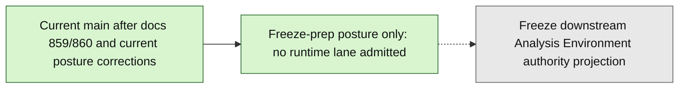

# Layer3 Progress Board

## M-STATE-RECONCILIATION

Milestone: `m_state_reconciliation_v1`.

Status: landed as PR #2497 (`7d390a644330d07e1c999da7bbf0005bbf1ffafa`,
2026-09-05 UTC); pins updated 2026-09-06 UTC after the two owner merges below.
It makes no runtime change.

Source frontier: `project6-origin/main`
`348956f38eccac4d55e2e42857f1ad5eecbd1382`. The verified landed sequence is
#2477 `1b2e170b`, #2478 `fcf6070d`, #2479 `f6b70030`, #2481 `c1fcd840`,
#2482 `0b65b4f0`, #2486 `89b04fef`, #2487 `2182177e`, #2489
`892a6b0a2fd8be4b3385c9304974e1e0a523cd40`, #2490
`d7488c05520405716eceab7093ec84d268870b68`, #2491 `f8f4ee9c`, #2492
`9d358139dcc05386a8b956691af478ccaa62038a`, #2493
`c979edad991bef3ecc1b310edeb8bd9964f40333`, #2494
`d9412188e9581302429112cc637e416fe666994f`, #2497 `7d390a64` (docs), #2495
`de693eea607fba511fb4e95f121bebaa54e82e13`, and #2496 at the source
frontier. These changes establish only their bounded connector-intake,
adopted-external, and public ScienceBase slices; they do not establish whole-B1b,
integrated-loop, scientific-utility, Phase 4/5/6, nonlocal, or production
completion.

Current public posture: `LAYER3_PUBLIC_DATASET_ANALYSIS_ENABLED=false` and
`LAYER3_PUBLIC_CONNECTOR_VALUE_REVEAL_ENABLED=false`. Analysis admits only the
new public `sciencebase/public_api` family. Values require both flags, approved
plan/pass/run and artifact identity, provenance co-display, and storage-reference
exclusion. These are bounded experimental default-off subfeatures under the
existing intentionally scoped 32-capability profile; the support-matrix IDs,
counts, statuses, and pin set remain unchanged.

Owner merge decisions executed 2026-09-06 UTC: #2495 (head
`44c3a433d39c5c676c2e1d163ab19b8e0965f6bf`) merged as
`de693eea607fba511fb4e95f121bebaa54e82e13`; #2496 (head
`1de3b1e291a854ef69a3d46bfa1cfd31cc240349`) merged as
`348956f38eccac4d55e2e42857f1ad5eecbd1382`. The #2496 default-off
method-selection cohort/intersection/UI repair is now current-main behavior
behind `LAYER3_OPERATOR_METHOD_SELECTION_ENABLED=false`. This record grants no
further authority.

Analytical limit: retained public runs prove workflow plumbing, not robust
temporal findings; cross-sectional row order is not time. Operator-local
unpublished evidence qualifies a 60-quarter derivative with an explicit
normalized coordinate and per-point lineage. Production STL accepted period 4
in memory, while residual stationarity remained warn/inconclusive. This is not
a scientific finding, ScienceBase provenance, or persisted real-data API/Layer
3 proof. A fresh isolated persisted proof is next after docs synchronization;
the local proof needs no new download, while a public-envelope proof requires
an appropriate admitted public input.

Historical correction: July's explicit-second-key `NOT-GRANTED` disposition
still governs that exact old proposal, but no longer supports a blanket claim
that later B1b-related source is absent. Later source presence does not
retroactively approve or close the old ballot.

Tracking keys: `m_state_reconciliation_tracking` and
`latest_m_state_reconciliation_summary`. Proof keys:
`m_state_reconciliation_proof` and
`latest_m_state_reconciliation_proof_summary`.

Boundary: no support policy, capability inventory, schema, migration, config
default, runtime status, acquisition, flag arming, persisted run, credentialed
lane, signing, egress, I12/ledger custody, owner decision, PR merge, or
production-readiness change. Private operator records and raw sources are not
published or linked by this milestone.

Live-main SHA semantics (2026-06-18), updated 2026-07-02: this board is a
mixed historical ledger.
The prior 2026-06-18 front-door anchor, `project6-origin/main`
`f679f64f08a595fe724158d46006be77a179c786`, is retained as a historical
PR `#2334` re-anchor, not as a self-updating current-main claim. The A8
record-truth-3 source frontier is `project6-origin/main`
`f566ddb14f62cd717f697f1d13b533ff434785ed` after PR `#2421`; the refresh
itself is PR `#2422` and should be revalidated at the PR head or merge commit. Older
`Current-main` sections and embedded 40-character hashes are retained as
historical lineage/proof notes, not as live ancestry declarations, unless a
later focused refresh explicitly revalidates that entry against
`project6-origin/main`.

## SEC XBRL Current Posture Reconciliation

Milestone:
`sec_xbrl_current_posture_reconciliation_v1`.

Planning doc:
`next_milestone_plans/Layer3_planning_docs/1360-posture-reconcile.md`.

Status: branch-local docs/test honesty pass. It reconciles historical docs 1350
and 1353 with current live-main authority at `6b83cd0b80e2f17f82f1c58c466e7163480be0d3`.

Scope: controlled value reveal remains `experimental_default_off`; the config
default for `LAYER3_SEC_XBRL_CONTROLLED_VALUE_REVEAL_SUBMIT_ENABLED` remains
`false`; README/support-matrix local RC3 posture remains authoritative; runtime
posture tests now prove default gated behavior separately from explicit-enabled
behavior.

Boundary: no support-matrix status change, config default change, runtime
behavior change, route/API change, model/migration, value-reveal activation,
live SEC network access, Arelle invocation, redaction-posture change, or
production-readiness claim.

Next posture: select exactly one production-readiness activation surface, with
live SEC source acquisition preferred before Arelle invocation, multi-filing
authority, delivery/export/status, nonlocal auth hardening, or default-on/value
reveal graduation.

## SEC Live Source Matrix Transition

Milestone:
`sec_live_network_egress_experimental_default_off_transition_v1`.

Planning doc:
`next_milestone_plans/Layer3_planning_docs/1361-sec-live-source-matrix-transition.md`.

Status: branch-local Tier-2 support-matrix classification transition. It moves
only `sec_live_network_egress` from `unsupported` to `experimental_default_off`
because current main already contains the bounded SEC EDGAR live source-artifact
acquisition runtime, rendered control, fake-client tests, redirect guard, and
redacted receipt/status proof.

Boundary: no config default change, no default-on live network, no real-network
CI proof, no value reveal, no controlled-submit change, no route/API behavior
change, no model/migration, no redaction-posture change, and no production-ready
claim. `LAYER3_SEC_EDGAR_LIVE_NETWORK_ENABLED` remains pinned false for the
selected profile.

Next posture: run an operator-configured manual live SEC source-artifact smoke
outside CI and record only redacted/hash receipt evidence before Arelle/fact
authority, multi-filing, delivery/export/status, nonlocal auth, or value-reveal
graduation.

## SEC Live Source Manual Smoke Freeze

Milestone:
`sec_live_source_manual_smoke_freeze_v1`.

Planning doc:
`next_milestone_plans/Layer3_planning_docs/1362-sec-live-source-manual-smoke-freeze.md`.

Status: planning/control freeze only.

Scope: selects one operator-configured manual live SEC source-artifact smoke as
the next exact production-readiness proof surface. The smoke must run outside CI,
use explicit server configuration and operator confirmation, target one small
allowlisted complete-submission text filing, and record only redacted/hash-only
receipt evidence.

Boundary: Runtime behavior introduced by this freeze: `false`.
Real SEC network request performed by this freeze: `false`.
No config default, support-matrix status, route/API behavior, model/migration,
persistence, redaction posture, Arelle invocation, multi-filing enforcement,
delivery/export/provider behavior, nonlocal auth, value reveal, default-on
behavior, or production-readiness claim is admitted.

Next posture: `execute_operator_configured_manual_live_sec_source_artifact_smoke`.

## SEC Live Source Smoke Preflight

Milestone:
`sec_live_source_artifact_manual_smoke_preflight_v1`.

Planning doc:
`next_milestone_plans/Layer3_planning_docs/1363-sec-live-preflight.md`.

Status: validate-only preflight.

Scope: adds `diagnostics/assessment/sec-live-preflight.py`, the artifact-free
`./project6.ps1 -Action validate-sec-live-preflight` wrapper, and covered
backend tests for the selected manual SEC live source-artifact smoke. The
preflight checks explicit live-network enablement, server User-Agent presence,
non-CI runtime, runtime-normalized writable isolated storage, safe database
containment, bounded rate/size/timeout controls, valid calendar filing date,
and one operator-approved cache-free smoke request identity while returning
only markers and bounded metadata.

Boundary: Runtime behavior introduced by this preflight: `false`.
Real SEC network request performed by this preflight: `false`. Source artifact
or receipt created by this preflight: `false`. No config default,
support-matrix status, route/API behavior, model/migration, persistence,
redaction posture, Arelle invocation, multi-filing enforcement,
delivery/export/provider behavior, nonlocal auth, value reveal, default-on
behavior, or production-readiness claim is admitted.

Next posture:
`run_one_filing_live_source_artifact_smoke_with_redacted_hash_only_evidence`.

## SEC Live Source Offline Replay

Milestone:
`sec_live_source_artifact_offline_replay_v1`.

Status: branch-local offline/mock replay diagnostic and tests.

Scope: adds `diagnostics/assessment/sec-live-replay.py`, the synthetic
`diagnostics/assessment/sec-live-fixture.txt`, and covered backend tests for a
full acquire -> redact -> hash-only-store -> provenance replay using only a fake
SEC transport. The replay binds the fixture to the selected filing identity,
uses a fresh isolated runtime storage directory per run, restores the prior
process live-request counter, proves idempotent readback through the retained
server artifact path, and reports only hashes/markers/bounded metadata.

Boundary: Real SEC network request performed by this replay: `false`. Config
default, support-matrix status, and redaction posture changed by this replay:
`false`. Source artifact/receipt creation is confined to isolated offline
runtime storage populated by fake transport bytes. No Arelle invocation,
multi-filing enforcement, delivery/export/provider behavior, nonlocal auth,
value reveal, default-on behavior, support-matrix graduation, or
production-readiness claim is admitted.

Next posture:
`complete_sec_live_preflight_capstone_after_replay`.

## SEC Live Source Preflight Capstone

Milestone:
`sec_live_source_artifact_smoke_preflight_capstone_v1`.

Status: branch-local validate-only capstone hardening.

Scope: tightens `diagnostics/assessment/sec-live-preflight.py` so the ready
decision requires explicit rate/request/byte/timeout runtime bound variables to
be present and admitted, in addition to the existing explicit live flag,
User-Agent, non-CI runtime, runtime-normalized writable off-repo/off-OneDrive
storage, `STORAGE_EXPOSURE=disabled`, admitted database, calendar-valid filing
date, operator confirmation, and cache-free selected source identity. It also
strengthens the `sec_live_network_egress` support-matrix runtime probe so the
fake-client proof restores the prior process live-request counter and temporary
SEC bound settings.

Boundary: Real SEC network request performed by this capstone: `false`.
Preflight source artifact or receipt creation: `false`. Config default,
support-matrix status, and redaction posture changed by this capstone: `false`.
No Arelle invocation, multi-filing enforcement, delivery/export/provider
behavior, nonlocal auth, value reveal, default-on behavior, support-matrix
graduation, or production-readiness claim is admitted. The remaining real smoke
is still owner-gated.

Next posture:
`owner_runs_one_filing_live_source_artifact_smoke_with_redacted_hash_only_evidence`.

## SEC Live Source Operator Smoke Runner

Milestone:
`sec_live_source_artifact_operator_smoke_v1`.

Planning doc:
`next_milestone_plans/Layer3_planning_docs/1364-sec-live-smoke-operator-runner.md`.

Status: operator-gated smoke runner and fake-transport proof.

Scope: adds `diagnostics/assessment/sec-live-smoke.py` and focused backend
tests for the selected one-filing SEC live source-artifact smoke. The runner is
dry-run/no-network/no-write by default, requires `--execute-live` before it may
call the existing server-owned live acquisition service, first requires the
existing preflight ready decision, then records only selected redacted
receipt/source hashes, response hashes, cache metadata, and idempotency/status
metadata. The committed execution proof uses a fake SEC client and isolated
pytest storage only.

Boundary: Real SEC network request performed by committed validation: `false`.
Runtime route/schema/model/default/support-matrix/redaction behavior changed:
`false`. Fake-transport source artifacts and receipts are confined to isolated
test storage. No Arelle invocation, multi-filing enforcement,
delivery/export/provider behavior, nonlocal auth, value reveal, default-on
behavior, support-matrix graduation, or production-readiness claim is admitted.

Next posture:
`operator_runs_sec_live_source_artifact_smoke_with_private_redacted_report`.

## SEC Live Source Smoke Evidence Verifier

Milestone:
`sec_live_source_artifact_smoke_evidence_verification_v1`.

Planning doc:
`next_milestone_plans/Layer3_planning_docs/1365-sec-live-smoke-evidence-verifier.md`.

Status: branch-local validate-only evidence verifier.

Scope: adds `diagnostics/assessment/sec-live-smoke-evidence.py`, the
artifact-free `./project6.ps1 -Action validate-sec-live-smoke-evidence` wrapper,
and focused backend tests for verifying an operator-private SEC live smoke
report against retained server-owned source-artifact status in the current
isolated `STORAGE_DIR`. The verifier requires the private smoke report to have
executed successfully with `live_http` transport and real SEC network execution,
remain redacted/hash-only, contain valid 64-hex hash fields, and match the
retained live receipt/source artifact hashes, source identity hash, content
hash, content length, and retained artifact availability.

Boundary: Real SEC network request performed by committed validation: `false`.
Source artifact or receipt created by this verifier: `false`. Runtime
route/schema/model/default/support-matrix/redaction behavior changed: `false`.
Committed proof uses fake-transport retained storage and live-report-shaped
fixture data, and separately proves fake-transport reports block. No Arelle
invocation, fact authority, multi-filing enforcement,
delivery/export/provider behavior, nonlocal auth, value reveal, default-on
behavior, support-matrix graduation, or production-readiness claim is admitted.

Next posture:
`bind_arelle_fact_authority_to_server_owned_live_source_artifact`.

## P24 Mixed-Source Product-Authority Checkpoint

Milestone:
`p24_mixed_source_product_authority_checkpoint`.

Closeout doc:
`next_milestone_plans/multi-ingest/56-p24-product-authority-checkpoint.md`.

Status: current-main. Content present on main tip f679f64f. The P24
read-only product-authority checkpoint rendered controls are on current main
after the 2026-06-06 history rebuild folded the branch-local work into the
canonical line. Post-merge proof recorded 2026-06-11 (see closeout doc).

Scope: renders a read-only `/review/layer3` mixed-source checkpoint over the
already-loaded P17 handoff/export prepare, P18 APS handoff dispatch, P19
external export/download readiness, P21 same-origin delivery, and P22
same-origin signed-reference authority chain. It adds no route, payload
builder, submit handler, persisted state, or transport path.

Boundary: no backend route/service, schema/model/migration, durable persistence,
parser/source-shape expansion, provider/public URL, connector/destination/local
outbox, package payload rewrite/mutation, download URL, signed-reference
status/revocation, external dispatch, value reveal, default-on, or
production-readiness behavior is admitted.

Proof: branch-local JS/module syntax, static page contract proof, and focused
headless plus headed Playwright rendered-flow proof passed.

Next posture: P22/P23/P24 are on current main (tip f679f64f). Provider/public
URL governance, connector/destination/local-outbox dispatch, durable revocation
UI/API, schema/source-shape expansion, and production readiness remain separate
future freezes.

## P23 Mixed-Source Product-Flow Usability Proof

Milestone:
`p23_mixed_source_product_flow_usability_proof`.

Closeout doc:
`next_milestone_plans/multi-ingest/55-p23-product-flow-usability-proof.md`.

Status: current-main. Content present on main tip f679f64f. The P23
rendered product-flow usability proof is on current main after the 2026-06-06
history rebuild folded the branch-local work into the canonical line.
Post-merge proof recorded 2026-06-11 (see closeout doc).

Scope: proves the rendered `/review/layer3` mixed-source flow can proceed from
server-owned P17 handoff/export prepare authority through P18 APS handoff
dispatch, P19 external export/download readiness, and P22 same-origin
signed-reference generation without synthetic P19 readiness. P18 still uses the
existing `/handoff/aps/dispatch` backend route with mixed material fields; P19
uses the existing `/handoff/export/download/readiness` route.

Boundary: no backend route/service, schema/model/migration, durable persistence,
parser/source-shape expansion, provider/public URL, connector/destination/local
outbox, package payload rewrite/mutation, download URL, SEC XBRL, value reveal,
default-on, or production-readiness behavior is admitted.

Proof: branch-local JS/module syntax, static page contract proof, focused
headless and headed Playwright rendered-flow proof, plus the existing P21/P22
rendered-control regression group passed.

Next posture: superseded by P24 product-authority checkpoint (also on current
main at tip f679f64f). The next downstream surface must be selected by a
separate freeze before implementation.

## P22 Mixed-Source Signed-Reference Runtime And Rendered Controls

Milestone:
`p22_mixed_source_signed_reference_runtime`.

Closeout doc:
`next_milestone_plans/multi-ingest/54-p22-runtime-closeout.md`.

Status: current-main. Content present on main tip f679f64f. The P22 runtime
and rendered controls (layer3.js elements
`external-export-download-signed-reference-generate` and
`external-export-download-signed-reference-use`) are on current main after the
2026-06-06 history rebuild folded the branch-local work into the canonical
line. Post-merge proof recorded 2026-06-11 (see closeout doc).

Scope: admits mixed-source same-origin signed-reference generation/use over the
existing P20 mixed-source delivery validator and existing durable
signed-reference token/receipt/audit state, and renders `/review/layer3`
generate/use controls from `State.sessionSummary.external_export_download_readiness`.
The route family is
`POST /api/v1/layer3/handoff/export/download/signed-reference/generate` and
`POST /api/v1/layer3/handoff/export/download/signed-reference/use`.

Boundary: no download URL, provider/public URL, connector/provider/destination/
local-outbox behavior, schema/model/migration, parser/source-shape expansion,
package payload rewrite/mutation, SEC XBRL, excluded-tool, value reveal,
default-on, or production-readiness behavior is admitted.

Proof: branch-local compile, focused P22 signed-reference API proof, OpenAPI
contract proof, static page contract proof, existing signed-reference/delivery
regression slices, durable signed-reference state tests, full
`backend/tests/test_layer3_api.py`, full `backend/tests/test_layer3_page.py`,
focused headless and headed Playwright rendered-control proof,
authority-index validation, frozen target-selection validation, progress check,
and `git diff --check` passed.

Next posture: P22/P23/P24 are on current main (tip f679f64f). Freeze exactly
one next downstream surface before implementation: provider/public URL
governance, connector/destination/local-outbox dispatch, or durable revocation
UI.

## P22 Mixed-Source Signed-Reference Governance Freeze

Milestone:
`p22_mixed_source_signed_reference_governance_freeze`.

Planning doc:
`next_milestone_plans/multi-ingest/53-p22-mixed-signed-reference-freeze.md`.

Status: branch-local docs/control freeze only. No runtime behavior, backend
route/API change, rendered UI/static change, durable-state change,
schema/model/migration, parser/source-shape expansion, package payload rewrite,
download URL, provider/public URL, connector/provider/destination/local-outbox
behavior, SEC XBRL surface, excluded-tool behavior, value reveal, default-on
behavior, or production readiness is admitted.

Scope: selects mixed-source same-origin signed-reference governance as the next
exact downstream surface after current-main P21 rendered delivery controls. The
future implementation may admit signed-reference generation/use only after
server-side revalidation of the full P14/P15/P16/P17/P18/P19/P20/P21 mixed
material-authority chain and the current `review_facing` package row.

Selection basis: P21 current main already renders same-origin delivery controls
over the P20 mixed-source artifact-stream route and explicitly blocks
mixed-source signed-reference controls. Provider/public URL and
connector/destination governance docs still require separate activation
evidence and exact mode selection before implementation, so they remain later
surfaces.

Non-goals: no runtime code, backend route/API change, rendered UI/static
behavior, signed-reference generation/use/status/revocation, durable-state
schema change, provider/public URL, connector/destination, package mutation,
package payload rewrite, parser/source-shape expansion, download URL, SEC XBRL,
source acquisition, Arelle, excluded-tool behavior, value reveal, default-on
behavior, or production-readiness change.

Proof: this branch-local freeze requires manifest JSON syntax,
authority-index validation, frozen target-selection validation, progress check,
and `git diff --check`.

Next posture: after this freeze merges and current-main syncs, implement only
mixed-source same-origin signed-reference generation/use over existing
P19/P20/P21 delivery authority. Stop for a separate freeze if provider/public
URL, connector/destination, durable-state schema expansion, rendered controls,
package payload rewrite, parser/source-shape expansion, local outbox, or
external download URL behavior is required.

## P21 Mixed-Source Rendered Delivery Controls Current-Main Sync

Milestone:
`p21_mixed_source_rendered_delivery_controls_current_main_sync`.

Sync doc:
`next_milestone_plans/multi-ingest/52-p21-current-main-sync.md`.

Status: docs/control current-main sync for PR #2226 at live
`project6-origin/main` `dcd0e159b5bb0ac7eb1c6af6b6609e4c9b31b48d`.

Scope: records that P21 rendered mixed-source delivery controls are
current-main behavior. PR #2226 makes the existing rendered `/review/layer3`
external export/download delivery form usable for the already-live P20
mixed-source same-origin delivery route. The rendered control uses server-owned
`State.sessionSummary.external_export_download_readiness`, selects only the
`review_facing` mixed package, submits `operator_decision:
deliver_mixed_source_external_export_download`, prefers refreshed delivered
state over optimistic local submitted state, and keeps stale source-directory
authority from taking over mixed-source routes. This sync changes no runtime
code.

Non-goals: no backend route/runtime change, API schema/DTO/model/migration,
parser/source-shape expansion, package payload rewrite, package mutation,
download URL, signed reference, public/provider URL, connector/provider/
destination/local-outbox behavior, source acquisition, Arelle, SEC XBRL,
excluded-tool behavior, value reveal, default-on behavior, or production
readiness.

Proof: PR #2226 CI passed all required backend Layer 3 API and test shards; two
review threads were addressed and resolved before merge. Detached post-merge
proof passed JS syntax, focused Layer 3 page tests, focused mixed-source
external export/download API tests, the shared mixed delivery response helper
test, focused headless and headed Playwright P21 rendered-control proof,
manifest JSON syntax, authority-index validation, frozen target-selection
validation, progress check, and `git diff --check`.

Next posture: freeze exactly one next downstream surface before implementation.
Candidate surfaces remain signed-reference governance, provider/public URL
governance, connector/destination dispatch, durable audit or revocation
behavior, product-flow usability proof, or a product-authority checkpoint.

## P21 Mixed-Source Rendered Delivery Controls Runtime

Milestone:
`p21_mixed_source_rendered_delivery_controls_runtime`.

Closeout doc:
`next_milestone_plans/multi-ingest/51-p21-rendered-runtime-closeout.md`.

Status: current-main runtime implementation verified after PR #2226.

Scope: implements the P21 freeze by making the existing rendered
`/review/layer3` external export/download delivery form usable for the
already-live P20 mixed-source same-origin delivery route. The rendered control
uses server-owned `State.sessionSummary.external_export_download_readiness`,
selects only the `review_facing` mixed package, submits `operator_decision:
deliver_mixed_source_external_export_download`, and keeps selected-pass/source-
directory authority separate.

Proof: current-main proof is recorded in
`next_milestone_plans/multi-ingest/51-p21-rendered-runtime-closeout.md`.

## P21 Mixed-Source Rendered Delivery Controls Freeze

Milestone:
`p21_mixed_source_rendered_delivery_controls_freeze`.

Planning doc:
`next_milestone_plans/multi-ingest/50-p21-rendered-delivery-freeze.md`.

Status: branch-local docs/control freeze only. No runtime behavior or rendered
UI/static behavior is admitted.

Scope: selects rendered `/review/layer3` operator controls over the already-live
P20 mixed-source same-origin external export/download delivery runtime as the
next exact downstream surface. Future implementation may use only server-owned
P20/P19/session-summary material authority and the existing
`POST /api/v1/layer3/handoff/export/download/deliver` route.

Non-goals: no backend runtime, API route, rendered UI/static behavior, browser
download control, download URL, signed reference, public/provider URL,
connector/provider/destination/local-outbox behavior, schema/model/migration,
parser/source-shape expansion, package payload rewrite, SEC XBRL surface,
excluded-tool behavior, or production-readiness change.

Proof: this branch-local freeze requires manifest JSON syntax, authority-index
validation, frozen target-selection validation, progress check, and
`git diff --check`.

Next posture: after this freeze merges and current-main syncs, implement only
rendered mixed-source delivery controls over the existing P20 same-origin
stream; stop for a separate freeze if any signed-reference, provider,
connector, destination, schema, parser, source-shape, package payload rewrite,
local outbox, or download URL behavior is required.

## P20 Mixed-Source Current-Main Sync

Milestone:
`p20_mixed_source_external_export_download_delivery_current_main_sync`.

Sync doc:
`next_milestone_plans/multi-ingest/49-p20-current-main-sync.md`.

Status: docs/control current-main sync for PR #2223 at live
`project6-origin/main` `6ca7835c6d8724715c9ac2d7a92ca34de2898ef2`.

Scope: records that P20 mixed-source same-origin external export/download
delivery is current-main runtime behavior. PR #2223 streams one existing
server-owned mixed-source package artifact only after revalidating recorded P19
readiness, P14/P15/P16/P17/P18/P19 authority, current package rows, selected
package id/kind/hash, and artifact hash. This sync changes no runtime code.

Non-goals: no runtime code, rendered UI/static behavior, browser download
control, download URL, signed reference, public/provider URL,
connector/provider/local-outbox/destination behavior, schema/model/migration,
parser, source-shape expansion, package payload rewrite, package
reconstruction/mutation, SEC XBRL surface, excluded-tool behavior, or
production-readiness change.

Proof: detached post-merge proof after PR #2223 passed touched compile, focused
P20/API delivery and OpenAPI slice with `23 passed, 273 deselected, 4 warnings`,
affected external export contract/response helper tests with `11 passed, 2
warnings`, bounded E2E slice with `1 passed, 3 deselected, 4 warnings`, full
Layer 3 API suite with `296 passed, 4 warnings`, manifest JSON syntax,
authority-index validation, frozen target-selection validation, progress check,
and `git diff --check`. PR #2223 had zero review threads.

Next posture: freeze exactly one next mixed-source downstream surface before
implementation.

## P20 Mixed-Source External Export/Download Delivery Runtime

Milestone:
`p20_mixed_source_external_export_download_delivery_runtime`.

Closeout doc:
`next_milestone_plans/multi-ingest/48-p20-runtime-closeout.md`.

Status: current-main runtime implementation verified after PR #2223.

Scope: implements exactly one same-origin artifact-stream delivery surface over
recorded P19 mixed-source external export/download readiness. The runtime
revalidates P14/P15/P16/P17/P18/P19 authority, current package rows, selected
package id/kind/hash, readiness refs, and server-owned package artifact hash
before streaming an existing mixed-source package artifact.

Non-goals: no rendered UI/static behavior, browser download control, download
URL, signed reference, public/provider URL, connector/provider/local-outbox/
destination behavior, schema/model/migration, parser, source-shape expansion,
package payload rewrite, package reconstruction/mutation, SEC XBRL surface,
excluded-tool behavior, or production-readiness change.

Proof: branch-local compile and focused delivery/API/helper/bounded E2E slices
passed before PR #2223. Detached post-merge proof from live main repeated
touched compile, focused API/helper/E2E slices, full Layer 3 API suite, manifest
JSON syntax, governance validators, progress check, and `git diff --check`.

Next posture: after `49-p20-current-main-sync.md`, freeze exactly one next
mixed-source downstream surface: rendered delivery controls, signed-reference
governance, provider/public URL governance, connector/destination dispatch, or a
stop-for-product-authority checkpoint.

## P20 Mixed-Source External Export/Download Delivery Freeze

Milestone:
`p20_mixed_source_external_export_download_delivery_freeze`.

Planning doc:
`next_milestone_plans/multi-ingest/47-p20-mixed-export-download-delivery-freeze.md`.

Status: branch-local docs/control freeze only. No runtime behavior is admitted.

Scope: selects mixed-source same-origin external export/download delivery as the
next exact downstream surface over recorded P19 readiness. The future runtime
may return only a server-revalidated same-origin artifact stream for one
existing mixed-source package artifact if P14/P15/P16/P17/P18/P19 authority,
package id, package kind, package payload hash, readiness ref, and delivery
mode all match server-owned state.

Non-goals: no backend runtime in this freeze, rendered UI/static behavior,
browser download control, download URL, signed reference, public/provider URL,
connector/provider/local-outbox/destination behavior, schema/model/migration,
parser, source-shape expansion, package payload rewrite, package
reconstruction/mutation, SEC XBRL surface, excluded-tool behavior, or
production-readiness change.

Proof: docs/control validation only is required for this freeze: manifest JSON
syntax, authority-index validation, frozen target-selection validation,
progress check, and `git diff --check`.

Next posture: after this freeze merges and current main is synced, implement
only mixed-source same-origin external export/download delivery over recorded
P19 readiness. Rendered delivery controls, download URLs, signed references,
public/provider URLs, connector/provider/destination behavior, schema/parser
source-shape widening, payload rewrite, excluded-tool behavior, and production
readiness remain blocked until later freezes select them.

## P19 Mixed-Source Current-Main Sync

Milestone:
`p19_mixed_source_external_export_download_readiness_current_main_sync`.

Sync doc:
`next_milestone_plans/multi-ingest/46-p19-current-main-sync.md`.

Status: docs/control current-main sync for PR #2220 at live
`project6-origin/main` `9e4451cb710c0185a64f1788b9e0d848be7dbc8b`.

Scope: records that P19 mixed-source external export/download readiness is
current-main runtime behavior. PR #2220 records reference-only readiness state
over the existing P18 APS handoff dispatch state; this sync changes no runtime
code.

Non-goals: no runtime code, rendered UI/static behavior, schema/model/migration,
parser, source-shape expansion, package payload rewrite, package reconstruction,
external export/download delivery, browser download, download URL, signed
reference, public/provider URL, connector/provider/local-outbox/destination
behavior, excluded-tool behavior, or production-readiness change.

Proof: detached post-merge proof after PR #2220 passed touched compile, focused
P19/API contract and error-envelope slice with `28 passed, 267 deselected, 3
warnings`, full Layer 3 API suite with `295 passed, 4 warnings`, affected
external export response helper tests with `6 passed, 2 warnings`, manifest JSON
syntax, authority-index validation, frozen target-selection validation, progress
check, and `git diff --check`. PR #2220 had zero review threads.

Next posture: freeze mixed-source external export/download delivery as the next
exact downstream surface over recorded P19 readiness. Delivery, download URLs,
signed references, public/provider URLs, connector/provider behavior,
schema/parser/source-shape widening, payload rewrite, excluded-tool behavior,
and production readiness remain blocked until a later freeze selects and proves
them.

## P19 Mixed-Source External Export/Download Readiness Runtime

Milestone:
`p19_mixed_source_external_export_download_readiness_runtime`.

Closeout doc:
`next_milestone_plans/multi-ingest/45-p19-runtime-closeout.md`.

Status: current-main runtime implementation verified after PR #2220.

Scope: implements only mixed-source external export/download readiness over the
recorded P18 reference-only mixed-source APS handoff dispatch state. The runtime
recomputes P14/P15/P16/P17/P18 material/package/handoff authority server-side,
records one readiness state in reconciliation/session JSON, projects it through
the existing `external_export_download` session-summary surface, and emits only
public `layer3://mixed-source-package/...` package refs plus a public
`layer3://mixed-source-external-export/...` readiness ref.

Non-goals: no rendered UI/static behavior, external export/download delivery,
browser download, download URL, signed reference, public/provider URL,
connector/provider/local-outbox/destination behavior, schema/model/migration,
parser, source-shape expansion, package payload rewrite, package reconstruction,
excluded-tool behavior, or production-readiness change.

Proof: branch-local compile passed for touched API/service/test files; focused
P19/API contract and error-envelope slice passed with `28 passed, 267
deselected, 3 warnings`; full Layer 3 API suite passed with `295 passed, 4
warnings`; affected external export response helper tests passed with `6 passed,
2 warnings`. Manifest JSON syntax, authority-index validation, frozen
target-selection validation, progress check, and `git diff --check` also passed
branch-local. Detached post-merge proof from live main
`9e4451cb710c0185a64f1788b9e0d848be7dbc8b` repeated the same targeted API/helper
and governance checks.

Next posture: after `46-p19-current-main-sync.md`, freeze mixed-source external
export/download delivery as the next exact downstream surface. Delivery,
download URLs, signed references, public/provider URLs, connector/provider
behavior, schema/parser/source-shape widening, payload rewrite, excluded-tool
behavior, and production readiness remain blocked until a later freeze selects
and proves them.

## P19 Mixed-Source External Export/Download Readiness Freeze

Milestone:
`p19_mixed_source_external_export_download_readiness_freeze`.

Planning doc:
`next_milestone_plans/multi-ingest/44-p19-mixed-export-download-readiness-freeze.md`.

Status: branch-local docs/control freeze only. No runtime behavior is admitted.

Scope: selects mixed-source external export/download readiness as the next exact
downstream surface after P18. This is the first external export/download surface
for mixed sources and records a reference-only readiness state only. It does not
deliver, download, or expose any external artifact, URL, or signed reference.
The recorded P18 reference-only mixed-source APS handoff dispatch state is the
prerequisite authority because external export/download readiness already
requires a recorded APS handoff dispatch state.

Non-goals: no backend route, runtime behavior, DTO, model, migration, UI/static
behavior, parser, source-shape, package payload rewrite, external export/download
readiness runtime, external export/download delivery, download URL, signed
reference, public/provider URL, connector/provider/local-outbox/destination
behavior, excluded-tool behavior, or production readiness change.

Proof: docs/control validation only is required for this freeze: manifest JSON
syntax, authority-index validation, frozen target-selection validation,
progress check, and `git diff --check`.

Next posture: after this freeze merges and current-main syncs, implement only
mixed-source external export/download readiness. External export/download
delivery, download, signed reference, public URL, connector, and provider
behavior remain blocked until that readiness runtime lands and a later delivery
freeze is selected.

## P18 Mixed-Source Current-Main Sync

Milestone:
`p18_mixed_source_aps_handoff_dispatch_current_main_sync`.

Sync doc:
`next_milestone_plans/multi-ingest/43-p18-current-main-sync.md`.

Status: docs/control current-main sync for PR #2216 and review-debt follow-up
PR #2217 at live `project6-origin/main`
`a182a33e32eea7b235859fd23cbe40c06307ed09`.

Scope: records that P18 mixed-source APS handoff dispatch is current-main
runtime behavior. PR #2216 records reference-only mixed-source APS handoff
dispatch state over the existing P17 handoff/export prepare state; PR #2217
splits the OpenAPI request contract into selected-pass and mixed-source shapes
and proves blank or null mixed material-authority markers fail closed instead
of routing to selected-pass behavior.

Non-goals: no runtime code, rendered UI/static behavior, backend route, DTO,
schema/model/migration, parser, source-shape expansion, package payload
rewrite, package reconstruction, APS evidence-bundle package row, local
artifact/path/outbox, connector/provider/destination/network behavior,
external export/download readiness, delivery, download URL, signed reference,
public/provider URL, excluded-tool behavior, or production readiness change.

Proof: detached post-merge proof after PR #2216 passed touched compile,
focused P18 API/OpenAPI and mixed-source/package/APS dispatch slices, full
Layer 3 API suite, manifest JSON syntax, authority-index validation, frozen
target-selection validation, progress check, and `git diff --check`. PR #2217
follow-up proof passed focused OpenAPI/cross-shape tests, full Layer 3 API
suite, manifest JSON syntax, authority-index validation, frozen
target-selection validation, progress check, and `git diff --check`. PR #2216
has two resolved review threads; PR #2217 has zero review threads.

Next posture: freeze mixed-source external export/download readiness as the
next exact downstream surface before implementation.

## P18 Mixed-Source APS Handoff Dispatch Runtime

Milestone:
`p18_mixed_source_aps_handoff_dispatch_runtime`.

Closeout doc:
`next_milestone_plans/multi-ingest/42-p18-runtime-closeout.md`.

Status: current-main runtime implementation verified after PR #2216 and
review-debt follow-up PR #2217.

Scope: implements only mixed-source APS handoff dispatch over the already-live
P17 reference-only handoff/export prepare state selected by the P18 freeze. The
runtime recomputes P14/P15/P16/P17 authority server-side, records reference-only
dispatch state in reconciliation/session JSON, emits public
`layer3://mixed-source-package/...` and
`layer3://mixed-source-aps-handoff/...` refs, and does not create an APS
evidence-bundle package row, local artifact, local path, external export,
download, connector, provider, destination, or delivery behavior.

Non-goals: no rendered UI/static behavior, schema/model/migration, parser,
source-shape expansion, package payload rewrite, package reconstruction,
external export/download readiness, connector/provider/local-outbox behavior,
excluded-tool behavior, or production readiness change.

Proof: branch-local and detached post-merge py_compile passed for the touched
API/service/test files; the focused P18 API/OpenAPI slice passed with `2
passed, 290 deselected, 3 warnings`; the affected mixed-source/package/APS
dispatch API slice passed with `12 passed, 280 deselected, 3 warnings`; the
full Layer 3 API suite passed with `292 passed, 4 warnings`; PR #2217 focused
OpenAPI/cross-shape tests passed with `3 passed, 289 deselected, 3 warnings`;
manifest JSON syntax, authority-index validation, frozen target-selection
validation, progress check, and `git diff --check` passed.

Next posture: freeze mixed-source external export/download readiness as the
next exact downstream surface before implementation.

## P18 Mixed-Source APS Handoff Dispatch Freeze

Milestone:
`p18_mixed_source_aps_handoff_dispatch_freeze`.

Planning doc:
`next_milestone_plans/multi-ingest/41-p18-mixed-aps-handoff-freeze.md`.

Status: current-main docs/control freeze merged through PR #2215 at
`f7b4d865586161277572a78fa5b1153e24535160`. The freeze admitted no runtime
behavior by itself.

Scope: selects mixed-source APS handoff dispatch as the next exact downstream
surface after P17/P17A. This is the prerequisite surface before mixed-source
external export/download readiness can be pursued because the existing
external-export/download readiness path requires recorded APS handoff dispatch
authority, while current mixed-source P17/P17A authority only reaches
reference-only handoff/export prepare.

Non-goals: no backend route, runtime behavior, DTO, model, migration, UI/static
behavior, parser, source-shape, package payload rewrite, APS handoff runtime,
external export/download readiness, connector/provider/local-outbox behavior,
excluded-tool behavior, or production readiness change.

Proof: docs/control validation only is required for this freeze: manifest JSON
syntax, authority-index validation, frozen target-selection validation,
progress check, and `git diff --check`.

Next posture: P18 runtime may implement only mixed-source APS handoff dispatch.
Mixed-source external export/download readiness remains blocked until that
runtime lands, current main syncs, and a separate readiness freeze is selected.

## P17A Mixed-Source Current-Main Sync

Milestone:
`p17a_mixed_source_rendered_handoff_prepare_current_main_sync`.

Sync doc:
`next_milestone_plans/multi-ingest/40-p17a-current-main-sync.md`.

Status: docs/control current-main sync for PR #2210 and review-debt follow-up
PR #2211 at live `project6-origin/main`
`313d516c4766851110598dc16dc9c60270016dc9`.

Scope: records that the P17A rendered material-authority handoff/export
prepare control is current-main behavior and that the PR #2210 rendered-control
review debt is closed. The decision select and notes textarea now enable from
the same mixed-source material-authority predicate and lifecycle blockers as
the submit button.

Non-goals: no runtime code, backend route, DTO, model, migration, parser,
source-shape, package construction, package-review submit, handoff/export
persistence, APS handoff, external export/download, connector/provider/local
outbox behavior, payload rewrite, excluded-tool behavior, or production
readiness change.

Proof: detached current-main proof after PR #2211 passed static JS check, full
Layer 3 page tests, focused mixed-source handoff/export API slice, manifest
JSON syntax, authority-index validation, frozen target-selection validation,
progress check, and `git diff --check`. PR #2210 has one resolved review
thread; PR #2211 has zero review threads.

Next posture: freeze exactly one next mixed-source downstream surface before
runtime. APS handoff and external export/download readiness remain likely
candidates, but neither is selected by this sync.

## P17A Mixed-Source Rendered Handoff Prepare Runtime

Milestone:
`p17a_mixed_source_rendered_handoff_prepare_runtime`.

Closeout doc:
`next_milestone_plans/multi-ingest/39-p17a-rendered-runtime-closeout.md`.

Status: current-main rendered runtime implementation merged through PR #2210
and review-debt follow-up PR #2211.

Scope: implements only the rendered `/review/layer3` material-authority
handoff/export prepare path selected by the P17A freeze. The control derives
authority from server-owned mixed-source session summary/package submit/package
construction state, requires `package_review_approved`, exact
`canonical_internal`, `user_facing`, and `review_facing` package kinds, complete
package IDs and payload hashes, P17 material-preview/contract/construction
hashes, and submits target `mixed_source_review_package` with mode
`reference_envelope_only`.

Non-goals: no backend route, DTO, model, migration, parser, source-shape,
package construction, package-review submit, handoff/export persistence, APS
handoff, external export/download, connector/provider/local-outbox behavior,
payload rewrite, excluded-tool behavior, or production-readiness change.

Proof: `node --check ./backend/app/review_ui/static/layer3.js` passed;
`python -B -m pytest ./backend/tests/test_layer3_page.py -q` passed with
`22 passed, 3 warnings`; focused mixed-source handoff/export API contract slice
passed with `1 passed, 290 deselected, 3 warnings`. PR #2211 additionally
proves the mixed-source decision select and notes textarea enable when the
material-authority packet is complete.

Next posture: freeze exactly one next mixed-source downstream surface before
runtime, likely APS handoff or external export/download readiness. Keep
connector/provider/parser/schema/source-shape/payload-rewrite/excluded-tool/
production-readiness scope closed unless that later freeze admits it.

## P17A Mixed-Source Rendered Handoff Status Freeze

Milestone:
`p17a_mixed_source_rendered_handoff_status_freeze`.

Planning doc:
`next_milestone_plans/multi-ingest/38-p17a-rendered-status-freeze.md`.

Status: branch-local planning/control freeze only; no runtime behavior
admitted.

Scope: freezes the next rendered/operator path after current-main P17. Future
implementation may make `/review/layer3` submit the already-live P17
material-authority prepare request only from server-owned mixed-source session
summary authority. It must not use selected-pass `result_review_record_ref`
fallbacks, selected-pass `internal_export_envelope`/`prepare_only` defaults,
browser-authored package authority, local paths, or request-supplied package
payloads.

Non-goals: no backend API route change, no P17 API contract change, no
package-family policy change, no schema/model/migration, no parser behavior, no
source-shape expansion, no package construction/submit/prepare backend behavior
change, no APS handoff, no external export/download, no connector/provider/local
outbox/network behavior, no package payload rewrite, and no production-readiness
behavior.

Verification: docs/control validation only: manifest JSON, authority-index,
target-selection frozen, progress check, and `git diff --check`.

Next posture: completed by the P17A rendered runtime and current-main sync.
Future work must freeze one downstream mixed-source surface before selecting
APS handoff or external export/download runtime.

## P17 Mixed-Source Handoff Export Prepare Runtime

Milestone:
`p17_mixed_source_handoff_export_prepare_runtime`.

Planning docs:
`next_milestone_plans/multi-ingest/36-p17-mixed-handoff-freeze.md`;
`next_milestone_plans/multi-ingest/37-p17-runtime-closeout.md`.

Status: current-main runtime implementation from PR `#2205`. Later P17A work
adds the separate rendered material-authority UI path for this prepare API
without changing P17 backend route behavior.

Scope: admits material-authority mixed-source handoff/export prepare-only
runtime over approved P16 submit state. The route recomputes P14 authority
server-side, verifies P15 reconciliation/package rows and P16 submit state,
records one prepare state in existing reconciliation/session JSON, and emits a
reference-only envelope with public `layer3://mixed-source-package/...` refs.

Containment: no APS handoff, external export/download, connector dispatch,
provider URL, signed URL, public URL, local outbox, network egress, schema,
model, migration, parser, source-shape, package payload rewrite, package
mutation/reconstruction, legacy bridge deprecation, excluded-tool behavior, or
production-readiness behavior is admitted.

Verification: PR `#2205` post-merge proof passed touched compile, focused
mixed-source handoff/API slices, full Layer 3 API suite, focused
package-family/package-contract/workbench-state/submit-response/workbench
suite, manifest JSON, authority-index, target-selection frozen, progress, and
`git diff --check` gates. This follow-up adds focused proof that pre-prepare
session summary remains unavailable to rendered selected-pass UI controls.

Next posture: after this review-debt follow-up lands, freeze exactly one next
mixed-source downstream surface before runtime, likely rendered/operator status,
APS handoff, or external export/download readiness.

## SEC XBRL Resolved-Fact Diagnostic Redaction Cleanup

Milestone:
`sec_xbrl_resolved_fact_diagnostic_redaction_cleanup_v1`.

Planning doc:
`next_milestone_plans/Layer3_planning_docs/1349-sec-xbrl-custom-guard-audit.md`.

Status: merged as PR #2173 at commit `a2775067` (`685efc39` implementation,
`a2775067` merge).

Scope: removes the two remaining local resolved-fact diagnostic
`_redaction_scan_payload` wrapper functions by binding the existing shared
`diagnostic_resolved_fact_redaction_scan_payload` helper in canonical
retained-coherence and canonical statement-organization. The retained-coherence
extra `raw_total_fact_counts_found` pattern is preserved.

Containment: no runtime behavior, route behavior, persistence, schema, UI,
config, models, proof JSONs, committed report JSONs, source acquisition,
Arelle invocation, live SEC network use, value reveal, default-on posture,
production-readiness posture, or activation-lane authorization is changed.

Verification: target duplicate-wrapper scan finds no local
`def _redaction_scan_payload` definitions in the two diagnostics; focused
framework/canonical/report-leak suites pass with `43 passed, 2 warnings`; full
SEC XBRL suite passes with `477 passed, 3 warnings`; progress,
target-selection, authority-index, and `git diff --check` gates pass.

Next posture: continue only byte-stable diagnostic text/hit-class extraction or
service-family-specific runtime guard migrations after exact semantics are
proven; do not bulk-migrate custom wrappers. Activation lane selection captured
in `1350-sec-xbrl-activation-lane-selection.md`.

## SEC XBRL Default Report-Leak Adapter Consolidation

Milestone:
`sec_xbrl_default_report_leak_adapter_v1`.

Planning doc:
`next_milestone_plans/Layer3_planning_docs/1349-sec-xbrl-custom-guard-audit.md`.

Status: merged as PR #2193 at commit `dc49fb73` (`7f530e65`
implementation, `dc49fb73` merge).

Scope: extracts only the exact default report-leak service adapter shared by
offline evidence loader and CompanyFacts oracle packet report guards. The
adapter preserves each service error class, code, and message while keeping
`include_raw_value_keys=False`.

Containment: no runtime default, route behavior, persistence, schema, API/UI,
config, models, proof JSONs, committed report JSONs, source acquisition,
Arelle invocation, live SEC network use, value reveal, production-readiness
posture, or activation-lane authorization changed.

Verification: focused report/offline guard suites passed with `45 passed, 2
warnings`; redaction/residual scan slice passed with `4 passed`; full SEC XBRL
suite passed with `509 passed, 3 warnings`; progress, target-selection,
authority-index, `git diff --check`, GitHub checks, GraphQL review-thread scan,
and detached post-merge proof all passed.

Next posture: stop guard consolidation unless a fresh current-main audit proves
another exact-equivalence class. Remaining operator-review, auth-binding,
multi-filing, proof-capability, and value-reveal response traversal guards are
intentional local policy on current evidence.

## SEC XBRL Activation Lane Selection

Milestone:
`sec_xbrl_activation_lane_selection_v1`.

Planning doc:
`next_milestone_plans/Layer3_planning_docs/1350-sec-xbrl-activation-lane-selection.md`.

Status: planning/control only. Activation deferred pending auth framework
(doc 200 follow-up) and operator acceptance criteria for value-reveal.

Scope: documents the six activation-lane surfaces (default-on runtime,
value-reveal, controlled-submit, E2E integration, multi-filing gate,
in-app auth policy) and selects `deferred_pending_auth_framework` as the
entry decision. No runtime, route, schema, UI, proof JSON, diagnostic
report, or activation-lane authorization change.

Next posture: proceed with either (A) `sec_xbrl_default_on_runtime_activation_freeze`
(standalone narrowest activation) after product-authority sign-off, or (B) wait for
auth mode selection (doc 200 follow-up) before attempting in-app auth policy activation.

## SEC XBRL Unadmitted-Key Adapter Consolidation

Milestone:
`sec_xbrl_unadmitted_key_adapter_v1`.

Planning doc:
`next_milestone_plans/Layer3_planning_docs/1349-sec-xbrl-custom-guard-audit.md`.

Status: merged as PR #2172 at commit `dbbc84d7` (`e966900e` implementation,
`dbbc84d7` merge).

Scope: extracts the exact `_reject_unadmitted_keys` service adapter into
`layer3_sec_xbrl_public_authority_guard.reject_unadmitted_keys` and migrates
projection persistence, statement-packet persistence, and operator-review
workflow to call it while preserving service-local exception classes, error
codes, messages, and `details.fields` shape.

Containment: no schema, `models.py`, Alembic migration, backend API/UI,
diagnostic report, proof JSON, source acquisition, Arelle subprocess
invocation, live SEC network access, runtime-default change, value-reveal
behavior change, production-readiness behavior, or activation-lane
authorization is admitted.

Verification: focused public-authority/persistence/operator-review suites pass
with `128 passed, 4 warnings`; full SEC XBRL suite passes with `476 passed, 3
warnings`; progress, target-selection, authority-index, and `git diff --check`
gates pass.

Next posture: continue service-family-specific guard/redaction migrations only
after exact semantics are proven; do not bulk-migrate custom runtime/public
error-surface wrappers.

## SEC XBRL Exact Diagnostic Redaction Wrapper Cleanup

Milestone:
`sec_xbrl_exact_diagnostic_redaction_wrapper_cleanup_v1`.

Planning doc:
`next_milestone_plans/Layer3_planning_docs/1349-sec-xbrl-custom-guard-audit.md`.

Status: current-main behavior-preserving cleanup merged via PR #2168 from
`codex/secxbrl-redaction-wrapper-cleanup`; current main at `27e6abdb`
includes this cleanup after PR #2167.

Scope: removes three one-line diagnostic redaction pass-through wrappers by
aliasing the existing shared diagnostic redaction scanner imports as
`_redaction_scan_payload` in `sec-xbrl-multi-period-projection.py`,
`sec-xbrl-statement-assembly.py`, and `sec-xbrl-sector-family-coverage.py`.

Containment: no runtime behavior, route behavior, persistence, schema, UI,
config, models, proof JSONs, committed report JSONs, source acquisition,
Arelle invocation, live SEC network use, value reveal, default-on posture, or
activation-lane authorization changed. The three affected reports regenerate
byte-identically.

Verification: affected diagnostics regenerated their committed reports with no
report diff; targeted SEC XBRL tests passed with `37 passed`; full SEC XBRL
suite passed with `475 passed, 3 warnings`; progress, target-selection,
authority-index, and `git diff --check` gates passed.

Next posture: continue only service-family-specific or diagnostic-policy
extraction after exact semantics are proven; do not bulk-migrate custom guard
wrappers.

## SEC XBRL Framework and S1 Proof Traceability Registration

Milestones:
`sec_xbrl_diagnostic_framework_pilot_v1`;
`sec_xbrl_offline_evidence_proof_capability_v1`.

Planning docs:
`next_milestone_plans/Layer3_planning_docs/1345-sec-xbrl-diagnostic-framework-pilot.md`;
`next_milestone_plans/Layer3_planning_docs/1335-offline-evidence-proof-capability.md`.

Status: current-main traceability registered in the progress and proof
manifests. This is a docs/manifests-only reconciliation so the framework
pilot, follow-on behavior-preserving framework rollout, and frozen S1
operator-supplied proof snapshots are reachable from the board, progress
manifest, and proof manifest.

Containment: no runtime behavior, route behavior, persistence, schema, UI,
config, models, proof JSONs, committed report JSONs, source acquisition,
Arelle invocation, live SEC network use, value reveal, default-on posture, or
activation-lane authorization changed. The S1 proof JSONs remain historical,
hash-bound, operator-supplied snapshots and are not regenerated by this
registration.

Next posture: continue framework/guard consolidation only in
behavior-preserving, byte-stable or exact-shape-preserving slices; keep the
activation lane parked until explicitly authorized.

## SEC XBRL Custom Guard and Redaction Audit

Milestone:
`sec_xbrl_custom_guard_redaction_audit_v1`.

Planning doc:
`next_milestone_plans/Layer3_planning_docs/1349-sec-xbrl-custom-guard-audit.md`.

Status: current-main docs-only audit merged via PR #2138 from
`codex/secxbrl-custom-guard-audit`; later exact wrapper cleanup merged via
PR #2168 and current main at `27e6abdb` includes both.

Scope: records the remaining custom SEC XBRL guard/redaction surfaces after the shared diagnostic framework, report leak guard, public authority guard, raw-value-key, and text-leak consolidation slices. The audit separates exact diagnostic redaction extensions from service wrappers that preserve custom error classes, error codes, blocked-key details, scan variants, and output-policy behavior.

Containment: no runtime behavior, route behavior, persistence, schema, UI, config, models, proof JSONs, committed report JSONs, source acquisition, Arelle invocation, live SEC network use, value reveal, default-on posture, or activation-lane authorization changed.

Verification: original audit verification passed with 460 tests and 3 warnings; current-main planning-authority revalidation at `27e6abdb` passed full `backend/tests/test_sec_xbrl*.py` with 475 tests and 3 warnings plus progress, target-selection, authority-index, JSON, and `git diff --check` checks.

Next posture: future migrations must be service-family-specific, byte-stable for diagnostic reports, and exact-shape preserving for runtime/public error surfaces. Do not bulk-migrate custom guard wrappers.

## SEC XBRL Public Authority Guard Auth-Binding Consolidation

Milestone:
`sec_xbrl_public_authority_guard_auth_binding_family_v1`.

Planning doc:
`next_milestone_plans/Layer3_planning_docs/1348-sec-xbrl-public-authority-guard-auth-binding.md`.

Status: merged as PR #2122 from `codex/secxbrl-auth-binding-guard`.

Scope: extend the shared SEC XBRL public-authority guard with auth-binding-safe
raw-reference variants, then migrate auth-binding receipt/reference checks to
the shared helper without changing service-specific error codes, messages, or
raw period-date behavior. The only diagnostic report edit is a source-hash-only refresh for the nonlocal admission-disposition diagnostic that embeds the auth-binding service hash.

Containment: no schema, `models.py`, Alembic migration, backend API/UI,
diagnostic report, proof JSON, source acquisition, Arelle subprocess
invocation, live SEC network access, runtime-default change, value-reveal
behavior change, or production-readiness behavior is admitted. Operator-review,
E2E, multi-filing, and remaining redaction-helper service variants stay out of
scope for later tranches.

Verification: focused auth-binding guard suites pass with `18 passed`; full SEC XBRL suite passes with `455 passed, 3 warnings`; target-selection frozen check, progress check, manifest JSON parse, and `git diff --check` pass.

Next exact posture:
continue with separate service-family tranches; auth-binding family consolidation is complete.

## SEC XBRL Public Authority Guard Value-Reveal Consolidation

Milestone:
`sec_xbrl_public_authority_guard_value_reveal_family_v1`.

Planning doc:
`next_milestone_plans/Layer3_planning_docs/1347-sec-xbrl-public-authority-guard-value-reveal.md`.

Status: merged as PR #2121 from `codex/secxbrl-authority-guard-tranche2`.

Scope: extend the shared SEC XBRL public-authority guard with
behavior-preserving variant controls, then migrate value-reveal authority and
controlled value-reveal submit raw/local authority checks to the shared helper
without changing service-specific error codes, messages, details, or denylist
boundaries.

Containment: no schema, `models.py`, Alembic migration, backend API/UI,
diagnostic report, proof JSON, source acquisition, Arelle subprocess
invocation, live SEC network access, runtime-default change, raw runtime
artifact, value-store behavior change, or production-readiness behavior is
admitted. Operator-review, E2E, auth-binding, multi-filing, and remaining
redaction-helper service variants stay out of scope for later tranches.

Verification: focused value-reveal guard suites pass with `83 passed, 3 warnings`; full SEC XBRL suite passes with `454 passed, 3 warnings`; target-selection frozen check, progress check, manifest JSON parse, and `git diff --check` pass.

Next exact posture:
continue with separate service-family tranches; value-reveal family consolidation is complete.

## SEC XBRL Public Authority Guard Consolidation

Milestone:
`sec_xbrl_public_authority_guard_persistence_family_v1`.

Planning doc:
`next_milestone_plans/Layer3_planning_docs/1346-sec-xbrl-public-authority-guard.md`.

Status: merged as PR #2120 from `codex/secxbrl-authority-guard`.

Scope: extract the duplicated SEC XBRL raw/local public-authority scanner used
by projection persistence and statement-packet persistence into
`layer3_sec_xbrl_public_authority_guard.py`, while keeping service-local
exception classes, error codes, messages, and residual-magnitude variants.

Containment: no schema, `models.py`, Alembic migration, backend API/UI,
diagnostic report, proof JSON, source acquisition, Arelle subprocess
invocation, live SEC network access, value reveal, runtime-default change, raw
runtime artifact, or production-readiness behavior is admitted. Operator-review,
value-reveal, controlled-submit, E2E, auth-binding, and multi-filing guards stay
out of scope for later service-family tranches.

Verification: focused persistence-family guard suites pass with `43 passed`;
full SEC XBRL suite passes with `452 passed, 3 warnings`; target-selection
frozen check, progress check, manifest JSON parse, and `git diff --check`
pass.

Next exact posture:
continue raw/local authority guard consolidation in smaller service-family
tranches; persistence-family pilot is complete.

## SEC XBRL Offline CompanyFacts Oracle Packet

Milestone:
`sec_xbrl_offline_companyfacts_oracle_packet_v1`.

Planning doc:
`next_milestone_plans/Layer3_planning_docs/1333-companyfacts-oracle-packet.md`.

Status: current-main reconciliation of the branch-local Tier-2 risk-assessed
validate-only packet diagnostic on `codex/secxbrl-companyfacts-reconcile`.

Scope: keep the validate-only CompanyFacts oracle packet validator aligned with
current offline-loader authority. The current FIZZ storage is now blocked first
by the stricter statement-classification authority check
`sec_xbrl_offline_evidence_loader_field_missing` with
`details.field: fact_inventory_hash`; the `sandbox_temp` scan still finds no
CompanyFacts-shaped JSON for the later oracle step.

Containment: the diagnostic reads already-acquired local files and writes only
a redacted report. It introduces no schema, `models.py`, Alembic migration,
backend API/UI, source acquisition, Arelle subprocess invocation, live SEC
network access, value reveal, runtime-default change, raw runtime artifact,
operator source workflow, or production-readiness behavior.

Verification: current reconciliation passes the focused loader/oracle-packet
suite with `17 passed`, loader-plus-orchestrator with `21 passed`, full SEC
XBRL suite with `396 passed, 3 warnings`, target/progress checks,
py_compile, JSON/redaction/residual scans, and `git diff --check`.

Next exact posture:
`sec_xbrl_offline_companyfacts_oracle_packet_operator_supply_v1`.

## SEC XBRL Offline Evidence Loader Diagnostic

Milestone:
`sec_xbrl_offline_evidence_loader_diagnostic_v1`.

Planning doc:
`next_milestone_plans/Layer3_planning_docs/1332-offline-evidence-loader.md`.

Status: current-main reconciliation of the branch-local Tier-2 risk-assessed
loader/diagnostic proof on `codex/secxbrl-companyfacts-reconcile`.

Scope: keep the validate-only offline evidence loader report aligned with
current statement-classification authority. The current FIZZ storage now emits
`offline_evidence_bundle_blocked` with
`blocked_reasons[0].details.field: fact_inventory_hash`; blocked reports retain
the storage marker without admitting the bundle.

Containment: the diagnostic reads local storage and writes only a redacted
report. It introduces no schema, `models.py`, Alembic migration, backend
API/UI, source acquisition, Arelle subprocess invocation, live SEC network
access, value reveal, runtime-default change, raw runtime artifact, operator
source workflow, or production-readiness behavior. The focused happy-path test
uses existing materializers only in isolated in-memory DB state.

Verification: current reconciliation passes the focused loader/oracle-packet
suite with `17 passed`, loader-plus-orchestrator with `21 passed`, full SEC
XBRL suite with `396 passed, 3 warnings`, target/progress checks,
py_compile, JSON/redaction/residual scans, and `git diff --check`.

Next exact posture:
`sec_xbrl_offline_companyfacts_oracle_packet_v1`.

## SEC XBRL Transaction-Safe Operator Review

Milestone:
`sec_xbrl_transaction_safe_operator_review_persistence_v1_review_debt_closeout`.

Planning doc:
`next_milestone_plans/Layer3_planning_docs/1336-transaction-safe-review.md`.

Status: branch-local Tier-2 review-debt remediation on
`codex/secxbrl-review-debt`.

Scope: tighten the opt-in atomic offline orchestrator boundary from the first
transaction-safe implementation step. Non-atomic `commit=false` now fails
closed instead of silently allowing stage-owned commits, and atomic mode rejects
partial idempotent replays so a projection-only replay cannot be combined with
new statement-packet/workflow writes while claiming a single transaction.

Containment: no schema, `models.py`, Alembic migration, backend API/UI,
source acquisition, Arelle subprocess invocation, live SEC network access,
value reveal, runtime-default change, raw runtime artifact, operator source
workflow, or production-readiness behavior is admitted. The S1 proof-capability
blocked-report controls and multi-filing authority gate are also tightened to
match current proof artifact shapes and raw-value-key redaction rules.

Verification: focused review-debt suites pass with `37 passed`; full SEC XBRL
suite passes with `447 passed, 3 warnings`; target-selection frozen check,
progress check, manifest JSON parse, and `git diff --check` pass.

Next exact posture:
continue SEC XBRL readiness/consolidation only after this review debt is
thread-settled and merged.

## SEC XBRL Offline Evidence Orchestrator

Milestone:
`sec_xbrl_e2e_offline_evidence_orchestrator_v1`.

Planning doc:
`next_milestone_plans/Layer3_planning_docs/1331-e2e-offline-orchestrator.md`.

Status: branch-local Tier-2 risk-assessed offline orchestration service proof
on `codex/secxbrl-e2e-offline-orchestrator`.

Scope: add an offline, already-loaded evidence orchestrator that composes
current SEC XBRL canonical projection, redacted projection persistence,
redacted statement-packet persistence, and operator-review workflow services.
The service requires governed sidecar `resolved_fact_projection`,
sidecar/value-store hashes, value records, companyfacts, and statement-role
authority before persistence, and rejects raw public authority/output.

Containment: this proof exercises existing durable materializers in isolated
test DB state but introduces no schema, `models.py`, Alembic migration,
backend API/UI, source acquisition, Arelle subprocess invocation, live SEC
network access, value reveal, runtime-default change, raw runtime artifact,
operator packet submission, or production-readiness behavior. Existing
materializers still commit per stage; this pass claims pre-persistence
authority/packet preflight, not a single cross-stage transaction.

Verification: focused offline-orchestrator suite passes with `4 passed`;
adapter-plus-orchestrator suite passes with `8 passed`; full SEC XBRL suite
passes with `379 passed, 3 warnings`; touched-file `py_compile`,
target-selection frozen check, progress check, manifest JSON parse,
path-aware committed SEC XBRL report redaction/residual scan over `59`
reports, and `git diff --check` pass.

Next exact posture:
`sec_xbrl_offline_evidence_loader_diagnostic_v1`.

## SEC XBRL End-To-End Contract Adapter

Milestone:
`sec_xbrl_e2e_statement_packet_integration_phase0_contract_map_v1`.

Planning doc:
`next_milestone_plans/Layer3_planning_docs/1330-e2e-contract-adapter.md`.

Status: branch-local Tier-2 risk-assessed adapter and multi-period
statement-packet binding proof on `codex/secxbrl-e2e-integration-design`.

Scope: add a pure SEC XBRL integration adapter that converts private canonical
projection output into the existing redacted projection-persistence contract
and builds reviewable statement packets from private projection rows plus
statement-role authority. Statement assembly now carries `period_ref` and
`period_index` through packet rows and assigns `statement_row_index` per
statement-period so multi-period packet rows bind to persisted projection facts.

Containment: no schema, `models.py`, Alembic migration, backend API/UI,
source acquisition, Arelle subprocess invocation, live SEC network access,
value reveal, runtime-default change, raw runtime artifact, operator packet
submission, or production-readiness behavior is admitted. The proof runs only
against isolated in-memory DB state and existing persistence/workflow services.

Verification: focused adapter/assembly/statement-packet/operator-workflow
suite passes with `109 passed, 4 warnings`; full SEC XBRL suite passes with
`375 passed, 3 warnings`; py_compile over touched Python files, target
selection frozen check, progress check, manifest JSON parse with `utf-8-sig`,
path-aware committed SEC XBRL report redaction/residual scan over `59`
reports, and `git diff --check` pass.

Next exact posture:
`sec_xbrl_e2e_offline_evidence_orchestrator_design_v1`.

## SEC XBRL End-To-End Statement Packet Integration Design

Milestone:
`sec_xbrl_end_to_end_statement_packet_integration_design_v1`.

Planning doc:
`next_milestone_plans/Layer3_planning_docs/1329-e2e-integration-design.md`.

Status: branch-local planning-only Tier-2 design/pre-review on
`codex/secxbrl-e2e-integration-design`.

Scope: record the current-main seam between validated SEC XBRL filing evidence
and the persisted statement-packet/operator-review path. Current main has
validate-only statement assembly and downstream persistence/workflow services,
but no non-test caller that materializes a redacted projection set and
redacted statement packet from real governed filing evidence before opening an
operator-review workflow.

Containment: this pass changes only docs/manifests/proof tracking. It does not
alter schema, `models.py`, Alembic migrations, durable persistence code,
backend API/UI behavior, operator workflow runtime behavior, source
acquisition, Arelle subprocess execution, live SEC network access, value
reveal, default-on behavior, raw runtime artifacts, or production-readiness
posture. Future implementation remains Tier 2 because it would orchestrate
durable persistence writes and workflow creation.

Verification: target-selection frozen check, progress check, `utf-8-sig` JSON
parse for the two Layer 3 manifests, and `git diff --check` pass. No Python
runtime files were touched, so `py_compile` and SEC XBRL pytest suites are not
applicable to this docs-only pass.

Next exact posture:
`sec_xbrl_e2e_statement_packet_integration_phase0_contract_map_v1`.

## SEC XBRL Nonlocal Admission And Backfill Disposition

Milestone:
`sec_xbrl_nonlocal_production_admission_or_historical_backfill_disposition_v1`.

Planning doc:
`next_milestone_plans/Layer3_planning_docs/1328-nonlocal-admission-disposition.md`.

Diagnostic/report:
`diagnostics/assessment/sec-xbrl-nonlocal-admission-disposition.py` and
`diagnostics/assessment/sec-xbrl-nonlocal-admission-disposition-report.json`.

Status: branch-local Tier-1 validate-only diagnostic/report/test packet-dir
intake enhancement on `codex/secxbrl-packet-dir-intake`.

Scope: validate optional redacted final-admission and historical
backfill-disposition packets after nonlocal in-app auth evidence became
current. The committed no-packet report now emits a machine-readable
`operator_packet_contract` and standard `--packet-dir` filenames for the next
pass and remains blocked with
`sec_xbrl_nonlocal_admission_packet_missing` and
`sec_xbrl_nonlocal_backfill_disposition_packet_missing`; passing temp packets
advance only to operator-review readiness, not production enablement.

Containment: packets are constrained to the redacted contract from the 1328
planning doc: stable refs, hashes, counts, modes, policy ids, and verification
refs only. Unknown packet fields are rejected so free-text deployment notes do
not enter the gate. No schema, `models.py`, Alembic migration, durable
persistence, backend API/UI behavior, operator workflow, source acquisition,
Arelle subprocess invocation, live SEC network run, value-reveal default,
export/delivery, provider dispatch, historical backfill execution, raw runtime
artifact, or production-readiness claim is admitted.

Verification: focused readiness/admission gate tests pass with `20 passed`;
full SEC XBRL suite passes with `370 passed, 3 warnings`; regenerated
no-packet report remains blocked on the two missing packets and now references
the current readiness report hash plus the redacted operator packet contract and
packet-dir intake command;
target-selection frozen check, progress check, py_compile over touched Python
files, JSON validation with `utf-8-sig`
for two manifests and 59 committed SEC XBRL reports, redaction/residual scan
over 59 committed SEC XBRL reports, and `git diff --check` pass.

Next exact posture:
`sec_xbrl_nonlocal_final_admission_packet_and_backfill_disposition_v1`.

## SEC XBRL Nonlocal Readiness In-App Auth Reconciliation

Milestone:
`sec_xbrl_nonlocal_readiness_in_app_auth_reconciliation_v1`.

Planning doc:
`next_milestone_plans/Layer3_planning_docs/1327-nonlocal-readiness-in-app-reconciliation.md`.

Diagnostic/report:
`diagnostics/assessment/sec-xbrl-nonlocal-production-readiness-gate.py` and
`diagnostics/assessment/sec-xbrl-nonlocal-production-readiness-gate-report.json`.

Status: current-main Tier-1 validate-only reconciliation with branch-local
late review-ledger closeout on
`codex/secxbrl-late-review-ledger-closeout`.

Scope: record that repo-owned in-app auth evidence is present and current
after policy validation, auth-binding, route enforcement, and residual
closeout evidence landed. The readiness gate remains blocked on final nonlocal
production admission and does not claim that the gate itself implemented auth
behavior.

Containment: the gate keeps `in_app_auth_implemented_by_gate` false while
`in_app_auth_implementation_evidence_present` may be true. Evidence must cover
all six protected route families, including
`sec_xbrl_operator_review_decision_status_read`. No schema, `models.py`,
Alembic migration, durable persistence, backend API/UI behavior, operator
workflow, source acquisition, Arelle subprocess invocation, live SEC network
run, value-reveal default, export/delivery, provider dispatch, raw runtime
artifact, historical backfill, or production-readiness claim is admitted.

Verification: focused readiness/admission tests pass with `16 passed`; full
SEC XBRL suite passes with `366 passed, 3 warnings`; regenerated readiness
report keeps `in_app_auth_implemented_by_gate` false while
keeping `decision: nonlocal_production_readiness_blocked`,
`blocking_reasons: [nonlocal_production_readiness_final_admission_missing]`,
`production_readiness_claimed: false`, and
`in_app_auth_implementation_evidence_present: true`; target-selection frozen
check, progress check, py_compile over touched Python files, JSON validation
with `utf-8-sig` for two manifests and 59 committed SEC XBRL reports,
redaction/residual scan over 59 committed SEC XBRL reports, and
`git diff --check` pass.

Next exact posture:
`sec_xbrl_nonlocal_production_admission_or_historical_backfill_disposition_v1`.

## SEC XBRL Residual Review-Thread Closeout #2070/#2074

Milestone:
`sec_xbrl_residual_review_thread_closeout_2070_2074_v1`.

Branch:
`codex/secxbrl-residual-review-closeout`.

Base:
`project6-origin/main` at `5e88ae9910262fcf7b6433654cfacebc856075e5`.

Status: branch-local Tier-2 residual review-thread remediation verified.

Scope: close the three review findings that remained after PR #2077/current-main
post-merge verification. The pass requires deployment authority provenance in
the nonlocal authority packet, rejects raw or unreduced authority refs in the
packet itself, and makes the three protected mutating SEC XBRL routes commit the
source receipt plus auth-binding receipt as one route transaction.

Containment: no source acquisition, live SEC network, Arelle subprocess,
default-on change, export/delivery, UI/operator-workflow expansion,
production-readiness claim, raw runtime artifact, or value-reveal default-on
change is admitted. Historical unbound source receipts, if any are discovered,
remain a separate repair/backfill authority question.

Verification: touched focused suites pass with `83 passed, 3 warnings`;
focused residual closeout suite passes with `133 passed, 3 warnings`; full SEC
XBRL suite passes with `353 passed, 3 warnings`; target-selection frozen check,
progress check, py_compile over touched Python files, JSON validation with
`utf-8-sig` for two manifests and 58 committed SEC XBRL reports,
redaction/residual scan over 58 committed SEC XBRL reports, and
`git diff --check` pass.

Next exact posture after verification:
operator merge/review decision for this residual closeout PR, then post-merge
thread resolution if current-main proof remains clean.

## SEC XBRL Review-Thread Closeout #2063-#2076

Milestone:
`sec_xbrl_review_thread_closeout_2063_2076_v1`.

Branch:
`codex/secxbrl-review-thread-closeout-2063-2076`.

Base:
`project6-origin/main` at `710e7e25526d6d0ac0899f354a6ae451729f5d47`.

Status: branch-local Tier-2 review-thread remediation verified.

Scope: close active review findings from PRs #2063, #2069, #2070, #2074,
#2075, and #2076 without starting a new SEC XBRL milestone. The pass hardens
nonlocal authority-packet redaction and proxy-mode admission, narrows
auth-binding uniqueness to source/route/actor/workspace/role, requires
route/role-specific policy hashes for exact matches, admits only explicit
downstream/status route-compatible prior bindings, and aligns the planning
docs with those constraints.

Tier-2 surfaces: `backend/app/models/models.py`,
`backend/alembic/versions/0047_layer3_sec_xbrl_auth_binding_route_actor_scope.py`,
`backend/app/services/layer3_sec_xbrl_auth_binding.py`, and
`backend/app/services/layer3_sec_xbrl_in_app_auth_policy.py`.

Containment: no source acquisition, live SEC network, Arelle subprocess,
default-on change, export/delivery, UI/operator-workflow expansion,
production-readiness claim, or raw value/identity/path artifact is admitted.
The auth-binding atomicity/backfill gap remains open and is the next Tier-2
risk to design/implement separately after this closeout.

Verification: focused closeout suite passes with `128 passed, 3 warnings`;
full SEC XBRL suite passes with `348 passed, 3 warnings`;
target-selection frozen check, progress check, py_compile over touched Python
files, changed-manifest and committed-report JSON validation with
`utf-8-sig`, redaction/residual scan over `58` committed SEC XBRL reports, and
`git diff --check` pass.

Next exact posture:
`sec_xbrl_nonlocal_auth_binding_atomicity_and_backfill_design_v1_tier2_pre_review`.

## SEC XBRL Nonlocal In-App Auth Policy Validation

Milestone: `sec_xbrl_nonlocal_in_app_auth_policy_validation_v1`.

Planning doc:
`next_milestone_plans/Layer3_planning_docs/1322-in-app-auth-policy-validation.md`.

Diagnostic/report:
`diagnostics/assessment/sec-xbrl-in-app-auth-policy-validation.py` and
`diagnostics/assessment/sec-xbrl-in-app-auth-policy-validation-report.json`.

Status: branch-local Tier-1 validate-only diagnostic/report/test pass on
`codex/secxbrl-in-app-auth-policy-validation`.

Scope: validate the selected SEC XBRL in-app auth policy before runtime wiring.
The diagnostic proves the protected route-family map, forbidden request-field
coverage, anonymous/malformed/spoofed/unauthorized/stale/cross-owner negative
cases, owner/auditor role constraints, and hash-only redacted output contract.

Non-goals: no runtime auth, middleware, API dependency, config default change,
schema, `models.py`, Alembic migration, durable persistence, API/UI behavior,
rendered control, operator workflow mutation, source acquisition, Arelle
subprocess invocation, value reveal default-on, export/delivery,
provider/connector dispatch, raw runtime artifact, redaction-posture change,
final statement semantics, cross-company comparability, or production
readiness behavior.

Verification: focused policy validation test passes with `7 passed`; focused
nonlocal/default-on API tests pass with `27 passed, 249 deselected, 3
warnings`; full SEC XBRL suite passes with `329 passed, 4 warnings`;
py_compile, report regeneration, changed JSON parse, target-selection frozen
check, progress check, committed SEC XBRL report redaction/residual scan over
`57` SEC-like reports, and `git diff --check` pass.

Next exact posture:
`sec_xbrl_nonlocal_in_app_auth_owner_binding_strategy_v1`.

## SEC XBRL Nonlocal In-App Auth Design

Milestone: `sec_xbrl_nonlocal_in_app_auth_design_v1`.

Planning doc:
`next_milestone_plans/Layer3_planning_docs/1321-in-app-auth.md`.

Status: branch-local docs-only Tier-2 design/pre-review entry on
`codex/secxbrl-in-app-auth-design`.

Scope: select the in-app auth fork after the nonlocal readiness gate blocked on
missing deployment authority and a targeted `sandbox_temp` search found no
admissible redacted authority packet. The selected auth boundary is
`sec_xbrl_repo_owned_in_app_operator_auth_boundary_v1`: server-owned
request-context identity, hash-only actor/workspace refs, centralized
route-family role checks, forbidden auth/security/raw-field rejection, and
future owner binding before nonlocal production-readiness admission.

Non-goals: no runtime auth, middleware, API dependency, config default change,
schema, `models.py`, Alembic migration, durable persistence, API/UI behavior,
rendered control, operator workflow mutation, source acquisition, Arelle
subprocess invocation, value reveal default-on, export/delivery,
provider/connector dispatch, raw runtime artifact, redaction-posture change,
final statement semantics, cross-company comparability, or production
readiness behavior.

Verification: focused nonlocal/default-on API tests pass with `27 passed, 249
deselected, 3 warnings`; full SEC XBRL suite passes with `322 passed, 4
warnings`; target-selection frozen check, progress check, changed JSON parse,
committed SEC XBRL report redaction/residual scan over `56` SEC-like reports,
and `git diff --check` pass. No Python runtime, diagnostic, report, or test
file was touched by this docs-only pass, so `py_compile` is not applicable.

Next exact posture:
`sec_xbrl_nonlocal_in_app_auth_policy_validation_v1`.

## SEC XBRL Nonlocal Authority Boundary

Milestone:
`sec_xbrl_nonlocal_deployment_authority_packet_or_in_app_auth_boundary_v1`.

Planning doc:
`next_milestone_plans/Layer3_planning_docs/1320-nonlocal-authority-boundary.md`.

Status: branch-local docs-only Tier-2 design/pre-review entry on
`codex/secxbrl-nonlocal-auth-boundary`.

Scope: define the fork required after the nonlocal readiness gate blocked on
missing deployment authority. The next safe movement is either a redacted
deployment-owned authority packet admitted by the existing gate, or a separate
in-app auth/security design before any nonlocal production-readiness admission.

Non-goals: no production-readiness claim, runtime behavior, config default
change, schema, `models.py`, Alembic migration, durable persistence, API/UI,
rendered control, operator workflow, source acquisition, Arelle subprocess
invocation, value reveal default-on, export/delivery, provider/connector
dispatch, raw runtime artifact, final statement semantics, or cross-company
comparability behavior.

Verification: focused nonlocal/default-on API tests pass with `27 passed, 249
deselected, 3 warnings`; target-selection frozen check, progress check, changed
JSON parse, committed SEC XBRL report redaction/residual scan over `44`
SEC-like reports, and `git diff --check` pass. No Python runtime, diagnostic,
report, or test file was touched by this docs-only pass.

Next exact posture:
choose exactly one of `sec_xbrl_nonlocal_deployment_authority_packet_validation_v1`
or `sec_xbrl_nonlocal_in_app_auth_design_v1`.

## SEC XBRL Nonlocal Production-Readiness Gate

Milestone:
`sec_xbrl_default_on_nonlocal_production_readiness_gate_v1`.

Planning doc:
`next_milestone_plans/Layer3_planning_docs/1319-nonlocal-production-readiness.md`.

Diagnostic/report:
`diagnostics/assessment/sec-xbrl-nonlocal-production-readiness-gate.py` and
`diagnostics/assessment/sec-xbrl-nonlocal-production-readiness-gate-report.json`.

Status: branch-local Tier-1 validate-only diagnostic/report/test gate on
`codex/secxbrl-nonlocal-readiness-gate`.

Scope: prove current default-on SEC XBRL runtime evidence remains clean, prove
nonlocal proxy guardrails are still fail-closed, and refuse to admit nonlocal
production readiness unless a server/deployment-owned redacted authority packet
is supplied. The committed report is intentionally blocked with
`nonlocal_production_readiness_authority_packet_missing`.

Non-goals: no runtime behavior, config default change, schema, `models.py`,
Alembic migration, durable persistence, backend API/UI, rendered control,
operator workflow, source acquisition, Arelle subprocess invocation, value
reveal default-on, export/delivery, provider/connector dispatch, raw runtime
artifact, final statement semantics, cross-company comparability, or production
readiness behavior.

Current report: `decision: nonlocal_production_readiness_blocked`,
`blocking_reasons: [nonlocal_production_readiness_authority_packet_missing]`,
`production_readiness_claimed: false`.

Verification: focused gate/default-on/nonlocal tests pass with `30 passed, 249
deselected, 3 warnings`; full SEC XBRL suite passes with `322 passed, 4
warnings`; target-selection frozen check, progress check, py_compile, changed
JSON parse, UTF-8-SIG report/source-report validation over `44` SEC-like
reports, committed SEC XBRL report redaction/residual scan, and
`git diff --check` pass.

Next exact posture:
`sec_xbrl_nonlocal_deployment_authority_packet_or_in_app_auth_boundary_v1`.

## SEC XBRL Nonlocal Production-Readiness Design

Milestone:
`sec_xbrl_default_on_nonlocal_production_readiness_design_v1`.

Planning doc:
`next_milestone_plans/Layer3_planning_docs/1319-nonlocal-production-readiness.md`.

Status: branch-local docs-only Tier-2 design/pre-review entry on
`codex/secxbrl-nonlocal-readiness-design`.

Scope: define the authority packet, proxy/deployment boundary, rollback,
containment, observability, incident triggers, verification matrix, and stop
conditions required before any future SEC XBRL nonlocal/default-on production
readiness implementation or production-readiness claim. This pass does not
implement or claim production readiness.

Repo-confirmed authority: current main emits
`default_on_runtime_enabled` with `blocking_reasons: []` and advances default-on
diagnostics to
`sec_xbrl_default_on_nonlocal_production_readiness_design_v1`. Current config
requires explicit nonlocal Arelle authorization when `DEPLOYMENT_MODE=nonlocal`
and Arelle fact-authority cutover is enabled, plus proxy-owned nonlocal
guardrails.

Non-goals: no runtime behavior, config default change, schema, `models.py`,
Alembic migration, durable persistence, backend API/UI, rendered control,
operator workflow, source acquisition, Arelle subprocess invocation, value
reveal default-on, export/delivery, provider/connector dispatch, raw runtime
artifact, final statement semantics, cross-company comparability, or production
readiness behavior.

Verification: focused default-on/nonlocal API tests pass with `27 passed, 249
deselected, 3 warnings`; full SEC XBRL suite passes with `319 passed, 4
warnings`; manifest/default-runtime JSON parse, target-selection frozen check,
progress check, added-diff redaction scan, committed SEC XBRL report
redaction/residual scan, and `git diff --check` pass. No Python runtime or test
file was touched by this design pass, so `py_compile` is not applicable.

Next exact posture after design review/merge:
`sec_xbrl_default_on_nonlocal_production_readiness_gate_v1`.

## Purpose

This file is the human-facing companion to `next_milestone_plans/layer3_progress_manifest.json`.
It tracks the bounded Layer3 Phase1A through APS validate-only runtime/report-ref chain already landed on current `main`, plus the landed `23_GATED_APS_PROMOTION_FREEZE.md` continuation freeze from PR `#145`, the workbench/package/handoff/export chain through PR `#289`, docs `70`/`71` plus PR `#316` for current-method registry implementation, the descriptive-summary governance/implementation chain through PR `#417`, docs `77`/`78`/`79` for associated-cohort service-materialize governance, PR `#424` as the bounded service-only associated-cohort `descriptive_summary` implementation, PR `#425` as exact `requested_method_name` gate hardening, docs `80`/`81` as selected-pass cohort execution governance, PR `#432` as the bounded selected-pass associated-cohort execution-start/result-status implementation, docs `82`/`83` as planning/control selected-pass associated-cohort result-review governance, PR `#438` as the bounded backend/API implementation of that result-review tranche, PR `#441` as planning-only associated-cohort result-review UI governance, PR `#443` as the bounded rendered `/review/layer3` implementation of that exact UI tranche, docs `86`/`87` as planning-only associated-cohort package-review preview/readiness governance, PR `#447` as the bounded read-only implementation of that preview/readiness tranche, docs `88`/`89` as planning-only associated-cohort package-construction governance, PR `#451` as the bounded implementation for that construction boundary, docs `90`/`91` as planning-only associated-cohort package-review submit governance, PR `#456` as the bounded implementation of that submit boundary, PR `#458` docs `92`/`93` as current-main planning-only associated-cohort handoff/export governance, PR `#460` as the bounded backend/API associated-cohort handoff/export prepare-only implementation, PR `#462` as the bounded rendered prepare UI authority-projection proof over that server state, PR `#464` docs `94`/`95` as current-main planning-only associated-cohort APS handoff dispatch governance, PR `#466` as the bounded backend/API implementation of that exact APS evidence-bundle handoff dispatch boundary, and docs `96`/`97` as associated-cohort external export/download readiness governance over that dispatch state, PR `#479` as the bounded backend/API implementation of that reference-only readiness boundary, docs `98`/`99` from PR `#481` as current-main associated-cohort same-origin delivery governance, PR `#483` as current-main backend/API proof that the existing delivery endpoint admits exact associated-cohort readiness, and docs `100`/`101` from PR `#485` as current-main planning/control settlement for associated-cohort rendered delivery activation over the existing generic delivery UI path, PR `#487` as current-main bounded implementation of the explicit server-authoritative associated-cohort delivery UI gate over that existing path, PR `#488` as the post-PR487 docs/control sync that marks that lane settled, docs `102`/`103` from PR `#497` as current-main signed delivery-reference governance, and PR `#499` as current-main bounded backend/API same-origin signed-reference generation/use implementation.

Current `main` additionally includes docs `102`/`103` as signed delivery-reference governance, PR `#499` as the bounded same-origin backend/API implementation, and PR `#513` as UI/theme trace alignment for the Claude Layer 3 prototype over one APS content document trace sample. PR `#499` admits only server-owned signed-reference generation and use through POST endpoints; PR `#513` admits only UI/theme trace representation. Neither makes public/provider URLs, connector/generic dispatch, destination selection, durable token/receipt/audit state, package mutation, schema/runtime/source widening, qualitative execution, broader UI, or full mockup behavior live.

Current-main continuation: PR `#514` implements the rendered `/review/layer3` same-origin signed-reference control governed by `104_signed-ui.md` over PR `#499` endpoints and PR `#487` delivery UI authority. `105_deferred-gates.md` keeps provider/public signed URLs, connector/destination dispatch, durable token/receipt/audit/revocation state, and qualitative APS content document execution as separate deferred decisions.

Current-main planning continuation: PR `#516` merged docs `106_DURABLE_FREEZE.md` and `107_DURABLE_CONTRACT.md`, selecting durable token, receipt, revocation, and audit state as the next planning/control question only. They do not implement durable runtime state, add model/migration files, persist tokens, create receipts, revoke tokens, write audit events, expose provider/public URLs, dispatch to connectors/destinations, change PR `#499` stateless HMAC behavior, change PR `#514` rendered controls, or admit qualitative APS content document execution.

Current-main planning continuation: PR `#518` merged docs `108_DURABLE_ENTRY.md` and `109_DURABLE_STATE.md` as durable-state implementation-entry planning/control. They name the future durable-state implementation entry surfaces, table family, service seam, API compatibility rule, test obligations, and stop conditions. They do not implement runtime behavior, add model/migration files, change PR `#499` stateless behavior, change PR `#514` rendered controls, expose provider/public URLs, dispatch to connectors/destinations, or admit qualitative APS content document execution.

Current-main continuation: PR `#520` implements only the bounded durable same-origin signed-reference runtime backing state behind the existing PR `#499` endpoints. It adds token hash records, generation/use receipts, audit rows, revocation table awareness without a public endpoint, durable missing-state failure, and single-use replay denial. It does not admit provider/public URLs, connector/destination dispatch, qualitative execution, rendered UI changes, package mutation, or source/schema/runtime widening.

Current-main residual settlement: PR `#522` settles confirmed APS parser/bridge/provenance review residuals after PR `#520` and PR `#521`. It hardens CSV/XLSX duplicate-header collision handling, XLSX sparse far-right column fail-closed behavior, dataset-bridge boolean null preservation, SEC/EDGAR admitted-form normalization and time-column diagnostics, CSV bridge coexistence with the generic table bridge, and newest APS provenance selection for Layer 3 material preview. It does not admit provider/public URLs, connector/destination dispatch, qualitative execution, rendered UI changes, package mutation, or new source/schema/runtime scope beyond those bounded parser/bridge/provenance corrections.

Planning continuation: docs `110`/`111` freeze provider/public URL behavior as planning/control only after PR `#520` durable same-origin signed-reference runtime and PR `#522` residual settlement. They do not implement provider URLs, public URLs, object-store ACL changes, connector/destination dispatch, rendered controls, package mutation, schema/runtime/source widening, qualitative execution, or any route. They require a later implementation-entry freeze to choose exactly one provider/public mode and prove provider/object-store authority, ACL/expiry/revocation/header/security behavior, leakage controls, and tests before code.

Planning continuation: docs `112`/`113` freeze connector/destination/generic downstream dispatch behavior as planning/control only after the same-origin delivery, same-origin signed-reference, durable state, residual-settlement, and provider/public URL governance chain. They do not implement connector runs, destination selection, generic downstream dispatch, rendered controls, provider/public URLs, package mutation, schema/runtime/source widening, qualitative execution, queue/retry/cancel behavior, or any route. They require a later implementation-entry freeze to choose exactly one dispatch mode and prove connector/destination authority, lifecycle, idempotency, authorization, receipt/audit, failure, and test behavior before code.

Planning continuation: docs `114`/`115` freeze qualitative APS content document execution behavior as planning/control only after PR `#525` connector/destination dispatch governance. They do not implement qualitative execution, routes, rendered controls, document trace changes, package/handoff/export behavior, provider/public URLs, connector/destination dispatch, source ingestion, schema/model/migration/runtime widening, or full mockup behavior. They require a later implementation-entry freeze to choose exactly `single_aps_doc_qualitative_pass` and prove APS document unit authority, chunk/citation/trace rules, execution owner, result/review vocabulary, anti-`DatasetVersion` isolation, failure behavior, and tests before code.

Current-main continuation: PR `#533` implements only bounded server-derived `state_action_contract` hardening over the existing workbench state model. Bootstrap, readiness, and session summary now expose that contract, and deferred capabilities remain recorded as not admitted. PR `#533` does not activate qualitative/hybrid/RAG behavior, provider/public URLs, connector/destination dispatch, source/schema/runtime widening, package mutation/reconstruction, frontend-only durable state, hidden LLM planning, or authentication/security hardening.

Current-main correction: PR `#535`/commit `7d07477a` later made the exact `single_aps_doc_qualitative_pass` live and retained server-revalidated frontend recovery proof. PR `#558` proof-hardened qualitative owner-service error mapping, and PR `#559` synchronized docs/proof. Only the exact single APS-document qualitative pass is admitted; broad qualitative, qualitative cohort, hybrid, RAG/vector, connector/destination, provider/public URL, source widening, package mutation/reconstruction, full mockup, hidden LLM planning, and auth/security behavior remain blocked.

Current-main proof/refactor correction: PR `#584`/commit `9cdd1e88` added no-behavior-change plan-flow request contract extraction proof. `backend/app/services/layer3_plan_flow_contract.py` now owns plan approval, plan revision, and execution selection forbidden-field contracts, while `backend/app/services/layer3_workbench.py` keeps emitted plan-flow behavior unchanged. This does not admit broad execution, package mutation/reconstruction, package payload rewrite, source widening, connector/destination dispatch, provider/public URL support, broad qualitative/hybrid/RAG execution, full mockup activation, or auth/security behavior.

Current-main proof/refactor correction: PR `#635` extends the same no-behavior-change plan-flow contract extraction posture by moving plan-preview source-class derivation for authority rails from `backend/app/services/layer3_workbench.py` into `backend/app/services/layer3_plan_flow_contract.py`. `backend/app/services/layer3_workbench.py` delegates through the same `_source_classes_from_plan_preview` alias at the existing plan-preview, plan-approval, and plan-revision call sites, while `backend/tests/test_layer3_plan_flow_contract.py` proves the sorted/deduplicated string projection and delegation. This does not admit route, DTO, model, migration, UI, execution, package, connector, provider/public URL, source expansion, qualitative/hybrid/RAG, full mockup, auth/security, or broad workbench behavior.

Current-main proof/refactor correction: PR `#636` continues the no-behavior-change plan-flow extraction posture by moving approved-plan set/pass payload projection from `backend/app/services/layer3_workbench.py` into `backend/app/services/layer3_plan_flow_contract.py`. The workbench keeps the same `_approved_set_payload` and `_approved_planned_pass_payload` aliases at the existing plan-approval call site, while `backend/tests/test_layer3_plan_flow_contract.py` proves clone/no-mutation behavior, approval-state marking, preview-only removal, and delegation. This does not admit route, DTO, model, migration, UI, execution, package, connector, provider/public URL, source expansion, qualitative/hybrid/RAG, full mockup, auth/security, or broad workbench behavior.

Current-main proof/refactor correction: PR `#637` adds no-behavior-change plan-flow state lookup extraction proof. `backend/app/services/layer3_plan_flow_state.py` now owns latest analysis-plan lookup ordering and active plan-revision-control lookup, while `backend/app/services/layer3_workbench.py` delegates through `_latest_analysis_plan` and `_plan_revision_control` aliases at existing call sites. `backend/tests/test_layer3_plan_flow_state.py` proves ordering, recovery-state filtering, and delegation. This does not admit route, DTO, model, migration, UI, execution, package, connector, provider/public URL, source expansion, qualitative/hybrid/RAG, full mockup, auth/security, or broad workbench behavior.

PR `#638` proof/refactor continuation: no-behavior-change plan-flow readiness summary extraction moves plan-preview readiness, plan-approval summary, and plan-revision summary projection helpers from `backend/app/services/layer3_workbench.py` into `backend/app/services/layer3_plan_flow_readiness.py`. `backend/app/services/layer3_workbench.py` delegates through the existing `_plan_preview_readiness`, `_plan_approval_summary`, and `_plan_revision_summary` aliases at existing call sites, while `backend/tests/test_layer3_plan_flow_readiness.py` proves cancelled-plan readiness, approved-plan cancellation cloning/delegation, and plan-revision-control summary delegation. This does not admit route, DTO, model, migration, UI, execution, package, connector, provider/public URL, source expansion, qualitative/hybrid/RAG, full mockup, auth/security, or broad workbench behavior.

Current-main proof/refactor correction: PR `#624`/commit `f4b3ab80` added no-behavior-change plan preview/approval error-mapping extraction proof. `backend/app/services/layer3_plan_errors.py` now owns the plan preview and plan approval `Layer3PassEntryError` to `Layer3WorkbenchError` mapping, while `backend/app/services/layer3_workbench.py` delegates to that helper and preserves emitted error codes, statuses, HTTP statuses, blocked fields, and next allowed actions. `backend/tests/test_layer3_plan_errors.py` covers the extracted mapping, and `tools/l3-progress-check.py` now guards the extraction boundary. This does not admit route, DTO, model, migration, UI, execution, package, connector, provider, source, qualitative/RAG, mockup, or auth/security behavior.

Current-main proof/refactor correction: PR `#628`/commit `ca8831df` added no-behavior-change analysis execution-start error-mapping extraction proof. `backend/app/services/layer3_execution_errors.py` owns the existing `analysis_execution_start_not_admitted` mapping for `Layer3PassEntryError` and `Layer3QualApsExecutionError`, while `backend/app/services/layer3_workbench.py` delegates to that helper. This preserves the emitted error code, status, HTTP status, recoverability defaults, blocked fields, and next allowed actions, and it does not admit new execution behavior, broad qualitative/RAG behavior, route, DTO, model, migration, UI, package, connector, provider, source, mockup, or auth/security behavior.

Current-main proof/refactor correction: PR `#630`/commit `a71e3cf5` added no-behavior-change Gate B summary-state extraction proof. `backend/app/services/layer3_gate_b_state.py` owns the existing Gate B decision vocabulary, decision counts, and session-summary reconstruction, while `backend/app/services/layer3_workbench.py` delegates to those helpers. This preserves emitted Gate B, Gate C, plan, and session-summary count behavior and does not admit execution behavior, route, DTO, model, migration, UI, package, connector, provider, source, qualitative/RAG, mockup, or auth/security behavior.

Current-main proof/refactor correction: PR `#632`/commit `56f2ea7b` added no-behavior-change Gate B material/decision-basis extraction proof after merge commit `58f33a33`. `backend/app/services/layer3_gate_b_state.py` owns the existing material-preview hash basis, candidate-decision manifest, and Gate B decision manifest ID construction, while `backend/app/services/layer3_workbench.py` delegates to those helpers. This preserves deterministic material-preview hash and Gate B decision-manifest semantics and does not admit execution behavior, route, DTO, model, migration, UI, package, connector, provider, source, qualitative/RAG, mockup, auth/security, or broad workbench behavior.

Current-main proof/refactor and audit-synthesis correction: PR `#609`/commit `ad51b1c6736cd51ec3dd30de914e59ddb4c66158` merged the no-behavior-change APS source-family extraction from `backend/app/services/layer3_workbench.py` into `backend/app/services/layer3_aps_source_family.py`, with focused proof in `backend/tests/test_layer3_aps_source_family.py` and unchanged emitted source-family response semantics. The multi-audit synthesis/adjudication report at `C:\Users\benny\Downloads\audit\AUDIT_SYNTHESIS_ADJUDICATION.md` is now the latest external adjudication artifact for post-PR609 planning/proof decisions: it accepts current-main progress/proof refresh as the first next action, API request-contract hardening for forbidden sentinel fields as the next implementation-quality action, and approved-plan cancel negative-invariant proof/widening correction before any broad feature admission. It explicitly keeps broad execution, broad qualitative/hybrid/RAG, source/upload expansion, provider/public URLs, connector/destination dispatch, package mutation/reconstruction, full mockup activation, frontend-only durable state, hidden LLM planning, broad workbench rewrite, and auth/security overbuild out of the immediate next slice.

Current-main request-boundary correction: PR `#634` hardens the preflight `manual_constraints` request contract selected by the synthesis/adjudication ordering. `backend/app/services/layer3_preflight_request_contract.py` now owns manual-constraint normalization plus recursive forbidden sentinel detection, `backend/app/services/layer3_workbench.py` rejects `preflight_manual_constraint_scope_not_admitted` before cloning those sentinels into normalized intent, and `backend/app/api/layer3.py` documents the known non-admitted nested manual-constraint fields in the preflight OpenAPI schema. This admits no L3PassRun or AnalysisRun creation, output/package/handoff/export artifact creation, source/schema/runtime widening, qualitative/hybrid/RAG activation, provider/public URL support, connector/destination dispatch, frontend-only durable state, hidden LLM planning, package mutation/reconstruction, broad workbench rewrite, full mockup activation, or auth/security behavior.

Current-main request-boundary correction: PR `#639` closes the residual exact deferred-sentinel gap from PR `#634`. `backend/app/services/layer3_preflight_request_contract.py` now rejects every exact capability name exposed by `STATE_ACTION_DEFERRED_CAPABILITIES` when supplied under `manual_constraints`, including `connector_destination_dispatch`, `package_mutation_reconstruction`, `full_mockup_activation`, `local_upload_or_directory_source_expansion`, and `auth_security_hardening`. `backend/tests/test_layer3_preflight_request_contract.py` proves the forbidden set covers the canonical deferred list, `backend/tests/test_layer3_api.py` proves API fail-closed blocked-field emission for representative exact sentinels, and `tools/l3-progress-check.py` guards the exact-name proof. This is boundary hardening only: it does not implement auth/security behavior and admits no execution, package, connector/destination, source/upload expansion, provider/public URL, qualitative/hybrid/RAG, full mockup, frontend-only durable state, hidden LLM planning, or broad workbench behavior.

PR `#640` proof/refactor continuation: no-behavior-change sublayer visualization state extraction moves the read-only sublayer state projection, shared Gate C typing/analysis serializers, and session-summary sublayer visualization assembly from `backend/app/services/layer3_workbench.py` into `backend/app/services/layer3_sublayer_state.py`. `backend/app/services/layer3_workbench.py` delegates through the existing private aliases at Gate C and session-summary call sites, while `backend/tests/test_layer3_sublayer_state.py` proves unsupported-shape projection, workbench delegation, latest-plan projection, pass-run projection, and no-side-effect state metadata. This does not admit route, DTO, model, migration, UI, execution behavior, package, connector/destination, provider/public URL, source/upload expansion, qualitative/hybrid/RAG, full mockup, auth/security, frontend-only durable state, hidden LLM planning, or broad workbench behavior.

PR `#641` proof/refactor continuation: no-behavior-change execution state extraction moves execution-selection state lookup, selected pass-run ordering, pass-run analysis-run id projection, execution-started projection, execution-state derivation, and analysis-execution-start state lookup from `backend/app/services/layer3_workbench.py` into `backend/app/services/layer3_execution_state.py`. `backend/app/services/layer3_workbench.py` delegates through existing private aliases at execution selection, start, status, review, and session-summary call sites, while `backend/tests/test_layer3_execution_state.py` proves workbench delegation, state-priority preservation, start-state projection, and pass-run ordering. This does not admit route, DTO, model, migration, UI, execution behavior, package, connector/destination, provider/public URL, source/upload expansion, qualitative/hybrid/RAG, full mockup, auth/security, frontend-only durable state, hidden LLM planning, package mutation/reconstruction, or broad workbench behavior.

PR `#642` proof/refactor continuation: no-behavior-change execution output metadata extraction moves read-only selected-pass output metadata file projection from `backend/app/services/layer3_workbench.py` into `backend/app/services/layer3_execution_output.py`. `backend/app/services/layer3_workbench.py` delegates through the existing `_output_metadata_summary` private alias at result/status and downstream readiness call sites, while `backend/tests/test_layer3_execution_output.py` proves missing, unreadable, malformed, and valid metadata projection parity. This does not admit route, DTO, model, migration, UI, execution behavior, package, connector/destination, provider/public URL, source/upload expansion, qualitative/hybrid/RAG, full mockup, auth/security, frontend-only durable state, hidden LLM planning, package mutation/reconstruction, or broad workbench behavior.

PR `#643` proof/refactor continuation: no-behavior-change execution result-review extraction moves result-review state lookup, reviewed-item normalization, and trace-summary projection from `backend/app/services/layer3_workbench.py` into `backend/app/services/layer3_execution_review.py`. `backend/app/services/layer3_workbench.py` delegates through existing private aliases at result-review and downstream readiness call sites, while `backend/tests/test_layer3_execution_review.py` proves state lookup, trace normalization, fail-closed malformed/oversized reviewed-item errors, and trace-summary fallback parity. This does not admit route, DTO, model, migration, UI, execution behavior, package, connector/destination, provider/public URL, source/upload expansion, qualitative/hybrid/RAG, full mockup, auth/security, frontend-only durable state, hidden LLM planning, package mutation/reconstruction, or broad workbench behavior.

PR `#644` proof/refactor continuation: no-behavior-change execution selection summary extraction moves read-only execution-selection readiness summary projection from `backend/app/services/layer3_workbench.py` into `backend/app/services/layer3_execution_selection.py`. `backend/app/services/layer3_workbench.py` delegates through the existing `_execution_selection_summary` private alias at session-summary/readiness call sites, while `backend/tests/test_layer3_execution_selection.py` proves available approved-plan summary, existing-selection summary, and blocked-reason parity. This does not admit route, DTO, model, migration, UI, execution behavior, package, connector/destination, provider/public URL, source/upload expansion, qualitative/hybrid/RAG, full mockup, auth/security, frontend-only durable state, hidden LLM planning, package mutation/reconstruction, or broad workbench behavior.

PR `#645` proof/refactor continuation: no-behavior-change execution selection response extraction moves execution-selection response projection from `backend/app/services/layer3_workbench.py` into `backend/app/services/layer3_execution_selection.py`. `backend/app/services/layer3_workbench.py` delegates through the existing `_execution_selection_response` private alias at the execution-selection call site, while `backend/tests/test_layer3_execution_selection.py` proves pass-run id/status projection, analysis-run id projection, downstream-unavailable projection, completed-state projection, preview-identity projection, and workbench delegation. This does not admit route, DTO, model, migration, UI, execution behavior, package, connector/destination, provider/public URL, source/upload expansion, qualitative/hybrid/RAG, full mockup, auth/security, frontend-only durable state, hidden LLM planning, package mutation/reconstruction, or broad workbench behavior.

PR `#646` proof/refactor continuation: no-behavior-change analysis execution-start response extraction moves execution-start response projection from `backend/app/services/layer3_workbench.py` into `backend/app/services/layer3_execution_start.py`. `backend/app/services/layer3_workbench.py` delegates through the existing `_analysis_execution_start_response` private alias at existing execution-start call sites, while `backend/tests/test_layer3_execution_start.py` proves execution-start response schema, pass-run status, output ref, analysis-run id, downstream-unavailable projection, completed-state projection, selected-method/dataset projection, preview identity, and workbench delegation. This does not admit route, DTO, model, migration, UI, execution behavior, package, connector/destination, provider/public URL, source/upload expansion, qualitative/hybrid/RAG, full mockup, auth/security, frontend-only durable state, hidden LLM planning, package mutation/reconstruction, or broad workbench behavior.

PR `#647` proof/refactor continuation: no-behavior-change execution result/status response extraction moves result/status response projection from `backend/app/services/layer3_workbench.py` into `backend/app/services/layer3_execution_status.py`. `backend/app/services/layer3_workbench.py` delegates through the existing `_execution_result_status_response` private alias at the result/status call site, while `backend/tests/test_layer3_execution_status.py` proves available and failed result/status response projection, output metadata echoing, output-metadata error echoing, pass scope/method/dataset projection, downstream-unavailable projection, next-state selection, and workbench delegation. This does not admit route, DTO, model, migration, UI, execution behavior, package, connector/destination, provider/public URL, source/upload expansion, qualitative/hybrid/RAG, full mockup, auth/security, frontend-only durable state, hidden LLM planning, package mutation/reconstruction, or broad workbench behavior.

PR `#648` proof/refactor continuation: no-behavior-change execution result-review response extraction moves result-review response projection from `backend/app/services/layer3_workbench.py` into existing `backend/app/services/layer3_execution_review.py`. `backend/app/services/layer3_workbench.py` delegates through the existing `_execution_result_review_response` private alias at result-review call sites, while `backend/tests/test_layer3_execution_review.py` proves response schema, preview identity, review record fields, cloned trace summary/reviewed items/source dataset ids, downstream-unavailable projection, review notes projection, pass metadata projection, and workbench delegation. This does not admit route, DTO, model, migration, UI, execution behavior, package, connector/destination, provider/public URL, source/upload expansion, qualitative/hybrid/RAG, full mockup, auth/security, frontend-only durable state, hidden LLM planning, package mutation/reconstruction, or broad workbench behavior.

Current package planning/control correction: `128_PACKAGE_REPLACEMENT_ARTIFACT_FREEZE.md` names `replacement_package_artifact_authority_only` as the next package lifecycle prerequisite before replacement package artifact generation, replacement package row creation, payload writes, rendered package mutation controls, or broad package mutation/reconstruction can be considered. It is planning/control only; current replacement package-set refs/hashes are metadata and are not proof that replacement payload bytes exist or were generated by a repo-owned owner service.

Current package manifest runtime correction: `129_PACKAGE_REPLACEMENT_ARTIFACT_MANIFEST_FREEZE.md` remains the planning authority for `replacement_package_artifact_manifest_only`, and the exact runtime is now live only as server-side manifest verification of existing replacement artifact refs/hashes. The admitted surfaces are `/api/v1/layer3/package/replacement-artifact/manifest/record`, `backend/app/services/layer3_replacement_package_artifact_manifest.py`, `L3ReplacementPackageArtifactManifest`, and `0020_layer3_replacement_package_artifact_manifest.py`. It still admits no payload generation, replacement package row creation, package row mutation, package payload write, rendered package mutation control, connector/destination dispatch, provider/public URL support, source widening, broad qualitative/hybrid/RAG execution, full mockup activation, or auth/security behavior.

Current package namespace planning/control correction: `130_PACKAGE_REPLACEMENT_NAMESPACE_FREEZE.md` selects future `replacement_package_namespace_rows` only as a separate replacement output package table design. It preserves current `L3OutputPackage` source-row authority and `uq_l3_output_package_session_kind`, and it does not admit runtime rows, routes, models, migrations, package payload writes, source-table row reuse, rendered controls, connector/destination dispatch, provider/public URL support, source widening, broad qualitative/hybrid/RAG execution, full mockup activation, auth/security behavior, or broad package mutation/reconstruction.

Current package namespace runtime correction: `131_PACKAGE_REPLACEMENT_NAMESPACE_ENTRY_FREEZE.md` governs the live bounded runtime for `replacement_package_namespace_rows`: `/api/v1/layer3/package/replacement-namespace/record`, `layer3_replacement_package_namespace.py`, `L3ReplacementOutputPackage`, `l3_replacement_output_package`, `0021_layer3_replacement_output_package.py`, strict DTOs, idempotency basis, stale-authority behavior, and required tests. It creates response-safe replacement namespace metadata rows only in `l3_replacement_output_package` and still admits no source package row mutation, package payload writes, rendered controls, or broad package mutation/reconstruction.

Current plan revision recovery planning/control correction: PR `#595` merged `132_PLAN_REVISION_RECOVERY_FREEZE.md` and `133_PLAN_REVISION_RECOVERY_CONTRACT.md` at `project6-origin/main=15c8ab17` as planning/control authority for `plan_revision_recovery_lifecycle`. That broader lifecycle remains bounded by the preview-refresh posture and does not admit approved-plan supersession, `L3AnalysisPlan` mutation, `L3PassRun` creation, `AnalysisRun` creation, package/handoff/export behavior, connector/destination dispatch, source widening, broad qualitative/hybrid/RAG behavior, full mockup activation, or auth/security behavior.

Current plan revision recovery runtime: PR `#599` merged `134_PLAN_REVISION_RECOVERY_ENTRY_FREEZE.md` as the live bounded runtime authority for `plan_revision_recovery_preview_refresh_entry` at `project6-origin/main=1e74a739a07623b7d91d405d946e6b1d221be6ff`. It admits `POST /api/v1/layer3/plan/revision/recover`, `backend/app/services/layer3_plan_revision_recovery.py`, `Layer3PlanRevisionRecoveryRequest`, `Layer3PlanRevisionRecoveryResponse`, schema ids `layer3.plan_revision_recovery_request.v1` / `layer3.plan_revision_recovery_result.v1`, summary-state recovery metadata in existing `L3Session.summary_json`, and fresh server-backed plan-preview identity after `plan_rejected` or `plan_revision_requested`.

Current plan revision recovery proof hardening: PR `#605` merged `backend/tests/test_layer3_plan_revision_recovery.py` at `project6-origin/main=db7c7a0811a8e1a1343a4b285dec050a03e4361b`. It directly proves the owner service success path, duplicate idempotency, preview marker creation, owner authority row-count stability, forbidden-field rejection before mutation, state/preview mismatch fail-closed behavior, approved-plan/pass-run blockers, and no downstream row/artifact creation. This is proof-only and does not change runtime behavior or admit approved-plan supersession, execution, package/handoff/export, or any broader deferred capability.

Current approved-plan correction planning/control freeze: `135_APPROVED_PLAN_CORRECTION_FREEZE.md` remains planning/control only for the broader `approved_plan_correction_lifecycle` after PR `#600`. The exact cancellation-without-replacement lane is now separately admitted by the doc 136 runtime branch; approved-plan reopening, replacement, deletion, supersession, and replacement-plan creation remain unavailable.

Current approved-plan cancel runtime: `136_APPROVED_PLAN_CANCEL_ENTRY_FREEZE.md` remains the historical entry freeze after PR `#602`; PR `#603` merged the bounded runtime at `main=c08c66c6d81ad26b0ff15387ab616161aa3b231f`. Current main implements only `approved_plan_cancel_without_replacement`: `POST /api/v1/layer3/plan/approved/cancel` through `backend/app/services/layer3_approved_plan_correction.py` marks the existing approved plan cancelled and records `approved_plan_cancel` state in existing plan/session JSON. It fails closed before mutation if same-session `L3PassRun`, `L3ReconciliationRecord`, or `L3OutputPackage` state already exists. It creates no replacement plan, no `L3PassRun`, no `AnalysisRun`, no output/package/handoff/export artifact, and admits no approved-plan supersession/replacement/reopening/deletion, connector/destination dispatch, source/schema/runtime widening, broad qualitative/hybrid/RAG behavior, full mockup activation, auth/security work, or broad package mutation/reconstruction.

Current approved-plan cancel proof hardening: after PR `#603` merged the runtime at `main=c08c66c6d81ad26b0ff15387ab616161aa3b231f`, PR `#612` merged the downstream-state blocker at `project6-origin/main=01023e82`. `backend/tests/test_layer3_approved_plan_correction.py` directly proves the owner service success path, duplicate idempotency, current-schema session-state extraction, forbidden-field rejection before mutation, stale-preview/pass-run fail-closed behavior, same-session orphan reconciliation/package state fail-closed behavior, and no downstream row/artifact creation. The orphan-state hardening changes only the pre-mutation blocker; it does not admit any broader approved-plan correction mode.

Current `main` also includes PR `#496` as narrow package-review submit legacy idempotency compatibility and proof-manifest SHA correction. It does not widen delivery, URL, connector, destination, package mutation, schema/runtime/source, broader UI, or full mockup behavior.

Current `main` additionally includes docs `72`/`73` from PR `#402` as descriptive-summary governance, PR `#411` as the bounded lower-level analysis API implementation, docs `75`/`76` as the single-item Gate C admission governance, PR `#417` as the bounded single-item Gate C admission implementation, docs `78`/`79` as service-only associated-cohort governance, PR `#424` as bounded service-only associated-cohort materialization, PR `#425` as exact metadata gate hardening, docs `80`/`81` as selected-pass cohort execution governance, PR `#432` as bounded selected-pass associated-cohort execution-start/result/status implementation, PR `#433` as post-PR432 proof-state docs/control sync only, PR `#434` as docs `82`/`83` planning/control selected-pass associated-cohort result-review governance, PR `#435` as post-PR434 count metadata correction only, PR `#436` as post-PR435 lineage metadata sync only, PR `#438` as bounded selected-pass associated-cohort result-review backend/API implementation, PR `#441` as planning-only associated-cohort result-review UI governance, PR `#443` as bounded rendered associated-cohort result-review UI implementation, docs `86`/`87` as planning-only associated-cohort package-review preview/readiness governance, and docs `88`/`89` as planning-only associated-cohort package-construction governance. `descriptive_summary` is now live through `run_analysis(...)`, the existing single-item Gate C wrapped quantitative path, the explicit service-owned associated-cohort `materialize_pass_entry(...)` path, exact selected-pass associated-cohort execution-start/result/status over existing backend/API surfaces, exact selected-pass associated-cohort result review through the existing backend/API result-review endpoint, exact rendered `/review/layer3` associated-cohort result-review presentation/control over that authority, and read-only associated-cohort package-review preview/readiness through PR `#447` over docs `86`/`87`. Docs `88`/`89` do not make associated-cohort package construction live by themselves. PR `#451` implements only the bounded package-construction slice: exactly one reconciliation row, three package rows, and three payload files after approved cohort result review plus matching package-preview hash. Docs `90`/`91` freeze only planning/control for associated-cohort package-review submit after PR `#451`; PR `#456` separately implements only that bounded submit decision and still does not make handoff/export live; PR `#458` docs `92`/`93` freeze associated-cohort handoff/export prepare-only governance and PR `#460` implements that bounded backend/API prepare-only state on current `main`. PR `#462` proves the existing rendered prepare control over that server-authoritative state and adds read-only pass/method/source-gate projection. PR `#464` docs `94`/`95` freeze associated-cohort APS handoff dispatch governance only, and PR `#466` separately implements only exact backend/API associated-cohort APS evidence-bundle handoff dispatch over that authority. Docs `96`/`97` freeze associated-cohort external export/download readiness governance, PR `#479` implements only that bounded reference-only readiness path, and docs `98`/`99` freeze associated-cohort same-origin delivery governance. PR `#483` proves the backend/API delivery path through the existing same-origin endpoint. PR `#485` docs `100`/`101` settle the rendered-control question by acknowledging the existing generic delivery UI path and requiring an explicit server-authoritative associated-cohort UI gate before activation. PR `#487` implements that gate with a server `delivery_ui` authority object and rendered-control admission checks over the existing same-origin form path. Public/signed URLs, connector/generic dispatch, destination selection, schema/runtime/source widening, qualitative/hybrid/RAG/vector, retry/recovery/rerun expansion, pass-entry changes, broader UI behavior, and full mockup behavior remain out.

This active progress packet also includes `74_L3_DEFERRED_IMPLEMENTATION_PLAYBOOK.md` from PR `#407` as operational guidance for activating and implementing remaining deferred items. PR `#411` used it for the lower-level `descriptive_summary` analysis-service tranche, PR `#417` used docs `75`/`76` for the single-item Gate C admission tranche, PR `#424`/`#425` used docs `78`/`79` for the service-only associated-cohort tranche, PR `#432` used docs `80`/`81` for the selected-pass associated-cohort execution-start/result-status tranche, PR `#438` used docs `82`/`83` for the exact selected-pass associated-cohort result-review backend/API tranche, PR `#443` used docs `84`/`85` for the exact rendered associated-cohort result-review UI tranche, docs `86`/`87` froze the read-only associated-cohort package-review preview/readiness governance boundary, PR `#447` implements only that preview/readiness tranche, docs `88`/`89` freeze only the associated-cohort package-construction planning/control boundary, PR `#451` implements that construction boundary, and docs `90`/`91` freeze only the associated-cohort package-review submit planning/control boundary; PR `#456` implements only that submit decision path, and PR `#458` docs `92`/`93` freeze associated-cohort handoff/export prepare-only governance and PR `#460` implements that bounded backend/API prepare-only state on current `main`; PR `#462` is the merged rendered prepare proof/projection pass over that state. This still does not alter the settled later-APS decision or make schema/runtime/source or downstream handoff/export behavior beyond prepare-only live.

Current `main` now includes docs `75`/`76` plus PR `#417` as the bounded single-item `descriptive_summary` Gate C admission tranche. It also includes `77_COHORT_REQS.md`, docs `78`/`79`, PR `#424`, and PR `#425` as the bounded service-materialize associated-cohort tranche: explicit `formation_basis_json["requested_method_name"] == "descriptive_summary"` selects `descriptive_summary`, while absent, malformed, trimmable, or non-descriptive metadata preserves the default `cross_correlation` cohort path. Docs `80`/`81` plus PR `#432` now admit only selected-pass associated-cohort `descriptive_summary` execution-start/result-status over existing backend/API surfaces; docs `82`/`83` plus PR `#438` now admit only exact selected-pass associated-cohort result review over that PR `#432` authority; docs `84`/`85` from PR `#441` plus PR `#443` now admit only exact rendered `/review/layer3` result-review presentation/control over that backend/API authority; docs `86`/`87` froze only read-only associated-cohort package-review preview/readiness governance, PR `#447` implements only that preview/readiness path, PR `#451` implements docs `88`/`89` as a bounded associated-cohort package-construction slice, and docs `90`/`91` freeze only planning/control for the package-review submit decision, PR `#456` implements only that submit decision, and PR `#458` docs `92`/`93` define the separate current-main handoff/export prepare-only governance boundary, PR `#460` implements only that backend/API prepare-only behavior, and PR `#462` proves the existing rendered prepare form against that server state while keeping all downstream dispatch behavior deferred until a later freeze. APS dispatch is live only through PR `#466`; docs `96`/`97` govern associated-cohort external export/download readiness, PR `#479` implements only bounded reference-only runtime readiness, docs `98`/`99` govern associated-cohort same-origin delivery, and PR `#483` proves backend/API delivery through the existing same-origin endpoint. Docs `100`/`101` are current-main planning/control from PR `#485` for explicit associated-cohort rendered delivery gating over the existing generic delivery form, and PR `#487` implements only that explicit server-authoritative gate. Connector dispatch, schema/runtime/source widening, qualitative/hybrid/RAG/vector behavior, retry/recovery/rerun expansion, pass-entry changes, broader UI behavior, and full mockup activation remain blocked.

It is intentionally scoped to:
- the landed milestone chain from Phase 1A feeder-ledger foundation through the bounded dedicated validate-only runtime/report-ref implementation lane
- the landed promotion continuation freeze from PR `#145`, its docs/progress sync from PR `#146`, the later APS family settlement closeout from PR `#147`, and the post-PR147 progress-packet closeout from PR `#148`
- the now-settled later APS family packet immediately beyond the landed dedicated validate-only boundary
- the merged planning-only deferred-prep docs from PR `#165`, the post-PR165 docs/progress/front-door sync from PR `#166`, the merged broader-workbench implementation-entry prep packet from PR `#168`, the post-PR168 current-main closeout from PR `#169`, the post-PR169 duplicate-default cleanup from PR `#170`, the merged qualitative single-item input packet from PR `#172`, the post-PR172 deferred-prep front-door tightening from PR `#174`, the merged planning-only first-slice setup target in `28_L3_WB_FIRST_SLICE_FREEZE.md` from PR `#178`, the merged planning-only endpoint/state companion in `29_L3_WB_FIRST_SLICE_API_AND_STATE_CONTRACT.md` from PR `#182`, the bounded first-slice workbench implementation from PR `#184`, the post-PR184 closeout/correction passes through PR `#190`, the merged planning-only second-slice plan-preview freeze packet from PR `#191`, the post-PR191 progress/tracked-metadata syncs from PRs `#192` and `#193`, the bounded read-only plan-preview implementation from PR `#194`, the post-PR194 proof/board-metadata closeouts from PRs `#195` and `#196`, the PR `#198` plan-approval freeze packet, the merged PR `#199` bounded plan-approval implementation, the PR `#203`/`#204` plan-revision freeze/count-correction pair, the merged PR `#205` bounded plan-revision control implementation, the PR `#206` docs/control sync, the merged PR `#207` plan-revision submission-hardening follow-up, the PRs `#208`/`#209`/`#210`/`#211` docs/progress cohesion syncs, the PR `#212` execution-readiness proof packet, the PR `#213` read-only readiness proof implementation, the PR `#215` execution-selection freeze packet, the PR `#216` bounded execution-selection shell implementation, and the PR `#217` analysis-execution-start freeze packet, all without reopening the settled packet or expanding live scope beyond separately admitted workbench slices
- the merged PR `#218` bounded analysis-execution-start implementation, which executes one existing selected/not-started single-item wrapped quantitative `L3PassRun` shell and still keeps result/package/handoff/source/schema/UI/full mockup scope out unless/until separately admitted
- the PR `#221` planning-only result/status freeze packet in `42_L3_WB_RESULT_STATUS_FREEZE.md` and `43_L3_WB_RESULT_STATUS_API_AND_STATE_CONTRACT.md`, plus the merged PR `#222` bounded result/status implementation, which adds read-only selected-pass execution-proof/status inspection without making result review, package review, handoff, rerun/recovery, UI changes, source/schema/runtime widening, or qualitative/hybrid/RAG/vector/full mockup behavior live
- the planning-only `44_L3_WB_RESULT_REVIEW_FREEZE.md` and `45_L3_WB_RESULT_REVIEW_API_AND_STATE_CONTRACT.md` result-review packet, which freezes only the boundary for one bounded selected-pass operator review decision after PR `#222` result/status authority and does not make result review, package review, handoff/export, rerun/recovery, source/schema/runtime widening, UI changes by itself, local upload/directory ingestion, qualitative/hybrid/RAG/vector execution, or full mockup behavior live
- the current-main PR `#227` bounded result-review implementation, which adds only `POST /api/v1/layer3/execution/result/review` for one terminal selected pass after result/status authority and must not be rendered as package review, handoff/export, rerun/recovery, source/schema/runtime widening, UI change, local upload/directory ingestion, qualitative/hybrid/RAG/vector execution, or full mockup activation
- the planning-only `46_L3_WB_RESULT_REVIEW_UI_FREEZE.md` and `47_L3_WB_RESULT_REVIEW_UI_STATE_CONTRACT.md` result-review UI packet from PR `#230`, plus the merged PR `#232` bounded UI implementation, which makes only `/review/layer3` session refresh, result/status inspection, and one selected-pass result-review submission control live while still excluding execution selection/start UI, package review, handoff/export, rerun/recovery, new backend endpoints by default, source/schema/runtime widening, local upload/directory ingestion, qualitative/hybrid/RAG/vector execution, and full mockup activation
- the merged planning-only PR `#234` `48_L3_WB_PACKAGE_REVIEW_FREEZE.md` and `49_L3_WB_PACKAGE_REVIEW_API_AND_STATE_CONTRACT.md` package-review preview packet, which freezes only read-only package-review readiness/preview governance after an approved selected-pass result review and does not make package review, package construction, package rows, `materialize_package_entry(...)`, handoff/export, rerun/recovery, source/schema/runtime widening, local upload/directory ingestion, qualitative/hybrid/RAG/vector execution, or full mockup activation live
- the merged PR `#235` bounded read-only package-review preview implementation, which adds a read-only `/api/v1/layer3/package/review/preview` endpoint plus `/review/layer3` inspection panel after approved selected-pass result review, and still does not create package/reconciliation/artifact/handoff/runtime/source-ingestion rows or payload files, call `materialize_package_entry(...)`, enable package-review submit/commit, handoff/export, rerun/recovery, schema/runtime widening, local upload/directory ingestion, qualitative/hybrid/RAG/vector execution, execution selection/start UI, or full mockup activation
- the merged planning-only `50_L3_WB_PACKAGE_CONSTRUCTION_FREEZE.md` and `51_L3_WB_PACKAGE_CONSTRUCTION_API_AND_STATE_CONTRACT.md` package-construction packet from PR `#237`, plus PR `#238` bounded package-construction implementation, which admits only `POST /api/v1/layer3/package/review/commit` creating exactly one `L3ReconciliationRecord`, three `L3OutputPackage` rows, and three package payload files after approved selected-pass result-review authority and matching package-preview hash, while handoff/export, source/schema/runtime widening, qualitative/hybrid/RAG/vector execution, and full mockup activation remain deferred; PR `#243` separately implements backend package-review submit and PR `#245` separately renders bounded package-review controls
- the merged PR `#241` planning-only `52_L3_WB_PACKAGE_REVIEW_SUBMIT_FREEZE.md` and `53_L3_WB_PACKAGE_REVIEW_SUBMIT_API_AND_STATE_CONTRACT.md` package-review submit/decision packet, which freezes only one future operator decision over an already constructed package set and does not make package-review submit live by itself, trigger handoff/export, mutate package payloads, create additional package/reconciliation/artifact rows, rebuild packages, widen source/schema/runtime scope, or activate qualitative/hybrid/RAG/vector/full mockup behavior
- the merged PR `#243` bounded backend package-review submit implementation for docs `52`/`53`: it adds `POST /api/v1/layer3/package/review/submit`, records one operator decision in existing JSON-bearing state after server-verifying the constructed package ids and payload hashes, does not mutate package rows or package payload refs/hashes, and by itself still does not enable handoff/export, package reconstruction, schema/runtime/source widening, rendered UI behavior, or qualitative/hybrid/RAG/vector/full mockup activation; PR `#245` separately renders the bounded controls
- the merged PR `#245` bounded rendered package-review UI implementation, which uses the already-live package-preview, package-construction commit, and package-review submit endpoints from `/review/layer3` without making handoff/export, package payload mutation, package reconstruction, source/schema/runtime widening, execution selection/start UI expansion, or full mockup activation live
- the merged PR `#247` post-review fallback hardening for that same PR `#245` rendered UI boundary: after package construction commit, package-review submit readiness may use fresh in-memory package-construction state if the post-commit session-summary refresh fails; it does not add a new endpoint, durable row family, package payload mutation, handoff/export, source/schema/runtime widening, or full mockup activation
- PR `#250` docs `54`/`55` as planning-only governance by themselves after package-review approval, plus PR `#251` bounded backend/API prepare-only implementation and PR `#252` blocker/session-summary hardening; this makes only an internal reference-envelope preparation endpoint live and still does not dispatch to APS or an external exporter, create physical export artifacts, create `AnalysisArtifact` rows, mutate package payloads, rebuild packages, or widen source/schema/runtime/full mockup scope
- PR `#255` docs `56`/`57` as planning-only rendered handoff/export preparation UI governance over the already-live backend prepare endpoint, plus PR `#256` as the bounded rendered prepare-only UI implementation; together they still do not admit APS handoff, external export/download, downstream dispatch, destination selection, physical artifacts, `AnalysisArtifact`, package mutation/reconstruction, source/schema/runtime widening, execution selection/start UI expansion, qualitative/hybrid/RAG/vector execution, or full mockup activation
- PR `#258` docs `58`/`59` as APS handoff dispatch governance after `handoff_export_prepared`, PR `#260` as the bounded backend/API implementation into the existing `aps_evidence_bundle_handoff` owner-service family, PR `#261` as fail-closed authority hardening, PR `#263` as APS package-row allowlist hardening, docs `60`/`61` as planning-only rendered APS dispatch UI governance, and PR `#266` as the bounded rendered APS dispatch UI implementation. Docs `60`/`61` still do not make UI behavior live by themselves, and connector dispatch, destination selection, package mutation/reconstruction, schema/runtime/source widening, and full mockup activation remain out
- docs `62`/`63` as planning-only external export/download readiness governance after `aps_handoff_dispatched`, plus PR `#269` as the bounded backend/API implementation of that readiness descriptor over the existing APS evidence-bundle handoff artifact; neither admits rendered browser download controls, public/signed URLs, connector dispatch, destination selection, generic downstream dispatch, package mutation/reconstruction, additional reconciliation/package/artifact rows, `AnalysisArtifact`, source/schema/runtime widening, rendered UI activation, execution expansion beyond already admitted work, qualitative/hybrid/RAG/vector execution, or full mockup activation
- docs `64`/`65` as planning-only rendered `/review/layer3` external export/download readiness UI governance over the already-live PR `#269` backend/API readiness endpoint, plus PR `#275` as the bounded rendered UI implementation. It admits only server-authoritative readiness rendering, read-only recorded descriptors, and one server-gated `prepare_external_export_download` UI action; it still does not admit rendered browser download controls, public/signed URLs, file streaming, connector dispatch, destination selection, generic downstream dispatch, package mutation/reconstruction, additional reconciliation/package/artifact rows, `AnalysisArtifact`, source/schema/runtime widening, qualitative/hybrid/RAG/vector execution, or full mockup activation
- docs `66`/`67` as planning-only external export/download delivery governance after `external_export_download_prepared`, plus PR `#278` as the bounded backend/API same-origin delivery implementation. Docs `66`/`67` do not make behavior live by themselves; PR `#278` streams only the existing validated APS evidence-bundle artifact after server-side authority proof and still does not render a download control, generate public/signed URLs, dispatch connectors or generic downstream targets, select destinations, mutate packages, create extra rows, widen schema/runtime/source scope, or activate the full mockup
- docs `68`/`69` as planning-only rendered `/review/layer3` download-control governance over the PR `#278` endpoint, plus PR `#282` as the bounded rendered UI implementation and PR `#285`/`#286` as review hardening inside that same UI/API boundary. Docs `68`/`69` do not implement UI behavior by themselves; PR `#282` renders only the server-gated same-origin delivery control, while PR `#285`/`#286` keep delivery browser-managed and fail-closed; PR `#289` separately hardens the backend/API delivery path so artifact validation/read/hash/stat happens after read-only transaction/row-lock release. They do not admit public/signed URLs, connector dispatch, destination selection, generic downstream dispatch, package mutation/reconstruction, additional rows, schema/runtime/source widening, or full mockup activation

If a future checkout carries additional qualitative single-item companion prep beyond current `main`, preserve that future prep as branch-local rather than merged-main history. The current `main` version of `27_L3_QUAL1_INPUTS.md` is already merged planning-only prep rather than an open review state.

It is not a general whole-repo roadmap.
It does not replace GitHub PR state.

## Authority Order

Use this order when refreshing this board:
1. GitHub PR state for merged vs open
2. current `project6-origin/main` repo truth
3. active planning docs and freeze docs

Hard rule:
- do not mark a step as landed on `main` from planning-doc wording alone

## Current Snapshot

This section is an append-only snapshot/addendum ledger. Earlier dated bullets remain historical; current authority is summarized in `Program State Summary` and `Current Focus`.

As of `2026-05-06`:
- seed local checkout used to prepare this local-only progress/proof sync: `C:\Users\benny\OneDrive\Desktop\project6_REPO_MCP_FOLDER\worktrees\l3-synth-ref`
- valid local authority rule: use a clean checkout whose contents match the artifact state being refreshed; prefer current `main` for merged repo truth and the active branch checkout only when an open or branch-only milestone is explicitly declared
- authoritative remote branch: `project6-origin/main`
- snapshot base for this post-PR609 progress/proof sync: current `project6-origin/main` at `ad51b1c6736cd51ec3dd30de914e59ddb4c66158`; local git verified the clean sync worktree and authoritative remote point at the same commit after PR `#609` merged no-behavior-change APS source-family extraction
- 2026-05-07 supplemental current-main sync: PR `#702` is recorded below as a test-only standalone APS content-document qualitative API E2E proof on current main `4a5c0690`, and docs `138`/`139` are recorded as planning/control for the future qualitative APS package-review preview boundary; this addendum does not reinterpret the older post-PR609 snapshot base
- 2026-05-07 post-PR730 roadmap sync: doc `157_POST_730_ROADMAP_SYNC.md` records the current-main posture after raw mixed rendered materialization controls became live at merge commit `ec160cb3e5b829bb314498131a149b206378c3f7`; it is planning/control only and makes the next safest pass a post-PR730 practical readiness audit before any deeper rendered raw mixed downstream UI path.
- 2026-05-07 post-PR730 practical readiness audit: doc `158_POST_730_PRACTICAL_READINESS.md` records current-main validation after PR `#731`, including progress checker, page shell, sequential headless and headed raw mixed rendered smoke, and full workbench spec. It also records that the fixed-port `8031` shared Playwright harness must run headed/headless checks sequentially unless separate ports/state are configured.
- 2026-05-07 raw mixed rendered downstream blocker: doc `159_RAW_MIXED_RENDERED_DOWNSTREAM_BLOCKER.md` is historical PR `#732` evidence that the raw mixed rendered path could not drive beyond plan approval without scope widening because no rendered execution selection/start controls existed. Docs `160`/`161` and runtime doc `162` supersede that blocker as live guidance.
- 2026-05-07 rendered execution selection/start runtime: doc `162_RENDERED_EXECUTION_SELECTION_START_RUNTIME.md` records the bounded live `raw_mixed_rendered_execution_selection_start_controls` pass. The rendered workbench now exposes `#execution-select`, `#execution-start`, and `#execution-selection-start-panel`, reusing existing `/execution/select` and `/execution/start` contracts only, with browser proof stopped after result-status availability and no package/handoff/export expansion.
- 2026-05-07 rendered result-review freeze: docs `163_RENDERED_RESULT_REVIEW_FREEZE.md` and `164_RENDERED_RESULT_REVIEW_CONTRACT.md` select the next planning/control boundary, `raw_mixed_rendered_result_review_submit`, using existing `#result-review-decision`, `#result-review-notes`, and `#result-review-submit` controls over the existing `/execution/result/review` route after raw mixed rendered result/status authority. They admit no runtime behavior and stop before package/handoff/export unless a later freeze admits that downstream slice.
- 2026-05-08 rendered result-review proof: doc `165_RENDERED_RESULT_REVIEW_PROOF.md` records the live test-only `raw_mixed_rendered_result_review_submit` proof. The focused Playwright test drives raw mixed rendered materialization through result/status authority, submits one `changes_requested` result review through existing controls, and keeps package/handoff/export disabled.
- 2026-05-11 PR `#798` review-debt closeout: current main `231755fef6d913bde4568c809e43b6fdd421465c` shares one DatasetSourceProvenance admission predicate between APS/raw-mixed candidate listing and material preview, requires the explicit server-owned raw-mixed source-system sentinel before admitting raw-mixed materialized rows, and removes the stale Claude prototype manual source node while `SPEC_CHIPS` remains empty. This is a bounded review-debt correction only; it admits no new source class, no local upload/local-directory/web connector/RAG-vector behavior, no package/handoff/export expansion, no provider/public URL or connector/destination behavior, no full mockup activation, and no auth/security behavior change.
- post-PR609 progress/control correction: current main includes PR `#527` through PR `#530` as Layer 3 modular extraction/refactor work, PR `#531` as bounded Gate B idempotency/material-preview-hash hardening, PR `#533` as bounded server-derived `state_action_contract` hardening, PR `#584`/PR `#607` proof/refactor hardening, and PR `#609` as bounded no-behavior-change APS source-family extraction; remaining authentication/security work remains deferred from near-term planning
- 2026-05-16 target-selection intake sync: current main `56952c7bd02e9ff1bad4db8c874cee0eb303e5b1` includes PR `#1215`, which adds `612_TARGET_SELECTION_INTAKE.md` as the operator-fillable gate for exactly one real connector or destination target after the local-outbox provider-private lifecycle proof. The selected target remains `null`, `selection complete` remains false, and real connector invocation, destination writes, connector-run creation, credentials, provider-public delivery/use, package mutation, source expansion, RAG/vector, auth/security, full mockup activation, and frontend-durable authority remain blocked until that intake is filled and a separate implementation-entry freeze lands.
- 2026-05-16 objective completion audit current-main sync: current main `308eb98b27764728212d73ed41759949815cb4c1` includes PR `#1217` and doc `613_LAYER3_OBJECTIVE_COMPLETION_AUDIT_AFTER_TARGET_SELECTION_INTAKE.md`, which maps the active Layer 3 objective to current-main evidence after PR `#1216`. The audit decision is not complete because `612_TARGET_SELECTION_INTAKE.md` still has selected target `null`, selected class `null`, and `selection complete` false; the next admissible action remains filling one real connector or destination target before a separate implementation-entry freeze.
- 2026-05-16 target-selection validate-only guard current-main sync: current main `43f8d86a82d2cee361c29026830eb1f8eab7ffa2` includes PR `#1218`, doc `614_TARGET_SELECTION_VALIDATE_ONLY_GUARD.md`, sync doc `615_TARGET_SELECTION_VALIDATE_ONLY_GUARD_CURRENT_MAIN_SYNC.md`, and `tools/l3-progress-check.py` guard coverage for the original incomplete `612_TARGET_SELECTION_INTAKE.md`. The guard has now been updated in the selected-outbox lane to require `Selection complete: true` for `server_owned_local_delivery_outbox_destination`; it still does not seed runtime state, admit connector/destination/provider/package/source/RAG/auth/frontend-durable behavior, or permit implementation beyond the existing server-owned local outbox write.
- 2026-05-16 target-selection field contract: doc `616_TARGET_SELECTION_FIELD_CONTRACT.md`, the original structured record in `612_TARGET_SELECTION_INTAKE.md`, and `tools/l3-progress-check.py` validated the complete operator-fillable target-selection field vocabulary while the intake still had `Selection complete: false`; the selected-outbox lane now fills that record and validates it as frozen. This is implementation-preparing only and still admits no real connector invocation, destination write beyond the selected server-owned local outbox target, connector-run creation, credentials, provider-public delivery/use, package mutation, source expansion, RAG/vector, auth/security, full mockup activation, or frontend-durable authority.
- 2026-05-16 target-selection structured record validator: doc `617_TARGET_SELECTION_STRUCTURED_RECORD_VALIDATOR.md` and `tools/l3-progress-check.py` parse the fenced YAML record under `## Structured Selection Record` and fail closed on a missing fenced block, malformed lines, duplicate keys, missing required keys, unexpected keys, non-null pending target fields, `selection_complete` not false, or `implementation_entry_freeze_written` not false. This preserves the no-target pending state and admits no runtime behavior.
- 2026-05-16 target-selection validator CLI: doc `618_TARGET_SELECTION_VALIDATOR_CLI.md`, `tools/l3-target-selection-validate.py`, and `backend/tests/test_layer3_target_selection_validate.py` provide local validate-only commands for pending, selected, and frozen target-selection intake states. The current intake now validates as frozen for `server_owned_local_delivery_outbox_destination`; pending/selected modes remain available for candidate copies and future target lanes. This admits no runtime behavior.
- 2026-05-16 local-outbox provider-private rendered E2E proof: doc `619_LOCAL_OUTBOX_PROVIDER_PRIVATE_HANDOFF_RENDERED_E2E_PROOF.md` and `e2e/layer3-workbench.spec.js` extend the focused rendered external export/download delivery smoke path through server-owned local outbox write and local-outbox provider-private prepare/status, then render read-only status/history/audit/idempotency/blocked-runtime state in `#local-outbox-provider-private-handoff-panel`. This is proof-only over admitted local/fake runtime and admits no real connector invocation, destination write, ConnectorRun/ConnectorRunTarget creation, credentials, provider-public delivery/use, raw token use, package mutation, source expansion, RAG/vector, auth/security, full mockup activation, or frontend-durable authority.
- 2026-05-16 local-outbox provider-private rendered E2E current-main sync: doc `620_LOCAL_OUTBOX_PROVIDER_PRIVATE_HANDOFF_RENDERED_E2E_CURRENT_MAIN_SYNC.md` records PR `#1223`, merge commit `47fff614513530b71b897166eff0008152424065`, green `backend-layer3-api` and `test` checks, empty comments/reviews/reviewThreads, post-merge `l3-progress-check` PASS, and target-selection validator pending PASS. The active Layer 3 objective remains incomplete because `612_TARGET_SELECTION_INTAKE.md` still has selected target `null`, selected class `null`, `selection_complete: false`, and `implementation_entry_freeze_written: false`.
- 2026-05-16 target-selection selected outbox current-main satisfied: doc `621_TARGET_SELECTION_SELECTED_OUTBOX_CURRENT_MAIN_SATISFIED.md` records the operator-filled `612_TARGET_SELECTION_INTAKE.md` for `server_owned_local_delivery_outbox_destination` with `Selection complete: true` and `implementation_entry_freeze_written: true`. Current main already satisfies that selected local/server-owned target through `608_SERVER_OWNED_LOCAL_OUTBOX_REAL_WRITE_ADMISSION_FREEZE.md`, `backend/app/services/layer3_server_owned_local_outbox_write.py`, `POST /api/v1/layer3/handoff/connector/local-outbox/write`, and focused API/E2E proof. This pass admits no new runtime behavior, no real external connector invocation, no destination writes beyond the selected server-owned local outbox target, no ConnectorRun/ConnectorRunTarget creation, no credentials, no provider-public delivery/use, no package mutation, no source expansion, no RAG/vector behavior, no auth/security behavior, no full mockup activation, and no frontend-durable authority. The next exact posture is `await_operator_decision_for_next_external_surface_after_selected_server_owned_local_outbox_target_satisfied`.
- 2026-05-16 target-selection selected outbox current-main sync: doc `622_TARGET_SELECTION_SELECTED_OUTBOX_CURRENT_MAIN_SYNC.md` records PR `#1225`, merge commit `a8379403f77adaf2c490943774e2f5e655c49e68`, green `backend-layer3-api` and `test` checks, empty comments/reviews/reviewThreads, post-merge frozen target-selection validation, and post-merge Layer 3 progress validation. Current main is now synced as `current_main_synced_selected_server_owned_local_outbox_target`; implementation-entry remains blocked until an operator names one exact next external surface, target, or action beyond the selected server-owned local outbox target. This sync admits no new runtime behavior.
- 2026-05-16 selected next external local export surface freeze: docs `623_NEXT_EXTERNAL_SURFACE_DECISION_INTAKE.md` and `626_SERVER_CONFIGURED_EXTERNAL_LOCAL_EXPORT_DIRECTORY_FREEZE.md` fill the next external surface as `server_configured_external_local_export_directory`, class `server_configured_external_destination_write`, with owner Bennet / project operator. The selected surface is a controlled server-configured local filesystem export directory outside app-owned staging for finalized Layer 3 Data Structuring & Processing outputs, with no credentials, no caller-supplied path or URL, no real connector invocation, no ConnectorRun/ConnectorRunTarget creation, no network egress, no provider-public delivery/use, no package mutation/reconstruction, no source expansion/ingestion, no RAG/vector or qualitative-hybrid runtime, no auth/security broadening, no full mockup activation, and no frontend-durable authority. This pass is planning/control only; runtime implementation is blocked until the freeze is merged and current-main synced.
- 2026-05-16 selected next external local export surface freeze current-main sync: doc `627_SERVER_CONFIGURED_EXTERNAL_LOCAL_EXPORT_DIRECTORY_FREEZE_CURRENT_MAIN_SYNC.md` records object `server_configured_external_local_export_directory_freeze_current_main_sync`, PR `#1230`, freeze branch commit `cd4886c2f49ebd5c3a0356a00c7ebb62d3968b16`, merge commit `883cbeaf83e4922b91436f880697bca45ede97d9`, green `backend-layer3-api` and `test` checks, empty comments/reviews/reviewThreads, and current-main authority for the exact next implementation posture `implement_server_configured_external_local_export_directory_after_freeze_sync`. This sync admits no runtime behavior by itself and preserves the blocked boundaries for connector invocation, ConnectorRun/ConnectorRunTarget creation, credentials, network egress, provider-public delivery/use, caller-supplied paths/URLs, package mutation/reconstruction, source expansion/ingestion, RAG/vector or qualitative-hybrid runtime, auth/security broadening, full mockup activation, and frontend-durable authority.
- 2026-05-16 selected next external local export runtime proof: doc `628_SERVER_CONFIGURED_EXTERNAL_LOCAL_EXPORT_DIRECTORY_RUNTIME_PROOF.md` records branch-local implementation of `implement_server_configured_external_local_export_directory_after_freeze_sync`. The implemented slice is limited to `backend/app/services/layer3_external_local_export.py`, route/model wiring in `backend/app/api/layer3.py`, config authority `LAYER3_EXTERNAL_LOCAL_EXPORT_DIR`, durable tables `l3_external_local_export_receipt` and `l3_external_local_export_audit_event`, migration `0030_layer3_external_local_export`, read-only status/history projection in `layer3_workbench.py`, and targeted API proof. It writes only the finalized outbox artifact and manifest to the server-configured external local export directory, exposes only redacted `external-local-export://` refs, proves replay/conflict/stale-authority/unavailable-directory behavior, and keeps real connector invocation, ConnectorRun/ConnectorRunTarget creation, credentials, network egress, provider-public delivery/use, caller-supplied paths/URLs, package mutation/reconstruction, source expansion/ingestion, RAG/vector or qualitative-hybrid runtime, auth/security broadening, full mockup activation, frontend-durable authority, and generic downstream dispatch blocked.
- 2026-05-16 selected next external local export runtime current-main sync: doc `629_SERVER_CONFIGURED_EXTERNAL_LOCAL_EXPORT_DIRECTORY_RUNTIME_CURRENT_MAIN_SYNC.md` records object `server_configured_external_local_export_directory_runtime_current_main_sync`, PR `#1232`, runtime branch commit `eb5b0a29d8e7810cbc1a6d917cd920d0e9995d34`, merge commit `a47b1b2c0c7d2c611443a7bb0adbcbaa7f1997c7`, green `backend-layer3-api` and `test` checks, empty comments/reviews/reviewThreads, and current-main-synced status for the selected external local export runtime. This sync admits no new runtime behavior; the next posture is `await_named_next_layer3_action_after_external_local_export_runtime_current_main_sync`.
- 2026-05-16 selected external local export rendered E2E proof: doc `630_SERVER_CONFIGURED_EXTERNAL_LOCAL_EXPORT_DIRECTORY_RENDERED_E2E_PROOF.md` records branch-local headed/headless E2E proof for the already-merged `server_configured_external_local_export_directory` runtime. The proof adds read-only rendered panel `#external-local-export-panel`, response authority `State.sessionSummary.external_local_export`, and Playwright coverage in `e2e/layer3-handoff.spec.js` for write/status, replay, durable status/history, audit history, idempotency terms, guardrail projection, redaction, and disabled adjacent surfaces. Runtime behavior is unchanged; no path editing, caller-supplied destination path/URL, real connector invocation, ConnectorRun/ConnectorRunTarget creation, credentials, network egress, provider-public delivery/use, package mutation/reconstruction, source expansion/ingestion, RAG/vector, qualitative-hybrid runtime, auth/security broadening, full mockup activation, frontend-durable authority, or generic downstream dispatch is admitted.
- 2026-05-16 selected external local export rendered E2E current-main sync: doc `631_SERVER_CONFIGURED_EXTERNAL_LOCAL_EXPORT_DIRECTORY_RENDERED_E2E_CURRENT_MAIN_SYNC.md` records object `server_configured_external_local_export_directory_rendered_e2e_current_main_sync`, PR `#1234`, proof branch commit `bdf3fb82c4d90343619624d70e9d3330fbeca126`, merge commit `99b85fe092a688505a5d47f44926a9b6cf138ed2`, green `backend-layer3-api` and `test` checks, empty comments/reviews/reviewThreads, and current-main-synced status for the rendered external local export proof. This sync admits no new runtime or rendered behavior; the next posture is `select_package_mutation_reconstruction_named_operator_action_after_external_local_export_rendered_e2e_sync`.
- planning/control addition: docs `110`/`111` define provider/public URL governance as not admitted and require a later implementation-entry freeze before provider/private signed URL, provider public URL, or public proxy URL behavior can be built
- planning/control addition: docs `112`/`113` define connector/destination dispatch governance as not admitted and require a later implementation-entry freeze before internal dispatch records, a named connector dispatch, or a named destination dispatch can be built
- current `main` includes the bounded APS multisource implementation slice from PR `#101`
- current `main` also includes the docs-only multisource closeout from PR `#102`
- current `main` also includes the landed export-package first shared-consumer freeze from PR `#106` and its docs-only closeout from PR `#107`
- current `main` also includes the bounded export-package handoff implementation slice from PR `#109`, its docs-only closeout from PR `#110`, and the exact-run export/export-package gate-hardening follow-up from PR `#111` and `#112`
- current `main` now includes the landed package-derived-context freeze from PR `#113`, the bounded package-derived context handoff implementation slice from PR `#115`, the earlier hardening pass from PR `#116`, the post-PR116 docs/progress sync from PR `#117`, and the malformed-scoped candidate-discovery closeout from PR `#119`
- current `main` now includes the landed context-dossier freeze from PR `#118`, the post-PR118 docs/progress sync from PR `#120`, and the bounded `aps_context_dossier_handoff` implementation slice from PR `#121` plus its docs/progress closeout from PR `#122`
- current `main` now includes the post-PR122 artifact-state fix from PR `#123`
- current `main` now includes the landed deterministic-insight continuation freeze from PR `#124`, the bounded deterministic insight handoff implementation slice from PR `#126`, and the post-PR126 docs/progress sync from PR `#127`
- current `main` now includes the landed deterministic-challenge continuation freeze from PR `#128`, the post-PR128 docs/progress sync from PR `#129`, the bounded deterministic challenge handoff implementation slice from PR `#130`, and the post-PR130 docs/progress sync from PR `#131`
- current `main` now includes the landed deterministic challenge review-packet continuation freeze from PR `#132`, the post-PR132 docs/progress sync from PR `#133`, the bounded deterministic challenge review-packet handoff slice from PR `#134`, and the post-PR134 docs/progress sync from PR `#135`
- current `main` now includes the landed validate-only-gates continuation freeze from PR `#136`, the post-PR136 docs/progress sync from PR `#137`, the bounded validate-only gate-report refresh lane from PR `#138`, and the post-PR138 docs/progress sync from PR `#139`
- current `main` now includes the landed dedicated validate-only runtime/report-ref continuation freeze from PR `#140`, the post-PR140 docs/progress sync from PR `#141`, the post-PR141 docs/progress sync from PR `#142`, the bounded dedicated validate-only runtime/report-ref implementation lane from PR `#143`, and the post-PR143 docs/progress sync from PR `#144`
- current `main` now also includes the landed read-only `23_GATED_APS_PROMOTION_FREEZE.md` freeze from PR `#145`, the post-PR145 docs/progress sync from PR `#146`, the later APS family settlement closeout from PR `#147`, and the post-PR147 progress-packet closeout from PR `#148`
- current `main` now also includes the merged planning-only `24_L3_WB_FREEZE.md` and `25_L3_QUAL1_FREEZE.md` docs from PR `#165`; they remain deferred-scope preparation artifacts and do not reopen the settled packet or change the merged milestone count
- current `main` now also includes the post-PR165 docs/progress/front-door sync from PR `#166`, which aligns the progress artifact, pack front door, and canonical status/index surfaces with the merged planning-only deferred-prep docs without changing the settled packet state
- current `main` now also includes the merged broader-workbench implementation-entry prep packet from PR `#168`, the post-PR168 current-main closeout from PR `#169`, and the post-PR169 duplicate-default cleanup from PR `#170`; together they land and finalize `26_L3_WB_INPUTS.md` plus companion updates to `24_L3_WB_FREEZE.md`, `25_L3_QUAL1_FREEZE.md`, `README_LAYER3_PHASE1A_PACK.md`, and the progress/control packet without changing the settled packet state or merged milestone count
- current `main` now also includes the merged qualitative single-item input packet from PR `#172`; together `27_L3_QUAL1_INPUTS.md` plus companion updates to `25_L3_QUAL1_FREEZE.md`, `README_LAYER3_PHASE1A_PACK.md`, and the progress/control packet remain planning-only deferred-scope prep and do not change the settled packet state or merged milestone count
- current `main` now also includes the post-PR172 deferred-prep front-door tightening from PR `#174`, which carries the merged workbench and qualitative companion prep into the remaining current-main status/front-door surfaces without changing the settled packet state or merged milestone count
- current `main` now also includes the merged planning-only `28_L3_WB_FIRST_SLICE_FREEZE.md` first-slice setup target from PR `#178`; it narrowed the later `/review/layer3` plus `/api/v1/layer3/...` target before implementation and remains the governing first-slice scope/no-go contract
- current `main` now also includes the merged planning-only `next_milestone_plans/Layer3_planning_docs/29_L3_WB_FIRST_SLICE_API_AND_STATE_CONTRACT.md` endpoint/state companion from PR `#182`; it remains the governing endpoint, DTO, persistence, authority-rail, browser-state, and proof contract
- current `main` now also includes the bounded first-slice workbench implementation from PR `#184`; `/review/layer3` and `/api/v1/layer3/...` are live for intent/preflight, deterministic source preview, material preview, Gate B decision recording, Gate C UI non-authoritative typing preview, explicit API owner-service typing materialization when `commit_typing` is true, explicit Gate C override unavailability, and session summary only
- current `main` now also includes the post-PR184 status/cohesion/explicit-Gate-C-typing and merged-review-feedback closeouts from PRs `#185` through `#190`; these preserve response envelopes, blocked Gate B error semantics, Gate C authority-rail counts/source context, and tracked-PR metadata without changing the 29 merged milestone count, settled packet state, or downstream no-go list
- current `main` now also includes the merged planning-only `30_L3_WB_PLAN_PREVIEW_FREEZE.md` and `31_L3_WB_PLAN_PREVIEW_API_AND_STATE_CONTRACT.md` second-slice packet from PR `#191`; it freezes read-only plan preview after explicit Gate C typing commit and still excludes execution, results, package review, handoff, qualitative/hybrid/RAG/vector execution, runtime snapshot DB writes, schema widening, and hidden LLM planning
- current `main` also includes the post-PR191 progress/tracked-metadata syncs from PRs `#192` and `#193`; they record the merged plan-preview packet and tracked-PR state in progress/control surfaces without expanding live route/API scope or downstream no-go boundaries
- current `main` now also includes the bounded read-only plan-preview implementation from PR `#194`; it activates `/api/v1/layer3/plan/preview` and the gated UI plan panel only after explicit Gate C typing commit, uses the owner-service preview path without materializing plan/pass rows, and still excludes execution, results, package review, handoff, runtime snapshot DB writes, schema widening, qualitative/hybrid/RAG/vector execution, and hidden LLM planning
- current `main` now also includes the post-PR194 proof/board-metadata closeouts from PRs `#195` and `#196`; they record post-merge proof and align manifest/board snapshot metadata without changing implementation scope, milestone counts, or downstream no-go boundaries
- PR `#199` is the bounded implementation lane for `32_L3_WB_PLAN_APPROVAL_FREEZE.md` and `33_L3_WB_PLAN_APPROVAL_API_AND_STATE_CONTRACT.md`; it makes only approval-only `L3AnalysisPlan` persistence live after server-backed plan preview and still does not admit `L3PassRun` creation, analysis execution, execution/results/package/handoff activation, runtime snapshot DB writes, schema widening, qualitative/hybrid/RAG/vector execution, or hidden LLM planning
- PR `#205` is the bounded implementation lane for `34_L3_WB_PLAN_REVISION_FREEZE.md` and `35_L3_WB_PLAN_REVISION_API_AND_STATE_CONTRACT.md`; it makes only pre-approval revision-control state live through `/api/v1/layer3/plan/revise` and the existing plan panel, and still does not reopen approved plans, create `L3AnalysisPlan` in the revision path, create `L3PassRun`, run analysis, write manifests, enable execution/results/package/handoff, widen runtime DB/schema behavior, or admit qualitative/hybrid/RAG/vector/LLM planning
- PR `#207` is the narrow hardening follow-up for the PR `#205` revision-control path; it serializes backend revision decisions with row locking and disables both revision controls behind a shared UI in-flight lock, without adding a new functional slice or changing the revision-control-only no-go list
- the artifact also tracks `next_milestone_plans/layer3-mockups/mockup-spec.txt` and `next_milestone_plans/layer3-mockups/assets.md` as mockup source context only; they do not change the settled packet state, merged milestone count, no-go boundaries, or binary asset dependency posture

## Program State Summary

- Done now on `main`: current `project6-origin/main` is synced through the bounded recursive source-directory runtime current-main sync in doc `859`, the downstream Analysis Environment authority gap selection in doc `860`, the downstream Analysis Environment authority projection freeze in doc `861`, the freeze current-main sync in doc `862`, plus the later docs/control posture corrections in the current board, prompt, and refresh-spec authority surfaces.
- Current focus: the active admitted implementation posture is `implement_downstream_analysis_environment_authority_projection_read_only_session_summary`; recursive source-ingestion polish remains blocked unless current-main evidence names a concrete defect, failed check, stale sync, unresolved review item, or operator-flow blocker.
- Candidate next consumers: future work must start from current-main evidence for a named Layer 3 gap. The selected next gap is downstream Analysis Environment authority projection; optional-tool fixture/query-set selection still requires exact product/use-case authority. Candidate history below remains boundary evidence, not a current implementation recommendation.
- Deferred but not active: deferred platform lanes remain out until later freezes or authority packets admit them; see the activation-criteria section below for candidate-next and current-focus gates.
- Current theme synthesis reference pack: `next_milestone_plans/Layer3_planning_docs/238_LAYER3_THEME_TO_FULL_PIPELINE_SYNTHESIS.md` consolidates the live `/review/layer3` admitted themes with the static Claude prototype boundary and the deferred category ladder; it is planning/reference-only and does not admit runtime behavior by itself
- Current `main` also includes the merged planning-only `24_L3_WB_FREEZE.md` and `25_L3_QUAL1_FREEZE.md` docs from PR `#165`, plus the post-PR165 docs/progress/front-door sync from PR `#166`; those landed docs prepare deferred-scope work and align artifact/front-door surfaces only, without changing the 29 merged milestone count or reopening the settled packet
- Current `main` also includes the merged broader-workbench implementation-entry prep packet from PR `#168`, the post-PR168 current-main closeout from PR `#169`, and the post-PR169 duplicate-default cleanup from PR `#170`; together they land and finalize `26_L3_WB_INPUTS.md` plus companion updates to `24_L3_WB_FREEZE.md`, `25_L3_QUAL1_FREEZE.md`, `README_LAYER3_PHASE1A_PACK.md`, and the progress/control packet, and they still remain planning-only deferred-scope prep rather than an active lane
- Current `main` also includes the merged qualitative single-item input packet from PR `#172`; together `27_L3_QUAL1_INPUTS.md` plus companion updates to `25_L3_QUAL1_FREEZE.md`, `README_LAYER3_PHASE1A_PACK.md`, and the progress/control packet remain planning-only deferred-scope prep rather than an active lane
- Current `main` also includes the post-PR172 deferred-prep front-door tightening from PR `#174`, which keeps the merged deferred-prep packet phrased consistently across the remaining current-main front-door/status surfaces without changing the settled packet state or merged milestone count
- Current `main` now also includes the merged planning-only `28_L3_WB_FIRST_SLICE_FREEZE.md` first-slice setup target from PR `#178`; it did not change the 29 merged milestone count or make `/review/layer3` or `/api/v1/layer3/...` live by itself, but it remains the governing scope/no-go contract for the later PR `#184` implementation
- Current `main` now also includes the merged planning-only first-slice API/state contract companion from PR `#182`; it froze implementation-entry endpoint and state details without activating the route/API by itself, but it remains the governing API/state contract for the later PR `#184` implementation
- Current `main` now also includes the landed bounded first-slice workbench implementation from PR `#184`; this makes `/review/layer3` and `/api/v1/layer3/...` live only for the first-slice shell/API and does not activate downstream plan, execution, results, package review, qualitative/hybrid/RAG/vector execution, runtime snapshot DB writes, schema widening, or handoff scope
- Current `main` now also includes the post-PR184 closeout/correction passes from PRs `#185` through `#190`; those passes tighten docs/status, explicit Gate C typing proof, Gate B blocked/error wording, Gate C authority-rail preservation, and PR-tracking metadata without expanding the first-slice shell/API or changing milestone counts
- Current `main` now also includes the merged second-slice plan-preview packet from PR `#191`, the PR `#194` bounded implementation, and the PRs `#195`/`#196` proof/board-metadata closeouts; read-only plan preview is live after explicit Gate C typing commit, while execution, results, package review, handoff, runtime snapshot DB writes, schema widening, qualitative/hybrid/RAG/vector execution, and hidden LLM planning remain out
- PR `#199` implements the third-slice plan-approval boundary with a new narrow owner-service helper; it keeps current `materialize_pass_entry(...)` execution-bearing and outside the workbench approval path
- Current `main` also includes PR `#200` plan-approval post-merge sync, PR `#201` mockup-spec approval-state sync, and PR `#202` workbench progress-control hardening; these are docs/control updates and do not make execution, results/package/handoff, runtime DB/schema widening, or qualitative/hybrid/RAG/vector/LLM planning live
- The repo-tracked mockup source mirror and visual-asset inventory are source context only; they preserve the planning input behind the first-slice setup without activating implementation scope or importing the binary/SVG mockup files as runtime dependencies
- Current `main` now includes PR `#212`, which landed `36_L3_WB_EXECUTION_READINESS_FREEZE.md`, `37_L3_WB_STATE_HASH_IDEMPOTENCY_CONTRACT.md`, and `layer3_workbench_proof_manifest.json` as planning-only execution-readiness proof/state gates before any later execution branch; they do not make execution or any downstream behavior live.
- Current `main` now also includes PR `#213`, which adds a bounded read-only implementation-readiness proof surface around that packet: `/api/v1/layer3/readiness`, explicit plan-preview identity/hash metadata, and approval/revision serialization checks. It still does not create pass runs, run analysis, write result/package/handoff artifacts, widen schema/runtime DB behavior, or admit qualitative/hybrid/RAG/vector execution.
- PR `#215` adds the execution-selection freeze packet, `38_L3_WB_EXECUTION_SELECTION_FREEZE.md` and `39_L3_WB_EXECUTION_SELECTION_API_AND_STATE_CONTRACT.md`, as planning-only governance for the then-future execution-selection/pass-run shell tranche. It narrows the next eligible implementation to selected/not-started `L3PassRun` shell creation from an approved, hash-matched plan and still does not admit `AnalysisRun`, analysis execution, results/package/handoff, approved-plan supersession, runtime DB/schema widening, source-breadth expansion, or full mockup activation.
- PR `#216` implements only the bounded execution-selection/pass-run shell tranche governed by PR `#215`: `POST /api/v1/layer3/execution/select` validates exactly one current approved plan, matches the approved preview id/hash, requires `client_request_id`, serializes through session/plan row locks, and creates selected/not-started `L3PassRun` shell rows only. It still does not call `materialize_pass_entry(...)`, create `AnalysisRun`, run analysis, write artifact manifests or result/package/handoff artifacts, reopen or supersede approved plans, widen runtime DB/schema behavior, expand source breadth, change UI, or activate the full mockup target state.
- PR `#217` adds `40_L3_WB_ANALYSIS_EXECUTION_START_FREEZE.md` and `41_L3_WB_ANALYSIS_EXECUTION_START_API_AND_STATE_CONTRACT.md` as planning-only governance for the next eligible selected-pass-run execution-start boundary. It selects only a future one-pass wrapped quantitative execution-start tranche from PR `#216` selected/not-started shells; it does not make analysis execution, result review, package review, handoff, source expansion, approved-plan supersession, runtime DB/schema widening, UI changes, qualitative/hybrid/RAG/vector execution, or full mockup activation live.
- PR `#218` is the merged bounded analysis-execution-start implementation on current `main`. It adds `POST /api/v1/layer3/execution/start` for one existing selected/not-started single-item wrapped quantitative `L3PassRun` shell, creates exactly one wrapped quantitative `AnalysisRun` plus selected-pass output metadata, preserves `client_request_id` idempotency, and still does not call `materialize_pass_entry(...)` as-is, create new `L3AnalysisPlan` or `L3PassRun` rows, run batch execution, enable result/package/handoff state, reopen or supersede approved plans, widen runtime DB/schema behavior, expand source breadth, change UI, or activate qualitative/hybrid/RAG/vector/full mockup scope.
- PR `#218` merged-main proof: `python -m pytest .\backend\tests\test_layer3_api.py -q` -> `17 passed, 3 warnings`; `python -m pytest .\backend\tests\test_layer3_pass_entry.py -q` -> `12 passed`; explicit PowerShell-expanded `test_layer3_*.py` backend family -> `123 passed, 3 warnings`; compileall and JSON syntax checks passed; `git diff --check` passed with line-ending warnings only.
- PR `#221` adds docs `42`/`43` as a planning-only result/status freeze packet after PR `#218`; it selects read-only selected-pass status and execution-proof inspection only, and it does not make `/api/v1/layer3/execution/result/status`, result review, package review, handoff, rerun/recovery, UI changes, source expansion, runtime DB/schema widening, qualitative/hybrid/RAG/vector execution, or full mockup behavior live by itself.
- PR `#222` implements the docs `42`/`43` boundary on current `main`: `POST /api/v1/layer3/execution/result/status` reads one terminal selected pass, validates session/approved-plan/preview/selection/execution-start/pass authority, reports available/missing-output/failed status, summarizes existing output metadata when readable, and writes no durable state.
- PR `#225` syncs the progress state vocabulary/render coverage and does not change live Layer 3 behavior.
- PR `#226` merged docs `44`/`45` as the planning-only result-review boundary after PR `#222`: one bounded operator review decision for one terminal selected pass that already satisfies result/status authority. PR `#227` now implements that boundary on current `main` as `POST /api/v1/layer3/execution/result/review` while still excluding package review, handoff/export, rerun/recovery, source/schema/runtime widening, UI changes, local upload/directory ingestion, qualitative/hybrid/RAG/vector execution, and full mockup activation.
- PR `#230` adds docs `46`/`47` to freeze the planning-only UI boundary after PR `#227`: a `/review/layer3` result-review presentation/control surface for existing backend result-review state. PR `#232` now implements only that bounded UI surface on current `main`.
- PR `#234` adds docs `48`/`49` as planning-only governance after PR `#232`: read-only package-review readiness/preview may be planned next only after an approved selected-pass result review, and the packet does not make package review, package construction, package rows, `materialize_package_entry(...)`, handoff/export, rerun/recovery, source/schema/runtime widening, local upload/directory ingestion, qualitative/hybrid/RAG/vector execution, or full mockup behavior live.
- PR `#235` carries the bounded read-only implementation for that governance boundary on current `main`. It adds a read-only `POST /api/v1/layer3/package/review/preview` endpoint and a `/review/layer3` package-preview inspection panel after approved selected-pass result review, and it keeps package construction, package/reconciliation rows, package payload files, handoff/export, `materialize_package_entry(...)`, rerun/recovery, source/schema/runtime widening, local upload/directory ingestion, qualitative/hybrid/RAG/vector execution, execution selection/start UI, and full mockup activation out.
- PR `#236` syncs package-preview postmerge docs/status state and does not change live Layer 3 behavior.
- PR `#237` adds docs `50`/`51` as planning-only package-construction governance after PR `#235`: the bounded commit step may create exactly one reconciliation row, three output-package rows, and three payload files only after server-validated package-preview and approved selected-pass result-review authority. PR `#238` implements that exact bounded package-construction commit as `POST /api/v1/layer3/package/review/commit`; it does not admit package-review submit/decision state, handoff/export, `materialize_package_entry(...)` as-is from `/review/layer3`, source/schema/runtime widening, local upload/directory ingestion, qualitative/hybrid/RAG/vector execution, or full mockup activation.
- PR `#241` adds docs `52`/`53` as planning-only package-review submit/decision governance after PR `#238`: the bounded future submit step may record exactly one operator decision over an already constructed package set, preferably in existing JSON-bearing state if no schema widening is required. They do not make `/api/v1/layer3/package/review/submit` live by themselves and do not admit handoff/export, package reconstruction, package payload mutation, additional package/reconciliation/artifact rows, source/schema/runtime widening, local upload/directory ingestion, qualitative/hybrid/RAG/vector execution, or full mockup activation.
- PR `#243` implements the bounded package-review submit backend governed by docs `52`/`53`: it adds backend-only `POST /api/v1/layer3/package/review/submit`, verifies the constructed package ids/hashes, records one decision object in existing reconciliation/session JSON, and keeps package rows/payloads plus handoff/export unchanged. It is current-main live as backend API/state only.
- PR `#250` adds docs `54`/`55` as planning-only governance by themselves for handoff/export preparation after package-review approval. PR `#251` separately implements the bounded backend/API `prepare_only` internal export-envelope endpoint over already-approved package-review state, and PR `#252` hardens blocker vocabulary plus active package-substate summary priority without making APS dispatch, external export, physical export artifacts, `AnalysisArtifact`, package payload mutation/reconstruction, source/schema/runtime widening, rendered handoff/export controls, or full mockup activation live.
- Docs `56`/`57` freeze the separate rendered `/review/layer3` handoff/export preparation UI boundary over that already-live backend prepare endpoint. They do not make UI controls live by themselves and do not admit APS handoff, external export/download, downstream dispatch, physical artifacts, `AnalysisArtifact`, package payload mutation/reconstruction, source/schema/runtime widening, execution selection/start UI expansion, qualitative/hybrid/RAG/vector execution, or full mockup activation. PR `#256` separately implements only bounded rendered prepare-only controls over that authority.
- Workbench slice state is tracked separately below as 83 structured records in this artifact state: 37 planning-only records, 46 current-main/active-branch live bounded implementation/proof records, 0 branch-only implementation candidate records, and 0 branch-local planning/control records. This keeps the settled later APS family decision from being confused with workbench readiness, keeps PR `#497` docs `102`/`103` as planning/control governance by themselves, records PR `#499` as the separate same-origin signed-reference backend/API implementation slice, records PR `#514` as the current-main rendered signed-reference UI slice, records docs `106`/`107` as durable-state planning/control after PR `#516`, records docs `108`/`109` as durable implementation-entry planning/control after PR `#518`, records PR `#520` as the current-main durable runtime implementation slice, records PR `#522` as bounded APS parser/bridge/provenance residual settlement, records docs `110`/`111` as provider/public URL planning/control, records docs `112`/`113` as connector/destination dispatch planning/control rather than live connector dispatch, records PR `#599` as the current-main bounded plan revision recovery preview-refresh runtime rather than branch-local planning or broad approved-plan supersession, records doc `135` as planning/control only for broader approved-plan correction, records doc `136` as the historical entry freeze, and records the active approved-plan cancel runtime as exactly cancellation without replacement.

## Layer 3 Workbench Current Decision

- Current workbench live state: current `main` ships the bounded first-slice shell/API from PR `#184`, read-only plan preview from PR `#194`, approval-only `L3AnalysisPlan` persistence from PR `#199`, pre-approval revision-control state from PR `#205` hardened by PR `#207`, read-only readiness proof from PR `#213`, bounded execution-selection/pass-run shell creation from PR `#216`, bounded selected-pass analysis-execution-start from PR `#218`, read-only selected-pass result/status inspection from PR `#222`, planning-only result-review governance from PR `#226`, bounded selected-pass result-review recording from PR `#227`, planning-only result-review UI governance from PR `#230`, bounded result-review UI controls from PR `#232`, planning-only package-review preview governance from PR `#234`, bounded read-only package-review preview inspection from PR `#235`, post-PR235 docs/status sync from PR `#236`, planning-only package-construction governance from PR `#237`, bounded package-construction commit from PR `#238`, planning-only package-review submit governance from PR `#241`, bounded backend package-review submit from PR `#243`, bounded rendered package-review controls from PR `#245`, post-PR245 docs/proof sync from PR `#246`, post-review submit-readiness fallback hardening from PR `#247`, and post-PR247 docs/proof/metadata syncs from PRs `#248`/`#249`. PR `#250` additionally carries planning-only handoff/export preparation governance in docs `54`/`55`; PR `#251` makes the bounded backend/API prepare-only endpoint live, PR `#252` hardens blocker vocabulary plus session-summary priority, PR `#255` docs `56`/`57` freeze the rendered handoff/export preparation UI boundary as planning-only governance by themselves, PR `#256` implements the bounded rendered prepare-only controls, PR `#257` syncs docs/progress after that UI landed, PR `#258` governs APS handoff dispatch in docs `58`/`59`, PR `#260` implements the backend/API APS dispatch endpoint, PR `#261` hardens malformed-provenance and unexpected-package-kind fail-closed handling, PR `#263` hardens APS package-row allowance to recorded dispatch state, PR `#266` renders bounded APS dispatch controls over that server authority, docs `62`/`63` govern external export/download readiness, PR `#269` implements only the bounded backend/API readiness descriptor, docs `64`/`65` govern rendered external export/download readiness UI, PR `#275` implements only that bounded rendered readiness UI, docs `66`/`67` govern delivery by themselves, PR `#278` implements only bounded backend/API same-origin delivery, docs `68`/`69` govern rendered delivery UI by themselves, PR `#282` implements only the bounded rendered delivery UI, PR `#285`/`#286` harden that same UI/API boundary without adding a new capability, and PR `#289` hardens backend/API delivery lock release inside the same endpoint boundary.
- Current decision state: APS handoff dispatch backend/API, bounded rendered APS dispatch UI, bounded backend/API external export/download readiness, bounded rendered external export/download readiness UI, bounded backend/API same-origin external export/download delivery, bounded rendered `/review/layer3` external export/download delivery UI, PR `#285`/`#286` delivery UI/API review hardening, and PR `#289` backend/API delivery lock-release hardening are live on current `main`.
- Current selected-pass associated-cohort `descriptive_summary` state: PR `#432` admits exact execution-start/result/status over existing backend/API surfaces, PR `#438` admits exact backend/API result review over that authority, PR `#443` admits only exact rendered `/review/layer3` associated-cohort result-review presentation/control, PR `#447` admits only read-only associated-cohort package-review preview/readiness inspection after that authority, PR `#451` implements docs `88`/`89` as a merged bounded associated-cohort package-construction slice, PR `#456` implements only bounded associated-cohort package-review submit, PR `#460` implements bounded backend/API associated-cohort handoff/export prepare-only state, PR `#462` proves the existing rendered prepare UI path over that state, PR `#464` lands docs `94`/`95` as current-main APS dispatch governance only, PR `#466` implements only the exact backend/API associated-cohort APS evidence-bundle handoff dispatch boundary over that authority, docs `96`/`97` govern associated-cohort external export/download readiness, PR `#479` implements only bounded reference-only readiness, docs `98`/`99` govern associated-cohort same-origin delivery, and PR `#483` proves backend/API delivery through the existing endpoint. PR `#485` docs `100`/`101` settle that associated-cohort rendered delivery activation over the existing generic delivery UI path must be explicit and server-authoritative before it can be treated as live. PR `#487` implements only that explicit gate: server `delivery_ui` authority, rendered admission checks, and forbidden-payload proof over the existing same-origin attachment form. PR `#499` implements only bounded backend/API same-origin signed-reference generation/use under docs `102`/`103`; PR `#514` implements only rendered same-origin signed-reference controls; docs `106`/`107` and docs `108`/`109` are current-main planning/control only after PR `#516` and PR `#518`. Public/provider URLs, connector dispatch, schema/runtime/source widening, retry/recovery/rerun expansion, broader UI behavior, durable runtime state, and full mockup activation remain deferred.
- Current selected method boundary: current `main` includes docs `72`/`73` from PR `#402` as governance for the existing `descriptive_summary` recommendation label, PR `#411` as the bounded lower-level analysis API implementation, and PR `#417` as the bounded single-item Gate C pass-entry admission. Docs `70`/`71` remain current-methods `AnalysisMethod` registry governance by themselves, PR `#316` separately implements the initial registry support guardrail, and PR `#411` adds only `descriptive_summary` registry membership plus deterministic lower-level execution. Associated-cohort Gate C pass-entry beyond the explicit service-owned and selected-pass chain, broader UI/source/runtime/schema widening, runtime readiness/delivery beyond docs `96`/`97`, connector dispatch, qualitative/hybrid/RAG/vector expansion, and full mockup activation remain deferred. Public or signed URLs, connector dispatch, destination selection, generic downstream dispatch, package mutation/reconstruction, additional row families, schema/runtime/source widening, qualitative/hybrid/RAG/vector expansion, and full mockup activation remain deferred until separately governed and implemented.
- Current post-PR316 control sync: PR `#398` records the refresh-spec current-boundary alignment without changing runtime behavior, workbench function, method admission, schema/runtime/source scope, UI activation, or the settled next-decision posture.
- PR `#245`/`#247` proof boundary: rendered package-review controls must preserve the PR `#243` backend invariants and the PR `#238` construction invariants: one current session, one approved plan, one selected terminal pass, one approved result-review record, matching package-preview hash, one reconciliation row, three output-package rows, three stable payload hashes, and one submit decision object in existing JSON-bearing state; PR `#247` additionally proves that submit readiness remains enabled from fresh package-construction commit state even if the post-commit session-summary refresh fails. PR `#251` then adds backend/API prepare-only handoff/export state over that approved submit basis, and PR `#260`/`#266` separately admit only bounded APS dispatch backend/API plus rendered UI behavior. PR `#278`/`#282` admit only same-origin delivery of the existing validated APS evidence-bundle artifact and its rendered control; PR `#285`/`#286` harden that same delivery UI/API path, and PR `#289` releases the backend delivery transaction/row lock before artifact validation/read/hash/stat, without widening it. There is still no `AnalysisArtifact`, no additional package/reconciliation rows beyond the already-live commit and APS handoff package-row contracts, no package payload mutation, no public or signed URL, no generic downstream dispatch, no destination selection, no rerun/recovery, no source/schema/runtime widening, and no full-mockup activation.
- Implemented bounded revision-control slice: plan rejection and revision-request semantics for the current server-backed preview before approval, with PR `#207` hardening the same bounded path against concurrent backend/UI submissions. This has lower blast radius than execution because it stays within the existing plan panel and pre-execution state model, does not reopen approved plans, and avoids starting analysis, writing manifests, packaging results, widening schema/runtime DB behavior, or invoking qualitative/hybrid/RAG/vector paths.
- Hard rule: the settled APS `next_required_decision` is not a workbench execution go-ahead, and docs `54`/`55` are not handoff/export execution authority by themselves.

## Layer 3 Workbench Slice Register

| Slice | Current chain state | Governing docs | Key PRs | Exact status |
| --- | --- | --- | --- | --- |
| Workbench deferred prep | merged planning-only | `24_L3_WB_FREEZE.md`, `25_L3_QUAL1_FREEZE.md`, `26_L3_WB_INPUTS.md`, `27_L3_QUAL1_INPUTS.md` | `#165`, `#166`, `#168`, `#169`, `#170`, `#172`, `#174` | Deferred-scope prep only; no live route/API activation, no APS milestone-count change |
| First-slice contract | merged planning-only | `28_L3_WB_FIRST_SLICE_FREEZE.md`, `29_L3_WB_FIRST_SLICE_API_AND_STATE_CONTRACT.md` | `#178`, `#182` | Governs the later first-slice implementation; no live route/API activation by itself |
| First-slice implementation | merged live bounded | `28_L3_WB_FIRST_SLICE_FREEZE.md`, `29_L3_WB_FIRST_SLICE_API_AND_STATE_CONTRACT.md` | `#184` through `#190` | `/review/layer3` and `/api/v1/layer3/...` live only for intent/preflight, deterministic source/material preview, Gate B decision recording, Gate C typing preview/materialization, Gate C override unavailability, and session summary |
| Plan-preview contract | merged planning-only | `30_L3_WB_PLAN_PREVIEW_FREEZE.md`, `31_L3_WB_PLAN_PREVIEW_API_AND_STATE_CONTRACT.md` | `#191`, `#192`, `#193` | Governs read-only plan preview after explicit Gate C typing commit; no preview implementation by itself |
| Plan-preview implementation | merged live bounded | `30_L3_WB_PLAN_PREVIEW_FREEZE.md`, `31_L3_WB_PLAN_PREVIEW_API_AND_STATE_CONTRACT.md` | `#194`, `#195`, `#196` | Adds read-only `/api/v1/layer3/plan/preview` and gated UI plan panel only after explicit Gate C typing commit; no plan/pass-row materialization or execution |
| Plan-approval contract | merged planning-only | `32_L3_WB_PLAN_APPROVAL_FREEZE.md`, `33_L3_WB_PLAN_APPROVAL_API_AND_STATE_CONTRACT.md` | `#198` | Governs operator approval and approved-plan formation; no approval implementation by itself |
| Plan-approval implementation | merged live bounded approval-only | `32_L3_WB_PLAN_APPROVAL_FREEZE.md`, `33_L3_WB_PLAN_APPROVAL_API_AND_STATE_CONTRACT.md` | `#199` | Adds approval-only `L3AnalysisPlan` persistence through `/api/v1/layer3/plan/approve`; no `materialize_pass_entry(...)`, `L3PassRun`, analysis execution, manifests, results/package/handoff, runtime DB/schema widening, or qualitative/hybrid/RAG/vector/LLM planning |
| Plan-revision contract | merged planning-only | `34_L3_WB_PLAN_REVISION_FREEZE.md`, `35_L3_WB_PLAN_REVISION_API_AND_STATE_CONTRACT.md` | `#203`, `#204` | Governs explicit operator rejection and revision request against the current server-backed preview before approval; PR `#205` is the separate implementation record |
| Plan-revision implementation | merged live bounded revision-control | `34_L3_WB_PLAN_REVISION_FREEZE.md`, `35_L3_WB_PLAN_REVISION_API_AND_STATE_CONTRACT.md` | `#205`, `#207` | Adds `/api/v1/layer3/plan/revise`, session-summary revision readiness, and existing plan-panel controls; PR `#207` hardens concurrent backend/UI submission behavior; no approved-plan reopening/supersession, no `L3AnalysisPlan` creation in the revision path, no `L3PassRun`, no `AnalysisRun`, no manifests, no execution/results/package/handoff, no runtime DB/schema widening, or qualitative/hybrid/RAG/vector/LLM planning |
| Execution-readiness contract | merged planning-only | `36_L3_WB_EXECUTION_READINESS_FREEZE.md`, `37_L3_WB_STATE_HASH_IDEMPOTENCY_CONTRACT.md`, `layer3_workbench_proof_manifest.json` | `#212` | Defines proof/readiness, state, preview-hash, idempotency, concurrency, revision-recovery, approved-plan-correction, output-taxonomy, and source-breadth gates before any later execution branch; no execution selected |
| Read-only readiness proof implementation | merged live bounded read-only | `36_L3_WB_EXECUTION_READINESS_FREEZE.md`, `37_L3_WB_STATE_HASH_IDEMPOTENCY_CONTRACT.md`, `layer3_workbench_proof_manifest.json` | `#213` | Adds `/api/v1/layer3/readiness`, plan-preview identity/hash metadata, and approval/revision serialization proof only; no `L3PassRun`, no `AnalysisRun`, no artifacts/manifests, no results/package/handoff, no schema/runtime DB widening, and no qualitative/hybrid/RAG/vector execution |
| Execution-selection contract | merged planning-only | `38_L3_WB_EXECUTION_SELECTION_FREEZE.md`, `39_L3_WB_EXECUTION_SELECTION_API_AND_STATE_CONTRACT.md` | `#215` | Freezes the next eligible implementation boundary as execution-selection/pass-run shell creation only after approved-plan and preview-hash validation; no `AnalysisRun`, no analysis execution, no result/package/handoff artifacts, no approved-plan supersession, no runtime DB/schema widening, no source-breadth expansion, and no full mockup activation |
| Execution-selection implementation | merged live bounded execution-selection | `38_L3_WB_EXECUTION_SELECTION_FREEZE.md`, `39_L3_WB_EXECUTION_SELECTION_API_AND_STATE_CONTRACT.md`, `36_L3_WB_EXECUTION_READINESS_FREEZE.md`, `37_L3_WB_STATE_HASH_IDEMPOTENCY_CONTRACT.md` | `#216` | Adds `POST /api/v1/layer3/execution/select`, selected/not-started `L3PassRun` shell creation, session-summary execution-selection state, approved-plan preview id/hash validation, required `client_request_id`, and duplicate/conflict handling; no `materialize_pass_entry(...)`, no `AnalysisRun`, no analysis execution, no artifact manifests, no result/package/handoff artifacts, no approved-plan reopening/supersession, no runtime DB/schema widening, no source-breadth expansion, no UI changes, and no full mockup activation |
| Analysis-execution-start contract | merged planning-only | `40_L3_WB_ANALYSIS_EXECUTION_START_FREEZE.md`, `41_L3_WB_ANALYSIS_EXECUTION_START_API_AND_STATE_CONTRACT.md`, `38_L3_WB_EXECUTION_SELECTION_FREEZE.md`, `39_L3_WB_EXECUTION_SELECTION_API_AND_STATE_CONTRACT.md` | `#217` | Freezes the next eligible implementation boundary as one selected-pass-run wrapped quantitative execution start from an existing PR `#216` selected/not-started shell; no live execution by itself, no `materialize_pass_entry(...)` as-is, no new `L3AnalysisPlan`, no new `L3PassRun`, no batch execution, no result/package/handoff, no approved-plan reopening/supersession, no runtime DB/schema widening, no source-breadth expansion, no UI changes, and no qualitative/hybrid/RAG/vector/full mockup activation |
| Analysis-execution-start implementation | merged live bounded analysis-execution-start | `40_L3_WB_ANALYSIS_EXECUTION_START_FREEZE.md`, `41_L3_WB_ANALYSIS_EXECUTION_START_API_AND_STATE_CONTRACT.md`, `38_L3_WB_EXECUTION_SELECTION_FREEZE.md`, `39_L3_WB_EXECUTION_SELECTION_API_AND_STATE_CONTRACT.md`, `36_L3_WB_EXECUTION_READINESS_FREEZE.md`, `37_L3_WB_STATE_HASH_IDEMPOTENCY_CONTRACT.md` | `#218` | Adds `POST /api/v1/layer3/execution/start` for one existing selected/not-started single-item wrapped quantitative `L3PassRun` shell; creates exactly one wrapped quantitative `AnalysisRun` and selected-pass output metadata; no new `L3AnalysisPlan`, no new `L3PassRun`, no batch execution, no result/package/handoff/source/schema/UI/full mockup activation, and no `materialize_pass_entry(...)` as-is call |
| Result/status contract | planning-only | `42_L3_WB_RESULT_STATUS_FREEZE.md`, `43_L3_WB_RESULT_STATUS_API_AND_STATE_CONTRACT.md`, `40_L3_WB_ANALYSIS_EXECUTION_START_FREEZE.md`, `41_L3_WB_ANALYSIS_EXECUTION_START_API_AND_STATE_CONTRACT.md` | PR `#221` | Freezes the next eligible boundary after PR `#218` as read-only selected-pass status and execution-proof inspection for one terminal pass; no live endpoint by itself, no result review, no result approval/rejection, no package review, no handoff, no rerun/recovery, no new analysis execution, no source/schema/runtime widening, no UI changes, and no qualitative/hybrid/RAG/vector/full mockup activation |
| Result/status implementation | merged live bounded read-only | `42_L3_WB_RESULT_STATUS_FREEZE.md`, `43_L3_WB_RESULT_STATUS_API_AND_STATE_CONTRACT.md`, `40_L3_WB_ANALYSIS_EXECUTION_START_FREEZE.md`, `41_L3_WB_ANALYSIS_EXECUTION_START_API_AND_STATE_CONTRACT.md` | `#222` | Adds current-main `POST /api/v1/layer3/execution/result/status` for one terminal selected pass; reads selected-pass status and existing output metadata only, writes no durable state, and still does not enable result review, result approval/rejection, package review, handoff, rerun/recovery, source/schema/runtime widening, UI changes, qualitative/hybrid/RAG/vector execution, local upload/directory ingestion, or full mockup activation |
| Result-review contract | planning-only | `44_L3_WB_RESULT_REVIEW_FREEZE.md`, `45_L3_WB_RESULT_REVIEW_API_AND_STATE_CONTRACT.md`, `42_L3_WB_RESULT_STATUS_FREEZE.md`, `43_L3_WB_RESULT_STATUS_API_AND_STATE_CONTRACT.md` | `#226` | Freezes the next eligible boundary after PR `#222` as one bounded operator review decision for one terminal selected pass with result/status authority; no live endpoint by itself, no package review, no handoff/export, no rerun/recovery, no new analysis execution, no new plan/pass/run/artifact/package/reconciliation rows, no source/schema/runtime widening, no UI changes by itself, no local upload/directory ingestion, and no qualitative/hybrid/RAG/vector/full mockup activation |
| Result-review implementation | merged live bounded result review | `44_L3_WB_RESULT_REVIEW_FREEZE.md`, `45_L3_WB_RESULT_REVIEW_API_AND_STATE_CONTRACT.md`, `42_L3_WB_RESULT_STATUS_FREEZE.md`, `43_L3_WB_RESULT_STATUS_API_AND_STATE_CONTRACT.md` | `#227` | Current-main backend endpoint adds `POST /api/v1/layer3/execution/result/review` for one terminal selected pass after result/status authority; records one bounded operator decision in existing JSON summaries only; no package review, no handoff/export, no rerun/recovery, no new analysis execution, no new plan/pass/run/AnalysisRun/AnalysisArtifact/package/reconciliation rows, no source/schema/runtime widening, no UI changes, no local upload/directory ingestion, and no qualitative/hybrid/RAG/vector/full mockup activation |
| Result-review UI presentation contract | planning-only | `46_L3_WB_RESULT_REVIEW_UI_FREEZE.md`, `47_L3_WB_RESULT_REVIEW_UI_STATE_CONTRACT.md`, `44_L3_WB_RESULT_REVIEW_FREEZE.md`, `45_L3_WB_RESULT_REVIEW_API_AND_STATE_CONTRACT.md` | `#230` | Freezes the `/review/layer3` presentation/control boundary for existing backend selected-pass result/status and result-review state; no live UI behavior by itself, no execution selection/start UI, no package review, no handoff/export, no rerun/recovery, no new backend endpoint by default, no source/schema/runtime widening, no local upload/directory ingestion, and no qualitative/hybrid/RAG/vector/full mockup activation |
| Result-review UI implementation | merged live bounded UI | `46_L3_WB_RESULT_REVIEW_UI_FREEZE.md`, `47_L3_WB_RESULT_REVIEW_UI_STATE_CONTRACT.md`, `44_L3_WB_RESULT_REVIEW_FREEZE.md`, `45_L3_WB_RESULT_REVIEW_API_AND_STATE_CONTRACT.md` | `#232` | Current-main `/review/layer3` UI can refresh session state, inspect selected-pass result/status, and submit one bounded result-review decision through existing backend endpoints; no execution selection/start UI, no package review, no handoff/export, no rerun/recovery, no new backend endpoints, no source/schema/runtime widening, no local upload/directory ingestion, and no qualitative/hybrid/RAG/vector/full mockup activation |
| Package-review preview contract | planning-only | `48_L3_WB_PACKAGE_REVIEW_FREEZE.md`, `49_L3_WB_PACKAGE_REVIEW_API_AND_STATE_CONTRACT.md`, `46_L3_WB_RESULT_REVIEW_UI_FREEZE.md`, `47_L3_WB_RESULT_REVIEW_UI_STATE_CONTRACT.md`, `08_GATED_PACKAGE_FREEZE.md` | `#234` | Freezes read-only package-review readiness/preview governance after an approved selected-pass result review; no package construction, no `L3OutputPackage`, no `L3ReconciliationRecord`, no `materialize_package_entry(...)` as-is, no package payloads, no handoff/export, no rerun/recovery, no source/schema/runtime widening, and no qualitative/hybrid/RAG/vector/full mockup activation |
| Package-review preview implementation | merged live bounded read-only | `48_L3_WB_PACKAGE_REVIEW_FREEZE.md`, `49_L3_WB_PACKAGE_REVIEW_API_AND_STATE_CONTRACT.md`, `46_L3_WB_RESULT_REVIEW_UI_FREEZE.md`, `47_L3_WB_RESULT_REVIEW_UI_STATE_CONTRACT.md`, `44_L3_WB_RESULT_REVIEW_FREEZE.md`, `45_L3_WB_RESULT_REVIEW_API_AND_STATE_CONTRACT.md`, `08_GATED_PACKAGE_FREEZE.md` | `#235` | Adds read-only `POST /api/v1/layer3/package/review/preview`, readiness/bootstrap state, and `/review/layer3` package-preview inspection after approved selected-pass result review; no package construction, no package/reconciliation/artifact/handoff/runtime/source-ingestion rows or payload files, no `materialize_package_entry(...)`, no package-review submit/commit, no handoff/export, no rerun/recovery, no source/schema/runtime widening, no execution selection/start UI, and no qualitative/hybrid/RAG/vector/full mockup activation |
| Package-construction contract | planning-only | `50_L3_WB_PACKAGE_CONSTRUCTION_FREEZE.md`, `51_L3_WB_PACKAGE_CONSTRUCTION_API_AND_STATE_CONTRACT.md`, `48_L3_WB_PACKAGE_REVIEW_FREEZE.md`, `49_L3_WB_PACKAGE_REVIEW_API_AND_STATE_CONTRACT.md`, `08_GATED_PACKAGE_FREEZE.md` | `#237` | Freezes package construction as the next bounded commit step after PR `#235`; PR `#238` is the separate implementation of that contract. This planning packet itself makes no endpoint/UI/schema behavior live and admits no package-review submit/decision state, no handoff/export, no `materialize_package_entry(...)` as-is from `/review/layer3`, no source/schema/runtime widening, and no qualitative/hybrid/RAG/vector/full mockup activation |
| Package-construction implementation | merged live bounded package construction | `50_L3_WB_PACKAGE_CONSTRUCTION_FREEZE.md`, `51_L3_WB_PACKAGE_CONSTRUCTION_API_AND_STATE_CONTRACT.md`, `48_L3_WB_PACKAGE_REVIEW_FREEZE.md`, `49_L3_WB_PACKAGE_REVIEW_API_AND_STATE_CONTRACT.md`, `08_GATED_PACKAGE_FREEZE.md` | `#238` | Adds backend-only `POST /api/v1/layer3/package/review/commit`; after approved selected-pass result review and matching package-preview hash, it creates exactly one `L3ReconciliationRecord`, three `L3OutputPackage` rows, and three payload files. It still admits no handoff/export, no `materialize_package_entry(...)` as-is from `/review/layer3`, no `AnalysisArtifact`, no new plan/pass/run rows, no source/schema/runtime widening by itself, and no qualitative/hybrid/RAG/vector/full mockup activation; PR `#243` separately implements backend package-review submit and PR `#245` separately renders bounded package-review controls |
| Package-review submit contract | planning-only | `52_L3_WB_PACKAGE_REVIEW_SUBMIT_FREEZE.md`, `53_L3_WB_PACKAGE_REVIEW_SUBMIT_API_AND_STATE_CONTRACT.md`, `50_L3_WB_PACKAGE_CONSTRUCTION_FREEZE.md`, `51_L3_WB_PACKAGE_CONSTRUCTION_API_AND_STATE_CONTRACT.md` | `#241` | Freezes one future operator package-review decision over an already constructed package set; no live endpoint by itself, no handoff/export, no package payload mutation, no package rebuild/amendment after changes requested, no extra package/reconciliation/artifact rows, no schema/runtime/source widening, and no qualitative/hybrid/RAG/vector/full mockup activation. The separate implementation is tracked below as merged current-main backend behavior from PR `#243`. |
| Package-review submit implementation | merged live bounded backend package-review submit | `52_L3_WB_PACKAGE_REVIEW_SUBMIT_FREEZE.md`, `53_L3_WB_PACKAGE_REVIEW_SUBMIT_API_AND_STATE_CONTRACT.md`, `50_L3_WB_PACKAGE_CONSTRUCTION_FREEZE.md`, `51_L3_WB_PACKAGE_CONSTRUCTION_API_AND_STATE_CONTRACT.md` | `#243` | Adds backend-only `POST /api/v1/layer3/package/review/submit` on current `main`; it records one operator decision in existing reconciliation/session JSON after verifying the selected approved result-review authority, package-preview hash, reconciliation id, output package ids, and payload hashes. It creates no additional package/reconciliation/artifact rows, mutates no package payload refs/hashes, enables no handoff/export, and by itself changes no rendered UI; PR `#245` separately renders the bounded controls. |
| Package-review submit UI implementation | merged live bounded package-review UI | `52_L3_WB_PACKAGE_REVIEW_SUBMIT_FREEZE.md`, `53_L3_WB_PACKAGE_REVIEW_SUBMIT_API_AND_STATE_CONTRACT.md`, `50_L3_WB_PACKAGE_CONSTRUCTION_FREEZE.md`, `51_L3_WB_PACKAGE_CONSTRUCTION_API_AND_STATE_CONTRACT.md`, `46_L3_WB_RESULT_REVIEW_UI_FREEZE.md`, `47_L3_WB_RESULT_REVIEW_UI_STATE_CONTRACT.md` | `#245`, `#247` | Renders package construction commit and package-review submit controls in `/review/layer3` using the existing PR `#238` and PR `#243` backend endpoints. PR `#247` hardens submit readiness after commit when post-commit session-summary refresh fails. It does not imply handoff/export, package payload mutation, package reconstruction, source/schema/runtime widening, execution selection/start UI expansion, local upload/directory ingestion, qualitative/hybrid/RAG/vector execution, or full mockup activation. |
| Handoff/export preparation contract | planning-only by itself | `54_L3_WB_HANDOFF_EXPORT_FREEZE.md`, `55_L3_WB_HANDOFF_EXPORT_API_AND_STATE_CONTRACT.md`, `52_L3_WB_PACKAGE_REVIEW_SUBMIT_FREEZE.md`, `53_L3_WB_PACKAGE_REVIEW_SUBMIT_API_AND_STATE_CONTRACT.md` | PR `#250` | Freezes an internal `prepare_only` handoff/export envelope after approved package-review submit. The docs alone do not make a live endpoint, APS dispatch, external export, physical export artifact, `AnalysisArtifact`, package payload mutation, package reconstruction, source/schema/runtime widening, or full mockup activation. |
| Handoff/export preparation implementation | merged live bounded backend/API | `54_L3_WB_HANDOFF_EXPORT_FREEZE.md`, `55_L3_WB_HANDOFF_EXPORT_API_AND_STATE_CONTRACT.md`, `52_L3_WB_PACKAGE_REVIEW_SUBMIT_FREEZE.md`, `53_L3_WB_PACKAGE_REVIEW_SUBMIT_API_AND_STATE_CONTRACT.md` | PR `#251`, PR `#252` | Adds `POST /api/v1/layer3/handoff/export/prepare` as an internal `prepare_only` endpoint over existing JSON-bearing workbench state after `package_review_approved` authority; PR `#252` aligns blocker vocabulary and session-summary priority. No rendered handoff/export controls, APS dispatch, external export, physical artifacts, `AnalysisArtifact`, package mutation/reconstruction, source/schema/runtime widening, or full mockup activation. |
| Handoff/export preparation UI contract | planning-only by itself | `56_L3_WB_HANDOFF_EXPORT_UI_FREEZE.md`, `57_L3_WB_HANDOFF_EXPORT_UI_STATE_CONTRACT.md`, `54_L3_WB_HANDOFF_EXPORT_FREEZE.md`, `55_L3_WB_HANDOFF_EXPORT_API_AND_STATE_CONTRACT.md` | PR `#255` | Freezes the rendered `/review/layer3` prepare-only control boundary over the existing backend endpoint. The docs alone do not make UI behavior live, change backend behavior, admit APS handoff, external export/download, downstream dispatch, physical artifacts, `AnalysisArtifact`, package mutation/reconstruction, source/schema/runtime widening, execution selection/start UI expansion, qualitative/hybrid/RAG/vector execution, or full mockup activation. |
| Handoff/export preparation UI implementation | merged live bounded prepare-only UI | `56_L3_WB_HANDOFF_EXPORT_UI_FREEZE.md`, `57_L3_WB_HANDOFF_EXPORT_UI_STATE_CONTRACT.md`, `54_L3_WB_HANDOFF_EXPORT_FREEZE.md`, `55_L3_WB_HANDOFF_EXPORT_API_AND_STATE_CONTRACT.md` | PR `#256` | Renders bounded `/review/layer3` prepare-only controls over the existing backend endpoint after server-reported `package_review_approved` and `handoff_export_prepare.available == true`; supports authorize/hold/decline/blocked decisions and read-only recorded-state presentation. No APS handoff, external export/download, downstream dispatch, destination selection, physical artifacts, `AnalysisArtifact`, package mutation/reconstruction, source/schema/runtime widening, execution selection/start UI expansion, qualitative/hybrid/RAG/vector execution, or full mockup activation. |
| APS handoff dispatch contract | governance; docs-only by itself | `58_L3_WB_APS_HANDOFF_DISPATCH_FREEZE.md`, `59_L3_WB_APS_HANDOFF_DISPATCH_API_AND_STATE_CONTRACT.md`, `54_L3_WB_HANDOFF_EXPORT_FREEZE.md`, `55_L3_WB_HANDOFF_EXPORT_API_AND_STATE_CONTRACT.md`, `09_GATED_APS_HANDOFF_FREEZE.md` | PR `#258` | Freezes the workbench APS handoff dispatch bridge from exactly one `handoff_export_prepared` envelope into the existing `aps_evidence_bundle_handoff` owner-service family. The docs alone do not make a dispatch endpoint or UI live and do not admit external export/download, connector dispatch, destination selection, package mutation/reconstruction, additional reconciliation rows, source/schema/runtime widening, execution selection/start UI expansion, qualitative/hybrid/RAG/vector execution, or full mockup activation. |
| APS handoff dispatch implementation | merged live bounded backend/API | `58_L3_WB_APS_HANDOFF_DISPATCH_FREEZE.md`, `59_L3_WB_APS_HANDOFF_DISPATCH_API_AND_STATE_CONTRACT.md`, `54_L3_WB_HANDOFF_EXPORT_FREEZE.md`, `55_L3_WB_HANDOFF_EXPORT_API_AND_STATE_CONTRACT.md`, `09_GATED_APS_HANDOFF_FREEZE.md` | PR `#260`, PR `#261`, PR `#263` | Implements `POST /api/v1/layer3/handoff/aps/dispatch` after `handoff_export_prepared` authority, server-verified package review/prepare/package refs and hashes, and owner-service APS provenance compatibility. PR `#261` hardens malformed canonical APS provenance and unexpected package-kind fail-closed behavior; PR `#263` hardens APS handoff package-row allowance so orphan/manual APS rows fail closed until dispatch state is recorded. That backend/API slice itself does not include rendered dispatch UI; PR `#266` separately implements only the bounded rendered UI. No external export/download, connector dispatch, destination selection, package mutation/reconstruction, additional reconciliation rows, source/schema/runtime widening, execution selection/start UI expansion beyond already admitted work, qualitative/hybrid/RAG/vector execution, or full mockup activation. |
| APS handoff dispatch UI contract | planning-only by itself | `60_L3_WB_APS_HANDOFF_DISPATCH_UI_FREEZE.md`, `61_L3_WB_APS_HANDOFF_DISPATCH_UI_STATE_CONTRACT.md`, `58_L3_WB_APS_HANDOFF_DISPATCH_FREEZE.md`, `59_L3_WB_APS_HANDOFF_DISPATCH_API_AND_STATE_CONTRACT.md` | PR `#265` | Freezes only a rendered `/review/layer3` APS dispatch readiness panel, one server-gated `dispatch_aps_handoff` submit control, and read-only recorded dispatch presentation over the already-live backend/API endpoint. The docs alone do not make UI behavior live, change backend behavior, admit external export/download, connector dispatch, destination selection, package mutation/reconstruction, additional reconciliation rows, `AnalysisArtifact`, source/schema/runtime widening, execution selection/start UI expansion, qualitative/hybrid/RAG/vector execution, or full mockup activation. |
| APS handoff dispatch UI implementation | merged live bounded rendered UI | `60_L3_WB_APS_HANDOFF_DISPATCH_UI_FREEZE.md`, `61_L3_WB_APS_HANDOFF_DISPATCH_UI_STATE_CONTRACT.md`, `58_L3_WB_APS_HANDOFF_DISPATCH_FREEZE.md`, `59_L3_WB_APS_HANDOFF_DISPATCH_API_AND_STATE_CONTRACT.md` | PR `#266` | Implements only the bounded rendered `/review/layer3` APS dispatch panel and one server-gated `dispatch_aps_handoff` action over the existing backend/API endpoint. It renders recorded dispatch read-only and keeps external export/download, connector dispatch, destination selection, package mutation/reconstruction, additional reconciliation rows, `AnalysisArtifact`, source/schema/runtime widening, execution expansion beyond already admitted work, qualitative/hybrid/RAG/vector execution, and full mockup activation out. |
| External export/download readiness implementation | merged live bounded backend/API | `62_L3_WB_EXTERNAL_EXPORT_DOWNLOAD_FREEZE.md`, `63_L3_WB_EXTERNAL_EXPORT_DOWNLOAD_API_AND_STATE_CONTRACT.md`, `58_L3_WB_APS_HANDOFF_DISPATCH_FREEZE.md`, `59_L3_WB_APS_HANDOFF_DISPATCH_API_AND_STATE_CONTRACT.md` | PR `#268`, PR `#269` | Docs `62`/`63` are planning-only governance by themselves; PR `#269` separately implements `POST /api/v1/layer3/handoff/export/download/prepare` as a bounded backend/API readiness descriptor after recorded `aps_handoff_dispatched` state. It records reference-only state over the existing APS evidence-bundle handoff artifact and does not make rendered browser download control, public/signed URL, connector dispatch, destination selection, generic downstream dispatch, package mutation/reconstruction, additional reconciliation/package/artifact rows, `AnalysisArtifact`, source/schema/runtime widening, rendered UI activation, qualitative/hybrid/RAG/vector execution, or full mockup activation live. |
| External export/download readiness UI implementation | merged live bounded rendered UI | `64_L3_WB_EXTERNAL_EXPORT_DOWNLOAD_READINESS_UI_FREEZE.md`, `65_L3_WB_EXTERNAL_EXPORT_DOWNLOAD_READINESS_UI_STATE_CONTRACT.md`, `62_L3_WB_EXTERNAL_EXPORT_DOWNLOAD_FREEZE.md`, `63_L3_WB_EXTERNAL_EXPORT_DOWNLOAD_API_AND_STATE_CONTRACT.md` | PR `#273`, PR `#274`, PR `#275` | Docs `64`/`65` are planning-only governance by themselves; PR `#274` corrects the request field to `export_download_target`; PR `#275` separately implements the bounded rendered `/review/layer3` readiness panel, one server-gated `prepare_external_export_download` action, and read-only recorded descriptor display. It does not admit rendered browser download control, public or signed URL generation, file streaming, connector dispatch, destination selection, generic downstream dispatch, package mutation/reconstruction, additional reconciliation/package/artifact rows, `AnalysisArtifact`, schema/runtime/source widening, qualitative/hybrid/RAG/vector execution, or full mockup activation. |
| External export/download delivery backend/API implementation | merged live bounded backend/API plus lock-release hardening | `66_L3_WB_EXTERNAL_EXPORT_DOWNLOAD_DELIVERY_FREEZE.md`, `67_L3_WB_EXTERNAL_EXPORT_DOWNLOAD_DELIVERY_API_AND_STATE_CONTRACT.md`, `62_L3_WB_EXTERNAL_EXPORT_DOWNLOAD_FREEZE.md`, `63_L3_WB_EXTERNAL_EXPORT_DOWNLOAD_API_AND_STATE_CONTRACT.md` | PR `#277`, PR `#278`, PR `#289` | Docs `66`/`67` are planning-only governance by themselves; PR `#278` separately implements `POST /api/v1/layer3/handoff/export/download/deliver` as bounded backend/API same-origin delivery after `external_export_download_prepared`. PR `#289` hardens that same endpoint so delivery snapshots scalar facts and releases the read-only DB transaction/row lock before APS bundle artifact validation/read/hash/stat. It streams only the existing validated APS evidence-bundle artifact after full server-side authority proof and does not render a download control, generate public/signed URLs, dispatch connectors or generic downstream targets, select destinations, mutate packages, create extra rows, widen schema/runtime/source scope, or activate the full mockup. |
| External export/download delivery UI implementation | merged live bounded rendered UI plus review hardening | `68_L3_WB_EXTERNAL_EXPORT_DOWNLOAD_DELIVERY_UI_FREEZE.md`, `69_L3_WB_EXTERNAL_EXPORT_DOWNLOAD_DELIVERY_UI_STATE_CONTRACT.md`, `66_L3_WB_EXTERNAL_EXPORT_DOWNLOAD_DELIVERY_FREEZE.md`, `67_L3_WB_EXTERNAL_EXPORT_DOWNLOAD_DELIVERY_API_AND_STATE_CONTRACT.md` | PR `#281`, PR `#282`, PR `#285`, PR `#286` | Docs `68`/`69` are planning-only governance by themselves; PR `#282` separately implements the bounded rendered `/review/layer3` delivery control over the PR `#278` endpoint. PR `#285`/`#286` harden that same UI/API boundary with browser-managed form delivery, UI-local submitted fallback state, and controlled malformed-JSON errors. They do not admit public/signed URLs, connector dispatch, destination selection, generic downstream dispatch, package mutation/reconstruction, additional rows, schema/runtime/source widening, or full mockup activation. |
| Analysis method registry governance | planning-only support boundary | `70_L3_ANALYSIS_METHOD_REGISTRY_FREEZE.md`, `71_L3_ANALYSIS_METHOD_REGISTRY_CONTRACT.md` | PR `#315` | Freezes only the current-methods quantitative registry boundary for existing `analysis.py` methods: `cross_correlation`, `decomposition`, and `structural_break`. The docs do not implement a registry, add methods, change execution behavior, change artifacts, widen schema/runtime/source scope, add qualitative/hybrid/RAG/vector behavior, or activate UI/full mockup behavior. |
| Analysis method registry implementation | merged live bounded support guardrail | `70_L3_ANALYSIS_METHOD_REGISTRY_FREEZE.md`, `71_L3_ANALYSIS_METHOD_REGISTRY_CONTRACT.md` | PR `#316` | Implements the current-methods registry in `backend/app/services/analysis.py` for exactly `cross_correlation`, `decomposition`, and `structural_break`, while preserving existing recommendation/execution behavior. It does not add methods, change artifacts, widen schema/runtime/source scope, add qualitative/hybrid/RAG/vector behavior, activate UI, or activate full mockup behavior. |
| Descriptive summary governance | current-main governance boundary | `72_L3_DESCRIPTIVE_SUMMARY_FREEZE.md`, `73_L3_DESCRIPTIVE_SUMMARY_CONTRACT.md` | PR `#402` | Freezes the method-expansion decision boundary for the existing `descriptive_summary` recommendation label. The docs by themselves did not implement the method, change Gate C pass-entry behavior, widen schema/runtime/source scope, add qualitative/hybrid/RAG/vector behavior, activate UI, or activate full mockup behavior. |
| Descriptive summary lower-level implementation | merged live lower-level analysis API method | `72_L3_DESCRIPTIVE_SUMMARY_FREEZE.md`, `73_L3_DESCRIPTIVE_SUMMARY_CONTRACT.md`, `74_L3_DEFERRED_IMPLEMENTATION_PLAYBOOK.md` | PR `#411` | Implements `descriptive_summary` only in `backend/app/services/analysis.py` and `tests/test_api.py`: registry membership, fallback execution for datasets outside starter time-series assumptions, deterministic JSON artifact output, and assumption/caveat rows. PR `#411` itself did not widen Gate C, UI, schema/runtime/source, package/handoff/export, connector dispatch, qualitative/hybrid/RAG/vector, or full mockup behavior; PR `#417` separately admitted only single-item Gate C pass-entry. |
| Descriptive summary Gate C admission | merged live bounded single-item pass-entry admission | `75_L3_DESCRIPTIVE_SUMMARY_GATEC_ADMISSION_FREEZE.md`, `76_L3_DESCRIPTIVE_SUMMARY_GATEC_ADMISSION_CONTRACT.md` | PR `#417` | Implements only single-item Gate C pass-entry admission for the already-live lower-level `descriptive_summary` method through the existing wrapped quantitative path. It does not admit service-only associated cohorts by itself, selected-pass cohort breadth, UI/schema/runtime/source, package/handoff/export, connector dispatch, qualitative/hybrid/RAG/vector behavior, or full mockup behavior. |
| Descriptive summary cohort requirements | requirements gate | `77_COHORT_REQS.md` | PR `#422` | Records the decisions required before associated-cohort `descriptive_summary` service governance: cohort data shape, method-selection rule, execution surface, provenance manifest, failure behavior, and proof expectations. It does not by itself admit selected-pass workbench cohort execution, UI/schema/runtime/source, package/handoff/export, connector dispatch, qualitative/hybrid/RAG/vector behavior, or full mockup activation. |
| Descriptive summary cohort service freeze | service contract | `78_COHORT_FREEZE.md`, `79_COHORT_CONTRACT.md` | PR `#423` | Selects only the `aligned_wide_table` plus `service_materialize_only` path with explicit `formation_basis_json["requested_method_name"] == "descriptive_summary"` metadata. PR `#424` separately implements that service path; PR `#425` hardens exact metadata matching. |
| Descriptive summary cohort service implementation | merged live bounded service materialization | `77_COHORT_REQS.md`, `78_COHORT_FREEZE.md`, `79_COHORT_CONTRACT.md`, `backend/app/services/layer3_pass_entry.py`, `backend/tests/test_layer3_pass_entry.py` | PR `#424`, PR `#425` | Implements only explicit service-owned associated-cohort `descriptive_summary` materialization through `materialize_pass_entry(...)` over the existing aligned wide-table cohort path. It preserves default `cross_correlation` for absent, malformed, trimmable, or non-descriptive metadata and does not admit selected-pass workbench cohort breadth, API/UI/schema/runtime/source widening, package/handoff/export, connector dispatch, qualitative/hybrid/RAG/vector behavior, or full mockup activation. |
| Descriptive summary selected-pass cohort execution | merged live bounded backend/API execution-start and result/status | `80_COHORT_EXECUTION_FREEZE.md`, `81_COHORT_EXECUTION_CONTRACT.md`, `backend/app/services/layer3_pass_entry.py`, `backend/app/services/layer3_workbench.py`, `backend/tests/test_layer3_pass_entry.py`, `backend/tests/test_layer3_api.py` | PR `#430`, PR `#432` | Docs `80`/`81` freeze the selected-pass associated-cohort `descriptive_summary` execution-start/result-status contract. PR `#432` implements only that bounded backend/API path: exact selected metadata/provenance is required, execution-start can run the associated-cohort pass, result/status can read the terminal output, and associated-cohort result review/package/handoff/export/UI/schema/runtime/source/connector/qualitative/hybrid/RAG/vector/full mockup behavior remains unavailable. |
| Descriptive summary selected-pass cohort result review freeze | planning-only | `82_COHORT_RESULT_REVIEW_FREEZE.md`, `83_COHORT_RESULT_REVIEW_CONTRACT.md`, `backend/app/services/layer3_workbench.py`, `backend/tests/test_layer3_api.py` | PR `#434`; metadata syncs `#435`/`#436` | Freezes governance for reuse of the existing `/api/v1/layer3/execution/result/review` endpoint for exact PR `#432` selected-pass associated-cohort `descriptive_summary` terminal outputs; docs `82`/`83` by themselves do not make behavior live and do not admit UI/package/handoff/export/schema/runtime/source/connector/qualitative/hybrid/RAG/vector/full mockup behavior. |
| Descriptive summary selected-pass cohort result review implementation | merged live bounded backend/API result review | `82_COHORT_RESULT_REVIEW_FREEZE.md`, `83_COHORT_RESULT_REVIEW_CONTRACT.md`, `backend/app/services/layer3_workbench.py`, `backend/tests/test_layer3_api.py` | PR `#438` | Implements only exact selected-pass associated-cohort `descriptive_summary` result review through the existing `/api/v1/layer3/execution/result/review` endpoint after PR `#432` result/status authority. It requires readable output metadata and matching source gate/cohort/method/source-dataset provenance, writes only existing `execution_result_review` JSON envelopes on `L3PassRun`/`L3Session`, preserves single-item result review, and does not admit UI/package/handoff/export/schema/runtime/source/connector/qualitative/hybrid/RAG/vector/retry/full mockup behavior. |
| Descriptive summary selected-pass cohort result review UI freeze | planning-only | `84_COHORT_RESULT_REVIEW_UI_FREEZE.md`, `85_COHORT_RESULT_REVIEW_UI_CONTRACT.md`, `80_COHORT_EXECUTION_FREEZE.md`, `81_COHORT_EXECUTION_CONTRACT.md`, `82_COHORT_RESULT_REVIEW_FREEZE.md`, `83_COHORT_RESULT_REVIEW_CONTRACT.md` | PR `#441` | Freezes only a future rendered `/review/layer3` presentation/control boundary for the exact PR `#432` selected-pass associated-cohort `descriptive_summary` execution-start/result-status plus PR `#438` backend/API result-review authority. Docs `84`/`85` do not make UI behavior live by themselves and do not admit backend/API changes, package/handoff/export, schema/runtime/source, connector, qualitative/hybrid/RAG/vector, retry/recovery, pass-entry, broader cohort review, or full mockup behavior. |
| Descriptive summary selected-pass cohort result review UI implementation | merged live bounded rendered UI | `84_COHORT_RESULT_REVIEW_UI_FREEZE.md`, `85_COHORT_RESULT_REVIEW_UI_CONTRACT.md`, `backend/app/review_ui/static/layer3.js`, `backend/tests/test_layer3_page.py`, `e2e/layer3-workbench.spec.js` | PR `#443` | Implements only exact rendered `/review/layer3` presentation/control for PR `#432` selected-pass associated-cohort execution-start/result/status authority plus PR `#438` backend/API result-review authority. It projects server provenance, submits traceable `reviewed_output_items`, preserves single-item result-review behavior, and keeps package/handoff/export controls unavailable for associated-cohort review state; it does not admit backend/API/schema/runtime/source/connector/qualitative/hybrid/RAG/vector/retry/pass-entry/broader UI/full mockup behavior. |
| Descriptive summary selected-pass cohort package-review preview freeze | planning-only | `86_COHORT_PACKAGE_REVIEW_FREEZE.md`, `87_COHORT_PACKAGE_REVIEW_CONTRACT.md`, `80_COHORT_EXECUTION_FREEZE.md`, `81_COHORT_EXECUTION_CONTRACT.md`, `82_COHORT_RESULT_REVIEW_FREEZE.md`, `83_COHORT_RESULT_REVIEW_CONTRACT.md`, `84_COHORT_RESULT_REVIEW_UI_FREEZE.md`, `85_COHORT_RESULT_REVIEW_UI_CONTRACT.md` | `#446` | Freezes only a read-only associated-cohort package-review preview/readiness boundary after exact PR `#432` execution-start/result/status authority, PR `#438` backend/API result-review authority, and PR `#443` rendered result-review UI authority. Docs `86`/`87` do not make package-preview behavior live by themselves and do not admit package construction, package-review submit, handoff/export, schema/runtime/source, connector, qualitative/hybrid/RAG/vector, retry/recovery, pass-entry, broader UI, or full mockup behavior. |
| Descriptive summary selected-pass cohort package-review preview implementation | merged live bounded read-only | `86_COHORT_PACKAGE_REVIEW_FREEZE.md`, `87_COHORT_PACKAGE_REVIEW_CONTRACT.md`, `80_COHORT_EXECUTION_FREEZE.md`, `81_COHORT_EXECUTION_CONTRACT.md`, `82_COHORT_RESULT_REVIEW_FREEZE.md`, `83_COHORT_RESULT_REVIEW_CONTRACT.md`, `84_COHORT_RESULT_REVIEW_UI_FREEZE.md`, `85_COHORT_RESULT_REVIEW_UI_CONTRACT.md`, `backend/app/services/layer3_workbench.py`, `backend/app/api/layer3.py`, `backend/app/review_ui/static/layer3.js`, `backend/tests/test_layer3_api.py`, `e2e/layer3-workbench.spec.js` | `#447` | Implements only read-only associated-cohort package-review preview/readiness inspection through existing backend/UI surfaces after exact approved PR `#432`/`#438`/`#443` authority. It creates no `L3OutputPackage` or `L3ReconciliationRecord`, emits no package payload files, keeps package construction/commit, package-review submit, handoff/export, APS dispatch, external export/download, connector, schema/runtime/source, qualitative/hybrid/RAG/vector, retry/recovery, pass-entry, broader UI, and full mockup behavior blocked, and preserves the existing single-item package chain. |
| Descriptive summary selected-pass cohort package-construction freeze | planning-only | `88_COHORT_PACKAGE_CONSTRUCTION_FREEZE.md`, `89_COHORT_PACKAGE_CONSTRUCTION_CONTRACT.md`, `86_COHORT_PACKAGE_REVIEW_FREEZE.md`, `87_COHORT_PACKAGE_REVIEW_CONTRACT.md`, `80_COHORT_EXECUTION_FREEZE.md`, `81_COHORT_EXECUTION_CONTRACT.md`, `82_COHORT_RESULT_REVIEW_FREEZE.md`, `83_COHORT_RESULT_REVIEW_CONTRACT.md`, `84_COHORT_RESULT_REVIEW_UI_FREEZE.md`, `85_COHORT_RESULT_REVIEW_UI_CONTRACT.md` | `#450` | Freezes only a future bounded associated-cohort package-construction commit boundary after exact PR `#432` execution-start/result/status authority, PR `#438` backend/API result-review authority, PR `#443` rendered result-review UI authority, and PR `#447` read-only package-review preview/readiness authority. Docs `88`/`89` do not make package construction live by themselves and do not admit package-review submit, handoff/export, schema/runtime/source, connector, qualitative/hybrid/RAG/vector, retry/recovery, pass-entry, broader UI, or full mockup behavior. |
| Descriptive summary selected-pass cohort package-construction implementation | merged live bounded implementation | `88_COHORT_PACKAGE_CONSTRUCTION_FREEZE.md`, `89_COHORT_PACKAGE_CONSTRUCTION_CONTRACT.md`, `backend/app/services/layer3_workbench.py`, `backend/app/services/layer3_package_entry.py`, `backend/app/api/layer3.py`, `backend/app/review_ui/static/layer3.js`, `backend/tests/test_layer3_api.py`, `e2e/layer3-workbench.spec.js` | PR `#451` | Implements only the docs `88`/`89` construction boundary as merged current-main behavior: exact selected-pass associated-cohort `descriptive_summary` package-review preview authority can commit exactly one reconciliation row, three package rows, and three payload files. Package-review submit, handoff/export, APS dispatch, external export/download, connector, schema/runtime/source/model/migration widening, retry/recovery beyond idempotent package construction, pass-entry changes, broader UI, qualitative/hybrid/RAG/vector, and full mockup behavior remain blocked. |
| Descriptive summary selected-pass cohort package-review submit freeze | planning-only | `90_COHORT_PACKAGE_REVIEW_SUBMIT_FREEZE.md`, `91_COHORT_PACKAGE_REVIEW_SUBMIT_CONTRACT.md`, `88_COHORT_PACKAGE_CONSTRUCTION_FREEZE.md`, `89_COHORT_PACKAGE_CONSTRUCTION_CONTRACT.md`, `86_COHORT_PACKAGE_REVIEW_FREEZE.md`, `87_COHORT_PACKAGE_REVIEW_CONTRACT.md` | PR `#454` | Freezes only a future bounded associated-cohort package-review submit/decision boundary after exact PR `#451` package-construction authority. Docs `90`/`91` do not make package-review submit live by themselves and do not admit handoff/export, APS dispatch, external export/download, schema/runtime/source, connector, qualitative/hybrid/RAG/vector, retry/recovery, pass-entry, broader UI, or full mockup behavior. |
| Descriptive summary selected-pass cohort package-review submit implementation | merged live bounded implementation | `90_COHORT_PACKAGE_REVIEW_SUBMIT_FREEZE.md`, `91_COHORT_PACKAGE_REVIEW_SUBMIT_CONTRACT.md`, `88_COHORT_PACKAGE_CONSTRUCTION_FREEZE.md`, `89_COHORT_PACKAGE_CONSTRUCTION_CONTRACT.md`, `backend/app/services/layer3_workbench.py`, `backend/app/review_ui/static/layer3.js`, `backend/tests/test_layer3_api.py`, `e2e/layer3-workbench.spec.js` | PR `#456` | Implements only the docs `90`/`91` submit boundary as merged current-main behavior: exact selected-pass associated-cohort `descriptive_summary` package-construction authority can record one package-review decision object in existing reconciliation/session JSON through the existing submit route and rendered control. Handoff/export, APS dispatch, external export/download, connector, schema/runtime/source/model/migration widening, retry/recovery beyond deterministic submit idempotency, pass-entry changes, broader UI, qualitative/hybrid/RAG/vector, and full mockup behavior remain blocked. |
| Descriptive summary selected-pass cohort handoff/export freeze | current-main planning-only | `92_COHORT_HANDOFF_EXPORT_FREEZE.md`, `93_COHORT_HANDOFF_EXPORT_CONTRACT.md`, `90_COHORT_PACKAGE_REVIEW_SUBMIT_FREEZE.md`, `91_COHORT_PACKAGE_REVIEW_SUBMIT_CONTRACT.md`, `backend/app/services/layer3_workbench.py`, `backend/tests/test_layer3_api.py`, `e2e/layer3-workbench.spec.js` | PR `#458` | Freezes only a future bounded associated-cohort handoff/export prepare-only decision boundary after exact PR `#456` approved package-review submit authority. Docs `92`/`93` do not make handoff/export live by themselves and do not admit APS dispatch, external export/download, connector, package payload copy/rewrite, package reconstruction, schema/runtime/source/model/migration widening, retry/recovery, pass-entry changes, broader UI, qualitative/hybrid/RAG/vector, or full mockup behavior. |
| Descriptive summary selected-pass cohort handoff/export prepare implementation | merged live bounded backend/API implementation | `92_COHORT_HANDOFF_EXPORT_FREEZE.md`, `93_COHORT_HANDOFF_EXPORT_CONTRACT.md`, `backend/app/services/layer3_workbench.py`, `backend/tests/test_layer3_api.py` | PR `#460` | Implements only the docs `92`/`93` prepare-only backend/API boundary as merged current-main behavior: exact selected-pass associated-cohort `descriptive_summary` package-review submit authority can record one internal handoff/export preparation object in existing JSON-bearing state. APS dispatch, external export/download, connector, rendered UI changes, package payload copy/rewrite, package reconstruction, schema/runtime/source/model/migration widening, retry/recovery, pass-entry changes, broader UI, qualitative/hybrid/RAG/vector, and full mockup behavior remain blocked. |
| Descriptive summary selected-pass cohort handoff/export prepare UI projection proof | merged live bounded rendered UI proof | `92_COHORT_HANDOFF_EXPORT_FREEZE.md`, `93_COHORT_HANDOFF_EXPORT_CONTRACT.md`, `backend/app/review_ui/static/layer3.js`, `e2e/layer3-workbench.spec.js` | PR `#462` | Proves the existing rendered `/review/layer3` handoff/export prepare controls over PR `#460` associated-cohort server authority and adds read-only pass type, pass scope, method, source gate, and package source gate projection. It does not add backend/API behavior, APS dispatch, external export/download, connector dispatch, package mutation, schema/runtime/source widening, broader UI, or full mockup behavior. |
| Descriptive summary selected-pass cohort APS handoff dispatch implementation | merged live bounded backend/API implementation | `94_COHORT_APS_HANDOFF_DISPATCH_FREEZE.md`, `95_COHORT_APS_HANDOFF_DISPATCH_CONTRACT.md`, `92_COHORT_HANDOFF_EXPORT_FREEZE.md`, `93_COHORT_HANDOFF_EXPORT_CONTRACT.md`, `58_L3_WB_APS_HANDOFF_DISPATCH_FREEZE.md`, `59_L3_WB_APS_HANDOFF_DISPATCH_API_AND_STATE_CONTRACT.md`, `backend/app/services/layer3_workbench.py`, `backend/app/services/layer3_aps_handoff.py`, `backend/tests/test_layer3_api.py` | PR `#464`, PR `#466` | PR `#466` implements only the docs `94`/`95` bounded associated-cohort APS evidence-bundle handoff dispatch boundary after exact PR `#460` prepare-only authority and PR `#462` rendered prepare proof. It records exactly one associated-cohort APS handoff dispatch object, one `aps_evidence_bundle_handoff` package row, and one APS evidence-bundle artifact through the existing owner-service family, while preserving fail-closed stale/mismatched provenance, duplicate conflict, orphan APS row, and owner-service provenance checks. External export/download readiness is governed by docs `96`/`97`, and PR `#479` implements only bounded reference-only readiness after exact PR `#466` dispatch authority; connector/generic dispatch, destination selection, package payload mutation/reconstruction, schema/runtime/source widening, broader UI, qualitative/hybrid/RAG/vector, pass-entry changes, and full mockup behavior remain blocked. |
| Descriptive summary selected-pass cohort external export/download readiness implementation | merged live bounded backend/API implementation | `96_COHORT_EXTERNAL_EXPORT_DOWNLOAD_FREEZE.md`, `97_COHORT_EXTERNAL_EXPORT_DOWNLOAD_CONTRACT.md`, `94_COHORT_APS_HANDOFF_DISPATCH_FREEZE.md`, `95_COHORT_APS_HANDOFF_DISPATCH_CONTRACT.md`, `backend/app/services/layer3_workbench.py`, `backend/tests/test_layer3_api.py` | PR `#479` | Implements only a reference-only associated-cohort external export/download readiness descriptor after exact PR `#466` APS handoff dispatch authority. PR `#479` does not admit browser delivery, rendered download controls, public/signed URLs, connector/generic dispatch, destination selection, package mutation/reconstruction, additional rows, schema/runtime/source widening, broader UI, qualitative/hybrid/RAG/vector, or full mockup behavior. |
| Descriptive summary selected-pass cohort external export/download delivery planning | current-main planning-only | `98_COHORT_EXTERNAL_EXPORT_DOWNLOAD_DELIVERY_FREEZE.md`, `99_COHORT_EXTERNAL_EXPORT_DOWNLOAD_DELIVERY_CONTRACT.md`, `96_COHORT_EXTERNAL_EXPORT_DOWNLOAD_FREEZE.md`, `97_COHORT_EXTERNAL_EXPORT_DOWNLOAD_CONTRACT.md`, `66_L3_WB_EXTERNAL_EXPORT_DOWNLOAD_DELIVERY_FREEZE.md`, `67_L3_WB_EXTERNAL_EXPORT_DOWNLOAD_DELIVERY_API_AND_STATE_CONTRACT.md` | PR `#481` | Freezes associated-cohort same-origin delivery governance after PR `#479` readiness. Docs `98`/`99` do not make associated-cohort rendered delivery activation, public/signed URLs, connector/generic dispatch, destination selection, package mutation, schema/runtime/source widening, broader UI, or full mockup behavior live by themselves. |
| Descriptive summary selected-pass cohort external export/download delivery implementation proof | merged live bounded read-only backend/API proof | `98_COHORT_EXTERNAL_EXPORT_DOWNLOAD_DELIVERY_FREEZE.md`, `99_COHORT_EXTERNAL_EXPORT_DOWNLOAD_DELIVERY_CONTRACT.md`, `backend/app/api/layer3.py`, `backend/app/services/layer3_workbench.py`, `backend/tests/test_layer3_api.py` | PR `#483` | Proves the existing same-origin delivery endpoint streams the existing APS evidence-bundle artifact for exact associated-cohort readiness, revalidates stale cohort authority before streaming, replays read-only, and creates no rows/files. It adds no new route, rendered control, URL, connector, destination, package mutation, schema/runtime/source widening, broader UI, or full mockup behavior. |
| Descriptive summary selected-pass cohort external export/download delivery UI settlement | current-main planning/control | `100_COHORT_EXTERNAL_EXPORT_DOWNLOAD_DELIVERY_UI_FREEZE.md`, `101_COHORT_EXTERNAL_EXPORT_DOWNLOAD_DELIVERY_UI_CONTRACT.md`, `98_COHORT_EXTERNAL_EXPORT_DOWNLOAD_DELIVERY_FREEZE.md`, `99_COHORT_EXTERNAL_EXPORT_DOWNLOAD_DELIVERY_CONTRACT.md`, `68_L3_WB_EXTERNAL_EXPORT_DOWNLOAD_DELIVERY_UI_FREEZE.md`, `69_L3_WB_EXTERNAL_EXPORT_DOWNLOAD_DELIVERY_UI_STATE_CONTRACT.md`, `backend/app/review_ui/static/layer3.js`, `backend/tests/test_layer3_page.py` | PR `#485` | Settles the associated-cohort rendered delivery-control governance question over the existing generic delivery UI path. It does not make runtime UI activation live by itself; PR `#487` is the separate implementation authority for the explicit server gate. |
| Descriptive summary selected-pass cohort external export/download delivery UI gate implementation | merged live bounded rendered UI | `100_COHORT_EXTERNAL_EXPORT_DOWNLOAD_DELIVERY_UI_FREEZE.md`, `101_COHORT_EXTERNAL_EXPORT_DOWNLOAD_DELIVERY_UI_CONTRACT.md`, `98_COHORT_EXTERNAL_EXPORT_DOWNLOAD_DELIVERY_FREEZE.md`, `99_COHORT_EXTERNAL_EXPORT_DOWNLOAD_DELIVERY_CONTRACT.md`, `backend/app/services/layer3_workbench.py`, `backend/app/api/layer3.py`, `backend/app/review_ui/static/layer3.js`, `backend/tests/test_layer3_api.py`, `backend/tests/test_layer3_page.py`, `e2e/layer3-workbench.spec.js` | PR `#487` | Implements only the docs `100`/`101` explicit associated-cohort rendered delivery UI gate: server `delivery_ui` authority for exact associated-cohort readiness, rendered admission checks before enabling the existing same-origin attachment form, read-only server UI basis display, and forbidden-payload browser proof. It adds no route, public/signed URL, connector/generic dispatch, destination selection, package mutation, schema/runtime/source widening, broader UI, or full mockup activation. |
| Descriptive summary selected-pass cohort external export/download signed URL governance | current-main planning/control | `102_COHORT_EXTERNAL_EXPORT_DOWNLOAD_SIGNED_URL_FREEZE.md`, `103_COHORT_EXTERNAL_EXPORT_DOWNLOAD_SIGNED_URL_CONTRACT.md`, `98_COHORT_EXTERNAL_EXPORT_DOWNLOAD_DELIVERY_FREEZE.md`, `99_COHORT_EXTERNAL_EXPORT_DOWNLOAD_DELIVERY_CONTRACT.md`, `100_COHORT_EXTERNAL_EXPORT_DOWNLOAD_DELIVERY_UI_FREEZE.md`, `101_COHORT_EXTERNAL_EXPORT_DOWNLOAD_DELIVERY_UI_CONTRACT.md`, `backend/app/services/layer3_workbench.py`, `backend/app/api/layer3.py`, `backend/tests/test_layer3_api.py` | PR `#497` | Freezes the implementation-entry questions for a short-lived, server-authorized signed delivery reference after PR `#483` same-origin delivery and PR `#487` rendered gate authority. Docs `102`/`103` make no signed-reference generation, token minting, URL serving, rendered signed URL control, public URL, connector/generic dispatch, destination selection, package mutation, durable token/receipt/audit state, schema/runtime/source widening, broader UI, or full mockup behavior live by themselves; PR `#499` is the separate implementation authority. |
| Descriptive summary selected-pass cohort external export/download signed-reference implementation | merged live bounded backend/API implementation | `102_COHORT_EXTERNAL_EXPORT_DOWNLOAD_SIGNED_URL_FREEZE.md`, `103_COHORT_EXTERNAL_EXPORT_DOWNLOAD_SIGNED_URL_CONTRACT.md`, `98_COHORT_EXTERNAL_EXPORT_DOWNLOAD_DELIVERY_FREEZE.md`, `99_COHORT_EXTERNAL_EXPORT_DOWNLOAD_DELIVERY_CONTRACT.md`, `backend/app/api/layer3.py`, `backend/app/services/layer3_workbench.py`, `backend/tests/test_layer3_api.py` | PR `#499` | Implements only the bounded same-origin signed delivery-reference backend/API path: `POST /api/v1/layer3/handoff/export/download/signed-reference/generate` and `POST /api/v1/layer3/handoff/export/download/signed-reference/use` after exact associated-cohort descriptive-summary readiness/delivery authority. It uses server-owned HMAC references with a 300-second TTL, revalidates current authority at generation and use, creates no rows/files, and preserves the existing PR `#483` attachment endpoint and PR `#487` rendered UI gate. It does not admit public/provider URLs, rendered signed-reference controls, connector/generic dispatch, destination selection, durable token/receipt/audit/revocation state, package mutation, schema/runtime/source widening, broader UI, or full mockup behavior. |
| Descriptive summary selected-pass cohort external export/download signed-reference UI | merged live bounded rendered UI | `104_signed-ui.md`, `105_deferred-gates.md`, `102_COHORT_EXTERNAL_EXPORT_DOWNLOAD_SIGNED_URL_FREEZE.md`, `103_COHORT_EXTERNAL_EXPORT_DOWNLOAD_SIGNED_URL_CONTRACT.md`, `backend/app/review_ui/static/layer3.html`, `backend/app/review_ui/static/layer3.js`, `backend/tests/test_layer3_page.py`, `e2e/layer3-workbench.spec.js` | PR `#514` | Implements only rendered `/review/layer3` same-origin signed-reference controls over PR `#499` endpoints and PR `#487` delivery UI authority. It does not admit provider/public URLs, connector/destination dispatch, durable token/receipt/audit/revocation state, qualitative execution, schema/runtime/source widening, package mutation, broader UI, or full mockup behavior. |
| Descriptive summary selected-pass cohort durable signed-reference state planning | current-main planning/control | `106_DURABLE_FREEZE.md`, `107_DURABLE_CONTRACT.md`, `105_deferred-gates.md`, `backend/app/services/layer3_workbench.py`, `backend/app/api/layer3.py`, `backend/tests/test_layer3_api.py` | PR `#516` | Selects durable token, receipt, revocation, and audit state as planning/control only after PR `#499` backend/API signed-reference behavior and PR `#514` rendered UI. It does not implement durable runtime behavior, add model/migration files, persist tokens, create receipts, revoke tokens, write audit events, expose provider/public URLs, dispatch to connectors/destinations, change PR `#499`, change PR `#514`, or admit qualitative execution. |
| Descriptive summary selected-pass cohort durable signed-reference implementation entry | current-main planning/control | `108_DURABLE_ENTRY.md`, `109_DURABLE_STATE.md`, `106_DURABLE_FREEZE.md`, `107_DURABLE_CONTRACT.md`, `backend/app/models/models.py`, `backend/alembic/versions`, `backend/app/services/layer3_workbench.py`, `backend/app/api/layer3.py`, `backend/tests/test_layer3_api.py` | PR `#518` | Names the future durable-state implementation entry surfaces, table family, service seam, API compatibility rule, test obligations, and stop conditions. Future write-set names include `backend/alembic/versions/0016_layer3_signed_reference_state.py`, `backend/app/services/layer3_signed_reference_state.py`, and `backend/tests/test_layer3_signed_reference_state.py`, but those files are not created in this docs/control sync lane. It remains planning/control only: no runtime behavior, no model/migration file, no token persistence, no receipt creation, no revocation behavior, no audit writes, no provider/public URL behavior, no connector/destination dispatch, no rendered UI change, and no qualitative execution. |
| Descriptive summary selected-pass cohort durable signed-reference runtime | current-main live bounded implementation | `106_DURABLE_FREEZE.md`, `107_DURABLE_CONTRACT.md`, `108_DURABLE_ENTRY.md`, `109_DURABLE_STATE.md`, `backend/app/models/models.py`, `backend/alembic/versions/0016_layer3_signed_reference_state.py`, `backend/app/services/layer3_signed_reference_state.py`, `backend/app/services/layer3_workbench.py`, `backend/app/api/layer3.py`, `backend/tests/test_layer3_api.py` | PR `#520` | Implements only durable control-plane backing state behind existing PR `#499` same-origin signed-reference generate/use endpoints: token hash records, generation/use receipts, audit rows, revocation table awareness without public endpoint, durable missing-state failure, and single-use replay denial. It does not admit provider/public URLs, connector/destination dispatch, rendered UI changes, qualitative execution, package mutation, or source/schema/runtime widening. |
| APS parser/bridge/provenance residual settlement | current-main live bounded residual settlement | `backend/app/services/nrc_aps_csv_parser.py`, `backend/app/services/nrc_aps_spreadsheet_parser.py`, `backend/app/services/nrc_aps_dataset_bridge.py`, `backend/app/services/nrc_aps_document_processing.py`, `backend/app/services/nrc_aps_sec_edgar_parser.py`, `backend/app/services/connectors_nrc_adams.py`, `backend/tests/test_nrc_aps_table_residuals.py`, `backend/tests/test_layer3_workbench.py`, `backend/tests/test_layer3_api.py`, `backend/tests/test_nrc_aps_run_config.py`, `next_milestone_plans/layer3_workbench_proof_manifest.json` | PR `#522` | Settles confirmed review residuals after PR `#520`/PR `#521`: CSV/XLSX duplicate-header collision handling, XLSX sparse far-right column fail-closed behavior, dataset-bridge boolean null preservation, SEC/EDGAR admitted-form normalization and time-column diagnostics, CSV bridge coexistence with the generic table bridge, and newest APS provenance ordering for material preview. It is not a new Layer 3 capability tranche and does not admit provider/public URLs, connector/destination dispatch, qualitative execution, rendered UI changes, package mutation, or new source/schema/runtime scope beyond those bounded corrections. |
| Descriptive summary selected-pass cohort provider/public URL governance | planning/control | `110_PROVIDER_URL_FREEZE.md`, `111_PROVIDER_URL_CONTRACT.md`, `105_deferred-gates.md`, `102_COHORT_EXTERNAL_EXPORT_DOWNLOAD_SIGNED_URL_FREEZE.md`, `103_COHORT_EXTERNAL_EXPORT_DOWNLOAD_SIGNED_URL_CONTRACT.md`, `106_DURABLE_FREEZE.md`, `107_DURABLE_CONTRACT.md`, `108_DURABLE_ENTRY.md`, `109_DURABLE_STATE.md`, `backend/app/services/layer3_workbench.py`, `backend/app/services/layer3_signed_reference_state.py`, `backend/app/api/layer3.py`, `backend/tests/test_layer3_api.py` | docs `110`/`111` | Freezes provider/public URL behavior as not admitted after the same-origin delivery, same-origin signed-reference UI, durable state, and PR `#522` residual-settlement chain. A future implementation-entry freeze must choose exactly one mode, prove provider/object-store authority, ACL/expiry/revocation/header/security behavior, leakage controls, and tests. It does not implement provider URLs, public URLs, object-store ACL changes, connector/destination dispatch, rendered controls, package mutation, schema/runtime/source widening, qualitative execution, or any route. |
| Descriptive summary selected-pass cohort connector dispatch governance | planning/control | `112_CONNECTOR_DISPATCH_FREEZE.md`, `113_CONNECTOR_DISPATCH_CONTRACT.md`, `105_deferred-gates.md`, `94_COHORT_APS_HANDOFF_DISPATCH_FREEZE.md`, `95_COHORT_APS_HANDOFF_DISPATCH_CONTRACT.md`, `110_PROVIDER_URL_FREEZE.md`, `111_PROVIDER_URL_CONTRACT.md`, `backend/app/services/layer3_workbench.py`, `backend/app/api/layer3.py`, `backend/app/api/router.py` | docs `112`/`113` | Freezes connector/destination/generic downstream dispatch behavior as not admitted after the same-origin delivery, same-origin signed-reference UI, durable state, PR `#522` residual-settlement, and provider/public URL governance chain. A future implementation-entry freeze must choose exactly one dispatch mode, prove connector/destination authority, lifecycle, idempotency, authorization, receipt/audit behavior, failure handling, and tests. It does not implement connector runs, destination selection, generic downstream dispatch, provider/public URLs, rendered controls, package mutation, schema/runtime/source widening, qualitative execution, queue/retry/cancel behavior, or any route. |
| Descriptive summary selected-pass cohort qualitative APS document execution governance | historical planning/control | `114_QUAL_APS_EXEC_FREEZE.md`, `115_QUAL_APS_EXEC_CONTRACT.md`, `105_deferred-gates.md`, `25_L3_QUAL1_FREEZE.md`, `27_L3_QUAL1_INPUTS.md`, `backend/app/services/layer3_workbench.py`, `backend/app/services/layer3_typing_entry.py`, `backend/app/services/layer3_pass_entry.py`, `backend/app/models/models.py`, `backend/tests/test_layer3_workbench.py`, `backend/tests/test_layer3_typing_entry.py`, `backend/tests/test_layer3_pass_entry.py` | docs `114`/`115` | Historical PR `#526` governance only. Docs `114`/`115` did not implement qualitative APS execution by themselves; doc `119`, current code, and the live bounded row below later admitted only the exact `single_aps_doc_qualitative_pass`. |
| Single APS-document qualitative execution boundary | merged live bounded backend/proof | `119_L3_QUAL_APS_EXEC_ENTRY_FREEZE.md`, `124_QUAL_HYBRID_RAG_FREEZE.md`, `117_L3_SYNTHESIS_AUTHORITY_BOUNDARY.md`, `118_L3_GOAL_AUDIT.md`, `120_L3_CLOSEOUT.md`, `backend/app/services/layer3_qual_aps_execution.py`, `backend/app/services/layer3_pass_entry.py`, `backend/app/services/layer3_workbench.py`, `backend/tests/test_layer3_qual_aps_execution.py`, `tools/l3-progress-check.py` | PR `#535`, PR `#558`, PR `#559` | Admits only `single_aps_doc_qualitative_pass`. PR `#558` proves owner-service errors map to `analysis_execution_start_not_admitted` while preserving selected-not-started state with no `AnalysisRun`, `DatasetVersion`, `L3OutputPackage`, `L3ReconciliationRecord`, `ConnectorRun`, or `ConnectorRunTarget` side effects. Broad qualitative, cohort qualitative, hybrid, RAG/vector, package/handoff/export, connector/destination, provider/public URL, source widening, full mockup, hidden LLM planning, and auth/security behavior remain blocked. |
| Plan-flow request contract extraction | merged live no-behavior-change refactor/proof | `117_L3_SYNTHESIS_AUTHORITY_BOUNDARY.md`, `118_L3_GOAL_AUDIT.md`, `120_L3_CLOSEOUT.md`, `backend/app/services/layer3_plan_flow_contract.py`, `backend/app/services/layer3_workbench.py`, `backend/tests/test_layer3_plan_flow_contract.py`, `backend/tests/test_layer3_workbench_package_state.py`, `tools/l3-progress-check.py` | PR `#584` plus PR `#607` package-state proof hardening at `f1cba09a84a47d0095a7fd682b835316ebde5496` | Extracts plan approval, plan revision, and execution selection forbidden-field contracts from `layer3_workbench.py` into `layer3_plan_flow_contract.py` without changing emitted plan-flow behavior. PR `#584` proof includes focused contract/API regressions and the full focused Layer 3 suite with `304 passed, 4 warnings`. PR `#607` package-state helper proof hardening covers package ordering, filtering, dispatched-package identity, unexpected-kind detection, and canonical payload value matching in `backend/tests/test_layer3_workbench_package_state.py` without activating package mutation/reconstruction. It does not admit `L3PassRun` creation beyond already admitted selected-not-started shells, `AnalysisRun` creation, execution-start behavior, package/handoff/export artifacts, source/schema/runtime widening, broad qualitative/hybrid/RAG behavior, provider/public URLs, connector/destination dispatch, frontend-only durable state, hidden LLM planning, package mutation/reconstruction, full mockup activation, or auth/security behavior. |
| Package-review preview state extraction | current-main no-behavior-change refactor/proof | `backend/app/services/layer3_workbench_package_state.py`, `backend/app/services/layer3_workbench.py`, `backend/tests/test_layer3_workbench_package_state.py`, `tools/l3-progress-check.py` | PR `#649`, merge commit `816ecb1d` | This package-review preview state extraction moves package-review preview state projection, candidate projection, and associated-cohort review-state admission from `layer3_workbench.py` into `layer3_workbench_package_state.py` without changing emitted package-review preview/session-summary behavior. Focused proof covers candidate projection, unavailable summary projection, approved summary projection, associated-cohort downstream blockers, and exact associated-cohort authority admission. It does not admit route, DTO, model, migration, UI, execution behavior, package payload writes, package mutation/reconstruction, connector/destination dispatch, source/upload expansion, provider/public URL support, qualitative/hybrid/RAG activation, full mockup activation, auth/security behavior, frontend-only durable state, hidden LLM planning, or broad workbench behavior. |
| Package-set helper extraction | current-main no-behavior-change refactor/proof | `backend/app/services/layer3_workbench_package_state.py`, `backend/app/services/layer3_workbench.py`, `backend/tests/test_layer3_workbench_package_state.py`, `tools/l3-progress-check.py` | PR `#651`, merge commit `d412591c` | This package-set helper extraction moves `packages_in_review_order`, `review_source_packages`, `canonical_payload_hashes`, and `canonical_payload_refs` from `layer3_workbench.py` into `layer3_workbench_package_state.py` without changing package ordering, package filtering, payload-ref canonicalization, or payload-hash canonicalization behavior. It does not admit route, DTO, model, migration, UI, execution behavior, package payload writes, package mutation/reconstruction, connector/destination dispatch, source/upload expansion, provider/public URL support, qualitative/hybrid/RAG activation, full mockup activation, auth/security behavior, frontend-only durable state, hidden LLM planning, or broad workbench behavior. |
| Package reconciliation state extraction | current-main no-behavior-change refactor/proof | `backend/app/services/layer3_workbench_package_state.py`, `backend/app/services/layer3_workbench.py`, `backend/tests/test_layer3_workbench_package_state.py`, `tools/l3-progress-check.py` | PR `#653`, merge commit `39ed6564` | This reconciliation state extraction moves `package_review_submit_from_reconciliation`, `handoff_export_prepare_from_reconciliation`, `aps_handoff_dispatch_from_reconciliation`, and `external_export_download_prepare_from_reconciliation` from `layer3_workbench.py` into `layer3_workbench_package_state.py` without changing JSON state lookup or schema-id fail-closed behavior. It does not admit route, DTO, model, migration, UI, execution behavior, package payload writes, package mutation/reconstruction, connector/destination dispatch, source/upload expansion, provider/public URL support, qualitative/hybrid/RAG activation, full mockup activation, auth/security behavior, frontend-only durable state, hidden LLM planning, or broad workbench behavior. |
| Package source projection extraction | current-main no-behavior-change refactor/proof | `backend/app/services/layer3_workbench_package_state.py`, `backend/app/services/layer3_workbench.py`, `backend/tests/test_layer3_workbench_package_state.py`, `tools/l3-progress-check.py` | PR `#655`, merge commit `0c797452` | This package source projection extraction moves `package_source_shape` and `package_source_dataset_version_ids` from `layer3_workbench.py` into `layer3_workbench_package_state.py` without changing source-shape or source-dataset-version projection behavior in package preview/commit responses. It does not admit route, DTO, model, migration, UI, execution behavior, package payload writes, package mutation/reconstruction, connector/destination dispatch, source/upload expansion, provider/public URL support, qualitative/hybrid/RAG activation, full mockup activation, auth/security behavior, frontend-only durable state, hidden LLM planning, or broad workbench behavior. |
| Package-review preview hash extraction | current-main no-behavior-change refactor/proof | `backend/app/services/layer3_workbench_package_state.py`, `backend/app/services/layer3_workbench.py`, `backend/tests/test_layer3_workbench_package_state.py`, `tools/l3-progress-check.py` | PR `#657`, merge commit `0a77ab6e` | This package-review preview hash extraction moves `package_review_preview_hash` and its stable identity basis from `layer3_workbench.py` into `layer3_workbench_package_state.py` without changing package-review preview hash semantics. It does not admit route, DTO, model, migration, UI, execution behavior, package payload writes, package mutation/reconstruction, connector/destination dispatch, source/upload expansion, provider/public URL support, qualitative/hybrid/RAG activation, full mockup activation, auth/security behavior, frontend-only durable state, hidden LLM planning, or broad workbench behavior. |
| Package owner compatibility extraction | current-main no-behavior-change refactor/proof | `backend/app/services/layer3_workbench_package_state.py`, `backend/app/services/layer3_workbench.py`, `backend/tests/test_layer3_workbench_package_state.py`, `tools/l3-progress-check.py` | PR `#659`, merge commit `f435b5b0` | This package owner compatibility extraction moves `package_owner_compatibility` and its read-only owner-service compatibility projection from `layer3_workbench.py` into `layer3_workbench_package_state.py` without changing package-review preview behavior. It does not admit route, DTO, model, migration, UI, execution behavior, package payload writes, package mutation/reconstruction, connector/destination dispatch, source/upload expansion, provider/public URL support, qualitative/hybrid/RAG activation, full mockup activation, auth/security behavior, frontend-only durable state, hidden LLM planning, or broad workbench behavior. |
| Package submit state helper extraction | current-main no-behavior-change refactor/proof | `backend/app/services/layer3_workbench_package_state.py`, `backend/app/services/layer3_workbench.py`, `backend/tests/test_layer3_workbench_package_state.py`, `tools/l3-progress-check.py` | PR `#661`, merge commit `a1c8df7c` | This package submit state helper extraction moves `legacy_package_review_submit_record_ref`, `cohort_package_construction_source`, and `package_review_submit_downstream_unavailable` from `layer3_workbench.py` into `layer3_workbench_package_state.py` without changing package-review submit behavior. It does not admit route, DTO, model, migration, UI, execution behavior, package payload writes, package mutation/reconstruction, connector/destination dispatch, source/upload expansion, provider/public URL support, qualitative/hybrid/RAG activation, full mockup activation, auth/security behavior, frontend-only durable state, hidden LLM planning, or broad workbench behavior. |
| Package identity map extraction | current-main no-behavior-change refactor/proof | `backend/app/services/layer3_workbench_package_state.py`, `backend/app/services/layer3_workbench.py`, `backend/tests/test_layer3_workbench_package_state.py`, `tools/l3-progress-check.py` | PR `#663`, merge commit `a3e9305a` | This package identity map extraction moves `review_package_ref_map` and `review_package_hash_map` from `layer3_workbench.py` into `layer3_workbench_package_state.py` without changing package handoff/export identity-map behavior. It does not admit route, DTO, model, migration, UI, execution behavior, package payload writes, package mutation/reconstruction, connector/destination dispatch, source/upload expansion, provider/public URL support, qualitative/hybrid/RAG activation, full mockup activation, auth/security behavior, frontend-only durable state, hidden LLM planning, or broad workbench behavior. |
| Package submit response extraction | current-main no-behavior-change refactor/proof | `backend/app/services/layer3_package_submit_response.py`, `backend/app/services/layer3_workbench.py`, `backend/tests/test_layer3_package_submit_response.py`, `tools/l3-progress-check.py` | PR `#665`, merge commit `6eab6c4d` | This package submit response extraction moves `package_review_submit_response` from `layer3_workbench.py` into `layer3_package_submit_response.py` while preserving the `_package_review_submit_response` workbench alias and without changing package-review submit response behavior. It does not admit route, DTO, model, migration, UI, execution behavior, package payload writes, package mutation/reconstruction, connector/destination dispatch, source/upload expansion, provider/public URL support, qualitative/hybrid/RAG activation, full mockup activation, auth/security behavior, frontend-only durable state, hidden LLM planning, or broad workbench behavior. |
| Handoff export prepare response extraction | current-main no-behavior-change refactor/proof | `backend/app/services/layer3_handoff_export_response.py`, `backend/app/services/layer3_workbench.py`, `backend/tests/test_layer3_handoff_export_response.py`, `tools/l3-progress-check.py` | PR `#667`, merge commit `dddb481a` | This handoff export prepare response extraction moves `handoff_export_prepare_response` from `layer3_workbench.py` into `layer3_handoff_export_response.py` while preserving the `_handoff_export_prepare_response` workbench alias and without changing handoff/export prepare response behavior. It does not admit route, DTO, model, migration, UI, execution behavior, package payload writes, package mutation/reconstruction, connector/destination dispatch, source/upload expansion, provider/public URL support, qualitative/hybrid/RAG activation, full mockup activation, auth/security behavior, frontend-only durable state, hidden LLM planning, or broad handoff/export behavior. |
| External export/download prepare response extraction | current-main no-behavior-change refactor/proof | `backend/app/services/layer3_external_export_response.py`, `backend/app/services/layer3_workbench.py`, `backend/tests/test_layer3_external_export_response.py`, `tools/l3-progress-check.py` | PR `#669`, merge commit `f6e51567` | This external export/download prepare response extraction moves `external_export_download_prepare_response` plus associated-cohort delivery UI projection from `layer3_workbench.py` into `layer3_external_export_response.py` while preserving workbench aliases and without changing external export/download prepare response behavior. It does not admit route, DTO, model, migration, UI, execution behavior, provider/public URLs, connector/destination dispatch, package payload writes, package mutation/reconstruction, source/upload expansion, qualitative/hybrid/RAG activation, full mockup activation, auth/security behavior, frontend-only durable state, hidden LLM planning, or broad external export/download behavior. |
| External export/download delivery helper extraction | current-main no-behavior-change refactor/proof | `backend/app/services/layer3_external_export_response.py`, `backend/app/services/layer3_workbench.py`, `backend/tests/test_layer3_external_export_response.py`, `backend/tests/test_layer3_api.py`, `tools/l3-progress-check.py` | PR `#671`, merge commit `6e1a55bb` | This external export/download delivery helper extraction moves `safe_download_token` and `external_export_download_prepare_payload_for_delivery` from `layer3_workbench.py` into `layer3_external_export_response.py` while preserving the `_safe_download_token` and `_external_export_download_prepare_payload_for_delivery` workbench aliases and without changing external export/download delivery behavior. It does not admit route, DTO, model, migration, UI, execution behavior, provider/public URLs, connector/destination dispatch, package payload writes, package mutation/reconstruction, source/upload expansion, qualitative/hybrid/RAG activation, full mockup activation, auth/security behavior, frontend-only durable state, hidden LLM planning, or broad external export/download behavior. |
| External export/download APS bundle identity extraction | current-main no-behavior-change refactor/proof | `backend/app/services/layer3_external_export_response.py`, `backend/app/services/layer3_workbench.py`, `backend/tests/test_layer3_external_export_response.py`, `backend/tests/test_layer3_api.py`, `tools/l3-progress-check.py` | PR `#673`, merge commit `563b3461` | This external export/download APS bundle identity extraction moves `aps_bundle_identity_for_external_export_download` from `layer3_workbench.py` into `layer3_external_export_response.py` while preserving the `_aps_bundle_identity_for_external_export_download` workbench alias and without changing external export/download prepare, delivery, or source-artifact validation behavior. It does not admit route, DTO, model, migration, UI, execution behavior, provider/public URLs, connector/destination dispatch, package payload writes, package mutation/reconstruction, source/upload expansion, qualitative/hybrid/RAG activation, full mockup activation, auth/security behavior, frontend-only durable state, hidden LLM planning, or broad external export/download behavior. |
| External export/download prepare summary extraction | current-main no-behavior-change refactor/proof | `backend/app/services/layer3_external_export_response.py`, `backend/app/services/layer3_workbench.py`, `backend/tests/test_layer3_external_export_response.py`, `backend/tests/test_layer3_api.py`, `tools/l3-progress-check.py` | PR `#675`, merge commit `e54584d2` | This external export/download prepare summary extraction moves `external_export_download_prepare_summary` from `layer3_workbench.py` into `layer3_external_export_response.py` while preserving the `_external_export_download_prepare_summary` workbench alias and without changing external export/download session-summary behavior. It does not admit route, DTO, model, migration, UI, execution behavior, provider/public URLs, connector/destination dispatch, package payload writes, package mutation/reconstruction, source/upload expansion, qualitative/hybrid/RAG activation, full mockup activation, auth/security behavior, frontend-only durable state, hidden LLM planning, or broad external export/download behavior. |
| External export/download delivery response extraction | current-main no-behavior-change refactor/proof | `backend/app/services/layer3_external_export_response.py`, `backend/app/services/layer3_workbench.py`, `backend/tests/test_layer3_external_export_response.py`, `backend/tests/test_layer3_api.py`, `tools/l3-progress-check.py` | PR `#677`, merge commit `cc415cfe` | This external export/download delivery response extraction moves `external_export_download_delivery_response` from the delivery tail of `layer3_workbench.py` into `layer3_external_export_response.py` while preserving the `_external_export_download_delivery_response` workbench alias and without changing same-origin external export/download delivery behavior. It does not admit route, DTO, model, migration, UI, execution behavior, provider/public URLs, connector/destination dispatch, package payload writes, package mutation/reconstruction, source/upload expansion, qualitative/hybrid/RAG activation, full mockup activation, auth/security behavior, frontend-only durable state, hidden LLM planning, or broad external export/download behavior. |
| External export/download delivery input parsing extraction | current-main no-behavior-change refactor/proof | `backend/app/services/layer3_external_export_contract.py`, `backend/app/services/layer3_workbench.py`, `backend/tests/test_layer3_external_export_contract.py`, `backend/tests/test_layer3_api.py`, `tools/l3-progress-check.py` | PR `#679`, merge commit `a9d21dad` | This external export/download delivery input parsing extraction moves `external_export_download_delivery_request_fields` from the delivery precheck block of `layer3_workbench.py` into `layer3_external_export_contract.py` while preserving workbench delegation and without changing same-origin external export/download delivery precheck behavior. It does not admit route, DTO, model, migration, UI, execution behavior, provider/public URLs, connector/destination dispatch, package payload writes, package mutation/reconstruction, source/upload expansion, qualitative/hybrid/RAG activation, full mockup activation, auth/security behavior, frontend-only durable state, hidden LLM planning, signed-reference behavior, or broad external export/download behavior. |
| External export/download delivery readiness matching extraction | current-main no-behavior-change refactor/proof | `backend/app/services/layer3_external_export_contract.py`, `backend/app/services/layer3_workbench.py`, `backend/tests/test_layer3_external_export_contract.py`, `backend/tests/test_layer3_api.py`, `tools/l3-progress-check.py` | PR `#681`, merge commit `c13e9621` | This external export/download delivery readiness matching extraction moves `external_export_download_delivery_readiness_mismatches` from the delivery validation block of `layer3_workbench.py` into `layer3_external_export_contract.py` while preserving workbench-owned error construction and without changing same-origin external export/download delivery readiness-mismatch behavior. It does not admit route, DTO, model, migration, UI, execution behavior, provider/public URLs, connector/destination dispatch, package payload writes, package mutation/reconstruction, source/upload expansion, qualitative/hybrid/RAG activation, full mockup activation, auth/security behavior, frontend-only durable state, hidden LLM planning, signed-reference behavior, or broad external export/download behavior. |
| Bounded Layer 3 API E2E current-main closeout | PR #688-era proof/control sync before mixed APS bridge | `backend/tests/test_layer3_bounded_e2e.py`, `backend/app/services/layer3_workbench.py`, `next_milestone_plans/layer3_progress_manifest.json`, `next_milestone_plans/layer3_workbench_proof_manifest.json`, `tools/l3-progress-check.py` | PR `#682` through PR `#687`, current main `342c71e5` | This PR #688-era current-main closeout records the PR `#682`/`#683` readiness-mismatch stale-helper guard, PR `#684` proof-hash correction, PR `#685` initial bounded API E2E boundary, PR `#686` API Gate C dataset-cohort formation, and PR `#687` API-created dataset-version cohort method-authority/E2E extension. That supported E2E path drove deterministic `dataset_version` material plus an APS source-preview companion through preflight, source/material preview, Gate B with APS flagged out, Gate C committed dataset-version cohort typing, plan approval, execution, result review, package review/commit/submit, and handoff/export prepare. It intentionally stopped at `aps_handoff_dispatch_blocked` because the quantitative cohort path had no admitted `aps_content_document` material-snapshot provenance for APS handoff. It did not admit mixed-corpus provenance, APS dispatch on that path, external export/download prepare/deliver on that blocked E2E path, provider/public URLs, connector/destination dispatch, source/upload expansion, qualitative associated-cohort or broad qualitative/hybrid/RAG behavior beyond the separately admitted exact `single_aps_doc_qualitative_pass`, package mutation/reconstruction, UI/browser durable authority, full mockup activation, hidden LLM planning, or auth/security behavior. |
| Mixed APS provenance bridge bounded E2E extension | current-main bounded runtime/test proof | `backend/app/services/layer3_workbench.py`, `backend/app/services/layer3_qual_aps_execution.py`, `backend/tests/test_layer3_bounded_e2e.py`, `backend/tests/test_layer3_workbench.py`, `next_milestone_plans/layer3_progress_manifest.json`, `next_milestone_plans/layer3_workbench_proof_manifest.json`, `tools/l3-progress-check.py` | PR `#689`, merge commit `70edbbf6` | This bridge carries approved API-created `aps_content_document` material selected with an admitted deterministic `dataset_version` associated cohort as `aps_handoff_companion_provenance`, stamps APS material snapshot identity with `run_id`/`target_id`, excludes that companion snapshot from `single_aps_doc_qualitative_pass` planned-pass admission, and extends the bounded API E2E through APS handoff dispatch, external export/download prepare, and same-origin `external_export_download_delivered` delivery. It does not admit broad qualitative/RAG/vector execution, qualitative associated-cohort execution, provider/public URLs, real connector/destination dispatch, local upload or local-directory ingestion, broad package mutation/reconstruction, package payload rewrite outside admitted package commit behavior, UI/browser durable authority, full mockup activation, hidden LLM planning, auth/security behavior, or unsupported source expansion. |
| Raw mixed-corpus seed-only bridge runtime | current-main bounded runtime | `next_milestone_plans/Layer3_planning_docs/137_RAW_MIXED_BRIDGE_FREEZE.md`, `backend/app/services/layer3_raw_mixed_bridge.py`, `backend/app/api/layer3.py`, `backend/tests/test_layer3_raw_mixed_bridge.py`, `backend/tests/test_layer3_api.py`, `next_milestone_plans/layer3_progress_manifest.json`, `next_milestone_plans/layer3_workbench_proof_manifest.json`, `tools/l3-progress-check.py` | PR `#690` docs freeze and PR `#691` runtime, merge commit `91838fa0` | This live bounded runtime admits only `raw_mixed_corpus_bridge_seed_only` through `POST /api/v1/layer3/source/mixed-corpus/seed`: a seed-only bridge from a hash-checked server-owned storage-root manifest into existing admitted `dataset_version` and `aps_content_document` source authority before a separate normal Layer 3 API flow. It reads existing source/provenance/linkage rows and writes no DB rows or files. It does not admit local upload, local-directory ingestion, broad file upload, web connector retrieval, RAG/vector retrieval, unbounded runtime DB source expansion, general source adapter registry behavior, flow execution inside seeding, model/migration changes, package mutation/reconstruction, connector/destination dispatch, provider/public URLs, UI/browser durable authority, full mockup activation, hidden LLM planning, or auth/security behavior. |
| Raw mixed bridge E2E/UI closeout through rendered plan approval | current-main bounded proof and rendered UI boundary | `backend/tests/test_layer3_raw_mixed_bridge.py`, `backend/tests/test_layer3_bounded_e2e.py`, `backend/tests/test_layer3_api.py`, `e2e/layer3-workbench.spec.js`, `e2e/layer3-helpers.js`, `backend/app/review_ui/static/layer3.js`, `next_milestone_plans/Layer3_execution_handoff/07_L3_UI_MANUAL_RUNBOOK.md`, `next_milestone_plans/Layer3_execution_handoff/08_L3_POST_695_REFERENCE_PLAN.md` | PR `#692` through PR `#700`, current main `faabff6d` | This closeout hardens the seed-only bridge failure modes, proves bridge-to-bounded API E2E integration using only seed-response IDs, proves the seed bridge as API setup for rendered `/review/layer3`, restores browser harness patch-state coverage, and fixes the rendered Gate B material-authority payload boundary so the existing UI can reach rendered Gate C, plan preview, and plan approval for the admitted `dataset_version` path while excluding the APS companion from planned-pass admission. PR `#700` changes only the rendered Gate B payload bridge in `layer3.js` and Playwright proof; it adds no new controls. Theme-specific posture remains proof-governed: existing workbench coverage includes theme persistence/isolation/focus/responsive smoke, and any later rendered control or style change must account for relevant themes in both headed and headless Chrome. This closeout does not admit raw ingestion, local upload, local-directory ingestion, web connector retrieval, RAG/vector retrieval, source adapter registry behavior, provider/public URLs, real connector/destination dispatch, broad package mutation/reconstruction, hidden LLM planning, full mockup activation, auth/security behavior, or frontend-only durable authority. |
| Standalone APS content-document qualitative E2E proof | current-main test-only API proof | `backend/tests/test_layer3_bounded_e2e.py`, `backend/tests/test_layer3_qual_aps_execution.py`, `backend/app/services/layer3_qual_aps_execution.py`, `next_milestone_plans/layer3_progress_manifest.json`, `next_milestone_plans/layer3_workbench_proof_manifest.json` | PR `#702`, merge commit `4a5c0690` | Adds one API-level bounded E2E proof for the admitted standalone `aps_content_document` qualitative path. The test seeds deterministic APS content authority separately from the Layer 3 flow, then drives preflight, source preview, material preview, Gate B, Gate C, plan preview, plan approval, execution selection, execution start, result status, and result review. It asserts APS-only DB/file state, output payload artifact creation, no `DatasetVersion`/`AnalysisRun` creation in qualitative execution, and fail-closed package preview with `qualitative_aps_package_review_preview_not_admitted`. It adds no runtime behavior, rendered UI control, route, DTO, model, migration, source expansion, package/handoff/export admission, connector/destination dispatch, provider/public URL, RAG/vector, hidden LLM, full mockup, auth/security, or theme behavior. |
| Qualitative APS package-review preview freeze | planning/control docs | `next_milestone_plans/Layer3_planning_docs/138_QUAL_APS_PACKAGE_REVIEW_FREEZE.md`, `next_milestone_plans/Layer3_planning_docs/139_QUAL_APS_PACKAGE_REVIEW_CONTRACT.md`, `next_milestone_plans/Layer3_planning_docs/105_deferred-gates.md`, `next_milestone_plans/README_LAYER3_PHASE1A_PACK.md`, `next_milestone_plans/layer3_progress_manifest.json`, `next_milestone_plans/layer3_workbench_proof_manifest.json` | PR `#704`, branch `codex/l3-qual-aps-package-freeze` | Freezes only the future `qual_aps_package_review_preview_only` planning boundary after PR `#702` proved the standalone APS content-document qualitative API path reaches result review and stops at `qualitative_aps_package_review_preview_not_admitted`. It selects read-only package-review preview/readiness as the next possible qualitative APS downstream step and explicitly keeps package construction, package-review submit, handoff/export, APS dispatch, external export/download, connector/destination dispatch, provider/public URLs, rendered controls, source expansion, RAG/vector, hidden LLM, full mockup, auth/security, and broad qualitative/hybrid behavior blocked. |
| Qualitative APS package-review preview runtime | current-main bounded runtime/API proof | `backend/app/services/layer3_workbench.py`, `backend/app/services/layer3_workbench_package_state.py`, `backend/app/api/layer3.py`, `backend/tests/test_layer3_bounded_e2e.py`, `next_milestone_plans/Layer3_planning_docs/138_QUAL_APS_PACKAGE_REVIEW_FREEZE.md`, `next_milestone_plans/Layer3_planning_docs/139_QUAL_APS_PACKAGE_REVIEW_CONTRACT.md`, `next_milestone_plans/layer3_progress_manifest.json`, `next_milestone_plans/layer3_workbench_proof_manifest.json`, `tools/l3-progress-check.py` | Branch `codex/l3-qual-aps-package-preview`, PR `#706` | Admitted `qual_aps_package_review_preview_only`: a read-only package-review preview for one approved standalone `aps_content_document` qualitative result through existing `POST /api/v1/layer3/package/review/preview` and response schema `layer3.qual_aps_package_review_preview.v1`. At the PR `#706` boundary, package-review submit was still blocked with `qualitative_aps_package_review_submit_not_admitted`; the later submit runtime row below supersedes only that blocker while preserving downstream blocks. |
| Qualitative APS package-construction freeze | planning/control docs | `next_milestone_plans/Layer3_planning_docs/140_QUAL_APS_PACKAGE_CONSTRUCTION_FREEZE.md`, `next_milestone_plans/Layer3_planning_docs/141_QUAL_APS_PACKAGE_CONSTRUCTION_CONTRACT.md`, `next_milestone_plans/Layer3_planning_docs/105_deferred-gates.md`, `next_milestone_plans/README_LAYER3_PHASE1A_PACK.md`, `next_milestone_plans/layer3_progress_manifest.json`, `next_milestone_plans/layer3_workbench_proof_manifest.json`, `tools/l3-progress-check.py` | Branch `codex/l3-qual-aps-package-construction-freeze`, PR `#708` | Selects only the future `qual_aps_package_construction_commit_entry` implementation-entry boundary after PR `#706` made read-only qualitative APS package-review preview live and PR `#707` closed submit/authority review debt. The selected future boundary would reuse `POST /api/v1/layer3/package/review/commit` for one approved standalone `aps_content_document` qualitative result, write exactly one reconciliation record, exactly three package rows, and server-owned payload files for `canonical_internal`, `user_facing`, and `review_facing`, then stop before package-review submit. It keeps submit, handoff/export, APS dispatch, external export/download, connector/destination dispatch, provider/public URLs, rendered controls/theme behavior, source expansion, RAG/vector, hidden LLM, full mockup, auth/security, model/migration expansion, broad qualitative/hybrid behavior, package mutation, and package supersession blocked. |
| Qualitative APS package-construction runtime | current-main bounded runtime/API proof | `backend/app/services/layer3_package_entry.py`, `backend/app/services/layer3_workbench.py`, `backend/app/services/layer3_workbench_package_state.py`, `backend/app/api/layer3.py`, `backend/tests/test_layer3_bounded_e2e.py`, `backend/tests/test_layer3_qual_aps_execution.py`, `next_milestone_plans/Layer3_planning_docs/140_QUAL_APS_PACKAGE_CONSTRUCTION_FREEZE.md`, `next_milestone_plans/Layer3_planning_docs/141_QUAL_APS_PACKAGE_CONSTRUCTION_CONTRACT.md`, `next_milestone_plans/layer3_progress_manifest.json`, `next_milestone_plans/layer3_workbench_proof_manifest.json`, `tools/l3-progress-check.py` | Branch `codex/l3-qual-aps-package-construction-impl`, PR `#709` | Admitted only `qual_aps_package_construction_commit_entry` through existing `POST /api/v1/layer3/package/review/commit` and response schema `layer3.qual_aps_package_construction_commit.v1`. The bounded E2E reached qualitative package construction, created exactly one `L3ReconciliationRecord`, exactly three `L3OutputPackage` rows, and exactly three server-owned payload files for `canonical_internal`, `user_facing`, and `review_facing`. At the PR `#709` boundary, package-review submit was still blocked; the later submit runtime row below supersedes only that blocker while preserving handoff/export, APS dispatch, external export/download, connector/destination dispatch, provider/public URL, rendered controls/theme, source expansion, RAG/vector, hidden LLM, full mockup, auth/security, model/migration, broad qualitative/hybrid, package mutation, and package supersession blocks. |
| Post-709 Layer 3 roadmap freeze | planning/control docs | `next_milestone_plans/Layer3_planning_docs/142_POST_709_ROADMAP_FREEZE.md`, `next_milestone_plans/README_LAYER3_PHASE1A_PACK.md`, `next_milestone_plans/layer3_progress_manifest.json`, `next_milestone_plans/layer3_workbench_proof_manifest.json` | Branch `codex/l3-post-709-roadmap-freeze`, PR `#710` | Centralizes the current-main future-pass order after PR `#709`. It now reflects the live qualitative APS package-review submit runtime and live qualitative APS handoff/export prepare runtime: next pass is qualitative APS APS dispatch freeze/contract, followed by qualitative APS dispatch runtime, qualitative APS external export/download, rendered qualitative APS UI/theme proof, source breadth, raw ingestion, broad qualitative/hybrid/RAG, output taxonomy/package lifecycle, connector/provider expansion, mockup activation, auth/security, and CI/performance/observability hardening. It is planning/control only and admits no future route, DTO, model, migration, service, runtime, UI, source, package, connector, provider, RAG, mockup, theme, or auth/security behavior by itself. |
| Qualitative APS package-review submit runtime | current-main bounded runtime/API proof | `backend/app/services/layer3_workbench.py`, `backend/app/services/layer3_package_submit_response.py`, `backend/app/services/layer3_workbench_package_state.py`, `backend/app/services/layer3_package_review_contract.py`, `backend/app/api/layer3.py`, `backend/tests/test_layer3_bounded_e2e.py`, `backend/tests/test_layer3_qual_aps_execution.py`, `backend/tests/test_layer3_package_submit_response.py`, `backend/tests/test_layer3_api.py`, `next_milestone_plans/Layer3_planning_docs/143_QUAL_APS_PACKAGE_REVIEW_SUBMIT_FREEZE.md`, `next_milestone_plans/Layer3_planning_docs/144_QUAL_APS_PACKAGE_REVIEW_SUBMIT_CONTRACT.md`, `tools/l3-progress-check.py` | Branch `codex/l3-qual-aps-package-submit` | Admits only `qual_aps_package_review_submit_entry` through existing `POST /api/v1/layer3/package/review/submit` and response schema `layer3.qual_aps_package_review_submit.v1`. The bounded E2E now reaches qualitative package-review submit, records exactly one package-review decision object in existing `L3ReconciliationRecord.summary_json` and optional `L3Session.summary_json`, creates no rows or files, preserves package refs/hashes/payload files, and still blocks handoff/export, APS dispatch, external export/download, connector/destination dispatch, provider/public URLs, rendered controls/theme behavior, source expansion, RAG/vector, hidden LLM, full mockup, auth/security, model/migration expansion, broad qualitative/hybrid behavior, package mutation/reconstruction, and package supersession. |
| Qualitative APS handoff/export prepare runtime | current-main bounded backend/API runtime | `backend/app/services/layer3_workbench.py`, `backend/app/services/layer3_handoff_contract.py`, `backend/app/services/layer3_handoff_export_response.py`, `backend/app/api/layer3.py`, `backend/tests/test_layer3_bounded_e2e.py`, `backend/tests/test_layer3_handoff_export_response.py`, `backend/tests/test_layer3_api.py`, `next_milestone_plans/Layer3_planning_docs/145_QUAL_APS_HANDOFF_EXPORT_PREPARE_FREEZE.md`, `next_milestone_plans/Layer3_planning_docs/146_QUAL_APS_HANDOFF_EXPORT_PREPARE_CONTRACT.md`, `next_milestone_plans/Layer3_planning_docs/142_POST_709_ROADMAP_FREEZE.md`, `next_milestone_plans/Layer3_planning_docs/105_deferred-gates.md`, `next_milestone_plans/README_LAYER3_PHASE1A_PACK.md`, `next_milestone_plans/layer3_progress_manifest.json`, `next_milestone_plans/layer3_workbench_proof_manifest.json`, `tools/l3-progress-check.py` | Branch `codex/l3-qual-aps-handoff-prepare-runtime` | Admits only `qual_aps_handoff_export_prepare_entry` through existing `POST /api/v1/layer3/handoff/export/prepare` and response schema `layer3.qual_aps_handoff_export_prepare.v1`. The bounded E2E now reaches qualitative handoff/export prepare, records exactly one prepare-only decision/envelope object in existing `L3ReconciliationRecord.summary_json` and optional `L3Session.summary_json`, creates no rows or files, preserves package refs/hashes/payload files, and keeps APS dispatch, external export/download, connector/destination dispatch, provider/public URLs, rendered controls/theme behavior, source expansion, RAG/vector, hidden LLM, full mockup, auth/security, model/migration, package mutation/reconstruction, and package supersession blocked. |
| Qualitative APS APS handoff dispatch runtime | current-main bounded backend/API runtime | `backend/app/services/layer3_workbench.py`, `backend/app/services/layer3_aps_handoff.py`, `backend/app/services/layer3_external_export_response.py`, `backend/app/api/layer3.py`, `backend/tests/test_layer3_bounded_e2e.py`, `next_milestone_plans/Layer3_planning_docs/147_QUAL_APS_APS_HANDOFF_DISPATCH_FREEZE.md`, `next_milestone_plans/Layer3_planning_docs/148_QUAL_APS_APS_HANDOFF_DISPATCH_CONTRACT.md`, `next_milestone_plans/Layer3_planning_docs/142_POST_709_ROADMAP_FREEZE.md`, `next_milestone_plans/Layer3_planning_docs/105_deferred-gates.md`, `next_milestone_plans/README_LAYER3_PHASE1A_PACK.md`, `next_milestone_plans/layer3_progress_manifest.json`, `next_milestone_plans/layer3_workbench_proof_manifest.json`, `tools/l3-progress-check.py` | Branch `codex/l3-qual-aps-dispatch-runtime` | Admits only `qual_aps_aps_handoff_dispatch_entry` through existing `POST /api/v1/layer3/handoff/aps/dispatch` and response schema `layer3.qual_aps_aps_handoff_dispatch.v1` after live qualitative APS handoff/export prepare. The runtime creates exactly one APS evidence-bundle handoff package row, writes one server-owned APS bundle artifact, records dispatch state in existing JSON-bearing state, and revalidates qualitative preview, construction, submit, prepare, envelope, package, payload, APS content, chunk, material, unit, and set authority. It keeps qualitative APS external export/download blocked with `qualitative_aps_external_export_download_not_admitted`, and keeps connector/destination dispatch, provider/public URLs, rendered controls/theme behavior, source expansion, RAG/vector, hidden LLM, full mockup, auth/security, model/migration, package mutation/reconstruction, and package supersession blocked. |
| Qualitative APS external export/download runtime | current-main bounded backend/API runtime | `backend/app/services/layer3_workbench.py`, `backend/app/services/layer3_external_export_response.py`, `backend/app/api/layer3.py`, `backend/tests/test_layer3_bounded_e2e.py`, `next_milestone_plans/Layer3_planning_docs/149_QUAL_APS_EXTERNAL_EXPORT_DOWNLOAD_FREEZE.md`, `next_milestone_plans/Layer3_planning_docs/150_QUAL_APS_EXTERNAL_EXPORT_DOWNLOAD_CONTRACT.md`, `next_milestone_plans/Layer3_planning_docs/142_POST_709_ROADMAP_FREEZE.md`, `next_milestone_plans/Layer3_planning_docs/105_deferred-gates.md`, `next_milestone_plans/README_LAYER3_PHASE1A_PACK.md`, `next_milestone_plans/layer3_progress_manifest.json`, `next_milestone_plans/layer3_workbench_proof_manifest.json`, `tools/l3-progress-check.py` | Branch `codex/l3-qual-aps-export-runtime` | Admits only `qual_aps_external_export_download_prepare_deliver` through existing `POST /api/v1/layer3/handoff/export/download/prepare` and `POST /api/v1/layer3/handoff/export/download/deliver` after live qualitative APS APS handoff dispatch. This is a current-main bounded backend/API runtime: prepare records one readiness JSON object over persisted qualitative APS dispatch authority, APS handoff package authority, and server-owned APS bundle artifact hash/size authority, and delivery performs same-origin APS bundle delivery by streaming the existing server-owned APS bundle artifact. It keeps connector/destination dispatch, provider/public URLs, signed URLs, rendered controls/theme behavior, source expansion, RAG/vector, hidden LLM, full mockup, auth/security, model/migration, package mutation/reconstruction, and package supersession blocked. |
| Qualitative APS rendered downstream UI runtime | current-main bounded rendered UI proof | `backend/app/review_ui/static/layer3.js`, `backend/tests/test_layer3_page.py`, `e2e/layer3-handoff.spec.js`, `e2e/layer3-helpers.js`, `next_milestone_plans/Layer3_planning_docs/151_QUAL_APS_RENDERED_UI_FREEZE.md`, `next_milestone_plans/Layer3_planning_docs/152_QUAL_APS_RENDERED_UI_CONTRACT.md`, `next_milestone_plans/Layer3_planning_docs/142_POST_709_ROADMAP_FREEZE.md`, `next_milestone_plans/Layer3_planning_docs/105_deferred-gates.md`, `next_milestone_plans/README_LAYER3_PHASE1A_PACK.md`, `next_milestone_plans/layer3_progress_manifest.json`, `next_milestone_plans/layer3_workbench_proof_manifest.json`, `tools/l3-progress-check.py` | Branch `codex/l3-qual-aps-ui-runtime` | Admits only `qual_aps_rendered_downstream_existing_controls_only`: API/test setup reaches approved standalone `aps_content_document` qualitative result review, then existing rendered `/review/layer3` controls drive qualitative package preview, package construction commit, package review submit, handoff/export prepare, APS handoff dispatch, and external export/download prepare. The UI uses server-authoritative response/session state, carries only admitted request fields, proves the path in headless and headed Chromium, and keeps qualitative delivery disabled when `delivery_ui` is null or absent. It adds no backend route/DTO/service/model/migration change, no new rendered controls, no raw ingestion, local upload, local-directory ingestion, web connector retrieval, source adapter registry behavior, RAG/vector retrieval, provider/public URLs, signed URLs, connector/destination dispatch, package mutation/reconstruction, hidden LLM planning, full mockup activation, auth/security behavior, model/migration changes, or frontend-only durable authority. |
| Source breadth freeze | planning/control docs | `next_milestone_plans/Layer3_planning_docs/153_SOURCE_BREADTH_FREEZE.md`, `next_milestone_plans/Layer3_planning_docs/142_POST_709_ROADMAP_FREEZE.md`, `next_milestone_plans/README_LAYER3_PHASE1A_PACK.md`, `next_milestone_plans/layer3_progress_manifest.json`, `next_milestone_plans/layer3_workbench_proof_manifest.json`, `tools/l3-progress-check.py` | Branch `codex/l3-source-breadth-freeze` | Freezes only `current_admitted_classes_with_server_owned_raw_materialization_only` before any raw-ingestion/source-adapter expansion. The current admitted source classes remain exactly `dataset_version` and `aps_content_document`; any later raw-ingestion/source-authority implementation must stay under server-owned storage-root, hash-checked authority for those existing families unless a later source-family freeze admits more. This planning/control pass does not make raw ingestion live and admits no route, DTO, model, migration, service runtime, UI control, source adapter registry, local upload, local-directory ingestion, web connector retrieval, RAG/vector retrieval, provider/public URL, connector/destination dispatch, package mutation/reconstruction, hidden LLM planning, full mockup activation, auth/security behavior, frontend-only durable authority, or theme behavior change. |
| Raw ingestion materialization freeze | planning/control docs | `next_milestone_plans/Layer3_planning_docs/154_RAW_INGESTION_MATERIALIZATION_FREEZE.md`, `next_milestone_plans/Layer3_planning_docs/153_SOURCE_BREADTH_FREEZE.md`, `next_milestone_plans/Layer3_planning_docs/137_RAW_MIXED_BRIDGE_FREEZE.md`, `next_milestone_plans/Layer3_planning_docs/142_POST_709_ROADMAP_FREEZE.md`, `next_milestone_plans/README_LAYER3_PHASE1A_PACK.md`, `next_milestone_plans/layer3_progress_manifest.json`, `next_milestone_plans/layer3_workbench_proof_manifest.json`, `tools/l3-progress-check.py` | Branch `codex/l3-raw-ingestion-freeze` | Freezes only `raw_mixed_existing_source_materialization_entry` as a future `POST /api/v1/layer3/source/mixed-corpus/materialize` boundary. A later runtime branch may materialize deterministic `dataset_version` and `aps_content_document` source authority rows from a server-owned, hash-checked manifest while keeping the existing seed route no-write and seed-only. This planning/control pass admits no runtime behavior, route, DTO, service, model, migration, file write, source adapter registry, local upload, local-directory ingestion, web connector retrieval, RAG/vector retrieval, provider/public URL, connector/destination dispatch, package mutation/reconstruction, hidden LLM planning, full mockup activation, auth/security behavior, rendered control, frontend-only durable authority, or theme behavior change. |
| Raw ingestion materialization runtime | bounded source-authority runtime | `next_milestone_plans/Layer3_planning_docs/154_RAW_INGESTION_MATERIALIZATION_FREEZE.md`, `backend/app/services/layer3_raw_mixed_materialization.py`, `backend/app/api/layer3.py`, `backend/tests/test_layer3_raw_mixed_materialization.py`, `next_milestone_plans/layer3_progress_manifest.json`, `next_milestone_plans/layer3_workbench_proof_manifest.json`, `tools/l3-progress-check.py` | Branch `codex/l3-raw-materialization-runtime` | Implements only `raw_mixed_existing_source_materialization_entry` through `POST /api/v1/layer3/source/mixed-corpus/materialize`: a server-owned, SHA-256 checked materialization manifest can create deterministic `Dataset`, `DatasetVersion`, `VariableDefinition`, `DatasetRow`, optional `VariableProfile`, `DatasetSourceProvenance`, `ConnectorRun`, `ConnectorRunTarget`, `ApsContentDocument`, `ApsContentChunk`, and `ApsContentLinkage` source-authority rows for the existing source/material preview path. It writes no files, starts no Layer 3 flow, leaves the seed route no-write and seed-only, and does not admit model/migration changes, source adapter registry behavior, local upload, local-directory ingestion, web connector retrieval, RAG/vector retrieval, provider/public URLs, connector/destination dispatch, package mutation/reconstruction, rendered controls/theme behavior, hidden LLM planning, full mockup activation, auth/security behavior, or frontend-only durable authority. |
| Raw ingestion materialization bounded E2E | bounded integration proof plus runtime hardening | `next_milestone_plans/Layer3_planning_docs/154_RAW_INGESTION_MATERIALIZATION_FREEZE.md`, `backend/app/services/layer3_raw_mixed_materialization.py`, `backend/tests/test_layer3_raw_mixed_materialization.py`, `backend/tests/test_layer3_bounded_e2e.py`, `next_milestone_plans/layer3_progress_manifest.json`, `next_milestone_plans/layer3_workbench_proof_manifest.json`, `tools/l3-progress-check.py` | Branch `codex/l3-materialization-followup` | Proves materialized two-dataset plus APS source authority can feed the existing bounded associated-cohort API E2E path through external export/download delivery using only IDs returned by `POST /api/v1/layer3/source/mixed-corpus/materialize`. The branch hardens `DatasetVersion.storage_ref` to persist the resolved server-owned path after SHA-256 validation so the existing dataframe loader can consume materialized source authority. It writes no files during materialization, starts no Layer 3 flow before the normal preflight/source/material/Gate B path, and admits no source-class/source-adapter/local upload/local-directory/web connector/RAG-vector/provider-public URL/connector-destination/package mutation/UI/theme/hidden LLM/full mockup/auth-security expansion. |
| Raw ingestion materialization rendered UI smoke | bounded rendered workbench proof using API setup only | `backend/tests/review_browser_server.py`, `e2e/layer3-workbench.spec.js`, `next_milestone_plans/layer3_progress_manifest.json`, `next_milestone_plans/layer3_workbench_proof_manifest.json`, `tools/l3-progress-check.py` | Branch `codex/l3-materialization-ui-smoke` | Adds one Playwright smoke proving the rendered `/review/layer3` workbench can consume source authority created by the live materialization endpoint. The test-only browser harness writes a server-owned materialization manifest, calls `POST /api/v1/layer3/source/mixed-corpus/materialize`, then uses only returned `dataset_version` and `aps_content_document` IDs through existing rendered source selection, material preview, Gate B, Gate C, plan preview, and plan approval controls. It adds no production backend route/service/DTO/model/migration change, no rendered UI control, and no raw ingestion/local upload/local-directory/web connector/RAG-vector/provider-public URL/connector-destination/package mutation/theme/hidden LLM/full mockup/auth-security expansion. |
| Raw mixed rendered manifest UI runtime | bounded rendered materialization controls | `next_milestone_plans/Layer3_planning_docs/155_RAW_MIXED_RENDERED_UI_FREEZE.md`, `next_milestone_plans/Layer3_planning_docs/156_RAW_MIXED_RENDERED_UI_CONTRACT.md`, `backend/app/review_ui/static/layer3.html`, `backend/app/review_ui/static/layer3.css`, `backend/app/review_ui/static/layer3.js`, `backend/tests/test_layer3_page.py`, `e2e/layer3-workbench.spec.js`, `next_milestone_plans/layer3_progress_manifest.json`, `next_milestone_plans/layer3_workbench_proof_manifest.json`, `tools/l3-progress-check.py` | Branch `codex/l3-raw-mixed-rendered-ui` | Implements the bounded `raw_mixed_server_owned_manifest_ref_ui_entry` controls in `/review/layer3`. The rendered UI accepts only server-owned manifest ref/hash/corpus batch/source-class/confirmation fields for the already-live materialization route, verifies the exact request allowlist, refreshes source candidates, selects only returned `dataset_version` and `aps_content_document` IDs through existing controls, and then continues through rendered source/material/Gate B/Gate C/plan approval. It adds no production backend route/service/DTO/model/migration change and admits no local upload/local-directory/web connector/RAG-vector/source-adapter/provider-public URL/connector-destination/package mutation/hidden LLM/full mockup/auth-security expansion or frontend-only durable authority. Theme posture is covered by existing theme tests plus the new rendered smoke in both headless and headed Chromium. |
| Post-PR730 roadmap sync | planning/control docs | `next_milestone_plans/Layer3_planning_docs/157_POST_730_ROADMAP_SYNC.md`, `next_milestone_plans/layer3_progress_board.md`, `next_milestone_plans/layer3_progress_manifest.json`, `next_milestone_plans/layer3_workbench_proof_manifest.json`, `tools/l3-progress-check.py` | Branch `codex/l3-post730-roadmap-sync` | Records the current-main roadmap posture after PR `#730` made `raw_mixed_server_owned_manifest_ref_ui_entry` live. It separates completed bounded source-breadth, raw materialization runtime, materialization-to-bounded-E2E proof, API-setup rendered UI smoke, and live rendered server-owned manifest-ref controls from future work. It ranks post-PR730 practical readiness audit before any deeper rendered raw mixed downstream UI path and admits no runtime behavior, route, DTO, service, model, migration, UI control, source-family expansion, source adapter registry, local upload, local-directory ingestion, web connector retrieval, RAG/vector retrieval, provider/public URL, connector/destination dispatch, package mutation/reconstruction, hidden LLM, full mockup, auth/security, broad ingestion, or frontend-only durable authority. |
| Post-PR730 practical readiness audit | report/control docs | `next_milestone_plans/Layer3_planning_docs/158_POST_730_PRACTICAL_READINESS.md`, `playwright.config.js`, `e2e/layer3-workbench.spec.js`, `backend/tests/test_layer3_page.py`, `next_milestone_plans/layer3_progress_manifest.json`, `next_milestone_plans/layer3_workbench_proof_manifest.json`, `tools/l3-progress-check.py` | Branch `codex/l3-post730-readiness-audit` | Records current-main practical readiness after PR `#730` and PR `#731`: progress checker, page shell test, sequential headless raw mixed rendered smoke, sequential headed raw mixed rendered smoke, and full workbench spec pass. It classifies an earlier parallel headed/headless attempt as invalid harness evidence because the shared browser harness uses fixed port `8031`, one worker, and non-parallel execution. It recommends the next pass as a test-only deeper rendered raw mixed downstream path using live raw mixed controls and existing downstream controls only, while admitting no runtime behavior, route, DTO, service, model, migration, UI control, source-family expansion, source adapter registry, local upload, local-directory ingestion, web connector retrieval, RAG/vector retrieval, provider/public URL, connector/destination dispatch, package mutation/reconstruction, hidden LLM, full mockup, auth/security, broad ingestion, or frontend-only durable authority. |
| Raw mixed rendered downstream blocker | planning/control blocker | `next_milestone_plans/Layer3_planning_docs/159_RAW_MIXED_RENDERED_DOWNSTREAM_BLOCKER.md`, `backend/app/review_ui/static/layer3.html`, `backend/app/review_ui/static/layer3.js`, `e2e/layer3-workbench.spec.js`, `next_milestone_plans/layer3_progress_manifest.json`, `next_milestone_plans/layer3_workbench_proof_manifest.json`, `tools/l3-progress-check.py` | Branch `codex/l3-raw-mixed-rendered-downstream` | Historical blocker record for the PR #732 current-main anchor, when the raw mixed rendered UI path could not honestly extend beyond plan approval without UI scope widening. The rendered UI has result/package/handoff controls, but no rendered execution selection/start controls, and the current raw mixed rendered smoke explicitly asserts execution/results/package remain unavailable and no execution/package/handoff paths are called after plan approval. This historical blocker was followed by the planning/control freeze for rendered execution selection/start controls and later runtime proof. This admits no runtime behavior, route, DTO, service, model, migration, UI control, source-family expansion, source adapter registry, local upload, local-directory ingestion, web connector retrieval, RAG/vector retrieval, provider/public URL, connector/destination dispatch, package mutation/reconstruction, hidden LLM, full mockup, auth/security, broad ingestion, or frontend-only durable authority. |
| Rendered execution selection/start freeze | planning/control docs | `next_milestone_plans/Layer3_planning_docs/160_RENDERED_EXECUTION_SELECTION_START_FREEZE.md`, `next_milestone_plans/Layer3_planning_docs/161_RENDERED_EXECUTION_SELECTION_START_CONTRACT.md`, `backend/app/api/layer3.py`, `backend/app/review_ui/static/layer3.html`, `backend/app/review_ui/static/layer3.js`, `e2e/layer3-workbench.spec.js`, `next_milestone_plans/layer3_progress_manifest.json`, `next_milestone_plans/layer3_workbench_proof_manifest.json`, `tools/l3-progress-check.py` | Branch `codex/l3-rendered-execution-freeze` | Freezes only the future `raw_mixed_rendered_execution_selection_start_controls` boundary after doc `159` proved the raw mixed rendered path stops at plan approval. A later implementation may add rendered `#execution-select`, `#execution-start`, and `#execution-selection-start-panel` controls that reuse existing `POST /api/v1/layer3/execution/select` and `POST /api/v1/layer3/execution/start` contracts with server-authoritative session, plan, preview, and selected pass-run state. This planning/control pass admits no runtime behavior, production backend route/DTO/service/model/migration change, source-family expansion, source adapter registry, local upload, local-directory ingestion, web connector retrieval, RAG/vector retrieval, provider/public URL, connector/destination dispatch, package mutation/reconstruction, hidden LLM, full mockup, auth/security behavior, broad ingestion, or frontend-only durable authority. Future proof must cover headed and headless Chromium sequentially on fixed port `8031` and verify `light`, `dark`, and `workbench` theme states. |
| Rendered execution selection/start runtime | bounded rendered workbench controls | `next_milestone_plans/Layer3_planning_docs/162_RENDERED_EXECUTION_SELECTION_START_RUNTIME.md`, `backend/app/review_ui/static/layer3.html`, `backend/app/review_ui/static/layer3.js`, `backend/tests/test_layer3_page.py`, `e2e/layer3-workbench.spec.js`, `next_milestone_plans/layer3_progress_manifest.json`, `next_milestone_plans/layer3_workbench_proof_manifest.json`, `tools/l3-progress-check.py` | Branch `codex/l3-rendered-execution-controls` | Implements bounded `raw_mixed_rendered_execution_selection_start_controls` in `/review/layer3`. The UI exposes `#execution-select`, `#execution-start`, and `#execution-selection-start-panel`, posts only admitted request fields to existing `POST /api/v1/layer3/execution/select` and `POST /api/v1/layer3/execution/start`, uses server-selected pass-run authority, and enables result-status inspection only after execution start. The focused Playwright proof `Layer 3 workbench drives raw mixed rendered execution selection and start` stops before result review/package/handoff/export and asserts those routes are not called. This admits no backend route/DTO/service/model/migration change, source expansion, source adapter registry, local upload/local-directory/web connector/RAG-vector/provider-public URL/connector-destination/package mutation/hidden LLM/full mockup/auth-security expansion, or frontend-only durable authority. |
| Rendered result-review freeze | planning/control docs | `next_milestone_plans/Layer3_planning_docs/163_RENDERED_RESULT_REVIEW_FREEZE.md`, `next_milestone_plans/Layer3_planning_docs/164_RENDERED_RESULT_REVIEW_CONTRACT.md`, `backend/app/api/layer3.py`, `backend/app/review_ui/static/layer3.html`, `backend/app/review_ui/static/layer3.js`, `e2e/layer3-workbench.spec.js`, `e2e/layer3-flow.spec.js`, `next_milestone_plans/layer3_progress_manifest.json`, `next_milestone_plans/layer3_workbench_proof_manifest.json`, `tools/l3-progress-check.py` | Branch `codex/l3-rendered-result-review-freeze` | Freezes only the future `raw_mixed_rendered_result_review_submit` boundary after doc `162` made rendered execution selection/start and result-status inspection live. A later pass may drive existing `#result-review-decision`, `#result-review-notes`, and `#result-review-submit` controls against existing `POST /api/v1/layer3/execution/result/review`, using only server-authoritative raw mixed selected-pass result/status state. This planning/control pass admits no runtime behavior, production backend route/DTO/service/model/migration change, new rendered controls unless a blocker is reported first, source expansion, source adapter registry, local upload/local-directory/web connector/RAG-vector/provider-public URL/connector-destination/package mutation/hidden LLM/full mockup/auth-security expansion, or frontend-only durable authority. Future proof must stop before package/handoff/export unless a separate freeze admits the next downstream slice. |
| Rendered result-review proof | test-only rendered workbench proof | `next_milestone_plans/Layer3_planning_docs/165_RENDERED_RESULT_REVIEW_PROOF.md`, `e2e/layer3-workbench.spec.js`, `backend/app/review_ui/static/layer3.html`, `backend/app/review_ui/static/layer3.js`, `next_milestone_plans/layer3_progress_manifest.json`, `next_milestone_plans/layer3_workbench_proof_manifest.json`, `tools/l3-progress-check.py` | Branch `codex/l3-rendered-result-review-proof` | Proves `raw_mixed_rendered_result_review_submit` without production behavior changes. The focused Playwright proof `Layer 3 workbench drives raw mixed rendered result-review submit` drives existing raw mixed rendered materialization through result/status authority, submits one `changes_requested` result review through existing `#result-review-decision`, `#result-review-notes`, and `#result-review-submit` controls, asserts the `/execution/result/review` request allowlist, verifies recorded result-review response state, checks light/dark/workbench theme posture, and keeps package/handoff/export controls disabled. This admits no backend route/DTO/service/model/migration change, rendered UI control change, source expansion, source adapter registry, local upload/local-directory/web connector/RAG-vector/provider-public URL/connector-destination/package mutation/hidden LLM/full mockup/auth-security expansion, or frontend-only durable authority. |
| PR 798 review-debt closeout | current-main bounded review correction | `backend/app/services/layer3_workbench.py`, `backend/tests/test_layer3_workbench.py`, `backend/app/review_ui/static/workbench.html`, `backend/tests/test_layer3_page.py`, `next_milestone_plans/layer3_progress_manifest.json`, `next_milestone_plans/layer3_workbench_proof_manifest.json`, `tools/l3-progress-check.py` | PR `#798`, merge commit `231755fef6d913bde4568c809e43b6fdd421465c` | Shares one admitted DatasetSourceProvenance predicate across candidate listing and material preview, requires `local_operator_staged_server_owned_manifest` plus raw-mixed server-owned locator/fetch markers before admitting raw-mixed materialized rows, and removes the stale Claude prototype manual source node while `SPEC_CHIPS` remains empty. Focused tests prove raw-mixed provenance remains traceable through material preview, unrecognized raw-mixed source systems fail closed, and the manual source node is absent. This admits no new source class, source adapter registry, local upload/local-directory/web connector/RAG-vector behavior, package/handoff/export expansion, provider/public URL, connector/destination dispatch, full mockup activation, or auth/security behavior change. |
| Rendered package-review freeze | planning/control docs | `next_milestone_plans/Layer3_planning_docs/166_RENDERED_PACKAGE_REVIEW_FREEZE.md`, `next_milestone_plans/Layer3_planning_docs/167_RENDERED_PACKAGE_REVIEW_CONTRACT.md`, `backend/app/api/layer3.py`, `backend/app/review_ui/static/layer3.html`, `backend/app/review_ui/static/layer3.js`, `e2e/layer3-workbench.spec.js`, `next_milestone_plans/layer3_progress_manifest.json`, `next_milestone_plans/layer3_workbench_proof_manifest.json`, `tools/l3-progress-check.py` | Branch `codex/l3-package-freeze` | Freezes only the future `raw_mixed_rendered_package_review_preview_commit_submit` boundary after doc `165` proved raw mixed rendered result-review submit while intentionally using `changes_requested` to keep package controls disabled. A later pass may drive existing `#package-review-preview-inspect`, `#package-construction-commit`, `#package-review-submit-decision`, `#package-review-submit-notes`, `#package-review-submit`, and `#package-review-preview-panel` controls against existing `POST /api/v1/layer3/package/review/preview`, `POST /api/v1/layer3/package/review/commit`, and `POST /api/v1/layer3/package/review/submit` only after server-authoritative approved result-review state. This planning/control pass admits no runtime behavior, backend route/DTO/service/model/migration change, new rendered controls unless a blocker is reported first, source expansion, source adapter registry, local upload/local-directory/web connector/RAG-vector/provider-public URL/connector-destination/broad package mutation or reconstruction/package replacement or supersession/hidden LLM/full mockup/auth-security expansion, or frontend-only durable authority. Future proof must stop before handoff/export, APS dispatch, and external export/download unless a separate freeze admits the next downstream slice. |
| Plan error mapping extraction | current-main no-behavior-change refactor/proof | `backend/app/services/layer3_plan_errors.py`, `backend/app/services/layer3_workbench.py`, `backend/tests/test_layer3_plan_errors.py`, `tools/l3-progress-check.py` | PR `#624`, commit `f4b3ab80` | Extracts plan preview/approval `Layer3PassEntryError` to `Layer3WorkbenchError` mapping from `layer3_workbench.py` into `layer3_plan_errors.py` without changing emitted error codes, statuses, HTTP statuses, blocked fields, or next allowed actions. Focused proof covers preview and approval mapping branches, and the progress checker guards both workbench delegation and board/proof alignment. It does not admit route, DTO, model, migration, UI, execution, package, connector, provider, source, qualitative/RAG, mockup, or auth/security behavior. |
| Analysis execution-start error mapping extraction | current-main no-behavior-change refactor/proof | `backend/app/services/layer3_execution_errors.py`, `backend/app/services/layer3_workbench.py`, `backend/tests/test_layer3_execution_errors.py`, `tools/l3-progress-check.py` | PR `#628`, commit `ca8831df` | Extracts the existing `analysis_execution_start_not_admitted` mapping for `Layer3PassEntryError` and `Layer3QualApsExecutionError` from `layer3_workbench.py` into `layer3_execution_errors.py` without changing emitted error code, status, HTTP status, recoverability defaults, blocked fields, or next allowed actions. Focused proof covers both owner-service exception families and the progress checker guards the delegation and board alignment. It does not admit new execution behavior, broad qualitative/RAG behavior, route, DTO, model, migration, UI, package, connector, provider, source, mockup, or auth/security behavior. |
| Gate B summary state extraction | current-main no-behavior-change refactor/proof | `backend/app/services/layer3_gate_b_state.py`, `backend/app/services/layer3_workbench.py`, `backend/tests/test_layer3_gate_b_state.py`, `tools/l3-progress-check.py` | PR `#630`, commit `a71e3cf5` | Extracts the existing Gate B decision vocabulary, decision counts, and session-summary reconstruction from `layer3_workbench.py` into `layer3_gate_b_state.py` without changing emitted Gate B, Gate C, plan, or session-summary count behavior. Focused proof covers direct count behavior, summary-json precedence, and operator-context fallback while the progress checker guards delegation, stale local helper removal, and board alignment. It does not admit execution behavior, route, DTO, model, migration, UI, package, connector, provider, source, qualitative/RAG, mockup, or auth/security behavior. |
| Gate B material/decision basis extraction | current-main no-behavior-change refactor/proof | `backend/app/services/layer3_gate_b_state.py`, `backend/app/services/layer3_workbench.py`, `backend/tests/test_layer3_gate_b_state.py`, `tools/l3-progress-check.py` | PR `#632`, commit `56f2ea7b`, merge commit `58f33a33` | Extracts the existing material-preview hash basis, candidate-decision manifest, and Gate B decision manifest ID construction from `layer3_workbench.py` into `layer3_gate_b_state.py` without changing deterministic material-preview hash or decision-manifest semantics. Focused proof covers basis projection/defaults, canonical hash equivalence, sorted clone behavior, stable manifest IDs, and stale local helper removal. It does not admit execution behavior, route, DTO, model, migration, UI, package, connector, provider, source, qualitative/RAG, mockup, auth/security, or broad workbench behavior. |
| APS source-family extraction | current-main no-behavior-change refactor/proof | `backend/app/services/layer3_aps_source_family.py`, `backend/app/services/layer3_workbench.py`, `backend/tests/test_layer3_aps_source_family.py`, `backend/tests/test_layer3_workbench.py`, `backend/tests/test_layer3_api.py`, `tools/l3-progress-check.py` | PR `#609`, commit `ad51b1c6736cd51ec3dd30de914e59ddb4c66158` | Moves APS parser/source-family metadata and source-family summary construction out of `layer3_workbench.py` into `layer3_aps_source_family.py` without changing emitted source-family response semantics. Focused proof covers admitted parser mappings, unknown parser fallback, summary counts, and copy semantics without admitting broad source/upload expansion, local directory ingestion, RAG/vector retrieval, connector fetch, provider/public URL support, package mutation/reconstruction, full mockup activation, or auth/security behavior. |
| Package replacement artifact authority freeze | planning/control only | `128_PACKAGE_REPLACEMENT_ARTIFACT_FREEZE.md`, `105_deferred-gates.md`, `117_L3_SYNTHESIS_AUTHORITY_BOUNDARY.md`, `118_L3_GOAL_AUDIT.md`, `120_L3_CLOSEOUT.md`, `tools/l3-progress-check.py` | doc `128` | Freezes only the future `replacement_package_artifact_authority_only` prerequisite. It does not admit replacement package artifact generation, replacement package row creation, payload writes, rendered package mutation controls, connector/destination dispatch, provider/public URL support, source widening, broad qualitative/hybrid/RAG execution, full mockup activation, auth/security work, or broad package mutation/reconstruction. |
| Package replacement artifact manifest runtime | live bounded implementation | `129_PACKAGE_REPLACEMENT_ARTIFACT_MANIFEST_FREEZE.md`, `128_PACKAGE_REPLACEMENT_ARTIFACT_FREEZE.md`, `105_deferred-gates.md`, `117_L3_SYNTHESIS_AUTHORITY_BOUNDARY.md`, `118_L3_GOAL_AUDIT.md`, `120_L3_CLOSEOUT.md`, `backend/app/services/layer3_replacement_package_artifact_manifest.py`, `backend/app/api/layer3.py`, `backend/app/models/models.py`, `backend/alembic/versions/0020_layer3_replacement_package_artifact_manifest.py`, `backend/tests/test_layer3_replacement_package_artifact_manifest.py`, `tools/l3-progress-check.py` | doc `129` runtime | Admits only `replacement_package_artifact_manifest_only` server-side manifest verification of existing replacement refs/hashes with an immutable manifest row. It does not implement replacement package artifact generation, replacement package row creation, package row mutation, payload writes, rendered package mutation controls, connector/destination dispatch, provider/public URL support, source widening, broad qualitative/hybrid/RAG execution, full mockup activation, auth/security work, or broad package mutation/reconstruction. |
| Package replacement namespace freeze | planning/control only | `130_PACKAGE_REPLACEMENT_NAMESPACE_FREEZE.md`, `105_deferred-gates.md`, `117_L3_SYNTHESIS_AUTHORITY_BOUNDARY.md`, `118_L3_GOAL_AUDIT.md`, `120_L3_CLOSEOUT.md`, `backend/app/models/models.py`, `backend/alembic/versions/0015_layer3_package_entry.py`, `tools/l3-progress-check.py` | doc `130` | Freezes only future `replacement_package_namespace_rows` as a separate replacement output package table design. It preserves `uq_l3_output_package_session_kind` and does not admit replacement package row creation, source-table row reuse, model/migration changes, routes, payload writes, rendered package mutation controls, connector/destination dispatch, provider/public URL support, source widening, broad qualitative/hybrid/RAG execution, full mockup activation, auth/security work, or broad package mutation/reconstruction. |
| Package replacement namespace runtime | live bounded runtime | `131_PACKAGE_REPLACEMENT_NAMESPACE_ENTRY_FREEZE.md`, `130_PACKAGE_REPLACEMENT_NAMESPACE_FREEZE.md`, `105_deferred-gates.md`, `117_L3_SYNTHESIS_AUTHORITY_BOUNDARY.md`, `118_L3_GOAL_AUDIT.md`, `120_L3_CLOSEOUT.md`, `backend/app/services/layer3_replacement_package_namespace.py`, `backend/app/models/models.py`, `backend/alembic/versions/0021_layer3_replacement_output_package.py`, `backend/tests/test_layer3_replacement_package_namespace.py`, `backend/tests/test_layer3_api.py`, `tools/l3-progress-check.py` | doc `131` runtime | Implements only `replacement_package_namespace_rows`: route, service, model, table, migration, request/response DTOs, idempotency basis, stale-authority behavior, and required tests. It creates response-safe replacement namespace metadata rows only in `l3_replacement_output_package` and does not admit source-table row reuse, source package row mutation, payload writes, rendered package mutation controls, connector/destination dispatch, provider/public URL support, source widening, broad qualitative/hybrid/RAG execution, full mockup activation, auth/security work, or broad package mutation/reconstruction. |
| Plan revision recovery lifecycle freeze | current-main planning/control | `132_PLAN_REVISION_RECOVERY_FREEZE.md`, `133_PLAN_REVISION_RECOVERY_CONTRACT.md`, `105_deferred-gates.md`, `117_L3_SYNTHESIS_AUTHORITY_BOUNDARY.md`, `118_L3_GOAL_AUDIT.md`, `120_L3_CLOSEOUT.md`, `backend/app/services/layer3_state_model_contract.py`, `backend/app/services/layer3_plan_flow_contract.py`, `backend/app/services/layer3_workbench.py`, `backend/app/api/layer3.py`, `backend/tests/test_layer3_api.py`, `tools/l3-progress-check.py` | PR `#595` | Freezes `plan_revision_recovery_lifecycle` as the server-authorized preview-refresh recovery posture from terminal pre-approval revision-control states. The later doc `134` admits only the narrow preview-refresh runtime. Docs `132`/`133` still admit no approved-plan reopening/replacement/supersession/deletion, `L3AnalysisPlan` mutation, `L3PassRun` creation, `AnalysisRun` creation, package/handoff/export behavior, connector/destination dispatch, source/schema/runtime widening, provider/public URLs, broad qualitative/hybrid/RAG execution, frontend-only durable state, hidden LLM planning, full mockup activation, auth/security work, or broad package mutation/reconstruction. |
| Plan revision recovery preview-refresh runtime | live bounded runtime plus PR `#605` service proof | `134_PLAN_REVISION_RECOVERY_ENTRY_FREEZE.md`, `132_PLAN_REVISION_RECOVERY_FREEZE.md`, `133_PLAN_REVISION_RECOVERY_CONTRACT.md`, `105_deferred-gates.md`, `117_L3_SYNTHESIS_AUTHORITY_BOUNDARY.md`, `118_L3_GOAL_AUDIT.md`, `120_L3_CLOSEOUT.md`, `backend/app/services/layer3_plan_revision_recovery.py`, `backend/app/services/layer3_plan_revision_state.py`, `backend/tests/test_layer3_plan_revision_recovery.py`, `backend/app/services/layer3_state_model_contract.py`, `backend/app/services/layer3_plan_flow_contract.py`, `backend/app/services/layer3_readiness_contract.py`, `backend/app/services/layer3_bootstrap_contract.py`, `backend/app/services/layer3_workbench.py`, `backend/app/api/layer3.py`, `backend/tests/test_layer3_api.py`, `backend/tests/test_layer3_plan_flow_contract.py`, `backend/tests/test_layer3_state_model_contract.py`, `backend/tests/test_layer3_readiness_contract.py`, `backend/tests/test_layer3_bootstrap_contract.py`, `tools/l3-progress-check.py` | doc `134` runtime, PR `#605` proof | Implements only `plan_revision_recovery_preview_refresh_entry`: `POST /api/v1/layer3/plan/revision/recover`, strict request/response DTOs, summary-state recovery metadata in existing `L3Session.summary_json`, duplicate `client_request_id` determinism, and stale-preview invalidation requiring a fresh server-backed plan preview. Direct service proof now covers the owner-service success path, marker creation, owner authority row-count stability, fail-closed prechecks, and no downstream rows/artifacts. It admits no approved-plan reopening/replacement/supersession/deletion, `L3AnalysisPlan` mutation, `L3PassRun` creation, `AnalysisRun` creation, package/handoff/export behavior, connector/destination dispatch, source/schema/runtime widening, provider/public URLs, broad qualitative/hybrid/RAG execution, frontend-only durable state, hidden LLM planning, full mockup activation, auth/security work, or broad package mutation/reconstruction. |
| Approved plan correction freeze | planning/control for broader lifecycle | `135_APPROVED_PLAN_CORRECTION_FREEZE.md`, `105_deferred-gates.md`, `117_L3_SYNTHESIS_AUTHORITY_BOUNDARY.md`, `118_L3_GOAL_AUDIT.md`, `120_L3_CLOSEOUT.md`, `backend/app/services/layer3_readiness_contract.py`, `backend/app/services/layer3_plan_flow_contract.py`, `tools/l3-progress-check.py` | doc `135` | Freezes the broader `approved_plan_correction_lifecycle` as planning/control only. The separate cancel-without-replacement runtime is live, but approved-plan reopening/replacement/deletion/supersession, replacement-plan creation, package/handoff/export behavior, connector/destination dispatch, source/schema/runtime widening, provider/public URLs, broad qualitative/hybrid/RAG execution, frontend-only durable state, hidden LLM planning, full mockup activation, auth/security work, and broad package mutation/reconstruction remain blocked. |
| Approved plan cancel runtime | live bounded runtime | `136_APPROVED_PLAN_CANCEL_ENTRY_FREEZE.md`, `135_APPROVED_PLAN_CORRECTION_FREEZE.md`, `105_deferred-gates.md`, `117_L3_SYNTHESIS_AUTHORITY_BOUNDARY.md`, `118_L3_GOAL_AUDIT.md`, `120_L3_CLOSEOUT.md`, `backend/app/services/layer3_approved_plan_correction.py`, `backend/app/services/layer3_readiness_contract.py`, `backend/app/services/layer3_plan_flow_contract.py`, `backend/app/services/layer3_state_action_contract.py`, `backend/app/services/layer3_state_model_contract.py`, `backend/app/services/layer3_bootstrap_contract.py`, `backend/app/services/layer3_workbench.py`, `backend/app/api/layer3.py`, `backend/tests/test_layer3_api.py`, `backend/tests/test_layer3_plan_flow_contract.py`, `backend/tests/test_layer3_state_model_contract.py`, `backend/tests/test_layer3_readiness_contract.py`, `backend/tests/test_layer3_bootstrap_contract.py`, `tools/l3-progress-check.py` | doc `136` runtime branch | Implements only `approved_plan_cancel_without_replacement`: `POST /api/v1/layer3/plan/approved/cancel`, strict request/response DTOs, schema ids, existing approved-plan status/JSON cancellation state, and existing session summary state. It fails closed before mutation if same-session `L3PassRun`, `L3ReconciliationRecord`, or `L3OutputPackage` state already exists; creates no replacement plan, no `L3PassRun`, no `AnalysisRun`, no output/package/handoff/export artifact; and admits no approved-plan supersession/replacement/reopening/deletion, connector/destination dispatch, source/schema/runtime widening, provider/public URLs, broad qualitative/hybrid/RAG execution, frontend-only durable state, hidden LLM planning, full mockup activation, auth/security work, or broad package mutation/reconstruction. |

## Milestone Table

| Milestone | Current chain state | Governing doc | Key PRs | Notes |
| --- | --- | --- | --- | --- |
| Phase 1A feeder-ledger foundation | merged | `01_IMPLEMENTATION_ENTRY_BASELINE_REV2.md`, `02_PHASE1A_IMPLEMENTATION_PREP_SPEC_REV2.md`, `03_PHASE1A_VALIDATION_AND_EXECUTION_PLAN_REV2.md` | `#69` | First bounded implementation-entry slice |
| Gate C entry bridge | merged | `04_GATEC_ENTRY_FREEZE.md` | `#70` | Opens the first Gate C implementation freeze |
| Gate C typing-unit slice | merged | `05_GATEC_IMPLEMENTATION_FREEZE.md` | `#71`, `#72` | First write-enabled Gate C slice |
| Gate C single-item pass-entry slice | merged | `06_GATEC_PASS_FREEZE.md` | `#73`, `#74`, `#75` | Adds plan/pass entry for the single-item quantitative path |
| Gate C associated-cohort slice | merged | `07_GATEC_COHORT_FREEZE.md` | `#77`, `#79`, `#80` | Extends Gate C to the bounded cohort path |
| Gate D package-entry slice | merged | `08_GATED_PACKAGE_FREEZE.md` | `#81`, `#82`, `#84` | Adds internal canonical package entry |
| APS evidence-bundle handoff | merged | `09_GATED_APS_HANDOFF_FREEZE.md` | `#85`, `#86`, `#87` | First APS-facing bounded handoff |
| APS citation-pack handoff | merged | `10_GATED_APS_CITATION_FREEZE.md` | `#88`, `#89`, `#90` | Next APS continuation beyond evidence-bundle |
| APS evidence-report handoff | merged | `11_GATED_APS_REPORT_FREEZE.md` | `#91`, `#92`, `#93` | Bounded report-family continuation |
| APS evidence-report-export handoff | merged | `12_GATED_APS_REPORT_EXPORT_FREEZE.md` | `#94`, `#95`, `#96` | Bounded export-family continuation |
| APS export-derived context-packet | merged | `13_GATED_APS_CONTEXT_FREEZE.md` | `#97`, `#98`, `#99` | Direct export-derived context path |
| APS same-run multisource admission | merged | `14_GATED_APS_MULTISOURCE_FREEZE.md` | `#100`, `#101`, `#102` | Implementation and docs closeout are both landed on `main` |
| APS export-package first shared-consumer freeze | merged | `15_GATED_APS_EXPORT_PACKAGE_FREEZE.md` | `#106`, `#107` | Read-only freeze and docs closeout are both landed on `main` |
| APS evidence-report-export-package handoff | merged | `15_GATED_APS_EXPORT_PACKAGE_FREEZE.md` | `#109`, `#110`, `#111`, `#112` | Landed bounded implementation slice, docs closeout, and exact-run gate hardening |
| APS package-derived context continuation freeze | merged | `16_GATED_APS_PACKAGE_CONTEXT_FREEZE.md` | `#113` | Selects package-derived context packet as the next later shared APS family |
| APS package-derived context handoff | merged | `16_GATED_APS_PACKAGE_CONTEXT_FREEZE.md` | `#115`, `#116`, `#117`, `#119`, `#120` | Landed bounded handoff implementation slice plus hardening and docs/progress sync |
| APS context-dossier continuation freeze | merged | `17_GATED_APS_CONTEXT_DOSSIER_FREEZE.md` | `#118` | Preserves paired export-derived context packets as dossier inputs |
| APS context-dossier handoff | merged | `17_GATED_APS_CONTEXT_DOSSIER_FREEZE.md` | `#121`, `#122`, `#123` | Landed bounded implementation slice plus docs/progress and artifact-state closeout |
| APS deterministic-insight continuation freeze | merged | `18_GATED_APS_DETERMINISTIC_INSIGHT_FREEZE.md` | `#124`, `#125` | Landed read-only freeze plus merged-state docs/progress closeout |
| APS deterministic-insight handoff | merged | `18_GATED_APS_DETERMINISTIC_INSIGHT_FREEZE.md` | `#126`, `#127` | Landed bounded implementation slice plus docs/progress sync |
| APS deterministic-challenge continuation freeze | merged | `19_GATED_APS_DETERMINISTIC_CHALLENGE_FREEZE.md` | `#128`, `#129` | Landed read-only freeze plus docs/progress sync |
| APS deterministic-challenge handoff | merged | `19_GATED_APS_DETERMINISTIC_CHALLENGE_FREEZE.md` | `#130`, `#131` | Landed bounded implementation slice plus docs/progress sync |
| APS deterministic challenge review-packet continuation freeze | merged | `20_GATED_APS_REVIEW_PACKET_FREEZE.md` | `#132`, `#133` | Landed read-only freeze plus docs/progress sync |
| APS deterministic challenge review-packet handoff | merged | `20_GATED_APS_REVIEW_PACKET_FREEZE.md` | `#134`, `#135` | Landed bounded implementation slice plus docs/progress sync |
| APS validate-only-gates continuation freeze | merged | `21_GATED_APS_VALIDATE_ONLY_GATES_FREEZE.md` | `#136`, `#137` | Landed read-only freeze plus docs/progress sync |
| APS validate-only gate-report refresh lane | merged | `21_GATED_APS_VALIDATE_ONLY_GATES_FREEZE.md` | `#138`, `#139` | Landed bounded validate-only gate-report refresh lane plus docs/progress sync |
| APS dedicated validate-only runtime/report-ref continuation freeze | merged | `22_GATED_APS_VALIDATE_ONLY_RUNTIME_FREEZE.md` | `#140`, `#141`, `#142` | Landed read-only freeze plus both docs/progress sync passes |
| APS dedicated validate-only runtime/report-ref implementation lane | merged | `22_GATED_APS_VALIDATE_ONLY_RUNTIME_FREEZE.md` | `#143`, `#144` | Landed bounded implementation lane plus post-PR143 docs/progress sync |
| APS promotion continuation freeze | merged | `23_GATED_APS_PROMOTION_FREEZE.md` | `#145`, `#146`, `#147` | Landed read-only freeze from PR `#145`, post-PR145 docs/progress sync from PR `#146`, and later APS family settlement closeout from PR `#147`; live repo truth now also shows the existing promotion governance family already sufficient on current `main` |

## Completed Chain

The Program State Summary and Milestone Table above are the primary human-readable surfaces in this board.
The Mermaid views below are secondary visual aids only.

## Current Focus

Current `main` is synced through `859_RECURSIVE_SOURCE_INGESTION_RUNTIME_CURRENT_MAIN_SYNC.md`, `860_DOWNSTREAM_ANALYSIS_ENVIRONMENT_AUTHORITY_GAP_SELECTION.md`, `861_DOWNSTREAM_ANALYSIS_ENVIRONMENT_AUTHORITY_PROJECTION_FREEZE.md`, `862_DOWNSTREAM_ANALYSIS_ENVIRONMENT_AUTHORITY_PROJECTION_FREEZE_CURRENT_MAIN_SYNC.md`, and the later docs/control posture corrections in the current board, prompt, and refresh-spec authority surfaces.

Current focus is the admitted implementation lane: `implement_downstream_analysis_environment_authority_projection_read_only_session_summary`.

Current-main recursive source-directory ingestion is live only under `recursive_server_configured_directory_text_table_policy_v1`: server-configured `LAYER3_SOURCE_INGESTION_DIR`, `.csv`/`.json`/`.txt`/`.md`, maximum recursion depth `2`, maximum normalized relative path segments `3` including filename, maximum file count `100`, deterministic normalized relative path ordering, no caller-selected recursive flag, redacted relative path authority, and existing source-directory material-preview/text-index compatibility.

Still blocked from the current focus: implementation outside the read-only session-summary projection boundary, caller-provided paths/URLs/globs/file bytes/recursive flags, rendered controls, source authority promotion, package/handoff/export/download reruns, connector dispatch changes, provider URL behavior, credentials or network behavior, semantic/vector RAG widening, prompt/model/provider qualitative generation, TabPFN/NRC RAG runtime, optional-tool Gate C/pass-entry admission, broad auth/security behavior, PDFs/OCR/Office/images/archives/arbitrary binaries, browser uploads, web connectors, and database connectors.

Optional-tool fixture/query-set authority remains a local blocked posture under docs `849` through `851`, not the global current-main focus. It can become actionable only after product authority selects exact TabPFN supervised fixture authority or NRC RAG regulatory grounding query-set authority.

Hard rule:
- do not continue recursive source-ingestion polish or create a new runtime implementation lane unless current-main evidence names a concrete defect, failed check, stale sync, unresolved review item, named downstream operator-flow blocker, or exact product/use-case authority for a deferred lane.
- downstream Analysis Environment projection implementation is admitted only as `implement_downstream_analysis_environment_authority_projection_read_only_session_summary`; keep it read-only over existing session-summary state and preserve all adjacent no-go boundaries.

## Candidate Next Consumers

Near-term direction after docs `859`/`860` and the current docs/control posture corrections:

- freeze downstream Analysis Environment authority projection before runtime; do not infer implementation from the gap-selection doc alone
- doc `862` current-main sync admits only `implement_downstream_analysis_environment_authority_projection_read_only_session_summary` as the next implementation posture
- optional-tool progression remains blocked until product authority selects exact fixture/query-set authority
- recursive source-ingestion runtime is already current-main synced and should not be extended without a named defect, failed check, stale sync, unresolved review item, or operator-flow blocker
- historical candidate/deferred entries below remain useful boundary records, not near-term implementation recommendations
- retained local-sync boundary terms: remaining authentication/security work is intentionally deferred; PR `#531` now makes Gate B post-commit retry idempotency and material-preview hash hardening current-main bounded behavior; PR `#533` now makes server-derived `state_action_contract` hardening current-main bounded behavior; PR `#609` now makes APS source-family extraction current-main no-behavior-change refactor/proof; API request-contract hardening for forbidden sentinel fields second.

- current-main state: PR `#487` proves associated-cohort rendered delivery UI activation through an explicit server-authoritative gate over the existing same-origin attachment form
- current-main docs `102`/`103` from PR `#497` select signed delivery-reference planning/control questions; PR `#499` implements the bounded backend/API same-origin signed-reference generation/use path and proves token/signature strategy, route ownership, expiry, stale-authority failure, and no row/file creation
- current-main docs `106`/`107` select durable signed-reference token/receipt/revocation/audit state as planning/control only after PR `#516`; current-main docs `108`/`109` from PR `#518` name the implementation-entry surfaces and state contract
- PR `#520` implements the bounded durable runtime backing state behind the existing PR `#499` endpoints and is now current-main behavior
- PR `#522` settles only confirmed APS parser/bridge/provenance residuals after PR `#520`/PR `#521`; it is not provider/public URL, connector/destination dispatch, qualitative execution, rendered UI, package mutation, or broader source/schema/runtime admission
- docs `110`/`111` freeze provider/public URL behavior as planning/control only; implementation requires a later freeze with one selected mode and concrete provider/object-store authority
- docs `112`/`113` freeze connector/destination dispatch behavior as planning/control only; implementation requires a later freeze with one selected dispatch mode and concrete connector/destination authority
- docs `114`/`115` freeze qualitative APS content document execution as historical planning/control only; doc `119` and PR `#535`/commit `7d07477a` later admitted only the exact `single_aps_doc_qualitative_pass`, and PR `#558` proof-hardened its owner-service error boundary
- not live on current main from PR `#487`, docs `102`/`103`, PR `#499`, PR `#520`, PR `#522`, docs `110`/`111`, docs `112`/`113`, docs `114`/`115`, PR `#535`, PR `#558`, or PR `#559`: public/provider URLs, rendered signed URL controls beyond PR `#514`, connector/generic dispatch, destination selection, broad qualitative/hybrid/RAG execution beyond `single_aps_doc_qualitative_pass`, schema/runtime/source widening beyond the named durable table family and bounded parser/bridge/provenance fixes, package mutation/reconstruction, broader UI, and full mockup behavior remain blocked until separately frozen and implemented
- promotion governance is already sufficient on current `main`
- retrieval cutover already exists on current `main` as a separate validate-only parity-proof family

The textual section above remains primary if Mermaid rendering is unavailable.

## Deferred Scope

These remain explicitly out until later freezes admit them:
- direct shared `evidence_report_export_package` contract/runtime edits beyond the landed bounded export-package handoff and exact-run gate-hardening lane
- package-derived context implementation beyond the landed bounded handoff slice
- validate-only top-chain expansion
- future workbench route family
- broader qualitative, hybrid, comparative, or cross-modal Layer3 breadth
- runtime DB writes
- schema widening
- route/UI widening

## Deferred Scope Activation Criteria

Use this section when deciding whether any deferred item may graduate from the muted deferred list into either `Candidate Next Consumers` or `Current Focus`.

Hard rules:
- do not promote a deferred item from gray-box status just because it sounds adjacent to the settled packet
- candidate-next admission requires repo-confirmed evidence that the family is concrete, bounded, and not already settled elsewhere
- current-focus admission requires a planned or open bounded lane with named owner surfaces, explicit proof shape, and an exact no-go list
- a new additive workbench family is not the same thing as widening shipped review/document-trace/workbench surfaces
- broader package-derived-context work is not the same thing as reopening the shared export/export-package contract/runtime surfaces
- do not invent validate-only top-chain work unless live repo graph/tree truth defines a real post-`validate_only_gates` family

### 1. Direct shared `evidence_report_export_package` contract/runtime edits beyond the landed bounded export-package handoff and exact-run gate-hardening lane

Current boundary:
- current `main` lands the additive `aps_evidence_report_export_package_handoff` consumer plus narrow exact-run export/export-package gate hardening
- the settled packet does not admit a broader reopening of the shared evidence-report-export or evidence-report-export-package contract/runtime surfaces

Candidate-next admission requires:
- live repo truth proving a concrete downstream need that additive consumer code or the existing exact-run gate hardening cannot satisfy
- a new freeze that explicitly reopens the shared export/export-package contract/runtime surfaces instead of selecting another downstream consumer lane
- exact naming of the shared services, gates, contracts, tests, and operator entrypoints that would change, plus the precise no-go list that still remains out

Current-focus admission requires:
- `next_required_decision` or a tracked milestone explicitly selecting this shared-surface reopening as the active bounded lane
- an explicit upstream/downstream source boundary relative to `aps_multisource_admission` and `aps_evidence_report_export_package_handoff`
- proof that validates the shared contract/gate reopening while still keeping package-derived context, route/UI widening, runtime DB writes, and schema widening out unless separately admitted

Primary authority surfaces:
- `next_milestone_plans/Layer3_planning_docs/15_GATED_APS_EXPORT_PACKAGE_FREEZE.md`
- `backend/app/services/layer3_aps_report_export_package_handoff.py`
- `backend/app/services/nrc_aps_evidence_report_export_gate.py`
- `backend/app/services/nrc_aps_evidence_report_export_package_gate.py`
- `backend/tests/test_layer3_aps_report_export_package_handoff.py`
- `docs/nrc_adams/nrc_aps_status_handoff.md`

### 2. Package-derived context implementation beyond the landed bounded handoff slice

Current boundary:
- current `main` lands the bounded `aps_context_packet_package_handoff` slice and adjacent gate hardening only
- the live dossier-input rule still resolves from paired export-derived context packets, so package-derived context must not be presented as dossier-input proof by default

Candidate-next admission requires:
- live repo truth proving a concrete gap that the bounded package-derived-context handoff does not cover
- a new freeze that explicitly chooses the next package-derived-context continuation instead of implying that broader package-context work is already admitted
- an explicit rule preserving or deliberately replacing the current paired export-derived dossier-input boundary

Current-focus admission requires:
- a planned or open milestone naming the exact next package-context consumer or continuation, not just `broader package context`
- exact owner services, gates, tests, and provenance rules plus a precise keep-out list for dossier, deterministic, route/UI, runtime DB, and schema surfaces
- proof that the continuation does not misrepresent package-derived context as already equivalent to the paired export-derived dossier-input path

Primary authority surfaces:
- `next_milestone_plans/Layer3_planning_docs/16_GATED_APS_PACKAGE_CONTEXT_FREEZE.md`
- `next_milestone_plans/Layer3_planning_docs/17_GATED_APS_CONTEXT_DOSSIER_FREEZE.md`
- `backend/app/services/layer3_aps_context_packet_package_handoff.py`
- `backend/app/services/nrc_aps_context_packet_gate.py`
- `backend/tests/test_layer3_aps_context_packet_package_handoff.py`
- `docs/nrc_adams/nrc_aps_status_handoff.md`

### 3. Validate-only top-chain expansion

Current boundary:
- current `main` lands the dedicated validate-only runtime/report-ref boundary and the later APS family settlement packet
- the live downstream graph still ends the bounded tracked chain at `validate_only_gates`
- the landed promotion freeze explicitly says not to invent a separate repo-backed post-validate-only top-chain family without direct repo proof

Candidate-next admission requires:
- live repo graph/tree truth defining a concrete later named validate-only family beyond the current `validate_only_gates` boundary
- a new freeze explicitly selecting that validate-only family instead of promotion, retrieval-cutover parity proof, or the already-settled later-family closure posture
- repo truth showing the family is neither already sufficient nor already present elsewhere under a different settled lane

Current-focus admission requires:
- `next_required_decision` or a tracked milestone moving from `settled` to a planned/open validate-only continuation with exact named surfaces
- exact review graph/tree/runtime/report-ref or adjacent validate-only services, tests, CLI actions, and operator entrypoints for that family
- a proof plan that remains validate-only, fails closed on empty runtime, and still keeps promotion, retrieval cutover, route/UI widening, runtime DB writes, and schema widening out unless separately admitted

Primary authority surfaces:
- `next_milestone_plans/Layer3_planning_docs/21_GATED_APS_VALIDATE_ONLY_GATES_FREEZE.md`
- `next_milestone_plans/Layer3_planning_docs/22_GATED_APS_VALIDATE_ONLY_RUNTIME_FREEZE.md`
- `next_milestone_plans/Layer3_planning_docs/23_GATED_APS_PROMOTION_FREEZE.md`
- `backend/app/services/review_nrc_aps_graph.py`
- `backend/app/services/review_nrc_aps_tree.py`
- `project6.ps1`

### 4. Future workbench route family

Current boundary:
- current `main` already ships additive `/review/nrc-aps/workbench-compare` and `/review/nrc-aps/candidate-b-trace` surfaces, plus the same-checkout prep gate and browser coverage
- current `main` now also ships the bounded first-slice `/review/layer3` plus `/api/v1/layer3/...` workbench from PR `#184`
- current `main` now also ships read-only plan preview from PR `#194` and approval-only plan persistence from PR `#199`
- future workbench-route work therefore means either a later Layer 3 workbench slice beyond the shipped first-slice, read-only plan-preview, and approval-only plan-approval posture, or a different additive workbench family beyond the shipped compare, Candidate B Trace, and Layer 3 workbench posture
- `28_L3_WB_FIRST_SLICE_FREEZE.md` remains the scope/no-go contract for the now-landed first-slice workbench through intent/preflight, deterministic source selection, material preview, Gate B material review, and Gate C typing review
- `29_L3_WB_FIRST_SLICE_API_AND_STATE_CONTRACT.md` remains the endpoint, DTO, Gate B persistence, Gate C override-unavailability, authority-rail, browser-state, and proof contract for that landed first-slice implementation
- `30_L3_WB_PLAN_PREVIEW_FREEZE.md` and `31_L3_WB_PLAN_PREVIEW_API_AND_STATE_CONTRACT.md` remain the plan-preview freeze/API-state contract for the PR `#194` read-only plan-preview implementation
- `32_L3_WB_PLAN_APPROVAL_FREEZE.md` and `33_L3_WB_PLAN_APPROVAL_API_AND_STATE_CONTRACT.md` remain the plan-approval freeze/API-state contract for the PR `#199` approval-only persistence implementation

Candidate-next admission requires:
- browser/operator validation or a concrete product requirement proving that the shipped review/document-trace/workbench/Candidate B surfaces and the shipped Layer 3 first-slice, plan-preview, and approval-only plan-approval workbench are insufficient
- a new freeze specifying an additive workbench page/API family instead of smuggling the work into the existing review, document-trace, or shipped Layer 3 workbench contracts
- exact route/page/API surfaces, same-checkout or validate-only preparation rules, and any bundle-scope versus runtime-scope constraints governing the new family
- if extending the landed Layer 3 workbench, preserve the `28`/`29` first-slice, `30`/`31` plan-preview, `32`/`33` plan-approval, `34`/`35` plan-revision, `36`/`37` readiness/state, `38`/`39` execution-selection, `40`/`41` analysis-execution-start, and `42`/`43` result-status no-go lists unless a later freeze explicitly supersedes them

Current-focus admission requires:
- a planned or open next workbench milestone beyond the merged PR `#218` selected-pass execution-start boundary identifying the exact route/API additions, backend services, static UI files, plan-state behavior, source-binding behavior, and validation files that are in scope
- headed and headless Chrome validation as part of the lane contract for shell reachability and operator flow
- preservation of current Candidate B bundle-scoped, non-admitted boundaries and the Layer 3 workbench no-go lists unless the freeze explicitly reopens them

Primary authority surfaces:
- `next_milestone_plans/Layer3_planning_docs/24_L3_WB_FREEZE.md`
- `next_milestone_plans/Layer3_planning_docs/26_L3_WB_INPUTS.md`
- `next_milestone_plans/Layer3_planning_docs/28_L3_WB_FIRST_SLICE_FREEZE.md`
- `next_milestone_plans/Layer3_planning_docs/29_L3_WB_FIRST_SLICE_API_AND_STATE_CONTRACT.md`
- `next_milestone_plans/Layer3_planning_docs/30_L3_WB_PLAN_PREVIEW_FREEZE.md`
- `next_milestone_plans/Layer3_planning_docs/31_L3_WB_PLAN_PREVIEW_API_AND_STATE_CONTRACT.md`
- `next_milestone_plans/Layer3_planning_docs/32_L3_WB_PLAN_APPROVAL_FREEZE.md`
- `next_milestone_plans/Layer3_planning_docs/33_L3_WB_PLAN_APPROVAL_API_AND_STATE_CONTRACT.md`
- `next_milestone_plans/Layer3_planning_docs/34_L3_WB_PLAN_REVISION_FREEZE.md`
- `next_milestone_plans/Layer3_planning_docs/35_L3_WB_PLAN_REVISION_API_AND_STATE_CONTRACT.md`
- `next_milestone_plans/Layer3_planning_docs/36_L3_WB_EXECUTION_READINESS_FREEZE.md`
- `next_milestone_plans/Layer3_planning_docs/37_L3_WB_STATE_HASH_IDEMPOTENCY_CONTRACT.md`
- `next_milestone_plans/Layer3_planning_docs/38_L3_WB_EXECUTION_SELECTION_FREEZE.md`
- `next_milestone_plans/Layer3_planning_docs/39_L3_WB_EXECUTION_SELECTION_API_AND_STATE_CONTRACT.md`
- `next_milestone_plans/Layer3_planning_docs/40_L3_WB_ANALYSIS_EXECUTION_START_FREEZE.md`
- `next_milestone_plans/Layer3_planning_docs/41_L3_WB_ANALYSIS_EXECUTION_START_API_AND_STATE_CONTRACT.md`
- `backend/main.py`
- `backend/app/api/router.py`
- `backend/app/api/layer3.py`
- `backend/app/services/layer3_workbench.py`
- `backend/app/services/layer3_pass_entry.py`
- `backend/app/review_ui/static/layer3.html`
- `backend/app/review_ui/static/layer3.css`
- `backend/app/review_ui/static/layer3.js`
- `backend/tests/test_layer3_api.py`
- `backend/tests/test_layer3_page.py`
- `backend/tests/test_layer3_pass_entry.py`
- `backend/tests/test_layer3_workbench.py`
- `e2e/layer3-workbench.spec.js`
- `frontend_UI_plans/README.md`
- `frontend_UI_plans/wb-compare-spec.md`
- `frontend_UI_plans/wb-compare-contract.md`
- `frontend_UI_plans/wb-compare-blueprint.md`
- `frontend_UI_plans/wb-compare-validation.md`
- `frontend_UI_plans/nrc_aps_frontend_ui_operator_validation_guide.md`

### 5. Broader qualitative, hybrid, comparative, or cross-modal Layer3 breadth

Current boundary:
- the settled packet is a bounded quantitative/APS continuation chain
- docs `114`/`115` remain historical qualitative APS content document execution governance; doc `119` and current code now admit only the exact `single_aps_doc_qualitative_pass`
- no active freeze on current `main` admits broader qualitative, hybrid, comparative, RAG/vector, or cross-modal Layer3 breadth as a live lane

Candidate-next admission requires:
- a new freeze choosing one exact breadth axis beyond `single_aps_doc_qualitative_pass` instead of reopening all broader Layer3 breadth under a single umbrella label
- live repo truth identifying the concrete upstream inputs, downstream consumers, and proof surfaces for that chosen breadth axis
- an explicit statement of whether the work is additive consumer work, a review surface, or a separate program surface, plus what remains out
- for qualitative APS document execution specifically, the current live baseline is exactly `single_aps_doc_qualitative_pass`; any future work must prove why a second mode is necessary and preserve anti-`DatasetVersion` isolation

Current-focus admission requires:
- a planned or open milestone naming the exact owner files, tests, proof artifacts, and operational entrypoints for the chosen breadth lane
- a bounded source boundary relative to the settled APS chain so breadth work is not misread as a latent extension of the already-closed packet
- explicit control of route/UI widening, runtime DB writes, and schema widening unless the same freeze admits them
- tests proving qualitative-only APS document behavior changes only for the admitted path and that all cohort/hybrid/RAG/vector/provider/connector/package side effects remain blocked

Primary authority surfaces:
- `next_milestone_plans/Layer3_planning_docs/114_QUAL_APS_EXEC_FREEZE.md`
- `next_milestone_plans/Layer3_planning_docs/115_QUAL_APS_EXEC_CONTRACT.md`
- `next_milestone_plans/Layer3_planning_docs/25_L3_QUAL1_FREEZE.md`
- `next_milestone_plans/Layer3_planning_docs/27_L3_QUAL1_INPUTS.md`
- `backend/app/services/layer3_workbench.py`
- `backend/app/services/layer3_typing_entry.py`
- `backend/app/services/layer3_pass_entry.py`
- `next_milestone_plans/README_LAYER3_PHASE1A_PACK.md`
- `next_milestone_plans/layer3_progress_manifest.json`
- `next_milestone_plans/layer3_progress_board.md`
- `docs/nrc_adams/nrc_aps_status_handoff.md`

### 6. Runtime DB writes

Current boundary:
- current `main` treats review/document-trace runtime DBs as read-only evidence-plane surfaces
- runtime DB safety rails, operator authority labeling, and browser proof are landed, but write-enabled runtime behavior remains explicitly out

Candidate-next admission requires:
- live repo truth proving that the read-only evidence-plane model is insufficient and that the required writes belong in runtime snapshots rather than the control-plane DB
- a new freeze explicitly admitting write-enabled runtime behavior and defining which runtime DBs may be written, by which surfaces, and under what isolation model
- operator-safe authority rules that prevent accidental writes or migrations against immutable runtime snapshots

Current-focus admission requires:
- a planned or open lane naming the exact services, scripts, routes, and write paths that will perform runtime writes
- a proof plan using isolated runtime state while preserving the hard rule that validate-only actions remain validate-only and must not seed or generate artifacts
- docs and operator surfaces identifying write authority, rollback expectations, and cleanup semantics before the lane becomes current focus

Primary authority surfaces:
- `frontend_UI_plans/nrc_aps_runtime_db_reconceptualization_and_next_steps.md`
- `backend/app/api/review_nrc_aps.py`
- `backend/app/services/review_nrc_aps_runtime_db.py`
- `backend/tests/test_review_nrc_aps_runtime_db.py`
- `docs/nrc_adams/nrc_aps_status_handoff.md`

### 7. Schema widening

Current boundary:
- multiple freezes in the bounded chain explicitly keep schema widening out
- current `main` lands additive consumers and operator surfaces without changing the bounded packet schema boundary

Candidate-next admission requires:
- a concrete blocker proving that the required consumer, validation surface, or operator flow cannot be supported within the existing schema
- a new freeze enumerating the exact tables, models, fields, or indexes that would widen and the exact consumers that require them
- explicit separation from route/UI or runtime-write widening unless the same freeze deliberately admits a combined tranche

Current-focus admission requires:
- a planned or open write-enabled lane naming the exact model files, migration files, services, tests, and verification steps that own the schema change
- a proof plan including migration execution and direct validation of the widened schema boundary rather than only prose justification
- active-packet and front-door doc updates in the same lane because schema widening changes the meaning of the bounded packet, not just its implementation detail

Primary authority surfaces:
- `docs/nrc_adams/nrc_aps_status_handoff.md`
- `next_milestone_plans/README_LAYER3_PHASE1A_PACK.md`
- `backend/app/models/models.py`
- `backend/alembic`
- `project6.ps1`

### 8. Route/UI widening

Current boundary:
- current `main` already ships the bounded review, document-trace, workbench-compare, and Candidate B Trace posture plus runtime-authority transparency
- the settled Layer3/APS packet still explicitly keeps broader route or UI widening out

Candidate-next admission requires:
- browser/operator evidence proving that the shipped route/UI posture is insufficient, ambiguous, or incomplete for the intended operator task
- a new freeze specifying the exact page, route, API, and navigation surfaces that would widen, and clearly separating additive new surfaces from edits to shipped review/document-trace/workbench pages
- preservation of current runtime-authority and validate-only boundaries unless a separate freeze reopens them

Current-focus admission requires:
- a planned or open lane naming the exact frontend/backend owner files plus the headed/headless Chrome validation flow that will prove the widened surface
- active front-door docs updated in step with the implementation so operator guidance does not drift behind the shipped UI
- runtime DB writes and schema widening remaining separately admitted unless the same freeze explicitly reopens them

Primary authority surfaces:
- `frontend_UI_plans/README.md`
- `frontend_UI_plans/nrc_aps_review_ui_startup_and_smoke_test.md`
- `frontend_UI_plans/nrc_aps_frontend_ui_operator_validation_guide.md`
- `frontend_UI_plans/nrc_aps_runtime_db_reconceptualization_and_next_steps.md`
- `docs/nrc_adams/nrc_aps_status_handoff.md`

## Current Rendered Package-Review Proof

Rendered package-review proof: `168_RENDERED_PACKAGE_REVIEW_PROOF.md` records the live test-only proof for `raw_mixed_rendered_package_review_preview_commit_submit`. The focused browser proof `Layer 3 workbench drives raw mixed rendered package-review preview commit and submit` drives existing `/review/layer3` controls through approved raw mixed result review, package preview, package construction commit, and package-review submit against the existing `/package/review/preview`, `/package/review/commit`, and `/package/review/submit` routes. It proves `package_review_approved`, server-returned preview hash, reconciliation id, package ids/kinds, payload refs/hashes, and submit ref, while preserving the negative boundary against handoff/export, APS dispatch, external export/download, provider/public URL, connector/destination dispatch, package mutation/reconstruction, package replacement/supersession, rendered UI control changes, source expansion, RAG/vector, hidden LLM, full mockup, auth/security, and frontend-only durable authority.

## Current Rendered Handoff/Export Prepare Proof

Rendered handoff/export prepare proof: `171_RENDERED_HANDOFF_EXPORT_PROOF.md` records the live test-only proof for `raw_mixed_rendered_handoff_export_prepare`, governed by docs `169_RENDERED_HANDOFF_EXPORT_FREEZE.md` and `170_RENDERED_HANDOFF_EXPORT_CONTRACT.md`. The focused browser proof `Layer 3 workbench drives raw mixed rendered handoff export prepare` continues the existing `/review/layer3` raw mixed rendered path through approved package-review state and then submits the existing `#handoff-export-prepare-submit` control to `POST /api/v1/layer3/handoff/export/prepare`. It proves `handoff_export_prepared`, `prepare_record_ref`, `handoff_export_envelope`, package-review submit ref, package ids/kinds, payload refs/hashes, `internal_export_envelope`, and `prepare_only`, while preserving the negative boundary against APS dispatch request execution, external export/download prepare/deliver, provider/public URL, connector/destination dispatch, package mutation/reconstruction, package replacement/supersession, rendered UI control changes, source expansion, RAG/vector, hidden LLM, full mockup, auth/security, and frontend-only durable authority. Current rendered UI may surface APS dispatch readiness after handoff/export prepare; this proof records that readiness nuance but does not click the APS dispatch control or send `/handoff/aps/dispatch`.

## Current Rendered APS Handoff Dispatch Proof

Rendered APS handoff dispatch proof: `174_RENDERED_APS_HANDOFF_PROOF.md` records the live test-only proof for `raw_mixed_rendered_aps_handoff_dispatch`, governed by docs `172_RENDERED_APS_HANDOFF_FREEZE.md` and `173_RENDERED_APS_HANDOFF_CONTRACT.md`. The focused browser proof `Layer 3 workbench drives raw mixed rendered APS handoff dispatch` continues the existing `/review/layer3` raw mixed rendered path through `handoff_export_prepared` and then submits the existing `#aps-handoff-dispatch-submit` control to `POST /api/v1/layer3/handoff/aps/dispatch`. It proves `aps_handoff_dispatched`, `aps_handoff_record_ref`, `aps_bundle_ref`, `aps_bundle_id`, `aps_schema_id`, keyed source package refs/hashes, `aps_evidence_bundle`, and `server_side_aps_handoff`, while preserving the negative boundary against external export/download prepare/deliver, provider/public URL, connector/destination dispatch, package mutation/reconstruction, package replacement/supersession, rendered UI control changes, source expansion, RAG/vector, hidden LLM, full mockup, auth/security, and frontend-only durable authority. Current rendered UI may surface external export/download prepare readiness after APS dispatch; this proof records that readiness nuance but does not click the external export/download prepare control or send `/handoff/export/download`.

## Current Rendered External Export/Download Prepare Proof

Rendered external export/download prepare proof: `177_RENDERED_EXTERNAL_EXPORT_DOWNLOAD_PREPARE_PROOF.md` records the live test-only proof for `raw_mixed_rendered_external_export_download_prepare`, governed by docs `175_RENDERED_EXTERNAL_EXPORT_DOWNLOAD_PREPARE_FREEZE.md` and `176_RENDERED_EXTERNAL_EXPORT_DOWNLOAD_PREPARE_CONTRACT.md`. The focused browser proof `Layer 3 workbench drives raw mixed rendered external export download prepare` continues the existing `/review/layer3` raw mixed rendered path through `aps_handoff_dispatched` and then submits the existing `#external-export-download-prepare-submit` control to `POST /api/v1/layer3/handoff/export/download/prepare`. It proves `external_export_download_prepared`, `external_export_download_record_ref`, `export_download_descriptor_ref`, APS bundle ref/hash/size authority, `aps_evidence_bundle_download_reference`, `reference_only_prepare`, and `prepare_external_export_download`, while preserving the negative boundary against external export/download deliver, signed-reference generation/use, provider/public URL, connector/destination dispatch, package mutation/reconstruction, package replacement/supersession, rendered UI control changes, source expansion, RAG/vector, hidden LLM, full mockup, auth/security, and frontend-only durable authority. Current rendered UI may surface delivery readiness after prepare; this proof records that readiness nuance but does not click the delivery control or send `/handoff/export/download/deliver`.

## Current Rendered External Export/Download Delivery Proof

Rendered external export/download delivery proof: `180_RENDERED_EXTERNAL_EXPORT_DOWNLOAD_DELIVERY_PROOF.md` records the live test-only proof for `raw_mixed_rendered_external_export_download_delivery`, governed by docs `178_RENDERED_EXTERNAL_EXPORT_DOWNLOAD_DELIVERY_FREEZE.md` and `179_RENDERED_EXTERNAL_EXPORT_DOWNLOAD_DELIVERY_CONTRACT.md`. The focused browser proof `Layer 3 workbench drives raw mixed rendered external export download delivery` continues the existing `/review/layer3` raw mixed rendered path through `external_export_download_prepared` and then submits the existing `#external-export-download-delivery-submit` control to `POST /api/v1/layer3/handoff/export/download/deliver` as the existing browser-managed same-origin attachment form. It proves the form request allowlist, `layer3.external_export_download_delivery.v1` response header, `external_export_download_delivered`, `content-disposition` attachment handling, source artifact hash header, external export/download record ref header, `same_origin_artifact_stream`, and `deliver_external_export_download`, while preserving the negative boundary against signed-reference generation/use, provider/public URL, connector/destination dispatch, package mutation/reconstruction, package replacement/supersession, rendered UI control changes, source expansion, RAG/vector, hidden LLM, full mockup, auth/security, and frontend-only durable authority. Current rendered UI may surface signed-reference readiness after prepare; this proof records same-origin delivery only and does not click signed-reference controls or send `/handoff/export/download/signed-reference`.

## Current Rendered External Export/Download Signed-Reference Proof

Rendered external export/download signed-reference proof: `183_RENDERED_EXTERNAL_EXPORT_DOWNLOAD_SIGNED_REFERENCE_PROOF.md` records the live rendered proof for `raw_mixed_rendered_external_export_download_signed_reference`, governed by docs `181_RENDERED_EXTERNAL_EXPORT_DOWNLOAD_SIGNED_REFERENCE_FREEZE.md` and `182_RENDERED_EXTERNAL_EXPORT_DOWNLOAD_SIGNED_REFERENCE_CONTRACT.md`. The focused browser proof `Layer 3 workbench drives raw mixed rendered external export download signed reference` continues the existing `/review/layer3` raw mixed rendered path through `external_export_download_prepared` and then uses the existing `#external-export-download-signed-reference-generate`, `#external-export-download-signed-reference-use`, `#external-export-download-signed-reference-panel`, and operation dock controls over existing `POST /api/v1/layer3/handoff/export/download/signed-reference/generate` and `POST /api/v1/layer3/handoff/export/download/signed-reference/use`. It proves the generate request allowlist, `layer3.external_export_download_signed_reference.v1`, `external_export_download_signed_reference_ready`, `same_origin_signed_delivery_reference`, `server_hmac_with_durable_state`, `single_use`, source artifact hash/size authority, token-only use request, `layer3.external_export_download_signed_reference_use.v1` headers, and `external_export_download_signed_reference_delivered`. It includes one narrow rendered UI hardening so `#external-export-download-signed-reference-use` stays disabled after successful use and does not invite a backend replay-denied single-use action. It preserves the negative boundary against direct same-origin delivery in this proof, provider/public URL, connector/destination dispatch, package mutation/reconstruction, package replacement/supersession, new rendered UI controls, backend route/DTO/service/model/migration changes, source expansion, RAG/vector, hidden LLM, full mockup, auth/security, and frontend-only durable authority.

## Post-745 Downstream Expansion Freeze

Post-745 downstream expansion freeze: `184_POST_745_DOWNSTREAM_EXPANSION_FREEZE.md` and `185_POST_745_DOWNSTREAM_EXPANSION_CONTRACT.md` record the docs/proof-only planning boundary `post_745_raw_mixed_rendered_downstream_expansion_governance` after the rendered signed-reference proof. The selected future ordering is provider/public URL entry freeze, connector/destination dispatch entry freeze, rendered package mutation/reconstruction entry freeze, source breadth entry freeze, qualitative/hybrid/RAG/vector entry freeze, browser/full mockup activation freeze, and auth/security entry freeze. This boundary admits no implementation by itself and specifically blocks provider/public URLs, connector/destination dispatch, package mutation/reconstruction, source expansion beyond `dataset_version` and `aps_content_document`, local upload, local-directory ingestion, web connector retrieval, RAG/vector retrieval, hidden LLM planning, full mockup activation, auth/security behavior changes, new rendered controls, backend route/DTO/service/model/migration changes, and frontend-only durable authority. Future rendered work must preserve explicit light, dark, and workbench theme obligations and prove headed/headless Chromium consistency in the specific implementation-entry freeze that admits it.

## Post-746 Review-Debt Reconciliation Plan

Post-746 review-debt reconciliation plan: `186_REVIEW_DEBT.md` records the current-main blocker discovered after the PR `#738` through PR `#746` audit. It classifies unresolved merged-review threads from PRs `#738`, `#744`, `#745`, and `#746`, ranks the live behavior, proof, test-harness, and checker risks, and freezes `post_746_review_debt_reconciliation` as the immediate next pass before any provider/public URL, connector/destination dispatch, package mutation/reconstruction, source expansion, RAG/vector, mockup, auth/security, or other new Layer 3 capability work. This planning note admits no runtime behavior and does not mark any review debt fixed.

## Provider/Public URL Entry Freeze

Provider/public URL entry freeze: `187_PROVIDER_PUBLIC_URL_ENTRY_FREEZE.md` and `188_PROVIDER_PUBLIC_URL_ENTRY_CONTRACT.md` record the post-PR `#748` planning/control decision `provider_public_url_entry_freeze`. The selected entry decision is `deferred`, `selected_mode` is `null`, and `runtime_status` is `not_implemented` because provider storage authority, named use case, exposure classification, revocation contract, access authority, and security posture remain unverified. This boundary uses the V6 assurance pack only as reference context and admits no provider/public URL runtime, provider object write/copy/ACL change, connector/destination dispatch, package mutation/reconstruction, source expansion, RAG/vector retrieval, full mockup activation, hidden LLM planning, auth/security behavior change, new route/DTO/model/migration/service behavior, test behavior, rendered UI control, or frontend-only durable authority.

## Connector/Destination Dispatch Entry Freeze

Connector/destination dispatch entry freeze: `189_CONNECTOR_DESTINATION_ENTRY_FREEZE.md` and `190_CONNECTOR_DESTINATION_ENTRY_CONTRACT.md` record the post-PR `#749` planning/control decision `connector_destination_dispatch_entry_freeze`. The selected entry decision is `deferred`, `selected_mode` is `null`, and `runtime_status` is `not_implemented` because external connector authority, destination authority, named downstream use case, credential/access model, lifecycle/retry/cancel contract, and receipt/audit contract remain unverified. This boundary preserves the already-live `internal_dispatch_record_only` runtime from `121_CONNECTOR_DISPATCH_ENTRY_FREEZE.md` without expanding it, and admits no new connector/destination runtime, external connector invocation, destination write, connector-run creation, generic downstream dispatch, provider/public URL runtime, provider object write/copy/ACL change, package mutation/reconstruction, source expansion, RAG/vector retrieval, full mockup activation, hidden LLM planning, auth/security behavior change, new route/DTO/model/migration/service behavior, test behavior, rendered UI control, or frontend-only durable authority.

## Package Mutation/Reconstruction Rendered Entry Freeze

Package mutation/reconstruction rendered entry freeze: `191_PACKAGE_MUTATION_RENDERED_ENTRY_FREEZE.md` and `192_PACKAGE_MUTATION_RENDERED_ENTRY_CONTRACT.md` record the post-PR `#750` planning/control decision `package_mutation_reconstruction_rendered_entry_freeze`. The selected entry decision is `deferred`, `selected_mode` is `null`, and `runtime_status` is `not_implemented` because rendered operator mutation use case, rendered control authority, downstream invalidation policy, re-delivery compatibility rule, receipt/audit compatibility, and theme/headed/headless proof plan remain unverified. This boundary preserves the already-live backend/API package lifecycle runtimes (`package_supersession_preview_only`, `replacement_package_set_authority`, `package_supersession_commit_entry`, `replacement_package_artifact_manifest_only`, and `replacement_package_namespace_rows`) without expanding them, and admits no rendered package mutation runtime, rendered package mutation control, package payload rewrite, source `L3OutputPackage` row mutation, replacement payload generation, downstream invalidation runtime, re-delivery runtime, provider/public URL runtime, connector/destination dispatch, source expansion, RAG/vector retrieval, full mockup activation, hidden LLM planning, auth/security behavior change, new route/DTO/model/migration/service behavior, test behavior, or frontend-only durable authority.

## Source Breadth Entry Freeze

Source breadth entry freeze: `193_SOURCE_BREADTH_ENTRY_FREEZE.md` and `194_SOURCE_BREADTH_ENTRY_CONTRACT.md` record the post-PR `#751` planning/control decision `source_breadth_entry_freeze`. The selected entry decision is `deferred`, `selected_mode` is `null`, and `runtime_status` is `not_implemented` because new source-family authority, adapter contract, operator input/storage security model, downstream source semantics, and rendered theme/headed/headless proof plan remain unverified. This boundary preserves the existing `supported_source_classes_only`, `raw_mixed_corpus_bridge_seed_only`, and `raw_mixed_existing_source_materialization_entry` behavior without expanding source classes beyond `dataset_version` and `aps_content_document`, and admits no source adapter registry, local upload, local-directory ingestion, broad file upload, arbitrary local path input, web connector retrieval, RAG/vector retrieval, unbounded runtime DB source read, rendered source control change, package mutation/reconstruction, provider/public URL runtime, connector/destination dispatch, full mockup activation, hidden LLM planning, auth/security behavior change, new route/DTO/model/migration/service behavior, test behavior, or frontend-only durable authority.

## Qualitative Hybrid RAG Vector Entry Freeze

Qualitative/hybrid/RAG/vector entry freeze: `195_QUAL_HYBRID_RAG_VECTOR_ENTRY_FREEZE.md` and `196_QUAL_HYBRID_RAG_VECTOR_ENTRY_CONTRACT.md` record the post-PR `#752` planning/control decision `qual_hybrid_rag_vector_entry_freeze`. The selected entry decision is `deferred`, `selected_mode` is `null`, and `runtime_status` is `not_implemented` because broad qualitative authority, qualitative cohort authority, comparative/cross-document authority, hybrid execution semantics, RAG/vector retrieval authority, embedding/vector storage, prompt/model/provider security posture, output taxonomy, package compatibility, and rendered theme/headed/headless proof plan remain unverified. This boundary preserves the existing `single_aps_doc_qualitative_pass_only`, bounded qualitative APS backend/API downstream chain, and `qual_aps_rendered_downstream_existing_controls_only` behavior without broadening qualitative execution, and admits no broad qualitative execution, qualitative associated-cohort execution, comparative execution, cross-document synthesis, hybrid execution, RAG/vector retrieval, vector index creation, embedding generation, retrieval-augmented planning, hidden LLM planning, prompt/model/provider runtime, source expansion, package mutation/reconstruction, provider/public URL runtime, connector/destination dispatch, full mockup activation, auth/security behavior change, new route/DTO/model/migration/service behavior, test behavior, or rendered UI control.

## Browser Full Mockup Activation Entry Freeze

Browser/full mockup activation entry freeze: `197_BROWSER_FULL_MOCKUP_ACTIVATION_ENTRY_FREEZE.md` and `198_BROWSER_FULL_MOCKUP_ACTIVATION_ENTRY_CONTRACT.md` record the post-PR `#753` planning/control decision `browser_full_mockup_activation_freeze`. The selected entry decision is `deferred`, `selected_mode` is `null`, and `runtime_status` is `not_implemented` because full mockup source authority, route/API mapping, server-state contract, operator journey scope, theme/accessibility proof, headed/headless proof, and frontend durable-authority policy remain unverified. This boundary preserves `mockups_target_state_only`, existing server-authoritative rendered workbench controls, and bounded headed/headless proofs for admitted paths without activating target-state mockups, and admits no full mockup activation, frontend-only durable state, browser-local persistence as authority, new rendered controls, route/DTO/model/migration/service behavior, test behavior, source expansion, package mutation/reconstruction, provider/public URL runtime, connector/destination dispatch, broad qualitative/hybrid/RAG runtime, hidden LLM planning, or auth/security behavior change.

## Auth Security Entry Freeze

Auth/security entry freeze: `199_AUTH_SECURITY_ENTRY_FREEZE.md` and `200_AUTH_SECURITY_ENTRY_CONTRACT.md` record the post-PR `#754` planning/control decision `auth_security_entry_freeze`. The selected entry decision is `deferred`, `selected_mode` is `null`, and `runtime_status` is `not_implemented` because identity authority, tenant/session ownership, operator role/permission matrix, route dependency contract, audit-event contract, provider/connector secret policy, and browser identity/theme proof plan remain unverified. This boundary preserves the current local proof posture, nonlocal proxy-owned deployment guardrails, and forbidden auth/security override request fields without admitting route-level auth dependencies, tenant/session ownership runtime, operator permission runtime, storage exposure expansion, provider/connector credential behavior, rendered identity controls, source expansion, package mutation/reconstruction, provider/public URL runtime, connector/destination dispatch, full mockup activation, hidden LLM planning, broad qualitative/hybrid/RAG runtime, or frontend-only durable authority.

## CI Performance Observability Entry Freeze

CI/performance/observability entry freeze: `201_CI_PERFORMANCE_OBSERVABILITY_ENTRY_FREEZE.md` and `202_CI_PERFORMANCE_OBSERVABILITY_ENTRY_CONTRACT.md` record the post-PR `#755` planning/control decision `ci_performance_observability_entry_freeze`. The selected entry decision is `deferred`, `selected_mode` is `null`, and `runtime_status` is `not_implemented` because performance budget authority, flake policy, headed/headless CI matrix policy, observability event schema, audit-trace completeness contract, metrics/log/dashboard policy, and artifact retention taxonomy remain unverified. This boundary preserves the current focused Layer 3 backend pytest CI job, serial Chromium Playwright job, fixed-port single-worker browser harness profile, and HTML-report artifact posture without admitting CI workflow changes, performance gates, timing assertions, sharding/parallelism changes, headed browser CI, observability/audit runtime, metrics/log shipping, artifact retention changes, route/DTO/model/migration/service behavior, test behavior, rendered UI controls, source expansion, package mutation/reconstruction, provider/public URL runtime, connector/destination dispatch, full mockup activation, auth/security behavior change, hidden LLM planning, broad qualitative/hybrid/RAG runtime, or frontend-only durable authority.

## Post-756 Governance Closeout

Post-756 governance closeout: `203_POST_756_GOVERNANCE_CLOSEOUT.md` records the current-main planning/control closeout after the post-745 downstream entry-freeze chain. It confirms docs `187` through `202` now cover provider/public URL, connector/destination dispatch, rendered package mutation/reconstruction, source breadth, qualitative/hybrid/RAG/vector, browser/full mockup activation, auth/security, and CI/performance/observability as deferred entry boundaries with `selected_mode` null and `runtime_status` not implemented. It admits no runtime behavior and requires a later exact implementation-entry freeze before any broad provider, connector, package, source, RAG, mockup, auth/security, CI/performance/observability, or frontend durable-authority work.

## CI Observability Gap Inventory

CI observability gap inventory: `204_CI_OBSERVABILITY_GAP_INVENTORY.md` records the planning/control-only `ci_observability_gap_inventory_only` follow-up after the post-756 governance closeout. It inventories the current-main CI and browser harness posture from `.github/workflows/playwright.yml`, `playwright.config.js`, and `backend/tests/review_browser_server.py`, then freezes unresolved gaps for performance budget authority, flake policy, headed/headless parity, artifact taxonomy/redaction, observability event schema, audit-trace completeness, metrics/log/dashboard targets, runtime isolation/scaling, secret/path leakage, and ownership/triage. It admits no CI workflow change, Playwright configuration change, executable test change, runtime observability, audit-event runtime, artifact retention change, route/DTO/model/migration/service behavior, rendered UI control, source expansion, package mutation/reconstruction, provider/public URL runtime, connector/destination dispatch, RAG/vector retrieval, hidden LLM planning, full mockup activation, auth/security behavior change, or frontend-only durable authority.

## CI Failure Signal And Owner Runbook

CI failure signal and owner runbook: `205_CI_FAILURE_SIGNAL_OWNER_RUNBOOK.md` records the planning/control-only `ci_failure_signal_and_owner_runbook` follow-up after the CI observability gap inventory. It classifies the current `backend-layer3-api` and `test` CI checks, their first failure meanings, logical triage owners, rerun boundaries, merge prerequisites, and stop-before-merge rules. Owner labels are planning/triage labels only; this pass admits no CI workflow change, Playwright configuration change, dependency change, executable test change, CODEOWNERS or branch-protection change, automatic rerun bot, flake quarantine runtime, performance gate, headed-browser CI matrix, sharding/parallelism, observability or audit-event runtime, artifact retention change, route/DTO/model/migration/service behavior, rendered UI control, source expansion, package mutation/reconstruction, provider/public URL runtime, connector/destination dispatch, RAG/vector retrieval, hidden LLM planning, full mockup activation, auth/security behavior change, or frontend-only durable authority.

## Playwright Artifact Taxonomy Redaction Freeze

Playwright artifact taxonomy redaction freeze: `206_PLAYWRIGHT_ARTIFACT_TAXONOMY_REDACTION_FREEZE.md` records the planning/control-only `playwright_artifact_taxonomy_redaction_freeze` follow-up after the CI failure signal and owner runbook. It preserves the current `playwright-report` upload with 30-day retention and `trace: on-first-retry` posture while freezing artifact family labels for `html_report`, `retry_trace`, `screenshot`, `video`, `server_log`, `api_payload_receipt`, `performance_timing_receipt`, and `observability_event_receipt`. It also freezes forbidden artifact leakage classes and allowed response-safe metadata before any artifact expansion. This pass admits no CI workflow change, Playwright configuration change, dependency change, executable test change, artifact upload behavior change, artifact retention change, trace/screenshot/video policy change, server-log artifact, API payload receipt, performance timing receipt, observability event receipt, redaction scanner runtime, metrics/log shipping, dashboard, performance gate, flake quarantine runtime, headed-browser CI matrix, sharding/parallelism, route/DTO/model/migration/service behavior, rendered UI control, source expansion, package mutation/reconstruction, provider/public URL runtime, connector/destination dispatch, RAG/vector retrieval, hidden LLM planning, full mockup activation, auth/security behavior change, or frontend-only durable authority.

## Flake Policy Freeze

Flake policy freeze: `207_FLAKE_POLICY_FREEZE.md` records the planning/control-only `flake_policy_freeze` follow-up after the Playwright artifact taxonomy redaction freeze. It preserves the current serial Chromium Playwright job with CI-only retries and the focused backend Layer 3 pytest job while freezing failure classifications for `deterministic_failure`, `infrastructure_noise`, `candidate_flake`, `recurring_flake`, and `unknown_intermittent`. It defines merge/rerun boundaries and required evidence for flake reports without admitting CI workflow changes, Playwright configuration changes, retry count changes, worker count changes, sharding/parallelism, executable test changes, dependency changes, automatic rerun bots, quarantine runtime, skip/xfail policy changes, branch protection changes, CODEOWNERS changes, artifact upload or retention changes, trace/screenshot/video policy changes, performance gates, headed-browser CI matrix, observability/audit-event runtime, metrics/log shipping, route/DTO/model/migration/service behavior, rendered UI controls, source expansion, package mutation/reconstruction, provider/public URL runtime, connector/destination dispatch, RAG/vector retrieval, hidden LLM planning, full mockup activation, auth/security behavior change, or frontend-only durable authority.

## Performance Budget Discovery Freeze

Performance budget discovery freeze: `208_PERFORMANCE_BUDGET_DISCOVERY_FREEZE.md` records the planning/control-only `performance_budget_discovery_freeze` follow-up after the flake policy freeze. It preserves the current backend Layer 3 pytest and serial Chromium Playwright jobs while classifying existing `playwright_browser_install_seconds` and `playwright_test_seconds` workflow echo lines as transient log hints only, not budgets, baselines, SLOs, or merge gates. It freezes discovery segment labels for backend pytest duration, npm install duration, browser harness dependency install duration, Playwright browser install duration, Playwright test duration, review browser server startup duration, and rendered Layer 3 path duration. This pass admits no CI workflow change, Playwright configuration change, timeout change, retry count change, worker count change, sharding/parallelism, executable test change, dependency change, performance budget gate, runtime timing assertion, durable timing artifact, metrics/log shipping, dashboard, observability/audit-event runtime, artifact upload or retention change, trace/screenshot/video policy change, flake quarantine runtime, headed-browser CI matrix, route/DTO/model/migration/service behavior, rendered UI control, source expansion, package mutation/reconstruction, provider/public URL runtime, connector/destination dispatch, RAG/vector retrieval, hidden LLM planning, full mockup activation, auth/security behavior change, or frontend-only durable authority.

## Headed Headless Parity Freeze

Headed/headless parity freeze: `209_HEADED_HEADLESS_PARITY_FREEZE.md` records the planning/control-only `headed_headless_parity_freeze` follow-up after the performance budget discovery freeze. It preserves the current single serial Chromium project, `workers: 1`, `fullyParallel: false`, fixed port `8031`, and current CI headless Playwright posture while freezing future parity requirements for local-only vs CI-enforced browser mode, Playwright config changes, workflow/matrix cost, port isolation, artifact/redaction posture, flake/timeouts, performance impact, and theme obligations for `light`, `dark`, and `workbench`. This pass admits no CI workflow change, Playwright configuration change, browser project change, headed-browser CI matrix, headed mode runtime, worker count change, sharding/parallelism, fixed-port behavior change, executable test change, dependency change, artifact upload or retention change, trace/screenshot/video policy change, visual diff runtime, theme test runtime, rendered UI control, browser-local durable authority, frontend-only durable authority, performance gate, flake quarantine runtime, observability/audit-event runtime, metrics/log shipping, route/DTO/model/migration/service behavior, source expansion, package mutation/reconstruction, provider/public URL runtime, connector/destination dispatch, RAG/vector retrieval, hidden LLM planning, full mockup activation, or auth/security behavior change.

## Observability Audit Event Schema Freeze

Observability/audit event schema freeze: `210_OBSERVABILITY_AUDIT_EVENT_SCHEMA_FREEZE.md` records the planning/control-only `observability_audit_event_schema_freeze` follow-up after the headed/headless parity freeze. It keeps CI/performance/observability event runtime, CI/performance/observability audit-event runtime, metrics/log shipping, dashboard, telemetry receipt artifacts, CI/performance/observability event storage tables, CI/performance/observability event writer services, and browser-storage authority not implemented while explicitly leaving existing signed-reference audit-event runtime and storage out of scope. It freezes a future response-safe event schema allowlist, including `allowed_status_fields`, `allowed_hash_fields`, and forbidden authority fields. This pass admits no observability event runtime, CI/performance/observability audit-event runtime, CI/performance/observability event writer service, CI/performance/observability event storage table, telemetry receipt artifact, metrics/log shipping, dashboard, CI workflow change, Playwright configuration change, executable test change, dependency change, artifact upload or retention change, trace/screenshot/video policy change, performance gate, headed-browser CI matrix, sharding/parallelism, route/DTO/model/migration/service behavior, rendered UI control, browser-local durable authority, frontend-only durable authority, source expansion, package mutation/reconstruction, provider/public URL runtime, connector/destination dispatch, RAG/vector retrieval, hidden LLM planning, full mockup activation, or auth/security behavior change.

## CI Observability Chain Closeout

CI observability chain closeout: `211_CI_OBSERVABILITY_CHAIN_CLOSEOUT.md` records the current-main planning/control closeout for the CI/performance/observability prerequisite chain after docs `204` through `210`. It confirms the frozen boundaries for CI gap inventory, failure signals and owners, Playwright artifact taxonomy/redaction, flake policy, performance discovery, headed/headless parity with `light`, `dark`, and `workbench` theme obligations, and observability/audit event schema. It preserves the current `backend-layer3-api` job, current `test` Playwright job, single Chromium project, serial fixed-port browser harness posture, trace-on-first-retry setting, HTML report artifact posture, absence of durable CI/performance/observability event or audit-event runtime, and checker/progress/proof guardrails while leaving existing signed-reference audit-event runtime out of scope. It admits no CI workflow change, Playwright configuration change, executable test change, dependency change, retry/worker/sharding behavior change, browser mode change, artifact change, timing gate, flake quarantine runtime, CI/performance/observability event runtime, CI/performance/observability audit-event runtime, metrics/log shipping, dashboard, route/DTO/model/migration/service behavior, rendered UI control, source expansion, package mutation/reconstruction, provider/public URL runtime, connector/destination dispatch, RAG/vector retrieval, hidden LLM planning, full mockup activation, auth/security behavior change, or frontend-only durable authority. A later exact implementation-entry freeze remains required before any runtime work.

## CI Observability No Runtime Closeout

CI observability no-runtime closeout: `212_CI_OBSERVABILITY_NO_RUNTIME_CLOSEOUT.md` records the current-main planning/control decision to park CI/performance/observability runtime work after the completed docs `204` through `211` chain. The selected planning mode is `ci_observability_no_runtime_closeout`; `entry_decision` is `no_runtime_now`; `selected_runtime_mode` remains `null`; `runtime_status` remains `not_implemented`; and a later exact implementation-entry freeze remains required before any CI/performance/observability runtime, workflow, config, artifact, event, metric, dashboard, browser-mode, executable test, or durable authority change. This pass preserves the current `backend-layer3-api` and `test` jobs, serial fixed-port Chromium browser harness, trace-on-first-retry setting, `playwright-report` upload, and absence of durable CI/performance/observability event or audit-event runtime while leaving existing signed-reference audit-event runtime out of scope. The next implementation-eligible work should return to a concrete product/operator boundary such as provider/public URL, connector/destination, source breadth, package mutation, qualitative/RAG, mockup activation, auth/security, or only a later CI runtime entry freeze if CI itself becomes the concrete blocker.

## Provider Public URL Authority Discovery Closeout

Provider/public URL authority discovery closeout: `213_PROVIDER_PUBLIC_URL_AUTHORITY_DISCOVERY_CLOSEOUT.md` records the current-main planning/control result after returning from the CI/performance/observability chain. The selected planning mode is `provider_public_url_authority_discovery_closeout`; `entry_decision` is `no_runtime_now`; `selected_mode` remains `null`; `runtime_status` remains `not_implemented`; and the authority-discovery result is `insufficient_authority_for_provider_public_url_runtime` because provider storage authority, named downstream use case, artifact-family selection, exposure classification, TTL/revocation/audit contract, access authority, fake-provider test architecture, and leak-control proof remain unverified. This pass preserves the current same-origin attachment delivery and same-origin signed-reference posture, provider/public URL forbidden-field and disabled-flag guards, and light/dark/workbench theme obligations without admitting provider/public URL runtime, provider object materialization, provider object ACL changes, connector/destination dispatch, package mutation/reconstruction, source expansion, RAG/vector retrieval, full mockup activation, hidden LLM planning, auth/security behavior change, route/DTO/model/migration/service behavior, executable test behavior, rendered UI controls, CI workflow change, Playwright configuration change, or frontend-only durable authority. Runtime provider/public URL work remains blocked unless a later implementation-entry freeze proves same-origin delivery and signed references are insufficient for a named downstream use case.

## Connector Destination Authority Discovery Closeout

Connector/destination authority discovery closeout: `214_CONNECTOR_DESTINATION_AUTHORITY_DISCOVERY_CLOSEOUT.md` records the current-main planning/control result after provider/public URL authority discovery. The selected planning mode is `connector_destination_authority_discovery_closeout`; `entry_decision` is `no_runtime_now`; `selected_mode` remains `null`; `runtime_status` remains `not_implemented`; the already-live `internal_dispatch_record_only` path remains governed by doc `121`; and the authority-discovery result is `insufficient_authority_for_external_connector_destination_runtime` because external connector authority, destination authority, named downstream use case, selected connector/destination family, credential/access model, lifecycle/retry/cancel/timeout contract, receipt/audit contract, fake connector/destination test architecture, and leak-control proof remain unverified. This pass preserves existing internal record-only behavior, same-origin delivery, same-origin signed references, provider/public URL non-admission, connector/destination forbidden-field and disabled-flag guards, and light/dark/workbench theme obligations without admitting external connector invocation, destination write, connector-run creation, generic downstream dispatch, provider/public URL runtime, package mutation/reconstruction, source expansion, RAG/vector retrieval, full mockup activation, hidden LLM planning, auth/security behavior change, route/DTO/model/migration/service behavior, executable test behavior, rendered UI controls, CI workflow change, Playwright configuration change, or frontend-only durable authority. Runtime connector/destination work remains blocked unless a later implementation-entry freeze proves the existing bounded delivery and internal-record surfaces are insufficient for a named downstream use case.

## Source Breadth Authority Discovery Closeout

Source breadth authority discovery closeout: `215_SOURCE_BREADTH_AUTHORITY_DISCOVERY_CLOSEOUT.md` records the current-main planning/control result after connector/destination authority discovery. The selected planning mode is `source_breadth_authority_discovery_closeout`; `entry_decision` is `no_runtime_now`; `selected_mode` remains `null`; `runtime_status` remains `not_implemented`; current source authority remains `supported_source_classes_only`, `raw_mixed_corpus_bridge_seed_only`, and `raw_mixed_existing_source_materialization_entry`; and the authority-discovery result is `insufficient_authority_for_source_breadth_runtime` because new source-family authority, selected source family, selected adapter/input mode, operator input/storage security model, network retrieval policy, downstream source semantics, provenance contract, rendered source-control proof plan, and auth/security posture remain unverified. This pass preserves the admitted `dataset_version` and `aps_content_document` source classes, raw mixed seed/materialization boundaries, source forbidden-field and disabled-flag guards, and light/dark/workbench theme obligations without admitting source adapter registry behavior, local upload, local-directory ingestion, broad file upload, arbitrary local path input, web connector retrieval, RAG/vector retrieval, unbounded runtime DB source reads, rendered source controls, package mutation/reconstruction, provider/public URL runtime, connector/destination dispatch, full mockup activation, hidden LLM planning, auth/security behavior change, route/DTO/model/migration/service behavior, executable test behavior, CI workflow change, Playwright configuration change, or frontend-only durable authority. Runtime source-breadth work remains blocked unless a later implementation-entry freeze proves current admitted source classes are insufficient for a named source use case.

## Package Mutation Rendered Authority Discovery Closeout

Package mutation rendered authority discovery closeout: `216_PACKAGE_MUTATION_RENDERED_AUTHORITY_DISCOVERY_CLOSEOUT.md` records the current-main planning/control result after source-breadth authority discovery. The selected planning mode is `package_mutation_rendered_authority_discovery_closeout`; `entry_decision` is `no_runtime_now`; `selected_mode` remains `null`; `runtime_status` remains `not_implemented`; current backend package lifecycle authority remains `existing_bounded_backend_api_runtimes_admitted`; current rendered package review authority remains `existing_package_review_construct_submit_controls_admitted`; and the authority-discovery result is `insufficient_authority_for_rendered_package_mutation_runtime` because rendered package mutation control authority, selected rendered mutation mode, operator mutation use case, package payload source, downstream invalidation policy, re-delivery compatibility rule, receipt/audit compatibility, stale-authority failure plan, idempotency/replay/recovery policy, and headed/headless theme proof plan remain unverified. This pass preserves existing backend/API package lifecycle endpoints plus rendered package review preview, construction commit, and review submit controls without admitting rendered package mutation runtime, rendered package mutation controls, rendered supersession controls, rendered replacement namespace review, package lifecycle dashboard, package payload rewrite/generation, source `L3OutputPackage` row mutation, browser-supplied package diffs, downstream invalidation, re-delivery, provider/public URL runtime, connector/destination dispatch, source expansion, RAG/vector retrieval, full mockup activation, hidden LLM planning, auth/security behavior change, route/DTO/model/migration/service behavior, executable test behavior, CI workflow change, Playwright configuration change, or frontend-only durable authority. Runtime rendered package mutation work remains blocked unless a later implementation-entry freeze proves existing backend/API package lifecycle and rendered package review controls are insufficient for a named operator package-revision use case.

## Qualitative Hybrid RAG Authority Discovery Closeout

Qualitative hybrid RAG authority discovery closeout: `217_QUAL_HYBRID_RAG_AUTHORITY_DISCOVERY_CLOSEOUT.md` records the current-main planning/control result after package mutation rendered authority discovery. The selected planning mode is `qual_hybrid_rag_authority_discovery_closeout`; `entry_decision` is `no_runtime_now`; `selected_mode` remains `null`; `runtime_status` remains `not_implemented`; current qualitative execution remains `single_aps_doc_qualitative_pass_only`; current qualitative APS downstream authority remains `bounded_qual_aps_backend_api_downstream_chain`; current rendered qualitative APS authority remains `qual_aps_rendered_downstream_existing_controls_only`; and the authority-discovery result is `insufficient_authority_for_broad_qual_hybrid_rag_runtime` because broad qualitative authority, qualitative cohort authority, comparative/cross-document authority, hybrid execution semantics, retrieval corpus authority, RAG/vector retrieval authority, vector index storage model, embedding model authority, prompt/model/provider security posture, output taxonomy/package compatibility, leakage policy, auth/security posture, and headed/headless theme proof plan remain unverified. This pass preserves the exact single APS-document qualitative chain plus bounded qualitative APS downstream/rendered controls without admitting broad qualitative execution, qualitative associated-cohort execution, comparative execution, cross-document synthesis, hybrid execution, RAG/vector retrieval, vector index creation, embedding generation, retrieval-augmented planning, hidden LLM planning, prompt/model/provider runtime, output taxonomy expansion, source expansion, package mutation, provider/public URL runtime, connector/destination dispatch, full mockup activation, auth/security behavior change, route/DTO/model/migration/service behavior, executable test behavior, CI workflow change, Playwright configuration change, rendered UI controls, or frontend-only durable authority. Runtime qualitative/hybrid/RAG work remains blocked unless a later implementation-entry freeze proves the existing single APS-document qualitative chain is insufficient for a named analysis use case.

## Browser Full Mockup Authority Discovery Closeout

Browser/full mockup authority discovery closeout: `218_BROWSER_FULL_MOCKUP_AUTHORITY_DISCOVERY_CLOSEOUT.md` records the current-main planning/control result after qualitative/hybrid/RAG authority discovery. The selected planning mode is `browser_full_mockup_authority_discovery_closeout`; `entry_decision` is `no_runtime_now`; `selected_mode` remains `null`; `runtime_status` remains `not_implemented`; current mockup truth remains `mockups_target_state_only`; current rendered workbench authority remains `existing_server_authoritative_controls_only`; current browser proof remains `bounded_headed_headless_proofs_for_admitted_paths`; and the authority-discovery result is `insufficient_authority_for_full_mockup_activation_runtime` because full mockup source owner, selected activation mode, route/API contract, server-authority contract, mockup-to-live state mapping, durable state owner, browser-storage authority policy, operator journey scope, theme/accessibility/headed/headless plan, and leakage/auth-security posture remain unverified. This pass preserves target-state mockups plus existing server-authoritative rendered controls without admitting full mockup activation, frontend-only durable state, browser-local persistence as authority, browser-only workflow authority, new rendered controls, route/API behavior change, DTO behavior change, model/migration behavior, production service behavior, executable test behavior, Playwright configuration change, browser mode change, source expansion, package mutation/reconstruction, provider/public URL runtime, connector/destination dispatch, broad qualitative/hybrid/RAG behavior, hidden LLM planning, auth/security behavior change, CI workflow change, or theme-specific durable authority. Runtime browser/full mockup work remains blocked unless a later implementation-entry freeze proves existing server-authoritative rendered controls and target-state mockup documents are insufficient for a named operator journey.

## Auth Security Authority Discovery Closeout

Auth/security authority discovery closeout: `219_AUTH_SECURITY_AUTHORITY_DISCOVERY_CLOSEOUT.md` records the current-main planning/control result after browser/full mockup authority discovery. The selected planning mode is `auth_security_authority_discovery_closeout`; `entry_decision` is `no_runtime_now`; `selected_mode` remains `null`; `runtime_status` remains `not_implemented`; current deployment profile remains `local_default_with_nonlocal_proxy_guardrails`; current Layer 3 auth owner remains `none_or_proxy_config_only`; current storage exposure guardrail remains `nonlocal_direct_storage_disabled`; and the authority-discovery result is `insufficient_authority_for_layer3_auth_security_runtime` because identity authority, tenant/session ownership, operator role/permission matrix, route-level auth dependency contract, audit-event contract, provider/connector secret policy, browser identity/theme/accessibility plan, and leakage/threat model remain unverified. This pass preserves local/proxy deployment guardrails, storage exposure restrictions, and forbidden auth/security request-field posture without admitting authentication, authorization, tenant/session ownership runtime, operator permissions, route dependency changes, middleware changes, security audit-event runtime, provider secret handling, connector credential handling, rendered identity controls, route/API behavior change, DTO behavior change, model/migration behavior, production service behavior, executable test behavior, Playwright configuration change, browser mode change, source expansion, package mutation/reconstruction, provider/public URL runtime, connector/destination dispatch, broad qualitative/hybrid/RAG behavior, hidden LLM planning, full mockup activation, frontend-only durable authority, auth/security behavior change, or CI workflow change. Runtime auth/security work remains blocked unless a later implementation-entry freeze proves current deployment guardrails and forbidden-field posture are insufficient for a named security or operator-access use case.

## Post Authority Discovery Chain Closeout

Post authority discovery chain closeout: `220_POST_AUTHORITY_DISCOVERY_CHAIN_CLOSEOUT.md` records the current-main planning/control synthesis after docs `213` through `219`. The selected planning mode is `post_authority_discovery_chain_closeout`; `entry_decision` is `no_runtime_now`; `selected_runtime_mode` remains `null`; `runtime_status` remains `not_implemented`; covered authority boundaries are provider/public URL, connector/destination, source breadth, package mutation rendered, qualitative/hybrid/RAG, browser/full mockup, and auth/security; and the chain result is `no_product_runtime_selected`. This pass preserves existing bounded Layer 3 behavior and proof/checker guardrails while confirming that no closed product runtime family may start from the chain closeout alone. Future runtime work requires an exact implementation-entry freeze, one named use case, one selected mode, source-of-truth and route/API authority, owner service, DB/artifact/idempotency/concurrency/failure semantics, required tests, negative invariants, theme/headed/headless proof if rendered UI changes are admitted, and auth/security/leakage posture before implementation. It admits no provider/public URL runtime, external connector invocation, destination write, generic downstream dispatch, source adapter registry, local upload, local-directory ingestion, web connector retrieval, broad source expansion, package mutation/reconstruction, broad qualitative/hybrid/RAG runtime, vector/embedding behavior, hidden LLM planning, prompt/model/provider runtime, full mockup activation, frontend-only durable authority, auth/security behavior change, route/API behavior change, DTO behavior change, model/migration behavior, production service behavior, executable test behavior, rendered UI control, Playwright configuration change, CI workflow change, or cross-mode privilege escalation.

## Current Main Runtime Entry Readiness Report

Current-main runtime entry readiness report: `221_CURRENT_MAIN_RUNTIME_ENTRY_READINESS_REPORT.md` records the report-only `current_main_runtime_entry_readiness_report` after the post-authority-discovery chain closeout. The `entry_decision` is `report_only`; `selected_runtime_family` remains `null`; `selected_runtime_mode` remains `null`; `runtime_status` remains `not_implemented`; `authority_chain_status` is `closed_no_product_runtime_selected`; and the recommended next action is `choose_named_runtime_use_case_or_stop_at_planning`. Current main is ready for a future exact implementation-entry freeze only after one concrete use case is selected; it is not ready for direct provider/public URL, external connector/destination, source breadth, package mutation rendered, broad qualitative/hybrid/RAG, browser/full mockup, or auth/security runtime implementation from roadmap prose, mockups, authority-discovery closeouts, or the report alone. Any runtime entry freeze must name one runtime family, one selected mode, canonical source of truth, route/API contract, owner service, DB/artifact/idempotency/concurrency/failure semantics, tests, negative invariants, theme/headed/headless proof if rendered UI changes are admitted, auth/security/leakage posture, and stop conditions before implementation.

## Named Runtime Use Case Selection Gate

Named runtime use-case selection gate: `222_NAMED_RUNTIME_USE_CASE_SELECTION_GATE.md` records the planning/control-only `named_runtime_use_case_selection_gate` after the current-main runtime entry readiness report. The `entry_decision` is `selection_gate_only`; `selected_runtime_family` remains `null`; `selected_runtime_mode` remains `null`; `named_use_case_selected` is `false`; `runtime_status` remains `not_implemented`; and `implementation_entry_freeze_required` remains `true`. This pass makes the next-step decision explicit and checker-backed: future runtime work must first choose exactly one runtime family, exactly one selected mode, and one concrete operator/product use case, then prove current bounded behavior is insufficient and freeze source-of-truth, route/API, owner service, DB/artifact, idempotency, concurrency, failure, test, negative-invariant, theme/headed/headless, and auth/security/leakage authority. It admits no provider/public URL runtime, external connector invocation, destination write, source expansion, package mutation/reconstruction, broad qualitative/hybrid/RAG runtime, vector/embedding behavior, hidden LLM planning, prompt/model/provider runtime, full mockup activation, frontend-only durable authority, auth/security behavior change, route/API behavior change, DTO behavior change, model/migration behavior, production service behavior, executable test behavior, rendered UI control, Playwright configuration change, or CI workflow change.

## Provider Private Signed URL Use Case Selection

Provider private signed URL use-case selection: `223_PROVIDER_PRIVATE_SIGNED_URL_USE_CASE_SELECTION.md` records the planning/control-only `provider_private_signed_url_use_case_selection` after the named runtime use-case selection gate. The `entry_decision` is `use_case_selected_implementation_blocked`; `selected_runtime_family` is `provider_public_url_runtime`; `selected_runtime_mode` is `provider_private_signed_url`; `named_use_case_selected` is `external_downstream_recipient_private_artifact_delivery`; `runtime_status` remains `not_implemented`; `provider_storage_authority_status` is `unverified`; and `runtime_implementation_allowed` is `false`. This pass selects the future implementation-entry target where an operator needs to share one already-approved Layer 3 external export/download artifact with an external downstream recipient who cannot use the same-origin review UI session. It preserves current same-origin delivery and same-origin signed-reference behavior while requiring a later provider-private-signed-URL implementation-entry freeze before any runtime work. It admits no provider/private signed URL runtime, provider/public URL runtime, public proxy URL runtime, provider object write/copy/ACL behavior, same-origin signed-reference semantics change, connector/destination dispatch, source expansion, package mutation, broad qualitative/hybrid/RAG runtime, full mockup activation, hidden LLM planning, auth/security behavior change, route/API behavior change, DTO behavior change, model/migration behavior, production service behavior, executable test behavior, rendered UI control, Playwright configuration change, CI workflow change, or frontend-only durable authority.

## Provider Private Signed URL Implementation Entry Freeze

Provider private signed URL implementation-entry freeze: `224_PROVIDER_PRIVATE_SIGNED_URL_IMPLEMENTATION_ENTRY_FREEZE.md` records the planning/control-only `provider_private_signed_url_implementation_entry_freeze` after the provider-private signed URL use-case selection. The `entry_decision` is `implementation_entry_frozen_runtime_blocked`; `selected_runtime_family` is `provider_public_url_runtime`; `selected_runtime_mode` is `provider_private_signed_url`; `named_use_case_selected` is `external_downstream_recipient_private_artifact_delivery`; `runtime_status` remains `not_implemented`; `provider_storage_authority_status` is `unverified`; `selected_artifact_family_status` is `external_export_download_artifact_candidate_only`; `candidate_route_namespace` is `/api/v1/layer3/handoff/export/download/provider-private-signed-url`; `fake_provider_contract_double_required` is `true`; and `runtime_implementation_allowed` is `false`. This pass freezes the minimum future entry authority for provider/storage owner, artifact family, route/API, owner service, DB/artifact/idempotency/concurrency/stale/expiry/revocation/recovery semantics, fake-provider tests, leak controls, cache/referrer/content-disposition/CORS/CSP posture, audit/receipt behavior, auth/security posture, cross-mode negative tests, and headed/headless theme proof if rendered controls are admitted. It admits no provider/private signed URL runtime, provider/public URL runtime, public proxy URL runtime, provider object write/copy/ACL behavior, same-origin signed-reference semantics change, connector/destination dispatch, source expansion, package mutation, broad qualitative/hybrid/RAG runtime, full mockup activation, hidden LLM planning, auth/security behavior change, route/API behavior change, DTO behavior change, model/migration behavior, production service behavior, executable test behavior, rendered UI control, Playwright configuration change, CI workflow change, or frontend-only durable authority.

## Provider Private Signed URL Storage Authority Fake Provider Freeze

Provider private signed URL storage-authority/fake-provider freeze: `225_PROVIDER_PRIVATE_SIGNED_URL_STORAGE_AUTHORITY_FAKE_PROVIDER_FREEZE.md` records the planning/control-only `provider_private_signed_url_storage_authority_fake_provider_freeze` after the implementation-entry freeze. The `entry_decision` is `authority_freeze_runtime_blocked`; `selected_runtime_family` is `provider_public_url_runtime`; `selected_runtime_mode` is `provider_private_signed_url`; `named_use_case_selected` is `external_downstream_recipient_private_artifact_delivery`; `runtime_status` remains `not_implemented`; `provider_storage_authority_result` is `no_current_main_provider_storage_authority`; `provider_service_surface_status` is `absent`; `fake_provider_contract_double_status` is `required_not_implemented`; and `runtime_implementation_allowed` is `false`. Current main still proves same-origin external export/download and same-origin signed-reference authority only; no provider/storage service surface exists. This pass freezes required fake-provider capabilities for deterministic object identity, hash/size verification, private signed URL creation, TTL/expiry, revocation, replay policy, stale-authority rejection, failure injection, redacted audit receipts, and forbidden side effects. It admits no provider/private signed URL runtime, provider/public URL runtime, public proxy URL runtime, provider adapter or fake-provider implementation, provider object write/copy/ACL behavior, same-origin signed-reference semantics change, connector/destination dispatch, source expansion, package mutation, broad qualitative/hybrid/RAG runtime, full mockup activation, hidden LLM planning, auth/security behavior change, route/API behavior change, DTO behavior change, model/migration behavior, production service behavior, executable test behavior, rendered UI control, Playwright configuration change, CI workflow change, or frontend-only durable authority.

## Provider Private Signed URL Contract Only Freeze

Provider private signed URL contract-only freeze: `226_PROVIDER_PRIVATE_SIGNED_URL_CONTRACT_ONLY_FREEZE.md` records the planning/control-only `provider_private_signed_url_contract_only_freeze` after the provider storage-authority/fake-provider freeze. The `entry_decision` is `contract_frozen_runtime_blocked`; `selected_runtime_family` is `provider_public_url_runtime`; `selected_runtime_mode` is `provider_private_signed_url`; `named_use_case_selected` is `external_downstream_recipient_private_artifact_delivery`; `runtime_status` remains `not_implemented`; `provider_storage_authority_result` is `no_current_main_provider_storage_authority`; `fake_provider_contract_double_status` is `required_not_implemented`; `candidate_route_namespace` is `/api/v1/layer3/handoff/export/download/provider-private-signed-url`; `contract_only` is `true`; and `runtime_implementation_allowed` is `false`. This pass freezes candidate `prepare`, `use`, `revoke`, and `status` route shapes, request/response DTO fields, owner service names, provider-private states, idempotency/replay/revocation/stale-authority semantics, and required future tests without admitting runtime. It admits no provider/private signed URL runtime, provider/public URL runtime, public proxy URL runtime, provider adapter or fake-provider implementation, provider object write/copy/ACL behavior, same-origin signed-reference semantics change, connector/destination dispatch, source expansion, package mutation, broad qualitative/hybrid/RAG runtime, full mockup activation, hidden LLM planning, auth/security behavior change, route/API behavior change, DTO behavior change, model/migration behavior, production service behavior, executable test behavior, rendered UI control, Playwright configuration change, CI workflow change, or frontend-only durable authority.

## Provider Private Signed URL Fake Provider Contract

Provider private signed URL fake-provider contract: `227_PROVIDER_PRIVATE_SIGNED_URL_FAKE_PROVIDER_CONTRACT.md` records the current-main `provider_private_signed_url_fake_provider_contract` after the contract-only freeze. The `entry_decision` is `fake_provider_contract_implemented_runtime_blocked`; `selected_runtime_family` is `provider_public_url_runtime`; `selected_runtime_mode` is `provider_private_signed_url`; `named_use_case_selected` is `external_downstream_recipient_private_artifact_delivery`; `runtime_status` remains `not_implemented`; `provider_storage_authority_result` is `no_current_main_provider_storage_authority`; `fake_provider_contract_double_status` is `implemented_tested`; and `provider_private_signed_url_runtime` is `false`. The pass adds only the deterministic in-memory fake provider contract double in `backend/app/services/layer3_provider_private_signed_url_fake_provider.py` plus focused tests in `backend/tests/test_layer3_provider_private_signed_url_fake_provider.py`, proving deterministic object identity, hash/size validation, idempotent prepare, stale authority rejection, failure injection, TTL expiry, revocation, single-use replay denial, and redacted response/error/status/audit surfaces. It admits no provider/private signed URL runtime route, provider/public URL runtime, public proxy URL runtime, provider storage authority, provider object write/copy/ACL/network behavior, provider URL fields on same-origin routes, same-origin delivery or signed-reference semantics change, connector/destination dispatch, source expansion, package mutation, broad qualitative/hybrid/RAG runtime, full mockup activation, hidden LLM planning, auth/security behavior change, route/API behavior change, DTO behavior change, model/migration behavior, rendered UI control, Playwright configuration change, CI workflow change, or frontend-only durable authority.

## Provider Private Signed URL Storage Receipt Authority Freeze

Provider private signed URL storage/receipt authority freeze: `228_PROVIDER_PRIVATE_SIGNED_URL_STORAGE_RECEIPT_AUTHORITY_FREEZE.md` records the planning/control-only `provider_private_signed_url_storage_receipt_authority_freeze` after the fake-provider contract proof. The `entry_decision` is `storage_receipt_authority_frozen_runtime_blocked`; `selected_runtime_family` is `provider_public_url_runtime`; `selected_runtime_mode` is `provider_private_signed_url`; `named_use_case_selected` is `external_downstream_recipient_private_artifact_delivery`; `runtime_status` remains `not_implemented`; `fake_provider_contract_double_status` is `implemented_tested`; `provider_storage_authority_result` is `absent_for_provider_private_signed_url`; `same_origin_signed_reference_state_precedent` is `available_not_provider_private_authority`; and `provider_private_signed_url_runtime` is `false`. This pass classifies the existing `L3SignedReferenceToken`, `L3SignedReferenceReceipt`, `L3SignedReferenceRevocation`, `L3SignedReferenceAuditEvent`, `layer3_signed_reference_state.py`, and migration `0016_layer3_signed_reference_state.py` as same-origin signed-reference authority only, not provider-private authority. It freezes future storage, durable receipt, revocation, audit, expiry, replay, idempotency, stale-readiness, redaction, and auth/security requirements before routes. It admits no provider/private signed URL runtime route, provider/public URL runtime, public proxy URL runtime, provider storage service, provider-private model/migration, provider object write/copy/ACL/network behavior, provider URL fields on same-origin routes, same-origin delivery or signed-reference semantics change, connector/destination dispatch, source expansion, package mutation, broad qualitative/hybrid/RAG runtime, full mockup activation, hidden LLM planning, auth/security behavior change, route/API behavior change, DTO behavior change, rendered UI control, Playwright configuration change, CI workflow change, or frontend-only durable authority.

## Provider Private Signed URL Storage Receipt Durable State Freeze

Provider private signed URL storage/receipt durable-state freeze: `229_PROVIDER_PRIVATE_SIGNED_URL_DURABLE_STATE_FREEZE.md` records the planning/control-only `provider_private_signed_url_storage_receipt_durable_state_freeze` after the storage/receipt authority freeze. The `entry_decision` is `storage_receipt_durable_state_freeze_runtime_blocked`; `selected_runtime_family` is `provider_public_url_runtime`; `selected_runtime_mode` is `provider_private_signed_url`; `named_use_case_selected` is `external_downstream_recipient_private_artifact_delivery`; `runtime_status` remains `not_implemented`; `fake_provider_contract_double_status` is `implemented_tested`; `provider_storage_authority_result` is `absent_for_provider_private_signed_url`; `same_origin_signed_reference_state_precedent` is `available_not_provider_private_authority`; and `provider_private_signed_url_runtime` is `false`. This pass freezes `durable_receipt_identity`, artifact authority binding, `artifact_authority_binding`, `provider_object_identity_binding`, `client_request_id_idempotency`, expiry enforcement, revocation fail-close, replay/single-use policy, audit and redaction requirements, fake-provider failure handling, stale-authority fail-closed checks, and same-origin signed-reference compatibility claims before any route/model/migration admission. It admits no provider/private signed URL runtime route, provider/public URL runtime, public proxy URL runtime, provider storage authority, provider object write/copy/ACL/network behavior, provider URL fields on same-origin routes, same-origin delivery or signed-reference semantics change, connector/destination dispatch, source expansion, package mutation, broad qualitative/hybrid/RAG runtime, full mockup activation, hidden LLM planning, auth/security behavior change, route/API behavior change, DTO behavior change, rendered UI control, Playwright configuration change, CI workflow change, or frontend-only durable authority.

## Provider Private Signed URL Storage Receipt Durable State Contract

Provider private signed URL storage/receipt durable-state contract: `230_PROVIDER_PRIVATE_SIGNED_URL_DURABLE_STATE_CONTRACT.md` records the planning/control-only `provider_private_signed_url_storage_receipt_durable_state_contract` after the durable-state freeze. The `entry_decision` is `storage_receipt_durable_state_contract_runtime_blocked`; `selected_runtime_family` is `provider_public_url_runtime`; `selected_runtime_mode` is `provider_private_signed_url`; `named_use_case_selected` is `external_downstream_recipient_private_artifact_delivery`; `runtime_status` remains `not_implemented`; `fake_provider_contract_double_status` is `implemented_tested`; `provider_storage_authority_result` is `absent_for_provider_private_signed_url`; `same_origin_signed_reference_state_precedent` is `available_not_provider_private_authority`; and `provider_private_signed_url_runtime` is `false`. This contract freeze requires deterministic durable receipt identity, artifact and provider-object authority binding, conflict-aware `client_request_id` handling, expiry/revocation/replay semantics, audit redaction, stale-authority rejection, compatibility with same-origin signed-reference, and explicit validation requirements before any route/model/migration implementation. It also identifies `backend/app/services/layer3_provider_private_signed_url_state.py` and `backend/alembic/versions/0022_layer3_provider_private_signed_url_state.py` as likely future implementation files. It admits no provider/private signed URL runtime route, provider/public URL runtime, public proxy URL runtime, provider storage authority, provider object write/copy/ACL/network behavior, provider URL fields on same-origin routes, same-origin delivery or signed-reference semantics change, connector/destination dispatch, source expansion, package mutation, broad qualitative/hybrid/RAG runtime, full mockup activation, hidden LLM planning, auth/security behavior change, route/API behavior change, DTO behavior change, rendered UI control, Playwright configuration change, CI workflow change, or frontend-only durable authority.

## Provider Private Signed URL Durable State Substrate

Provider private signed URL durable-state substrate: branch `codex/l3-provider-private-signed-url-state-impl-2` implements the pre-route durable-state substrate gated by `228_PROVIDER_PRIVATE_SIGNED_URL_STORAGE_RECEIPT_AUTHORITY_FREEZE.md`, `229_PROVIDER_PRIVATE_SIGNED_URL_DURABLE_STATE_FREEZE.md`, and `230_PROVIDER_PRIVATE_SIGNED_URL_DURABLE_STATE_CONTRACT.md`, with review-debt hardening in `codex/l3-provider-state-review-debt`. `runtime_status` remains `not_implemented`; `durable_state_substrate_status` is `implemented_tested`; `provider_private_signed_url_runtime` is `false`; `provider_private_signed_url_route_dto_change` is `false`; `provider_private_signed_url_rendered_ui_change` is `false`; and `same_origin_signed_reference_semantics_changed` is `false`. This pass adds `L3ProviderPrivateSignedUrlObjectAuthority`, `L3ProviderPrivateSignedUrlReceipt`, `L3ProviderPrivateSignedUrlRevocation`, and `L3ProviderPrivateSignedUrlAuditEvent` in `backend/app/models/models.py`, migration `backend/alembic/versions/0022_layer3_provider_private_signed_url_state.py`, recipient-scope migration `backend/alembic/versions/0023_layer3_provider_private_signed_url_recipient_scope.py`, service `backend/app/services/layer3_provider_private_signed_url_state.py`, and proof `backend/tests/test_layer3_provider_private_signed_url_state.py`. The substrate proves `durable_receipt_identity`, `recipient_scope_request_basis_binding`, `concurrent_authority_creation_reuse`, `session_and_artifact_authority_binding`, `provider_object_identity_hash_binding`, `client_request_id_idempotency`, `revocation_idempotency_conflict`, `expiry_fail_closed`, `revocation_fail_closed`, `single_use_replay_denial`, `redacted_audit_events`, `wrong_session_or_artifact_authority_rejection`, `no_raw_bearer_token_storage`, and same-origin signed-reference compatibility before any provider-private route, DTO, rendered UI, provider-network write, provider/public URL runtime, public-proxy runtime, connector/destination dispatch, package mutation/reconstruction, or same-origin delivery change is admitted.

## Provider Private Signed URL Route Entry Freeze

Provider private signed URL route-entry freeze: `231_PROVIDER_PRIVATE_SIGNED_URL_ROUTE_ENTRY_FREEZE.md` records the current-main planning/control `provider_private_signed_url_route_entry_freeze` after the fake-provider and durable-state substrates are implemented and tested. The `entry_decision` is `route_entry_frozen_runtime_blocked`; `selected_runtime_family` is `provider_public_url_runtime`; `selected_runtime_mode` is `provider_private_signed_url`; `named_use_case_selected` is `external_downstream_recipient_private_artifact_delivery`; `runtime_status` remains `not_implemented`; `fake_provider_contract_double_status` is `implemented_tested`; `durable_state_substrate_status` is `implemented_tested`; `provider_private_signed_url_runtime` is `false`; `route_dto_change` is `false`; `rendered_ui_change` is `false`; `first_runtime_slice_candidate` is `prepare_status_backend_api_only`; and `implementation_entry_allowed_next` is `true`. It admits the next implementation pass only as a backend/API prepare-plus-status first slice and keeps use/revoke routes, rendered controls, provider network/object-store writes, provider/public URL runtime, public-proxy runtime, connector/destination dispatch, package mutation/reconstruction, source expansion, broad qualitative/hybrid/RAG/vector runtime, hidden LLM planning, full mockup activation, auth/security behavior change, same-origin delivery changes, same-origin signed-reference changes, Playwright behavior, and frontend-only durable authority blocked.

## Provider Private Signed URL Route API Contract

Provider private signed URL route/API contract: `232_PROVIDER_PRIVATE_SIGNED_URL_ROUTE_API_CONTRACT.md` records the current-main planning/control `provider_private_signed_url_route_api_contract` after the route-entry freeze. The `entry_decision` is `route_api_contract_frozen_runtime_blocked`; `selected_runtime_family` is `provider_public_url_runtime`; `selected_runtime_mode` is `provider_private_signed_url`; `named_use_case_selected` is `external_downstream_recipient_private_artifact_delivery`; `runtime_status` remains `not_implemented`; `fake_provider_contract_double_status` is `implemented_tested`; `durable_state_substrate_status` is `implemented_tested`; `provider_private_signed_url_runtime` is `false`; `route_dto_change` is `false`; `rendered_ui_change` is `false`; `first_runtime_slice` is `prepare_status_backend_api_only`; and `runtime_implementation_allowed_next` is `true`. It freezes only `POST /api/v1/layer3/handoff/export/download/provider-private-signed-url/prepare` and `GET /api/v1/layer3/handoff/export/download/provider-private-signed-url/status/{provider_signed_url_receipt_id}` as the next backend/API implementation target, with owner service `backend/app/services/layer3_provider_private_signed_url.py`, existing fake-provider and durable-state dependencies, OpenAPI/forbidden-field tests, stale authority fail-closed tests, redaction tests, idempotency tests, and cross-mode negative tests. It keeps provider-private `use` and `revoke`, rendered UI controls, provider network/object-store behavior, provider/public URL runtime, public-proxy runtime, connector/destination dispatch, package mutation/reconstruction, source expansion, broad qualitative/hybrid/RAG/vector runtime, hidden LLM planning, full mockup activation, auth/security behavior change, same-origin delivery changes, same-origin signed-reference changes, Playwright behavior, and frontend-only durable authority blocked.

## Provider Private Signed URL Prepare/Status API

Provider private signed URL prepare/status API: `233_PROVIDER_PRIVATE_SIGNED_URL_PREPARE_STATUS_API.md` records the current-main implementation/proof for `provider_private_signed_url_prepare_status_api`. The runtime status is `prepare_status_backend_api_only_implemented`: `POST /api/v1/layer3/handoff/export/download/provider-private-signed-url/prepare` and `GET /api/v1/layer3/handoff/export/download/provider-private-signed-url/status/{provider_signed_url_receipt_id}` are live over existing external export/download readiness authority, owner service `backend/app/services/layer3_provider_private_signed_url.py`, durable provider-private receipt state, and the deterministic fake provider. This slice is prepare/status backend API only; use/revoke deferred. It keeps rendered UI controls, provider network/object-store writes, provider/public URL runtime, public-proxy runtime, connector/destination dispatch, package mutation/reconstruction, source expansion, broad qualitative/hybrid/RAG/vector runtime, hidden LLM planning, full mockup activation, auth/security behavior change, same-origin delivery changes, same-origin signed-reference changes, Playwright behavior, and frontend-only durable authority blocked.

## Provider Private Signed URL Revoke-Only Freeze

Provider private signed URL revoke-only freeze: `234_PROVIDER_PRIVATE_SIGNED_URL_USE_REVOKE_FREEZE.md` and `235_PROVIDER_PRIVATE_SIGNED_URL_USE_REVOKE_CONTRACT.md` record the current-main corrective planning/control boundary after prepare/status became live. The filenames are retained for milestone continuity, but the selected next runtime slice is backend/API revoke only over existing durable provider-private receipt state. The use route remains deferred because current prepare/status behavior redacts provider-private URL/token material and durable state stores token hash/prefix metadata, not raw usable token material. The docs keep rendered controls, real provider network/object-store behavior, provider/public URL runtime, public-proxy runtime, connector/destination dispatch, package mutation/reconstruction, source expansion, broad qualitative/hybrid/RAG/vector runtime, hidden LLM planning, full mockup activation, auth/security behavior change, same-origin delivery changes, same-origin signed-reference changes, Playwright behavior, and frontend-only durable authority blocked.

## Provider Private Signed URL Revoke API

Provider private signed URL revoke API: `239_PROVIDER_PRIVATE_SIGNED_URL_REVOKE_API.md` records the current-main backend/API-only `provider_private_signed_url_revoke_api` runtime. The implemented route is `POST /api/v1/layer3/handoff/export/download/provider-private-signed-url/revoke`; it delegates durable mutation to the existing provider-private signed URL state layer, records revocation/idempotency/audit state, returns only redacted receipt-state responses, and keeps `use` absent behind the redacted-token boundary. This pass adds no rendered UI controls, raw token exposure, raw token durable persistence, provider network/object-store writes, provider/public URL runtime, public-proxy runtime, connector/destination dispatch, package mutation/reconstruction, source expansion, same-origin delivery changes, same-origin signed-reference changes, broad qualitative/hybrid/RAG/vector runtime, hidden LLM planning, full mockup activation, auth/security behavior change, Playwright behavior, or frontend-only durable authority.

## Provider Private Signed URL Use Authority Freeze

Provider private signed URL use authority freeze: `240_PROVIDER_PRIVATE_SIGNED_URL_USE_AUTHORITY_FREEZE.md` and `241_PROVIDER_PRIVATE_SIGNED_URL_USE_AUTHORITY_CONTRACT.md` record the current-main planning/control result after revoke became live. No token/delivery model is selected, so `POST /api/v1/layer3/handoff/export/download/provider-private-signed-url/use` remains blocked. The freeze requires a later model choice before any use route: client-held token, server-owned proxy use, encrypted server-retained token, or no-use-API external provider consumption. It admits no runtime behavior, rendered UI controls, raw token exposure, raw token durable persistence, provider network/object-store writes, provider/public URL runtime, public-proxy runtime, connector/destination dispatch, package mutation/reconstruction, source expansion, same-origin delivery changes, same-origin signed-reference changes, broad qualitative/hybrid/RAG/vector runtime, hidden LLM planning, full mockup activation, auth/security behavior change, Playwright behavior, or frontend-only durable authority.

## Layer 3 Live Theme Parity Proof

Layer 3 live theme parity proof: `242_LIVE_THEME_PARITY_PROOF.md` records the test-only `live_theme_parity_proof` over `/review/layer3`. The proof uses the canonical raw-mixed rendered external export/download signed-reference path, switches through `system`, `light`, `dark`, and `workbench` at `materialized-source-selection` and `signed-reference-delivered` checkpoints, restores the entry theme after each checkpoint, and validates the same target in headless and headed Chromium. It excludes Claude as prototype-only and admits no runtime behavior, production UI behavior, backend/API/model/migration/service change, rendered provider-private signed URL controls, provider network writes, provider/public URL runtime, public-proxy runtime, connector/destination dispatch, package mutation/reconstruction, source expansion, broad qualitative/hybrid/RAG/vector runtime, hidden LLM planning, full mockup activation, auth/security behavior change, or frontend-only durable authority.

## Provider Private Signed URL Use Model Closeout

Provider private signed URL use model closeout: `243_PROVIDER_PRIVATE_SIGNED_URL_USE_MODEL_CLOSEOUT.md` and `244_PROVIDER_PRIVATE_SIGNED_URL_USE_MODEL_CONTRACT.md` select `no_use_api_external_provider_consumption` for the current lane. The provider-private signed URL `use` route is intentionally closed and not implemented because current prepare/status/revoke behavior preserves redaction, durable state stores hash/prefix token metadata rather than raw usable token material, and no token custody/delivery model is admitted. Prepare/status/revoke remain the only admitted backend/API surfaces. This closeout admits no runtime behavior, rendered provider-private controls, raw token exposure, raw token durable persistence, provider network/object-store writes, provider/public URL runtime, public-proxy runtime, connector/destination dispatch, package mutation/reconstruction, source expansion, same-origin delivery changes, same-origin signed-reference changes, broad qualitative/hybrid/RAG/vector runtime, hidden LLM planning, full mockup activation, auth/security behavior change, or frontend-only durable authority.

## Provider Private Signed URL Rendered UI Freeze

Provider private signed URL rendered UI freeze: `245_PROVIDER_PRIVATE_SIGNED_URL_RENDERED_UI_FREEZE.md` and `246_PROVIDER_PRIVATE_SIGNED_URL_RENDERED_UI_CONTRACT.md` admit the next implementation only as `/review/layer3` rendered prepare/status/revoke controls over existing backend APIs. The `use` route remains closed and unavailable. The future implementation must show redacted provider-private state only, prove request allowlists, status-after-prepare and status-after-revoke behavior, forbidden-control absence, and headed/headless live-theme behavior across `system`, `light`, `dark`, and `workbench`. This freeze admits no backend/API/model/migration/service change, raw token exposure, raw token durable persistence, provider network/object-store writes, provider/public URL runtime, public-proxy runtime, connector/destination dispatch, package mutation/reconstruction, source expansion, same-origin delivery changes, same-origin signed-reference changes, broad qualitative/hybrid/RAG/vector runtime, hidden LLM planning, full mockup activation, auth/security behavior change, or frontend-only durable authority.

## Provider Private Signed URL Rendered UI Proof

Provider private signed URL rendered UI proof: `247_PROVIDER_PRIVATE_SIGNED_URL_RENDERED_UI_PROOF.md` records the bounded `/review/layer3` rendered prepare/status/revoke controls over the existing provider-private signed URL backend APIs. The rendered flow derives prepare authority from existing external export/download state, stores only the returned receipt id in browser state, inspects status by receipt id, revokes by receipt id with `operator_decision: revoke_provider_private_signed_url`, and displays only redacted provider-private state. The proof target is `Layer 3 workbench drives raw mixed rendered provider-private signed URL prepare status revoke`, including request allowlists, status-after-prepare, status-after-revoke, provider-private `use` control absence, provider-private `use` route-call absence, and headed/headless live-theme behavior across `system`, `light`, `dark`, and `workbench`. This pass admits no backend/API/model/migration/service change, raw token exposure, raw token durable persistence, provider network/object-store writes, provider/public URL runtime beyond the redacted provider-private marker, public-proxy runtime, connector/destination dispatch, package mutation/reconstruction, source expansion, same-origin delivery changes, same-origin signed-reference changes, broad qualitative/hybrid/RAG/vector runtime, hidden LLM planning, full mockup activation, auth/security behavior change, or frontend-only durable authority.

## Post Provider Private Roadmap Selection Freeze

Post provider private roadmap selection freeze: `248_POST_PROVIDER_PRIVATE_ROADMAP_SELECTION_FREEZE.md` records the current-main planning/control decision after provider-private rendered UI completion. The selected next lane is `source_breadth_reentry_authority_packet`, not direct source runtime implementation. The freeze preserves provider-private `use` as closed/not implemented, keeps connector/destination dispatch, package mutation/reconstruction, broad qualitative/hybrid/RAG, full mockup activation, auth/security behavior, route/API/DTO/model/migration/service behavior, executable test behavior, rendered UI controls, Playwright configuration changes, CI workflow changes, and frontend-only durable authority blocked, and requires a source-breadth reentry contract before implementation.

## Source Breadth Reentry Contract

Source breadth reentry contract: `249_SOURCE_BREADTH_REENTRY_CONTRACT.md` defines the evidence packet required before source breadth can become implementation-admissible. The required packet must name a concrete source use case, select exactly one source family or no-runtime outcome, prove why current `dataset_version` and `aps_content_document` behavior is insufficient, define source-of-truth ownership, storage/security, adapter/input mode, provenance, downstream semantics, rendered-control obligations if any, and auth/security/leakage posture. It admits no source runtime, source adapter registry, local upload, local-directory ingestion, web connector retrieval, RAG/vector retrieval, route/API/DTO/model/migration/service behavior, executable test behavior, rendered source controls, connector/destination dispatch, package mutation/reconstruction, full mockup activation, auth/security behavior, hidden LLM planning, or frontend-only durable authority.

## Source Breadth Authority Packet

Source breadth authority packet: `250_SOURCE_BREADTH_AUTHORITY_PACKET.md` records the current-main source-breadth reentry gate outcome as `entry_decision: no_runtime_now`. Current repo authority proves `dataset_version` and `aps_content_document` remain the only supported source classes, with current-class raw-mixed seed/materialization through server-owned, hash-checked manifests. It does not prove readiness for a new source family because no named source use case, selected source family, adapter/input mode, new-source storage/security model, network retrieval policy, rendered source-control plan, or auth/security posture is selected. This packet admits no source runtime, source adapter registry, local upload, local-directory ingestion, web connector retrieval, RAG/vector retrieval, route/API/DTO/model/migration/service behavior, executable test behavior, rendered source controls, connector/destination dispatch, package mutation/reconstruction, full mockup activation, auth/security behavior, hidden LLM planning, or frontend-only durable authority.

## Post 807 Closeout

Post 807 closeout: `251_POST_807_CLOSEOUT.md` records PR `#807` as merged into current `main` at `9ffc5c64154b5175f56cb0e1b15b9ffc1492f233`. The closeout preserves the PR #807 outcome as planning/control only: post-provider-private roadmap selection is current-main authority, source breadth remains the selected next planning lane, source-breadth runtime remains blocked with `entry_decision: no_runtime_now`, and no source runtime, connector/destination dispatch, package mutation/reconstruction, broad qualitative/hybrid/RAG, full mockup activation, auth/security behavior, route/API/DTO/model/migration/service behavior, executable test behavior, rendered controls, or frontend-only durable authority is admitted.

## Goal Stack Implementation Audit

Goal stack implementation audit: `252_GOAL_STACK_IMPLEMENTATION_AUDIT_FREEZE.md` records the current-main bounded implementation state for source breadth, source runtime, source rendered controls, connector/destination reentry, package mutation reentry, qualitative/hybrid/RAG reentry, and full mockup activation. The audit separates live bounded implementations from blocked expansions: current-class source runtime, raw-mixed current-class rendered controls, internal connector dispatch record-only behavior, backend package lifecycle authority, and single APS-document qualitative execution are live; new source-family runtime, external connector/destination writes, rendered package mutation controls, broad qualitative/hybrid/RAG/vector behavior, and full mockup activation remain blocked until a later one-mode freeze proves the missing authority and validation plan.

## Source Rendered Control Decision

Source rendered-control decision: `253_SOURCE_RENDERED_CONTROL_DECISION_FREEZE.md` records the current-main rendered source-control posture after the goal-stack audit. Existing `/review/layer3` raw-mixed current-class controls are live and bounded to server-backed `dataset_version` and `aps_content_document` authority; no new source-family selector, local upload, local-directory ingestion, arbitrary local path picker, web connector retrieval, RAG/vector retrieval, source adapter registry, package mutation, connector/destination dispatch, full mockup activation, or browser-owned source authority is admitted.

## Connector Destination Reentry Decision

Connector/destination reentry decision: `254_CONNECTOR_DESTINATION_REENTRY_DECISION_FREEZE.md` records the current-main connector/destination posture after the source rendered-control decision. Existing `/api/v1/layer3/handoff/connector/record` internal dispatch record-only behavior is live and bounded to server-authority receipts over already prepared artifacts; external connector invocation, destination writes, connector-run creation, generic downstream dispatch, rendered connector/destination controls, provider/public URL side effects, package mutation, source expansion, broad qualitative/hybrid/RAG behavior, full mockup activation, and browser-owned connector/destination authority remain blocked until a later one-mode freeze proves the missing authority and validation plan.

## Source Intake Gate B Material Admission Freeze

- Status: `completed_source_intake_gate_b_material_admission_freeze`.
- Branch: `codex/l3-source-intake-gate-b-freeze`.
- Governing doc: `next_milestone_plans/Layer3_planning_docs/293_SOURCE_INTAKE_GATE_B_MATERIAL_ADMISSION_FREEZE.md`.
- Mode: `source_intake_gate_b_material_admission`.
- Named operator/product use case: `operator_uploaded_source_intake_feeds_gate_b_material_review`.
- Canonical source of truth: `L3SourceIntakeRecord`.
- This is planning/control only; it admits no runtime behavior, rendered UI behavior, backend route, DTO, model, migration, or service change by itself.
- Next allowed code-bearing action: `implement_source_intake_gate_b_material_admission_runtime` only, with exact request/response contracts, stale-authority/idempotency/replay/duplicate/rollback semantics, leakage controls, and negative tests for every adjacent blocked mode.
- Blocked scope remains generic source upload, broad file upload, local path/local directory authority, web connector retrieval, RAG/vector indexing, non-text binary preview, package construction/mutation, provider-private signed URL prepare, connector/destination dispatch, execution start, auth/security behavior, backend expansion outside the exact Gate B admission contract, and frontend-only durable authority.

## Refresh Inputs

Refresh this board against:
- `next_milestone_plans/layer3_progress_manifest.json`
- `next_milestone_plans/progress-ui-spec.md`
- `next_milestone_plans/progress-prompt.md`
- `docs/nrc_adams/nrc_aps_status_handoff.md`
- `next_milestone_plans/README_LAYER3_PHASE1A_PACK.md`
- `next_milestone_plans/Layer3_planning_docs/01_IMPLEMENTATION_ENTRY_BASELINE_REV2.md`
- `next_milestone_plans/Layer3_planning_docs/02_PHASE1A_IMPLEMENTATION_PREP_SPEC_REV2.md`
- `next_milestone_plans/Layer3_planning_docs/03_PHASE1A_VALIDATION_AND_EXECUTION_PLAN_REV2.md`
- `next_milestone_plans/Layer3_planning_docs/04_GATEC_ENTRY_FREEZE.md` through `103_COHORT_EXTERNAL_EXPORT_DOWNLOAD_SIGNED_URL_CONTRACT.md`
- `backend/app/services/review_nrc_aps_graph.py`
- `backend/app/services/nrc_aps_validate_only_gates_contract.py`
- `backend/app/services/nrc_aps_validate_only_gates.py`
- `backend/app/services/nrc_aps_validate_only_gates_gate.py`
- `backend/app/services/review_nrc_aps_runtime.py`
- `backend/app/services/review_nrc_aps_gate_reports.py`
- `backend/app/services/connectors_sciencebase.py`
- `backend/app/services/nrc_aps_promotion_gate.py`
- `backend/app/services/nrc_aps_promotion_tuning.py`
- `backend/app/services/aps_retrieval_plane_cutover_validation.py`
- `tests/test_nrc_aps_promotion_gate.py`
- `tests/test_nrc_aps_promotion_tuning.py`
- `backend/tests/test_aps_retrieval_plane_cutover_validation.py`
- `backend/tests/test_aps_retrieval_plane_cutover_gate.py`
- `tools/nrc_aps_retrieval_cutover_gate.py`
- `project6.ps1`
- GitHub PR state for every PR explicitly named by the active progress packet: `layer3_progress_manifest.json`, this board, `layer3_progress_refresh_spec.md`, `progress-ui-spec.md`, `progress-prompt.md`, `README_LAYER3_PHASE1A_PACK.md`, and the referenced `Layer3_planning_docs` files. Treat this as an intentionally scoped derived set, not a frozen exhaustive enumeration; verify merged/open state, merge commit SHA, PR URL, and pending docs-closeout status from GitHub before using a PR as current-main authority.

## Package Mutation Reentry Decision

`255_PACKAGE_MUTATION_REENTRY_DECISION_FREEZE.md` records the current-main package posture after connector/destination reentry: bounded backend/API package lifecycle runtimes are live for preview, replacement set authority, supersession commit lineage, replacement artifact manifest, and replacement namespace rows; rendered package mutation controls, broad package mutation/reconstruction, source package row mutation, source package payload rewrite, replacement package payload generation, downstream invalidation/re-delivery runtime, provider/public URL behavior, connector/destination dispatch side effects, source expansion, broad qualitative/hybrid/RAG behavior, full mockup activation, and browser-owned package authority remain blocked.

## Qual Hybrid RAG Reentry Decision

`256_QUAL_HYBRID_RAG_REENTRY_DECISION_FREEZE.md` records the current-main qualitative/hybrid/RAG posture after package mutation reentry: the single APS-document qualitative pass and bounded qualitative APS downstream chain are live; broad qualitative execution, cohort/comparative/cross-document analysis, hybrid execution, RAG/vector retrieval, vector indexes, embeddings, prompt/model/provider runtime, rendered qualitative/RAG controls, source expansion, package mutation side effects, provider/public URL behavior, connector/destination dispatch, full mockup activation, and browser-owned execution authority remain blocked.

## Full Mockup Activation Reentry Decision

`257_FULL_MOCKUP_ACTIVATION_REENTRY_DECISION_FREEZE.md` records the current-main mockup/browser posture after qualitative/hybrid/RAG reentry: mockups remain target-state design/specification inputs and existing rendered controls remain live only where server-authoritative paths are already proven; full mockup activation, frontend-only durable workflow state, browser-local persistence as authority, new rendered mockup controls, route/API changes, source expansion, package mutation, provider/public URL behavior, connector/destination dispatch, broad qualitative/hybrid/RAG behavior, hidden LLM planning, auth/security behavior, and browser-owned workflow authority remain blocked.

## Goal Stack Reentry Closeout And Implementation Gate

`258_GOAL_STACK_REENTRY_CLOSEOUT_AND_IMPLEMENTATION_GATE.md` closes the goal-stack reentry sequence as a planning/control and bounded-runtime audit stack. The completed reentry freezes do not admit broad runtime activation; the next implementation must first select exactly one named runtime mode and prove server authority, request/response contracts, stale-authority/idempotency behavior, negative invariants, leakage controls, and headed/headless/theme proof where rendered UI changes are admitted.

## Post Reentry Runtime Selection Sync

`259_POST_REENTRY_RUNTIME_SELECTION_SYNC.md` records the current-main post-reentry runtime selection posture: the goal-stack reentry closeout is complete, but no runtime family, runtime mode, or named use case is selected. Any next implementation must first create one exact named runtime-use-case freeze with server authority, contracts, stale-authority/idempotency rules, negative tests, leakage controls, and headed/headless/theme proof where rendered UI changes are admitted.

## Post Reentry Named Use Case Adjudication

`260_POST_REENTRY_NAMED_USE_CASE_ADJUDICATION.md` ranks the post-reentry candidate runtime families and selects `source_breadth_named_use_case_packet` as the next planning lane. Runtime remains blocked: the next packet must either name one concrete source use case with authority, storage/security, provenance, downstream semantics, rendered-control obligations, and auth/security posture, or close source breadth again as no-runtime.

## Source Breadth Named Use Case Packet

`261_SOURCE_BREADTH_NAMED_USE_CASE_PACKET.md` closed the selected source-breadth named-use-case packet as no-runtime at that checkpoint because no concrete new source use case is present in that packet. That historical no-runtime posture is superseded only for the later PR `#861` `operator_single_upload_source_intake` record-only slice; local directory ingestion, broad file upload/source expansion, local path authority, web connector retrieval, RAG/vector retrieval, unbounded runtime DB reads, rendered source controls, and source adapter registry behavior remain blocked.

## Connector Destination Named Target Packet

`262_CONNECTOR_DESTINATION_NAMED_TARGET_PACKET.md` closes the connector/destination named-target packet as no-runtime. Current authority proves only `internal_dispatch_record_only`; external connector invocation, destination writes, connector-run creation, generic downstream dispatch, rendered connector/destination controls, provider/public URL side effects, retry/cancel lifecycle, and credential-bearing target behavior remain blocked.

## Package Mutation Named Action Packet

`263_PACKAGE_MUTATION_NAMED_ACTION_PACKET.md` closes the package mutation named-action packet as no-runtime. Current authority proves bounded backend/API package lifecycle behavior, but rendered package mutation controls, package payload rewrite/generation, source package row mutation, downstream invalidation, re-delivery, and browser-owned package authority remain blocked.

## Qual Hybrid RAG Named Analysis Packet

`264_QUAL_HYBRID_RAG_NAMED_ANALYSIS_PACKET.md` closes the qualitative/hybrid/RAG named-analysis packet as no-runtime. Current authority proves only the single APS-document qualitative pass and bounded qualitative APS downstream chain; broad qualitative execution, cross-document synthesis, hybrid execution, RAG/vector retrieval, vector indexes, embeddings, prompt/model/provider runtime, output taxonomy expansion, and rendered qualitative/RAG controls remain blocked.

## Full Mockup Named Journey Packet

`265_FULL_MOCKUP_NAMED_JOURNEY_PACKET.md` closes the full mockup named-journey packet as no-runtime. Mockups remain target-state design/specification inputs; full mockup activation, frontend-only durable state, browser-local persistence as authority, new rendered mockup controls, route/API behavior changes, and browser-owned workflow authority remain blocked.

## Auth Security Named Mode Packet

`266_AUTH_SECURITY_NAMED_MODE_PACKET.md` closes the auth/security named-mode packet as no-runtime. Local/proxy deployment guardrails remain live, but route-level identity, authorization, tenant/session ownership, operator permissions, audit security events, provider/connector secret policy, rendered identity controls, and auth/security runtime behavior remain blocked.

## Post Reentry Named Packet Closeout

`267_POST_REENTRY_NAMED_PACKET_CLOSEOUT.md` closed the post-reentry named packet stack as no runtime selected before the later source-intake runtime packet. Docs `259` through `266` remain the historical named-packet closeout basis. PR `#861` supersedes that posture only for `source_breadth_runtime` as `operator_single_upload_source_intake`; connector/destination, package mutation, qualitative/hybrid/RAG, full mockup activation, auth/security, and every downstream use of the new source-intake record still require one exact use case naming the family, mode, server authority, contracts, stale-authority/idempotency rules, negative tests, leakage controls, and headed/headless/theme proof where rendered behavior is admitted.

## Mockup Theme Freeze

`268_MOCKUP_THEME_FREEZE.md` selects the dedicated `layer3_mockup_workbench_theme` product/UX target: a pixel-perfect functional rendition of the Layer 3 mockup/user-flow corpus under `/review/layer3`. The freeze corrects prior target-state-only wording without making runtime live; implementation remains blocked until a separate entry-freeze maps server-authoritative workbench state to exact mockup frames, classifies contextual text boxes, defines visual-diff/headed/headless proof, and preserves no-go boundaries for source expansion, RAG/vector, external connector/destination, package mutation, full mockup activation, and auth/security behavior.
## Mockup Theme Entry Freeze

- Status: implementation-entry selected as planning/control only; no runtime behavior changed in this pass.
- Selected first slice: `mockup_theme_shell_and_fixture_projection` for `layer3_mockup_workbench_theme` on `/review/layer3`.
- Visual target: selected first-slice frames from `userflow`, `clear-screenshots`, and `focus_on_these`, with deterministic `semiconductor_infrastructure_auto_supply_chain` fixture projection where current runtime cannot produce the visualized state.
- Required proof outcome: headed Chrome, headless Chrome, visual diff or screenshot comparison, responsive stacked layout, keyboard navigation, contrast, and non-color-only status labeling were required for this entry-freeze path; later mockup shell/proof, visual-diff harness, pixel-refinement, and pixel-proof closeout entries record that the admitted first-slice proof path has been executed and closed. New visual work now requires a new explicit mockup frame target or threshold gap.
- Forbidden without refreeze: backend API/model/migration/service behavior, new source runtime, connector/destination writes, rendered package mutation controls, broad qualitative/hybrid/RAG runtime, auth/security runtime, full mockup durable workflow activation, and browser-owned durable authority.

## Mockup Theme Shell Implementation

- Status: rendered UI implementation for `layer3_mockup_workbench_theme`; no backend API/model/migration/service behavior change.
- Implemented first slice: `mockup_theme_shell_and_fixture_projection` with the `semiconductor_infrastructure_auto_supply_chain` fixture projection.
- UI scope: theme selector option, exact theme preference, `data-theme-variant` mapping, static fixture shell, Pre-3A/Gate B/Gate C/Sublayer 3A/3B/3C cards, unavailable future-behavior markers, and acceptance-frame disclosure.
- Still blocked: source expansion, external connector/destination runtime, package mutation, broad qualitative/hybrid/RAG runtime, auth/security runtime, full mockup durable workflow activation, and frontend-only durable authority.

## Mockup Runtime Gate

- `271_MOCKUP_RUNTIME_GATE.md` records no runtime selected after mockup visual proof.
- The gate keeps the static theme/frame proof separate from backend API/model/migration/service behavior, source runtime, connector/destination dispatch, package mutation, broad qualitative/hybrid/RAG runtime, full durable mockup activation, auth/security runtime, and frontend-only durable authority.
- Next runtime work requires `exact_named_server_authoritative_runtime_use_case_freeze`; without that named server authority, the correct posture remains planning/control only.

## PDF Location Use Case Freeze

- `272_PDF_LOCATION_FREEZE.md` selects `pdf_location_from_aps_content_document_citation` as the first named server-authoritative runtime use case after the mockup runtime gate.
- The selected activation mode is `single_mockup_screen_read_only_projection` over existing `ApsContentDocument`, chunk page refs, `visual_page_refs_json`, and `citations[].highlight_spans` authority.
- This freeze is planning/control only; next code may implement only `implement_read_only_pdf_location_projection_from_existing_authority`, with no raw PDF blob streaming, source expansion, package mutation, connector/destination dispatch, auth/security widening, or full durable mockup activation.

## PDF Location Projection Implementation

- `273_PDF_LOCATION_PROJECTION.md` implements `read_only_pdf_location_projection_from_existing_authority` as `layer3.pdf_location_projection.v1` session-summary state.
- The implementation adds `pdf_location_projection` to `/api/v1/layer3/session/{session_id}` through `backend/app/services/layer3_pdf_location.py`, without a new endpoint, model, migration, PDF byte stream, source adapter, connector dispatch, package mutation, auth/security change, or browser-owned authority.
- Targeted tests prove successful projection from existing APS document/chunk/page authority, fail-closed missing document/page authority, and no exposure of raw PDF/blob/diagnostics refs.

## PDF Location Theme Projection

- `274_PDF_LOCATION_THEME.md` implements `rendered_pdf_location_projection_from_session_summary` in the dedicated `layer3_mockup_workbench_theme`.
- The rendered panel is `#mockup-pdf-location-projection` and reads only `State.sessionSummary.pdf_location_projection`; it issues no new backend requests and falls back to `Read-only server projection pending` when session-summary authority is unavailable.
- This is a rendered UI behavior change only; it does not add a route/API change, model, migration, raw PDF blob streaming, source expansion, package mutation, connector/destination dispatch, auth/security widening, browser-owned authoritative PDF location, or full durable mockup activation.

## Mockup Visual Diff Freeze

- `275_MOCKUP_VISUAL_DIFF_FREEZE.md` selects `repo_local_mockup_frame_visual_diff_acceptance` as a planning/control proof mode for pixel-faithful mockup-theme work.
- The next allowed action is `implement_repo_local_mockup_visual_diff_harness`, using `next_milestone_plans/layer3-mockups/frames/manifest.json` as frame authority and headed/headless Chromium coverage as proof requirements.
- This freeze does not claim current visual parity and does not change backend API/model/migration/service behavior, source runtime, connector/destination dispatch, package mutation, qualitative/hybrid/RAG runtime, full durable mockup activation, or auth/security behavior.

## Mockup Visual Diff Harness

- `276_MOCKUP_VISUAL_DIFF_HARNESS.md` implements `repo_local_mockup_frame_visual_diff_acceptance` as a deterministic Playwright/browser-canvas comparison harness.
- The harness compares all eight repo-local frame entries against their rendered selectors, attaches `layer3-mockup-visual-diff-metrics.json`, and enforces the calibrated `MOCKUP_VISUAL_DIFF_LIMITS` without adding image-diff dependencies.
- This is a proof-harness implementation only; it does not claim pixel-perfect parity and does not change backend API/model/migration/service behavior, source runtime, connector/destination dispatch, package mutation, qualitative/hybrid/RAG runtime, full durable mockup activation, or auth/security behavior.

## Mockup Pixel Refinement

- `277_MOCKUP_PIXEL_REFINEMENT.md` implements `pdf_location_frame_selector_precision_and_threshold_tightening` as the first bounded visual-diff refinement after the harness.
- The PDF-location frame now maps to `#mockup-pdf-location-card` instead of the whole `#mockup-userflow-board`, while user-flow frames remain mapped to `#mockup-userflow-board`.
- The visual-diff harness limits tighten to `normalizedMeanDeltaMax: 0.30` and `highDeltaRatioMax: 0.34`; this improves proof strictness but still does not claim full pixel-perfect parity or admit runtime widening.

## Mockup Threshold Tightening

- `278_MOCKUP_THRESHOLD_TIGHTENING.md` implements `visual_diff_threshold_tightening_to_observed_envelope` after the selector precision pass.
- The visual-diff harness limits now tighten further to `normalizedMeanDeltaMax: 0.19` and `highDeltaRatioMax: 0.305`, against a measured post-refinement worst frame of `0.272669` and `0.299356`.
- This is proof-hardening only; it does not claim full pixel-perfect parity and does not change backend API/model/migration/service behavior, source runtime, connector/destination dispatch, package mutation, qualitative/hybrid/RAG runtime, full durable mockup activation, or auth/security behavior.

## Mockup PDF-Location Panel Refinement

- `279_MOCKUP_PDF_LOCATION_PANEL_REFINEMENT.md` records `pdf_location_panel_structure_and_slide_selector_refinement` as the latest bounded visual-refinement pass.
- The pass reshapes `#mockup-pdf-location-card` into a five-region static PDF-location board and remaps `slide_1_projection`, `slide_general_projection`, and `slide_usecase_projection` to `#mockup-fixture-scenario`.
- Current visual-diff limits are `normalizedMeanDeltaMax: 0.19` and `highDeltaRatioMax: 0.305`; the current worst mean frame is `userflow_overview_2_projection` at `0.253353/0.300960`, and the current worst high-delta frame is `pdf_location_projection` at `0.221211/0.312841`.
- The pass is rendered-theme proof work only; no backend API/model/migration/service behavior, source runtime, connector/destination dispatch, package mutation, broad qualitative/hybrid/RAG runtime, full durable mockup activation, auth/security widening, or browser-owned durable authority is admitted.

## Mockup Overview Selector Refinement

- `280_MOCKUP_OVERVIEW_SELECTOR_REFINEMENT.md` records `overview_frame_selector_refinement_to_theme_shell` as the latest bounded selector-refinement pass.
- `userflow_overview_1_projection` and `userflow_overview_2_projection` now map to `#mockup-theme-shell` because the source frames depict full-workbench overview/montage flows rather than only the user-flow/PDF-location board.
- Current visual-diff limits are `normalizedMeanDeltaMax: 0.19` and `highDeltaRatioMax: 0.305`; the current measured worst frame is `pdf_location_projection` at `0.221211/0.312841`.
- The pass is selector/proof work only; no rendered UI behavior, backend API/model/migration/service behavior, source runtime, connector/destination dispatch, package mutation, broad qualitative/hybrid/RAG runtime, full durable mockup activation, auth/security widening, or browser-owned durable authority is admitted.

## Mockup PDF-Location Contrast Refinement

- `281_MOCKUP_PDF_CONTRAST_REFINEMENT.md` records `pdf_location_contrast_palette_refinement` as the latest bounded visual-refinement pass.
- The pass adjusts only the `#mockup-pdf-location-card` static palette toward the repo-local mid-gray PDF-location frame while preserving the five-region structure and existing selectors.
- Current visual-diff limits are `normalizedMeanDeltaMax: 0.19` and `highDeltaRatioMax: 0.305`; `pdf_location_projection` improved from `0.221211/0.312841` to `0.190949/0.300808`.
- Current worst mean is `slide_usecase_projection` at `0.216169/0.116944`; current worst high-delta is `pdf_location_projection` at `0.190949/0.300808`.
- The pass is rendered-theme proof work only; no backend API/model/migration/service behavior, source runtime, connector/destination dispatch, package mutation, broad qualitative/hybrid/RAG runtime, full durable mockup activation, auth/security widening, or browser-owned durable authority is admitted.

## Mockup Fixture Slide Refinement

- `282_MOCKUP_FIXTURE_SLIDE_REFINEMENT.md` records `fixture_query_spec_slide_structure_refinement` as the latest bounded visual-refinement pass.
- The pass reshapes `#mockup-fixture-scenario` into a vertical query/spec slide projection with disabled manual-specification chips.
- Current visual-diff limits are `normalizedMeanDeltaMax: 0.19` and `highDeltaRatioMax: 0.305`; `slide_usecase_projection` improved from `0.216169/0.116944` to `0.072746/0.072854`.
- Current measured worst frame is `pdf_location_projection` at `0.191193/0.301313`.
- The pass is rendered-theme proof work only; no backend API/model/migration/service behavior, source runtime, connector/destination dispatch, package mutation, broad qualitative/hybrid/RAG runtime, full durable mockup activation, auth/security widening, or browser-owned durable authority is admitted.

## Mockup PDF-Location Text-Density Refinement

- `283_MOCKUP_PDF_TEXT_DENSITY_REFINEMENT.md` records `pdf_location_text_density_and_disabled_chip_refinement` as the latest bounded visual-refinement pass.
- The pass reduces dense dark text mass and the dark disabled-control patch inside `#mockup-pdf-location-card` while preserving the existing five-region static projection.
- Current visual-diff limits are `normalizedMeanDeltaMax: 0.19` and `highDeltaRatioMax: 0.305`; `pdf_location_projection` improved from `0.191193/0.301313` to `0.188340/0.298573`.
- The pass is rendered-theme proof work only; no backend API/model/migration/service behavior, source runtime, connector/destination dispatch, package mutation, broad qualitative/hybrid/RAG runtime, full durable mockup activation, auth/security widening, or browser-owned durable authority is admitted.

## Mockup Pixel Proof Closeout

- `284_MOCKUP_PIXEL_PROOF_CLOSEOUT.md` records `mockup_pixel_proof_closeout` after the bounded visual-diff and pixel-refinement sequence.
- Current visual-diff limits are `normalizedMeanDeltaMax: 0.19` and `highDeltaRatioMax: 0.305`; current measured worst frame is `pdf_location_projection` at `0.188340/0.298573`.
- The closeout admits no runtime/backend/rendered-UI behavior. The next non-visual implementation boundary is `exact_named_server_authoritative_runtime_use_case_freeze`.
- Further visual-only work is allowed only if a new explicit mockup frame target or threshold gap is named.

## Runtime Freeze Intake Checklist

- `285_RUNTIME_FREEZE_INTAKE_CHECKLIST.md` records `runtime_freeze_intake_checklist` after the mockup pixel-proof closeout.
- Boundary is `no_runtime_implementation_without_named_use_case`.
- The next non-visual implementation must start with `exact_named_server_authoritative_runtime_use_case_freeze` for exactly one runtime family.
- Eligible families remain `source_breadth_runtime`, `external_connector_destination_runtime`, `rendered_package_mutation_runtime`, `broad_qual_hybrid_rag_runtime`, `full_mockup_durable_activation`, and `auth_security_runtime`.

## Source Breadth Runtime Entry

- `286_SOURCE_BREADTH_RUNTIME_ENTRY_FREEZE.md` records the first live `source_breadth_runtime` implementation after the intake checklist.
- PR `#861` implements `operator_single_upload_source_intake` through `POST /api/v1/layer3/source/intake/upload`, `L3SourceIntakeRecord`, `l3_source_intake_record`, and `backend/app/services/layer3_source_intake.py`.
- The route records server-owned source identity, content and metadata hashes, provenance, freshness, relative storage pointer, and downstream eligibility for a single operator-uploaded source.
- Source-preview classes remain `dataset_version` and `aps_content_document`; generic source upload/source expansion remains disabled.
- operator-uploaded material preview remains blocked, and broad file upload, local directory/local path authority, web connector retrieval, RAG/vector indexing, unbounded runtime DB source reads/writes, rendered source controls, and package construction require a later named freeze.

## Source Intake Inventory Read-only

- `287_SOURCE_INTAKE_INVENTORY_FREEZE.md` selects the bounded read-only inventory follow-up for the existing `source_breadth_runtime` intake record.
- Branch `codex/l3-source-intake-hardening` implements `operator_source_intake_inventory_read_only` through `GET /api/v1/layer3/source/intake/inventory`, backed only by `L3SourceIntakeRecord`.
- The route lists safe source-intake metadata, relative storage references, hashes, provenance, freshness, and downstream eligibility for recorded `operator_uploaded_single_source` rows.
- The route rejects non-recorded status, rejects any source family except `operator_uploaded_single_source`, exposes no file bytes or absolute paths, and performs no writes.
- operator-uploaded material preview remains blocked, and RAG/vector indexing, web connector use, generic source upload, local path/local directory authority, package construction, rendered source controls, and unbounded runtime DB behavior still require a later named freeze.

## Source Intake Material Preview

- `288_SOURCE_INTAKE_MATERIAL_PREVIEW_FREEZE.md` selects the bounded operator-uploaded material preview follow-up for the existing source-intake record and inventory surfaces.
- Branch `codex/l3-source-intake-preview` implements `operator_source_intake_material_preview_read_only` through `GET /api/v1/layer3/source/intake/{source_intake_record_id}/preview`, backed only by `L3SourceIntakeRecord`.
- The route verifies the server-owned storage object hash against `content_sha256`, returns bounded UTF-8 text preview for text-like media only, and exposes no absolute paths.
- The route normalizes media-type parameters before admission checks and streams hash/preview extraction to avoid full-file memory coupling.
- The route rejects unknown records, non-recorded rows, non-operator-uploaded source families, invalid `max_chars`, storage refs outside `raw/layer3-source-intake`, missing storage objects, hash mismatch, and non-text-like media.
- RAG/vector indexing, web connector use, generic source upload, local path/local directory authority, package construction, rendered source controls, non-text binary preview, and unbounded runtime DB behavior still require a later named freeze.

## Source Intake Upload Contract Guard

- `289_SOURCE_INTAKE_UPLOAD_CONTRACT_GUARD.md` hardens the existing operator-upload route without admitting a new source family.
- Branch `codex/l3-source-intake-upload-guard` moves multipart form-field normalization into `normalise_source_intake_form_items(...)`.
- Duplicate non-file multipart form fields now fail closed with `source_intake_duplicate_field` instead of being collapsed by last-write-wins dictionary construction.
- Existing forbidden-field, unknown-field, idempotency, hash, storage-ref, inventory, and bounded-preview behavior remains unchanged.
- Generic source upload, local path/local directory authority, web connector expansion, RAG/vector indexing, package construction, rendered source controls, non-text binary preview, and unbounded runtime DB behavior remain blocked.

## Source Intake File Part Guard

- `290_SOURCE_INTAKE_FILE_PART_GUARD.md` hardens the existing operator-upload route without admitting a new source family.
- Branch `codex/l3-source-intake-file-guard` extends `normalise_source_intake_form_items(...)` to detect multipart file-part ambiguity before bytes are read or persisted.
- Duplicate multipart `file` parts now fail closed with `source_intake_duplicate_file_field`.
- Existing duplicate non-file field, forbidden-field, unknown-field, idempotency, hash, storage-ref, inventory, and bounded-preview behavior remains unchanged.
- Generic source upload, broad file upload, local path/local directory authority, web connector expansion, RAG/vector indexing, package construction, rendered source controls, non-text binary preview, and unbounded runtime DB behavior remain blocked.

## Source Intake Review Debt Closeout

- `291_SOURCE_INTAKE_REVIEW_DEBT_CLOSEOUT.md` settles source-intake review debt from prior merged PRs without admitting a new source family.
- Branch `codex/l3-source-intake-closeout` caps new `source_description` values, truncates legacy inventory descriptions, keeps malformed inventory limits inside the source-intake 400 error contract, normalizes stale persisted preview eligibility at response time, and updates stale material-preview next-action wording.
- PR `#868` already settled parameterized media-type preview admission; this pass records that item as addressed in the closeout chain.
- Existing upload, inventory, bounded-preview, duplicate-field, duplicate-file, forbidden-field, unknown-field, idempotency, hash, and storage-ref behavior remains unchanged except for the review-debt fixes above.
- Generic source upload, broad file upload, local path/local directory authority, web connector expansion, RAG/vector indexing, package construction, rendered source controls, non-text binary preview, and unbounded runtime DB behavior remain blocked.
## Source Intake Rendered Controls

- Status: branch-local implementation/proof for `source_intake_rendered_controls`.
- Branch: `codex/l3-source-intake-rendered-controls`.
- Governing doc: `next_milestone_plans/Layer3_planning_docs/292_SOURCE_INTAKE_RENDERED_CONTROLS.md`.
- Mode: `operator_source_intake_rendered_controls`.
- Canonical source of truth: `L3SourceIntakeRecord`.
- Rendered route: `/review/layer3`.
- Admitted path: existing source-intake upload, inventory, and bounded preview APIs only.
- Review hardening: operation dock registration, single-flight upload submit guard, and durable upload success preservation when inventory refresh fails.
- Blocked scope: backend route/DTO/model/migration/service change, generic source upload, local path/local directory authority, web connector retrieval, RAG/vector indexing, package construction/mutation, provider-private signed URL prepare, connector/destination dispatch, execution start, auth/security behavior, and frontend-only durable authority.

## Source Intake Current-State Sync

- Current source-intake posture now includes the exact admitted chain: `operator_single_upload_source_intake`, `operator_source_intake_inventory_read_only`, `operator_source_intake_material_preview_read_only`, upload duplicate-field/file guards, source-intake review-debt closeout, and `operator_source_intake_rendered_controls` on `/review/layer3`.
- Earlier board/progress statements that said operator-uploaded material preview or rendered source-intake controls were still blocked are superseded only for those exact bounded modes; package construction, Gate B admission from uploaded material, RAG/vector indexing, web connector retrieval, generic/broad upload, local path/local-directory authority, connector/destination dispatch, provider-private signed URL prepare, execution start, auth/security behavior, backend route/DTO/model/migration/service expansion, and frontend-only durable authority remain blocked.
- If the next product step is to use an operator-uploaded source inside the normal Layer 3 flow, the next freeze should be `source_intake_gate_b_material_admission` with `L3SourceIntakeRecord` as canonical authority, exact request/response contracts, stale-authority/idempotency semantics, negative tests for every adjacent blocked mode, leakage controls, and headed/headless/theme proof before implementation.

## Source Intake Gate B Material Admission Runtime

- Status: branch-local implementation/proof for `source_intake_gate_b_material_admission_runtime`.
- Branch: `codex/l3-source-intake-gate-b-runtime`.
- Governing doc: `next_milestone_plans/Layer3_planning_docs/294_SOURCE_INTAKE_GATE_B_MATERIAL_ADMISSION_RUNTIME.md`.
- Mode: `source_intake_gate_b_material_admission`.
- Canonical source of truth: `L3SourceIntakeRecord`.
- Preview route: `GET /api/v1/layer3/source/intake/{source_intake_record_id}/preview`.
- Gate B route: `POST /api/v1/layer3/gate-b/decision`.
- Material candidate: `mat-source_intake_record-` with source class `operator_uploaded_single_source` and `material_preview_hash` derived through the normal Gate B hash basis.
- Side-effect boundary: successful admission creates only existing Gate B selection state (`L3Session`, `L3SelectionManifest`, `L3Descriptor`, `L3MaterialSnapshot`, `L3GateBIdempotencyKey`) and creates no `L3PassRun`, `AnalysisRun`, `AnalysisArtifact`, or `L3OutputPackage`.
- Blocked scope: new route, model, migration, rendered UI behavior, generic/broad upload, local path/local-directory authority, web connector retrieval, RAG/vector indexing, package construction/mutation, connector/destination dispatch, provider-private signed URL prepare, execution start, auth/security behavior, frontend-only durable authority, and non-text binary preview.
- Next likely boundary: `source_intake_gate_b_rendered_admission_controls_freeze`.

## Source Intake Gate B Rendered Admission Controls Freeze

- Status: planning/control freeze for `source_intake_gate_b_rendered_admission_controls_freeze`.
- Branch: `codex/l3-source-intake-gate-b-rendered-freeze`.
- Governing doc: `next_milestone_plans/Layer3_planning_docs/295_SOURCE_INTAKE_GATE_B_RENDERED_ADMISSION_CONTROLS_FREEZE.md`.
- Selected rendered-control mode: `source_intake_gate_b_rendered_admission_controls`.
- Runtime predecessor: `source_intake_gate_b_material_admission_runtime`.
- Canonical source of truth: `L3SourceIntakeRecord`.
- Admitted future rendered path: `/review/layer3` may submit server-previewed `mat-source_intake_record-` candidates to `POST /api/v1/layer3/gate-b/decision`.
- Implementation allowed next: `implement_source_intake_gate_b_rendered_admission_controls`.
- Required future proof: submitted `decision_basis` and `material_preview_hash` must come from the source-intake preview response; browser state must not become durable authority; headed and headless browser proof must both exercise the admission path.
- Blocked scope: new backend route, DTO widening, model/migration change, package construction/mutation, connector/destination dispatch, provider URL behavior, execution start, RAG/vector indexing, web connector retrieval, generic/broad upload, local path/local-directory authority, non-text binary preview, auth/security behavior, and frontend-only durable authority.

## Source Intake Gate B Rendered Admission Controls

Status: current-main implementation with targeted validation passed for `source_intake_gate_b_rendered_admission_controls`.

Implementation branch: `codex/l3-source-intake-gate-b-rendered-controls`.

Implementation commit: `f079d0ffc3d760bc24a948141745d5852ccd061c`.

Merged PR: `#879`.

Merge commit/current-main authority: `204d551a88b136882d1ee27a2c31d02798e2547c`.

Doc: `296_SOURCE_INTAKE_GATE_B_RENDERED_ADMISSION_CONTROLS.md`.

This slice renders the doc-295 source-intake Gate B admission boundary on `/review/layer3`: the panel uses the existing source-intake upload, inventory, and preview APIs, then submits exactly the server-previewed `mat-source_intake_record-` candidate to the existing Gate B decision API. The submitted decision basis copies `source_ref`, `query_basis`, `provenance_ref`, `source_identity`, `source_provenance`, `payload`, and `load_summary` from the server preview response, and the submitted `material_preview_hash` must match that preview response. No `preflight_id` or `source_set_id` is fabricated for source-intake admission.

Proof scope: `backend/app/review_ui/static/layer3.html`, `backend/app/review_ui/static/layer3.css`, `backend/app/review_ui/static/layer3.js`, `backend/tests/test_layer3_page.py`, `e2e/layer3-workbench.spec.js`, `next_milestone_plans/layer3_progress_manifest.json`, `next_milestone_plans/layer3_workbench_proof_manifest.json`, and `tools/l3-progress-check.py`.

Blocked scope preserved: no new backend route, DTO, model, migration, service, package construction/mutation, connector/destination dispatch, provider URL behavior, execution start, RAG/vector indexing, web connector retrieval, generic/broad source upload, local path/directory authority, non-text binary preview, auth/security behavior, or frontend-only durable authority.

Current-main proof: GitHub `backend-layer3-api` and `test` passed for PR `#879`, and post-merge `python .\tools\l3-progress-check.py` passed against `project6-origin/main` at `204d551a88b136882d1ee27a2c31d02798e2547c`.

## Source Intake Gate C Typing Entry Freeze

- Status: planning/control freeze for `source_intake_gate_c_typing_entry`.
- Branch: `codex/l3-source-intake-gate-c-freeze`.
- Governing doc: `next_milestone_plans/Layer3_planning_docs/297_SOURCE_INTAKE_GATE_C_TYPING_ENTRY_FREEZE.md`.
- Runtime predecessor: `source_intake_gate_b_rendered_admission_controls`.
- Selected runtime family: `source_breadth_runtime`.
- Selected runtime mode: `source_intake_gate_c_typing_entry`.
- Named operator/product use case: `operator_uploaded_single_source_commits_gate_c_typing`.
- Canonical source of truth: server-owned Gate B state derived from `L3SourceIntakeRecord`, specifically `L3Session`, latest `L3SelectionManifest`, `L3Descriptor`, and `L3MaterialSnapshot` rows for `operator_uploaded_single_source`.
- Repo-confirmed failure boundary: `backend/app/services/layer3_typing_entry.py` currently supports only `dataset_version` and `aps_content_document`; source-intake material admitted by Gate B has no proven Gate C typing rule yet.
- Future typing semantics: `operator_uploaded_single_source` must commit as qualitative `document_chunks` with an atomic analysis unit, durable server-row authority, and no browser-state authority.
- Next allowed code-bearing action: `implement_source_intake_gate_c_typing_entry` only.
- Required future proof: source-intake Gate C commit, duplicate typing fail-closed behavior, no downstream rows/artifacts, unsupported adjacent shapes remain blocked, and headed/headless proof only if rendered controls change.
- Blocked scope: generic/broad upload, local path/local-directory authority, web connector retrieval, RAG/vector indexing, plan approval, execution start, package construction/mutation, handoff/export dispatch, connector/destination dispatch, provider/private URL behavior, model/migration changes, new backend route, auth/security behavior, non-text binary preview, and frontend-only durable authority.

## Source Intake Gate C Typing Entry

- Status: current-main implementation/proof for `source_intake_gate_c_typing_entry`.
- Branch: `codex/l3-source-intake-gate-c-typing`.
- Implementation commit: `c77bc9902efff6d9b5e058882b0059c6a0fcc9f1`.
- Merged PR: `#882`.
- Merge commit/current-main authority: `7752ee9e51941f254b30767e4ff4f414977daefe`.
- GitHub checks: `backend-layer3-api` success and `test` success.
- Governing doc: `next_milestone_plans/Layer3_planning_docs/298_SOURCE_INTAKE_GATE_C_TYPING_ENTRY.md`.
- Freeze predecessor: `next_milestone_plans/Layer3_planning_docs/297_SOURCE_INTAKE_GATE_C_TYPING_ENTRY_FREEZE.md`.
- Canonical source of truth: server-owned Gate B state derived from `L3SourceIntakeRecord`, finalized `L3Session`, and `L3MaterialSnapshot` rows for `operator_uploaded_single_source`.
- Implemented owner-service boundary: `backend/app/services/layer3_typing_entry.py` admits `operator_uploaded_single_source` through `SUPPORTED_TYPING_RULES` as qualitative `document_chunks` with `confidence_basis` `frozen_source_intake_text_document_default`.
- Proof: `backend/tests/test_layer3_typing_entry.py` covers source-intake Gate C typing, duplicate commit fail-closed behavior, unsupported adjacent shape blocking, finalized-session requirement, atomic singleton unit formation, and no `AnalysisRun` side effect.
- Targeted validation: `pytest .\backend\tests\test_layer3_typing_entry.py` passed with 5 tests.
- Blocked scope remains plan approval, execution start, package construction/mutation, handoff/export dispatch, connector/destination dispatch, RAG/vector indexing, provider/private URL behavior, local path/local-directory authority, generic/broad upload, model/migration changes, new backend route, rendered UI changes, auth/security behavior, non-text binary preview, and frontend-only durable authority.
- Next required decision: `source_intake_plan_preview_boundary_freeze` before source-intake Gate C output is allowed to drive plan preview/approval semantics beyond existing generic readiness.

## Source Intake Plan Preview Boundary Freeze

- Status: planning/control freeze for `source_intake_plan_preview_boundary`.
- Branch: `codex/l3-source-intake-plan-preview-freeze`.
- Governing doc: `next_milestone_plans/Layer3_planning_docs/299_SOURCE_INTAKE_PLAN_PREVIEW_BOUNDARY_FREEZE.md`.
- Runtime predecessor: `source_intake_gate_c_typing_entry`.
- Selected runtime family: `source_breadth_runtime`.
- Selected runtime mode: `source_intake_plan_preview_boundary`.
- Named operator/product use case: `operator_uploaded_single_source_previews_plan_after_gate_c_typing`.
- Canonical source of truth: server-owned Gate C state derived from `L3SourceIntakeRecord`, specifically finalized `L3Session`, `L3AnalysisSet`, `L3AnalysisUnit`, and `L3MaterialSnapshot` rows for qualitative `operator_uploaded_single_source` material.
- Repo-confirmed failure boundary: `backend/app/services/layer3_pass_entry.py` `_classify_sets` admits quantitative dataset-version sets and APS qualitative single-document sets, but source-intake qualitative singleton plan preview needs its own admission rule.
- Future preview semantics: existing `POST /api/v1/layer3/plan/preview` may return preview-only source-intake planned-pass material after committed source-intake Gate C typing, without creating `L3AnalysisPlan`, `L3PassRun`, `AnalysisRun`, `AnalysisArtifact`, `L3OutputPackage`, package, connector, provider, RAG/vector, local-authority, auth/security, or frontend-only durable state.
- Next allowed code-bearing action: `implement_source_intake_plan_preview_boundary` only.
- Required future proof: source-intake preview-only planned pass, source-intake-specific pass scope/source gate, deterministic preview hash, no downstream rows/artifacts, APS/dataset behavior unchanged, unsupported adjacent qualitative shapes blocked, and headed/headless proof only if rendered controls change.
- Blocked scope: source-intake plan approval, execution start, package construction/mutation, handoff/export dispatch, connector/destination dispatch, provider/private URL behavior, web connector retrieval, RAG/vector indexing, generic/broad upload, local path/local-directory authority, model/migration changes, new backend route, rendered UI changes, auth/security behavior, non-text binary preview, and frontend-only durable authority.

## Source Intake Plan Preview Boundary

- Status: current-main implementation/proof for `source_intake_plan_preview_boundary`.
- Branch: `codex/l3-source-intake-plan-preview`.
- Implementation commit: `46af1d10828ef1bbe0eb7459a1dca6c5a3e1a0fc`.
- Merged PR: `#885`.
- Merge commit/current-main authority: `28ab25cc0dc1d8e2e1d92f017f817990dc5ed05c`.
- GitHub checks: `backend-layer3-api` success and `test` success.
- Governing doc: `next_milestone_plans/Layer3_planning_docs/300_SOURCE_INTAKE_PLAN_PREVIEW_BOUNDARY.md`.
- Freeze predecessor: `next_milestone_plans/Layer3_planning_docs/299_SOURCE_INTAKE_PLAN_PREVIEW_BOUNDARY_FREEZE.md`.
- Canonical source of truth: server-owned Gate C state derived from `L3SourceIntakeRecord`, finalized `L3Session`, qualitative `L3AnalysisSet`, `L3AnalysisUnit`, and `L3MaterialSnapshot` rows for `operator_uploaded_single_source`.
- Implemented owner-service boundary: `backend/app/services/layer3_pass_entry.py` admits source-intake qualitative single-item analysis sets for preview-only plan material with pass scope `qualitative_single_item_operator_uploaded_source`, source gate `299_SOURCE_INTAKE_PLAN_PREVIEW_BOUNDARY_FREEZE`, engine family `source_intake_qualitative_preview`, and selected method marker `operator_uploaded_source_review_preview`.
- Approval guard: `approve_pass_entry_plan` fails closed for source-intake preview candidates, so source-intake plan approval remains blocked in this slice.
- Proof: `backend/tests/test_layer3_pass_entry.py` covers source-intake preview-only planned pass formation, deterministic preview hash, source summary projection, no downstream row/artifact creation, and source-intake plan approval blocking.
- Targeted validation: `pytest .\backend\tests\test_layer3_pass_entry.py` passed with 22 tests.
- Blocked scope remains source-intake plan approval, execution start, package construction/mutation, handoff/export dispatch, connector/destination dispatch, RAG/vector indexing, provider/private URL behavior, local path/local-directory authority, generic/broad upload, model/migration changes, new backend route, rendered UI changes, auth/security behavior, non-text binary preview, and frontend-only durable authority.
- Next required decision: `source_intake_plan_approval_boundary_freeze` before source-intake preview-only plan material may become an approved plan.

## Source Intake Plan Approval Boundary Freeze

- Status: planning/control freeze for `source_intake_plan_approval_boundary`.
- Branch: `codex/l3-source-intake-plan-approval-freeze`.
- Governing doc: `next_milestone_plans/Layer3_planning_docs/301_SOURCE_INTAKE_PLAN_APPROVAL_BOUNDARY_FREEZE.md`.
- Runtime predecessor: `source_intake_plan_preview_boundary`.
- Selected runtime family: `source_breadth_runtime`.
- Selected runtime mode: `source_intake_plan_approval_boundary`.
- Named operator/product use case: `operator_uploaded_single_source_approves_previewed_plan_after_gate_c_typing`.
- Canonical source of truth: server-owned Gate C and plan-preview state derived from `L3SourceIntakeRecord`, specifically finalized `L3Session`, qualitative `L3AnalysisSet`, `L3AnalysisUnit`, `L3MaterialSnapshot`, and the service-owned preview hash/payload emitted by `backend/app/services/layer3_pass_entry.py`.
- Repo-confirmed failure boundary: `approve_pass_entry_plan` currently fails closed for source-intake preview candidates with `source-intake plan approval is not admitted by this preview-only boundary`.
- Future approval semantics: `POST /api/v1/layer3/plan/approve` may persist only an approval-only `L3AnalysisPlan` for the existing source-intake preview candidate after preview-hash revalidation and operator confirmation.
- Next allowed code-bearing action: `implement_source_intake_plan_approval_boundary` only.
- Required future proof: approval-only source-intake `L3AnalysisPlan`, preserved preview/source identity, hash-mismatch and missing-confirmation fail-closed behavior, no `L3PassRun`/`AnalysisRun`/`AnalysisArtifact`/`L3OutputPackage`, execution still blocked, existing dataset-version and APS qualitative behavior unchanged, and unsupported adjacent qualitative shapes still blocked.
- Blocked scope: execution start, package construction/mutation, handoff/export dispatch, connector/destination dispatch, provider/private URL behavior, web connector retrieval, RAG/vector indexing, generic/broad upload, local path/local-directory authority, model/migration changes, new backend route, rendered UI changes, auth/security behavior, non-text binary preview, and frontend-only durable authority.

## Source Intake Plan Approval Boundary

- Status: current-main implementation/proof for `source_intake_plan_approval_boundary`.
- Branch: `codex/l3-source-intake-plan-approval`.
- Implementation commit: `29f499b9c9c49222c38da500d750891b44abe1b4`.
- Merged PR: `#888`.
- Merge commit/current-main authority: `98a189aaf43eff89d785c10384d6ac5256de7fd0`.
- GitHub checks: `backend-layer3-api` success and `test` success.
- Governing doc: `next_milestone_plans/Layer3_planning_docs/302_SOURCE_INTAKE_PLAN_APPROVAL_BOUNDARY.md`.
- Freeze predecessor: `next_milestone_plans/Layer3_planning_docs/301_SOURCE_INTAKE_PLAN_APPROVAL_BOUNDARY_FREEZE.md`.
- Canonical source of truth: server-owned Gate C and plan-preview state derived from `L3SourceIntakeRecord`, finalized `L3Session`, qualitative `L3AnalysisSet`, `L3AnalysisUnit`, `L3MaterialSnapshot`, and the source-intake plan preview hash/payload emitted by `backend/app/services/layer3_pass_entry.py`.
- Implemented owner-service boundary: `approve_pass_entry_plan` allows source-intake qualitative preview candidates to become approval-only `L3AnalysisPlan` rows while preserving preview hash, `source_intake_record_id`, `candidate_id`, `pass_scope`, `source_gate`, `engine_family`, and `selected_method_name`.
- Proof: `backend/tests/test_layer3_pass_entry.py` covers source-intake approval-only persistence, hash-mismatch fail-closed behavior, missing-operator-confirmation fail-closed behavior, no `L3PassRun`/`AnalysisRun`/`AnalysisArtifact`/`L3OutputPackage` side effects, and selected-pass execution still blocked for `source_intake_qualitative_preview`.
- Targeted validation: `pytest .\backend\tests\test_layer3_pass_entry.py` passed with 24 tests.
- Blocked scope remains execution start, package construction/mutation, handoff/export dispatch, connector/destination dispatch, RAG/vector indexing, provider/private URL behavior, local path/local-directory authority, generic/broad upload, model/migration changes, new backend route, rendered UI changes, auth/security behavior, non-text binary preview, and frontend-only durable authority.
- Next required decision: `source_intake_execution_selection_boundary_freeze` before a source-intake approved plan may create selected pass-run state or start execution.

## Source Intake Execution Selection Guard

- Status: current-main corrective guard/proof for `source_intake_execution_selection_guard`.
- Branch: `codex/l3-source-intake-exec-selection-guard`.
- Implementation commit: `609b6262f13163a4043c76c9b4f952ecc3eeb9fc`.
- Merged PR: `#890`.
- Merge commit/current-main authority: `c0c8defd169d3132bbed9fa202f829794f86b32f`.
- GitHub checks: `backend-layer3-api` success and `test` success.
- Governing doc: `next_milestone_plans/Layer3_planning_docs/303_SOURCE_INTAKE_EXECUTION_SELECTION_GUARD.md`.
- Corrective predecessor: `next_milestone_plans/Layer3_planning_docs/302_SOURCE_INTAKE_PLAN_APPROVAL_BOUNDARY.md`.
- Canonical source of truth: server-owned approved `L3AnalysisPlan` payload derived from `L3SourceIntakeRecord` Gate C and plan-preview state.
- Corrected boundary: `backend/app/services/layer3_workbench.py` rejects source-intake approved planned passes before `L3PassRun` shell creation when `pass_scope` is `qualitative_single_item_operator_uploaded_source` or `engine_family` is `source_intake_qualitative_preview`.
- Error contract: `source_intake_execution_selection_not_admitted`, blocked field `analysis_plan_id`, next action `freeze_source_intake_execution_selection_boundary`.
- Proof: `backend/tests/test_layer3_workbench.py` proves no `L3PassRun` is created for a source-intake approved plan, and `pytest .\backend\tests\test_layer3_workbench.py` passed with 22 tests.
- Blocked scope remains source-intake execution selection, execution start, package construction/mutation, connector/destination dispatch, RAG/vector indexing, provider/private URL behavior, local path/local-directory authority, generic/broad upload, model/migration changes, new backend route, rendered UI changes, auth/security behavior, non-text binary preview, and frontend-only durable authority.
- Next required decision remains `source_intake_execution_selection_boundary_freeze`.

## Source Intake Execution Selection Boundary Freeze

- Status: planning/control freeze for `source_intake_execution_selection_boundary`.
- Branch: `codex/l3-source-intake-exec-selection-freeze-2`.
- Governing doc: `next_milestone_plans/Layer3_planning_docs/304_SOURCE_INTAKE_EXECUTION_SELECTION_BOUNDARY_FREEZE.md`.
- Runtime predecessor: `source_intake_execution_selection_guard`.
- Selected runtime family: `source_breadth_runtime`.
- Selected runtime mode: `source_intake_execution_selection_boundary`.
- Named operator/product use case: `operator_uploaded_single_source_selects_approved_plan_for_execution_shell`.
- Canonical source of truth: server-owned approved `L3AnalysisPlan` payload derived from `L3SourceIntakeRecord` Gate C and plan-preview state, plus existing `L3Session` execution-selection summary state.
- Repo-confirmed failure boundary: `execution_selection` currently rejects source-intake approved planned passes before `L3PassRun` shell creation with `source_intake_execution_selection_not_admitted`.
- Future selection semantics: existing `execution_selection` may create only selected-not-started `L3PassRun` shells for the source-intake approved plan, preserving preview/source identity and idempotency while creating no execution/artifact/package state.
- Next allowed code-bearing action: `implement_source_intake_execution_selection_boundary` only.
- Required future proof: selected-not-started `L3PassRun` shell creation, preview/source identity preservation, preview mismatch fail-closed behavior, idempotent replay/conflict behavior, no `AnalysisRun`/`AnalysisArtifact`/`L3OutputPackage`, source-intake execution start still blocked, and existing execution-selection behavior unchanged.
- Blocked scope: execution start, package construction/mutation, handoff/export dispatch, connector/destination dispatch, provider/private URL behavior, web connector retrieval, RAG/vector indexing, generic/broad upload, local path/local-directory authority, model/migration changes, new backend route, rendered UI changes, auth/security behavior, non-text binary preview, and frontend-only durable authority.

## Source Intake Execution Selection Boundary

- Status: current-main implementation/proof for `source_intake_execution_selection_boundary`.
- Branch: `codex/l3-source-intake-exec-selection`.
- Implementation commit: `cc4044b6a8ec555bcac381bf230440e00f83b6dc`.
- Merged PR: `#893`.
- Merge commit/current-main authority: `ca3640bfb315666fd6550f2c19048fa1a37a9b44`.
- GitHub checks: `backend-layer3-api` success and `test` success.
- Governing doc: `next_milestone_plans/Layer3_planning_docs/305_SOURCE_INTAKE_EXECUTION_SELECTION_BOUNDARY.md`.
- Freeze predecessor: `next_milestone_plans/Layer3_planning_docs/304_SOURCE_INTAKE_EXECUTION_SELECTION_BOUNDARY_FREEZE.md`.
- Canonical source of truth: server-owned approved `L3AnalysisPlan` payload derived from `L3SourceIntakeRecord` Gate C and plan-preview state, plus existing `L3Session` execution-selection summary state.
- Implemented owner-service boundary: `execution_selection` creates selected-not-started `L3PassRun` shell rows for source-intake approved planned passes while preserving preview/source identity and idempotent replay behavior.
- Execution-start guard: `analysis_execution_start` still rejects source-intake selected pass runs with `unsupported_analysis_execution_engine`.
- Proof: `backend/tests/test_layer3_workbench.py` covers source-intake selected-not-started shell creation, preview/source identity preservation, idempotent replay without duplicate pass-run creation, and execution-start blocking.
- Targeted validation: `pytest .\backend\tests\test_layer3_workbench.py` passed with 22 tests.
- Blocked scope remains execution start, package construction/mutation, handoff/export dispatch, connector/destination dispatch, RAG/vector indexing, provider/private URL behavior, local path/local-directory authority, generic/broad upload, model/migration changes, new backend route, rendered UI changes, auth/security behavior, non-text binary preview, and frontend-only durable authority.
- Next required decision: `source_intake_execution_start_boundary_freeze` before a selected source-intake pass run may start execution.

## Source Intake Execution Start Boundary Freeze

Current-main planning/control continuation: doc `306_SOURCE_INTAKE_EXECUTION_START_BOUNDARY_FREEZE.md` freezes `source_intake_execution_start_boundary` as the next exact boundary after PR `#893` selected-not-started source-intake pass-run shell creation and PR `#894` current-main proof/control sync. The repo-confirmed failure boundary is `analysis_execution_start` rejecting source-intake selected pass runs with `unsupported_analysis_execution_engine` in `backend/app/services/layer3_workbench.py`.

The next code-bearing action is `implement_source_intake_execution_start_boundary` only. It must reuse the existing `analysis_execution_start` request contract, revalidate the current approved plan and preview identity, require a selected `source_intake_qualitative_preview` pass run with `qualitative_single_item_operator_uploaded_source`, preserve `source_intake_record_id` and `candidate_id`, and avoid creating `AnalysisRun`, package, handoff, export, connector, provider, RAG/vector, route, UI, model, migration, auth/security, or broad qualitative behavior.

## Source Intake Execution Start Boundary

Branch-local implementation continuation: doc `307_SOURCE_INTAKE_EXECUTION_START_BOUNDARY.md` records `source_intake_execution_start_boundary` on branch `codex/l3-source-intake-exec-start`. `backend/app/services/layer3_workbench.py` now admits exactly the frozen source-intake selected pass identity through `analysis_execution_start`, loads `L3SourceIntakeRecord` from server-owned state, writes deterministic `layer3.source_intake_execution_output.v1` metadata, completes the selected pass run, and keeps `AnalysisRun`, package, connector, provider, RAG/vector, route, UI, model, migration, and auth/security behavior absent.

Targeted validation: `pytest .\backend\tests\test_layer3_workbench.py` passed with 22 tests. Next required decision is `source_intake_execution_result_status_boundary_freeze` before source-intake execution output may be inspected through result/status or downstream review/package surfaces.

Current-main sync: PR `#896` merged this implementation at `1bcfd43ad7bae61f0c79f9142eefcc4131a16c8a` with `backend-layer3-api` and `test` checks successful and no PR comments/reviews/reviewThreads requiring action. The next required decision remains `source_intake_execution_result_status_boundary_freeze`.

## Source Intake Execution Result Status Boundary Freeze

Current-main planning/control continuation: doc `308_SOURCE_INTAKE_EXECUTION_RESULT_STATUS_BOUNDARY_FREEZE.md` freezes `source_intake_execution_result_status_boundary` as the next exact read-only boundary after PR `#896` deterministic source-intake execution-start metadata and PR `#897` current-main proof/control sync. The repo-confirmed failure boundary is `execution_result_status` rejecting source-intake completed pass runs with `unsupported_execution_result_status_engine` in `backend/app/services/layer3_workbench.py`.

The next code-bearing action is `implement_source_intake_execution_result_status_boundary` only. It must reuse the existing `execution_result_status` request contract, revalidate execution-selection and preview identity, require completed source-intake execution output with `layer3.source_intake_execution_output.v1`, preserve source-intake identity, and avoid creating `AnalysisRun`, package, handoff, export, connector, provider, RAG/vector, route, UI, model, migration, auth/security, or broad qualitative behavior.

## Source Intake Execution Result Status Boundary

Current-main implementation continuation: PR `#899` merged doc `309_SOURCE_INTAKE_EXECUTION_RESULT_STATUS_BOUNDARY.md` and `source_intake_execution_result_status_boundary` at `8ac4b18f2a6445b6515d6c08aee3d064e96b9b88` with `backend-layer3-api` and `test` checks successful and three Code Review P2 threads resolved. `backend/app/services/layer3_workbench.py` now admits exactly the frozen source-intake completed pass identity through `execution_result_status`, validates deterministic `layer3.source_intake_execution_output.v1` metadata against selected pass-run and planned-pass authority, preserves no-`AnalysisRun` result/status semantics, and keeps result review, package, connector, provider, RAG/vector, route, UI, model, migration, and auth/security behavior absent.

Code Review closeout: PR `#899` P2 review feedback is addressed by recomputing output hash authority from loaded payload content, rejecting any source-intake `AnalysisRun` reference, and blocking source-intake result-review downstream admission with `source_intake_result_review_not_admitted`.

Targeted validation: `pytest .\backend\tests\test_layer3_workbench.py` passed with 22 tests; `python .\tools\l3-progress-check.py` passed on merged main. Next required decision is `source_intake_execution_result_review_boundary_freeze` before source-intake execution output may move from read-only status inspection into result review or downstream package surfaces.

## Source Intake Execution Result Review Boundary Freeze

Current-main planning/control continuation: doc `310_SOURCE_INTAKE_EXECUTION_RESULT_REVIEW_BOUNDARY_FREEZE.md` freezes `source_intake_execution_result_review_boundary` as the next exact owner-service boundary after PR `#899` source-intake result/status and PR `#900` current-main proof/control sync. The repo-confirmed failure boundary is `execution_result_review` blocking source-intake output with `source_intake_result_review_not_admitted` in `backend/app/services/layer3_workbench.py`.

The next code-bearing action is `implement_source_intake_execution_result_review_boundary` only. It must reuse the existing `execution_result_review` request contract, require admitted `execution_result_status` over `layer3.source_intake_execution_output.v1`, preserve source-intake identity and no-`AnalysisRun` semantics, and avoid package, handoff, export, connector, provider, RAG/vector, route, UI, model, migration, auth/security, or broad qualitative behavior.

## Source Intake Execution Result Review Boundary

Current-main implementation continuation: PR `#902` merged doc `311_SOURCE_INTAKE_EXECUTION_RESULT_REVIEW_BOUNDARY.md` and `source_intake_execution_result_review_boundary` at `ff4dc0a36aef7a9e1bb60ca66a246f53e0545792` with `backend-layer3-api` and `test` checks successful and no comments/reviews/reviewThreads requiring action. `backend/app/services/layer3_workbench.py` now admits exactly the frozen source-intake result/status authority through `execution_result_review`, persists bounded source-intake review state, and keeps package review, package construction, handoff/export, connector, provider, RAG/vector, route, UI, model, migration, auth/security, and broad qualitative behavior absent.

Targeted validation: `pytest .\backend\tests\test_layer3_workbench.py` passed with 22 tests; `python .\tools\l3-progress-check.py` passed after fast-forwarding local `main` to the PR `#902` merge commit. Next required decision is `source_intake_package_review_preview_boundary_freeze` before source-intake reviewed output may move into package-review preview or downstream package surfaces.

## Source Intake Package Review Preview Boundary Freeze

Planning/control continuation: doc `312_SOURCE_INTAKE_PACKAGE_REVIEW_PREVIEW_BOUNDARY_FREEZE.md` freezes `source_intake_package_review_preview_boundary` as the next exact owner-service boundary after PR `#902` source-intake result-review and PR `#903` current-main proof/control sync. The repo-confirmed failure boundary is `package_review_preview` blocking source-intake reviewed output with `source_intake_package_review_preview_not_admitted` in `backend/app/services/layer3_workbench.py`.

The next code-bearing action is `implement_source_intake_package_review_preview_boundary` only. It must reuse the existing `package_review_preview` request contract, require available source-intake result/status plus approved source-intake result-review state over `layer3.source_intake_execution_output.v1`, preserve source-intake identity and no-`AnalysisRun` semantics, and avoid package construction, package review submit, handoff/export, connector, provider, RAG/vector, route, UI, model, migration, auth/security, or broad qualitative behavior.

## Source Intake Package Review Preview Boundary

Current-main implementation continuation: PR `#905` merged doc `313_SOURCE_INTAKE_PACKAGE_REVIEW_PREVIEW_BOUNDARY.md` and `source_intake_package_review_preview_boundary` at `bf6539c85212f7f0b4d3e08d9b8c4c6344dec5ab` with `backend-layer3-api` and `test` checks successful and no comments/reviews/reviewThreads requiring action. `backend/app/services/layer3_workbench.py` now admits exactly the frozen source-intake approved result-review authority through `package_review_preview`, returns read-only `layer3.source_intake_package_review_preview.v1` readiness with deterministic preview hash identity, and keeps package construction, package review submit, handoff/export, connector, provider, RAG/vector, route, UI, model, migration, auth/security, and broad qualitative behavior absent.

Targeted validation: `pytest .\backend\tests\test_layer3_workbench.py` passed with 22 tests; `python .\tools\l3-progress-check.py` passed after fast-forwarding local `main` to the PR `#905` merge commit. Next required decision is `source_intake_package_construction_commit_boundary_freeze` before source-intake package-preview readiness may move into package construction or downstream package surfaces.

## Source Intake Package Construction Commit Boundary Freeze

Planning/control continuation: doc `314_SOURCE_INTAKE_PACKAGE_CONSTRUCTION_COMMIT_BOUNDARY_FREEZE.md` freezes `source_intake_package_construction_commit_boundary` as the next exact owner-service boundary after PR `#905` source-intake package-review preview and PR `#906` current-main proof/control sync. The repo-confirmed failure boundary is `package_construction_commit` blocking source-intake package-preview readiness with `source_intake_package_construction_commit_not_admitted` in `backend/app/services/layer3_workbench.py`.

The next code-bearing action is `implement_source_intake_package_construction_commit_boundary` only. It must reuse the existing `package_construction_commit` request contract, require source-intake package-review preview readiness over `layer3.source_intake_package_review_preview.v1`, preserve source-intake identity and no-`AnalysisRun` semantics, and avoid package review submit, handoff/export, connector, provider, RAG/vector, route, UI, model, migration, auth/security, or broad qualitative behavior.

## Source Intake Package Construction Commit Boundary

Branch-local implementation continuation: doc `315_SOURCE_INTAKE_PACKAGE_CONSTRUCTION_COMMIT_BOUNDARY.md` and branch `codex/l3-source-intake-package-construction` implement the frozen source-intake package construction commit boundary after doc `314_SOURCE_INTAKE_PACKAGE_CONSTRUCTION_COMMIT_BOUNDARY_FREEZE.md`. `backend/app/services/layer3_workbench.py` now admits exactly the source-intake package-review preview authority through `package_construction_commit`, returns `layer3.source_intake_package_construction_commit.v1`, persists durable source-intake package/reconciliation state through the existing package materializer, and preserves `source_intake_record_id`, `candidate_id`, output payload hash, package refs, and package hashes without an `AnalysisRun`.

Targeted validation: `pytest .\backend\tests\test_layer3_workbench.py` is the code-bearing proof for `test_execution_start_runs_source_intake_selected_pass_without_analysis_run`; `python .\tools\l3-progress-check.py` is the progress/control proof. The next required decision is `source_intake_package_review_submit_boundary_freeze`; package review submit, handoff/export, APS handoff dispatch, external export/download, connector, provider URL, RAG/vector, UI, model, migration, auth/security, and broad qualitative behavior remain blocked.

## Source Intake Package Review Submit Boundary Freeze

Planning/control continuation: doc `316_SOURCE_INTAKE_PACKAGE_REVIEW_SUBMIT_BOUNDARY_FREEZE.md` freezes `source_intake_package_review_submit_boundary` as the next exact owner-service boundary after current-main PR `#908` source-intake package construction. The repo-confirmed failure boundary is `package_review_submit` blocking source-intake package construction state with `source_intake_package_review_submit_not_admitted` in `backend/app/services/layer3_workbench.py`.

The next code-bearing action is `implement_source_intake_package_review_submit_boundary` only. It must reuse the existing `package_review_submit` request contract, require durable source-intake package construction authority over `layer3.source_intake_package_construction_commit.v1`, preserve source-intake identity plus package payload refs/hashes, and avoid handoff/export, APS dispatch, external export/download, connector, provider, RAG/vector, route, UI, model, migration, auth/security, or broad qualitative behavior.

## Source Intake Package Review Submit Boundary

Branch-local implementation continuation: doc `317_SOURCE_INTAKE_PACKAGE_REVIEW_SUBMIT_BOUNDARY.md` and branch `codex/l3-source-intake-package-review-submit` implement the frozen source-intake package-review submit boundary after doc `316_SOURCE_INTAKE_PACKAGE_REVIEW_SUBMIT_BOUNDARY_FREEZE.md`. `backend/app/services/layer3_workbench.py` now admits exactly the durable source-intake package construction authority through `package_review_submit`, returns `layer3.source_intake_package_review_submit.v1`, records bounded submit decision state without an `AnalysisRun`, and preserves source-intake identity plus package payload refs/hashes.

Targeted validation: `pytest .\backend\tests\test_layer3_workbench.py` is the code-bearing proof for `test_execution_start_runs_source_intake_selected_pass_without_analysis_run`; `python .\tools\l3-progress-check.py` is the progress/control proof. The next required decision is `source_intake_handoff_export_prepare_boundary_freeze`; handoff/export, APS dispatch, external export/download, connector, provider URL, RAG/vector, route, UI, model, migration, auth/security, and broad qualitative behavior remain blocked.

## Source Intake Handoff Export Prepare Boundary Freeze

Planning/control continuation: doc `318_SOURCE_INTAKE_HANDOFF_EXPORT_PREPARE_BOUNDARY_FREEZE.md` freezes `source_intake_handoff_export_prepare_boundary` as the next exact owner-service boundary after current-main PR `#910` source-intake package-review submit. The repo-confirmed failure boundary is `handoff_export_prepare` blocking source-intake submit state with `source_intake_handoff_export_prepare_not_admitted` in `backend/app/services/layer3_workbench.py`.

The next code-bearing action is `implement_source_intake_handoff_export_prepare_boundary` only. It must reuse the existing `handoff_export_prepare` request contract, require durable source-intake package-review submit authority over `layer3.source_intake_package_review_submit.v1`, preserve source-intake identity plus package payload refs/hashes, and avoid APS dispatch, external export/download delivery, connector, provider, RAG/vector, route, UI, model, migration, auth/security, or broad qualitative behavior.

## Source Intake Handoff Export Prepare Boundary

Branch-local implementation continuation: doc `319_SOURCE_INTAKE_HANDOFF_EXPORT_PREPARE_BOUNDARY.md` and branch `codex/l3-source-intake-handoff-export` implement the frozen source-intake handoff/export prepare boundary after doc `318_SOURCE_INTAKE_HANDOFF_EXPORT_PREPARE_BOUNDARY_FREEZE.md`. `backend/app/services/layer3_workbench.py` now admits exactly the durable source-intake package-review submit authority through `handoff_export_prepare`, returns `layer3.source_intake_handoff_export_prepare.v1`, records bounded internal export-envelope prepare state without an `AnalysisRun`, and preserves source-intake identity plus package payload refs/hashes.

Targeted validation: `pytest .\backend\tests\test_layer3_workbench.py` is the code-bearing proof for `test_execution_start_runs_source_intake_selected_pass_without_analysis_run`; `python .\tools\l3-progress-check.py` is the progress/control proof. The next required decision is `source_intake_aps_handoff_dispatch_boundary_freeze`; APS dispatch, external export/download, connector, provider URL, RAG/vector, route, UI, model, migration, auth/security, and broad qualitative behavior remain blocked.

## Source Intake APS Handoff Dispatch Boundary Freeze

Current branch-local planning/control freeze: `320_SOURCE_INTAKE_APS_HANDOFF_DISPATCH_BOUNDARY_FREEZE.md` selects `source_intake_aps_handoff_dispatch_boundary` as the next exact owner-service runtime boundary after `319_SOURCE_INTAKE_HANDOFF_EXPORT_PREPARE_BOUNDARY.md`. Current repo authority still blocks source-intake APS handoff dispatch at `source_intake_aps_handoff_dispatch_not_admitted`; the next code-bearing slice may only admit one server-side APS evidence-bundle handoff from durable source-intake handoff/export prepare state. This freeze admits no runtime behavior, rendered UI, route/model/migration/auth changes, external export/download, connector/destination dispatch, provider URL behavior, RAG/vector behavior, source expansion, package mutation/reconstruction, or broad qualitative/full mockup behavior.

## Source Intake APS Handoff Dispatch Boundary

Branch-local implementation: `321_SOURCE_INTAKE_APS_HANDOFF_DISPATCH_BOUNDARY.md` implements `source_intake_aps_handoff_dispatch_boundary` after doc `320`. It admits only server-owned source-intake handoff/export prepare authority through the existing `aps_handoff_dispatch` contract, preserves source-intake identity and source package refs/hashes, creates exactly one APS evidence-bundle handoff package on success, and keeps external export/download plus connector/provider/RAG/UI/model/auth/package-mutation surfaces blocked; the next boundary remains `source_intake_external_export_download_boundary_freeze` if that downstream lane is still desired.

## Source Intake External Export Download Boundary Freeze

Current branch-local planning/control freeze: `322_SOURCE_INTAKE_EXTERNAL_EXPORT_DOWNLOAD_BOUNDARY_FREEZE.md` selects `source_intake_external_export_download_boundary` as the next exact owner-service runtime boundary after `321_SOURCE_INTAKE_APS_HANDOFF_DISPATCH_BOUNDARY.md`. Current repo authority admits source-intake APS evidence-bundle handoff dispatch but still blocks source-intake external export/download at `source_intake_external_export_download_not_admitted`; the next code-bearing slice may only admit one bounded same-origin export/download readiness or delivery path over durable source-intake APS handoff dispatch state. This freeze admits no runtime behavior, rendered UI, route/model/migration/auth changes, connector/destination dispatch, provider/public URL behavior, RAG/vector behavior, source expansion, package mutation/reconstruction, broad qualitative behavior, or full mockup behavior.

## Source Intake External Export Download Boundary

Branch-local implementation: `323_SOURCE_INTAKE_EXTERNAL_EXPORT_DOWNLOAD_BOUNDARY.md` and branch `codex/l3-source-intake-export-download` implement the frozen source-intake external export/download prepare/readiness boundary after doc `322`. `backend/app/services/layer3_workbench.py` now admits exactly durable source-intake APS handoff dispatch authority through `external_export_download_prepare`, and `backend/app/services/layer3_external_export_response.py` emits `layer3.source_intake_external_export_download_prepare.v1` for that bounded readiness state. The path preserves source-intake identity, package refs/hashes, APS handoff refs, and APS bundle identity without creating `AnalysisRun` or mutating source packages.

Targeted validation: `python -m pytest .\backend\tests\test_layer3_workbench.py` passed with 22 tests. The next required decision is `source_intake_external_export_download_delivery_boundary_freeze`; actual delivery, rendered UI, connector/destination dispatch, provider URL behavior, signed-reference behavior, RAG/vector behavior, route/model/migration/auth changes, source expansion, package mutation/reconstruction, broad qualitative behavior, and full mockup behavior remain blocked.

## Source Intake External Export Download Delivery Boundary Freeze

Branch-local planning/control continuation: `324_SOURCE_INTAKE_EXTERNAL_EXPORT_DOWNLOAD_DELIVERY_BOUNDARY_FREEZE.md` selects `source_intake_external_export_download_delivery_boundary` as the next exact owner-service runtime boundary after `323_SOURCE_INTAKE_EXTERNAL_EXPORT_DOWNLOAD_BOUNDARY.md`. Audit found that source-intake prepare/readiness could otherwise reach the existing generic delivery path, so this branch also hardens `external_export_download_deliver` with `source_intake_external_export_download_delivery_not_admitted` until a dedicated delivery implementation is frozen and proven.

The next code-bearing slice may only admit source-intake same-origin artifact streaming from durable source-intake prepare/readiness, APS handoff dispatch, APS bundle package identity, descriptor identity, artifact hash/size, and source-intake identity. Rendered UI controls, connector/destination dispatch, provider public/private URLs, signed-reference behavior, RAG/vector behavior, route/model/migration/auth changes, source expansion, package mutation/reconstruction, broad qualitative behavior, and full mockup behavior remain blocked.

## Source Intake External Export Download Delivery Boundary

Branch-local implementation: `325_SOURCE_INTAKE_EXTERNAL_EXPORT_DOWNLOAD_DELIVERY_BOUNDARY.md` and branch `codex/l3-source-intake-download-delivery` implement the frozen source-intake same-origin delivery boundary after doc `324`. `external_export_download_deliver` now admits source-intake prepare/readiness state, revalidates the durable source-intake delivery authority chain, and returns an `ExternalExportDownloadDelivery` with `X-Layer3-Schema-Id: layer3.source_intake_external_export_download_delivery.v1` for the existing APS evidence-bundle handoff package.

Targeted validation: `python -m pytest .\backend\tests\test_layer3_workbench.py` passed with 22 tests. The next required decision is `source_intake_external_export_download_rendered_controls_boundary_freeze`; rendered UI controls, connector/destination dispatch, provider public/private URLs, signed-reference behavior, RAG/vector behavior, route/model/migration/auth changes, source expansion, package mutation/reconstruction, broad qualitative behavior, and full mockup behavior remain blocked.

## Source Intake External Export Download Rendered Controls Boundary Freeze

Current branch-local planning/control freeze: `326_SOURCE_INTAKE_EXTERNAL_EXPORT_DOWNLOAD_RENDERED_CONTROLS_BOUNDARY_FREEZE.md` selects `source_intake_external_export_download_rendered_controls_boundary` as the next exact rendered boundary after current-main source-intake same-origin delivery from doc `325`. It records the historical pre-doc-327 rendered absence boundary; current-main live rendered behavior is governed by the later implementation proof. The next code-bearing slice may only project the already-admitted server-owned same-origin delivery path. Provider/public/signed URL controls, connector/destination controls, local path/local directory authority, package mutation/reconstruction controls, source expansion, RAG/vector controls, route/model/migration/auth changes, broad qualitative behavior, and full mockup behavior remain blocked.

## Source Intake External Export Download Rendered Controls Boundary

Branch-local implementation: `327_SOURCE_INTAKE_EXTERNAL_EXPORT_DOWNLOAD_RENDERED_CONTROLS_BOUNDARY.md` and branch `codex/l3-source-intake-rendered-delivery-controls` implement the rendered source-intake same-origin delivery controls selected by doc `326`. `backend/app/review_ui/static/layer3.js` now recognizes source-intake external export/download delivery as an explicit family via `layer3.source_intake_external_export_download_prepare.v1`, derives `source_intake_external_export_download_delivery_ui_ready` only from complete server prepare/readiness state, and keeps signed-reference, provider URL, connector/destination, package mutation, source expansion, RAG/vector, route/model/migration/auth, broad qualitative, and full mockup behavior blocked.

Targeted validation: `python -m pytest .\backend\tests\test_layer3_page.py` passed with 3 tests. The next required action is current-main proof/control sync and then a separate named freeze for the next deferred lane; do not treat this rendered-control implementation as admitting provider/public URLs, connector/destination dispatch, package mutation, source expansion, RAG/vector, full mockup, or auth/security behavior.

## Source Intake External Export Download Rendered Controls Current-main Sync

Current-main proof/control sync: PR `#920` merged `327_SOURCE_INTAKE_EXTERNAL_EXPORT_DOWNLOAD_RENDERED_CONTROLS_BOUNDARY.md` at `11185c51b1af4c68a8df9f28a1fd0bb66cf5cf32`. The rendered `/review/layer3` source-intake external export/download delivery controls are now current-main behavior over `layer3.source_intake_external_export_download_prepare.v1` and existing same-origin delivery authority.

The sync doc `328_SOURCE_INTAKE_EXTERNAL_EXPORT_DOWNLOAD_RENDERED_CONTROLS_CURRENT_MAIN_SYNC.md` records the merge gate: final GitHub `backend-layer3-api` and `test` checks passed, no comments/reviews/reviewThreads required action, merge state was `CLEAN`, and post-merge `python .\tools\l3-progress-check.py` passed on `project6-origin/main` at `11185c51b1af4c68a8df9f28a1fd0bb66cf5cf32`. Provider/public URLs, source-intake signed-reference generation/use, connector/destination dispatch, package mutation/reconstruction, source expansion, RAG/vector behavior, full mockup activation, broad qualitative behavior, route/model/migration changes, and auth/security behavior remain blocked.

## Source Intake External Export Download Signed Reference Boundary Freeze

Planning/control continuation: doc `329_SOURCE_INTAKE_EXTERNAL_EXPORT_DOWNLOAD_SIGNED_REFERENCE_BOUNDARY_FREEZE.md` selects `source_intake_external_export_download_signed_reference_boundary` as the next exact server-authoritative runtime boundary after current-main PR `#920`. Current repo authority blocks this path through `external_export_download_signed_reference_scope_not_admitted` because `_signed_reference_required_cohort_authority` admits only associated-cohort descriptive-summary delivery authority, while rendered source-intake controls also block signed-reference generation/use with `!isSourceIntakeExternalExportDownloadState(external)`.

The next code-bearing slice may only admit source-intake same-origin signed-reference generation/use over `layer3.source_intake_external_export_download_prepare.v1` plus `layer3.source_intake_external_export_download_delivery.v1`, preserving source-intake identity, APS bundle identity, artifact hash/size, token-only use, durable signed-reference replay policy, and delivery-authority revalidation. Provider/public URLs, provider-private URL behavior, connector/destination dispatch, package mutation/reconstruction, source expansion, local-directory authority, web connector retrieval, RAG/vector behavior, broad qualitative behavior, full mockup activation, route/model/migration changes, and auth/security behavior remain blocked.

## Source Intake External Export Download Signed Reference Boundary

Branch-local implementation: `330_SOURCE_INTAKE_EXTERNAL_EXPORT_DOWNLOAD_SIGNED_REFERENCE_BOUNDARY.md` and branch `codex/l3-source-intake-signed-reference` implement the frozen source-intake signed-reference boundary after doc `329`. `external_export_download_generate_signed_reference` and `external_export_download_use_signed_reference` now admit source-intake external export/download prepare plus same-origin delivery authority through a second explicit signed-reference rail, `source_intake_external_export_download_signed_reference_gate`, preserving source-intake identity, APS bundle identity, artifact hash/size, token-only use, durable signed-reference state, and delivery-authority revalidation.

Targeted validation: `python -m pytest .\backend\tests\test_layer3_workbench.py .\backend\tests\test_layer3_page.py` passed with `25 passed`, and `npx playwright test e2e/layer3-workbench.spec.js e2e/layer3-handoff.spec.js --project=chromium` passed with `34 passed`. `python .\tools\l3-progress-check.py` remains the final progress/control proof before merge. Provider/public URLs, connector/destination dispatch, package mutation/reconstruction, source expansion, local-directory authority, web connector retrieval, RAG/vector behavior, broad qualitative behavior, full mockup activation, route/model/migration changes, and auth/security behavior remain blocked.

## Source Intake External Export Download Signed Reference Current-main Sync

Current-main proof/control sync: PR `#922` merged `330_SOURCE_INTAKE_EXTERNAL_EXPORT_DOWNLOAD_SIGNED_REFERENCE_BOUNDARY.md` at `d4df0c4892303a3fd05fd1c6a87edeaf880682cf`. The source-intake external export/download signed-reference path is now current-main behavior through `source_intake_external_export_download_signed_reference_gate`.

The sync doc `331_SOURCE_INTAKE_EXTERNAL_EXPORT_DOWNLOAD_SIGNED_REFERENCE_CURRENT_MAIN_SYNC.md` records the merge gate: final GitHub `backend-layer3-api` and `test` checks passed, no comments/reviews/reviewThreads required action, merge state was `CLEAN`, and post-merge `python .\tools\l3-progress-check.py` passed on `project6-origin/main` at `d4df0c4892303a3fd05fd1c6a87edeaf880682cf`. Provider-private/public URL behavior, connector/destination dispatch, package mutation/reconstruction, source expansion, RAG/vector behavior, full mockup activation, broad qualitative behavior, route/model/migration changes, and auth/security behavior remain blocked.

## Source Intake Provider Private Signed URL Boundary Freeze

Planning/control continuation: doc `332_SOURCE_INTAKE_PROVIDER_PRIVATE_SIGNED_URL_BOUNDARY_FREEZE.md` selects `source_intake_provider_private_signed_url_boundary` as the next exact downstream boundary after current-main PR `#922`. Current repo authority still blocks source-intake provider-private signed URL controls, with the planning failure boundary named `source_intake_provider_private_signed_url_not_admitted`.

The next code-bearing action is `implement_source_intake_provider_private_signed_url_boundary` only. It must start by auditing backend provider-private admission plus rendered provider-private signed URL controls, then admit only provider-private signed URL prepare/status/revoke over complete source-intake prepare, delivery, and token-only same-origin signed-reference authority. Public URLs, connector/destination dispatch, package mutation/reconstruction, source expansion, local-directory authority, web connector retrieval, RAG/vector behavior, broad qualitative behavior, full mockup activation, route/model/migration changes, auth/security behavior, and frontend-only durable authority remain blocked.

## Source Intake Provider Private Signed URL Boundary

Branch-local implementation: doc `333_SOURCE_INTAKE_PROVIDER_PRIVATE_SIGNED_URL_BOUNDARY.md` admits only `source_intake_provider_private_signed_url_boundary` over source-intake external export/download prepare authority after a same-origin signed-reference use receipt exists. The service owner is `backend/app/services/layer3_provider_private_signed_url.py`; rendered projection is `backend/app/review_ui/static/layer3.js`.

The implemented guard requires `signed_reference_receipt_id`, resolves durable `L3SignedReferenceReceipt` and `L3SignedReferenceToken` state, requires the token to be `used`, and compares the signed-reference authority snapshot against the source-intake prepare/readiness identity before provider-private prepare can create provider URL authority. Public URLs, connector/destination dispatch, package mutation/reconstruction, source expansion, local-directory authority, web connector retrieval, RAG/vector behavior, broad qualitative behavior, full mockup activation, route/model/migration changes, auth/security behavior, and frontend-only durable authority remain blocked.

Validation status is `branch_local_implemented_targeted_tests_passed` until local targeted backend/API/rendered tests, progress-check, and diff hygiene pass.

## Source Intake Provider Private Signed URL Current-main Sync

Current-main proof/control sync: PR `#924` merged `333_SOURCE_INTAKE_PROVIDER_PRIVATE_SIGNED_URL_BOUNDARY.md` at `1ff2e3a4d55e41d1936f067cbc9c8f9a610f448e`. The source-intake provider-private signed URL path is now current-main behavior when source-intake external export/download readiness is backed by same-origin signed-reference use receipt authority.

The sync doc `334_SOURCE_INTAKE_PROVIDER_PRIVATE_SIGNED_URL_CURRENT_MAIN_SYNC.md` records the merge gate: GitHub `backend-layer3-api` and `test` checks passed, comments/reviews/reviewThreads were empty, merge state was `CLEAN`, and post-merge `python .\tools\l3-progress-check.py` passed on `project6-origin/main` at `1ff2e3a4d55e41d1936f067cbc9c8f9a610f448e`.

## Source Intake Provider Public URL Boundary Freeze

Planning/control continuation: doc `335_SOURCE_INTAKE_PROVIDER_PUBLIC_URL_BOUNDARY_FREEZE.md` selects `source_intake_provider_public_url_boundary` as the next exact downstream boundary after current-main PR `#924`. Current repo authority still blocks provider-public URL behavior through forbidden public URL fields, `public_url_enabled: False` authority rails, same-origin delivery public URL disablement, and the historical provider/public URL governance docs `110`/`111`.

The next code-bearing action is `implement_source_intake_provider_public_url_boundary` only, and only after auditing provider/object-store authority, TTL, revocation, redaction, leak controls, receipt/audit behavior, stale-authority failures, rendered controls, and auth/security implications. Public proxy URL runtime, connector/destination dispatch, package mutation/reconstruction, source expansion, local-directory authority, web connector retrieval, RAG/vector behavior, broad qualitative behavior, full mockup activation, route/model/migration changes, auth/security behavior, and frontend-only durable authority remain blocked.

## Source Intake Provider Public URL Boundary Audit

Branch-local implementation-entry audit: `336_SOURCE_INTAKE_PROVIDER_PUBLIC_URL_BOUNDARY_AUDIT.md` records that `source_intake_provider_public_url_boundary` is not safe to implement as a runtime slice from current-main authority. Repo evidence shows provider-public URL behavior is represented only as forbidden/deferred fields and disabled authority rails; durable state exists for provider-private signed URL receipts, but there is no provider-public URL row family, route, DTO, lifecycle, revocation, redaction, or rendered-control substrate.

The next required action is `source_intake_provider_public_url_authority_contract` as planning/control only. Provider-public URL runtime, public proxy URL runtime, connector/destination dispatch, package mutation/reconstruction, source expansion, local-directory authority, web connector retrieval, RAG/vector behavior, broad qualitative behavior, full mockup activation, route/model/migration changes, auth/security behavior, and frontend-only durable authority remain blocked.

## Source Intake Provider Public URL Authority Contract

Branch-local planning/control contract: `337_SOURCE_INTAKE_PROVIDER_PUBLIC_URL_AUTHORITY_CONTRACT.md` records `source_intake_provider_public_url_authority_contract` as the required predecessor to any provider-public URL runtime. The contract keeps runtime blocked until a later substrate freeze proves provider/object-store authority, public URL identity, redaction, TTL/expiry, revocation, stale-authority failure, route/DTO shape, model/migration shape, rendered-control behavior, auth/security behavior, and tests.

The next required decision is `source_intake_provider_public_url_substrate_freeze`. Provider-public URL runtime, public proxy URL runtime, connector/destination dispatch, package mutation/reconstruction, source expansion, local-directory authority, web connector retrieval, RAG/vector behavior, broad qualitative behavior, full mockup activation, route/model/migration changes, auth/security behavior, and frontend-only durable authority remain blocked.

## Source Intake Provider Public URL Substrate Freeze

Branch-local planning/control freeze: `338_SOURCE_INTAKE_PROVIDER_PUBLIC_URL_SUBSTRATE_FREEZE.md` selects `source_intake_provider_public_url_durable_state_substrate` as the next bounded code-bearing slice after doc `337`. The future implementation may add only durable provider-public URL authority/receipt/revocation/audit state, a fake-provider contract double, and owner-service tests proving identity, redaction, TTL, revocation, stale-authority, idempotency, and no raw public URL persistence or exposure.

Provider-public URL routes, rendered controls, public URL delivery/use, public proxy URL runtime, connector/destination dispatch, package mutation/reconstruction, source expansion, local-directory authority, web connector retrieval, RAG/vector behavior, broad qualitative behavior, full mockup activation, auth/security behavior, and frontend-only durable authority remain blocked.

## Source Intake Provider Public URL Durable State Substrate

Branch-local implementation: `339_SOURCE_INTAKE_PROVIDER_PUBLIC_URL_DURABLE_STATE_SUBSTRATE.md` and branch `codex/l3-provider-public-state-substrate` implement only `source_intake_provider_public_url_durable_state_substrate`. The change adds provider-public URL authority/receipt/revocation/audit models, migration `0024_layer3_provider_public_url_state.py`, state service `layer3_provider_public_url_state.py`, fake-provider contract double `layer3_provider_public_url_fake_provider.py`, and focused owner-service tests.

Validation status is `branch_local_implemented_targeted_tests_passed`: targeted provider-public state tests, adjacent provider-private state tests, progress check, and diff hygiene passed. Provider-public routes, rendered controls, public URL delivery/use, `public_url_enabled: True`, public proxy runtime, connector/destination dispatch, package mutation/reconstruction, source expansion, RAG/vector behavior, broad qualitative behavior, full mockup activation, auth/security behavior, and frontend-only durable authority remain blocked.

## Source Intake Provider Public URL Durable State Current-main Sync

Current-main proof/control sync: PR `#929` merged `339_SOURCE_INTAKE_PROVIDER_PUBLIC_URL_DURABLE_STATE_SUBSTRATE.md` at `7b83e7490b67e6f0f5eb815cc84716388292b1fc`. The provider-public URL durable-state substrate is now current-main behavior, limited to authority/receipt/revocation/audit models, migration `0024_layer3_provider_public_url_state.py`, state service, fake-provider contract double, and owner-service tests.

The sync doc `340_SOURCE_INTAKE_PROVIDER_PUBLIC_URL_DURABLE_STATE_CURRENT_MAIN_SYNC.md` records the merge gate: GitHub `backend-layer3-api` and `test` checks passed, comments/reviews/reviewThreads were empty, merge state was `CLEAN`, and post-merge `python .\tools\l3-progress-check.py` passed. Provider-public URL routes, rendered controls, delivery/use, `public_url_enabled: True`, public proxy runtime, connector/destination dispatch, package mutation/reconstruction, source expansion, RAG/vector behavior, broad qualitative behavior, full mockup activation, auth/security behavior, and frontend-only durable authority remain blocked.

The next required decision is `source_intake_provider_public_url_route_entry_freeze`.

## Source Intake Provider Public URL Route Entry Freeze

Branch-local planning/control freeze: `341_SOURCE_INTAKE_PROVIDER_PUBLIC_URL_ROUTE_ENTRY_FREEZE.md` selects `source_intake_provider_public_url_prepare_status_backend_api` as the next bounded code-bearing slice after the current-main provider-public URL durable-state substrate from PR `#929`.

The next implementation may add only backend/API prepare and status surfaces over server-owned source-intake, provider-private, and provider-public durable-state authority. Public URL delivery/use, revoke route, rendered controls, `public_url_enabled: True` on existing rails, raw public URL persistence or response exposure, provider network/object-store writes, public proxy URL runtime, connector/destination dispatch, package mutation/reconstruction, source expansion, RAG/vector behavior, broad qualitative behavior, full mockup activation, auth/security behavior, and frontend-only durable authority remain blocked.

## Source Intake Provider Public URL Prepare/Status Backend API

Branch-local implementation: `342_SOURCE_INTAKE_PROVIDER_PUBLIC_URL_PREPARE_STATUS_BACKEND_API.md` and branch `codex/l3-provider-public-prepare-status-api` implement only `source_intake_provider_public_url_prepare_status_backend_api`. The change adds owner service `backend/app/services/layer3_provider_public_url.py`, POST `/api/v1/layer3/handoff/export/download/provider-public-url/prepare`, GET `/api/v1/layer3/handoff/export/download/provider-public-url/status/{provider_public_url_receipt_id}`, DTO/schema guards, and focused API tests.

Validation status is `branch_local_implemented_targeted_tests_passed`: targeted provider-public API tests, provider-public durable-state tests, progress check, and diff hygiene passed. Provider-public delivery/use, revoke, rendered controls, `public_url_enabled: True`, raw public URL persistence or response exposure, provider network/object-store writes, public proxy runtime, connector/destination dispatch, package mutation/reconstruction, source expansion, RAG/vector behavior, broad qualitative behavior, full mockup activation, auth/security behavior, and frontend-only durable authority remain blocked.

The next required action is `source_intake_provider_public_url_prepare_status_backend_api_current_main_sync` after merge.

## Source Intake Provider Public URL Prepare/Status Current-main Sync

Current-main proof/control sync: PR `#932` merged `342_SOURCE_INTAKE_PROVIDER_PUBLIC_URL_PREPARE_STATUS_BACKEND_API.md` at `57a6c8f99f4b6f4e62b008214fd5c439c0db34b5`. Provider-public URL prepare/status backend API is now current-main behavior, limited to the owner service, prepare route, status route, DTO/schema guards, focused API tests, and progress/proof controls.

The sync doc `343_SOURCE_INTAKE_PROVIDER_PUBLIC_URL_PREPARE_STATUS_CURRENT_MAIN_SYNC.md` records the merge gate: GitHub `backend-layer3-api` and `test` checks passed, comments/reviews/reviewThreads were empty, merge state was `CLEAN`, and post-merge `python .\tools\l3-progress-check.py` passed. Provider-public delivery/use, revoke, rendered controls, `public_url_enabled: True`, raw public URL persistence or response exposure, provider network/object-store writes, public proxy runtime, connector/destination dispatch, package mutation/reconstruction, source expansion, RAG/vector behavior, broad qualitative behavior, full mockup activation, auth/security behavior, and frontend-only durable authority remain blocked.

The next required decision is `source_intake_provider_public_url_next_route_or_rendered_control_freeze`.

## Source Intake Provider Public URL Revoke Route Freeze

Branch-local planning/control freeze: `344_SOURCE_INTAKE_PROVIDER_PUBLIC_URL_REVOKE_ROUTE_FREEZE.md` selects `implement_source_intake_provider_public_url_revoke_backend_api` as the next bounded code-bearing slice after the current-main provider-public prepare/status API sync. The sequencing rule is `revocation_before_delivery_use`: provider-public revocation semantics must be explicit before any future public URL delivery/use exposure.

The next implementation may add only POST `/api/v1/layer3/handoff/export/download/provider-public-url/revoke`, provider-public revoke DTOs, owner-service revoke logic, API tests for OpenAPI shape/idempotency/fail-closed redaction, and progress/proof updates. Provider-public delivery/use, rendered controls, `public_url_enabled: True`, raw public URL persistence or response exposure, provider network/object-store writes, public proxy runtime, connector/destination dispatch, package mutation/reconstruction, source expansion, RAG/vector behavior, broad qualitative behavior, full mockup activation, auth/security behavior, and frontend-only durable authority remain blocked.

## Source Intake Provider Public URL Revoke Backend API

Branch-local implementation: `345_SOURCE_INTAKE_PROVIDER_PUBLIC_URL_REVOKE_BACKEND_API.md` and branch `codex/l3-provider-public-revoke-api` implement only `source_intake_provider_public_url_revoke_backend_api`. The change adds owner-service revoke logic, POST `/api/v1/layer3/handoff/export/download/provider-public-url/revoke`, DTO/schema guards, and focused API tests proving OpenAPI shape, idempotency, conflict fail-closed behavior, missing receipt fail-closed behavior, forbidden raw URL field redaction, and status-observed revoked state.

Validation status is `branch_local_implemented_targeted_tests_passed`: targeted provider-public API tests, provider-public durable-state tests, progress check, and diff hygiene passed. Provider-public delivery/use, rendered controls, `public_url_enabled: True`, raw public URL persistence or response exposure, provider network/object-store writes, public proxy runtime, connector/destination dispatch, package mutation/reconstruction, source expansion, RAG/vector behavior, broad qualitative behavior, full mockup activation, auth/security behavior, and frontend-only durable authority remain blocked.

The next required action is `source_intake_provider_public_url_revoke_backend_api_current_main_sync` after merge.

## Source Intake Provider Public URL Revoke Current-main Sync

Current-main proof/control sync: PR `#935` merged `345_SOURCE_INTAKE_PROVIDER_PUBLIC_URL_REVOKE_BACKEND_API.md` at `4f29b6db1879749ada7a2d5e66aa3ff6778f79e1`. Provider-public URL revoke backend API is now current-main behavior, limited to owner-service revoke logic, POST `/api/v1/layer3/handoff/export/download/provider-public-url/revoke`, DTO/schema guards, focused API tests, and progress/proof controls.

The sync doc `346_SOURCE_INTAKE_PROVIDER_PUBLIC_URL_REVOKE_CURRENT_MAIN_SYNC.md` records the merge gate: GitHub `backend-layer3-api` and `test` checks passed, comments/reviews/reviewThreads were empty, merge state was `CLEAN`, and post-merge `python .\tools\l3-progress-check.py` passed. Provider-public delivery/use, rendered controls, `public_url_enabled: True`, raw public URL persistence or response exposure, provider network/object-store writes, public proxy runtime, connector/destination dispatch, package mutation/reconstruction, source expansion, RAG/vector behavior, broad qualitative behavior, full mockup activation, auth/security behavior, and frontend-only durable authority remain blocked.

The next required decision is `source_intake_provider_public_url_delivery_use_or_rendered_control_freeze`.

## Source Intake Provider Public URL Rendered Controls Freeze

Branch-local planning/control freeze: `347_SOURCE_INTAKE_PROVIDER_PUBLIC_URL_RENDERED_CONTROLS_FREEZE.md` selects `implement_source_intake_provider_public_url_rendered_controls` as the next bounded implementation after current-main provider-public revoke API sync. The selected surface is rendered controls over prepare/status/revoke only, not delivery/use, because delivery/use would require raw public URL exposure, `public_url_enabled: True`, public access semantics, and auth/security authority that remain blocked.

The next implementation may add only rendered controls backed by the existing provider-public prepare/status/revoke APIs, redacted state display, disabled/blocked delivery-use affordances, headed/headless browser proof, and progress/proof updates. Provider-public delivery/use, raw public URL display, `public_url_enabled: True`, raw public URL persistence or response exposure, provider network/object-store writes, public proxy runtime, connector/destination dispatch, package mutation/reconstruction, source expansion, RAG/vector behavior, broad qualitative behavior, full mockup activation, auth/security behavior, and frontend-only durable authority remain blocked.

## Source Intake Provider Public URL Rendered Controls

Branch-local implementation: `348_SOURCE_INTAKE_PROVIDER_PUBLIC_URL_RENDERED_CONTROLS.md` and branch `codex/l3-provider-public-rendered-controls` add only `/review/layer3` rendered provider-public prepare/status/revoke controls over the existing backend APIs.

The implementation keeps delivery/use, raw public URL display, public proxy runtime, `public_url_enabled: True`, connector/destination dispatch, package mutation, source expansion, broad qualitative/RAG/vector behavior, full mockup activation, auth/security behavior, and frontend-only durable provider-public authority blocked.

## Source Intake Provider Public URL Rendered Controls Current-main Sync

Current-main proof/control sync: PR `#938` merged `348_SOURCE_INTAKE_PROVIDER_PUBLIC_URL_RENDERED_CONTROLS.md` and the bounded `/review/layer3` provider-public prepare/status/revoke rendered controls at merge commit `e0540652e9528cb72e68bc4af625254f5b7a44a0`.

The sync doc `349_SOURCE_INTAKE_PROVIDER_PUBLIC_URL_RENDERED_CONTROLS_CURRENT_MAIN_SYNC.md` records the merge gate: GitHub `backend-layer3-api` and `test` checks passed, comments/reviews/review threads were empty, merge state was `CLEAN`, and post-merge `project6-origin/main` progress check passed. Provider-public delivery/use, raw public URL exposure, public proxy runtime, connector/destination dispatch, package mutation, source expansion, broad qualitative/RAG/vector behavior, full mockup activation, auth/security behavior, and frontend-only durable authority remain blocked.

## Source Intake Provider Public URL Delivery/Use Freeze

Branch-local planning/control freeze: `350_SOURCE_INTAKE_PROVIDER_PUBLIC_URL_DELIVERY_USE_FREEZE.md` records `source_intake_provider_public_url_delivery_use_freeze` after current-main provider-public rendered controls sync from PR `#939`.

Delivery/use is not selected as the next implementation. The next allowed action is `select_next_deferred_server_authoritative_layer3_lane_or_write_provider_public_delivery_use_authority_contract`: either write a provider-public delivery/use authority contract as planning/control only, or select a separate deferred server-authoritative Layer 3 lane. Provider-public delivery/use routes, raw public URL display, `public_url_enabled: True`, raw public URL persistence or response exposure, provider network/object-store writes, public proxy runtime, connector/destination dispatch, package mutation/reconstruction, source expansion, RAG/vector behavior, broad qualitative behavior, full mockup activation, auth/security behavior, and frontend-only durable authority remain blocked.

## Source Intake Provider Public URL Delivery/Use Freeze Current-main Sync

Current-main proof/control sync: PR `#940` merged `350_SOURCE_INTAKE_PROVIDER_PUBLIC_URL_DELIVERY_USE_FREEZE.md` at merge commit `05c1977a8be9393fe311b9c67aa5593c0016cd66`.

The sync doc `351_SOURCE_INTAKE_PROVIDER_PUBLIC_URL_DELIVERY_USE_FREEZE_CURRENT_MAIN_SYNC.md` records the merge gate: GitHub `backend-layer3-api` and `test` checks passed, comments/reviews/review threads were empty, merge state was `CLEAN`, and post-merge `project6-origin/main` progress check passed. The next required decision remains `select_next_deferred_server_authoritative_layer3_lane_or_write_provider_public_delivery_use_authority_contract`; provider-public delivery/use implementation remains blocked.

## Source Intake Provider Public URL Delivery/Use Authority Contract

Branch-local planning/control authority contract: `352_SOURCE_INTAKE_PROVIDER_PUBLIC_URL_DELIVERY_USE_AUTHORITY_CONTRACT.md` completes `provider_public_url_delivery_use_authority_contract_only` after current-main PR `#941`.

The contract keeps provider-public delivery/use blocked and records the required proof before any future raw public URL delivery/use implementation can be reopened: route/DTO shape, raw URL response policy, `public_url_enabled: True` authority, provider/object-store owner, public access behavior, TTL/credential lifetime, revocation after exposure, HTTPS/transport assumptions, API auth/security, leak controls, cache headers, audit redaction, browser proof, and fail-closed negative tests. The next required decision is `next_deferred_server_authoritative_runtime_lane_freeze`.

## Source Intake Provider Public URL Delivery/Use Authority Contract Current-main Sync

Current-main proof/control sync: PR `#942` merged `352_SOURCE_INTAKE_PROVIDER_PUBLIC_URL_DELIVERY_USE_AUTHORITY_CONTRACT.md` at merge commit `6c493ea1ba44329ebaba93a86b04fb932efd07b4`.

The sync doc `353_SOURCE_INTAKE_PROVIDER_PUBLIC_URL_DELIVERY_USE_AUTHORITY_CONTRACT_CURRENT_MAIN_SYNC.md` records the merge gate: GitHub `backend-layer3-api` and `test` checks passed, comments/reviews/review threads were empty, merge state was `CLEAN`, and post-merge `project6-origin/main` progress check passed. Provider-public delivery/use remains blocked; the next required decision is `next_deferred_server_authoritative_runtime_lane_freeze`.

## Next Deferred Server-authoritative Runtime Lane Freeze

Branch-local planning/control freeze: `354_NEXT_DEFERRED_SERVER_AUTHORITATIVE_RUNTIME_LANE_FREEZE.md` selects `connector_destination_named_target_revalidation_packet` as the next deferred lane after the provider-public delivery/use authority contract current-main sync.

The freeze does not admit connector runtime. It selects a revalidation packet only, because connector/destination is the nearest downstream integration candidate after handoff/export and provider URL planning, while current-main authority still lacks a named connector or destination target. Package mutation, broad qualitative/hybrid/RAG behavior, full mockup activation, auth/security behavior, provider-public delivery/use, and frontend-only durable authority remain blocked.

## Next Deferred Server-authoritative Runtime Lane Current-main Sync

Current-main proof/control sync: PR `#944` merged `354_NEXT_DEFERRED_SERVER_AUTHORITATIVE_RUNTIME_LANE_FREEZE.md` at merge commit `531c57f836a4b47fcaae96922f93ff239a945f2b`.

The sync doc `355_NEXT_DEFERRED_SERVER_AUTHORITATIVE_RUNTIME_LANE_CURRENT_MAIN_SYNC.md` records the merge gate: GitHub `backend-layer3-api` and `test` checks passed, comments/reviews/review threads were empty, merge state was `CLEAN`, and post-merge `project6-origin/main` progress check passed. Connector/destination runtime remains blocked; the next required action is `connector_destination_named_target_revalidation_packet` in doc `356_CONNECTOR_DESTINATION_NAMED_TARGET_REVALIDATION_PACKET.md`.

## Connector Destination Named Target Revalidation Packet

Branch-local planning/control packet: `356_CONNECTOR_DESTINATION_NAMED_TARGET_REVALIDATION_PACKET.md` revalidates connector/destination after the provider-public lane and next-deferred-lane freeze.

The result is `no_runtime_now_named_connector_or_destination_absent`. Current repo authority still admits only `internal_dispatch_record_only` through `/api/v1/layer3/handoff/connector/record`; external connector invocation, destination writes, connector-run creation, generic downstream dispatch, rendered connector/destination controls, provider-public delivery/use, package mutation, source expansion, RAG/vector behavior, broad qualitative behavior, full mockup activation, auth/security behavior, and frontend-only durable authority remain blocked.

## Connector Destination Named Target Revalidation Current-main Sync

Current-main proof/control sync: PR `#946` merged `356_CONNECTOR_DESTINATION_NAMED_TARGET_REVALIDATION_PACKET.md` at merge commit `4a96c514893e62cfa92358847faa807eea020309`.

The sync doc `357_CONNECTOR_DESTINATION_NAMED_TARGET_REVALIDATION_CURRENT_MAIN_SYNC.md` records the merge gate: GitHub `backend-layer3-api` and `test` checks passed, comments/reviews/review threads were empty, merge state was `CLEAN`, and post-merge `project6-origin/main` progress check passed. Connector/destination remains settled as no-runtime-now; the next whole-project decision is `next_deferred_server_authoritative_runtime_lane_freeze_after_connector_no_runtime`.

## Next Deferred Server-authoritative Runtime Lane After Connector Freeze

Branch-local planning/control freeze: `358_NEXT_DEFERRED_SERVER_AUTHORITATIVE_RUNTIME_LANE_AFTER_CONNECTOR_FREEZE.md` selects `package_mutation_named_action_revalidation_packet` as the next deferred lane after connector/destination closed as no-runtime-now.

The freeze admits no package mutation runtime. It selects a revalidation packet only, because current repo authority still lacks a named rendered operator package-revision action. Package mutation/reconstruction, package payload rewrite, package row mutation, rendered package mutation controls, connector/destination dispatch, provider-public delivery/use, source expansion, RAG/vector behavior, broad qualitative behavior, full mockup activation, auth/security behavior, and frontend-only durable authority remain blocked.

## Next Deferred Server-authoritative Runtime Lane After Connector Current-main Sync

Current-main proof/control sync: PR `#948` merged `358_NEXT_DEFERRED_SERVER_AUTHORITATIVE_RUNTIME_LANE_AFTER_CONNECTOR_FREEZE.md` at merge commit `a25b272c0e601888a1d253bef363b10fd677c3d9`.

The sync doc `359_NEXT_DEFERRED_SERVER_AUTHORITATIVE_RUNTIME_LANE_AFTER_CONNECTOR_CURRENT_MAIN_SYNC.md` records the merge gate: GitHub `backend-layer3-api` and `test` checks passed, comments/reviews/review threads were empty, merge state was `CLEAN`, and post-merge `project6-origin/main` progress check passed. Package mutation runtime remains blocked; the next required action is `package_mutation_named_action_revalidation_packet` in doc `360_PACKAGE_MUTATION_NAMED_ACTION_REVALIDATION_PACKET.md`.

## Package Mutation Named Action Revalidation Packet

Branch-local planning/control packet: `360_PACKAGE_MUTATION_NAMED_ACTION_REVALIDATION_PACKET.md` revalidates package mutation after connector/destination no-runtime sync and the package-action lane freeze.

The result is `no_runtime_now_named_rendered_package_action_absent`. Current repo authority admits bounded backend package lifecycle metadata and read-only package supersession preview, but still lacks a named rendered operator package-revision action. Package mutation/reconstruction, package payload rewrite/write, package row mutation, rendered package mutation controls, connector/destination dispatch, provider-public delivery/use, source expansion, RAG/vector behavior, broad qualitative behavior, full mockup activation, auth/security behavior, and frontend-only durable authority remain blocked.

## Package Mutation Named Action Revalidation Current-Main Sync

Current-main proof/control sync: PR `#950` merged `360_PACKAGE_MUTATION_NAMED_ACTION_REVALIDATION_PACKET.md` at merge commit `87729b2a1693227c4cbe928bd64872491d70eaf7`.

The sync doc `361_PACKAGE_MUTATION_NAMED_ACTION_REVALIDATION_CURRENT_MAIN_SYNC.md` records the merge gate: GitHub `backend-layer3-api` and `test` checks passed, comments/reviews/review threads were empty, merge state was `CLEAN`, and post-merge `project6-origin/main` progress check passed. Package mutation runtime remains blocked as `no_runtime_now_named_rendered_package_action_absent`; the next whole-project decision is `next_deferred_server_authoritative_runtime_lane_freeze_after_package_action_no_runtime`.

## Next Deferred Server-Authoritative Runtime Lane After Package Action Freeze

Branch-local planning/control freeze: `362_NEXT_DEFERRED_SERVER_AUTHORITATIVE_RUNTIME_LANE_AFTER_PACKAGE_ACTION_FREEZE.md` follows the current-main package action no-runtime sync and selects `broad_qualitative_hybrid_rag_named_mode_revalidation_packet` as the next packet only.

The freeze result is `selected_broad_qualitative_hybrid_rag_named_mode_revalidation_packet_only`. Broad qualitative runtime, hybrid execution, RAG/vector indexing or retrieval, named analysis mode implementation, source expansion, connector/destination dispatch, provider-public delivery/use, package mutation/reconstruction, rendered package mutation controls, full mockup activation, auth/security behavior, route/model/migration/schema changes, and frontend-only durable authority remain blocked. After merge, the immediate next action is `current_main_sync_next_deferred_runtime_lane_after_package_action_freeze` before the selected packet proceeds.

## Next Deferred Runtime Lane After Package Action Current-Main Sync

Current-main proof/control sync: PR `#952` merged `362_NEXT_DEFERRED_SERVER_AUTHORITATIVE_RUNTIME_LANE_AFTER_PACKAGE_ACTION_FREEZE.md` at merge commit `cc5780519eb7afcb4323d19acdc5b852b96bdc8c`.

The sync doc `363_NEXT_DEFERRED_SERVER_AUTHORITATIVE_RUNTIME_LANE_AFTER_PACKAGE_ACTION_CURRENT_MAIN_SYNC.md` records the merge gate: GitHub `backend-layer3-api` and `test` checks passed, comments/reviews/review threads were empty, merge state was `CLEAN`, and post-merge `project6-origin/main` progress check passed. The next required action is `broad_qualitative_hybrid_rag_named_mode_revalidation_packet` in doc `364_BROAD_QUALITATIVE_HYBRID_RAG_NAMED_MODE_REVALIDATION_PACKET.md`; broad qualitative runtime, hybrid execution, RAG/vector behavior, and adjacent deferred surfaces remain blocked until that packet is completed.

## Broad Qualitative Hybrid RAG Named Mode Revalidation Packet

Branch-local planning/control packet: `364_BROAD_QUALITATIVE_HYBRID_RAG_NAMED_MODE_REVALIDATION_PACKET.md` revalidates the selected broad qualitative/hybrid/RAG named-mode packet after the current-main after-package lane sync.

The result is `no_runtime_now_broad_qualitative_hybrid_rag_named_mode_absent`. Current repo authority admits `single_aps_doc_qualitative_pass` only; broad qualitative runtime, associated-cohort qualitative runtime, comparative qualitative runtime, cross-document synthesis, hybrid execution, RAG/vector indexing or retrieval, hidden LLM planning, source expansion, connector/destination dispatch, provider-public delivery/use, package mutation/reconstruction, full mockup activation, auth/security behavior, route/model/migration/schema changes, and frontend-only durable authority remain blocked.

## Broad Qualitative Hybrid RAG Named Mode Revalidation Current-Main Sync

Current-main proof/control sync: PR `#954` merged `364_BROAD_QUALITATIVE_HYBRID_RAG_NAMED_MODE_REVALIDATION_PACKET.md` at merge commit `ecd2ec8eec55de6919dde85647af84da8a068415`.

The sync doc `365_BROAD_QUALITATIVE_HYBRID_RAG_NAMED_MODE_REVALIDATION_CURRENT_MAIN_SYNC.md` records the merge gate: GitHub `backend-layer3-api` and `test` checks passed, comments/reviews/review threads were empty, merge state was `CLEAN`, and post-merge `project6-origin/main` progress check passed. Broad qualitative/hybrid/RAG remains no-runtime-now as `no_runtime_now_broad_qualitative_hybrid_rag_named_mode_absent`; the next whole-project decision is `next_deferred_server_authoritative_runtime_lane_freeze_after_broad_qualitative_hybrid_rag_no_runtime`.

## Next Deferred Server-Authoritative Runtime Lane After Broad Qual RAG Freeze

Branch-local planning/control freeze: `366_NEXT_DEFERRED_SERVER_AUTHORITATIVE_RUNTIME_LANE_AFTER_BROAD_QUAL_RAG_FREEZE.md` follows the current-main broad qualitative/hybrid/RAG no-runtime sync and selects `source_expansion_named_source_family_revalidation_packet` as the next packet only.

The freeze result is `selected_source_expansion_named_source_family_revalidation_packet_only`. Arbitrary local-directory source runtime, broad file-upload source runtime, web connector source runtime, RAG/vector source runtime, unbounded runtime DB source expansion, generic source upload beyond bounded source-intake, broad qualitative/hybrid runtime, connector/destination dispatch, provider-public delivery/use, package mutation/reconstruction, full mockup activation, auth/security behavior, route/model/migration/schema changes, and frontend-only durable authority remain blocked. After merge, the immediate next action is `current_main_sync_next_deferred_runtime_lane_after_broad_qual_rag_freeze` before the selected packet proceeds.

## Next Deferred Runtime Lane After Broad Qual RAG Current-Main Sync

Current-main proof/control sync: PR `#956` merged `366_NEXT_DEFERRED_SERVER_AUTHORITATIVE_RUNTIME_LANE_AFTER_BROAD_QUAL_RAG_FREEZE.md` at merge commit `b93d114864bbef2a6c90dc4a8f9130f680865936`.

The sync doc `367_NEXT_DEFERRED_SERVER_AUTHORITATIVE_RUNTIME_LANE_AFTER_BROAD_QUAL_RAG_CURRENT_MAIN_SYNC.md` records the merge gate: GitHub `backend-layer3-api` and `test` checks passed, comments/reviews/review threads were empty, merge state was `CLEAN`, and post-merge `project6-origin/main` progress check passed. The next required action is `source_expansion_named_source_family_revalidation_packet` in doc `368_SOURCE_EXPANSION_NAMED_SOURCE_FAMILY_REVALIDATION_PACKET.md`; source expansion runtime and adjacent deferred surfaces remain blocked until that packet is completed.

## Source Expansion Named Source Family Revalidation Packet

Branch-local planning/control packet: `368_SOURCE_EXPANSION_NAMED_SOURCE_FAMILY_REVALIDATION_PACKET.md` revalidates the selected source-expansion named-source-family packet after the current-main after-broad-qual/RAG lane sync.

The result is `no_runtime_now_source_expansion_named_source_family_absent`. Current repo authority admits only `dataset_version`, `aps_content_document`, and bounded `operator_uploaded_single_source` source-intake/Gate B material admission. Arbitrary local-directory source runtime, broad file-upload source runtime, web connector source runtime, RAG/vector source runtime, unbounded runtime DB source expansion, generic source upload beyond bounded source-intake, source expansion route/model/migration, full mockup activation, auth/security behavior, and frontend-only durable authority remain blocked.

## Source Expansion Named Source Family Revalidation Current-Main Sync

Current-main proof/control sync: PR `#958` merged `368_SOURCE_EXPANSION_NAMED_SOURCE_FAMILY_REVALIDATION_PACKET.md` at merge commit `ff8cbff97726b317dee4bd66f370d631d4211a7b`.

The sync doc `369_SOURCE_EXPANSION_NAMED_SOURCE_FAMILY_REVALIDATION_CURRENT_MAIN_SYNC.md` records the merge gate: GitHub `backend-layer3-api` and `test` checks passed, comments/reviews/review threads were empty, merge state was `CLEAN`, and post-merge `project6-origin/main` progress check passed. Source expansion remains no-runtime-now as `no_runtime_now_source_expansion_named_source_family_absent`; the next whole-project decision is `next_deferred_server_authoritative_runtime_lane_freeze_after_source_expansion_no_runtime`.

## Next Deferred Server-Authoritative Runtime Lane After Source Expansion Freeze

Branch-local planning/control freeze: `370_NEXT_DEFERRED_SERVER_AUTHORITATIVE_RUNTIME_LANE_AFTER_SOURCE_EXPANSION_FREEZE.md` follows the current-main source-expansion no-runtime sync and selects `full_mockup_activation_named_target_revalidation_packet` as the next packet only.

The freeze result is `selected_full_mockup_activation_named_target_revalidation_packet_only`. Full mockup activation runtime, frontend-only durable state, mockup-driven runtime mutation, browser-local persistence, source expansion, connector/destination dispatch, provider-public delivery/use, package mutation/reconstruction, broad qualitative/hybrid/RAG runtime, auth/security behavior, route/model/migration/schema changes, and frontend-only durable authority remain blocked. After merge, the immediate next action is `current_main_sync_next_deferred_runtime_lane_after_source_expansion_freeze`.

## Next Deferred Runtime Lane After Source Expansion Current-Main Sync

Current-main proof/control sync: PR `#960` merged `370_NEXT_DEFERRED_SERVER_AUTHORITATIVE_RUNTIME_LANE_AFTER_SOURCE_EXPANSION_FREEZE.md` at merge commit `fa8e8b7f557c541a56e63b27a23697b2f04af9cb`.

The sync doc `371_NEXT_DEFERRED_SERVER_AUTHORITATIVE_RUNTIME_LANE_AFTER_SOURCE_EXPANSION_CURRENT_MAIN_SYNC.md` records the merge gate: GitHub `backend-layer3-api` and `test` checks passed, comments/reviews/review threads were empty, merge state was `CLEAN`, and post-merge `project6-origin/main` progress check passed. The next required action is `full_mockup_activation_named_target_revalidation_packet` in doc `372_FULL_MOCKUP_ACTIVATION_NAMED_TARGET_REVALIDATION_PACKET.md`; full mockup activation runtime and adjacent deferred surfaces remain blocked until that packet is completed.

## Full Mockup Activation Named Target Revalidation Packet

Branch-local planning/control packet: `372_FULL_MOCKUP_ACTIVATION_NAMED_TARGET_REVALIDATION_PACKET.md` revalidates the selected full mockup activation named-target packet after the current-main full-mockup lane sync.

The result is `no_runtime_now_full_mockup_activation_named_target_absent`. Current repo authority keeps mockups in `mockups_target_state_only` mode as target-state design specifications, not runtime authority. Full mockup activation runtime, frontend-only durable state, browser-local persistence, mockup-driven runtime mutation, auth/security behavior, route/model/migration/schema changes, and frontend-only durable authority remain blocked.

## Full Mockup Activation Named Target Revalidation Current-Main Sync

Current-main proof/control sync: PR `#962` merged `372_FULL_MOCKUP_ACTIVATION_NAMED_TARGET_REVALIDATION_PACKET.md` at merge commit `1268492d9a15cce22d6d8de409515f331afe5de5`.

The sync doc `373_FULL_MOCKUP_ACTIVATION_NAMED_TARGET_REVALIDATION_CURRENT_MAIN_SYNC.md` records the merge gate: GitHub `backend-layer3-api` and `test` checks passed, comments/reviews/review threads were empty, merge state was `CLEAN`, and post-merge `project6-origin/main` progress check passed. Full mockup activation remains no-runtime-now as `no_runtime_now_full_mockup_activation_named_target_absent`; the next whole-project decision is `next_deferred_server_authoritative_runtime_lane_freeze_after_full_mockup_no_runtime`.

## Next Deferred Server-Authoritative Runtime Lane After Full Mockup Freeze

Branch-local planning/control freeze: `374_NEXT_DEFERRED_SERVER_AUTHORITATIVE_RUNTIME_LANE_AFTER_FULL_MOCKUP_FREEZE.md` follows the current-main full-mockup no-runtime sync and selects `auth_security_hardening_named_behavior_revalidation_packet` as the next packet only.

The freeze result is `selected_auth_security_hardening_named_behavior_revalidation_packet_only`. Auth/security behavior, auth/security hardening runtime, auth/security override, authorization model changes, authentication flow changes, route/model/migration/schema changes, frontend-only durable state, and frontend-only durable authority remain blocked. After merge, the immediate next action is `current_main_sync_next_deferred_runtime_lane_after_full_mockup_freeze`.

## Next Deferred Runtime Lane After Full Mockup Current-Main Sync

Current-main proof/control sync: PR `#964` merged `374_NEXT_DEFERRED_SERVER_AUTHORITATIVE_RUNTIME_LANE_AFTER_FULL_MOCKUP_FREEZE.md` at merge commit `1de305b1684db152f75f00b77eafb35017a09419`.

The sync doc `375_NEXT_DEFERRED_SERVER_AUTHORITATIVE_RUNTIME_LANE_AFTER_FULL_MOCKUP_CURRENT_MAIN_SYNC.md` records the merge gate: GitHub `backend-layer3-api` and `test` checks passed, comments/reviews/review threads were empty, merge state was `CLEAN`, and post-merge `project6-origin/main` progress check passed. The next required action is `auth_security_hardening_named_behavior_revalidation_packet` in doc `376_AUTH_SECURITY_HARDENING_NAMED_BEHAVIOR_REVALIDATION_PACKET.md`; auth/security runtime behavior remains blocked until that packet is completed.

## Auth Security Hardening Named Behavior Revalidation Packet

Branch-local planning/control packet: `376_AUTH_SECURITY_HARDENING_NAMED_BEHAVIOR_REVALIDATION_PACKET.md` revalidates the selected auth/security hardening named-behavior packet after the current-main auth/security lane sync.

The result is `no_runtime_now_auth_security_hardening_named_behavior_absent`. Current repo authority treats auth/security hardening as forbidden/deferred request scope and does not name one concrete security behavior or protected runtime surface. Auth/security behavior, auth/security hardening runtime, auth/security override, authorization model changes, authentication flow changes, permission model changes, route/model/migration/schema changes, and frontend-only durable authority remain blocked.

## Auth Security Hardening Named Behavior Revalidation Current-Main Sync

Current-main proof/control sync: PR `#966` merged `376_AUTH_SECURITY_HARDENING_NAMED_BEHAVIOR_REVALIDATION_PACKET.md` at merge commit `92b7e93db6827a720881acdcc4370dc4c725a632`.

The sync doc `377_AUTH_SECURITY_HARDENING_NAMED_BEHAVIOR_REVALIDATION_CURRENT_MAIN_SYNC.md` records the merge gate: GitHub `backend-layer3-api` and `test` checks passed, comments/reviews/review threads were empty, merge state was `CLEAN`, and post-merge `project6-origin/main` progress check passed. Auth/security hardening remains no-runtime-now as `no_runtime_now_auth_security_hardening_named_behavior_absent`; the next whole-project action is `current_main_deferred_lane_completion_audit_after_auth_security_no_runtime`.

## Deferred Server-Authoritative Runtime Lane Completion Audit

Branch-local planning/control audit: `378_DEFERRED_SERVER_AUTHORITATIVE_RUNTIME_LANE_COMPLETION_AUDIT.md` follows the current-main auth/security sync and records `current_main_deferred_server_authoritative_runtime_lanes_closed_or_blocked`.

The audit selects no additional runtime lane. Provider-public delivery/use, connector/destination, package mutation, broad qualitative/hybrid/RAG, source expansion, full mockup activation, and auth/security hardening are closed or blocked by current-main authority. Frontend-only durable authority is preserved as a no-go invariant, not treated as an unclosed server-authoritative runtime lane. The next whole-project action is `layer3_deferred_lane_chain_closeout_after_completion_audit`.

## Deferred Server-Authoritative Runtime Lane Chain Closeout

Branch-local planning/control closeout: `379_DEFERRED_SERVER_AUTHORITATIVE_RUNTIME_LANE_CHAIN_CLOSEOUT.md` follows the merged completion audit and records `layer3_deferred_lane_chain_closed_after_completion_audit`.

No additional runtime lane is selected. The deferred server-authoritative runtime lane chain is closed under current authority; future Layer 3 implementation must begin from a new exact named product/use-case requirement with its own freeze, contract, tests, review-thread gate, and current-main sync. The next action is `no_current_deferred_server_authoritative_runtime_lane_goal_action_remaining`.

## Review Debt Remediation Packet

Branch-local review-debt remediation packet: `380_REVIEW_DEBT_REMEDIATION_PACKET.md` follows the final deferred-lane chain closeout and selects `review_debt_remediation_packet` only.

The packet remediates confirmed current-main review-debt residues: corrupted JSON validation command strings from PR `#905`, duplicate Alembic heads from PR `#929`, stale package preview route authority from PR `#950`, stale final closeout decision mirrors, and missing `l3-progress-check.py` guards for those cases. It admits no runtime behavior, rendered UI behavior, provider-public delivery/use, connector/destination dispatch, package mutation runtime, broad qualitative/hybrid/RAG runtime, source expansion, full mockup activation, auth/security hardening, or frontend-only durable authority. The next required action is `current_main_sync_review_debt_remediation_after_merge`.

## Review Debt Remediation Current-Main Sync

Current-main proof/control sync: PR `#970` merged `380_REVIEW_DEBT_REMEDIATION_PACKET.md` at merge commit `43ab47e31888fd9d64044da3b5b58cb3b2a24d95`.

The sync doc `381_REVIEW_DEBT_REMEDIATION_CURRENT_MAIN_SYNC.md` records `review_debt_current_main_sync_packet` and `current_main_sync_review_debt_remediation_fulfilled_by_pr_970`. The sync admits no runtime behavior and preserves `no_current_deferred_server_authoritative_runtime_lane_goal_action_remaining`.

## Next Layer 3 Server-Authoritative Runtime Tranche Selection Freeze

Branch-local planning/control selection freeze: `382_NEXT_LAYER3_SERVER_AUTHORITATIVE_RUNTIME_TRANCHE_SELECTION_FREEZE.md` follows the review-debt current-main sync and PR `#974` through PR `#976` review-hygiene closeouts.

The selected next exact named freeze is `source_intake_provider_public_url_delivery_use_runtime_freeze`. This selection is based on the provider-public lane being the only closed deferred lane with current server-owned durable state, backend prepare/status/revoke APIs, rendered prepare/status/revoke controls, and an explicit delivery/use authority-proof checklist in docs `352` and `353`. The selection admits no runtime behavior: provider-public delivery/use route, raw public URL exposure, `public_url_enabled: True`, public proxy runtime, provider network/object-store writes, rendered delivery/use controls, connector/destination dispatch, package mutation, source expansion, RAG/vector behavior, broad qualitative behavior, full mockup activation, auth/security behavior, and frontend-only durable authority remain blocked until that next freeze is written, proved, reviewed, merged, and current-main synced.

## Source Intake Provider Public URL Delivery/Use Runtime Freeze

Branch-local planning/control freeze: `383_SOURCE_INTAKE_PROVIDER_PUBLIC_URL_DELIVERY_USE_RUNTIME_FREEZE.md` follows the current-main selection freeze and audits whether provider-public delivery/use can be admitted.

The freeze result is `no_runtime_now_provider_public_delivery_use_raw_url_authority_absent`. Current main stores provider-public URL authority as redacted durable metadata with hash/prefix only, `raw_public_url_exposed: False`, and `public_url_enabled: False`; `test_layer3_api.py` also asserts provider-public `/use` and `/deliver` routes are absent. No code-bearing provider-public delivery/use implementation is selected. Raw public URL exposure, `public_url_enabled: True`, provider/object-store writes, public proxy runtime, rendered delivery/use controls, connector/destination dispatch, package mutation, source expansion, RAG/vector behavior, broad qualitative behavior, full mockup activation, auth/security behavior, and frontend-only durable authority remain blocked. The next required action is `current_main_sync_source_intake_provider_public_url_delivery_use_runtime_freeze_after_merge`.

## Source Intake Provider Public URL Delivery/Use Runtime Freeze Current-Main Sync

Current-main proof/control sync: PR `#978` merged `383_SOURCE_INTAKE_PROVIDER_PUBLIC_URL_DELIVERY_USE_RUNTIME_FREEZE.md` at merge commit `7c957834fa84fd926b194326fa89a76ee8d4e87a`.

The sync doc `384_SOURCE_INTAKE_PROVIDER_PUBLIC_URL_DELIVERY_USE_RUNTIME_FREEZE_CURRENT_MAIN_SYNC.md` records the merge gate: GitHub `backend-layer3-api` and `test` checks passed, comments/reviews/review threads were empty, merge state was `CLEAN`, and post-merge `project6-origin/main` progress check passed. Provider-public delivery/use remains no-runtime-now as `no_runtime_now_provider_public_delivery_use_raw_url_authority_absent`; the next required decision is `select_next_bounded_layer3_runtime_tranche_via_later_exact_named_freeze_only`.

## Layer 3 Runtime Freeze Sequence Completion Audit After Provider-Public No-Runtime

Branch-local planning/control completion audit: `385_LAYER3_RUNTIME_FREEZE_SEQUENCE_COMPLETION_AUDIT_AFTER_PROVIDER_PUBLIC_NO_RUNTIME.md` follows the current-main provider-public delivery/use no-runtime sync and records `layer3_runtime_freeze_sequence_completed_after_provider_public_no_runtime`.

The audit selects no additional exact named runtime freeze. The selected sequence is complete under current repo authority: doc `382` selected `source_intake_provider_public_url_delivery_use_runtime_freeze`, doc `383` executed that freeze and stopped as `no_runtime_now_provider_public_delivery_use_raw_url_authority_absent`, and doc `384` synced the result to current main after PR `#979` at merge commit `6ee362bee60c4818e726c379b44ec745b8672d1a`. Connector/destination, package mutation, broad qualitative/hybrid/RAG, source expansion, full mockup activation, auth/security hardening, and frontend-only durable authority remain blocked. The next whole-project posture is `await_new_exact_named_layer3_product_use_case_requirement`.

## Rendered Package Lifecycle Read-Only Dashboard Freeze

Branch-local implementation-entry freeze: `386_RENDERED_PACKAGE_LIFECYCLE_READ_ONLY_DASHBOARD_FREEZE.md` selects the exact named product/use case `operator_inspects_package_lifecycle_without_mutation` and selected mode `rendered_package_lifecycle_read_only_dashboard`.

The freeze admits no runtime implementation in this pass. The next allowed action is `implement_rendered_package_lifecycle_read_only_dashboard` only if source audit proves current server responses already expose sufficient response-safe package lifecycle state. Otherwise the next action is `stop_and_write_package_lifecycle_response_authority_freeze`. Package mutation, rendered mutation controls, package payload writes, source package row mutation, downstream invalidation, re-delivery, provider-public delivery/use, connector/destination dispatch, source expansion, RAG/vector behavior, full mockup activation, auth/security behavior, frontend-only durable authority, and backend route/DTO/model/migration/service behavior remain blocked.

## Rendered Package Lifecycle Read-Only Dashboard Proof

Branch-local rendered UI proof: `387_RENDERED_PACKAGE_LIFECYCLE_READ_ONLY_DASHBOARD_PROOF.md` implements the allowed `rendered_package_lifecycle_read_only_dashboard` surface after source audit proved existing server responses expose sufficient response-safe package lifecycle fields.

The implementation adds `package-lifecycle-dashboard-panel` as read-only `/review/layer3` inspection over `existing_server_response_authority`. It changes no backend route, DTO, model, migration, service behavior, schema, or executable backend test behavior. Focused headless Chromium proof passed, focused headed Chromium proof passed, headed/headless Chromium proof passed, and the qualitative APS package-review compatibility path passed. Package mutation, payload rewrite, connector dispatch, provider-public delivery/use, and frontend-only durable authority remain blocked. The next required action after PR merge is a current-main sync doc.

## Rendered Package Lifecycle Read-Only Dashboard Current-Main Sync

Current-main proof/control sync: PR `#983` merged `387_RENDERED_PACKAGE_LIFECYCLE_READ_ONLY_DASHBOARD_PROOF.md` and the read-only package lifecycle dashboard at merge commit `c8e020af40efbefcf078d4b80715b7e3920400d7`.

The sync doc `388_RENDERED_PACKAGE_LIFECYCLE_READ_ONLY_DASHBOARD_CURRENT_MAIN_SYNC.md` records the merge gate: GitHub `backend-layer3-api` and `test` checks passed, PR comments were empty, PR reviews were empty, PR reviewThreads totalCount was `0`, mergeability was `MERGEABLE`, and post-merge `project6-origin/main` progress check passed. The dashboard is now current-main rendered inspection behavior only; package mutation, payload rewrite, connector dispatch, provider-public delivery/use, frontend-only durable authority, and backend route/DTO/model/migration/service behavior remain blocked. The next whole-project posture is `await_next_exact_named_layer3_product_use_case_requirement_after_package_lifecycle_dashboard_sync`.

## Rendered Package Lifecycle Dashboard Review Fix

Branch-local review fix: `389_RENDERED_PACKAGE_LIFECYCLE_DASHBOARD_REVIEW_FIX.md` addresses PR `#983` review threads `PRRT_kwDORzuv8M6B-1Ee`, `PRRT_kwDORzuv8M6B-1Ei`, and `PRRT_kwDORzuv8M6B-1En`.

The fix makes `packageLifecycleDashboardState` preserve recorded non-approved submit states and prioritize construction/submit errors before ready-state fallbacks. Focused E2E proof is `Layer 3 package lifecycle dashboard prioritizes recorded and error states`. No backend route, DTO, model, migration, service behavior, package mutation authority, provider-public delivery/use, connector/destination dispatch, or frontend-only durable authority is admitted.

## Rendered Package Lifecycle Dashboard Review Fix Current-Main Sync

Current-main proof/control sync: PR `#985` merged `389_RENDERED_PACKAGE_LIFECYCLE_DASHBOARD_REVIEW_FIX.md` and the rendered package lifecycle dashboard review fix at merge commit `64cd70d592703a24021995e6adcc2d8e3a0810f2`.

The sync doc `390_RENDERED_PACKAGE_LIFECYCLE_DASHBOARD_REVIEW_FIX_CURRENT_MAIN_SYNC.md` records the merge gate: GitHub `backend-layer3-api` and `test` checks passed, PR comments were empty, PR reviews were `COMMENTED`, PR reviewThreads totalCount was `1`, reviewThread `PRRT_kwDORzuv8M6B_FCv` was resolved, unresolved reviewThreads were `0`, mergeability was `MERGEABLE`, and post-merge `project6-origin/main` progress check passed. The review fix is now current-main synced as `current_main_synced_rendered_package_lifecycle_dashboard_review_fix`. Package mutation, rendered mutation controls, package payload writes, provider-public delivery/use, connector/destination dispatch, source expansion, RAG/vector behavior, auth/security behavior, frontend-only durable authority, and backend route/DTO/model/migration/service behavior remain blocked. The next whole-project posture is `await_next_exact_named_layer3_product_use_case_requirement_after_package_lifecycle_dashboard_review_fix_sync`.

## Downstream Access Lifecycle Read-Only Dashboard Freeze

Branch-local implementation-entry freeze: `391_DOWNSTREAM_ACCESS_LIFECYCLE_READ_ONLY_DASHBOARD_FREEZE.md` selects the exact named product/use case `operator_inspects_downstream_access_lifecycle_without_dispatch_or_raw_url_use` and selected mode `rendered_downstream_access_lifecycle_read_only_dashboard`.

The freeze admits no runtime implementation in this pass. The next allowed action is `implement_rendered_downstream_access_lifecycle_read_only_dashboard` only if source audit proves current server responses already expose sufficient response-safe downstream access lifecycle state. Otherwise the next action is `stop_and_write_downstream_access_response_authority_freeze`. External connector invocation, destination writes, connector-run creation, provider-public delivery/use, raw public URL display/use, public proxy runtime, provider network/object-store writes, package mutation, source expansion, RAG/vector behavior, full mockup activation, auth/security behavior, frontend-only durable authority, and backend route/DTO/model/migration/service behavior remain blocked.

## Downstream Access Lifecycle Read-Only Dashboard Freeze Current-Main Sync

Current-main proof/control sync: PR `#987` merged `391_DOWNSTREAM_ACCESS_LIFECYCLE_READ_ONLY_DASHBOARD_FREEZE.md` at merge commit `3ec3bb7f9644cba2cba26c2044e571058d19bdf8`.

The sync doc `392_DOWNSTREAM_ACCESS_LIFECYCLE_READ_ONLY_DASHBOARD_FREEZE_CURRENT_MAIN_SYNC.md` records the merge gate: GitHub `backend-layer3-api` and `test` checks passed, PR comments were empty, PR reviews were empty, PR reviewThreads totalCount was `0`, mergeability was `MERGEABLE`, and post-merge `project6-origin/main` progress check passed. The freeze is now current-main synced as `current_main_synced_downstream_access_lifecycle_read_only_dashboard_freeze`. The next allowed action is `implement_rendered_downstream_access_lifecycle_read_only_dashboard`, gated by source audit over existing response-safe downstream access lifecycle fields; otherwise the lane must stop and write `stop_and_write_downstream_access_response_authority_freeze`. External connector invocation, destination writes, connector-run creation, provider-public delivery/use, raw public URL display/use, public proxy runtime, provider network/object-store writes, package mutation, source expansion, RAG/vector behavior, auth/security behavior, frontend-only durable authority, and backend route/DTO/model/migration/service behavior remain blocked.

## Downstream Access Lifecycle Read-Only Dashboard Proof

Branch-local proof: `393_DOWNSTREAM_ACCESS_LIFECYCLE_READ_ONLY_DASHBOARD_PROOF.md` implements `downstream-access-lifecycle-dashboard-panel` as a read-only `/review/layer3` inspection surface over `existing_server_response_authority`.

The source audit proved current UI/server response state already exposes sufficient response-safe downstream access lifecycle fields for the rendered dashboard. The implementation adds no backend route, DTO, model, migration, service behavior, schema shape, provider network/object-store behavior, connector invocation, destination write, provider-public delivery/use, raw public URL display/use, public proxy runtime, package mutation, source expansion, RAG/vector behavior, auth/security behavior, or frontend-only durable authority.

The branch-local proof includes `node --check .\backend\app\review_ui\static\layer3.js`, `python -m pytest .\backend\tests\test_layer3_page.py -q`, focused headless Chromium `npx playwright test e2e/layer3-handoff.spec.js --project=chromium`, and focused headed Chromium `npx playwright test e2e/layer3-handoff.spec.js --project=chromium --headed`, all passing before PR. The next required action after merge is `current_main_sync_downstream_access_lifecycle_dashboard_after_merge`.

## Downstream Access Lifecycle Read-Only Dashboard Current-Main Sync

Current-main proof/control sync: PR `#989` merged `393_DOWNSTREAM_ACCESS_LIFECYCLE_READ_ONLY_DASHBOARD_PROOF.md` and the read-only downstream access lifecycle dashboard at merge commit `f45dcb55d9645aca29df36e177905f9496e26f25`.

The sync doc `394_DOWNSTREAM_ACCESS_LIFECYCLE_READ_ONLY_DASHBOARD_CURRENT_MAIN_SYNC.md` records the merge gate: GitHub `backend-layer3-api` and `test` checks passed, PR comments were empty, PR reviews were empty, PR reviewThreads totalCount was `0`, unresolved reviewThreads were `0`, mergeability was `MERGEABLE`, and post-merge `project6-origin/main` progress check passed. The dashboard is now current-main rendered inspection behavior only as `current_main_synced_rendered_downstream_access_lifecycle_read_only_dashboard`. External connector invocation, destination write, connector-run creation, provider-public delivery/use, raw public URL display/use, public proxy runtime, provider network/object-store write, package mutation, source expansion, RAG/vector behavior, auth/security behavior, frontend-only durable authority, and backend route/DTO/model/migration/service behavior remain blocked. The next whole-project posture is `await_next_exact_named_layer3_product_use_case_requirement_after_downstream_access_lifecycle_dashboard_sync`.

## Layer 3 End-To-End Governance Lifecycle Read-Only Dashboard Freeze

Branch-local implementation-entry freeze: `395_LAYER3_END_TO_END_GOVERNANCE_LIFECYCLE_READ_ONLY_DASHBOARD_FREEZE.md` follows the downstream access lifecycle dashboard current-main sync and selects the exact named product/use case `operator_inspects_layer3_end_to_end_governance_lifecycle_without_mutation_or_dispatch`.

The selected implementation-entry mode is `rendered_layer3_end_to_end_governance_lifecycle_read_only_dashboard`. This freeze admits no runtime implementation in this pass. The next allowed action is `implement_rendered_layer3_end_to_end_governance_lifecycle_read_only_dashboard` only if source audit proves current server/UI responses already expose sufficient response-safe lifecycle state across source intake, Gate B, Gate C, plan/execution, package lifecycle, handoff/export, downstream access, provider URL receipt/redaction state, and connector record-only boundaries. Otherwise the next action is `stop_and_write_layer3_end_to_end_lifecycle_response_authority_freeze`. Package mutation, external connector invocation, destination write, connector-run creation, provider-public delivery/use, raw public URL display/use, public proxy runtime, provider network/object-store write, source expansion, RAG/vector behavior, auth/security behavior, frontend-only durable authority, and backend route/DTO/model/migration/service behavior remain blocked. The next required action after merge is `current_main_sync_layer3_end_to_end_governance_lifecycle_freeze_after_merge`.

## Layer 3 End-To-End Governance Lifecycle Read-Only Dashboard Freeze Current-Main Sync

Current-main proof/control sync: PR `#991` merged `395_LAYER3_END_TO_END_GOVERNANCE_LIFECYCLE_READ_ONLY_DASHBOARD_FREEZE.md` at merge commit `ac9e7b35e77951c2d09df26802144536aa74aa78`.

The sync doc `396_LAYER3_END_TO_END_GOVERNANCE_LIFECYCLE_READ_ONLY_DASHBOARD_FREEZE_CURRENT_MAIN_SYNC.md` records the merge gate: GitHub `backend-layer3-api` and `test` checks passed, PR comments were empty, PR reviews were empty, PR reviewThreads totalCount was `0`, unresolved reviewThreads were `0`, mergeability was `MERGEABLE`, and post-merge `project6-origin/main` progress check passed. The freeze is now current-main synced as `current_main_synced_layer3_end_to_end_governance_lifecycle_read_only_dashboard_freeze`. The next allowed action is `implement_rendered_layer3_end_to_end_governance_lifecycle_read_only_dashboard`, gated by source audit over existing response-safe lifecycle fields; otherwise the lane must stop and write `stop_and_write_layer3_end_to_end_lifecycle_response_authority_freeze`. Package mutation, external connector invocation, destination write, connector-run creation, provider-public delivery/use, raw public URL display/use, public proxy runtime, provider network/object-store write, source expansion, RAG/vector behavior, auth/security behavior, frontend-only durable authority, and backend route/DTO/model/migration/service behavior remain blocked.

## Layer 3 End-To-End Governance Lifecycle Read-Only Dashboard Proof

Branch-local rendered UI proof: `397_LAYER3_END_TO_END_GOVERNANCE_LIFECYCLE_READ_ONLY_DASHBOARD_PROOF.md` implements `layer3-e2e-governance-lifecycle-dashboard-panel` as a read-only `/review/layer3` inspection surface over `existing_server_response_authority`.

The source audit proved current UI/server response state already exposes sufficient response-safe lifecycle fields across source intake/Gate B, Gate C, plan preview/approval, execution/result review, package lifecycle, handoff/export, downstream access, and provider/connector boundaries. The implementation adds no backend route, DTO, model, migration, service behavior, schema shape, provider network/object-store behavior, connector invocation, destination write, provider-public delivery/use, raw public URL display/use, public proxy runtime, package mutation, source expansion, RAG/vector behavior, auth/security behavior, or frontend-only durable authority.

The branch-local proof includes `node --check .\backend\app\review_ui\static\layer3.js`, `python -m pytest .\backend\tests\test_layer3_page.py -q`, focused headless Chromium `npx playwright test e2e/layer3-handoff.spec.js --project=chromium`, and focused headed Chromium `npx playwright test e2e/layer3-handoff.spec.js --project=chromium --headed`, all passing before PR. The dashboard remains read-only and the next required action after merge is `current_main_sync_layer3_end_to_end_governance_lifecycle_dashboard_after_merge`.

## Layer 3 End-To-End Governance Lifecycle Read-Only Dashboard Current-Main Sync

Current-main proof/control sync: PR `#993` merged `397_LAYER3_END_TO_END_GOVERNANCE_LIFECYCLE_READ_ONLY_DASHBOARD_PROOF.md` at merge commit `b7a1f59b3b8aaf5cc234e020e67d9b7697a14c41`.

The sync doc `398_LAYER3_END_TO_END_GOVERNANCE_LIFECYCLE_READ_ONLY_DASHBOARD_CURRENT_MAIN_SYNC.md` records the merge gate: GitHub `backend-layer3-api` and `test` checks passed, PR comments were empty, PR reviews were empty, PR reviewThreads totalCount was `0`, unresolved reviewThreads were `0`, mergeability was `MERGEABLE`, and post-merge `project6-origin/main` progress check passed. The dashboard is now current-main rendered inspection behavior only as `current_main_synced_rendered_layer3_end_to_end_governance_lifecycle_read_only_dashboard`. External connector invocation, destination write, connector-run creation, provider-public delivery/use, raw public URL display/use, public proxy runtime, provider network/object-store write, package mutation, source expansion, RAG/vector behavior, auth/security behavior, frontend-only durable authority, and backend route/DTO/model/migration/service behavior remain blocked. The next whole-project posture is `await_next_exact_named_layer3_product_use_case_requirement_after_end_to_end_governance_lifecycle_dashboard_sync`.

## Layer 3 Connector Destination Authority Discovery Freeze

Branch-local planning/control freeze: `399_LAYER3_CONNECTOR_DESTINATION_AUTHORITY_DISCOVERY_FREEZE.md` selects the exact named product/use case `operator_reviews_connector_destination_dispatch_authority_gap_without_external_invocation`.

The selected freeze mode is `connector_destination_dispatch_authority_discovery`. Current main has an admitted `internal_dispatch_record_only` substrate through `backend/app/services/layer3_connector_dispatch_entry.py`, but that substrate forbids connector keys, connector runs, destination IDs/URLs/secrets, provider URL fields, package mutation fields, source expansion fields, RAG fields, retry/rerun fields, and hidden LLM fields. It returns `external_connector_invocation_enabled: False`, `destination_write_enabled: False`, and `connector_run_created: False`. The next required action after merge is `current_main_sync_connector_destination_authority_discovery_freeze_after_merge`; runtime connector/destination dispatch may not proceed unless a later discovery pass identifies a named connector, named destination, owner service, credential/security model, and fail-closed side-effect policy.

## Layer 3 Connector Destination Authority Discovery Freeze Current-Main Sync

Current-main proof/control sync: PR `#995` merged `399_LAYER3_CONNECTOR_DESTINATION_AUTHORITY_DISCOVERY_FREEZE.md` at merge commit `66982e6d30f3dba5033c72ad61982ae282f2c49f`.

The sync doc `400_LAYER3_CONNECTOR_DESTINATION_AUTHORITY_DISCOVERY_FREEZE_CURRENT_MAIN_SYNC.md` records the merge gate: GitHub `backend-layer3-api` and `test` checks passed, PR comments were empty, PR reviews were empty, PR reviewThreads totalCount was `0`, unresolved reviewThreads were `0`, mergeability was `MERGEABLE`, and post-merge `project6-origin/main` progress check passed. The freeze is now current-main synced as `current_main_synced_connector_destination_authority_discovery_freeze`. The next allowed action is `conduct_connector_destination_dispatch_authority_discovery`; if that discovery cannot identify a named connector, named destination, owner service, credential/security model, and fail-closed side-effect policy, it must stop as `no_runtime_now_connector_destination_named_target_absent`. Runtime connector/destination dispatch, external connector invocation, destination write, connector-run creation, generic downstream dispatch, rendered connector action controls, provider-public delivery/use, raw public URL display/use, package mutation, source expansion, RAG/vector behavior, auth/security behavior, model/migration change, and frontend-only durable authority remain blocked.

## Layer 3 Connector Destination Authority Discovery Closeout

Branch-local planning/control closeout: `401_LAYER3_CONNECTOR_DESTINATION_AUTHORITY_DISCOVERY_CLOSEOUT.md` executes `conduct_connector_destination_dispatch_authority_discovery` and stops as `no_runtime_now_connector_destination_named_target_absent`.

The discovery confirms current Layer 3 authority remains `internal_dispatch_record_only` through `backend/app/services/layer3_connector_dispatch_entry.py` and `POST /api/v1/layer3/handoff/connector/record`. It also distinguishes the adjacent source/retrieval connector APIs for `sciencebase_public`, `sciencebase_mcs`, `nrc_adams_aps`, and `senate_lda` from Layer 3 downstream delivery authority. Those generic connector APIs do not provide a named Layer 3 downstream destination target, Layer 3 destination write, Layer 3 connector dispatch route, or Layer 3 delivery side-effect contract.

The discovery result is `insufficient_authority_for_layer3_connector_destination_runtime`: no named Layer 3 connector, named destination, owner runtime service, credential/security model, fail-closed side-effect policy, receipt/audit/idempotency/replay contract, or runtime negative-test matrix is identified. No runtime behavior, external connector invocation, destination write, connector-run creation, generic downstream dispatch, rendered connector action controls, provider-public delivery/use, package mutation, source expansion, RAG/vector behavior, auth/security behavior, model/migration change, or frontend-only durable authority is admitted. The next whole-project posture is `await_next_exact_named_layer3_product_use_case_requirement_after_connector_destination_no_runtime_closeout`.

## Layer 3 Connector Destination Authority Discovery Closeout Current-Main Sync

Current-main proof/control sync: PR `#997` merged `401_LAYER3_CONNECTOR_DESTINATION_AUTHORITY_DISCOVERY_CLOSEOUT.md` at merge commit `b8b80698f73eff27d3b9519defa9992d19d09ce7`.

The sync doc `402_LAYER3_CONNECTOR_DESTINATION_AUTHORITY_DISCOVERY_CLOSEOUT_CURRENT_MAIN_SYNC.md` records the merge gate: GitHub `backend-layer3-api` and `test` checks passed, PR comments were empty, PR reviews were empty, PR reviewThreads totalCount was `0`, unresolved reviewThreads were `0`, mergeability was `MERGEABLE`, and post-merge `project6-origin/main` progress check passed. The closeout is now current-main synced as `current_main_synced_connector_destination_authority_discovery_closeout`. The next whole-project posture is `await_next_exact_named_layer3_product_use_case_requirement_after_connector_destination_no_runtime_closeout`. Runtime connector/destination dispatch, external connector invocation, destination write, connector-run creation, generic downstream dispatch, rendered connector action controls, provider-public delivery/use, raw public URL display/use, package mutation, source expansion, RAG/vector behavior, auth/security behavior, model/migration change, and frontend-only durable authority remain blocked.

## Layer 3 Product Use-Case Requirement Selection Freeze

Branch-local planning/control freeze: `403_LAYER3_PRODUCT_USE_CASE_REQUIREMENT_SELECTION_FREEZE.md` follows the connector/destination no-runtime closeout sync and selects the exact named milestone `select_next_layer3_product_use_case_requirement_after_connector_destination_no_runtime_closeout`.

The exact named product/use case is `operator_selects_next_layer3_product_use_case_requirement_without_runtime_expansion`; selected freeze mode is `layer3_product_use_case_requirement_selection_freeze`; entry decision is `freeze_only`; runtime status is `not_implemented`. This pass admits only the planning/control selection gate. The next implementation-facing pass must name one concrete product/use-case behavior and prove current-main authority before any runtime, API, UI, schema, service, connector, provider, package, source, RAG, or auth/security change is admitted. The required next action after merge is `current_main_sync_layer3_product_use_case_requirement_selection_freeze_after_merge`.

## Layer 3 Product Use-Case Requirement Selection Freeze Current-Main Sync

Current-main proof/control sync: PR `#999` merged `403_LAYER3_PRODUCT_USE_CASE_REQUIREMENT_SELECTION_FREEZE.md` at merge commit `6b050feb6c37c0e6667a8cc17c4440e3701e70ac`.

The sync doc `404_LAYER3_PRODUCT_USE_CASE_REQUIREMENT_SELECTION_FREEZE_CURRENT_MAIN_SYNC.md` records the merge gate: GitHub `backend-layer3-api` and `test` checks passed, PR comments were empty, PR reviews were empty, PR reviewThreads totalCount was `0`, unresolved reviewThreads were `0`, mergeability was `MERGEABLE`, and post-merge `project6-origin/main` progress check passed. The freeze is now current-main synced as `current_main_synced_layer3_product_use_case_requirement_selection_freeze`. The next whole-project posture is `await_next_exact_named_layer3_product_use_case_behavior_after_requirement_selection_freeze_sync`. Runtime behavior, external connector invocation, destination write, connector-run creation, generic downstream dispatch, rendered connector action controls, provider-public delivery/use, raw public URL display/use, package mutation, source expansion, RAG/vector behavior, auth/security behavior, backend route/service behavior, schema/model/migration change, and frontend-only durable authority remain blocked.

## Layer 3 Product Use-Case Behavior Authority Freeze

Branch-local planning/control freeze: `405_LAYER3_PRODUCT_USE_CASE_BEHAVIOR_AUTHORITY_FREEZE.md` follows the product/use-case requirement selection current-main sync and selects the exact named product/use-case behavior `operator_reviews_layer3_server_authority_matrix_for_next_runtime_tranche_without_mutation_or_dispatch`.

The selected freeze mode is `layer3_product_use_case_behavior_authority_freeze`; entry decision is `freeze_only`; runtime status is `not_implemented`. This pass admits only a planning/control freeze for a read-only operator review of whether current main contains enough server-authoritative state, owner services, route contracts, response contracts, security rules, and validation contracts to admit a later runtime tranche. The next allowed action is `conduct_layer3_product_use_case_behavior_authority_audit`; if the audit cannot prove sufficient authority, it must stop as `no_runtime_now_layer3_product_use_case_behavior_authority_absent`. The required next action after merge is `current_main_sync_layer3_product_use_case_behavior_authority_freeze_after_merge`.

## Layer 3 Product Use-Case Behavior Authority Freeze Current-Main Sync

Current-main proof/control sync: PR `#1001` merged `405_LAYER3_PRODUCT_USE_CASE_BEHAVIOR_AUTHORITY_FREEZE.md` at merge commit `d01c2aaae80fb5e5458e6d17aab2c087eacb0ed1`.

The sync doc `406_LAYER3_PRODUCT_USE_CASE_BEHAVIOR_AUTHORITY_FREEZE_CURRENT_MAIN_SYNC.md` records the merge gate: GitHub `backend-layer3-api` and `test` checks passed, PR comments were empty, PR reviews were empty, PR reviewThreads totalCount was `0`, unresolved reviewThreads were `0`, mergeability was `MERGEABLE`, and post-merge `project6-origin/main` progress check passed. The freeze is now current-main synced as `current_main_synced_layer3_product_use_case_behavior_authority_freeze`. The next allowed action is `conduct_layer3_product_use_case_behavior_authority_audit`; if that audit cannot prove sufficient current-main authority, it must stop as `no_runtime_now_layer3_product_use_case_behavior_authority_absent`. The next whole-project posture is `await_layer3_product_use_case_behavior_authority_audit_after_freeze_sync`. Runtime behavior, external connector invocation, destination write, connector-run creation, generic downstream dispatch, rendered connector action controls, provider-public delivery/use, raw public URL display/use, package mutation, source expansion, RAG/vector behavior, auth/security behavior, backend route/service behavior, schema/model/migration change, and frontend-only durable authority remain blocked.

## Layer 3 Product Use-Case Behavior Authority Audit

Branch-local planning/control audit: `407_LAYER3_PRODUCT_USE_CASE_BEHAVIOR_AUTHORITY_AUDIT.md` executes `conduct_layer3_product_use_case_behavior_authority_audit` after the product/use-case behavior authority freeze current-main sync.

The selected exact behavior remains `operator_reviews_layer3_server_authority_matrix_for_next_runtime_tranche_without_mutation_or_dispatch`. Current main contains reusable substrates: the generic `state_action_matrix` with scope `server_authoritative_workbench_states_and_actions`, bootstrap/readiness/session summary exposure, the existing authority rail and lifecycle dashboards, and the `internal_dispatch_record_only` connector record surface. Those substrates remain response-safe and read-only or record-only.

The audit result is `no_runtime_now_layer3_product_use_case_behavior_authority_absent`: current main does not identify an exact admitted route, response DTO, owner service, rendered panel, runtime-tranche admission result vocabulary, or behavior-specific negative-test matrix for the selected server-authority matrix review. No runtime behavior, external connector invocation, destination write, connector-run creation, generic downstream dispatch, rendered connector action controls, provider-public delivery/use, raw public URL display/use, package mutation, source expansion, RAG/vector behavior, auth/security behavior, backend route/service behavior, schema/model/migration change, or frontend-only durable authority is admitted. The next required action after merge is `current_main_sync_layer3_product_use_case_behavior_authority_audit_after_merge`.

## Layer 3 Product Use-Case Behavior Authority Audit Current-Main Sync

Current-main proof/control sync: PR `#1003` merged `407_LAYER3_PRODUCT_USE_CASE_BEHAVIOR_AUTHORITY_AUDIT.md` at merge commit `152b41d8443250ef20e319fc3a84d5ccd3e41ec1`.

The sync doc `408_LAYER3_PRODUCT_USE_CASE_BEHAVIOR_AUTHORITY_AUDIT_CURRENT_MAIN_SYNC.md` records the merge gate: GitHub `backend-layer3-api` and `test` checks passed, PR comments were empty, PR reviews included one automated Codex `COMMENTED` review, PR reviewThreads totalCount was `1`, unresolved reviewThreads were `0`, outdated reviewThreads were `1`, resolved reviewThreads were `1`, mergeability was `MERGEABLE`, and post-merge `project6-origin/main` progress check passed. The review comment about an EOF blank line was addressed before merge and is present in squash merge commit `152b41d8443250ef20e319fc3a84d5ccd3e41ec1`. The audit is now current-main synced as `current_main_synced_layer3_product_use_case_behavior_authority_audit`; the no-runtime result remains `no_runtime_now_layer3_product_use_case_behavior_authority_absent`. The next whole-project posture is `await_next_exact_layer3_authority_substrate_freeze_after_behavior_authority_no_runtime_sync`. Runtime behavior, external connector invocation, destination write, connector-run creation, generic downstream dispatch, rendered connector action controls, provider-public delivery/use, raw public URL display/use, package mutation, source expansion, RAG/vector behavior, auth/security behavior, backend route/service behavior, schema/model/migration change, and frontend-only durable authority remain blocked.

## Layer 3 Next Runtime Tranche Authority Matrix Contract Freeze

Branch-local planning/control freeze: `409_LAYER3_NEXT_RUNTIME_TRANCHE_AUTHORITY_MATRIX_CONTRACT_FREEZE.md` follows the behavior authority audit current-main sync and selects the exact authority substrate `layer3_next_runtime_tranche_authority_matrix_contract_without_mutation_or_dispatch`.

The selected freeze mode is `layer3_next_runtime_tranche_authority_matrix_contract_freeze`; entry decision is `freeze_only`; runtime status is `not_implemented`. The next allowed action is `conduct_layer3_next_runtime_tranche_authority_matrix_contract_audit`; if that audit cannot prove sufficient current-main authority for a response-safe matrix contract, it must stop as `no_runtime_now_layer3_next_runtime_tranche_authority_matrix_contract_absent`. The required next action after merge is `current_main_sync_layer3_next_runtime_tranche_authority_matrix_contract_freeze_after_merge`. Runtime behavior, external connector invocation, destination write, connector-run creation, generic downstream dispatch, rendered connector action controls, provider-public delivery/use, raw public URL display/use, package mutation, source expansion, RAG/vector behavior, auth/security behavior, backend route/service behavior, schema/model/migration change, and frontend-only durable authority remain blocked.

## Layer 3 Next Runtime Tranche Authority Matrix Contract Freeze Current-Main Sync

Current-main proof/control sync: PR `#1005` merged `409_LAYER3_NEXT_RUNTIME_TRANCHE_AUTHORITY_MATRIX_CONTRACT_FREEZE.md` at merge commit `3ab1a2a67cc1768ca6fb8da39b93f0fa9f0f6cf2`.

The sync doc `410_LAYER3_NEXT_RUNTIME_TRANCHE_AUTHORITY_MATRIX_CONTRACT_FREEZE_CURRENT_MAIN_SYNC.md` records the merge gate: GitHub `backend-layer3-api` and `test` checks passed, PR comments were empty, PR reviews were empty, PR reviewThreads totalCount was `0`, unresolved reviewThreads were `0`, mergeability was `MERGEABLE`, and post-merge `project6-origin/main` progress check passed. The freeze is now current-main synced as `current_main_synced_layer3_next_runtime_tranche_authority_matrix_contract_freeze`. The next allowed action is `conduct_layer3_next_runtime_tranche_authority_matrix_contract_audit`; if that audit cannot prove sufficient current-main authority, it must stop as `no_runtime_now_layer3_next_runtime_tranche_authority_matrix_contract_absent`. The next whole-project posture is `await_layer3_next_runtime_tranche_authority_matrix_contract_audit_after_freeze_sync`. Runtime behavior, external connector invocation, destination write, connector-run creation, generic downstream dispatch, rendered connector action controls, provider-public delivery/use, raw public URL display/use, package mutation, source expansion, RAG/vector behavior, auth/security behavior, backend route/service behavior, schema/model/migration change, and frontend-only durable authority remain blocked.

## Layer 3 Next Runtime Tranche Authority Matrix Contract Audit

Branch-local planning/control audit: `411_LAYER3_NEXT_RUNTIME_TRANCHE_AUTHORITY_MATRIX_CONTRACT_AUDIT.md` executes `conduct_layer3_next_runtime_tranche_authority_matrix_contract_audit` after the authority matrix contract freeze current-main sync.

Current main contains useful substrates: `STATE_ACTION_CONTRACT_SCHEMA_ID = "layer3.state_action_contract.v1"`, the existing `state_action_matrix`, `admitted_capabilities`, `deferred_capabilities`, state model authority sources, bootstrap/readiness/session summary exposure, API response model requirements, and signature projection in `backend/app/review_ui/static/layer3.js`. The current tests prove the existing state/action contract, admitted capability list, deferred capability list, and state model equality checks.

The audit result is `no_runtime_now_layer3_next_runtime_tranche_authority_matrix_contract_absent`: current main does not identify a distinct `layer3_next_runtime_tranche_authority_matrix_contract` service, schema id, route, response DTO, row/column vocabulary, admission result vocabulary, rendered operator panel, fail-closed route contract, or behavior-specific negative-test matrix. The existing `state_action_matrix` is equal to current workbench state model rows and remains adjacent substrate, not an exact next-runtime-tranche authority matrix contract. No runtime behavior, external connector invocation, destination write, connector-run creation, generic downstream dispatch, rendered connector action controls, provider-public delivery/use, raw public URL display/use, package mutation, source expansion, RAG/vector behavior, auth/security behavior, backend route/service behavior, schema/model/migration change, or frontend-only durable authority is admitted. The next required action after merge is `current_main_sync_layer3_next_runtime_tranche_authority_matrix_contract_audit_after_merge`.

## Layer 3 Next Runtime Tranche Authority Matrix Contract Audit Current-Main Sync

Current-main proof/control sync: PR `#1007` merged `411_LAYER3_NEXT_RUNTIME_TRANCHE_AUTHORITY_MATRIX_CONTRACT_AUDIT.md` at merge commit `8e046ceb613f52f91c062440253ced3cba525a51`.

The sync doc `412_LAYER3_NEXT_RUNTIME_TRANCHE_AUTHORITY_MATRIX_CONTRACT_AUDIT_CURRENT_MAIN_SYNC.md` records the merge gate: GitHub `backend-layer3-api` and `test` checks passed, PR comments were empty, PR reviews were empty, PR reviewThreads totalCount was `0`, unresolved reviewThreads were `0`, mergeability was `MERGEABLE`, and post-merge `project6-origin/main` progress check passed. The audit is now current-main synced as `current_main_synced_layer3_next_runtime_tranche_authority_matrix_contract_audit`; the no-runtime result remains `no_runtime_now_layer3_next_runtime_tranche_authority_matrix_contract_absent`. The next whole-project posture is `await_next_exact_layer3_authority_contract_requirement_after_authority_matrix_no_runtime_sync`. Runtime behavior, external connector invocation, destination write, connector-run creation, generic downstream dispatch, rendered connector action controls, provider-public delivery/use, raw public URL display/use, package mutation, source expansion, RAG/vector behavior, auth/security behavior, backend route/service behavior, schema/model/migration change, and frontend-only durable authority remain blocked.

## Layer 3 Authority Contract Requirement Freeze

Branch-local planning/control freeze: `413_LAYER3_AUTHORITY_CONTRACT_REQUIREMENT_FREEZE.md` follows the authority matrix contract audit current-main sync and selects the exact authority contract requirement `layer3_next_runtime_tranche_authority_matrix_contract_requirement_definition_without_runtime_exposure_or_dispatch`.

The selected freeze mode is `layer3_authority_contract_requirement_freeze`; entry decision is `freeze_only`; runtime status is `not_implemented`. This pass admits only a planning/control freeze for auditing whether current main can name the required service owner, schema id, response-safe matrix shape, admission vocabulary, route/DTO posture, rendered review posture, and negative-test posture without implementing runtime exposure or dispatch. The next allowed action is `conduct_layer3_authority_contract_requirement_audit`; if that audit cannot prove sufficient current-main authority, it must stop as `no_runtime_now_layer3_authority_contract_requirement_absent`. The required next action after merge is `current_main_sync_layer3_authority_contract_requirement_freeze_after_merge`. Runtime behavior, external connector invocation, destination write, connector-run creation, generic downstream dispatch, rendered connector action controls, provider-public delivery/use, raw public URL display/use, package mutation, source expansion, RAG/vector behavior, auth/security behavior, backend route/service behavior, schema/model/migration change, and frontend-only durable authority remain blocked.

## Layer 3 Authority Contract Requirement Freeze Current-Main Sync

Current-main proof/control sync: PR `#1009` merged `413_LAYER3_AUTHORITY_CONTRACT_REQUIREMENT_FREEZE.md` at merge commit `8ed731ec6ca18a9978deba6aae89144b15d8424d`.

The sync doc `414_LAYER3_AUTHORITY_CONTRACT_REQUIREMENT_FREEZE_CURRENT_MAIN_SYNC.md` records the merge gate: GitHub `backend-layer3-api` and `test` checks passed, PR comments were empty, PR reviews were empty, PR reviewThreads totalCount was `0`, unresolved reviewThreads were `0`, mergeability was `MERGEABLE`, and post-merge `project6-origin/main` progress check passed. The freeze is now current-main synced as `current_main_synced_layer3_authority_contract_requirement_freeze`. The next allowed action is `conduct_layer3_authority_contract_requirement_audit`; if that audit cannot prove sufficient current-main authority, it must stop as `no_runtime_now_layer3_authority_contract_requirement_absent`. The next whole-project posture is `await_layer3_authority_contract_requirement_audit_after_freeze_sync`. Runtime behavior, external connector invocation, destination write, connector-run creation, generic downstream dispatch, rendered connector action controls, provider-public delivery/use, raw public URL display/use, package mutation, source expansion, RAG/vector behavior, auth/security behavior, backend route/service behavior, schema/model/migration change, and frontend-only durable authority remain blocked.

## Layer 3 Authority Contract Requirement Audit

Branch-local planning/control audit: `415_LAYER3_AUTHORITY_CONTRACT_REQUIREMENT_AUDIT.md` executes `conduct_layer3_authority_contract_requirement_audit` after the authority contract requirement freeze current-main sync.

The audit result is `layer3_authority_contract_requirement_definition_admitted_for_planning_control_only`: current main has enough contract and response-pattern authority to define the future requirement in planning/control artifacts only. The requirement definition names the future owner service `backend/app/services/layer3_authority_matrix_contract.py`, schema id `layer3.authority_matrix_contract.v1`, scope `server_authoritative_next_runtime_tranche_authority_matrix`, required source contracts, matrix row and column vocabulary, admission vocabulary, fail-closed behavior, and test posture. It does not admit backend service implementation, route/API exposure, response DTO change, rendered operator panel, schema/model/migration change, connector/provider behavior, dispatch, package mutation, source expansion, RAG/vector behavior, auth/security behavior, or runtime behavior. The next required action after merge is `current_main_sync_layer3_authority_contract_requirement_audit_after_merge`; after sync, the next whole-project posture is `await_layer3_authority_matrix_contract_definition_freeze_after_requirement_audit_sync`.

## Layer 3 Authority Contract Requirement Audit Current-Main Sync

Current-main proof/control sync: PR `#1011` merged `415_LAYER3_AUTHORITY_CONTRACT_REQUIREMENT_AUDIT.md` at merge commit `119feb3666e851f312030bdc8fee8a61eb25e441`.

The sync doc `416_LAYER3_AUTHORITY_CONTRACT_REQUIREMENT_AUDIT_CURRENT_MAIN_SYNC.md` records the merge gate: GitHub `backend-layer3-api` and `test` checks passed, PR comments were empty, PR reviews were empty, PR reviewThreads totalCount was `0`, unresolved reviewThreads were `0`, mergeability was `MERGEABLE`, and post-merge `project6-origin/main` progress check passed. The audit is now current-main synced as `current_main_synced_layer3_authority_contract_requirement_audit`; the planning/control-only result remains `layer3_authority_contract_requirement_definition_admitted_for_planning_control_only`. The next whole-project posture is `await_layer3_authority_matrix_contract_definition_freeze_after_requirement_audit_sync`. Runtime behavior, external connector invocation, destination write, connector-run creation, generic downstream dispatch, rendered connector action controls, provider-public delivery/use, raw public URL display/use, package mutation, source expansion, RAG/vector behavior, auth/security behavior, backend route/service behavior, schema/model/migration change, and frontend-only durable authority remain blocked.

## Layer 3 Authority Matrix Contract Definition Freeze

Branch-local planning/control freeze: `417_LAYER3_AUTHORITY_MATRIX_CONTRACT_DEFINITION_FREEZE.md` follows the authority contract requirement audit current-main sync and selects the exact contract definition `layer3_authority_matrix_contract_definition_without_service_route_schema_or_ui_implementation`.

The selected freeze mode is `layer3_authority_matrix_contract_definition_freeze`; entry decision is `freeze_only`; runtime status is `not_implemented`. This pass admits only a planning/control freeze for auditing whether current main can define the authority matrix contract shape without creating the backend service, route, DTO, rendered panel, schema/model/migration, connector/provider behavior, dispatch, or runtime behavior. The next allowed action is `conduct_layer3_authority_matrix_contract_definition_audit`; if that audit cannot prove sufficient current-main authority, it must stop as `no_runtime_now_layer3_authority_matrix_contract_definition_absent`. The required next action after merge is `current_main_sync_layer3_authority_matrix_contract_definition_freeze_after_merge`. Backend service files, route/API exposure, response DTO changes, rendered operator panels, schema/model/migration changes, runtime behavior, connector/provider behavior, dispatch, package mutation, source expansion, RAG/vector behavior, auth/security behavior, and frontend-only durable authority remain blocked.

## Layer 3 Authority Matrix Contract Definition Freeze Current-Main Sync

Current-main proof/control sync: PR `#1013` merged `417_LAYER3_AUTHORITY_MATRIX_CONTRACT_DEFINITION_FREEZE.md` at merge commit `38acfdb45b2906b5116f6518810ffecf8b798b2d`.

The sync doc `418_LAYER3_AUTHORITY_MATRIX_CONTRACT_DEFINITION_FREEZE_CURRENT_MAIN_SYNC.md` records the merge gate: GitHub `backend-layer3-api` and `test` checks passed, PR comments were empty, PR reviews were empty, PR reviewThreads totalCount was `0`, unresolved reviewThreads were `0`, mergeability was `MERGEABLE`, and post-merge `project6-origin/main` progress check passed. The freeze is now current-main synced as `current_main_synced_layer3_authority_matrix_contract_definition_freeze`. The next allowed action is `conduct_layer3_authority_matrix_contract_definition_audit`; if that audit cannot prove sufficient current-main authority, it must stop as `no_runtime_now_layer3_authority_matrix_contract_definition_absent`. The next whole-project posture is `await_layer3_authority_matrix_contract_definition_audit_after_freeze_sync`. Backend service files, route/API exposure, response DTO changes, rendered operator panels, schema/model/migration changes, runtime behavior, connector/provider behavior, dispatch, package mutation, source expansion, RAG/vector behavior, auth/security behavior, and frontend-only durable authority remain blocked.

## Layer 3 Authority Matrix Contract Definition Audit

Branch-local planning/control audit: `419_LAYER3_AUTHORITY_MATRIX_CONTRACT_DEFINITION_AUDIT.md` executes `conduct_layer3_authority_matrix_contract_definition_audit` after the authority matrix contract definition freeze current-main sync.

The audit result is `layer3_authority_matrix_contract_definition_admitted_for_planning_control_only`: current main has enough requirement, state/action, state-model, response-envelope, and test-pattern authority to define the authority matrix contract shape in planning/control artifacts only. The admitted definition names contract definition id `layer3_authority_matrix_contract_definition_v1`, future source owner `backend/app/services/layer3_authority_matrix_contract.py`, future schema id `layer3.authority_matrix_contract.v1`, scope `server_authoritative_next_runtime_tranche_authority_matrix`, source contracts, matrix rows and columns, admission vocabulary, fail-closed result, and runtime preconditions. No backend service file, route/API exposure, response DTO change, rendered operator panel, schema/model/migration change, connector/provider behavior, dispatch, package mutation, source expansion, RAG/vector behavior, auth/security behavior, or runtime behavior is admitted. The next required action after merge is `current_main_sync_layer3_authority_matrix_contract_definition_audit_after_merge`; after sync, the next whole-project posture is `await_layer3_authority_matrix_pure_contract_source_freeze_after_definition_audit_sync`.

## Layer 3 Authority Matrix Contract Definition Audit Current-Main Sync

Current-main proof/control sync: PR `#1015` merged `419_LAYER3_AUTHORITY_MATRIX_CONTRACT_DEFINITION_AUDIT.md` at merge commit `e1b9cab42aed04ab6d5713e8deb358db0f08eddf`.

The sync doc `420_LAYER3_AUTHORITY_MATRIX_CONTRACT_DEFINITION_AUDIT_CURRENT_MAIN_SYNC.md` records the merge gate: GitHub `backend-layer3-api` and `test` checks passed, PR comments were empty, PR reviews were empty, PR reviewThreads totalCount was `0`, unresolved reviewThreads were `0`, mergeability was `MERGEABLE`, and post-merge `project6-origin/main` progress check passed. The audit is now current-main synced as `current_main_synced_layer3_authority_matrix_contract_definition_audit`; the planning/control-only result remains `layer3_authority_matrix_contract_definition_admitted_for_planning_control_only`. The next whole-project posture is `await_layer3_authority_matrix_pure_contract_source_freeze_after_definition_audit_sync`. Runtime behavior, external connector invocation, destination write, connector-run creation, generic downstream dispatch, rendered connector action controls, provider-public delivery/use, raw public URL display/use, package mutation, source expansion, RAG/vector behavior, auth/security behavior, backend route/service behavior, schema/model/migration change, and frontend-only durable authority remain blocked.

## Layer 3 Authority Matrix Pure Contract Source Freeze

Branch-local planning/control freeze: `421_LAYER3_AUTHORITY_MATRIX_PURE_CONTRACT_SOURCE_FREEZE.md` follows the authority matrix contract definition audit current-main sync and selects the exact source slice `layer3_authority_matrix_pure_contract_source_without_route_api_schema_ui_or_runtime_behavior`.

The selected freeze mode is `layer3_authority_matrix_pure_contract_source_freeze`; entry decision is `freeze_only`; runtime status is `not_implemented`. This pass admits only a planning/control freeze for auditing whether current main can create the pure backend source contract file `backend/app/services/layer3_authority_matrix_contract.py` without route/API exposure, response DTO change, rendered operator panel, schema/model/migration change, connector/provider behavior, dispatch, or runtime behavior. The next allowed action is `conduct_layer3_authority_matrix_pure_contract_source_audit`; if that audit cannot prove sufficient current-main authority, it must stop as `no_runtime_now_layer3_authority_matrix_pure_contract_source_absent`. The required next action after merge is `current_main_sync_layer3_authority_matrix_pure_contract_source_freeze_after_merge`. Backend service file creation, route/API exposure, response DTO changes, rendered operator panels, schema/model/migration changes, runtime behavior, connector/provider behavior, dispatch, package mutation, source expansion, RAG/vector behavior, auth/security behavior, and frontend-only durable authority remain blocked.

## Layer 3 Authority Matrix Pure Contract Source Freeze Current-Main Sync

Current-main proof/control sync: PR `#1017` merged `421_LAYER3_AUTHORITY_MATRIX_PURE_CONTRACT_SOURCE_FREEZE.md` at merge commit `1eba655d7dc0b8ad16062802c40edbc99f9c5788`.

The sync doc `422_LAYER3_AUTHORITY_MATRIX_PURE_CONTRACT_SOURCE_FREEZE_CURRENT_MAIN_SYNC.md` records the merge gate: GitHub `backend-layer3-api` and `test` checks passed, PR comments were empty, PR reviews were empty, PR reviewThreads totalCount was `0`, unresolved reviewThreads were `0`, mergeability was `MERGEABLE`, and post-merge `project6-origin/main` progress check passed. The freeze is now current-main synced as `current_main_synced_layer3_authority_matrix_pure_contract_source_freeze`. The next allowed action is `conduct_layer3_authority_matrix_pure_contract_source_audit`; if that audit cannot prove sufficient current-main authority, it must stop as `no_runtime_now_layer3_authority_matrix_pure_contract_source_absent`. The next whole-project posture is `await_layer3_authority_matrix_pure_contract_source_audit_after_freeze_sync`. Backend service files, route/API exposure, response DTO changes, rendered operator panels, schema/model/migration changes, runtime behavior, connector/provider behavior, dispatch, package mutation, source expansion, RAG/vector behavior, auth/security behavior, and frontend-only durable authority remain blocked.

## Layer 3 Authority Matrix Pure Contract Source Audit

Branch-local planning/control audit: `423_LAYER3_AUTHORITY_MATRIX_PURE_CONTRACT_SOURCE_AUDIT.md` executes `conduct_layer3_authority_matrix_pure_contract_source_audit` after the pure contract source freeze current-main sync.

The audit result is `layer3_authority_matrix_pure_contract_source_admitted_for_pure_source_implementation`: current main has enough definition, source-contract, state-model, response-envelope, and test-pattern authority to admit a later pure backend source file implementation for `backend/app/services/layer3_authority_matrix_contract.py`. The admitted implementation boundary is limited to the source contract schema id `layer3.authority_matrix_contract.v1`, contract definition id `layer3_authority_matrix_contract_definition_v1`, scope `server_authoritative_next_runtime_tranche_authority_matrix`, source contract ids, matrix rows and columns, admission vocabulary, and fail-closed result. No backend service file is created by this audit, and no route/API exposure, response DTO change, rendered operator panel, schema/model/migration change, connector/provider behavior, dispatch, package mutation, source expansion, RAG/vector behavior, auth/security behavior, or runtime behavior is admitted. The next required action after merge is `current_main_sync_layer3_authority_matrix_pure_contract_source_audit_after_merge`; after sync, the next whole-project posture is `await_layer3_authority_matrix_pure_contract_source_implementation_after_audit_sync`.

## Layer 3 Authority Matrix Pure Contract Source Audit Current-Main Sync

Current-main proof/control sync: PR `#1019` merged `423_LAYER3_AUTHORITY_MATRIX_PURE_CONTRACT_SOURCE_AUDIT.md` at merge commit `0385a1b4dce2eea5a8aa763e3eeb3ca42aca3654`.

The sync doc `424_LAYER3_AUTHORITY_MATRIX_PURE_CONTRACT_SOURCE_AUDIT_CURRENT_MAIN_SYNC.md` records the merge gate: GitHub `backend-layer3-api` and `test` checks passed, PR comments were empty, PR reviews were empty, PR reviewThreads totalCount was `0`, unresolved reviewThreads were `0`, mergeability was `MERGEABLE`, and post-merge `project6-origin/main` progress check passed. The audit is now current-main synced as `current_main_synced_layer3_authority_matrix_pure_contract_source_audit`; the implementation-admitting result remains `layer3_authority_matrix_pure_contract_source_admitted_for_pure_source_implementation`. The next whole-project posture is `await_layer3_authority_matrix_pure_contract_source_implementation_after_audit_sync`. Route/API exposure, response DTO changes, rendered operator panels, schema/model/migration changes, runtime behavior, connector/provider behavior, dispatch, package mutation, source expansion, RAG/vector behavior, auth/security behavior, and frontend-only durable authority remain blocked.

## Layer 3 Authority Matrix Pure Contract Source Implementation

Branch-local pure source implementation: `425_LAYER3_AUTHORITY_MATRIX_PURE_CONTRACT_SOURCE_IMPLEMENTATION.md` follows the pure contract source audit current-main sync and implements `backend/app/services/layer3_authority_matrix_contract.py`.

The implementation result is `layer3_authority_matrix_pure_contract_source_implemented`: the new pure source contract defines schema id `layer3.authority_matrix_contract.v1`, contract definition id `layer3_authority_matrix_contract_definition_v1`, scope `server_authoritative_next_runtime_tranche_authority_matrix`, source contract ids, matrix rows and columns, admission vocabulary, fail-closed result, and defensive-copy builder behavior. Targeted tests are added in `backend/tests/test_layer3_authority_matrix_contract.py`. No route/API exposure, response DTO change, rendered operator panel, schema/model/migration change, connector/provider behavior, dispatch, package mutation, source expansion, RAG/vector behavior, auth/security behavior, or runtime behavior is admitted. The next required action after merge is `current_main_sync_layer3_authority_matrix_pure_contract_source_implementation_after_merge`; after sync, the next whole-project posture is `await_layer3_authority_matrix_contract_exposure_freeze_after_pure_source_sync`.

## Layer 3 Authority Matrix Pure Contract Source Implementation Current-Main Sync

Current-main proof/control sync: PR `#1021` merged `425_LAYER3_AUTHORITY_MATRIX_PURE_CONTRACT_SOURCE_IMPLEMENTATION.md` at merge commit `a4eda7f59edb5bbe353f8d3fd090eff9ae0d5efb`.

The sync doc `426_LAYER3_AUTHORITY_MATRIX_PURE_CONTRACT_SOURCE_IMPLEMENTATION_CURRENT_MAIN_SYNC.md` records the merge gate: GitHub `backend-layer3-api` and `test` checks passed, PR comments were empty, PR reviews were empty, PR reviewThreads totalCount was `0`, unresolved reviewThreads were `0`, mergeability was `MERGEABLE`, and post-merge `project6-origin/main` progress check plus targeted authority-matrix contract tests passed. The implementation is now current-main synced as `current_main_synced_layer3_authority_matrix_pure_contract_source_implementation`; the pure-source result remains `layer3_authority_matrix_pure_contract_source_implemented`. The next whole-project posture is `await_layer3_authority_matrix_contract_exposure_freeze_after_pure_source_sync`. Route/API exposure, response DTO changes, rendered operator panels, schema/model/migration changes, runtime behavior, connector/provider behavior, dispatch, package mutation, source expansion, RAG/vector behavior, auth/security behavior, and frontend-only durable authority remain blocked.

## Layer 3 Authority Matrix Contract Exposure Freeze

Branch-local planning/control freeze: `427_LAYER3_AUTHORITY_MATRIX_CONTRACT_EXPOSURE_FREEZE.md` follows the pure contract source implementation current-main sync and selects `layer3_authority_matrix_contract_exposure_freeze`.

The selected exact exposure slice is `layer3_authority_matrix_contract_exposure_audit_without_runtime_provider_connector_schema_model_migration_or_ui_behavior`. The next allowed action is `conduct_layer3_authority_matrix_contract_exposure_audit`, which must determine whether the pure authority matrix contract can be exposed through read-only bootstrap/readiness wiring, a separate read-only route, or no exposure yet. If current-main authority is insufficient, the next pass must stop as `no_runtime_now_layer3_authority_matrix_contract_exposure_not_admitted`. The required next action after merge is `current_main_sync_layer3_authority_matrix_contract_exposure_freeze_after_merge`; after sync, the next whole-project posture is `await_layer3_authority_matrix_contract_exposure_audit_after_freeze_sync`. Route/API exposure, response DTO changes, rendered operator panels, schema/model/migration changes, runtime behavior, connector/provider behavior, dispatch, package mutation, source expansion, RAG/vector behavior, auth/security behavior, and frontend-only durable authority remain blocked by this freeze.

## Layer 3 Authority Matrix Contract Exposure Freeze Current-Main Sync

Current-main proof/control sync: PR `#1023` merged `427_LAYER3_AUTHORITY_MATRIX_CONTRACT_EXPOSURE_FREEZE.md` at merge commit `0cb670f29c34008dd5f461a8f1b169a7840b5164`.

The sync doc `428_LAYER3_AUTHORITY_MATRIX_CONTRACT_EXPOSURE_FREEZE_CURRENT_MAIN_SYNC.md` records the merge gate: GitHub `backend-layer3-api` and `test` checks passed, PR comments were empty, PR reviews were empty, PR reviewThreads totalCount was `0`, unresolved reviewThreads were `0`, mergeability was `MERGEABLE`, and post-merge `project6-origin/main` progress check plus targeted authority-matrix, bootstrap/readiness OpenAPI, and workbench exposure-pattern tests passed. The freeze is now current-main synced as `current_main_synced_layer3_authority_matrix_contract_exposure_freeze`. The next allowed action is `conduct_layer3_authority_matrix_contract_exposure_audit`; if insufficient, stop as `no_runtime_now_layer3_authority_matrix_contract_exposure_not_admitted`. The next whole-project posture is `await_layer3_authority_matrix_contract_exposure_audit_after_freeze_sync`. Route/API exposure, response DTO changes, rendered operator panels, schema/model/migration changes, runtime behavior, connector/provider behavior, dispatch, package mutation, source expansion, RAG/vector behavior, auth/security behavior, and frontend-only durable authority remain blocked.

## Layer 3 Authority Matrix Contract Exposure Audit

Branch-local planning/control audit: `429_LAYER3_AUTHORITY_MATRIX_CONTRACT_EXPOSURE_AUDIT.md` follows the exposure freeze current-main sync and audits existing source-contract, workbench, bootstrap/readiness, API response-model, OpenAPI-test, and workbench-test authority.

The audit result is `layer3_authority_matrix_contract_exposure_admitted_for_read_only_bootstrap_readiness_implementation`: a later implementation may add read-only `authority_matrix_contract` exposure to existing bootstrap and readiness response paths, with explicit response-model fields and targeted body/OpenAPI tests. It does not admit a separate route, rendered operator panel, schema/model/migration change, connector/provider behavior, dispatch, package mutation, source expansion, RAG/vector behavior, auth/security behavior, or runtime behavior. The next required action after merge is `current_main_sync_layer3_authority_matrix_contract_exposure_audit_after_merge`; after sync, the next whole-project posture is `await_layer3_authority_matrix_contract_exposure_implementation_after_audit_sync`.

## Layer 3 Authority Matrix Contract Exposure Audit Current-Main Sync

Current-main proof/control sync: PR `#1025` merged `429_LAYER3_AUTHORITY_MATRIX_CONTRACT_EXPOSURE_AUDIT.md` at merge commit `eafeaf6781eee86806c021b0aa585c3f8b3af7c3`.

The sync doc `430_LAYER3_AUTHORITY_MATRIX_CONTRACT_EXPOSURE_AUDIT_CURRENT_MAIN_SYNC.md` records the merge gate: GitHub `backend-layer3-api` and `test` checks passed, PR comments were empty, PR reviews were empty, PR reviewThreads totalCount was `0`, unresolved reviewThreads were `0`, mergeability was `MERGEABLE`, and post-merge `project6-origin/main` progress check plus targeted authority-matrix, bootstrap/readiness OpenAPI, and workbench exposure-pattern tests passed. The audit is now current-main synced as `current_main_synced_layer3_authority_matrix_contract_exposure_audit`; the audit result remains `layer3_authority_matrix_contract_exposure_admitted_for_read_only_bootstrap_readiness_implementation`. The next whole-project posture is `await_layer3_authority_matrix_contract_exposure_implementation_after_audit_sync`. New routes, rendered UI, schema/model/migration changes, runtime behavior, connector/provider behavior, dispatch, package mutation, source expansion, RAG/vector behavior, auth/security behavior, and frontend-only durable authority remain blocked.

## Layer 3 Authority Matrix Contract Exposure Implementation

Branch-local bounded implementation: `431_LAYER3_AUTHORITY_MATRIX_CONTRACT_EXPOSURE_IMPLEMENTATION.md` follows the exposure audit current-main sync and implements read-only `authority_matrix_contract` exposure through existing bootstrap/readiness paths.

The implementation result is `layer3_authority_matrix_contract_exposure_implemented_for_read_only_bootstrap_readiness`: `backend/app/services/layer3_authority_matrix_contract.py` preserves the pure fail-closed source builder and adds an `exposure_aware_read_only_bootstrap_readiness` response variant, `backend/app/services/layer3_workbench.py` passes that response variant into `build_bootstrap_contract()` and `build_readiness_contract()`, the bootstrap/readiness contract builders include the payload, and `backend/app/api/layer3.py` declares explicit `authority_matrix_contract: dict[str, Any]` response-model fields. Targeted workbench/API/authority-matrix tests prove response-body and OpenAPI exposure while preserving no new route, no rendered UI, no schema/model/migration, no runtime execution behavior, no connector/provider behavior, no package/source/RAG/auth behavior, and no frontend-only durable authority. The next required action after merge is `current_main_sync_layer3_authority_matrix_contract_exposure_implementation_after_merge`; after sync, the next whole-project posture is `await_layer3_next_governed_runtime_tranche_freeze_after_authority_matrix_exposure_sync`.

## Layer 3 Authority Matrix Contract Exposure Implementation Current-Main Sync

Current-main proof/control sync: PR `#1027` merged `431_LAYER3_AUTHORITY_MATRIX_CONTRACT_EXPOSURE_IMPLEMENTATION.md` at merge commit `f5f68133257229dc5c31f9d42bb5f7ccd3fcf564`.

The sync doc `432_LAYER3_AUTHORITY_MATRIX_CONTRACT_EXPOSURE_IMPLEMENTATION_CURRENT_MAIN_SYNC.md` records the merge gate: GitHub `backend-layer3-api` and `test` checks passed, PR comments were empty, PR reviews included one automated `COMMENTED` review on superseded commit `8ce457d14c30fc78ecb934afb9d734780a8bfffc`, PR reviewThreads totalCount was `3`, unresolved reviewThreads were `0`, resolved reviewThreads were `3`, mergeability was `MERGEABLE`, and post-merge `project6-origin/main` progress check plus targeted authority-matrix, bootstrap/readiness OpenAPI, bootstrap/readiness builder, workbench, and full Layer 3 backend guardrail tests passed. The implementation is now current-main synced as `current_main_synced_layer3_authority_matrix_contract_exposure_implementation`; the implementation result remains `layer3_authority_matrix_contract_exposure_implemented_for_read_only_bootstrap_readiness`. The next whole-project posture is `await_layer3_next_governed_runtime_tranche_freeze_after_authority_matrix_exposure_sync`. Separate routes, rendered UI, schema/model/migration changes, runtime behavior, connector/provider behavior, dispatch, package mutation, source expansion, RAG/vector behavior, auth/security behavior, and frontend-only durable authority remain blocked.

## Layer 3 Next Governed Runtime Tranche Selection Freeze

Branch-local planning/control freeze: `433_LAYER3_NEXT_GOVERNED_RUNTIME_TRANCHE_SELECTION_FREEZE.md` follows the authority-matrix exposure implementation current-main sync and selects `layer3_next_governed_runtime_tranche_selection_freeze`.

The selected exact milestone is `select_layer3_next_governed_runtime_tranche_after_authority_matrix_exposure_sync`; the next allowed audit is `conduct_layer3_next_governed_runtime_tranche_selection_audit_after_authority_matrix_exposure_sync`. The operator behavior is `operator_reviews_exposed_authority_matrix_to_select_next_runtime_tranche_without_mutation_or_dispatch`. This freeze admits no runtime, route, service, response-model, schema/model/migration, rendered UI, connector/provider, dispatch, package mutation, source expansion, RAG/vector, full mockup, auth/security, or frontend-only durable authority behavior. The next required action after merge is `current_main_sync_layer3_next_governed_runtime_tranche_selection_freeze_after_merge`; after sync, the next whole-project posture is `await_layer3_next_governed_runtime_tranche_selection_audit_after_freeze_sync`.

## Layer 3 Next Governed Runtime Tranche Selection Freeze Current-Main Sync

Current-main proof/control sync: PR `#1029` merged `433_LAYER3_NEXT_GOVERNED_RUNTIME_TRANCHE_SELECTION_FREEZE.md` at merge commit `0ae8e1f91bb09596d175931b5f3e6f5149f1c3ee`.

The sync doc `434_LAYER3_NEXT_GOVERNED_RUNTIME_TRANCHE_SELECTION_FREEZE_CURRENT_MAIN_SYNC.md` records the merge gate: GitHub `backend-layer3-api` and `test` checks passed, PR comments were empty, PR reviews were empty, PR reviewThreads totalCount was `0`, unresolved reviewThreads were `0`, mergeability was `MERGEABLE`, and post-merge `project6-origin/main` JSON manifest checks, `tools/l3-progress-check.py` compile, and progress check passed. The freeze is now current-main synced as `current_main_synced_layer3_next_governed_runtime_tranche_selection_freeze`; the next exact audit is `conduct_layer3_next_governed_runtime_tranche_selection_audit_after_authority_matrix_exposure_sync`. The next whole-project posture is `await_layer3_next_governed_runtime_tranche_selection_audit_after_freeze_sync`. Runtime, route, service, UI, schema/model/migration, connector/provider, dispatch, package, source, RAG/vector, full mockup, auth/security, and frontend-only durable authority remain blocked.

## Layer 3 Next Governed Runtime Tranche Selection Audit

Branch-local planning/control audit: `435_LAYER3_NEXT_GOVERNED_RUNTIME_TRANCHE_SELECTION_AUDIT.md` follows the next governed runtime tranche selection freeze current-main sync and executes `conduct_layer3_next_governed_runtime_tranche_selection_audit_after_authority_matrix_exposure_sync`.

The audit result is `no_runtime_now_layer3_next_governed_runtime_tranche_authority_absent`. The audit revalidates source-intake provider-public delivery/use reopening, connector/destination named target revalidation, package mutation named action revalidation, source expansion named source-family revalidation, broad qualitative/hybrid/RAG named mode revalidation, full mockup activation named runtime target revalidation, auth/security named behavior revalidation, and rendered authority-matrix review surface. Current main proves only read-only bootstrap/readiness authority-matrix exposure plus the already-admitted narrow record-only or immutable lifecycle actions; it does not prove the missing raw URL authority, named connector/destination target, broad package mutation/reconstruction authority, new source-family runtime authority, broad qualitative/hybrid/RAG mode, mockup activation target, auth/security policy owner, or rendered authority-matrix UI behavior required to select a code-bearing runtime tranche. The selected code-bearing action is `none`. The next required action after merge is `current_main_sync_layer3_next_governed_runtime_tranche_selection_audit_after_merge`; after sync, the next whole-project posture is `await_new_exact_named_layer3_runtime_authority_input_after_next_governed_runtime_tranche_no_runtime_sync`. Runtime, route, service, UI, schema/model/migration, connector/provider, dispatch, package mutation, source expansion, RAG/vector, full mockup, auth/security, and frontend-only durable authority remain blocked.

## Layer 3 Next Governed Runtime Tranche Selection Audit Current-Main Sync

Current-main proof/control sync: PR `#1031` merged `435_LAYER3_NEXT_GOVERNED_RUNTIME_TRANCHE_SELECTION_AUDIT.md` at merge commit `25b14efc58d48a612d31485019d9a6c594aa28b2`.

The sync doc `436_LAYER3_NEXT_GOVERNED_RUNTIME_TRANCHE_SELECTION_AUDIT_CURRENT_MAIN_SYNC.md` records the merge gate: GitHub `backend-layer3-api` and `test` checks passed, PR comments were empty, PR reviews were empty, PR reviewThreads totalCount was `0`, unresolved reviewThreads were `0`, mergeability was `MERGEABLE`, and post-merge `project6-origin/main` JSON manifest checks, `tools/l3-progress-check.py` compile, and progress check passed. The audit is now current-main synced as `current_main_synced_layer3_next_governed_runtime_tranche_selection_audit`; the audit result remains `no_runtime_now_layer3_next_governed_runtime_tranche_authority_absent`, with selected code-bearing action `none`, entry decision `audit_no_runtime_authority_absent`, and runtime status `not_implemented`. The next whole-project posture is `await_new_exact_named_layer3_runtime_authority_input_after_next_governed_runtime_tranche_no_runtime_sync`. Runtime, route, service, UI, schema/model/migration, connector/provider, dispatch, package mutation, source expansion, RAG/vector, full mockup, auth/security, and frontend-only durable authority remain blocked.

## Layer 3 Authority Matrix Rendered Review Surface Freeze

Branch-local planning/control freeze: `437_LAYER3_AUTHORITY_MATRIX_RENDERED_REVIEW_SURFACE_FREEZE.md` follows the no-runtime governed tranche audit current-main sync and selects `layer3_authority_matrix_rendered_review_surface_freeze`.

The selected exact product/use-case behavior is `operator_reviews_exposed_layer3_authority_matrix_in_rendered_review_surface_without_mutation_or_dispatch`. This freeze admits only a source-audit question for a later read-only `/review/layer3` authority-matrix inspection surface over the existing bootstrap/readiness `authority_matrix_contract` response payload. It does not implement UI behavior, backend route behavior, service behavior, schema/model/migration changes, provider-public delivery/use, connector/destination dispatch, package mutation, source expansion, RAG/vector behavior, full mockup activation, auth/security behavior, or frontend-only durable authority. The next allowed action is `conduct_layer3_authority_matrix_rendered_review_surface_source_audit`; if current main does not expose enough response-safe matrix data without backend changes, the audit must stop as `no_ui_now_layer3_authority_matrix_rendered_review_surface_authority_absent`. The next required action after merge is `current_main_sync_layer3_authority_matrix_rendered_review_surface_freeze_after_merge`; after sync, the next whole-project posture is `await_layer3_authority_matrix_rendered_review_surface_source_audit_after_freeze_sync`.

## Layer 3 Authority Matrix Rendered Review Surface Freeze Current-Main Sync

Current-main proof/control sync: PR `#1033` merged `437_LAYER3_AUTHORITY_MATRIX_RENDERED_REVIEW_SURFACE_FREEZE.md` at merge commit `ece3491250c3fe203e02bd434de2917a19e0f2e8`.

The sync doc `438_LAYER3_AUTHORITY_MATRIX_RENDERED_REVIEW_SURFACE_FREEZE_CURRENT_MAIN_SYNC.md` records the merge gate: GitHub `backend-layer3-api` and `test` checks passed, PR comments were empty, PR reviews were empty, PR reviewThreads totalCount was `0`, unresolved reviewThreads were `0`, mergeability was `MERGEABLE`, and post-merge `project6-origin/main` JSON manifest checks, `tools/l3-progress-check.py` compile, and progress check passed. The freeze is now current-main synced as `current_main_synced_layer3_authority_matrix_rendered_review_surface_freeze`; the selected exact behavior remains `operator_reviews_exposed_layer3_authority_matrix_in_rendered_review_surface_without_mutation_or_dispatch`; the next allowed action is `conduct_layer3_authority_matrix_rendered_review_surface_source_audit`. The next whole-project posture is `await_layer3_authority_matrix_rendered_review_surface_source_audit_after_freeze_sync`. Runtime, route, service, UI, schema/model/migration, connector/provider, dispatch, package mutation, source expansion, RAG/vector, full mockup, auth/security, and frontend-only durable authority remain blocked.

## Layer 3 Authority Matrix Rendered Review Surface Source Audit

Branch-local planning/control source audit: `439_LAYER3_AUTHORITY_MATRIX_RENDERED_REVIEW_SURFACE_SOURCE_AUDIT.md` follows the authority-matrix rendered review freeze current-main sync and executes `conduct_layer3_authority_matrix_rendered_review_surface_source_audit`.

The audit result is `layer3_authority_matrix_rendered_review_surface_admitted_for_read_only_ui_implementation`: current main already exposes `authority_matrix_contract` through existing bootstrap/readiness response paths, `/review/layer3` already fetches bootstrap into `State.bootstrap`, and the review UI already has read-only dashboard render patterns and static page tests suitable for a bounded operator inspection surface. A later implementation may render only a read-only `/review/layer3` panel over `State.bootstrap.authority_matrix_contract`, with fail-closed absent/malformed handling and tests proving no new route fetch, no mutation/dispatch/provider-public/raw-url behavior, and no frontend-only durable authority. The next required action after merge is `current_main_sync_layer3_authority_matrix_rendered_review_surface_source_audit_after_merge`; after sync, the next whole-project posture is `await_layer3_authority_matrix_rendered_review_surface_implementation_after_audit_sync`. Runtime, backend route/service/response-model/schema/model/migration behavior, connector/provider behavior, dispatch, package mutation, source expansion, RAG/vector behavior, full mockup activation, auth/security behavior, and frontend-only durable authority remain blocked.

## Layer 3 Authority Matrix Rendered Review Surface Source Audit Current-Main Sync

Current-main proof/control sync: PR `#1035` merged `439_LAYER3_AUTHORITY_MATRIX_RENDERED_REVIEW_SURFACE_SOURCE_AUDIT.md` at merge commit `2062debbf3f6caf83cb1e7210e76cb6cd3239ac0`.

The sync doc `440_LAYER3_AUTHORITY_MATRIX_RENDERED_REVIEW_SURFACE_SOURCE_AUDIT_CURRENT_MAIN_SYNC.md` records the merge gate: GitHub `backend-layer3-api` and `test` checks passed, PR comments were empty, PR reviews were empty, PR reviewThreads totalCount was `0`, unresolved reviewThreads were `0`, mergeability was `CLEAN`, and post-merge `project6-origin/main` JSON manifest checks, `tools/l3-progress-check.py` compile, and progress check passed. The audit is now current-main synced as `current_main_synced_layer3_authority_matrix_rendered_review_surface_source_audit`; the audit result remains `layer3_authority_matrix_rendered_review_surface_admitted_for_read_only_ui_implementation`; the next whole-project posture is `await_layer3_authority_matrix_rendered_review_surface_implementation_after_audit_sync`. No implementation begins in this sync, and runtime/backend route/service/response-model/schema/model/migration/source/package/connector/provider/RAG/auth/frontend-durable behavior remains blocked.

## Layer 3 Authority Matrix Rendered Review Surface Implementation

Branch-local rendered UI implementation: `441_LAYER3_AUTHORITY_MATRIX_RENDERED_REVIEW_SURFACE_IMPLEMENTATION.md` follows the source-audit current-main sync and implements `layer3_authority_matrix_rendered_review_surface_implemented_for_read_only_bootstrap_panel`.

The `/review/layer3` page now has `#authority-matrix-review-panel` with `data-rendered-mode="rendered_authority_matrix_read_only_review_surface"`. The panel reads only `State.bootstrap.authority_matrix_contract`, renders server-provided contract identity, exposure context, fail-closed result, matrix rows, admission results, blocked scopes, and next allowed actions, and fails closed as `authority_matrix_bootstrap_contract_unavailable` when bootstrap matrix data is absent or malformed. `backend/tests/test_layer3_page.py` proves the panel ID, rendered-mode marker, JS constants/render functions, bootstrap-only authority, unavailable/fail-closed states, CSS classes, and absence of `/authority-matrix` route fetches; `e2e/layer3-workbench.spec.js` proves the live rendered panel from `/api/v1/layer3/bootstrap` in both headless and headed Chromium. Targeted validation passed with `python -m pytest .\backend\tests\test_layer3_page.py -q`, `npx playwright test e2e/layer3-workbench.spec.js --project=chromium -g "authority matrix"`, `npx playwright test e2e/layer3-workbench.spec.js --project=chromium --headed -g "authority matrix"`, and the full `npx playwright test e2e/layer3-workbench.spec.js --project=chromium`. The next required action after merge is `current_main_sync_layer3_authority_matrix_rendered_review_surface_implementation_after_merge`; after sync, the next whole-project posture is `await_next_exact_named_layer3_runtime_or_review_surface_requirement_after_authority_matrix_rendered_review_sync`. Runtime, backend route/service/response-model/schema/model/migration behavior, connector/provider behavior, dispatch, package mutation, source expansion, RAG/vector behavior, full mockup activation, auth/security behavior, and frontend-only durable authority remain blocked.

## Layer 3 Authority Matrix Rendered Review Surface Implementation Current-Main Sync

Current-main proof/control sync: PR `#1037` merged `441_LAYER3_AUTHORITY_MATRIX_RENDERED_REVIEW_SURFACE_IMPLEMENTATION.md` at merge commit `c553ea7a8e4fd4ed49da2f7c09b14828cafa098d`.

The sync doc `442_LAYER3_AUTHORITY_MATRIX_RENDERED_REVIEW_SURFACE_IMPLEMENTATION_CURRENT_MAIN_SYNC.md` records the merge gate: GitHub `backend-layer3-api` and `test` checks passed, PR comments were empty, PR reviews were empty, PR reviewThreads totalCount was `0`, unresolved reviewThreads were `0`, mergeability was `MERGEABLE`, and post-merge `project6-origin/main` JSON manifest checks, `tools/l3-progress-check.py` compile, and progress check passed. The implementation is now current-main synced as `current_main_synced_layer3_authority_matrix_rendered_review_surface_implementation`; the implementation result remains `layer3_authority_matrix_rendered_review_surface_implemented_for_read_only_bootstrap_panel`; the next whole-project posture is `await_next_exact_named_layer3_runtime_or_review_surface_requirement_after_authority_matrix_rendered_review_sync`. No new implementation begins in this sync, and runtime/backend route/service/response-model/schema/model/migration/source/package/connector/provider/RAG/auth/frontend-durable behavior remains blocked.

## Layer 3 Post Authority Matrix Runtime Selection Freeze

Branch-local planning/control freeze: `443_LAYER3_POST_AUTHORITY_MATRIX_RUNTIME_SELECTION_FREEZE.md` follows the rendered authority-matrix implementation current-main sync and selects `select_layer3_next_runtime_or_review_surface_requirement_after_authority_matrix_rendered_review_sync`.

The selected exact audit is `conduct_layer3_post_authority_matrix_runtime_selection_audit`: use the now-visible read-only authority matrix and current-main progress state to choose exactly one next runtime or review-surface requirement, or stop as `no_runtime_now_layer3_post_authority_matrix_runtime_requirement_not_admitted` if no candidate is sufficiently authorized. This freeze admits no runtime, backend route/service/response-model/schema/model/migration behavior, rendered UI implementation, connector/provider behavior, dispatch, package mutation, source expansion, RAG/vector behavior, full mockup activation, auth/security behavior, or frontend-only durable authority. The next required action after merge is `current_main_sync_layer3_post_authority_matrix_runtime_selection_freeze_after_merge`; after sync, the next whole-project posture is `await_layer3_post_authority_matrix_runtime_selection_audit_after_freeze_sync`.

## Layer 3 Post Authority Matrix Runtime Selection Freeze Current-Main Sync

Current-main proof/control sync: PR `#1039` merged `443_LAYER3_POST_AUTHORITY_MATRIX_RUNTIME_SELECTION_FREEZE.md` at merge commit `cb712c3888c0c50e7b9b14dee71a6c82f5873402`.

The sync doc `444_LAYER3_POST_AUTHORITY_MATRIX_RUNTIME_SELECTION_FREEZE_CURRENT_MAIN_SYNC.md` records the merge gate: GitHub `backend-layer3-api` and `test` checks passed, PR comments were empty, PR reviews were empty, PR reviewThreads totalCount was `0`, unresolved reviewThreads were `0`, mergeability was `MERGEABLE`, and post-merge `project6-origin/main` JSON manifest checks, `tools/l3-progress-check.py` compile, and progress check passed. The freeze is now current-main synced as `current_main_synced_layer3_post_authority_matrix_runtime_selection_freeze`; the next exact audit remains `conduct_layer3_post_authority_matrix_runtime_selection_audit`; the next whole-project posture is `await_layer3_post_authority_matrix_runtime_selection_audit_after_freeze_sync`. No implementation begins in this sync, and runtime/backend route/service/response-model/schema/model/migration/rendered UI/source/package/connector/provider/RAG/auth/frontend-durable behavior remains blocked.

## Layer 3 Post Authority Matrix Runtime Selection Audit

Branch-local planning/control audit: `445_LAYER3_POST_AUTHORITY_MATRIX_RUNTIME_SELECTION_AUDIT.md` follows the post-authority-matrix runtime selection freeze current-main sync and executes `conduct_layer3_post_authority_matrix_runtime_selection_audit`.

The audit result is `layer3_authority_matrix_rendered_review_posture_reconciliation_freeze_admitted`. No code-bearing runtime tranche is selected; source-intake provider-public delivery/use, connector/destination target behavior, package lifecycle mutation/reconstruction, handoff/export and downstream access expansion, source expansion, RAG/vector behavior, full mockup activation, auth/security runtime, separate authority-matrix route work, and separate DTO/schema module work remain not admitted. Current main proves the read-only `#authority-matrix-review-panel` exists over `State.bootstrap.authority_matrix_contract`, while the server-owned matrix still reports `rendered_review_posture` as `blocked_no_runtime_authority` with `next_allowed_action` `freeze_rendered_review_before_ui_work`. The selected next requirement is `authority_matrix_rendered_review_posture_reconciliation`, and the next exact milestone is `freeze_layer3_authority_matrix_rendered_review_posture_reconciliation_before_contract_update`. The next required action after merge is `current_main_sync_layer3_post_authority_matrix_runtime_selection_audit_after_merge`; after sync, the next whole-project posture is `await_layer3_authority_matrix_rendered_review_posture_reconciliation_freeze_after_audit_sync`. Runtime/backend route/service/response-model/schema/model/migration/rendered UI/source/package/connector/provider/RAG/auth/frontend-durable behavior remains blocked.

## Layer 3 Post Authority Matrix Runtime Selection Audit Current-Main Sync

Current-main proof/control sync: PR `#1041` merged `445_LAYER3_POST_AUTHORITY_MATRIX_RUNTIME_SELECTION_AUDIT.md` at merge commit `5496265f3b9b70c22fc525078bce5eb5825af033`.

The sync doc `446_LAYER3_POST_AUTHORITY_MATRIX_RUNTIME_SELECTION_AUDIT_CURRENT_MAIN_SYNC.md` records the merge gate: GitHub `backend-layer3-api` and `test` checks passed, PR comments were empty, PR reviews were empty, PR reviewThreads totalCount was `0`, unresolved reviewThreads were `0`, mergeability was `MERGEABLE`, and post-merge `project6-origin/main` JSON manifest checks, `tools/l3-progress-check.py` compile, and progress check passed. The audit is now current-main synced as `current_main_synced_layer3_post_authority_matrix_runtime_selection_audit`; the audit result remains `layer3_authority_matrix_rendered_review_posture_reconciliation_freeze_admitted`; selected runtime action remains `none`; the next exact milestone remains `freeze_layer3_authority_matrix_rendered_review_posture_reconciliation_before_contract_update`. The next whole-project posture is `await_layer3_authority_matrix_rendered_review_posture_reconciliation_freeze_after_audit_sync`. No implementation begins in this sync, and runtime/backend route/service/response-model/schema/model/migration/rendered UI/source/package/connector/provider/RAG/auth/frontend-durable behavior remains blocked.

## Layer 3 Authority Matrix Rendered Review Posture Reconciliation Freeze

Branch-local planning/control freeze: `447_LAYER3_AUTHORITY_MATRIX_RENDERED_REVIEW_POSTURE_RECONCILIATION_FREEZE.md` follows the post-authority-matrix runtime selection audit current-main sync and selects `freeze_layer3_authority_matrix_rendered_review_posture_reconciliation_before_contract_update`.

The selected exact audit is `conduct_layer3_authority_matrix_rendered_review_posture_reconciliation_source_audit`: inspect whether current main has enough authority to update the server-owned `rendered_review_posture` row in `backend/app/services/layer3_authority_matrix_contract.py` so it no longer describes the already-implemented read-only `#authority-matrix-review-panel` as not admitted, while preserving `blocked_no_runtime_authority` for runtime behavior. This freeze admits no contract update, runtime behavior, backend route/service/response-model/schema/model/migration behavior, rendered UI behavior, connector/provider behavior, dispatch, package mutation, source expansion, RAG/vector behavior, full mockup activation, auth/security behavior, or frontend-only durable authority. The next required action after merge is `current_main_sync_layer3_authority_matrix_rendered_review_posture_reconciliation_freeze_after_merge`; after sync, the next whole-project posture is `await_layer3_authority_matrix_rendered_review_posture_reconciliation_source_audit_after_freeze_sync`.

## Layer 3 Authority Matrix Rendered Review Posture Reconciliation Freeze Current-Main Sync

Current-main proof/control sync: PR `#1043` merged `447_LAYER3_AUTHORITY_MATRIX_RENDERED_REVIEW_POSTURE_RECONCILIATION_FREEZE.md` at merge commit `26954f8b9b9076bd0ba7fe7fb2428cf263f7d511`.

The sync doc `448_LAYER3_AUTHORITY_MATRIX_RENDERED_REVIEW_POSTURE_RECONCILIATION_FREEZE_CURRENT_MAIN_SYNC.md` records the merge gate: GitHub `backend-layer3-api` and `test` checks passed, PR comments were empty, PR reviews were empty, PR reviewThreads totalCount was `0`, unresolved reviewThreads were `0`, mergeability was `MERGEABLE`, and post-merge `project6-origin/main` JSON manifest checks, `tools/l3-progress-check.py` compile, and progress check passed. The freeze is now current-main synced as `current_main_synced_layer3_authority_matrix_rendered_review_posture_reconciliation_freeze`; the selected exact audit remains `conduct_layer3_authority_matrix_rendered_review_posture_reconciliation_source_audit`; the next whole-project posture is `await_layer3_authority_matrix_rendered_review_posture_reconciliation_source_audit_after_freeze_sync`. No implementation begins in this sync, and contract update/runtime/backend route/service/response-model/schema/model/migration/rendered UI/source/package/connector/provider/RAG/auth/frontend-durable behavior remains blocked.

## Layer 3 Authority Matrix Rendered Review Posture Reconciliation Source Audit

Branch-local planning/control source audit: `449_LAYER3_AUTHORITY_MATRIX_RENDERED_REVIEW_POSTURE_RECONCILIATION_SOURCE_AUDIT.md` follows the rendered-review posture reconciliation freeze current-main sync and executes `conduct_layer3_authority_matrix_rendered_review_posture_reconciliation_source_audit`.

The audit result is `layer3_authority_matrix_rendered_review_posture_reconciliation_contract_update_admitted`. Current main proves the read-only `#authority-matrix-review-panel` exists over `State.bootstrap.authority_matrix_contract`, while the server-owned `rendered_review_posture` row still reports `blocked_no_runtime_authority`, blocks `rendered_operator_panel`, and points to `freeze_rendered_review_before_ui_work`. The selected later implementation boundary is `update_rendered_review_posture_row_for_existing_read_only_panel_only`: update only the source-contract row and focused tests so the exposed matrix reflects the already-implemented read-only panel while preserving `blocked_no_runtime_authority` for runtime behavior and keeping frontend-only durable authority blocked. The next required action after merge is `current_main_sync_layer3_authority_matrix_rendered_review_posture_reconciliation_source_audit_after_merge`; after sync, the next whole-project posture is `await_layer3_authority_matrix_rendered_review_posture_reconciliation_contract_update_after_audit_sync`. Runtime/backend route/service/response-model/schema/model/migration/rendered UI/source/package/connector/provider/RAG/auth/frontend-durable behavior remains blocked.

## Layer 3 Authority Matrix Rendered Review Posture Reconciliation Source Audit Current-Main Sync

Current-main proof/control sync: PR `#1045` merged `449_LAYER3_AUTHORITY_MATRIX_RENDERED_REVIEW_POSTURE_RECONCILIATION_SOURCE_AUDIT.md` at merge commit `33ee1be9750279712454b2613cf1ceb435a3627f`.

The sync doc `450_LAYER3_AUTHORITY_MATRIX_RENDERED_REVIEW_POSTURE_RECONCILIATION_SOURCE_AUDIT_CURRENT_MAIN_SYNC.md` records the merge gate: GitHub `backend-layer3-api` and `test` checks passed, PR comments were empty, PR reviews were empty, PR reviewThreads totalCount was `0`, unresolved reviewThreads were `0`, mergeability was `MERGEABLE`, and post-merge `project6-origin/main` JSON manifest checks, `tools/l3-progress-check.py` compile, and progress check passed. The audit is now current-main synced as `current_main_synced_layer3_authority_matrix_rendered_review_posture_reconciliation_source_audit`; the audit result remains `layer3_authority_matrix_rendered_review_posture_reconciliation_contract_update_admitted`; the selected implementation boundary remains `update_rendered_review_posture_row_for_existing_read_only_panel_only`; the selected code-bearing action remains `later_source_contract_only_update`. The next whole-project posture is `await_layer3_authority_matrix_rendered_review_posture_reconciliation_contract_update_after_audit_sync`. No implementation begins in this sync, and contract update/runtime/backend route/service/response-model/schema/model/migration/rendered UI/source/package/connector/provider/RAG/auth/frontend-durable behavior remains blocked.

## Layer 3 Authority Matrix Rendered Review Posture Reconciliation Contract Update

Branch-local bounded implementation: `451_LAYER3_AUTHORITY_MATRIX_RENDERED_REVIEW_POSTURE_RECONCILIATION_CONTRACT_UPDATE.md` follows the source-audit current-main sync and implements `update_rendered_review_posture_row_for_existing_read_only_panel_only`.

The implementation result is `layer3_authority_matrix_rendered_review_posture_reconciled_for_existing_read_only_panel`. The base `build_authority_matrix_contract()` remains fail-closed for `rendered_review_posture` and keeps `blocked_no_runtime_authority` as the contract-level runtime fail-closed result. The exposed bootstrap/readiness variant now reports `rendered_review_posture` as `admitted_for_existing_read_only_rendered_review_panel`, because current main already implements the read-only `#authority-matrix-review-panel` over `State.bootstrap.authority_matrix_contract`. The exposed row keeps `frontend_only_durable_authority` blocked and points to `sync_rendered_review_posture_before_next_runtime_freeze`; focused tests prove the side-effect runtime blocks, separate route/API block, and contract-level fail-closed result remain intact. The next required action after merge is `current_main_sync_layer3_authority_matrix_rendered_review_posture_reconciliation_contract_update_after_merge`; after sync, the next whole-project posture is `await_next_exact_named_layer3_runtime_or_review_surface_requirement_after_rendered_review_posture_reconciliation_sync`. Runtime/backend route/service/response-model/schema/model/migration/rendered UI/source/package/connector/provider/RAG/auth/frontend-durable behavior remains blocked.

## Layer 3 Authority Matrix Rendered Review Posture Reconciliation Contract Update Current-Main Sync

Current-main proof/control sync: PR `#1047` merged `451_LAYER3_AUTHORITY_MATRIX_RENDERED_REVIEW_POSTURE_RECONCILIATION_CONTRACT_UPDATE.md` at merge commit `bbea9130f2c570939d99240285e61f85d7212788`.

The sync doc `452_LAYER3_AUTHORITY_MATRIX_RENDERED_REVIEW_POSTURE_RECONCILIATION_CONTRACT_UPDATE_CURRENT_MAIN_SYNC.md` records the merge gate: GitHub `backend-layer3-api` and `test` checks passed, PR comments were empty, PR reviews were empty, PR reviewThreads totalCount was `0`, unresolved reviewThreads were `0`, mergeability was `MERGEABLE`, and post-merge `project6-origin/main` JSON manifest checks, `tools/l3-progress-check.py` compile, progress check, and contract inspection passed. The implementation is now current-main synced as `current_main_synced_layer3_authority_matrix_rendered_review_posture_reconciliation_contract_update`; the implementation result remains `layer3_authority_matrix_rendered_review_posture_reconciled_for_existing_read_only_panel`. The next whole-project posture is `await_next_exact_named_layer3_runtime_or_review_surface_requirement_after_rendered_review_posture_reconciliation_sync`. No implementation begins in this sync, and runtime/backend route/service/response-model/schema/model/migration/rendered UI/source/package/connector/provider/RAG/auth/frontend-durable behavior remains blocked.

## Layer 3 Post Rendered Review Posture Reconciliation Requirement Selection Freeze

Branch-local planning/control freeze: `453_LAYER3_POST_RENDERED_REVIEW_POSTURE_RECONCILIATION_REQUIREMENT_SELECTION_FREEZE.md` follows the rendered-review posture reconciliation contract-update current-main sync and selects `freeze_layer3_next_runtime_or_review_surface_requirement_after_rendered_review_posture_reconciliation_sync`.

The selected exact audit is `conduct_layer3_post_rendered_review_posture_reconciliation_requirement_selection_audit`: use the synced authority matrix and current-main progress state to choose exactly one next runtime or review-surface requirement, or stop as `no_runtime_now_layer3_post_rendered_review_posture_requirement_not_admitted` if no candidate is sufficiently authorized. This freeze admits no runtime behavior, backend route/service/response-model/schema/model/migration behavior, rendered UI implementation, connector/provider behavior, dispatch, package mutation, source expansion, RAG/vector behavior, full mockup activation, auth/security behavior, or frontend-only durable authority. The next required action after merge is `current_main_sync_layer3_post_rendered_review_posture_reconciliation_requirement_selection_freeze_after_merge`; after sync, the next whole-project posture is `await_layer3_post_rendered_review_posture_reconciliation_requirement_selection_audit_after_freeze_sync`.

## Layer 3 Post Rendered Review Posture Reconciliation Requirement Selection Freeze Current-Main Sync

Current-main proof/control sync: PR `#1049` merged `453_LAYER3_POST_RENDERED_REVIEW_POSTURE_RECONCILIATION_REQUIREMENT_SELECTION_FREEZE.md` at merge commit `2f1e5d49084cd7cb989fffeec3cbcfcd104f5985`.

The sync doc `454_LAYER3_POST_RENDERED_REVIEW_POSTURE_RECONCILIATION_REQUIREMENT_SELECTION_FREEZE_CURRENT_MAIN_SYNC.md` records the merge gate: GitHub `backend-layer3-api` and `test` checks passed, PR comments were empty, PR reviews were empty, PR reviewThreads totalCount was `0`, unresolved reviewThreads were `0`, mergeability was `MERGEABLE`, and post-merge `project6-origin/main` JSON manifest checks, `tools/l3-progress-check.py` compile, and progress check passed. The freeze is now current-main synced as `current_main_synced_layer3_post_rendered_review_posture_reconciliation_requirement_selection_freeze`; the selected exact audit remains `conduct_layer3_post_rendered_review_posture_reconciliation_requirement_selection_audit`. The next whole-project posture is `await_layer3_post_rendered_review_posture_reconciliation_requirement_selection_audit_after_freeze_sync`. No implementation begins in this sync, and runtime/backend route/service/response-model/schema/model/migration/rendered UI/source/package/connector/provider/RAG/auth/frontend-durable behavior remains blocked.

## Layer 3 Post Rendered Review Posture Reconciliation Requirement Selection Audit

Branch-local planning/control audit: `455_LAYER3_POST_RENDERED_REVIEW_POSTURE_RECONCILIATION_REQUIREMENT_SELECTION_AUDIT.md` follows the requirement-selection freeze current-main sync and executes `conduct_layer3_post_rendered_review_posture_reconciliation_requirement_selection_audit`.

The audit result is `layer3_separate_authority_matrix_route_freeze_admitted`. No code-bearing runtime tranche is selected; selected runtime action is `none`. The selected next requirement is `separate_authority_matrix_route`, and the next exact milestone is `freeze_layer3_separate_authority_matrix_route_before_route_work`. Current main proves the exposed authority matrix now reconciles `rendered_review_posture` with the existing read-only panel while still failing closed for runtime behavior. The `route_api_posture` row still blocks `separate_authority_matrix_route` and points to `freeze_separate_route_before_route_work`, so only a later planning/control freeze is admitted. The next required action after merge is `current_main_sync_layer3_post_rendered_review_posture_reconciliation_requirement_selection_audit_after_merge`; after sync, the next whole-project posture is `await_layer3_separate_authority_matrix_route_freeze_after_requirement_selection_audit_sync`. Runtime/backend route/service/response-model/schema/model/migration/rendered UI/source/package/connector/provider/RAG/auth/frontend-durable behavior remains blocked.

## Layer 3 Post Rendered Review Posture Reconciliation Requirement Selection Audit Current-Main Sync

Current-main proof/control sync: PR `#1051` merged `455_LAYER3_POST_RENDERED_REVIEW_POSTURE_RECONCILIATION_REQUIREMENT_SELECTION_AUDIT.md` at merge commit `9c7133b2717c85a10fe5393a2f0725626ea607ab`.

The sync doc `456_LAYER3_POST_RENDERED_REVIEW_POSTURE_RECONCILIATION_REQUIREMENT_SELECTION_AUDIT_CURRENT_MAIN_SYNC.md` records the merge gate: GitHub `backend-layer3-api` and `test` checks passed, PR comments were empty, PR reviews were empty, PR reviewThreads totalCount was `0`, unresolved reviewThreads were `0`, mergeability was `MERGEABLE`, and post-merge `project6-origin/main` JSON manifest checks, `tools/l3-progress-check.py` compile, and progress check passed. The audit is now current-main synced as `current_main_synced_layer3_post_rendered_review_posture_reconciliation_requirement_selection_audit`; the audit result remains `layer3_separate_authority_matrix_route_freeze_admitted`; selected runtime action remains `none`; the next exact milestone remains `freeze_layer3_separate_authority_matrix_route_before_route_work`. The next whole-project posture is `await_layer3_separate_authority_matrix_route_freeze_after_requirement_selection_audit_sync`. No implementation begins in this sync, and runtime/backend route/service/response-model/schema/model/migration/rendered UI/source/package/connector/provider/RAG/auth/frontend-durable behavior remains blocked.

## Layer 3 Separate Authority Matrix Route Freeze

Branch-local planning/control freeze: `457_LAYER3_SEPARATE_AUTHORITY_MATRIX_ROUTE_FREEZE.md` follows the post rendered-review posture requirement-selection audit current-main sync and selects `freeze_layer3_separate_authority_matrix_route_before_route_work`.

The selected exact audit is `conduct_layer3_separate_authority_matrix_route_source_audit`: inspect whether current main has enough authority for a later separate read-only authority-matrix route over the already server-owned `build_exposed_authority_matrix_contract()` payload. Current main proves only existing bootstrap/readiness response exposure; the `route_api_posture` row still blocks `separate_authority_matrix_route` and points to `freeze_separate_route_before_route_work`. This freeze admits no route implementation, runtime behavior, service runtime behavior, response-model/schema/model/migration behavior, rendered UI implementation, connector/provider behavior, dispatch, package mutation, source expansion, RAG/vector behavior, full mockup activation, auth/security behavior, or frontend-only durable authority. The next required action after merge is `current_main_sync_layer3_separate_authority_matrix_route_freeze_after_merge`; after sync, the next whole-project posture is `await_layer3_separate_authority_matrix_route_source_audit_after_freeze_sync`.

## Layer 3 Separate Authority Matrix Route Freeze Current-Main Sync

Current-main proof/control sync: PR `#1053` merged `457_LAYER3_SEPARATE_AUTHORITY_MATRIX_ROUTE_FREEZE.md` at merge commit `7c6e834125e42960c65ae9d4ce07330bb0219562`.

The sync doc `458_LAYER3_SEPARATE_AUTHORITY_MATRIX_ROUTE_FREEZE_CURRENT_MAIN_SYNC.md` records the merge gate: GitHub `backend-layer3-api` and `test` checks passed, PR comments were empty, PR reviews were empty, PR reviewThreads totalCount was `0`, unresolved reviewThreads were `0`, mergeability was `MERGEABLE`, and post-merge `project6-origin/main` JSON manifest checks, `tools/l3-progress-check.py` compile, and progress check passed. The freeze is now current-main synced as `current_main_synced_layer3_separate_authority_matrix_route_freeze`; the selected exact audit remains `conduct_layer3_separate_authority_matrix_route_source_audit`; the next whole-project posture is `await_layer3_separate_authority_matrix_route_source_audit_after_freeze_sync`. No implementation begins in this sync, and route implementation/runtime/backend route/service/response-model/schema/model/migration/rendered UI/source/package/connector/provider/RAG/auth/frontend-durable behavior remains blocked.

## Layer 3 Separate Authority Matrix Route Source Audit

Branch-local planning/control source audit: `459_LAYER3_SEPARATE_AUTHORITY_MATRIX_ROUTE_SOURCE_AUDIT.md` follows the separate authority-matrix route freeze current-main sync and executes `conduct_layer3_separate_authority_matrix_route_source_audit`.

The audit result is `layer3_separate_authority_matrix_route_admitted_for_read_only_route_implementation`. Current main proves the server-owned `build_exposed_authority_matrix_contract()` payload already reaches bootstrap/readiness, `backend/app/api/layer3.py` already response-models `authority_matrix_contract` for those read-only routes, and focused tests prove `/api/v1/layer3/authority-matrix` is not present today while runtime side-effect scopes remain blocked. A later implementation may add only a read-only `GET /api/v1/layer3/authority-matrix` route over the existing exposed contract, with focused tests and authority-matrix row reconciliation. The next required action after merge is `current_main_sync_layer3_separate_authority_matrix_route_source_audit_after_merge`; after sync, the next whole-project posture is `await_layer3_separate_authority_matrix_route_implementation_after_audit_sync`. Runtime/backend service behavior beyond read-only contract exposure, schema/model/migration, rendered UI, source/package/connector/provider/RAG/auth/frontend-durable behavior remains blocked.

## Layer 3 Separate Authority Matrix Route Source Audit Current-Main Sync

Current-main proof/control sync: PR `#1055` merged `459_LAYER3_SEPARATE_AUTHORITY_MATRIX_ROUTE_SOURCE_AUDIT.md` at merge commit `f81f710083f5b24aa6f5da6cb14774a864350041`.

The sync doc `460_LAYER3_SEPARATE_AUTHORITY_MATRIX_ROUTE_SOURCE_AUDIT_CURRENT_MAIN_SYNC.md` records the merge gate: GitHub `backend-layer3-api` and `test` checks passed, PR comments were empty, PR reviews were empty, PR reviewThreads totalCount was `0`, unresolved reviewThreads were `0`, mergeability was `MERGEABLE`, and post-merge `project6-origin/main` JSON manifest checks, `tools/l3-progress-check.py` compile, and progress check passed. The audit is now current-main synced as `current_main_synced_layer3_separate_authority_matrix_route_source_audit`; the audit result remains `layer3_separate_authority_matrix_route_admitted_for_read_only_route_implementation`; the selected implementation boundary remains `add_read_only_authority_matrix_route_over_existing_exposed_contract_only`. The next whole-project posture is `await_layer3_separate_authority_matrix_route_implementation_after_audit_sync`. No implementation begins in this sync, and route implementation/runtime/schema/model/migration/rendered UI/source/package/connector/provider/RAG/auth/frontend-durable behavior remains blocked.

## Layer 3 Separate Authority Matrix Route Implementation

Branch-local bounded implementation: `461_LAYER3_SEPARATE_AUTHORITY_MATRIX_ROUTE_IMPLEMENTATION.md` follows the source-audit current-main sync and implements `add_read_only_authority_matrix_route_over_existing_exposed_contract_only`.

The implementation result is `layer3_separate_authority_matrix_route_implemented_for_read_only_exposed_contract`. `backend/app/api/layer3.py` now exposes `GET /api/v1/layer3/authority-matrix` with `Layer3AuthorityMatrixResponse`; `backend/app/services/layer3_workbench.py` returns the standard Layer 3 envelope over the existing `build_exposed_authority_matrix_contract()` payload; and `backend/app/services/layer3_authority_matrix_contract.py` reconciles `route_api_posture` to `admitted_for_read_only_authority_matrix_route` while keeping runtime side-effect scopes blocked. Focused API/contract validation passed with `python -m pytest .\backend\tests\test_layer3_authority_matrix_contract.py .\backend\tests\test_layer3_api.py -k "authority_matrix or bootstrap_readiness_openapi_contracts" -q`; broader workbench guardrail validation passed with `python -m pytest .\backend\tests\test_layer3_workbench.py -k "bootstrap_is_explicit_about_first_slice_limits or state_action_contract_is_derived_from_state_model_without_admitting_deferred_work" -q`. The next required action after merge is `current_main_sync_layer3_separate_authority_matrix_route_implementation_after_merge`; after sync, the next whole-project posture is `await_next_exact_named_layer3_runtime_or_review_surface_requirement_after_separate_authority_matrix_route_sync`. Runtime/backend service runtime/schema/model/migration/rendered UI/source/package/connector/provider/RAG/auth/frontend-durable behavior remains blocked.

## Layer 3 Separate Authority Matrix Route Implementation Current-Main Sync

Current-main proof/control sync: PR `#1057` merged `461_LAYER3_SEPARATE_AUTHORITY_MATRIX_ROUTE_IMPLEMENTATION.md` at merge commit `51e6474b09d39efbfa46a1f765135ab9b866d146`.

The sync doc `462_LAYER3_SEPARATE_AUTHORITY_MATRIX_ROUTE_IMPLEMENTATION_CURRENT_MAIN_SYNC.md` records the merge gate: GitHub `backend-layer3-api` and `test` checks passed, PR comments were empty, one automated `COMMENTED` review was present, PR reviewThreads totalCount was `1`, unresolved reviewThreads were `0`, the actionable thread about stale workbench guardrail expectations was addressed by updating `backend/tests/test_layer3_workbench.py` and then resolved, mergeability was `MERGEABLE`, and post-merge `project6-origin/main` JSON manifest checks, `tools/l3-progress-check.py` compile, and progress check passed. The implementation is now current-main synced as `current_main_synced_layer3_separate_authority_matrix_route_implementation`; the implementation result remains `layer3_separate_authority_matrix_route_implemented_for_read_only_exposed_contract`; the live read-only route remains `GET /api/v1/layer3/authority-matrix`; and the next whole-project posture is `await_next_exact_named_layer3_runtime_or_review_surface_requirement_after_separate_authority_matrix_route_sync`. No new implementation begins in this sync, and additional runtime/service runtime/response-model/schema/model/migration/rendered UI/source/package/connector/provider/RAG/auth/frontend-durable behavior remains blocked.

## Layer 3 Post Authority Matrix Route Requirement Selection Freeze

Planning/control freeze: `463_LAYER3_POST_AUTHORITY_MATRIX_ROUTE_REQUIREMENT_SELECTION_FREEZE.md` follows the authority-matrix route implementation current-main sync and selects `freeze_layer3_next_runtime_or_review_surface_requirement_after_separate_authority_matrix_route_sync`.

The selected exact audit is `conduct_layer3_post_separate_authority_matrix_route_requirement_selection_audit`: use the synced authority matrix route, exposed authority matrix rows, and current-main progress state to choose exactly one next runtime or review-surface requirement, or stop as `no_runtime_now_layer3_post_separate_authority_matrix_route_requirement_not_admitted`. Current main proves the read-only authority-matrix route is live and synced, `route_api_posture` is `admitted_for_read_only_authority_matrix_route`, and runtime/service runtime/response-model/schema/model/migration/rendered UI/source/package/connector/provider/RAG/auth/frontend-durable behavior remains blocked. The next required action after merge is `current_main_sync_layer3_post_authority_matrix_route_requirement_selection_freeze_after_merge`; after sync, the next whole-project posture is `await_layer3_post_authority_matrix_route_requirement_selection_audit_after_freeze_sync`.

## Layer 3 Post Authority Matrix Route Requirement Selection Freeze Current-Main Sync

Current-main proof/control sync: PR `#1059` merged `463_LAYER3_POST_AUTHORITY_MATRIX_ROUTE_REQUIREMENT_SELECTION_FREEZE.md` at merge commit `0b33fa8d8d6679441dcb8104ffcff50b68b26c29`.

The sync doc `464_LAYER3_POST_AUTHORITY_MATRIX_ROUTE_REQUIREMENT_SELECTION_FREEZE_CURRENT_MAIN_SYNC.md` records the merge gate: GitHub `backend-layer3-api` and `test` checks passed, PR comments were empty, PR reviews were empty, PR reviewThreads totalCount was `0`, unresolved reviewThreads were `0`, mergeability was `MERGEABLE`, and post-merge `project6-origin/main` JSON manifest checks, `tools/l3-progress-check.py` compile, and progress check passed. The freeze is now current-main synced as `current_main_synced_layer3_post_authority_matrix_route_requirement_selection_freeze`; the selected exact audit remains `conduct_layer3_post_separate_authority_matrix_route_requirement_selection_audit`; the no-admission stop result remains `no_runtime_now_layer3_post_separate_authority_matrix_route_requirement_not_admitted`; and the next whole-project posture is `await_layer3_post_authority_matrix_route_requirement_selection_audit_after_freeze_sync`. No implementation begins in this sync, and runtime/backend route/service/response-model/schema/model/migration/rendered UI/source/package/connector/provider/RAG/auth/frontend-durable behavior remains blocked.

## Layer 3 Post Authority Matrix Route Requirement Selection Audit

Branch-local planning/control audit: `465_LAYER3_POST_AUTHORITY_MATRIX_ROUTE_REQUIREMENT_SELECTION_AUDIT.md` follows the post-authority-matrix-route requirement-selection freeze current-main sync and executes `conduct_layer3_post_separate_authority_matrix_route_requirement_selection_audit`.

The audit result is `no_runtime_now_layer3_post_separate_authority_matrix_route_requirement_not_admitted`. No code-bearing runtime tranche is selected, selected runtime action is `none`, and selected next requirement is `none`. Current main proves the read-only authority-matrix route is live and synced, but `response_dto_posture` still blocks schema/model and separate DTO work, `rendered_review_posture` still blocks frontend-only durable authority, `side_effect_policy` still blocks runtime behavior, connector/provider behavior, dispatch, package mutation, source expansion, and RAG/vector behavior, and `auth_security_posture` remains `blocked_no_runtime_authority`. The next required action after merge is `current_main_sync_layer3_post_authority_matrix_route_requirement_selection_audit_after_merge`; after sync, the next whole-project posture is `await_new_layer3_runtime_or_review_surface_authority_after_post_authority_matrix_route_no_runtime_sync`.

## Layer 3 Post Authority Matrix Route Requirement Selection Audit Current-Main Sync

Current-main proof/control sync: PR `#1061` merged `465_LAYER3_POST_AUTHORITY_MATRIX_ROUTE_REQUIREMENT_SELECTION_AUDIT.md` at merge commit `2762a67f1984dc464d86f04e4710f11842a011e6`.

The sync doc `466_LAYER3_POST_AUTHORITY_MATRIX_ROUTE_REQUIREMENT_SELECTION_AUDIT_CURRENT_MAIN_SYNC.md` records the merge gate: GitHub `backend-layer3-api` and `test` checks passed, PR comments were empty, PR reviews were empty, PR reviewThreads totalCount was `0`, unresolved reviewThreads were `0`, mergeability was `MERGEABLE`, and post-merge `project6-origin/main` JSON manifest checks, `tools/l3-progress-check.py` compile, and progress check passed. The audit is now current-main synced as `current_main_synced_layer3_post_authority_matrix_route_requirement_selection_audit`; the audit result remains `no_runtime_now_layer3_post_separate_authority_matrix_route_requirement_not_admitted`; selected runtime action remains `none`; selected next requirement remains `none`; and the next whole-project posture is `await_new_layer3_runtime_or_review_surface_authority_after_post_authority_matrix_route_no_runtime_sync`. No implementation begins in this sync, and runtime/backend route/service/response-model/schema/model/migration/rendered UI/source/package/connector/provider/RAG/auth/frontend-durable behavior remains blocked.

## Layer 3 Post Authority Matrix Route Sequence Completion Audit

Current-main completion audit: `467_LAYER3_POST_AUTHORITY_MATRIX_ROUTE_SEQUENCE_COMPLETION_AUDIT.md` follows the post-authority-matrix-route requirement-selection audit current-main sync.

The audit result is `layer3_post_authority_matrix_route_sequence_completed_no_runtime_now`. The sequence from docs `463` through `466` is complete under current authority: the read-only authority-matrix route is implemented and synced, the requirement-selection audit closed as `no_runtime_now_layer3_post_separate_authority_matrix_route_requirement_not_admitted`, selected runtime action remains `none`, and selected next requirement remains `none`. No additional runtime/review-surface requirement is selectable from current main. The completion state is `no_current_layer3_post_authority_matrix_route_sequence_goal_action_remaining_under_current_authority`; the next whole-project posture is `await_new_exact_named_layer3_product_use_case_requirement`. Runtime/backend route/service/response-model/schema/model/migration/rendered UI/source/package/connector/provider/RAG/auth/frontend-durable behavior remains blocked.

## Layer 3 Post Authority Matrix Route Sequence Completion Audit Current-Main Sync

Current-main proof/control sync: PR `#1063` merged `467_LAYER3_POST_AUTHORITY_MATRIX_ROUTE_SEQUENCE_COMPLETION_AUDIT.md` at merge commit `286008fa7f9518f00f9a01245b5194d0302daf0c`.

The sync doc `468_LAYER3_POST_AUTHORITY_MATRIX_ROUTE_SEQUENCE_COMPLETION_AUDIT_CURRENT_MAIN_SYNC.md` records the merge gate: GitHub `backend-layer3-api` and `test` checks passed, PR comments were empty, PR reviews were empty, PR reviewThreads totalCount was `0`, unresolved reviewThreads were `0`, mergeability was `MERGEABLE`, and post-merge `project6-origin/main` JSON manifest checks, `tools/l3-progress-check.py` compile, and progress check passed. The completion audit is now current-main synced as `current_main_synced_layer3_post_authority_matrix_route_sequence_completion_audit`; the completion result remains `layer3_post_authority_matrix_route_sequence_completed_no_runtime_now`; the completion state remains `no_current_layer3_post_authority_matrix_route_sequence_goal_action_remaining_under_current_authority`; and the next whole-project posture is `await_new_exact_named_layer3_product_use_case_requirement`. No implementation begins in this sync, and runtime/backend route/service/response-model/schema/model/migration/rendered UI/source/package/connector/provider/RAG/auth/frontend-durable behavior remains blocked.

## Layer 3 Product Use-Case Requirement Selection Freeze After Post Authority Route Sequence

Branch-local planning/control freeze: `469_LAYER3_PRODUCT_USE_CASE_REQUIREMENT_SELECTION_FREEZE_AFTER_POST_AUTHORITY_ROUTE_SEQUENCE.md` follows the post-authority-matrix-route sequence completion audit current-main sync and selects `select_next_layer3_product_use_case_requirement_after_post_authority_matrix_route_sequence_completion`.

The exact named product/use case is `operator_selects_next_layer3_product_use_case_requirement_without_runtime_expansion`; the selected freeze mode is `layer3_product_use_case_requirement_selection_freeze`; the entry decision is `freeze_only`; and the runtime status is `not_implemented`. This pass admits only a planning/control selection gate for the next Layer 3 product/use-case requirement. The next implementation-facing pass must name one concrete product/use-case behavior and prove current-main authority before any runtime, API, UI, schema, service, connector, provider, package, source, RAG, auth/security, rendered UI, or frontend-only durable-authority change is admitted. The next required action after merge is `current_main_sync_layer3_product_use_case_requirement_selection_freeze_after_post_authority_route_sequence_merge`; after sync, the next whole-project posture is `await_next_exact_named_layer3_product_use_case_behavior_after_post_authority_route_requirement_selection_freeze_sync`.

## Layer 3 Product Use-Case Requirement Selection Freeze After Post Authority Route Sequence Current-Main Sync

Current-main proof/control sync: PR `#1065` merged `469_LAYER3_PRODUCT_USE_CASE_REQUIREMENT_SELECTION_FREEZE_AFTER_POST_AUTHORITY_ROUTE_SEQUENCE.md` at merge commit `154c7b753e896392ba1ac7892a908441bbd9e3fa`.

The sync doc `470_LAYER3_PRODUCT_USE_CASE_REQUIREMENT_SELECTION_FREEZE_AFTER_POST_AUTHORITY_ROUTE_SEQUENCE_CURRENT_MAIN_SYNC.md` records the merge gate: GitHub `backend-layer3-api` and `test` checks passed, PR comments were empty, PR reviews were empty, PR reviewThreads totalCount was `0`, unresolved reviewThreads were `0`, mergeability was `MERGEABLE`, merge state was `CLEAN`, and post-merge `project6-origin/main` JSON manifest checks, `tools/l3-progress-check.py` compile, and progress check passed. The freeze is now current-main synced as `current_main_synced_layer3_product_use_case_requirement_selection_freeze_after_post_authority_route_sequence`; the selected exact milestone remains `select_next_layer3_product_use_case_requirement_after_post_authority_matrix_route_sequence_completion`; the selected exact named product/use case remains `operator_selects_next_layer3_product_use_case_requirement_without_runtime_expansion`; and the next whole-project posture is `await_next_exact_named_layer3_product_use_case_behavior_after_post_authority_route_requirement_selection_freeze_sync`. No implementation begins in this sync, and runtime/backend route/service/response-model/schema/model/migration/rendered UI/source/package/connector/provider/RAG/auth/frontend-durable behavior remains blocked.

## Layer 3 Product Use-Case Behavior Authority Freeze After Post Authority Route Requirement Selection Sync

Branch-local planning/control freeze: `471_LAYER3_PRODUCT_USE_CASE_BEHAVIOR_AUTHORITY_FREEZE_AFTER_POST_AUTHORITY_ROUTE_REQUIREMENT_SELECTION_SYNC.md` follows the product/use-case requirement selection freeze current-main sync and selects `freeze_layer3_product_use_case_behavior_authority_after_post_authority_route_requirement_selection_sync`.

The exact named product/use-case behavior is `operator_reviews_synced_layer3_authority_matrix_route_for_next_product_use_case_behavior_without_mutation_or_dispatch`; the selected freeze mode is `layer3_product_use_case_behavior_authority_freeze`; the entry decision is `freeze_only`; and the runtime status is `not_implemented`. This pass admits only a planning/control freeze for read-only review of the current-main authority matrix route and progress state. The next allowed action is `conduct_layer3_product_use_case_behavior_authority_audit_after_post_authority_route_requirement_selection_sync`; if that audit cannot prove sufficient authority, it must stop as `no_runtime_now_layer3_product_use_case_behavior_authority_absent_after_post_authority_route_sequence`. The next required action after merge is `current_main_sync_layer3_product_use_case_behavior_authority_freeze_after_post_authority_route_merge`. No runtime/backend route/service/response-model/schema/model/migration/rendered UI/source/package/connector/provider/RAG/auth/frontend-durable behavior is admitted by this freeze.

## Layer 3 Product Use-Case Behavior Authority Freeze After Post Authority Route Current-Main Sync

Current-main proof/control sync: PR `#1067` merged `471_LAYER3_PRODUCT_USE_CASE_BEHAVIOR_AUTHORITY_FREEZE_AFTER_POST_AUTHORITY_ROUTE_REQUIREMENT_SELECTION_SYNC.md` at merge commit `1c9e439f4e34e8163563014f2cda025ce65346cd`.

The sync doc `472_LAYER3_PRODUCT_USE_CASE_BEHAVIOR_AUTHORITY_FREEZE_AFTER_POST_AUTHORITY_ROUTE_CURRENT_MAIN_SYNC.md` records the merge gate: GitHub `backend-layer3-api` and `test` checks passed, PR comments were empty, PR reviews were empty, PR reviewThreads totalCount was `0`, unresolved reviewThreads were `0`, mergeability was `MERGEABLE`, merge state was `CLEAN`, and post-merge `project6-origin/main` JSON manifest checks, `tools/l3-progress-check.py` compile, and progress check passed. The freeze is now current-main synced as `current_main_synced_layer3_product_use_case_behavior_authority_freeze_after_post_authority_route_requirement_selection`; the selected exact milestone remains `freeze_layer3_product_use_case_behavior_authority_after_post_authority_route_requirement_selection_sync`; the selected exact product/use-case behavior remains `operator_reviews_synced_layer3_authority_matrix_route_for_next_product_use_case_behavior_without_mutation_or_dispatch`; and the next whole-project posture is `await_layer3_product_use_case_behavior_authority_audit_after_post_authority_route_freeze_sync`. No implementation begins in this sync, and runtime/backend route/service/response-model/schema/model/migration/rendered UI/source/package/connector/provider/RAG/auth/frontend-durable behavior remains blocked.

## Layer 3 Product Use-Case Behavior Authority Audit After Post Authority Route Freeze Sync

Branch-local planning/control audit: `473_LAYER3_PRODUCT_USE_CASE_BEHAVIOR_AUTHORITY_AUDIT_AFTER_POST_AUTHORITY_ROUTE_FREEZE_SYNC.md` follows the product/use-case behavior authority freeze current-main sync and executes `conduct_layer3_product_use_case_behavior_authority_audit_after_post_authority_route_requirement_selection_sync`.

The audit result is `no_runtime_now_layer3_product_use_case_behavior_authority_absent_after_post_authority_route_sequence`. Current main proves the read-only authority-matrix route exists through `Layer3AuthorityMatrixResponse`, `GET /api/v1/layer3/authority-matrix`, and `layer3.authority_matrix_route.v1` over `build_exposed_authority_matrix_contract()`, but it does not admit a runtime implementation tranche: `response_dto_posture` still blocks schema/model/migration and separate DTO-module changes, `rendered_review_posture` still blocks frontend-only durable authority, `side_effect_policy` still blocks runtime behavior and side effects, and `auth_security_posture` remains blocked. Selected implementation action is `none`. The next required action after merge is `current_main_sync_layer3_product_use_case_behavior_authority_audit_after_post_authority_route_merge`; after sync, the next whole-project posture is `await_new_exact_named_layer3_product_use_case_requirement_after_post_authority_route_behavior_no_runtime_sync`.

## Layer 3 Product Use-Case Behavior Authority Audit After Post Authority Route Current-Main Sync

Current-main proof/control sync: PR `#1069` merged `473_LAYER3_PRODUCT_USE_CASE_BEHAVIOR_AUTHORITY_AUDIT_AFTER_POST_AUTHORITY_ROUTE_FREEZE_SYNC.md` at merge commit `aeb8f82bdc10e4918f7f5d05344de4f148d6e70d`.

The sync doc `474_LAYER3_PRODUCT_USE_CASE_BEHAVIOR_AUTHORITY_AUDIT_AFTER_POST_AUTHORITY_ROUTE_CURRENT_MAIN_SYNC.md` records the merge gate: GitHub `backend-layer3-api` and `test` checks passed, PR comments were empty, PR reviews were empty, PR reviewThreads totalCount was `0`, unresolved reviewThreads were `0`, mergeability was `MERGEABLE`, merge state was `CLEAN`, and post-merge `project6-origin/main` JSON manifest checks, `tools/l3-progress-check.py` compile, and progress check passed. The audit is now current-main synced as `current_main_synced_layer3_product_use_case_behavior_authority_audit_after_post_authority_route`; the audit result remains `no_runtime_now_layer3_product_use_case_behavior_authority_absent_after_post_authority_route_sequence`; selected implementation action remains `none`; and the next whole-project posture is `await_new_exact_named_layer3_product_use_case_requirement_after_post_authority_route_behavior_no_runtime_sync`. No implementation begins in this sync, and runtime/backend route/service/response-model/schema/model/migration/rendered UI/source/package/connector/provider/RAG/auth/frontend-durable behavior remains blocked.

## Layer 3 Product Use-Case Requirement Selection Freeze After Post Authority Route Behavior No-Runtime Sync

Branch-local planning/control freeze: `475_LAYER3_PRODUCT_USE_CASE_REQUIREMENT_SELECTION_FREEZE_AFTER_POST_AUTHORITY_ROUTE_BEHAVIOR_NO_RUNTIME_SYNC.md` follows the product/use-case behavior authority audit current-main sync and selects `select_next_layer3_product_use_case_requirement_after_post_authority_route_behavior_no_runtime_sync`.

The exact named product/use case is `operator_selects_next_layer3_product_use_case_requirement_after_behavior_authority_no_runtime_without_runtime_expansion`; the selected freeze mode is `layer3_product_use_case_requirement_selection_freeze`; the entry decision is `freeze_only`; and the runtime status is `not_implemented`. This pass admits only a planning/control selection gate after the previous behavior authority audit closed as no-runtime. The next implementation-facing pass must name one concrete product/use-case behavior and prove current-main authority before any runtime/API/UI/schema/service/connector/provider/package/source/RAG/auth-security change is admitted. The next required action after merge is `current_main_sync_layer3_product_use_case_requirement_selection_freeze_after_post_authority_route_behavior_no_runtime_merge`; after sync, the next whole-project posture is `await_next_exact_named_layer3_product_use_case_behavior_after_post_authority_route_behavior_no_runtime_requirement_selection_sync`.

## Layer 3 Product Use-Case Requirement Selection Freeze After Post Authority Route Behavior No-Runtime Current-Main Sync

Current-main proof/control sync: PR `#1071` merged `475_LAYER3_PRODUCT_USE_CASE_REQUIREMENT_SELECTION_FREEZE_AFTER_POST_AUTHORITY_ROUTE_BEHAVIOR_NO_RUNTIME_SYNC.md` at merge commit `0381931f7ada32366edfdd5c802bf157feec982c`.

The sync doc `476_LAYER3_PRODUCT_USE_CASE_REQUIREMENT_SELECTION_FREEZE_AFTER_POST_AUTHORITY_ROUTE_BEHAVIOR_NO_RUNTIME_CURRENT_MAIN_SYNC.md` records the merge gate: GitHub `backend-layer3-api` and `test` checks passed, PR comments were empty, PR reviews were empty, PR reviewThreads totalCount was `0`, unresolved reviewThreads were `0`, mergeability was `MERGEABLE`, merge state was `CLEAN`, and post-merge `project6-origin/main` JSON manifest checks, `tools/l3-progress-check.py` compile, and progress check passed. The freeze is now current-main synced as `current_main_synced_layer3_product_use_case_requirement_selection_freeze_after_post_authority_route_behavior_no_runtime`; the selected exact milestone remains `select_next_layer3_product_use_case_requirement_after_post_authority_route_behavior_no_runtime_sync`; the selected exact named product/use case remains `operator_selects_next_layer3_product_use_case_requirement_after_behavior_authority_no_runtime_without_runtime_expansion`; and the next whole-project posture is `await_next_exact_named_layer3_product_use_case_behavior_after_post_authority_route_behavior_no_runtime_requirement_selection_sync`. No implementation begins in this sync, and runtime/backend route/service/response-model/schema/model/migration/rendered UI/source/package/connector/provider/RAG/auth/frontend-durable behavior remains blocked.

## Layer 3 Product Use-Case Behavior Authority Freeze After Post Authority Route Behavior No-Runtime Requirement Sync

Branch-local planning/control freeze: `477_LAYER3_PRODUCT_USE_CASE_BEHAVIOR_AUTHORITY_FREEZE_AFTER_POST_AUTHORITY_ROUTE_BEHAVIOR_NO_RUNTIME_REQUIREMENT_SYNC.md` follows the product/use-case requirement selection freeze current-main sync and selects `freeze_layer3_product_use_case_behavior_authority_after_post_authority_route_behavior_no_runtime_requirement_sync`.

The exact named product/use-case behavior is `operator_reviews_synced_layer3_authority_matrix_route_after_behavior_no_runtime_requirement_selection_without_mutation_or_dispatch`; the selected freeze mode is `layer3_product_use_case_behavior_authority_freeze`; the entry decision is `freeze_only`; and the runtime status is `not_implemented`. This pass admits only a planning/control freeze for the selected read-only operator review behavior. The next allowed action is `conduct_layer3_product_use_case_behavior_authority_audit_after_post_authority_route_behavior_no_runtime_requirement_sync`; if current-main authority is insufficient, the audit must stop as `no_runtime_now_layer3_product_use_case_behavior_authority_absent_after_post_authority_route_behavior_no_runtime_sequence`. The next required action after merge is `current_main_sync_layer3_product_use_case_behavior_authority_freeze_after_post_authority_route_behavior_no_runtime_merge`; after sync, the next whole-project posture is `await_layer3_product_use_case_behavior_authority_audit_after_post_authority_route_behavior_no_runtime_freeze_sync`.

No implementation begins in this freeze, and runtime/API/UI/schema/service/connector/provider/package/source/RAG/auth-security behavior remains blocked pending the authority audit.

## Layer 3 Product Use-Case Behavior Authority Freeze After Post Authority Route Behavior No-Runtime Requirement Current-Main Sync

Current-main proof/control sync: PR `#1073` merged `477_LAYER3_PRODUCT_USE_CASE_BEHAVIOR_AUTHORITY_FREEZE_AFTER_POST_AUTHORITY_ROUTE_BEHAVIOR_NO_RUNTIME_REQUIREMENT_SYNC.md` at merge commit `d72a66fab0c42a1c52955350036d6e2a69ce45a2`.

The sync doc `478_LAYER3_PRODUCT_USE_CASE_BEHAVIOR_AUTHORITY_FREEZE_AFTER_POST_AUTHORITY_ROUTE_BEHAVIOR_NO_RUNTIME_REQUIREMENT_CURRENT_MAIN_SYNC.md` records the merge gate: GitHub `backend-layer3-api` and `test` checks passed, PR comments were empty, PR reviews were empty, PR reviewThreads totalCount was `0`, unresolved reviewThreads were `0`, mergeability was `MERGEABLE`, merge state was `CLEAN`, and post-merge `project6-origin/main` JSON manifest checks, `tools/l3-progress-check.py` compile, and progress check passed. The freeze is now current-main synced as `current_main_synced_layer3_product_use_case_behavior_authority_freeze_after_post_authority_route_behavior_no_runtime_requirement`; the selected exact milestone remains `freeze_layer3_product_use_case_behavior_authority_after_post_authority_route_behavior_no_runtime_requirement_sync`; the selected exact named product/use-case behavior remains `operator_reviews_synced_layer3_authority_matrix_route_after_behavior_no_runtime_requirement_selection_without_mutation_or_dispatch`; and the next whole-project posture is `await_layer3_product_use_case_behavior_authority_audit_after_post_authority_route_behavior_no_runtime_freeze_sync`. No implementation begins in this sync, and runtime/backend route/service/response-model/schema/model/migration/rendered UI/source/package/connector/provider/RAG/auth/frontend-durable behavior remains blocked.

## Layer 3 Product Use-Case Behavior Authority Audit After Post Authority Route Behavior No-Runtime Freeze Sync

Branch-local planning/control audit: `479_LAYER3_PRODUCT_USE_CASE_BEHAVIOR_AUTHORITY_AUDIT_AFTER_POST_AUTHORITY_ROUTE_BEHAVIOR_NO_RUNTIME_FREEZE_SYNC.md` follows the product/use-case behavior authority freeze current-main sync and audits `operator_reviews_synced_layer3_authority_matrix_route_after_behavior_no_runtime_requirement_selection_without_mutation_or_dispatch`.

The audit result is `layer3_product_use_case_behavior_authority_read_only_current_main_satisfied_no_runtime`: current main already contains the read-only `GET /api/v1/layer3/authority-matrix` route, `Layer3AuthorityMatrixResponse`, exposed `layer3.authority_matrix_route.v1` envelope over `build_exposed_authority_matrix_contract()`, and read-only `#authority-matrix-review-panel` over `State.bootstrap.authority_matrix_contract`. It selects implementation action `none` because the behavior is already represented as a current-main control surface. No runtime/backend route/service/response-model/schema/model/migration/rendered UI/source/package/connector/provider/RAG/auth/frontend-durable behavior is admitted. The next required action after merge is `current_main_sync_layer3_product_use_case_behavior_authority_audit_after_post_authority_route_behavior_no_runtime_merge`; after sync, the next whole-project posture is `await_new_exact_named_layer3_product_use_case_requirement_after_post_authority_route_behavior_no_runtime_behavior_audit_sync`.

## Layer 3 Product Use-Case Behavior Authority Audit After Post Authority Route Behavior No-Runtime Current-Main Sync

Current-main proof/control sync: PR `#1075` merged `479_LAYER3_PRODUCT_USE_CASE_BEHAVIOR_AUTHORITY_AUDIT_AFTER_POST_AUTHORITY_ROUTE_BEHAVIOR_NO_RUNTIME_FREEZE_SYNC.md` at merge commit `e9434f7fafac3aa055bf10373ddb67cb556df8d9`.

The sync doc `480_LAYER3_PRODUCT_USE_CASE_BEHAVIOR_AUTHORITY_AUDIT_AFTER_POST_AUTHORITY_ROUTE_BEHAVIOR_NO_RUNTIME_CURRENT_MAIN_SYNC.md` records the merge gate: GitHub `backend-layer3-api` and `test` checks passed, PR comments were empty, PR reviews were empty, PR reviewThreads totalCount was `0`, unresolved reviewThreads were `0`, mergeability was `MERGEABLE`, merge state was `CLEAN`, and post-merge `project6-origin/main` JSON manifest checks, `tools/l3-progress-check.py` compile, and progress check passed. The audit is now current-main synced as `current_main_synced_layer3_product_use_case_behavior_authority_audit_after_post_authority_route_behavior_no_runtime`; the audit result remains `layer3_product_use_case_behavior_authority_read_only_current_main_satisfied_no_runtime`; selected implementation action remains `none`; and the next whole-project posture is `await_new_exact_named_layer3_product_use_case_requirement_after_post_authority_route_behavior_no_runtime_behavior_audit_sync`. No implementation begins in this sync, and runtime/backend route/service/response-model/schema/model/migration/rendered UI/source/package/connector/provider/RAG/auth/frontend-durable behavior remains blocked.

## Layer 3 Product Use-Case Requirement Selection Freeze After Post Authority Route Behavior No-Runtime Audit Sync

Branch-local planning/control freeze: `481_LAYER3_PRODUCT_USE_CASE_REQUIREMENT_SELECTION_FREEZE_AFTER_POST_AUTHORITY_ROUTE_BEHAVIOR_NO_RUNTIME_AUDIT_SYNC.md` follows the product/use-case behavior authority audit current-main sync and selects `select_next_layer3_product_use_case_requirement_after_post_authority_route_behavior_no_runtime_behavior_audit_sync`.

The exact named product/use case is `operator_selects_next_layer3_product_use_case_requirement_after_read_only_behavior_authority_audit_without_runtime_expansion`; the selected freeze mode is `layer3_product_use_case_requirement_selection_freeze`; the entry decision is `freeze_only`; and the runtime status is `not_implemented`. This pass admits only a planning/control selection gate after the read-only behavior audit synced with no implementation action selected. The next implementation-facing pass must name one concrete product/use-case behavior and prove current-main authority before any runtime/API/UI/schema/service/connector/provider/package/source/RAG/auth-security change is admitted. The next required action after merge is `current_main_sync_layer3_product_use_case_requirement_selection_freeze_after_post_authority_route_behavior_no_runtime_audit_merge`; after sync, the next whole-project posture is `await_next_exact_named_layer3_product_use_case_behavior_after_post_authority_route_behavior_no_runtime_behavior_audit_requirement_selection_sync`.

## Layer 3 Product Use-Case Requirement Selection Freeze After Post Authority Route Behavior No-Runtime Audit Current-Main Sync

Current-main proof/control sync: PR `#1077` merged `481_LAYER3_PRODUCT_USE_CASE_REQUIREMENT_SELECTION_FREEZE_AFTER_POST_AUTHORITY_ROUTE_BEHAVIOR_NO_RUNTIME_AUDIT_SYNC.md` at merge commit `fa29a4040edd10a8ac3a42a190069f57c67fc2bf`.

The sync doc `482_LAYER3_PRODUCT_USE_CASE_REQUIREMENT_SELECTION_FREEZE_AFTER_POST_AUTHORITY_ROUTE_BEHAVIOR_NO_RUNTIME_AUDIT_CURRENT_MAIN_SYNC.md` records the merge gate: GitHub `backend-layer3-api` and `test` checks passed, PR comments were empty, PR reviews were empty, PR reviewThreads totalCount was `0`, unresolved reviewThreads were `0`, mergeability was `MERGEABLE`, merge state was `CLEAN`, and post-merge `project6-origin/main` JSON manifest checks, `tools/l3-progress-check.py` compile, and progress check passed. The freeze is now current-main synced as `current_main_synced_layer3_product_use_case_requirement_selection_freeze_after_post_authority_route_behavior_no_runtime_audit`; the selected exact milestone remains `select_next_layer3_product_use_case_requirement_after_post_authority_route_behavior_no_runtime_behavior_audit_sync`; the selected exact named product/use case remains `operator_selects_next_layer3_product_use_case_requirement_after_read_only_behavior_authority_audit_without_runtime_expansion`; and the next whole-project posture is `await_next_exact_named_layer3_product_use_case_behavior_after_post_authority_route_behavior_no_runtime_behavior_audit_requirement_selection_sync`. No implementation begins in this sync, and runtime/backend route/service/response-model/schema/model/migration/rendered UI/source/package/connector/provider/RAG/auth/frontend-durable behavior remains blocked.

## Layer 3 End-to-End Governance Lifecycle Behavior Freeze After Requirement Selection Sync

Branch-local planning/control freeze: `483_LAYER3_END_TO_END_GOVERNANCE_LIFECYCLE_BEHAVIOR_FREEZE_AFTER_REQUIREMENT_SELECTION_SYNC.md` follows the product/use-case requirement selection freeze current-main sync and selects `freeze_layer3_end_to_end_governance_lifecycle_behavior_authority_after_post_authority_route_behavior_no_runtime_requirement_sync`.

The exact named product/use-case behavior is `operator_reviews_layer3_end_to_end_governance_lifecycle_after_requirement_selection_without_mutation_or_dispatch`; the selected freeze mode is `layer3_product_use_case_behavior_authority_freeze`; the entry decision is `freeze_only`; and the runtime status is `not_implemented`. This pass admits only a planning/control freeze for the selected read-only end-to-end governance lifecycle review behavior. The next allowed action is `conduct_layer3_end_to_end_governance_lifecycle_behavior_authority_audit_after_requirement_selection_sync`; if current-main authority is insufficient, the audit must stop as `no_runtime_now_layer3_end_to_end_governance_lifecycle_authority_absent_after_requirement_selection`. The next required action after merge is `current_main_sync_layer3_end_to_end_governance_lifecycle_behavior_freeze_after_requirement_selection_merge`; after sync, the next whole-project posture is `await_layer3_end_to_end_governance_lifecycle_behavior_authority_audit_after_requirement_selection_freeze_sync`.

## Layer 3 End-to-End Governance Lifecycle Behavior Freeze Current-Main Sync

Current-main proof/control sync: PR `#1079` merged `483_LAYER3_END_TO_END_GOVERNANCE_LIFECYCLE_BEHAVIOR_FREEZE_AFTER_REQUIREMENT_SELECTION_SYNC.md` at merge commit `657943fb825d8f43f51abc8cbae053683cf31fca`.

The sync doc `484_LAYER3_END_TO_END_GOVERNANCE_LIFECYCLE_BEHAVIOR_FREEZE_CURRENT_MAIN_SYNC.md` records the merge gate: GitHub `backend-layer3-api` and `test` checks passed, PR comments were empty, PR reviews were empty, PR reviewThreads totalCount was `0`, unresolved reviewThreads were `0`, mergeability was `MERGEABLE`, merge state was `CLEAN`, and post-merge `project6-origin/main` JSON manifest checks, `tools/l3-progress-check.py` compile, and progress check passed. The freeze is now current-main synced as `current_main_synced_layer3_end_to_end_governance_lifecycle_behavior_freeze_after_requirement_selection`; the selected exact milestone remains `freeze_layer3_end_to_end_governance_lifecycle_behavior_authority_after_post_authority_route_behavior_no_runtime_requirement_sync`; the selected exact named product/use-case behavior remains `operator_reviews_layer3_end_to_end_governance_lifecycle_after_requirement_selection_without_mutation_or_dispatch`; and the next whole-project posture is `await_layer3_end_to_end_governance_lifecycle_behavior_authority_audit_after_requirement_selection_freeze_sync`. No implementation begins in this sync, and runtime/backend route/service/response-model/schema/model/migration/rendered UI/source/package/connector/provider/RAG/auth/frontend-durable behavior remains blocked.

## Layer 3 End-to-End Governance Lifecycle Behavior Authority Audit After Requirement Selection Freeze Sync

Branch-local planning/control audit: `485_LAYER3_END_TO_END_GOVERNANCE_LIFECYCLE_BEHAVIOR_AUTHORITY_AUDIT_AFTER_REQUIREMENT_SELECTION_FREEZE_SYNC.md` audits `operator_reviews_layer3_end_to_end_governance_lifecycle_after_requirement_selection_without_mutation_or_dispatch` at current-main preflight commit `fc1538fdd728dec98f6a8672901a2290235b7170`.

The audit result is `layer3_end_to_end_governance_lifecycle_behavior_authority_read_only_current_main_satisfied_no_runtime`; the entry decision is `read_only_current_main_control_surface_only`; runtime status remains `not_implemented`; and selected implementation action is `none`. Current main already contains `#layer3-e2e-governance-lifecycle-dashboard-panel`, `rendered_layer3_end_to_end_governance_lifecycle_read_only_dashboard`, `operator_inspects_layer3_end_to_end_governance_lifecycle_without_mutation_or_dispatch`, `renderLayer3E2EGovernanceLifecycleDashboardPanel`, `GET /api/v1/layer3/bootstrap`, and `GET /api/v1/layer3/session/{session_id}`. The `reviews` freeze wording is satisfied only as the existing read-only inspection/review dashboard; no runtime, rendered UI implementation, route, response-model, schema, connector/provider, package, source, RAG, auth/security, or frontend-durable behavior is admitted. Validation passed for `backend/tests/test_layer3_page.py`, `backend/tests/test_layer3_api.py::test_layer3_bootstrap_readiness_openapi_contracts`, and `backend/tests/test_layer3_workbench.py::test_bootstrap_is_explicit_about_first_slice_limits`. The next required action after merge is `current_main_sync_layer3_end_to_end_governance_lifecycle_behavior_authority_audit_after_requirement_selection_merge`; after sync, the next whole-project posture is `await_new_exact_named_layer3_product_use_case_requirement_after_end_to_end_governance_lifecycle_behavior_audit_sync`.

## Layer 3 End-to-End Governance Lifecycle Behavior Authority Audit Current-Main Sync

Current-main proof/control sync: PR `#1081` merged `485_LAYER3_END_TO_END_GOVERNANCE_LIFECYCLE_BEHAVIOR_AUTHORITY_AUDIT_AFTER_REQUIREMENT_SELECTION_FREEZE_SYNC.md` at merge commit `1e4cae3b0e2f31f14241ab54a5e4108a635f4ee4`.

The sync doc `486_LAYER3_END_TO_END_GOVERNANCE_LIFECYCLE_BEHAVIOR_AUTHORITY_AUDIT_CURRENT_MAIN_SYNC.md` records the merge gate: GitHub `backend-layer3-api` and `test` checks passed, PR comments were empty, PR reviews were empty, PR reviewThreads totalCount was `0`, unresolved reviewThreads were `0`, mergeability was `MERGEABLE`, merge state was `CLEAN`, and post-merge `project6-origin/main` JSON manifest checks, `tools/l3-progress-check.py` compile, and progress check passed. The audit is now current-main synced as `current_main_synced_layer3_end_to_end_governance_lifecycle_behavior_authority_audit_after_requirement_selection`; audit result remains `layer3_end_to_end_governance_lifecycle_behavior_authority_read_only_current_main_satisfied_no_runtime`; entry decision remains `read_only_current_main_control_surface_only`; selected implementation action remains `none`; and the next whole-project posture is `await_new_exact_named_layer3_product_use_case_requirement_after_end_to_end_governance_lifecycle_behavior_audit_sync`. No implementation begins in this sync, and runtime/backend route/service/response-model/schema/model/migration/rendered UI/source/package/connector/provider/RAG/auth/frontend-durable behavior remains blocked.

## Layer 3 Product Use-Case Requirement Selection Freeze After End-to-End Governance Lifecycle Behavior Audit Sync

Branch-local planning/control freeze: `487_LAYER3_PRODUCT_USE_CASE_REQUIREMENT_SELECTION_FREEZE_AFTER_END_TO_END_GOVERNANCE_LIFECYCLE_BEHAVIOR_AUDIT_SYNC.md` follows the end-to-end governance lifecycle behavior authority audit current-main sync and selects `select_next_layer3_product_use_case_requirement_after_end_to_end_governance_lifecycle_behavior_audit_sync`.

The exact named product/use case is `operator_selects_next_layer3_product_use_case_requirement_after_read_only_end_to_end_governance_lifecycle_behavior_authority_audit_without_runtime_expansion`; the selected freeze mode is `layer3_product_use_case_requirement_selection_freeze`; the entry decision is `freeze_only`; and the runtime status is `not_implemented`. This pass admits only a planning/control selection gate. The next implementation-facing pass must name one concrete product/use-case behavior and prove current-main authority before any runtime/API/UI/schema/service/connector/provider/package/source/RAG/auth/security change is admitted. The next required action after merge is `current_main_sync_layer3_product_use_case_requirement_selection_freeze_after_end_to_end_governance_lifecycle_behavior_audit_merge`; after sync, the next whole-project posture is `await_next_exact_named_layer3_product_use_case_behavior_after_end_to_end_governance_lifecycle_behavior_audit_requirement_selection_sync`.

## Layer 3 Product Use-Case Requirement Selection Freeze After End-to-End Governance Lifecycle Behavior Audit Current-Main Sync

Current-main proof/control sync: PR `#1083` merged `487_LAYER3_PRODUCT_USE_CASE_REQUIREMENT_SELECTION_FREEZE_AFTER_END_TO_END_GOVERNANCE_LIFECYCLE_BEHAVIOR_AUDIT_SYNC.md` at merge commit `38d223ba0167cd97efc35d06d0b82bcd464529aa`.

The sync doc `488_LAYER3_PRODUCT_USE_CASE_REQUIREMENT_SELECTION_FREEZE_AFTER_END_TO_END_GOVERNANCE_LIFECYCLE_BEHAVIOR_AUDIT_CURRENT_MAIN_SYNC.md` records the merge gate: GitHub `backend-layer3-api` and `test` checks passed, PR comments were empty, PR reviews were empty, PR reviewThreads totalCount was `0`, unresolved reviewThreads were `0`, mergeability was `MERGEABLE`, merge state was `CLEAN`, and post-merge `project6-origin/main` JSON manifest checks, `tools/l3-progress-check.py` compile, and progress check passed. The freeze is now current-main synced as `current_main_synced_layer3_product_use_case_requirement_selection_freeze_after_end_to_end_governance_lifecycle_behavior_audit`; the selected exact milestone remains `select_next_layer3_product_use_case_requirement_after_end_to_end_governance_lifecycle_behavior_audit_sync`; the selected exact named product/use case remains `operator_selects_next_layer3_product_use_case_requirement_after_read_only_end_to_end_governance_lifecycle_behavior_authority_audit_without_runtime_expansion`; and the next whole-project posture is `await_next_exact_named_layer3_product_use_case_behavior_after_end_to_end_governance_lifecycle_behavior_audit_requirement_selection_sync`. No implementation begins in this sync, and runtime/backend route/service/response-model/schema/model/migration/rendered UI/source/package/connector/provider/RAG/auth/frontend-durable behavior remains blocked.

## Layer 3 Product Use-Case Behavior Freeze After End-to-End Governance Lifecycle Requirement Sync

Branch-local planning/control freeze: `489_LAYER3_PRODUCT_USE_CASE_BEHAVIOR_FREEZE_AFTER_END_TO_END_GOVERNANCE_LIFECYCLE_REQUIREMENT_SYNC.md` follows the product/use-case requirement selection freeze current-main sync and selects `freeze_layer3_source_intake_to_provider_private_signed_reference_delivery_boundary_behavior_after_end_to_end_governance_lifecycle_requirement_sync`.

The exact named product/use-case behavior is `operator_reviews_layer3_source_intake_to_provider_private_signed_reference_delivery_boundary_after_lifecycle_requirement_selection_without_mutation_or_dispatch`; the selected freeze mode is `layer3_product_use_case_behavior_authority_freeze`; the entry decision is `freeze_only`; and the runtime status is `not_implemented`. This pass admits only a planning/control freeze for the selected read-only boundary review behavior. The next allowed action is `conduct_layer3_source_intake_to_provider_private_signed_reference_delivery_boundary_authority_audit_after_lifecycle_requirement_selection_sync`; if current-main authority is insufficient, the audit must stop as `no_runtime_now_layer3_source_intake_to_provider_private_signed_reference_delivery_boundary_authority_absent_after_lifecycle_requirement_selection`. The next required action after merge is `current_main_sync_layer3_product_use_case_behavior_freeze_after_end_to_end_governance_lifecycle_requirement_selection_merge`; after sync, the next whole-project posture is `await_layer3_source_intake_to_provider_private_signed_reference_delivery_boundary_authority_audit_after_lifecycle_requirement_selection_freeze_sync`.

No implementation begins in this freeze, and runtime/backend route/service/response-model/schema/model/migration/rendered UI/source/package/connector/provider/RAG/auth/frontend-durable behavior remains blocked.

## Layer 3 Product Use-Case Behavior Freeze After End-to-End Governance Lifecycle Requirement Current-Main Sync

Current-main proof/control sync: PR `#1085` merged `489_LAYER3_PRODUCT_USE_CASE_BEHAVIOR_FREEZE_AFTER_END_TO_END_GOVERNANCE_LIFECYCLE_REQUIREMENT_SYNC.md` at merge commit `b17f5b96cf11b5d6c0a70d5a51110bba4a28f106`.

The sync doc `490_LAYER3_PRODUCT_USE_CASE_BEHAVIOR_FREEZE_AFTER_END_TO_END_GOVERNANCE_LIFECYCLE_REQUIREMENT_CURRENT_MAIN_SYNC.md` records the merge gate: GitHub `backend-layer3-api` and `test` checks passed, PR comments were empty, PR reviews were empty, PR reviewThreads totalCount was `0`, unresolved reviewThreads were `0`, mergeability was `MERGEABLE`, merge state was `CLEAN`, and post-merge `project6-origin/main` JSON manifest checks, `tools/l3-progress-check.py` compile, and progress check passed. The freeze is now current-main synced as `current_main_synced_layer3_product_use_case_behavior_freeze_after_end_to_end_governance_lifecycle_requirement`; the selected exact milestone remains `freeze_layer3_source_intake_to_provider_private_signed_reference_delivery_boundary_behavior_after_end_to_end_governance_lifecycle_requirement_sync`; the selected exact named product/use-case behavior remains `operator_reviews_layer3_source_intake_to_provider_private_signed_reference_delivery_boundary_after_lifecycle_requirement_selection_without_mutation_or_dispatch`; and the next whole-project posture is `await_layer3_source_intake_to_provider_private_signed_reference_delivery_boundary_authority_audit_after_lifecycle_requirement_selection_freeze_sync`. No implementation begins in this sync, and runtime/backend route/service/response-model/schema/model/migration/rendered UI/source/package/connector/provider/RAG/auth/frontend-durable behavior remains blocked.

## Layer 3 Source Intake to Provider-Private Signed-Reference Delivery Boundary Authority Audit After Lifecycle Requirement Freeze Sync

Branch-local planning/control audit: `491_LAYER3_SOURCE_INTAKE_TO_PROVIDER_PRIVATE_SIGNED_REFERENCE_DELIVERY_BOUNDARY_AUTHORITY_AUDIT_AFTER_LIFECYCLE_REQUIREMENT_FREEZE_SYNC.md` audits `operator_reviews_layer3_source_intake_to_provider_private_signed_reference_delivery_boundary_after_lifecycle_requirement_selection_without_mutation_or_dispatch` at current-main preflight commit `ab0e3706b14fb4c8dc3206e5009fed0b217f0c85`.

The audit result is `layer3_source_intake_to_provider_private_signed_reference_delivery_boundary_authority_current_main_satisfied_no_runtime`; the entry decision is `read_only_current_main_control_surface_only`; runtime status remains `not_implemented`; and selected implementation action is `none`. Current main already contains the signed-reference docs `329`-`331`, provider-private docs `332`-`334`, `backend/app/services/layer3_provider_private_signed_url.py`, bounded provider-private API contracts in `backend/app/api/layer3.py`, and rendered gating in `backend/app/review_ui/static/layer3.js`. Validation passed for `backend/tests/test_layer3_workbench.py::test_execution_start_runs_source_intake_selected_pass_without_analysis_run`, `backend/tests/test_layer3_page.py::test_layer3_page_route_serves_workbench_shell`, and `backend/tests/test_layer3_api.py::test_layer3_api_provider_private_signed_url_openapi_prepare_status_schema`. The next required action after merge is `current_main_sync_layer3_source_intake_to_provider_private_signed_reference_delivery_boundary_authority_audit_after_lifecycle_requirement_merge`; after sync, the next whole-project posture is `await_new_exact_named_layer3_product_use_case_requirement_after_source_intake_to_provider_private_signed_reference_delivery_boundary_audit_sync`.

No implementation begins in this audit, and runtime/backend route/service/response-model/schema/model/migration/rendered UI/source/package/connector/provider/RAG/auth/frontend-durable behavior remains blocked.

## Layer 3 Next External Surface Decision Intake After Selected Outbox Sync

Branch-local planning/control intake: `623_NEXT_EXTERNAL_SURFACE_DECISION_INTAKE.md` follows the selected server-owned local outbox target current-main sync from `622_TARGET_SELECTION_SELECTED_OUTBOX_CURRENT_MAIN_SYNC.md`.

The intake records that current main has already satisfied `server_owned_local_delivery_outbox_destination` through `608_SERVER_OWNED_LOCAL_OUTBOX_REAL_WRITE_ADMISSION_FREEZE.md`, but the active Layer 3 objective is not complete. The selected next external surface remains `null`; `implementation_entry_freeze_written` remains false; runtime status is `no_new_runtime_next_external_surface_decision_required`; and selected implementation action is `none`. The next required operator step is to fill exactly one `next_surface_identity` and `next_surface_class`, then write a separate implementation-entry freeze before code.

No implementation begins in this intake, and real connector invocation, destination writes beyond the already-satisfied server-owned local outbox target, connector-run creation, credentials, provider-public delivery/use, package mutation/reconstruction, source expansion, RAG/vector behavior, auth/security behavior, full mockup activation, frontend-durable authority, and generic downstream dispatch remain blocked. The next whole-project posture is `await_filled_next_external_surface_decision_record_after_selected_server_owned_local_outbox_target_sync`.

## Layer 3 Next External Surface Decision Intake Current-Main Sync

Current-main proof/control sync: PR `#1227` merged `623_NEXT_EXTERNAL_SURFACE_DECISION_INTAKE.md` at merge commit `5905d8e4ef4d3722b6d1d4259eef22241543dd08`.

The sync doc `624_NEXT_EXTERNAL_SURFACE_DECISION_INTAKE_CURRENT_MAIN_SYNC.md` records the merge gate: GitHub `backend-layer3-api` and `test` checks passed, PR comments were empty, PR reviews were empty, PR reviewThreads totalCount was `0`, unresolved reviewThreads were `0`, mergeability was `MERGEABLE`, merge state was `CLEAN`, and post-merge `project6-origin/main` JSON manifest checks, `tools/l3-progress-check.py` compile, target-selection validation, progress check, and `git diff --check HEAD project6-origin/main -- .` passed. The intake is now current-main synced as `current_main_synced_next_external_surface_decision_intake`; selected next external surface remains `null`; `implementation_entry_freeze_written` remains false; selected implementation action remains `none`; and the next whole-project posture is `await_filled_next_external_surface_decision_record_after_selected_server_owned_local_outbox_target_current_main_sync`. No implementation begins in this sync, and runtime/backend route/service/response-model/schema/model/migration/rendered UI/source/package/connector/provider/RAG/auth/frontend-durable behavior remains blocked.

## Layer 3 Objective Completion Audit After Next External Surface Intake Sync

Branch-local completion audit: `625_LAYER3_OBJECTIVE_COMPLETION_AUDIT_AFTER_NEXT_EXTERNAL_SURFACE_INTAKE_SYNC.md` audits the active Layer 3 objective after the `624` current-main sync.

The audit result is `active_layer3_objective_not_complete_after_next_external_surface_intake_sync`; runtime status is audit-only; selected next external surface remains `null`; `implementation_entry_freeze_written` remains false; and selected implementation action remains `none`. Current main has the selected server-owned local outbox target satisfied and synced, plus the next-surface decision intake and sync, but no external/provider/destination/package/source/RAG/auth/frontend slice beyond the selected local outbox target is named, frozen, implemented, proven, or synced. The next required action is to fill `623_NEXT_EXTERNAL_SURFACE_DECISION_INTAKE.md` with exactly one `next_surface_identity` and one `next_surface_class`, then write a separate implementation-entry freeze before code edits.

No implementation begins in this audit, and real connector invocation, destination writes beyond the already-satisfied server-owned local outbox target, connector-run creation, credentials, provider-public delivery/use, package mutation/reconstruction, source expansion, RAG/vector behavior, auth/security behavior, full mockup activation, frontend-durable authority, and generic downstream dispatch remain blocked.

## Layer 3 Selected External Local Export Surface And Implementation-Entry Freeze

Branch-local planning/control freeze: `626_SERVER_CONFIGURED_EXTERNAL_LOCAL_EXPORT_DIRECTORY_FREEZE.md` fills `623_NEXT_EXTERNAL_SURFACE_DECISION_INTAKE.md` with the selected next surface `server_configured_external_local_export_directory` and class `server_configured_external_destination_write`.

The selected owner is Bennet / project operator. The selected purpose is to write the finalized Layer 3 outbox artifact and manifest to one controlled server-configured local filesystem export directory outside app-owned staging after source intake, Data Structuring & Processing, package/review, handoff/export, local outbox write, and provider-private preparation where applicable. The selected authority basis is external export/download readiness plus connector-local durable receipt plus server-owned local outbox write receipt plus provider-private local-outbox handoff receipt where applicable. The selected credential model is `no_credentials`, and the destination address model is `server_configured_target_only`.

The freeze names owner service seam `backend/app/services/layer3_external_local_export.py`, route namespace `POST /api/v1/layer3/handoff/connector/local-outbox/external-local-export/write` and `GET /api/v1/layer3/handoff/connector/local-outbox/external-local-export/status/{external_local_export_receipt_id}`, durable receipt table `l3_external_local_export_receipt`, durable audit table `l3_external_local_export_audit_event`, and targeted API plus headed/headless E2E proof if rendered write/status behavior changes.

No runtime implementation begins in this pass. Runtime remains blocked until this freeze is merged and current-main synced. Real connector invocation, ConnectorRun/ConnectorRunTarget creation, credentials, network egress, provider-public delivery/use, raw public URL exposure, raw token exposure, caller-supplied destination path/URL, package mutation/reconstruction, source expansion/ingestion, RAG/vector or qualitative-hybrid runtime, auth/security broadening, full mockup activation, frontend-durable authority, and generic downstream dispatch remain blocked. The next whole-project posture is `await_current_main_sync_for_server_configured_external_local_export_directory_freeze`.

## Layer 3 Selected External Local Export Surface Freeze Current-Main Sync

Current-main proof/control sync: PR `#1230` merged `626_SERVER_CONFIGURED_EXTERNAL_LOCAL_EXPORT_DIRECTORY_FREEZE.md` at merge commit `883cbeaf83e4922b91436f880697bca45ede97d9`.

The sync doc `627_SERVER_CONFIGURED_EXTERNAL_LOCAL_EXPORT_DIRECTORY_FREEZE_CURRENT_MAIN_SYNC.md` records the merge gate: GitHub `backend-layer3-api` passed in `2m40s`, GitHub `test` passed in `3m7s`, PR comments were empty, PR reviews were empty, PR reviewThreads totalCount was `0`, unresolved reviewThreads were `0`, mergeability was `MERGEABLE`, and merge state was `CLEAN`. Current main now contains the operator-filled `623` next-surface decision and the separate `626` freeze for `server_configured_external_local_export_directory`.

The next exact implementation posture is `implement_server_configured_external_local_export_directory_after_freeze_sync`, limited to the service seam `backend/app/services/layer3_external_local_export.py`, write/status route namespace `/api/v1/layer3/handoff/connector/local-outbox/external-local-export`, config authority `LAYER3_EXTERNAL_LOCAL_EXPORT_DIR`, and durable receipt/audit tables `l3_external_local_export_receipt` and `l3_external_local_export_audit_event`. This sync admits no runtime behavior by itself and keeps every unselected surface blocked.

## Layer 3 Selected External Local Export Directory Runtime Proof

Branch-local runtime proof: `628_SERVER_CONFIGURED_EXTERNAL_LOCAL_EXPORT_DIRECTORY_RUNTIME_PROOF.md` implements the current-main admitted posture `implement_server_configured_external_local_export_directory_after_freeze_sync` after docs `626` and `627`; the manifest object is `server_configured_external_local_export_directory_runtime_proof`.

The runtime adds only the selected server-configured external local export directory surface: service `backend/app/services/layer3_external_local_export.py`, route/model wiring in `backend/app/api/layer3.py`, config setting `LAYER3_EXTERNAL_LOCAL_EXPORT_DIR`, durable receipt/audit models and migration `backend/alembic/versions/0030_layer3_external_local_export.py` for `l3_external_local_export_receipt` and `l3_external_local_export_audit_event`, read-only session summary/status/history projection in `backend/app/services/layer3_workbench.py`, and targeted API proof in `backend/tests/test_layer3_api.py`.

The proof covers write/status from existing external export/download readiness plus connector-local receipt plus server-owned local outbox write plus provider-private handoff where applicable; same-key replay; same-key/different-basis conflict; same-basis/new-key return-existing behavior; stale authority; missing provider-private handoff when applicable; unavailable configured destination as `external_local_export_directory_unavailable`; conflicting existing output; OpenAPI forbidden fields; redacted `external-local-export://` refs; and no `ConnectorRun`, `ConnectorRunTarget`, credential, network, provider-public, package mutation, source expansion, RAG/vector, qualitative-hybrid, auth/security, full mockup, frontend-durable, or generic downstream side effects.

No rendered UI changed in this pass, so headed/headless E2E proof is not required for rendered behavior. The next whole-project posture after merge is `await_current_main_sync_for_server_configured_external_local_export_directory_runtime`.

## Layer 3 Selected External Local Export Directory Runtime Current-Main Sync

Current-main proof/control sync: PR `#1232` merged `628_SERVER_CONFIGURED_EXTERNAL_LOCAL_EXPORT_DIRECTORY_RUNTIME_PROOF.md` at merge commit `a47b1b2c0c7d2c611443a7bb0adbcbaa7f1997c7`.

The sync doc `629_SERVER_CONFIGURED_EXTERNAL_LOCAL_EXPORT_DIRECTORY_RUNTIME_CURRENT_MAIN_SYNC.md` records the merge gate: GitHub `backend-layer3-api` passed in `2m29s`, GitHub `test` passed in `3m0s`, PR comments were empty, PR reviews were empty, PR reviewThreads totalCount was `0`, unresolved reviewThreads were `0`, mergeability was `MERGEABLE`, and merge state was `CLEAN`. Current main is now synced as `current_main_synced_server_configured_external_local_export_directory_runtime`.

Current main contains service `backend/app/services/layer3_external_local_export.py`, routes `/api/v1/layer3/handoff/connector/local-outbox/external-local-export/write` and `/api/v1/layer3/handoff/connector/local-outbox/external-local-export/status/{external_local_export_receipt_id}`, config authority `LAYER3_EXTERNAL_LOCAL_EXPORT_DIR`, tables `l3_external_local_export_receipt` and `l3_external_local_export_audit_event`, migration `backend/alembic/versions/0030_layer3_external_local_export.py`, redacted `external-local-export://` refs, and read-only status/history projection `read_only_external_local_export_status_history`.

No further runtime is admitted by this sync. The next whole-project posture is `await_named_next_layer3_action_after_external_local_export_runtime_current_main_sync`; the next pass must name and freeze exactly one remaining action before package mutation/reconstruction, source expansion/ingestion, RAG/vector or qualitative-hybrid analysis, provider-public delivery/use, or real connector/destination work.

## Layer 3 Selected External Local Export Directory Rendered E2E Proof

Branch-local rendered proof: `630_SERVER_CONFIGURED_EXTERNAL_LOCAL_EXPORT_DIRECTORY_RENDERED_E2E_PROOF.md` follows the current-main-synced external local export runtime and proves the already-selected `server_configured_external_local_export_directory` surface through a focused headed/headless browser path.

The pass adds `#external-local-export-panel` as a read-only status/history projection of `State.sessionSummary.external_local_export`, with rendered mode `rendered_external_local_export_read_only_status_surface`. The Playwright owner proof in `e2e/layer3-handoff.spec.js` drives existing Layer 3 execution, package review, handoff/export, APS handoff, external export/download readiness, connector-local receipt, server-owned local outbox target, server-owned local outbox write, provider-private handoff, and the external local export write/status route before validating the rendered panel. The review-browser harness configures `LAYER3_EXTERNAL_LOCAL_EXPORT_DIR` to a temp server-owned directory outside app-owned storage, preserving the server-configured target boundary.

The proof covers `external_local_export_ready`, `external_local_export_written`, same-key replay as `external_local_export_replay`, durable history authority `durable_external_local_export_receipt_rows`, durable audit authority `durable_external_local_export_audit_event_rows`, idempotency terms including `external_local_export_client_request_conflict` and `external_local_export_existing_output_conflict`, stale-authority and target-write-conflict projections, redacted `external-local-export://` refs, no rendered write controls, no raw local path exposure, no `LAYER3_EXTERNAL_LOCAL_EXPORT_DIR` exposure, and no caller-supplied destination path field.

Runtime behavior is unchanged in this pass. Real connector invocation, ConnectorRun/ConnectorRunTarget creation, credentials, network egress, provider-public delivery/use, raw public URL exposure, raw token exposure, caller-supplied destination path/URL, package mutation/reconstruction, source expansion/ingestion, RAG/vector behavior, qualitative-hybrid analysis runtime, auth/security broadening, full mockup activation, frontend-durable authority, and generic downstream dispatch remain blocked. The next whole-project posture after merge is `await_current_main_sync_for_server_configured_external_local_export_directory_rendered_e2e_proof`.

## Layer 3 Selected External Local Export Directory Rendered E2E Current-Main Sync

Current-main proof/control sync: `631_SERVER_CONFIGURED_EXTERNAL_LOCAL_EXPORT_DIRECTORY_RENDERED_E2E_CURRENT_MAIN_SYNC.md` records PR `#1234`, branch `codex/l3-external-local-export-e2e-proof`, proof branch commit `bdf3fb82c4d90343619624d70e9d3330fbeca126`, merge commit `99b85fe092a688505a5d47f44926a9b6cf138ed2`, green GitHub checks, empty comments/reviews/reviewThreads, and current-main authority for the rendered external local export status/history proof.

Current main now contains read-only panel `#external-local-export-panel`, rendered mode `rendered_external_local_export_read_only_status_surface`, response authority `State.sessionSummary.external_local_export`, and focused proof owner `e2e/layer3-handoff.spec.js`. The synced proof covers write/status, replay, durable history, audit history, idempotency terms, guardrail projection, redaction, no rendered write controls, no raw local path exposure, no `LAYER3_EXTERNAL_LOCAL_EXPORT_DIR` exposure, and no caller-supplied destination path field.

This sync admits no new runtime behavior and no new rendered behavior beyond PR `#1234`. Real connector invocation, ConnectorRun/ConnectorRunTarget creation, credentials, network egress, provider-public delivery/use, raw public URL exposure, raw token exposure, caller-supplied destination path/URL, package mutation/reconstruction, source expansion/ingestion, RAG/vector behavior, qualitative-hybrid analysis runtime, auth/security broadening, full mockup activation, frontend-durable authority, and generic downstream dispatch remain blocked. The next current-main-selected posture is `select_package_mutation_reconstruction_named_operator_action_after_external_local_export_rendered_e2e_sync`.

## Layer 3 Connector/Destination Dispatch Boundary Authority Audit After Handoff/Export Audit Package-Lifecycle Source Intake Provider-Private E2E Connector Requirement Current-Main Sync

Current-main proof/control sync: PR `#1147` merged `551_LAYER3_CONNECTOR_DESTINATION_DISPATCH_BOUNDARY_AUTHORITY_AUDIT_AFTER_HANDOFF_EXPORT_AUDIT_PACKAGE_LIFECYCLE_SOURCE_INTAKE_PROVIDER_PRIVATE_E2E_CONNECTOR_REQUIREMENT_FREEZE_SYNC.md` at merge commit `e2521a82b20781f7b9d161674a4f40e795903778`.

The sync doc `552_LAYER3_CONNECTOR_DESTINATION_DISPATCH_BOUNDARY_AUTHORITY_AUDIT_AFTER_HANDOFF_EXPORT_AUDIT_PACKAGE_LIFECYCLE_SOURCE_INTAKE_PROVIDER_PRIVATE_E2E_CONNECTOR_REQUIREMENT_CURRENT_MAIN_SYNC.md` records the merge gate: GitHub `backend-layer3-api` and `test` checks passed, PR comments were empty, PR reviews were empty, PR reviewThreads totalCount was `0`, unresolved reviewThreads were `0`, mergeability was `MERGEABLE`, merge state was `CLEAN`, and post-merge `project6-origin/main` JSON manifest checks, `tools/l3-progress-check.py` compile, and progress check passed. The audit is now current-main synced as `current_main_synced_layer3_connector_destination_dispatch_boundary_authority_audit_after_handoff_export_audit_package_lifecycle_source_intake_provider_private_e2e_connector_requirement`; the audit result remains `layer3_connector_destination_dispatch_boundary_authority_current_main_satisfied_no_runtime_after_handoff_export_audit_after_package_lifecycle_audit_after_provider_public_audit_source_intake_provider_private_e2e_connector_requirement`; selected implementation action remains `none`; and the next whole-project posture is `await_new_exact_named_layer3_product_use_case_requirement_after_connector_destination_dispatch_boundary_audit_after_handoff_export_audit_after_package_lifecycle_audit_after_provider_public_audit_after_source_intake_provider_private_e2e_connector_requirement_sync`. No implementation begins in this sync, and runtime/backend route/service/response-model/schema/model/migration/rendered UI/source/package/connector/provider/RAG/auth/frontend-durable behavior remains blocked.

## Layer 3 Product Use-Case Requirement Selection Freeze After Connector/Destination Audit Handoff/Export Package-Lifecycle Source Intake Provider-Private E2E Connector Sync

Branch-local planning/control freeze: `553_LAYER3_PRODUCT_USE_CASE_REQUIREMENT_SELECTION_FREEZE_AFTER_CONNECTOR_DESTINATION_AUDIT_HANDOFF_EXPORT_PACKAGE_LIFECYCLE_SOURCE_INTAKE_PROVIDER_PRIVATE_E2E_CONNECTOR_SYNC.md` follows the connector/destination dispatch boundary authority audit current-main sync after handoff/export audit, package-lifecycle audit, provider-public audit, source-intake, and provider-private E2E connector requirement sync and selects `select_next_layer3_product_use_case_requirement_after_connector_destination_dispatch_boundary_audit_after_handoff_export_audit_after_package_lifecycle_audit_after_provider_public_audit_after_source_intake_provider_private_e2e_connector_requirement_sync`.

The exact named product/use case is `operator_selects_next_layer3_product_use_case_requirement_after_read_only_connector_destination_dispatch_boundary_authority_audit_after_handoff_export_audit_after_package_lifecycle_audit_after_provider_public_audit_after_source_intake_provider_private_e2e_connector_requirement_without_runtime_expansion`; the selected freeze mode is `layer3_product_use_case_requirement_selection_freeze`; the entry decision is `freeze_only`; and runtime status is `not_implemented`. This pass admits only a planning/control selection gate. The next implementation-facing pass must name one concrete product/use-case behavior and prove current-main authority before any runtime/API/UI/schema/service/connector/provider/package/source/RAG/auth/security change is admitted. The next required action after merge is `current_main_sync_layer3_product_use_case_requirement_selection_freeze_after_connector_destination_dispatch_boundary_audit_after_handoff_export_audit_after_package_lifecycle_audit_after_provider_public_audit_after_source_intake_provider_private_e2e_connector_requirement_merge`; after sync, the next whole-project posture is `await_next_exact_named_layer3_product_use_case_behavior_after_connector_destination_dispatch_boundary_audit_after_handoff_export_audit_after_package_lifecycle_audit_after_provider_public_audit_after_source_intake_provider_private_e2e_connector_requirement_selection_sync`. No implementation begins in this freeze, and runtime/backend route/service/response-model/schema/model/migration/rendered UI/source/package/connector/provider/RAG/auth/frontend-durable behavior remains blocked.

## Layer 3 Product Use-Case Requirement Selection Freeze After Connector/Destination Audit Handoff/Export Package-Lifecycle Source Intake Provider-Private E2E Connector Current-Main Sync

Current-main proof/control sync: PR `#1149` merged `553_LAYER3_PRODUCT_USE_CASE_REQUIREMENT_SELECTION_FREEZE_AFTER_CONNECTOR_DESTINATION_AUDIT_HANDOFF_EXPORT_PACKAGE_LIFECYCLE_SOURCE_INTAKE_PROVIDER_PRIVATE_E2E_CONNECTOR_SYNC.md` at merge commit `f3bc8e649bead76785ce5cd9c3d45960437b9654`.

The sync doc `554_LAYER3_PRODUCT_USE_CASE_REQUIREMENT_SELECTION_FREEZE_AFTER_CONNECTOR_DESTINATION_AUDIT_HANDOFF_EXPORT_PACKAGE_LIFECYCLE_SOURCE_INTAKE_PROVIDER_PRIVATE_E2E_CONNECTOR_CURRENT_MAIN_SYNC.md` records the merge gate: GitHub `backend-layer3-api` and `test` checks passed, PR comments were empty, PR reviews were empty, PR reviewThreads totalCount was `0`, unresolved reviewThreads were `0`, mergeability was `MERGEABLE`, merge state was `CLEAN`, and post-merge `project6-origin/main` JSON manifest checks, `tools/l3-progress-check.py` compile, and progress check passed. The freeze is now current-main synced as `current_main_synced_layer3_product_use_case_requirement_selection_freeze_after_connector_destination_audit_handoff_export_package_lifecycle_source_intake_provider_private_e2e_connector_requirement`; the selected exact milestone remains `select_next_layer3_product_use_case_requirement_after_connector_destination_dispatch_boundary_audit_after_handoff_export_audit_after_package_lifecycle_audit_after_provider_public_audit_after_source_intake_provider_private_e2e_connector_requirement_sync`; the selected exact named product/use case remains `operator_selects_next_layer3_product_use_case_requirement_after_read_only_connector_destination_dispatch_boundary_authority_audit_after_handoff_export_audit_after_package_lifecycle_audit_after_provider_public_audit_after_source_intake_provider_private_e2e_connector_requirement_without_runtime_expansion`; and the next whole-project posture is `await_next_exact_named_layer3_product_use_case_behavior_after_connector_destination_dispatch_boundary_audit_after_handoff_export_audit_after_package_lifecycle_audit_after_provider_public_audit_after_source_intake_provider_private_e2e_connector_requirement_selection_sync`. No implementation begins in this sync, and runtime/backend route/service/response-model/schema/model/migration/rendered UI/source/package/connector/provider/RAG/auth/frontend-durable behavior remains blocked.

## Layer 3 Product Use-Case Behavior Freeze After Connector/Destination Audit Handoff/Export Package-Lifecycle Source Intake Provider-Private E2E Connector Requirement Sync

Branch-local planning/control freeze: `555_LAYER3_PRODUCT_USE_CASE_BEHAVIOR_FREEZE_AFTER_CONNECTOR_DESTINATION_AUDIT_HANDOFF_EXPORT_PACKAGE_LIFECYCLE_SOURCE_INTAKE_PROVIDER_PRIVATE_E2E_CONNECTOR_REQUIREMENT_SYNC.md` follows the connector/destination audit requirement-selection current-main sync and selects `freeze_layer3_end_to_end_governance_lifecycle_behavior_after_connector_destination_audit_after_handoff_export_audit_after_package_lifecycle_audit_after_provider_public_audit_after_source_intake_provider_private_e2e_connector_requirement_selection_sync`.

The exact named product/use-case behavior is `operator_reviews_layer3_end_to_end_governance_lifecycle_after_connector_destination_dispatch_boundary_audit_after_handoff_export_audit_after_package_lifecycle_audit_after_provider_public_audit_after_source_intake_provider_private_e2e_connector_requirement_selection_without_mutation_or_dispatch`; the selected freeze mode is `layer3_product_use_case_behavior_authority_freeze`; the entry decision is `freeze_only`; and the runtime status is `not_implemented`. This pass admits only a planning/control freeze for the selected read-only end-to-end governance lifecycle review behavior. The next allowed action is `conduct_layer3_end_to_end_governance_lifecycle_behavior_authority_audit_after_connector_destination_audit_after_handoff_export_audit_after_package_lifecycle_audit_after_provider_public_audit_after_source_intake_provider_private_e2e_connector_requirement_selection_sync`; if current-main authority is insufficient, the audit must stop as `no_runtime_now_layer3_end_to_end_governance_lifecycle_authority_absent_after_connector_destination_audit_after_handoff_export_audit_after_package_lifecycle_audit_after_provider_public_audit_after_source_intake_provider_private_e2e_connector_requirement_selection`. The next required action after merge is `current_main_sync_layer3_product_use_case_behavior_freeze_after_connector_destination_audit_after_handoff_export_audit_after_package_lifecycle_audit_after_provider_public_audit_after_source_intake_provider_private_e2e_connector_requirement_selection_merge`; after sync, the next whole-project posture is `await_layer3_end_to_end_governance_lifecycle_behavior_authority_audit_after_connector_destination_audit_after_handoff_export_audit_after_package_lifecycle_audit_after_provider_public_audit_after_source_intake_provider_private_e2e_connector_requirement_selection_freeze_sync`.

No implementation begins in this freeze, and connector/destination dispatch, handoff/export expansion, provider-public delivery/use, raw public URL exposure, public proxy runtime, provider network/object-store writes, package mutation, package reconstruction, package payload rewrite, replacement artifact generation, source expansion, RAG/vector behavior, auth/security behavior, and frontend-only durable authority remain blocked.

## Layer 3 Product Use-Case Behavior Freeze After Connector/Destination Audit Handoff/Export Package-Lifecycle Source Intake Provider-Private E2E Connector Requirement Current-Main Sync

Current-main proof/control sync: PR `#1151` merged `555_LAYER3_PRODUCT_USE_CASE_BEHAVIOR_FREEZE_AFTER_CONNECTOR_DESTINATION_AUDIT_HANDOFF_EXPORT_PACKAGE_LIFECYCLE_SOURCE_INTAKE_PROVIDER_PRIVATE_E2E_CONNECTOR_REQUIREMENT_SYNC.md` at merge commit `0ec403f558ee50d81ef303a3a22981469d8fc17d`.

The sync doc `556_LAYER3_PRODUCT_USE_CASE_BEHAVIOR_FREEZE_AFTER_CONNECTOR_DESTINATION_AUDIT_HANDOFF_EXPORT_PACKAGE_LIFECYCLE_SOURCE_INTAKE_PROVIDER_PRIVATE_E2E_CONNECTOR_REQUIREMENT_CURRENT_MAIN_SYNC.md` records the merge gate: GitHub `backend-layer3-api` and `test` checks passed, PR comments were empty, PR reviews were empty, PR reviewThreads totalCount was `0`, unresolved reviewThreads were `0`, mergeability was `MERGEABLE`, merge state was `CLEAN`, and post-merge `project6-origin/main` JSON manifest checks, `tools/l3-progress-check.py` compile, and progress check passed. The freeze is now current-main synced as `current_main_synced_layer3_product_use_case_behavior_freeze_after_connector_destination_audit_handoff_export_package_lifecycle_source_intake_provider_private_e2e_connector_requirement`; the selected exact milestone remains `freeze_layer3_end_to_end_governance_lifecycle_behavior_after_connector_destination_audit_after_handoff_export_audit_after_package_lifecycle_audit_after_provider_public_audit_after_source_intake_provider_private_e2e_connector_requirement_selection_sync`; the selected exact named product/use-case behavior remains `operator_reviews_layer3_end_to_end_governance_lifecycle_after_connector_destination_dispatch_boundary_audit_after_handoff_export_audit_after_package_lifecycle_audit_after_provider_public_audit_after_source_intake_provider_private_e2e_connector_requirement_selection_without_mutation_or_dispatch`; and the next whole-project posture is `await_layer3_end_to_end_governance_lifecycle_behavior_authority_audit_after_connector_destination_audit_after_handoff_export_audit_after_package_lifecycle_audit_after_provider_public_audit_after_source_intake_provider_private_e2e_connector_requirement_selection_freeze_sync`. No implementation begins in this sync, and runtime/backend route/service/response-model/schema/model/migration/rendered UI/source/package/connector/provider/RAG/auth/frontend-durable behavior remains blocked.

## Layer 3 End-to-End Governance Lifecycle Behavior Authority Audit After Connector/Destination Audit Handoff/Export Package-Lifecycle Source Intake Provider-Private E2E Connector Requirement Freeze Sync

Branch-local planning/control audit: `557_LAYER3_END_TO_END_GOVERNANCE_LIFECYCLE_BEHAVIOR_AUTHORITY_AUDIT_AFTER_CONNECTOR_DESTINATION_AUDIT_HANDOFF_EXPORT_PACKAGE_LIFECYCLE_SOURCE_INTAKE_PROVIDER_PRIVATE_E2E_CONNECTOR_REQUIREMENT_FREEZE_SYNC.md` audits `operator_reviews_layer3_end_to_end_governance_lifecycle_after_connector_destination_dispatch_boundary_audit_after_handoff_export_audit_after_package_lifecycle_audit_after_provider_public_audit_after_source_intake_provider_private_e2e_connector_requirement_selection_without_mutation_or_dispatch` at current-main preflight commit `033a6870bde682c5ba0101cfb114d73021d9cea3`.

The audit result is `layer3_end_to_end_governance_lifecycle_behavior_authority_read_only_current_main_satisfied_no_runtime_after_connector_destination_audit_after_handoff_export_audit_after_package_lifecycle_audit_after_provider_public_audit_source_intake_provider_private_e2e_connector_requirement`; the entry decision is `read_only_current_main_control_surface_only`; runtime status remains `not_implemented`; and selected implementation action is `none`. Current main already contains the read-only `/review/layer3` end-to-end governance lifecycle dashboard over server-owned bootstrap/session-summary/readiness state, with connector/destination dispatch, generic downstream dispatch, provider-public delivery/use, raw public URL display/use, package mutation, source expansion, RAG/vector behavior, auth/security behavior, and frontend durable authority blocked. Targeted lifecycle dashboard, bootstrap authority, and first-slice-limit validation passed. The next required action after merge is `current_main_sync_layer3_end_to_end_governance_lifecycle_behavior_authority_audit_after_connector_destination_audit_after_handoff_export_audit_after_package_lifecycle_audit_after_provider_public_audit_after_source_intake_provider_private_e2e_connector_requirement_selection_merge`; after sync, the next whole-project posture is `await_new_exact_named_layer3_product_use_case_requirement_after_end_to_end_governance_lifecycle_behavior_audit_after_connector_destination_audit_after_handoff_export_audit_after_package_lifecycle_audit_after_provider_public_audit_after_source_intake_provider_private_e2e_connector_requirement_sync`.

No implementation begins in this audit, and runtime/backend route/service/response-model/schema/model/migration/rendered UI/source/package/connector/provider/RAG/auth/frontend-durable behavior remains blocked.

## Layer 3 Local Receipt Lifecycle Hardening Freeze

Branch-local planning/control freeze: `602_LOCAL_RECEIPT_LIFECYCLE_HARDENING_FREEZE.md` follows the real-target missing-decision current-main sync at `f2515593d7fcd911b2e9ae20dceb826969d54526` and selects `implement_layer3_local_receipt_lifecycle_hardening_after_real_target_missing_decision_sync`.

The selected runtime family is `connector_local_destination_receipt_runtime`; the selected runtime mode is `internal_fake_local_destination_receipt_lifecycle_hardening`; the entry decision is `implementation_entry_prepared`; and runtime status before implementation is `partially_implemented_existing_local_receipt_runtime`. The next implementation-bearing pass is local receipt lifecycle hardening over the already-merged fake/local runtime: read-only receipt lifecycle/history/listing, failure-state projection, audit/status clarity, idempotency/retry clarity, focused backend/API guardrail proof, and headed/headless rendered E2E proof. The canonical live authority remains `backend/app/services/layer3_connector_local_destination_receipt.py`, `POST /api/v1/layer3/handoff/connector/local-destination/receipt`, `L3ConnectorLocalDestinationReceipt`, `State.sessionSummary.connector_local_destination_receipt`, and `recordRenderedConnectorLocalReceiptSmoke`.

The freeze explicitly keeps real connector invocation, destination writes, connector-run creation, credentials, provider-public delivery/use, package mutation/reconstruction, source expansion, RAG/vector behavior, auth/security behavior, full mockup activation, and frontend-only durable authority blocked. The next whole-project posture is `await_layer3_local_receipt_lifecycle_hardening_implementation_after_freeze`.

## Layer 3 Local Receipt Lifecycle Hardening Current-Main Sync

Current-main proof/control sync: PR `#1199` merged `602_LOCAL_RECEIPT_LIFECYCLE_HARDENING_FREEZE.md` at merge commit `a59aff44dd21dc778f95370a7834bc1178ec8dae`.

The sync doc `603_LOCAL_RECEIPT_LIFECYCLE_HARDENING_CURRENT_MAIN_SYNC.md` records the merge gate: GitHub `backend-layer3-api` passed in `2m29s`, `test` passed in `2m46s`, PR comments were empty, PR reviews were empty, PR reviewThreads totalCount was `0`, unresolved reviewThreads were `0`, mergeability was `MERGEABLE`, and merge state was `CLEAN`. The freeze is now current-main synced as `current_main_synced_layer3_local_receipt_lifecycle_hardening_freeze`; the selected exact milestone remains `implement_layer3_local_receipt_lifecycle_hardening_after_real_target_missing_decision_sync`; and the next whole-project posture is `await_layer3_local_receipt_lifecycle_hardening_implementation_after_freeze_sync`. No runtime behavior begins in this sync, and real connector invocation, destination writes, connector-run creation, credentials, provider-public delivery/use, package mutation/reconstruction, source expansion, RAG/vector behavior, auth/security behavior, full mockup activation, and frontend-only durable authority remain blocked.

## Layer 3 End-to-End Governance Lifecycle Behavior Authority Audit After Connector/Destination Audit Handoff/Export Package-Lifecycle Source Intake Provider-Private E2E Connector Requirement Current-Main Sync

Current-main proof/control sync: PR `#1153` merged `557_LAYER3_END_TO_END_GOVERNANCE_LIFECYCLE_BEHAVIOR_AUTHORITY_AUDIT_AFTER_CONNECTOR_DESTINATION_AUDIT_HANDOFF_EXPORT_PACKAGE_LIFECYCLE_SOURCE_INTAKE_PROVIDER_PRIVATE_E2E_CONNECTOR_REQUIREMENT_FREEZE_SYNC.md` at merge commit `9cd63b4c9b2b327163500598944b3e018947eac2`.

The sync doc `558_LAYER3_END_TO_END_GOVERNANCE_LIFECYCLE_BEHAVIOR_AUTHORITY_AUDIT_AFTER_CONNECTOR_DESTINATION_AUDIT_HANDOFF_EXPORT_PACKAGE_LIFECYCLE_SOURCE_INTAKE_PROVIDER_PRIVATE_E2E_CONNECTOR_REQUIREMENT_CURRENT_MAIN_SYNC.md` records the merge gate: GitHub `backend-layer3-api` and `test` checks passed, PR comments were empty, PR reviews were empty, PR reviewThreads totalCount was `0`, unresolved reviewThreads were `0`, mergeability was `MERGEABLE`, merge state was `CLEAN`, and post-merge `project6-origin/main` JSON manifest checks, `tools/l3-progress-check.py` compile, and progress check passed. The audit is now current-main synced as `current_main_synced_layer3_end_to_end_governance_lifecycle_behavior_authority_audit_after_connector_destination_audit_handoff_export_package_lifecycle_source_intake_provider_private_e2e_connector_requirement`; the audit result remains `layer3_end_to_end_governance_lifecycle_behavior_authority_read_only_current_main_satisfied_no_runtime_after_connector_destination_audit_after_handoff_export_audit_after_package_lifecycle_audit_after_provider_public_audit_source_intake_provider_private_e2e_connector_requirement`; selected implementation action remains `none`; and the next whole-project posture is `await_new_exact_named_layer3_product_use_case_requirement_after_end_to_end_governance_lifecycle_behavior_audit_after_connector_destination_audit_after_handoff_export_audit_after_package_lifecycle_audit_after_provider_public_audit_after_source_intake_provider_private_e2e_connector_requirement_sync`. No implementation begins in this sync, and runtime/backend route/service/response-model/schema/model/migration/rendered UI/source/package/connector/provider/RAG/auth/frontend-durable behavior remains blocked.

## Layer 3 Product Use-Case Requirement Selection Freeze After End-to-End Governance Lifecycle Behavior Audit Connector/Destination Audit Handoff/Export Package-Lifecycle Source Intake Provider-Private E2E Connector Sync

Branch-local planning/control freeze: `559-req-selection-sync.md` follows the end-to-end governance lifecycle behavior authority audit current-main sync and selects `select_next_layer3_product_use_case_requirement_after_end_to_end_governance_lifecycle_behavior_audit_after_connector_destination_audit_after_handoff_export_audit_after_package_lifecycle_audit_after_provider_public_audit_after_source_intake_provider_private_e2e_connector_requirement_sync`.

The exact named product/use case is `operator_selects_next_layer3_product_use_case_requirement_after_read_only_end_to_end_governance_lifecycle_behavior_authority_audit_after_connector_destination_audit_after_handoff_export_audit_after_package_lifecycle_audit_after_provider_public_audit_after_source_intake_provider_private_e2e_connector_requirement_without_runtime_expansion`; the selected freeze mode is `layer3_product_use_case_requirement_selection_freeze`; the entry decision is `freeze_only`; and the runtime status is `not_implemented`. This pass admits only a planning/control selection gate. The next implementation-facing pass must name one concrete product/use-case behavior and prove current-main authority before any runtime/API/UI/schema/service/connector/provider/package/source/RAG/auth/security change is admitted. The next required action after merge is `current_main_sync_layer3_product_use_case_requirement_selection_freeze_after_end_to_end_governance_lifecycle_behavior_audit_after_connector_destination_audit_after_handoff_export_audit_after_package_lifecycle_audit_after_provider_public_audit_after_source_intake_provider_private_e2e_connector_requirement_merge`; after sync, the next whole-project posture is `await_next_exact_named_layer3_product_use_case_behavior_after_end_to_end_governance_lifecycle_behavior_audit_after_connector_destination_audit_after_handoff_export_audit_after_package_lifecycle_audit_after_provider_public_audit_after_source_intake_provider_private_e2e_connector_requirement_selection_sync`.

## Layer 3 Product Use-Case Requirement Selection Freeze After End-to-End Governance Lifecycle Behavior Audit Connector/Destination Audit Handoff/Export Package-Lifecycle Source Intake Provider-Private E2E Connector Current-Main Sync

Current-main proof/control sync: PR `#1155` merged `559-req-selection-sync.md` at merge commit `081b9def5575619984b0ca1bb104dfd349a04367`.

The sync doc `560-req-selection-main-sync.md` records the merge gate: GitHub `backend-layer3-api` and `test` checks passed, PR comments were empty, PR reviews were empty, PR reviewThreads totalCount was `0`, unresolved reviewThreads were `0`, mergeability was `MERGEABLE`, merge state was `CLEAN`, and post-merge `project6-origin/main` JSON manifest checks, `tools/l3-progress-check.py` compile, and progress check passed. The freeze is now current-main synced as `current_main_synced_layer3_product_use_case_requirement_selection_freeze_after_end_to_end_governance_lifecycle_behavior_audit_connector_destination_audit_handoff_export_package_lifecycle_source_intake_provider_private_e2e_connector_requirement`; the selected exact milestone remains `select_next_layer3_product_use_case_requirement_after_end_to_end_governance_lifecycle_behavior_audit_after_connector_destination_audit_after_handoff_export_audit_after_package_lifecycle_audit_after_provider_public_audit_after_source_intake_provider_private_e2e_connector_requirement_sync`; the selected exact named product/use case remains `operator_selects_next_layer3_product_use_case_requirement_after_read_only_end_to_end_governance_lifecycle_behavior_authority_audit_after_connector_destination_audit_after_handoff_export_audit_after_package_lifecycle_audit_after_provider_public_audit_after_source_intake_provider_private_e2e_connector_requirement_without_runtime_expansion`; and the next whole-project posture is `await_next_exact_named_layer3_product_use_case_behavior_after_end_to_end_governance_lifecycle_behavior_audit_after_connector_destination_audit_after_handoff_export_audit_after_package_lifecycle_audit_after_provider_public_audit_after_source_intake_provider_private_e2e_connector_requirement_selection_sync`. No implementation begins in this sync, and runtime/backend route/service/response-model/schema/model/migration/rendered UI/source/package/connector/provider/RAG/auth/frontend-durable behavior remains blocked.

## Layer 3 Product Use-Case Behavior Freeze After End-to-End Governance Lifecycle Behavior Audit Connector/Destination Audit Handoff/Export Package-Lifecycle Source Intake Provider-Private E2E Connector Requirement Selection Sync

Branch-local planning/control freeze: `561_LAYER3_PRODUCT_USE_CASE_BEHAVIOR_FREEZE_AFTER_END_TO_END_GOVERNANCE_LIFECYCLE_BEHAVIOR_AUDIT_CONNECTOR_DESTINATION_AUDIT_HANDOFF_EXPORT_PACKAGE_LIFECYCLE_SOURCE_INTAKE_PROVIDER_PRIVATE_E2E_CONNECTOR_REQUIREMENT_SELECTION_SYNC.md` follows the end-to-end governance lifecycle behavior audit connector/destination audit handoff/export package-lifecycle source-intake provider-private E2E connector requirement-selection current-main sync and selects `freeze_layer3_source_intake_to_provider_private_signed_reference_delivery_boundary_behavior_after_end_to_end_governance_lifecycle_behavior_audit_after_connector_destination_audit_after_handoff_export_audit_after_package_lifecycle_audit_after_provider_public_audit_after_source_intake_provider_private_e2e_connector_requirement_selection_sync`.

The exact named product/use-case behavior is `operator_reviews_layer3_source_intake_to_provider_private_signed_reference_delivery_boundary_after_end_to_end_governance_lifecycle_behavior_audit_after_connector_destination_audit_after_handoff_export_audit_after_package_lifecycle_audit_after_provider_public_audit_after_source_intake_provider_private_e2e_connector_requirement_selection_without_mutation_or_dispatch`; the selected freeze mode is `layer3_product_use_case_behavior_authority_freeze`; the entry decision is `freeze_only`; and the runtime status is `not_implemented`. This pass admits only a planning/control freeze for the selected read-only source-intake to provider-private signed-reference delivery boundary review behavior. The next allowed action is `conduct_layer3_source_intake_to_provider_private_signed_reference_delivery_boundary_authority_audit_after_end_to_end_governance_lifecycle_behavior_audit_after_connector_destination_audit_after_handoff_export_audit_after_package_lifecycle_audit_after_provider_public_audit_after_source_intake_provider_private_e2e_connector_requirement_selection_sync`; if current-main authority is insufficient, the audit must stop as `no_runtime_now_layer3_source_intake_to_provider_private_signed_reference_delivery_boundary_authority_absent_after_end_to_end_governance_lifecycle_behavior_audit_after_connector_destination_audit_after_handoff_export_audit_after_package_lifecycle_audit_after_provider_public_audit_after_source_intake_provider_private_e2e_connector_requirement_selection`. The next required action after merge is `current_main_sync_layer3_product_use_case_behavior_freeze_after_end_to_end_governance_lifecycle_behavior_audit_after_connector_destination_audit_after_handoff_export_audit_after_package_lifecycle_audit_after_provider_public_audit_after_source_intake_provider_private_e2e_connector_requirement_selection_merge`; after sync, the next whole-project posture is `await_layer3_source_intake_to_provider_private_signed_reference_delivery_boundary_authority_audit_after_end_to_end_governance_lifecycle_behavior_audit_after_connector_destination_audit_after_handoff_export_audit_after_package_lifecycle_audit_after_provider_public_audit_after_source_intake_provider_private_e2e_connector_requirement_selection_freeze_sync`. No implementation begins in this freeze, and runtime/backend route/service/response-model/schema/model/migration/rendered UI/source/package/connector/provider/RAG/auth/frontend-durable behavior remains blocked.

## Layer 3 Product Use-Case Behavior Freeze After End-to-End Governance Lifecycle Behavior Audit Connector/Destination Audit Handoff/Export Package-Lifecycle Source Intake Provider-Private E2E Connector Requirement Selection Current-Main Sync

Current-main proof/control sync: PR `#1157` merged `561_LAYER3_PRODUCT_USE_CASE_BEHAVIOR_FREEZE_AFTER_END_TO_END_GOVERNANCE_LIFECYCLE_BEHAVIOR_AUDIT_CONNECTOR_DESTINATION_AUDIT_HANDOFF_EXPORT_PACKAGE_LIFECYCLE_SOURCE_INTAKE_PROVIDER_PRIVATE_E2E_CONNECTOR_REQUIREMENT_SELECTION_SYNC.md` at merge commit `43cc8a1ca12cab14c0ac14bcaa5ec5f12e022f6b`.

The sync doc `562_LAYER3_PRODUCT_USE_CASE_BEHAVIOR_FREEZE_AFTER_END_TO_END_GOVERNANCE_LIFECYCLE_BEHAVIOR_AUDIT_CONNECTOR_DESTINATION_AUDIT_HANDOFF_EXPORT_PACKAGE_LIFECYCLE_SOURCE_INTAKE_PROVIDER_PRIVATE_E2E_CONNECTOR_REQUIREMENT_SELECTION_CURRENT_MAIN_SYNC.md` records the merge gate: GitHub `backend-layer3-api` and `test` checks passed, PR comments were empty, PR reviews were empty, PR reviewThreads totalCount was `0`, unresolved reviewThreads were `0`, mergeability was `MERGEABLE`, merge state was `CLEAN`, and post-merge `project6-origin/main` JSON manifest checks, `tools/l3-progress-check.py` compile, and progress check passed. The freeze is now current-main synced as `current_main_synced_layer3_product_use_case_behavior_freeze_after_end_to_end_governance_lifecycle_behavior_audit_connector_destination_audit_handoff_export_package_lifecycle_source_intake_provider_private_e2e_connector_requirement_selection`; the selected exact milestone remains `freeze_layer3_source_intake_to_provider_private_signed_reference_delivery_boundary_behavior_after_end_to_end_governance_lifecycle_behavior_audit_after_connector_destination_audit_after_handoff_export_audit_after_package_lifecycle_audit_after_provider_public_audit_after_source_intake_provider_private_e2e_connector_requirement_selection_sync`; the selected exact named product/use-case behavior remains `operator_reviews_layer3_source_intake_to_provider_private_signed_reference_delivery_boundary_after_end_to_end_governance_lifecycle_behavior_audit_after_connector_destination_audit_after_handoff_export_audit_after_package_lifecycle_audit_after_provider_public_audit_after_source_intake_provider_private_e2e_connector_requirement_selection_without_mutation_or_dispatch`; and the next whole-project posture is `await_layer3_source_intake_to_provider_private_signed_reference_delivery_boundary_authority_audit_after_end_to_end_governance_lifecycle_behavior_audit_after_connector_destination_audit_after_handoff_export_audit_after_package_lifecycle_audit_after_provider_public_audit_after_source_intake_provider_private_e2e_connector_requirement_selection_freeze_sync`. No implementation begins in this sync, and runtime/backend route/service/response-model/schema/model/migration/rendered UI/source/package/connector/provider/RAG/auth/frontend-durable behavior remains blocked.

## Layer 3 Source Intake to Provider-Private Signed-Reference Delivery Boundary Authority Audit After End-to-End Governance Sync

Branch-local planning/control audit: `563_LAYER3_SOURCE_INTAKE_PROVIDER_PRIVATE_AUTHORITY_AUDIT_AFTER_E2E_GOVERNANCE_SYNC.md` audits `operator_reviews_layer3_source_intake_to_provider_private_signed_reference_delivery_boundary_after_end_to_end_governance_lifecycle_behavior_audit_after_connector_destination_audit_after_handoff_export_audit_after_package_lifecycle_audit_after_provider_public_audit_after_source_intake_provider_private_e2e_connector_requirement_selection_without_mutation_or_dispatch` at current-main preflight commit `e045cbba06c5784925869540f686cea51de37235`.

The audit result is `layer3_source_intake_to_provider_private_signed_reference_delivery_boundary_authority_current_main_satisfied_no_runtime_after_end_to_end_governance_lifecycle_behavior_audit_after_connector_destination_audit_after_handoff_export_audit_after_package_lifecycle_audit_after_provider_public_audit_source_intake_provider_private_e2e_connector_requirement`; the entry decision is `read_only_current_main_control_surface_only`; runtime status remains `not_implemented`; and selected implementation action is `none`. Current main already contains same-origin signed-reference generation/use, provider-private signed URL prepare/status/revoke over source-intake external export/download authority, durable receipt/token validation, rendered signed-reference-use gating, and bounded API contracts that keep raw provider/public URL, connector/destination dispatch, RAG, browser durable authority, raw token fields, package mutation, source expansion, auth/security, and frontend-only durable authority blocked. Targeted workbench, page, and OpenAPI validation passed. The next required action after merge is `current_main_sync_layer3_source_intake_to_provider_private_signed_reference_delivery_boundary_authority_audit_after_end_to_end_governance_lifecycle_behavior_audit_after_connector_destination_audit_after_handoff_export_audit_after_package_lifecycle_audit_after_provider_public_audit_after_source_intake_provider_private_e2e_connector_requirement_selection_merge`; after sync, the next whole-project posture is `await_new_exact_named_layer3_product_use_case_requirement_after_source_intake_to_provider_private_signed_reference_delivery_boundary_audit_after_end_to_end_governance_lifecycle_behavior_audit_after_connector_destination_audit_after_handoff_export_audit_after_package_lifecycle_audit_after_provider_public_audit_after_source_intake_provider_private_e2e_connector_requirement_sync`. No implementation begins in this audit, and runtime/backend route/service/response-model/schema/model/migration/rendered UI/source/package/connector/provider/RAG/auth/frontend-durable behavior remains blocked.

## Layer 3 Source Intake to Provider-Private Signed-Reference Delivery Boundary Authority Audit Current-Main Sync

Current-main proof/control sync: PR `#1159` merged `563_LAYER3_SOURCE_INTAKE_PROVIDER_PRIVATE_AUTHORITY_AUDIT_AFTER_E2E_GOVERNANCE_SYNC.md` at merge commit `cbed9de670d4fe78b93f265470632ab24ed9c8be`.

The sync doc `564_LAYER3_SOURCE_INTAKE_PROVIDER_PRIVATE_AUTHORITY_AUDIT_CURRENT_MAIN_SYNC.md` records the merge gate: GitHub `backend-layer3-api` and `test` checks passed, PR comments were empty, PR reviews were empty, PR reviewThreads totalCount was `0`, unresolved reviewThreads were `0`, mergeability was `MERGEABLE`, merge state was `CLEAN`, and post-merge `project6-origin/main` JSON manifest checks, `tools/l3-progress-check.py` compile, and progress check passed. The audit is now current-main synced as `current_main_synced_layer3_source_intake_to_provider_private_signed_reference_delivery_boundary_authority_audit_after_end_to_end_governance_lifecycle_behavior_audit_connector_destination_audit_handoff_export_package_lifecycle_source_intake_provider_private_e2e_connector_requirement`; the audit result remains `layer3_source_intake_to_provider_private_signed_reference_delivery_boundary_authority_current_main_satisfied_no_runtime_after_end_to_end_governance_lifecycle_behavior_audit_after_connector_destination_audit_after_handoff_export_audit_after_package_lifecycle_audit_after_provider_public_audit_source_intake_provider_private_e2e_connector_requirement`; and the next whole-project posture is `await_new_exact_named_layer3_product_use_case_requirement_after_source_intake_to_provider_private_signed_reference_delivery_boundary_audit_after_end_to_end_governance_lifecycle_behavior_audit_after_connector_destination_audit_after_handoff_export_audit_after_package_lifecycle_audit_after_provider_public_audit_after_source_intake_provider_private_e2e_connector_requirement_sync`. No implementation begins in this sync, and runtime/backend route/service/response-model/schema/model/migration/rendered UI/source/package/connector/provider/RAG/auth/frontend-durable behavior remains blocked.

## Layer 3 Requirement Selection After Source Intake Provider-Private Authority Audit Sync

Branch-local planning/control freeze: `565_LAYER3_REQUIREMENT_SELECTION_AFTER_SOURCE_INTAKE_PROVIDER_PRIVATE_AUTHORITY_SYNC.md` follows the source-intake to provider-private signed-reference delivery boundary authority audit current-main sync and selects `select_next_layer3_product_use_case_requirement_after_source_intake_to_provider_private_signed_reference_delivery_boundary_audit_after_end_to_end_governance_lifecycle_behavior_audit_after_connector_destination_audit_after_handoff_export_audit_after_package_lifecycle_audit_after_provider_public_audit_after_source_intake_provider_private_e2e_connector_requirement_sync`.

The selected exact named product/use case is `operator_selects_next_layer3_product_use_case_requirement_after_read_only_source_intake_to_provider_private_signed_reference_delivery_boundary_authority_audit_after_end_to_end_governance_lifecycle_behavior_audit_after_connector_destination_audit_after_handoff_export_audit_after_package_lifecycle_audit_after_provider_public_audit_after_source_intake_provider_private_e2e_connector_requirement_without_runtime_expansion`; entry decision is `freeze_only`; runtime status remains `not_implemented`; no implementation begins; and the next whole-project posture after current-main sync is `await_next_exact_named_layer3_product_use_case_behavior_after_source_intake_to_provider_private_signed_reference_delivery_boundary_audit_after_end_to_end_governance_lifecycle_behavior_audit_after_connector_destination_audit_after_handoff_export_audit_after_package_lifecycle_audit_after_provider_public_audit_after_source_intake_provider_private_e2e_connector_requirement_selection_sync`.

## Layer 3 Requirement Selection After Source Intake Provider-Private Authority Audit Current-Main Sync

Current-main proof/control sync: PR `#1161` merged `565_LAYER3_REQUIREMENT_SELECTION_AFTER_SOURCE_INTAKE_PROVIDER_PRIVATE_AUTHORITY_SYNC.md` at merge commit `ba454a162b31177f70c035982a91fdc836d60021`.

The sync doc `566_LAYER3_REQUIREMENT_SELECTION_AFTER_SOURCE_INTAKE_PROVIDER_PRIVATE_AUTHORITY_CURRENT_MAIN_SYNC.md` records the merge gate: GitHub `backend-layer3-api` and `test` checks passed, PR comments were empty, PR reviews were empty, PR reviewThreads totalCount was `0`, unresolved reviewThreads were `0`, mergeability was `MERGEABLE`, merge state was `CLEAN`, and post-merge `project6-origin/main` JSON manifest checks, `tools/l3-progress-check.py` compile, and progress check passed. The requirement selection is now current-main synced as `current_main_synced_layer3_product_use_case_requirement_selection_after_source_intake_provider_private_authority_audit_end_to_end_governance_connector_destination_handoff_export_package_lifecycle_provider_public_source_intake_provider_private_e2e_connector`; the selected exact milestone remains `select_next_layer3_product_use_case_requirement_after_source_intake_to_provider_private_signed_reference_delivery_boundary_audit_after_end_to_end_governance_lifecycle_behavior_audit_after_connector_destination_audit_after_handoff_export_audit_after_package_lifecycle_audit_after_provider_public_audit_after_source_intake_provider_private_e2e_connector_requirement_sync`; and the next whole-project posture is `await_next_exact_named_layer3_product_use_case_behavior_after_source_intake_to_provider_private_signed_reference_delivery_boundary_audit_after_end_to_end_governance_lifecycle_behavior_audit_after_connector_destination_audit_after_handoff_export_audit_after_package_lifecycle_audit_after_provider_public_audit_after_source_intake_provider_private_e2e_connector_requirement_selection_sync`. No implementation begins in this sync, and runtime/backend route/service/response-model/schema/model/migration/rendered UI/source/package/connector/provider/RAG/auth/frontend-durable behavior remains blocked.

## Layer 3 Provider-Public Behavior Freeze After Source Intake Provider-Private Authority Selection Sync

Branch-local planning/control freeze: `567_LAYER3_PROVIDER_PUBLIC_BEHAVIOR_FREEZE_AFTER_SOURCE_INTAKE_PROVIDER_PRIVATE_AUTHORITY_SELECTION_SYNC.md` follows the requirement-selection current-main sync and selects `freeze_layer3_provider_public_delivery_use_no_runtime_boundary_behavior_after_source_intake_provider_private_signed_reference_delivery_boundary_audit_after_end_to_end_governance_lifecycle_behavior_audit_after_connector_destination_audit_after_handoff_export_audit_after_package_lifecycle_audit_after_provider_public_audit_after_source_intake_provider_private_e2e_connector_requirement_selection_sync`.

The selected exact named product/use-case behavior is `operator_reviews_layer3_provider_public_delivery_use_no_runtime_boundary_after_source_intake_provider_private_signed_reference_audit_after_end_to_end_governance_lifecycle_behavior_audit_after_connector_destination_audit_after_handoff_export_audit_after_package_lifecycle_audit_after_provider_public_audit_after_source_intake_provider_private_e2e_connector_requirement_selection_without_raw_public_url_exposure_or_dispatch`; entry decision is `freeze_only`; runtime status remains `not_implemented`; no implementation begins; and the next whole-project posture after current-main sync is `await_layer3_provider_public_delivery_use_no_runtime_boundary_authority_audit_after_source_intake_provider_private_signed_reference_audit_after_end_to_end_governance_lifecycle_behavior_audit_after_connector_destination_audit_after_handoff_export_audit_after_package_lifecycle_audit_after_provider_public_audit_after_source_intake_provider_private_e2e_connector_requirement_selection_freeze_sync`.

## Layer 3 Provider-Public Behavior Freeze After Source Intake Provider-Private Authority Current-Main Sync

Current-main proof/control sync: PR `#1163` merged `567_LAYER3_PROVIDER_PUBLIC_BEHAVIOR_FREEZE_AFTER_SOURCE_INTAKE_PROVIDER_PRIVATE_AUTHORITY_SELECTION_SYNC.md` at merge commit `3958d60ee7e10a33e83819b8c9e3990282c1d6ff`.

The sync doc `568_LAYER3_PROVIDER_PUBLIC_BEHAVIOR_FREEZE_AFTER_SOURCE_INTAKE_PROVIDER_PRIVATE_AUTHORITY_CURRENT_MAIN_SYNC.md` records the merge gate: GitHub `backend-layer3-api` and `test` checks passed, PR comments were empty, PR reviews were empty, PR reviewThreads totalCount was `0`, unresolved reviewThreads were `0`, mergeability was `MERGEABLE`, merge state was `CLEAN`, and post-merge `project6-origin/main` JSON manifest checks, `tools/l3-progress-check.py` compile, and progress check passed. The behavior freeze is now current-main synced as `current_main_synced_layer3_provider_public_delivery_use_no_runtime_boundary_behavior_freeze_after_source_intake_provider_private_authority_selection`; the selected exact behavior remains `operator_reviews_layer3_provider_public_delivery_use_no_runtime_boundary_after_source_intake_provider_private_signed_reference_audit_after_end_to_end_governance_lifecycle_behavior_audit_after_connector_destination_audit_after_handoff_export_audit_after_package_lifecycle_audit_after_provider_public_audit_after_source_intake_provider_private_e2e_connector_requirement_selection_without_raw_public_url_exposure_or_dispatch`; and the next whole-project posture is `await_layer3_provider_public_delivery_use_no_runtime_boundary_authority_audit_after_source_intake_provider_private_signed_reference_audit_after_end_to_end_governance_lifecycle_behavior_audit_after_connector_destination_audit_after_handoff_export_audit_after_package_lifecycle_audit_after_provider_public_audit_after_source_intake_provider_private_e2e_connector_requirement_selection_freeze_sync`. No implementation begins in this sync, and runtime/backend route/service/response-model/schema/model/migration/rendered UI/source/package/connector/provider/RAG/auth/frontend-durable behavior remains blocked.

## Layer 3 Provider-Public Authority Audit After Source Intake Provider-Private Authority Sync

Branch-local planning/control audit: `569_LAYER3_PROVIDER_PUBLIC_AUTHORITY_AUDIT_AFTER_SOURCE_INTAKE_PROVIDER_PRIVATE_AUTHORITY_SYNC.md` audits `operator_reviews_layer3_provider_public_delivery_use_no_runtime_boundary_after_source_intake_provider_private_signed_reference_audit_after_end_to_end_governance_lifecycle_behavior_audit_after_connector_destination_audit_after_handoff_export_audit_after_package_lifecycle_audit_after_provider_public_audit_after_source_intake_provider_private_e2e_connector_requirement_selection_without_raw_public_url_exposure_or_dispatch` at current-main preflight commit `8f9bc3b60510e0fab432f368cd2949c01df09756`.

The audit result is `layer3_provider_public_delivery_use_no_runtime_boundary_authority_current_main_satisfied_no_runtime_after_source_intake_provider_private_signed_reference_audit_after_end_to_end_governance_lifecycle_behavior_audit_after_connector_destination_audit_after_handoff_export_audit_after_package_lifecycle_audit_after_provider_public_audit_source_intake_provider_private_e2e_connector_requirement`; the entry decision is `read_only_current_main_control_surface_only`; runtime status remains `not_implemented`; and selected implementation action is `none`. Current main already contains bounded provider-public prepare/status/revoke over provider-private signed URL receipt authority, redacted durable provider-public URL state, fail-closed raw public URL and provider object controls, rendered redacted receipt-only controls, and no provider-public use/deliver route. Targeted provider-public state, API, and page validation passed. The next required action after merge is `current_main_sync_layer3_provider_public_delivery_use_no_runtime_boundary_authority_audit_after_source_intake_provider_private_signed_reference_audit_after_end_to_end_governance_lifecycle_behavior_audit_after_connector_destination_audit_after_handoff_export_audit_after_package_lifecycle_audit_after_provider_public_audit_after_source_intake_provider_private_e2e_connector_requirement_selection_merge`; after sync, the next whole-project posture is `await_new_exact_named_layer3_product_use_case_requirement_after_provider_public_delivery_use_no_runtime_boundary_audit_after_source_intake_provider_private_signed_reference_audit_after_end_to_end_governance_lifecycle_behavior_audit_after_connector_destination_audit_after_handoff_export_audit_after_package_lifecycle_audit_after_provider_public_audit_after_source_intake_provider_private_e2e_connector_requirement_sync`. No implementation begins in this audit, and runtime/backend route/service/response-model/schema/model/migration/rendered UI/source/package/connector/provider/RAG/auth/frontend-durable behavior remains blocked.

## Layer 3 Provider-Public Authority Audit After Source Intake Provider-Private Authority Current-Main Sync

Current-main proof/control sync: PR `#1165` merged `569_LAYER3_PROVIDER_PUBLIC_AUTHORITY_AUDIT_AFTER_SOURCE_INTAKE_PROVIDER_PRIVATE_AUTHORITY_SYNC.md` at merge commit `3c6b39d9dce18b7f4cf4871bc20a0a563f2771e6`.

The sync doc `570_LAYER3_PROVIDER_PUBLIC_AUTHORITY_AUDIT_AFTER_SOURCE_INTAKE_PROVIDER_PRIVATE_AUTHORITY_CURRENT_MAIN_SYNC.md` records the merge gate: GitHub `backend-layer3-api` and `test` checks passed, PR comments were empty, PR reviews were empty, PR reviewThreads totalCount was `0`, unresolved reviewThreads were `0`, mergeability was `MERGEABLE`, merge state was `CLEAN`, and post-merge `project6-origin/main` JSON manifest checks, `tools/l3-progress-check.py` compile, and progress check passed. The authority audit is now current-main synced as `current_main_synced_layer3_provider_public_delivery_use_no_runtime_boundary_authority_audit_after_source_intake_provider_private_authority_selection`; the audited exact behavior remains `operator_reviews_layer3_provider_public_delivery_use_no_runtime_boundary_after_source_intake_provider_private_signed_reference_audit_after_end_to_end_governance_lifecycle_behavior_audit_after_connector_destination_audit_after_handoff_export_audit_after_package_lifecycle_audit_after_provider_public_audit_after_source_intake_provider_private_e2e_connector_requirement_selection_without_raw_public_url_exposure_or_dispatch`; the audit result remains `layer3_provider_public_delivery_use_no_runtime_boundary_authority_current_main_satisfied_no_runtime_after_source_intake_provider_private_signed_reference_audit_after_end_to_end_governance_lifecycle_behavior_audit_after_connector_destination_audit_after_handoff_export_audit_after_package_lifecycle_audit_after_provider_public_audit_source_intake_provider_private_e2e_connector_requirement`; and the next whole-project posture is `await_new_exact_named_layer3_product_use_case_requirement_after_provider_public_delivery_use_no_runtime_boundary_audit_after_source_intake_provider_private_signed_reference_audit_after_end_to_end_governance_lifecycle_behavior_audit_after_connector_destination_audit_after_handoff_export_audit_after_package_lifecycle_audit_after_provider_public_audit_after_source_intake_provider_private_e2e_connector_requirement_sync`. No implementation begins in this sync, and runtime/backend route/service/response-model/schema/model/migration/rendered UI/source/package/connector/provider/RAG/auth/frontend-durable behavior remains blocked.

## Layer 3 Requirement Selection After Provider-Public Authority Audit Source Intake Provider-Private Authority Sync

Branch-local planning/control freeze: `571_LAYER3_REQUIREMENT_SELECTION_AFTER_PROVIDER_PUBLIC_AUTHORITY_AUDIT_SOURCE_INTAKE_PROVIDER_PRIVATE_AUTHORITY_SYNC.md` follows the provider-public delivery/use no-runtime boundary authority-audit current-main sync at preflight commit `e2d36ef1af720a88d95fe851a8c4214490d0698c` and selects `select_next_layer3_product_use_case_requirement_after_provider_public_delivery_use_no_runtime_boundary_audit_after_source_intake_provider_private_signed_reference_audit_after_end_to_end_governance_lifecycle_behavior_audit_after_connector_destination_audit_after_handoff_export_audit_after_package_lifecycle_audit_after_provider_public_audit_after_source_intake_provider_private_e2e_connector_requirement_sync`.

The exact named product/use case is `operator_selects_next_layer3_product_use_case_requirement_after_read_only_provider_public_delivery_use_no_runtime_boundary_authority_audit_after_source_intake_provider_private_signed_reference_audit_after_end_to_end_governance_lifecycle_behavior_audit_after_connector_destination_audit_after_handoff_export_audit_after_package_lifecycle_audit_after_provider_public_audit_after_source_intake_provider_private_e2e_connector_requirement_without_runtime_expansion`; the selected freeze mode is `layer3_product_use_case_requirement_selection_freeze`; the entry decision is `freeze_only`; and runtime status remains `not_implemented`. This pass admits only a planning/control requirement-selection gate. The next implementation-facing pass must name one concrete product/use-case behavior and prove current-main authority before any runtime/API/UI/schema/service/connector/provider/package/source/RAG/auth/security change is admitted. The next required action after merge is `current_main_sync_layer3_product_use_case_requirement_selection_freeze_after_provider_public_delivery_use_no_runtime_boundary_audit_after_source_intake_provider_private_signed_reference_audit_after_end_to_end_governance_lifecycle_behavior_audit_after_connector_destination_audit_after_handoff_export_audit_after_package_lifecycle_audit_after_provider_public_audit_after_source_intake_provider_private_e2e_connector_requirement_merge`; after sync, the next whole-project posture is `await_next_exact_named_layer3_product_use_case_behavior_after_provider_public_delivery_use_no_runtime_boundary_audit_after_source_intake_provider_private_signed_reference_audit_after_end_to_end_governance_lifecycle_behavior_audit_after_connector_destination_audit_after_handoff_export_audit_after_package_lifecycle_audit_after_provider_public_audit_after_source_intake_provider_private_e2e_connector_requirement_selection_sync`.

## Layer 3 Requirement Selection After Provider-Public Authority Audit Source Intake Provider-Private Authority Current-Main Sync

Current-main proof/control sync: PR `#1167` merged `571_LAYER3_REQUIREMENT_SELECTION_AFTER_PROVIDER_PUBLIC_AUTHORITY_AUDIT_SOURCE_INTAKE_PROVIDER_PRIVATE_AUTHORITY_SYNC.md` at merge commit `c9f6aedfd49ee0139fecb0772b6628c89ae68dbc`.

The sync doc `572_LAYER3_REQUIREMENT_SELECTION_AFTER_PROVIDER_PUBLIC_AUTHORITY_AUDIT_SOURCE_INTAKE_PROVIDER_PRIVATE_AUTHORITY_CURRENT_MAIN_SYNC.md` records the merge gate: GitHub `backend-layer3-api` and `test` checks passed, PR comments were empty, PR reviews were empty, PR reviewThreads totalCount was `0`, unresolved reviewThreads were `0`, mergeability was `MERGEABLE`, merge state was `CLEAN`, and post-merge `project6-origin/main` JSON manifest checks, `tools/l3-progress-check.py` compile, and progress check passed. The requirement selection is now current-main synced as `current_main_synced_layer3_product_use_case_requirement_selection_after_provider_public_authority_audit_source_intake_provider_private_authority_e2e_connector`; the selected exact milestone remains `select_next_layer3_product_use_case_requirement_after_provider_public_delivery_use_no_runtime_boundary_audit_after_source_intake_provider_private_signed_reference_audit_after_end_to_end_governance_lifecycle_behavior_audit_after_connector_destination_audit_after_handoff_export_audit_after_package_lifecycle_audit_after_provider_public_audit_after_source_intake_provider_private_e2e_connector_requirement_sync`; the selected exact product/use case remains `operator_selects_next_layer3_product_use_case_requirement_after_read_only_provider_public_delivery_use_no_runtime_boundary_authority_audit_after_source_intake_provider_private_signed_reference_audit_after_end_to_end_governance_lifecycle_behavior_audit_after_connector_destination_audit_after_handoff_export_audit_after_package_lifecycle_audit_after_provider_public_audit_after_source_intake_provider_private_e2e_connector_requirement_without_runtime_expansion`; and the next whole-project posture is `await_next_exact_named_layer3_product_use_case_behavior_after_provider_public_delivery_use_no_runtime_boundary_audit_after_source_intake_provider_private_signed_reference_audit_after_end_to_end_governance_lifecycle_behavior_audit_after_connector_destination_audit_after_handoff_export_audit_after_package_lifecycle_audit_after_provider_public_audit_after_source_intake_provider_private_e2e_connector_requirement_selection_sync`. No implementation begins in this sync, and runtime/backend route/service/response-model/schema/model/migration/rendered UI/source/package/connector/provider/RAG/auth/frontend-durable behavior remains blocked.

## Layer 3 Product Use-Case Behavior Freeze After Provider-Public Authority Audit Source Intake Provider-Private Authority Requirement Sync

Branch-local planning/control freeze: `573_LAYER3_PRODUCT_USE_CASE_BEHAVIOR_FREEZE_AFTER_PROVIDER_PUBLIC_AUTHORITY_AUDIT_SOURCE_INTAKE_PROVIDER_PRIVATE_AUTHORITY_REQUIREMENT_SYNC.md` follows the provider-public authority audit requirement-selection current-main sync at preflight commit `8392f1346d8deaab09ce936a056cfd1e481afd09` and selects `freeze_layer3_package_lifecycle_non_mutation_boundary_behavior_after_provider_public_delivery_use_no_runtime_boundary_audit_after_source_intake_provider_private_signed_reference_audit_after_end_to_end_governance_lifecycle_behavior_audit_after_connector_destination_audit_after_handoff_export_audit_after_package_lifecycle_audit_after_provider_public_audit_after_source_intake_provider_private_e2e_connector_requirement_selection_sync`.

The exact named product/use-case behavior is `operator_reviews_layer3_package_lifecycle_non_mutation_boundary_after_provider_public_delivery_use_no_runtime_boundary_authority_audit_after_source_intake_provider_private_signed_reference_audit_after_end_to_end_governance_lifecycle_behavior_audit_after_connector_destination_audit_after_handoff_export_audit_after_package_lifecycle_audit_after_provider_public_audit_after_source_intake_provider_private_e2e_connector_requirement_selection_without_package_mutation_or_dispatch`; the selected freeze mode is `layer3_product_use_case_behavior_authority_freeze`; the entry decision is `freeze_only`; and runtime status remains `not_implemented`. This pass admits only a planning/control freeze for the selected read-only package-lifecycle non-mutation boundary review behavior. The next allowed action is `conduct_layer3_package_lifecycle_non_mutation_boundary_authority_audit_after_provider_public_delivery_use_no_runtime_boundary_audit_after_source_intake_provider_private_signed_reference_audit_after_end_to_end_governance_lifecycle_behavior_audit_after_connector_destination_audit_after_handoff_export_audit_after_package_lifecycle_audit_after_provider_public_audit_after_source_intake_provider_private_e2e_connector_requirement_selection_sync`; if current-main authority is insufficient, the audit must stop as `no_runtime_now_layer3_package_lifecycle_non_mutation_boundary_authority_absent_after_provider_public_delivery_use_no_runtime_boundary_audit_after_source_intake_provider_private_signed_reference_audit_after_end_to_end_governance_lifecycle_behavior_audit_after_connector_destination_audit_after_handoff_export_audit_after_package_lifecycle_audit_after_provider_public_audit_after_source_intake_provider_private_e2e_connector_requirement_selection`. The next required action after merge is `current_main_sync_layer3_product_use_case_behavior_freeze_after_provider_public_delivery_use_no_runtime_boundary_audit_after_source_intake_provider_private_signed_reference_audit_after_end_to_end_governance_lifecycle_behavior_audit_after_connector_destination_audit_after_handoff_export_audit_after_package_lifecycle_audit_after_provider_public_audit_after_source_intake_provider_private_e2e_connector_requirement_selection_merge`; after sync, the next whole-project posture is `await_layer3_package_lifecycle_non_mutation_boundary_authority_audit_after_provider_public_delivery_use_no_runtime_boundary_audit_after_source_intake_provider_private_signed_reference_audit_after_end_to_end_governance_lifecycle_behavior_audit_after_connector_destination_audit_after_handoff_export_audit_after_package_lifecycle_audit_after_provider_public_audit_after_source_intake_provider_private_e2e_connector_requirement_selection_freeze_sync`.

No implementation begins in this freeze, and package mutation, package reconstruction, package payload rewrite, replacement artifact generation, provider-public delivery/use, raw public URL exposure, public proxy runtime, provider network/object-store writes, connector/destination dispatch, source expansion, RAG/vector behavior, auth/security behavior, and frontend-only durable authority remain blocked.

## Layer 3 Product Use-Case Behavior Freeze After Provider-Public Authority Audit Source Intake Provider-Private Authority Requirement Current-Main Sync

Current-main proof/control sync: PR `#1169` merged `573_LAYER3_PRODUCT_USE_CASE_BEHAVIOR_FREEZE_AFTER_PROVIDER_PUBLIC_AUTHORITY_AUDIT_SOURCE_INTAKE_PROVIDER_PRIVATE_AUTHORITY_REQUIREMENT_SYNC.md` at merge commit `7d987e6619616d02da05236b8a3fd37882d45560`.

The sync doc `574_LAYER3_PRODUCT_USE_CASE_BEHAVIOR_FREEZE_AFTER_PROVIDER_PUBLIC_AUTHORITY_AUDIT_SOURCE_INTAKE_PROVIDER_PRIVATE_AUTHORITY_REQUIREMENT_CURRENT_MAIN_SYNC.md` records the merge gate: GitHub `backend-layer3-api` and `test` checks passed, PR comments were empty, PR reviews were empty, PR reviewThreads were empty, unresolved reviewThreads were `0`, mergeability was not separately captured before merge, merge state was `CLEAN`, and post-merge `project6-origin/main` JSON manifest checks, `tools/l3-progress-check.py` compile, and progress check passed. The freeze is now current-main synced as `current_main_synced_layer3_product_use_case_behavior_freeze_after_provider_public_authority_audit_source_intake_provider_private_authority_e2e_connector_requirement`; the selected exact milestone remains `freeze_layer3_package_lifecycle_non_mutation_boundary_behavior_after_provider_public_delivery_use_no_runtime_boundary_audit_after_source_intake_provider_private_signed_reference_audit_after_end_to_end_governance_lifecycle_behavior_audit_after_connector_destination_audit_after_handoff_export_audit_after_package_lifecycle_audit_after_provider_public_audit_after_source_intake_provider_private_e2e_connector_requirement_selection_sync`; the selected exact product/use-case behavior remains `operator_reviews_layer3_package_lifecycle_non_mutation_boundary_after_provider_public_delivery_use_no_runtime_boundary_authority_audit_after_source_intake_provider_private_signed_reference_audit_after_end_to_end_governance_lifecycle_behavior_audit_after_connector_destination_audit_after_handoff_export_audit_after_package_lifecycle_audit_after_provider_public_audit_after_source_intake_provider_private_e2e_connector_requirement_selection_without_package_mutation_or_dispatch`; and the next whole-project posture is `await_layer3_package_lifecycle_non_mutation_boundary_authority_audit_after_provider_public_delivery_use_no_runtime_boundary_audit_after_source_intake_provider_private_signed_reference_audit_after_end_to_end_governance_lifecycle_behavior_audit_after_connector_destination_audit_after_handoff_export_audit_after_package_lifecycle_audit_after_provider_public_audit_after_source_intake_provider_private_e2e_connector_requirement_selection_freeze_sync`. No implementation begins in this sync, and runtime/backend route/service/response-model/schema/model/migration/rendered UI/source/package/connector/provider/RAG/auth/frontend-durable behavior remains blocked.

## Layer 3 Package-Lifecycle Non-Mutation Boundary Authority Audit After Provider-Public Authority Audit Source Intake Provider-Private Authority Requirement Freeze Sync

Branch-local planning/control audit: `575_LAYER3_PACKAGE_LIFECYCLE_NON_MUTATION_BOUNDARY_AUTHORITY_AUDIT_AFTER_PROVIDER_PUBLIC_AUTHORITY_AUDIT_SOURCE_INTAKE_PROVIDER_PRIVATE_AUTHORITY_REQUIREMENT_FREEZE_SYNC.md` audits `operator_reviews_layer3_package_lifecycle_non_mutation_boundary_after_provider_public_delivery_use_no_runtime_boundary_authority_audit_after_source_intake_provider_private_signed_reference_audit_after_end_to_end_governance_lifecycle_behavior_audit_after_connector_destination_audit_after_handoff_export_audit_after_package_lifecycle_audit_after_provider_public_audit_after_source_intake_provider_private_e2e_connector_requirement_selection_without_package_mutation_or_dispatch` at current-main preflight commit `dc135f15754a667e5993a722f63ae4d2b91decf3`.

The audit result is `layer3_package_lifecycle_non_mutation_boundary_authority_current_main_satisfied_no_runtime_after_provider_public_authority_audit_source_intake_provider_private_authority_e2e_connector_requirement`; the entry decision is `read_only_current_main_control_surface_only`; runtime status remains `not_implemented`; and selected implementation action is `none`. Current main already contains bounded package review/construction/submit, package supersession preview, replacement package-set authority, package supersession commit lineage, replacement artifact manifest verification, replacement namespace rows, and handoff/export control surfaces, while broad package mutation/reconstruction, payload rewrite, replacement artifact generation, provider-public delivery/use, connector/destination dispatch, source expansion, RAG/vector behavior, auth/security changes, and frontend-only durable authority remain blocked. Targeted package-lifecycle validation passed with `46 passed in 2.98s`. The next required action after merge is `current_main_sync_layer3_package_lifecycle_non_mutation_boundary_authority_audit_after_provider_public_delivery_use_no_runtime_boundary_audit_after_source_intake_provider_private_signed_reference_audit_after_end_to_end_governance_lifecycle_behavior_audit_after_connector_destination_audit_after_handoff_export_audit_after_package_lifecycle_audit_after_provider_public_audit_after_source_intake_provider_private_e2e_connector_requirement_merge`; after sync, the next whole-project posture is `await_new_exact_named_layer3_product_use_case_requirement_after_package_lifecycle_non_mutation_boundary_audit_after_provider_public_delivery_use_no_runtime_boundary_audit_after_source_intake_provider_private_signed_reference_audit_after_end_to_end_governance_lifecycle_behavior_audit_after_connector_destination_audit_after_handoff_export_audit_after_package_lifecycle_audit_after_provider_public_audit_after_source_intake_provider_private_e2e_connector_requirement_sync`.

No implementation begins in this audit, and runtime/backend route/service/response-model/schema/model/migration/rendered UI/source/package/connector/provider/RAG/auth/frontend-durable behavior remains blocked.

## Layer 3 Package-Lifecycle Non-Mutation Boundary Authority Audit After Provider-Public Authority Audit Source Intake Provider-Private Authority Current-Main Sync

Current-main proof/control sync: PR `#1171` merged `575_LAYER3_PACKAGE_LIFECYCLE_NON_MUTATION_BOUNDARY_AUTHORITY_AUDIT_AFTER_PROVIDER_PUBLIC_AUTHORITY_AUDIT_SOURCE_INTAKE_PROVIDER_PRIVATE_AUTHORITY_REQUIREMENT_FREEZE_SYNC.md` at merge commit `751fe2f7f167421c7b449a27232295ef740f808c`.

The sync doc `576_LAYER3_PACKAGE_LIFECYCLE_NON_MUTATION_BOUNDARY_AUTHORITY_AUDIT_AFTER_PROVIDER_PUBLIC_AUTHORITY_AUDIT_SOURCE_INTAKE_PROVIDER_PRIVATE_AUTHORITY_CURRENT_MAIN_SYNC.md` records the merge gate: GitHub `backend-layer3-api` and `test` checks passed, PR comments were empty, PR reviews were empty, PR reviewThreads were empty, unresolved reviewThreads were `0`, mergeability was not separately captured before merge, merge state was `CLEAN`, and post-merge `project6-origin/main` JSON manifest checks, `tools/l3-progress-check.py` compile, progress check, and targeted package-lifecycle suite passed with `46 passed in 2.95s`. The audit is now current-main synced as `current_main_synced_layer3_package_lifecycle_non_mutation_boundary_authority_audit_after_provider_public_authority_audit_source_intake_provider_private_authority_e2e_connector_requirement`; the audit result remains `layer3_package_lifecycle_non_mutation_boundary_authority_current_main_satisfied_no_runtime_after_provider_public_authority_audit_source_intake_provider_private_authority_e2e_connector_requirement`; selected implementation action remains `none`; and the next whole-project posture is `await_new_exact_named_layer3_product_use_case_requirement_after_package_lifecycle_non_mutation_boundary_audit_after_provider_public_delivery_use_no_runtime_boundary_audit_after_source_intake_provider_private_signed_reference_audit_after_end_to_end_governance_lifecycle_behavior_audit_after_connector_destination_audit_after_handoff_export_audit_after_package_lifecycle_audit_after_provider_public_audit_after_source_intake_provider_private_e2e_connector_requirement_sync`. No implementation begins in this sync, and runtime/backend route/service/response-model/schema/model/migration/rendered UI/source/package/connector/provider/RAG/auth/frontend-durable behavior remains blocked.

## Layer 3 Requirement Selection After Package-Lifecycle Authority Audit Provider-Public Authority Source Intake Provider-Private Authority Sync

Branch-local planning/control freeze: `577_LAYER3_REQUIREMENT_SELECTION_AFTER_PACKAGE_LIFECYCLE_AUTHORITY_AUDIT_PROVIDER_PUBLIC_AUTHORITY_SOURCE_INTAKE_PROVIDER_PRIVATE_AUTHORITY_SYNC.md` follows the package-lifecycle non-mutation boundary authority-audit current-main sync at preflight commit `7fe90a5db7a35cee5c18c1712c098230dbca093c` and selects `select_next_layer3_product_use_case_requirement_after_package_lifecycle_non_mutation_boundary_audit_after_provider_public_delivery_use_no_runtime_boundary_audit_after_source_intake_provider_private_signed_reference_audit_after_end_to_end_governance_lifecycle_behavior_audit_after_connector_destination_audit_after_handoff_export_audit_after_package_lifecycle_audit_after_provider_public_audit_after_source_intake_provider_private_e2e_connector_requirement_sync`.

The exact named product/use case is `operator_selects_next_layer3_product_use_case_requirement_after_read_only_package_lifecycle_non_mutation_boundary_authority_audit_after_provider_public_delivery_use_no_runtime_boundary_authority_audit_after_source_intake_provider_private_signed_reference_audit_after_end_to_end_governance_lifecycle_behavior_audit_after_connector_destination_audit_after_handoff_export_audit_after_package_lifecycle_audit_after_provider_public_audit_after_source_intake_provider_private_e2e_connector_requirement_without_runtime_expansion`; the selected freeze mode is `layer3_product_use_case_requirement_selection_freeze`; the entry decision is `freeze_only`; and runtime status remains `not_implemented`. This pass admits only a planning/control requirement-selection gate. The next implementation-facing pass must name one concrete product/use-case behavior and prove current-main authority before any runtime/API/UI/schema/service/connector/provider/package/source/RAG/auth/security change is admitted. The next required action after merge is `current_main_sync_layer3_product_use_case_requirement_selection_freeze_after_package_lifecycle_non_mutation_boundary_audit_after_provider_public_delivery_use_no_runtime_boundary_audit_after_source_intake_provider_private_signed_reference_audit_after_end_to_end_governance_lifecycle_behavior_audit_after_connector_destination_audit_after_handoff_export_audit_after_package_lifecycle_audit_after_provider_public_audit_after_source_intake_provider_private_e2e_connector_requirement_merge`; after sync, the next whole-project posture is `await_next_exact_named_layer3_product_use_case_behavior_after_package_lifecycle_non_mutation_boundary_audit_after_provider_public_delivery_use_no_runtime_boundary_audit_after_source_intake_provider_private_signed_reference_audit_after_end_to_end_governance_lifecycle_behavior_audit_after_connector_destination_audit_after_handoff_export_audit_after_package_lifecycle_audit_after_provider_public_audit_after_source_intake_provider_private_e2e_connector_requirement_selection_sync`.

## Layer 3 Requirement Selection After Package-Lifecycle Authority Audit Provider-Public Authority Source Intake Provider-Private Authority Current-Main Sync

Current-main proof/control sync: PR `#1173` merged `577_LAYER3_REQUIREMENT_SELECTION_AFTER_PACKAGE_LIFECYCLE_AUTHORITY_AUDIT_PROVIDER_PUBLIC_AUTHORITY_SOURCE_INTAKE_PROVIDER_PRIVATE_AUTHORITY_SYNC.md` at merge commit `b407e6e5ae3d473c6a226a8e6dfc9d6fb1cebecb`.

The sync doc `578_LAYER3_REQUIREMENT_SELECTION_AFTER_PACKAGE_LIFECYCLE_AUTHORITY_AUDIT_PROVIDER_PUBLIC_AUTHORITY_SOURCE_INTAKE_PROVIDER_PRIVATE_AUTHORITY_CURRENT_MAIN_SYNC.md` records the merge gate: GitHub `backend-layer3-api` and `test` checks passed, PR comments were empty, PR reviews were empty, PR reviewThreads totalCount was `0`, unresolved reviewThreads were `0`, mergeability was not separately captured before merge, merge state was `CLEAN`, and post-merge `project6-origin/main` JSON manifest checks, `tools/l3-progress-check.py` compile, and progress check passed. The freeze is now current-main synced as `current_main_synced_layer3_product_use_case_requirement_selection_freeze_after_package_lifecycle_authority_audit_provider_public_authority_source_intake_provider_private_authority_e2e_connector_requirement`; the selected exact milestone remains `select_next_layer3_product_use_case_requirement_after_package_lifecycle_non_mutation_boundary_audit_after_provider_public_delivery_use_no_runtime_boundary_audit_after_source_intake_provider_private_signed_reference_audit_after_end_to_end_governance_lifecycle_behavior_audit_after_connector_destination_audit_after_handoff_export_audit_after_package_lifecycle_audit_after_provider_public_audit_after_source_intake_provider_private_e2e_connector_requirement_sync`; the selected exact named product/use case remains `operator_selects_next_layer3_product_use_case_requirement_after_read_only_package_lifecycle_non_mutation_boundary_authority_audit_after_provider_public_delivery_use_no_runtime_boundary_authority_audit_after_source_intake_provider_private_signed_reference_audit_after_end_to_end_governance_lifecycle_behavior_audit_after_connector_destination_audit_after_handoff_export_audit_after_package_lifecycle_audit_after_provider_public_audit_after_source_intake_provider_private_e2e_connector_requirement_without_runtime_expansion`; and the next whole-project posture is `await_next_exact_named_layer3_product_use_case_behavior_after_package_lifecycle_non_mutation_boundary_audit_after_provider_public_delivery_use_no_runtime_boundary_audit_after_source_intake_provider_private_signed_reference_audit_after_end_to_end_governance_lifecycle_behavior_audit_after_connector_destination_audit_after_handoff_export_audit_after_package_lifecycle_audit_after_provider_public_audit_after_source_intake_provider_private_e2e_connector_requirement_selection_sync`. No implementation begins in this sync, and runtime/backend route/service/response-model/schema/model/migration/rendered UI/source/package/connector/provider/RAG/auth/frontend-durable behavior remains blocked.

## Layer 3 Terminal No-Runtime Roadmap After Current Sync Checkpoint

Terminal roadmap: `579_LAYER3_TERMINAL_NO_RUNTIME_ROADMAP_AFTER_CURRENT_SYNC_CHECKPOINT.md` closes the current sync/checkpoint posture at current-main commit `51acad0d3fbb367e7faa4515c9b6fc67ccfc1326`, confirms no open PR state remained, stops broad lifecycle cycling, and assesses the prioritized blocked runtime candidates in order: connector/destination dispatch, provider-public delivery/use, package mutation, source expansion, broad qualitative/hybrid/RAG, auth/security, and full mockup activation.

The decision result is `terminal_no_runtime_roadmap_after_current_sync_checkpoint_no_prioritized_runtime_candidate_admissible`. Connector/destination dispatch was assessed first, but current-main authority proves only `internal_dispatch_record_only` and lacks a named downstream use case, connector/destination target, dispatch mode, allowlist/config authority, credential/access model, lifecycle contract, receipt/audit contract, fake-target test architecture, rendered control plan, and auth/security posture. Provider-public delivery/use lacks raw URL authority and exposure policy; package mutation lacks one rendered package-revision action and payload authority; source expansion lacks one new source use case and source family; broad qualitative/hybrid/RAG lacks one analysis mode, corpus, and retrieval/model boundary; auth/security lacks one protected surface, threat model, and policy owner; and full mockup activation lacks one activation target, server authority mapping, and browser proof plan. The terminal posture is `terminal_no_runtime_until_one_prioritized_runtime_candidate_has_named_authority`; no runtime, UI, route, model, migration, connector, provider, package, source, RAG/vector, auth/security, full mockup, or frontend-durable behavior is admitted.

## Layer 3 Connector Internal Fake Local Destination Receipt Implementation-Entry Freeze

Implementation-entry freeze: `580_LAYER3_CONNECTOR_INTERNAL_FAKE_LOCAL_DESTINATION_RECEIPT_IMPLEMENTATION_ENTRY_FREEZE.md` follows the terminal no-runtime roadmap and current-main checkpoint `a9dfe56a22966e7e0bb845126b244ea552a2bc95`. The selected candidate is `connector_destination_dispatch`; the selected exact runtime slice is `layer3_connector_internal_fake_local_destination_receipt`; the selected target is `layer3_internal_fake_local_destination_receipt`; and the selected dispatch mode is `internal_fake_local_destination_receipt_only`.

The selected downstream use case is that an operator records a server-owned durable local receipt proving that an already prepared same-origin external export/download artifact was accepted by an internal fake/local destination, without external connector invocation or destination write. The entry decision is `implementation_entry_freeze_only`, runtime status is `not_implemented`, and the implementation action admitted next is `implement_layer3_connector_internal_fake_local_destination_receipt_runtime`. Canonical authority remains the connector/destination packets and sync docs, `/handoff/connector/record`, `backend/app/services/layer3_connector_dispatch_entry.py`, `backend/app/api/layer3.py`, and existing connector tests; this freeze does not create runtime behavior.

No runtime behavior, backend route behavior, service runtime behavior, response-model shape change, schema/model/migration change, rendered UI implementation, external connector invocation, destination write, real connector run, connector-run creation, generic downstream dispatch, provider-public delivery/use, raw public URL display/use, provider network/object-store write, package mutation, source expansion, RAG/vector behavior, auth/security behavior change, full mockup activation, credential handling, network write, real destination integration, or frontend-only durable authority is admitted. The next whole-project posture is `await_implementation_of_layer3_connector_internal_fake_local_destination_receipt_runtime`.

## Layer 3 Connector Internal Fake Local Destination Receipt Runtime Implementation

Branch-local runtime implementation: `581_LAYER3_CONNECTOR_INTERNAL_FAKE_LOCAL_DESTINATION_RECEIPT_RUNTIME_IMPLEMENTATION.md` implements the exact admitted action `implement_layer3_connector_internal_fake_local_destination_receipt_runtime` from freeze doc `580_LAYER3_CONNECTOR_INTERNAL_FAKE_LOCAL_DESTINATION_RECEIPT_IMPLEMENTATION_ENTRY_FREEZE.md`, starting from current-main preflight checkpoint `cb7ee86b3ebcabb285bc41f424081413d646b86e`.

The implemented slice is `layer3_connector_internal_fake_local_destination_receipt`; the target is `layer3_internal_fake_local_destination_receipt`; the dispatch mode is `internal_fake_local_destination_receipt_only`; the operator decision is `record_internal_fake_local_destination_receipt`; and the durable state is `connector_local_destination_receipt_recorded`. The implementation adds `POST /api/v1/layer3/handoff/connector/local-destination/receipt`, `backend/app/services/layer3_connector_local_destination_receipt.py`, durable model/table `L3ConnectorLocalDestinationReceipt` / `l3_connector_local_destination_receipt`, and migration `0026_layer3_connector_local_destination_receipt.py`.

The runtime requires an existing `connector_dispatch_recorded` state from `/api/v1/layer3/handoff/connector/record` and an existing `external_export_download_prepared` authority from the same reconciliation record. It records a server-owned fake/local destination receipt keyed by `client_request_id` and `authority_basis_hash`, returns idempotent replay for the same basis, rejects same-basis duplicate requests, stores only redacted artifact authority through `artifact://layer3-internal-fake-local-destination-redacted`, and writes a redacted reconciliation summary state.

This branch-local implementation preserves no external connector invocation, no destination write, no connector-run creation, no credential handling, no network write, no real destination integration, no provider-public delivery/use, no raw public URL exposure, no package mutation, no package reconstruction, no package payload rewrite, no replacement artifact generation, no source expansion, no RAG/vector behavior, no broad qualitative behavior, no auth/security behavior change, no full mockup activation, no rendered UI implementation, and no frontend-only durable authority. The next required action after merge is `current_main_sync_layer3_connector_internal_fake_local_destination_receipt_runtime_merge`; after sync, the next whole-project posture is `await_named_authority_for_next_layer3_connector_destination_runtime_after_internal_fake_local_destination_receipt`.

## Layer 3 Connector Internal Fake Local Destination Receipt Runtime Current-Main Sync

Current-main proof/control sync: PR `#1177` merged `581_LAYER3_CONNECTOR_INTERNAL_FAKE_LOCAL_DESTINATION_RECEIPT_RUNTIME_IMPLEMENTATION.md` at merge commit `0d0a56e914955a64bb23f4b07dfc25b7a2a94a97`.

The sync doc `582_LAYER3_CONNECTOR_INTERNAL_FAKE_LOCAL_DESTINATION_RECEIPT_RUNTIME_CURRENT_MAIN_SYNC.md` records the merge gate: GitHub `backend-layer3-api` passed in `2m36s`, GitHub `test` passed in `2m56s`, PR comments were empty, PR reviews were empty, PR reviewThreads totalCount was `0`, unresolved reviewThreads were `0`, merge state was `CLEAN`, open PR state after merge was none, and post-merge current-main JSON manifest checks, `tools/l3-progress-check.py` compile, and progress check passed. Current main now includes the exact admitted `layer3_connector_internal_fake_local_destination_receipt` runtime: `/handoff/connector/local-destination/receipt`, `backend/app/services/layer3_connector_local_destination_receipt.py`, `L3ConnectorLocalDestinationReceipt`, table `l3_connector_local_destination_receipt`, migration `0026_layer3_connector_local_destination_receipt.py`, and targeted tests.

No implementation begins in this sync. Current main preserves no external connector invocation, no destination write, no connector-run creation, no credential handling, no network write, no real destination integration, no provider-public delivery/use, no raw public URL exposure, no package mutation, no source expansion, no RAG/vector behavior, no auth/security behavior change, no full mockup activation, no rendered UI implementation, and no frontend-only durable authority beyond the explicitly admitted fake/local receipt. The next whole-project posture is `await_named_authority_for_next_layer3_connector_destination_runtime_after_internal_fake_local_destination_receipt`.

## Layer 3 Connector/Destination Runtime Missing-Decision Packet After Local Receipt Sync

Branch-local missing-decision packet: `583_LAYER3_CONNECTOR_DESTINATION_RUNTIME_MISSING_DECISION_PACKET_AFTER_LOCAL_RECEIPT_SYNC.md` follows current-main checkpoint `9d4ee902eb71e9d5de953df08408ec766f907a73` and prior sync doc `582_LAYER3_CONNECTOR_INTERNAL_FAKE_LOCAL_DESTINATION_RECEIPT_RUNTIME_CURRENT_MAIN_SYNC.md`.

The decision result is `no_runtime_now_connector_destination_real_target_authority_absent_after_internal_fake_local_receipt_sync`: current main proves only `internal_dispatch_record_only` and `internal_fake_local_destination_receipt_only`, not real connector/destination dispatch. No implementation-entry freeze is written because current authority still lacks one real connector or destination target, selected dispatch mode, credential/access model, lifecycle semantics, receipt/audit contract, fake-target or fake-connector test architecture, leak controls, rendered-control obligations, and auth/security posture. Runtime status remains `not_implemented`, selected implementation action is none, and the next whole-project posture is `await_real_connector_or_destination_target_authority_after_internal_fake_local_receipt_sync`.

This packet admits no runtime behavior, backend route behavior, service behavior, response-model shape change, schema/model/migration change, rendered UI implementation, executable test behavior, connector/provider/destination dispatch behavior, package mutation/reconstruction, source expansion, RAG/vector behavior, broad qualitative behavior, auth/security behavior change, full mockup activation, credential handling, network write, real destination integration, or frontend-only durable authority.

## Layer 3 Connector/Destination Runtime Missing-Decision Current-Main Sync

Current-main proof/control sync: PR `#1179` merged `583_LAYER3_CONNECTOR_DESTINATION_RUNTIME_MISSING_DECISION_PACKET_AFTER_LOCAL_RECEIPT_SYNC.md` at merge commit `d92c25024fcb17368e4b52430fb0a4274ad6ef38`.

The sync doc `584_LAYER3_CONNECTOR_DESTINATION_RUNTIME_MISSING_DECISION_CURRENT_MAIN_SYNC.md` records the merge gate: GitHub `backend-layer3-api` passed in `2m26s`, GitHub `test` passed in `2m44s`, PR comments were empty, PR reviews were empty, PR reviewThreads totalCount was `0`, unresolved reviewThreads were `0`, merge state was `CLEAN`, open PR state after merge was none, and post-merge current-main JSON manifest checks, `tools/l3-progress-check.py` compile, and progress check passed. Current main is synced as `no_runtime_now_connector_destination_real_target_authority_absent_after_internal_fake_local_receipt_sync`; implementation-entry freeze written remains false; runtime status remains `not_implemented`; and selected implementation action remains none.

No implementation begins in this sync. Current main still proves only `internal_dispatch_record_only` and `internal_fake_local_destination_receipt_only`, not real connector/destination dispatch. The next whole-project posture is `await_real_connector_or_destination_target_authority_after_internal_fake_local_receipt_sync`.

## Layer 3 Connector Local Destination Receipt Delivery-Authority Review Remediation

Branch-local review remediation: `585_LAYER3_CONNECTOR_LOCAL_DESTINATION_RECEIPT_DELIVERY_AUTHORITY_REVIEW_REMEDIATION.md` addresses the unresolved PR `#1177` review thread `https://github.com/benjmcd/project6_REPO_MCP_FOLDER/pull/1177#discussion_r3248772902`.

The remediation result is `remediated_layer3_connector_local_destination_receipt_delivery_authority_review_thread`; the source finding was valid against doc `580`; and the changed guard remains inside the already-admitted internal fake/local destination receipt slice. `backend/app/services/layer3_connector_local_destination_receipt.py` now revalidates existing same-origin external export/download delivery authority with `layer3_workbench.external_export_download_deliver` before it writes `L3ConnectorLocalDestinationReceipt`, and `backend/tests/test_layer3_api.py` adds `test_layer3_api_connector_local_destination_receipt_revalidates_delivery_authority`. Focused validation passed with `3 passed, 149 deselected`.

No real connector target, real destination target, external connector invocation, destination write, connector-run creation, credential use, network write, real destination integration, generic downstream dispatch, provider-public delivery/use, rendered connector/destination controls, schema/model/migration changes, package mutation/reconstruction, source expansion, RAG/vector behavior, broad qualitative behavior, auth/security behavior, full mockup activation, or frontend-only durable authority is admitted. The next required action after merge is `current_main_sync_layer3_connector_local_destination_receipt_delivery_authority_review_remediation_merge`; after sync, the next whole-project posture remains `await_real_connector_or_destination_target_authority_after_internal_fake_local_receipt_sync`.

## Layer 3 Connector Local Destination Receipt Delivery-Authority Current-Main Sync

Current-main proof/control sync: PR `#1181` merged `585_LAYER3_CONNECTOR_LOCAL_DESTINATION_RECEIPT_DELIVERY_AUTHORITY_REVIEW_REMEDIATION.md` at merge commit `9db84236dce5b6e86dc3d80a31edc068fb9d8b53`.

The sync doc `586_LAYER3_CONNECTOR_LOCAL_DESTINATION_RECEIPT_DELIVERY_AUTHORITY_CURRENT_MAIN_SYNC.md` records the merge gate: GitHub `backend-layer3-api` passed in `2m36s`, GitHub `test` passed in `3m18s`, PR comments were empty, PR reviews were empty, PR reviewThreads totalCount was `0`, unresolved reviewThreads were `0`, merge state was `CLEAN`, open PR state after merge was none before this sync branch, and post-merge current-main JSON manifest checks, `tools/l3-progress-check.py` compile, and progress check passed. Current main is synced as `remediated_layer3_connector_local_destination_receipt_delivery_authority_review_thread`; `backend/app/services/layer3_connector_local_destination_receipt.py` now revalidates same-origin external export/download delivery authority with `layer3_workbench.external_export_download_deliver` before writing `L3ConnectorLocalDestinationReceipt`; and `backend/tests/test_layer3_api.py` includes `test_layer3_api_connector_local_destination_receipt_revalidates_delivery_authority`.

No implementation begins in this sync. Current main still admits no real connector target, real destination target, external connector invocation, destination write, connector-run creation, credential use, network write, real destination integration, generic downstream dispatch, provider-public delivery/use, rendered connector/destination controls, schema/model/migration changes, package mutation/reconstruction, source expansion, RAG/vector behavior, broad qualitative behavior, auth/security behavior, full mockup activation, or frontend-only durable authority. The next whole-project posture remains `await_real_connector_or_destination_target_authority_after_internal_fake_local_receipt_sync`.

## Layer 3 Connector/Destination Runtime Missing-Decision Packet After Readiness/Artifact Sync

Branch-local missing-decision packet: `593_LAYER3_CONNECTOR_DESTINATION_RUNTIME_MISSING_DECISION_PACKET_AFTER_READINESS_ARTIFACT_SYNC.md` rechecks the next connector/destination runtime authority after current-main sync doc `592`.

The decision result is `no_runtime_now_connector_destination_real_target_authority_absent_after_readiness_artifact_sync`. Current main includes internal dispatch record-only, internal fake/local destination receipt, and delivery-authority remediations through readiness/artifact validation, but it still does not name one real connector or destination target, selected dispatch mode, credential/access model, lifecycle semantics, receipt/audit contract, fake-target or fake-connector test architecture, leak controls and response redaction requirements, rendered-control obligations, or auth/security posture. Implementation-entry freeze written: false. Runtime status remains `not_implemented`; selected implementation action remains `none`. The next required action after merge is `current_main_sync_layer3_connector_destination_runtime_missing_decision_packet_after_readiness_artifact_sync_merge`.

This packet admits no runtime behavior, backend route behavior, service behavior, response-model shape change, schema/model/migration change, rendered UI implementation, executable test behavior, connector/provider/destination dispatch behavior, package mutation/reconstruction, source expansion, RAG/vector behavior, broad qualitative behavior, auth/security behavior change, full mockup activation, credential handling, network write, real destination integration, or frontend-only durable authority. The next whole-project posture remains `await_real_connector_or_destination_target_authority_after_internal_fake_local_receipt_sync`.

## Layer 3 Connector/Destination Runtime Missing-Decision After Readiness/Artifact Current-Main Sync

Current-main proof/control sync: PR `#1189` merged `593_LAYER3_CONNECTOR_DESTINATION_RUNTIME_MISSING_DECISION_PACKET_AFTER_READINESS_ARTIFACT_SYNC.md` at merge commit `2ac5ae2478a7c36374fb96b5b3ed7fbbf7309ce4`.

The sync doc `594_LAYER3_CONNECTOR_DESTINATION_RUNTIME_MISSING_DECISION_AFTER_READINESS_ARTIFACT_CURRENT_MAIN_SYNC.md` records the merge gate: GitHub `backend-layer3-api` passed in `2m34s`, GitHub `test` passed in `3m1s`, PR comments were empty, PR reviews were empty, PR reviewThreads totalCount was `0`, unresolved reviewThreads were `0`, mergeability before merge was `MERGEABLE`, merge state before merge was `CLEAN`, open PR state after merge was none, and post-merge progress validation passed. The packet is now current-main synced as `current_main_synced_layer3_connector_destination_runtime_missing_decision_packet_after_readiness_artifact_sync`.

The decision result remains `no_runtime_now_connector_destination_real_target_authority_absent_after_readiness_artifact_sync`; implementation-entry freeze written remains false; runtime status remains `not_implemented`; selected implementation action remains `none`. Current main still does not name one real connector or destination target, selected dispatch mode, credential/access model, lifecycle semantics, receipt/audit contract, fake-target or fake-connector test architecture, leak controls and response redaction requirements, rendered-control obligations, or auth/security posture. No runtime behavior, backend route behavior, service behavior, response-model shape change, schema/model/migration change, rendered UI implementation, executable test behavior, connector/provider/destination dispatch behavior, package mutation/reconstruction, source expansion, RAG/vector behavior, auth/security behavior change, credential handling, network write, real destination integration, or frontend-only durable authority is admitted. The next whole-project posture remains `await_real_connector_or_destination_target_authority_after_internal_fake_local_receipt_sync`.

## Layer 3 Connector/Destination Sync Hash Remediation Current-Main Sync

Current-main proof/control sync: PR `#1191` corrected the full PR `#1189` merge commit recorded in doc `594`, the progress board, the progress manifest, the proof manifest, and `tools/l3-progress-check.py`; PR `#1191` merged at `ef3deb2f208987df301e6b16b5deed3345ff67fc`.

The sync doc `595_LAYER3_CONNECTOR_DESTINATION_SYNC_HASH_REMEDIATION_CURRENT_MAIN_SYNC.md` records the merge gate: GitHub `backend-layer3-api` passed in `2m31s`, GitHub `test` passed in `3m10s`, PR comments were empty, PR reviews were empty, PR reviewThreads totalCount was `0`, unresolved reviewThreads were `0`, mergeability before merge was `MERGEABLE`, merge state before merge was `CLEAN`, and post-merge current-main validation passed. The corrected PR `#1189` merge commit is `2ac5ae2478a7c36374fb96b5b3ed7fbbf7309ce4`.

The hash remediation is now current-main synced as `current_main_synced_layer3_connector_destination_sync_hash_remediation`. The decision result remains `no_runtime_now_connector_destination_real_target_authority_absent_after_readiness_artifact_sync`; implementation-entry freeze written remains false; runtime status remains `not_implemented`; selected implementation action remains `none`. No runtime behavior, backend route behavior, service behavior, response-model shape change, schema/model/migration change, rendered UI implementation, executable test behavior, connector/provider/destination dispatch behavior, package mutation/reconstruction, source expansion, RAG/vector behavior, auth/security behavior change, credential handling, network write, real destination integration, or frontend-only durable authority is admitted. The next whole-project posture remains `await_real_connector_or_destination_target_authority_after_internal_fake_local_receipt_sync`.

## Layer 3 Local Receipt Outward Plan

Planning/control sequence: `596_LOCAL_RECEIPT_PLAN.md` follows the connector/destination sync hash remediation current-main sync and records the preferred direction after the merged internal fake/local connector destination receipt runtime.

Current-main checkpoint: `3922446a52fc9af901f32a3cc4ef7bd86818ba33`.

The sequence builds outward from the admitted local receipt runtime instead of reopening real connector dispatch by implication. Priority order: read-only operator/status surface for connector-local receipt, focused E2E smoke path from existing handoff/export readiness, missing-decision packet for real connector/destination target, local receipt lifecycle hardening, real connector/destination implementation-entry freeze after target naming, provider-public delivery/use after exposure/security decision, package mutation/reconstruction after named operator action, source expansion by one named source family, RAG/vector after source/index authority, and auth/security hardening tied to the first real external surface.

The immediate next milestone is `conduct_connector_local_receipt_status_surface_authority_audit`; the exact product/use-case behavior is `operator_reviews_connector_local_destination_receipt_status_without_real_connector_invocation_or_destination_write`. If response authority is insufficient, the next pass must stop at `connector_local_receipt_status_response_authority_freeze` rather than inventing frontend-only durable authority.

Anti-cycle rule: each pass starts with one live authority check, then executes exactly the next named step. This doc is the selection/control artifact for the local receipt status surface; do not create a separate broad selection freeze before the status-surface authority audit, and do not create another broad no-runtime audit while the existing real-target missing-decision packet remains current and no product/user authority names a real connector or destination target.

No runtime behavior, backend route behavior, service behavior, response-model shape change, schema/model/migration change, rendered UI implementation, executable test behavior, connector/provider/destination dispatch behavior, package mutation/reconstruction, source expansion, RAG/vector behavior, auth/security behavior change, full mockup activation, credential handling, network write, real destination integration, or frontend-only durable authority is admitted by this planning/control pass.

Next whole-project posture: `await_connector_local_receipt_read_only_status_surface_authority_audit`.

## Layer 3 Local Receipt Status Surface

Branch-local implementation/control pass: `597_LOCAL_RECEIPT_STATUS_SURFACE.md` follows the local receipt outward plan from doc `596` and implements the first preferred step, the read-only operator/status surface for connector-local receipt.

Current-main checkpoint: `b6de6a8bd8210536d80a3c679fc1d04ac8f6a4b7`.

The exact product/use-case behavior is `operator_reviews_connector_local_destination_receipt_status_without_real_connector_invocation_or_destination_write`. The response authority is `State.sessionSummary.connector_local_destination_receipt`, populated by server-owned session summary state from the durable `L3ConnectorLocalDestinationReceipt` row, reconciliation summary state, or existing handoff/export readiness chain.

The implementation exposes `_connector_local_destination_receipt_summary` through `backend/app/services/layer3_workbench.py`, adds `connector_local_destination_receipt` to `Layer3SessionSummaryResponse`, renders `connector-local-destination-receipt-panel` through `renderConnectorLocalDestinationReceiptStatusPanel`, and keeps the review UI read-only by not calling `/handoff/connector/local-destination/receipt`.

Focused validation passed with `5 passed, 3 warnings`: `python -m pytest .\backend\tests\test_layer3_page.py .\backend\tests\test_layer3_api.py::test_layer3_external_export_download_openapi_contracts .\backend\tests\test_layer3_api.py::test_layer3_api_connector_local_destination_receipt_records_durable_fake_local_receipt`.

No real connector invocation, destination write, connector-run creation, credential use, provider-public delivery/use, package mutation/reconstruction, source expansion, RAG/vector behavior, auth/security behavior change, full mockup activation, or frontend-only durable authority is admitted.

Immediate goal: `connector_local_receipt_from_handoff_export_readiness_e2e_smoke_path`.

Mid-term goals: `confirm_or_refresh_connector_destination_missing_decision_packet_for_real_target`, `harden_connector_local_receipt_lifecycle`, and `write_real_connector_destination_implementation_entry_freeze_after_target_named`.

Long-term gated goals: `provider_public_delivery_use_after_exposure_security_decision`, `package_mutation_reconstruction_after_named_operator_action`, `source_expansion_as_one_named_source_family`, `rag_vector_after_source_index_authority_defined`, and `auth_security_hardening_tied_to_admitted_external_surface`.

Next whole-project posture: `await_connector_local_receipt_from_handoff_export_readiness_e2e_smoke_path`.

## Layer 3 Local Receipt E2E Smoke

Branch-local E2E smoke/control pass: `598_LOCAL_RECEIPT_E2E_SMOKE.md` follows the read-only status surface from doc `597` and implements the second preferred step, a focused E2E smoke path for connector-local receipt from existing handoff/export readiness.

Current-main checkpoint: `0ba2cc98132569e1d98049854f03959c62e23777`.

The smoke path is in `e2e/layer3-workbench.spec.js`, inside `Layer 3 workbench drives raw mixed rendered external export download delivery`, using `recordRenderedConnectorLocalReceiptSmoke` after existing external export/download prepare authority and before same-origin delivery. It proves `external_export_download_prepared`, confirms `connector-local-destination-receipt-panel` is read-only, records `internal_dispatch_record_only` through `/api/v1/layer3/handoff/connector/record`, records `internal_fake_local_destination_receipt_only` through `/api/v1/layer3/handoff/connector/local-destination/receipt`, refreshes the status panel to `connector_local_destination_receipt_recorded`, and preserves same-origin external export/download delivery after the local receipt smoke.

The smoke explicitly rejects connector keys, connector-run IDs, destination IDs/URLs, provider/public/signed/download URLs, package payloads, rewrites, uploads, local directories/paths, RAG/vector fields, credentials, network-write fields, external connector invocation fields, and destination-write fields. The response authority remains `State.sessionSummary.connector_local_destination_receipt` and the recorded authority is `durable_connector_local_destination_receipt_row`.

No real connector invocation, destination write, connector-run creation, credential use, provider-public delivery/use, package mutation/reconstruction, source expansion, RAG/vector behavior, auth/security behavior change, full mockup activation, or frontend-only durable authority is admitted.

Immediate next goal after this smoke: `confirm_or_refresh_connector_destination_missing_decision_packet_for_real_target`. Mid-term goals remain `harden_connector_local_receipt_lifecycle`, `write_real_connector_destination_implementation_entry_freeze_after_target_named`, and `implement_exact_real_connector_destination_runtime_only_after_target_named`. Long-term gated goals remain provider-public delivery/use, package mutation/reconstruction, source expansion, RAG/vector, and auth/security only after their separate named authority gates.

Next whole-project posture: `await_connector_destination_missing_decision_packet_for_real_target_after_local_receipt_smoke`.

## Layer 3 Local Receipt E2E Smoke Current-Main Sync

Current-main proof/control sync: PR `#1195` merged `598_LOCAL_RECEIPT_E2E_SMOKE.md` at merge commit `d5eb7aeb9d26bc7bdb469da9a69e00f44801e140`.

The sync doc `599_LOCAL_RECEIPT_E2E_SMOKE_CURRENT_MAIN_SYNC.md` records the merge gate: GitHub `backend-layer3-api` passed in `2m27s`, GitHub `test` passed in `2m54s`, PR comments were empty, PR reviews were empty, PR reviewThreads totalCount was `0`, unresolved reviewThreads were `0`, merge state before merge was `CLEAN`, and post-merge current-main `python .\tools\l3-progress-check.py` passed.

Current main is synced as `current_main_synced_layer3_connector_local_receipt_from_handoff_export_readiness_e2e_smoke`. The merged smoke proves existing handoff/export readiness through `recordRenderedConnectorLocalReceiptSmoke`, `POST /api/v1/layer3/handoff/connector/record`, `POST /api/v1/layer3/handoff/connector/local-destination/receipt`, `connector_local_destination_receipt_recorded`, and `durable_connector_local_destination_receipt_row`.

No runtime behavior, backend route behavior, service behavior, response-model shape change, schema/model/migration change, rendered UI implementation, real connector invocation, destination write, connector-run creation, credential use, provider-public delivery/use, package mutation/reconstruction, source expansion, RAG/vector behavior, auth/security behavior change, full mockup activation, or frontend-only durable authority is admitted by this sync.

Next whole-project posture: `await_connector_destination_missing_decision_packet_for_real_target_after_local_receipt_smoke_sync`.

## Layer 3 Real Target Missing Decision After Local Receipt Smoke

Branch-local decision packet: `600_REAL_TARGET_MISSING_DECISION_AFTER_LOCAL_RECEIPT_SMOKE.md` confirms the post-smoke real connector/destination target blocker after current-main sync doc `599`.

Current-main checkpoint: `d73fe78c372f1237196ce7124e217f9366922e8c`.

Current main proves the read-only operator-visible connector-local receipt status surface and focused E2E smoke through `recordRenderedConnectorLocalReceiptSmoke`, `POST /api/v1/layer3/handoff/connector/record`, `POST /api/v1/layer3/handoff/connector/local-destination/receipt`, `connector_local_destination_receipt_recorded`, and `durable_connector_local_destination_receipt_row`.

Decision result: `no_runtime_now_connector_destination_real_target_authority_absent_after_local_receipt_smoke_sync`. Implementation-entry freeze written remains false, runtime status remains `not_implemented`, and selected implementation action remains `none`.

No real connector target, no real destination target, external connector invocation, destination write, connector-run creation, credential use, network write, real destination integration, provider-public delivery/use, rendered connector/destination controls, package mutation/reconstruction, source expansion, RAG/vector behavior, auth/security behavior change, full mockup activation, or frontend-only durable authority is admitted by this packet.

Next whole-project posture: `await_local_receipt_lifecycle_hardening_after_real_target_missing_decision`.

## Layer 3 Real Target Missing Decision Current-Main Sync

Current-main proof/control sync: PR `#1197` merged `600_REAL_TARGET_MISSING_DECISION_AFTER_LOCAL_RECEIPT_SMOKE.md` at merge commit `77958674510232ae3e72871fd66d8b04e52b7c93`.

The sync doc `601_REAL_TARGET_MISSING_DECISION_CURRENT_MAIN_SYNC.md` records the merge gate: GitHub `backend-layer3-api` passed in `2m29s`, GitHub `test` passed in `2m58s`, PR comments were empty, PR reviews were empty, PR reviewThreads totalCount was `0`, unresolved reviewThreads were `0`, merge state before merge was `CLEAN`, and post-merge current-main `python .\tools\l3-progress-check.py` passed.

Current main is synced as `current_main_synced_layer3_real_target_missing_decision_after_local_receipt_smoke`. The decision result remains `no_runtime_now_connector_destination_real_target_authority_absent_after_local_receipt_smoke_sync`; implementation-entry freeze written remains false; runtime status remains `not_implemented`; and selected implementation action remains `none`.

No runtime behavior, backend route behavior, service behavior, response-model shape change, schema/model/migration change, rendered UI implementation, real connector invocation, destination write, connector-run creation, credential use, provider-public delivery/use, package mutation/reconstruction, source expansion, RAG/vector behavior, auth/security behavior change, full mockup activation, or frontend-only durable authority is admitted by this sync.

Next whole-project posture: `await_local_receipt_lifecycle_hardening_after_real_target_missing_decision_sync`.

## Layer 3 Connector Local Destination Receipt Delivery-Authority Readiness/Artifact Review Remediation

Branch-local review remediation: `591_LAYER3_CONNECTOR_LOCAL_DESTINATION_RECEIPT_DELIVERY_AUTHORITY_READINESS_ARTIFACT_REVIEW_REMEDIATION.md` addresses the PR `#1185` review threads `https://github.com/benjmcd/project6_REPO_MCP_FOLDER/pull/1185#discussion_r3249255284` and `https://github.com/benjmcd/project6_REPO_MCP_FOLDER/pull/1185#discussion_r3249255289`.

The remediation result is `remediated_layer3_connector_local_destination_receipt_delivery_authority_readiness_artifact_review_threads`; both findings are valid against the PR `#1185` validator remediation. `backend/app/services/layer3_connector_local_destination_receipt.py` still avoids a second `Session` and still avoids `layer3_workbench.external_export_download_deliver`, but now reruns `layer3_workbench.external_export_download_prepare` in the existing receipt transaction to recompute readiness and calls `_external_export_download_delivery_response` to preserve persisted APS bundle artifact hash, size, and bundle id validation before writing `L3ConnectorLocalDestinationReceipt`. Focused validation passed with `3 passed, 149 deselected`.

No real connector target, real destination target, external connector invocation, destination write, connector-run creation, credential use, network write, real destination integration, generic downstream dispatch, provider-public delivery/use, rendered connector/destination controls, schema/model/migration changes, package mutation/reconstruction, source expansion, RAG/vector behavior, broad qualitative behavior, auth/security behavior, full mockup activation, or frontend-only durable authority is admitted. The next required action after merge is `current_main_sync_layer3_connector_local_destination_receipt_delivery_authority_readiness_artifact_review_remediation_merge`; after sync, the next whole-project posture remains `await_real_connector_or_destination_target_authority_after_internal_fake_local_receipt_sync`.

## Layer 3 Connector Local Destination Receipt Delivery-Authority Readiness/Artifact Current-Main Sync

Current-main proof/control sync: PR `#1187` merged `591_LAYER3_CONNECTOR_LOCAL_DESTINATION_RECEIPT_DELIVERY_AUTHORITY_READINESS_ARTIFACT_REVIEW_REMEDIATION.md` at merge commit `3609a496acd55a8130c2dc49cb3c3c4528ac77d4`.

The sync doc `592_LAYER3_CONNECTOR_LOCAL_DESTINATION_RECEIPT_DELIVERY_AUTHORITY_READINESS_ARTIFACT_CURRENT_MAIN_SYNC.md` records the merge gate: GitHub `backend-layer3-api` passed in `2m30s`, GitHub `test` passed in `3m2s`, PR comments were empty, PR reviews were empty, PR reviewThreads totalCount was `0`, unresolved reviewThreads were `0`, merge state was `CLEAN`, open PR state after merge was none before this sync branch, and post-merge current-main JSON manifest checks, `tools/l3-progress-check.py` compile, and progress check passed. Current main is synced as `remediated_layer3_connector_local_destination_receipt_delivery_authority_readiness_artifact_review_threads`.

No implementation begins in this sync. Current main still admits no real connector target, real destination target, external connector invocation, destination write, connector-run creation, credential use, network write, real destination integration, generic downstream dispatch, provider-public delivery/use, rendered connector/destination controls, schema/model/migration changes, package mutation/reconstruction, source expansion, RAG/vector behavior, broad qualitative behavior, auth/security behavior, full mockup activation, or frontend-only durable authority. The next whole-project posture remains `await_real_connector_or_destination_target_authority_after_internal_fake_local_receipt_sync`.

## Layer 3 Connector Local Destination Receipt Delivery-Authority Validator Review Remediation

Branch-local review remediation: `589_LAYER3_CONNECTOR_LOCAL_DESTINATION_RECEIPT_DELIVERY_AUTHORITY_VALIDATOR_REVIEW_REMEDIATION.md` addresses the PR `#1183` review thread `https://github.com/benjmcd/project6_REPO_MCP_FOLDER/pull/1183#discussion_r3249158973`.

The remediation result is `remediated_layer3_connector_local_destination_receipt_delivery_authority_validator_review_thread`; the finding is valid against the PR `#1183` follow-up remediation. `backend/app/services/layer3_connector_local_destination_receipt.py` no longer validates by creating `validation_db = Session(bind=db.get_bind())` or by calling `layer3_workbench.external_export_download_deliver`. The service now performs side-effect-free delivery-authority validation against the already locked reconciliation readiness state using `external_export_download_delivery_request_fields`, `external_export_download_delivery_blocked_fields`, and `external_export_download_delivery_readiness_mismatches`, plus descriptor and source artifact identity checks. Focused validation passed with `3 passed, 149 deselected`.

No real connector target, real destination target, external connector invocation, destination write, connector-run creation, credential use, network write, real destination integration, generic downstream dispatch, provider-public delivery/use, rendered connector/destination controls, schema/model/migration changes, package mutation/reconstruction, source expansion, RAG/vector behavior, broad qualitative behavior, auth/security behavior, full mockup activation, or frontend-only durable authority is admitted. The next required action after merge is `current_main_sync_layer3_connector_local_destination_receipt_delivery_authority_validator_review_remediation_merge`; after sync, the next whole-project posture remains `await_real_connector_or_destination_target_authority_after_internal_fake_local_receipt_sync`.

## Layer 3 Connector Local Destination Receipt Delivery-Authority Validator Current-Main Sync

Current-main proof/control sync: PR `#1185` merged `589_LAYER3_CONNECTOR_LOCAL_DESTINATION_RECEIPT_DELIVERY_AUTHORITY_VALIDATOR_REVIEW_REMEDIATION.md` at merge commit `b16e92ef4fa7ae375eea8278e377a505aeb22426`.

The sync doc `590_LAYER3_CONNECTOR_LOCAL_DESTINATION_RECEIPT_DELIVERY_AUTHORITY_VALIDATOR_CURRENT_MAIN_SYNC.md` records the merge gate: GitHub `backend-layer3-api` passed in `2m25s`, GitHub `test` passed in `2m47s`, PR comments were empty, PR reviews were empty, PR reviewThreads totalCount was `0`, unresolved reviewThreads were `0`, merge state was `CLEAN`, open PR state after merge was none before this sync branch, and post-merge current-main JSON manifest checks, `tools/l3-progress-check.py` compile, and progress check passed. Current main is synced as `remediated_layer3_connector_local_destination_receipt_delivery_authority_validator_review_thread`; the service no longer creates `validation_db = Session(bind=db.get_bind())`; and delivery authority is validated side-effect-free against already locked reconciliation readiness state.

No implementation begins in this sync. Current main still admits no real connector target, real destination target, external connector invocation, destination write, connector-run creation, credential use, network write, real destination integration, generic downstream dispatch, provider-public delivery/use, rendered connector/destination controls, schema/model/migration changes, package mutation/reconstruction, source expansion, RAG/vector behavior, broad qualitative behavior, auth/security behavior, full mockup activation, or frontend-only durable authority. The next whole-project posture remains `await_real_connector_or_destination_target_authority_after_internal_fake_local_receipt_sync`.

## Layer 3 Connector Local Destination Receipt Delivery-Authority Follow-Up Review Remediation

Branch-local follow-up review remediation: `587_LAYER3_CONNECTOR_LOCAL_DESTINATION_RECEIPT_DELIVERY_AUTHORITY_FOLLOWUP_REVIEW_REMEDIATION.md` addresses the PR `#1181` follow-up review threads `https://github.com/benjmcd/project6_REPO_MCP_FOLDER/pull/1181#discussion_r3249031415` and `https://github.com/benjmcd/project6_REPO_MCP_FOLDER/pull/1181#discussion_r3249031420`.

The remediation result is `remediated_layer3_connector_local_destination_receipt_delivery_authority_followup_review_threads`; both findings are valid against the PR `#1181` remediation intent. `backend/app/services/layer3_connector_local_destination_receipt.py` now validates delivery authority through `validation_db = Session(bind=db.get_bind())`, isolating rollback behavior from the receipt write transaction, and it checks same-client replay plus same-basis conflicts before `_validate_existing_delivery_authority`. `backend/tests/test_layer3_api.py` now proves stale delivery authority after the first receipt still allows same-client idempotent replay to return `already_recorded`. Focused validation passed with `3 passed, 149 deselected`.

No real connector target, real destination target, external connector invocation, destination write, connector-run creation, credential use, network write, real destination integration, generic downstream dispatch, provider-public delivery/use, rendered connector/destination controls, schema/model/migration changes, package mutation/reconstruction, source expansion, RAG/vector behavior, broad qualitative behavior, auth/security behavior, full mockup activation, or frontend-only durable authority is admitted. The next required action after merge is `current_main_sync_layer3_connector_local_destination_receipt_delivery_authority_followup_review_remediation_merge`; after sync, the next whole-project posture remains `await_real_connector_or_destination_target_authority_after_internal_fake_local_receipt_sync`.

## Layer 3 Connector Local Destination Receipt Delivery-Authority Follow-Up Current-Main Sync

Current-main proof/control sync: PR `#1183` merged `587_LAYER3_CONNECTOR_LOCAL_DESTINATION_RECEIPT_DELIVERY_AUTHORITY_FOLLOWUP_REVIEW_REMEDIATION.md` at merge commit `c0a774d61442d845f4b214fe5a89e053729ad1f8`.

The sync doc `588_LAYER3_CONNECTOR_LOCAL_DESTINATION_RECEIPT_DELIVERY_AUTHORITY_FOLLOWUP_CURRENT_MAIN_SYNC.md` records the merge gate: GitHub `backend-layer3-api` passed in `2m17s`, GitHub `test` passed in `2m52s`, PR comments were empty, PR reviews were empty, PR reviewThreads totalCount was `0`, unresolved reviewThreads were `0`, merge state was `CLEAN`, open PR state after merge was none before this sync branch, and post-merge current-main JSON manifest checks, `tools/l3-progress-check.py` compile, and progress check passed. Current main is synced as `remediated_layer3_connector_local_destination_receipt_delivery_authority_followup_review_threads`; the service validates delivery authority through `validation_db = Session(bind=db.get_bind())`; and same-client idempotent replay is preserved before stale delivery-authority revalidation.

No implementation begins in this sync. Current main still admits no real connector target, real destination target, external connector invocation, destination write, connector-run creation, credential use, network write, real destination integration, generic downstream dispatch, provider-public delivery/use, rendered connector/destination controls, schema/model/migration changes, package mutation/reconstruction, source expansion, RAG/vector behavior, broad qualitative behavior, auth/security behavior, full mockup activation, or frontend-only durable authority. The next whole-project posture remains `await_real_connector_or_destination_target_authority_after_internal_fake_local_receipt_sync`.

## Layer 3 Provider-Public Delivery/Use No-Runtime Boundary Authority Audit After Source Intake Provider-Private E2E Connector Requirement Freeze Sync

Branch-local planning/control audit: `533_LAYER3_PROVIDER_PUBLIC_DELIVERY_USE_NO_RUNTIME_BOUNDARY_AUTHORITY_AUDIT_AFTER_SOURCE_INTAKE_PROVIDER_PRIVATE_E2E_CONNECTOR_REQUIREMENT_FREEZE_SYNC.md` audits `operator_reviews_layer3_provider_public_delivery_use_no_runtime_boundary_after_source_intake_provider_private_signed_reference_audit_after_end_to_end_governance_lifecycle_connector_destination_requirement_selection_without_raw_public_url_exposure_or_dispatch` at current-main preflight commit `f914c1eac88666dd69af489bd4b50a1a78283bf2`.

The audit result is `layer3_provider_public_delivery_use_no_runtime_boundary_authority_current_main_satisfied_no_runtime_after_source_intake_provider_private_e2e_connector_requirement`; the entry decision is `read_only_current_main_control_surface_only`; runtime status remains `not_implemented`; and selected implementation action is `none`. Current main already contains provider-public delivery/use block docs `350`, `353`, and `385`, prior provider-public no-runtime authority audit doc `497`, behavior-freeze current-main sync doc `532`, prepare/status/revoke-only routes in `backend/app/api/layer3.py`, redacted no-runtime owner services in `backend/app/services/layer3_provider_public_url.py` and `backend/app/services/layer3_provider_public_url_state.py`, rendered blocked-scope text and redacted controls in `backend/app/review_ui/static/layer3.html` and `backend/app/review_ui/static/layer3.js`, and targeted tests proving route absence, forbidden raw URL fields, redaction, idempotency, expiry, stale-authority rejection, and revoke behavior. Targeted provider-public validation passed with `9 passed, 3 warnings`. The next required action after merge is `current_main_sync_layer3_provider_public_delivery_use_no_runtime_boundary_authority_audit_after_source_intake_provider_private_audit_after_end_to_end_governance_lifecycle_connector_destination_requirement_merge`; after sync, the next whole-project posture is `await_new_exact_named_layer3_product_use_case_requirement_after_provider_public_delivery_use_no_runtime_boundary_audit_after_source_intake_provider_private_e2e_connector_requirement_sync`.

No implementation begins in this audit, and provider-public delivery/use, raw public URL exposure, public proxy runtime, provider network/object-store writes, connector/destination dispatch, package mutation, source expansion, RAG/vector behavior, auth/security behavior, and frontend-only durable authority remain blocked.

## Layer 3 Provider-Public Delivery/Use No-Runtime Boundary Authority Audit After Source Intake Provider-Private E2E Connector Requirement Current-Main Sync

Current-main proof/control sync: PR `#1129` merged `533_LAYER3_PROVIDER_PUBLIC_DELIVERY_USE_NO_RUNTIME_BOUNDARY_AUTHORITY_AUDIT_AFTER_SOURCE_INTAKE_PROVIDER_PRIVATE_E2E_CONNECTOR_REQUIREMENT_FREEZE_SYNC.md` at merge commit `263fe74098b07efba902d091fe671e3e1d7952ce`.

The sync doc `534_LAYER3_PROVIDER_PUBLIC_DELIVERY_USE_NO_RUNTIME_BOUNDARY_AUTHORITY_AUDIT_AFTER_SOURCE_INTAKE_PROVIDER_PRIVATE_E2E_CONNECTOR_REQUIREMENT_CURRENT_MAIN_SYNC.md` records the merge gate: GitHub `backend-layer3-api` and `test` checks passed, PR comments were empty, PR reviews were empty, PR reviewThreads totalCount was `0`, unresolved reviewThreads were `0`, mergeability was `MERGEABLE`, merge state was `CLEAN`, and post-merge `project6-origin/main` JSON manifest checks, `tools/l3-progress-check.py` compile, and progress check passed. The audit is now current-main synced as `current_main_synced_layer3_provider_public_delivery_use_no_runtime_boundary_authority_audit_after_source_intake_provider_private_audit_after_end_to_end_governance_lifecycle_connector_destination_requirement`; the audit result remains `layer3_provider_public_delivery_use_no_runtime_boundary_authority_current_main_satisfied_no_runtime_after_source_intake_provider_private_e2e_connector_requirement`; selected implementation action remains `none`; and the next whole-project posture is `await_new_exact_named_layer3_product_use_case_requirement_after_provider_public_delivery_use_no_runtime_boundary_audit_after_source_intake_provider_private_e2e_connector_requirement_sync`. No implementation begins in this sync, and runtime/backend route/service/response-model/schema/model/migration/rendered UI/source/package/connector/provider/RAG/auth/frontend-durable behavior remains blocked.

## Layer 3 Product Use-Case Requirement Selection Freeze After Provider-Public Audit Source Intake Provider-Private E2E Connector Sync

Branch-local planning/control freeze: `535_LAYER3_PRODUCT_USE_CASE_REQUIREMENT_SELECTION_FREEZE_AFTER_PROVIDER_PUBLIC_AUDIT_SOURCE_INTAKE_PROVIDER_PRIVATE_E2E_CONNECTOR_SYNC.md` follows the provider-public delivery/use no-runtime boundary authority audit current-main sync and selects `select_next_layer3_product_use_case_requirement_after_provider_public_delivery_use_no_runtime_boundary_audit_after_source_intake_provider_private_e2e_connector_requirement_sync`.

The exact named product/use case is `operator_selects_next_layer3_product_use_case_requirement_after_read_only_provider_public_delivery_use_no_runtime_boundary_authority_audit_after_source_intake_provider_private_e2e_connector_requirement_without_runtime_expansion`; the selected freeze mode is `layer3_product_use_case_requirement_selection_freeze`; the entry decision is `freeze_only`; and the runtime status is `not_implemented`. This pass admits only a planning/control selection gate. The next implementation-facing pass must name one concrete product/use-case behavior and prove current-main authority before any runtime/API/UI/schema/service/connector/provider/package/source/RAG/auth/security change is admitted. The next required action after merge is `current_main_sync_layer3_product_use_case_requirement_selection_freeze_after_provider_public_delivery_use_no_runtime_boundary_audit_after_source_intake_provider_private_e2e_connector_requirement_merge`; after sync, the next whole-project posture is `await_next_exact_named_layer3_product_use_case_behavior_after_provider_public_delivery_use_no_runtime_boundary_audit_after_source_intake_provider_private_e2e_connector_requirement_selection_sync`.

## Layer 3 Product Use-Case Requirement Selection Freeze After Provider-Public Audit Source Intake Provider-Private E2E Connector Current-Main Sync

Current-main proof/control sync: PR `#1131` merged `535_LAYER3_PRODUCT_USE_CASE_REQUIREMENT_SELECTION_FREEZE_AFTER_PROVIDER_PUBLIC_AUDIT_SOURCE_INTAKE_PROVIDER_PRIVATE_E2E_CONNECTOR_SYNC.md` at merge commit `30ebaaef8df2ffe11c682b94cb1a4958d7aa3928`.

The sync doc `536_LAYER3_PRODUCT_USE_CASE_REQUIREMENT_SELECTION_FREEZE_AFTER_PROVIDER_PUBLIC_AUDIT_SOURCE_INTAKE_PROVIDER_PRIVATE_E2E_CONNECTOR_CURRENT_MAIN_SYNC.md` records the merge gate: GitHub `backend-layer3-api` and `test` checks passed, PR comments were empty, PR reviews were empty, PR reviewThreads totalCount was `0`, unresolved reviewThreads were `0`, mergeability was `MERGEABLE`, merge state was `CLEAN`, and post-merge `project6-origin/main` JSON manifest checks, `tools/l3-progress-check.py` compile, and progress check passed. The freeze is now current-main synced as `current_main_synced_layer3_product_use_case_requirement_selection_freeze_after_provider_public_audit_source_intake_provider_private_e2e_connector_requirement`; the selected exact milestone remains `select_next_layer3_product_use_case_requirement_after_provider_public_delivery_use_no_runtime_boundary_audit_after_source_intake_provider_private_e2e_connector_requirement_sync`; the selected exact named product/use case remains `operator_selects_next_layer3_product_use_case_requirement_after_read_only_provider_public_delivery_use_no_runtime_boundary_authority_audit_after_source_intake_provider_private_e2e_connector_requirement_without_runtime_expansion`; and the next whole-project posture is `await_next_exact_named_layer3_product_use_case_behavior_after_provider_public_delivery_use_no_runtime_boundary_audit_after_source_intake_provider_private_e2e_connector_requirement_selection_sync`. No implementation begins in this sync, and runtime/backend route/service/response-model/schema/model/migration/rendered UI/source/package/connector/provider/RAG/auth/frontend-durable behavior remains blocked.

## Layer 3 Product Use-Case Behavior Freeze After Provider-Public Audit Source Intake Provider-Private E2E Connector Requirement Sync

Branch-local planning/control freeze: `537_LAYER3_PRODUCT_USE_CASE_BEHAVIOR_FREEZE_AFTER_PROVIDER_PUBLIC_AUDIT_SOURCE_INTAKE_PROVIDER_PRIVATE_E2E_CONNECTOR_REQUIREMENT_SYNC.md` follows the provider-public audit requirement-selection current-main sync and selects `freeze_layer3_package_lifecycle_non_mutation_boundary_behavior_after_provider_public_audit_after_source_intake_provider_private_e2e_connector_requirement_selection_sync`.

The exact named product/use-case behavior is `operator_reviews_layer3_package_lifecycle_non_mutation_boundary_after_provider_public_no_runtime_audit_after_source_intake_provider_private_e2e_connector_requirement_selection_without_package_mutation_or_dispatch`; the selected freeze mode is `layer3_product_use_case_behavior_authority_freeze`; the entry decision is `freeze_only`; and the runtime status is `not_implemented`. This pass admits only a planning/control freeze for the selected read-only package-lifecycle non-mutation boundary review behavior. The next allowed action is `conduct_layer3_package_lifecycle_non_mutation_boundary_authority_audit_after_provider_public_audit_after_source_intake_provider_private_e2e_connector_requirement_selection_sync`; if current-main authority is insufficient, the audit must stop as `no_runtime_now_layer3_package_lifecycle_non_mutation_boundary_authority_absent_after_provider_public_audit_after_source_intake_provider_private_e2e_connector_requirement_selection`. The next required action after merge is `current_main_sync_layer3_product_use_case_behavior_freeze_after_provider_public_audit_after_source_intake_provider_private_e2e_connector_requirement_selection_merge`; after sync, the next whole-project posture is `await_layer3_package_lifecycle_non_mutation_boundary_authority_audit_after_provider_public_audit_after_source_intake_provider_private_e2e_connector_requirement_selection_freeze_sync`.

No implementation begins in this freeze, and package mutation, package reconstruction, package payload rewrite, replacement artifact generation, provider-public delivery/use, raw public URL exposure, public proxy runtime, provider network/object-store writes, connector/destination dispatch, source expansion, RAG/vector behavior, auth/security behavior, and frontend-only durable authority remain blocked.

## Layer 3 Product Use-Case Behavior Freeze After Provider-Public Audit Source Intake Provider-Private E2E Connector Requirement Current-Main Sync

Current-main proof/control sync: PR `#1133` merged `537_LAYER3_PRODUCT_USE_CASE_BEHAVIOR_FREEZE_AFTER_PROVIDER_PUBLIC_AUDIT_SOURCE_INTAKE_PROVIDER_PRIVATE_E2E_CONNECTOR_REQUIREMENT_SYNC.md` at merge commit `fc885412ab11eb83b5558921e8ab1d66eb5b5454`.

The sync doc `538_LAYER3_PRODUCT_USE_CASE_BEHAVIOR_FREEZE_AFTER_PROVIDER_PUBLIC_AUDIT_SOURCE_INTAKE_PROVIDER_PRIVATE_E2E_CONNECTOR_REQUIREMENT_CURRENT_MAIN_SYNC.md` records the merge gate: GitHub `backend-layer3-api` and `test` checks passed, PR comments were empty, PR reviews were empty, PR reviewThreads totalCount was `0`, unresolved reviewThreads were `0`, mergeability was `MERGEABLE`, merge state was `CLEAN`, and post-merge `project6-origin/main` JSON manifest checks, `tools/l3-progress-check.py` compile, and progress check passed. The freeze is now current-main synced as `current_main_synced_layer3_product_use_case_behavior_freeze_after_provider_public_audit_source_intake_provider_private_e2e_connector_requirement`; the selected exact milestone remains `freeze_layer3_package_lifecycle_non_mutation_boundary_behavior_after_provider_public_audit_after_source_intake_provider_private_e2e_connector_requirement_selection_sync`; the selected exact named product/use-case behavior remains `operator_reviews_layer3_package_lifecycle_non_mutation_boundary_after_provider_public_no_runtime_audit_after_source_intake_provider_private_e2e_connector_requirement_selection_without_package_mutation_or_dispatch`; and the next whole-project posture is `await_layer3_package_lifecycle_non_mutation_boundary_authority_audit_after_provider_public_audit_after_source_intake_provider_private_e2e_connector_requirement_selection_freeze_sync`. No implementation begins in this sync, and runtime/backend route/service/response-model/schema/model/migration/rendered UI/source/package/connector/provider/RAG/auth/frontend-durable behavior remains blocked.

## Layer 3 Package-Lifecycle Non-Mutation Boundary Authority Audit After Provider-Public Audit Source Intake Provider-Private E2E Connector Requirement Freeze Sync

Branch-local planning/control audit: `539_LAYER3_PACKAGE_LIFECYCLE_NON_MUTATION_BOUNDARY_AUTHORITY_AUDIT_AFTER_PROVIDER_PUBLIC_AUDIT_SOURCE_INTAKE_PROVIDER_PRIVATE_E2E_CONNECTOR_REQUIREMENT_FREEZE_SYNC.md` audits `operator_reviews_layer3_package_lifecycle_non_mutation_boundary_after_provider_public_no_runtime_audit_after_source_intake_provider_private_e2e_connector_requirement_selection_without_package_mutation_or_dispatch` at current-main preflight commit `ea1e8455e3575cf7c7ca17877f1494d7827ccc05`.

The audit result is `layer3_package_lifecycle_non_mutation_boundary_authority_current_main_satisfied_no_runtime_after_provider_public_audit_source_intake_provider_private_e2e_connector_requirement`; the entry decision is `read_only_current_main_control_surface_only`; runtime status remains `not_implemented`; and selected implementation action is `none`. Current main already contains bounded package review/construction/submit, package supersession preview, replacement package-set authority, supersession commit lineage, replacement artifact manifest verification, replacement namespace rows, handoff/export control surfaces, and internal connector dispatch record authority, while broad package mutation/reconstruction, payload rewrite, replacement artifact generation, provider-public delivery/use, connector/destination dispatch, source expansion, RAG/vector behavior, auth/security changes, and frontend-only durable authority remain blocked. Targeted package-lifecycle proof passed with `46 passed`. The next required action after merge is `current_main_sync_layer3_package_lifecycle_non_mutation_boundary_authority_audit_after_provider_public_audit_after_source_intake_provider_private_e2e_connector_requirement_merge`; after sync, the next whole-project posture is `await_new_exact_named_layer3_product_use_case_requirement_after_package_lifecycle_non_mutation_boundary_audit_after_provider_public_audit_after_source_intake_provider_private_e2e_connector_requirement_sync`.

No implementation begins in this audit, and runtime/backend route/service/response-model/schema/model/migration/rendered UI/source/package/connector/provider/RAG/auth/frontend-durable behavior remains blocked.

## Layer 3 Package-Lifecycle Non-Mutation Boundary Authority Audit After Provider-Public Audit Source Intake Provider-Private E2E Connector Requirement Current-Main Sync

Current-main proof/control sync: PR `#1135` merged `539_LAYER3_PACKAGE_LIFECYCLE_NON_MUTATION_BOUNDARY_AUTHORITY_AUDIT_AFTER_PROVIDER_PUBLIC_AUDIT_SOURCE_INTAKE_PROVIDER_PRIVATE_E2E_CONNECTOR_REQUIREMENT_FREEZE_SYNC.md` at merge commit `f8215fead6e19559f82cf604b6fcd6f848cce385`.

The sync doc `540_LAYER3_PACKAGE_LIFECYCLE_NON_MUTATION_BOUNDARY_AUTHORITY_AUDIT_AFTER_PROVIDER_PUBLIC_AUDIT_SOURCE_INTAKE_PROVIDER_PRIVATE_E2E_CONNECTOR_REQUIREMENT_CURRENT_MAIN_SYNC.md` records the merge gate: GitHub `backend-layer3-api` and `test` checks passed, PR comments were empty, PR reviews were empty, PR reviewThreads totalCount was `0`, unresolved reviewThreads were `0`, mergeability was `MERGEABLE`, merge state was `CLEAN`, and post-merge `project6-origin/main` JSON manifest checks, targeted package-lifecycle tests with `46 passed`, `tools/l3-progress-check.py` compile, and progress check passed. The audit is now current-main synced as `current_main_synced_layer3_package_lifecycle_non_mutation_boundary_authority_audit_after_provider_public_audit_source_intake_provider_private_e2e_connector_requirement`; the audit result remains `layer3_package_lifecycle_non_mutation_boundary_authority_current_main_satisfied_no_runtime_after_provider_public_audit_source_intake_provider_private_e2e_connector_requirement`; selected implementation action remains `none`; and the next whole-project posture is `await_new_exact_named_layer3_product_use_case_requirement_after_package_lifecycle_non_mutation_boundary_audit_after_provider_public_audit_after_source_intake_provider_private_e2e_connector_requirement_sync`. No implementation begins in this sync, and runtime/backend route/service/response-model/schema/model/migration/rendered UI/source/package/connector/provider/RAG/auth/frontend-durable behavior remains blocked.

## Layer 3 Product Use-Case Requirement Selection Freeze After Package-Lifecycle Audit Source Intake Provider-Private E2E Connector Sync

Branch-local planning/control freeze: `541_LAYER3_PRODUCT_USE_CASE_REQUIREMENT_SELECTION_FREEZE_AFTER_PACKAGE_LIFECYCLE_AUDIT_SOURCE_INTAKE_PROVIDER_PRIVATE_E2E_CONNECTOR_SYNC.md` follows the package-lifecycle non-mutation boundary authority audit current-main sync and selects `select_next_layer3_product_use_case_requirement_after_package_lifecycle_non_mutation_boundary_audit_after_provider_public_audit_after_source_intake_provider_private_e2e_connector_requirement_sync`.

The exact named product/use case is `operator_selects_next_layer3_product_use_case_requirement_after_read_only_package_lifecycle_non_mutation_boundary_authority_audit_after_provider_public_audit_after_source_intake_provider_private_e2e_connector_requirement_without_runtime_expansion`; the selected freeze mode is `layer3_product_use_case_requirement_selection_freeze`; the entry decision is `freeze_only`; and the runtime status is `not_implemented`. This pass admits only a planning/control selection gate. The next implementation-facing pass must name one concrete product/use-case behavior and prove current-main authority before any runtime/API/UI/schema/service/connector/provider/package/source/RAG/auth/security change is admitted. The next required action after merge is `current_main_sync_layer3_product_use_case_requirement_selection_freeze_after_package_lifecycle_non_mutation_boundary_audit_after_provider_public_audit_after_source_intake_provider_private_e2e_connector_requirement_merge`; after sync, the next whole-project posture is `await_next_exact_named_layer3_product_use_case_behavior_after_package_lifecycle_non_mutation_boundary_audit_after_provider_public_audit_after_source_intake_provider_private_e2e_connector_requirement_selection_sync`.

## Layer 3 Product Use-Case Requirement Selection Freeze After Package-Lifecycle Audit Source Intake Provider-Private E2E Connector Current-Main Sync

Current-main proof/control sync: PR `#1137` merged `541_LAYER3_PRODUCT_USE_CASE_REQUIREMENT_SELECTION_FREEZE_AFTER_PACKAGE_LIFECYCLE_AUDIT_SOURCE_INTAKE_PROVIDER_PRIVATE_E2E_CONNECTOR_SYNC.md` at merge commit `323b1b7438196534b6f3a6922dee16f6fe86144b`.

The sync doc `542_LAYER3_PRODUCT_USE_CASE_REQUIREMENT_SELECTION_FREEZE_AFTER_PACKAGE_LIFECYCLE_AUDIT_SOURCE_INTAKE_PROVIDER_PRIVATE_E2E_CONNECTOR_CURRENT_MAIN_SYNC.md` records the merge gate: GitHub `backend-layer3-api` and `test` checks passed, PR comments were empty, PR reviews were empty, PR reviewThreads totalCount was `0`, unresolved reviewThreads were `0`, mergeability was `MERGEABLE`, merge state was `CLEAN`, and post-merge `project6-origin/main` JSON manifest checks, `tools/l3-progress-check.py` compile, and progress check passed. The freeze is now current-main synced as `current_main_synced_layer3_product_use_case_requirement_selection_freeze_after_package_lifecycle_audit_source_intake_provider_private_e2e_connector_requirement`; the selected exact milestone remains `select_next_layer3_product_use_case_requirement_after_package_lifecycle_non_mutation_boundary_audit_after_provider_public_audit_after_source_intake_provider_private_e2e_connector_requirement_sync`; the selected exact named product/use case remains `operator_selects_next_layer3_product_use_case_requirement_after_read_only_package_lifecycle_non_mutation_boundary_authority_audit_after_provider_public_audit_after_source_intake_provider_private_e2e_connector_requirement_without_runtime_expansion`; and the next whole-project posture is `await_next_exact_named_layer3_product_use_case_behavior_after_package_lifecycle_non_mutation_boundary_audit_after_provider_public_audit_after_source_intake_provider_private_e2e_connector_requirement_selection_sync`. No implementation begins in this sync, and runtime/backend route/service/response-model/schema/model/migration/rendered UI/source/package/connector/provider/RAG/auth/frontend-durable behavior remains blocked.

No implementation begins in this freeze, and runtime/backend route/service/response-model/schema/model/migration/rendered UI/source/package/connector/provider/RAG/auth/frontend-durable behavior remains blocked.

## Layer 3 Product Use-Case Behavior Freeze After Package-Lifecycle Audit Source Intake Provider-Private E2E Connector Requirement Sync

Branch-local planning/control freeze: `543_LAYER3_PRODUCT_USE_CASE_BEHAVIOR_FREEZE_AFTER_PACKAGE_LIFECYCLE_AUDIT_SOURCE_INTAKE_PROVIDER_PRIVATE_E2E_CONNECTOR_REQUIREMENT_SYNC.md` follows the package-lifecycle audit source-intake provider-private E2E connector requirement-selection current-main sync and selects `freeze_layer3_handoff_export_boundary_behavior_after_package_lifecycle_audit_after_provider_public_audit_after_source_intake_provider_private_e2e_connector_requirement_sync`.

The exact named product/use-case behavior is `operator_reviews_layer3_handoff_export_boundary_after_package_lifecycle_non_mutation_audit_after_provider_public_audit_after_source_intake_provider_private_e2e_connector_requirement_selection_without_connector_provider_or_destination_dispatch`; the selected freeze mode is `layer3_product_use_case_behavior_authority_freeze`; the entry decision is `freeze_only`; and the runtime status is `not_implemented`. This pass admits only a planning/control freeze for the selected read-only handoff/export boundary review behavior. The next allowed action is `conduct_layer3_handoff_export_boundary_authority_audit_after_package_lifecycle_audit_after_provider_public_audit_after_source_intake_provider_private_e2e_connector_requirement_selection_sync`; if current-main authority is insufficient, the audit must stop as `no_runtime_now_layer3_handoff_export_boundary_authority_absent_after_package_lifecycle_audit_after_provider_public_audit_after_source_intake_provider_private_e2e_connector_requirement_selection`. The next required action after merge is `current_main_sync_layer3_product_use_case_behavior_freeze_after_package_lifecycle_audit_after_provider_public_audit_after_source_intake_provider_private_e2e_connector_requirement_selection_merge`; after sync, the next whole-project posture is `await_layer3_handoff_export_boundary_authority_audit_after_package_lifecycle_audit_after_provider_public_audit_after_source_intake_provider_private_e2e_connector_requirement_selection_freeze_sync`.

No implementation begins in this freeze, and connector/provider/destination dispatch, provider-public delivery/use, raw public URL exposure, public proxy runtime, provider network/object-store writes, package mutation, package reconstruction, package payload rewrite, replacement artifact generation, source expansion, RAG/vector behavior, auth/security behavior, and frontend-only durable authority remain blocked.

## Layer 3 Product Use-Case Behavior Freeze After Package-Lifecycle Audit Source Intake Provider-Private E2E Connector Requirement Current-Main Sync

Current-main proof/control sync: PR `#1139` merged `543_LAYER3_PRODUCT_USE_CASE_BEHAVIOR_FREEZE_AFTER_PACKAGE_LIFECYCLE_AUDIT_SOURCE_INTAKE_PROVIDER_PRIVATE_E2E_CONNECTOR_REQUIREMENT_SYNC.md` at merge commit `1606fd2d67ea267ff4b0fc5b5b5b9cdc8a2ab9f5`.

The sync doc `544_LAYER3_PRODUCT_USE_CASE_BEHAVIOR_FREEZE_AFTER_PACKAGE_LIFECYCLE_AUDIT_SOURCE_INTAKE_PROVIDER_PRIVATE_E2E_CONNECTOR_REQUIREMENT_CURRENT_MAIN_SYNC.md` records the merge gate: GitHub `backend-layer3-api` and `test` checks passed, PR comments were empty, PR reviews were empty, PR reviewThreads totalCount was `0`, unresolved reviewThreads were `0`, mergeability was `MERGEABLE`, merge state was `CLEAN`, and post-merge `project6-origin/main` JSON manifest checks, `tools/l3-progress-check.py` compile, and progress check passed. The freeze is now current-main synced as `current_main_synced_layer3_product_use_case_behavior_freeze_after_package_lifecycle_audit_source_intake_provider_private_e2e_connector_requirement`; the selected exact milestone remains `freeze_layer3_handoff_export_boundary_behavior_after_package_lifecycle_audit_after_provider_public_audit_after_source_intake_provider_private_e2e_connector_requirement_sync`; the selected exact named product/use-case behavior remains `operator_reviews_layer3_handoff_export_boundary_after_package_lifecycle_non_mutation_audit_after_provider_public_audit_after_source_intake_provider_private_e2e_connector_requirement_selection_without_connector_provider_or_destination_dispatch`; and the next whole-project posture is `await_layer3_handoff_export_boundary_authority_audit_after_package_lifecycle_audit_after_provider_public_audit_after_source_intake_provider_private_e2e_connector_requirement_selection_freeze_sync`. No implementation begins in this sync, and runtime/backend route/service/response-model/schema/model/migration/rendered UI/source/package/connector/provider/RAG/auth/frontend-durable behavior remains blocked.

## Layer 3 Handoff/Export Boundary Authority Audit After Package-Lifecycle Audit Source Intake Provider-Private E2E Connector Requirement Freeze Sync

Branch-local current-main authority audit: `545_LAYER3_HANDOFF_EXPORT_BOUNDARY_AUTHORITY_AUDIT_AFTER_PACKAGE_LIFECYCLE_AUDIT_SOURCE_INTAKE_PROVIDER_PRIVATE_E2E_CONNECTOR_REQUIREMENT_FREEZE_SYNC.md` audits `operator_reviews_layer3_handoff_export_boundary_after_package_lifecycle_non_mutation_audit_after_provider_public_audit_after_source_intake_provider_private_e2e_connector_requirement_selection_without_connector_provider_or_destination_dispatch` at current-main preflight commit `9f14c07677d31a19217b13ca943097162f9cf591`.

The audit result is `layer3_handoff_export_boundary_authority_current_main_satisfied_no_runtime_after_package_lifecycle_audit_after_provider_public_audit_source_intake_provider_private_e2e_connector_requirement`; the entry decision is `read_only_current_main_control_surface_only`; runtime status remains `not_implemented`; and selected implementation action is `none`. Current main already contains bounded handoff/export routes, handoff export prepare, APS handoff dispatch, external export/download prepare and delivery, signed-reference generate/use, provider-private/provider-public URL control surfaces, external export/download forbidden-field contracts, and an internal connector dispatch record lane that keeps external connector invocation, destination writes, connector-run creation, and provider-public URL use disabled. Targeted handoff/export validation passed with `8 passed`. The next required action after merge is `current_main_sync_layer3_handoff_export_boundary_authority_audit_after_package_lifecycle_audit_after_provider_public_audit_after_source_intake_provider_private_e2e_connector_requirement_merge`; after sync, the next whole-project posture is `await_new_exact_named_layer3_product_use_case_requirement_after_handoff_export_boundary_audit_after_package_lifecycle_audit_after_provider_public_audit_after_source_intake_provider_private_e2e_connector_requirement_sync`.

No implementation begins in this audit, and runtime/backend route/service/response-model/schema/model/migration/rendered UI/source/package/connector/provider/RAG/auth/frontend-durable behavior remains blocked.

## Layer 3 Handoff/Export Boundary Authority Audit After Package-Lifecycle Audit Source Intake Provider-Private E2E Connector Requirement Current-Main Sync

Current-main proof/control sync: PR `#1141` merged `545_LAYER3_HANDOFF_EXPORT_BOUNDARY_AUTHORITY_AUDIT_AFTER_PACKAGE_LIFECYCLE_AUDIT_SOURCE_INTAKE_PROVIDER_PRIVATE_E2E_CONNECTOR_REQUIREMENT_FREEZE_SYNC.md` at merge commit `093457bb90a22db7cf7c21867303c9f393908a48`.

The sync doc `546_LAYER3_HANDOFF_EXPORT_BOUNDARY_AUTHORITY_AUDIT_AFTER_PACKAGE_LIFECYCLE_AUDIT_SOURCE_INTAKE_PROVIDER_PRIVATE_E2E_CONNECTOR_REQUIREMENT_CURRENT_MAIN_SYNC.md` records the merge gate: GitHub `backend-layer3-api` and `test` checks passed, PR comments were empty, PR reviews were empty, PR reviewThreads totalCount was `0`, unresolved reviewThreads were `0`, mergeability was `MERGEABLE`, merge state was `CLEAN`, and post-merge `project6-origin/main` JSON manifest checks, `tools/l3-progress-check.py` compile, and progress check passed. The audit is now current-main synced as `current_main_synced_layer3_handoff_export_boundary_authority_audit_after_package_lifecycle_audit_source_intake_provider_private_e2e_connector_requirement`; the audit result remains `layer3_handoff_export_boundary_authority_current_main_satisfied_no_runtime_after_package_lifecycle_audit_after_provider_public_audit_source_intake_provider_private_e2e_connector_requirement`; selected implementation action remains `none`; and the next whole-project posture is `await_new_exact_named_layer3_product_use_case_requirement_after_handoff_export_boundary_audit_after_package_lifecycle_audit_after_provider_public_audit_after_source_intake_provider_private_e2e_connector_requirement_sync`. No implementation begins in this sync, and runtime/backend route/service/response-model/schema/model/migration/rendered UI/source/package/connector/provider/RAG/auth/frontend-durable behavior remains blocked.

## Layer 3 Product Use-Case Requirement Selection Freeze After Handoff/Export Audit Package-Lifecycle Source Intake Provider-Private E2E Connector Sync

Branch-local planning/control freeze: `547_LAYER3_PRODUCT_USE_CASE_REQUIREMENT_SELECTION_FREEZE_AFTER_HANDOFF_EXPORT_AUDIT_PACKAGE_LIFECYCLE_SOURCE_INTAKE_PROVIDER_PRIVATE_E2E_CONNECTOR_SYNC.md` follows the handoff/export boundary authority audit current-main sync after package-lifecycle audit, provider-public audit, source-intake, and provider-private E2E connector requirement sync and selects `select_next_layer3_product_use_case_requirement_after_handoff_export_boundary_audit_after_package_lifecycle_audit_after_provider_public_audit_after_source_intake_provider_private_e2e_connector_requirement_sync`.

The exact named product/use case is `operator_selects_next_layer3_product_use_case_requirement_after_read_only_handoff_export_boundary_authority_audit_after_package_lifecycle_audit_after_provider_public_audit_after_source_intake_provider_private_e2e_connector_requirement_without_runtime_expansion`; the selected freeze mode is `layer3_product_use_case_requirement_selection_freeze`; the entry decision is `freeze_only`; and the runtime status is `not_implemented`. This pass admits only a planning/control selection gate. The next implementation-facing pass must name one concrete product/use-case behavior and prove current-main authority before any runtime/API/UI/schema/service/connector/provider/package/source/RAG/auth/security change is admitted. The next required action after merge is `current_main_sync_layer3_product_use_case_requirement_selection_freeze_after_handoff_export_boundary_audit_after_package_lifecycle_audit_after_provider_public_audit_after_source_intake_provider_private_e2e_connector_requirement_merge`; after sync, the next whole-project posture is `await_next_exact_named_layer3_product_use_case_behavior_after_handoff_export_boundary_audit_after_package_lifecycle_audit_after_provider_public_audit_after_source_intake_provider_private_e2e_connector_requirement_selection_sync`.

No implementation begins in this freeze, and runtime/backend route/service/response-model/schema/model/migration/rendered UI/source/package/connector/provider/RAG/auth/frontend-durable behavior remains blocked.

## Layer 3 Product Use-Case Requirement Selection Freeze After Handoff/Export Audit Package-Lifecycle Source Intake Provider-Private E2E Connector Current-Main Sync

Current-main proof/control sync: PR `#1143` merged `547_LAYER3_PRODUCT_USE_CASE_REQUIREMENT_SELECTION_FREEZE_AFTER_HANDOFF_EXPORT_AUDIT_PACKAGE_LIFECYCLE_SOURCE_INTAKE_PROVIDER_PRIVATE_E2E_CONNECTOR_SYNC.md` at merge commit `934adb29c2f542839abb3a8b988dd1f8c099a112`.

The sync doc `548_LAYER3_PRODUCT_USE_CASE_REQUIREMENT_SELECTION_FREEZE_AFTER_HANDOFF_EXPORT_AUDIT_PACKAGE_LIFECYCLE_SOURCE_INTAKE_PROVIDER_PRIVATE_E2E_CONNECTOR_CURRENT_MAIN_SYNC.md` records the merge gate: GitHub `backend-layer3-api` and `test` checks passed, PR comments were empty, PR reviews were empty, PR reviewThreads totalCount was `0`, unresolved reviewThreads were `0`, mergeability was `MERGEABLE`, merge state was `CLEAN`, and post-merge `project6-origin/main` JSON manifest checks, `tools/l3-progress-check.py` compile, and progress check passed. The freeze is now current-main synced as `current_main_synced_layer3_product_use_case_requirement_selection_freeze_after_handoff_export_audit_package_lifecycle_source_intake_provider_private_e2e_connector_requirement`; the selected exact milestone remains `select_next_layer3_product_use_case_requirement_after_handoff_export_boundary_audit_after_package_lifecycle_audit_after_provider_public_audit_after_source_intake_provider_private_e2e_connector_requirement_sync`; the selected exact named product/use case remains `operator_selects_next_layer3_product_use_case_requirement_after_read_only_handoff_export_boundary_authority_audit_after_package_lifecycle_audit_after_provider_public_audit_after_source_intake_provider_private_e2e_connector_requirement_without_runtime_expansion`; and the next whole-project posture is `await_next_exact_named_layer3_product_use_case_behavior_after_handoff_export_boundary_audit_after_package_lifecycle_audit_after_provider_public_audit_after_source_intake_provider_private_e2e_connector_requirement_selection_sync`. No implementation begins in this sync, and runtime/backend route/service/response-model/schema/model/migration/rendered UI/source/package/connector/provider/RAG/auth/frontend-durable behavior remains blocked.

## Layer 3 Product Use-Case Behavior Freeze After Handoff/Export Audit Package-Lifecycle Source Intake Provider-Private E2E Connector Requirement Sync

Branch-local planning/control freeze: `549_LAYER3_PRODUCT_USE_CASE_BEHAVIOR_FREEZE_AFTER_HANDOFF_EXPORT_AUDIT_PACKAGE_LIFECYCLE_SOURCE_INTAKE_PROVIDER_PRIVATE_E2E_CONNECTOR_REQUIREMENT_SYNC.md` follows the handoff/export audit package-lifecycle source-intake provider-private E2E connector requirement-selection current-main sync and selects `freeze_layer3_connector_destination_dispatch_boundary_behavior_after_handoff_export_audit_after_package_lifecycle_audit_after_provider_public_audit_after_source_intake_provider_private_e2e_connector_requirement_sync`.

The exact named product/use-case behavior is `operator_reviews_layer3_connector_destination_dispatch_boundary_after_handoff_export_audit_after_package_lifecycle_audit_after_provider_public_audit_after_source_intake_provider_private_e2e_connector_requirement_selection_without_external_connector_invocation_or_destination_write`; the selected freeze mode is `layer3_product_use_case_behavior_authority_freeze`; the entry decision is `freeze_only`; and the runtime status is `not_implemented`. This pass admits only a planning/control freeze for the selected read-only connector/destination dispatch boundary review behavior. The next allowed action is `conduct_layer3_connector_destination_dispatch_boundary_authority_audit_after_handoff_export_audit_after_package_lifecycle_audit_after_provider_public_audit_after_source_intake_provider_private_e2e_connector_requirement_selection_sync`; if current-main authority is insufficient, the audit must stop as `no_runtime_now_layer3_connector_destination_dispatch_boundary_authority_absent_after_handoff_export_audit_after_package_lifecycle_audit_after_provider_public_audit_after_source_intake_provider_private_e2e_connector_requirement_selection`. The next required action after merge is `current_main_sync_layer3_product_use_case_behavior_freeze_after_handoff_export_audit_after_package_lifecycle_audit_after_provider_public_audit_after_source_intake_provider_private_e2e_connector_requirement_selection_merge`; after sync, the next whole-project posture is `await_layer3_connector_destination_dispatch_boundary_authority_audit_after_handoff_export_audit_after_package_lifecycle_audit_after_provider_public_audit_after_source_intake_provider_private_e2e_connector_requirement_selection_freeze_sync`.

No implementation begins in this freeze, and external connector invocation, destination writes, connector-run creation, generic downstream dispatch, provider-public delivery/use, raw public URL exposure, package mutation, source expansion, RAG/vector behavior, auth/security behavior, and frontend-only durable authority remain blocked.

## Layer 3 Product Use-Case Behavior Freeze After Handoff/Export Audit Package-Lifecycle Source Intake Provider-Private E2E Connector Requirement Current-Main Sync

Current-main proof/control sync: PR `#1145` merged `549_LAYER3_PRODUCT_USE_CASE_BEHAVIOR_FREEZE_AFTER_HANDOFF_EXPORT_AUDIT_PACKAGE_LIFECYCLE_SOURCE_INTAKE_PROVIDER_PRIVATE_E2E_CONNECTOR_REQUIREMENT_SYNC.md` at merge commit `bdb7985cfe6c538a162572312d10a9ed1ee4fe98`.

The sync doc `550_LAYER3_PRODUCT_USE_CASE_BEHAVIOR_FREEZE_AFTER_HANDOFF_EXPORT_AUDIT_PACKAGE_LIFECYCLE_SOURCE_INTAKE_PROVIDER_PRIVATE_E2E_CONNECTOR_REQUIREMENT_CURRENT_MAIN_SYNC.md` records the merge gate: GitHub `backend-layer3-api` and `test` checks passed, PR comments were empty, PR reviews were empty, PR reviewThreads totalCount was `0`, unresolved reviewThreads were `0`, mergeability was `MERGEABLE`, merge state was `CLEAN`, and post-merge `project6-origin/main` JSON manifest checks, `tools/l3-progress-check.py` compile, and progress check passed. The freeze is now current-main synced as `current_main_synced_layer3_product_use_case_behavior_freeze_after_handoff_export_audit_package_lifecycle_source_intake_provider_private_e2e_connector_requirement`; the selected exact milestone remains `freeze_layer3_connector_destination_dispatch_boundary_behavior_after_handoff_export_audit_after_package_lifecycle_audit_after_provider_public_audit_after_source_intake_provider_private_e2e_connector_requirement_sync`; the selected exact named product/use-case behavior remains `operator_reviews_layer3_connector_destination_dispatch_boundary_after_handoff_export_audit_after_package_lifecycle_audit_after_provider_public_audit_after_source_intake_provider_private_e2e_connector_requirement_selection_without_external_connector_invocation_or_destination_write`; and the next whole-project posture is `await_layer3_connector_destination_dispatch_boundary_authority_audit_after_handoff_export_audit_after_package_lifecycle_audit_after_provider_public_audit_after_source_intake_provider_private_e2e_connector_requirement_selection_freeze_sync`. No implementation begins in this sync, and runtime/backend route/service/response-model/schema/model/migration/rendered UI/source/package/connector/provider/RAG/auth/frontend-durable behavior remains blocked.

## Layer 3 Handoff/Export Boundary Authority Audit Current-Main Sync

Current-main proof/control sync: PR `#1105` merged `509_LAYER3_HANDOFF_EXPORT_BOUNDARY_AUTHORITY_AUDIT_AFTER_PACKAGE_LIFECYCLE_AUDIT_REQUIREMENT_FREEZE_SYNC.md` at merge commit `942140ccfb6510af3cb51b9a91f3f81f0b9588de`.

The sync doc `510_LAYER3_HANDOFF_EXPORT_BOUNDARY_AUTHORITY_AUDIT_CURRENT_MAIN_SYNC.md` records the merge gate: GitHub `backend-layer3-api` and `test` checks passed, PR comments were empty, PR reviews were empty, PR reviewThreads totalCount was `0`, unresolved reviewThreads were `0`, mergeability was `MERGEABLE`, merge state was `CLEAN`, and post-merge `project6-origin/main` JSON manifest checks, `tools/l3-progress-check.py` compile, and progress check passed. The audit is now current-main synced as `current_main_synced_layer3_handoff_export_boundary_authority_audit_after_package_lifecycle_audit_requirement`; audit result remains `layer3_handoff_export_boundary_authority_current_main_satisfied_no_runtime`; selected implementation action remains `none`; and the next whole-project posture is `await_new_exact_named_layer3_product_use_case_requirement_after_handoff_export_boundary_audit_sync`. No implementation begins in this sync, and runtime/backend route/service/response-model/schema/model/migration/rendered UI/source/package/connector/provider/RAG/auth/frontend-durable behavior remains blocked.

## Layer 3 Product Use-Case Requirement Selection Freeze After Handoff/Export Audit Sync

Branch-local planning/control freeze: `511_LAYER3_PRODUCT_USE_CASE_REQUIREMENT_SELECTION_FREEZE_AFTER_HANDOFF_EXPORT_AUDIT_SYNC.md` follows the handoff/export boundary authority audit current-main sync and selects `select_next_layer3_product_use_case_requirement_after_handoff_export_boundary_audit_sync`.

The exact named product/use case is `operator_selects_next_layer3_product_use_case_requirement_after_read_only_handoff_export_boundary_authority_audit_without_runtime_expansion`; the selected freeze mode is `layer3_product_use_case_requirement_selection_freeze`; the entry decision is `freeze_only`; and the runtime status is `not_implemented`. This pass admits only a planning/control selection gate. The next implementation-facing pass must name one concrete product/use-case behavior and prove current-main authority before any runtime/API/UI/schema/service/connector/provider/package/source/RAG/auth/security change is admitted. The next required action after merge is `current_main_sync_layer3_product_use_case_requirement_selection_freeze_after_handoff_export_boundary_audit_merge`; after sync, the next whole-project posture is `await_next_exact_named_layer3_product_use_case_behavior_after_handoff_export_boundary_audit_requirement_selection_sync`.

## Layer 3 Product Use-Case Requirement Selection Freeze After Handoff/Export Audit Current-Main Sync

Current-main proof/control sync: PR `#1107` merged `511_LAYER3_PRODUCT_USE_CASE_REQUIREMENT_SELECTION_FREEZE_AFTER_HANDOFF_EXPORT_AUDIT_SYNC.md` at merge commit `b980f66f700fcb3de6b1a49039935abff9097c3e`.

The sync doc `512_LAYER3_PRODUCT_USE_CASE_REQUIREMENT_SELECTION_FREEZE_AFTER_HANDOFF_EXPORT_AUDIT_CURRENT_MAIN_SYNC.md` records the merge gate: GitHub `backend-layer3-api` and `test` checks passed, PR comments were empty, PR reviews were empty, PR reviewThreads totalCount was `0`, unresolved reviewThreads were `0`, mergeability was `MERGEABLE`, merge state was `CLEAN`, and post-merge `project6-origin/main` JSON manifest checks, `tools/l3-progress-check.py` compile, and progress check passed. The freeze is now current-main synced as `current_main_synced_layer3_product_use_case_requirement_selection_freeze_after_handoff_export_audit`; the selected exact milestone remains `select_next_layer3_product_use_case_requirement_after_handoff_export_boundary_audit_sync`; the selected exact named product/use case remains `operator_selects_next_layer3_product_use_case_requirement_after_read_only_handoff_export_boundary_authority_audit_without_runtime_expansion`; and the next whole-project posture is `await_next_exact_named_layer3_product_use_case_behavior_after_handoff_export_boundary_audit_requirement_selection_sync`. No implementation begins in this sync, and runtime/backend route/service/response-model/schema/model/migration/rendered UI/source/package/connector/provider/RAG/auth/frontend-durable behavior remains blocked.

## Layer 3 Product Use-Case Behavior Freeze After Handoff/Export Audit Requirement Sync

Branch-local planning/control freeze: `513_LAYER3_PRODUCT_USE_CASE_BEHAVIOR_FREEZE_AFTER_HANDOFF_EXPORT_AUDIT_REQUIREMENT_SYNC.md` follows the handoff/export audit requirement-selection current-main sync and selects `freeze_layer3_connector_destination_dispatch_boundary_behavior_after_handoff_export_audit_requirement_sync`.

The exact named product/use-case behavior is `operator_reviews_layer3_connector_destination_dispatch_boundary_after_handoff_export_audit_requirement_selection_without_external_connector_invocation_or_destination_write`; the selected freeze mode is `layer3_product_use_case_behavior_authority_freeze`; the entry decision is `freeze_only`; and the runtime status is `not_implemented`. This pass admits only a planning/control freeze for the selected read-only connector/destination dispatch boundary review behavior. The next allowed action is `conduct_layer3_connector_destination_dispatch_boundary_authority_audit_after_handoff_export_audit_requirement_selection_sync`; if current-main authority is insufficient, the audit must stop as `no_runtime_now_layer3_connector_destination_dispatch_boundary_authority_absent_after_handoff_export_audit_requirement_selection`. The next required action after merge is `current_main_sync_layer3_product_use_case_behavior_freeze_after_handoff_export_audit_requirement_selection_merge`; after sync, the next whole-project posture is `await_layer3_connector_destination_dispatch_boundary_authority_audit_after_handoff_export_audit_requirement_selection_freeze_sync`.

## Layer 3 Product Use-Case Behavior Freeze After Handoff/Export Audit Requirement Current-Main Sync

Current-main proof/control sync: PR `#1109` merged `513_LAYER3_PRODUCT_USE_CASE_BEHAVIOR_FREEZE_AFTER_HANDOFF_EXPORT_AUDIT_REQUIREMENT_SYNC.md` at merge commit `caeeead9da11c7be90b9fd21651deaaa48c5c239`.

The sync doc `514_LAYER3_PRODUCT_USE_CASE_BEHAVIOR_FREEZE_AFTER_HANDOFF_EXPORT_AUDIT_REQUIREMENT_CURRENT_MAIN_SYNC.md` records the merge gate: GitHub `backend-layer3-api` and `test` checks passed, PR comments were empty, PR reviews were empty, PR reviewThreads totalCount was `0`, unresolved reviewThreads were `0`, mergeability was `MERGEABLE`, merge state was `CLEAN`, and post-merge `project6-origin/main` JSON manifest checks, `tools/l3-progress-check.py` compile, and progress check passed. The freeze is now current-main synced as `current_main_synced_layer3_product_use_case_behavior_freeze_after_handoff_export_audit_requirement`; the selected exact milestone remains `freeze_layer3_connector_destination_dispatch_boundary_behavior_after_handoff_export_audit_requirement_sync`; the selected exact named product/use-case behavior remains `operator_reviews_layer3_connector_destination_dispatch_boundary_after_handoff_export_audit_requirement_selection_without_external_connector_invocation_or_destination_write`; and the next whole-project posture is `await_layer3_connector_destination_dispatch_boundary_authority_audit_after_handoff_export_audit_requirement_selection_freeze_sync`. No implementation begins in this sync, and runtime/backend route/service/response-model/schema/model/migration/rendered UI/source/package/connector/provider/RAG/auth/frontend-durable behavior remains blocked.

## Layer 3 Connector/Destination Dispatch Boundary Authority Audit After Handoff/Export Audit Requirement Selection Freeze Sync

Current-main authority audit: `515_LAYER3_CONNECTOR_DESTINATION_DISPATCH_BOUNDARY_AUTHORITY_AUDIT_AFTER_HANDOFF_EXPORT_AUDIT_REQUIREMENT_SELECTION_FREEZE_SYNC.md` follows behavior-freeze current-main sync doc `514_LAYER3_PRODUCT_USE_CASE_BEHAVIOR_FREEZE_AFTER_HANDOFF_EXPORT_AUDIT_REQUIREMENT_CURRENT_MAIN_SYNC.md` from preflight commit `12c49cd2d8542761a7b92d1f3808b9e3b8921576`.

The selected exact milestone is `conduct_layer3_connector_destination_dispatch_boundary_authority_audit_after_handoff_export_audit_requirement_selection_sync`; the audited behavior is `operator_reviews_layer3_connector_destination_dispatch_boundary_after_handoff_export_audit_requirement_selection_without_external_connector_invocation_or_destination_write`; the audit result is `layer3_connector_destination_dispatch_boundary_authority_current_main_satisfied_no_runtime`; the entry decision is `read_only_current_main_control_surface_only`; runtime status is `not_implemented`; and the selected implementation action is `none`. Current main already exposes `/handoff/connector/record` and `record_internal_connector_dispatch` as an internal dispatch record only, while explicitly keeping `external_connector_invocation_enabled: False`, `destination_write_enabled: False`, `connector_run_created: False`, and `provider_public_url_enabled: False`. Required next action after merge is `current_main_sync_layer3_connector_destination_dispatch_boundary_authority_audit_after_handoff_export_audit_requirement_selection_merge`; after sync, the next whole-project posture is `await_new_exact_named_layer3_product_use_case_requirement_after_connector_destination_dispatch_boundary_audit_sync`.

## Layer 3 Connector/Destination Dispatch Boundary Authority Audit Current-Main Sync

Current-main proof/control sync: PR `#1111` merged `515_LAYER3_CONNECTOR_DESTINATION_DISPATCH_BOUNDARY_AUTHORITY_AUDIT_AFTER_HANDOFF_EXPORT_AUDIT_REQUIREMENT_SELECTION_FREEZE_SYNC.md` at merge commit `6a6d966aed59b0d85ac508ef954b6b613faed7b1`.

The sync doc `516_LAYER3_CONNECTOR_DESTINATION_DISPATCH_BOUNDARY_AUTHORITY_AUDIT_CURRENT_MAIN_SYNC.md` records the merge gate: GitHub `backend-layer3-api` and `test` checks passed, PR comments were empty, PR reviews were empty, PR reviewThreads totalCount was `0`, unresolved reviewThreads were `0`, mergeability was `MERGEABLE`, merge state was `CLEAN`, and post-merge `project6-origin/main` JSON manifest checks, `tools/l3-progress-check.py` compile, and progress check passed. The audit is now current-main synced as `current_main_synced_layer3_connector_destination_dispatch_boundary_authority_audit_after_handoff_export_audit_requirement_selection`; the audit result remains `layer3_connector_destination_dispatch_boundary_authority_current_main_satisfied_no_runtime`; selected implementation action remains `none`; and the next whole-project posture is `await_new_exact_named_layer3_product_use_case_requirement_after_connector_destination_dispatch_boundary_audit_sync`. No implementation begins in this sync, and runtime/backend route/service/response-model/schema/model/migration/rendered UI/source/package/connector/provider/RAG/auth/frontend-durable behavior remains blocked.

## Layer 3 Product Use-Case Requirement Selection Freeze After Connector/Destination Audit Sync

Branch-local planning/control freeze: `517_LAYER3_PRODUCT_USE_CASE_REQUIREMENT_SELECTION_FREEZE_AFTER_CONNECTOR_DESTINATION_AUDIT_SYNC.md` follows the connector/destination dispatch boundary authority audit current-main sync and selects `select_next_layer3_product_use_case_requirement_after_connector_destination_dispatch_boundary_audit_sync`.

The exact named product/use case is `operator_selects_next_layer3_product_use_case_requirement_after_read_only_connector_destination_dispatch_boundary_authority_audit_without_runtime_expansion`; the selected freeze mode is `layer3_product_use_case_requirement_selection_freeze`; the entry decision is `freeze_only`; and runtime status is `not_implemented`. This pass admits only a planning/control selection gate. The next implementation-facing pass must name one concrete product/use-case behavior and prove current-main authority before any runtime/API/UI/schema/service/connector/provider/package/source/RAG/auth/security change is admitted. The next required action after merge is `current_main_sync_layer3_product_use_case_requirement_selection_freeze_after_connector_destination_dispatch_boundary_audit_merge`; after sync, the next whole-project posture is `await_next_exact_named_layer3_product_use_case_behavior_after_connector_destination_dispatch_boundary_audit_requirement_selection_sync`.

## Layer 3 Product Use-Case Requirement Selection Freeze After Connector/Destination Audit Current-Main Sync

Current-main proof/control sync: PR `#1113` merged `517_LAYER3_PRODUCT_USE_CASE_REQUIREMENT_SELECTION_FREEZE_AFTER_CONNECTOR_DESTINATION_AUDIT_SYNC.md` at merge commit `71f9f2074e83061f6668c5231cf40d368e0cf464`.

The sync doc `518_LAYER3_PRODUCT_USE_CASE_REQUIREMENT_SELECTION_FREEZE_AFTER_CONNECTOR_DESTINATION_AUDIT_CURRENT_MAIN_SYNC.md` records the merge gate: GitHub `backend-layer3-api` and `test` checks passed, PR comments were empty, PR reviews were empty, PR reviewThreads totalCount was `0`, unresolved reviewThreads were `0`, mergeability was `MERGEABLE`, merge state was `CLEAN`, and post-merge `project6-origin/main` JSON manifest checks, `tools/l3-progress-check.py` compile, and progress check passed. The freeze is now current-main synced as `current_main_synced_layer3_product_use_case_requirement_selection_freeze_after_connector_destination_audit`; the selected exact milestone remains `select_next_layer3_product_use_case_requirement_after_connector_destination_dispatch_boundary_audit_sync`; the selected exact named product/use case remains `operator_selects_next_layer3_product_use_case_requirement_after_read_only_connector_destination_dispatch_boundary_authority_audit_without_runtime_expansion`; and the next whole-project posture is `await_next_exact_named_layer3_product_use_case_behavior_after_connector_destination_dispatch_boundary_audit_requirement_selection_sync`. No implementation begins in this sync, and runtime/backend route/service/response-model/schema/model/migration/rendered UI/source/package/connector/provider/RAG/auth/frontend-durable behavior remains blocked.

## Layer 3 Product Use-Case Behavior Freeze After Connector/Destination Audit Requirement Sync

Branch-local planning/control freeze: `519_LAYER3_PRODUCT_USE_CASE_BEHAVIOR_FREEZE_AFTER_CONNECTOR_DESTINATION_AUDIT_REQUIREMENT_SYNC.md` follows the connector/destination audit requirement-selection current-main sync and selects `freeze_layer3_end_to_end_governance_lifecycle_behavior_after_connector_destination_audit_requirement_sync`.

The exact named product/use-case behavior is `operator_reviews_layer3_end_to_end_governance_lifecycle_after_connector_destination_dispatch_boundary_audit_requirement_selection_without_mutation_or_dispatch`; the selected freeze mode is `layer3_product_use_case_behavior_authority_freeze`; the entry decision is `freeze_only`; and the runtime status is `not_implemented`. This pass admits only a planning/control freeze for the selected read-only end-to-end governance lifecycle review behavior after the connector/destination boundary closed as read-only/no-runtime. The next allowed action is `conduct_layer3_end_to_end_governance_lifecycle_behavior_authority_audit_after_connector_destination_audit_requirement_selection_sync`; if current-main authority is insufficient, the audit must stop as `no_runtime_now_layer3_end_to_end_governance_lifecycle_authority_absent_after_connector_destination_audit_requirement_selection`. The next required action after merge is `current_main_sync_layer3_product_use_case_behavior_freeze_after_connector_destination_audit_requirement_selection_merge`; after sync, the next whole-project posture is `await_layer3_end_to_end_governance_lifecycle_behavior_authority_audit_after_connector_destination_audit_requirement_selection_freeze_sync`.

No implementation begins in this freeze, and runtime/backend route/service/response-model/schema/model/migration/rendered UI/source/package/connector/provider/RAG/auth/frontend-durable behavior remains blocked.

## Layer 3 Product Use-Case Behavior Freeze After Connector/Destination Audit Requirement Current-Main Sync

Current-main proof/control sync: PR `#1115` merged `519_LAYER3_PRODUCT_USE_CASE_BEHAVIOR_FREEZE_AFTER_CONNECTOR_DESTINATION_AUDIT_REQUIREMENT_SYNC.md` at merge commit `15a304c45626dd6c7973f1773591900df8eff2dc`.

The sync doc `520_LAYER3_PRODUCT_USE_CASE_BEHAVIOR_FREEZE_AFTER_CONNECTOR_DESTINATION_AUDIT_REQUIREMENT_CURRENT_MAIN_SYNC.md` records the merge gate: GitHub `backend-layer3-api` and `test` checks passed, PR comments were empty, PR reviews were empty, PR reviewThreads totalCount was `0`, unresolved reviewThreads were `0`, mergeability was `MERGEABLE`, merge state was `CLEAN`, and post-merge `project6-origin/main` JSON manifest checks, `tools/l3-progress-check.py` compile, and progress check passed. The freeze is now current-main synced as `current_main_synced_layer3_product_use_case_behavior_freeze_after_connector_destination_audit_requirement`; the selected exact milestone remains `freeze_layer3_end_to_end_governance_lifecycle_behavior_after_connector_destination_audit_requirement_sync`; the selected exact named product/use-case behavior remains `operator_reviews_layer3_end_to_end_governance_lifecycle_after_connector_destination_dispatch_boundary_audit_requirement_selection_without_mutation_or_dispatch`; and the next whole-project posture is `await_layer3_end_to_end_governance_lifecycle_behavior_authority_audit_after_connector_destination_audit_requirement_selection_freeze_sync`. No implementation begins in this sync, and runtime/backend route/service/response-model/schema/model/migration/rendered UI/source/package/connector/provider/RAG/auth/frontend-durable behavior remains blocked.

## Layer 3 End-to-End Governance Lifecycle Behavior Authority Audit After Connector/Destination Audit Requirement Freeze Sync

Branch-local planning/control audit: `521_LAYER3_END_TO_END_GOVERNANCE_LIFECYCLE_BEHAVIOR_AUTHORITY_AUDIT_AFTER_CONNECTOR_DESTINATION_AUDIT_REQUIREMENT_FREEZE_SYNC.md` audits `operator_reviews_layer3_end_to_end_governance_lifecycle_after_connector_destination_dispatch_boundary_audit_requirement_selection_without_mutation_or_dispatch` at current-main preflight commit `59ebb666987b4dec8a88105c54a4797c8e3d5100`.

The audit result is `layer3_end_to_end_governance_lifecycle_behavior_authority_read_only_current_main_satisfied_no_runtime_after_connector_destination_audit_requirement`; the entry decision is `read_only_current_main_control_surface_only`; runtime status remains `not_implemented`; and selected implementation action is `none`. Current main already contains the read-only `/review/layer3` end-to-end governance lifecycle dashboard over server-owned bootstrap/session-summary state, with connector/destination dispatch, provider-public delivery/use, raw public URL display/use, package mutation, source expansion, RAG/vector behavior, auth/security behavior, and frontend durable authority blocked. Targeted lifecycle dashboard and bootstrap validation passed. The next required action after merge is `current_main_sync_layer3_end_to_end_governance_lifecycle_behavior_authority_audit_after_connector_destination_audit_requirement_merge`; after sync, the next whole-project posture is `await_new_exact_named_layer3_product_use_case_requirement_after_end_to_end_governance_lifecycle_behavior_audit_after_connector_destination_audit_requirement_sync`.

No implementation begins in this audit, and runtime/backend route/service/response-model/schema/model/migration/rendered UI/source/package/connector/provider/RAG/auth/frontend-durable behavior remains blocked.

## Layer 3 End-to-End Governance Lifecycle Behavior Authority Audit After Connector/Destination Audit Requirement Current-Main Sync

Current-main proof/control sync: PR `#1117` merged `521_LAYER3_END_TO_END_GOVERNANCE_LIFECYCLE_BEHAVIOR_AUTHORITY_AUDIT_AFTER_CONNECTOR_DESTINATION_AUDIT_REQUIREMENT_FREEZE_SYNC.md` at merge commit `6be32a61d0451c014d97d4b434b1cfa7553bbfc8`.

The sync doc `522_LAYER3_END_TO_END_GOVERNANCE_LIFECYCLE_BEHAVIOR_AUTHORITY_AUDIT_AFTER_CONNECTOR_DESTINATION_AUDIT_REQUIREMENT_CURRENT_MAIN_SYNC.md` records the merge gate: GitHub `backend-layer3-api` and `test` checks passed, PR comments were empty, PR reviews were empty, PR reviewThreads totalCount was `0`, unresolved reviewThreads were `0`, mergeability was `MERGEABLE`, merge state was `CLEAN`, and post-merge `project6-origin/main` JSON manifest checks, `tools/l3-progress-check.py` compile, and progress check passed. The audit is now current-main synced as `current_main_synced_layer3_end_to_end_governance_lifecycle_behavior_authority_audit_after_connector_destination_audit_requirement`; the audit result remains `layer3_end_to_end_governance_lifecycle_behavior_authority_read_only_current_main_satisfied_no_runtime_after_connector_destination_audit_requirement`; selected implementation action remains `none`; and the next whole-project posture is `await_new_exact_named_layer3_product_use_case_requirement_after_end_to_end_governance_lifecycle_behavior_audit_after_connector_destination_audit_requirement_sync`. No implementation begins in this sync, and runtime/backend route/service/response-model/schema/model/migration/rendered UI/source/package/connector/provider/RAG/auth/frontend-durable behavior remains blocked.

## Layer 3 Product Use-Case Requirement Selection Freeze After End-to-End Governance Lifecycle Audit Sync

Branch-local planning/control freeze: `523_LAYER3_PRODUCT_USE_CASE_REQUIREMENT_SELECTION_FREEZE_AFTER_END_TO_END_GOVERNANCE_LIFECYCLE_AUDIT_SYNC.md` follows the end-to-end governance lifecycle behavior authority audit current-main sync and selects `select_next_layer3_product_use_case_requirement_after_end_to_end_governance_lifecycle_behavior_audit_after_connector_destination_audit_requirement_sync`.

The exact named product/use case is `operator_selects_next_layer3_product_use_case_requirement_after_read_only_end_to_end_governance_lifecycle_behavior_authority_audit_after_connector_destination_audit_requirement_without_runtime_expansion`; the selected freeze mode is `layer3_product_use_case_requirement_selection_freeze`; the entry decision is `freeze_only`; and the runtime status is `not_implemented`. This pass admits only a planning/control selection gate. The next implementation-facing pass must name one concrete product/use-case behavior and prove current-main authority before any runtime/API/UI/schema/service/connector/provider/package/source/RAG/auth/security change is admitted. The next required action after merge is `current_main_sync_layer3_product_use_case_requirement_selection_freeze_after_end_to_end_governance_lifecycle_behavior_audit_after_connector_destination_audit_requirement_merge`; after sync, the next whole-project posture is `await_next_exact_named_layer3_product_use_case_behavior_after_end_to_end_governance_lifecycle_behavior_audit_after_connector_destination_audit_requirement_selection_sync`.

## Layer 3 Product Use-Case Requirement Selection Freeze After End-to-End Governance Lifecycle Audit Current-Main Sync

Current-main proof/control sync: PR `#1119` merged `523_LAYER3_PRODUCT_USE_CASE_REQUIREMENT_SELECTION_FREEZE_AFTER_END_TO_END_GOVERNANCE_LIFECYCLE_AUDIT_SYNC.md` at merge commit `9e844499135f19c8de58be88d1c42aca7446b9ec`.

The sync doc `524_LAYER3_PRODUCT_USE_CASE_REQUIREMENT_SELECTION_FREEZE_AFTER_END_TO_END_GOVERNANCE_LIFECYCLE_AUDIT_CURRENT_MAIN_SYNC.md` records the merge gate: GitHub `backend-layer3-api` and `test` checks passed, PR comments were empty, PR reviews were empty, PR reviewThreads totalCount was `0`, unresolved reviewThreads were `0`, mergeability was `MERGEABLE`, merge state was `CLEAN`, and post-merge `project6-origin/main` JSON manifest checks, `tools/l3-progress-check.py` compile, and progress check passed. The freeze is now current-main synced as `current_main_synced_layer3_product_use_case_requirement_selection_freeze_after_end_to_end_governance_lifecycle_behavior_audit_after_connector_destination_audit_requirement`; the selected exact milestone remains `select_next_layer3_product_use_case_requirement_after_end_to_end_governance_lifecycle_behavior_audit_after_connector_destination_audit_requirement_sync`; the selected exact named product/use case remains `operator_selects_next_layer3_product_use_case_requirement_after_read_only_end_to_end_governance_lifecycle_behavior_authority_audit_after_connector_destination_audit_requirement_without_runtime_expansion`; and the next whole-project posture is `await_next_exact_named_layer3_product_use_case_behavior_after_end_to_end_governance_lifecycle_behavior_audit_after_connector_destination_audit_requirement_selection_sync`. No implementation begins in this sync, and runtime/backend route/service/response-model/schema/model/migration/rendered UI/source/package/connector/provider/RAG/auth/frontend-durable behavior remains blocked.

## Layer 3 Product Use-Case Behavior Freeze After End-to-End Governance Lifecycle Audit Connector/Destination Requirement Sync

Branch-local planning/control freeze: `525_LAYER3_PRODUCT_USE_CASE_BEHAVIOR_FREEZE_AFTER_END_TO_END_GOVERNANCE_LIFECYCLE_AUDIT_CONNECTOR_DESTINATION_REQUIREMENT_SYNC.md` follows the end-to-end governance lifecycle audit connector/destination requirement-selection current-main sync and selects `freeze_layer3_source_intake_to_provider_private_signed_reference_delivery_boundary_behavior_after_end_to_end_governance_lifecycle_behavior_audit_after_connector_destination_audit_requirement_selection_sync`.

The exact named product/use-case behavior is `operator_reviews_layer3_source_intake_to_provider_private_signed_reference_delivery_boundary_after_end_to_end_governance_lifecycle_connector_destination_audit_requirement_selection_without_mutation_or_dispatch`; the selected freeze mode is `layer3_product_use_case_behavior_authority_freeze`; the entry decision is `freeze_only`; and the runtime status is `not_implemented`. This pass admits only a planning/control freeze for the selected read-only source-intake to provider-private signed-reference delivery boundary review behavior. The next allowed action is `conduct_layer3_source_intake_to_provider_private_signed_reference_delivery_boundary_authority_audit_after_end_to_end_governance_lifecycle_behavior_audit_after_connector_destination_audit_requirement_selection_sync`; if current-main authority is insufficient, the audit must stop as `no_runtime_now_layer3_source_intake_to_provider_private_signed_reference_delivery_boundary_authority_absent_after_end_to_end_governance_lifecycle_behavior_audit_after_connector_destination_audit_requirement_selection`. The next required action after merge is `current_main_sync_layer3_product_use_case_behavior_freeze_after_end_to_end_governance_lifecycle_behavior_audit_after_connector_destination_audit_requirement_selection_merge`; after sync, the next whole-project posture is `await_layer3_source_intake_to_provider_private_signed_reference_delivery_boundary_authority_audit_after_end_to_end_governance_lifecycle_behavior_audit_after_connector_destination_audit_requirement_selection_freeze_sync`.

No implementation begins in this freeze, and runtime/backend route/service/response-model/schema/model/migration/rendered UI/source/package/connector/provider/RAG/auth/frontend-durable behavior remains blocked.

## Layer 3 Product Use-Case Behavior Freeze After End-to-End Governance Lifecycle Audit Connector/Destination Requirement Current-Main Sync

Current-main proof/control sync: PR `#1121` merged `525_LAYER3_PRODUCT_USE_CASE_BEHAVIOR_FREEZE_AFTER_END_TO_END_GOVERNANCE_LIFECYCLE_AUDIT_CONNECTOR_DESTINATION_REQUIREMENT_SYNC.md` at merge commit `a31b76e56a188d852c932a6f894c997daf15e573`.

The sync doc `526_LAYER3_PRODUCT_USE_CASE_BEHAVIOR_FREEZE_AFTER_END_TO_END_GOVERNANCE_LIFECYCLE_AUDIT_CONNECTOR_DESTINATION_REQUIREMENT_CURRENT_MAIN_SYNC.md` records the merge gate: GitHub `backend-layer3-api` and `test` checks passed, PR comments were empty, PR reviews were empty, PR reviewThreads totalCount was `0`, unresolved reviewThreads were `0`, mergeability was `MERGEABLE`, merge state was `CLEAN`, and post-merge `project6-origin/main` JSON manifest checks, `tools/l3-progress-check.py` compile, and progress check passed. The freeze is now current-main synced as `current_main_synced_layer3_product_use_case_behavior_freeze_after_end_to_end_governance_lifecycle_behavior_audit_after_connector_destination_audit_requirement`; the selected exact milestone remains `freeze_layer3_source_intake_to_provider_private_signed_reference_delivery_boundary_behavior_after_end_to_end_governance_lifecycle_behavior_audit_after_connector_destination_audit_requirement_selection_sync`; the selected exact named product/use-case behavior remains `operator_reviews_layer3_source_intake_to_provider_private_signed_reference_delivery_boundary_after_end_to_end_governance_lifecycle_connector_destination_audit_requirement_selection_without_mutation_or_dispatch`; and the next whole-project posture is `await_layer3_source_intake_to_provider_private_signed_reference_delivery_boundary_authority_audit_after_end_to_end_governance_lifecycle_behavior_audit_after_connector_destination_audit_requirement_selection_freeze_sync`. No implementation begins in this sync, and runtime/backend route/service/response-model/schema/model/migration/rendered UI/source/package/connector/provider/RAG/auth/frontend-durable behavior remains blocked.

## Layer 3 Source Intake to Provider-Private Signed-Reference Delivery Boundary Authority Audit After E2E Connector Requirement Freeze Sync

Branch-local planning/control audit: `527_LAYER3_SOURCE_INTAKE_TO_PROVIDER_PRIVATE_SIGNED_REFERENCE_DELIVERY_BOUNDARY_AUTHORITY_AUDIT_AFTER_E2E_CONNECTOR_REQUIREMENT_FREEZE_SYNC.md` audits `operator_reviews_layer3_source_intake_to_provider_private_signed_reference_delivery_boundary_after_end_to_end_governance_lifecycle_connector_destination_audit_requirement_selection_without_mutation_or_dispatch` at current-main preflight commit `e6d92d823b7b0562e37b3b7f51379edfa8af35fe`.

The audit result is `layer3_source_intake_to_provider_private_signed_reference_delivery_boundary_authority_current_main_satisfied_no_runtime_after_end_to_end_governance_lifecycle_connector_destination_requirement`; the entry decision is `read_only_current_main_control_surface_only`; runtime status remains `not_implemented`; and selected implementation action is `none`. Current main already contains source-intake same-origin signed-reference generation/use, provider-private prepare/status/revoke over source-intake external export/download authority, bounded provider-private service checks over signed-reference receipts/tokens, API contracts that forbid raw provider/public URL and connector/destination fields, and rendered controls that hand off only `signed_reference_receipt_id`. Targeted source-intake provider-private boundary validation passed. The next required action after merge is `current_main_sync_layer3_source_intake_to_provider_private_signed_reference_delivery_boundary_authority_audit_after_end_to_end_governance_lifecycle_connector_destination_requirement_merge`; after sync, the next whole-project posture is `await_new_exact_named_layer3_product_use_case_requirement_after_source_intake_to_provider_private_signed_reference_delivery_boundary_audit_after_end_to_end_governance_lifecycle_connector_destination_requirement_sync`.

No implementation begins in this audit, and runtime/backend route/service/response-model/schema/model/migration/rendered UI/source/package/connector/provider/RAG/auth/frontend-durable behavior remains blocked.

## Layer 3 Source Intake to Provider-Private Signed-Reference Delivery Boundary Authority Audit After E2E Connector Requirement Current-Main Sync

Current-main proof/control sync: PR `#1123` merged `527_LAYER3_SOURCE_INTAKE_TO_PROVIDER_PRIVATE_SIGNED_REFERENCE_DELIVERY_BOUNDARY_AUTHORITY_AUDIT_AFTER_E2E_CONNECTOR_REQUIREMENT_FREEZE_SYNC.md` at merge commit `9c2eb4058a8e426cfa5b019403228eafc70a41a1`.

The sync doc `528_LAYER3_SOURCE_INTAKE_TO_PROVIDER_PRIVATE_SIGNED_REFERENCE_DELIVERY_BOUNDARY_AUTHORITY_AUDIT_AFTER_E2E_CONNECTOR_REQUIREMENT_CURRENT_MAIN_SYNC.md` records the merge gate: GitHub `backend-layer3-api` and `test` checks passed, PR comments were empty, PR reviews were empty, PR reviewThreads totalCount was `0`, unresolved reviewThreads were `0`, mergeability was `MERGEABLE`, merge state was `CLEAN`, and post-merge `project6-origin/main` JSON manifest checks, `tools/l3-progress-check.py` compile, and progress check passed. The audit is now current-main synced as `current_main_synced_layer3_source_intake_to_provider_private_signed_reference_delivery_boundary_authority_audit_after_end_to_end_governance_lifecycle_connector_destination_requirement`; the audit result remains `layer3_source_intake_to_provider_private_signed_reference_delivery_boundary_authority_current_main_satisfied_no_runtime_after_end_to_end_governance_lifecycle_connector_destination_requirement`; selected implementation action remains `none`; and the next whole-project posture is `await_new_exact_named_layer3_product_use_case_requirement_after_source_intake_to_provider_private_signed_reference_delivery_boundary_audit_after_end_to_end_governance_lifecycle_connector_destination_requirement_sync`. No implementation begins in this sync, and runtime/backend route/service/response-model/schema/model/migration/rendered UI/source/package/connector/provider/RAG/auth/frontend-durable behavior remains blocked.

## Layer 3 Product Use-Case Requirement Selection Freeze After Source Intake Provider-Private E2E Connector Audit Sync

Branch-local planning/control freeze: `529_LAYER3_PRODUCT_USE_CASE_REQUIREMENT_SELECTION_FREEZE_AFTER_SOURCE_INTAKE_PROVIDER_PRIVATE_E2E_CONNECTOR_AUDIT_SYNC.md` follows the source-intake to provider-private signed-reference delivery boundary authority audit after E2E connector/destination requirement current-main sync and selects `select_next_layer3_product_use_case_requirement_after_source_intake_to_provider_private_signed_reference_delivery_boundary_audit_after_end_to_end_governance_lifecycle_connector_destination_requirement_sync`.

The exact named product/use case is `operator_selects_next_layer3_product_use_case_requirement_after_read_only_source_intake_to_provider_private_signed_reference_delivery_boundary_authority_audit_after_end_to_end_governance_lifecycle_connector_destination_requirement_without_runtime_expansion`; the selected freeze mode is `layer3_product_use_case_requirement_selection_freeze`; the entry decision is `freeze_only`; and the runtime status is `not_implemented`. This pass admits only a planning/control selection gate. The next implementation-facing pass must name one concrete product/use-case behavior and prove current-main authority before any runtime/API/UI/schema/service/connector/provider/package/source/RAG/auth/security change is admitted. The next required action after merge is `current_main_sync_layer3_product_use_case_requirement_selection_freeze_after_source_intake_to_provider_private_signed_reference_delivery_boundary_audit_after_end_to_end_governance_lifecycle_connector_destination_requirement_merge`; after sync, the next whole-project posture is `await_next_exact_named_layer3_product_use_case_behavior_after_source_intake_to_provider_private_signed_reference_delivery_boundary_audit_after_end_to_end_governance_lifecycle_connector_destination_requirement_selection_sync`.

No implementation begins in this freeze, and runtime/backend route/service/response-model/schema/model/migration/rendered UI/source/package/connector/provider/RAG/auth/frontend-durable behavior remains blocked.

## Layer 3 Product Use-Case Requirement Selection Freeze After Source Intake Provider-Private E2E Connector Audit Current-Main Sync

Current-main proof/control sync: PR `#1125` merged `529_LAYER3_PRODUCT_USE_CASE_REQUIREMENT_SELECTION_FREEZE_AFTER_SOURCE_INTAKE_PROVIDER_PRIVATE_E2E_CONNECTOR_AUDIT_SYNC.md` at merge commit `3d5a9f6bbcdb146e876882ebf1142f2c82749e14`.

The sync doc `530_LAYER3_PRODUCT_USE_CASE_REQUIREMENT_SELECTION_FREEZE_AFTER_SOURCE_INTAKE_PROVIDER_PRIVATE_E2E_CONNECTOR_AUDIT_CURRENT_MAIN_SYNC.md` records the merge gate: GitHub `backend-layer3-api` and `test` checks passed, PR comments were empty, PR reviews were empty, PR reviewThreads totalCount was `0`, unresolved reviewThreads were `0`, mergeability was `MERGEABLE`, merge state was `CLEAN`, and post-merge `project6-origin/main` JSON manifest checks, `tools/l3-progress-check.py` compile, and progress check passed. The freeze is now current-main synced as `current_main_synced_layer3_product_use_case_requirement_selection_freeze_after_source_intake_provider_private_audit_after_end_to_end_governance_lifecycle_connector_destination_requirement`; the selected exact milestone remains `select_next_layer3_product_use_case_requirement_after_source_intake_to_provider_private_signed_reference_delivery_boundary_audit_after_end_to_end_governance_lifecycle_connector_destination_requirement_sync`; the selected exact named product/use case remains `operator_selects_next_layer3_product_use_case_requirement_after_read_only_source_intake_to_provider_private_signed_reference_delivery_boundary_authority_audit_after_end_to_end_governance_lifecycle_connector_destination_requirement_without_runtime_expansion`; and the next whole-project posture is `await_next_exact_named_layer3_product_use_case_behavior_after_source_intake_to_provider_private_signed_reference_delivery_boundary_audit_after_end_to_end_governance_lifecycle_connector_destination_requirement_selection_sync`. No implementation begins in this sync, and runtime/backend route/service/response-model/schema/model/migration/rendered UI/source/package/connector/provider/RAG/auth/frontend-durable behavior remains blocked.

## Layer 3 Product Use-Case Behavior Freeze After Source Intake Provider-Private E2E Connector Requirement Sync

Branch-local planning/control freeze: `531_LAYER3_PRODUCT_USE_CASE_BEHAVIOR_FREEZE_AFTER_SOURCE_INTAKE_PROVIDER_PRIVATE_E2E_CONNECTOR_REQUIREMENT_SYNC.md` follows the source-intake provider-private E2E connector/destination requirement-selection current-main sync and selects `freeze_layer3_provider_public_delivery_use_no_runtime_boundary_behavior_after_source_intake_provider_private_audit_after_end_to_end_governance_lifecycle_connector_destination_requirement_selection_sync`.

The exact named product/use-case behavior is `operator_reviews_layer3_provider_public_delivery_use_no_runtime_boundary_after_source_intake_provider_private_signed_reference_audit_after_end_to_end_governance_lifecycle_connector_destination_requirement_selection_without_raw_public_url_exposure_or_dispatch`; the selected freeze mode is `layer3_product_use_case_behavior_authority_freeze`; the entry decision is `freeze_only`; and the runtime status is `not_implemented`. This pass admits only a planning/control freeze for the selected read-only provider-public delivery/use no-runtime boundary review behavior. The next allowed action is `conduct_layer3_provider_public_delivery_use_no_runtime_boundary_authority_audit_after_source_intake_provider_private_audit_after_end_to_end_governance_lifecycle_connector_destination_requirement_selection_sync`; if current-main authority is insufficient, the audit must stop as `no_runtime_now_layer3_provider_public_delivery_use_boundary_authority_absent_after_source_intake_provider_private_audit_after_end_to_end_governance_lifecycle_connector_destination_requirement_selection`. The next required action after merge is `current_main_sync_layer3_product_use_case_behavior_freeze_after_source_intake_provider_private_audit_after_end_to_end_governance_lifecycle_connector_destination_requirement_selection_merge`; after sync, the next whole-project posture is `await_layer3_provider_public_delivery_use_no_runtime_boundary_authority_audit_after_source_intake_provider_private_audit_after_end_to_end_governance_lifecycle_connector_destination_requirement_selection_freeze_sync`.

No implementation begins in this freeze, and provider-public delivery/use, raw public URL exposure, public proxy runtime, provider network/object-store writes, connector/destination dispatch, package mutation, package reconstruction, package payload rewrite, replacement artifact generation, source expansion, RAG/vector behavior, auth/security behavior, and frontend-only durable authority remain blocked.

## Layer 3 Product Use-Case Behavior Freeze After Source Intake Provider-Private E2E Connector Requirement Current-Main Sync

Current-main proof/control sync: PR `#1127` merged `531_LAYER3_PRODUCT_USE_CASE_BEHAVIOR_FREEZE_AFTER_SOURCE_INTAKE_PROVIDER_PRIVATE_E2E_CONNECTOR_REQUIREMENT_SYNC.md` at merge commit `1d110f0114567f33fde5dcc5444286a76f968029`.

The sync doc `532_LAYER3_PRODUCT_USE_CASE_BEHAVIOR_FREEZE_AFTER_SOURCE_INTAKE_PROVIDER_PRIVATE_E2E_CONNECTOR_REQUIREMENT_CURRENT_MAIN_SYNC.md` records the merge gate: GitHub `backend-layer3-api` and `test` checks passed, PR comments were empty, PR reviews were empty, PR reviewThreads totalCount was `0`, unresolved reviewThreads were `0`, mergeability was `MERGEABLE`, merge state was `CLEAN`, and post-merge `project6-origin/main` JSON manifest checks, `tools/l3-progress-check.py` compile, and progress check passed. The freeze is now current-main synced as `current_main_synced_layer3_product_use_case_behavior_freeze_after_source_intake_provider_private_audit_after_end_to_end_governance_lifecycle_connector_destination_requirement`; the selected exact milestone remains `freeze_layer3_provider_public_delivery_use_no_runtime_boundary_behavior_after_source_intake_provider_private_audit_after_end_to_end_governance_lifecycle_connector_destination_requirement_selection_sync`; the selected exact named product/use-case behavior remains `operator_reviews_layer3_provider_public_delivery_use_no_runtime_boundary_after_source_intake_provider_private_signed_reference_audit_after_end_to_end_governance_lifecycle_connector_destination_requirement_selection_without_raw_public_url_exposure_or_dispatch`; and the next whole-project posture is `await_layer3_provider_public_delivery_use_no_runtime_boundary_authority_audit_after_source_intake_provider_private_audit_after_end_to_end_governance_lifecycle_connector_destination_requirement_selection_freeze_sync`. No implementation begins in this sync, and runtime/backend route/service/response-model/schema/model/migration/rendered UI/source/package/connector/provider/RAG/auth/frontend-durable behavior remains blocked.

## Layer 3 Source Intake to Provider-Private Signed-Reference Delivery Boundary Authority Audit Current-Main Sync

Current-main proof/control sync: PR `#1087` merged `491_LAYER3_SOURCE_INTAKE_TO_PROVIDER_PRIVATE_SIGNED_REFERENCE_DELIVERY_BOUNDARY_AUTHORITY_AUDIT_AFTER_LIFECYCLE_REQUIREMENT_FREEZE_SYNC.md` at merge commit `1b834489261ec760fc8698511634377cb9ea5dff`.

The sync doc `492_LAYER3_SOURCE_INTAKE_TO_PROVIDER_PRIVATE_SIGNED_REFERENCE_DELIVERY_BOUNDARY_AUTHORITY_AUDIT_CURRENT_MAIN_SYNC.md` records the merge gate: GitHub `backend-layer3-api` and `test` checks passed, PR comments were empty, PR reviews were empty, PR reviewThreads totalCount was `0`, unresolved reviewThreads were `0`, mergeability was `MERGEABLE`, merge state was `CLEAN`, and post-merge `project6-origin/main` JSON manifest checks, `tools/l3-progress-check.py` compile, and progress check passed. The audit is now current-main synced as `current_main_synced_layer3_source_intake_to_provider_private_signed_reference_delivery_boundary_authority_audit_after_lifecycle_requirement`; the audit result remains `layer3_source_intake_to_provider_private_signed_reference_delivery_boundary_authority_current_main_satisfied_no_runtime`; selected implementation action remains `none`; and the next whole-project posture is `await_new_exact_named_layer3_product_use_case_requirement_after_source_intake_to_provider_private_signed_reference_delivery_boundary_audit_sync`. No implementation begins in this sync, and runtime/backend route/service/response-model/schema/model/migration/rendered UI/source/package/connector/provider/RAG/auth/frontend-durable behavior remains blocked.

## Layer 3 Product Use-Case Requirement Selection Freeze After Source Intake Provider-Private Audit Sync

Branch-local planning/control freeze: `493_LAYER3_PRODUCT_USE_CASE_REQUIREMENT_SELECTION_FREEZE_AFTER_SOURCE_INTAKE_PROVIDER_PRIVATE_AUDIT_SYNC.md` follows the source-intake to provider-private signed-reference delivery boundary authority audit current-main sync and selects `select_next_layer3_product_use_case_requirement_after_source_intake_to_provider_private_signed_reference_delivery_boundary_audit_sync`.

The exact named product/use case is `operator_selects_next_layer3_product_use_case_requirement_after_read_only_source_intake_to_provider_private_signed_reference_delivery_boundary_authority_audit_without_runtime_expansion`; the selected freeze mode is `layer3_product_use_case_requirement_selection_freeze`; the entry decision is `freeze_only`; and the runtime status is `not_implemented`. This pass admits only a planning/control selection gate. The next implementation-facing pass must name one concrete product/use-case behavior and prove current-main authority before any runtime/API/UI/schema/service/connector/provider/package/source/RAG/auth/security change is admitted. The next required action after merge is `current_main_sync_layer3_product_use_case_requirement_selection_freeze_after_source_intake_to_provider_private_signed_reference_delivery_boundary_audit_merge`; after sync, the next whole-project posture is `await_next_exact_named_layer3_product_use_case_behavior_after_source_intake_to_provider_private_signed_reference_delivery_boundary_audit_requirement_selection_sync`.

## Layer 3 Product Use-Case Requirement Selection Freeze After Source Intake Provider-Private Audit Current-Main Sync

Current-main proof/control sync: PR `#1089` merged `493_LAYER3_PRODUCT_USE_CASE_REQUIREMENT_SELECTION_FREEZE_AFTER_SOURCE_INTAKE_PROVIDER_PRIVATE_AUDIT_SYNC.md` at merge commit `e6565c43390b38517b0fe6d68383dfc9514c4dce`.

The sync doc `494_LAYER3_PRODUCT_USE_CASE_REQUIREMENT_SELECTION_FREEZE_AFTER_SOURCE_INTAKE_PROVIDER_PRIVATE_AUDIT_CURRENT_MAIN_SYNC.md` records the merge gate: GitHub `backend-layer3-api` and `test` checks passed, PR comments were empty, PR reviews were empty, PR reviewThreads totalCount was `0`, unresolved reviewThreads were `0`, mergeability was `MERGEABLE`, merge state was `CLEAN`, and post-merge `project6-origin/main` JSON manifest checks, `tools/l3-progress-check.py` compile, and progress check passed. The freeze is now current-main synced as `current_main_synced_layer3_product_use_case_requirement_selection_freeze_after_source_intake_provider_private_audit`; the selected exact milestone remains `select_next_layer3_product_use_case_requirement_after_source_intake_to_provider_private_signed_reference_delivery_boundary_audit_sync`; the selected exact named product/use case remains `operator_selects_next_layer3_product_use_case_requirement_after_read_only_source_intake_to_provider_private_signed_reference_delivery_boundary_authority_audit_without_runtime_expansion`; and the next whole-project posture is `await_next_exact_named_layer3_product_use_case_behavior_after_source_intake_to_provider_private_signed_reference_delivery_boundary_audit_requirement_selection_sync`. No implementation begins in this sync, and runtime/backend route/service/response-model/schema/model/migration/rendered UI/source/package/connector/provider/RAG/auth/frontend-durable behavior remains blocked.

## Layer 3 Product Use-Case Behavior Freeze After Source Intake Provider-Private Audit Requirement Sync

Branch-local planning/control freeze: `495_LAYER3_PRODUCT_USE_CASE_BEHAVIOR_FREEZE_AFTER_SOURCE_INTAKE_PROVIDER_PRIVATE_AUDIT_REQUIREMENT_SYNC.md` follows the source-intake provider-private audit requirement-selection current-main sync and selects `freeze_layer3_provider_public_delivery_use_no_runtime_boundary_behavior_after_source_intake_provider_private_audit_requirement_sync`.

The exact named product/use-case behavior is `operator_reviews_layer3_provider_public_delivery_use_no_runtime_boundary_after_source_intake_provider_private_signed_reference_audit_requirement_selection_without_raw_public_url_exposure_or_dispatch`; the selected freeze mode is `layer3_product_use_case_behavior_authority_freeze`; the entry decision is `freeze_only`; and the runtime status is `not_implemented`. This pass admits only a planning/control freeze for the selected read-only provider-public delivery/use no-runtime boundary review behavior. The next allowed action is `conduct_layer3_provider_public_delivery_use_no_runtime_boundary_authority_audit_after_source_intake_provider_private_audit_requirement_selection_sync`; if current-main authority is insufficient, the audit must stop as `no_runtime_now_layer3_provider_public_delivery_use_boundary_authority_absent_after_source_intake_provider_private_audit_requirement_selection`. The next required action after merge is `current_main_sync_layer3_product_use_case_behavior_freeze_after_source_intake_provider_private_audit_requirement_selection_merge`; after sync, the next whole-project posture is `await_layer3_provider_public_delivery_use_no_runtime_boundary_authority_audit_after_source_intake_provider_private_audit_requirement_selection_freeze_sync`.

No implementation begins in this freeze, and provider-public delivery/use, raw public URL exposure, public proxy runtime, provider network/object-store writes, connector/destination dispatch, package mutation, source expansion, RAG/vector behavior, auth/security behavior, and frontend-only durable authority remain blocked.

## Layer 3 Product Use-Case Behavior Freeze After Source Intake Provider-Private Audit Requirement Current-Main Sync

Current-main proof/control sync: PR `#1091` merged `495_LAYER3_PRODUCT_USE_CASE_BEHAVIOR_FREEZE_AFTER_SOURCE_INTAKE_PROVIDER_PRIVATE_AUDIT_REQUIREMENT_SYNC.md` at merge commit `c4b92fe24f67bc8fdfeba996dd9caa5fb80e25d7`.

The sync doc `496_LAYER3_PRODUCT_USE_CASE_BEHAVIOR_FREEZE_AFTER_SOURCE_INTAKE_PROVIDER_PRIVATE_AUDIT_REQUIREMENT_CURRENT_MAIN_SYNC.md` records the merge gate: GitHub `backend-layer3-api` and `test` checks passed, PR comments were empty, PR reviews were empty, PR reviewThreads totalCount was `0`, unresolved reviewThreads were `0`, mergeability was `MERGEABLE`, merge state was `CLEAN`, and post-merge `project6-origin/main` JSON manifest checks, `tools/l3-progress-check.py` compile, and progress check passed. The freeze is now current-main synced as `current_main_synced_layer3_product_use_case_behavior_freeze_after_source_intake_provider_private_audit_requirement`; the selected exact milestone remains `freeze_layer3_provider_public_delivery_use_no_runtime_boundary_behavior_after_source_intake_provider_private_audit_requirement_sync`; the selected exact named product/use-case behavior remains `operator_reviews_layer3_provider_public_delivery_use_no_runtime_boundary_after_source_intake_provider_private_signed_reference_audit_requirement_selection_without_raw_public_url_exposure_or_dispatch`; and the next whole-project posture is `await_layer3_provider_public_delivery_use_no_runtime_boundary_authority_audit_after_source_intake_provider_private_audit_requirement_selection_freeze_sync`. No implementation begins in this sync, and runtime/backend route/service/response-model/schema/model/migration/rendered UI/source/package/connector/provider/RAG/auth/frontend-durable behavior remains blocked.

## Layer 3 Provider-Public Delivery/Use No-Runtime Boundary Authority Audit After Source Intake Provider-Private Audit Requirement Freeze Sync

Branch-local planning/control audit: `497_LAYER3_PROVIDER_PUBLIC_DELIVERY_USE_NO_RUNTIME_BOUNDARY_AUTHORITY_AUDIT_AFTER_SOURCE_INTAKE_PROVIDER_PRIVATE_AUDIT_REQUIREMENT_FREEZE_SYNC.md` audits `operator_reviews_layer3_provider_public_delivery_use_no_runtime_boundary_after_source_intake_provider_private_signed_reference_audit_requirement_selection_without_raw_public_url_exposure_or_dispatch` at current-main preflight commit `15f01e927ac8023425415eaa4d9e34ff094d4d99`.

The audit result is `layer3_provider_public_delivery_use_no_runtime_boundary_authority_current_main_satisfied_no_runtime`; the entry decision is `read_only_current_main_control_surface_only`; runtime status remains `not_implemented`; and selected implementation action is `none`. Current main already contains provider-public delivery/use block docs `350`, `353`, and `385`, prepare/status/revoke-only routes in `backend/app/api/layer3.py`, redacted no-runtime owner services in `backend/app/services/layer3_provider_public_url.py` and `backend/app/services/layer3_provider_public_url_state.py`, rendered blocked-scope text and redacted controls in `backend/app/review_ui/static/layer3.html` and `backend/app/review_ui/static/layer3.js`, and targeted tests proving route absence, forbidden raw URL fields, redaction, idempotency, expiry, stale-authority rejection, and revoke behavior. The next required action after merge is `current_main_sync_layer3_provider_public_delivery_use_no_runtime_boundary_authority_audit_after_source_intake_provider_private_audit_requirement_merge`; after sync, the next whole-project posture is `await_new_exact_named_layer3_product_use_case_requirement_after_provider_public_delivery_use_no_runtime_boundary_audit_sync`.

No implementation begins in this audit, and provider-public delivery/use, raw public URL exposure, public proxy runtime, provider network/object-store writes, connector/destination dispatch, package mutation, source expansion, RAG/vector behavior, auth/security behavior, and frontend-only durable authority remain blocked.

## Layer 3 Provider-Public Delivery/Use No-Runtime Boundary Authority Audit Current-Main Sync

Current-main proof/control sync: PR `#1093` merged `497_LAYER3_PROVIDER_PUBLIC_DELIVERY_USE_NO_RUNTIME_BOUNDARY_AUTHORITY_AUDIT_AFTER_SOURCE_INTAKE_PROVIDER_PRIVATE_AUDIT_REQUIREMENT_FREEZE_SYNC.md` at merge commit `d283ec039dfb8796d6062eee402a2b6a67fb1d51`.

The sync doc `498_LAYER3_PROVIDER_PUBLIC_DELIVERY_USE_NO_RUNTIME_BOUNDARY_AUTHORITY_AUDIT_CURRENT_MAIN_SYNC.md` records the merge gate: GitHub `backend-layer3-api` and `test` checks passed, PR comments were empty, PR reviews were empty, PR reviewThreads totalCount was `0`, unresolved reviewThreads were `0`, mergeability was `MERGEABLE`, merge state was `CLEAN`, and post-merge `project6-origin/main` JSON manifest checks, `tools/l3-progress-check.py` compile, and progress check passed. The audit is now current-main synced as `current_main_synced_layer3_provider_public_delivery_use_no_runtime_boundary_authority_audit_after_source_intake_provider_private_audit_requirement`; the audit result remains `layer3_provider_public_delivery_use_no_runtime_boundary_authority_current_main_satisfied_no_runtime`; selected implementation action remains `none`; and the next whole-project posture is `await_new_exact_named_layer3_product_use_case_requirement_after_provider_public_delivery_use_no_runtime_boundary_audit_sync`. No implementation begins in this sync, and runtime/backend route/service/response-model/schema/model/migration/rendered UI/source/package/connector/provider/RAG/auth/frontend-durable behavior remains blocked.

## Layer 3 Product Use-Case Requirement Selection Freeze After Provider-Public Audit Sync

Branch-local planning/control freeze: `499_LAYER3_PRODUCT_USE_CASE_REQUIREMENT_SELECTION_FREEZE_AFTER_PROVIDER_PUBLIC_AUDIT_SYNC.md` follows the provider-public delivery/use no-runtime boundary authority audit current-main sync and selects `select_next_layer3_product_use_case_requirement_after_provider_public_delivery_use_no_runtime_boundary_audit_sync`.

The exact named product/use case is `operator_selects_next_layer3_product_use_case_requirement_after_read_only_provider_public_delivery_use_no_runtime_boundary_authority_audit_without_runtime_expansion`; the selected freeze mode is `layer3_product_use_case_requirement_selection_freeze`; the entry decision is `freeze_only`; and the runtime status is `not_implemented`. This pass admits only a planning/control selection gate. The next implementation-facing pass must name one concrete product/use-case behavior and prove current-main authority before any runtime/API/UI/schema/service/connector/provider/package/source/RAG/auth/security change is admitted. The next required action after merge is `current_main_sync_layer3_product_use_case_requirement_selection_freeze_after_provider_public_delivery_use_no_runtime_boundary_audit_merge`; after sync, the next whole-project posture is `await_next_exact_named_layer3_product_use_case_behavior_after_provider_public_delivery_use_no_runtime_boundary_audit_requirement_selection_sync`.

## Layer 3 Product Use-Case Requirement Selection Freeze After Provider-Public Audit Current-Main Sync

Current-main proof/control sync: PR `#1095` merged `499_LAYER3_PRODUCT_USE_CASE_REQUIREMENT_SELECTION_FREEZE_AFTER_PROVIDER_PUBLIC_AUDIT_SYNC.md` at merge commit `f6ee4adeb2dce76456e9282c7ae7504812829304`.

The sync doc `500_LAYER3_PRODUCT_USE_CASE_REQUIREMENT_SELECTION_FREEZE_AFTER_PROVIDER_PUBLIC_AUDIT_CURRENT_MAIN_SYNC.md` records the merge gate: GitHub `backend-layer3-api` and `test` checks passed, PR comments were empty, PR reviews were empty, PR reviewThreads totalCount was `0`, unresolved reviewThreads were `0`, mergeability was `MERGEABLE`, merge state was `CLEAN`, and post-merge `project6-origin/main` JSON manifest checks, `tools/l3-progress-check.py` compile, and progress check passed. The freeze is now current-main synced as `current_main_synced_layer3_product_use_case_requirement_selection_freeze_after_provider_public_audit`; the selected exact milestone remains `select_next_layer3_product_use_case_requirement_after_provider_public_delivery_use_no_runtime_boundary_audit_sync`; the selected exact named product/use case remains `operator_selects_next_layer3_product_use_case_requirement_after_read_only_provider_public_delivery_use_no_runtime_boundary_authority_audit_without_runtime_expansion`; and the next whole-project posture is `await_next_exact_named_layer3_product_use_case_behavior_after_provider_public_delivery_use_no_runtime_boundary_audit_requirement_selection_sync`. No implementation begins in this sync, and runtime/backend route/service/response-model/schema/model/migration/rendered UI/source/package/connector/provider/RAG/auth/frontend-durable behavior remains blocked.

## Layer 3 Product Use-Case Behavior Freeze After Provider-Public Audit Requirement Sync

Branch-local planning/control freeze: `501_LAYER3_PRODUCT_USE_CASE_BEHAVIOR_FREEZE_AFTER_PROVIDER_PUBLIC_AUDIT_REQUIREMENT_SYNC.md` follows the provider-public audit requirement-selection current-main sync and selects `freeze_layer3_package_lifecycle_non_mutation_boundary_behavior_after_provider_public_audit_requirement_sync`.

The exact named product/use-case behavior is `operator_reviews_layer3_package_lifecycle_non_mutation_boundary_after_provider_public_no_runtime_audit_requirement_selection_without_package_mutation_or_dispatch`; the selected freeze mode is `layer3_product_use_case_behavior_authority_freeze`; the entry decision is `freeze_only`; and the runtime status is `not_implemented`. This pass admits only a planning/control freeze for the selected read-only package-lifecycle non-mutation boundary review behavior. The next allowed action is `conduct_layer3_package_lifecycle_non_mutation_boundary_authority_audit_after_provider_public_audit_requirement_selection_sync`; if current-main authority is insufficient, the audit must stop as `no_runtime_now_layer3_package_lifecycle_non_mutation_boundary_authority_absent_after_provider_public_audit_requirement_selection`. The next required action after merge is `current_main_sync_layer3_product_use_case_behavior_freeze_after_provider_public_audit_requirement_selection_merge`; after sync, the next whole-project posture is `await_layer3_package_lifecycle_non_mutation_boundary_authority_audit_after_provider_public_audit_requirement_selection_freeze_sync`.

No implementation begins in this freeze, and package mutation, package reconstruction, package payload rewrite, replacement artifact generation, provider-public delivery/use, raw public URL exposure, public proxy runtime, provider network/object-store writes, connector/destination dispatch, source expansion, RAG/vector behavior, auth/security behavior, and frontend-only durable authority remain blocked.

## Layer 3 Product Use-Case Behavior Freeze After Provider-Public Audit Requirement Current-Main Sync

Current-main proof/control sync: PR `#1097` merged `501_LAYER3_PRODUCT_USE_CASE_BEHAVIOR_FREEZE_AFTER_PROVIDER_PUBLIC_AUDIT_REQUIREMENT_SYNC.md` at merge commit `a15a946fc2a644a8854e543ba79f3526dfcc2788`.

The sync doc `502_LAYER3_PRODUCT_USE_CASE_BEHAVIOR_FREEZE_AFTER_PROVIDER_PUBLIC_AUDIT_REQUIREMENT_CURRENT_MAIN_SYNC.md` records the merge gate: GitHub `backend-layer3-api` and `test` checks passed, PR comments were empty, PR reviews were empty, PR reviewThreads totalCount was `0`, unresolved reviewThreads were `0`, mergeability was `MERGEABLE`, merge state was `CLEAN`, and post-merge `project6-origin/main` JSON manifest checks, `tools/l3-progress-check.py` compile, and progress check passed. The freeze is now current-main synced as `current_main_synced_layer3_product_use_case_behavior_freeze_after_provider_public_audit_requirement`; the selected exact milestone remains `freeze_layer3_package_lifecycle_non_mutation_boundary_behavior_after_provider_public_audit_requirement_sync`; the selected exact named product/use-case behavior remains `operator_reviews_layer3_package_lifecycle_non_mutation_boundary_after_provider_public_no_runtime_audit_requirement_selection_without_package_mutation_or_dispatch`; and the next whole-project posture is `await_layer3_package_lifecycle_non_mutation_boundary_authority_audit_after_provider_public_audit_requirement_selection_freeze_sync`. No implementation begins in this sync, and runtime/backend route/service/response-model/schema/model/migration/rendered UI/source/package/connector/provider/RAG/auth/frontend-durable behavior remains blocked.

## Layer 3 Package-Lifecycle Non-Mutation Boundary Authority Audit After Provider-Public Audit Requirement Freeze Sync

Branch-local planning/control audit: `503_LAYER3_PACKAGE_LIFECYCLE_NON_MUTATION_BOUNDARY_AUTHORITY_AUDIT_AFTER_PROVIDER_PUBLIC_AUDIT_REQUIREMENT_FREEZE_SYNC.md` audits `operator_reviews_layer3_package_lifecycle_non_mutation_boundary_after_provider_public_no_runtime_audit_requirement_selection_without_package_mutation_or_dispatch` at current-main preflight commit `108803c0e72d858ab25b4844c0b200dff06592ab`.

The audit result is `layer3_package_lifecycle_non_mutation_boundary_authority_current_main_satisfied_no_runtime`; the entry decision is `read_only_current_main_control_surface_only`; runtime status remains `not_implemented`; and selected implementation action is `none`. Current main already contains bounded package review/construction/submit, package supersession preview, replacement package-set authority, supersession commit lineage, replacement artifact manifest verification, replacement namespace rows, and handoff/export control surfaces, while broad package mutation/reconstruction, payload rewrite, replacement artifact generation, provider-public delivery/use, connector/destination dispatch, source expansion, RAG/vector behavior, auth/security changes, and frontend-only durable authority remain blocked. Targeted package-lifecycle proof passed with `46 passed`. The next required action after merge is `current_main_sync_layer3_package_lifecycle_non_mutation_boundary_authority_audit_after_provider_public_audit_requirement_merge`; after sync, the next whole-project posture is `await_new_exact_named_layer3_product_use_case_requirement_after_package_lifecycle_non_mutation_boundary_audit_sync`.

No implementation begins in this audit, and runtime/backend route/service/response-model/schema/model/migration/rendered UI/source/package/connector/provider/RAG/auth/frontend-durable behavior remains blocked.

## Layer 3 Package-Lifecycle Non-Mutation Boundary Authority Audit Current-Main Sync

Current-main proof/control sync: PR `#1099` merged `503_LAYER3_PACKAGE_LIFECYCLE_NON_MUTATION_BOUNDARY_AUTHORITY_AUDIT_AFTER_PROVIDER_PUBLIC_AUDIT_REQUIREMENT_FREEZE_SYNC.md` at merge commit `9401b12546bae01d9dcef640af9b139f9fb45148`.

The sync doc `504_LAYER3_PACKAGE_LIFECYCLE_NON_MUTATION_BOUNDARY_AUTHORITY_AUDIT_CURRENT_MAIN_SYNC.md` records the merge gate: GitHub `backend-layer3-api` and `test` checks passed, PR comments were empty, PR reviews were empty, PR reviewThreads totalCount was `0`, unresolved reviewThreads were `0`, mergeability was `MERGEABLE`, merge state was `CLEAN`, and post-merge `project6-origin/main` JSON manifest checks, `tools/l3-progress-check.py` compile, and progress check passed. The audit is now current-main synced as `current_main_synced_layer3_package_lifecycle_non_mutation_boundary_authority_audit_after_provider_public_audit_requirement`; the audit result remains `layer3_package_lifecycle_non_mutation_boundary_authority_current_main_satisfied_no_runtime`; entry decision remains `read_only_current_main_control_surface_only`; selected implementation action remains `none`; and the next whole-project posture is `await_new_exact_named_layer3_product_use_case_requirement_after_package_lifecycle_non_mutation_boundary_audit_sync`. No implementation begins in this sync, and runtime/backend route/service/response-model/schema/model/migration/rendered UI/source/package/connector/provider/RAG/auth/frontend-durable behavior remains blocked.

## Layer 3 Product Use-Case Requirement Selection Freeze After Package-Lifecycle Audit Sync

Branch-local planning/control freeze: `505_LAYER3_PRODUCT_USE_CASE_REQUIREMENT_SELECTION_FREEZE_AFTER_PACKAGE_LIFECYCLE_AUDIT_SYNC.md` follows the package-lifecycle non-mutation boundary authority audit current-main sync and selects `select_next_layer3_product_use_case_requirement_after_package_lifecycle_non_mutation_boundary_audit_sync`.

The exact named product/use case is `operator_selects_next_layer3_product_use_case_requirement_after_read_only_package_lifecycle_non_mutation_boundary_authority_audit_without_runtime_expansion`; the selected freeze mode is `layer3_product_use_case_requirement_selection_freeze`; the entry decision is `freeze_only`; and the runtime status is `not_implemented`. This pass admits only a planning/control selection gate. The next implementation-facing pass must name one concrete product/use-case behavior and prove current-main authority before any runtime/API/UI/schema/service/connector/provider/package/source/RAG/auth/security change is admitted. The next required action after merge is `current_main_sync_layer3_product_use_case_requirement_selection_freeze_after_package_lifecycle_non_mutation_boundary_audit_merge`; after sync, the next whole-project posture is `await_next_exact_named_layer3_product_use_case_behavior_after_package_lifecycle_non_mutation_boundary_audit_requirement_selection_sync`.

## Layer 3 Product Use-Case Requirement Selection Freeze After Package-Lifecycle Audit Current-Main Sync

Current-main proof/control sync: PR `#1101` merged `505_LAYER3_PRODUCT_USE_CASE_REQUIREMENT_SELECTION_FREEZE_AFTER_PACKAGE_LIFECYCLE_AUDIT_SYNC.md` at merge commit `4435bb5fdcb9bccf411647663ee25ce3a3ea6a24`.

The sync doc `506_LAYER3_PRODUCT_USE_CASE_REQUIREMENT_SELECTION_FREEZE_AFTER_PACKAGE_LIFECYCLE_AUDIT_CURRENT_MAIN_SYNC.md` records the merge gate: GitHub `backend-layer3-api` and `test` checks passed, PR comments were empty, PR reviews were empty, PR reviewThreads totalCount was `0`, unresolved reviewThreads were `0`, mergeability was `MERGEABLE`, merge state was `CLEAN`, and post-merge `project6-origin/main` JSON manifest checks, `tools/l3-progress-check.py` compile, and progress check passed. The freeze is now current-main synced as `current_main_synced_layer3_product_use_case_requirement_selection_freeze_after_package_lifecycle_audit`; the selected exact milestone remains `select_next_layer3_product_use_case_requirement_after_package_lifecycle_non_mutation_boundary_audit_sync`; the selected exact named product/use case remains `operator_selects_next_layer3_product_use_case_requirement_after_read_only_package_lifecycle_non_mutation_boundary_authority_audit_without_runtime_expansion`; and the next whole-project posture is `await_next_exact_named_layer3_product_use_case_behavior_after_package_lifecycle_non_mutation_boundary_audit_requirement_selection_sync`. No implementation begins in this sync, and runtime/backend route/service/response-model/schema/model/migration/rendered UI/source/package/connector/provider/RAG/auth/frontend-durable behavior remains blocked.

## Layer 3 Product Use-Case Behavior Freeze After Package-Lifecycle Audit Requirement Sync

Branch-local planning/control freeze: `507_LAYER3_PRODUCT_USE_CASE_BEHAVIOR_FREEZE_AFTER_PACKAGE_LIFECYCLE_AUDIT_REQUIREMENT_SYNC.md` follows the package-lifecycle audit requirement-selection current-main sync and selects `freeze_layer3_handoff_export_boundary_behavior_after_package_lifecycle_audit_requirement_sync`.

The exact named product/use-case behavior is `operator_reviews_layer3_handoff_export_boundary_after_package_lifecycle_non_mutation_audit_requirement_selection_without_connector_provider_or_destination_dispatch`; the selected freeze mode is `layer3_product_use_case_behavior_authority_freeze`; the entry decision is `freeze_only`; and the runtime status is `not_implemented`. This pass admits only a planning/control freeze for the selected read-only handoff/export boundary review behavior. The next allowed action is `conduct_layer3_handoff_export_boundary_authority_audit_after_package_lifecycle_audit_requirement_selection_sync`; if current-main authority is insufficient, the audit must stop as `no_runtime_now_layer3_handoff_export_boundary_authority_absent_after_package_lifecycle_audit_requirement_selection`. The next required action after merge is `current_main_sync_layer3_product_use_case_behavior_freeze_after_package_lifecycle_audit_requirement_selection_merge`; after sync, the next whole-project posture is `await_layer3_handoff_export_boundary_authority_audit_after_package_lifecycle_audit_requirement_selection_freeze_sync`.

No implementation begins in this freeze, and connector/provider/destination dispatch, provider-public delivery/use, raw public URL exposure, public proxy runtime, provider network/object-store writes, package mutation, package reconstruction, package payload rewrite, replacement artifact generation, source expansion, RAG/vector behavior, auth/security behavior, and frontend-only durable authority remain blocked.

## Layer 3 Product Use-Case Behavior Freeze After Package-Lifecycle Audit Requirement Current-Main Sync

Current-main proof/control sync: PR `#1103` merged `507_LAYER3_PRODUCT_USE_CASE_BEHAVIOR_FREEZE_AFTER_PACKAGE_LIFECYCLE_AUDIT_REQUIREMENT_SYNC.md` at merge commit `e9b470c6482a7c4c8bbb7e1427283494bbad5ae4`.

The sync doc `508_LAYER3_PRODUCT_USE_CASE_BEHAVIOR_FREEZE_AFTER_PACKAGE_LIFECYCLE_AUDIT_REQUIREMENT_CURRENT_MAIN_SYNC.md` records the merge gate: GitHub `backend-layer3-api` and `test` checks passed, PR comments were empty, PR reviews were empty, PR reviewThreads totalCount was `0`, unresolved reviewThreads were `0`, mergeability was `MERGEABLE`, merge state was `CLEAN`, and post-merge `project6-origin/main` JSON manifest checks, `tools/l3-progress-check.py` compile, and progress check passed. The freeze is now current-main synced as `current_main_synced_layer3_product_use_case_behavior_freeze_after_package_lifecycle_audit_requirement`; the selected exact milestone remains `freeze_layer3_handoff_export_boundary_behavior_after_package_lifecycle_audit_requirement_sync`; the selected exact named product/use-case behavior remains `operator_reviews_layer3_handoff_export_boundary_after_package_lifecycle_non_mutation_audit_requirement_selection_without_connector_provider_or_destination_dispatch`; and the next whole-project posture is `await_layer3_handoff_export_boundary_authority_audit_after_package_lifecycle_audit_requirement_selection_freeze_sync`. No implementation begins in this sync, and runtime/backend route/service/response-model/schema/model/migration/rendered UI/source/package/connector/provider/RAG/auth/frontend-durable behavior remains blocked.

## Layer 3 Handoff/Export Boundary Authority Audit After Package-Lifecycle Audit Requirement Freeze Sync

Branch-local planning/control audit: `509_LAYER3_HANDOFF_EXPORT_BOUNDARY_AUTHORITY_AUDIT_AFTER_PACKAGE_LIFECYCLE_AUDIT_REQUIREMENT_FREEZE_SYNC.md` audits `operator_reviews_layer3_handoff_export_boundary_after_package_lifecycle_non_mutation_audit_requirement_selection_without_connector_provider_or_destination_dispatch` at current-main preflight commit `ea9199b1943ae15e7e3f0d371c624000f13a70e0`.

The audit result is `layer3_handoff_export_boundary_authority_current_main_satisfied_no_runtime`; the entry decision is `read_only_current_main_control_surface_only`; runtime status remains `not_implemented`; and selected implementation action is `none`. Current main already contains bounded handoff/export routes, handoff export prepare, APS handoff dispatch, external export/download prepare and delivery, signed-reference generate/use, provider-private/provider-public URL control surfaces, external export/download forbidden-field contracts, and an internal connector dispatch record lane that keeps external connector invocation, destination writes, connector-run creation, and provider-public URL use disabled. Targeted handoff/export API contract validation is required before merge. The next required action after merge is `current_main_sync_layer3_handoff_export_boundary_authority_audit_after_package_lifecycle_audit_requirement_merge`; after sync, the next whole-project posture is `await_new_exact_named_layer3_product_use_case_requirement_after_handoff_export_boundary_audit_sync`.

No implementation begins in this audit, and runtime/backend route/service/response-model/schema/model/migration/rendered UI/source/package/connector/provider/RAG/auth/frontend-durable behavior remains blocked.

## Layer 3 Connector/Destination Dispatch Boundary Authority Audit After Handoff/Export Audit Package-Lifecycle Source Intake Provider-Private E2E Connector Requirement Freeze Sync

Branch-local planning/control audit: `551_LAYER3_CONNECTOR_DESTINATION_DISPATCH_BOUNDARY_AUTHORITY_AUDIT_AFTER_HANDOFF_EXPORT_AUDIT_PACKAGE_LIFECYCLE_SOURCE_INTAKE_PROVIDER_PRIVATE_E2E_CONNECTOR_REQUIREMENT_FREEZE_SYNC.md` audits `operator_reviews_layer3_connector_destination_dispatch_boundary_after_handoff_export_audit_after_package_lifecycle_audit_after_provider_public_audit_after_source_intake_provider_private_e2e_connector_requirement_selection_without_external_connector_invocation_or_destination_write` at current-main preflight commit `cc4d7cb1ecae29eb021b3a1866c7d57bc5d629f0`.

The audit result is `layer3_connector_destination_dispatch_boundary_authority_current_main_satisfied_no_runtime_after_handoff_export_audit_after_package_lifecycle_audit_after_provider_public_audit_source_intake_provider_private_e2e_connector_requirement`; the entry decision is `read_only_current_main_control_surface_only`; runtime status remains `not_implemented`; and selected implementation action is `none`. Current main already contains the `/handoff/connector/record` route, the `layer3_connector_dispatch_entry.py` internal dispatch record-only service, strict forbidden request fields for connector keys, connector runs, destinations, provider/public/signed/download URLs, provider object-store fields, package mutation, source expansion, RAG/vector, retry/rerun/cancel, and hidden LLM planning, and tests that prove `internal_dispatch_record_only` is admitted while true `connector_destination_dispatch` remains deferred. Targeted connector/destination boundary validation is required before merge. The next required action after merge is `current_main_sync_layer3_connector_destination_dispatch_boundary_authority_audit_after_handoff_export_audit_after_package_lifecycle_audit_after_provider_public_audit_after_source_intake_provider_private_e2e_connector_requirement_merge`; after sync, the next whole-project posture is `await_new_exact_named_layer3_product_use_case_requirement_after_connector_destination_dispatch_boundary_audit_after_handoff_export_audit_after_package_lifecycle_audit_after_provider_public_audit_after_source_intake_provider_private_e2e_connector_requirement_sync`.

No implementation begins in this audit, and runtime/backend route/service/response-model/schema/model/migration/rendered UI/source/package/connector/provider/RAG/auth/frontend-durable behavior remains blocked.

## Package Supersession Preview Operator Action Freeze

Branch-local planning/control freeze: `632_PACKAGE_SUPERSESSION_PREVIEW_OPERATOR_ACTION_FREEZE.md` follows the server-configured external local export rendered E2E current-main sync and selects `supersede_package_preview` as the exact package mutation/reconstruction operator action.

The selected implementation-entry mode is `rendered_package_supersession_preview_control`, backed only by the existing server-authoritative `/api/v1/layer3/package/mutation/preview` surface and `backend/app/services/layer3_package_mutation_entry.py`. This is the narrowest implementation-bearing package action because it uses the already-live `package_supersession_preview_only` API, keeps `L3OutputPackage` rows and package payload files immutable, and does not admit package supersession commit, package rebuild, replacement payload generation, downstream invalidation, re-delivery, provider-public delivery/use, connector/destination dispatch, source expansion, RAG/vector behavior, auth/security behavior, or frontend-durable authority.

No runtime begins in this freeze. After merge and current-main sync, the next exact posture is `implement_rendered_package_supersession_preview_control_after_freeze_sync`, unless source audit proves current server/browser response state cannot assemble the preview request without backend widening, in which case the required stop action is `package_supersession_preview_response_authority_freeze`.

## Package Supersession Preview Operator Action Current-Main Sync

Current-main proof/control sync: PR `#1236` merged `632_PACKAGE_SUPERSESSION_PREVIEW_OPERATOR_ACTION_FREEZE.md` at merge commit `c9ef27f8b10f3a82807f8473f1bbd8bbdae210da`.

The sync doc `633_PACKAGE_SUPERSESSION_PREVIEW_OPERATOR_ACTION_CURRENT_MAIN_SYNC.md` records the merge gate: GitHub `backend-layer3-api` passed in `2m38s`, `test` passed in `2m51s`, PR comments were empty, PR reviews were empty, PR reviewThreads totalCount was `0`, unresolved reviewThreads were `0`, mergeability was `MERGEABLE`, merge state was `CLEAN`, and post-merge `project6-origin/main` progress check passed. The freeze is now current-main synced as `current_main_synced_package_supersession_preview_operator_action_freeze`.

The next exact posture is `implement_rendered_package_supersession_preview_control_after_freeze_sync`. No runtime begins in this sync, and package supersession commit control, package rebuild, package payload rewrite, source `L3OutputPackage` row mutation, replacement payload generation, downstream invalidation, re-delivery runtime, provider-public delivery/use, connector/destination dispatch, source expansion, RAG/vector behavior, auth/security behavior, full mockup activation, and frontend-durable authority remain blocked.

## Package Supersession Preview Rendered Control

Branch-local implementation proof: `634_PACKAGE_SUPERSESSION_PREVIEW_RENDERED_CONTROL.md` follows the current-main synced package supersession preview freeze at `31966bce3fa8462cf918bf0c518359b0a51239b3`.

The rendered `/review/layer3` package review area now exposes `rendered_package_supersession_preview_control` through `#package-supersession-preview-submit` and `#package-supersession-preview-panel`. The control derives its request from existing response-safe server authority, calls only `/api/v1/layer3/package/mutation/preview`, uses operator decision `preview_package_supersession`, and displays only response-safe `package_supersession_preview_only` state, hashes, immutable package rows, dependency rows, disabled capability flags, and redacted failure state.

The implementation keeps browser state transient, uses `packageSupersessionPreviewPayload`, redacts local path-shaped payload refs as `redacted_local_payload_ref`, and does not admit package supersession commit, package rebuild, package payload rewrite, source `L3OutputPackage` row mutation, replacement payload generation, downstream invalidation, re-delivery runtime, provider-public delivery/use, connector/destination dispatch, source expansion, RAG/vector behavior, auth/security behavior, full mockup activation, or frontend-durable authority.

Targeted proof includes static page assertions, existing package supersession preview API guardrail tests, and headed/headless Chromium coverage for `Layer 3 workbench drives rendered package supersession preview control`, including ready, submitted, previewed, and `package_supersession_preview_package_review_preview_hash_mismatch` failed states.

The next exact posture is `await_current_main_sync_for_package_supersession_preview_rendered_control`.

## Package Supersession Preview Rendered Control Current-Main Sync

Current-main proof/control sync: PR `#1238` merged `634_PACKAGE_SUPERSESSION_PREVIEW_RENDERED_CONTROL.md` at merge commit `6520f549110b709972a068c143ec2f3fcb613014`.

The sync doc `635_PACKAGE_SUPERSESSION_PREVIEW_RENDERED_CONTROL_CURRENT_MAIN_SYNC.md` records the merge gate: GitHub `backend-layer3-api` passed in `2m35s`, `test` passed in `3m13s`, PR comments were empty, PR reviews were empty, PR reviewThreads totalCount was `0`, unresolved reviewThreads were `0`, mergeability was `MERGEABLE`, merge state was `CLEAN`, and post-merge `project6-origin/main` progress check passed. The rendered package supersession preview control is now current-main synced as `current_main_synced_package_supersession_preview_rendered_control`.

The next exact posture is `select_next_package_mutation_reconstruction_operator_action_after_package_supersession_preview_rendered_control_sync`. No runtime begins in this sync, and package supersession commit, package rebuild, package payload rewrite, source `L3OutputPackage` row mutation, replacement payload generation, downstream invalidation, re-delivery runtime, provider-public delivery/use, connector/destination dispatch, source expansion, RAG/vector behavior, auth/security behavior, full mockup activation, and frontend-durable authority remain blocked.

## Rendered Replacement Package-Set Authority Operator Action Freeze

Branch-local planning/control freeze: `636_RENDERED_REPLACEMENT_PACKAGE_SET_AUTHORITY_OPERATOR_ACTION_FREEZE.md` follows the rendered package supersession preview current-main sync and selects `record_replacement_package_set_authority_after_supersession_preview` as the exact package mutation/reconstruction operator action.

The selected implementation-entry mode is `rendered_replacement_package_set_authority_control`, backed only by the existing server-authoritative `/api/v1/layer3/package/replacement-set/record` surface and `backend/app/services/layer3_replacement_package_set_authority.py`. This is the necessary prerequisite before any rendered package supersession commit control because `/api/v1/layer3/package/supersession/commit` requires an existing `replacement_package_set_authority_id`, replacement package-set hash/refs/hashes, and replacement authority basis hash.

No runtime begins in this freeze. After merge and current-main sync, the next exact posture is `implement_rendered_replacement_package_set_authority_control_after_freeze_sync`, unless request-authority audit proves the rendered control cannot assemble replacement package-set request fields from existing governed server authority without forbidden path/ref/payload generation, in which case the required stop posture is `replacement_package_set_authority_request_source_authority_freeze`.

## Rendered Replacement Package-Set Authority Operator Action Current-Main Sync

Current-main proof/control sync: PR `#1240` merged `636_RENDERED_REPLACEMENT_PACKAGE_SET_AUTHORITY_OPERATOR_ACTION_FREEZE.md` at merge commit `3dbc73d639963d95768a5ea91b7dece26afc15a7`.

The sync doc `637_RENDERED_REPLACEMENT_PACKAGE_SET_AUTHORITY_OPERATOR_ACTION_CURRENT_MAIN_SYNC.md` records the merge gate: GitHub `backend-layer3-api` passed in `2m52s`, `test` passed in `3m10s`, PR comments were empty, PR reviews were empty, PR reviewThreads totalCount was `0`, unresolved reviewThreads were `0`, mergeability was `MERGEABLE`, merge state was `CLEAN`, and post-merge `project6-origin/main` progress check passed. The rendered replacement package-set authority operator-action freeze is now current-main synced as `current_main_synced_rendered_replacement_package_set_authority_operator_action_freeze`.

The next exact posture is `implement_rendered_replacement_package_set_authority_control_after_freeze_sync`, unless source audit proves replacement package-set request authority cannot be assembled from existing governed server authority without forbidden path/ref/payload generation. No runtime begins in this sync, and package supersession commit, package rebuild, package payload rewrite, source `L3OutputPackage` row mutation, replacement payload generation, replacement package row creation, provider-public delivery/use, connector/destination dispatch, source expansion, RAG/vector behavior, auth/security behavior, full mockup activation, frontend-durable authority, and browser/operator path editing remain blocked.

## Replacement Package-Set Authority Request Source Authority Freeze

Branch-local blocker/freeze: `638_REPLACEMENT_PACKAGE_SET_AUTHORITY_REQUEST_SOURCE_AUTHORITY_FREEZE.md` follows the rendered replacement package-set authority operator-action current-main sync and records `rendered_replacement_package_set_authority_control_blocked_by_missing_governed_replacement_request_source`.

The source audit found that current main can assemble source package fields from `package_supersession_preview_only` state, but cannot assemble replacement package-set id/hash/kinds/refs/hashes or authority basis hash from governed server authority. Existing tests fabricate those fields for API proof; that is not live rendered request authority, and browser/operator path or ref editing remains forbidden.

No runtime begins in this freeze. After merge and current-main sync, the next exact posture is `select_one_governed_replacement_package_set_request_source_authority_after_blocker_sync`.

## Replacement Package-Set Authority Request Source Authority Current-Main Sync

Current-main proof/control sync: PR `#1242` merged `638_REPLACEMENT_PACKAGE_SET_AUTHORITY_REQUEST_SOURCE_AUTHORITY_FREEZE.md` at merge commit `ac8b398a8b5c8258007e613f980cc36c030f2d25`.

The sync doc `639_REPLACEMENT_PACKAGE_SET_AUTHORITY_REQUEST_SOURCE_AUTHORITY_CURRENT_MAIN_SYNC.md` records the merge gate: GitHub `backend-layer3-api` passed in `2m46s`, `test` passed in `2m56s`, PR comments were empty, PR reviews were empty, PR reviewThreads totalCount was `0`, unresolved reviewThreads were `0`, mergeability was `MERGEABLE`, merge state was `CLEAN`, and post-merge `project6-origin/main` progress check passed. The blocker freeze is now current-main synced as `current_main_synced_replacement_package_set_authority_request_source_authority_freeze`.

The next exact posture is `select_one_governed_replacement_package_set_request_source_authority_after_blocker_sync`. No runtime begins in this sync, and `rendered_replacement_package_set_authority_control`, package supersession commit, package rebuild, package payload rewrite, source `L3OutputPackage` row mutation, replacement payload generation, replacement package row creation, provider-public delivery/use, connector/destination dispatch, source expansion, RAG/vector behavior, auth/security behavior, full mockup activation, frontend-durable authority, browser/operator path editing, and caller-supplied arbitrary paths/URLs remain blocked.

## Replacement Package-Set Request Source Authority Selection Freeze

Branch-local implementation-entry freeze: `640_REPLACEMENT_PACKAGE_SET_REQUEST_SOURCE_AUTHORITY_SELECTION_FREEZE.md` follows the replacement package-set request-source authority blocker sync and selects `server_owned_replacement_package_artifact_materialization_from_supersession_preview` as the governed source for replacement package-set request fields.

The selected future implementation-entry mode is `server_owned_replacement_package_artifact_materialization_request_source`, owned by future service `backend/app/services/layer3_replacement_package_materialization.py` and future route `POST /api/v1/layer3/package/replacement-artifact/materialize`. It may later compute `replacement_package_set_id`, replacement package-set hash, replacement kinds, replacement refs/hashes, and authority basis hash from existing package supersession preview authority and server-owned package artifacts.

No runtime begins in this freeze. After merge and current-main sync, the next exact posture is `implement_server_owned_replacement_package_artifact_materialization_request_source_after_selection_sync`. The rendered replacement package-set authority control, package supersession commit, package row mutation, source `L3OutputPackage` mutation, browser-provided package bytes, browser-provided replacement refs/hashes, arbitrary paths/URLs, connector/destination dispatch, provider-public delivery/use, source expansion, RAG/vector behavior, auth/security behavior, full mockup activation, and frontend-durable authority remain blocked.

## Replacement Package-Set Request Source Authority Selection Current-Main Sync

Current-main proof/control sync: PR `#1244` merged `640_REPLACEMENT_PACKAGE_SET_REQUEST_SOURCE_AUTHORITY_SELECTION_FREEZE.md` at merge commit `a8dcd9640e6767c17b730b66b043d87db0e42739`.

The sync doc `641_REPLACEMENT_PACKAGE_SET_REQUEST_SOURCE_AUTHORITY_SELECTION_CURRENT_MAIN_SYNC.md` records the merge gate: GitHub `backend-layer3-api` passed in `2m56s`, `test` passed in `3m6s`, PR comments were empty, PR reviews were empty, PR reviewThreads totalCount was `0`, unresolved reviewThreads were `0`, mergeability was `MERGEABLE`, merge state was `CLEAN`, and post-merge `project6-origin/main` progress check passed. The source-authority selection freeze is now current-main synced as `current_main_synced_replacement_package_set_request_source_authority_selection_freeze`.

The next exact posture is `implement_server_owned_replacement_package_artifact_materialization_request_source_after_selection_sync`. No runtime begins in this sync, and implementation remains limited to the selected future owner service `backend/app/services/layer3_replacement_package_materialization.py` and future route `POST /api/v1/layer3/package/replacement-artifact/materialize`.

## Replacement Package Artifact Materialization Runtime Proof

Branch-local runtime proof: `642_REPLACEMENT_PACKAGE_ARTIFACT_MATERIALIZATION_RUNTIME_PROOF.md` implements `server_owned_replacement_package_artifact_materialization_request_source` after the doc `641` current-main sync.

The runtime adds service `backend/app/services/layer3_replacement_package_materialization.py`, route `POST /api/v1/layer3/package/replacement-artifact/materialize`, durable table `l3_replacement_package_artifact_materialization`, migration `backend/alembic/versions/0031_layer3_replacement_package_materialization.py`, readiness/action-contract exposure, and targeted API/backend tests. It writes deterministic replacement artifacts only under the server-owned `replacement-package-artifacts` namespace and returns the computed `replacement_package_set_id`, `replacement_package_set_hash`, `replacement_package_kinds`, `replacement_payload_refs`, `replacement_payload_hashes`, and `authority_basis_hash` needed by `/api/v1/layer3/package/replacement-set/record`.

Targeted proof covers success, deterministic artifact write, same-key replay, same-key conflict, same-basis/new-key replay, stale preview/source/hash failure, missing source payload ref failure, forbidden browser payload/ref/path fields, OpenAPI/readiness/error envelopes, unchanged source `L3OutputPackage` rows and source payload files, and no replacement authority, supersession commit, manifest, namespace, ConnectorRun, or ConnectorRunTarget side effects.

The next exact posture after merge is `await_current_main_sync_for_replacement_package_artifact_materialization_runtime`. Rendered replacement package-set authority control may resume only after current-main sync proves this runtime is merged.

## Replacement Package Artifact Materialization Runtime Current-Main Sync

Current-main proof/control sync: PR `#1246` merged `642_REPLACEMENT_PACKAGE_ARTIFACT_MATERIALIZATION_RUNTIME_PROOF.md` at merge commit `afb3d0ff5675d2b506fcef73d41f076302620fb4`.

The sync doc `643_REPLACEMENT_PACKAGE_ARTIFACT_MATERIALIZATION_RUNTIME_CURRENT_MAIN_SYNC.md` records the merge gate: GitHub `backend-layer3-api` passed in `2m47s`, `test` passed in `3m4s`, PR comments were empty, PR reviews were empty, PR reviewThreads totalCount was `0`, unresolved reviewThreads were `0`, mergeability was `MERGEABLE`, merge state was `CLEAN`, and post-merge `project6-origin/main` progress and target-selection checks passed. The runtime is now current-main synced as `current_main_synced_replacement_package_artifact_materialization_runtime`.

The materialization runtime now supplies governed replacement package-set request fields from `POST /api/v1/layer3/package/replacement-artifact/materialize`, service `backend/app/services/layer3_replacement_package_materialization.py`, table `l3_replacement_package_artifact_materialization`, and namespace `replacement-package-artifacts`.

The next exact posture is `implement_rendered_replacement_package_set_authority_control_after_materialization_runtime_sync`. No runtime begins in this sync, and package supersession commit control, package row mutation, source `L3OutputPackage` mutation, source expansion, RAG/vector behavior, provider-public delivery/use, connector/destination dispatch, auth/security behavior, full mockup activation, and frontend-durable authority remain blocked.

## Rendered Replacement Package-Set Authority Control Runtime Proof

Branch-local implementation proof: `644_RENDERED_REPLACEMENT_PACKAGE_SET_AUTHORITY_CONTROL_RUNTIME_PROOF.md` implements `rendered_replacement_package_set_authority_control` after the doc `643` materialization runtime current-main sync.

The rendered `/review/layer3` package review area now exposes `#replacement-package-set-authority-submit` and `#replacement-package-set-authority-panel`. The control first calls `POST /api/v1/layer3/package/replacement-artifact/materialize` using only existing package supersession preview/source package authority, then calls `POST /api/v1/layer3/package/replacement-set/record` using only the server-owned materialization response fields.

The implementation changes only rendered UI/static proof surfaces and tests: `backend/app/review_ui/static/layer3.html`, `backend/app/review_ui/static/layer3.css`, `backend/app/review_ui/static/layer3.js`, `backend/tests/test_layer3_page.py`, and `e2e/layer3-workbench.spec.js`. No backend route, DTO, response model, database model, migration, materialization service, or replacement authority service behavior changed.

Targeted proof covers static page assertions, existing replacement materialization and replacement authority API guardrail tests, and headed/headless Chromium coverage for `Layer 3 workbench records rendered replacement package-set authority control`, including ready, failure, materialized, recorded, request-field, forbidden-field, redaction, and disabled-side-effect checks.

The next exact posture after merge is `await_current_main_sync_for_rendered_replacement_package_set_authority_control`. Package supersession commit control, package rebuild, package payload rewrite, source `L3OutputPackage` row mutation, replacement output package namespace rows, replacement artifact manifest recording, provider-public delivery/use, connector/destination dispatch, source expansion, RAG/vector behavior, auth/security behavior, full mockup activation, and frontend-durable authority remain blocked unless separately selected and frozen.

## Rendered Replacement Package-Set Authority Control Current-Main Sync

Current-main proof/control sync: PR `#1248` merged `644_RENDERED_REPLACEMENT_PACKAGE_SET_AUTHORITY_CONTROL_RUNTIME_PROOF.md` at merge commit `2625952499ecd0883f06171ad2a793bbb3dd005d`.

The sync doc `645_RENDERED_REPLACEMENT_PACKAGE_SET_AUTHORITY_CONTROL_CURRENT_MAIN_SYNC.md` records the merge gate: GitHub `backend-layer3-api` passed in `2m29s`, `test` passed in `3m19s`, PR comments were empty, PR reviews were empty, PR reviewThreads totalCount was `0`, unresolved reviewThreads were `0`, merge state was `CLEAN`, and post-merge `project6-origin/main` progress and target-selection checks passed. The rendered replacement package-set authority control is now current-main synced as `current_main_synced_rendered_replacement_package_set_authority_control_runtime`.

The synced current-main UI now exposes `#replacement-package-set-authority-submit` and `#replacement-package-set-authority-panel`, calls `POST /api/v1/layer3/package/replacement-artifact/materialize` from package supersession preview authority, and then calls `POST /api/v1/layer3/package/replacement-set/record` only from the server-owned materialization response.

The next exact posture is `freeze_rendered_package_supersession_commit_control_after_replacement_package_set_authority_control_sync`. No runtime begins in this sync, and package rebuild, package payload rewrite, source `L3OutputPackage` row mutation, replacement output package namespace rows, replacement artifact manifest recording, downstream invalidation, re-delivery runtime, provider-public delivery/use, connector/destination dispatch, source expansion, RAG/vector behavior, auth/security behavior, full mockup activation, frontend-durable authority, browser/operator path editing, and caller-supplied arbitrary paths or URLs remain blocked.

## Rendered Package Supersession Commit Control Freeze

Branch-local implementation-entry freeze: `646_RENDERED_PACKAGE_SUPERSESSION_COMMIT_CONTROL_FREEZE.md` follows the rendered replacement package-set authority control current-main sync and selects `commit_package_supersession_after_replacement_package_set_authority` as the next exact package mutation/reconstruction operator action.

The selected implementation-entry mode is `rendered_package_supersession_commit_control`, backed only by the existing server-authoritative `/api/v1/layer3/package/supersession/commit` surface and `backend/app/services/layer3_package_supersession_commit.py`. This is the narrow immutable-lineage step after replacement package-set authority, and it does not admit package rebuild, package payload rewrite, source `L3OutputPackage` row mutation, replacement namespace row creation, replacement artifact manifest recording, downstream invalidation, or re-delivery.

No runtime begins in this freeze. After merge and current-main sync, the next exact posture is `implement_rendered_package_supersession_commit_control_after_freeze_sync`, unless request-authority audit proves package supersession commit request fields cannot be assembled from existing governed server authority without forbidden path/ref/payload generation. In that case the required stop posture is `package_supersession_commit_request_authority_freeze`.

## Rendered Package Supersession Commit Control Freeze Current-Main Sync

Current-main proof/control sync: PR `#1250` merged `646_RENDERED_PACKAGE_SUPERSESSION_COMMIT_CONTROL_FREEZE.md` at merge commit `0c82543f95b34d7cbc5fb08fef7b589de92e6a71`.

The sync doc `647_RENDERED_PACKAGE_SUPERSESSION_COMMIT_CONTROL_FREEZE_CURRENT_MAIN_SYNC.md` records the merge gate: GitHub `backend-layer3-api` passed in `2m44s`, `test` passed in `3m14s`, PR comments were empty, PR reviews were empty, PR reviewThreads totalCount was `0`, unresolved reviewThreads were `0`, merge state was `CLEAN`, and post-merge `project6-origin/main` progress and target-selection checks passed. The rendered package supersession commit control freeze is now current-main synced as `current_main_synced_rendered_package_supersession_commit_control_freeze`.

The next exact posture is `implement_rendered_package_supersession_commit_control_after_freeze_sync`. No runtime begins in this sync, and implementation must remain limited to the rendered control admitted by doc `646`; package rebuild, package payload rewrite, source `L3OutputPackage` row mutation, replacement namespace rows, replacement artifact manifest recording, downstream invalidation, re-delivery, provider-public delivery/use, connector/destination dispatch, source expansion, RAG/vector behavior, auth/security behavior, full mockup activation, and frontend-durable authority remain blocked.

## Rendered Package Supersession Commit Control Runtime Proof

Branch-local implementation proof: `648_RENDERED_PACKAGE_SUPERSESSION_COMMIT_CONTROL_RUNTIME_PROOF.md` implements `rendered_package_supersession_commit_control` after the doc `647` package supersession commit control freeze current-main sync.

The rendered `/review/layer3` package review area now exposes `#package-supersession-commit-submit` and `#package-supersession-commit-panel`. The control calls `POST /api/v1/layer3/package/supersession/commit` using only existing package supersession preview authority, replacement package-set authority, and browser-computed `stableHash` values for `downstream_dependency_hash` and `commit_basis_hash` that match `backend/app/services/layer3_package_supersession_commit.py`.

The implementation changes rendered UI/static proof surfaces, focused tests, and one package supersession commit service guardrail alignment: `backend/app/review_ui/static/layer3.html`, `backend/app/review_ui/static/layer3.css`, `backend/app/review_ui/static/layer3.js`, `backend/app/services/layer3_package_supersession_commit.py`, `backend/tests/test_layer3_api.py`, `backend/tests/test_layer3_page.py`, and `e2e/layer3-workbench.spec.js`. The service change preserves `schema_id` and `request_ref_field` in the current downstream dependency projection so the commit hash basis matches the existing preview dependency projection. No backend route, DTO, response model, database model, migration, package row mutation service, package payload write service, source expansion service, connector service, provider-public service, RAG/vector service, auth/security behavior, or frontend-durable authority changed.

Targeted proof covers static page assertions, existing package supersession commit API guardrail tests, and headed/headless Chromium coverage for `Layer 3 workbench records rendered package supersession commit control`, including ready, failure, committed, request-field, forbidden-field, redaction, and disabled-side-effect checks.

The next exact posture after merge is `await_current_main_sync_for_rendered_package_supersession_commit_control`. Package rebuild, package payload rewrite, source `L3OutputPackage` row mutation, replacement output package namespace rows, replacement artifact manifest recording, downstream invalidation, re-delivery runtime, provider-public delivery/use, connector/destination dispatch, source expansion, RAG/vector behavior, auth/security behavior, full mockup activation, and frontend-durable authority remain blocked unless separately selected and frozen.

## Rendered Package Supersession Commit Control Runtime Current-Main Sync

Current-main proof/control sync: PR `#1252` merged `648_RENDERED_PACKAGE_SUPERSESSION_COMMIT_CONTROL_RUNTIME_PROOF.md` at merge commit `fe6d93eaad95c768b930b384b592d00d5697c37e`.

The sync doc `649_RENDERED_PACKAGE_SUPERSESSION_COMMIT_CONTROL_RUNTIME_CURRENT_MAIN_SYNC.md` records the merge gate: GitHub `backend-layer3-api` passed in `2m42s`, `test` passed in `3m8s`, PR comments were empty, PR reviews were empty, PR reviewThreads totalCount was `0`, unresolved reviewThreads were `0`, mergeability was `MERGEABLE`, merge state was `CLEAN`, and post-merge `project6-origin/main` progress and target-selection checks passed. The rendered package supersession commit control runtime is now current-main synced as `current_main_synced_rendered_package_supersession_commit_control_runtime`.

The synced current-main UI now exposes `#package-supersession-commit-submit` and `#package-supersession-commit-panel`, calls `POST /api/v1/layer3/package/supersession/commit` from package supersession preview authority and replacement package-set authority, and includes the commit service downstream dependency projection alignment for `schema_id` and `request_ref_field`.

The next exact posture is `freeze_rendered_replacement_package_artifact_manifest_control_after_package_supersession_commit_control_sync`. No runtime begins in this sync, and package rebuild, package payload rewrite, source `L3OutputPackage` row mutation, replacement output package namespace rows, downstream invalidation, re-delivery runtime, provider-public delivery/use, connector/destination dispatch, source expansion, RAG/vector behavior, auth/security behavior, full mockup activation, frontend-durable authority, browser/operator path editing, and caller-supplied arbitrary paths or URLs remain blocked.

## Rendered Replacement Package Artifact Manifest Control Request Authority Freeze

Branch-local blocker/freeze: `650_RENDERED_REPLACEMENT_PACKAGE_ARTIFACT_MANIFEST_CONTROL_REQUEST_AUTHORITY_FREEZE.md` follows the rendered package supersession commit control runtime current-main sync and audits the attempted `rendered_replacement_package_artifact_manifest_control` posture.

The audit result is `rendered_replacement_package_artifact_manifest_control_blocked_by_missing_governed_manifest_request_authority`. Current main has the live `POST /api/v1/layer3/package/replacement-artifact/manifest/record` backend/API runtime, replacement package materialization response state, replacement package-set authority, and package supersession commit authority. It does not expose a governed browser-safe request-authority source for the manifest request's `artifact_manifest_hash` and `authority_basis_hash`, because those values depend on server-side artifact verification and `verified_artifact_byte_sizes`.

No runtime begins in this freeze. The next exact posture is `select_one_governed_replacement_package_artifact_manifest_request_authority_after_blocker_sync` after current-main sync. Package rebuild, package payload rewrite, source `L3OutputPackage` row mutation, replacement namespace rows, downstream invalidation, re-delivery runtime, provider-public delivery/use, connector/destination dispatch, source expansion, RAG/vector behavior, auth/security behavior, full mockup activation, frontend-durable authority, browser/operator path editing, caller-supplied arbitrary paths or URLs, and browser file reads remain blocked.

## Replacement Package Artifact Manifest Request Authority Freeze Current-Main Sync

Current-main proof/control sync: PR `#1254` merged `650_RENDERED_REPLACEMENT_PACKAGE_ARTIFACT_MANIFEST_CONTROL_REQUEST_AUTHORITY_FREEZE.md` at merge commit `b6ad21f949c842911dc95b2088f35d2e5433f573`.

The sync doc `651_REPLACEMENT_PACKAGE_ARTIFACT_MANIFEST_REQUEST_AUTHORITY_FREEZE_CURRENT_MAIN_SYNC.md` records the merge gate: GitHub `backend-layer3-api` passed in `2m38s`, `test` passed in `3m13s`, PR comments were empty, PR reviews were empty, PR reviewThreads totalCount was `0`, unresolved reviewThreads were `0`, mergeability was `MERGEABLE`, merge state was `CLEAN`, and post-merge `project6-origin/main` progress and target-selection checks passed. The replacement package artifact manifest request-authority freeze is now current-main synced as `current_main_synced_replacement_package_artifact_manifest_request_authority_freeze`.

The next exact posture is `select_one_governed_replacement_package_artifact_manifest_request_authority_after_blocker_sync`. No runtime begins in this sync, and backend route behavior changes, DTO response model changes, model changes, migrations, service behavior changes, rendered replacement artifact manifest submit controls, replacement artifact manifest recording from browser state, replacement namespace rows, package rebuild, package payload rewrite, source `L3OutputPackage` row mutation, downstream invalidation, re-delivery runtime, provider-public delivery/use, connector/destination dispatch, source expansion, RAG/vector behavior, auth/security behavior, full mockup activation, frontend-durable authority, browser/operator path editing, caller-supplied arbitrary paths or URLs, browser file reads, and browser-supplied artifact refs/hashes/bytes remain blocked.

## Replacement Package Artifact Manifest Request Authority Source Selection Freeze

Branch-local implementation-entry freeze: `652_REPLACEMENT_PACKAGE_ARTIFACT_MANIFEST_REQUEST_AUTHORITY_SOURCE_SELECTION_FREEZE.md` follows the replacement package artifact manifest request-authority freeze current-main sync and selects `server_computed_replacement_package_artifact_manifest_record_from_authority` as the next exact package mutation/reconstruction request-authority source.

The selected future route is `POST /api/v1/layer3/package/replacement-artifact/manifest/record-from-authority`, owned by `backend/app/services/layer3_replacement_package_artifact_manifest.py`. A future implementation may accept only server-owned authority ids and basis hashes, then compute `artifact_manifest_hash`, `authority_basis_hash`, and verified byte-size basis server-side from existing replacement artifact materialization, replacement package-set authority, and package supersession commit rows.

No runtime begins in this freeze. The next exact posture is `implement_server_computed_replacement_package_artifact_manifest_record_from_authority_after_selection_sync` after current-main sync. Browser-supplied replacement refs, replacement hashes, artifact manifest hashes, authority basis hashes, byte sizes, artifact bytes, local paths, URLs, package rebuild, package payload rewrite, source `L3OutputPackage` row mutation, replacement namespace rows, downstream invalidation, re-delivery runtime, provider-public delivery/use, connector/destination dispatch, source expansion, RAG/vector behavior, auth/security behavior, full mockup activation, and frontend-durable authority remain blocked.

## Replacement Package Artifact Manifest Request Authority Source Selection Current-Main Sync

Current-main proof/control sync: PR `#1256` merged `652_REPLACEMENT_PACKAGE_ARTIFACT_MANIFEST_REQUEST_AUTHORITY_SOURCE_SELECTION_FREEZE.md` at merge commit `1042a20f8176938ee5987bc25bba0eb01f18e5f6`.

The sync doc `653_REPLACEMENT_PACKAGE_ARTIFACT_MANIFEST_REQUEST_AUTHORITY_SOURCE_SELECTION_CURRENT_MAIN_SYNC.md` records the merge gate: GitHub `backend-layer3-api` passed in `2m58s`, `test` passed in `3m41s`, PR comments were empty, PR reviews were empty, PR reviewThreads totalCount was `0`, unresolved reviewThreads were `0`, mergeability was `MERGEABLE`, merge state was `CLEAN`, and post-merge `project6-origin/main` progress and target-selection checks passed. The server-computed replacement package artifact manifest record-from-authority request-authority source is now current-main synced as `current_main_synced_replacement_package_artifact_manifest_request_authority_source_selection`.

The next exact posture is `implement_server_computed_replacement_package_artifact_manifest_record_from_authority_after_selection_sync`. No runtime begins in this sync, and rendered UI control, replacement namespace rows, package rebuild, package payload rewrite, source `L3OutputPackage` row mutation, downstream invalidation, re-delivery runtime, provider-public delivery/use, connector/destination dispatch, source expansion, RAG/vector behavior, auth/security behavior, full mockup activation, frontend-durable authority, browser/operator path editing, caller-supplied arbitrary paths or URLs, browser file reads, browser-supplied artifact refs/hashes/bytes, and raw local path exposure remain blocked.

## Replacement Package Artifact Manifest Record-From-Authority Runtime

Branch-local runtime implementation: `654_REPLACEMENT_PACKAGE_ARTIFACT_MANIFEST_RECORD_FROM_AUTHORITY_RUNTIME.md` follows the current-main synced request-authority source selection and implements `POST /api/v1/layer3/package/replacement-artifact/manifest/record-from-authority`.

The new backend/API slice accepts only server-owned authority ids plus `materialization_basis_hash`, `replacement_authority_basis_hash`, and `package_supersession_commit_basis_hash`, then resolves existing materialization, replacement package-set authority, and supersession commit rows server-side. It computes `artifact_manifest_hash`, computes manifest `authority_basis_hash`, verifies artifact byte sizes, persists the existing `L3ReplacementPackageArtifactManifest` row, and returns redacted `artifact://replacement-package-artifacts/{manifest_id}/{package_kind}` refs without changing the existing caller-supplied `/manifest/record` contract.

Targeted proof covers OpenAPI, error envelope, API boundary, success/idempotency, stale basis-hash failures, missing materialization, forbidden browser refs/hashes/URL fields, tampered artifact hash mismatch, no connector-run creation, no replacement namespace row, no package row mutation, and redacted response/snapshot refs. No rendered UI control, package rebuild, package payload rewrite, source expansion, RAG/vector behavior, provider-public delivery/use, connector/destination dispatch, credentials, external network egress, auth/security, full mockup activation, or frontend-durable authority is admitted. The next required action after merge is `current_main_sync_replacement_package_artifact_manifest_record_from_authority_runtime`.

## Replacement Package Artifact Manifest Record-From-Authority Runtime Current-Main Sync

Current-main proof/control sync: PR `#1258` merged `654_REPLACEMENT_PACKAGE_ARTIFACT_MANIFEST_RECORD_FROM_AUTHORITY_RUNTIME.md` at merge commit `d559d42d99d50314007e5f7daa73d60cb9f8592c`.

The sync doc `655_REPLACEMENT_PACKAGE_ARTIFACT_MANIFEST_RECORD_FROM_AUTHORITY_RUNTIME_CURRENT_MAIN_SYNC.md` records the merge gate: GitHub `backend-layer3-api` passed in `2m40s`, `test` passed in `3m4s`, PR comments were empty, PR reviews were empty, PR reviewThreads totalCount was `0`, unresolved reviewThreads were `0`, mergeability was `MERGEABLE`, merge state was `CLEAN`, and post-merge `project6-origin/main` progress and target-selection checks passed. The server-computed replacement package artifact manifest record-from-authority runtime is now current-main synced as `current_main_synced_replacement_package_artifact_manifest_record_from_authority_runtime`.

The synced current-main backend/API runtime now exposes `POST /api/v1/layer3/package/replacement-artifact/manifest/record-from-authority`, owned by `backend/app/services/layer3_replacement_package_artifact_manifest.py` and `Layer3ReplacementPackageArtifactManifestFromAuthorityRequest`, with response schema id `layer3.replacement_package_artifact_manifest_from_authority.v1`. It records durable manifests from materialization, replacement authority, and supersession commit authority while returning redacted artifact refs.

The next exact posture is `determine_rendered_replacement_package_artifact_manifest_control_admission_or_next_package_lifecycle_guardrail`. No rendered UI control, replacement namespace rows, package rebuild, package payload rewrite, source `L3OutputPackage` row mutation, downstream invalidation, re-delivery runtime, provider-public delivery/use, connector/destination dispatch, source expansion, RAG/vector behavior, auth/security behavior, full mockup activation, frontend-durable authority, browser/operator path editing, caller-supplied arbitrary paths or URLs, browser file reads, or browser-supplied artifact refs/hashes/bytes are admitted by this sync.

## Rendered Replacement Package Artifact Manifest Control Freeze

Branch-local implementation-entry freeze: `656_RENDERED_REPLACEMENT_PACKAGE_ARTIFACT_MANIFEST_CONTROL_FREEZE.md` follows the record-from-authority runtime current-main sync and selects `rendered_replacement_package_artifact_manifest_control` as the next exact package lifecycle control.

The admitted future rendered control may submit only authority ids and existing-row basis hashes from `State.replacementPackageArtifactMaterialization`, `State.replacementPackageSetAuthority`, and `State.packageSupersessionCommit` to `POST /api/v1/layer3/package/replacement-artifact/manifest/record-from-authority`. It may render `#replacement-package-artifact-manifest-submit` and `#replacement-package-artifact-manifest-panel`, persist `State.replacementPackageArtifactManifest`, display redacted artifact refs, and prove no browser-supplied artifact refs, manifest hashes, byte sizes, paths, URLs, package bytes, package rebuild, replacement namespace rows, or connector/provider-public behavior.

No runtime begins in this freeze. After merge and current-main sync, the next exact posture is `implement_rendered_replacement_package_artifact_manifest_control_after_freeze_sync`.

## Rendered Replacement Package Artifact Manifest Control Freeze Current-Main Sync

Current-main proof/control sync: PR `#1260` merged `656_RENDERED_REPLACEMENT_PACKAGE_ARTIFACT_MANIFEST_CONTROL_FREEZE.md` at merge commit `628efbc97930027a9779bebb5d6063d310f63147`.

The sync doc `657_RENDERED_REPLACEMENT_PACKAGE_ARTIFACT_MANIFEST_CONTROL_FREEZE_CURRENT_MAIN_SYNC.md` records the merge gate: GitHub `backend-layer3-api` passed in `2m37s`, `test` passed in `3m17s`, PR comments were empty, PR reviews were empty, PR reviewThreads totalCount was `0`, unresolved reviewThreads were `0`, mergeability was `MERGEABLE`, merge state was `CLEAN`, and post-merge `project6-origin/main` progress and target-selection checks passed. The rendered replacement package artifact manifest control freeze is now current-main synced as `current_main_synced_rendered_replacement_package_artifact_manifest_control_freeze`.

The next exact posture is `implement_rendered_replacement_package_artifact_manifest_control_after_freeze_sync`. No runtime begins in this sync, and implementation must remain limited to the rendered package lifecycle control admitted by doc `656`; package rebuild, package payload rewrite, source `L3OutputPackage` row mutation, replacement namespace rows, downstream invalidation, re-delivery, provider-public delivery/use, connector/destination dispatch, source expansion, RAG/vector behavior, auth/security behavior, full mockup activation, and frontend-durable authority remain blocked.

## Rendered Replacement Package Artifact Manifest Control Runtime Proof

Branch-local implementation proof: `658_RENDERED_REPLACEMENT_PACKAGE_ARTIFACT_MANIFEST_CONTROL_RUNTIME_PROOF.md` implements `rendered_replacement_package_artifact_manifest_control` after the doc `657` rendered manifest control freeze current-main sync.

The rendered `/review/layer3` package review area now exposes `#replacement-package-artifact-manifest-submit` and `#replacement-package-artifact-manifest-panel`. The control calls `POST /api/v1/layer3/package/replacement-artifact/manifest/record-from-authority` using only existing `State.replacementPackageArtifactMaterialization`, `State.replacementPackageSetAuthority`, and `State.packageSupersessionCommit` authority ids and basis hashes. The server computes manifest hashes, verified byte-size basis, and redacted `artifact://replacement-package-artifacts/...` refs.

The implementation changes only rendered UI/static proof surfaces and focused tests: `backend/app/review_ui/static/layer3.html`, `backend/app/review_ui/static/layer3.css`, `backend/app/review_ui/static/layer3.js`, `backend/tests/test_layer3_page.py`, and `e2e/layer3-workbench.spec.js`. No backend route, DTO, response model, service, database model, migration, package row mutation service, package payload write service, source expansion service, connector service, provider-public service, RAG/vector service, auth/security behavior, or frontend-durable authority changed.

Targeted proof covers static page assertions and headed/headless Chromium coverage for `Layer 3 workbench records rendered replacement package artifact manifest control`, including ready, failure, recorded, request-field, forbidden-field, redaction, direct-manifest-route absence, and disabled-side-effect checks.

The next exact posture after merge is `await_current_main_sync_for_rendered_replacement_package_artifact_manifest_control_runtime`. Replacement namespace rows, package rebuild, package payload rewrite, source `L3OutputPackage` row mutation, downstream invalidation, re-delivery runtime, provider-public delivery/use, connector/destination dispatch, source expansion, RAG/vector behavior, auth/security behavior, full mockup activation, and frontend-durable authority remain blocked unless separately selected and frozen.

## Rendered Replacement Package Artifact Manifest Control Runtime Current-Main Sync

Current-main proof/control sync: PR `#1262` merged `658_RENDERED_REPLACEMENT_PACKAGE_ARTIFACT_MANIFEST_CONTROL_RUNTIME_PROOF.md` at merge commit `669d80788e86f1aecf293b55de830a2f77d9df97`.

The sync doc `659_RENDERED_REPLACEMENT_PACKAGE_ARTIFACT_MANIFEST_CONTROL_RUNTIME_CURRENT_MAIN_SYNC.md` records the merge gate: GitHub `backend-layer3-api` passed in `2m39s`, `test` passed in `3m32s`, PR comments were empty, PR reviews were empty, PR reviewThreads totalCount was `0`, unresolved reviewThreads were `0`, mergeability was `MERGEABLE`, merge state was `CLEAN`, and post-merge `project6-origin/main` progress and target-selection checks passed. The rendered replacement package artifact manifest control runtime is now current-main synced as `current_main_synced_rendered_replacement_package_artifact_manifest_control_runtime`.

The synced current-main UI now exposes `#replacement-package-artifact-manifest-submit` and `#replacement-package-artifact-manifest-panel`, calls `POST /api/v1/layer3/package/replacement-artifact/manifest/record-from-authority` from materialization, replacement package-set authority, and package supersession commit state, and renders response-safe `State.replacementPackageArtifactManifest` status/history.

The next exact posture is `freeze_rendered_replacement_package_namespace_control_after_manifest_control_runtime_sync`. No runtime begins in this sync, and package rebuild, package payload rewrite, source `L3OutputPackage` row mutation, downstream invalidation, re-delivery runtime, provider-public delivery/use, connector/destination dispatch, source expansion, RAG/vector behavior, auth/security behavior, full mockup activation, frontend-durable authority, browser/operator path editing, caller-supplied arbitrary paths or URLs, and browser-supplied artifact refs/hashes/bytes remain blocked.

## Rendered Replacement Package Namespace Control Freeze

Branch-local implementation-entry freeze: `660_RENDERED_REPLACEMENT_PACKAGE_NAMESPACE_CONTROL_FREEZE.md` follows the rendered replacement package artifact manifest control runtime current-main sync and selects `rendered_replacement_package_namespace_control` as the next exact package lifecycle control.

The selected future rendered control may submit one package-kind namespace row per operator submit to the existing server-authoritative `POST /api/v1/layer3/package/replacement-namespace/record` route. It may use only server response authority from `State.replacementPackageArtifactManifest`, `State.replacementPackageSetAuthority`, `State.packageSupersessionCommit`, and existing source package row authority. It may render `#replacement-package-namespace-submit` and `#replacement-package-namespace-panel`, persist response-safe `State.replacementPackageNamespace`, and compute only the server-enforced `replacement_package_namespace_authority_basis_hash` basis for the selected package kind.

No runtime begins in this freeze. After merge and current-main sync, the next exact posture is `implement_rendered_replacement_package_namespace_control_after_freeze_sync`, unless implementation proves browser-side basis assembly cannot be done from response-safe authority. In that case the required posture is `select_server_computed_replacement_package_namespace_request_authority_after_freeze_sync`.

## Rendered Replacement Package Namespace Control Freeze Current-Main Sync

Current-main proof/control sync: PR `#1264` merged `660_RENDERED_REPLACEMENT_PACKAGE_NAMESPACE_CONTROL_FREEZE.md` at merge commit `82b6bdd95ce0fe8d1be8abac9e56e67debacc63b`.

The sync doc `661_RENDERED_REPLACEMENT_PACKAGE_NAMESPACE_CONTROL_FREEZE_CURRENT_MAIN_SYNC.md` records the merge gate: GitHub `backend-layer3-api` passed in `2m24s`, `test` passed in `3m16s`, PR comments were empty, PR reviews were empty, PR reviewThreads totalCount was `0`, unresolved reviewThreads were `0`, mergeability was `MERGEABLE`, merge state was `CLEAN`, and post-merge `project6-origin/main` progress and target-selection checks passed. The rendered replacement package namespace control freeze is now current-main synced as `current_main_synced_rendered_replacement_package_namespace_control_freeze`.

The next exact posture is `implement_rendered_replacement_package_namespace_control_after_freeze_sync`. No runtime begins in this sync, and implementation must remain limited to the rendered package lifecycle control admitted by doc `660`; package rebuild, package payload rewrite, source `L3OutputPackage` row mutation, downstream invalidation, re-delivery, provider-public delivery/use, connector/destination dispatch, source expansion, RAG/vector behavior, auth/security behavior, full mockup activation, and frontend-durable authority remain blocked.

## Rendered Replacement Package Namespace Control Runtime Proof

Branch-local implementation proof: `662_RENDERED_REPLACEMENT_PACKAGE_NAMESPACE_CONTROL_RUNTIME_PROOF.md` implements `rendered_replacement_package_namespace_control` after the doc `661` namespace control freeze current-main sync.

The rendered `/review/layer3` package review area now exposes `#replacement-package-namespace-submit` and `#replacement-package-namespace-panel`. The control calls `POST /api/v1/layer3/package/replacement-namespace/record` using only existing `State.replacementPackageArtifactManifest`, `State.replacementPackageSetAuthority`, `State.packageSupersessionCommit`, and source package row authority. The browser computes only the server-enforced `replacement_package_namespace_authority_basis_hash` for the selected package kind and persists response-safe `State.replacementPackageNamespace`.

The implementation changes rendered UI/static proof surfaces, focused tests, and one namespace service alignment: `backend/app/review_ui/static/layer3.html`, `backend/app/review_ui/static/layer3.css`, `backend/app/review_ui/static/layer3.js`, `backend/app/services/layer3_replacement_package_namespace.py`, `backend/tests/test_layer3_page.py`, `backend/tests/test_layer3_replacement_package_namespace.py`, and `e2e/layer3-workbench.spec.js`. The service alignment validates response-safe `artifact://replacement-package-artifacts/{manifest_id}/{package_kind}` refs while continuing to verify hashes from server-held manifest artifact authority, preserving the raw local path boundary.

The response-safe artifact://replacement-package-artifacts/{manifest_id}/{package_kind} ref contract is the rendered/API boundary for this control.

Targeted proof covers static page assertions, namespace service guardrail alignment, and headed/headless Chromium coverage for `Layer 3 workbench records rendered replacement package namespace control`, including ready, failure, recorded, request-field, forbidden-field, response-safe artifact ref, redaction, and disabled-side-effect checks.

The next exact posture after merge is `await_current_main_sync_for_rendered_replacement_package_namespace_control_runtime`. Package rebuild, package payload rewrite, source `L3OutputPackage` row mutation, downstream invalidation, re-delivery runtime, provider-public delivery/use, connector/destination dispatch, source expansion, RAG/vector behavior, auth/security behavior, full mockup activation, frontend-durable authority, browser/operator path editing, caller-supplied arbitrary paths or URLs, browser file reads, and browser-supplied arbitrary artifact refs/hashes/bytes remain blocked unless separately selected and frozen.

## Rendered Replacement Package Namespace Control Runtime Current-Main Sync

Current-main proof/control sync: PR `#1266` merged `662_RENDERED_REPLACEMENT_PACKAGE_NAMESPACE_CONTROL_RUNTIME_PROOF.md` at merge commit `d10b4ccfa123a9cbf268943b8b365ae539a6369e`.

The sync doc `663_RENDERED_REPLACEMENT_PACKAGE_NAMESPACE_CONTROL_RUNTIME_CURRENT_MAIN_SYNC.md` records the merge gate: GitHub `backend-layer3-api` passed in `2m42s`, `test` passed in `3m28s`, PR comments were empty, PR reviews were empty, PR reviewThreads totalCount was `0`, unresolved reviewThreads were `0`, mergeability was `MERGEABLE`, merge state was `CLEAN`, and post-merge `project6-origin/main` progress and target-selection checks passed. The rendered replacement package namespace control runtime is now current-main synced as `current_main_synced_rendered_replacement_package_namespace_control_runtime`.

The synced current-main UI now exposes `#replacement-package-namespace-submit` and `#replacement-package-namespace-panel`, calls `POST /api/v1/layer3/package/replacement-namespace/record` from manifest, replacement package-set authority, package supersession commit, and source package row state, and renders response-safe `State.replacementPackageNamespace` status/history.

The next exact posture is `select_next_package_lifecycle_mutating_action_after_namespace_control_runtime_sync`. No runtime begins in this sync, and the next pass must choose exactly one named package lifecycle action before implementation; package rebuild, package payload rewrite, source `L3OutputPackage` row mutation, downstream invalidation, re-delivery runtime, provider-public delivery/use, connector/destination dispatch, source expansion, RAG/vector behavior, auth/security behavior, full mockup activation, frontend-durable authority, browser/operator path editing, and caller-supplied arbitrary paths or URLs remain blocked.

## Source L3 Output Package Replacement Activation Freeze

Branch-local implementation-entry freeze: `664_SOURCE_L3_OUTPUT_PACKAGE_REPLACEMENT_ACTIVATION_FREEZE.md` follows the rendered replacement package namespace control runtime current-main sync and selects `source_l3_output_package_replacement_activation` as the next exact package lifecycle mutating action.

The selected future route is `POST /api/v1/layer3/package/replacement-activation/commit`, with future owner service `backend/app/services/layer3_package_replacement_activation.py`. The selected operator action is `activate_replacement_output_package_namespace`. A future implementation may activate one complete already-governed replacement namespace set as current package authority for the session using only existing `L3ReplacementOutputPackage`, `L3ReplacementPackageArtifactManifest`, `L3ReplacementPackageSetAuthority`, `L3PackageSupersessionCommit`, and source `L3OutputPackage` authority.

No runtime begins in this freeze. The next exact posture after merge is `current_main_sync_source_l3_output_package_replacement_activation_freeze`; after sync, the next implementation posture is `implement_source_l3_output_package_replacement_activation_after_freeze_sync` unless implementation audit proves current package activation requires package payload rewrite, raw path exposure, downstream invalidation, or another forbidden surface.

Package rebuild, package payload rewrite, replacement artifact generation, downstream invalidation, re-delivery runtime, provider-public delivery/use, connector/destination dispatch, source expansion, RAG/vector behavior, qualitative-hybrid execution, auth/security behavior, full mockup activation, frontend-durable authority, browser/operator path editing, caller-supplied arbitrary paths or URLs, browser package/replacement/artifact bytes, browser-supplied arbitrary artifact refs/hashes, raw local path exposure, ConnectorRun creation, ConnectorRunTarget creation, credentials, and external network egress remain blocked.

## Source L3 Output Package Replacement Activation Freeze Current-Main Sync

Current-main proof/control sync: PR `#1268` merged `664_SOURCE_L3_OUTPUT_PACKAGE_REPLACEMENT_ACTIVATION_FREEZE.md` at merge commit `2009a9e67c8bf95fa96ce7f90804ede0b9c2bf3a`.

The sync doc `665_SOURCE_L3_OUTPUT_PACKAGE_REPLACEMENT_ACTIVATION_FREEZE_CURRENT_MAIN_SYNC.md` records the merge gate: GitHub `backend-layer3-api` passed in `2m57s`, `test` passed in `3m52s`, PR comments were empty, PR latestReviews included one automated Codex review with state `COMMENTED`, PR reviewThreads totalCount was `1`, unresolved reviewThreads were `0`, resolved reviewThreads were `1`, outdated reviewThreads were `1`, mergeability was `MERGEABLE`, merge state was `CLEAN`, and post-merge `project6-origin/main` progress and target-selection checks passed. The source L3 output package replacement activation freeze is now current-main synced as `current_main_synced_source_l3_output_package_replacement_activation_freeze`.

The synced current-main freeze preserves the corrected idempotency boundary: `client_request_id` is the idempotency key and is not part of canonical `replacement_activation_basis_hash`. The next exact posture is `implement_source_l3_output_package_replacement_activation_after_freeze_sync`, with a required stop at `select_package_activation_storage_boundary_after_freeze_sync` if implementation cannot proceed without package payload rewrite, raw path exposure, downstream invalidation, re-delivery, provider-public delivery/use, connector/destination dispatch, source expansion, RAG/vector behavior, auth/security behavior, full mockup activation, or frontend-durable authority.

No runtime begins in this sync, and package activation runtime, rendered activation controls, package rebuild, package payload rewrite, replacement artifact generation, downstream invalidation, re-delivery runtime, provider-public delivery/use, connector/destination dispatch, source expansion, RAG/vector behavior, qualitative-hybrid execution, auth/security behavior, full mockup activation, frontend-durable authority, browser/operator path editing, caller-supplied arbitrary paths or URLs, browser package/replacement/artifact bytes, browser-supplied arbitrary artifact refs/hashes, raw local path exposure, ConnectorRun creation, ConnectorRunTarget creation, credentials, and external network egress remain blocked.

## Source L3 Output Package Replacement Activation Runtime Proof

Branch-local implementation proof: `666_SOURCE_L3_OUTPUT_PACKAGE_REPLACEMENT_ACTIVATION_RUNTIME_PROOF.md` implements `source_l3_output_package_replacement_activation_runtime` on branch `codex/l3-package-activation-runtime`, starting from current-main checkpoint `a06a1a71f9612b5785ec3021461c23a2d3bbfc9e`.

The implemented route is `POST /api/v1/layer3/package/replacement-activation/commit`, owned by `backend/app/services/layer3_package_replacement_activation.py`. The runtime adds durable state model `L3PackageReplacementActivation`, table `l3_package_replacement_activation`, and migration `backend/alembic/versions/0032_layer3_package_replacement_activation.py`.

The activation runtime selects one complete already-recorded replacement namespace set as active package authority for the session. It uses a dedicated activation table rather than mutating `L3OutputPackage.payload_ref`, `L3OutputPackage.payload_hash`, or `uq_l3_output_package_session_kind`. The new resolver `resolve_active_replacement_package_authority` exposes the durable active authority for a later separately frozen downstream adoption slice.

The activation request remains limited to `client_request_id`, `session_id`, `replacement_artifact_manifest_id`, `replacement_package_set_authority_id`, `package_supersession_commit_id`, `replacement_output_package_ids`, `source_output_package_ids`, `package_kinds`, `replacement_activation_basis_hash`, and `operator_decision`. `client_request_id` is the idempotency key and is not part of canonical `replacement_activation_basis_hash`.

Proof is in `backend/tests/test_layer3_package_replacement_activation.py` and targeted API route/OpenAPI checks in `backend/tests/test_layer3_api.py`. The proof covers migration constraints, success without source package row mutation or package payload write, same-basis replay, stale authority failure, incomplete namespace failure, forbidden fields, response-safe `artifact://replacement-package-artifacts/...` refs, no raw path exposure in `activation_snapshot`, and disabled side-effect flags.

The next exact posture after merge is `await_current_main_sync_for_source_l3_output_package_replacement_activation_runtime`. Rendered activation controls and downstream active-package-authority read adoption remain separate future decisions. Package rebuild, package payload rewrite, downstream invalidation, re-delivery runtime, provider-public delivery/use, connector/destination dispatch, source expansion, RAG/vector behavior, auth/security behavior, full mockup activation, frontend-durable authority, browser/operator path editing, and caller-supplied arbitrary paths or URLs remain blocked until separately selected and frozen.

## Source L3 Output Package Replacement Activation Runtime Current-Main Sync

Current-main proof/control sync: PR `#1271` merged `666_SOURCE_L3_OUTPUT_PACKAGE_REPLACEMENT_ACTIVATION_RUNTIME_PROOF.md` at merge commit `ea01ebd6840bca750f1de2ca716b205f6dcb6896`.

The sync doc `667_SOURCE_L3_OUTPUT_PACKAGE_REPLACEMENT_ACTIVATION_RUNTIME_CURRENT_MAIN_SYNC.md` records the merge gate: GitHub `backend-layer3-api` passed in `2m24s`, `test` passed in `3m37s`, PR comments were empty, PR reviews were empty, PR latestReviews were empty, PR reviewThreads totalCount was `0`, unresolved reviewThreads were `0`, mergeability was `MERGEABLE`, merge state was `CLEAN`, and post-merge `project6-origin/main` progress and target-selection checks passed. The source L3 output package replacement activation runtime is now current-main synced as `current_main_synced_source_l3_output_package_replacement_activation_runtime`.

The synced current-main runtime provides `POST /api/v1/layer3/package/replacement-activation/commit`, `backend/app/services/layer3_package_replacement_activation.py`, `L3PackageReplacementActivation`, table `l3_package_replacement_activation`, and resolver `resolve_active_replacement_package_authority`. It preserves the dedicated activation-table boundary: source `L3OutputPackage` rows, source package payload refs/hashes, and `uq_l3_output_package_session_kind` are not mutated.

The next exact posture is `select_post_activation_package_lifecycle_use_surface_after_runtime_sync`. The next pass must choose exactly one follow-on surface: rendered activation controls, downstream active-package-authority read adoption for a named reader path, or a separately frozen package rebuild/payload rewrite action. Package rebuild, package payload rewrite, downstream invalidation, re-delivery runtime, provider-public delivery/use, connector/destination dispatch, source expansion, RAG/vector behavior, auth/security behavior, full mockup activation, frontend-durable authority, browser/operator path editing, and caller-supplied arbitrary paths or URLs remain blocked until separately selected and frozen.

## Source L3 Output Package Active Authority Handoff Export Prepare Freeze

Branch-local implementation-entry freeze: `668_SOURCE_L3_OUTPUT_PACKAGE_ACTIVE_AUTHORITY_HANDOFF_EXPORT_PREPARE_FREEZE.md` follows the source L3 output package replacement activation runtime current-main sync and selects `source_l3_output_package_active_authority_handoff_export_prepare` as the next exact package lifecycle downstream read-adoption slice.

The selected future reader is `handoff_export_prepare` through `POST /api/v1/layer3/handoff/export/prepare`, owned by `backend/app/services/layer3_workbench.py`, `backend/app/services/layer3_handoff_export_response.py`, and `backend/app/services/layer3_package_replacement_activation.py`. The selected future operator action is `adopt_active_replacement_package_authority_for_handoff_export_prepare`, using `resolve_active_replacement_package_authority`.

No runtime begins in this freeze. After merge, the next exact posture is `current_main_sync_source_l3_output_package_active_authority_handoff_export_prepare_freeze`; after sync, the next implementation posture is `implement_source_l3_output_package_active_authority_handoff_export_prepare_after_freeze_sync` unless implementation audit proves the slice requires package payload rewrite, raw path exposure, downstream invalidation, APS dispatch adoption, external export/download adoption, provider-public delivery/use, connector/destination dispatch, source expansion, RAG/vector behavior, auth/security behavior, full mockup activation, or frontend-durable authority.

Rendered activation controls, package rebuild, package payload rewrite, direct source `L3OutputPackage` mutation, APS handoff dispatch adoption, external export/download adoption, server-owned local outbox adoption, provider-private handoff adoption, external local export adoption, re-delivery runtime, provider-public delivery/use, connector/destination dispatch, source expansion, RAG/vector behavior, auth/security behavior, full mockup activation, frontend-durable authority, browser/operator path editing, caller-supplied arbitrary paths or URLs, and raw local path exposure remain blocked.

## Source L3 Output Package Active Authority Handoff Export Prepare Freeze Current-Main Sync

Current-main proof/control sync: PR `#1273` merged `668_SOURCE_L3_OUTPUT_PACKAGE_ACTIVE_AUTHORITY_HANDOFF_EXPORT_PREPARE_FREEZE.md` at merge commit `21a8bed2a56e3c283194688000a115b688226ed3`.

The sync doc `669_SOURCE_L3_OUTPUT_PACKAGE_ACTIVE_AUTHORITY_HANDOFF_EXPORT_PREPARE_FREEZE_CURRENT_MAIN_SYNC.md` records the merge gate: GitHub `backend-layer3-api` passed in `2m37s`, `test` passed in `3m20s`, PR comments were empty, PR reviews were empty, PR latestReviews were empty, PR reviewThreads totalCount was `0`, unresolved reviewThreads were `0`, mergeability was `MERGEABLE`, merge state was `CLEAN`, and post-merge `project6-origin/main` progress and target-selection checks passed. The source L3 output package active authority handoff/export prepare freeze is now current-main synced as `current_main_synced_source_l3_output_package_active_authority_handoff_export_prepare_freeze`.

The synced current-main freeze selects exactly one implementation slice: `handoff_export_prepare` through `POST /api/v1/layer3/handoff/export/prepare`, using `resolve_active_replacement_package_authority` to apply active replacement refs/hashes to the prepared internal export envelope for this reader only. Source `L3OutputPackage` rows, source refs/hashes, and `uq_l3_output_package_session_kind` remain preserved.

The next exact posture is `implement_source_l3_output_package_active_authority_handoff_export_prepare_after_freeze_sync`. APS dispatch adoption, external export/download adoption, local outbox adoption, provider-private handoff adoption, external local export adoption, rendered activation controls, package rebuild, package payload rewrite, downstream invalidation, re-delivery runtime, provider-public delivery/use, connector/destination dispatch, source expansion, RAG/vector behavior, auth/security behavior, full mockup activation, frontend-durable authority, browser/operator path editing, caller-supplied arbitrary paths or URLs, and raw local path exposure remain blocked.

## Source L3 Output Package Active Authority Handoff Export Prepare Runtime Proof

Branch-local implementation proof: `670_SOURCE_L3_OUTPUT_PACKAGE_ACTIVE_AUTHORITY_HANDOFF_EXPORT_PREPARE_RUNTIME_PROOF.md` implements `source_l3_output_package_active_authority_handoff_export_prepare_runtime` on branch `codex/l3-active-authority-handoff-impl`, starting from current-main checkpoint `c6c3b51606e1afe8122cbd770e582ec8c2296c7e`.

The implemented reader path is `handoff_export_prepare` through `POST /api/v1/layer3/handoff/export/prepare`. It uses `resolve_active_replacement_package_authority` to adopt active replacement package refs/hashes for this reader only after validating package kinds, source package ids, and source payload hashes against the handoff/export prepare basis.

The implementation updates `backend/app/services/layer3_package_replacement_activation.py`, `backend/app/services/layer3_handoff_contract.py`, `backend/app/services/layer3_handoff_export_response.py`, `backend/app/services/layer3_workbench.py`, `backend/app/api/layer3.py`, and `backend/tests/test_layer3_api.py`.

Targeted proof covers unchanged no-active-authority behavior, active replacement refs/hashes applied to the prepare response/envelope/state, source `L3OutputPackage` rows unchanged, no `ConnectorRun` or `ConnectorRunTarget` creation, response-safe `artifact://replacement-package-artifacts/...` refs, no raw local path exposure in active refs, same-key replay returning `already_prepared`, and fail-closed guardrails for wrong package kinds, wrong source package ids, stale source payload hashes, incomplete active authority, and caller-supplied active authority fields.

The next exact posture after merge is `await_current_main_sync_for_source_l3_output_package_active_authority_handoff_export_prepare_runtime`. APS dispatch adoption, external export/download adoption, local outbox adoption, provider-private handoff adoption, external local export adoption, rendered activation controls, package rebuild, package payload rewrite, direct source `L3OutputPackage` mutation, downstream invalidation, re-delivery runtime, provider-public delivery/use, connector/destination dispatch, source expansion, RAG/vector behavior, auth/security behavior, full mockup activation, frontend-durable authority, browser/operator path editing, caller-supplied arbitrary paths or URLs, and raw local path exposure remain blocked.

## Source L3 Output Package Active Authority Handoff Export Prepare Runtime Current-Main Sync

Current-main proof/control sync: PR `#1275` merged `670_SOURCE_L3_OUTPUT_PACKAGE_ACTIVE_AUTHORITY_HANDOFF_EXPORT_PREPARE_RUNTIME_PROOF.md` at merge commit `36b38332d5cbb23271e22e27cd59b0aa17903d55`.

The sync doc `671_SOURCE_L3_OUTPUT_PACKAGE_ACTIVE_AUTHORITY_HANDOFF_EXPORT_PREPARE_RUNTIME_CURRENT_MAIN_SYNC.md` records the merge gate: GitHub `backend-layer3-api` passed in `2m44s`, `test` passed in `3m47s`, PR comments were empty, PR reviews were empty, PR latestReviews were empty, PR reviewThreads totalCount was `0`, unresolved reviewThreads were `0`, mergeability was `MERGEABLE`, merge state was `CLEAN`, and post-merge `project6-origin/main` progress and target-selection checks passed. The source L3 output package active authority handoff/export prepare runtime is now current-main synced as `current_main_synced_source_l3_output_package_active_authority_handoff_export_prepare_runtime`.

The synced current-main runtime makes the `handoff_export_prepare` reader consume active replacement package authority for `POST /api/v1/layer3/handoff/export/prepare` when a valid `L3PackageReplacementActivation` exists. It validates package kinds, source package ids, and source payload hashes, then projects response-safe `artifact://replacement-package-artifacts/...` active refs/hashes into the prepare response, persisted state, internal export envelope, and authority basis while preserving source `L3OutputPackage` rows and source payload refs/hashes.

The next exact posture is `select_next_active_package_authority_reader_or_rendered_activation_control_after_handoff_export_prepare_runtime_sync`. APS dispatch adoption, external export/download adoption, local outbox adoption, provider-private handoff adoption, external local export adoption, rendered activation controls, package rebuild, package payload rewrite, direct source `L3OutputPackage` mutation, downstream invalidation, re-delivery runtime, provider-public delivery/use, connector/destination dispatch, source expansion, RAG/vector behavior, auth/security behavior, full mockup activation, frontend-durable authority, browser/operator path editing, caller-supplied arbitrary paths or URLs, and raw local path exposure remain blocked until separately selected and frozen.

## Source L3 Output Package Active Authority APS Handoff Dispatch Freeze

Branch-local implementation-entry freeze: `672_SOURCE_L3_OUTPUT_PACKAGE_ACTIVE_AUTHORITY_APS_HANDOFF_DISPATCH_FREEZE.md` follows the source L3 output package active authority handoff/export prepare runtime current-main sync and selects `source_l3_output_package_active_authority_aps_handoff_dispatch` as the next exact package lifecycle downstream read-adoption slice.

The selected future reader is `aps_handoff_dispatch` through `POST /api/v1/layer3/handoff/aps/dispatch`, owned by `backend/app/services/layer3_workbench.py`, `backend/app/services/layer3_aps_handoff.py`, and `backend/app/services/layer3_package_replacement_activation.py`. The selected future operator action is `adopt_active_replacement_package_authority_for_aps_handoff_dispatch`, using `resolve_active_replacement_package_authority`.

No runtime begins in this freeze. After merge, the next exact posture is `current_main_sync_source_l3_output_package_active_authority_aps_handoff_dispatch_freeze`; after sync, the next implementation posture is `implement_source_l3_output_package_active_authority_aps_handoff_dispatch_after_freeze_sync` unless implementation audit proves the slice requires package payload rewrite, raw path exposure, downstream invalidation, external export/download adoption, provider-public delivery/use, connector/destination dispatch, source expansion, RAG/vector behavior, auth/security behavior, full mockup activation, or frontend-durable authority.

Rendered activation controls, external export/download adoption, local outbox adoption, provider-private handoff adoption, external local export adoption, package rebuild, package payload rewrite, direct source `L3OutputPackage` mutation, downstream invalidation, re-delivery runtime, provider-public delivery/use, connector/destination dispatch, source expansion, RAG/vector behavior, auth/security behavior, full mockup activation, frontend-durable authority, browser/operator path editing, caller-supplied arbitrary paths or URLs, and raw local path exposure remain blocked.

## Source L3 Output Package Active Authority APS Handoff Dispatch Freeze Current-Main Sync

Current-main proof/control sync: PR `#1277` merged `672_SOURCE_L3_OUTPUT_PACKAGE_ACTIVE_AUTHORITY_APS_HANDOFF_DISPATCH_FREEZE.md` at merge commit `10286378745aff68a4b0b93b511021c30d5b0894`.

The sync doc `673_SOURCE_L3_OUTPUT_PACKAGE_ACTIVE_AUTHORITY_APS_HANDOFF_DISPATCH_FREEZE_CURRENT_MAIN_SYNC.md` records the merge gate: GitHub `backend-layer3-api` passed in `2m38s`, `test` passed in `3m30s`, PR comments were empty, PR reviews were empty, PR latestReviews were empty, PR reviewThreads totalCount was `0`, unresolved reviewThreads were `0`, mergeability was `MERGEABLE`, merge state was `CLEAN`, and post-merge `project6-origin/main` progress and target-selection checks passed. The source L3 output package active authority APS handoff dispatch freeze is now current-main synced as `current_main_synced_source_l3_output_package_active_authority_aps_handoff_dispatch_freeze`.

The synced current-main freeze selects exactly one implementation slice: `aps_handoff_dispatch` through `POST /api/v1/layer3/handoff/aps/dispatch`, using `resolve_active_replacement_package_authority` to make APS handoff dispatch consume active replacement package artifact authority for this reader only. Source `L3OutputPackage` rows, source refs/hashes, package ids, and `uq_l3_output_package_session_kind` remain preserved.

The next exact posture is `implement_source_l3_output_package_active_authority_aps_handoff_dispatch_after_freeze_sync`. External export/download adoption, local outbox adoption, provider-private handoff adoption, external local export adoption, rendered activation controls, package rebuild, package payload rewrite, downstream invalidation, re-delivery runtime, provider-public delivery/use, connector/destination dispatch, source expansion, RAG/vector behavior, auth/security behavior, full mockup activation, frontend-durable authority, browser/operator path editing, caller-supplied arbitrary paths or URLs, and raw local path exposure remain blocked.

## Source L3 Output Package Active Authority APS Handoff Dispatch Runtime Proof

Branch-local implementation proof: `674_SOURCE_L3_OUTPUT_PACKAGE_ACTIVE_AUTHORITY_APS_HANDOFF_DISPATCH_RUNTIME_PROOF.md` implements `source_l3_output_package_active_authority_aps_handoff_dispatch_runtime` on branch `codex/l3-active-authority-aps-dispatch-impl`, starting from current-main checkpoint `8cf6a62a53c5acea2c10787a159c09e2bff5ff7e`.

The implemented reader path is `aps_handoff_dispatch` through `POST /api/v1/layer3/handoff/aps/dispatch`. It uses `resolve_active_replacement_package_payload_authority` over `resolve_active_replacement_package_authority` so APS handoff dispatch consumes active replacement package artifact authority for this reader only after validating package kinds, source ids, source hashes, active refs/hashes, replacement ids, replacement activation basis hash, replacement namespace, replacement artifact manifest authority, and matching handoff/export prepare state. The runtime accepts active refs/hashes emitted by handoff/export prepare, uses active canonical artifact authority for the read-only APS readiness summary, and preserves existing external export/download prepare compatibility after active dispatch without admitting a new external export/download surface.

The implementation updates `backend/app/services/layer3_package_replacement_activation.py`, `backend/app/services/layer3_aps_handoff.py`, `backend/app/services/layer3_external_export_response.py`, `backend/app/services/layer3_workbench.py`, `backend/app/api/layer3.py`, `backend/tests/review_browser_server.py`, `backend/tests/test_layer3_api.py`, and `backend/tests/test_layer3_workbench.py`.

Targeted proof covers unchanged no-active-authority behavior, active refs/hashes emitted by handoff/export prepare accepted by APS dispatch, active replacement refs/hashes applied to the APS handoff dispatch response/state/session summary/output package summary, readiness staying `aps_handoff_ready` from active canonical artifact authority after source canonical tamper, existing external export/download prepare accepting the active dispatch state and projecting active refs/hashes, canonical payload materialization from active replacement artifact authority, source `L3OutputPackage` rows unchanged, exactly one APS handoff output package on success, no `ConnectorRun` or `ConnectorRunTarget` creation, response-safe `artifact://replacement-package-artifacts/...` refs, no raw local path exposure in active refs, same-key replay returning existing dispatch state, fail-closed guardrails for prepare state without matching active authority, caller-supplied active authority fields rejected by the request schema, and compatibility for existing source-intake APS dispatch test doubles under the new internal `materialize_aps_handoff` signature.

Rendered proof remains limited to existing controls: the browser-test APS handoff stubs accept the optional active-authority keyword, recorded handoff/export summary projection preserves existing qualitative/source-intake identity fields, and headed/headless E2E validates that refreshed status continues to enable the existing rendered APS handoff path after handoff/export prepare. The next exact posture after merge is `await_current_main_sync_for_source_l3_output_package_active_authority_aps_handoff_dispatch_runtime`. New external export/download adoption beyond compatibility with the already-existing readiness lane, local outbox adoption, provider-private handoff adoption, external local export adoption, rendered activation controls, package rebuild, package payload rewrite, direct source `L3OutputPackage` mutation, downstream invalidation, re-delivery runtime, provider-public delivery/use, connector/destination dispatch, real connector invocation, `ConnectorRun` creation, `ConnectorRunTarget` creation, credentials, external network egress, source expansion, RAG/vector behavior, auth/security behavior, full mockup activation, frontend-durable authority, browser/operator path editing, caller-supplied arbitrary paths or URLs, and raw local path exposure remain blocked.

## Source L3 Output Package Active Authority APS Handoff Dispatch Runtime Current-Main Sync

Current-main proof/control sync: PR `#1279` merged `674_SOURCE_L3_OUTPUT_PACKAGE_ACTIVE_AUTHORITY_APS_HANDOFF_DISPATCH_RUNTIME_PROOF.md` at merge commit `e3bd196aa4bb3d40e1948e998a9d97ebc6eef8b9`.

The sync doc `675_SOURCE_L3_OUTPUT_PACKAGE_ACTIVE_AUTHORITY_APS_HANDOFF_DISPATCH_RUNTIME_CURRENT_MAIN_SYNC.md` records the merge gate: GitHub `backend-layer3-api` passed in `2m50s`, `test` passed in `3m34s`, PR comments were empty, PR latestReviews contained one automated `COMMENTED` Codex review, PR reviewThreads totalCount was `3`, unresolved reviewThreads were `3`, outdated unresolved reviewThreads were `2`, unresolved non-outdated reviewThreads were `1`, merge state was `CLEAN`, and post-merge `project6-origin/main` progress and target-selection checks passed. The remaining non-outdated automated P2 thread, `Preserve source refs for external readiness`, was treated as addressed by the merged code and validation but was not resolved or commented on during this pass.

The source L3 output package active authority APS handoff dispatch runtime is now current-main synced as `current_main_synced_source_l3_output_package_active_authority_aps_handoff_dispatch_runtime`.

Current main now makes `aps_handoff_dispatch` consume active replacement package artifact authority for `POST /api/v1/layer3/handoff/aps/dispatch` when valid active authority exists, while preserving source package refs/hashes as the immutable package-review source basis. Active refs/hashes become the effective APS handoff payload basis only after active authority validation, and existing external export/download prepare accepts the active APS dispatch state without admitting a new external export/download runtime surface.

The next exact posture is `select_next_active_package_authority_reader_or_rendered_activation_control_after_aps_handoff_dispatch_runtime_sync`. The next pass should select exactly one implementation-bearing package-lifecycle follow-on: another downstream active-authority reader if evidence shows stale source authority remains, rendered activation controls if operator visibility/selection is the immediate need, or a separately frozen package rebuild/payload rewrite action only if activation by indirection is insufficient. Broad no-runtime audits remain out.

## Source L3 Output Package Active Authority External Export Download Delivery Freeze

Branch-local implementation-entry freeze: `676_SOURCE_L3_OUTPUT_PACKAGE_ACTIVE_AUTHORITY_EXTERNAL_EXPORT_DOWNLOAD_DELIVERY_FREEZE.md` follows the source L3 output package active authority APS handoff dispatch runtime current-main sync and selects `source_l3_output_package_active_authority_external_export_download_delivery` as the next exact package lifecycle downstream read-adoption slice.

The selected future reader is `external_export_download_deliver` through `POST /api/v1/layer3/handoff/export/download/deliver`, owned by `backend/app/services/layer3_workbench.py`, `backend/app/services/layer3_external_export_response.py`, and `backend/app/services/layer3_package_replacement_activation.py`. The selected future operator action is `adopt_active_replacement_package_authority_for_external_export_download_delivery`, using `external_export_download_prepare` through `_external_export_download_prepare_payload_for_delivery` as the delivery revalidation seam.

No runtime begins in this freeze. After merge, the next exact posture is `current_main_sync_source_l3_output_package_active_authority_external_export_download_delivery_freeze`; after sync, the next implementation posture is `implement_source_l3_output_package_active_authority_external_export_download_delivery_after_freeze_sync` unless implementation audit proves the slice requires package payload rewrite, raw path exposure, downstream invalidation, connector-local receipt adoption, local outbox adoption, provider-private handoff adoption, external local export adoption, provider-public delivery/use, connector/destination dispatch, source expansion, RAG/vector behavior, auth/security behavior, full mockup activation, or frontend-durable authority.

Rendered activation controls, connector-local receipt adoption, server-owned local outbox adoption, provider-private handoff adoption, external local export adoption, package rebuild, package payload rewrite, direct source `L3OutputPackage` mutation, downstream invalidation, re-delivery runtime, provider-public delivery/use, connector/destination dispatch, source expansion, RAG/vector behavior, auth/security behavior, full mockup activation, frontend-durable authority, browser/operator path editing, caller-supplied arbitrary paths or URLs, and raw local path exposure remain blocked.

## Source L3 Output Package Active Authority External Export Download Delivery Freeze Current-Main Sync

Current-main proof/control sync: PR `#1281` merged `676_SOURCE_L3_OUTPUT_PACKAGE_ACTIVE_AUTHORITY_EXTERNAL_EXPORT_DOWNLOAD_DELIVERY_FREEZE.md` at merge commit `f503e98df92c229ae6d27b0e55aca8a45db93182`.

The sync doc `677_SOURCE_L3_OUTPUT_PACKAGE_ACTIVE_AUTHORITY_EXTERNAL_EXPORT_DOWNLOAD_DELIVERY_FREEZE_CURRENT_MAIN_SYNC.md` records the merge gate: GitHub `backend-layer3-api` passed in `2m45s`, `test` passed in `3m43s`, PR comments were empty, PR reviews were empty, PR latestReviews were empty, PR reviewThreads totalCount was `0`, unresolved reviewThreads were `0`, mergeability was `MERGEABLE`, merge state was `CLEAN`, and post-merge `project6-origin/main` progress validation passed. The source L3 output package active authority external export/download delivery freeze is now current-main synced as `current_main_synced_source_l3_output_package_active_authority_external_export_download_delivery_freeze`.

The synced current-main freeze selects exactly one implementation slice: `external_export_download_deliver` through `POST /api/v1/layer3/handoff/export/download/deliver`, validating recorded `external_export_download_prepare` readiness that carries active refs/hashes and source refs/hashes as distinct authority fields. Source `L3OutputPackage` rows, source refs/hashes, package ids, and `uq_l3_output_package_session_kind` remain preserved.

The next exact posture is `implement_source_l3_output_package_active_authority_external_export_download_delivery_after_freeze_sync`. Connector-local receipt adoption, server-owned local outbox adoption, provider-private handoff adoption, external local export adoption, rendered activation controls, package rebuild, package payload rewrite, downstream invalidation, re-delivery runtime, provider-public delivery/use, connector/destination dispatch, source expansion, RAG/vector behavior, auth/security behavior, full mockup activation, frontend-durable authority, browser/operator path editing, caller-supplied arbitrary paths or URLs, and raw local path exposure remain blocked.

## Source L3 Output Package Active Authority External Export Download Delivery Runtime Proof

Branch-local implementation proof: `678_SOURCE_L3_OUTPUT_PACKAGE_ACTIVE_AUTHORITY_EXTERNAL_EXPORT_DOWNLOAD_DELIVERY_RUNTIME_PROOF.md` proves `source_l3_output_package_active_authority_external_export_download_delivery_runtime` on branch `codex/l3-active-authority-export-delivery-impl`, starting from current-main checkpoint `5d22eb1b3a61dd7c3fbf3c117aa8686507f6ff76`. The implementation result is `proved_source_l3_output_package_active_authority_external_export_download_delivery_runtime`.

The proved reader path is `external_export_download_deliver` through `POST /api/v1/layer3/handoff/export/download/deliver`. Current-main code already satisfied the frozen delivery-reader contract through recorded readiness revalidation, so this branch changes no service runtime behavior and adds targeted backend proof in `backend/tests/test_layer3_api.py::test_layer3_api_aps_handoff_dispatch_applies_active_replacement_authority`.

Targeted proof covers active replacement refs/hashes carried from handoff/export prepare through APS handoff dispatch and external export/download prepare into delivery, delivery streaming only the APS bundle artifact authorized by recorded readiness, same-key replay returning the same artifact bytes, source `L3OutputPackage` rows unchanged, external export/download readiness state unchanged by delivery, no `ConnectorRun` or `ConnectorRunTarget` creation, no `download_url`/`public_url`/`signed_url`/`connector_run_id` response leakage, and no additional files written by delivery.

The next exact posture after merge is `await_current_main_sync_for_source_l3_output_package_active_authority_external_export_download_delivery_runtime`. Connector-local receipt adoption, server-owned local outbox adoption, provider-private handoff adoption, external local export adoption, rendered activation controls, package rebuild, package payload rewrite, downstream invalidation, re-delivery runtime, provider-public delivery/use, connector/destination dispatch, source expansion, RAG/vector behavior, auth/security behavior, full mockup activation, frontend-durable authority, browser/operator path editing, caller-supplied arbitrary paths or URLs, and raw local path exposure remain blocked.

## Source L3 Output Package Active Authority External Export Download Delivery Runtime Current-Main Sync

Current-main proof/control sync: PR `#1283` merged `678_SOURCE_L3_OUTPUT_PACKAGE_ACTIVE_AUTHORITY_EXTERNAL_EXPORT_DOWNLOAD_DELIVERY_RUNTIME_PROOF.md` at merge commit `48933bc687ee65cf0b042c80652690de6c23003c`.

The sync doc `679_SOURCE_L3_OUTPUT_PACKAGE_ACTIVE_AUTHORITY_EXTERNAL_EXPORT_DOWNLOAD_DELIVERY_RUNTIME_CURRENT_MAIN_SYNC.md` records the merge gate: GitHub `backend-layer3-api` passed in `2m42s`, `test` passed in `3m26s`, PR comments were empty, PR reviews were empty, PR latestReviews were empty, PR reviewThreads totalCount was `0`, unresolved reviewThreads were `0`, mergeability was `MERGEABLE`, merge state was `CLEAN`, and post-merge `project6-origin/main` progress and target-selection checks passed. The source L3 output package active authority external export/download delivery runtime is now current-main synced as `current_main_synced_source_l3_output_package_active_authority_external_export_download_delivery_runtime`.

Current main now proves `external_export_download_deliver` carries active replacement refs/hashes through delivery over recorded readiness, streams only the authorized APS bundle artifact, preserves source `L3OutputPackage` rows and external export/download readiness state, creates no `ConnectorRun` or `ConnectorRunTarget` rows, leaks no `download_url`/`public_url`/`signed_url`/`connector_run_id` headers, writes no additional files, and changes no service runtime behavior.

The next exact posture is `select_next_active_package_authority_reader_or_rendered_activation_control_after_external_export_download_delivery_runtime_sync`. The next pass should select exactly one implementation-bearing package-lifecycle follow-on: connector-local receipt adoption if evidence shows the next stale reader is downstream receipt creation, rendered activation controls if operator visibility/selection is the immediate need, or a separately frozen package rebuild/payload rewrite action only if activation by indirection is insufficient. Broad no-runtime audits remain out.

## Source L3 Output Package Active Authority Connector Local Receipt Freeze

Branch-local implementation-entry freeze: `680_SOURCE_L3_OUTPUT_PACKAGE_ACTIVE_AUTHORITY_CONNECTOR_LOCAL_RECEIPT_FREEZE.md` selects `source_l3_output_package_active_authority_connector_local_receipt` as the next downstream active-package-authority reader after current-main external export/download delivery runtime sync.

Current-main checkpoint before freeze: `2eadecbf74c6bf24bcb6e1ab53301f9c0a76e49c`.

The selected follow-on surface is `downstream_active_package_authority_read_adoption`; the selected reader path is `connector_local_destination_receipt`; the selected route is `POST /api/v1/layer3/handoff/connector/local-destination/receipt`; the selected validation seam is `external_export_download_delivery` authority revalidation through `external_export_download_prepare` and `_external_export_download_prepare_payload_for_delivery`; and the selected operator action is `adopt_active_replacement_package_authority_for_connector_local_receipt`.

The freeze is planning/control only. No runtime begins in this freeze. Future implementation or proof must preserve existing no-active-authority connector-local receipt behavior, carry active replacement refs/hashes from handoff/export prepare through APS handoff dispatch, external export/download prepare, external export/download delivery, connector dispatch record, and connector-local receipt for this reader only, preserve source `L3OutputPackage` rows and `uq_l3_output_package_session_kind`, keep receipt authority durable through `L3ConnectorLocalDestinationReceipt`, and prove no `ConnectorRun` or `ConnectorRunTarget` creation.

The next exact posture after merge is `current_main_sync_source_l3_output_package_active_authority_connector_local_receipt_freeze`; after sync, the next implementation posture is `implement_source_l3_output_package_active_authority_connector_local_receipt_after_freeze_sync` unless implementation audit proves the slice requires package payload rewrite, raw path exposure, downstream invalidation, server-owned local outbox adoption, provider-private handoff adoption, external local export adoption, provider-public delivery/use, real connector invocation, ConnectorRun creation, ConnectorRunTarget creation, connector/destination dispatch, source expansion, RAG/vector behavior, auth/security behavior, full mockup activation, or frontend-durable authority.

Rendered activation controls, server-owned local outbox adoption, provider-private handoff adoption, external local export adoption, package rebuild, package payload rewrite, direct source `L3OutputPackage` mutation, downstream invalidation, re-delivery runtime, provider-public delivery/use, connector/destination dispatch, real connector invocation, ConnectorRun creation, ConnectorRunTarget creation, credentials, external network egress, source expansion, RAG/vector behavior, auth/security behavior, full mockup activation, frontend-durable authority, browser/operator path editing, caller-supplied arbitrary paths or URLs, and raw local path exposure remain blocked.

## Source L3 Output Package Active Authority Connector Local Receipt Freeze Current-Main Sync

Current-main proof/control sync: PR `#1285` merged `680_SOURCE_L3_OUTPUT_PACKAGE_ACTIVE_AUTHORITY_CONNECTOR_LOCAL_RECEIPT_FREEZE.md` at merge commit `88986c0925824486bcad32b02f5873e17bcee6e3`.

The sync doc `681_SOURCE_L3_OUTPUT_PACKAGE_ACTIVE_AUTHORITY_CONNECTOR_LOCAL_RECEIPT_FREEZE_CURRENT_MAIN_SYNC.md` records the merge gate: GitHub `backend-layer3-api` passed in `2m43s`, `test` passed in `3m36s`, PR comments were empty, PR reviews were empty, PR latestReviews were empty, PR reviewThreads totalCount was `0`, unresolved reviewThreads were `0`, mergeability was `MERGEABLE`, merge state was `CLEAN`, and post-merge `project6-origin/main` progress and target-selection checks passed. The source L3 output package active authority connector-local receipt freeze is now current-main synced as `current_main_synced_source_l3_output_package_active_authority_connector_local_receipt_freeze`.

Current main now has explicit implementation-entry authority for `connector_local_destination_receipt` through `POST /api/v1/layer3/handoff/connector/local-destination/receipt` as the next active-package-authority reader. The synced freeze requires future implementation or proof to carry active replacement refs/hashes through connector dispatch record and connector-local receipt for this reader only, preserve source `L3OutputPackage` rows and `uq_l3_output_package_session_kind`, preserve existing no-active-authority behavior, and prove no `ConnectorRun` or `ConnectorRunTarget` creation.

The next exact posture is `implement_source_l3_output_package_active_authority_connector_local_receipt_after_freeze_sync`. If current-main already satisfies the frozen connector-local receipt contract, the next pass may record proof without service code changes. Rendered activation controls, server-owned local outbox adoption, provider-private handoff adoption, external local export adoption, package rebuild, package payload rewrite, downstream invalidation, re-delivery runtime, provider-public delivery/use, real connector invocation, connector/destination dispatch, source expansion, RAG/vector behavior, auth/security behavior, full mockup activation, frontend-durable authority, browser/operator path editing, caller-supplied arbitrary paths or URLs, and raw local path exposure remain blocked.

## Source L3 Output Package Active Authority Connector Local Receipt Runtime Proof

Branch-local implementation proof: `682_SOURCE_L3_OUTPUT_PACKAGE_ACTIVE_AUTHORITY_CONNECTOR_LOCAL_RECEIPT_RUNTIME_PROOF.md` proves `source_l3_output_package_active_authority_connector_local_receipt_runtime` on branch `codex/l3-active-authority-local-receipt-impl`, starting from current-main checkpoint `967f6d314306c4cbae6fc4316e93191dad0af882`. The implementation result is `proved_source_l3_output_package_active_authority_connector_local_receipt_runtime`.

The proved reader path is `connector_local_destination_receipt` through `POST /api/v1/layer3/handoff/connector/local-destination/receipt`. Current-main code already satisfied the frozen connector-local receipt contract for the admitted associated-cohort APS evidence-bundle authority path, so this branch changes no service runtime behavior and adds targeted backend proof in `backend/tests/test_layer3_api.py::test_layer3_api_connector_local_receipt_applies_active_replacement_authority_for_cohort`.

Targeted proof covers active replacement refs/hashes carried from handoff/export prepare through APS handoff dispatch, external export/download prepare, external export/download delivery, connector dispatch record, and connector-local receipt; connector dispatch staying admitted only through the associated-cohort APS evidence-bundle authority path; receipt acceptance of only the APS bundle artifact hash and size authorized by recorded active-authority readiness/delivery and connector dispatch state; source `L3OutputPackage` rows and `uq_l3_output_package_session_kind` unchanged; durable `L3ConnectorLocalDestinationReceipt` authority with no `source_artifact_ref` in the authority snapshot; no `ConnectorRun` or `ConnectorRunTarget` creation; no external connector invocation or destination write; no `download_url`/`public_url`/`signed_url`/`local_path` exposure; and no additional files written by connector-local receipt.

The next exact posture after merge is `await_current_main_sync_for_source_l3_output_package_active_authority_connector_local_receipt_runtime`. Server-owned local outbox adoption, provider-private handoff adoption, external local export adoption, rendered activation controls, package rebuild, package payload rewrite, direct source `L3OutputPackage` mutation, downstream invalidation, re-delivery runtime, provider-public delivery/use, real connector invocation, ConnectorRun creation, ConnectorRunTarget creation, credentials, external network egress, source expansion, RAG/vector behavior, auth/security behavior, full mockup activation, frontend-durable authority, browser/operator path editing, caller-supplied arbitrary paths or URLs, and raw local path exposure remain blocked.

## Source L3 Output Package Active Authority Connector Local Receipt Runtime Current-Main Sync

Current-main proof/control sync: PR `#1287` merged `682_SOURCE_L3_OUTPUT_PACKAGE_ACTIVE_AUTHORITY_CONNECTOR_LOCAL_RECEIPT_RUNTIME_PROOF.md` at merge commit `3603115d70f53974eb464856827e8c19bf7966c5`.

The sync doc `683_SOURCE_L3_OUTPUT_PACKAGE_ACTIVE_AUTHORITY_CONNECTOR_LOCAL_RECEIPT_RUNTIME_CURRENT_MAIN_SYNC.md` records the merge gate: GitHub `backend-layer3-api` passed in `2m45s`, `test` passed in `3m22s`, PR comments were empty, PR reviews were empty, PR latestReviews were empty, PR reviewThreads totalCount was `0`, unresolved reviewThreads were `0`, mergeability was `MERGEABLE`, merge state was `CLEAN`, and post-merge `project6-origin/main` progress and target-selection checks passed. The source L3 output package active authority connector-local receipt runtime is now current-main synced as `current_main_synced_source_l3_output_package_active_authority_connector_local_receipt_runtime`.

Current main now proves `connector_local_destination_receipt` consumes active replacement package authority on the admitted associated-cohort APS evidence-bundle path, carrying active refs/hashes through connector dispatch record and connector-local receipt while preserving source `L3OutputPackage` rows and `uq_l3_output_package_session_kind`. The sync records no service runtime behavior change, no `ConnectorRun` or `ConnectorRunTarget` creation, no external connector invocation or destination write, no URL/local-path exposure, and no additional files written by connector-local receipt.

The next exact posture is `select_next_active_package_authority_reader_or_rendered_activation_control_after_connector_local_receipt_runtime_sync`. The next pass should select exactly one implementation-bearing package-lifecycle follow-on: server-owned local outbox active-authority adoption if evidence shows the next stale reader is downstream local outbox creation, rendered activation controls if operator visibility/selection is the immediate need, or a separately frozen package rebuild/payload rewrite action only if activation by indirection is insufficient. Broad no-runtime audits remain out.

## Source L3 Output Package Active Authority Server-Owned Local Outbox Write Freeze

Branch-local implementation-entry freeze: `684_SOURCE_L3_OUTPUT_PACKAGE_ACTIVE_AUTHORITY_SERVER_OWNED_LOCAL_OUTBOX_WRITE_FREEZE.md` selects `source_l3_output_package_active_authority_server_owned_local_outbox_write` as the next downstream active-package-authority reader after current-main connector-local receipt runtime sync.

The selected reader path is `server_owned_local_outbox_write` through `POST /api/v1/layer3/handoff/connector/local-outbox/write`. The selected validation seam is the recorded `server_owned_local_outbox_target`, `connector_local_destination_receipt`, `external_export_download_prepare`, and source artifact validation through `load_persisted_bundle_artifact`. The selected operator action is `adopt_active_replacement_package_authority_for_server_owned_local_outbox_write`.

No runtime begins in this freeze. Future implementation or proof must preserve existing no-active-authority server-owned local outbox write behavior, carry active replacement refs/hashes from handoff/export prepare through APS handoff dispatch, external export/download prepare, same-origin delivery, connector dispatch, connector-local receipt, fake target, and server-owned local outbox write for this reader only, preserve source `L3OutputPackage` rows and `uq_l3_output_package_session_kind`, keep `L3ServerOwnedLocalOutboxWriteReceipt` as durable write/status authority, preserve redacted `storage://server-owned-local-outbox/...` response refs, and prove no `ConnectorRun` or `ConnectorRunTarget` creation.

The next exact posture after merge is `current_main_sync_source_l3_output_package_active_authority_server_owned_local_outbox_write_freeze`; after sync, the next implementation posture is `implement_source_l3_output_package_active_authority_server_owned_local_outbox_write_after_freeze_sync` unless implementation audit proves the slice requires package payload rewrite, raw path exposure, downstream invalidation, provider-private handoff adoption, external local export adoption, provider-public delivery/use, real connector invocation, ConnectorRun creation, ConnectorRunTarget creation, connector/destination dispatch, source expansion, RAG/vector behavior, auth/security behavior, full mockup activation, or frontend-durable authority.

Rendered activation controls, provider-private handoff adoption, external local export adoption, package rebuild, package payload rewrite, direct source `L3OutputPackage` mutation, downstream invalidation, re-delivery runtime, provider-public delivery/use, connector/destination dispatch, real connector invocation, ConnectorRun creation, ConnectorRunTarget creation, credentials, external network egress, source expansion, RAG/vector behavior, auth/security behavior, full mockup activation, frontend-durable authority, browser/operator path editing, caller-supplied arbitrary paths or URLs, and raw local path exposure remain blocked.

## Source L3 Output Package Active Authority Server-Owned Local Outbox Write Freeze Current-Main Sync

Current-main proof/control sync: PR `#1289` merged `684_SOURCE_L3_OUTPUT_PACKAGE_ACTIVE_AUTHORITY_SERVER_OWNED_LOCAL_OUTBOX_WRITE_FREEZE.md` at merge commit `fcaa7ad7a38d6a5a1556424b2e90ade6d5bb03e0`.

The sync doc `685_SOURCE_L3_OUTPUT_PACKAGE_ACTIVE_AUTHORITY_SERVER_OWNED_LOCAL_OUTBOX_WRITE_FREEZE_CURRENT_MAIN_SYNC.md` records the merge gate: GitHub `backend-layer3-api` passed in `2m47s`, `test` passed in `3m33s`, PR comments were empty, PR reviews were empty, PR latestReviews were empty, PR reviewThreads totalCount was `0`, unresolved reviewThreads were `0`, mergeability was `MERGEABLE`, merge state was `CLEAN`, and post-merge `project6-origin/main` progress and target-selection checks passed. The source L3 output package active authority server-owned local outbox write freeze is now current-main synced as `current_main_synced_source_l3_output_package_active_authority_server_owned_local_outbox_write_freeze`.

Current main now has explicit implementation-entry authority for `server_owned_local_outbox_write` through `POST /api/v1/layer3/handoff/connector/local-outbox/write` as the next active-package-authority reader. The synced freeze requires future implementation or proof to carry active replacement refs/hashes through target, connector-local receipt, readiness, delivery, connector dispatch, and local outbox write for this reader only, preserve source `L3OutputPackage` rows and `uq_l3_output_package_session_kind`, preserve existing no-active-authority behavior, keep redacted `storage://server-owned-local-outbox/...` response refs, and prove no `ConnectorRun` or `ConnectorRunTarget` creation.

The next exact posture is `implement_source_l3_output_package_active_authority_server_owned_local_outbox_write_after_freeze_sync`. If current-main already satisfies the frozen server-owned local outbox write contract, the next pass may record proof without service code changes. Rendered activation controls, provider-private handoff adoption, external local export adoption, package rebuild, package payload rewrite, downstream invalidation, re-delivery runtime, provider-public delivery/use, real connector invocation, connector/destination dispatch, source expansion, RAG/vector behavior, auth/security behavior, full mockup activation, frontend-durable authority, browser/operator path editing, caller-supplied arbitrary paths or URLs, and raw local path exposure remain blocked.

## Source L3 Output Package Active Authority Server-Owned Local Outbox Write Runtime Proof

Branch-local implementation proof: `686_SOURCE_L3_OUTPUT_PACKAGE_ACTIVE_AUTHORITY_SERVER_OWNED_LOCAL_OUTBOX_WRITE_RUNTIME_PROOF.md` proves `source_l3_output_package_active_authority_server_owned_local_outbox_write_runtime` on branch `codex/l3-active-authority-local-outbox-impl`, starting from current-main checkpoint `1a3a0025dbe9fa4b3325523e35632be7bce7e5c3`. The implementation result is `proved_source_l3_output_package_active_authority_server_owned_local_outbox_write_runtime`.

The proved reader path is `server_owned_local_outbox_write` through `POST /api/v1/layer3/handoff/connector/local-outbox/write`. Current-main code already satisfied the frozen local outbox write contract for the admitted associated-cohort APS evidence-bundle authority path, so this branch changes no service runtime behavior and extends targeted backend proof in `backend/tests/test_layer3_api.py::test_layer3_api_connector_local_receipt_applies_active_replacement_authority_for_cohort`.

Targeted proof covers active replacement refs/hashes carried from handoff/export prepare through APS handoff dispatch, external export/download prepare, external export/download delivery, connector dispatch record, connector-local receipt, fake target, and server-owned local outbox write; local outbox write copying only the APS bundle artifact bytes authorized by recorded active-authority readiness/delivery and connector-local receipt/target state; redacted `storage://server-owned-local-outbox/...` artifact and manifest refs; source `L3OutputPackage` rows and `uq_l3_output_package_session_kind` unchanged; durable `L3ServerOwnedLocalOutboxWriteReceipt` authority with connector-local receipt authority hash and no `source_artifact_ref`; same-key replay returning the same write receipt; no `ConnectorRun` or `ConnectorRunTarget` creation; no real connector invocation, external destination write, raw local path exposure, provider-public delivery/use, package mutation, source expansion, or RAG/vector behavior.

The next exact posture after merge is `await_current_main_sync_for_source_l3_output_package_active_authority_server_owned_local_outbox_write_runtime`. Provider-private handoff adoption, external local export adoption, rendered activation controls, package rebuild, package payload rewrite, direct source `L3OutputPackage` mutation, downstream invalidation, re-delivery runtime, provider-public delivery/use, real connector invocation, ConnectorRun creation, ConnectorRunTarget creation, credentials, external network egress, source expansion, RAG/vector behavior, auth/security behavior, full mockup activation, frontend-durable authority, browser/operator path editing, caller-supplied arbitrary paths or URLs, and raw local path exposure remain blocked.

## Source L3 Output Package Active Authority Server-Owned Local Outbox Write Runtime Current-Main Sync

Current-main proof/control sync: PR `#1291` merged `686_SOURCE_L3_OUTPUT_PACKAGE_ACTIVE_AUTHORITY_SERVER_OWNED_LOCAL_OUTBOX_WRITE_RUNTIME_PROOF.md` at merge commit `f38c26f8ec4d2e69b6ac546c50d8c91b82bf80ab`.

The sync doc `687_SOURCE_L3_OUTPUT_PACKAGE_ACTIVE_AUTHORITY_SERVER_OWNED_LOCAL_OUTBOX_WRITE_RUNTIME_CURRENT_MAIN_SYNC.md` records the merge gate: GitHub `backend-layer3-api` passed in `2m46s`, `test` passed in `3m38s`, PR comments were empty, PR reviews were empty, PR latestReviews were empty, PR reviewThreads totalCount was `0`, unresolved reviewThreads were `0`, mergeability was `MERGEABLE`, merge state was `CLEAN`, and post-merge `project6-origin/main` progress and target-selection checks passed. The source L3 output package active authority server-owned local outbox write runtime is now current-main synced as `current_main_synced_source_l3_output_package_active_authority_server_owned_local_outbox_write_runtime`.

Current main now proves `server_owned_local_outbox_write` consumes active replacement package authority on the admitted associated-cohort APS evidence-bundle path, carrying active refs/hashes through fake target and local outbox write while preserving source `L3OutputPackage` rows and `uq_l3_output_package_session_kind`. The sync records no service runtime behavior change, no `ConnectorRun` or `ConnectorRunTarget` creation, no real connector invocation or external destination write, no raw local path exposure, and redacted `storage://server-owned-local-outbox/...` refs only.

The next exact posture is `select_next_active_package_authority_reader_or_rendered_activation_control_after_server_owned_local_outbox_write_runtime_sync`. The next pass should select exactly one implementation-bearing package-lifecycle follow-on: provider-private handoff active-authority adoption if evidence shows the next stale reader is downstream provider-private local-outbox handoff, rendered activation controls if operator visibility/selection is the immediate need, or a separately frozen package rebuild/payload rewrite action only if activation by indirection is insufficient. Broad no-runtime audits remain out.

## Source L3 Output Package Active Authority Local Outbox Provider-Private Handoff Freeze

Branch-local planning/control freeze: `688_SOURCE_L3_OUTPUT_PACKAGE_ACTIVE_AUTHORITY_LOCAL_OUTBOX_PROVIDER_PRIVATE_HANDOFF_FREEZE.md` selects `source_l3_output_package_active_authority_local_outbox_provider_private_handoff` as the next downstream active-package-authority reader adoption after the server-owned local outbox write runtime current-main sync. The selected reader path is `local_outbox_provider_private_handoff`; the selected route is `POST /api/v1/layer3/handoff/connector/local-outbox/provider-private/prepare`; the selected operator action is `adopt_active_replacement_package_authority_for_local_outbox_provider_private_handoff`; and the branch is `codex/l3-active-authority-provider-private-freeze`.

The freeze records current-main evidence that provider-private local-outbox handoff is downstream of `server_owned_local_outbox_write`, `server_owned_local_outbox_target`, `connector_local_destination_receipt`, `connector_dispatch_record`, and `external_export_download_prepare`, with local outbox artifact hash/size validation. It admits no runtime in this pass. Future implementation proof must show active replacement refs/hashes carried through local outbox write into provider-private handoff, preserve source `L3OutputPackage` rows and `uq_l3_output_package_session_kind`, prove response redaction, and prove no `ConnectorRun` or `ConnectorRunTarget` creation.

This freeze admits no rendered activation controls, external local export adoption, package rebuild, package payload rewrite, direct source `L3OutputPackage` mutation, downstream invalidation, re-delivery runtime, provider-public delivery/use, raw public URL exposure, connector/destination dispatch, real connector invocation, ConnectorRun creation, ConnectorRunTarget creation, credentials, external network egress, source expansion, RAG/vector behavior, broad qualitative/hybrid execution, auth/security behavior, full mockup activation, frontend-durable authority, browser/operator path editing, caller-supplied arbitrary paths or URLs, raw provider token exposure, raw provider object key exposure, raw local path exposure, or hidden LLM planning. The next exact posture is `current_main_sync_source_l3_output_package_active_authority_local_outbox_provider_private_handoff_freeze`.

## Source L3 Output Package Active Authority Local Outbox Provider-Private Handoff Freeze Current-Main Sync

Current-main proof/control sync: PR `#1293` merged `688_SOURCE_L3_OUTPUT_PACKAGE_ACTIVE_AUTHORITY_LOCAL_OUTBOX_PROVIDER_PRIVATE_HANDOFF_FREEZE.md` at merge commit `7ce54f78b1cb0dc39585b802bbdbe9ce6a02464a`.

The sync doc `689_SOURCE_L3_OUTPUT_PACKAGE_ACTIVE_AUTHORITY_LOCAL_OUTBOX_PROVIDER_PRIVATE_HANDOFF_FREEZE_CURRENT_MAIN_SYNC.md` records the merge gate: GitHub `backend-layer3-api` passed in `2m56s`, `test` passed in `3m28s`, PR comments were empty, PR reviews were empty, PR latestReviews were empty, PR reviewThreads totalCount was `0`, unresolved reviewThreads were `0`, mergeability was `MERGEABLE`, merge state was `CLEAN`, and post-merge `project6-origin/main` progress and target-selection checks passed. The source L3 output package active authority local-outbox provider-private handoff freeze is now current-main synced as `current_main_synced_source_l3_output_package_active_authority_local_outbox_provider_private_handoff_freeze`.

Current main now selects `local_outbox_provider_private_handoff` through `POST /api/v1/layer3/handoff/connector/local-outbox/provider-private/prepare` as the next downstream active-package-authority reader adoption. The sync records no runtime behavior change and no admission of rendered activation controls, external local export adoption, package mutation/reconstruction, provider-public delivery/use, real connector invocation, ConnectorRun/ConnectorRunTarget creation, credentials, network egress, source expansion, RAG/vector behavior, auth/security behavior, full mockup activation, frontend-durable authority, raw provider token exposure, or raw local path exposure.

The next exact posture is `implement_source_l3_output_package_active_authority_local_outbox_provider_private_handoff_after_freeze_sync`. The next pass may prove or update only local-outbox provider-private handoff active-package-authority adoption on the admitted associated-cohort APS evidence-bundle path.

## Source L3 Output Package Active Authority Local Outbox Provider-Private Handoff Runtime Proof

Branch-local implementation proof: `690_SOURCE_L3_OUTPUT_PACKAGE_ACTIVE_AUTHORITY_LOCAL_OUTBOX_PROVIDER_PRIVATE_HANDOFF_RUNTIME_PROOF.md` proves `source_l3_output_package_active_authority_local_outbox_provider_private_handoff_runtime` after the provider-private handoff freeze sync. The proved reader path is `local_outbox_provider_private_handoff` through `POST /api/v1/layer3/handoff/connector/local-outbox/provider-private/prepare`; the branch is `codex/l3-active-authority-provider-private-impl`; runtime behavior change is `false`; and changed proof file is `backend/tests/test_layer3_api.py`.

Current-main code already satisfied the frozen provider-private handoff active-authority adoption for the admitted associated-cohort APS evidence-bundle authority path, so this branch changes no service runtime behavior and extends targeted backend proof in `backend/tests/test_layer3_api.py::test_layer3_api_connector_local_receipt_applies_active_replacement_authority_for_cohort`.

Targeted proof covers active replacement refs/hashes carried from handoff/export prepare through APS handoff dispatch, external export/download prepare, external export/download delivery, connector dispatch record, connector-local receipt, fake target, server-owned local outbox write, and local-outbox provider-private handoff; provider-private handoff deriving provider artifact authority from durable local outbox write artifact ref/hash/size and authority basis; source `L3OutputPackage` rows and `uq_l3_output_package_session_kind` unchanged; response-safe `storage://server-owned-local-outbox/...` refs; no raw storage path, raw source artifact ref, fake provider token, provider signature, or provider-public URL leakage; no provider-private use route, provider-public delivery/use, `ConnectorRun`, `ConnectorRunTarget`, provider-private signed URL receipt, real connector invocation, external provider network write, object-store write, external destination write, package mutation, source expansion, or RAG/vector behavior.

The next exact posture after merge is `await_current_main_sync_for_source_l3_output_package_active_authority_local_outbox_provider_private_handoff_runtime`. Rendered activation controls, external local export adoption, package rebuild, package payload rewrite, provider-public delivery/use, real connector invocation, ConnectorRun creation, ConnectorRunTarget creation, credentials, external network egress, source expansion, RAG/vector behavior, auth/security behavior, full mockup activation, frontend-durable authority, browser/operator path editing, caller-supplied arbitrary paths or URLs, raw provider token exposure, raw provider object key exposure, and raw local path exposure remain blocked.

## Source L3 Output Package Active Authority Local Outbox Provider-Private Handoff Runtime Current-Main Sync

Current-main proof/control sync: PR `#1295` merged `690_SOURCE_L3_OUTPUT_PACKAGE_ACTIVE_AUTHORITY_LOCAL_OUTBOX_PROVIDER_PRIVATE_HANDOFF_RUNTIME_PROOF.md` at merge commit `cfc3c4a652293a1757b236d73af97fe446e4ecf1`.

The sync doc `691_SOURCE_L3_OUTPUT_PACKAGE_ACTIVE_AUTHORITY_LOCAL_OUTBOX_PROVIDER_PRIVATE_HANDOFF_RUNTIME_CURRENT_MAIN_SYNC.md` records the merge gate: GitHub `backend-layer3-api` passed in `2m47s`, `test` passed in `3m19s`, PR comments were empty, PR reviews were empty, PR latestReviews were empty, PR reviewThreads totalCount was `0`, unresolved reviewThreads were `0`, mergeability was `MERGEABLE`, merge state was `CLEAN`, and post-merge `project6-origin/main` progress and target-selection checks passed. The source L3 output package active authority local-outbox provider-private handoff runtime is now current-main synced as `current_main_synced_source_l3_output_package_active_authority_local_outbox_provider_private_handoff_runtime`.

Current main now proves `local_outbox_provider_private_handoff` consumes active replacement package authority on the admitted associated-cohort APS evidence-bundle path after server-owned local outbox write. The sync records no service runtime behavior change, no `ConnectorRun` or `ConnectorRunTarget` creation, no provider-private signed URL receipt or provider-public delivery state, no real connector invocation or external destination write, no raw local path/source artifact ref/provider token/signature exposure, and redacted `storage://server-owned-local-outbox/...` refs only.

The next exact posture is `select_next_active_package_authority_reader_or_rendered_activation_control_after_local_outbox_provider_private_handoff_runtime_sync`. The next pass should select exactly one implementation-bearing follow-on: external local export active-authority adoption if evidence shows the next stale downstream reader is external local export, rendered activation controls if operator visibility/selection is the immediate need, or a separately frozen package rebuild/payload rewrite action only if activation by indirection is insufficient. Broad no-runtime audits remain out.

## Source L3 Output Package Active Authority External Local Export Freeze

Branch-local planning/control freeze: `692_SOURCE_L3_OUTPUT_PACKAGE_ACTIVE_AUTHORITY_EXTERNAL_LOCAL_EXPORT_FREEZE.md` selects `source_l3_output_package_active_authority_external_local_export` as the next downstream active-package-authority reader adoption after the local-outbox provider-private handoff runtime current-main sync. The selected reader path is `external_local_export`; the selected route is `POST /api/v1/layer3/handoff/connector/local-outbox/external-local-export/write`; the selected operator action is `adopt_active_replacement_package_authority_for_external_local_export`; and the branch is `codex/l3-active-authority-external-export-freeze`.

The freeze records current-main evidence that external local export is downstream of `local_outbox_provider_private_handoff` where present, `server_owned_local_outbox_write`, `server_owned_local_outbox_target`, `connector_local_destination_receipt`, `connector_dispatch_record`, and `external_export_download_prepare`, with local outbox artifact and manifest hash/size validation plus server-configured `LAYER3_EXTERNAL_LOCAL_EXPORT_DIR` target authority. It admits no runtime in this pass. Future implementation proof must show active replacement refs/hashes carried through provider-private handoff into external local export, preserve source `L3OutputPackage` rows and `uq_l3_output_package_session_kind`, prove response redaction, prove idempotent same-basis external export behavior, and prove no `ConnectorRun` or `ConnectorRunTarget` creation.

This freeze admits no rendered activation controls, package rebuild, package payload rewrite, direct source `L3OutputPackage` mutation, package mutation/reconstruction, downstream invalidation, re-delivery runtime, provider-public delivery/use, raw public URL exposure, connector/destination dispatch beyond the selected external local export write, real connector invocation, ConnectorRun creation, ConnectorRunTarget creation, credentials, external network egress, source expansion, RAG/vector behavior, broad qualitative/hybrid execution, auth/security behavior, full mockup activation, frontend-durable authority, browser/operator path editing, caller-supplied arbitrary paths or URLs, raw provider token exposure, raw provider object key exposure, raw local path exposure, or hidden LLM planning. The next exact posture is `current_main_sync_source_l3_output_package_active_authority_external_local_export_freeze`.

## Source L3 Output Package Active Authority External Local Export Freeze Current-Main Sync

Current-main proof/control sync: PR `#1297` merged `692_SOURCE_L3_OUTPUT_PACKAGE_ACTIVE_AUTHORITY_EXTERNAL_LOCAL_EXPORT_FREEZE.md` at merge commit `aba49b1d045aecac2205bea758e9484604216096`.

The sync doc `693_SOURCE_L3_OUTPUT_PACKAGE_ACTIVE_AUTHORITY_EXTERNAL_LOCAL_EXPORT_FREEZE_CURRENT_MAIN_SYNC.md` records the merge gate: GitHub `backend-layer3-api` passed in `2m43s`, `test` passed in `3m36s`, PR comments were empty, PR reviews were empty, PR latestReviews were empty, PR reviewThreads totalCount was `0`, unresolved reviewThreads were `0`, mergeability was `MERGEABLE`, merge state was `CLEAN`, and post-merge `project6-origin/main` progress and target-selection checks passed. The source L3 output package active authority external local export freeze is now current-main synced as `current_main_synced_source_l3_output_package_active_authority_external_local_export_freeze`.

Current main now has explicit implementation-entry authority for `external_local_export` through `POST /api/v1/layer3/handoff/connector/local-outbox/external-local-export/write` as the next active-package-authority reader. The synced freeze requires future implementation or proof to carry active replacement refs/hashes through provider-private handoff where present and external local export for this reader only, preserve source `L3OutputPackage` rows and `uq_l3_output_package_session_kind`, preserve existing no-active-authority behavior, keep redacted `external-local-export://...` response refs, and prove no `ConnectorRun` or `ConnectorRunTarget` creation.

The next exact posture is `implement_source_l3_output_package_active_authority_external_local_export_after_freeze_sync`. If current-main already satisfies the frozen external local export contract, the next pass may record proof without service code changes. Rendered activation controls, package rebuild, package payload rewrite, package mutation/reconstruction, source expansion, RAG/vector behavior, provider-public delivery/use, real connector invocation, ConnectorRun/ConnectorRunTarget creation, credentials, network egress, auth/security behavior, full mockup activation, frontend-durable authority, browser/operator path editing, caller-supplied paths or URLs, and raw local path exposure remain blocked.

## Source L3 Output Package Active Authority External Local Export Runtime Proof

Branch-local implementation proof: `694_SOURCE_L3_OUTPUT_PACKAGE_ACTIVE_AUTHORITY_EXTERNAL_LOCAL_EXPORT_RUNTIME_PROOF.md` proves `source_l3_output_package_active_authority_external_local_export_runtime` after the external local export freeze sync. The proved reader path is `external_local_export` through `POST /api/v1/layer3/handoff/connector/local-outbox/external-local-export/write`; the branch is `codex/l3-active-authority-external-export-impl`; runtime behavior change is `false`; and changed proof file is `backend/tests/test_layer3_api.py`.

Current-main code already satisfied the frozen external local export active-authority adoption for the admitted associated-cohort APS evidence-bundle authority path, so this branch changes no service runtime behavior and extends targeted backend proof in `backend/tests/test_layer3_api.py::test_layer3_api_connector_local_receipt_applies_active_replacement_authority_for_cohort`.

Targeted proof covers active replacement refs/hashes carried from handoff/export prepare through APS handoff dispatch, external export/download prepare, external export/download delivery, connector dispatch record, connector-local receipt, fake target, server-owned local outbox write, local-outbox provider-private handoff, and external local export; external local export writing only the local outbox artifact and manifest bytes authorized by recorded active-authority local outbox write and provider-private handoff state; source `L3OutputPackage` rows and `uq_l3_output_package_session_kind` unchanged; response-safe `external-local-export://...` refs; no raw storage path, raw external local export path, raw source artifact ref, destination path, provider token, provider object key, or provider-public URL leakage; no provider-private signed URL receipt, provider-public delivery/use, `ConnectorRun`, `ConnectorRunTarget`, real connector invocation, external provider network write, object-store write, package mutation, source expansion, or RAG/vector behavior.

The next exact posture after merge is `await_current_main_sync_for_source_l3_output_package_active_authority_external_local_export_runtime`. Rendered activation controls, package rebuild, package payload rewrite, package mutation/reconstruction, provider-public delivery/use, real connector invocation, ConnectorRun creation, ConnectorRunTarget creation, credentials, external network egress, source expansion, RAG/vector behavior, auth/security behavior, full mockup activation, frontend-durable authority, browser/operator path editing, caller-supplied arbitrary paths or URLs, raw provider token exposure, raw provider object key exposure, and raw local path exposure remain blocked.

## Source L3 Output Package Active Authority External Local Export Runtime Current-Main Sync

Current-main proof/control sync: `695_SOURCE_L3_OUTPUT_PACKAGE_ACTIVE_AUTHORITY_EXTERNAL_LOCAL_EXPORT_RUNTIME_CURRENT_MAIN_SYNC.md` records PR `#1299`, branch `codex/l3-active-authority-external-export-impl`, branch commit `065498cfb12c26a5a0e9e8d2cf8fbeb94a399762`, and merge commit `bfe78692c3272aecf30e5b64d1f21b1751f37119` for `source_l3_output_package_active_authority_external_local_export_runtime`.

Merge gate: `backend-layer3-api` passed in `2m59s`; `test` passed in `3m34s`; PR comments/reviews/latestReviews were empty; reviewThreads totalCount was `0`; mergeability was `MERGEABLE`; merge state was `CLEAN`; post-merge `python .\tools\l3-progress-check.py` and `python .\tools\l3-target-selection-validate.py --expect frozen` passed on `project6-origin/main` at `bfe78692c3272aecf30e5b64d1f21b1751f37119`.

Current main now proves `external_local_export` through `POST /api/v1/layer3/handoff/connector/local-outbox/external-local-export/write` consumes active replacement package authority on the admitted associated-cohort APS evidence-bundle path after local-outbox provider-private handoff. The synced proof keeps source `L3OutputPackage` rows unchanged, writes only durable local outbox artifact and manifest bytes authorized by active-authority local outbox write and provider-private handoff state, exposes only redacted `external-local-export://...` refs, creates no `ConnectorRun`, `ConnectorRunTarget`, provider-private signed URL receipt, or provider-public delivery state, enables no real connector invocation or external provider/object-store write, leaks no raw local path/source artifact ref/configured export path/provider token/provider object key, and changes no service runtime behavior.

The next exact posture is `select_package_mutation_reconstruction_named_operator_action_after_source_l3_output_package_active_authority_external_local_export_runtime_sync`. The next decision should select one package mutation/reconstruction operator action before any package mutation runtime starts; source expansion, RAG/vector behavior, provider-public delivery/use, real connector invocation, ConnectorRun/ConnectorRunTarget creation, credentials, external network egress, broad auth/security, full mockup activation, frontend-durable authority, browser/operator path editing, caller-supplied paths or URLs, and raw local path exposure remain blocked.

## Package Rebuild From Corrected Artifacts Operator Action Freeze

Branch-local package mutation/reconstruction selection freeze: `696_PACKAGE_REBUILD_FROM_CORRECTED_ARTIFACTS_OPERATOR_ACTION_FREEZE.md` selects `rebuild_package_from_corrected_artifacts` after `695_SOURCE_L3_OUTPUT_PACKAGE_ACTIVE_AUTHORITY_EXTERNAL_LOCAL_EXPORT_RUNTIME_CURRENT_MAIN_SYNC.md` at current-main preflight commit `9950ec0c4900638fa6be81a73e67b43ac3723c11`.

Current main already proves package supersession preview, server-owned replacement artifact materialization, replacement package-set authority, replacement artifact manifest recording, replacement namespace rows, source L3 output package replacement activation, downstream active-package-authority read adoption, and controlled external local export. It does not yet admit a first-class package rebuild action from corrected artifacts, and current source still treats `rebuild_package` as a forbidden request field across package preview, materialization, manifest, namespace, activation, and downstream handoff/export surfaces.

This freeze is planning/control only: selected surface `package_mutation_reconstruction`, selected package lifecycle action `rebuild_package_from_corrected_artifacts`, selected implementation-entry posture `audit_rebuild_package_from_corrected_artifacts_implementation_entry_after_operator_action_sync`, entry decision `freeze_only`, runtime status `not_implemented_in_this_pass`.

The next exact posture after merge is `current_main_sync_package_rebuild_from_corrected_artifacts_operator_action_freeze`; after sync, the next posture is `audit_rebuild_package_from_corrected_artifacts_implementation_entry_after_operator_action_sync`. Runtime remains blocked until that audit proves a governed corrected-artifact authority source and exact owner files/routes without package payload rewrite, browser-supplied bytes, arbitrary refs/hashes/paths, source expansion, RAG/vector behavior, connector/destination dispatch, provider-public delivery/use, or auth/security broadening.

## Package Rebuild From Corrected Artifacts Operator Action Freeze Current-Main Sync

Current-main proof/control sync: `697_PACKAGE_REBUILD_FROM_CORRECTED_ARTIFACTS_OPERATOR_ACTION_FREEZE_CURRENT_MAIN_SYNC.md` records PR `#1301`, branch `codex/l3-package-rebuild-action-freeze`, branch commit `b71cbcabfbc2e810a0de8b2b0d2db29addeac806`, and merge commit `73148b40b1bc567b2f6b1946a8852bae001be580` for `package_rebuild_from_corrected_artifacts_operator_action_freeze`.

Merge gate: `backend-layer3-api` passed in `2m48s`; `test` passed in `3m33s`; PR comments/reviews/latestReviews were empty; reviewThreads totalCount was `0`; mergeability was `MERGEABLE`; merge state was `CLEAN`; post-merge `python .\tools\l3-progress-check.py` and `python .\tools\l3-target-selection-validate.py --expect frozen` passed on `project6-origin/main` at `73148b40b1bc567b2f6b1946a8852bae001be580`.

Current main now syncs the selection of `rebuild_package_from_corrected_artifacts` as the next exact package mutation/reconstruction operator action. It does not admit runtime: `rebuild_package` remains forbidden across current package/downstream surfaces, and the next pass must audit whether a governed corrected-artifact authority source and exact owner files/routes exist.

The next exact posture is `audit_rebuild_package_from_corrected_artifacts_implementation_entry_after_operator_action_sync`. If current-main evidence cannot prove corrected-artifact authority, the required stop posture is `no_runtime_now_rebuild_package_from_corrected_artifacts_source_authority_absent`; runtime remains blocked until a separate implementation-entry freeze exists.

## Package Rebuild From Corrected Artifacts Implementation-Entry Authority Audit

Branch-local implementation-entry authority audit: `698_PACKAGE_REBUILD_FROM_CORRECTED_ARTIFACTS_IMPLEMENTATION_ENTRY_AUTHORITY_AUDIT.md` records current-main audit commit `5484d35355e7aaabeea39f586be1fe89245f773d` for selected surface `package_mutation_reconstruction` and selected package lifecycle action `rebuild_package_from_corrected_artifacts`.

The audit result is `no_runtime_now_rebuild_package_from_corrected_artifacts_source_authority_absent`. Current main proves package supersession preview, server-owned replacement package artifact materialization, replacement artifact manifest recording, replacement namespace rows, source package replacement activation, downstream active-package-authority read adoption, and controlled external local export. It also has execution result review notes and reviewed output item state, but those are review metadata only and do not define corrected package artifact bytes, corrected package artifact refs, corrected artifact hashes, a corrected-artifact manifest, or a rebuild basis hash.

Current main still treats `rebuild_package` as a forbidden request field in package preview, replacement artifact materialization, replacement artifact manifest, replacement namespace, replacement activation, and downstream handoff/export surfaces. No route, service, model, migration, or test authority names a governed corrected-artifact source for `rebuild_package_from_corrected_artifacts`, so no implementation-entry freeze or runtime is admitted.

The next exact posture is `select_governed_corrected_artifact_source_authority_for_package_rebuild`. That decision must name exactly one corrected-artifact authority source, such as operator review corrections captured as a server-owned corrected package artifact set, server-derived corrected artifacts from already-recorded review/correction state, or a bounded correction-capture surface that records corrected artifact refs/hashes without arbitrary paths, URLs, package bytes, browser-generated diffs, or package payload rewrites. Source expansion, RAG/vector behavior, provider-public delivery/use, real connector invocation, ConnectorRun/ConnectorRunTarget creation, credentials, network egress, broad auth/security, full mockup activation, frontend-durable authority, browser/operator path editing, caller-supplied paths or URLs, and raw local path exposure remain blocked.

## Package Rebuild From Corrected Artifacts Implementation-Entry Authority Audit Current-Main Sync

Current-main proof/control sync: `699_PACKAGE_REBUILD_FROM_CORRECTED_ARTIFACTS_IMPLEMENTATION_ENTRY_AUTHORITY_AUDIT_CURRENT_MAIN_SYNC.md` records PR `#1303`, branch `codex/l3-package-rebuild-entry-audit`, branch commit `6105962eeb6b9d7f9131645abe4e6e8c1c43f68a`, and merge commit `094bd3ea80725a207041c44e28291fd2dd5c7ec7` for `package_rebuild_from_corrected_artifacts_implementation_entry_authority_audit`.

Merge gate: `backend-layer3-api` passed in `2m48s`; `test` passed in `3m28s`; PR comments/reviews/latestReviews were empty; reviewThreads totalCount was `0`; mergeability was `MERGEABLE`; merge state was `CLEAN`; post-merge `python .\tools\l3-progress-check.py` passed on `project6-origin/main` at `094bd3ea80725a207041c44e28291fd2dd5c7ec7`.

Current main now syncs the implementation-entry audit result for `rebuild_package_from_corrected_artifacts`: no governed corrected-artifact source authority exists yet, `rebuild_package` remains forbidden across package and downstream surfaces, no implementation-entry freeze or runtime is admitted, and runtime remains blocked at `no_runtime_now_rebuild_package_from_corrected_artifacts_source_authority_absent`.

The next exact posture is `select_governed_corrected_artifact_source_authority_for_package_rebuild`. The next decision should name exactly one corrected-artifact authority source before any package rebuild runtime is frozen.

## Package Rebuild Corrected Artifact Source Authority Selection Freeze

Branch-local corrected-artifact source authority selection freeze: `700_PACKAGE_REBUILD_CORRECTED_ARTIFACT_SOURCE_AUTHORITY_SELECTION_FREEZE.md` selects `operator_review_corrections_server_owned_corrected_package_artifact_set` as the governed source authority for `rebuild_package_from_corrected_artifacts`, starting from current-main preflight commit `389ca519549ae86e7addfc1b1375d9c37315cd7d`.

The selected source class is `server_owned_corrected_package_artifact_authority`. The selected implementation-entry posture is `freeze_operator_review_corrections_corrected_package_artifact_set_implementation_entry_after_source_authority_sync`. This freeze is planning/control only: entry decision `source_authority_selection_freeze_only`, runtime status `not_implemented_in_this_pass`.

The selection preserves the current-main audit boundary: execution result review notes and reviewed output items exist, but free-form review notes alone are not corrected-artifact authority. The future source must be server-owned, derived from existing Layer 3 package/review authority, and define corrected artifact refs, hashes, byte sizes, artifact namespace, manifest hash, corrected-artifact basis hash, idempotency, stale/duplicate failure lifecycle, all-or-nothing artifact writes, and response redaction without raw local paths.

The next exact posture after merge is `current_main_sync_operator_review_corrections_corrected_package_artifact_source_authority_selection_freeze`; after sync, the next posture is `freeze_operator_review_corrections_corrected_package_artifact_set_implementation_entry_after_source_authority_sync`. Package rebuild runtime, package payload rewrite, browser-supplied package bytes, arbitrary paths/URLs, source expansion, RAG/vector behavior, connector/destination dispatch, provider-public delivery/use, credentials, external network egress, auth/security behavior, full mockup activation, and frontend-durable authority remain blocked.

## Package Rebuild Corrected Artifact Source Authority Selection Freeze Current-Main Sync

Current-main proof/control sync: `701_PACKAGE_REBUILD_CORRECTED_ARTIFACT_SOURCE_AUTHORITY_SELECTION_FREEZE_CURRENT_MAIN_SYNC.md` records PR `#1305`, branch `codex/l3-corrected-artifact-source-freeze`, branch commit `9a1abbfb6c7b096aa203cb303a5415ff9f15367d`, and merge commit `6daf27d62049a0f9ab3b9b702a8783747653d39d` for `package_rebuild_corrected_artifact_source_authority_selection_freeze`.

Merge gate: `backend-layer3-api` passed in `2m46s`; `test` passed in `3m40s`; PR comments/reviews/latestReviews were empty; reviewThreads totalCount was `0`; mergeability was `MERGEABLE`; merge state was `CLEAN`; post-merge `python .\tools\l3-progress-check.py` passed on `project6-origin/main` at `6daf27d62049a0f9ab3b9b702a8783747653d39d`.

Current main now syncs `operator_review_corrections_server_owned_corrected_package_artifact_set` as the governed corrected-artifact authority source for `rebuild_package_from_corrected_artifacts`. It admits no runtime and preserves the rule that free-form review notes alone are not corrected-artifact authority.

The next exact posture is `freeze_operator_review_corrections_corrected_package_artifact_set_implementation_entry_after_source_authority_sync`. The next pass may write a separate implementation-entry freeze for exactly the selected corrected-artifact source authority slice; package rebuild runtime remains blocked until that freeze explicitly admits implementation.

## Operator Review Corrections Corrected Package Artifact Set Entry Freeze

Branch-local implementation-entry freeze: `702_OPERATOR_REVIEW_CORRECTIONS_CORRECTED_PACKAGE_ARTIFACT_SET_ENTRY_FREEZE.md` freezes the exact runtime-entry surface for `operator_review_corrections_server_owned_corrected_package_artifact_set`, starting from current-main preflight commit `efde2ef70a9d56fab451ca519041b771c27f1e88`.

The selected surface remains `package_mutation_reconstruction`, selected package lifecycle action remains `rebuild_package_from_corrected_artifacts`, and selected corrected-artifact authority source remains `operator_review_corrections_server_owned_corrected_package_artifact_set` with source class `server_owned_corrected_package_artifact_authority`. The implementation-entry decision is `freeze_runtime_entry_for_corrected_package_artifact_source_authority_only`.

This freeze admits only a later source-authority runtime slice: `POST /api/v1/layer3/package/corrected-artifact-set/record`, owner service `backend/app/services/layer3_corrected_package_artifact_set.py`, durable model `L3CorrectedPackageArtifactSet`, durable table `l3_corrected_package_artifact_set`, migration owner `backend/alembic/versions/0031_layer3_corrected_package_artifact_set.py`, targeted tests `backend/tests/test_layer3_corrected_package_artifact_set.py`, response schema id `layer3.corrected_package_artifact_set.v1`, request mode `operator_review_corrections_server_owned_corrected_package_artifact_set`, and operator decision `record_corrected_package_artifact_set_from_review_corrections`.

The admitted later slice must use allowlist-only request authority, derive or validate corrected artifact refs/hashes/byte sizes/namespace/manifest hash/basis hash server-side from existing package/review authority, fail closed on stale or mismatched source/review/package authority, preserve source `L3OutputPackage` rows and replacement lifecycle rows, create no `ConnectorRun` or `ConnectorRunTarget` rows, expose no raw local paths, and treat free-form review notes as supporting metadata only.

This branch starts no runtime. Package rebuild runtime, package payload rewrite, source `L3OutputPackage` mutation, package activation, downstream invalidation, handoff/export rerun, downstream delivery, provider-public delivery/use, raw public URL exposure, connector/destination dispatch, credentials, external network egress, source expansion, RAG/vector behavior, broad qualitative/hybrid execution, auth/security behavior, full mockup activation, frontend-durable authority, browser/operator path editing, caller-supplied arbitrary paths or URLs, raw local path exposure, and hidden LLM planning remain blocked.

The next exact posture after merge is `current_main_sync_operator_review_corrections_corrected_package_artifact_set_entry_freeze`; after sync, the next posture is `implement_operator_review_corrections_corrected_package_artifact_set_after_entry_freeze_sync`.

## Operator Review Corrections Corrected Package Artifact Set Entry Freeze Current-Main Sync

Current-main proof/control sync: `703_OPERATOR_REVIEW_CORRECTIONS_CORRECTED_PACKAGE_ARTIFACT_SET_ENTRY_FREEZE_CURRENT_MAIN_SYNC.md` records PR `#1307`, branch `codex/l3-corrected-artifact-source-entry-freeze`, branch commit `ba5101df1f34c12a4da525062eb341ea5ebe4fec`, and merge commit `b980d40dd930dfb0d1e5e0d355c24fd079b09039` for `operator_review_corrections_corrected_package_artifact_set_entry_freeze`.

Merge gate: `backend-layer3-api` passed in `2m42s`; `test` passed in `3m35s`; PR comments/reviews/latestReviews were empty; reviewThreads totalCount was `0`; mergeability was `MERGEABLE`; merge state was `CLEAN`; post-merge `python .\tools\l3-progress-check.py` passed on `project6-origin/main` at `b980d40dd930dfb0d1e5e0d355c24fd079b09039`.

Current main now freezes the implementation-entry posture for `operator_review_corrections_server_owned_corrected_package_artifact_set`. The admitted later source-authority record slice is `POST /api/v1/layer3/package/corrected-artifact-set/record`, owner service `backend/app/services/layer3_corrected_package_artifact_set.py`, durable model/table `L3CorrectedPackageArtifactSet` / `l3_corrected_package_artifact_set`, migration owner `backend/alembic/versions/0031_layer3_corrected_package_artifact_set.py`, and targeted tests `backend/tests/test_layer3_corrected_package_artifact_set.py`.

This sync admits no runtime behavior by itself. Package rebuild runtime, package payload rewrite, source `L3OutputPackage` mutation, package activation, downstream invalidation, handoff/export rerun, provider-public delivery/use, connector/destination dispatch, ConnectorRun/ConnectorRunTarget creation, credentials, external network egress, source expansion, RAG/vector behavior, broad auth/security behavior, frontend-durable authority, browser/operator path editing, caller-supplied arbitrary paths or URLs, raw local path exposure, and hidden LLM planning remain blocked.

The next exact posture is `implement_operator_review_corrections_corrected_package_artifact_set_after_entry_freeze_sync`.

## Operator Review Corrections Corrected Package Artifact Set Runtime Proof

Branch-local implementation proof: `704_OPERATOR_REVIEW_CORRECTIONS_CORRECTED_PACKAGE_ARTIFACT_SET_RUNTIME_PROOF.md` implements `operator_review_corrections_corrected_package_artifact_set_runtime` from current-main checkpoint `d3217d5a88e60fb1bb1b7938b4f1668598e708ab` on branch `codex/l3-corrected-artifact-set-runtime`.

The implemented runtime slice is `POST /api/v1/layer3/package/corrected-artifact-set/record`, owner service `backend/app/services/layer3_corrected_package_artifact_set.py`, durable model/table `L3CorrectedPackageArtifactSet` / `l3_corrected_package_artifact_set`, migration `backend/alembic/versions/0033_layer3_corrected_package_artifact_set.py`, and targeted tests `backend/tests/test_layer3_corrected_package_artifact_set.py`, `backend/tests/test_layer3_model_exports.py`, and `backend/tests/test_layer3_api.py`.

This implementation records `operator_review_corrections_server_owned_corrected_package_artifact_set` authority with request mode `operator_review_corrections_server_owned_corrected_package_artifact_set` and operator decision `record_corrected_package_artifact_set_from_review_corrections`. It derives corrected artifact refs/hashes/byte sizes, corrected package set id/hash, corrected artifact manifest hash, and corrected artifact basis hash server-side from existing package/review/materialization authority. It returns redacted `artifact://corrected-package-artifacts/{record_id}/{package_kind}` refs and exposes no raw local paths.

Proof covers idempotent same-key replay, same-key different-basis conflict, same-basis new-key duplicate suppression, stale source package set hash, stale reviewed output items hash, stale package review preview hash, missing materialization, tampered artifact hash, unsupported operator decision, forbidden package rebuild/rewrite/source expansion/RAG/vector/connector/destination/auth/security fields, API error envelope behavior, OpenAPI contract exposure, and model export wiring.

Package rebuild runtime, package payload rewrite, source `L3OutputPackage` row mutation, package activation, downstream invalidation, handoff/export rerun, provider-public delivery/use, connector/destination dispatch, `ConnectorRun`/`ConnectorRunTarget` creation, credentials, external network egress, source expansion, RAG/vector behavior, broad auth/security behavior, frontend-durable authority, browser/operator path editing, caller-supplied arbitrary paths or URLs, raw local path exposure, hidden LLM planning, and rendered UI authority remain blocked.

The next exact posture after merge is `await_current_main_sync_for_operator_review_corrections_corrected_package_artifact_set_runtime`. After sync, package rebuild runtime may proceed only after current-main authority explicitly admits using the recorded corrected package artifact set as source authority.

## Operator Review Corrections Corrected Package Artifact Set Runtime Current-Main Sync

Current-main proof/control sync: `705_OPERATOR_REVIEW_CORRECTIONS_CORRECTED_PACKAGE_ARTIFACT_SET_RUNTIME_CURRENT_MAIN_SYNC.md` records PR `#1309`, branch `codex/l3-corrected-artifact-set-runtime`, branch commit `0d42f0fd8ab8535d10696a362f8755b2bd5fed52`, and merge commit `057cf3c7b7f88d0567e41786a9e2c23f1ae5b94d` for `operator_review_corrections_corrected_package_artifact_set_runtime`.

Merge gate: `backend-layer3-api` passed in `2m47s`; `test` passed in `3m50s`; PR comments/reviews/latestReviews were empty; reviewThreads totalCount was `0`; mergeability was `MERGEABLE`; merge state was `CLEAN`; post-merge `python .\tools\l3-progress-check.py` passed on `project6-origin/main` at `057cf3c7b7f88d0567e41786a9e2c23f1ae5b94d`.

Current main now contains `POST /api/v1/layer3/package/corrected-artifact-set/record`, service `backend/app/services/layer3_corrected_package_artifact_set.py`, durable model/table `L3CorrectedPackageArtifactSet` / `l3_corrected_package_artifact_set`, migration `backend/alembic/versions/0033_layer3_corrected_package_artifact_set.py`, response schema id `layer3.corrected_package_artifact_set.v1`, and redacted corrected package artifact set authority for `operator_review_corrections_server_owned_corrected_package_artifact_set`.

Package rebuild runtime, package payload rewrite, source `L3OutputPackage` row mutation, package activation, downstream invalidation, provider-public delivery/use, connector/destination dispatch, `ConnectorRun`/`ConnectorRunTarget` creation, credentials, external network egress, source expansion, RAG/vector behavior, auth/security behavior, frontend-durable authority, browser/operator path editing, caller-supplied arbitrary paths or URLs, raw local path exposure, hidden LLM planning, and rendered UI authority remain blocked.

The next exact posture is `freeze_package_rebuild_from_corrected_artifact_set_implementation_entry_after_runtime_sync`.

## Package Rebuild From Corrected Artifact Set Entry Freeze

Branch-local implementation-entry freeze: `706_PACKAGE_REBUILD_FROM_CORRECTED_ARTIFACT_SET_ENTRY_FREEZE.md` freezes `package_rebuild_from_corrected_artifact_set`, starting from current-main preflight commit `8168dc2306b2e3f9cf05398ed7ed3be918b80f57` on branch `codex/l3-package-rebuild-corrected-set-freeze`.

The selected surface remains `package_mutation_reconstruction`, the selected package lifecycle action remains `rebuild_package_from_corrected_artifacts`, and the selected source authority is `operator_review_corrections_server_owned_corrected_package_artifact_set`. The implementation-entry decision is `freeze_replacement_package_set_authority_from_corrected_artifact_set_only`.

This freeze admits only a later replacement package-set authority bridge: `POST /api/v1/layer3/package/replacement-set/record-from-corrected-artifact-set`, owner service `backend/app/services/layer3_replacement_package_set_authority.py`, durable target `L3ReplacementPackageSetAuthority` / `l3_replacement_package_set_authority`, source `L3CorrectedPackageArtifactSet` / `l3_corrected_package_artifact_set`, request mode `replacement_package_set_authority_from_corrected_artifact_set`, and existing constraint-compatible operator decision `record_replacement_package_set_authority`.

This branch starts no runtime. Source `L3OutputPackage` row mutation, package payload rewrite, package activation, replacement namespace row creation, replacement artifact manifest recording, package supersession commit, downstream invalidation, provider-public delivery/use, connector/destination dispatch, `ConnectorRun`/`ConnectorRunTarget` creation, credentials, external network egress, source expansion, RAG/vector behavior, auth/security behavior, frontend-durable authority, browser/operator path editing, caller-supplied arbitrary paths or URLs, raw local path exposure, hidden LLM planning, and rendered UI authority remain blocked.

The next exact posture after merge is `current_main_sync_package_rebuild_from_corrected_artifact_set_entry_freeze`; after sync, the next posture is `implement_replacement_package_set_authority_from_corrected_artifact_set_after_entry_freeze_sync`.

## Package Rebuild From Corrected Artifact Set Entry Freeze Current-Main Sync

Current-main proof/control sync: `707_PACKAGE_REBUILD_FROM_CORRECTED_ARTIFACT_SET_ENTRY_FREEZE_CURRENT_MAIN_SYNC.md` records PR `#1311`, branch `codex/l3-package-rebuild-corrected-set-freeze`, branch commit `f5c9f5a87701a9687cecfda2618635123530bfa7`, and merge commit `516256f66c78e6a47bc35e49d9e033d86fc1f96d` for `package_rebuild_from_corrected_artifact_set_entry_freeze`.

Merge gate: `backend-layer3-api` passed in `2m52s`; `test` passed in `3m35s`; PR comments were empty; PR latestReviews contained one `COMMENTED` automated review on the initial freeze commit; PR reviewThreads totalCount was `1`; unresolved current reviewThreads was `0` after the table-constraint operator-decision feedback was fixed, outdated, and resolved; mergeability was `MERGEABLE`; merge state was `CLEAN`; post-merge `python .\tools\l3-progress-check.py` passed on `project6-origin/main` at `516256f66c78e6a47bc35e49d9e033d86fc1f96d`.

Current main now syncs the implementation-entry freeze for the corrected-artifact package rebuild bridge. The admitted later slice remains `POST /api/v1/layer3/package/replacement-set/record-from-corrected-artifact-set`, owner service `backend/app/services/layer3_replacement_package_set_authority.py`, target `L3ReplacementPackageSetAuthority` / `l3_replacement_package_set_authority`, source `L3CorrectedPackageArtifactSet` / `l3_corrected_package_artifact_set`, request mode `replacement_package_set_authority_from_corrected_artifact_set`, and existing table constraint-compatible operator decision `record_replacement_package_set_authority`.

This sync admits no runtime behavior by itself. Source `L3OutputPackage` row mutation, package payload rewrite, package activation, replacement namespace row creation, replacement artifact manifest recording, package supersession commit, downstream invalidation, provider-public delivery/use, connector/destination dispatch, `ConnectorRun`/`ConnectorRunTarget` creation, credentials, external network egress, source expansion, RAG/vector behavior, auth/security behavior, frontend-durable authority, browser/operator path editing, caller-supplied arbitrary paths or URLs, raw local path exposure, hidden LLM planning, and rendered UI authority remain blocked.

The next exact posture is `implement_replacement_package_set_authority_from_corrected_artifact_set_after_entry_freeze_sync`.

## Replacement Package Set Authority From Corrected Artifact Set Runtime Proof

Branch-local implementation proof: `708_REPLACEMENT_PACKAGE_SET_AUTHORITY_FROM_CORRECTED_ARTIFACT_SET_RUNTIME_PROOF.md` implements `replacement_package_set_authority_from_corrected_artifact_set_runtime` from current-main checkpoint `94886ea4b787ea1696f97ff1e31aca49a7891379` on branch `codex/l3-corrected-artifact-replacement-authority-runtime`.

The implemented runtime slice is `POST /api/v1/layer3/package/replacement-set/record-from-corrected-artifact-set`, owner service `backend/app/services/layer3_replacement_package_set_authority.py`, API owner `backend/app/api/layer3.py`, durable target `L3ReplacementPackageSetAuthority` / `l3_replacement_package_set_authority`, and source authority `L3CorrectedPackageArtifactSet` / `l3_corrected_package_artifact_set`.

This runtime validates the corrected artifact set id and basis, derives replacement package-set identity and payload vectors server-side from `L3CorrectedPackageArtifactSet`, records or replays `L3ReplacementPackageSetAuthority` using request mode `replacement_package_set_authority_from_corrected_artifact_set` and operator decision `record_replacement_package_set_authority`, and redacts source/replacement payload refs in the API response so raw local paths are not exposed.

Proof covers idempotent same-key replay, same-basis new-key replay, stale corrected artifact basis hash, missing corrected artifact set, wrong session/source basis, forbidden package bytes/replacement refs/destination/RAG/auth fields, OpenAPI exposure, API error envelope behavior, no source `L3OutputPackage` mutation, no replacement artifact manifest rows, no replacement namespace rows, and no package activation rows.

Package payload rewrite, source `L3OutputPackage` row mutation, package activation, replacement namespace row creation, replacement artifact manifest recording, package supersession commit, downstream invalidation, provider-public delivery/use, connector/destination dispatch, `ConnectorRun`/`ConnectorRunTarget` creation, credentials, external network egress, source expansion, RAG/vector behavior, auth/security behavior, frontend-durable authority, browser/operator path editing, caller-supplied arbitrary paths or URLs, raw local path exposure, hidden LLM planning, and rendered UI authority remain blocked.

The next exact posture after merge is `await_current_main_sync_for_replacement_package_set_authority_from_corrected_artifact_set_runtime`.

## Replacement Package Set Authority From Corrected Artifact Set Runtime Current-Main Sync

Current-main proof/control sync: `709_REPLACEMENT_PACKAGE_SET_AUTHORITY_FROM_CORRECTED_ARTIFACT_SET_RUNTIME_CURRENT_MAIN_SYNC.md` records PR `#1313`, branch `codex/l3-corrected-artifact-replacement-authority-runtime`, branch commit `2df2913a81245dca2c23e39555c2c08060e0af5d`, and merge commit `73e102d87788bd9b376ea4d2effab40e853f48b1` for `replacement_package_set_authority_from_corrected_artifact_set_runtime`.

Merge gate: `backend-layer3-api` passed; `test` passed; PR comments/reviews/latestReviews were empty; reviewThreads totalCount was `0`; unresolved current reviewThreads was `0`; mergeability was `MERGEABLE`; merge state was `CLEAN`; post-merge `python .\tools\l3-progress-check.py` passed and `python .\tools\l3-target-selection-validate.py --expect frozen` passed on `project6-origin/main` at `73e102d87788bd9b376ea4d2effab40e853f48b1`.

Current main now contains `POST /api/v1/layer3/package/replacement-set/record-from-corrected-artifact-set`, service `backend/app/services/layer3_replacement_package_set_authority.py`, API owner `backend/app/api/layer3.py`, durable target `L3ReplacementPackageSetAuthority` / `l3_replacement_package_set_authority`, source authority `L3CorrectedPackageArtifactSet` / `l3_corrected_package_artifact_set`, request mode `replacement_package_set_authority_from_corrected_artifact_set`, operator decision `record_replacement_package_set_authority`, and redacted response refs for corrected-artifact replacement package-set authority.

Source `L3OutputPackage` row mutation, package payload rewrite, package activation, replacement namespace row creation, replacement artifact manifest recording, package supersession commit, downstream invalidation, provider-public delivery/use, connector/destination dispatch, `ConnectorRun`/`ConnectorRunTarget` creation, credentials, external network egress, source expansion, RAG/vector behavior, auth/security behavior, frontend-durable authority, browser/operator path editing, caller-supplied arbitrary paths or URLs, raw local path exposure, hidden LLM planning, and rendered UI authority remain blocked.

The next exact posture is `evaluate_corrected_artifact_package_rebuild_downstream_existing_authority_after_replacement_authority_runtime_sync`.

## Corrected Artifact Package Rebuild Downstream Authority Freeze

Branch-local implementation-entry freeze: `710_CORRECTED_ARTIFACT_PACKAGE_REBUILD_DOWNSTREAM_AUTHORITY_FREEZE.md` records the downstream authority evaluation after the corrected-artifact replacement package-set authority runtime sync.

The evaluation found that current main has the durable downstream package lifecycle tables and services, but the next corrected-artifact bridge is still missing: the generic package supersession commit path expects caller-supplied replacement refs/hashes, while the corrected-artifact authority responses intentionally redact raw refs. The existing record-from-authority manifest path also requires the older `L3ReplacementPackageArtifactMaterialization` row, which is not the corrected-artifact source authority.

Doc 710 freezes only the later server-computed package supersession commit bridge: `POST /api/v1/layer3/package/supersession/commit-from-corrected-artifact-set-authority`, owner service `backend/app/services/layer3_package_supersession_commit.py`, API owner `backend/app/api/layer3.py`, durable target `L3PackageSupersessionCommit`, upstream authority `L3ReplacementPackageSetAuthority` with request mode `replacement_package_set_authority_from_corrected_artifact_set`, source authority `L3CorrectedPackageArtifactSet`, and operator decision `commit_package_supersession`.

This branch starts no runtime. Package payload rewrite, source `L3OutputPackage` mutation, replacement artifact manifest recording, replacement namespace row creation, package activation, downstream invalidation, provider-public delivery/use, connector/destination dispatch, credentials, external network egress, source expansion, RAG/vector behavior, auth/security behavior, frontend-durable authority, caller-supplied paths/URLs, raw local path exposure, hidden LLM planning, and rendered UI authority remain blocked.

The next exact posture after merge is `current_main_sync_corrected_artifact_package_rebuild_downstream_authority_freeze`; after sync, the next posture is `implement_server_computed_package_supersession_commit_from_corrected_artifact_replacement_authority_after_freeze_sync`.

## Corrected Artifact Package Rebuild Downstream Authority Freeze Current-Main Sync

Current-main sync: `711_CORRECTED_ARTIFACT_PACKAGE_REBUILD_DOWNSTREAM_AUTHORITY_FREEZE_CURRENT_MAIN_SYNC.md` records PR `#1315` merged Doc 710 at merge commit `ba6910ca4a0cb49412204662f5b21895be304b1f`.

Before merge, PR `#1315` had green `backend-layer3-api` and `test` checks, empty comments/reviews/latestReviews, reviewThreads totalCount `0`, mergeability `MERGEABLE`, and merge state `CLEAN`. Post-merge local JSON validation, `l3-progress-check.py`, `l3-target-selection-validate.py --expect frozen`, and `git diff --check` passed on current main.

Current main now syncs the selected downstream bridge `server_computed_package_supersession_commit_from_corrected_artifact_replacement_authority` for the corrected-artifact rebuild path. Runtime is still not implemented by this sync.

The next exact current-main posture is `implement_server_computed_package_supersession_commit_from_corrected_artifact_replacement_authority_after_freeze_sync`; only that server-computed package supersession commit bridge is admitted next.

## Corrected Artifact Package Supersession Commit Runtime Proof

Branch-local runtime proof: `712_CORRECTED_ARTIFACT_PACKAGE_SUPERSESSION_COMMIT_RUNTIME_PROOF.md` implements the admitted `server_computed_package_supersession_commit_from_corrected_artifact_replacement_authority` slice from Doc 711.

The new route is `POST /api/v1/layer3/package/supersession/commit-from-corrected-artifact-set-authority`, owned by `backend/app/services/layer3_package_supersession_commit.py` and `backend/app/api/layer3.py`. It accepts only identity/basis fields, derives source/replacement refs and hashes server-side from `L3CorrectedPackageArtifactSet` and corrected-artifact `L3ReplacementPackageSetAuthority`, reuses the existing `L3PackageSupersessionCommit` persistence path, and redacts returned source/replacement refs plus returned commit snapshot refs.

Targeted validation passed: `python -m py_compile .\backend\app\services\layer3_package_supersession_commit.py .\backend\app\api\layer3.py`; `python -m pytest .\backend\tests\test_layer3_package_supersession_commit.py -q` with `4 passed`; and targeted `python -m pytest .\backend\tests\test_layer3_api.py -q -k "supersession_commit_from_corrected_artifact_set or openapi_contracts or package_supersession_commit_contract"` with `12 passed, 165 deselected`.

This branch starts no manifest, namespace, activation, handoff/export rerun, delivery rerun, connector/destination dispatch, credential use, network egress, source expansion, RAG/vector behavior, auth/security broadening, rendered UI authority, frontend-durable authority, package payload rewrite, source `L3OutputPackage` mutation, caller-supplied path/URL, or raw local path exposure.

The next exact posture after merge is `await_current_main_sync_for_corrected_artifact_package_supersession_commit_runtime`.

## Corrected Artifact Package Supersession Commit Runtime Current-Main Sync

Current-main sync: `713_CORRECTED_ARTIFACT_PACKAGE_SUPERSESSION_COMMIT_RUNTIME_CURRENT_MAIN_SYNC.md` records PR `#1317`, branch `codex/l3-corrected-artifact-supersession-commit`, branch commit `410ee98d4342887858df30b9b237a31a425d5907`, and merge commit `0c27602358854f778d157ece163549bd1724df1f` for `corrected_artifact_package_supersession_commit_runtime`.

Before merge, PR `#1317` had green `backend-layer3-api` and `test` checks, empty comments/reviews/latestReviews, reviewThreads totalCount `0`, unresolved current reviewThreads `0`, and mergeability `MERGEABLE`. Post-merge local JSON validation, `l3-progress-check.py`, `l3-target-selection-validate.py --expect frozen`, and `git diff --check` passed on current main at `0c27602358854f778d157ece163549bd1724df1f`.

Current main now contains `POST /api/v1/layer3/package/supersession/commit-from-corrected-artifact-set-authority`, service `backend/app/services/layer3_package_supersession_commit.py`, API owner `backend/app/api/layer3.py`, durable target `L3PackageSupersessionCommit`, source authority `L3CorrectedPackageArtifactSet`, replacement authority `L3ReplacementPackageSetAuthority`, request mode `package_supersession_commit_from_corrected_artifact_set_authority`, and operator decision `commit_package_supersession`.

This sync also fixes the two post-merge automated review findings on PR `#1317`: every schema-advertised known forbidden field is now declared by the request model so known forbidden inputs return the Layer 3 workbench error envelope, and the corrected-artifact response now preserves the standard `layer3.authority_rail.v1` fields while adding custom corrected-artifact flags.

This sync admits no new capability beyond those review fixes. Replacement artifact manifest recording from corrected-artifact supersession authority, replacement namespace row creation, package replacement activation, package payload rewrite, source `L3OutputPackage` mutation, downstream invalidation, handoff/export rerun, delivery rerun, connector/destination dispatch, credentials, network egress, source expansion, RAG/vector behavior, auth/security behavior, rendered UI authority, frontend-durable authority, caller-supplied paths/URLs, and raw local path exposure remain blocked.

The next exact current-main posture is `evaluate_corrected_artifact_replacement_artifact_manifest_authority_after_supersession_commit_runtime_sync`.

## Corrected Artifact Replacement Manifest Authority Freeze

Branch-local implementation-entry freeze: `714_CORRECTED_ARTIFACT_REPLACEMENT_MANIFEST_AUTHORITY_FREEZE.md` records the current-main evaluation after the corrected-artifact package supersession commit runtime sync.

The evaluation found that current main already has `POST /api/v1/layer3/package/replacement-artifact/manifest/record-from-authority`, but that route is bound to the older `L3ReplacementPackageArtifactMaterialization` authority basis. The corrected-artifact path now has `L3CorrectedPackageArtifactSet`, corrected-artifact `L3ReplacementPackageSetAuthority`, and corrected-artifact `L3PackageSupersessionCommit`, so reusing the old materialization-gated route would fail closed or require forbidden caller-supplied refs.

Doc 714 freezes only the later server-computed manifest bridge: `POST /api/v1/layer3/package/replacement-artifact/manifest/record-from-corrected-artifact-set-authority`, owner service `backend/app/services/layer3_replacement_package_artifact_manifest.py`, API owner `backend/app/api/layer3.py`, durable target `L3ReplacementPackageArtifactManifest`, source authority `L3CorrectedPackageArtifactSet`, replacement authority `L3ReplacementPackageSetAuthority`, supersession authority `L3PackageSupersessionCommit`, request mode `replacement_package_artifact_manifest_from_corrected_artifact_set_authority`, and operator decision `record_replacement_package_artifact_manifest_from_corrected_artifact_set_authority`.

This branch starts no runtime. Replacement namespace rows, package replacement activation, package payload rewrite, source `L3OutputPackage` mutation, downstream invalidation, handoff/export rerun, delivery rerun, connector/destination dispatch, credentials, network egress, source expansion, RAG/vector behavior, auth/security behavior, rendered UI authority, frontend-durable authority, caller-supplied paths/URLs, and raw local path exposure remain blocked.

The next exact posture after merge is `current_main_sync_corrected_artifact_replacement_manifest_authority_freeze`; after sync, the next posture is `implement_corrected_artifact_replacement_manifest_from_supersession_authority_after_freeze_sync`.

## Corrected Artifact Replacement Manifest Authority Freeze Current-Main Sync

Current-main sync: `715_CORRECTED_ARTIFACT_REPLACEMENT_MANIFEST_AUTHORITY_FREEZE_CURRENT_MAIN_SYNC.md` records PR `#1319`, freeze branch commit `b89a183ab15b0c82c649ff044ef7442fa61666be`, and merge commit `7263cec5d8cadf5de6ff7bfb00196971f1248ed5`.

Before merge, PR `#1319` had passing `backend-layer3-api` and `test` checks, no comments, no reviews, no reviewThreads, and mergeability `MERGEABLE`. Post-merge current-main validation passed at `7263cec5d8cadf5de6ff7bfb00196971f1248ed5`.

Current main now contains the freeze for `POST /api/v1/layer3/package/replacement-artifact/manifest/record-from-corrected-artifact-set-authority`, owned by `backend/app/services/layer3_replacement_package_artifact_manifest.py` and `backend/app/api/layer3.py`, with durable target `L3ReplacementPackageArtifactManifest`, source authority `L3CorrectedPackageArtifactSet`, replacement authority `L3ReplacementPackageSetAuthority`, supersession authority `L3PackageSupersessionCommit`, request mode `replacement_package_artifact_manifest_from_corrected_artifact_set_authority`, and operator decision `record_replacement_package_artifact_manifest_from_corrected_artifact_set_authority`.

This sync starts no runtime. Replacement namespace rows, package replacement activation, package payload rewrite, source `L3OutputPackage` mutation, handoff/export rerun, delivery rerun, connector/destination dispatch, credentials, network egress, source expansion, RAG/vector behavior, auth/security behavior, rendered UI authority, frontend-durable authority, caller-supplied paths/URLs, and raw local path exposure remain blocked.

The next exact current-main implementation posture is `implement_corrected_artifact_replacement_manifest_from_supersession_authority_after_freeze_sync`.

## Corrected Artifact Replacement Manifest Runtime Proof

Runtime proof: `716_CORRECTED_ARTIFACT_REPLACEMENT_MANIFEST_RUNTIME_PROOF.md` implements exactly `POST /api/v1/layer3/package/replacement-artifact/manifest/record-from-corrected-artifact-set-authority` on branch `codex/l3-corrected-artifact-manifest-runtime` from current-main checkpoint `8f57d3e5e82f199f48dceea86ce146b6c653f6c8`.

The new bridge is owned by `backend/app/services/layer3_replacement_package_artifact_manifest.py` and `backend/app/api/layer3.py`. It records the existing durable target `L3ReplacementPackageArtifactManifest` from `L3CorrectedPackageArtifactSet`, corrected-artifact `L3ReplacementPackageSetAuthority`, and corrected-artifact `L3PackageSupersessionCommit`, using request mode `replacement_package_artifact_manifest_from_corrected_artifact_set_authority` and operator decision `record_replacement_package_artifact_manifest_from_corrected_artifact_set_authority`.

The runtime derives replacement refs, hashes, verified byte sizes, artifact manifest hash, and authority basis hash server-side, returns schema id `layer3.replacement_package_artifact_manifest_from_corrected_artifact_set_authority.v1`, and redacts response refs as `artifact://replacement-package-artifacts/...`.

This runtime starts no replacement namespace rows, package activation, package payload rewrite, source `L3OutputPackage` mutation, handoff/export rerun, delivery rerun, connector/destination dispatch, credentials, network egress, source expansion, RAG/vector behavior, auth/security behavior, rendered UI authority, frontend-durable authority, caller-supplied paths/URLs, or raw local path exposure.

The next exact posture after merge is `await_current_main_sync_for_corrected_artifact_replacement_manifest_runtime`.

## Corrected Artifact Replacement Manifest Runtime Current-Main Sync

Current-main sync: `717_CORRECTED_ARTIFACT_REPLACEMENT_MANIFEST_RUNTIME_CURRENT_MAIN_SYNC.md` records PR `#1321`, runtime branch commit `7317dc621e1886e9f5103a3fa841fa1bbef1e2c7`, and merge commit `9e8ae363994e279e6744b0f4e309f6444856880f`.

Before merge, PR `#1321` had passing `backend-layer3-api` and `test` checks, no comments, no reviews, no reviewThreads, mergeability `MERGEABLE`, and merge state `CLEAN`. Post-merge current-main validation passed at `9e8ae363994e279e6744b0f4e309f6444856880f`.

Current main now contains the corrected-artifact replacement manifest bridge: `POST /api/v1/layer3/package/replacement-artifact/manifest/record-from-corrected-artifact-set-authority`, owned by `backend/app/services/layer3_replacement_package_artifact_manifest.py` and `backend/app/api/layer3.py`, with durable target `L3ReplacementPackageArtifactManifest`, source authority `L3CorrectedPackageArtifactSet`, replacement authority `L3ReplacementPackageSetAuthority`, supersession authority `L3PackageSupersessionCommit`, request mode `replacement_package_artifact_manifest_from_corrected_artifact_set_authority`, and operator decision `record_replacement_package_artifact_manifest_from_corrected_artifact_set_authority`.

This sync starts no runtime. Replacement namespace rows, package replacement activation, package payload rewrite, source `L3OutputPackage` mutation, handoff/export rerun, delivery rerun, connector/destination dispatch, credentials, network egress, source expansion, RAG/vector behavior, auth/security behavior, rendered UI authority, frontend-durable authority, caller-supplied paths/URLs, and raw local path exposure remain blocked.

The next exact current-main posture is `evaluate_corrected_artifact_replacement_namespace_authority_after_manifest_runtime_sync`.

## Corrected Artifact Replacement Namespace Authority Freeze

Implementation-entry freeze: `718_CORRECTED_ARTIFACT_REPLACEMENT_NAMESPACE_AUTHORITY_FREEZE.md` evaluates current main after Doc `717_CORRECTED_ARTIFACT_REPLACEMENT_MANIFEST_RUNTIME_CURRENT_MAIN_SYNC.md` at `3d60756b94cc6d95f868db6db7d042a9a45f3c46`.

Current main already contains `POST /api/v1/layer3/package/replacement-namespace/record`, but that route still requires caller-supplied `source_output_package_id`, `package_kind`, `package_schema_id`, `artifact_ref`, `artifact_hash`, and `authority_basis_hash` for one row at a time. It is therefore not sufficient for the corrected-artifact end-to-end path now that `L3ReplacementPackageArtifactManifest` can be derived from corrected-artifact authority.

The frozen next bridge is `server_computed_replacement_namespace_from_corrected_artifact_manifest_authority` via future route `POST /api/v1/layer3/package/replacement-namespace/record-from-corrected-artifact-manifest-authority`, owned by `backend/app/services/layer3_replacement_package_namespace.py` and `backend/app/api/layer3.py`. It may later derive one complete `L3ReplacementOutputPackage` namespace set from `L3CorrectedPackageArtifactSet`, `L3ReplacementPackageSetAuthority`, `L3PackageSupersessionCommit`, and `L3ReplacementPackageArtifactManifest`, with deterministic per-kind row idempotency keys because `l3_replacement_output_package.client_request_id` is unique per row.

This freeze starts no runtime. Package replacement activation, package payload rewrite, source `L3OutputPackage` mutation, handoff/export rerun, delivery rerun, connector/destination dispatch, credentials, network egress, source expansion, RAG/vector behavior, auth/security behavior, rendered UI authority, frontend-durable authority, caller-supplied paths/URLs, browser-supplied refs/hashes/bytes, and raw local path exposure remain blocked.

The next exact posture after merge is `current_main_sync_corrected_artifact_replacement_namespace_authority_freeze`; after sync, the next posture is `implement_server_computed_replacement_namespace_from_corrected_artifact_manifest_authority_after_freeze_sync`.

## Corrected Artifact Replacement Namespace Authority Freeze Current-Main Sync

Current-main sync: `719_CORRECTED_ARTIFACT_REPLACEMENT_NAMESPACE_AUTHORITY_FREEZE_CURRENT_MAIN_SYNC.md` records PR `#1323`, freeze branch commit `fe878b15ca86a6e68331723e1f13d353c279e73f`, and merge commit `330ed79a0976934c29e51ca87e8a751353d7c104`.

Before merge, PR `#1323` had passing `backend-layer3-api` and `test` checks, no comments, no reviews, no reviewThreads, mergeability `MERGEABLE`, and merge state `CLEAN`. Post-merge current-main validation passed at `330ed79a0976934c29e51ca87e8a751353d7c104`.

Current main now syncs the implementation-entry freeze for `server_computed_replacement_namespace_from_corrected_artifact_manifest_authority`, future route `POST /api/v1/layer3/package/replacement-namespace/record-from-corrected-artifact-manifest-authority`, owner service `backend/app/services/layer3_replacement_package_namespace.py`, API owner `backend/app/api/layer3.py`, durable target `L3ReplacementOutputPackage`, and authority chain `L3CorrectedPackageArtifactSet` -> `L3ReplacementPackageSetAuthority` -> `L3PackageSupersessionCommit` -> `L3ReplacementPackageArtifactManifest`.

This sync starts no runtime. Package replacement activation, package payload rewrite, source `L3OutputPackage` mutation, handoff/export rerun, delivery rerun, connector/destination dispatch, credentials, network egress, source expansion, RAG/vector behavior, auth/security behavior, rendered UI authority, frontend-durable authority, caller-supplied paths/URLs, browser-supplied refs/hashes/bytes, and raw local path exposure remain blocked.

The next exact current-main implementation posture is `implement_server_computed_replacement_namespace_from_corrected_artifact_manifest_authority_after_freeze_sync`.

## Corrected Artifact Replacement Namespace Runtime Proof

Runtime proof: `720_CORRECTED_ARTIFACT_REPLACEMENT_NAMESPACE_RUNTIME_PROOF.md` implements exactly `POST /api/v1/layer3/package/replacement-namespace/record-from-corrected-artifact-manifest-authority` on branch `codex/l3-corrected-artifact-namespace-runtime` from current-main checkpoint `3232c2ad9b046091089eb15d3e98fbcb200e39e0`.

The new bridge is owned by `backend/app/services/layer3_replacement_package_namespace.py` and `backend/app/api/layer3.py`. It records the existing durable target `L3ReplacementOutputPackage` / `l3_replacement_output_package` from `L3CorrectedPackageArtifactSet`, corrected-artifact `L3ReplacementPackageSetAuthority`, corrected-artifact `L3PackageSupersessionCommit`, and corrected-artifact `L3ReplacementPackageArtifactManifest`, using request mode `replacement_package_namespace_from_corrected_artifact_manifest_authority` and operator decision `record_replacement_package_namespace_from_corrected_artifact_manifest_authority`.

The runtime derives source output package ids, package kinds, canonical package schema ids, response-safe artifact refs, verified artifact hashes, stable authority basis hashes, and deterministic per-kind row idempotency keys server-side. It records or replays the complete namespace set without source `L3OutputPackage` mutation, package payload rewrite, artifact file rewrite, package activation, connector/destination dispatch, credentials, network egress, source expansion, RAG/vector behavior, auth/security broadening, rendered UI authority, frontend-durable authority, caller-supplied paths/URLs, or raw local path exposure.

Targeted validation passed: `python -m py_compile .\backend\app\services\layer3_replacement_package_namespace.py .\backend\app\api\layer3.py`; `python -m pytest .\backend\tests\test_layer3_replacement_package_namespace.py -q` with `6 passed`; targeted `python -m pytest .\backend\tests\test_layer3_api.py -q -k "package_openapi_contracts or json_workbench_error_openapi_contracts or replacement_package_namespace_from_corrected_manifest"` with `4 passed, 178 deselected`; and full `python -m pytest .\backend\tests\test_layer3_api.py -q` with `182 passed`.

The next exact posture after merge is `await_current_main_sync_for_corrected_artifact_replacement_namespace_runtime`.

## Corrected Artifact Replacement Namespace Runtime Current-Main Sync

Current-main sync: `721_CORRECTED_ARTIFACT_REPLACEMENT_NAMESPACE_RUNTIME_CURRENT_MAIN_SYNC.md` syncs runtime PR `#1325` for `corrected_artifact_replacement_namespace_runtime`.

Runtime branch `codex/l3-corrected-artifact-namespace-runtime` landed branch commit `2c4b7d9d126c7fdb0b6d74925d5faefd13b3c18e` into current main at merge commit `c73f1ee92eb12450718b9fb4cd83fdde567c5431`.

The synced current-main route is `POST /api/v1/layer3/package/replacement-namespace/record-from-corrected-artifact-manifest-authority`, owned by `backend/app/services/layer3_replacement_package_namespace.py` and `backend/app/api/layer3.py`, with durable target `L3ReplacementOutputPackage` / `l3_replacement_output_package`.

Before merge, PR `#1325` had green `backend-layer3-api` and `test` checks, merge state `CLEAN`, and `3` automated reviewThreads resolved with `0` unresolved current reviewThreads. The addressed issues were atomic complete-set recording, corrected artifact-set vector binding, and the `source_expansion` forbidden request/schema boundary.

Observed validation for the runtime/sync lane includes `python -m pytest .\backend\tests\test_layer3_replacement_package_namespace.py -q` with `8 passed`, targeted `python -m pytest .\backend\tests\test_layer3_api.py -q -k "external_export_download_openapi_contracts or package_openapi_contracts or replacement_package_namespace_from_corrected_manifest"` with `4 passed, 178 deselected`, and full `python -m pytest .\backend\tests\test_layer3_api.py -q` with `182 passed`.

No runtime behavior is introduced by this sync. Package replacement activation, package payload rewrite, source `L3OutputPackage` mutation, connector/destination dispatch, source expansion, RAG/vector behavior, auth/security behavior, rendered UI authority, frontend-durable authority, caller-supplied paths/URLs, and raw local path exposure remain blocked.

The next exact current-main posture is `evaluate_package_replacement_activation_authority_after_corrected_artifact_namespace_runtime_sync`.

## Corrected Artifact Replacement Activation Authority Evaluation

Evaluation: `722_CORRECTED_ARTIFACT_REPLACEMENT_ACTIVATION_AUTHORITY_EVALUATION.md` records the branch-local satisfied-state evaluation for `corrected_artifact_replacement_activation_authority`.

The evaluated posture is `evaluate_package_replacement_activation_authority_after_corrected_artifact_namespace_runtime_sync` on branch `codex/l3-corrected-artifact-activation-eval` from current-main checkpoint `c15f96b7159a7b4e1d152c23df6d6a7bf33ab516`.

Current main already satisfies corrected-artifact replacement activation authority through `POST /api/v1/layer3/package/replacement-activation/commit`, `backend/app/services/layer3_package_replacement_activation.py`, and durable `L3PackageReplacementActivation` over corrected-artifact `L3ReplacementOutputPackage` namespace rows.

The new proof in `backend/tests/test_layer3_package_replacement_activation.py` builds `L3CorrectedPackageArtifactSet`, corrected-artifact `L3ReplacementPackageSetAuthority`, corrected-artifact `L3PackageSupersessionCommit`, corrected-artifact `L3ReplacementPackageArtifactManifest`, corrected-artifact complete `L3ReplacementOutputPackage` namespace rows, and `L3PackageReplacementActivation`.

Observed validation: `python -m pytest .\backend\tests\test_layer3_package_replacement_activation.py -q` with `5 passed`.

This pass adds no runtime behavior. Package payload rewrite, source `L3OutputPackage` mutation, downstream invalidation, handoff/export rebinding, delivery rerun, provider-public delivery/use, connector/destination dispatch, source expansion, RAG/vector behavior, rendered controls, auth/security behavior, frontend-durable authority, caller-supplied paths/URLs, and raw local path exposure remain blocked.

The next exact posture after merge is `await_current_main_sync_for_corrected_artifact_replacement_activation_authority_evaluation`.

## Corrected Artifact Replacement Activation Authority Evaluation Current-Main Sync

Current-main sync: `723_CORRECTED_ARTIFACT_REPLACEMENT_ACTIVATION_AUTHORITY_EVALUATION_CURRENT_MAIN_SYNC.md` syncs evaluation PR `#1327` for `corrected_artifact_replacement_activation_authority_evaluation`.

Evaluation branch `codex/l3-corrected-artifact-activation-eval` landed branch commit `d22b2f3851f533b70ca5b0e872b2f69fbc8ceb4e` into current main at merge commit `621a2712f4d9e3106d8a5188d6cd828256949d5d`.

Synced result: `current_main_synced_corrected_artifact_replacement_activation_authority_evaluation`.

Current main now records `current_main_satisfies_corrected_artifact_replacement_activation_authority`: the existing activation route `POST /api/v1/layer3/package/replacement-activation/commit` activates corrected-artifact complete `L3ReplacementOutputPackage` namespace rows without a new activation runtime.

PR `#1327` had green `backend-layer3-api` and `test` checks, no comments, no reviews, reviewThreads totalCount `0`, unresolved current reviewThreads `0`, mergeability `MERGEABLE`, and merge state `CLEAN`.

No runtime behavior is introduced by this sync. Package payload rewrite, source `L3OutputPackage` mutation, downstream invalidation, handoff/export rebinding, delivery rerun, provider-public delivery/use, connector/destination dispatch, source expansion, RAG/vector behavior, rendered controls, auth/security behavior, frontend-durable authority, caller-supplied paths/URLs, and raw local path exposure remain blocked.

The next exact current-main posture is `select_downstream_active_package_authority_read_adoption_after_corrected_artifact_activation_sync`.

## Corrected Artifact Active Authority Handoff Export Prepare Evaluation

Evaluation/runtime-hardening proof: `724_CORRECTED_ARTIFACT_ACTIVE_AUTHORITY_HANDOFF_EXPORT_PREPARE_EVALUATION.md` selects `handoff_export_prepare` as the first downstream active-package-authority reader after corrected-artifact activation sync.

The evaluated branch is `codex/l3-corrected-active-handoff-eval` from current-main checkpoint `d7513bb3e93a41b7457a76fae9b9077b4bd8ea07`.

The pass proves `POST /api/v1/layer3/handoff/export/prepare` consumes corrected-artifact `L3PackageReplacementActivation` authority through the existing `resolve_active_replacement_package_authority` resolver and projects active replacement refs/hashes into the response, handoff export envelope, and persisted reconciliation state.

The branch also hardens the corrected-artifact set recorder in `backend/app/services/layer3_corrected_package_artifact_set.py`: `corrected_package_set_hash` now uses the downstream-compatible `layer3.replacement_package_set.v1` identity shape, and the persisted artifact namespace now aligns with the server-owned `replacement-package-artifacts` materialization namespace. This is required for the real corrected-artifact API route chain to reach namespace recording, activation, and handoff/export prepare.

The added API regression is `test_layer3_api_handoff_export_prepare_applies_corrected_artifact_active_authority` in `backend/tests/test_layer3_api.py`.

Observed validation: focused proof `python -m pytest .\backend\tests\test_layer3_api.py::test_layer3_api_handoff_export_prepare_applies_corrected_artifact_active_authority -q` with `1 passed`; full Layer 3 API suite `python -m pytest .\backend\tests\test_layer3_api.py -q` with `183 passed`; adjacent corrected-artifact/replacement-chain set with `5 passed`; py-compile passed; Layer 3 progress state check `PASS`; Layer 3 target-selection validation `PASS (frozen)`.

This pass starts no connector invocation, connector-run creation, destination write, credentials, network egress, provider-public delivery/use, package payload rewrite, source `L3OutputPackage` mutation, downstream invalidation, handoff/export rerun, delivery rerun, source expansion, RAG/vector behavior, auth/security behavior, rendered UI authority, frontend-durable authority, caller-supplied paths/URLs, browser-supplied refs/hashes/bytes, or raw local path exposure.

The next exact posture after merge is `await_current_main_sync_for_corrected_artifact_active_authority_handoff_export_prepare_evaluation`.

## Corrected Artifact Active Authority Handoff Export Prepare Evaluation Current-Main Sync

Current-main sync: `725_CORRECTED_ARTIFACT_ACTIVE_AUTHORITY_HANDOFF_EXPORT_PREPARE_EVALUATION_CURRENT_MAIN_SYNC.md` syncs evaluation PR `#1329` for `corrected_artifact_active_authority_handoff_export_prepare_evaluation`.

Evaluation branch `codex/l3-corrected-active-handoff-eval` landed branch commit `4568f3e001bc899eec6edc30f325ec5d1dfbef19` into current main at merge commit `536a14886311360c62aabfa6906944cf9445023e`.

Synced result: `current_main_synced_corrected_artifact_active_authority_handoff_export_prepare_evaluation`.

Current main now records `corrected_artifact_active_authority_handoff_export_prepare_proven`: corrected-artifact active package authority reaches `POST /api/v1/layer3/handoff/export/prepare` through the existing `resolve_active_replacement_package_authority` reader path.

PR `#1329` had green `backend-layer3-api` and `test` checks, comments totalCount `0`, reviews totalCount `0`, latestReviews totalCount `0`, reviewThreads totalCount `0`, unresolved current reviewThreads `0`, and merge state `CLEAN`.

No runtime behavior is introduced by this sync. Connector invocation, connector-run creation, destination write, credentials, external network egress, provider-public delivery/use, package payload rewrite, source `L3OutputPackage` mutation, downstream invalidation, handoff/export rerun, delivery rerun, source expansion, RAG/vector behavior, rendered controls, auth/security behavior, frontend-durable authority, caller-supplied paths/URLs, browser-supplied refs/hashes/bytes, and raw local path exposure remain blocked.

The next exact current-main posture is `select_next_downstream_active_package_authority_reader_after_corrected_artifact_handoff_export_prepare_sync`.

## Corrected Artifact Active Authority APS Handoff Dispatch Evaluation

Evaluation proof: `726_CORRECTED_ARTIFACT_ACTIVE_AUTHORITY_APS_HANDOFF_DISPATCH_EVALUATION.md` selects `aps_handoff_dispatch` as the next downstream active-package-authority reader after corrected-artifact handoff/export prepare sync.

The evaluated branch is `codex/l3-next-reader-select` from current-main checkpoint `449793c8db30b8b07bd3a08c844ca4c27aa4d49e`.

The pass proves `POST /api/v1/layer3/handoff/aps/dispatch` consumes corrected-artifact `L3PackageReplacementActivation` authority through the existing active package payload authority reader path and projects active replacement refs/hashes into the APS dispatch response, APS output package summary, reconciliation state, and session summary.

The added API regression is `test_layer3_api_aps_handoff_dispatch_applies_corrected_artifact_active_authority` in `backend/tests/test_layer3_api.py`.

Observed validation: `python -m pytest .\backend\tests\test_layer3_api.py::test_layer3_api_aps_handoff_dispatch_applies_corrected_artifact_active_authority -q` with `1 passed`.

This pass starts no service runtime behavior change, connector invocation, connector-run creation, destination write, credentials, network egress, provider-public delivery/use, package payload rewrite, source `L3OutputPackage` mutation, downstream invalidation, handoff/export rerun, delivery rerun, external export/download adoption, connector-local receipt adoption, local outbox write adoption, provider-private handoff adoption, external local export adoption, source expansion, RAG/vector behavior, auth/security behavior, rendered UI authority, frontend-durable authority, caller-supplied paths/URLs, browser-supplied refs/hashes/bytes, or raw local path exposure.

The next exact posture after merge is `await_current_main_sync_for_corrected_artifact_active_authority_aps_handoff_dispatch_evaluation`.

## Corrected Artifact Active Authority APS Handoff Dispatch Evaluation Current-Main Sync

Current-main sync: `727_CORRECTED_ARTIFACT_ACTIVE_AUTHORITY_APS_HANDOFF_DISPATCH_EVALUATION_CURRENT_MAIN_SYNC.md` syncs evaluation PR `#1331` for `corrected_artifact_active_authority_aps_handoff_dispatch_evaluation`.

Evaluation branch `codex/l3-next-reader-select` landed branch commit `058720d7c7c3f49ad932490365372fc1543e710a` into current main at merge commit `93bd2d51f8548da9c805670548797fe649ecd03b`.

Synced result: `current_main_synced_corrected_artifact_active_authority_aps_handoff_dispatch_evaluation`.

Current main now records `corrected_artifact_active_authority_aps_handoff_dispatch_proven`: corrected-artifact active package authority reaches `POST /api/v1/layer3/handoff/aps/dispatch` through the existing active package payload authority reader path.

PR `#1331` had green `backend-layer3-api` and `test` checks, and merge state `CLEAN`.

No runtime behavior is introduced by the evaluation or this sync. Connector invocation, connector-run creation, destination write, credentials, external network egress, provider-public delivery/use, raw public URL exposure, package payload rewrite, source `L3OutputPackage` mutation, downstream invalidation, handoff/export rerun, delivery rerun, external export/download adoption, connector-local receipt adoption, local outbox write adoption, provider-private handoff adoption, external local export adoption, source expansion, RAG/vector behavior, rendered controls, auth/security behavior, frontend-durable authority, caller-supplied paths/URLs, browser-supplied refs/hashes/bytes, raw local path exposure, and hidden LLM planning remain blocked.

The next exact current-main posture is `select_next_downstream_active_package_authority_reader_after_corrected_artifact_aps_handoff_dispatch_sync`.

## Corrected Artifact Active Authority External Export Download Prepare Evaluation

Evaluation proof: `728_CORRECTED_ARTIFACT_ACTIVE_AUTHORITY_EXTERNAL_EXPORT_DOWNLOAD_PREPARE_EVALUATION.md` selects `external_export_download_prepare` as the next downstream active-package-authority reader after corrected-artifact APS handoff dispatch sync.

The evaluated branch is `codex/l3-corrected-download-prepare` from current-main checkpoint `77b9419670c1b83e95103d3ccb10573a0b64fe51`.

The pass proves `POST /api/v1/layer3/handoff/export/download/prepare` consumes corrected-artifact `L3PackageReplacementActivation` authority through the existing active package payload authority reader path and projects active replacement refs/hashes into the external export/download prepare response, reconciliation state, and session summary.

The added API regression is `test_layer3_api_external_export_download_prepare_applies_corrected_artifact_active_authority` in `backend/tests/test_layer3_api.py`.

Observed validation: `python -m pytest .\backend\tests\test_layer3_api.py::test_layer3_api_external_export_download_prepare_applies_corrected_artifact_active_authority -q` with `1 passed`.

This pass starts no service runtime behavior change, connector invocation, connector-run creation, destination write, credentials, network egress, provider-public delivery/use, raw public URL exposure, signed URL generation, package payload rewrite, source `L3OutputPackage` mutation, downstream invalidation, handoff/export rerun, delivery rerun, external export/download delivery adoption, connector-local receipt adoption, local outbox write adoption, provider-private handoff adoption, external local export adoption, source expansion, RAG/vector behavior, auth/security behavior, rendered UI authority, frontend-durable authority, caller-supplied paths/URLs, browser-supplied refs/hashes/bytes, raw local path exposure, or hidden LLM planning.

The next exact posture after merge is `await_current_main_sync_for_corrected_artifact_active_authority_external_export_download_prepare_evaluation`.

## Corrected Artifact Active Authority External Export Download Prepare Evaluation Current-Main Sync

Current-main sync: `729_CORRECTED_ARTIFACT_ACTIVE_AUTHORITY_EXTERNAL_EXPORT_DOWNLOAD_PREPARE_EVALUATION_CURRENT_MAIN_SYNC.md` syncs evaluation PR `#1333` for `corrected_artifact_active_authority_external_export_download_prepare_evaluation`.

Evaluation branch `codex/l3-corrected-download-prepare` landed branch commit `9242a471a249aa53724044a9217f4e037ce753b6` into current main at merge commit `826e1df03c5e0440a62e4fe9f365b46a8a7291de`.

Synced result: `current_main_synced_corrected_artifact_active_authority_external_export_download_prepare_evaluation`.

Current main now records `corrected_artifact_active_authority_external_export_download_prepare_proven`: corrected-artifact active package authority reaches `POST /api/v1/layer3/handoff/export/download/prepare` through the existing active package payload authority reader path.

PR `#1333` had green `backend-layer3-api` and `test` checks, and merge state `CLEAN`.

No runtime behavior is introduced by the evaluation or this sync. Connector invocation, connector-run creation, destination write, credentials, external network egress, provider-public delivery/use, raw public URL exposure, signed URL generation, package payload rewrite, source `L3OutputPackage` mutation, downstream invalidation, handoff/export rerun, delivery rerun, external export/download delivery adoption, connector-local receipt adoption, local outbox write adoption, provider-private handoff adoption, external local export adoption, source expansion, RAG/vector behavior, rendered controls, auth/security behavior, frontend-durable authority, caller-supplied paths/URLs, browser-supplied refs/hashes/bytes, raw local path exposure, and hidden LLM planning remain blocked.

The next exact current-main posture is `select_next_downstream_active_package_authority_reader_after_corrected_artifact_external_export_download_prepare_sync`.

## Corrected Artifact Active Authority External Export Download Deliver Evaluation

Evaluation proof: `730_CORRECTED_ARTIFACT_ACTIVE_AUTHORITY_EXTERNAL_EXPORT_DOWNLOAD_DELIVER_EVALUATION.md` selects `external_export_download_deliver` as the next downstream active-package-authority reader after corrected-artifact external export/download prepare sync.

The evaluated branch is `codex/l3-corrected-download-deliver` from current-main checkpoint `8a99731d7504a5efe8362d9777a8e1f97d853bc0`.

The pass proves `POST /api/v1/layer3/handoff/export/download/deliver` consumes corrected-artifact active package authority through recorded `external_export_download_prepare` state, revalidates the same readiness through `external_export_download_prepare`, and streams the bounded same-origin APS bundle artifact without new service runtime behavior.

The added API regression is `test_layer3_api_external_export_download_deliver_applies_corrected_artifact_active_authority` in `backend/tests/test_layer3_api.py`.

Observed validation: `python -m pytest .\backend\tests\test_layer3_api.py::test_layer3_api_external_export_download_deliver_applies_corrected_artifact_active_authority -q` with `1 passed`.

This pass starts no service runtime behavior change, connector invocation, connector-run creation, connector target creation, destination write, credentials, external network egress, provider-public delivery/use, raw public URL exposure, signed URL generation, provider-private signed URL generation, package payload rewrite, source `L3OutputPackage` mutation, downstream invalidation, handoff/export rerun, external export/download prepare rerun beyond delivery revalidation, connector-local receipt adoption, local outbox write adoption, provider-private handoff adoption, external local export adoption, source expansion, RAG/vector behavior, auth/security behavior, rendered UI authority, frontend-durable authority, caller-supplied paths/URLs, browser-supplied refs/hashes/bytes, raw local path exposure, or hidden LLM planning.

The next exact posture after merge is `await_current_main_sync_for_corrected_artifact_active_authority_external_export_download_deliver_evaluation`.

## Corrected Artifact Active Authority External Export Download Deliver Evaluation Current-Main Sync

Current-main sync: `731_CORRECTED_ARTIFACT_ACTIVE_AUTHORITY_EXTERNAL_EXPORT_DOWNLOAD_DELIVER_EVALUATION_CURRENT_MAIN_SYNC.md` syncs evaluation PR `#1335` for `corrected_artifact_active_authority_external_export_download_deliver_evaluation`.

Evaluation branch `codex/l3-corrected-download-deliver` landed branch commit `42cccf228c58e938420069d127f8a9cee2ced9ca` into current main at merge commit `977d440a3e097f4273e9733b9ebe08a75fefe116`.

Synced result: `current_main_synced_corrected_artifact_active_authority_external_export_download_deliver_evaluation`.

Current main now records `corrected_artifact_active_authority_external_export_download_deliver_proven`: corrected-artifact active package authority reaches `POST /api/v1/layer3/handoff/export/download/deliver` through recorded `external_export_download_prepare` state and delivery revalidation.

PR `#1335` had green `backend-layer3-api` and `test` checks, comments totalCount `0`, reviews totalCount `0`, latestReviews totalCount `0`, reviewThreads totalCount `0`, mergeability `MERGEABLE`, and merge state `CLEAN`.

No runtime behavior is introduced by the evaluation or this sync. Connector invocation, connector-run creation, connector target creation, destination write, credentials, external network egress, provider-public delivery/use, raw public URL exposure, signed URL generation, provider-private signed URL generation, package payload rewrite, source `L3OutputPackage` mutation, downstream invalidation, handoff/export rerun, external export/download prepare rerun beyond delivery revalidation, connector-local receipt adoption, local outbox write adoption, provider-private handoff adoption, external local export adoption, source expansion, RAG/vector behavior, rendered controls, auth/security behavior, frontend-durable authority, caller-supplied paths/URLs, browser-supplied refs/hashes/bytes, raw local path exposure, and hidden LLM planning remain blocked.

The next exact current-main posture is `select_next_downstream_active_package_authority_reader_after_corrected_artifact_external_export_download_deliver_sync`.

## Corrected Artifact Active Authority Connector Local Destination Receipt Evaluation

Evaluation proof: `732_CORRECTED_ARTIFACT_ACTIVE_AUTHORITY_CONNECTOR_LOCAL_DESTINATION_RECEIPT_EVALUATION.md` selects `connector_local_destination_receipt` as the next downstream active-package-authority reader after corrected-artifact external export/download deliver sync.

The evaluated branch is `codex/l3-corrected-connector-receipt` from current-main checkpoint `124fdb1e532563158714f05ffbf8d467281b5643`.

The pass proves `POST /api/v1/layer3/handoff/connector/local-destination/receipt` consumes corrected-artifact active package authority through recorded `connector_dispatch_record` and `external_export_download_prepare` state, revalidates same-origin external export/download delivery authority, and records the bounded connector-local destination receipt without new service runtime behavior.

The added API regression is `test_layer3_api_connector_local_destination_receipt_applies_corrected_artifact_active_authority` in `backend/tests/test_layer3_api.py`.

Observed validation: `python -m pytest .\backend\tests\test_layer3_api.py::test_layer3_api_connector_local_destination_receipt_applies_corrected_artifact_active_authority -q` with `1 passed`.

This pass starts no service runtime behavior change, connector invocation, connector-run creation, connector target creation, real destination write, credentials, external network egress, provider-public delivery/use, raw public URL exposure, signed URL generation, provider-private signed URL generation, package payload rewrite, source `L3OutputPackage` mutation, downstream invalidation, handoff/export rerun, external export/download prepare rerun beyond delivery revalidation, local outbox write adoption, provider-private handoff adoption, external local export adoption, source expansion, RAG/vector behavior, auth/security behavior, rendered UI authority, frontend-durable authority, caller-supplied paths/URLs, browser-supplied refs/hashes/bytes, raw local path exposure, or hidden LLM planning.

The next exact posture after merge is `await_current_main_sync_for_corrected_artifact_active_authority_connector_local_destination_receipt_evaluation`.

## Corrected Artifact Active Authority Connector Local Destination Receipt Evaluation Current-Main Sync

Current-main sync: `733_CORRECTED_ARTIFACT_ACTIVE_AUTHORITY_CONNECTOR_LOCAL_DESTINATION_RECEIPT_EVALUATION_CURRENT_MAIN_SYNC.md` syncs evaluation PR `#1337` for `corrected_artifact_active_authority_connector_local_destination_receipt_evaluation`.

Evaluation branch `codex/l3-corrected-connector-receipt` landed branch commit `65270941fd278c98ddc8f1f638dffd80393bfaf0` into current main at merge commit `25e7db158e6d4bba2b38924839cbceb38b39d7e5`.

Synced result: `current_main_synced_corrected_artifact_active_authority_connector_local_destination_receipt_evaluation`.

Current main now records `corrected_artifact_active_authority_connector_local_destination_receipt_proven`: corrected-artifact active package authority reaches `POST /api/v1/layer3/handoff/connector/local-destination/receipt` through recorded `connector_dispatch_record` and `external_export_download_prepare` state with same-origin delivery revalidation.

PR `#1337` had green `backend-layer3-api` and `test` checks, comments totalCount `0`, reviews totalCount `0`, latestReviews totalCount `0`, reviewThreads totalCount `0`, and state `MERGED`.

No runtime behavior is introduced by the evaluation or this sync. Service runtime behavior change, connector invocation, connector-run creation, connector target creation, real destination write, credentials, external network egress, provider-public delivery/use, raw public URL exposure, signed URL generation, provider-private signed URL generation, package payload rewrite, source `L3OutputPackage` mutation, downstream invalidation, handoff/export rerun, external export/download prepare rerun beyond delivery revalidation, local outbox write adoption, provider-private handoff adoption, external local export adoption, source expansion, RAG/vector behavior, rendered controls, auth/security behavior, frontend-durable authority, caller-supplied paths/URLs, browser-supplied refs/hashes/bytes, raw local path exposure, and hidden LLM planning remain blocked.

The next exact current-main posture is `select_next_downstream_active_package_authority_reader_after_corrected_artifact_connector_local_destination_receipt_sync`.

## Corrected Artifact Active Authority Server Owned Local Outbox Fake Target Evaluation

Evaluation proof: `734_CORRECTED_ARTIFACT_ACTIVE_AUTHORITY_SERVER_OWNED_LOCAL_OUTBOX_FAKE_TARGET_EVALUATION.md` selects `server_owned_local_outbox_fake_target` as the next downstream active-package-authority reader after corrected-artifact connector-local destination receipt sync.

The evaluated branch is `codex/l3-corrected-outbox-fake-target` from current-main checkpoint `f68f26686c600c0af074033e049d87538f62b2f7`.

The pass proves `POST /api/v1/layer3/handoff/connector/local-outbox/fake-target` consumes corrected-artifact active package authority through recorded connector-local destination receipt, connector dispatch, and external export/download prepare state, and records the bounded server-owned local outbox fake-target receipt without new service runtime behavior.

The extended API regression is `test_layer3_api_connector_local_destination_receipt_applies_corrected_artifact_active_authority` in `backend/tests/test_layer3_api.py`.

Observed validation: `python -m pytest .\backend\tests\test_layer3_api.py::test_layer3_api_connector_local_destination_receipt_applies_corrected_artifact_active_authority -q` with `1 passed`.

This pass starts no service runtime behavior change, connector invocation, connector-run creation, connector target creation, real destination write, local outbox write adoption, credentials, external network egress, provider-public delivery/use, raw public URL exposure, signed URL generation, provider-private signed URL generation, provider-private handoff adoption, external local export adoption, package payload rewrite, source `L3OutputPackage` mutation, downstream invalidation, handoff/export rerun, external export/download prepare rerun beyond delivery revalidation, source expansion, RAG/vector behavior, auth/security behavior, rendered UI authority, frontend-durable authority, caller-supplied paths/URLs, browser-supplied refs/hashes/bytes, raw local path exposure, or hidden LLM planning.

The next exact posture after merge is `await_current_main_sync_for_corrected_artifact_active_authority_server_owned_local_outbox_fake_target_evaluation`.

## Corrected Artifact Active Authority Server Owned Local Outbox Fake Target Evaluation Current-Main Sync

Current-main sync: `735_CORRECTED_ARTIFACT_ACTIVE_AUTHORITY_SERVER_OWNED_LOCAL_OUTBOX_FAKE_TARGET_EVALUATION_CURRENT_MAIN_SYNC.md` syncs evaluation PR `#1339` for `corrected_artifact_active_authority_server_owned_local_outbox_fake_target_evaluation`.

Evaluation branch `codex/l3-corrected-outbox-fake-target` landed branch commit `5a4a9d7c30a5833b05d67487564d03695fd53f9c` into current main at merge commit `7f370e8125df24d4ed567c11f77b33b165cd7771`.

Synced result: `current_main_synced_corrected_artifact_active_authority_server_owned_local_outbox_fake_target_evaluation`.

Current main now records `corrected_artifact_active_authority_server_owned_local_outbox_fake_target_proven`: corrected-artifact active package authority reaches `POST /api/v1/layer3/handoff/connector/local-outbox/fake-target` through recorded `connector_local_destination_receipt`, `connector_dispatch_record`, and `external_export_download_prepare` state.

PR `#1339` had green `backend-layer3-api` and `test` checks, comments totalCount `0`, reviews totalCount `0`, latestReviews totalCount `0`, reviewThreads totalCount `0`, and state `MERGED`.

No runtime behavior is introduced by the evaluation or this sync. Service runtime behavior change, connector invocation, connector-run creation, connector target creation, real destination write, local outbox write adoption, credentials, external network egress, provider-public delivery/use, raw public URL exposure, signed URL generation, provider-private signed URL generation, provider-private handoff adoption, external local export adoption, package payload rewrite, source `L3OutputPackage` mutation, downstream invalidation, handoff/export rerun, external export/download prepare rerun beyond delivery revalidation, source expansion, RAG/vector behavior, rendered controls, auth/security behavior, frontend-durable authority, caller-supplied paths/URLs, browser-supplied refs/hashes/bytes, raw local path exposure, and hidden LLM planning remain blocked.

The next exact current-main posture is `select_next_downstream_active_package_authority_reader_after_corrected_artifact_server_owned_local_outbox_fake_target_sync`.

## Corrected Artifact Active Authority Server Owned Local Outbox Write Evaluation

Evaluation proof/control: `736_CORRECTED_ARTIFACT_ACTIVE_AUTHORITY_SERVER_OWNED_LOCAL_OUTBOX_WRITE_EVALUATION.md` selects `server_owned_local_outbox_write` as the next downstream active-package-authority reader after corrected-artifact server-owned local outbox fake-target sync.

The evaluated branch is `codex/l3-corrected-outbox-write` from current-main checkpoint `fdb0e94d14a791548f104a739276c597320c4682`.

The pass records that current main already proves `POST /api/v1/layer3/handoff/connector/local-outbox/write` consumes corrected-artifact active package authority through recorded `server_owned_local_outbox_target`, `connector_local_destination_receipt`, `connector_dispatch_record`, and `external_export_download_prepare` state. The canonical service authority is `backend/app/services/layer3_server_owned_local_outbox_write.py`; durable write/status authority remains `L3ServerOwnedLocalOutboxWriteReceipt`.

The existing API regression is `test_layer3_api_connector_local_destination_receipt_applies_corrected_artifact_active_authority` in `backend/tests/test_layer3_api.py`.

Observed validation before this control record: `python -m pytest .\backend\tests\test_layer3_api.py::test_layer3_api_connector_local_destination_receipt_applies_corrected_artifact_active_authority -q` with `1 passed`.

This pass records already-present proof only and introduces no service runtime behavior change or test/proof behavior change. The admitted proof is bounded to server-owned local outbox write even though the existing regression also contains downstream provider-private handoff and external local export assertions. Provider-private handoff adoption, external local export adoption, connector invocation, connector-run creation, connector target creation, arbitrary external destination write, credentials, external network egress, provider-public delivery/use, raw public URL exposure, signed URL generation, provider-private signed URL generation, package payload rewrite, source `L3OutputPackage` mutation, downstream invalidation, handoff/export rerun, external export/download prepare rerun beyond delivery revalidation, source expansion, RAG/vector behavior, broad qualitative/hybrid execution, rendered controls, auth/security behavior, frontend-durable authority, caller-supplied paths/URLs, browser-supplied refs/hashes/bytes, raw local path exposure, and hidden LLM planning remain blocked.

The next exact posture after merge is `await_current_main_sync_for_corrected_artifact_active_authority_server_owned_local_outbox_write_evaluation`.

## Corrected Artifact Active Authority Server Owned Local Outbox Write Evaluation Current-Main Sync

Current-main sync: `737_CORRECTED_ARTIFACT_ACTIVE_AUTHORITY_SERVER_OWNED_LOCAL_OUTBOX_WRITE_EVALUATION_CURRENT_MAIN_SYNC.md` syncs evaluation PR `#1341` for `corrected_artifact_active_authority_server_owned_local_outbox_write_evaluation`.

Evaluation branch `codex/l3-corrected-outbox-write` landed branch commit `444b9d63aa0c692de0bb49fab91c67a322355928` into current main at merge commit `6347435bc9c42f1bb281265e4deb0a57947ef818`.

Synced result: `current_main_synced_corrected_artifact_active_authority_server_owned_local_outbox_write_evaluation`.

Current main now records `corrected_artifact_active_authority_server_owned_local_outbox_write_proven`: corrected-artifact active package authority reaches `POST /api/v1/layer3/handoff/connector/local-outbox/write` through recorded `server_owned_local_outbox_target`, `connector_local_destination_receipt`, `connector_dispatch_record`, and `external_export_download_prepare` state. The canonical service authority remains `backend/app/services/layer3_server_owned_local_outbox_write.py`; durable write/status authority remains `L3ServerOwnedLocalOutboxWriteReceipt`.

PR `#1341` had green `backend-layer3-api` and `test` checks, comments totalCount `0`, reviews totalCount `0`, latestReviews totalCount `0`, reviewThreads totalCount `0`, and state `MERGED`.

No runtime behavior is introduced by the evaluation or this sync. Provider-private handoff adoption, external local export adoption, connector invocation, connector-run creation, connector target creation, arbitrary external destination write, credentials, external network egress, provider-public delivery/use, raw public URL exposure, signed URL generation, provider-private signed URL generation, package payload rewrite, source `L3OutputPackage` mutation, downstream invalidation, handoff/export rerun, external export/download prepare rerun beyond delivery revalidation, source expansion, RAG/vector behavior, broad qualitative/hybrid execution, rendered controls, auth/security behavior, frontend-durable authority, caller-supplied paths/URLs, browser-supplied refs/hashes/bytes, raw local path exposure, and hidden LLM planning remain blocked.

The next exact current-main posture is `select_next_downstream_active_package_authority_reader_after_corrected_artifact_server_owned_local_outbox_write_sync`.

## Corrected Artifact Active Authority Local Outbox Provider-Private Handoff Evaluation

Evaluation proof/control: `738_CORRECTED_ARTIFACT_ACTIVE_AUTHORITY_LOCAL_OUTBOX_PROVIDER_PRIVATE_HANDOFF_EVALUATION.md` selects `local_outbox_provider_private_handoff` as the next downstream active-package-authority reader after corrected-artifact server-owned local outbox write sync.

Evaluation branch `codex/l3-corrected-provider-private-handoff` starts from current-main checkpoint `881e8965698229c12e092de8c21a89fd94a9db4c`.

Selected route: `POST /api/v1/layer3/handoff/connector/local-outbox/provider-private/prepare`.

Selected service authority: `backend/app/services/layer3_local_outbox_provider_private_handoff.py`.

Durable receipt/audit authorities: `L3LocalOutboxProviderPrivateHandoffReceipt` and `L3LocalOutboxProviderPrivateHandoffAuditEvent`.

Evaluation result: `corrected_artifact_active_authority_local_outbox_provider_private_handoff_proven`.

Focused proof extends `backend/tests/test_layer3_api.py::test_layer3_api_connector_local_destination_receipt_applies_corrected_artifact_active_authority` through corrected-artifact activation, handoff/export prepare, APS handoff dispatch, external export/download prepare and delivery, connector dispatch, connector-local destination receipt, server-owned local outbox fake target, server-owned local outbox write, and local-outbox provider-private handoff prepare/status.

Observed branch validation: `python -m pytest .\backend\tests\test_layer3_api.py::test_layer3_api_connector_local_destination_receipt_applies_corrected_artifact_active_authority -q` -> `1 passed`.

Runtime behavior change in this pass: `false`. Test/proof behavior change in this pass: `true`. Current-main proof already present: `false`.

The proof verifies matching write/target/local receipt authority, `source_artifact_hash` and `source_artifact_size_bytes` from the corrected active readiness artifact, `outbox_artifact_hash`/size/ref/manifest ref from the server-owned local outbox write, durable authority snapshot linkage through `server_owned_local_outbox_write_authority_basis_hash`, status `local_outbox_provider_private_handoff_prepared`, response redaction, unchanged source `L3OutputPackage` rows, no `ConnectorRun`/`ConnectorRunTarget`/`L3ProviderPrivateSignedUrlReceipt`, and replay as `already_recorded`.

No service runtime behavior change, external local export adoption, provider-public delivery/use, provider-private signed URL generation/use, raw token exposure, raw provider object key exposure, real provider network write, real provider object store write, real connector invocation, `ConnectorRun` creation, `ConnectorRunTarget` creation, arbitrary external destination write, credentials, package payload rewrite, source `L3OutputPackage` mutation, downstream invalidation, handoff/export rerun, external export/download prepare rerun beyond delivery revalidation, source expansion, RAG/vector behavior, rendered controls, auth/security behavior, full mockup activation, frontend-durable authority, caller-supplied paths/URLs, browser-supplied refs/hashes/bytes, raw local path exposure, or hidden LLM planning is admitted by this pass.

The next exact posture after merge is `await_current_main_sync_for_corrected_artifact_active_authority_local_outbox_provider_private_handoff_evaluation`.

## Corrected Artifact Active Authority Local Outbox Provider-Private Handoff Evaluation Current-Main Sync

Current-main sync: `739_CORRECTED_ARTIFACT_ACTIVE_AUTHORITY_LOCAL_OUTBOX_PROVIDER_PRIVATE_HANDOFF_EVALUATION_CURRENT_MAIN_SYNC.md` syncs evaluation PR `#1343` for `corrected_artifact_active_authority_local_outbox_provider_private_handoff_evaluation`.

Evaluation branch `codex/l3-corrected-provider-private-handoff` landed branch commit `2e86442c2347ad9bd013e1399d3f72397e025c38` into current main at merge commit `dbebfe0e0ad9bd660041da02a5ca48b28ea13996`.

Synced result: `current_main_synced_corrected_artifact_active_authority_local_outbox_provider_private_handoff_evaluation`.

Evaluation result now synced: `corrected_artifact_active_authority_local_outbox_provider_private_handoff_proven`.

PR `#1343` had green `backend-layer3-api` and `test` checks, comments totalCount `0`, reviews totalCount `0`, latestReviews totalCount `0`, reviewThreads totalCount `0`, and merge state `CLEAN` before merge.

Post-merge validation at `dbebfe0e0ad9bd660041da02a5ca48b28ea13996` passed: `python .\tools\l3-progress-check.py`; `python .\tools\l3-target-selection-validate.py --expect frozen`; and `python -m pytest .\backend\tests\test_layer3_api.py::test_layer3_api_connector_local_destination_receipt_applies_corrected_artifact_active_authority -q`.

Current main now proves corrected-artifact active package authority reaches `POST /api/v1/layer3/handoff/connector/local-outbox/provider-private/prepare` after server-owned local outbox write through `backend/app/services/layer3_local_outbox_provider_private_handoff.py`, `L3LocalOutboxProviderPrivateHandoffReceipt`, and `L3LocalOutboxProviderPrivateHandoffAuditEvent`.

No runtime behavior is introduced by the evaluation or this sync. External local export adoption, provider-public delivery/use, provider-private signed URL generation/use, raw token exposure, raw provider object key exposure, real provider network write, real provider object store write, real connector invocation, `ConnectorRun` creation, `ConnectorRunTarget` creation, arbitrary external destination write, credentials, package payload rewrite, source `L3OutputPackage` mutation, downstream invalidation, handoff/export rerun, external export/download prepare rerun beyond delivery revalidation, source expansion, RAG/vector behavior, rendered controls, auth/security behavior, full mockup activation, frontend-durable authority, caller-supplied paths/URLs, browser-supplied refs/hashes/bytes, raw local path exposure, and hidden LLM planning remain blocked.

The next exact current-main posture is `select_next_downstream_active_package_authority_reader_after_corrected_artifact_local_outbox_provider_private_handoff_sync`.

## Corrected Artifact Active Authority External Local Export Evaluation

Evaluation proof/control: `740_CORRECTED_ARTIFACT_ACTIVE_AUTHORITY_EXTERNAL_LOCAL_EXPORT_EVALUATION.md` selects `external_local_export` as the next downstream active-package-authority reader after corrected-artifact local-outbox provider-private handoff sync.

Evaluation branch `codex/l3-corrected-external-local-export` starts from current-main checkpoint `d85d5ad7602a22cea7d52edd678612274d7fab73`.

Selected route: `POST /api/v1/layer3/handoff/connector/local-outbox/external-local-export/write`.

Selected service authority: `backend/app/services/layer3_external_local_export.py`.

Durable receipt/audit authorities: `L3ExternalLocalExportReceipt` and `L3ExternalLocalExportAuditEvent`.

Evaluation result: `corrected_artifact_active_authority_external_local_export_proven`.

Focused proof extends `backend/tests/test_layer3_api.py::test_layer3_api_connector_local_destination_receipt_applies_corrected_artifact_active_authority` through corrected-artifact activation, handoff/export prepare, APS handoff dispatch, external export/download prepare and delivery, connector dispatch, connector-local destination receipt, server-owned local outbox fake target, server-owned local outbox write, local-outbox provider-private handoff prepare/status, and external local export write/status.

Observed branch validation: `python -m pytest .\backend\tests\test_layer3_api.py::test_layer3_api_connector_local_destination_receipt_applies_corrected_artifact_active_authority -q` -> `1 passed`.

Runtime behavior change in this pass: `false`. Test/proof behavior change in this pass: `true`. Current-main proof already present: `false`.

The proof verifies matching provider-private handoff and server-owned local outbox write authority, corrected outbox artifact hash/size continuity into `external-local-export://` refs, durable authority snapshot linkage through `provider_private_handoff_authority_basis_hash` and `server_owned_local_outbox_write_authority_basis_hash`, external local export status `external_local_export_written`, response/status/session-summary redaction, unchanged source `L3OutputPackage` rows, no `ConnectorRun`/`ConnectorRunTarget`/`L3ProviderPrivateSignedUrlReceipt`, and replay as `already_recorded`.

No service runtime behavior change, provider-public delivery/use, provider-private signed URL generation/use, raw token exposure, raw provider object key exposure, real provider network write, real provider object store write, real connector invocation, `ConnectorRun` creation, `ConnectorRunTarget` creation, arbitrary external destination write, credentials, package payload rewrite, source `L3OutputPackage` mutation, downstream invalidation, handoff/export rerun, external export/download prepare rerun beyond delivery revalidation, source expansion, RAG/vector behavior, qualitative-hybrid runtime, rendered controls, auth/security behavior, full mockup activation, frontend-durable authority, caller-supplied paths/URLs, browser-supplied refs/hashes/bytes, raw local path exposure, or hidden LLM planning is admitted by this pass.

The next exact posture after merge is `await_current_main_sync_for_corrected_artifact_active_authority_external_local_export_evaluation`. After sync, the next exact posture should pivot to `select_source_expansion_ingestion_named_source_family_after_corrected_artifact_external_local_export_sync` unless current-main evidence identifies a concrete unresolved defect or another named downstream reader.

## Corrected Artifact Active Authority External Local Export Evaluation Current-Main Sync

Current-main sync: `741_CORRECTED_ARTIFACT_ACTIVE_AUTHORITY_EXTERNAL_LOCAL_EXPORT_EVALUATION_CURRENT_MAIN_SYNC.md` syncs evaluation PR `#1345` for `corrected_artifact_active_authority_external_local_export_evaluation`.

Evaluation branch `codex/l3-corrected-external-local-export` landed branch commit `608bf65432382d193b339eca31f792bb38d4ae2a` into current main at merge commit `7a936f37c2858ea813a3d8763dfe8b740114d54a`.

Synced result: `current_main_synced_corrected_artifact_active_authority_external_local_export_evaluation`.

Evaluation result now synced: `corrected_artifact_active_authority_external_local_export_proven`.

PR `#1345` had green `backend-layer3-api` and `test` checks, comments totalCount `0`, reviews totalCount `0`, latestReviews totalCount `0`, reviewThreads totalCount `0`, and merge state `CLEAN` before merge.

Post-merge validation at `7a936f37c2858ea813a3d8763dfe8b740114d54a` passed: `python .\tools\l3-progress-check.py`; `python .\tools\l3-target-selection-validate.py --expect frozen`; and `python -m pytest .\backend\tests\test_layer3_api.py::test_layer3_api_connector_local_destination_receipt_applies_corrected_artifact_active_authority -q`.

Current main now proves corrected-artifact active package authority reaches `POST /api/v1/layer3/handoff/connector/local-outbox/external-local-export/write` after local-outbox provider-private handoff through `backend/app/services/layer3_external_local_export.py`, `L3ExternalLocalExportReceipt`, and `L3ExternalLocalExportAuditEvent`.

No runtime behavior is introduced by the evaluation or this sync. Provider-public delivery/use, provider-private signed URL generation/use, raw token exposure, raw provider object key exposure, real provider network write, real provider object store write, real connector invocation, `ConnectorRun` creation, `ConnectorRunTarget` creation, arbitrary external destination write, credentials, package payload rewrite, source `L3OutputPackage` mutation, downstream invalidation, handoff/export rerun, external export/download prepare rerun beyond delivery revalidation, source expansion, RAG/vector behavior, qualitative-hybrid runtime, rendered controls, auth/security behavior, full mockup activation, frontend-durable authority, caller-supplied paths/URLs, browser-supplied refs/hashes/bytes, raw local path exposure, and hidden LLM planning remain blocked.

The next exact current-main posture is `select_source_expansion_ingestion_named_source_family_after_corrected_artifact_external_local_export_sync`.

## Source Expansion Ingestion Source Family Selection Freeze

Branch-local source-family selection and behavior freeze: `742_SOURCE_EXPANSION_INGESTION_SOURCE_FAMILY_SELECTION_FREEZE.md` selects `server_configured_operator_directory_text_table_source_family` after the corrected-artifact external local export current-main sync.

Planning branch `codex/l3-source-family-selection` starts from current-main checkpoint `a9d9215fbb17758dc7cec317b7c56ddcbaf413ae`.

The selected deferred lane is `source_expansion_ingestion`; the selected source-family class is `server_configured_local_directory_text_table_ingestion`; and the selected implementation-entry mode is `server_configured_operator_directory_text_table_ingestion`.

The selected source family is a server-configured operator-provided local directory containing only direct child `.csv`, `.json`, `.txt`, and `.md` files. The candidate implementation surfaces are `backend/app/services/layer3_source_directory_ingestion.py`, `backend/app/api/layer3.py`, config authority `LAYER3_SOURCE_INGESTION_DIR`, route `POST /api/v1/layer3/source/ingestion/server-configured-directory/scan`, status route `GET /api/v1/layer3/source/ingestion/server-configured-directory/status/{source_ingestion_batch_id}`, durable batch authority `L3SourceDirectoryIngestionBatch`, and durable file authority `L3SourceDirectoryIngestionFile`.

Implementation entry is allowed after current-main sync only for this exact source family. The future slice must reject caller-supplied paths, URLs, globs, recursive flags, browser-supplied file bytes, unsupported file types, path escape, symlinks, empty eligible directories, stale file identity, oversized files/batches, non-text decoding failure, and configured roots that are unset, relative, missing, not directories, inside app-owned storage, or inside local-outbox/export staging.

This freeze admits no runtime behavior by itself. PDFs, OCR, Office documents, arbitrary binaries, web connectors, arbitrary recursive ingestion, local upload expansion, package construction, package payload rewrite, source `L3OutputPackage` mutation, handoff/export rerun, connector/destination dispatch, real connector invocation, credentials, network egress, provider-public delivery/use, provider-private signed URL generation/use, RAG/vector indexing, qualitative-hybrid analysis runtime, auth/security broadening, rendered controls, full mockup activation, frontend-durable authority, and hidden LLM planning remain blocked.

The next exact posture after merge is `current_main_sync_source_expansion_ingestion_source_family_selection_freeze`; after sync, the next exact posture is `implement_server_configured_operator_directory_text_table_ingestion_after_source_family_selection_sync`.

## Source Expansion Ingestion Source Family Selection Freeze Current-Main Sync

Current-main sync: `743_SOURCE_EXPANSION_INGESTION_SOURCE_FAMILY_SELECTION_FREEZE_CURRENT_MAIN_SYNC.md` syncs freeze PR `#1347` for `source_expansion_ingestion_source_family_selection_freeze`.

Freeze branch `codex/l3-source-family-selection` landed branch commit `3b9ebead55b72c52c25a88de3130436d84e81c61` into current main at merge commit `cf014d39fd093050aa1bbc183323cb26906fb3f9`.

Synced result: `current_main_synced_source_expansion_ingestion_source_family_selection_freeze`.

Current main now records `server_configured_operator_directory_text_table_source_family` as the selected source expansion/ingestion family and `server_configured_operator_directory_text_table_ingestion` as the next implementation entry.

PR `#1347` had green `backend-layer3-api` and `test` checks, comments totalCount `0`, reviews totalCount `0`, latestReviews totalCount `0`, reviewThreads totalCount `0`, and merge state `CLEAN` before merge.

Post-merge validation at `cf014d39fd093050aa1bbc183323cb26906fb3f9` passed: `python .\tools\l3-progress-check.py`; and `python .\tools\l3-target-selection-validate.py --expect frozen`.

The synced source family remains bounded to direct child `.csv`, `.json`, `.txt`, and `.md` files under server/operator-configured `LAYER3_SOURCE_INGESTION_DIR`. The candidate implementation surfaces remain `backend/app/services/layer3_source_directory_ingestion.py`, `backend/app/api/layer3.py`, `POST /api/v1/layer3/source/ingestion/server-configured-directory/scan`, `GET /api/v1/layer3/source/ingestion/server-configured-directory/status/{source_ingestion_batch_id}`, `L3SourceDirectoryIngestionBatch`, and `L3SourceDirectoryIngestionFile`.

No runtime behavior is introduced by the freeze or this sync. Caller-supplied paths, URLs, glob patterns, recursive flags, browser-supplied file bytes, PDFs, OCR, Office documents, arbitrary binaries, archives, executable files, symlinks, web connectors, arbitrary recursive ingestion, local upload expansion, package construction, package payload rewrite, source `L3OutputPackage` mutation, handoff/export rerun, connector/destination dispatch, real connector invocation, credentials, network egress, provider-public delivery/use, provider-private signed URL generation/use, RAG/vector indexing, qualitative-hybrid analysis runtime, auth/security broadening, rendered controls, full mockup activation, frontend-durable authority, and hidden LLM planning remain blocked.

The next exact current-main posture is `implement_server_configured_operator_directory_text_table_ingestion_after_source_family_selection_sync`.

## Server Configured Operator Directory Text/Table Ingestion Runtime Proof

Runtime proof: `744_SERVER_CONFIGURED_OPERATOR_DIRECTORY_TEXT_TABLE_INGESTION_RUNTIME_PROOF.md` implements `server_configured_operator_directory_text_table_ingestion` after source-family selection current-main sync.

Implementation branch `codex/l3-source-directory-ingestion` starts from current-main checkpoint `f371f2c43d9578e9f909c6c705b35ac48ffc24fb`.

The canonical durable authorities are `L3SourceDirectoryIngestionBatch` and `L3SourceDirectoryIngestionFile`, backed by migration `backend/alembic/versions/0034_layer3_source_directory_ingestion.py`.

The service owner is `backend/app/services/layer3_source_directory_ingestion.py`; the API owner is `backend/app/api/layer3.py`; the boundary contract owner is `backend/app/services/layer3_source_boundary.py`.

The admitted scan route is `POST /api/v1/layer3/source/ingestion/server-configured-directory/scan`; the admitted status route is `GET /api/v1/layer3/source/ingestion/server-configured-directory/status/{source_ingestion_batch_id}`.

Runtime behavior change in this pass: `true`.

The runtime is bounded to direct child `.csv`, `.json`, `.txt`, and `.md` files under server/operator-configured `LAYER3_SOURCE_INGESTION_DIR`. It rejects caller-supplied paths, URLs, glob patterns, recursive flags, browser-supplied file bytes, non-file direct children, symlinks, unsupported extensions, empty directories, empty files, oversized files/batches, non-UTF text, invalid JSON, duplicate conflicting relative names, stale file identity, and configured roots that are unset, relative, missing, not directories, inside app-owned storage, inside local-outbox staging, or inside external local export staging.

Observed branch validation: `python -m py_compile .\backend\app\services\layer3_source_directory_ingestion.py .\backend\app\api\layer3.py .\backend\app\models\models.py .\backend\alembic\versions\0034_layer3_source_directory_ingestion.py`; and `python -m pytest .\backend\tests\test_layer3_source_directory_ingestion.py .\backend\tests\test_layer3_source_boundary.py .\backend\tests\test_layer3_source_intake.py .\backend\tests\test_layer3_model_exports.py .\backend\tests\test_layer3_api.py::test_layer3_forbidden_sentinel_openapi_fields_are_impossible -q` -> `29 passed`.

This pass does not admit PDFs, OCR, Office documents, arbitrary binaries, web connectors, arbitrary recursive ingestion, local upload expansion, RAG/vector indexing, qualitative-hybrid runtime, package construction or rewrite, source `L3OutputPackage` mutation, connector dispatch, provider-public behavior, credentialed network behavior, auth/security broadening, rendered controls, frontend-durable authority, or hidden LLM planning.

The next exact posture after merge is `await_current_main_sync_for_server_configured_operator_directory_text_table_ingestion_runtime_proof`; after sync, the next exact posture is `select_source_directory_ingestion_downstream_material_or_index_authority_after_runtime_sync`.

## Server Configured Operator Directory Text/Table Ingestion Runtime Current-Main Sync

Current-main sync: `745_SERVER_CONFIGURED_OPERATOR_DIRECTORY_TEXT_TABLE_INGESTION_RUNTIME_CURRENT_MAIN_SYNC.md` syncs runtime PR `#1349` for `server_configured_operator_directory_text_table_ingestion_runtime_proof`.

Runtime branch `codex/l3-source-directory-ingestion` landed branch commit `903462a80082aa2b7489d867f249e72f6589c6ce` into current main at merge commit `be89cd042af5e39e23cdbf01d092799d13b83767`.

Synced result: `current_main_synced_server_configured_operator_directory_text_table_ingestion_runtime`.

Current main now includes bounded server-configured operator directory text/table ingestion runtime, with `L3SourceDirectoryIngestionBatch` and `L3SourceDirectoryIngestionFile` as durable authorities.

PR `#1349` had green `backend-layer3-api` and `test` checks, comments totalCount `0`, reviews totalCount `0`, latestReviews totalCount `0`, reviewThreads totalCount `0`, and merge state `CLEAN` before merge.

Post-merge validation at `be89cd042af5e39e23cdbf01d092799d13b83767` passed: `python .\tools\l3-progress-check.py`; `python .\tools\l3-target-selection-validate.py --expect frozen`; and `python -m pytest .\backend\tests\test_layer3_source_directory_ingestion.py .\backend\tests\test_layer3_source_boundary.py .\backend\tests\test_layer3_source_intake.py .\backend\tests\test_layer3_model_exports.py .\backend\tests\test_layer3_api.py::test_layer3_forbidden_sentinel_openapi_fields_are_impossible -q` -> `29 passed`.

The synced runtime remains bounded to `LAYER3_SOURCE_INGESTION_DIR`, direct child `.csv`, `.json`, `.txt`, and `.md` files, redacted `server-configured://LAYER3_SOURCE_INGESTION_DIR` refs, and durable batch/file authority rows.

This sync admits no additional runtime or rendered behavior. PDFs, OCR, Office documents, arbitrary binaries, web connectors, arbitrary recursive ingestion, local upload expansion, RAG/vector indexing, qualitative-hybrid runtime, package construction or rewrite, source `L3OutputPackage` mutation, connector dispatch, provider-public behavior, credentialed network behavior, auth/security broadening, rendered controls, frontend-durable authority, and hidden LLM planning remain blocked.

The next exact current-main posture is `select_source_directory_ingestion_downstream_material_or_index_authority_after_runtime_sync`.

## Source Directory Ingestion Downstream Material Authority Freeze

Branch-local downstream authority selection freeze: `746_SOURCE_DIRECTORY_INGESTION_DOWNSTREAM_MATERIAL_AUTHORITY_FREEZE.md` selects `source_directory_ingestion_gate_b_material_admission` after the source directory ingestion runtime current-main sync.

Planning branch `codex/l3-source-directory-downstream-selection` starts from current-main checkpoint `4f909e63721bd1fd050fd9b4ae776b2898524c5b`.

The selected upstream runtime is `server_configured_operator_directory_text_table_ingestion`; the selected source family is `server_configured_operator_directory_text_table_source_family`; the selected downstream family is `source_directory_ingestion_material_authority`; and the selected downstream authority is `gate_b_material_candidate_from_source_directory_ingestion_file`.

The selected canonical upstream authorities are `L3SourceDirectoryIngestionBatch` and `L3SourceDirectoryIngestionFile`. The selected future owner service is `backend/app/services/layer3_source_directory_material_admission.py`; the selected future API owner is `backend/app/api/layer3.py`; the selected future material-preview route is `POST /api/v1/layer3/source/ingestion/server-configured-directory/material-preview`; and the selected future Gate B route reuse is `POST /api/v1/layer3/gate-b/decision`.

This freeze admits no runtime behavior by itself. It selects material admission before indexing and keeps RAG/vector indexing, qualitative-hybrid analysis runtime, package construction, package mutation/reconstruction, connector/destination dispatch, provider-public delivery/use, provider-private signed URL generation/use, auth/security broadening, rendered controls, full mockup activation, frontend-durable authority, arbitrary recursive ingestion, PDFs, OCR, Office documents, arbitrary binaries, web connectors, caller-supplied paths/URLs/globs, browser-supplied file bytes, and source `L3OutputPackage` mutation blocked.

The next exact posture after merge is `current_main_sync_source_directory_ingestion_downstream_material_authority_freeze`; after sync, the next exact posture is `implement_source_directory_ingestion_gate_b_material_admission_after_downstream_selection_sync`.

## Source Directory Ingestion Downstream Material Authority Freeze Current-Main Sync

Current-main sync: `747_SOURCE_DIRECTORY_INGESTION_DOWNSTREAM_MATERIAL_AUTHORITY_FREEZE_CURRENT_MAIN_SYNC.md` syncs freeze PR `#1351` for `source_directory_ingestion_downstream_material_authority_freeze`.

Freeze branch `codex/l3-source-directory-downstream-selection` landed branch commit `7044b977ce350cf989dda42909f92c8791c69e6c` into current main at merge commit `950a419e25474bf64354cdfdaff066ac7b786744`.

Synced result: `current_main_synced_source_directory_ingestion_downstream_material_authority_freeze`.

Current main now records `source_directory_ingestion_gate_b_material_admission` as the selected downstream material authority over persisted `L3SourceDirectoryIngestionBatch` and `L3SourceDirectoryIngestionFile` rows.

PR `#1351` had green `backend-layer3-api` and `test` checks, comments totalCount `0`, reviews totalCount `0`, latestReviews totalCount `0`, reviewThreads totalCount `0`, and merge state `CLEAN` before merge.

Post-merge validation at `950a419e25474bf64354cdfdaff066ac7b786744` passed: `python .\tools\l3-progress-check.py`; and `python .\tools\l3-target-selection-validate.py --expect frozen`.

This sync admits no runtime behavior. RAG/vector indexing, qualitative-hybrid analysis runtime, package construction, package mutation/reconstruction, connector/destination dispatch, provider-public delivery/use, provider-private signed URL generation/use, auth/security broadening, rendered controls, full mockup activation, frontend-durable authority, arbitrary recursive ingestion, PDFs, OCR, Office documents, arbitrary binaries, web connectors, caller-supplied paths/URLs/globs, browser-supplied file bytes, and source `L3OutputPackage` mutation remain blocked.

The next exact current-main posture is `implement_source_directory_ingestion_gate_b_material_admission_after_downstream_selection_sync`.

## Source Directory Ingestion Gate B Material Admission Runtime Proof

Runtime proof: `748_SOURCE_DIRECTORY_INGESTION_GATE_B_MATERIAL_ADMISSION_RUNTIME_PROOF.md` implements `source_directory_ingestion_gate_b_material_admission` after downstream material-authority freeze current-main sync.

Implementation branch `codex/l3-source-directory-material-admission` starts from current-main checkpoint `0de713bb3a6ef465658c81c9cc829583afab726a`.

The canonical upstream authorities are `L3SourceDirectoryIngestionBatch` and `L3SourceDirectoryIngestionFile`.

The runtime owner service is `backend/app/services/layer3_source_directory_material_admission.py`; the API owner is `backend/app/api/layer3.py`; the source-boundary owner is `backend/app/services/layer3_source_boundary.py`.

The admitted material-preview route is `POST /api/v1/layer3/source/ingestion/server-configured-directory/material-preview`; the admitted Gate B route reuse is `POST /api/v1/layer3/gate-b/decision`.

The admitted material candidate source class is `server_configured_directory_file`, with candidate prefix `mat-server_configured_directory_file-`.

Runtime behavior change in this pass: `true`.

The material-preview route requires persisted `source_ingestion_batch_id`, persisted `source_ingestion_file_id`, `file_identity_hash`, and `authority_basis_hash`. It re-reads only the configured direct-child file represented by that persisted row, rejects stale authority or live file drift, emits a bounded UTF-8 preview, and supplies a Gate B decision basis.

Gate B now validates `server_configured_directory_file` decision basis before committing that candidate through the existing Layer 3 selection/session/material-snapshot path.

Gate C now has a bounded typing rule for `server_configured_directory_file`, mapping the admitted text/table file material to `document_chunks` and `qualitative` so the session is not stranded immediately after Gate B.

Observed branch validation: `python -m py_compile .\backend\app\services\layer3_source_directory_material_admission.py .\backend\app\services\layer3_source_boundary.py .\backend\app\services\layer3_workbench.py .\backend\app\api\layer3.py`; and `python -m pytest .\backend\tests\test_layer3_source_directory_ingestion.py .\backend\tests\test_layer3_source_boundary.py .\backend\tests\test_layer3_source_intake.py .\backend\tests\test_layer3_model_exports.py .\backend\tests\test_layer3_api.py::test_layer3_forbidden_sentinel_openapi_fields_are_impossible -q` -> `32 passed`.

This pass proves material preview reaches Gate B, persists a `server_configured_directory_file` `L3MaterialSnapshot`, reaches Gate C preview with `document_chunks` / `qualitative` typing, converts configuration drift/read failures into blocked material-admission errors, and creates no `ConnectorRun`, `ConnectorRunTarget`, or `L3OutputPackage` rows.

This pass does not admit RAG/vector indexing, qualitative-hybrid runtime, package construction, package mutation/reconstruction, source package row mutation, package payload rewrite, handoff/export rerun, connector/destination dispatch, real connector invocation, credentials, network egress, provider-public delivery/use, provider-private signed URL generation/use, rendered controls, frontend-durable authority, hidden LLM planning, arbitrary source ingestion, arbitrary recursive ingestion, broad local upload, PDFs, OCR, Office documents, arbitrary binaries, web connectors, caller-supplied paths/URLs/globs, browser-supplied file bytes, browser/operator path editing, auth/security broadening, or source `L3OutputPackage` mutation.

The next exact posture after merge is `await_current_main_sync_for_source_directory_ingestion_gate_b_material_admission_runtime_proof`; after sync, pivot to `select_rag_vector_or_qualitative_hybrid_authority_after_source_directory_material_admission_sync` only if current-main evidence confirms that as the selected next authority question.

## Source Directory Ingestion Gate B Material Admission Runtime Current-Main Sync

Current-main sync: `749_SOURCE_DIRECTORY_INGESTION_GATE_B_MATERIAL_ADMISSION_RUNTIME_CURRENT_MAIN_SYNC.md` syncs runtime PR `#1353` for `source_directory_ingestion_gate_b_material_admission_runtime_proof`.

Runtime branch `codex/l3-source-directory-material-admission` landed branch commits `ae0c085ac507065650b3b0a10a4cd09cd7be9c09` and `61af65dde27ca4a6190b162b7d27ad6311e52ec7` into current main at merge commit `8e5a2814d4c63e0ee092169b124a26e1271ae2fc`.

Synced result: `current_main_synced_source_directory_ingestion_gate_b_material_admission_runtime`.

Current main now includes bounded source-directory Gate B material admission over `L3SourceDirectoryIngestionBatch` and `L3SourceDirectoryIngestionFile`, with `server_configured_directory_file` candidates, Gate B decision-basis validation, `L3MaterialSnapshot` persistence, and Gate C `document_chunks` / `qualitative` typing support.

PR `#1353` had green `backend-layer3-api` and `test` checks after rerun, comments totalCount `0`, reviewThreads totalCount `3`, all reviewThreads resolved, and merge state `CLEAN` before merge.

Post-merge validation at `8e5a2814d4c63e0ee092169b124a26e1271ae2fc` passed: `python .\tools\l3-progress-check.py`; and `python .\tools\l3-target-selection-validate.py --expect frozen`.

This sync admits no additional runtime behavior. RAG/vector indexing, qualitative-hybrid analysis runtime, package construction, package mutation/reconstruction, connector/destination dispatch, provider-public delivery/use, provider-private signed URL generation/use, auth/security broadening, rendered controls, full mockup activation, frontend-durable authority, arbitrary recursive ingestion, PDFs, OCR, Office documents, arbitrary binaries, web connectors, caller-supplied paths/URLs/globs, browser-supplied file bytes, and source `L3OutputPackage` mutation remain blocked.

The source-directory material-admission reader is now cleanly synced through current main. Under the pivot rule, do not continue additional same-family source-directory package/export/active-authority proof loops unless current-main evidence shows a concrete unresolved defect or named downstream reader. The next authority question is `select_rag_vector_or_qualitative_hybrid_authority_after_source_directory_material_admission_sync` only after source/index authority is selected and frozen.

## Source Directory Material Source Index Authority Freeze

Branch-local source/index authority selection freeze: `750_SOURCE_DIRECTORY_MATERIAL_SOURCE_INDEX_AUTHORITY_FREEZE.md` follows the source-directory Gate B material-admission runtime current-main sync and selects `source_directory_material_source_index_authority`.

Planning branch `codex/l3-source-index-freeze` starts from current-main checkpoint `11a027b3f8a97b9b628a09c0acc6d08ba547c3b6`.

The selected exact next authority question is `source_directory_material_source_index_authority_contract`, to be written before any RAG/vector or qualitative-hybrid runtime work.

Current main proves `server_configured_directory_file` material reaches `L3MaterialSnapshot` and Gate C `document_chunks` / `qualitative` typing, but `backend/app/services/layer3_source_boundary.py` still reports `rag_vector_enabled: False`, `backend/app/services/layer3_source_directory_material_admission.py` still reports `eligible_for_rag_vector_index: False`, and `backend/app/services/layer3_qual_aps_execution.py` still reports `hybrid_execution_enabled: False` and `rag_vector_retrieval_enabled: False`.

The APS retrieval plane remains APS-specific authority over `ApsRetrievalChunk`, not source-directory `server_configured_directory_file` source/index authority.

Runtime behavior introduced by this freeze: `false`.

This freeze admits no runtime behavior, backend route/service/model/migration behavior, source/index rows, vector index, embedding generation, retrieval query, qualitative-hybrid runtime, package construction, package mutation/reconstruction, connector/destination dispatch, provider-public delivery/use, provider-private signed URL generation/use, auth/security broadening, rendered controls, full mockup activation, frontend-durable authority, arbitrary source ingestion, arbitrary recursive ingestion, PDFs, OCR, Office documents, arbitrary binaries, web connectors, or source `L3OutputPackage` mutation.

The next exact posture after merge is `current_main_sync_source_directory_material_source_index_authority_freeze`; after sync, the next exact posture is `write_source_directory_material_source_index_authority_contract_before_rag_vector_or_qualitative_hybrid_runtime`.

## Source Directory Material Source Index Authority Freeze Current-Main Sync

Current-main sync: `751_SOURCE_DIRECTORY_MATERIAL_SOURCE_INDEX_AUTHORITY_FREEZE_CURRENT_MAIN_SYNC.md` syncs freeze PR `#1355` for `source_directory_material_source_index_authority_freeze`.

Freeze branch `codex/l3-source-index-freeze` landed branch commit `ba773ab5` into current main at merge commit `ab50df882fd2a28563df0f56f20351251757775c`.

Synced result: `current_main_synced_source_directory_material_source_index_authority_freeze`.

Current main now records `source_directory_material_source_index_authority` as selected after `current_main_synced_source_directory_ingestion_gate_b_material_admission_runtime`.

PR `#1355` had green `backend-layer3-api` and `test` checks, comments totalCount `0`, reviews totalCount `0`, reviewThreads totalCount `0`, and merge state `CLEAN` before merge.

Post-merge validation at `ab50df882fd2a28563df0f56f20351251757775c` passed: JSON manifest load, `python -m py_compile .\tools\l3-progress-check.py`, `python .\tools\l3-progress-check.py`, `python .\tools\l3-target-selection-validate.py --expect frozen`, and `git diff --check`.

This sync admits no runtime behavior. Source/index rows, vector index, embedding generation, retrieval query, qualitative-hybrid runtime, package construction, package mutation/reconstruction, connector/destination dispatch, provider-public delivery/use, provider-private signed URL generation/use, auth/security broadening, rendered controls, full mockup activation, frontend-durable authority, arbitrary source ingestion, arbitrary recursive ingestion, PDFs, OCR, Office documents, arbitrary binaries, web connectors, and source `L3OutputPackage` mutation remain blocked.

The next exact current-main posture is `write_source_directory_material_source_index_authority_contract_before_rag_vector_or_qualitative_hybrid_runtime`.

## Source Directory Material Source Index Authority Contract

Branch-local source/index authority contract: `752_SOURCE_DIRECTORY_MATERIAL_SOURCE_INDEX_AUTHORITY_CONTRACT.md` follows `751_SOURCE_DIRECTORY_MATERIAL_SOURCE_INDEX_AUTHORITY_FREEZE_CURRENT_MAIN_SYNC.md`.

Contract branch `codex/l3-source-index-contract` starts from current-main checkpoint `12e7c776b7dc0c6e9a85b2c8c864b6a7790a55fe`.

Synced predecessor: `current_main_synced_source_directory_material_source_index_authority_freeze`.

Selected contract: `source_directory_material_deterministic_text_index_authority`.

Selected future owner service: `backend/app/services/layer3_source_directory_text_index.py`.

Selected future index mode: `deterministic_text_segments`.

Canonical future inputs are `L3SourceDirectoryIngestionBatch`, `L3SourceDirectoryIngestionFile`, and `L3MaterialSnapshot` with `source_shape == server_configured_directory_file`, tied by `source_ingestion_batch_id`, `source_ingestion_file_id`, `material_snapshot_id`, `content_sha256`, `file_identity_hash`, `authority_basis_hash`, and `payload_hash`.

Runtime behavior introduced by this contract: `false`.

This contract selects deterministic lexical/text source-index authority before any vector, embedding, retrieval query, or qualitative-hybrid runtime. It admits no runtime behavior, backend route/service/model/migration behavior, source/index rows, vector index, embedding generation, retrieval query, qualitative-hybrid runtime, package construction, package mutation/reconstruction, connector/destination dispatch, provider-public delivery/use, provider-private signed URL generation/use, auth/security broadening, rendered controls, full mockup activation, frontend-durable authority, arbitrary source ingestion, arbitrary recursive ingestion, PDFs, OCR, Office documents, arbitrary binaries, web connectors, or source `L3OutputPackage` mutation.

The next exact posture after merge is `current_main_sync_source_directory_material_source_index_authority_contract`; after sync, the next exact posture is `implement_source_directory_material_deterministic_text_index_authority_after_contract_sync`.

## Source Directory Material Source Index Authority Contract Current-Main Sync

Current-main sync: `753_SOURCE_DIRECTORY_MATERIAL_SOURCE_INDEX_AUTHORITY_CONTRACT_CURRENT_MAIN_SYNC.md` syncs contract PR `#1357` for `source_directory_material_source_index_authority_contract`.

Contract branch `codex/l3-source-index-contract` landed branch commit `bf5d1cadcc99d609a67baac663a7974604af7f26` into current main at merge commit `341577839d279c9128c3203a06d5ec87ab1351f1`.

Synced result: `current_main_synced_source_directory_material_source_index_authority_contract`.

Current main now records `source_directory_material_deterministic_text_index_authority`, selected future service `backend/app/services/layer3_source_directory_text_index.py`, and index mode `deterministic_text_segments` as the current-main source/index contract before any RAG/vector or qualitative-hybrid runtime.

PR `#1357` had green `backend-layer3-api` and `test` checks, comments totalCount `0`, reviews totalCount `0`, reviewThreads totalCount `0`, and merge state `CLEAN` before merge.

Post-merge validation at `341577839d279c9128c3203a06d5ec87ab1351f1` passed: JSON manifest load, `python -m py_compile .\tools\l3-progress-check.py`, `python .\tools\l3-progress-check.py`, `python .\tools\l3-target-selection-validate.py --expect frozen`, and `git diff --check`.

This sync admits no runtime behavior, backend route/service/model/migration behavior, source/index rows, vector index, embedding generation, retrieval query, qualitative-hybrid runtime, package construction, package mutation/reconstruction, connector/destination dispatch, provider-public delivery/use, provider-private signed URL generation/use, auth/security broadening, rendered controls, full mockup activation, frontend-durable authority, arbitrary source ingestion, arbitrary recursive ingestion, PDFs, OCR, Office documents, arbitrary binaries, web connectors, or source `L3OutputPackage` mutation.

The next exact current-main posture is `implement_source_directory_material_deterministic_text_index_authority_after_contract_sync`.

## Source Directory Material Deterministic Text Index Runtime Proof

Runtime proof: `754_SOURCE_DIRECTORY_MATERIAL_DETERMINISTIC_TEXT_INDEX_RUNTIME_PROOF.md` implements `source_directory_material_deterministic_text_index_authority` after the source-directory material source/index authority contract current-main sync.

Implementation branch `codex/l3-source-index-text-impl` starts from current-main checkpoint `fb107c909a69a43a1f9ceb5eb1acc2e1685e2361`.

Predecessor sync result: `current_main_synced_source_directory_material_source_index_authority_contract`.

The runtime owner service is `backend/app/services/layer3_source_directory_text_index.py`. The proof tests live in `backend/tests/test_layer3_source_directory_ingestion.py`.

Runtime behavior introduced by this pass: `true`.

The service admits only already approved `server_configured_directory_file` `L3MaterialSnapshot` rows backed by `L3SourceDirectoryIngestionBatch` and `L3SourceDirectoryIngestionFile` authority. It re-verifies material payload hash, configured direct-child source file identity, request stale-authority fields, and `source_shape` before returning deterministic `deterministic_text_segments` with `line-window-v1` segmentation and replay-stable `index_authority_hash`.

Observed branch validation: `python -m py_compile .\backend\app\services\layer3_source_directory_text_index.py .\backend\tests\test_layer3_source_directory_ingestion.py`; `python -m pytest .\backend\tests\test_layer3_source_directory_ingestion.py -q` -> `13 passed`; and `python -m pytest .\backend\tests\test_layer3_source_boundary.py .\backend\tests\test_layer3_source_intake.py .\backend\tests\test_layer3_model_exports.py .\backend\tests\test_layer3_api.py::test_layer3_forbidden_sentinel_openapi_fields_are_impossible -q` -> `24 passed`.

The proof covers CSV, JSON, TXT, and MD material snapshots; deterministic replay; fail-closed live file drift; fail-closed payload hash mismatch; forbidden vector/retrieval fields; `source_index_rows_written: False`; and no `ConnectorRun`, `ConnectorRunTarget`, or `L3OutputPackage` side effects.

This pass admits no backend route, API DTO, model change, migration, source-index durable row writes, vector indexing, embedding generation, retrieval query runtime, qualitative-hybrid analysis runtime, package construction, package mutation/reconstruction, package payload rewrite, source `L3OutputPackage` mutation, handoff/export rerun, connector/destination dispatch, real connector invocation, credentials, network egress, provider-public delivery/use, provider-private signed URL generation/use, auth/security broadening, rendered controls, full mockup activation, frontend-durable authority, hidden LLM planning, arbitrary source ingestion, arbitrary recursive ingestion, broad local upload, PDFs, OCR, Office documents, arbitrary binaries, web connectors, caller-supplied paths/URLs/globs, browser-supplied file bytes, browser/operator path editing, or raw local path exposure.

The next exact posture after merge is `await_current_main_sync_for_source_directory_material_deterministic_text_index_runtime_proof`; after sync, pivot to `select_next_retrieval_or_qualitative_hybrid_authority_after_text_index_runtime_sync` only if current-main evidence confirms this runtime is cleanly synced and no concrete same-family downstream reader remains.

## Source Directory Material Deterministic Text Index Runtime Current-Main Sync

Current-main sync: `755_SOURCE_DIRECTORY_MATERIAL_DETERMINISTIC_TEXT_INDEX_RUNTIME_CURRENT_MAIN_SYNC.md` syncs runtime PR `#1359` for `source_directory_material_deterministic_text_index_runtime_proof`.

Runtime branch `codex/l3-source-index-text-impl` landed branch commit `9d3278112389e08ce280e61c8b02ae709d124214` into current main at merge commit `c0403c860b3e8903b4ee1e80ab9fca04f92301ad`.

Synced result: `current_main_synced_source_directory_material_deterministic_text_index_runtime`.

Current main now includes `backend/app/services/layer3_source_directory_text_index.py` as the bounded deterministic text source/index authority runtime for already admitted `server_configured_directory_file` `L3MaterialSnapshot` rows.

PR `#1359` had green `backend-layer3-api` and `test` checks, comments totalCount `0`, reviews totalCount `0`, latestReviews totalCount `0`, reviewThreads totalCount `0`, and merge state `CLEAN` before merge.

Post-merge validation at `c0403c860b3e8903b4ee1e80ab9fca04f92301ad` passed: JSON manifest load; `python -m py_compile .\tools\l3-progress-check.py .\backend\app\services\layer3_source_directory_text_index.py .\backend\tests\test_layer3_source_directory_ingestion.py`; `python .\tools\l3-progress-check.py`; `python .\tools\l3-target-selection-validate.py --expect frozen`; `python -m pytest .\backend\tests\test_layer3_source_directory_ingestion.py -q` -> `13 passed`; `python -m pytest .\backend\tests\test_layer3_source_boundary.py .\backend\tests\test_layer3_source_intake.py .\backend\tests\test_layer3_model_exports.py .\backend\tests\test_layer3_api.py::test_layer3_forbidden_sentinel_openapi_fields_are_impossible -q` -> `24 passed`; and `git diff --check`.

This sync admits no additional runtime behavior, backend route, API DTO, model change, migration, source-index durable row writes, vector indexing, embedding generation, retrieval query runtime, qualitative-hybrid analysis runtime, package construction, package mutation/reconstruction, connector/destination dispatch, provider-public delivery/use, provider-private signed URL generation/use, auth/security broadening, rendered controls, full mockup activation, frontend-durable authority, source expansion, credentials, network egress, or raw local path exposure.

The next exact current-main posture is `select_next_retrieval_or_qualitative_hybrid_authority_after_text_index_runtime_sync`. Do not continue same-family source-directory text-index loops unless current-main evidence names a concrete unresolved defect or downstream reader.

## Source Directory Material Lexical Retrieval Authority Freeze

Branch-local retrieval authority selection freeze: `756_SOURCE_DIRECTORY_MATERIAL_LEXICAL_RETRIEVAL_AUTHORITY_FREEZE.md` follows the source-directory deterministic text index runtime current-main sync and selects `source_directory_material_lexical_retrieval_authority`.

Planning branch `codex/l3-retrieval-selection` starts from current-main checkpoint `3cbf4dda3640e58210f93b4ff6aa81bf84dede5d`.

The selected exact next authority question is `source_directory_material_lexical_retrieval_authority_contract`, to be written before any qualitative-hybrid runtime work.

Current main proves `server_configured_directory_file` material reaches deterministic `deterministic_text_segments` with `line-window-v1` segmentation and replay-stable `index_authority_hash`, but `backend/app/services/layer3_source_directory_text_index.py` still reports `retrieval_query_enabled: False`, `vector_index_enabled: False`, `embedding_generation_enabled: False`, and `qualitative_hybrid_runtime_enabled: False`.

The APS retrieval plane remains APS-specific authority over `ApsRetrievalChunk`; it provides a deterministic lexical precedent but is not source-directory retrieval authority.

Selected first retrieval mode: `deterministic_lexical_segment_retrieval`.

Selected future retrieval authority: `source_directory_material_deterministic_lexical_retrieval_authority`.

Selected future owner service: `backend/app/services/layer3_source_directory_text_retrieval.py`.

Runtime behavior introduced by this freeze: `false`.

This freeze admits no runtime behavior, backend route/service/model/migration behavior, source-index rows, vector index, embedding generation, retrieval query runtime, qualitative-hybrid runtime, package construction, package mutation/reconstruction, connector/destination dispatch, provider-public delivery/use, provider-private signed URL generation/use, auth/security broadening, rendered controls, full mockup activation, frontend-durable authority, arbitrary source ingestion, arbitrary recursive ingestion, PDFs, OCR, Office documents, arbitrary binaries, web connectors, prompt/model/provider runtime, credentials, network, raw local path exposure, or source `L3OutputPackage` mutation.

The next exact posture after merge is `current_main_sync_source_directory_material_lexical_retrieval_authority_freeze`; after sync, the next exact posture is `write_source_directory_material_lexical_retrieval_authority_contract_before_qualitative_hybrid_runtime`.

## Source Directory Material Lexical Retrieval Authority Freeze Current-Main Sync

Current-main sync: `757_SOURCE_DIRECTORY_MATERIAL_LEXICAL_RETRIEVAL_AUTHORITY_FREEZE_CURRENT_MAIN_SYNC.md` syncs freeze PR `#1361` for `source_directory_material_lexical_retrieval_authority_freeze`.

Freeze branch `codex/l3-retrieval-selection` landed branch commit `6aa4157bd5194a9b7ebafc80ccd07c6a229dd4e0` into current main at merge commit `8049f131ce35e473864665d05093f1215b6601b1`.

Synced result: `current_main_synced_source_directory_material_lexical_retrieval_authority_freeze`.

Current main now records `source_directory_material_lexical_retrieval_authority_contract`, `deterministic_lexical_segment_retrieval`, `source_directory_material_deterministic_lexical_retrieval_authority`, and future owner `backend/app/services/layer3_source_directory_text_retrieval.py` as the selected retrieval authority posture before qualitative-hybrid runtime.

PR `#1361` had green `backend-layer3-api` and `test` checks, comments totalCount `0`, reviews totalCount `0`, latestReviews totalCount `0`, reviewThreads totalCount `0`, and merge state `CLEAN` before merge.

Runtime behavior introduced by this sync: `false`.

This sync admits no runtime behavior, backend route, API DTO, model change, migration, source-index durable row writes, vector indexing, embedding generation, retrieval query runtime, qualitative-hybrid analysis runtime, package construction, package mutation/reconstruction, connector/destination dispatch, provider-public delivery/use, provider-private signed URL generation/use, auth/security broadening, rendered controls, full mockup activation, frontend-durable authority, source expansion, credentials, network egress, raw local path exposure, or prompt/model/provider runtime.

The next exact current-main posture is `write_source_directory_material_lexical_retrieval_authority_contract_before_qualitative_hybrid_runtime`.

## Source Directory Material Lexical Retrieval Authority Contract

Branch-local retrieval authority contract: `758_SOURCE_DIRECTORY_MATERIAL_LEXICAL_RETRIEVAL_AUTHORITY_CONTRACT.md` follows the source-directory lexical retrieval authority freeze current-main sync.

Contract branch `codex/l3-retrieval-contract` starts from current-main checkpoint `206b1be98daa243e3faa036b2f7052afbe047044`.

Predecessor sync result: `current_main_synced_source_directory_material_lexical_retrieval_authority_freeze`.

Selected contract: `source_directory_material_deterministic_lexical_retrieval_authority`.

Selected retrieval mode: `deterministic_lexical_segment_retrieval`.

Selected future owner service: `backend/app/services/layer3_source_directory_text_retrieval.py`.

Selected future proof test: `backend/tests/test_layer3_source_directory_text_retrieval.py`.

Runtime behavior introduced by this contract: `false`.

The contract binds future retrieval to `L3SourceDirectoryIngestionBatch`, `L3SourceDirectoryIngestionFile`, `L3MaterialSnapshot`, `server_configured_directory_file`, `source_directory_material_deterministic_text_index_authority`, `deterministic_text_segments`, `line-window-v1`, and `index_authority_hash`.

The future request is limited to `client_request_id`, source/material/index authority fields, `index_authority_hash`, deterministic `query_text`, bounded `limit`, and bounded `offset`.

The future ranking is deterministic lexical segment retrieval only: normalized unique query tokens, all-token segment match, `matched_unique_query_terms`, `summed_term_frequency`, segment length, `segment_sequence`, and `segment_id`. No embeddings, vector distances, prompt scores, semantic scores, model summaries, or qualitative labels are admitted.

This contract admits no runtime behavior, backend route/API DTO/model/migration behavior, source-index rows, retrieval rows, vector index, embedding generation, qualitative-hybrid runtime, package construction, package mutation/reconstruction, connector/destination dispatch, provider-public delivery/use, provider-private signed URL generation/use, auth/security broadening, rendered controls, full mockup activation, frontend-durable authority, arbitrary source ingestion, arbitrary recursive ingestion, PDFs, OCR, Office documents, arbitrary binaries, web connectors, prompt/model/provider runtime, credentials, network, raw local path exposure, or source `L3OutputPackage` mutation.

The next exact posture after merge is `current_main_sync_source_directory_material_lexical_retrieval_authority_contract`; after sync, the next exact posture is `implement_source_directory_material_deterministic_lexical_retrieval_authority_after_contract_sync`.

## Source Directory Material Lexical Retrieval Authority Contract Current-Main Sync

Current-main proof/control sync: `759_SOURCE_DIRECTORY_MATERIAL_LEXICAL_RETRIEVAL_AUTHORITY_CONTRACT_CURRENT_MAIN_SYNC.md` syncs contract PR `#1363` for `source_directory_material_lexical_retrieval_authority_contract`.

Contract branch `codex/l3-retrieval-contract` landed branch commit `c08dc222372100b431232946c3ede818731312e2` into current main at merge commit `f22439007ae958d704932d4a3fb7c0cac0848d3b`.

Synced result: `current_main_synced_source_directory_material_lexical_retrieval_authority_contract`.

Current main now records `source_directory_material_deterministic_lexical_retrieval_authority`, `deterministic_lexical_segment_retrieval`, future owner `backend/app/services/layer3_source_directory_text_retrieval.py`, and future proof test `backend/tests/test_layer3_source_directory_text_retrieval.py` as the selected retrieval implementation posture before qualitative-hybrid runtime.

PR `#1363` had green `backend-layer3-api` and `test` checks, comments totalCount `0`, reviews totalCount `0`, latestReviews totalCount `0`, reviewThreads totalCount `0`, unresolved reviewThreads totalCount `0`, and merge state `CLEAN` before merge.

Runtime behavior introduced by contract PR: `false`.

Runtime behavior introduced by this sync: `false`.

Sync validation from current-main checkpoint `f22439007ae958d704932d4a3fb7c0cac0848d3b` must pass: JSON manifest load; `python -m py_compile .\tools\l3-progress-check.py`; `python .\tools\l3-progress-check.py`; `python .\tools\l3-target-selection-validate.py --expect frozen`; and `git diff --check`.

This sync admits no runtime behavior, backend route, API DTO, model change, migration, source-index durable row writes, retrieval durable row writes, vector indexing, embedding generation, qualitative-hybrid analysis runtime, package construction, package mutation/reconstruction, package payload rewrite, handoff/export rerun, connector/destination dispatch, real connector invocation, credentials, network egress, provider-public delivery/use, provider-private signed URL generation/use, auth/security broadening, rendered controls, full mockup activation, frontend-durable authority, source expansion, raw local path exposure, or prompt/model/provider runtime.

The next exact current-main posture is `implement_source_directory_material_deterministic_lexical_retrieval_authority_after_contract_sync`.

## Source Directory Material Deterministic Lexical Retrieval Runtime Proof

Runtime proof: `760_SOURCE_DIRECTORY_MATERIAL_DETERMINISTIC_LEXICAL_RETRIEVAL_RUNTIME_PROOF.md` implements `source_directory_material_deterministic_lexical_retrieval_authority` after the source-directory lexical retrieval authority contract current-main sync.

Implementation branch `codex/l3-retrieval-impl` starts from current-main checkpoint `65953dfd0dc3e76886239aaa4495a65b7c7ab21c`.

Predecessor sync result: `current_main_synced_source_directory_material_lexical_retrieval_authority_contract`.

Selected implementation action: `implement_source_directory_material_deterministic_lexical_retrieval_authority_after_contract_sync`.

Runtime behavior introduced by this pass: `true`.

Implemented files: `backend/app/services/layer3_source_directory_text_retrieval.py` and `backend/tests/test_layer3_source_directory_text_retrieval.py`.

The runtime calls `source_directory_material_text_index(db, payload)` before ranking segments, validates `index_authority_hash`, admits deterministic lexical `query_text` over existing `deterministic_text_segments`, ranks by `matched_unique_query_terms`, `summed_term_frequency`, segment length, `segment_sequence`, and `segment_id`, and returns no-match responses with `total: 0` and `items: []`.

Validation passed: `python -m py_compile .\backend\app\services\layer3_source_directory_text_retrieval.py .\backend\tests\test_layer3_source_directory_text_retrieval.py`; `python -m pytest .\backend\tests\test_layer3_source_directory_text_retrieval.py -q` -> `4 passed`.

This runtime proof admits no backend route, API DTO, response model, database model, migration, source-index durable row write, retrieval durable row write, vector indexing, embedding generation, qualitative-hybrid analysis runtime, package construction, package mutation/reconstruction, connector/destination dispatch, provider-public delivery/use, provider-private signed URL generation/use, auth/security broadening, rendered control, full mockup activation, frontend-durable authority, source expansion, credential, network egress, prompt/model/provider runtime, raw local path exposure, or source `L3OutputPackage` mutation.

The next exact posture after merge is `await_current_main_sync_for_source_directory_material_deterministic_lexical_retrieval_runtime_proof`; after sync, pivot to `select_rag_vector_or_qualitative_hybrid_authority_after_source_directory_material_lexical_retrieval_runtime_sync` only if current-main evidence confirms this runtime is cleanly synced and no concrete same-family lexical retrieval defect remains.

## Source Directory Material Deterministic Lexical Retrieval Runtime Current-Main Sync

Current-main sync: `761_SOURCE_DIRECTORY_MATERIAL_DETERMINISTIC_LEXICAL_RETRIEVAL_RUNTIME_CURRENT_MAIN_SYNC.md` syncs runtime PR `#1365` for `source_directory_material_deterministic_lexical_retrieval_runtime_proof`.

Runtime branch `codex/l3-retrieval-impl` landed branch commit `8483d79e16f59e51759dbf2724d7a397bf817b0f` into current main at merge commit `8275da065e0f7dabbb603dbaecb84445c8b10a45`.

Synced result: `current_main_synced_source_directory_material_deterministic_lexical_retrieval_runtime`.

Current main now includes `backend/app/services/layer3_source_directory_text_retrieval.py` and `backend/tests/test_layer3_source_directory_text_retrieval.py` as the bounded deterministic lexical retrieval runtime and proof over existing source-directory deterministic text segments.

PR `#1365` had green `backend-layer3-api` and `test` checks, comments totalCount `0`, reviews totalCount `0`, latestReviews totalCount `0`, reviewThreads totalCount `0`, unresolved reviewThreads totalCount `0`, and merge state `CLEAN` before merge.

Runtime behavior already merged: `true`.

Runtime behavior introduced by this sync: `false`.

The synced runtime validates `index_authority_hash`, calls `source_directory_material_text_index(db, payload)` before ranking, returns `layer3.source_directory_text_retrieval.v1`, and keeps `source_index_rows_written: False` plus `retrieval_rows_written: False`.

This sync admits no new runtime behavior beyond the already-merged deterministic lexical retrieval service, and admits no backend route, API DTO, response model, database model, migration, source-index durable row write, retrieval durable row write, vector indexing, embedding generation, qualitative-hybrid analysis runtime, package construction, package mutation/reconstruction, connector/destination dispatch, provider-public delivery/use, provider-private signed URL generation/use, auth/security broadening, rendered control, full mockup activation, frontend-durable authority, source expansion, credential, network egress, prompt/model/provider runtime, raw local path exposure, or source `L3OutputPackage` mutation.

The next exact current-main posture is `select_rag_vector_or_qualitative_hybrid_authority_after_source_directory_material_lexical_retrieval_runtime_sync`. Do not continue same-family source-directory lexical retrieval proof loops unless current-main evidence names a concrete unresolved defect or downstream reader.

## Source Directory Material Qualitative Hybrid Context Packet Authority Freeze

Branch-local qualitative-hybrid/RAG authority selection freeze: `762_SOURCE_DIRECTORY_MATERIAL_QUALITATIVE_HYBRID_CONTEXT_PACKET_AUTHORITY_FREEZE.md` follows the source-directory deterministic lexical retrieval runtime current-main sync.

Freeze branch `codex/l3-rag-qual-selection` starts from current-main checkpoint `3cad064ad2dc80abf53a297b0a1d5b1ba53211b3`.

Predecessor sync result: `current_main_synced_source_directory_material_deterministic_lexical_retrieval_runtime`.

Selected from posture: `select_rag_vector_or_qualitative_hybrid_authority_after_source_directory_material_lexical_retrieval_runtime_sync`.

Selected next authority question: `source_directory_material_qualitative_hybrid_context_packet_authority_contract`.

Selected future authority: `source_directory_material_retrieval_augmented_context_packet_authority`.

Selected future mode: `retrieval_augmented_qualitative_context_packet`.

Selected retrieval authority: `source_directory_material_deterministic_lexical_retrieval_authority`.

Selected future owner service: `backend/app/services/layer3_source_directory_context_packet.py`.

Selected future proof test: `backend/tests/test_layer3_source_directory_context_packet.py`.

Runtime behavior introduced by this freeze: `false`.

Current main now proves source-directory source/material/index authority plus deterministic lexical retrieval over `deterministic_text_segments`, but it still does not select vector storage, embedding generation, prompt/model/provider runtime, output taxonomy expansion, package compatibility changes, rendered controls, auth/security broadening, provider/public delivery/use, or connector/destination dispatch.

This freeze selects a deterministic context-packet bridge only. It admits no runtime behavior, backend route, API DTO, response model, database model, migration, durable context-packet row, vector indexing, embedding generation, qualitative generation runtime, prompt/model/provider runtime, hidden LLM planning, package construction, package mutation/reconstruction, package payload rewrite, handoff/export rerun, connector/destination dispatch, real connector invocation, credentials, network egress, provider-public delivery/use, provider-private signed URL generation/use, auth/security broadening, rendered controls, full mockup activation, frontend-durable authority, source expansion, arbitrary recursive ingestion, PDFs, OCR, Office documents, arbitrary binaries, web connectors, raw local path exposure, or source `L3OutputPackage` mutation.

The next exact posture after merge is `current_main_sync_source_directory_material_qualitative_hybrid_context_packet_authority_freeze`; after sync, the next exact posture is `write_source_directory_material_qualitative_hybrid_context_packet_authority_contract_before_prompt_model_provider_or_vector_runtime`.

## Source Directory Material Qualitative Hybrid Context Packet Authority Freeze Current-Main Sync

Current-main sync: `763_SOURCE_DIRECTORY_MATERIAL_QUALITATIVE_HYBRID_CONTEXT_PACKET_AUTHORITY_FREEZE_CURRENT_MAIN_SYNC.md` syncs freeze PR `#1367` for `source_directory_material_qualitative_hybrid_context_packet_authority_freeze`.

Freeze branch `codex/l3-rag-qual-selection` landed branch commit `898b18cd5e31800612170b7bb3b4331c2f034488` into current main at merge commit `add262b96ba510eef0fd65bff6ea1da33823defd`.

Synced result: `current_main_synced_source_directory_material_qualitative_hybrid_context_packet_authority_freeze`.

Current main now records `source_directory_material_qualitative_hybrid_context_packet_authority_contract` as the next exact authority question.

Current main now selects `source_directory_material_retrieval_augmented_context_packet_authority` and `retrieval_augmented_qualitative_context_packet` as a future deterministic context-packet bridge over current `source_directory_material_deterministic_lexical_retrieval_authority`.

The selected future owner remains `backend/app/services/layer3_source_directory_context_packet.py`, and the selected future proof test remains `backend/tests/test_layer3_source_directory_context_packet.py`.

PR `#1367` had green `backend-layer3-api` and `test` checks, comments totalCount `0`, reviews totalCount `0`, latestReviews totalCount `0`, reviewThreads totalCount `0`, unresolved reviewThreads totalCount `0`, and merge state `CLEAN` before merge.

Runtime behavior introduced by freeze PR: `false`.

Runtime behavior introduced by this sync: `false`.

This sync admits no runtime behavior, backend route, API DTO, response model, database model, migration, source-index durable row write, retrieval durable row write, context-packet durable row write, vector indexing, embedding generation, qualitative generation runtime, prompt/model/provider runtime, hidden LLM planning, package construction, package mutation/reconstruction, package payload rewrite, handoff/export rerun, connector/destination dispatch, real connector invocation, credentials, network egress, provider-public delivery/use, provider-private signed URL generation/use, auth/security broadening, rendered controls, full mockup activation, frontend-durable authority, source expansion, arbitrary recursive ingestion, PDFs, OCR, Office documents, arbitrary binaries, web connectors, raw local path exposure, or source `L3OutputPackage` mutation.

The next exact current-main posture is `write_source_directory_material_qualitative_hybrid_context_packet_authority_contract_before_prompt_model_provider_or_vector_runtime`.

## Source Directory Material Qualitative Hybrid Context Packet Authority Contract

Branch-local qualitative-hybrid context-packet authority contract: `764_SOURCE_DIRECTORY_MATERIAL_QUALITATIVE_HYBRID_CONTEXT_PACKET_AUTHORITY_CONTRACT.md` follows the source-directory qualitative-hybrid context-packet authority freeze current-main sync.

Contract branch `codex/l3-rag-qual-contract` starts from current-main checkpoint `933a1d0753cee6c62888cf907291ad4c54f3af17`.

Predecessor sync result: `current_main_synced_source_directory_material_qualitative_hybrid_context_packet_authority_freeze`.

Selected from posture: `write_source_directory_material_qualitative_hybrid_context_packet_authority_contract_before_prompt_model_provider_or_vector_runtime`.

Selected contract: `source_directory_material_retrieval_augmented_context_packet_authority`.

Selected context-packet mode: `retrieval_augmented_qualitative_context_packet`.

Selected retrieval authority: `source_directory_material_deterministic_lexical_retrieval_authority`.

Selected future owner service: `backend/app/services/layer3_source_directory_context_packet.py`.

Selected future proof test: `backend/tests/test_layer3_source_directory_context_packet.py`.

Selected future implementation action: `implement_source_directory_material_retrieval_augmented_context_packet_authority_after_contract_sync`.

Runtime behavior introduced by this contract: `false`.

The future request is limited to current source/material/index/retrieval authority fields, deterministic `query_text`, bounded `limit`, and bounded `offset`. The future runtime must call `source_directory_material_text_retrieval(db, payload)`, validate `retrieval_contract_id` and `retrieval_mode`, compute a stable `context_packet_hash`, return row-write flags as false, and create no `L3PassRun`, `AnalysisRun`, `L3OutputPackage`, `ConnectorRun`, or `ConnectorRunTarget` side effects.

This contract admits no runtime behavior, backend route, API DTO, response model, database model, migration, source-index durable row write, retrieval durable row write, context-packet durable row write, vector indexing, embedding generation, qualitative generation runtime, prompt/model/provider runtime, hidden LLM planning, package construction, package mutation/reconstruction, package payload rewrite, handoff/export rerun, connector/destination dispatch, real connector invocation, credentials, network egress, provider-public delivery/use, provider-private signed URL generation/use, auth/security broadening, rendered controls, full mockup activation, frontend-durable authority, source expansion, arbitrary recursive ingestion, PDFs, OCR, Office documents, arbitrary binaries, web connectors, raw local path exposure, or source `L3OutputPackage` mutation.

The next exact posture after merge is `current_main_sync_source_directory_material_qualitative_hybrid_context_packet_authority_contract`; after sync, the next exact posture is `implement_source_directory_material_retrieval_augmented_context_packet_authority_after_contract_sync`.

## Source Directory Material Qualitative Hybrid Context Packet Authority Contract Current-Main Sync

Current-main sync: `765_SOURCE_DIRECTORY_MATERIAL_QUALITATIVE_HYBRID_CONTEXT_PACKET_AUTHORITY_CONTRACT_CURRENT_MAIN_SYNC.md` syncs contract PR `#1369` for `source_directory_material_qualitative_hybrid_context_packet_authority_contract`.

Contract branch `codex/l3-rag-qual-contract` landed branch commit `58e14a21487f31433079b1245e0bde9138e47801` into current main at merge commit `24cc1e6c9cf3cbe6e5721e282e65b6436fb50045`.

Synced result: `current_main_synced_source_directory_material_qualitative_hybrid_context_packet_authority_contract`.

Current main now records `source_directory_material_retrieval_augmented_context_packet_authority` and `retrieval_augmented_qualitative_context_packet` as the selected context-packet contract over current source-directory deterministic lexical retrieval.

The future owner remains `backend/app/services/layer3_source_directory_context_packet.py`, and the future proof test remains `backend/tests/test_layer3_source_directory_context_packet.py`.

PR `#1369` had green `backend-layer3-api` and `test` checks, comments totalCount `0`, reviews totalCount `0`, latestReviews totalCount `0`, reviewThreads totalCount `0`, unresolved reviewThreads totalCount `0`, and merge state `CLEAN` before merge.

Runtime behavior introduced by contract PR: `false`.

Runtime behavior introduced by this sync: `false`.

This sync admits no runtime behavior, backend route, API DTO, response model, database model, migration, source-index durable row write, retrieval durable row write, context-packet durable row write, vector indexing, embedding generation, qualitative generation runtime, prompt/model/provider runtime, hidden LLM planning, package construction, package mutation/reconstruction, package payload rewrite, handoff/export rerun, connector/destination dispatch, real connector invocation, credentials, network egress, provider-public delivery/use, provider-private signed URL generation/use, auth/security broadening, rendered controls, full mockup activation, frontend-durable authority, source expansion, arbitrary recursive ingestion, PDFs, OCR, Office documents, arbitrary binaries, web connectors, raw local path exposure, or source `L3OutputPackage` mutation.

The next exact current-main posture is `implement_source_directory_material_retrieval_augmented_context_packet_authority_after_contract_sync`.

## Source Directory Material Retrieval-Augmented Context Packet Runtime Proof

Runtime proof: `766_SOURCE_DIRECTORY_MATERIAL_RETRIEVAL_AUGMENTED_CONTEXT_PACKET_RUNTIME_PROOF.md` implements `source_directory_material_retrieval_augmented_context_packet_runtime_proof` after the source-directory qualitative-hybrid context-packet authority contract current-main sync.

Runtime branch `codex/l3-rag-qual-impl` starts from current-main checkpoint `58634b9aab1bacffb06c8f5b86009050a3cea7c3`.

Predecessor sync result: `current_main_synced_source_directory_material_qualitative_hybrid_context_packet_authority_contract`.

Implemented files: `backend/app/services/layer3_source_directory_context_packet.py`; `backend/tests/test_layer3_source_directory_context_packet.py`.

The service function `source_directory_material_retrieval_augmented_context_packet(db, payload)` validates the context-packet request contract, calls `source_directory_material_text_retrieval(db, payload)`, validates `retrieval_contract_id` and `retrieval_mode`, assembles `layer3.source_directory_context_packet.v1`, computes deterministic `context_packet_hash`, and returns bounded `text_excerpt` context items plus source/material/index/retrieval authority IDs and hashes.

The runtime returns `source_index_rows_written: False`, `retrieval_rows_written: False`, `context_packet_rows_written: False`, `qualitative_generation_rows_written: False`, `analysis_run_rows_written: False`, and `package_rows_written: False`.

Focused proof covers deterministic replay, stale `index_authority_hash` rejection through retrieval, stale source/material authority rejection through text-index, empty-query rejection, forbidden prompt/vector/runtime-db-write fields, unknown fields, bounded `limit`/`offset`, no-match preservation, and no `L3PassRun`, `AnalysisRun`, `L3OutputPackage`, `ConnectorRun`, or `ConnectorRunTarget` side effects.

Validation passed: `python -m py_compile .\backend\app\services\layer3_source_directory_context_packet.py .\backend\tests\test_layer3_source_directory_context_packet.py`; `python -m pytest .\backend\tests\test_layer3_source_directory_context_packet.py -q` -> `4 passed`.

This runtime proof admits no backend route, API DTO, response model, database model, migration, source-index durable row write, retrieval durable row write, durable context-packet row write, vector indexing, embedding generation, qualitative generation runtime, prompt/model/provider runtime, package construction, package mutation/reconstruction, package payload rewrite, handoff/export rerun, connector/destination dispatch, real connector invocation, credentials, network egress, provider-public delivery/use, provider-private signed URL generation/use, auth/security broadening, rendered control, full mockup activation, frontend-durable authority, source expansion, arbitrary source ingestion, arbitrary recursive ingestion, PDFs, OCR, Office documents, arbitrary binaries, web connectors, raw local path exposure, or source `L3OutputPackage` mutation.

The next exact posture after merge is `await_current_main_sync_for_source_directory_material_retrieval_augmented_context_packet_runtime_proof`; after sync, pivot to `select_next_qualitative_hybrid_analysis_authority_after_context_packet_runtime_sync` only if current-main evidence confirms this runtime is cleanly synced and no concrete same-family context-packet defect remains.

## Source Directory Material Retrieval-Augmented Context Packet Runtime Current-Main Sync

Current-main sync: `767_SOURCE_DIRECTORY_MATERIAL_RETRIEVAL_AUGMENTED_CONTEXT_PACKET_RUNTIME_CURRENT_MAIN_SYNC.md` syncs runtime PR `#1371` for `source_directory_material_retrieval_augmented_context_packet_runtime_proof`.

Runtime branch `codex/l3-rag-qual-impl` landed branch commit `94bf690283d1d7c0eda734bd4ecd11486292dfeb` into current main at merge commit `22d8ff1bbf1f38f8dfc64d07ca153b5df6239e69`.

Synced result: `current_main_synced_source_directory_material_retrieval_augmented_context_packet_runtime`.

Current main now includes `backend/app/services/layer3_source_directory_context_packet.py` and `backend/tests/test_layer3_source_directory_context_packet.py`.

The synced runtime implements `source_directory_material_retrieval_augmented_context_packet(db, payload)` over current `source_directory_material_text_retrieval(db, payload)`, validates `retrieval_contract_id` and `retrieval_mode`, returns `layer3.source_directory_context_packet.v1`, computes deterministic `context_packet_hash`, exposes bounded `text_excerpt` items, and keeps all context-packet, qualitative-generation, analysis-run, package, retrieval, and source-index row-write flags false.

PR `#1371` had green `backend-layer3-api` and `test` checks, comments totalCount `0`, reviews totalCount `0`, latestReviews totalCount `0`, reviewThreads totalCount `0`, unresolved reviewThreads totalCount `0`, and merge state `CLEAN` before merge.

Post-merge validation passed: JSON manifest load; `python -m py_compile .\tools\l3-progress-check.py .\backend\app\services\layer3_source_directory_context_packet.py .\backend\tests\test_layer3_source_directory_context_packet.py`; `python .\tools\l3-progress-check.py`; `python .\tools\l3-target-selection-validate.py --expect frozen`; `python -m pytest .\backend\tests\test_layer3_source_directory_context_packet.py .\backend\tests\test_layer3_source_directory_text_retrieval.py .\backend\tests\test_layer3_source_directory_ingestion.py -q` -> `21 passed`; and `git diff --check`.

This sync admits no new runtime behavior beyond the already-merged context-packet service, and admits no backend route, API DTO, response model, database model, migration, source-index durable row write, retrieval durable row write, durable context-packet row write, vector indexing, embedding generation, qualitative generation runtime, prompt/model/provider runtime, package construction, package mutation/reconstruction, package payload rewrite, handoff/export rerun, connector/destination dispatch, real connector invocation, credentials, network egress, provider-public delivery/use, provider-private signed URL generation/use, auth/security broadening, rendered control, full mockup activation, frontend-durable authority, source expansion, arbitrary source ingestion, arbitrary recursive ingestion, PDFs, OCR, Office documents, arbitrary binaries, web connectors, raw local path exposure, or source `L3OutputPackage` mutation.

The next exact current-main posture is `select_next_qualitative_hybrid_analysis_authority_after_context_packet_runtime_sync`. Do not continue additional same-family context-packet proof loops unless current-main evidence shows a concrete unresolved defect or named downstream reader.

## Source Directory Material Qualitative-Hybrid Analysis Authority Freeze

Branch-local qualitative-hybrid analysis authority selection freeze: `768_SOURCE_DIRECTORY_MATERIAL_QUALITATIVE_HYBRID_ANALYSIS_AUTHORITY_FREEZE.md` follows the source-directory retrieval-augmented context-packet runtime current-main sync.

Freeze branch `codex/l3-qual-analysis-selection` starts from current-main checkpoint `c1b212faff625d81c030e00b99f746a01bd2adf8`.

Predecessor sync result: `current_main_synced_source_directory_material_retrieval_augmented_context_packet_runtime`.

Selected from posture: `select_next_qualitative_hybrid_analysis_authority_after_context_packet_runtime_sync`.

Selected next authority question: `source_directory_material_context_packet_qualitative_hybrid_analysis_contract`.

Selected future authority: `source_directory_material_context_packet_qualitative_hybrid_analysis_authority`.

Selected future analysis mode: `context_packet_grounded_qualitative_hybrid_analysis`.

Selected input authority: `source_directory_material_retrieval_augmented_context_packet_authority`.

Selected input schema: `layer3.source_directory_context_packet.v1`.

Selected future owner service: `backend/app/services/layer3_source_directory_qualitative_analysis.py`.

Selected future proof test: `backend/tests/test_layer3_source_directory_qualitative_analysis.py`.

Runtime behavior introduced by this freeze: `false`.

Current main now proves response-safe context-packet assembly over source-directory deterministic lexical retrieval, but it still does not select vector storage, embedding generation, prompt/model/provider runtime, output package compatibility changes, rendered controls, auth/security broadening, provider/public delivery/use, or connector/destination dispatch.

This freeze selects the next qualitative-hybrid analysis contract question only. It admits no runtime behavior, backend route, API DTO, response model, database model, migration, durable qualitative analysis row write, durable context-packet row write, vector indexing, embedding generation, qualitative generation runtime, prompt/model/provider runtime, package construction, package mutation/reconstruction, package payload rewrite, handoff/export rerun, connector/destination dispatch, real connector invocation, credentials, network egress, provider-public delivery/use, provider-private signed URL generation/use, auth/security broadening, rendered controls, full mockup activation, frontend-durable authority, source expansion, arbitrary recursive ingestion, PDFs, OCR, Office documents, arbitrary binaries, web connectors, raw local path exposure, or source `L3OutputPackage` mutation.

The next exact posture after merge is `current_main_sync_source_directory_material_qualitative_hybrid_analysis_authority_freeze`; after sync, the next exact posture is `write_source_directory_material_context_packet_qualitative_hybrid_analysis_contract_before_runtime`.

## Source Directory Material Qualitative-Hybrid Analysis Authority Freeze Current-Main Sync

Current-main sync: `769_SOURCE_DIRECTORY_MATERIAL_QUALITATIVE_HYBRID_ANALYSIS_AUTHORITY_FREEZE_CURRENT_MAIN_SYNC.md` syncs freeze PR `#1373` for `source_directory_material_qualitative_hybrid_analysis_authority_freeze`.

Freeze branch `codex/l3-qual-analysis-selection` landed branch commit `e3ab65c46cd24feacadf01b1a29487e63f016deb` into current main at merge commit `7439e98415febe5e0bd3f12fd022d17c14897149`.

Synced result: `current_main_synced_source_directory_material_qualitative_hybrid_analysis_authority_freeze`.

Current main now records `source_directory_material_context_packet_qualitative_hybrid_analysis_contract` as the next exact authority question.

Current main now selects `source_directory_material_context_packet_qualitative_hybrid_analysis_authority` and `context_packet_grounded_qualitative_hybrid_analysis` as a future qualitative-hybrid analysis authority over `source_directory_material_retrieval_augmented_context_packet_authority` and `layer3.source_directory_context_packet.v1`.

The selected future owner remains `backend/app/services/layer3_source_directory_qualitative_analysis.py`, and the selected future proof test remains `backend/tests/test_layer3_source_directory_qualitative_analysis.py`.

PR `#1373` had green `backend-layer3-api` and `test` checks, comments totalCount `0`, reviews totalCount `0`, latestReviews totalCount `0`, reviewThreads totalCount `0`, unresolved reviewThreads totalCount `0`, and merge state `CLEAN` before merge.

Runtime behavior introduced by freeze PR: `false`.

Runtime behavior introduced by this sync: `false`.

This sync admits no runtime behavior, backend route, API DTO, response model, database model, migration, source-index durable row write, retrieval durable row write, durable context-packet row write, durable qualitative analysis row write, vector indexing, embedding generation, qualitative generation runtime, prompt/model/provider runtime, hidden LLM planning, package construction, package mutation/reconstruction, package payload rewrite, handoff/export rerun, connector/destination dispatch, real connector invocation, credentials, network egress, provider-public delivery/use, provider-private signed URL generation/use, auth/security broadening, rendered controls, full mockup activation, frontend-durable authority, source expansion, arbitrary recursive ingestion, PDFs, OCR, Office documents, arbitrary binaries, web connectors, raw local path exposure, or source `L3OutputPackage` mutation.

The next exact current-main posture is `write_source_directory_material_context_packet_qualitative_hybrid_analysis_contract_before_runtime`.

## Source Directory Material Context-Packet Qualitative-Hybrid Analysis Contract

Branch-local qualitative-hybrid analysis contract: `770_SOURCE_DIRECTORY_MATERIAL_CONTEXT_PACKET_QUALITATIVE_HYBRID_ANALYSIS_CONTRACT.md` follows the source-directory qualitative-hybrid analysis authority freeze current-main sync.

Contract branch `codex/l3-qual-analysis-contract` starts from current-main checkpoint `2fb5ace714eac8c3b1fa509a1fd9dd3afb0068b2`.

Predecessor sync result: `current_main_synced_source_directory_material_qualitative_hybrid_analysis_authority_freeze`.

Selected from posture: `write_source_directory_material_context_packet_qualitative_hybrid_analysis_contract_before_runtime`.

Selected contract: `source_directory_material_context_packet_qualitative_hybrid_analysis_authority`.

Selected analysis mode: `context_packet_grounded_qualitative_hybrid_analysis`.

Selected input authority: `source_directory_material_retrieval_augmented_context_packet_authority`.

Selected input schema: `layer3.source_directory_context_packet.v1`.

Selected future owner service: `backend/app/services/layer3_source_directory_qualitative_analysis.py`.

Selected future proof test: `backend/tests/test_layer3_source_directory_qualitative_analysis.py`.

Selected future implementation action: `implement_source_directory_material_context_packet_qualitative_hybrid_analysis_after_contract_sync`.

Future response schema: `layer3.source_directory_qualitative_analysis.v1`.

Runtime behavior introduced by this contract: `false`.

The future runtime must call `source_directory_material_retrieval_augmented_context_packet(db, payload)`, validate `context_packet_contract_id`, `context_packet_mode`, and `schema_id`, compute deterministic `qualitative_analysis_hash`, and generate only deterministic extractive sections from response-safe context-packet items.

This contract admits no runtime behavior, backend route, API DTO, response model, database model, migration, durable qualitative analysis row write, durable context-packet row write, vector indexing, embedding generation, qualitative generation runtime, prompt/model/provider runtime, package construction, package mutation/reconstruction, package payload rewrite, handoff/export rerun, connector/destination dispatch, real connector invocation, credentials, network egress, provider-public delivery/use, provider-private signed URL generation/use, auth/security broadening, rendered controls, full mockup activation, frontend-durable authority, source expansion, arbitrary recursive ingestion, PDFs, OCR, Office documents, arbitrary binaries, web connectors, raw local path exposure, or source `L3OutputPackage` mutation.

The next exact posture after merge is `current_main_sync_source_directory_material_context_packet_qualitative_hybrid_analysis_contract`; after sync, the next exact posture is `implement_source_directory_material_context_packet_qualitative_hybrid_analysis_after_contract_sync`.

## Source Directory Material Context-Packet Qualitative-Hybrid Analysis Contract Current-Main Sync

Current-main sync: `771_SOURCE_DIRECTORY_MATERIAL_CONTEXT_PACKET_QUALITATIVE_HYBRID_ANALYSIS_CONTRACT_CURRENT_MAIN_SYNC.md` syncs contract PR `#1375` for `source_directory_material_context_packet_qualitative_hybrid_analysis_contract`.

Contract branch `codex/l3-qual-analysis-contract` landed branch commit `7b8d2b4a391b79c017a8928dbe44efab38b4e6bd` into current main at merge commit `056e07cbbf79f8d9a848a3b119445438ff4a4fd1`.

Synced result: `current_main_synced_source_directory_material_context_packet_qualitative_hybrid_analysis_contract`.

Current main now records `source_directory_material_context_packet_qualitative_hybrid_analysis_authority` as the selected future analysis contract over `source_directory_material_retrieval_augmented_context_packet_authority` and `layer3.source_directory_context_packet.v1`.

Current main now records future response schema `layer3.source_directory_qualitative_analysis.v1`, future owner `backend/app/services/layer3_source_directory_qualitative_analysis.py`, and future proof `backend/tests/test_layer3_source_directory_qualitative_analysis.py`.

PR `#1375` had green `backend-layer3-api` and `test` checks, comments totalCount `0`, reviews totalCount `0`, latestReviews totalCount `0`, reviewThreads totalCount `0`, unresolved reviewThreads totalCount `0`, and merge state `CLEAN` before merge.

Runtime behavior introduced by contract PR: `false`.

Runtime behavior introduced by this sync: `false`.

This sync admits no runtime behavior, backend route, API DTO, response model, database model, migration, source-index durable row write, retrieval durable row write, durable context-packet row write, durable qualitative analysis row write, vector indexing, embedding generation, qualitative generation runtime, prompt/model/provider runtime, hidden LLM planning, package construction, package mutation/reconstruction, package payload rewrite, handoff/export rerun, connector/destination dispatch, real connector invocation, credentials, network egress, provider-public delivery/use, provider-private signed URL generation/use, auth/security broadening, rendered controls, full mockup activation, frontend-durable authority, source expansion, arbitrary recursive ingestion, PDFs, OCR, Office documents, arbitrary binaries, web connectors, raw local path exposure, or source `L3OutputPackage` mutation.

The next exact current-main posture is `implement_source_directory_material_context_packet_qualitative_hybrid_analysis_after_contract_sync`.

## Source Directory Material Context-Packet Qualitative-Hybrid Analysis Runtime Proof

Branch-local runtime proof: `772_SOURCE_DIRECTORY_MATERIAL_CONTEXT_PACKET_QUALITATIVE_HYBRID_ANALYSIS_RUNTIME_PROOF.md` follows the source-directory context-packet qualitative-hybrid analysis contract current-main sync.

Runtime branch `codex/l3-qual-analysis-runtime` starts from current-main checkpoint `047b8c7b0cc1f33399956ae150bc09e37f78868d`.

Predecessor sync result: `current_main_synced_source_directory_material_context_packet_qualitative_hybrid_analysis_contract`.

Selected implementation action: `implement_source_directory_material_context_packet_qualitative_hybrid_analysis_after_contract_sync`.

Implemented runtime status: `source_directory_material_context_packet_qualitative_hybrid_analysis_runtime_implemented_branch_local`.

Runtime behavior introduced by this pass: `true`.

The implementation adds `backend/app/services/layer3_source_directory_qualitative_analysis.py`.

The proof adds `backend/tests/test_layer3_source_directory_qualitative_analysis.py`.

The service function is `source_directory_material_context_packet_qualitative_hybrid_analysis(db, payload)`.

The service validates the qualitative-analysis request field set, calls `source_directory_material_retrieval_augmented_context_packet(db, payload)`, validates `context_packet_contract_id`, `context_packet_mode`, and `schema_id`, and returns `layer3.source_directory_qualitative_analysis.v1` with deterministic `qualitative_analysis_hash`.

The deterministic extractive sections are `evidence_summary`, `salient_terms`, `supporting_segments`, `coverage_notes`, and `analysis_limits`.

Focused proof `python -m pytest .\backend\tests\test_layer3_source_directory_qualitative_analysis.py -q` passes with `4 passed`.

The proof covers deterministic analysis, stable hash replay, context-packet authority validation, stale index authority rejection, stale source/material authority rejection, empty `analysis_question`, empty query rejection, forbidden and unknown fields, bounded `limit` and `offset`, no-match response preservation, and no `L3PassRun`, `AnalysisRun`, `L3OutputPackage`, `ConnectorRun`, or `ConnectorRunTarget` side effects.

No backend route, API DTO, response model, database model, migration, durable qualitative analysis row, durable context-packet row, source-index durable row, retrieval durable row, vector indexing, embedding generation, qualitative generation runtime, prompt/model/provider runtime, package construction, package mutation/reconstruction, package payload rewrite, handoff/export rerun, connector/destination dispatch, real connector invocation, credentials, network egress, provider-public delivery/use, provider-private signed URL generation/use, auth/security broadening, rendered controls, full mockup activation, frontend-durable authority, source expansion, arbitrary source ingestion, raw local path exposure, or source `L3OutputPackage` mutation is added.

The next exact posture after merge is `await_current_main_sync_for_source_directory_material_context_packet_qualitative_hybrid_analysis_runtime_proof`; after sync, pivot to `select_next_major_layer3_deferred_lane_after_source_directory_qualitative_analysis_runtime_sync` only if current-main evidence confirms this runtime is cleanly synced and no concrete same-family qualitative-analysis defect remains.

## Source Directory Material Context-Packet Qualitative-Hybrid Analysis Runtime Current-Main Sync

Current-main sync: `773_SOURCE_DIRECTORY_MATERIAL_CONTEXT_PACKET_QUALITATIVE_HYBRID_ANALYSIS_RUNTIME_CURRENT_MAIN_SYNC.md` syncs runtime PR `#1377` for `source_directory_material_context_packet_qualitative_hybrid_analysis_runtime_proof`.

Runtime branch `codex/l3-qual-analysis-runtime` landed branch commit `7c33354af2053d2223f215b56e46ec003a81b320` into current main at merge commit `52686d7d4600224b753b0868675cdc28a61e9ffa`.

Synced result: `current_main_synced_source_directory_material_context_packet_qualitative_hybrid_analysis_runtime`.

Current main now includes `backend/app/services/layer3_source_directory_qualitative_analysis.py`, `backend/tests/test_layer3_source_directory_qualitative_analysis.py`, and `772_SOURCE_DIRECTORY_MATERIAL_CONTEXT_PACKET_QUALITATIVE_HYBRID_ANALYSIS_RUNTIME_PROOF.md`.

Current main now implements `source_directory_material_context_packet_qualitative_hybrid_analysis(db, payload)` over `source_directory_material_retrieval_augmented_context_packet_authority` and `layer3.source_directory_context_packet.v1`.

Current main now returns `layer3.source_directory_qualitative_analysis.v1`, validates `context_packet_contract_id`, `context_packet_mode`, and `schema_id`, computes deterministic `qualitative_analysis_hash`, and generates deterministic extractive `evidence_summary`, `salient_terms`, `supporting_segments`, `coverage_notes`, and `analysis_limits`.

PR `#1377` had green `backend-layer3-api` (`3m3s`) and `test` (`3m27s`) checks, comments totalCount `0`, reviews totalCount `0`, latestReviews totalCount `0`, reviewThreads totalCount `0`, unresolved reviewThreads totalCount `0`, and merge state `CLEAN` before merge.

Runtime behavior already merged by runtime PR: `true`.

Runtime behavior introduced by this sync: `false`.

This sync admits no new runtime behavior beyond the already-merged qualitative-analysis service, and admits no backend route, API DTO, response model, database model, migration, durable qualitative analysis row write, durable context-packet row write, source-index durable row write, retrieval durable row write, vector indexing, embedding generation, qualitative generation runtime, prompt/model/provider runtime, hidden LLM planning, package construction, package mutation/reconstruction, package payload rewrite, handoff/export rerun, connector/destination dispatch, real connector invocation, credentials, network egress, provider-public delivery/use, provider-private signed URL generation/use, auth/security broadening, rendered controls, full mockup activation, frontend-durable authority, source expansion, arbitrary source ingestion, raw local path exposure, or source `L3OutputPackage` mutation.

The next exact current-main posture is `select_next_major_layer3_deferred_lane_after_source_directory_qualitative_analysis_runtime_sync`. Do not continue additional same-family source-directory qualitative-analysis proof loops unless current-main evidence shows a concrete unresolved defect or named downstream reader.

## Provider-Public Delivery/Use Authority Selection Freeze

Branch-local selection freeze: `774_PROVIDER_PUBLIC_AUTH_FREEZE.md` follows the source-directory qualitative-analysis runtime current-main sync.

Freeze branch `codex/l3-provider-public-authority-select` starts from current-main checkpoint `16c7e09f7d66863eef6e55b522c3f3839711f649`.

Predecessor sync result: `current_main_synced_source_directory_material_context_packet_qualitative_hybrid_analysis_runtime`.

Selected from posture: `select_next_major_layer3_deferred_lane_after_source_directory_qualitative_analysis_runtime_sync`.

Selected major deferred lane: `provider_public_delivery_use`.

Selected authority question: `provider_public_delivery_use_exposure_security_revocation_authority_contract`.

Selected future contract posture: `write_provider_public_delivery_use_exposure_security_revocation_authority_contract_before_runtime`.

Entry decision: `freeze_only`.

Runtime status: `not_implemented`.

Runtime behavior introduced by this freeze: `false`.

The selection basis is the pivot after current-main source-directory intake, indexing, retrieval, context packet, and qualitative-hybrid analysis runtime sync. The source-directory qualitative-analysis family is not continued by this freeze.

Current main previously records provider-public delivery/use as no-runtime when exposure, security, revocation, public access, leak-control, provider/object-store, and audit authority are not selected. This freeze selects that missing authority question only.

No provider-public delivery/use route, raw public URL exposure, `public_url_enabled: true` rail, public proxy runtime, provider adapter, provider credential, provider object write/copy/mutation/ACL change, rendered delivery/use control, frontend-durable authority, package construction, package mutation/reconstruction, handoff/export rerun, connector/destination dispatch, real connector invocation, network egress, source expansion, arbitrary source ingestion, RAG/vector indexing, embedding generation, prompt/model/provider runtime, broad qualitative generation, auth/security behavior change, full mockup activation, or raw local path exposure is admitted.

The next exact posture after merge is `current_main_sync_provider_public_delivery_use_authority_selection_after_source_directory_qualitative_analysis_runtime_sync`; after sync, the next exact posture is `write_provider_public_delivery_use_exposure_security_revocation_authority_contract_before_runtime`.

## Provider-Public Delivery/Use Authority Selection Current-Main Sync

Current-main sync: `775_PROVIDER_PUBLIC_AUTH_SYNC.md` syncs selection PR `#1379` for `provider_public_delivery_use_authority_selection_after_source_directory_qualitative_analysis_runtime_sync`.

Selection branch `codex/l3-provider-public-authority-select` landed branch commit `db70ad99153216080a7430d1fefe2217db03d415` into current main at merge commit `59f1d246d643794153cb6300d25d587ee6e287a1`.

Synced result: `current_main_synced_provider_public_delivery_use_authority_selection_after_source_directory_qualitative_analysis_runtime_sync`.

Current main now includes `774_PROVIDER_PUBLIC_AUTH_FREEZE.md`.

Current main now records `provider_public_delivery_use` as the next major deferred lane after source-directory qualitative-analysis runtime sync, but only as an authority-selection lane.

Current main now records `provider_public_delivery_use_exposure_security_revocation_authority_contract` as the next authority question.

PR `#1379` had green `backend-layer3-api` (`3m7s`) and `test` (`3m34s`) checks, comments totalCount `0`, reviews totalCount `0`, latestReviews totalCount `0`, reviewThreads totalCount `0`, unresolved reviewThreads totalCount `0`, and merge state `CLEAN` before merge.

Runtime behavior introduced by selection PR: `false`.

Runtime behavior introduced by this sync: `false`.

No provider-public delivery/use route, raw public URL exposure, `public_url_enabled: true` rail, public proxy runtime, provider adapter, provider credential, provider object write/copy/mutation/ACL change, rendered delivery/use control, frontend-durable authority, package construction, package mutation/reconstruction, handoff/export rerun, connector/destination dispatch, real connector invocation, network egress, source expansion, arbitrary source ingestion, RAG/vector indexing, embedding generation, prompt/model/provider runtime, broad qualitative generation, auth/security behavior change, full mockup activation, or raw local path exposure is admitted by this sync.

The next exact current-main posture is `write_provider_public_delivery_use_exposure_security_revocation_authority_contract_before_runtime`.

## Provider-Public Delivery/Use Exposure Security Revocation Authority Contract

Contract doc: `776_PROVIDER_PUBLIC_AUTH_CONTRACT.md`.

Contract branch: `codex/l3-provider-public-contract`.

Current-main preflight checkpoint: `9904ece3a6d34c910fe33231253e952f2d3e6811`.

Predecessor sync doc: `775_PROVIDER_PUBLIC_AUTH_SYNC.md`.

Predecessor synced result: `current_main_synced_provider_public_delivery_use_authority_selection_after_source_directory_qualitative_analysis_runtime_sync`.

Selected from posture: `write_provider_public_delivery_use_exposure_security_revocation_authority_contract_before_runtime`.

Contract result: `no_runtime_now_provider_public_delivery_use_exposure_security_revocation_authority_absent`.

Runtime behavior introduced by this contract: `false`.

Current main has redacted provider-public prepare/status/revoke state only. It has no provider-public delivery/use route, no raw public URL exposure, no `public_url_enabled: true` rail, no public proxy runtime, no provider adapter, no provider credential, no provider object write/copy/mutation/ACL change, no rendered delivery/use control, no frontend-durable authority, no package construction, no package mutation/reconstruction, no handoff/export rerun, no connector/destination dispatch, no real connector invocation, no network egress, no source expansion, no arbitrary source ingestion, no RAG/vector indexing, no embedding generation, no prompt/model/provider runtime, no broad qualitative generation, no auth/security behavior change, no full mockup activation, and no raw local path exposure.

The missing authority before provider-public delivery/use runtime is exposure classification, caller authorization, raw URL leak-control policy, revocation-after-exposure semantics, HTTP cache/referrer/CORS/CSP/content-disposition policy, provider/object-store owner and credential/network/ACL boundaries, exposure/revocation audit requirements, and fake-provider proof architecture.

The next exact posture after merge is `current_main_sync_provider_public_delivery_use_exposure_security_revocation_authority_contract`.

After sync, the next exact posture is `select_next_major_layer3_deferred_lane_after_provider_public_delivery_use_authority_contract_no_runtime_sync` unless current-main evidence names a concrete unresolved provider-public defect or newly selected provider-public downstream reader.

## Provider-Public Delivery/Use Authority Contract Current-Main Sync

Current-main sync: `777_PROVIDER_PUBLIC_AUTH_CONTRACT_SYNC.md` syncs contract PR `#1381` for `provider_public_delivery_use_exposure_security_revocation_authority_contract`.

Contract branch `codex/l3-provider-public-contract` landed branch commit `b313f5bbb7a5a9b47824c79ede18b9ccb98734ed` into current main at merge commit `c1861e7c85f9b674698f56585de3941a513a8474`.

Synced result: `current_main_synced_provider_public_delivery_use_exposure_security_revocation_authority_contract`.

Current main now includes `776_PROVIDER_PUBLIC_AUTH_CONTRACT.md`.

Current main now records `no_runtime_now_provider_public_delivery_use_exposure_security_revocation_authority_absent`.

PR `#1381` had green `backend-layer3-api` (`3m12s`) and `test` (`3m45s`) checks, comments totalCount `0`, reviews totalCount `0`, latestReviews totalCount `0`, reviewThreads totalCount `0`, unresolved reviewThreads totalCount `0`, and merge state `CLEAN` before merge.

Runtime behavior introduced by contract PR: `false`.

Runtime behavior introduced by this sync: `false`.

Current main remains provider-public no-runtime for delivery/use: no provider-public delivery/use route, no raw public URL exposure, no `public_url_enabled: true` rail, no public proxy runtime, no provider adapter, no provider credential, no provider object write/copy/mutation/ACL change, no rendered delivery/use control, no frontend-durable authority, no package construction, no package mutation/reconstruction, no handoff/export rerun, no connector/destination dispatch, no real connector invocation, no network egress, no source expansion, no arbitrary source ingestion, no RAG/vector indexing, no embedding generation, no prompt/model/provider runtime, no broad qualitative generation, no auth/security behavior change, no full mockup activation, and no raw local path exposure.

The next exact current-main posture is `select_next_major_layer3_deferred_lane_after_provider_public_delivery_use_authority_contract_no_runtime_sync`.

## RAG/Vector Retrieval Authority Selection Freeze

Branch-local selection freeze: `778_RAG_VECTOR_AUTH_FREEZE.md` follows the provider-public delivery/use authority contract current-main sync.

Freeze branch `codex/l3-rag-vector-select` starts from current-main checkpoint `6b94135b2045bd3cfde666fc3b70d9a9e6c8d6fe`.

Predecessor sync result: `current_main_synced_provider_public_delivery_use_exposure_security_revocation_authority_contract`.

Selected from posture: `select_next_major_layer3_deferred_lane_after_provider_public_delivery_use_authority_contract_no_runtime_sync`.

Selected major deferred lane: `rag_vector_retrieval_indexing`.

Selected authority question: `source_directory_material_embedding_vector_index_authority_contract`.

Selected future contract posture: `write_source_directory_material_embedding_vector_index_authority_contract_before_runtime`.

Entry decision: `freeze_only`.

Runtime status: `not_implemented`.

Runtime behavior introduced by this freeze: `false`.

The selection basis is the pivot after current-main source-directory intake, material admission, deterministic text indexing, lexical retrieval, retrieval-augmented context packets, deterministic context-packet qualitative-hybrid analysis, and provider-public delivery/use no-runtime sync. Current main has no vector service file, no vector-focused tests, no vector index row write, no embedding generation, no vector query route, and no RAG/vector runtime; `rag_vector_retrieval: False` remains in the bootstrap contract and `rag_vector_behavior` remains blocked in the authority matrix.

No backend route, API DTO, response model, service runtime, database model, migration, durable vector-index row write, durable embedding row write, vector database, vector store, embedding generation, model/provider invocation, prompt/model/provider runtime, hidden LLM planning, qualitative generation runtime, RAG execution, package construction, package mutation/reconstruction, handoff/export rerun, connector/destination dispatch, real connector invocation, credentials, network egress, provider-public delivery/use, provider-private signed URL generation/use, auth/security broadening, rendered controls, full mockup activation, frontend-durable authority, source expansion, arbitrary source ingestion, PDFs, OCR, Office documents, arbitrary binaries, web connectors, raw local path exposure, or source `L3OutputPackage` mutation is admitted.

The next exact posture after merge is `current_main_sync_rag_vector_retrieval_authority_selection_after_provider_public_no_runtime_sync`; after sync, the next exact posture is `write_source_directory_material_embedding_vector_index_authority_contract_before_runtime`.

## RAG/Vector Retrieval Authority Selection Current-Main Sync

Current-main sync: `779_RAG_VECTOR_AUTH_SYNC.md` syncs selection PR `#1383` for `rag_vector_retrieval_authority_selection_after_provider_public_delivery_use_authority_contract_no_runtime_sync`.

Selection branch `codex/l3-rag-vector-select` landed branch commit `112a1fc2f622f4617629e25d87bf537deda4954f` into current main at merge commit `54ef33349b6d631c1e8e0cefd819da031245b4ba`.

Synced result: `current_main_synced_rag_vector_retrieval_authority_selection_after_provider_public_no_runtime_sync`.

Current main now includes `778_RAG_VECTOR_AUTH_FREEZE.md`.

Current main now records `rag_vector_retrieval_indexing` as the next major deferred lane after provider-public delivery/use no-runtime sync, but only as an authority-selection lane.

Current main now records `source_directory_material_embedding_vector_index_authority_contract` as the next authority question.

PR `#1383` had green `backend-layer3-api` (`3m10s`) and `test` (`3m44s`) checks, comments totalCount `0`, reviews totalCount `0`, latestReviews totalCount `0`, reviewThreads totalCount `0`, unresolved reviewThreads totalCount `0`, and merge state `CLEAN` before merge.

Runtime behavior introduced by selection PR: `false`.

Runtime behavior introduced by this sync: `false`.

No RAG/vector route, API DTO, response model, service runtime, database model, migration, durable vector-index row write, durable embedding row write, vector database, vector store, embedding generation, model/provider invocation, prompt/model/provider runtime, hidden LLM planning, qualitative generation runtime, RAG execution, package construction, package mutation/reconstruction, handoff/export rerun, connector/destination dispatch, real connector invocation, credentials, network egress, provider-public delivery/use, auth/security broadening, rendered controls, full mockup activation, frontend-durable authority, source expansion, arbitrary source ingestion, or raw local path exposure is admitted by this sync.

The next exact current-main posture is `write_source_directory_material_embedding_vector_index_authority_contract_before_runtime`.

## Source Directory Material Embedding Vector Index Authority Contract

Branch-local authority contract: `780_SOURCE_DIRECTORY_MATERIAL_EMBEDDING_VECTOR_INDEX_AUTHORITY_CONTRACT.md` follows the RAG/vector retrieval authority selection current-main sync.

Contract branch `codex/l3-vector-contract` starts from current-main checkpoint `3f17fa3903e4e177505fcbc60cd31688a9c8dd5a`.

Predecessor sync result: `current_main_synced_rag_vector_retrieval_authority_selection_after_provider_public_no_runtime_sync`.

Selected from posture: `write_source_directory_material_embedding_vector_index_authority_contract_before_runtime`.

Selected contract: `source_directory_material_deterministic_embedding_vector_index_authority`.

Selected embedding mode: `deterministic_local_hashing_vector_embedding`.

Selected vector index mode: `deterministic_source_directory_segment_vector_index`.

Selected input authority: `source_directory_material_deterministic_text_index_authority`.

Selected vector source: `deterministic_text_segments`.

Selected future owner service: `backend/app/services/layer3_source_directory_vector_index.py`.

Selected future proof test: `backend/tests/test_layer3_source_directory_vector_index.py`.

Selected future implementation action: `implement_source_directory_material_deterministic_embedding_vector_index_authority_after_contract_sync`.

Runtime behavior introduced by this contract: `false`.

The contract freezes a deterministic local hashed lexical vector index over already-admitted source-directory text-index segments only: `feature_hash_version == source-directory-hash-vector-v1`, `vector_dimensions == 4096`, stable SHA-256 token buckets, token-frequency weights, and L2 normalization for cosine-compatible scoring. It selects no embedding model, provider, credential, network egress, backend route, rendered control, frontend-durable state, durable vector-store rows, durable embedding rows, vector query runtime, RAG execution, package behavior, connector dispatch, provider-public delivery/use, source expansion, or raw local path exposure.

The next exact posture after merge is `current_main_sync_source_directory_material_embedding_vector_index_authority_contract`; after sync, the next exact posture is `implement_source_directory_material_deterministic_embedding_vector_index_authority_after_contract_sync`.

## Source Directory Material Embedding Vector Index Authority Contract Current-Main Sync

Current-main sync: `781_SOURCE_DIRECTORY_MATERIAL_EMBEDDING_VECTOR_INDEX_AUTHORITY_CONTRACT_CURRENT_MAIN_SYNC.md` syncs contract PR `#1385` for `source_directory_material_embedding_vector_index_authority_contract`.

Contract branch `codex/l3-vector-contract` landed branch commit `759f23346164ed3d052eda60cc8f2375e5eccd89` into current main at merge commit `f9c32562f9740fe9375e56d00cd7ce5ecc51fba8`.

Synced result: `current_main_synced_source_directory_material_embedding_vector_index_authority_contract`.

Current main now includes `780_SOURCE_DIRECTORY_MATERIAL_EMBEDDING_VECTOR_INDEX_AUTHORITY_CONTRACT.md`.

Current main now records `source_directory_material_deterministic_embedding_vector_index_authority`, `deterministic_local_hashing_vector_embedding`, `deterministic_source_directory_segment_vector_index`, `source_directory_material_deterministic_text_index_authority`, `deterministic_text_segments`, `source-directory-hash-vector-v1`, and `vector_dimensions == 4096` as the selected future implementation authority.

PR `#1385` had green `backend-layer3-api` (`3m14s`) and `test` (`3m33s`) checks, comments totalCount `0`, reviews totalCount `0`, latestReviews totalCount `0`, reviewThreads totalCount `0`, unresolved reviewThreads totalCount `0`, and merge state `CLEAN` before merge.

Runtime behavior introduced by contract PR: `false`.

Runtime behavior introduced by this sync: `false`.

No runtime behavior, backend route, API DTO, response model, database model, migration, durable vector-store row write, durable embedding row write, vector database, persistent vector store, vector query, semantic retrieval ranking, RAG execution, context-packet mutation, qualitative generation runtime, prompt/model/provider runtime, hidden LLM planning, package construction, package mutation/reconstruction, handoff/export rerun, connector/destination dispatch, real connector invocation, credentials, network egress, provider-public delivery/use, provider-private signed URL generation/use, auth/security broadening, rendered controls, full mockup activation, frontend-durable authority, source expansion, arbitrary recursive ingestion, PDFs, OCR, Office documents, arbitrary binaries, web connectors, raw local path exposure, or source `L3OutputPackage` mutation is admitted by this sync.

The next exact current-main posture is `implement_source_directory_material_deterministic_embedding_vector_index_authority_after_contract_sync`.

## Source Directory Material Deterministic Embedding Vector Index Runtime Proof

Branch-local runtime proof: `782_SOURCE_DIRECTORY_MATERIAL_DETERMINISTIC_EMBEDDING_VECTOR_INDEX_RUNTIME_PROOF.md` implements the selected `source_directory_material_deterministic_embedding_vector_index_authority` posture.

Runtime branch `codex/l3-vector-runtime` starts from current-main checkpoint `d3acf9f078a495bc09d40ee39477d1b09bbde1bf`.

Predecessor sync result: `current_main_synced_source_directory_material_embedding_vector_index_authority_contract`.

Selected implementation action: `implement_source_directory_material_deterministic_embedding_vector_index_authority_after_contract_sync`.

Runtime status after implementation: `source_directory_material_deterministic_embedding_vector_index_runtime_implemented_branch_local`.

Runtime behavior introduced by this pass: `true`.

Implemented owner service: `backend/app/services/layer3_source_directory_vector_index.py`.

Implemented proof test: `backend/tests/test_layer3_source_directory_vector_index.py`.

The runtime adds `source_directory_material_embedding_vector_index(db, payload)`, which validates request fields, calls `source_directory_material_text_index(db, payload)` before descriptor construction, validates `index_authority_hash`, and returns `layer3.source_directory_embedding_vector_index.v1`.

The runtime records `embedding_contract_id: source_directory_material_deterministic_embedding_vector_index_authority`, `embedding_mode: deterministic_local_hashing_vector_embedding`, `vector_index_mode: deterministic_source_directory_segment_vector_index`, `feature_hash_version: source-directory-hash-vector-v1`, `vector_dimensions: 4096`, deterministic `embedding_index_authority_hash`, and safe `vector_descriptors`.

Each descriptor includes segment ID, sequence, line/character bounds, `segment_hash`, `embedding_vector_hash`, `nonzero_feature_count`, `token_count`, and `vector_l2_norm`; it does not expose raw text, raw vector arrays, normalized feature arrays, raw paths, credentials, provider/model values, package payloads, connector targets, public URLs, source expansion inputs, or frontend-durable state.

The focused proof passed `python -m py_compile .\backend\app\services\layer3_source_directory_vector_index.py .\backend\tests\test_layer3_source_directory_vector_index.py` and `python -m pytest .\backend\tests\test_layer3_source_directory_vector_index.py -q` with `4 passed`.

No backend route, API DTO, response model, database model, migration, durable vector-store row write, durable embedding row write, vector database, persistent vector store, vector query runtime, semantic retrieval ranking, RAG execution, context-packet mutation, qualitative generation runtime, prompt/model/provider runtime, hidden LLM planning, package construction, package mutation/reconstruction, handoff/export rerun, connector/destination dispatch, real connector invocation, credentials, network egress, provider-public delivery/use, provider-private signed URL generation/use, auth/security broadening, rendered controls, full mockup activation, frontend-durable authority, source expansion, arbitrary source ingestion, raw local path exposure, or source `L3OutputPackage` mutation is admitted by this pass.

The next exact posture after merge is `await_current_main_sync_for_source_directory_material_deterministic_embedding_vector_index_runtime_proof`; after sync, the next exact posture is `select_next_rag_vector_retrieval_authority_after_source_directory_embedding_vector_index_runtime_sync` only if current-main evidence confirms this runtime is cleanly synced and no concrete same-family vector-index defect remains.

## Source Directory Material Deterministic Embedding Vector Index Runtime Current-Main Sync

Current-main sync: `783_SOURCE_DIRECTORY_MATERIAL_DETERMINISTIC_EMBEDDING_VECTOR_INDEX_RUNTIME_CURRENT_MAIN_SYNC.md` syncs runtime PR `#1387` for `source_directory_material_deterministic_embedding_vector_index_runtime_proof`.

Runtime branch `codex/l3-vector-runtime` landed branch commit `dd30002081dc9f5b5606c3e94b1f74bb8de02d09` into current main at merge commit `c72526582cc85b8747317fc94271fc56a4862a88`.

Synced result: `current_main_synced_source_directory_material_deterministic_embedding_vector_index_runtime`.

Current main now includes `782_SOURCE_DIRECTORY_MATERIAL_DETERMINISTIC_EMBEDDING_VECTOR_INDEX_RUNTIME_PROOF.md`.

Current main now includes `backend/app/services/layer3_source_directory_vector_index.py` and `backend/tests/test_layer3_source_directory_vector_index.py`.

Current main now implements `source_directory_material_embedding_vector_index(db, payload)` over `source_directory_material_deterministic_text_index_authority`, `layer3.source_directory_text_index.v1`, and `deterministic_text_segments`.

Current main returns `layer3.source_directory_embedding_vector_index.v1`, validates `index_authority_hash`, computes deterministic `embedding_index_authority_hash`, and returns safe `vector_descriptors` with `embedding_vector_hash`, `nonzero_feature_count`, `token_count`, and `vector_l2_norm`.

PR `#1387` had green `backend-layer3-api` (`2m58s`) and `test` (`3m37s`) checks, comments totalCount `0`, reviews totalCount `0`, latestReviews totalCount `0`, reviewThreads totalCount `0`, unresolved reviewThreads totalCount `0`, and merge state `CLEAN` before merge.

Runtime behavior already merged by runtime PR: `true`.

Runtime behavior introduced by this sync: `false`.

No backend route, API DTO, response model, database model, migration, durable vector-store row write, durable embedding row write, vector database, persistent vector store, vector query runtime, semantic retrieval ranking, RAG execution, context-packet mutation, qualitative generation runtime, prompt/model/provider runtime, hidden LLM planning, package construction, package mutation/reconstruction, handoff/export rerun, connector/destination dispatch, real connector invocation, credentials, network egress, provider-public delivery/use, provider-private signed URL generation/use, auth/security broadening, rendered controls, full mockup activation, frontend-durable authority, source expansion, arbitrary source ingestion, raw local path exposure, or source `L3OutputPackage` mutation is admitted by this sync.

The next exact current-main posture is `select_next_rag_vector_retrieval_authority_after_source_directory_embedding_vector_index_runtime_sync`.

## Source Directory Material Vector Retrieval Authority Selection Freeze

Branch-local selection freeze: `784_SOURCE_DIRECTORY_MATERIAL_VECTOR_RETRIEVAL_AUTHORITY_SELECTION_FREEZE.md` follows the source-directory deterministic embedding/vector-index runtime current-main sync.

Freeze branch `codex/l3-vector-retrieval-select` starts from current-main checkpoint `cd1723beee053f5c25196bc5c8584a2f36fd9c0e`.

Predecessor sync result: `current_main_synced_source_directory_material_deterministic_embedding_vector_index_runtime`.

Selected from posture: `select_next_rag_vector_retrieval_authority_after_source_directory_embedding_vector_index_runtime_sync`.

Selected next authority question: `source_directory_material_deterministic_vector_retrieval_authority_contract`.

Selected future authority: `source_directory_material_deterministic_vector_retrieval_authority`.

Selected future retrieval mode: `deterministic_local_hash_vector_similarity_retrieval`.

Selected input authority: `source_directory_material_deterministic_embedding_vector_index_authority`.

Selected input schema: `layer3.source_directory_embedding_vector_index.v1`.

Selected vector-index source: `safe_vector_descriptors`.

Selected future owner service: `backend/app/services/layer3_source_directory_vector_retrieval.py`.

Selected future proof test: `backend/tests/test_layer3_source_directory_vector_retrieval.py`.

Selected future contract action: `write_source_directory_material_deterministic_vector_retrieval_authority_contract_before_runtime`.

Runtime behavior introduced by this freeze: `false`.

This selection only freezes the next vector-retrieval authority question. It admits no vector query runtime, semantic retrieval ranking, RAG execution, context-packet mutation, qualitative generation runtime, backend route, API DTO, response model, database model, migration, durable vector-store row write, durable embedding row write, durable retrieval row write, prompt/model/provider runtime, credentials, network egress, provider-public delivery/use, provider-private signed URL generation/use, package construction, package mutation/reconstruction, handoff/export rerun, connector/destination dispatch, source expansion, arbitrary source ingestion, rendered/frontend-durable authority, auth/security broadening, full mockup activation, raw local path exposure, or source `L3OutputPackage` mutation.

The next exact posture after merge is `current_main_sync_source_directory_material_vector_retrieval_authority_selection_after_embedding_vector_index_runtime_sync`; after sync, the next exact posture is `write_source_directory_material_deterministic_vector_retrieval_authority_contract_before_runtime`.

## Source Directory Material Vector Retrieval Authority Selection Current-Main Sync

Current-main sync: `785_SOURCE_DIRECTORY_MATERIAL_VECTOR_RETRIEVAL_AUTHORITY_SELECTION_CURRENT_MAIN_SYNC.md` syncs selection PR `#1389` for `source_directory_material_vector_retrieval_authority_selection_after_embedding_vector_index_runtime_sync`.

Selection branch `codex/l3-vector-retrieval-select` landed branch commit `1cef06ab450e78d0666bed85efadef04fabfe139` into current main at merge commit `07a80d049cc4ad7390b98ececcb78102a20679c1`.

Synced result: `current_main_synced_source_directory_material_vector_retrieval_authority_selection_after_embedding_vector_index_runtime_sync`.

Current main now includes `784_SOURCE_DIRECTORY_MATERIAL_VECTOR_RETRIEVAL_AUTHORITY_SELECTION_FREEZE.md`.

Current main now records `source_directory_material_deterministic_vector_retrieval_authority_contract` as the next authority question after deterministic source-directory embedding/vector-index runtime sync.

Current main now records `source_directory_material_deterministic_vector_retrieval_authority`, `deterministic_local_hash_vector_similarity_retrieval`, `source_directory_material_deterministic_embedding_vector_index_authority`, `layer3.source_directory_embedding_vector_index.v1`, and `safe_vector_descriptors` as the selected future contract inputs.

Current main now selects `backend/app/services/layer3_source_directory_vector_retrieval.py` and `backend/tests/test_layer3_source_directory_vector_retrieval.py` for the future contract/runtime lane.

PR `#1389` had green `backend-layer3-api` (`3m5s`) and `test` (`3m37s`) checks, comments totalCount `0`, reviews totalCount `0`, latestReviews totalCount `0`, reviewThreads totalCount `0`, unresolved reviewThreads totalCount `0`, and merge state `CLEAN` before merge.

Runtime behavior introduced by selection PR: `false`.

Runtime behavior introduced by this sync: `false`.

No vector query runtime, semantic retrieval ranking, RAG execution, context-packet mutation, qualitative generation runtime, backend route, API DTO, response model, database model, migration, durable vector-store row write, durable embedding row write, durable retrieval row write, prompt/model/provider runtime, credentials, network egress, provider-public delivery/use, package behavior, connector dispatch, rendered/frontend-durable authority, source expansion, raw local path exposure, or source `L3OutputPackage` mutation is admitted by this sync.

The next exact current-main posture is `write_source_directory_material_deterministic_vector_retrieval_authority_contract_before_runtime`.

## Source Directory Material Deterministic Vector Retrieval Authority Contract

Branch-local authority contract: `786_SOURCE_DIRECTORY_MATERIAL_DETERMINISTIC_VECTOR_RETRIEVAL_AUTHORITY_CONTRACT.md` follows the source-directory vector retrieval authority selection current-main sync.

Contract branch `codex/l3-vector-retrieval-contract` starts from current-main checkpoint `000cd409f7e1af3c59f8160cdffbcd45711dda73`.

Predecessor sync result: `current_main_synced_source_directory_material_vector_retrieval_authority_selection_after_embedding_vector_index_runtime_sync`.

Selected from posture: `write_source_directory_material_deterministic_vector_retrieval_authority_contract_before_runtime`.

Selected contract: `source_directory_material_deterministic_vector_retrieval_authority`.

Selected retrieval mode: `deterministic_local_hash_vector_similarity_retrieval`.

Selected input authority: `source_directory_material_deterministic_embedding_vector_index_authority`.

Selected input schema: `layer3.source_directory_embedding_vector_index.v1`.

Selected vector-index source: `safe_vector_descriptors`.

Selected future owner service: `backend/app/services/layer3_source_directory_vector_retrieval.py`.

Selected future proof test: `backend/tests/test_layer3_source_directory_vector_retrieval.py`.

Selected future implementation action: `implement_source_directory_material_deterministic_vector_retrieval_authority_after_contract_sync`.

Future response schema: `layer3.source_directory_vector_retrieval.v1`.

Runtime behavior introduced by this contract: `false`.

The contract freezes deterministic local hashed-vector similarity retrieval over already-admitted source-directory embedding/vector-index authority. The future runtime must call `source_directory_material_embedding_vector_index(db, vector_index_payload)`, validate `embedding_index_authority_hash`, use `source-directory-hash-vector-v1` and `vector_dimensions == 4096`, compute cosine-compatible dot-product scores locally, omit non-positive matches without fallback, and keep row-write flags and negative invariants false.

No runtime behavior, backend route, API DTO, response model, database model, migration, durable vector-store row write, durable embedding row write, durable retrieval row write, vector database, persistent vector store, RAG execution, context-packet mutation, qualitative generation runtime, prompt/model/provider runtime, hidden LLM planning, package behavior, handoff/export rerun, connector/destination dispatch, credentials, network egress, provider-public delivery/use, auth/security broadening, rendered/frontend-durable authority, source expansion, arbitrary source ingestion, raw local path exposure, or source `L3OutputPackage` mutation is admitted by this contract.

The next exact posture after merge is `current_main_sync_source_directory_material_deterministic_vector_retrieval_authority_contract`; after sync, the next exact posture is `implement_source_directory_material_deterministic_vector_retrieval_authority_after_contract_sync`.

## Source Directory Material Deterministic Vector Retrieval Authority Contract Current-Main Sync

Current-main sync: `787_SOURCE_DIRECTORY_MATERIAL_DETERMINISTIC_VECTOR_RETRIEVAL_AUTHORITY_CONTRACT_CURRENT_MAIN_SYNC.md` syncs contract PR `#1391` for `source_directory_material_deterministic_vector_retrieval_authority_contract`.

Contract branch `codex/l3-vector-retrieval-contract` landed branch commit `3725dc334c21007e1eac3a923f6a9fe6849df7ad` into current main at merge commit `526b428a1a16f10ae6c5fe1ce4431cd466ab7266`.

Synced result: `current_main_synced_source_directory_material_deterministic_vector_retrieval_authority_contract`.

Current main now includes `786_SOURCE_DIRECTORY_MATERIAL_DETERMINISTIC_VECTOR_RETRIEVAL_AUTHORITY_CONTRACT.md`.

Current main now records `source_directory_material_deterministic_vector_retrieval_authority`, `deterministic_local_hash_vector_similarity_retrieval`, `source_directory_material_deterministic_embedding_vector_index_authority`, `layer3.source_directory_embedding_vector_index.v1`, and `safe_vector_descriptors` as the selected future runtime contract inputs.

Current main now selects `backend/app/services/layer3_source_directory_vector_retrieval.py` and `backend/tests/test_layer3_source_directory_vector_retrieval.py` for the future implementation/proof lane.

Current main now records `layer3.source_directory_vector_retrieval.v1` as the future response schema and requires the future runtime to call `source_directory_material_embedding_vector_index(db, vector_index_payload)`, validate `embedding_index_authority_hash`, use `source-directory-hash-vector-v1`, keep `vector_dimensions == 4096`, score by deterministic normalized query-to-segment dot product, omit `vector_score <= 0` results, and keep row-write flags false.

PR `#1391` had green `backend-layer3-api` (`3m10s`) and `test` (`3m26s`) checks, comments totalCount `0`, reviews totalCount `0`, latestReviews totalCount `0`, reviewThreads totalCount `0`, unresolved reviewThreads totalCount `0`, and merge state `CLEAN` before merge.

Runtime behavior introduced by contract PR: `false`.

Runtime behavior introduced by this sync: `false`.

No runtime behavior, backend route, API DTO, response model, database model, migration, durable vector-store row write, durable embedding row write, durable retrieval row write, vector database, persistent vector store, RAG execution, context-packet mutation, qualitative generation runtime, prompt/model/provider runtime, hidden LLM planning, package behavior, handoff/export rerun, connector/destination dispatch, credentials, network egress, provider-public delivery/use, auth/security broadening, rendered/frontend-durable authority, source expansion, arbitrary source ingestion, raw local path exposure, or source `L3OutputPackage` mutation is admitted by this sync.

The next exact current-main posture is `implement_source_directory_material_deterministic_vector_retrieval_authority_after_contract_sync`.

## Source Directory Material Deterministic Vector Retrieval Runtime Proof

Branch-local runtime proof: `788_SOURCE_DIRECTORY_MATERIAL_DETERMINISTIC_VECTOR_RETRIEVAL_RUNTIME_PROOF.md` follows the source-directory deterministic vector retrieval authority contract current-main sync.

Runtime branch `codex/l3-vector-retrieval-runtime` starts from current-main checkpoint `fb37896f56843c6abcc7b1ebb9d98c59ea323230`.

Predecessor sync result: `current_main_synced_source_directory_material_deterministic_vector_retrieval_authority_contract`.

Selected implementation action: `implement_source_directory_material_deterministic_vector_retrieval_authority_after_contract_sync`.

Runtime status after implementation: `source_directory_material_deterministic_vector_retrieval_runtime_implemented_branch_local`.

Runtime behavior introduced by this pass: `true`.

Implemented service: `backend/app/services/layer3_source_directory_vector_retrieval.py`.

Focused proof test: `backend/tests/test_layer3_source_directory_vector_retrieval.py`.

The runtime implements `source_directory_material_vector_retrieval(db, payload)` over the current-main synced `source_directory_material_deterministic_embedding_vector_index_authority`, `layer3.source_directory_embedding_vector_index.v1`, and `source-directory-hash-vector-v1` with `vector_dimensions == 4096`.

The runtime calls `source_directory_material_embedding_vector_index(db, vector_index_payload)` before scoring, validates `embedding_index_authority_hash`, recovers segment text through text-index authority only for local scoring, computes deterministic normalized query-to-segment dot product scores, omits `vector_score <= 0` matches, and returns `layer3.source_directory_vector_retrieval.v1`.

The focused proof covers deterministic score-ordered replay, stale embedding-index authority rejection, stale index authority rejection through vector-index authority, stale source/material authority rejection, empty query rejection, forbidden prompt/model/provider/RAG/vector fields, unknown fields, bounded `top_k`, no-match behavior without fallback, no raw vector/normalized feature exposure, and no `L3PassRun`, `AnalysisRun`, `L3OutputPackage`, `ConnectorRun`, or `ConnectorRunTarget` side effects.

No backend route, API DTO, response model, database model, migration, durable vector-store row write, durable embedding row write, durable retrieval row write, vector database, persistent vector store, RAG execution, context-packet mutation, qualitative generation runtime, prompt/model/provider runtime, hidden LLM planning, package behavior, handoff/export rerun, connector/destination dispatch, credentials, network egress, provider-public delivery/use, auth/security broadening, rendered/frontend-durable authority, source expansion, arbitrary source ingestion, raw local path exposure, or source `L3OutputPackage` mutation is admitted by this runtime.

The next exact posture after merge is `await_current_main_sync_for_source_directory_material_deterministic_vector_retrieval_runtime_proof`.

## Source Directory Material Deterministic Vector Retrieval Runtime Current-Main Sync

Current-main sync: `789_SOURCE_DIRECTORY_MATERIAL_DETERMINISTIC_VECTOR_RETRIEVAL_RUNTIME_CURRENT_MAIN_SYNC.md` syncs runtime PR `#1393` for `source_directory_material_deterministic_vector_retrieval_runtime_proof`.

Runtime branch `codex/l3-vector-retrieval-runtime` landed branch commit `1428cac062ae3f4a4ea52d2dea10c73d004595b5` into current main at merge commit `261c995c7330952bf01fa5b43202fd4445dbb5ea`.

Synced result: `current_main_synced_source_directory_material_deterministic_vector_retrieval_runtime`.

Current main now includes `788_SOURCE_DIRECTORY_MATERIAL_DETERMINISTIC_VECTOR_RETRIEVAL_RUNTIME_PROOF.md`, `backend/app/services/layer3_source_directory_vector_retrieval.py`, and `backend/tests/test_layer3_source_directory_vector_retrieval.py`.

Current main now implements `source_directory_material_vector_retrieval(db, payload)` over `source_directory_material_deterministic_embedding_vector_index_authority`, `layer3.source_directory_embedding_vector_index.v1`, `source-directory-hash-vector-v1`, and `vector_dimensions == 4096`.

Current main validates `embedding_index_authority_hash`, rejects stale authority through the vector-index/text-index authority path, computes deterministic normalized query-to-segment dot product scores, omits `vector_score <= 0` results without fallback, and returns `layer3.source_directory_vector_retrieval.v1`.

PR `#1393` had green `backend-layer3-api` (`3m15s`) and `test` (`3m38s`) checks, comments totalCount `0`, reviews totalCount `0`, latestReviews totalCount `0`, reviewThreads totalCount `0`, unresolved reviewThreads totalCount `0`, and merge state `CLEAN` before merge.

Runtime behavior already merged by runtime PR: `true`.

Runtime behavior introduced by this sync: `false`.

No backend route, API DTO, response model, database model, migration, durable vector-store row write, durable embedding row write, durable retrieval row write, vector database, persistent vector store, RAG execution, context-packet mutation, qualitative generation runtime, prompt/model/provider runtime, hidden LLM planning, package behavior, handoff/export rerun, connector/destination dispatch, credentials, network egress, provider-public delivery/use, auth/security broadening, rendered/frontend-durable authority, source expansion, arbitrary source ingestion, raw local path exposure, or source `L3OutputPackage` mutation is admitted by this sync.

The next exact current-main posture is `select_provider_public_delivery_use_exposure_security_revocation_runtime_authority_after_source_directory_vector_retrieval_runtime_sync`.

Do not continue additional same-family source-directory vector retrieval proof loops unless current-main evidence shows a concrete unresolved defect or named downstream reader.

## Provider-Public Delivery/Use Runtime Authority Selection Freeze

Planning/control selection freeze: `790_PROVIDER_PUBLIC_DELIVERY_USE_RUNTIME_AUTHORITY_SELECTION_FREEZE.md` follows the source-directory deterministic vector retrieval runtime current-main sync.

Selection branch `codex/l3-provider-public-runtime-select` starts from current-main checkpoint `ff1a8dec534d99823c667da5ca7f051c7ccb437c`.

Predecessor sync result: `current_main_synced_source_directory_material_deterministic_vector_retrieval_runtime`.

Selected from posture: `select_provider_public_delivery_use_exposure_security_revocation_runtime_authority_after_source_directory_vector_retrieval_runtime_sync`.

Selected major deferred lane: `provider_public_delivery_use`.

Selected provider mode for the next contract question: `fake_provider_only_contract_runtime`.

Selected future authority question: `provider_public_delivery_use_exposure_security_revocation_runtime_authority_contract`.

Selected future contract posture: `write_provider_public_delivery_use_exposure_security_revocation_runtime_authority_contract_before_runtime`.

Selected future owner/proof surfaces, if a later contract and freeze admit implementation: `backend/app/services/layer3_provider_public_url_delivery_use.py` and `backend/tests/test_layer3_provider_public_url_delivery_use.py`.

Current main remains redacted provider-public prepare/status/revoke state only through `backend/app/services/layer3_provider_public_url.py`, `backend/app/services/layer3_provider_public_url_state.py`, and `backend/app/api/layer3.py`; it uses `layer3_provider_public_url_fake_provider`, keeps `raw_public_url_exposed: False`, keeps `public_url_enabled: False`, and has no provider-public `/use` or `/deliver` runtime.

The selected next contract question is fake-provider-only and redacted: bind to existing provider-public receipts and object authority, use server clock TTL/expiry, deny expired or revoked receipts, never return raw public URLs, allow no public anonymous access, add no cross-origin HTTP delivery, and preserve no-network/no-provider-object-write authority unless a later freeze separately admits more.

Entry decision: `freeze_only`.

Runtime status: `not_implemented`.

Runtime behavior introduced by this freeze: `false`.

No runtime behavior, backend route, API DTO, response model, database model, migration, provider adapter, provider credential, provider object write/copy/mutation/ACL change, raw public URL exposure, `public_url_enabled: true` rail, public proxy route, provider-public delivery/use route, rendered delivery/use control, frontend-durable authority, package behavior, connector/destination dispatch, real connector invocation, network egress, source expansion, RAG/vector indexing expansion, prompt/model/provider runtime, broad qualitative generation, auth/security behavior change, full mockup activation, raw local path exposure, or source `L3OutputPackage` mutation is admitted by this freeze.

The next exact posture after merge is `current_main_sync_provider_public_delivery_use_exposure_security_revocation_runtime_authority_selection_after_source_directory_vector_retrieval_runtime_sync`; after sync, the next exact posture is `write_provider_public_delivery_use_exposure_security_revocation_runtime_authority_contract_before_runtime`.

## Provider-Public Delivery/Use Runtime Authority Selection Current-Main Sync

Current-main sync: `791_PROVIDER_PUBLIC_DELIVERY_USE_RUNTIME_AUTHORITY_SELECTION_CURRENT_MAIN_SYNC.md` syncs selection PR `#1395` for `provider_public_delivery_use_exposure_security_revocation_runtime_authority_selection_after_source_directory_vector_retrieval_runtime_sync`.

Selection branch `codex/l3-provider-public-runtime-select` landed branch commit `ceaf0071f989c8c4162810f11aa0ea68c5c0d387` into current main at merge commit `e649f70446b4d2f533a5e33eec9bc3fbfb14065c`.

Synced result: `current_main_synced_provider_public_delivery_use_exposure_security_revocation_runtime_authority_selection_after_source_directory_vector_retrieval_runtime_sync`.

Current main now includes `790_PROVIDER_PUBLIC_DELIVERY_USE_RUNTIME_AUTHORITY_SELECTION_FREEZE.md`.

Current main now selects `provider_public_delivery_use`, `fake_provider_only_contract_runtime`, `provider_public_delivery_use_exposure_security_revocation_runtime_authority_contract`, and `write_provider_public_delivery_use_exposure_security_revocation_runtime_authority_contract_before_runtime`.

Current main still records provider-public authority as redacted prepare/status/revoke state only, uses `layer3_provider_public_url_fake_provider`, keeps `raw_public_url_exposed: False`, keeps `public_url_enabled: False`, and exposes no provider-public `/use` or `/deliver` runtime.

PR `#1395` had green `backend-layer3-api` (`2m47s`) and `test` (`3m42s`) checks, comments totalCount `0`, reviews totalCount `0`, latestReviews totalCount `0`, reviewThreads totalCount `0`, unresolved reviewThreads totalCount `0`, and merge state `CLEAN` before merge.

Runtime behavior introduced by selection PR: `false`.

Runtime behavior introduced by this sync: `false`.

No runtime behavior, backend route, API DTO, response model, database model, migration, provider adapter, provider credential, provider object write/copy/mutation/ACL change, raw public URL exposure, `public_url_enabled: true` rail, public proxy route, provider-public delivery/use route, rendered delivery/use control, frontend-durable authority, package behavior, connector/destination dispatch, real connector invocation, network egress, source expansion, RAG/vector indexing expansion, prompt/model/provider runtime, broad qualitative generation, auth/security behavior change, full mockup activation, raw local path exposure, or source `L3OutputPackage` mutation is admitted by this sync.

The next exact current-main posture is `write_provider_public_delivery_use_exposure_security_revocation_runtime_authority_contract_before_runtime`.

## Provider-Public Delivery/Use Runtime Authority Contract

Planning/control authority contract: `792_PROVIDER_PUBLIC_DELIVERY_USE_RUNTIME_AUTHORITY_CONTRACT.md` follows the provider-public delivery/use runtime authority selection current-main sync.

Contract branch `codex/l3-pp-use-contract` starts from current-main checkpoint `534500dffc9b60934232a8fe5780e402da8d78a0`.

Predecessor sync result: `current_main_synced_provider_public_delivery_use_exposure_security_revocation_runtime_authority_selection_after_source_directory_vector_retrieval_runtime_sync`.

Selected from posture: `write_provider_public_delivery_use_exposure_security_revocation_runtime_authority_contract_before_runtime`.

Contract result: `admit_bounded_fake_provider_redacted_provider_public_delivery_use_implementation_entry_freeze`.

The contract admits the next implementation-entry freeze only. It selects `fake_provider_only_contract_runtime`, response schema `layer3.provider_public_url.delivery_use.v1`, future service owner `backend/app/services/layer3_provider_public_url_delivery_use.py`, future proof owner `backend/tests/test_layer3_provider_public_url_delivery_use.py`, and optional future route candidate `POST /handoff/export/download/provider-public-url/use` only if the next implementation-entry freeze admits that route.

The admitted future behavior is a read-only fake-provider redacted delivery/use decision over existing `L3ProviderPublicUrlReceipt` and `L3ProviderPublicUrlObjectAuthority` state. It may allow a prepared unexpired receipt and must deny expired or revoked receipts with response-safe state only.

Current main still exposes no provider-public `/use` or `/deliver` runtime, keeps `raw_public_url_exposed: False`, keeps `public_url_enabled: False`, performs no provider network or provider object write, and does not return a raw public URL.

Runtime behavior introduced by this contract: `false`.

No runtime behavior, backend route, API DTO, response model, database model, migration, durable use row, audit row, provider adapter, provider credential, provider object write/copy/mutation/ACL change, raw public URL exposure, `public_url_enabled: true` rail, public proxy route, rendered delivery/use control, frontend-durable authority, package behavior, connector/destination dispatch, real connector invocation, network egress, source expansion, RAG/vector indexing expansion, prompt/model/provider runtime, broad qualitative generation, auth/security behavior change, full mockup activation, raw local path exposure, or source `L3OutputPackage` mutation is admitted by this contract.

The next exact posture after merge is `current_main_sync_provider_public_delivery_use_exposure_security_revocation_runtime_authority_contract_after_selection_sync`; after sync, the next exact posture is `freeze_provider_public_delivery_use_fake_provider_redacted_runtime_implementation_entry`.

## Provider-Public Delivery/Use Runtime Authority Contract Current-Main Sync

Current-main sync: `793_PROVIDER_PUBLIC_DELIVERY_USE_RUNTIME_AUTHORITY_CONTRACT_CURRENT_MAIN_SYNC.md` syncs contract PR `#1397` for `provider_public_delivery_use_exposure_security_revocation_runtime_authority_contract_after_selection_sync`.

Contract branch `codex/l3-pp-use-contract` landed branch commit `6c5414f2d41d9ba734ac7f26d6890f46994be2e9` into current main at merge commit `6700bfe4489ce8b7630783c5af72bc4f245777b3`.

Synced result: `current_main_synced_provider_public_delivery_use_exposure_security_revocation_runtime_authority_contract_after_selection_sync`.

Current main now includes `792_PROVIDER_PUBLIC_DELIVERY_USE_RUNTIME_AUTHORITY_CONTRACT.md`.

Current main now records `admit_bounded_fake_provider_redacted_provider_public_delivery_use_implementation_entry_freeze`, selects `fake_provider_only_contract_runtime`, selects `layer3.provider_public_url.delivery_use.v1`, selects future service owner `backend/app/services/layer3_provider_public_url_delivery_use.py`, selects future proof owner `backend/tests/test_layer3_provider_public_url_delivery_use.py`, and records `POST /handoff/export/download/provider-public-url/use` as only a future route candidate for the next implementation-entry freeze.

Current main still exposes no provider-public `/use` or `/deliver` runtime, keeps `raw_public_url_exposed: False`, keeps `public_url_enabled: False`, performs no provider network or provider object write, and does not return a raw public URL.

PR `#1397` had green `backend-layer3-api` (`3m6s`) and `test` (`3m52s`) checks, comments totalCount `0`, reviews totalCount `0`, latestReviews totalCount `0`, reviewThreads totalCount `0`, unresolved reviewThreads totalCount `0`, and merge state `CLEAN` before merge.

Runtime behavior introduced by contract PR: `false`.

Runtime behavior introduced by this sync: `false`.

No runtime behavior, backend route, API DTO, response model, database model, migration, durable use row, audit row, provider adapter, provider credential, provider object write/copy/mutation/ACL change, raw public URL exposure, `public_url_enabled: true` rail, public proxy route, rendered delivery/use control, frontend-durable authority, package behavior, connector/destination dispatch, real connector invocation, network egress, source expansion, RAG/vector indexing expansion, prompt/model/provider runtime, broad qualitative generation, auth/security behavior change, full mockup activation, raw local path exposure, or source `L3OutputPackage` mutation is admitted by this sync.

The next exact current-main posture is `freeze_provider_public_delivery_use_fake_provider_redacted_runtime_implementation_entry`.

## Provider-Public Delivery/Use Fake-Provider Runtime Implementation Entry Freeze

Branch-local implementation-entry freeze and runtime proof: `794_PROVIDER_PUBLIC_DELIVERY_USE_FAKE_PROVIDER_RUNTIME_IMPLEMENTATION_ENTRY_FREEZE.md` follows the provider-public delivery/use runtime authority contract current-main sync.

Runtime branch `codex/l3-pp-use-runtime` starts from current-main checkpoint `bcf5cb3b196e56c4d3532c97c8eb8778e858cb2c`.

Predecessor sync result: `current_main_synced_provider_public_delivery_use_exposure_security_revocation_runtime_authority_contract_after_selection_sync`.

Selected from posture: `freeze_provider_public_delivery_use_fake_provider_redacted_runtime_implementation_entry`.

Selected implementation action: `implement_provider_public_delivery_use_fake_provider_redacted_runtime_after_contract_sync`.

Runtime status after implementation: `provider_public_delivery_use_fake_provider_redacted_runtime_implemented_branch_local`.

Runtime behavior introduced by this pass: `true`.

Implemented service: `backend/app/services/layer3_provider_public_url_delivery_use.py`.

Implemented proof test: `backend/tests/test_layer3_provider_public_url_delivery_use.py`.

Implemented API route: `POST /handoff/export/download/provider-public-url/use`.

Implemented response schema: `layer3.provider_public_url.delivery_use.v1`.

The runtime implements a read-only fake-provider redacted delivery/use decision over existing `L3ProviderPublicUrlReceipt` and `L3ProviderPublicUrlObjectAuthority` state. Prepared unexpired unrevoked receipts return `delivery_use_decision: allowed`; expired or revoked receipts return `delivery_use_decision: denied` with response-safe denial reasons.

The focused proof passed with `9 passed` and covers allowed decision redaction, expired/revoked denial, missing receipt and missing authority fail-closed behavior, stale authority hash rejection, source artifact hash and size mismatch rejection, forbidden URL/provider credential field rejection, API route redaction, OpenAPI route guardrails, and no durable use row or audit row creation during delivery/use.

The runtime keeps `raw_public_url_exposed: False`, `public_url_enabled: False`, `provider_network_enabled: False`, `provider_object_write_enabled: False`, `public_redirect_enabled: False`, `byte_streaming_enabled: False`, `connector_dispatch_enabled: False`, `package_mutation_enabled: False`, `source_expansion_enabled: False`, `rag_vector_indexing_enabled: False`, and `frontend_durable_authority_enabled: False`.

No real provider adapter, provider credential, provider object write/copy/mutation/ACL change, raw public URL exposure, `public_url_enabled: true` rail, public proxy route, public anonymous access, public redirect, byte streaming, rendered delivery/use control, frontend-durable authority, package construction, package mutation/reconstruction, package payload rewrite, handoff/export rerun, connector/destination dispatch, real connector invocation, credentials, network egress, source expansion, arbitrary source ingestion, arbitrary recursive ingestion, PDFs, OCR, Office documents, arbitrary binaries, web connectors, RAG/vector indexing expansion, embedding generation expansion, prompt/model/provider runtime, broad qualitative generation, auth/security behavior change, full mockup activation, raw local path exposure, or source `L3OutputPackage` mutation is admitted by this runtime.

The next exact posture after merge is `await_current_main_sync_for_provider_public_delivery_use_fake_provider_redacted_runtime_implementation`; after sync, pivot to `select_source_expansion_ingestion_named_source_family_after_provider_public_delivery_use_runtime_sync` unless current-main evidence shows a concrete unresolved provider-public defect or named downstream reader.

## Provider-Public Delivery/Use Fake-Provider Runtime Current-Main Sync

Current-main proof/control sync: `795_PROVIDER_PUBLIC_DELIVERY_USE_FAKE_PROVIDER_RUNTIME_CURRENT_MAIN_SYNC.md` syncs runtime PR `#1399` for `provider_public_delivery_use_fake_provider_redacted_runtime_implementation`.

Runtime branch `codex/l3-pp-use-runtime` landed branch commit `81625823561540d2c4ae17d5ee20e24cdd0515b9` into current main at merge commit `15cd06a6c394d0fd49db1a5bc2e00956b2431834`.

Synced result: `current_main_synced_provider_public_delivery_use_fake_provider_redacted_runtime_implementation`.

Current main now includes `backend/app/services/layer3_provider_public_url_delivery_use.py`, `backend/tests/test_layer3_provider_public_url_delivery_use.py`, `POST /handoff/export/download/provider-public-url/use`, and response schema `layer3.provider_public_url.delivery_use.v1`.

The current-main synced runtime implements only a read-only fake-provider redacted delivery/use decision over existing `L3ProviderPublicUrlReceipt` and `L3ProviderPublicUrlObjectAuthority` state. It keeps `raw_public_url_exposed: False`, `public_url_enabled: False`, `provider_network_enabled: False`, `provider_object_write_enabled: False`, `public_redirect_enabled: False`, `byte_streaming_enabled: False`, `durable_use_row_created: False`, `audit_row_created: False`, `connector_dispatch_enabled: False`, `package_mutation_enabled: False`, `source_expansion_enabled: False`, `rag_vector_indexing_enabled: False`, and `frontend_durable_authority_enabled: False`.

PR `#1399` had green `backend-layer3-api` (`3m6s`) and `test` (`3m40s`) checks, comments totalCount `0`, reviews totalCount `0`, reviewThreads totalCount `0`, unresolved reviewThreads totalCount `0`, and merge state `CLEAN` before merge.

Runtime behavior introduced by implementation PR: `true`.

Runtime behavior introduced by this sync: `false`.

No real provider adapter, provider credential, provider object write/copy/mutation/ACL change, raw public URL exposure, `public_url_enabled: true` rail, public proxy route, public anonymous access, public redirect, byte streaming, rendered delivery/use control, frontend-durable authority, package construction, package mutation/reconstruction, package payload rewrite, handoff/export rerun, connector/destination dispatch, real connector invocation, credentials, network egress, source expansion, arbitrary source ingestion, arbitrary recursive ingestion, PDFs, OCR, Office documents, arbitrary binaries, web connectors, RAG/vector indexing expansion, embedding generation expansion, prompt/model/provider runtime, broad qualitative generation, auth/security behavior change, full mockup activation, raw local path exposure, or source `L3OutputPackage` mutation is admitted by this sync.

The next exact current-main posture is `select_source_expansion_ingestion_named_source_family_after_provider_public_delivery_use_runtime_sync`.

## Source Directory Vector Retrieval API Runtime Entry Freeze

Branch-local implementation-entry freeze and runtime proof: `796_SOURCE_DIRECTORY_VECTOR_RETRIEVAL_API_RUNTIME_ENTRY_FREEZE.md` follows the provider-public delivery/use fake-provider runtime current-main sync and resolves `select_source_expansion_ingestion_named_source_family_after_provider_public_delivery_use_runtime_sync` by adopting the already-synced `server_configured_operator_directory_text_table_source_family`.

Runtime branch `codex/l3-source-ingest-family` starts from current-main checkpoint `8da8cc2ee419512b494d1f8ebafa528ac4e9c23c`.

Current main already has `current_main_synced_source_directory_material_deterministic_vector_retrieval_runtime` over `server_configured_operator_directory_text_table_source_family`; this pass therefore selects the implementation-bearing API wrapper over the existing deterministic local vector retrieval service rather than duplicating source-family ingestion work.

Selected implementation action: `implement_source_directory_material_vector_retrieval_api_after_existing_source_family_and_vector_retrieval_runtime_sync`.

Runtime status after implementation: `source_directory_material_vector_retrieval_api_runtime_implemented_branch_local`.

Runtime behavior introduced by this pass: `true`.

Implemented API route: `POST /api/v1/layer3/source/ingestion/server-configured-directory/vector-retrieval`.

Implemented response schema: `layer3.source_directory_vector_retrieval.v1`.

Implemented API owner: `backend/app/api/layer3.py`.

Implemented proof test: `backend/tests/test_layer3_source_directory_vector_retrieval.py`.

The route calls `source_directory_material_vector_retrieval(db, payload)` and returns deterministic local vector retrieval results for already-admitted source-directory material. It preserves current source-directory material, text-index, vector-index, and embedding-index authority hashes; rejects stale authority; rejects extra prompt/provider fields; and does not expose raw local paths, raw vectors, normalized feature maps, prompt payloads, provider payloads, package payloads, connector payloads, source file bytes, or frontend state.

The focused proof passed with `5 passed` and covers deterministic vector retrieval service behavior, the API route response, stale embedding authority fail-closed response, forbidden prompt/provider API fields, no raw local path in API response, no raw vectors or normalized features in items, no downstream side effects, and negative invariants for persistent vector store, RAG execution, prompt/model/provider runtime, and network egress.

No new source family, arbitrary source ingestion, arbitrary recursive ingestion, PDFs, OCR, Office documents, arbitrary binaries, archives, web connectors, caller-supplied paths, caller-supplied URLs, browser-supplied file bytes, local upload expansion, durable vector-store row write, durable embedding row write, durable retrieval row write, vector database, persistent vector store, RAG execution, context-packet mutation, qualitative generation runtime, prompt/model/provider runtime, provider-public delivery/use broadening, provider-private signed URL generation/use, package construction, package mutation/reconstruction, package payload rewrite, handoff/export rerun, connector/destination dispatch, real connector invocation, credentials, network egress, auth/security broadening, rendered controls, full mockup activation, frontend-durable authority, raw local path exposure, or source `L3OutputPackage` mutation is admitted by this runtime.

The next exact posture after merge is `await_current_main_sync_for_source_directory_material_vector_retrieval_api_runtime`; after sync, pivot to `select_source_directory_qualitative_hybrid_analysis_api_surface_after_vector_retrieval_api_sync` unless current-main evidence shows a concrete unresolved vector retrieval API defect or named downstream reader.

## Source Directory Vector Retrieval API Runtime Current-Main Sync

Current-main proof/control sync: `797_SOURCE_DIRECTORY_VECTOR_RETRIEVAL_API_RUNTIME_CURRENT_MAIN_SYNC.md` syncs runtime PR `#1401` for `source_directory_material_vector_retrieval_api_runtime`.

Runtime branch `codex/l3-source-ingest-family` landed branch commit `96e0b7ef72aeb89bbadc7b3b2e729bf207c3a25b` into current main at merge commit `9c546460f2dd46c6d7a44479fa5a7c6ced3cc469`.

Synced result: `current_main_synced_source_directory_material_vector_retrieval_api_runtime`.

Current main now includes `POST /api/v1/layer3/source/ingestion/server-configured-directory/vector-retrieval`, `Layer3SourceDirectoryVectorRetrievalRequest`, `Layer3SourceDirectoryVectorRetrievalResponse`, response schema `layer3.source_directory_vector_retrieval.v1`, API owner `backend/app/api/layer3.py`, and proof owner `backend/tests/test_layer3_source_directory_vector_retrieval.py`.

The current-main synced runtime is only a backend API wrapper over the already-synced deterministic local vector retrieval service `source_directory_material_vector_retrieval(db, payload)`, over `server_configured_operator_directory_text_table_source_family` and `source_directory_material_deterministic_vector_retrieval_authority`.

PR `#1401` had green `backend-layer3-api` (`3m2s`) and `test` (`3m28s`) checks, comments totalCount `0`, reviews totalCount `0`, reviewThreads totalCount `0`, unresolved reviewThreads totalCount `0`, and merge state `CLEAN` before merge.

Runtime behavior introduced by implementation PR: `true`.

Runtime behavior introduced by this sync: `false`.

The synced runtime keeps `raw_local_path_exposed: False`, `raw_vector_exposed: False`, `normalized_features_exposed: False`, `durable_vector_store_rows_written: False`, `durable_embedding_rows_written: False`, `durable_retrieval_rows_written: False`, `rag_execution_enabled: False`, `prompt_model_provider_runtime_enabled: False`, `connector_dispatch_enabled: False`, `package_mutation_enabled: False`, `network_egress_enabled: False`, and `frontend_durable_authority_enabled: False`.

No new source family, arbitrary source ingestion, arbitrary recursive ingestion, PDFs, OCR, Office documents, arbitrary binaries, archives, web connectors, caller-supplied paths, caller-supplied URLs, browser-supplied file bytes, local upload expansion, durable vector-store row write, durable embedding row write, durable retrieval row write, vector database, persistent vector store, RAG execution, context-packet mutation, qualitative generation runtime, prompt/model/provider runtime, provider-public delivery/use broadening, provider-private signed URL generation/use, package construction, package mutation/reconstruction, package payload rewrite, handoff/export rerun, connector/destination dispatch, real connector invocation, credentials, network egress, auth/security broadening, rendered controls, full mockup activation, frontend-durable authority, raw local path exposure, or source `L3OutputPackage` mutation is admitted by this sync.

The next exact current-main posture is `select_source_directory_qualitative_hybrid_analysis_api_surface_after_vector_retrieval_api_sync`.

## Source Directory Qualitative-Hybrid Analysis API Runtime Entry Freeze

Branch-local implementation-entry freeze and runtime proof: `798_SOURCE_DIRECTORY_QUALITATIVE_HYBRID_ANALYSIS_API_RUNTIME_ENTRY_FREEZE.md` follows the source-directory vector retrieval API runtime current-main sync and resolves `select_source_directory_qualitative_hybrid_analysis_api_surface_after_vector_retrieval_api_sync` by adopting the already-synced `source_directory_material_context_packet_qualitative_hybrid_analysis_runtime`.

Runtime branch `codex/l3-qual-api` starts from current-main checkpoint `f08391c10823329714e6e57fe01bc25f5f066e87`.

Current main already has `current_main_synced_source_directory_material_context_packet_qualitative_hybrid_analysis_runtime` over `source_directory_material_retrieval_augmented_context_packet_authority`; this pass therefore selects the implementation-bearing API wrapper over the existing deterministic extractive qualitative-hybrid analysis service rather than adding a new analysis engine.

Selected implementation action: `implement_source_directory_material_context_packet_qualitative_hybrid_analysis_api_after_existing_service_runtime_sync`.

Runtime status after implementation: `source_directory_material_context_packet_qualitative_hybrid_analysis_api_runtime_implemented_branch_local`.

Runtime behavior introduced by this pass: `true`.

Implemented API route: `POST /api/v1/layer3/source/ingestion/server-configured-directory/qualitative-hybrid-analysis`.

Implemented response schema: `layer3.source_directory_qualitative_analysis.v1`.

Implemented API owner: `backend/app/api/layer3.py`.

Implemented proof test: `backend/tests/test_layer3_source_directory_qualitative_analysis.py`.

The route calls `source_directory_material_context_packet_qualitative_hybrid_analysis(db, payload)` and returns deterministic extractive qualitative-hybrid analysis over already-admitted source-directory material and context-packet authority. It preserves source-directory material, text-index, retrieval, and context-packet authority hashes; rejects stale authority; rejects extra prompt/provider fields; and does not expose raw local paths, full segment text, raw vectors, embeddings, prompt payloads, provider payloads, package payloads, connector payloads, source file bytes, or frontend state.

The focused proof passed with `5 passed` and covers deterministic qualitative-hybrid service behavior, the API route response, stale index authority fail-closed response, forbidden prompt/provider API fields, no raw local path in API response, no full segment text in supporting segments, no downstream side effects, and negative invariants for vector indexing, embedding generation, qualitative generation, prompt/model/provider runtime, connector dispatch, provider-public delivery, and network egress.

No new source family, arbitrary source ingestion, arbitrary recursive ingestion, PDFs, OCR, Office documents, arbitrary binaries, archives, web connectors, caller-supplied paths, caller-supplied URLs, browser-supplied file bytes, local upload expansion, durable context-packet row write, durable qualitative-analysis row write, durable qualitative-generation row write, durable retrieval row write, durable vector-store row write, durable embedding row write, vector database, persistent vector store, new RAG execution, vector indexing, embedding generation, prompt/model/provider runtime, provider-public delivery/use broadening, provider-private signed URL generation/use, package construction, package mutation/reconstruction, package payload rewrite, handoff/export rerun, connector/destination dispatch, real connector invocation, credentials, network egress, auth/security broadening, rendered controls, full mockup activation, frontend-durable authority, raw local path exposure, or source `L3OutputPackage` mutation is admitted by this runtime.

The next exact posture after merge is `await_current_main_sync_for_source_directory_material_context_packet_qualitative_hybrid_analysis_api_runtime`; after sync, pivot to the next named Layer 3 end-to-end gap unless current-main evidence shows a concrete unresolved qualitative-hybrid API defect or named downstream reader.

## Source Directory Qualitative-Hybrid Analysis API Runtime Current-Main Sync

Current-main proof/control sync: `799_SOURCE_DIRECTORY_QUALITATIVE_HYBRID_ANALYSIS_API_RUNTIME_CURRENT_MAIN_SYNC.md` syncs runtime PR `#1403` for `source_directory_material_context_packet_qualitative_hybrid_analysis_api_runtime`.

Runtime branch `codex/l3-qual-api` landed branch commit `39dc407c91f70c811d8754f4ed22d4e3020e8610` into current main at merge commit `578880feee19c69e9f2a70afce47e8a0d7822c48`.

Synced result: `current_main_synced_source_directory_material_context_packet_qualitative_hybrid_analysis_api_runtime`.

Current main now includes `POST /api/v1/layer3/source/ingestion/server-configured-directory/qualitative-hybrid-analysis`, `Layer3SourceDirectoryQualitativeAnalysisRequest`, `Layer3SourceDirectoryQualitativeAnalysisResponse`, response schema `layer3.source_directory_qualitative_analysis.v1`, API owner `backend/app/api/layer3.py`, and proof owner `backend/tests/test_layer3_source_directory_qualitative_analysis.py`.

The current-main synced runtime is only a backend API wrapper over the already-synced deterministic extractive qualitative-hybrid analysis service `source_directory_material_context_packet_qualitative_hybrid_analysis(db, payload)`, over `server_configured_operator_directory_text_table_source_family`, `source_directory_material_retrieval_augmented_context_packet_authority`, and `source_directory_material_context_packet_qualitative_hybrid_analysis_authority`.

PR `#1403` had green `backend-layer3-api` (`3m11s`) and `test` (`3m39s`) checks, comments totalCount `0`, reviews totalCount `0`, reviewThreads totalCount `0`, unresolved reviewThreads totalCount `0`, and merge state `CLEAN` before merge.

Runtime behavior introduced by implementation PR: `true`.

Runtime behavior introduced by this sync: `false`.

The synced runtime keeps `raw_local_path_exposed: False`, `full_segment_text_exposed: False`, `raw_vector_exposed: False`, `embedding_exposed: False`, `durable_context_packet_rows_written: False`, `durable_qualitative_analysis_rows_written: False`, `durable_qualitative_generation_rows_written: False`, `durable_retrieval_rows_written: False`, `durable_vector_store_rows_written: False`, `durable_embedding_rows_written: False`, `new_rag_execution_enabled: False`, `vector_indexing_enabled: False`, `embedding_generation_enabled: False`, `prompt_model_provider_runtime_enabled: False`, `connector_dispatch_enabled: False`, `package_mutation_enabled: False`, `network_egress_enabled: False`, and `frontend_durable_authority_enabled: False`.

No new source family, arbitrary source ingestion, arbitrary recursive ingestion, PDFs, OCR, Office documents, arbitrary binaries, archives, web connectors, caller-supplied paths, caller-supplied URLs, browser-supplied file bytes, local upload expansion, durable context-packet row write, durable qualitative-analysis row write, durable qualitative-generation row write, durable retrieval row write, durable vector-store row write, durable embedding row write, vector database, persistent vector store, new RAG execution, vector indexing, embedding generation, prompt/model/provider runtime, provider-public delivery/use broadening, provider-private signed URL generation/use, package construction, package mutation/reconstruction, package payload rewrite, handoff/export rerun, connector/destination dispatch, real connector invocation, credentials, network egress, auth/security broadening, rendered controls, full mockup activation, frontend-durable authority, raw local path exposure, or source `L3OutputPackage` mutation is admitted by this sync.

The next exact current-main posture is `select_next_named_layer3_end_to_end_gap_after_qualitative_hybrid_analysis_api_sync`.

## Source Directory Operator Readiness Status Surface Runtime Entry Freeze

Branch-local implementation-entry freeze and runtime proof: `800_SOURCE_DIRECTORY_OPERATOR_READINESS_STATUS_SURFACE_RUNTIME_ENTRY_FREEZE.md` follows the source-directory qualitative-hybrid analysis API runtime current-main sync and resolves `select_next_named_layer3_end_to_end_gap_after_qualitative_hybrid_analysis_api_sync` by selecting the backend operator-visible readiness/bootstrap status surface for the already-admitted `server_configured_operator_directory_text_table_source_family`.

Runtime branch `codex/l3-source-readiness` starts from current-main checkpoint `0dd3f1fb6aa7d29ef3f48c54c75fb0788336798e`.

Selected implementation action: `implement_source_directory_operator_readiness_bootstrap_status_surface_after_qualitative_hybrid_analysis_api_sync`.

Runtime status after implementation: `source_directory_operator_readiness_bootstrap_status_surface_runtime_implemented_branch_local`.

Runtime behavior introduced by this pass: `true`.

Implemented status surface owners: `backend/app/services/layer3_bootstrap_contract.py`, `backend/app/services/layer3_readiness_contract.py`, and `backend/app/api/layer3.py`.

Implemented proof tests: `backend/tests/test_layer3_bootstrap_contract.py`, `backend/tests/test_layer3_readiness_contract.py`, and `backend/tests/test_layer3_api.py`.

The `/bootstrap` response now exposes feature flags for `source_directory_ingestion_scan`, `source_directory_ingestion_status`, `source_directory_material_preview`, `source_directory_vector_retrieval`, and `source_directory_qualitative_hybrid_analysis`.

The `/bootstrap` nested `execution_readiness` surface and `/readiness` response now expose admitted endpoint metadata for `POST /api/v1/layer3/source/ingestion/server-configured-directory/scan`, `GET /api/v1/layer3/source/ingestion/server-configured-directory/status/{source_ingestion_batch_id}`, `POST /api/v1/layer3/source/ingestion/server-configured-directory/material-preview`, `POST /api/v1/layer3/source/ingestion/server-configured-directory/vector-retrieval`, and `POST /api/v1/layer3/source/ingestion/server-configured-directory/qualitative-hybrid-analysis`.

The readiness contract records `source-directory-operator-status` as an implemented gate and exposes `source_directory_operator_status_surface: server_configured_operator_directory_text_table_source_family`.

The focused proof passed with `2 passed` for shared bootstrap/readiness contracts and `187 passed` for the Layer 3 API suite.

No new source family, arbitrary source ingestion, arbitrary recursive ingestion, PDFs, OCR, Office documents, arbitrary binaries, archives, web connectors, caller-supplied paths, caller-supplied URLs, browser-supplied file bytes, local upload expansion, durable frontend authority, frontend-rendered controls, source package row mutation, package payload rewrite, package construction, package mutation/reconstruction, handoff/export rerun, provider-public delivery/use broadening, provider-private signed URL behavior, connector/destination dispatch, real connector invocation, credentials, network egress, auth/security broadening, vector indexing expansion, embedding generation expansion, persistent vector store, prompt/model/provider runtime, qualitative generation runtime, new RAG execution, raw local path exposure, full segment text exposure, raw vector exposure, or source `L3OutputPackage` mutation is admitted by this runtime.

The next exact posture after merge is `await_current_main_sync_for_source_directory_operator_readiness_bootstrap_status_surface_runtime`; after sync, pivot to `select_next_named_layer3_end_to_end_gap_after_source_directory_operator_status_surface_sync` unless current-main evidence shows a concrete unresolved operator-status defect or named downstream reader.

## Source Directory Operator Readiness Status Surface Runtime Current-Main Sync

Current-main proof/control sync: `801_SOURCE_DIRECTORY_OPERATOR_READINESS_STATUS_SURFACE_RUNTIME_CURRENT_MAIN_SYNC.md` syncs runtime PR `#1405` for `source_directory_operator_readiness_bootstrap_status_surface_runtime`.

Runtime branch `codex/l3-source-readiness` landed branch commit `70e44f40995c6e0954f1f282b8b4bb41c19375ba` into current main at merge commit `30716e5bf7f487ba79e60845f1c2bcff651ea4ec`.

Synced result: `current_main_synced_source_directory_operator_readiness_bootstrap_status_surface_runtime`.

Current main now includes `/bootstrap` feature flags, `/bootstrap` nested `execution_readiness` endpoint metadata, `/readiness` endpoint metadata, `Layer3ExecutionReadinessResponse` fields, and `source-directory-operator-status` readiness implemented-gate metadata for the already-admitted source-directory scan/status/material-preview/vector-retrieval/qualitative-hybrid analysis chain.

The selected source family remains `server_configured_operator_directory_text_table_source_family`.

PR `#1405` had green `backend-layer3-api` (`3m22s`) and `test` (`3m23s`) checks, comments totalCount `0`, reviews totalCount `0`, reviewThreads totalCount `0`, unresolved reviewThreads totalCount `0`, and merge state `CLEAN` before merge.

Runtime behavior introduced by implementation PR: `true`.

Runtime behavior introduced by this sync: `false`.

The synced runtime keeps `new_source_family_enabled: False`, `arbitrary_source_ingestion_enabled: False`, `frontend_durable_authority_enabled: False`, `frontend_rendered_controls_enabled: False`, `package_mutation_enabled: False`, `connector_dispatch_enabled: False`, `provider_public_delivery_enabled: False`, `network_egress_enabled: False`, `vector_indexing_expansion_enabled: False`, `prompt_model_provider_runtime_enabled: False`, `raw_local_path_exposed: False`, `full_segment_text_exposed: False`, and `raw_vector_exposed: False`.

No new source family, arbitrary source ingestion, arbitrary recursive ingestion, PDFs, OCR, Office documents, arbitrary binaries, archives, web connectors, caller-supplied paths, caller-supplied URLs, browser-supplied file bytes, local upload expansion, durable frontend authority, frontend-rendered controls, source package row mutation, package payload rewrite, package construction, package mutation/reconstruction, handoff/export rerun, provider-public delivery/use broadening, provider-private signed URL behavior, connector/destination dispatch, real connector invocation, credentials, network egress, auth/security broadening, vector indexing expansion, embedding generation expansion, persistent vector store, prompt/model/provider runtime, qualitative generation runtime, new RAG execution, raw local path exposure, full segment text exposure, raw vector exposure, or source `L3OutputPackage` mutation is admitted by this sync.

The next exact current-main posture is `select_next_named_layer3_end_to_end_gap_after_source_directory_operator_status_surface_sync`.

## Source Directory Qualitative Analysis Package Preview Runtime Entry Freeze

Branch-local implementation-entry freeze and runtime proof: `802_SOURCE_DIRECTORY_QUALITATIVE_ANALYSIS_PACKAGE_PREVIEW_RUNTIME_ENTRY_FREEZE.md` follows the source-directory operator readiness/status surface runtime current-main sync and resolves `select_next_named_layer3_end_to_end_gap_after_source_directory_operator_status_surface_sync` by selecting the source-directory qualitative-analysis read-only package-review preview runtime.

Runtime branch `codex/l3-source-package-preview` starts from current-main checkpoint `7da0b5bd3f4d992f24de250956360d1515bdfa65`.

Selected implementation action: `implement_source_directory_qualitative_analysis_read_only_package_review_preview_after_operator_status_surface_sync`.

Runtime status after implementation: `source_directory_qualitative_analysis_package_preview_runtime_implemented_branch_local`.

Runtime behavior introduced by this pass: `true`.

Implemented runtime owners: `backend/app/services/layer3_source_directory_qualitative_analysis.py` and `backend/app/api/layer3.py`.

Implemented proof test: `backend/tests/test_layer3_source_directory_qualitative_analysis.py`.

The source-directory qualitative-hybrid analysis response now exposes `source_directory_package_review_preview_enabled`, `source_directory_package_review_preview_hash`, and `source_directory_package_review_preview`.

The read-only package preview uses schema `layer3.source_directory_qualitative_analysis_package_review_preview.v1`, mode `read_only_source_directory_qualitative_analysis_package_review_preview`, and source gate `802_SOURCE_DIRECTORY_QUALITATIVE_ANALYSIS_PACKAGE_PREVIEW_RUNTIME_ENTRY_FREEZE`.

Candidate package kinds are `canonical_internal`, `user_facing`, and `review_facing`, but package commit, package-review submit, handoff, and external export/download remain disabled.

The focused proof passed with `5 passed`.

No package construction, package-review submit, package payload write, package payload rewrite, source package row mutation, package mutation/reconstruction, replacement package row creation, handoff/export rerun, provider-public delivery/use, provider-private signed URL behavior, connector/destination dispatch, real connector invocation, credentials, network egress, auth/security broadening, frontend-durable authority, frontend-rendered controls, prompt/model/provider runtime, qualitative generation runtime, new source family, arbitrary source ingestion, vector indexing expansion, embedding generation expansion, persistent vector store, raw local path exposure, full segment text exposure, raw vector exposure, or full mockup activation is admitted by this runtime.

The next exact posture after merge is `await_current_main_sync_for_source_directory_qualitative_analysis_package_preview_runtime`; after sync, pivot to the next named Layer 3 end-to-end gap unless current-main evidence shows a concrete unresolved package-preview defect or named downstream reader.

## Source Directory Qualitative Analysis Package Preview Runtime Current-Main Sync

Current-main proof/control sync: `803_SOURCE_DIRECTORY_QUALITATIVE_ANALYSIS_PACKAGE_PREVIEW_RUNTIME_CURRENT_MAIN_SYNC.md` syncs runtime PR `#1407` for `source_directory_qualitative_analysis_package_preview_runtime`.

Runtime branch `codex/l3-source-package-preview` landed branch commit `5f9f20b67536ac3a6a4cdf1736ea7d13bf0bc0dd` into current main at merge commit `80e07ef84f41e97af2123dcb8581259af75f59e6`.

Synced result: `current_main_synced_source_directory_qualitative_analysis_package_preview_runtime`.

Current main now includes read-only source-directory qualitative-analysis package preview response fields, schema `layer3.source_directory_qualitative_analysis_package_review_preview.v1`, mode `read_only_source_directory_qualitative_analysis_package_review_preview`, and source gate `802_SOURCE_DIRECTORY_QUALITATIVE_ANALYSIS_PACKAGE_PREVIEW_RUNTIME_ENTRY_FREEZE`.

PR `#1407` had green `backend-layer3-api` (`3m16s`) and `test` (`3m51s`) checks, comments totalCount `0`, reviews totalCount `0`, reviewThreads totalCount `0`, unresolved reviewThreads totalCount `0`, and merge state `CLEAN` before merge.

Runtime behavior introduced by implementation PR: `true`.

Runtime behavior introduced by this sync: `false`.

The synced runtime keeps `package_construction_enabled: False`, `package_review_submit_enabled: False`, `package_payload_write_enabled: False`, `source_package_row_mutation_enabled: False`, `package_mutation_reconstruction_enabled: False`, `handoff_export_enabled: False`, `provider_public_delivery_enabled: False`, `connector_dispatch_enabled: False`, `network_egress_enabled: False`, `frontend_durable_authority_enabled: False`, `prompt_model_provider_runtime_enabled: False`, `qualitative_generation_runtime_enabled: False`, and `new_source_family_enabled: False`.

No package construction, package-review submit, package payload write, package payload rewrite, source package row mutation, package mutation/reconstruction, replacement package row creation, handoff/export rerun, provider-public delivery/use, provider-private signed URL behavior, connector/destination dispatch, real connector invocation, credentials, network egress, auth/security broadening, frontend-durable authority, frontend-rendered controls, prompt/model/provider runtime, qualitative generation runtime, new source family, arbitrary source ingestion, vector indexing expansion, embedding generation expansion, persistent vector store, raw local path exposure, full segment text exposure, raw vector exposure, or full mockup activation is admitted by this sync.

The next exact current-main posture is `select_next_named_layer3_end_to_end_gap_after_source_directory_package_preview_sync`.

## Source Directory Qualitative Analysis Package Construction Runtime Entry Freeze

Branch-local implementation-entry freeze and runtime proof: `804_SOURCE_DIRECTORY_QUALITATIVE_ANALYSIS_PACKAGE_CONSTRUCTION_RUNTIME_ENTRY_FREEZE.md` follows the source-directory qualitative-analysis package preview runtime current-main sync and resolves `select_next_named_layer3_end_to_end_gap_after_source_directory_package_preview_sync` by selecting the bounded source-directory qualitative-analysis package-construction commit runtime.

Runtime branch `codex/l3-source-package-commit` starts from current-main checkpoint `97eae638b1a93cd1970ebe22fb693b4914e2fced`.

Selected implementation action: `implement_source_directory_qualitative_analysis_package_construction_commit_after_package_preview_sync`.

Runtime status after implementation: `source_directory_qualitative_analysis_package_construction_commit_runtime_implemented_branch_local`.

Runtime behavior introduced by this pass: `true`.

Implemented runtime owners: `backend/app/services/layer3_source_directory_qualitative_analysis.py`, `backend/app/services/layer3_package_entry.py`, and `backend/app/api/layer3.py`.

Implemented proof test: `backend/tests/test_layer3_source_directory_qualitative_analysis.py`.

The source-directory qualitative-analysis package commit route is `POST /api/v1/layer3/source/ingestion/server-configured-directory/qualitative-hybrid-analysis/package/commit`.

The commit response uses schema `layer3.source_directory_qualitative_analysis_package_commit.v1`, mode `source_directory_qualitative_analysis_package_commit_authority`, operator decision `commit_source_directory_qualitative_analysis_package`, and package-construction source gate `804_SOURCE_DIRECTORY_QUALITATIVE_ANALYSIS_PACKAGE_CONSTRUCTION_RUNTIME_ENTRY_FREEZE`.

The runtime writes one reconciliation record and three package rows for `canonical_internal`, `user_facing`, and `review_facing`; package payload refs are persisted through the package artifact writer and redacted from the API response.

The focused proof passed with `7 passed`; the broader Layer 3 API regression passed with `187 passed`.

The branch-local proof also passed JSON manifest load, Python compile, `python .\tools\l3-progress-check.py`, `python .\tools\l3-target-selection-validate.py --expect frozen`, and `git diff --check`.

No package-review submit, handoff/export rerun, external export/download delivery, provider-public delivery/use, provider-private signed URL behavior, connector/destination dispatch, real connector invocation, credentials, network egress, auth/security broadening, frontend-durable authority, frontend-rendered controls, prompt/model/provider runtime, qualitative generation runtime, new source family, arbitrary source ingestion, vector indexing expansion, embedding generation expansion, persistent vector store, raw local path exposure, full segment text exposure, raw vector exposure, package payload rewrite, package mutation/reconstruction, source package row mutation, replacement package row creation, or full mockup activation is admitted by this runtime.

The next exact posture after merge is `await_current_main_sync_for_source_directory_qualitative_analysis_package_construction_commit_runtime`; after sync, pivot to `select_next_named_layer3_end_to_end_gap_after_source_directory_package_construction_commit_sync` unless current-main evidence shows a concrete unresolved package-construction defect or named downstream reader.

## Source Directory Qualitative Analysis Package Construction Runtime Current-Main Sync

Current-main proof/control sync: `805_SOURCE_DIRECTORY_QUALITATIVE_ANALYSIS_PACKAGE_CONSTRUCTION_RUNTIME_CURRENT_MAIN_SYNC.md` syncs runtime PR `#1409` for `source_directory_qualitative_analysis_package_construction_commit_runtime`.

Runtime branch `codex/l3-source-package-commit` landed branch commit `bbf25487908c15e68d327d70140b005e46afedf0` into current main at merge commit `2a403e857408b09044acd7329503a99a6d83c327`.

Synced result: `current_main_synced_source_directory_qualitative_analysis_package_construction_commit_runtime`.

Current main now includes the bounded source-directory qualitative-analysis package commit route, schema `layer3.source_directory_qualitative_analysis_package_commit.v1`, mode `source_directory_qualitative_analysis_package_commit_authority`, operator decision `commit_source_directory_qualitative_analysis_package`, source gate `804_SOURCE_DIRECTORY_QUALITATIVE_ANALYSIS_PACKAGE_CONSTRUCTION_RUNTIME_ENTRY_FREEZE`, and helper `materialize_source_directory_qualitative_analysis_package_commit`.

PR `#1409` had green `backend-layer3-api` (`3m21s`) and `test` (`3m52s`) checks, comments totalCount `0`, reviews totalCount `0`, reviewThreads totalCount `0`, unresolved reviewThreads totalCount `0`, and merge state `CLEAN` before merge.

Runtime behavior introduced by implementation PR: `true`.

Runtime behavior introduced by this sync: `false`.

The synced runtime admits bounded package construction, one reconciliation record, exactly three package rows for `canonical_internal`, `user_facing`, and `review_facing`, package payload writes through the existing artifact writer, and redacted package payload references in the API response.

The synced runtime keeps `package_review_submit_enabled: False`, `handoff_enabled: False`, `external_export_download_enabled: False`, `provider_public_delivery_enabled: False`, `connector_dispatch_enabled: False`, `network_egress_enabled: False`, `frontend_durable_authority_enabled: False`, `prompt_model_provider_runtime_enabled: False`, `qualitative_generation_runtime_enabled: False`, `new_source_family_enabled: False`, `source_package_row_mutation_enabled: False`, `package_mutation_reconstruction_enabled: False`, and `package_payload_rewrite_enabled: False`.

No package-review submit, handoff/export rerun, external export/download delivery, provider-public delivery/use, provider-private signed URL behavior, connector/destination dispatch, real connector invocation, credentials, network egress, auth/security broadening, frontend-durable authority, frontend-rendered controls, prompt/model/provider runtime, qualitative generation runtime, new source family, arbitrary source ingestion, vector indexing expansion, embedding generation expansion, persistent vector store, raw local path exposure, full segment text exposure, raw vector exposure, package payload rewrite, package mutation/reconstruction, source package row mutation, replacement package row creation, or full mockup activation is admitted by this sync.

The next exact current-main posture is `select_next_named_layer3_end_to_end_gap_after_source_directory_package_construction_commit_sync`.

## Source Directory Qualitative Analysis Package Review Submit Runtime Entry Freeze

Branch-local implementation-entry freeze and runtime proof: `806_SOURCE_DIRECTORY_QUALITATIVE_ANALYSIS_PACKAGE_REVIEW_SUBMIT_RUNTIME_ENTRY_FREEZE.md` follows the source-directory qualitative-analysis package construction runtime current-main sync and resolves `select_next_named_layer3_end_to_end_gap_after_source_directory_package_construction_commit_sync` by selecting the bounded source-directory qualitative-analysis package-review submit runtime.

Runtime branch `codex/l3-source-package-review-submit` starts from current-main checkpoint `4f4c6229f456a2c8482b7e94e595bac5db5bc079`.

Selected implementation action: `implement_source_directory_qualitative_analysis_package_review_submit_after_package_construction_commit_sync`.

Runtime status after implementation: `source_directory_qualitative_analysis_package_review_submit_runtime_implemented_branch_local`.

Runtime behavior introduced by this pass: `true`.

Implemented runtime owners: `backend/app/services/layer3_source_directory_qualitative_analysis.py` and `backend/app/api/layer3.py`.

Implemented proof test: `backend/tests/test_layer3_source_directory_qualitative_analysis.py`.

The source-directory qualitative-analysis package-review submit route is `POST /api/v1/layer3/source/ingestion/server-configured-directory/qualitative-hybrid-analysis/package/review/submit`.

The submit response uses schema `layer3.source_directory_qualitative_analysis_package_review_submit.v1`, mode `source_directory_qualitative_analysis_package_review_submit_authority`, source gate `806_SOURCE_DIRECTORY_QUALITATIVE_ANALYSIS_PACKAGE_REVIEW_SUBMIT_RUNTIME_ENTRY_FREEZE`, and durable state schema `layer3.package_review_submit_state.v1`.

The runtime validates the server-recomputed qualitative-analysis hash, source-directory package-review preview hash, persisted construction basis hash, reconciliation id, output package ids, package kinds, and payload hashes before recording package-review state.

The runtime records `package_review_approved`, `package_review_changes_requested`, `package_review_rejected`, or `package_review_blocked`, supports idempotent replay as `already_submitted`, writes no new package rows or package payloads, and keeps payload refs redacted from the API response.

The focused proof passed with `9 passed`.

No handoff/export rerun, external export/download delivery, provider-public delivery/use, provider-private signed URL behavior, connector/destination dispatch, real connector invocation, credentials, network egress, auth/security broadening, frontend-durable authority, frontend-rendered controls, prompt/model/provider runtime, qualitative generation runtime, new source family, arbitrary source ingestion, vector indexing expansion, embedding generation expansion, persistent vector store, raw local path exposure, full segment text exposure, raw vector exposure, package payload rewrite, package mutation/reconstruction, source package row mutation, replacement package row creation, or full mockup activation is admitted by this runtime.

The next exact posture after merge is `await_current_main_sync_for_source_directory_qualitative_analysis_package_review_submit_runtime`; after sync, pivot to `select_next_named_layer3_end_to_end_gap_after_source_directory_package_review_submit_sync` unless current-main evidence shows a concrete unresolved package-review submit defect or named downstream reader.

## Source Directory Qualitative Analysis Package Review Submit Runtime Current-Main Sync

Current-main proof/control sync: `807_SOURCE_DIRECTORY_QUALITATIVE_ANALYSIS_PACKAGE_REVIEW_SUBMIT_RUNTIME_CURRENT_MAIN_SYNC.md` syncs runtime PR `#1411` for `source_directory_qualitative_analysis_package_review_submit_runtime`.

Runtime branch `codex/l3-source-package-review-submit` landed branch commit `118b5e076341a941d3f222329af9dbc742ffc00e` into current main at merge commit `2bcf6035d5e0f75f2e6dd4596ed41b10378d0fcf`.

Synced result: `current_main_synced_source_directory_qualitative_analysis_package_review_submit_runtime`.

Current main now includes the bounded source-directory qualitative-analysis package-review submit route, schema `layer3.source_directory_qualitative_analysis_package_review_submit.v1`, mode `source_directory_qualitative_analysis_package_review_submit_authority`, source gate `806_SOURCE_DIRECTORY_QUALITATIVE_ANALYSIS_PACKAGE_REVIEW_SUBMIT_RUNTIME_ENTRY_FREEZE`, and durable state schema `layer3.package_review_submit_state.v1`.

PR `#1411` had green `backend-layer3-api` (`3m10s`) and `test` (`3m48s`) checks, comments totalCount `0`, reviews totalCount `0`, reviewThreads totalCount `0`, unresolved reviewThreads totalCount `0`, and merge state `CLEAN` before merge.

Runtime behavior introduced by implementation PR: `true`.

Runtime behavior introduced by this sync: `false`.

The synced runtime records package-review decision state for the existing source-directory qualitative-analysis package set, supports `already_submitted` replay, rejects stale construction authority with `source_directory_package_review_submit_construction_mismatch`, and keeps `payload_refs_redacted: True`.

The synced runtime keeps `handoff_enabled: False`, `export_enabled: False`, `external_export_download_enabled: False`, `provider_public_delivery_enabled: False`, `connector_dispatch_enabled: False`, `network_egress_enabled: False`, `frontend_durable_authority_enabled: False`, `prompt_model_provider_runtime_enabled: False`, `qualitative_generation_runtime_enabled: False`, `new_source_family_enabled: False`, `source_package_row_mutation_enabled: False`, `package_mutation_reconstruction_enabled: False`, and `package_payload_rewrite_enabled: False`.

No handoff/export rerun, external export/download delivery, provider-public delivery/use, provider-private signed URL behavior, connector/destination dispatch, real connector invocation, credentials, network egress, auth/security broadening, frontend-durable authority, frontend-rendered controls, prompt/model/provider runtime, qualitative generation runtime, new source family, arbitrary source ingestion, vector indexing expansion, embedding generation expansion, persistent vector store, raw local path exposure, full segment text exposure, raw vector exposure, package payload rewrite, package mutation/reconstruction, source package row mutation, replacement package row creation, or full mockup activation is admitted by this sync.

The next exact current-main posture is `select_next_named_layer3_end_to_end_gap_after_source_directory_package_review_submit_sync`.

## Source Directory Qualitative Analysis Handoff Export Prepare Runtime Entry Freeze

Branch-local implementation-entry freeze and runtime proof: `808_SOURCE_DIRECTORY_QUALITATIVE_ANALYSIS_HANDOFF_EXPORT_PREPARE_RUNTIME_ENTRY_FREEZE.md` follows the source-directory qualitative-analysis package-review submit runtime current-main sync and resolves `select_next_named_layer3_end_to_end_gap_after_source_directory_package_review_submit_sync` by selecting the bounded source-directory qualitative-analysis handoff/export prepare runtime.

Runtime branch `codex/l3-source-handoff-export-prepare` starts from current-main checkpoint `15e276104367627f0f886cb00a22c10dffd9492e`.

Selected implementation action: `implement_source_directory_qualitative_analysis_handoff_export_prepare_after_package_review_submit_sync`.

Runtime status after implementation: `source_directory_qualitative_analysis_handoff_export_prepare_runtime_implemented_branch_local`.

The source-directory qualitative-analysis handoff/export prepare route is `POST /api/v1/layer3/source/ingestion/server-configured-directory/qualitative-hybrid-analysis/handoff/export/prepare`.

The prepare response uses schema `layer3.source_directory_qualitative_analysis_handoff_export_prepare.v1`, mode `source_directory_qualitative_analysis_handoff_export_prepare_authority`, source gate `808_SOURCE_DIRECTORY_QUALITATIVE_ANALYSIS_HANDOFF_EXPORT_PREPARE_RUNTIME_ENTRY_FREEZE`, and durable state schema `layer3.handoff_export_prepare_state.v1`.

The runtime validates the server-recomputed qualitative-analysis hash, source-directory package-review preview hash, persisted construction basis hash, reconciliation id, output package ids, package kinds, payload hashes, and approved package-review submit record before recording prepare state.

The runtime records `handoff_export_prepared`, `handoff_export_held`, `handoff_export_declined`, or `handoff_export_blocked`, supports idempotent replay as `already_prepared`, writes no new package rows or package payloads, keeps payload refs redacted from the API response, and returns only a prepare-only `layer3.source_directory_internal_export_envelope.v1` envelope.

Proof: `python -m pytest backend/tests/test_layer3_source_directory_qualitative_analysis.py -q` passed with `11 passed`.

Non-admitted: APS handoff dispatch, external export/download delivery, provider-public delivery/use, provider-private signed URL behavior, connector/destination dispatch, real connector invocation, credentials, network egress, auth/security broadening, frontend-durable authority, frontend-rendered controls, prompt/model/provider runtime, qualitative generation runtime, new source family, arbitrary source ingestion, vector indexing expansion, embedding generation expansion, persistent vector store, raw local path exposure, full segment text exposure, raw vector exposure, package payload rewrite, package mutation/reconstruction, source package row mutation, replacement package row creation, and full mockup activation.

The next exact posture after merge is `await_current_main_sync_for_source_directory_qualitative_analysis_handoff_export_prepare_runtime`; after sync, pivot to `select_next_named_layer3_end_to_end_gap_after_source_directory_handoff_export_prepare_sync` unless current-main evidence shows a concrete unresolved handoff/export prepare defect or named downstream reader.

## Source Directory Qualitative Analysis Handoff Export Prepare Runtime Current-Main Sync

Current-main proof/control sync: `809_SOURCE_DIRECTORY_QUALITATIVE_ANALYSIS_HANDOFF_EXPORT_PREPARE_RUNTIME_CURRENT_MAIN_SYNC.md` syncs runtime PR `#1413` for `source_directory_qualitative_analysis_handoff_export_prepare_runtime`.

Runtime branch `codex/l3-source-handoff-export-prepare` landed branch commit `3b562864b45876ebf243377c84e04ccabd183adc` into current main at merge commit `bb4e857af4cf9f3a4c114423ef3532821126ac55`.

Synced result: `current_main_synced_source_directory_qualitative_analysis_handoff_export_prepare_runtime`.

Current main now includes the bounded source-directory qualitative-analysis handoff/export prepare route, schema `layer3.source_directory_qualitative_analysis_handoff_export_prepare.v1`, mode `source_directory_qualitative_analysis_handoff_export_prepare_authority`, source gate `808_SOURCE_DIRECTORY_QUALITATIVE_ANALYSIS_HANDOFF_EXPORT_PREPARE_RUNTIME_ENTRY_FREEZE`, and durable state schema `layer3.handoff_export_prepare_state.v1`.

PR `#1413` had green `backend-layer3-api` (`3m8s`) and `test` (`3m51s`) checks, comments totalCount `0`, reviews totalCount `0`, latestReviews totalCount `0`, reviewThreads totalCount `0`, unresolved reviewThreads totalCount `0`, and merge state `CLEAN` before merge.

Runtime behavior introduced by implementation PR: `true`.

Runtime behavior introduced by this sync: `false`.

The synced runtime records prepare-only handoff/export decision state for the existing source-directory qualitative-analysis package set, supports `already_prepared` replay, rejects non-approved submit state with `source_directory_handoff_export_prepare_submit_not_approved`, and keeps `payload_refs_redacted: True`.

The synced runtime keeps `aps_handoff_enabled: False`, `external_export_download_enabled: False`, `provider_public_delivery_enabled: False`, `connector_dispatch_enabled: False`, `network_egress_enabled: False`, `frontend_durable_authority_enabled: False`, `prompt_model_provider_runtime_enabled: False`, `qualitative_generation_runtime_enabled: False`, `new_source_family_enabled: False`, `source_package_row_mutation_enabled: False`, `package_mutation_reconstruction_enabled: False`, and `package_payload_rewrite_enabled: False`.

No APS handoff dispatch, external export/download delivery, provider-public delivery/use, provider-private signed URL behavior, connector/destination dispatch, real connector invocation, credentials, network egress, auth/security broadening, frontend-durable authority, frontend-rendered controls, prompt/model/provider runtime, qualitative generation runtime, new source family, arbitrary source ingestion, vector indexing expansion, embedding generation expansion, persistent vector store, raw local path exposure, full segment text exposure, raw vector exposure, package payload rewrite, package mutation/reconstruction, source package row mutation, replacement package row creation, or full mockup activation is admitted by this sync.

The next exact current-main posture is `select_next_named_layer3_end_to_end_gap_after_source_directory_handoff_export_prepare_sync`.

## Source Directory Package Handoff Operator Status Surface Runtime Entry Freeze

Branch-local implementation-entry freeze and runtime proof: `810_SOURCE_DIRECTORY_PACKAGE_HANDOFF_OPERATOR_STATUS_SURFACE_RUNTIME_ENTRY_FREEZE.md` follows the source-directory qualitative-analysis handoff/export prepare runtime current-main sync and resolves `select_next_named_layer3_end_to_end_gap_after_source_directory_handoff_export_prepare_sync` by selecting the backend operator-visible readiness/status surface for the already-admitted source-directory package and handoff prepare endpoints.

Runtime branch `codex/l3-source-intake-next` starts from current-main checkpoint `9fc019295f8ae202e62c9b91cdfc7eda62191cd1`.

Selected implementation action: `implement_source_directory_package_handoff_operator_status_surface_after_handoff_export_prepare_sync`.

Runtime status after implementation: `source_directory_package_handoff_operator_status_surface_runtime_implemented_branch_local`.

Runtime behavior introduced by this pass: `true`.

Implemented runtime owners: `backend/app/services/layer3_bootstrap_contract.py` and `backend/app/services/layer3_readiness_contract.py`.

Implemented proof tests: `backend/tests/test_layer3_bootstrap_contract.py`, `backend/tests/test_layer3_readiness_contract.py`, and `backend/tests/test_layer3_api.py`.

The `/bootstrap` response now exposes feature flags for `source_directory_package_commit`, `source_directory_package_review_submit`, and `source_directory_handoff_export_prepare`.

The `/bootstrap` nested `execution_readiness` surface and `/readiness` response now expose admitted endpoint metadata for the source-directory package commit, package-review submit, and handoff/export prepare endpoints.

The readiness contract records idempotency and concurrency metadata for those already-admitted routes.

Proof: `python -m pytest .\backend\tests\test_layer3_bootstrap_contract.py .\backend\tests\test_layer3_readiness_contract.py -q` passed with `2 passed`; `python -m pytest .\backend\tests\test_layer3_api.py::test_layer3_api_full_first_slice_flow -q` passed with `1 passed`.

Non-admitted: new routes, models, migrations, package rows, package payload writes, package payload rewrites, package mutation/reconstruction, source package row mutation, replacement package rows, APS handoff dispatch, external export/download delivery, provider-public delivery/use, provider-private signed URL behavior, connector/destination dispatch, real connector invocation, credentials, network egress, auth/security broadening, frontend-durable authority, frontend-rendered controls, prompt/model/provider runtime, qualitative generation runtime, a new source family, arbitrary source ingestion, vector indexing expansion, embedding generation expansion, persistent vector store, raw local path exposure, full segment text exposure, raw vector exposure, and full mockup activation.

The next exact posture after merge is `await_current_main_sync_for_source_directory_package_handoff_operator_status_surface_runtime`; after sync, pivot to `select_next_named_layer3_end_to_end_gap_after_source_directory_package_handoff_operator_status_surface_sync` unless current-main evidence shows a concrete unresolved operator-status defect or named downstream reader.

## Source Directory Package Handoff Operator Status Surface Runtime Current-Main Sync

Current-main proof/control sync: `811_SOURCE_DIRECTORY_PACKAGE_HANDOFF_OPERATOR_STATUS_SURFACE_RUNTIME_CURRENT_MAIN_SYNC.md` syncs runtime PR `#1415` for `source_directory_package_handoff_operator_status_surface_runtime`.

Runtime branch `codex/l3-source-intake-next` landed branch commit `c8cf49e0a98ee2c0eb4a04085c3871fd6d2f240d` into current main at merge commit `2024599e7e58dd7894d252c8a7de3e3c1eedda02`.

Synced result: `current_main_synced_source_directory_package_handoff_operator_status_surface_runtime`.

Current main now includes backend bootstrap/readiness operator status metadata for the already-admitted source-directory package commit, package-review submit, and handoff/export prepare endpoints.

PR `#1415` had green `backend-layer3-api` (`3m4s`) and `test` (`3m31s`) checks, comments totalCount `0`, reviews totalCount `0`, latestReviews totalCount `0`, reviewThreads totalCount `0`, unresolved reviewThreads totalCount `0`, and merge state `CLEAN` before merge.

Runtime behavior introduced by implementation PR: `true`.

Runtime behavior introduced by this sync: `false`.

The synced runtime keeps `new_routes_added: False`, `package_payload_write_enabled: False`, `package_mutation_reconstruction_enabled: False`, `aps_handoff_enabled: False`, `external_export_download_enabled: False`, `provider_public_delivery_enabled: False`, `connector_dispatch_enabled: False`, `network_egress_enabled: False`, `frontend_durable_authority_enabled: False`, `frontend_rendered_controls_enabled: False`, `prompt_model_provider_runtime_enabled: False`, `qualitative_generation_runtime_enabled: False`, `new_source_family_enabled: False`, and `source_package_row_mutation_enabled: False`.

No new routes, models, migrations, package rows, package payload writes, package payload rewrites, package mutation/reconstruction, source package row mutation, replacement package rows, APS handoff dispatch, external export/download delivery, provider-public delivery/use, provider-private signed URL behavior, connector/destination dispatch, real connector invocation, credentials, network egress, auth/security broadening, frontend-durable authority, frontend-rendered controls, prompt/model/provider runtime, qualitative generation runtime, new source family, arbitrary source ingestion, vector indexing expansion, embedding generation expansion, persistent vector store, raw local path exposure, full segment text exposure, raw vector exposure, or full mockup activation is admitted by this sync.

The next exact current-main posture is `select_next_named_layer3_end_to_end_gap_after_source_directory_package_handoff_operator_status_surface_sync`.

## Source Directory External Export Download Prepare Runtime Entry Freeze

Branch-local implementation-entry freeze and runtime proof: `812_SOURCE_DIRECTORY_EXTERNAL_EXPORT_DOWNLOAD_PREPARE_RUNTIME_ENTRY_FREEZE.md` follows the source-directory package/handoff operator-status current-main sync and resolves `select_next_named_layer3_end_to_end_gap_after_source_directory_package_handoff_operator_status_surface_sync` by selecting the bounded source-directory external export/download readiness prepare runtime.

Runtime branch `codex/l3-next-gap` starts from current-main checkpoint `4d96de73d31d27f7f5d3c5482e46c26840e722a3`.

Selected implementation action: `implement_source_directory_external_export_download_prepare_after_package_handoff_operator_status_surface_sync`.

Runtime status after implementation: `source_directory_external_export_download_prepare_runtime_implemented_branch_local`.

Runtime behavior introduced by this pass: `true`.

The source-directory external export/download prepare route is `POST /api/v1/layer3/source/ingestion/server-configured-directory/qualitative-hybrid-analysis/handoff/export/download/prepare`.

The response uses schema `layer3.source_directory_qualitative_analysis_external_export_download_prepare.v1`, mode `source_directory_qualitative_analysis_external_export_download_prepare_authority`, source gate `812_SOURCE_DIRECTORY_EXTERNAL_EXPORT_DOWNLOAD_PREPARE_RUNTIME_ENTRY_FREEZE`, target `source_directory_qualitative_analysis_package_download_reference`, mode `reference_only_prepare`, and durable state schema `layer3.external_export_download_prepare_state.v1`.

The runtime validates existing source-directory package construction, approved package-review submit, and handoff/export prepare authority, including qualitative-analysis hash, package-review preview hash, construction basis hash, reconciliation id, submit ref, prepare ref, handoff state, envelope ref, output package ids, package kinds, and payload hashes.

The runtime records `external_export_download_prepared` readiness in the existing reconciliation/session summaries, supports idempotent replay as `already_prepared`, and keeps payload refs redacted from API response and readiness descriptor.

Proof: `python -m pytest .\backend\tests\test_layer3_source_directory_qualitative_analysis.py .\backend\tests\test_layer3_bootstrap_contract.py .\backend\tests\test_layer3_readiness_contract.py -q` passed with `14 passed`.

Non-admitted: models, migrations, package rows, package payload writes, package payload rewrites, package mutation/reconstruction, source package row mutation, replacement package rows, APS handoff dispatch, same-origin delivery/streaming, browser download, provider-public delivery/use, provider-private signed URL behavior, connector/destination dispatch, real connector invocation, credentials, network egress, auth/security broadening, frontend-durable authority, frontend-rendered controls, prompt/model/provider runtime, qualitative generation runtime, new source family, arbitrary source ingestion, vector indexing expansion, embedding generation expansion, persistent vector store, raw local path exposure, full segment text exposure, raw vector exposure, and full mockup activation.

The next exact posture after merge is `await_current_main_sync_for_source_directory_external_export_download_prepare_runtime`; after sync, pivot to `select_next_named_layer3_end_to_end_gap_after_source_directory_external_export_download_prepare_sync` unless current-main evidence shows a concrete unresolved source-directory external export/download prepare defect or named downstream reader.

## Source Directory External Export Download Prepare Runtime Current-Main Sync

Current-main proof/control sync: `813_SOURCE_DIRECTORY_EXTERNAL_EXPORT_DOWNLOAD_PREPARE_RUNTIME_CURRENT_MAIN_SYNC.md` syncs runtime PR `#1417` for `source_directory_external_export_download_prepare_runtime`.

Runtime branch `codex/l3-next-gap` landed branch commit `38bb55594d6c1129a4d11e872f884ebd865e218f` into current main at merge commit `061a65074d91c86815e5dfe28a6deaad7f896184`.

Synced result: `current_main_synced_source_directory_external_export_download_prepare_runtime`.

Current main now includes the source-directory external export/download prepare route `POST /api/v1/layer3/source/ingestion/server-configured-directory/qualitative-hybrid-analysis/handoff/export/download/prepare`.

Current main also includes bootstrap/readiness exposure for `source_directory_external_export_download_prepare` and `source_directory_external_export_download_prepare_admitted`.

PR `#1417` had green `backend-layer3-api` (`2m59s`) and `test` (`3m40s`) checks, comments totalCount `0`, reviews totalCount `0`, latestReviews totalCount `0`, reviewThreads totalCount `0`, unresolved reviewThreads totalCount `0`, and merge state `CLEAN` before merge.

Runtime behavior introduced by implementation PR: `true`.

Runtime behavior introduced by this sync: `false`.

The synced runtime keeps `same_origin_delivery_enabled: False`, `browser_download_enabled: False`, `provider_public_delivery_enabled: False`, `provider_private_signed_url_enabled: False`, `connector_dispatch_enabled: False`, `network_egress_enabled: False`, `frontend_durable_authority_enabled: False`, `frontend_rendered_controls_enabled: False`, `package_payload_write_enabled: False`, `package_mutation_reconstruction_enabled: False`, `source_package_row_mutation_enabled: False`, and `new_source_family_enabled: False`.

No models, migrations, package rows, package payload writes, package payload rewrites, package mutation/reconstruction, source package row mutation, replacement package rows, APS handoff dispatch, same-origin delivery/streaming, browser download, provider-public delivery/use, provider-private signed URL behavior, connector/destination dispatch, real connector invocation, credentials, network egress, auth/security broadening, frontend-durable authority, frontend-rendered controls, prompt/model/provider runtime, qualitative generation runtime, new source family, arbitrary source ingestion, vector indexing expansion, embedding generation expansion, persistent vector store, raw local path exposure, full segment text exposure, raw vector exposure, or full mockup activation is admitted by this sync.

The next exact current-main posture is `select_next_named_layer3_end_to_end_gap_after_source_directory_external_export_download_prepare_sync`.

## Source Directory Hybrid Context Qualitative Analysis External Export Download Prepare Runtime Entry Freeze

Branch-local implementation-entry freeze and runtime proof: `836_SOURCE_DIRECTORY_HYBRID_CONTEXT_QUALITATIVE_ANALYSIS_EXTERNAL_EXPORT_DOWNLOAD_PREPARE_RUNTIME_ENTRY_FREEZE.md` follows the source-directory hybrid context-packet qualitative-analysis status current-main sync and resolves `select_next_named_layer3_end_to_end_gap_after_source_directory_hybrid_status_review_fix_sync` by selecting the bounded source-directory hybrid external export/download readiness prepare runtime.

Runtime branch `codex/l3-next-gap-after-835` starts from current-main checkpoint `7d341da135a0`.

Selected implementation action: `implement_source_directory_hybrid_context_packet_qualitative_analysis_external_export_download_prepare_after_status_sync`.

Runtime status after implementation: `source_directory_hybrid_context_packet_qualitative_analysis_external_export_download_prepare_runtime_implemented_branch_local`.

Runtime behavior introduced by this pass: `true`.

The source-directory hybrid external export/download prepare route is `POST /api/v1/layer3/source/ingestion/server-configured-directory/hybrid-context-packet/qualitative-analysis/handoff/export/download/prepare`.

The response uses schema `layer3.source_directory_hybrid_context_packet_qualitative_analysis_external_export_download_prepare.v1`, mode `source_directory_hybrid_context_packet_qualitative_analysis_external_export_download_prepare_authority`, source gate `836_SOURCE_DIRECTORY_HYBRID_CONTEXT_QUALITATIVE_ANALYSIS_EXTERNAL_EXPORT_DOWNLOAD_PREPARE_RUNTIME_ENTRY_FREEZE`, target `source_directory_hybrid_context_packet_qualitative_analysis_package_download_reference`, mode `reference_only_prepare`, and durable state schema `layer3.external_export_download_prepare_state.v1`.

The runtime validates existing source-directory hybrid package construction, approved package-review submit, and handoff/export prepare authority, including qualitative-analysis hash, package-review preview hash, construction basis hash, reconciliation id, submit ref, prepare ref, handoff state, envelope ref, output package ids, package kinds, and payload hashes.

The runtime records `external_export_download_prepared` readiness in the existing reconciliation/session summaries, supports idempotent replay as `already_prepared`, keeps payload refs redacted from API response and readiness descriptor, and extends the read-only status route to report existing external export/download prepare readiness without enabling delivery.

Proof: `python -m pytest .\backend\tests\test_layer3_source_directory_vector_retrieval.py::test_source_directory_hybrid_context_packet_qualitative_analysis_external_export_download_prepare_records_readiness .\backend\tests\test_layer3_source_directory_vector_retrieval.py::test_source_directory_hybrid_context_packet_qualitative_analysis_status_reports_existing_review_and_handoff_state -q` passed with `2 passed`.

Non-admitted: models, migrations, package rows, package payload writes, package payload rewrites, package mutation/reconstruction, source package row mutation, replacement package rows, APS handoff dispatch, same-origin delivery/streaming, browser download, provider-public delivery/use, provider-private signed URL behavior, connector/destination dispatch, real connector invocation, credentials, network egress, auth/security broadening, frontend-durable authority, frontend-rendered controls, prompt/model/provider runtime, qualitative generation runtime, new source family, arbitrary source ingestion, vector indexing expansion, embedding generation expansion, persistent vector store, raw local path exposure, full segment text exposure, raw vector exposure, and full mockup activation.

The next exact posture after merge is `await_current_main_sync_for_source_directory_hybrid_context_packet_qualitative_analysis_external_export_download_prepare_runtime`; after sync, pivot to `select_next_named_layer3_end_to_end_gap_after_source_directory_hybrid_external_export_download_prepare_sync` unless current-main evidence shows a concrete unresolved source-directory hybrid external export/download prepare defect or named downstream reader.

## Source Directory Hybrid Context Qualitative Analysis External Export Download Prepare Runtime Current-Main Sync

Current-main proof/control sync: `837_SOURCE_DIRECTORY_HYBRID_CONTEXT_QUALITATIVE_ANALYSIS_EXTERNAL_EXPORT_DOWNLOAD_PREPARE_CURRENT_MAIN_SYNC.md` syncs runtime PR `#1442` for `source_directory_hybrid_context_packet_qualitative_analysis_external_export_download_prepare_runtime`.

Runtime branch `codex/l3-next-gap-after-835` landed branch commit `397e2b77267943ef777c48dd732e215e7055c795` into current main at merge commit `41f1657c73b02541dc2dd2694d614630fc02b4a1`.

Synced result: `current_main_synced_source_directory_hybrid_context_packet_qualitative_analysis_external_export_download_prepare_runtime`.

Current main now includes the source-directory hybrid external export/download prepare route `POST /api/v1/layer3/source/ingestion/server-configured-directory/hybrid-context-packet/qualitative-analysis/handoff/export/download/prepare`.

PR `#1442` had green `backend-layer3-api` (`3m6s`) and `test` (`3m33s`) checks, comments totalCount `0`, reviews totalCount `0`, latestReviews totalCount `0`, reviewThreads totalCount `0`, and merge state `CLEAN` before merge.

Runtime behavior introduced by implementation PR: `true`.

Runtime behavior introduced by this sync: `false`.

The synced runtime keeps `same_origin_delivery_enabled: False`, `browser_download_enabled: False`, `provider_public_delivery_enabled: False`, `provider_private_signed_url_enabled: False`, `connector_dispatch_enabled: False`, `network_egress_enabled: False`, `frontend_durable_authority_enabled: False`, `frontend_rendered_controls_enabled: False`, `package_payload_write_enabled: False`, `package_mutation_reconstruction_enabled: False`, `source_package_row_mutation_enabled: False`, and `new_source_family_enabled: False`.

No models, migrations, package rows, package payload writes, package payload rewrites, package mutation/reconstruction, source package row mutation, replacement package rows, APS handoff dispatch, same-origin delivery/streaming, browser download, provider-public delivery/use, provider-private signed URL behavior, connector/destination dispatch, real connector invocation, credentials, network egress, auth/security broadening, frontend-durable authority, frontend-rendered controls, prompt/model/provider runtime, qualitative generation runtime, new source family, arbitrary source ingestion, vector indexing expansion, embedding generation expansion, persistent vector store, raw local path exposure, full segment text exposure, raw vector exposure, or full mockup activation is admitted by this sync.

The next exact current-main posture is `select_next_named_layer3_end_to_end_gap_after_source_directory_hybrid_external_export_download_prepare_sync`.

## Source Directory Hybrid Context Qualitative Analysis External Export Download Delivery Runtime Entry

Branch-local runtime entry freeze and implementation: `838_SOURCE_DIRECTORY_HYBRID_CONTEXT_QUALITATIVE_ANALYSIS_EXTERNAL_EXPORT_DOWNLOAD_DELIVERY_RUNTIME_ENTRY_FREEZE.md` follows the current-main-synced 837 prepare runtime and satisfies the selected posture `select_next_named_layer3_end_to_end_gap_after_source_directory_hybrid_external_export_download_prepare_sync`.

The pass adds only same-origin attachment delivery and delivery-status readers for an already prepared source-directory hybrid context-packet qualitative-analysis external export/download package:

- `POST /api/v1/layer3/source/ingestion/server-configured-directory/hybrid-context-packet/qualitative-analysis/handoff/export/download/deliver/status`
- `POST /api/v1/layer3/source/ingestion/server-configured-directory/hybrid-context-packet/qualitative-analysis/handoff/export/download/deliver`

The reader validates current source-directory hybrid qualitative-analysis authority, package-review preview hash, package construction basis, package-review submit state, handoff/export prepare authority, external export/download prepare state, selected package id/kind/hash, and server-owned artifact-storage containment before exposing a `FileResponse` attachment. The delivery status route uses the same reader but reports readiness with `delivery_streaming_performed: False`.

Provider-public delivery/use, provider-private signed URL behavior, signed-reference use, connector dispatch, real connector invocation, credentials, destination writes, receipts, network egress, frontend durable authority, rendered controls, durable delivery rows, delivery audit rows, package mutation, package payload rewrite, source package row mutation, replacement package rows, new source families, arbitrary ingestion, persistent vector stores, prompt/model/provider runtime, qualitative generation runtime, raw local path exposure, raw payload refs, raw package payload paths, full segment text exposure, and raw vector exposure remain blocked.

Validation: `python -m py_compile .\backend\app\services\layer3_source_directory_hybrid_analysis.py .\backend\app\api\layer3.py .\backend\tests\test_layer3_source_directory_vector_retrieval.py .\tools\l3-progress-check.py` passed; targeted delivery pytest passed with `1 passed`, `3 warnings`; focused Layer 3 source-directory/readiness suite passed with `19 passed`, `3 warnings`; JSON manifest validation passed; `python .\tools\l3-progress-check.py` passed; `python .\tools\l3-target-selection-validate.py --expect frozen` passed.

The next required action after merge is `current_main_sync_source_directory_hybrid_context_packet_qualitative_analysis_external_export_download_delivery_runtime`; after that sync, select the next named Layer 3 end-to-end gap rather than continuing same-family source-directory package/export loops without a named defect or downstream reader.

## Source Directory Hybrid Context Qualitative Analysis External Export Download Delivery Runtime Current-Main Sync

Current-main proof/control sync: `839_SOURCE_DIRECTORY_HYBRID_CONTEXT_QUALITATIVE_ANALYSIS_EXTERNAL_EXPORT_DOWNLOAD_DELIVERY_CURRENT_MAIN_SYNC.md` syncs runtime PR `#1444` for `source_directory_hybrid_context_packet_qualitative_analysis_external_export_download_delivery_runtime`.

Runtime branch `codex/l3-hybrid-export-download-delivery` landed branch commit `f20f402a` into current main at merge commit `de5acc1a979dfa8707ca4f66542cdfeec0f0e4f1`.

Synced result: `current_main_synced_source_directory_hybrid_context_packet_qualitative_analysis_external_export_download_delivery_runtime`.

Current main now includes the source-directory hybrid context-packet qualitative-analysis external export/download delivery routes:

- `POST /api/v1/layer3/source/ingestion/server-configured-directory/hybrid-context-packet/qualitative-analysis/handoff/export/download/deliver/status`
- `POST /api/v1/layer3/source/ingestion/server-configured-directory/hybrid-context-packet/qualitative-analysis/handoff/export/download/deliver`

Current main validates existing source-directory hybrid qualitative-analysis authority, package-review preview hash, package construction basis, package-review submit state, handoff/export prepare authority, external export/download prepare state, selected package id/kind/hash, and server-owned artifact-storage containment before streaming a same-origin attachment. The delivery-status reader uses the same authority reader and reports `delivery_streaming_performed: False`.

PR `#1444` had green `backend-layer3-api` (`3m29s`) and `test` (`3m33s`) checks, comments totalCount `0`, reviews totalCount `0`, latestReviews totalCount `0`, reviewThreads totalCount `0`, unresolved reviewThreads totalCount `0`, and merge state `CLEAN` before merge.

Runtime behavior introduced by implementation PR: `true`.

Runtime behavior introduced by this sync: `false`.

The synced runtime keeps `same_origin_delivery_enabled: True`, `browser_managed_same_origin_attachment_enabled: True`, `delivery_status_reader_enabled: True`, `provider_public_delivery_enabled: False`, `provider_private_signed_url_enabled: False`, `connector_dispatch_enabled: False`, `network_egress_enabled: False`, `frontend_durable_authority_enabled: False`, `frontend_rendered_controls_enabled: False`, `durable_delivery_rows_enabled: False`, `package_payload_rewrite_enabled: False`, `package_mutation_reconstruction_enabled: False`, `source_package_row_mutation_enabled: False`, `new_source_family_enabled: False`, and `raw_vector_exposure_enabled: False`.

No provider-public delivery/use, provider-private signed URL behavior, signed-reference use, connector/destination dispatch, real connector invocation, credentials, destination writes, receipts, network egress, frontend-durable authority, frontend-rendered controls, durable delivery rows, delivery audit rows, package mutation, package payload rewrite, source package row mutation, replacement package row creation, new source family, arbitrary source ingestion, vector indexing expansion, embedding generation expansion, persistent vector store, prompt/model/provider runtime, qualitative generation runtime, raw local path exposure, raw payload ref exposure, raw package payload path exposure, full segment text exposure, raw vector exposure, or full mockup activation is admitted by this sync.

The next exact current-main posture is `select_next_named_layer3_end_to_end_gap_after_source_directory_hybrid_external_export_download_delivery_sync`.

## Source Directory Hybrid Context Qualitative Analysis External Export Download Rendered Delivery Control Runtime Entry

Branch-local rendered control runtime entry: `840_SOURCE_DIRECTORY_HYBRID_CONTEXT_QUALITATIVE_ANALYSIS_EXTERNAL_EXPORT_DOWNLOAD_RENDERED_DELIVERY_CONTROL_RUNTIME_ENTRY.md` follows the current-main-synced 839 delivery runtime and satisfies the selected posture `select_next_named_layer3_end_to_end_gap_after_source_directory_hybrid_external_export_download_delivery_sync`.

Runtime branch `codex/l3-next-gap-after-hybrid-delivery` adds only rendered `/review/layer3` operator controls for the already current-main source-directory hybrid external export/download delivery backend.

The rendered control is `rendered_source_directory_hybrid_external_export_download_delivery_control`.

The pass adds:

- form `#source-directory-hybrid-external-export-download-delivery-form`;
- authority textarea `#source-directory-hybrid-external-export-download-delivery-authority`;
- status button `#source-directory-hybrid-external-export-download-delivery-status`;
- submit button `#source-directory-hybrid-external-export-download-delivery-submit`.

The control sanitizes a server-derived authority payload through an allowlist, requires status proof from `POST /api/v1/layer3/source/ingestion/server-configured-directory/hybrid-context-packet/qualitative-analysis/handoff/export/download/deliver/status`, and submits browser-managed same-origin attachment delivery only to `POST /api/v1/layer3/source/ingestion/server-configured-directory/hybrid-context-packet/qualitative-analysis/handoff/export/download/deliver`.

The required rendered-control terms are `deliver_source_directory_hybrid_external_export_download`, `source_directory_hybrid_context_packet_qualitative_analysis_package_download_reference`, `reference_only_prepare`, `external_export_download_prepared`, `same_origin_artifact_stream`, `layer3.source_directory_hybrid_context_packet_qualitative_analysis_external_export_download_delivery_status.v1`, and `layer3.source_directory_hybrid_context_packet_qualitative_analysis_external_export_download_delivery.v1`.

Runtime behavior introduced by this pass: `true`.

Frontend rendered controls introduced by this pass: `true`.

Frontend durable authority introduced by this pass: `false`.

Provider-public delivery/use, provider-private signed URL behavior, signed-reference use, connector dispatch, real connector invocation, credentials, destination writes, receipts, network egress, durable delivery rows, delivery audit rows, package mutation, package payload rewrite, source package row mutation, replacement package rows, new source families, arbitrary ingestion, recursive ingestion, persistent vector stores, prompt/model/provider runtime, qualitative generation runtime, raw local path exposure, raw payload refs, raw package payload paths, full segment text exposure, and raw vector exposure remain blocked.

Validation: `node --check .\backend\app\review_ui\static\layer3.js` passed; `python -m py_compile .\tools\l3-progress-check.py` passed; `python -m pytest .\backend\tests\test_layer3_page.py -q` passed with `4 passed`, `3 warnings`; `python -m pytest .\backend\tests\test_layer3_page.py .\backend\tests\test_layer3_source_directory_vector_retrieval.py::test_source_directory_hybrid_context_packet_qualitative_analysis_external_export_download_delivers_selected_package -q` passed with `5 passed`, `3 warnings`; JSON manifest validation passed; `python .\tools\l3-progress-check.py` passed; `python .\tools\l3-target-selection-validate.py --expect frozen` passed; `git diff --check` passed with CRLF normalization warnings only.

The next required action after merge is `current_main_sync_source_directory_hybrid_context_packet_qualitative_analysis_external_export_download_rendered_delivery_control_runtime`; after that sync, pivot to `select_server_configured_local_source_directory_ingestion_runtime_after_hybrid_delivery_rendered_control_sync` unless current-main evidence names a concrete unresolved rendered delivery-control defect or required downstream reader.

## Source Directory Hybrid Context Qualitative Analysis External Export Download Rendered Delivery Control Current-Main Sync

Current-main proof/control sync: `841_SOURCE_DIRECTORY_HYBRID_CONTEXT_QUALITATIVE_ANALYSIS_EXTERNAL_EXPORT_DOWNLOAD_RENDERED_DELIVERY_CONTROL_CURRENT_MAIN_SYNC.md` syncs runtime PR `#1446` for `source_directory_hybrid_context_packet_qualitative_analysis_external_export_download_rendered_delivery_control_runtime`.

Runtime branch `codex/l3-next-gap-after-hybrid-delivery` landed branch commit `ba3948e9` into current main at merge commit `1b71c4aa7c5f8792abfa6242cec0315e9d687367`.

Synced result: `current_main_synced_source_directory_hybrid_context_packet_qualitative_analysis_external_export_download_rendered_delivery_control_runtime`.

Current main now includes bounded rendered `/review/layer3` controls for source-directory hybrid context-packet qualitative-analysis external export/download delivery:

- `#source-directory-hybrid-external-export-download-delivery-form`;
- `#source-directory-hybrid-external-export-download-delivery-authority`;
- `#source-directory-hybrid-external-export-download-delivery-status`;
- `#source-directory-hybrid-external-export-download-delivery-submit`.

PR `#1446` had green `backend-layer3-api` (`3m35s`) and `test` (`3m31s`) checks, comments totalCount `0`, reviews totalCount `0`, latestReviews totalCount `0`, reviewThreads totalCount `0`, unresolved reviewThreads totalCount `0`, and merge state `CLEAN` before merge.

Runtime behavior introduced by implementation PR: `true`.

Runtime behavior introduced by this sync: `false`.

The synced runtime keeps `frontend_rendered_controls_enabled: True`, `frontend_durable_authority_enabled: False`, `provider_public_delivery_enabled: False`, `provider_private_signed_url_enabled: False`, `connector_dispatch_enabled: False`, `network_egress_enabled: False`, `durable_delivery_rows_enabled: False`, `package_payload_rewrite_enabled: False`, `package_mutation_reconstruction_enabled: False`, `source_package_row_mutation_enabled: False`, `new_source_family_enabled: False`, `arbitrary_ingestion_enabled: False`, `recursive_ingestion_enabled: False`, `persistent_vector_store_enabled: False`, and `raw_vector_exposure_enabled: False`.

This sync introduces no runtime behavior and does not admit additional same-family package/export/active-authority proof loops without a named defect or downstream reader.

Post-merge validation: `python .\tools\l3-progress-check.py` passed; `python .\tools\l3-target-selection-validate.py --expect frozen` passed.

The next exact current-main posture is `select_server_configured_local_source_directory_ingestion_runtime_after_hybrid_delivery_rendered_control_sync`.

## Server Configured Source Directory Ingestion Rendered Control Runtime Entry

Branch-local rendered control runtime entry: `842_SERVER_CONFIGURED_SOURCE_DIRECTORY_INGESTION_RENDERED_CONTROL_RUNTIME_ENTRY.md` follows the current-main-synced 841 rendered delivery control posture and satisfies `select_server_configured_local_source_directory_ingestion_runtime_after_hybrid_delivery_rendered_control_sync`.

Current main already includes the backend source-directory ingestion runtime through `745_SERVER_CONFIGURED_OPERATOR_DIRECTORY_TEXT_TABLE_INGESTION_RUNTIME_CURRENT_MAIN_SYNC.md`, so this pass does not duplicate scanner, model, migration, or API route behavior.

Runtime branch `codex/l3-source-ingestion-runtime` adds only rendered `/review/layer3` operator scan/status controls for the already current-main server-configured source-directory ingestion backend.

The rendered control is `rendered_server_configured_source_directory_ingestion_control`.

The pass adds `#source-directory-ingestion-rendered-controls`, `#source-directory-ingestion-scan-form`, `#source-directory-ingestion-client-request-id`, `#source-directory-ingestion-batch-id`, `#source-directory-ingestion-status`, `#source-directory-ingestion-scan-submit`, and `#source-directory-ingestion-panel`.

The control submits only `scan_server_configured_operator_directory`, `server_configured_operator_directory_text_table_source_family`, and `server_configured_operator_directory_text_table_ingestion` to `POST /api/v1/layer3/source/ingestion/server-configured-directory/scan`, then reads existing batch authority from `GET /api/v1/layer3/source/ingestion/server-configured-directory/status/{source_ingestion_batch_id}`.

Runtime behavior introduced by this pass: `true`.

Frontend rendered controls introduced by this pass: `true`.

Frontend durable authority introduced by this pass: `false`.

Backend route behavior introduced by this pass: `false`.

Database model or migration behavior introduced by this pass: `false`.

The rendered panel reports schema `layer3.source_directory_ingestion_batch.v1`, server-configured root ref, raw-path blocked posture, direct-child-only posture, allowed extension set, eligible file count, admitted file summaries, and blocked downstream runtime locks.

No backend routes, models, migrations, durable scanner behavior, source-family breadth, caller-supplied paths/URLs/globs/directories/recursive flags, browser file bytes, PDFs, OCR, Office documents, arbitrary binaries, web connectors, RAG/vector indexing, vector retrieval, qualitative-hybrid runtime, provider-public delivery/use, provider-private signed URL behavior, connector dispatch, credentials, network egress, package construction, package mutation/reconstruction, package payload rewrite, source package row mutation, raw local path exposure, raw vector exposure, auth/security broadening, full mockup activation, or frontend-durable authority is admitted.

Validation: `node --check .\backend\app\review_ui\static\layer3.js` passed; `python -m py_compile .\tools\l3-progress-check.py` passed; `python -m pytest .\backend\tests\test_layer3_page.py -q` passed with `5 passed`, `3 warnings`; `python -m pytest .\backend\tests\test_layer3_page.py .\backend\tests\test_layer3_source_directory_ingestion.py -q` passed with `18 passed`, `3 warnings`; `python .\tools\l3-progress-check.py` passed; `python .\tools\l3-target-selection-validate.py --expect frozen` passed; JSON manifest validation passed; `git diff --check` passed with CRLF normalization warnings only.

The next required action after merge is `current_main_sync_server_configured_source_directory_ingestion_rendered_control_runtime`; after that sync, select the next major Layer 3 end-to-end gap from current-main evidence rather than reopening source ingestion by default.

## Server Configured Source Directory Ingestion Rendered Control Current-Main Sync

Current-main proof/control sync: `843_SERVER_CONFIGURED_SOURCE_DIRECTORY_INGESTION_RENDERED_CONTROL_CURRENT_MAIN_SYNC.md` syncs runtime PR `#1448` for `server_configured_source_directory_ingestion_rendered_control_runtime`.

Runtime branch `codex/l3-source-ingestion-runtime` landed branch commit `63f6c2ebf98ce849aad14b02c67e8dc79a2cdd03` into current main at merge commit `d27b0e1282e95b1ab3b85e232aa0e0d8c34b5d42`.

Synced result: `current_main_synced_server_configured_source_directory_ingestion_rendered_control_runtime`.

Current main now includes bounded rendered `/review/layer3` scan/status controls for the already current-main server-configured source-directory ingestion backend:

- `#source-directory-ingestion-rendered-controls`;
- `#source-directory-ingestion-scan-form`;
- `#source-directory-ingestion-client-request-id`;
- `#source-directory-ingestion-batch-id`;
- `#source-directory-ingestion-status`;
- `#source-directory-ingestion-scan-submit`;
- `#source-directory-ingestion-panel`.

PR `#1448` had green `backend-layer3-api` (`3m13s`) and `test` (`3m32s`) checks, comments totalCount `0`, reviews totalCount `0`, latestReviews totalCount `0`, reviewThreads totalCount `0`, unresolved reviewThreads totalCount `0`, and merge state `CLEAN` before merge.

Runtime behavior introduced by implementation PR: `true`.

Runtime behavior introduced by this sync: `false`.

The synced runtime keeps `frontend_rendered_controls_enabled: True`, `frontend_durable_authority_enabled: False`, `backend_route_behavior_change: False`, `database_model_or_migration_change: False`, `caller_supplied_path_or_url_enabled: False`, `recursive_ingestion_enabled: False`, `browser_file_bytes_enabled: False`, `rag_vector_indexing_enabled: False`, `qualitative_hybrid_runtime_enabled: False`, `provider_public_delivery_use_enabled: False`, `provider_private_signed_url_behavior_enabled: False`, `connector_dispatch_enabled: False`, `network_egress_enabled: False`, `package_construction_or_mutation_enabled: False`, `package_payload_rewrite_enabled: False`, `source_package_row_mutation_enabled: False`, and `raw_local_path_exposure_enabled: False`.

This sync introduces no runtime behavior and does not admit additional source ingestion widening without a named current-main defect or downstream reader.

Post-merge validation: `python .\tools\l3-progress-check.py` passed; `python .\tools\l3-target-selection-validate.py --expect frozen` passed.

The next exact current-main posture is `select_next_major_layer3_end_to_end_gap_from_current_main_evidence`.

## Public URL Delivery Sublayer 3C Prerequisite Closeout

Planning/control closeout and next-lane selection: `844_PUBLIC_URL_DELIVERY_SUBLAYER3C_PREREQUISITE_CLOSEOUT.md` follows the current-main-synced server-configured source-directory ingestion rendered control and satisfies `select_next_major_layer3_end_to_end_gap_from_current_main_evidence`.

Closeout result: `public_url_delivery_prerequisite_satisfied_for_sublayer3c_optional_tool_planning`.

Entry decision: `planning_control_closeout_and_next_lane_selection`.

Runtime status: `not_implemented`.

Runtime behavior introduced by this closeout: `false`.

Current main already includes the bounded fake-provider redacted provider-public delivery/use runtime from `795_PROVIDER_PUBLIC_DELIVERY_USE_FAKE_PROVIDER_RUNTIME_CURRENT_MAIN_SYNC.md`: `POST /handoff/export/download/provider-public-url/use`, schema `layer3.provider_public_url.delivery_use.v1`, provider mode `fake_provider_only_contract_runtime`, and response-safe decision state with raw public URL exposure, public redirects, byte streaming, provider network, provider object writes, durable use rows, audit rows, connector dispatch, package mutation, source expansion, RAG/vector widening, and frontend durable authority all blocked.

This is sufficient public URL delivery posture for Sublayer 3C optional-tool planning because the next Sublayer 3C step is an ADR/evaluation gate, not optional-tool runtime and not external delivery runtime.

The selected next major lane is `sublayer3c_optional_tool_planning_index_adr_gate`.

The selected next posture is `select_sublayer3c_optional_tool_planning_index_or_adr_gate_after_public_url_delivery_prerequisite_closeout`.

The accepted planning packs remain planning context only: `C:\Users\benny\Downloads\Planning_packs\accepted\l3_tabpfn_sublayer3c_tool_planning_pack` and `C:\Users\benny\Downloads\Planning_packs\accepted\l3_nrc_rag_sublayer3c_tool_planning_pack`. The first valid Sublayer 3C action is an ADR/evaluation decision for TabPFN and/or nrc-licensing-rag, or one narrow planning index that records both ADR gates and their no-runtime boundaries.

No raw provider-public URL exposure, real provider adapter, provider credential, provider object write, provider ACL change, public proxy, public anonymous access, public redirect, byte streaming, rendered provider-public controls, frontend durable authority, connector dispatch, destination write, network egress, package mutation, source expansion, semantic/vector RAG widening, prompt/model/provider runtime, hidden model call, TabPFN runtime, NRC RAG runtime, Chroma/vector provider integration, optional-tool rendered control, agent tool-call runtime, Gate C/pass-entry admission, package/handoff/export/download integration for optional tools, or auth/security behavior is admitted by this closeout.

If a later Sublayer 3C lane requires an external/public/credentialed surface, the provider-public/provider-private URL, connector/network, and auth/security gates must be reopened with exact product authority before implementation.

## Sublayer 3C Optional Tool Planning Index ADR Gate

Planning/control index and ADR gate: `845_SUBLAYER3C_OPTIONAL_TOOL_PLANNING_INDEX_ADR_GATE.md` follows the public URL delivery prerequisite closeout and satisfies `select_sublayer3c_optional_tool_planning_index_or_adr_gate_after_public_url_delivery_prerequisite_closeout`.

Entry decision: `planning_index_and_adr_gate_only`.

Runtime status: `not_implemented`.

Runtime behavior introduced by this index: `false`.

The accepted planning packs remain planning context only: `C:\Users\benny\Downloads\Planning_packs\accepted\l3_tabpfn_sublayer3c_tool_planning_pack` and `C:\Users\benny\Downloads\Planning_packs\accepted\l3_nrc_rag_sublayer3c_tool_planning_pack`. Their manifests observed project6 through PR `#1449`; current main has since landed PR `#1450`, the public URL delivery prerequisite closeout, with no runtime behavior introduced.

Selected ADR gates: `ADR: evaluate or no-adopt TabPFN for Layer 3 Sublayer 3C optional predictive-method use` and `ADR: evaluate or no-adopt nrc-licensing-rag for Layer 3 Sublayer 3C optional-tool use`.

Default posture before each ADR: `no_runtime_no_dependency_no_default_provider`.

No TabPFN runtime, TabPFN dependency, TabPFN fit/predict execution, TabPFN model/checkpoint loading, hidden TabPFN download, NRC RAG runtime, nrc-licensing-rag dependency, Chroma/vector provider runtime, OpenAI/Claude/provider runtime, new Layer 3 retrieval endpoint, rendered optional-tool control, source-authority promotion, quantitative method-selection behavior, agent tool-call runtime, Gate C/pass-entry admission, package/handoff/export/download integration, provider credential, network egress, hidden model call, or auth/security behavior is admitted by this index.

The next exact posture is `select_first_sublayer3c_optional_tool_adr_from_planning_index`.

## TabPFN Sublayer 3C Optional Predictive Method ADR

Evaluation-only ADR: `846_TABPFN_SUBLAYER3C_OPTIONAL_PREDICTIVE_METHOD_ADR.md` follows the Sublayer 3C optional-tool planning index and satisfies `select_first_sublayer3c_optional_tool_adr_from_planning_index`.

Decision: `evaluate_tabpfn_static_benchmark_planning_only`.

Runtime status: `not_implemented`.

Runtime behavior introduced by this ADR: `false`.

Current external TabPFN guidance was rechecked from `https://github.com/PriorLabs/tabpfn` and `https://priorlabs.ai/tabpfn-license/` on 2026-05-19. The current default model is `TabPFN-3`; first use can download checkpoints; headless use can require `TABPFN_TOKEN`; model cache behavior can write outside repo-owned state; and current default model weights are non-commercial, with commercial or production use requiring separate licensing.

Current-main use-site candidates are limited to `quantitative_single_item_dataset_version` and `quantitative_associated_cohort_dataset_version` under `wrapped_quantitative_analysis`, with existing supported method names `cross_correlation`, `descriptive_summary`, `decomposition`, and `structural_break`.

no TabPFN runtime, TabPFN dependency, `pip install tabpfn`, TabPFN fit/predict execution, TabPFN model/checkpoint loading, TabPFN cloud/API inference, request-owned TabPFN runtime settings, TabPFN output persistence, TabPFN package artifact, rendered optional-tool controls, Gate C/pass-entry admission, quantitative method-selection behavior, package/handoff/export/download integration, network egress, provider credential, hidden model call, browser login, token handling, model cache write, or causal/econometric claim is admitted by this ADR.

The next exact posture is `select_nrc_rag_sublayer3c_optional_tool_adr_or_tabpfn_static_benchmark_plan`.

## NRC RAG Sublayer 3C Optional Tool ADR

Evaluation-only ADR: `847_NRC_RAG_SUBLAYER3C_OPTIONAL_TOOL_ADR.md` follows the TabPFN ADR and satisfies `select_nrc_rag_sublayer3c_optional_tool_adr_or_tabpfn_static_benchmark_plan`.

Decision: `evaluate_nrc_rag_static_benchmark_planning_only`.

Runtime status: `not_implemented`.

Runtime behavior introduced by this ADR: `false`.

Current external nrc-licensing-rag-adjacent guidance was rechecked from `https://huggingface.co/datasets/davenporten/nrc-regulatory-embeddings` and `https://github.com/chroma-core/chroma` on 2026-05-19. The public dataset is built for nrc-licensing-rag and contains NRC regulatory chunks with OpenAI `text-embedding-3-small` embeddings and Chroma loading examples, which are planning context only and not current-main runtime authority.

Current-main comparison surfaces are limited to `source_directory_material_preview`, `source_directory_vector_retrieval`, `source_directory_hybrid_context_packet`, `source_directory_qualitative_hybrid_analysis`, and `source_directory_hybrid_context_packet_qualitative_analysis`.

no NRC RAG runtime, nrc-licensing-rag dependency, Chroma/vector provider runtime, OpenAI embedding provider, OpenAI/Claude generation provider, external embeddings dataset load, new Layer 3 retrieval endpoint, rendered retrieval controls, source-authority promotion, quantitative method-selection influence, package/handoff/export/download use, agent tool-call runtime, provider credential, network egress, hidden model call, embedding call, vector-store startup, corpus download, or auth/security behavior is admitted by this ADR.

The next exact posture is `select_sublayer3c_optional_tool_static_benchmark_plan_or_stop_for_product_authority`.

## Sublayer 3C Optional Tool Static Benchmark Plan

No-runtime static benchmark-planning freeze: `848_SUBLAYER3C_OPTIONAL_TOOL_STATIC_BENCHMARK_PLAN.md` follows the TabPFN and NRC RAG evaluation-only ADRs and satisfies `select_sublayer3c_optional_tool_static_benchmark_plan_or_stop_for_product_authority`.

Decision: `plan_combined_tabpfn_and_nrc_rag_static_benchmarks_no_runtime`.

Runtime status: `not_implemented`.

Runtime behavior introduced by this plan: `false`.

The shared benchmark plan schema is `layer3.sublayer3c_optional_tool_static_benchmark_plan.v1`. It records candidate tool, current-main use-site, source authority, fixture kind, baseline family, metric family, no-adopt threshold, runtime isolation, default dependency denial, provider/network denial, package/handoff/export/download denial, and the requirement for a later readiness or runtime gate before execution.

TabPFN planning is limited to `quantitative_single_item_dataset_version`, `quantitative_associated_cohort_dataset_version`, and `wrapped_quantitative_analysis`, with current baselines `cross_correlation`, `descriptive_summary`, `decomposition`, `structural_break`, plus simple deterministic supervised baselines when a later authorized fixture declares target columns, feature columns, train/test split, and leakage checks.

NRC RAG planning is limited to `source_directory_material_preview`, `source_directory_vector_retrieval`, `source_directory_hybrid_context_packet`, `source_directory_qualitative_hybrid_analysis`, and `source_directory_hybrid_context_packet_qualitative_analysis`, with source-grounding metrics over fixed query-set authority, expected source identifiers, source spans, citation rubric, and unsupported-query refusal behavior.

No runtime behavior, benchmark execution, fixture data creation, fixture materialization, backend route, API DTO, response model, database model, migration, dependency, package installation, provider credential, network egress, rendered optional-tool controls, agent tool-call runtime, Gate C/pass-entry admission, source-authority promotion, quantitative method-selection behavior, hidden model call, cloud/API inference, embedding call, vector-store startup, corpus download, Chroma runtime, OpenAI/Claude/provider runtime, TabPFN runtime, TabPFN dependency, TabPFN fit/predict execution, TabPFN checkpoint loading, nrc-licensing-rag dependency, NRC RAG runtime, package/handoff/export/download integration, or auth/security behavior is admitted by this plan.

The next exact posture is `select_optional_tool_benchmark_fixture_authority_or_stop_for_product_authority`.

## Sublayer 3C Optional Tool Benchmark Fixture Authority Gate

No-runtime fixture-authority gate: `849_SUBLAYER3C_OPTIONAL_TOOL_BENCHMARK_FIXTURE_AUTHORITY_GATE.md` follows the combined static benchmark plan and satisfies `select_optional_tool_benchmark_fixture_authority_or_stop_for_product_authority`.

Decision: `stop_optional_tool_benchmark_progression_until_fixture_authority_selected`.

Runtime status: `not_implemented`.

Runtime behavior introduced by this gate: `false`.

Benchmark execution introduced by this gate: `false`.

Fixture materialization introduced by this gate: `false`.

Fixture authority status: `absent_current_main_authority`.

Selected TabPFN benchmark fixture authority: `none`.

Selected NRC RAG benchmark fixture authority: `none`.

Current-main quantitative pass-entry and execution tests prove dataset-version and associated-cohort wrapped quantitative behavior, but they do not declare the supervised predictive fixture authority required by Doc 848: target column, feature columns, train/test split, leakage checks, classification/regression task, and concrete no-adopt threshold.

Current-main source-directory tests prove deterministic local retrieval/context/qualitative behavior over controlled text fixtures, and the repo contains NRC APS fixture/replay assets, but current main does not select a regulatory grounding query-set authority with fixed query ids/text, answerability labels, expected source identifiers, expected source spans, unsupported-query refusal behavior, citation rubric, and baseline surface set.

This gate admits no runtime behavior, benchmark execution, fixture data creation, fixture materialization, fixture selection, dependency, provider credential, network egress, rendered optional-tool controls, agent tool-call runtime, Gate C/pass-entry admission, source-authority promotion, TabPFN runtime, NRC RAG runtime, package/handoff/export/download integration, or auth/security behavior.

The next exact posture is `await_product_authority_for_optional_tool_benchmark_fixture_selection`.

## Sublayer 3C Fixture Authority Validate-Only Contract

Validate-only fixture-authority record contract: `850_FIXTURE_VALIDATE_ONLY.md` follows the no-runtime fixture-authority stop and preserves that gate's local blocked posture at `await_product_authority_for_optional_tool_benchmark_fixture_selection` without overriding later current-main posture entries.

Runtime status: `not_implemented`.

Runtime behavior introduced by this validator: `false`.

Benchmark execution introduced by this validator: `false`.

Fixture materialization introduced by this validator: `false`.

Fixture authority selection introduced by this validator: `false`.

The pending structured record uses schema `layer3.sublayer3c_optional_tool_benchmark_fixture_authority.v1` and candidate tools `tabpfn,nrc_licensing_rag`.

`tools/l3-fixture-validate.py --expect pending` proves the current no-selection state. Later `checkpoint`, `selected`, and `frozen` validator states now validate per-tool fixture authority statuses: checkpoint records must not select tools, selected tools must fill every required field, deferred/no-adopted tools must keep their fields null, and runtime, benchmark execution, fixture materialization, dependencies, provider/network calls, and package/handoff/export/download integration remain blocked.

The validator fail-closes selected and frozen records unless TabPFN uses `dataset_version_supervised_tabular_micro_fixture`, a `classification` or `regression` task with the matching metric family, and NRC RAG uses `regulatory_context_grounding_query_set`.

The inspected package `layer3_ingress_to_insight_example_final_audited` provides TabPFN candidate support only, not selected authority: `ING-0022__epa_fueleconomy_vehicles.csv` has candidate target `comb08` and candidate features `year`, `cylinders`, `displ`, `drive`, `trany`, `VClass`, `fuelType1`, and `phevBlended`, but no exact static micro-fixture row basis, train/test row basis, or duplicate-cross-split rule. The same package does not provide NRC Licensing RAG query-set authority.

This pass admits no runtime behavior, benchmark execution, fixture data creation, fixture materialization, fixture selection, dependency, provider credential, network egress, rendered optional-tool controls, agent tool-call runtime, Gate C/pass-entry admission, source-authority promotion, TabPFN runtime, NRC RAG runtime, package/handoff/export/download integration, or auth/security behavior.

The default pending record remains at `await_product_authority_for_optional_tool_benchmark_fixture_selection`.

## Sublayer 3C Fixture Authority Checkpoint

No-runtime fixture-authority checkpoint: `851_FIXTURE_CHECKPOINT.md` records the current per-tool absence of exact authority without changing the default pending record in doc 850.

Runtime behavior introduced by this checkpoint: `false`.

Benchmark execution introduced by this checkpoint: `false`.

Fixture materialization introduced by this checkpoint: `false`.

Fixture authority selection introduced by this checkpoint: `false`.

The checkpoint structured record sets `tabpfn_fixture_authority_status: deferred_absent_fixture_authority` and `nrc_rag_fixture_authority_status: deferred_absent_fixture_authority`, keeps every fixture/query-set authority field `null`, keeps `selection_complete: false`, and keeps `implementation_entry_freeze_written: false`.

`tools/l3-fixture-validate.py .\next_milestone_plans\Layer3_planning_docs\851_FIXTURE_CHECKPOINT.md --expect checkpoint` proves the checkpoint state. The checkpoint should not pass `pending`, `selected`, or `frozen` validation.

TabPFN remains candidate-supported but not selected. The proposed product-review target is the `ING-0022__epa_fueleconomy_vehicles.csv` regression candidate with target `comb08`, features `year`, `cylinders`, `displ`, `drive`, `trany`, `VClass`, `fuelType1`, and `phevBlended`, `mae_or_rmse`, mean/median baseline, a future `micro_100_to_1000_rows` static fixture basis, and deterministic temporal holdout before normalization or encoding.

NRC RAG remains deferred for absent query-set authority. No stable query ids, query texts, answerability labels, expected source identifiers, expected source spans, unsupported-query refusal behavior, or citation rubric are selected.

The next exact posture is `await_product_authority_for_tabpfn_micro_fixture_or_nrc_query_set_selection`.

## Internal Webhook Connector Freeze

Implementation-entry freeze: `852_INTERNAL_WEBHOOK_CONNECTOR_FREEZE.md` records the first real connector/destination target as `server_configured_internal_webhook_destination`.

Target class: `real_connector_invocation`.

Selected dispatch mode: `server_configured_allowlisted_internal_webhook_post`.

Runtime status before implementation: `not_implemented`.

Runtime behavior introduced by this freeze: `false`.

Implementation-entry allowed next: true, after current-main sync, for only `implement_server_configured_internal_webhook_destination_dispatch`.

The freeze selects a redacted handoff/export delivery envelope over approved package-review submit, handoff/export prepare, export/download readiness where required, and server-owned package artifact/hash authority.

The first implementation proof path must use a server-configured fake/internal webhook receiver. No arbitrary destination URL, operator-supplied URL, public URL, provider-private signed URL, provider-public URL, cloud object-store write, OAuth/provider credential, stored provider credential, `ConnectorRun`, `ConnectorRunTarget`, package mutation, source expansion, vector/RAG widening, optional-tool runtime, Gate C/pass-entry optional-tool admission, rendered write/submit control, or broad auth/security behavior is admitted.

The next exact posture after this freeze is current-main sync for `server_configured_internal_webhook_destination`, followed by `implement_server_configured_internal_webhook_destination_dispatch`.

## Internal Webhook Connector Runtime Implementation

Current-main runtime implementation: PR `#1462` from `codex/l3-internal-webhook-runtime` implements only the selected `server_configured_internal_webhook_destination` slice from doc `852_INTERNAL_WEBHOOK_CONNECTOR_FREEZE.md`.

Runtime behavior introduced by this implementation: `true`, limited to `POST /api/v1/layer3/handoff/export/internal-webhook/dispatch` sending exactly one redacted handoff/export delivery envelope to a server-configured allowlisted internal webhook URL after package-review submit, handoff/export prepare, export/download readiness, and server-owned local outbox receipt authority are verified.

Read-only status endpoint: `GET /api/v1/layer3/handoff/export/internal-webhook/status/{internal_webhook_dispatch_receipt_id}`.

Durable state: `L3InternalWebhookDispatchReceipt` and `L3InternalWebhookDispatchAuditEvent`.

Proof status: targeted API proof passes for OpenAPI schema, happy path fake/internal receiver dispatch, same-key replay, same-package/new-key replay, same-key/different-basis conflict, caller-supplied destination URL rejection, wrong target rejection, stale handoff/export authority rejection, redaction, and no new `ConnectorRun` or `ConnectorRunTarget` rows.

Still blocked: arbitrary connector dispatch, arbitrary/operator-supplied destination URL, public/provider URLs, cloud object-store write, OAuth/provider credentials, package mutation, source expansion, vector/RAG widening, TabPFN/NRC RAG runtime, optional-tool Gate C/pass-entry admission, rendered write/submit control, and broad auth/security behavior.

## Internal Webhook Connector Runtime Current-Main Sync

Current-main proof/control sync: PR `#1462` merged at merge commit `08ca4ba3cc0a855eb4c75063b279dec5958d0b60`.

Sync doc: `853_INTERNAL_WEBHOOK_CONNECTOR_RUNTIME_CURRENT_MAIN_SYNC.md`.

The merge gate passed: `backend-layer3-api` and `test` succeeded, PR comments/reviews were empty, reviewThreads totalCount was `0`, unresolved reviewThreads totalCount was `0`, and merge state before merge was `CLEAN`.

Post-merge validation passed for `python .\tools\l3-progress-check.py`, `python .\tools\l3-target-selection-validate.py --expect frozen`, pending/checkpoint fixture validation, and the targeted internal-webhook API pytest selection.

The server-configured internal webhook connector runtime is now current-main synced as `current_main_synced_internal_webhook_connector_runtime_implementation`.

Next exact posture: `select_next_major_layer3_end_to_end_gap_from_current_main_evidence`. Do not continue connector/destination repetition unless current-main evidence shows a concrete unresolved defect, failed check, review item, or named downstream operator-flow blocker.

## Recursive Source Ingestion Family Selection Freeze

No-runtime source-family selection freeze: `854_RECURSIVE_SOURCE_INGESTION_FAMILY_SELECTION_FREEZE.md` selects `recursive_server_configured_operator_directory_text_table_source_family` as the next broader source-ingestion family.

Selected family class: `recursive_server_configured_local_directory_text_table_ingestion`.

Runtime behavior introduced by this freeze: `false`.

Implementation-entry allowed next: false until a later runtime-entry freeze selects exact traversal limits, exclusion policy, stale-authority behavior, status/readiness projection, downstream material authority compatibility, and proof scope.

Current direct-child server-configured source-directory ingestion remains unchanged: `direct_child_only: True`, `recursive_traversal_admitted: False`, and `.csv`, `.json`, `.txt`, and `.md` only under `LAYER3_SOURCE_INGESTION_DIR`.

Still blocked: recursive traversal in the live API, request-schema changes, rendered control changes, source authority promotion, package/handoff/export/download integration, connector dispatch, provider URLs, credentials, network behavior, semantic/vector RAG widening, prompt/model/provider qualitative generation, TabPFN/NRC RAG runtime, optional-tool Gate C/pass-entry admission, broad auth/security behavior, PDFs, OCR, Office documents, images, archives, arbitrary binaries, browser uploads, web connectors, database connectors, arbitrary caller-provided paths, and local upload behavior.

Next exact posture: `current_main_sync_recursive_server_configured_operator_directory_text_table_source_family_freeze`, then `select_recursive_source_ingestion_runtime_policy_before_implementation`.

## Recursive Source Ingestion Family Selection Freeze Current-Main Sync

Current-main proof/control sync: PR `#1464` merged at merge commit `cd7cd385710102724c572615b33105956a22d52b`.

Sync doc: `855_RECURSIVE_SOURCE_INGESTION_FAMILY_SELECTION_FREEZE_CURRENT_MAIN_SYNC.md`.

The merge gate passed: `backend-layer3-api` and `test` succeeded, PR comments/reviews were empty, reviewThreads totalCount was `0`, unresolved reviewThreads totalCount was `0`, and merge state before merge was `CLEAN`.

Post-merge validation passed for `python .\tools\l3-progress-check.py`, `python .\tools\l3-target-selection-validate.py --expect frozen`, pending fixture validation, and checkpoint fixture validation.

The recursive source-ingestion family selection is now current-main synced as `current_main_synced_recursive_source_ingestion_family_selection_freeze`.

Current main still does not implement recursive traversal. Direct-child `LAYER3_SOURCE_INGESTION_DIR` ingestion remains unchanged with `direct_child_only: True` and `recursive_traversal_admitted: False`.

Next exact posture: `select_recursive_source_ingestion_runtime_policy_before_implementation`. Do not implement recursive traversal until a later runtime-entry freeze selects exact traversal limits, exclusion policy, stale-authority behavior, status/readiness projection, downstream material authority compatibility, and proof scope.

## Recursive Source Ingestion Runtime Policy Selection Freeze

No-runtime runtime-policy selection freeze: `856_RECURSIVE_SOURCE_INGESTION_RUNTIME_POLICY_SELECTION_FREEZE.md` selects `recursive_server_configured_directory_text_table_policy_v1`.

Selected implementation action: `implement_recursive_server_configured_operator_directory_text_table_ingestion`.

Runtime behavior introduced by this freeze: `false`.

Implementation-entry allowed next: true, after current-main sync, for only the exact recursive source-ingestion runtime policy selected here.

Selected traversal policy: server-configured `LAYER3_SOURCE_INGESTION_DIR` only; `.csv`, `.json`, `.txt`, and `.md` only; maximum recursion depth `2` directory levels below the configured root; maximum normalized relative path segments `3` including filename; maximum file count `100`; maximum per-file bytes `MAX_UPLOAD_MB * 1024 * 1024`; maximum aggregate bytes `MAX_UPLOAD_MB * 1024 * 1024 * 100`; deterministic lexical ordering over normalized relative paths; no caller-selected recursive flag.

Selected fail-closed policy: reject path escape, symlink, junction/reparse point, device path, non-file entry, hidden path segment, unsupported extension, empty file, oversized file, oversized aggregate batch, too many files, duplicate/case-fold duplicate relative path, non-UTF-8 file, invalid JSON, stale file identity, empty configured root, no eligible files, caller-supplied paths/URLs/globs/file bytes/recursive flags/connector selectors/provider URLs/credentials/source package refs/package refs/destination refs/RAG-vector inputs/optional-tool inputs/auth-security overrides, and configured roots overlapping app-owned storage, local-outbox, or export staging.

Still blocked: runtime behavior before current-main sync and implementation, rendered control changes, source authority promotion, PDFs, OCR, Office documents, images, archives, arbitrary binaries, browser uploads, web connectors, database connectors, package/handoff/export/download changes, connector dispatch, provider URL behavior, credentials or network behavior, semantic/vector RAG widening, prompt/model/provider qualitative generation, TabPFN/NRC RAG runtime, optional-tool Gate C/pass-entry admission, and broad auth/security behavior.

Next exact posture: `current_main_sync_recursive_server_configured_directory_text_table_policy_v1`, then `implement_recursive_server_configured_operator_directory_text_table_ingestion`.

## Recursive Source Ingestion Runtime Policy Selection Current-Main Sync

Current-main proof/control sync: PR `#1466` merged at merge commit `4afd496541649f68812b2c148817dd8e84259b83`.

Sync doc: `857_RECURSIVE_SOURCE_INGESTION_RUNTIME_POLICY_SELECTION_CURRENT_MAIN_SYNC.md`.

The merge gate passed: `backend-layer3-api` and `test` succeeded, PR comments/reviews were empty, reviewThreads totalCount was `0`, unresolved reviewThreads totalCount was `0`, and merge state before merge was `CLEAN`.

Post-merge validation passed for `python .\tools\l3-progress-check.py`, `python .\tools\l3-target-selection-validate.py --expect frozen`, pending fixture validation, and checkpoint fixture validation.

The recursive source-ingestion runtime policy selection is now current-main synced as `current_main_synced_recursive_source_ingestion_runtime_policy_selection_freeze`.

Current main still does not implement recursive traversal. Direct-child `LAYER3_SOURCE_INGESTION_DIR` ingestion remains unchanged with `direct_child_only: True` and `recursive_traversal_admitted: False`.

Next exact posture: `implement_recursive_server_configured_operator_directory_text_table_ingestion`. Keep implementation inside `recursive_server_configured_directory_text_table_policy_v1` and do not add rendered controls, caller-provided paths, downstream package/export/connector/provider/vector/model/optional-tool behavior, or broad auth/security behavior.

## Recursive Source Ingestion Runtime Proof

Runtime implementation proof: `858_RECURSIVE_SOURCE_INGESTION_RUNTIME_PROOF.md` implements only `recursive_server_configured_directory_text_table_policy_v1` as `recursive_source_ingestion_runtime_implementation_proof`.

Runtime behavior introduced by this pass: `true`, limited to recursive enumeration under server-configured `LAYER3_SOURCE_INGESTION_DIR` through the existing source-directory scan/status route family.

Implemented policy: `.csv`, `.json`, `.txt`, and `.md` only; maximum recursion depth `2`; maximum normalized relative path segments `3` including filename; maximum file count `100`; `MAX_UPLOAD_MB` per-file and aggregate-derived limits; deterministic lexical normalized relative path ordering; no caller-selected recursive flag; normalized relative paths only.

Proof status: `python -m pytest .\backend\tests\test_layer3_source_directory_ingestion.py -q` passed with `15 passed, 1 skipped`. The skipped branch is symlink creation when unavailable in the local environment.

Still blocked: caller-provided paths/URLs/globs/file bytes/recursive flags, rendered controls, source authority promotion, package/handoff/export/download behavior changes, connector dispatch, provider URL behavior, credentials or network behavior, semantic/vector RAG widening beyond current deterministic local source-directory surfaces, prompt/model/provider qualitative generation, TabPFN/NRC RAG runtime, optional-tool Gate C/pass-entry admission, broad auth/security behavior, PDFs/OCR/Office/images/archives/arbitrary binaries, browser uploads, web connectors, and database connectors.

Next exact posture: `current_main_sync_recursive_server_configured_directory_text_table_policy_v1`. After sync, pivot to the next highest-value deferred platform lane unless current-main evidence names a concrete recursive-ingestion defect or blocker.

## Recursive Source Ingestion Runtime Current-Main Sync

Current-main proof/control sync: PR `#1468` merged at merge commit `2fa84f5f`.

Sync doc: `859_RECURSIVE_SOURCE_INGESTION_RUNTIME_CURRENT_MAIN_SYNC.md`.

The merge gate passed: `backend-layer3-api` succeeded in `3m27s`, `test` succeeded in `3m52s`, PR comments/reviews were empty, reviewThreads totalCount was `0`, unresolved reviewThreads totalCount was `0`, and merge state before merge was `CLEAN`.

Post-merge validation passed for `python .\tools\l3-progress-check.py`, `python .\tools\l3-target-selection-validate.py --expect frozen`, pending fixture validation, and checkpoint fixture validation.

The recursive source-ingestion runtime implementation is now current-main synced as `current_main_synced_recursive_source_ingestion_runtime_implementation`.

Current main now implements recursive server-configured directory text/table ingestion under `recursive_server_configured_directory_text_table_policy_v1`: `direct_child_only: False`, `recursive_traversal_admitted: True`, maximum recursion depth `2`, maximum normalized relative path segments `3` including filename, text/table extensions only, deterministic normalized relative path ordering, no caller-selected recursive flag, redacted relative path authority, and existing source-directory material-preview/text-index compatibility.

Still blocked: caller-provided paths/URLs/globs/file bytes/recursive flags, rendered controls, source authority promotion, package/handoff/export/download behavior changes, connector dispatch changes, provider URL behavior, credentials or network behavior, semantic/vector RAG widening, prompt/model/provider qualitative generation, TabPFN/NRC RAG runtime, optional-tool Gate C/pass-entry admission, broad auth/security behavior, PDFs/OCR/Office/images/archives/arbitrary binaries, browser uploads, web connectors, and database connectors.

Next exact posture: `select_next_major_layer3_end_to_end_gap_from_current_main_evidence`. Do not continue recursive source-ingestion polish unless current-main evidence names a concrete defect, failed check, stale sync, unresolved review item, or operator-flow blocker.

## Downstream Analysis Environment Authority Gap Selection

Gap selection: `860_DOWNSTREAM_ANALYSIS_ENVIRONMENT_AUTHORITY_GAP_SELECTION.md` records the no-runtime current-main selection of `downstream_analysis_environment_authority_projection` as the next major Layer 3 gap after recursive source ingestion current-main sync. Current evidence separates rendered Sublayer 3C Analysis Execution Environment planes in `backend/app/review_ui/static/layer3.js` from the server-owned read-only `layer3.sublayer_visualization_state.v1` projection in `backend/app/services/layer3_sublayer_state.py`; a later freeze must define how those surfaces become an explicit downstream Analysis Environment authority projection.

This selection admits no runtime behavior, route/API/DTO/model/migration/service change, rendered control change, package/source/provider/connector/auth/security widening, optional-tool runtime, or frontend-only durable authority.

Next exact posture: `freeze_downstream_analysis_environment_authority_projection_before_runtime`. Do not implement Analysis Environment projection runtime until that freeze is current-main selected, review-cleared, and checker-backed.

## Downstream Analysis Environment Authority Projection Freeze

Implementation-entry freeze: `861_DOWNSTREAM_ANALYSIS_ENVIRONMENT_AUTHORITY_PROJECTION_FREEZE.md` selects only `implement_downstream_analysis_environment_authority_projection_read_only_session_summary`.

Canonical authority remains existing server-owned Layer 3 session state surfaced through `backend/app/services/layer3_workbench.py::session_summary`, with structural 3A/3B/3C state owned by `backend/app/services/layer3_sublayer_state.py::session_sublayer_visualization_state`.

Selected owner service: `backend/app/services/layer3_analysis_environment_projection.py`.

Selected API surface: existing `GET /api/v1/layer3/session/{session_id}` through `backend/app/api/layer3.py::Layer3SessionSummaryResponse`, adding only `analysis_environment_projection: dict[str, Any]` with schema `layer3.analysis_environment_projection.v1` and authority source `read_only_session_summary_projection`.

No new write route, route family, model, migration, package mutation, source promotion, export rerun, delivery rerun, connector dispatch, provider URL behavior, credentials, network egress, vector/RAG runtime, prompt/model/provider qualitative generation, optional-tool runtime, broad auth/security behavior, localStorage authority, or frontend-only durable authority is admitted.

Rendered behavior is not admitted by this freeze. If a later implementation changes rendered code, the only admitted rendered reader is the existing `/review/layer3` Sublayer 3C Analysis Execution Environments surface through `State.sessionSummary`, `currentSublayerVisualizationModel()`, and `renderAnalysisPlane()`, with headed and headless Chromium proof required.

Next exact posture: `current_main_sync_downstream_analysis_environment_authority_projection_freeze_then_implementation`. After that sync, the only admitted implementation action is `implement_downstream_analysis_environment_authority_projection_read_only_session_summary`.

## Downstream Analysis Environment Authority Projection Freeze Current-Main Sync

Current-main proof/control sync: PR `#1477` merged at merge commit `9bb024d66be2b8fa8699403b063795feecc8aa94`.

Sync doc: `862_DOWNSTREAM_ANALYSIS_ENVIRONMENT_AUTHORITY_PROJECTION_FREEZE_CURRENT_MAIN_SYNC.md`.

The merge gate passed: `backend-layer3-api` succeeded in `3m22s`, `test` succeeded in `3m44s`, PR comments/reviews were empty, reviewThreads totalCount was `0`, unresolved reviewThreads totalCount was `0`, and merge state before merge was `CLEAN`.

Post-merge validation passed for `python -m py_compile .\tools\l3-progress-check.py`, `python .\tools\l3-progress-check.py`, `python .\tools\l3-target-selection-validate.py --expect frozen`, pending fixture validation, checkpoint fixture validation, and `git diff --check`.

The downstream Analysis Environment authority projection freeze is now current-main synced as `current_main_synced_downstream_analysis_environment_authority_projection_freeze`.

Runtime behavior introduced by this sync: `false`.

Next exact posture: `implement_downstream_analysis_environment_authority_projection_read_only_session_summary`. Keep implementation inside the existing session-summary route, future owner service `backend/app/services/layer3_analysis_environment_projection.py`, field `analysis_environment_projection: dict[str, Any]`, schema `layer3.analysis_environment_projection.v1`, and authority source `read_only_session_summary_projection`.

## Downstream Analysis Environment Authority Projection Runtime Proof

Runtime implementation proof: `863_DOWNSTREAM_ANALYSIS_ENVIRONMENT_AUTHORITY_PROJECTION_RUNTIME_PROOF.md` implements only `implement_downstream_analysis_environment_authority_projection_read_only_session_summary`.

Implemented surface: `backend/app/services/layer3_analysis_environment_projection.py` projects `analysis_environment_projection: dict[str, Any]` through existing `backend/app/services/layer3_workbench.py::session_summary`, existing `GET /api/v1/layer3/session/{session_id}`, and `backend/app/api/layer3.py::Layer3SessionSummaryResponse`.

Runtime behavior introduced by this pass: `true`, limited to read-only session-summary projection with schema `layer3.analysis_environment_projection.v1` and authority source `read_only_session_summary_projection`.

Validation passed for py_compile of the touched runtime files, `python -m pytest .\backend\tests\test_layer3_analysis_environment_projection.py -q` with `3 passed`, and targeted `backend/tests/test_layer3_api.py` session-summary/OpenAPI assertions with `3 passed, 186 deselected`.

Still blocked: write routes, new route family, model/migration changes, rendered controls, package mutation/reconstruction, source promotion, handoff/export/download or delivery reruns, connector dispatch, destination writes, provider URL behavior, credentials/network behavior, vector/RAG runtime, prompt/model/provider generation, optional-tool runtime, broad auth/security behavior, browser-storage authority, and frontend-only durable authority.

Next exact posture after merge: `current_main_sync_downstream_analysis_environment_authority_projection_read_only_session_summary_runtime`.

## Downstream Analysis Environment Authority Projection Runtime Current-Main Sync

Current-main proof/control sync: PR `#1479` merged `863_DOWNSTREAM_ANALYSIS_ENVIRONMENT_AUTHORITY_PROJECTION_RUNTIME_PROOF.md` at merge commit `3d4fff8c56986be3bc1e7f5e9f69d823cfc97d34`.

Sync doc: `864_DOWNSTREAM_ANALYSIS_ENVIRONMENT_AUTHORITY_PROJECTION_RUNTIME_CURRENT_MAIN_SYNC.md`.

The merge gate passed: `backend-layer3-api` succeeded in `3m14s`, `test` succeeded in `3m52s`, PR comments/reviews/latestReviews were empty, reviewThreads totalCount was `0`, unresolved reviewThreads totalCount was `0`, and merge state before merge was `CLEAN`.

Post-merge validation passed for py_compile, projection helper tests, targeted API session-summary/OpenAPI tests, `python .\tools\l3-progress-check.py`, target-selection validation, fixture-authority validation, checkpoint fixture validation, and `git diff --check`.

The downstream Analysis Environment authority projection runtime is now current-main synced as `current_main_synced_downstream_analysis_environment_authority_projection_read_only_session_summary_runtime`.

Runtime behavior introduced by this sync: `false`. Current main already contains the bounded read-only `analysis_environment_projection: dict[str, Any]` session-summary projection with schema `layer3.analysis_environment_projection.v1` and authority source `read_only_session_summary_projection`.

Still blocked: write routes, new route family, model/migration changes, rendered controls, package mutation/reconstruction, source promotion, handoff/export/download or delivery reruns, connector dispatch, destination writes, provider URL behavior, credentials/network behavior, vector/RAG runtime, prompt/model/provider generation, optional-tool runtime, broad auth/security behavior, browser-storage authority, and frontend-only durable authority.

Next exact posture: `select_next_major_layer3_end_to_end_gap_after_downstream_analysis_environment_projection_runtime_sync`.

## Downstream Analysis Environment Rendered Projection Gap Selection

Gap selection: `865_DOWNSTREAM_ANALYSIS_ENVIRONMENT_RENDERED_PROJECTION_GAP_SELECTION.md` records the no-runtime current-main selection of `downstream_analysis_environment_rendered_projection_read_only` after the read-only `analysis_environment_projection` session-summary runtime was synced to current main.

Current-main evidence separates the server-owned `State.sessionSummary.analysis_environment_projection` authority from the existing `/review/layer3` rendered Sublayer 3C Analysis Execution Environments path in `backend/app/review_ui/static/layer3.js`, including `currentSublayerVisualizationModel()` and `renderAnalysisPlane()`.

This selection admits no runtime behavior, no rendered behavior, no route/API/DTO/model/migration/service behavior change, no package/source/provider/connector/auth/security widening, no optional-tool runtime, and no frontend-only durable authority.

Next exact posture: `freeze_downstream_analysis_environment_rendered_projection_read_only_before_runtime`. Do not implement rendered Analysis Environment projection behavior until that freeze is current-main selected, review-cleared, and checker-backed.

## Downstream Analysis Environment Rendered Projection Freeze

Implementation-entry freeze: `866_DOWNSTREAM_ANALYSIS_ENVIRONMENT_RENDERED_PROJECTION_FREEZE.md` selects only `implement_downstream_analysis_environment_rendered_projection_read_only_panel`.

Canonical rendered authority is `State.sessionSummary.analysis_environment_projection` from the existing session-summary response. The only future rendered surface is existing `/review/layer3` code in `backend/app/review_ui/static/layer3.js`, limited to `State.sessionSummary`, `currentSublayerVisualizationModel()`, `renderSublayerMap()`, `renderAnalysisPlane()`, and the existing `.analysis-plane` / `.analysis-planes` Sublayer 3C lane.

This freeze admits no runtime behavior, no rendered behavior now, no route/API/DTO/model/migration/backend-service behavior change, no new submit control or operation step, no package/source/provider/connector/auth/security widening, and no frontend-only durable authority.

Next exact posture: `current_main_sync_downstream_analysis_environment_rendered_projection_freeze_then_implementation`. After that sync, the only admitted implementation action is `implement_downstream_analysis_environment_rendered_projection_read_only_panel`.

## Downstream Analysis Environment Rendered Projection Freeze Current-Main Sync

Current-main proof/control sync: PR `#1482` merged `866_DOWNSTREAM_ANALYSIS_ENVIRONMENT_RENDERED_PROJECTION_FREEZE.md` at merge commit `8211c13341bec3dd6ae478b1b260d684cbf01dc8`.

Sync doc: `867_DOWNSTREAM_ANALYSIS_ENVIRONMENT_RENDERED_PROJECTION_FREEZE_CURRENT_MAIN_SYNC.md`.

The merge gate passed: `backend-layer3-api` succeeded in `3m14s`, `test` succeeded in `3m37s`, PR comments/reviews/latestReviews were empty, reviewThreads totalCount was `0`, unresolved reviewThreads totalCount was `0`, and merge state before merge was `CLEAN`.

Post-merge validation passed for JSON manifest parsing, checker py_compile, `python .\tools\l3-progress-check.py`, target-selection validation, fixture-authority validation, checkpoint fixture validation, and `git diff --check`.

The downstream Analysis Environment rendered projection freeze is now current-main synced as `current_main_synced_downstream_analysis_environment_rendered_projection_freeze`.

Runtime behavior introduced by this sync: `false`. Rendered behavior introduced by this sync: `false`.

Next exact posture: `implement_downstream_analysis_environment_rendered_projection_read_only_panel`. The implementation must stay inside existing `/review/layer3` `backend/app/review_ui/static/layer3.js` read-only rendering over `State.sessionSummary.analysis_environment_projection` and include headed plus headless Chromium proof.

## Downstream Analysis Environment Rendered Projection Runtime Proof

Runtime implementation proof: `868_DOWNSTREAM_ANALYSIS_ENVIRONMENT_RENDERED_PROJECTION_RUNTIME_PROOF.md` implements only `implement_downstream_analysis_environment_rendered_projection_read_only_panel`.

Implemented surface: existing `/review/layer3` Sublayer 3C Analysis Environment planes in `backend/app/review_ui/static/layer3.js`, with styling in `backend/app/review_ui/static/layer3.css` and bounded static proof in `backend/tests/test_layer3_page.py`.

Rendered behavior introduced by this pass: `true`, limited to a read-only server projection panel over `State.sessionSummary.analysis_environment_projection`.

Backend runtime behavior introduced by this pass: `false`.

Proof status: headed in-app Chromium and headless Chromium passed for `/review/layer3`; both found three `.analysis-environment-projection` panels, no console/page errors, no framework/error overlays, no horizontal overflow, and the empty local runtime state failed closed with `analysis_environment_projection_missing`.

Static proof passed: `node --check .\backend\app\review_ui\static\layer3.js` and `python -m pytest .\backend\tests\test_layer3_page.py -q -k "static_assets_are_mounted or analysis_environment_projection_rendered_reader_is_bounded"` with `2 passed, 4 deselected`.

Still blocked: backend route/API/DTO/model/migration/service behavior changes, new submit controls or operation dock steps, package/source/provider/connector/auth/security widening, frontend-only durable authority, browser-storage authority, package mutation/reconstruction, handoff/export/download or delivery reruns, connector dispatch, provider URLs, credentials/network behavior, vector/RAG or broad qualitative runtime, and optional-tool runtime.

Next exact posture after merge: `current_main_sync_downstream_analysis_environment_rendered_projection_read_only_panel_runtime`.

## Downstream Analysis Environment Rendered Projection Runtime Current-Main Sync

Current-main proof/control sync: PR `#1484` merged `868_DOWNSTREAM_ANALYSIS_ENVIRONMENT_RENDERED_PROJECTION_RUNTIME_PROOF.md` at merge commit `9862fe1eb09925889926bfb79febd9f7abe585ee`.

Sync doc: `869_DOWNSTREAM_ANALYSIS_ENVIRONMENT_RENDERED_PROJECTION_RUNTIME_CURRENT_MAIN_SYNC.md`.

The merge gate passed: `backend-layer3-api` succeeded in `3m21s`, `test` succeeded in `3m53s`, PR comments/reviews/latestReviews were empty, reviewThreads totalCount was `0`, unresolved reviewThreads totalCount was `0`, and merge state before merge was `CLEAN`.

Post-merge validation passed for JSON manifest parsing, checker py_compile, `python .\tools\l3-progress-check.py`, target-selection validation, fixture-authority validation, checkpoint fixture validation, and `python -m pytest .\backend\tests\test_layer3_page.py -q`.

The downstream Analysis Environment rendered projection runtime is now current-main synced as `current_main_synced_downstream_analysis_environment_rendered_projection_read_only_panel_runtime`.

Current main now renders the bounded read-only `/review/layer3` Analysis Environment server projection panel over `State.sessionSummary.analysis_environment_projection`.

Rendered behavior introduced by this sync: `false`. Backend runtime behavior introduced by this sync: `false`.

Next exact posture: `select_next_major_layer3_end_to_end_gap_after_downstream_analysis_environment_rendered_projection_runtime_sync`.

## Optional Tool Authority Revalidation Selection

Gap selection: `870_OPTIONAL_TOOL_AUTHORITY_REVALIDATION_SELECTION.md` records a no-runtime current-main selection for `sublayer3c_optional_tool_fixture_authority_revalidation_after_analysis_environment_sync`.

Canonical optional-tool authority remains `850_FIXTURE_VALIDATE_ONLY.md`, `851_FIXTURE_CHECKPOINT.md`, `tools/l3-fixture-validate.py`, and `backend/tests/test_layer3_fixture_validate.py`. The pending record still validates as pending, the checkpoint still validates as checkpoint, and neither record selects a TabPFN supervised micro-fixture or NRC RAG regulatory query set.

Decision: `keep_optional_tool_benchmark_runtime_blocked_until_product_fixture_authority`.

This selection admits no runtime behavior, no benchmark execution, no fixture materialization, no fixture authority selection, no dependency/provider/network admission, no rendered optional-tool controls, no package/handoff/export/download integration, and no Gate C/pass-entry admission.

Next exact posture: `select_next_non_optional_tool_layer3_end_to_end_gap_after_optional_tool_authority_revalidation`.

## Internal Webhook Rendered Status Gap Selection

Gap selection: `871_INTERNAL_WEBHOOK_RENDERED_STATUS_GAP_SELECTION.md` records a no-runtime current-main selection for `server_configured_internal_webhook_rendered_read_only_status_projection`.

Current-main evidence separates the already-synced internal webhook backend authority from rendered operator visibility: `backend/app/services/layer3_internal_webhook_connector.py`, `POST /api/v1/layer3/handoff/export/internal-webhook/dispatch`, `GET /api/v1/layer3/handoff/export/internal-webhook/status/{internal_webhook_dispatch_receipt_id}`, `L3InternalWebhookDispatchReceipt`, and `L3InternalWebhookDispatchAuditEvent` exist, while `backend/app/services/layer3_workbench.py::session_summary` and `/review/layer3` do not yet expose `State.sessionSummary.internal_webhook_dispatch`.

This selection admits no runtime behavior, no rendered behavior, no route/API/DTO/model/migration/service behavior change, no internal webhook dispatch rerun, no rendered write/submit control, no connector run creation, no arbitrary destination URL, no provider/public/signed URL behavior, no package/source/auth/security widening, no optional-tool runtime, and no frontend-only durable authority.

Next exact posture: `freeze_internal_webhook_rendered_read_only_status_projection_before_runtime`.

## Internal Webhook Rendered Status Freeze

Implementation-entry freeze: `872_INTERNAL_WEBHOOK_RENDERED_STATUS_FREEZE.md` selects only `implement_internal_webhook_rendered_read_only_status_projection`.

Canonical backend authority remains `backend/app/services/layer3_internal_webhook_connector.py`, `L3InternalWebhookDispatchReceipt`, `L3InternalWebhookDispatchAuditEvent`, and the already-current-main internal webhook dispatch/status endpoints. The only future session-summary addition is `internal_webhook_dispatch: dict[str, Any]`, projected read-only through existing `GET /api/v1/layer3/session/{session_id}` and read by `/review/layer3` as `State.sessionSummary.internal_webhook_dispatch`.

This freeze admits no runtime behavior and no rendered behavior now. Still blocked: implementation before current-main sync, dispatch rerun, rendered dispatch/submit controls, destination selection, URL or credential inputs, connector run creation, provider/public/signed URL behavior, package/source/auth/security widening, optional-tool runtime, browser-storage authority, and frontend-only durable authority.

Next exact posture: `current_main_sync_internal_webhook_rendered_status_freeze_then_implementation`. After that sync, the only admitted implementation action is `implement_internal_webhook_rendered_read_only_status_projection`.

## Internal Webhook Rendered Status Freeze Current-Main Sync

Current-main proof/control sync: PR `#1488` merged `872_INTERNAL_WEBHOOK_RENDERED_STATUS_FREEZE.md` at merge commit `32bb43e9c44ecdedd583020737ab0a91fd84c0fe`.

Sync doc: `873_INTERNAL_WEBHOOK_RENDERED_STATUS_FREEZE_CURRENT_MAIN_SYNC.md`.

The merge gate passed: `backend-layer3-api` succeeded in `3m20s`, `test` succeeded in `3m38s`, PR comments/reviews/latestReviews were empty, reviewThreads totalCount was `0`, unresolved reviewThreads totalCount was `0`, and merge state before merge was `CLEAN`.

Post-merge validation passed for JSON manifest parsing, checker py_compile, `python .\tools\l3-progress-check.py`, target-selection validation, fixture-authority validation, checkpoint fixture validation, and `git diff --check`.

The internal webhook rendered status freeze is now current-main synced as `current_main_synced_internal_webhook_rendered_status_freeze`.

Runtime behavior introduced by this sync: `false`. Rendered behavior introduced by this sync: `false`.

Next exact posture: `implement_internal_webhook_rendered_read_only_status_projection`.

## Internal Webhook Rendered Status Runtime Proof

Branch-local runtime/rendered proof: `874_INTERNAL_WEBHOOK_RENDERED_STATUS_RUNTIME_PROOF.md` implements only `implement_internal_webhook_rendered_read_only_status_projection`.

Implemented surface: `GET /api/v1/layer3/session/{session_id}` now exposes `internal_webhook_dispatch: dict[str, Any]` from durable `L3InternalWebhookDispatchReceipt` and `L3InternalWebhookDispatchAuditEvent` authority, and `/review/layer3` renders `#internal-webhook-dispatch-panel` from `State.sessionSummary.internal_webhook_dispatch`.

Runtime behavior introduced by this pass: `true`, limited to a read-only session-summary status projection. Rendered behavior introduced by this pass: `true`, limited to read-only `/review/layer3` status rendering. Dispatch behavior introduced by this pass: `false`.

Proof status: targeted backend/static tests passed, in-app headed browser proof passed with zero console errors under the isolated browser harness, and headless Chromium proof passed with `textLength 2300`, rendered mode `rendered_internal_webhook_dispatch_read_only_status_surface`, and `consoleErrors 0`.

Still blocked: internal webhook rerun/retry/cancel/queue/background-worker behavior, rendered dispatch/submit controls, URL/credential inputs, destination selectors, operator-supplied destination URL authority, raw target URL/token/header/local-path/package-payload/package-bytes exposure, `ConnectorRun` or `ConnectorRunTarget` creation, provider URL behavior, cloud object-store write, package mutation, source expansion, RAG/vector, optional-tool runtime, auth/security implementation, browser-storage authority, and frontend-only durable authority.

Next exact posture after merge: `current_main_sync_internal_webhook_rendered_status_runtime`.

## Internal Webhook Rendered Status Runtime Current-Main Sync

Current-main sync: `875_INTERNAL_WEBHOOK_RENDERED_STATUS_RUNTIME_CURRENT_MAIN_SYNC.md` records PR `#1490` merge commit `61bb8338176e704877b1883dfaa1b0ee04874ffc`.

Synced result: `current_main_synced_internal_webhook_rendered_status_runtime`.

Synced behavior: current `main` now includes only the bounded read-only `internal_webhook_dispatch: dict[str, Any]` session-summary projection and `/review/layer3` `#internal-webhook-dispatch-panel` rendered status surface from `State.sessionSummary.internal_webhook_dispatch`.

Checks: `backend-layer3-api` passed in `3m24s`, `test` passed in `3m30s`, reviewThreads totalCount was `0`, PR comments were `0`, and post-merge local progress plus targeted pytest validation passed at `61bb8338176e704877b1883dfaa1b0ee04874ffc`.

Still blocked: dispatch rerun/retry/cancel/queue/background-worker behavior, rendered dispatch/submit controls, URL/credential inputs, destination selection, operator-supplied destination URL authority, raw URL/token/header/local-path/package exposure, `ConnectorRun`/`ConnectorRunTarget` creation, provider URL behavior, optional-tool runtime, frontend-only durable authority, and any runtime beyond PR `#1490`.

Next exact posture: `select_next_major_layer3_end_to_end_gap_after_internal_webhook_rendered_status_runtime_sync`.

## Mockup Mapping Selection

No-runtime mapping/inventory selection: `876_MOCKUP_MAPPING_SELECTION.md`.

Selected activation mode: `mockup_to_live_mapping_inventory_only`.

Selected first runtime slice after inventory: `single_existing_rendered_control_extension`.

Preferred first target: `source_directory_ingestion_scan_status_rendered_control`, backed by existing server-configured source-directory scan/status authority and `/review/layer3` `#source-directory-ingestion-rendered-controls`.

Alternate safe targets remain read-only only: `internal_webhook_rendered_status_panel_read_only` and `downstream_analysis_environment_projection_read_only`.

Full mockup program activation remains rejected for now. This selection admits no runtime behavior, no rendered behavior, no route/API/DTO/model/migration/service behavior change, no UI control change, no test behavior change, no frontend-only durable authority, no browser-storage authority, no caller-supplied path/file/URL/glob/recursive flag, no source expansion, no package mutation, no connector/destination dispatch, no provider URL behavior, no RAG/vector widening, no hidden LLM planning, and no auth/security behavior.

Next exact posture: `freeze_source_directory_ingestion_scan_status_rendered_control_extension_before_runtime`.

## Source Directory Extension Freeze

No-runtime/no-rendered implementation-entry freeze: `877_SOURCE_DIRECTORY_EXTENSION_FREEZE.md`.

Selected activation mode: `single_existing_rendered_control_extension`.

Selected target: `source_directory_ingestion_scan_status_rendered_control`.

Selected implementation action after current-main sync: `extend_source_directory_ingestion_scan_status_rendered_control`.

The future implementation may only enrich the existing `/review/layer3` `#source-directory-ingestion-rendered-controls` display from current scan/status response authority: `runtime_policy_id`, recursive traversal status, max recursion depth, max relative path segments, caller-selected recursive flag blocking, schema/status distinction, idempotency/replay status, and fail-closed server states.

Still blocked: backend behavior change, route/API/DTO/model/migration/service change, caller paths, browser file bytes, URL/glob input, caller-selected recursive flags, source expansion, package mutation/construction, connector/destination dispatch, provider URL behavior, RAG/vector widening, hidden LLM planning, optional-tool runtime, auth/security behavior, browser-storage authority, frontend-only durable authority, single mockup screen activation, and full mockup program activation.

Milestone ladder now recorded: current-main sync and source-directory rendered extension; runtime proof/sync; one read-only mockup-screen projection; one server-authoritative mockup-screen activation; repeated bounded activations; blocker retirement across source/package/connector/provider/RAG/browser/auth surfaces; final full mockup readiness audit; full mockup program activation only after proof coverage is complete.

Next exact posture: `current_main_sync_source_directory_extension_freeze_then_implementation`.

## Source Directory Extension Runtime Proof

Branch-local rendered proof: `878_SOURCE_DIRECTORY_EXTENSION_RUNTIME_PROOF.md`.

Implemented action: `extend_source_directory_ingestion_scan_status_rendered_control`.

The existing `/review/layer3` source-directory scan/status panel now renders server authority fields from existing scan/status responses: `runtime_policy_id`, `recursive_traversal_admitted`, `max_recursion_depth`, `max_relative_path_segments`, `caller_selected_recursive_flag_allowed`, response schema/status, and idempotency/replay state.

Backend runtime behavior change: `false`. Route/API/DTO/model/migration/service behavior change: `false`. Rendered behavior change: `true`.

Proof passed: static page contract test, headed Chromium focused proof, and headless Chromium focused proof. The browser proof also verifies no raw local path exposure, no forbidden scan payload fields, no horizontal overflow, no console/page errors, and no package/source-mixed/connector/provider/execution side-effect requests.

Still blocked: backend behavior changes, caller path/file/URL/glob/recursive flag support, source expansion, package mutation/construction, connector/destination dispatch, provider URL behavior, RAG/vector widening, hidden LLM planning, optional-tool runtime, auth/security behavior, browser-storage authority, frontend-only durable authority, single mockup screen activation, and full mockup program activation.

Next exact posture: `current_main_sync_source_directory_extension_runtime`.

## Source Directory Extension Runtime Current-Main Sync

Current-main sync: `879_SOURCE_DIRECTORY_EXTENSION_RUNTIME_CURRENT_MAIN_SYNC.md` records PR `#1492` merge commit `7281432b976f434b94a5ee034a9210dccb88bcc0`.

Synced result: `current_main_synced_source_directory_extension_runtime`.

Synced behavior: current `main` now includes only the bounded rendered extension over the existing `/review/layer3` source-directory scan/status control. The panel renders existing server authority fields for runtime policy, recursive traversal admission and limits, caller recursive-flag blocking, response schema/status, and idempotency/replay state.

Checks: `backend-layer3-api` passed in `3m37s`, `test` passed in `3m39s`, reviewThreads totalCount was `0`, PR comments were `0`, latest reviews were `0`, and post-merge local progress plus focused pytest validation passed at `7281432b976f434b94a5ee034a9210dccb88bcc0`.

Runtime behavior introduced by this sync: `false`. Rendered behavior introduced by this sync: `false`. Route/API/DTO/model/migration/service behavior introduced by this sync: `false`.

Still blocked: backend behavior changes, caller path/file/URL/glob/recursive flag support, source expansion, package mutation/construction, connector/destination dispatch, provider URL behavior, RAG/vector widening, hidden LLM planning, optional-tool runtime, auth/security behavior, browser-storage authority, frontend-only durable authority, single mockup screen activation, and full mockup program activation.

Next exact posture: `select_first_read_only_mockup_screen_projection_after_source_directory_extension_runtime_sync`.

## Mockup Screen Projection Selection

No-runtime first mockup-screen projection selection: `880_MOCKUP_SCREEN_PROJECTION_SELECTION.md`.

Selected activation mode: `single_mockup_screen_read_only_projection`.

Selected target: `mockup_pdf_location_projection_read_only`.

Canonical route/state/rendered contract: existing `GET /api/v1/layer3/session/{session_id}`, `State.sessionSummary.pdf_location_projection`, and `/review/layer3` `#mockup-pdf-location-projection`.

Canonical backend authority: `backend/app/services/layer3_pdf_location.py` with schema `layer3.pdf_location_projection.v1`, named use case `pdf_location_from_aps_content_document_citation`, and server authority contract `aps_content_document_chunk_page_refs_and_citation_highlight_spans`.

This selection admits no runtime behavior, no rendered behavior, no backend behavior, no route/API/DTO/model/migration/service behavior change, no UI control change, no single mockup screen server-authoritative activation, and no full mockup program activation.

Still blocked: new buttons/submit controls, source expansion, package mutation, connector/destination dispatch, provider URL behavior, RAG/vector widening, hidden LLM planning, auth/security behavior, browser-storage authority, frontend-only durable authority, server-authoritative mockup-screen activation, and full-program scope.

Next exact posture: `freeze_mockup_pdf_location_projection_read_only_before_runtime`.

## Mockup PDF Location Projection Freeze

No-runtime/no-rendered implementation-entry freeze: `881_MOCKUP_PDF_LOCATION_PROJECTION_FREEZE.md`.

Selected activation mode: `single_mockup_screen_read_only_projection_proof_hardening`.

Selected target: `mockup_pdf_location_projection_read_only`.

Selected proof action after current-main sync: `prove_mockup_pdf_location_projection_available_state_browser_fixture_without_runtime_widening`.

Canonical route/state/rendered contract remains existing `GET /api/v1/layer3/session/{session_id}`, `State.sessionSummary.pdf_location_projection`, and `/review/layer3` `#mockup-pdf-location-projection`.

Canonical backend authority remains `backend/app/services/layer3_pdf_location.py` with schema `layer3.pdf_location_projection.v1`, named use case `pdf_location_from_aps_content_document_citation`, and server authority contract `aps_content_document_chunk_page_refs_and_citation_highlight_spans`.

Audit result: current main already has service, route, state, renderer, static tests, service tests, and unavailable-state browser proof. The remaining gap is available-state browser proof and leakage proof, not missing backend runtime.

The future proof pass may only prove an available server-owned projection renders page labels, chunk ids, bounded text previews, and citation highlight-span counts while preserving unavailable-state fail-closed behavior.

Still blocked: new routes, new DTO fields beyond `pdf_location_projection`, models, migrations, production service behavior changes, raw PDF blobs, PDF byte download, raw output payload refs, diagnostics refs, provider/object-store URLs, local paths, browser-owned PDF authority, new buttons/submit controls, write requests, source expansion, package mutation, connector/destination dispatch, provider URL behavior, RAG/vector behavior, hidden LLM planning, auth/security behavior, browser-storage authority, frontend-only durable authority, single mockup screen server-authoritative activation, and full mockup program activation.

Next exact posture: `current_main_sync_mockup_pdf_location_projection_freeze_then_available_state_browser_proof`.

## Mockup PDF Location Projection Freeze Current-Main Sync

Current-main sync: `882_MOCKUP_PDF_LOCATION_PROJECTION_FREEZE_CURRENT_MAIN_SYNC.md` records PR `#1495` merge commit `e6959479a785a60a20783edc37454f8f740390d5`.

Synced result: `current_main_synced_mockup_pdf_location_projection_freeze`.

Synced behavior: current `main` now includes only the no-runtime/no-rendered implementation-entry freeze for `prove_mockup_pdf_location_projection_available_state_browser_fixture_without_runtime_widening` over the existing PDF-location session-summary projection.

Checks: `backend-layer3-api` passed in `3m13s`, `test` passed in `3m35s`, reviewThreads totalCount was `0`, PR comments were `0`, latest reviews were `0`, and post-merge local progress plus focused pytest validation passed at `e6959479a785a60a20783edc37454f8f740390d5`.

Runtime behavior introduced by this sync: `false`. Rendered behavior introduced by this sync: `false`. Backend behavior introduced by this sync: `false`. Route/API/DTO/model/migration/service behavior introduced by this sync: `false`.

Still blocked: runtime behavior, rendered behavior, backend behavior, route/API/DTO/model/migration/service behavior change, UI control change, executable test behavior change, single mockup screen server-authoritative activation, full mockup program activation, raw PDF blob streaming, PDF byte download, raw output payload ref exposure, diagnostics ref exposure, provider/object-store URL exposure, local path exposure, browser-owned PDF authority, source expansion, package mutation, connector/destination dispatch, provider URL behavior, RAG/vector widening, hidden LLM planning, auth/security behavior, browser-storage authority, and frontend-only durable authority.

Next exact posture: `prove_mockup_pdf_location_projection_available_state_browser_fixture_without_runtime_widening`.

## Mockup PDF Location Available-State Browser Proof

Branch-local proof: `883_MOCKUP_PDF_LOCATION_AVAILABLE_STATE_BROWSER_PROOF.md`.

Implemented proof action: `prove_mockup_pdf_location_projection_available_state_browser_fixture_without_runtime_widening`.

Implemented branch: `codex/l3-pdf-proof`.

Rendered surface: `/review/layer3` `#mockup-pdf-location-projection`.

Canonical route/state contract remains existing `GET /api/v1/layer3/session/{session_id}` and `State.sessionSummary.pdf_location_projection`.

Canonical backend authority remains `backend/app/services/layer3_pdf_location.py` with schema `layer3.pdf_location_projection.v1`, named use case `pdf_location_from_aps_content_document_citation`, and server authority contract `aps_content_document_chunk_page_refs_and_citation_highlight_spans`.

Implemented behavior: the existing read-only mockup PDF-location panel now renders server-owned available projection fields: page labels, chunk ids, bounded text preview, and citation highlight-span counts.

Runtime behavior introduced by this proof: `false`. Backend behavior introduced by this proof: `false`. Route/API/DTO/model/migration/service behavior introduced by this proof: `false`. Rendered behavior introduced by this proof: `true`.

Focused proof passed headless before this board update and must pass headed before merge. The proof verifies available-state rendering, unavailable-state fail-closed behavior, no PDF/output/diagnostics/provider/local-path leakage, no new controls, no durable browser PDF authority, and no package/source/connector/provider/execution side-effect requests.

Still blocked: new routes, new DTO fields beyond `pdf_location_projection`, models, migrations, backend service behavior changes, raw PDF blobs, PDF byte download, raw output payload refs, diagnostics refs, provider/object-store URLs, local paths, browser-owned PDF authority, new write controls, write requests, source expansion, package mutation, connector/destination dispatch, provider URL behavior, RAG/vector behavior, hidden LLM planning, auth/security behavior, browser-storage authority, frontend-only durable authority, single mockup screen server-authoritative activation, and full mockup program activation.

Next exact posture: `current_main_sync_mockup_pdf_location_available_state_browser_proof`.

## Mockup PDF Location Available-State Browser Proof Current-Main Sync

Current-main sync: `884_MOCKUP_PDF_LOCATION_AVAILABLE_STATE_BROWSER_PROOF_CURRENT_MAIN_SYNC.md` records PR `#1497` merge commit `dbbd021e4229f9bbcc033f8470b59825c96329fd`.

Synced result: `current_main_synced_mockup_pdf_location_available_state_browser_proof`.

Synced behavior: current `main` now includes the bounded mockup PDF-location available-state browser proof and read-only rendered count extension over the existing session-summary projection.

Checks: `backend-layer3-api` passed in `3m24s`, `test` passed in `3m44s`, reviewThreads totalCount was `0`, PR comments were `0`, latest reviews were `0`, and post-merge local progress, focused pytest, and focused headless Chromium proof passed at `dbbd021e4229f9bbcc033f8470b59825c96329fd`.

Runtime behavior introduced by this sync: `false`. Backend behavior introduced by this sync: `false`. Route/API/DTO/model/migration/service behavior introduced by this sync: `false`. Rendered behavior introduced by this sync: `false`.

Still blocked: new routes, new DTO fields beyond `pdf_location_projection`, models, migrations, backend service behavior changes, raw PDF blobs, PDF byte download, raw output payload refs, diagnostics refs, provider/object-store URLs, local paths, browser-owned PDF authority, new write controls, write requests, source expansion, package mutation, connector/destination dispatch, provider URL behavior, RAG/vector behavior, hidden LLM planning, auth/security behavior, browser-storage authority, frontend-only durable authority, single mockup screen server-authoritative activation, and full mockup program activation.

Next exact posture: `select_next_server_authoritative_mockup_screen_activation_target_after_pdf_location_available_state_sync`.

## Source Directory Activation Selection

No-runtime/no-rendered server-authoritative mockup-screen activation target selection: `885_SOURCE_DIRECTORY_ACTIVATION_SELECTION.md`.

Selected activation mode: `single_mockup_screen_server_authoritative_activation_target_selection`.

Selected target: `source_directory_ingestion_scan_status_mockup_screen_activation`.

Selected future freeze: `freeze_source_directory_ingestion_scan_status_mockup_screen_activation_before_runtime`.

Current-main authority for the selected target is the existing server-configured source-directory scan/status route family, durable `L3SourceDirectoryIngestionBatch` / `L3SourceDirectoryIngestionFile` state, and `/review/layer3` `#source-directory-ingestion-rendered-controls`.

This target is selected over `internal_webhook_rendered_status_panel_read_only` and `downstream_analysis_environment_projection_read_only` because it is the only candidate that is both action-capable and already server-authoritative on current main.

Runtime behavior introduced by this selection: `false`. Rendered behavior introduced by this selection: `false`. Backend behavior introduced by this selection: `false`. Route/API/DTO/model/migration/service behavior introduced by this selection: `false`.

Single mockup screen server-authoritative activation introduced by this selection: `false`. Full mockup program activation selected: `false`.

Still blocked: caller paths, caller directories, browser file bytes, URL/glob input, caller-selected recursive flags, source expansion, package mutation/construction, connector/destination dispatch, provider URL behavior, RAG/vector widening, hidden LLM planning, optional-tool runtime, auth/security behavior, browser-storage authority, frontend-only durable authority, actual single-screen server-authoritative activation, and full mockup program activation.

Next exact posture: `freeze_source_directory_ingestion_scan_status_mockup_screen_activation_before_runtime`.

## Source Directory Activation Freeze

No-runtime/no-rendered implementation-entry freeze: `886_SOURCE_DIRECTORY_ACTIVATION_FREEZE.md`.

Selected activation mode: `single_mockup_screen_server_authoritative_activation_freeze`.

Selected target: `source_directory_ingestion_scan_status_mockup_screen_activation`.

Selected activation action: `prove_source_directory_ingestion_scan_status_mockup_screen_server_authoritative_activation_without_runtime_widening`.

Selected live activation surface: `/review/layer3` `#source-directory-ingestion-rendered-controls`.

Rendered surface decision: `reuse_existing_source_directory_ingestion_rendered_controls`.

Canonical authority remains the existing source-directory scan/status route family, `Layer3SourceDirectoryIngestionScanRequest`, `backend/app/services/layer3_source_directory_ingestion.py`, durable `L3SourceDirectoryIngestionBatch` / `L3SourceDirectoryIngestionFile` state, and `sourceDirectoryIngestionRenderedControls()` in `backend/app/review_ui/static/layer3.js`.

The future activation proof is limited to proving the existing rendered control as the live activation surface. It must prove scan and status route/state contracts, durable authority, idempotency/replay, 409 blocked scan, 404 missing batch, no forbidden payload keys, no raw path/file-byte/provider leakage, no package/source-mixed/connector/provider/execution side-effect requests, headed Chromium, headless Chromium, no console/page errors, and no horizontal overflow.

Runtime behavior introduced by this freeze: `false`. Rendered behavior introduced by this freeze: `false`. Backend behavior introduced by this freeze: `false`. Route/API/DTO/model/migration/service behavior introduced by this freeze: `false`.

Single mockup screen server-authoritative activation introduced by this freeze: `false`. Full mockup program activation selected: `false`.

Still blocked: caller paths, caller directories, browser file bytes, URL/glob input, caller-selected recursive flags, source upload/adapter expansion, package mutation/construction, connector/destination dispatch, provider URL behavior, cloud object-store writes, RAG/vector widening, hidden LLM planning, optional-tool runtime, auth/security behavior, browser-storage authority, frontend-only durable authority, actual single-screen activation until proof, and full mockup program activation.

Next exact posture: `current_main_sync_source_directory_activation_freeze_then_activation_proof`.

## Source Directory Activation Proof

Branch-local server-authoritative activation proof: `887_SOURCE_DIRECTORY_ACTIVATION_PROOF.md`.

Implemented activation mode: `single_mockup_screen_server_authoritative_activation_proof`.

Implemented target: `source_directory_ingestion_scan_status_mockup_screen_activation`.

Implemented proof action: `prove_source_directory_ingestion_scan_status_mockup_screen_server_authoritative_activation_without_runtime_widening`.

Live activation surface proved: `/review/layer3` `#source-directory-ingestion-rendered-controls`.

Rendered surface decision: `reuse_existing_source_directory_ingestion_rendered_controls`.

Implemented proof file: `e2e/layer3-workbench.spec.js`.

Proof coverage: successful scan/status authority fields, exact scan payload-key restriction, status schema/replay rendering, HTTP 409 blocked scan, HTTP 404 missing batch, no raw path/file-byte/provider URL rendering, no package/source-mixed/connector/provider/execution side-effect requests, no horizontal overflow, headed Chromium proof, and headless Chromium proof.

Runtime behavior introduced by this proof: `false`. Rendered behavior introduced by this proof: `false`. Backend behavior introduced by this proof: `false`. Route/API/DTO/model/migration/service behavior introduced by this proof: `false`.

Executable browser proof introduced by this proof: `true`. Single mockup screen server-authoritative activation proved by this proof: `true`. Full mockup program activation selected: `false`.

Branch-local validation: focused headless activation proof PASS, focused headed activation proof PASS, and broader `source-directory` headless proof PASS.

Still blocked: caller paths, caller directories, browser file bytes, URL/glob input, caller-selected recursive flags, source upload/adapter expansion, package mutation/construction, connector/destination dispatch, provider URL behavior, cloud object-store writes, RAG/vector widening, hidden LLM planning, optional-tool runtime, auth/security behavior, browser-storage authority, frontend-only durable authority, every other unproved mockup control, and full mockup program activation.

Next exact posture: `current_main_sync_source_directory_activation_proof`.

## Source Directory Activation Proof Current-Main Sync

Current-main sync: `888_SOURCE_DIRECTORY_ACTIVATION_PROOF_CURRENT_MAIN_SYNC.md` records PR `#1501` merge commit `39b5618b77591feeb4c7a1f405c01cbedadac166`.

Synced result: `current_main_synced_source_directory_ingestion_scan_status_mockup_screen_activation_proof`.

Synced authority: current `main` now includes the bounded source-directory scan/status server-authoritative activation proof for existing `/review/layer3` `#source-directory-ingestion-rendered-controls`.

Checks: `backend-layer3-api` passed in `3m12s`, `test` passed in `3m41s`, reviewThreads totalCount was `0`, PR comments were `0`, latest reviews were `0`, and post-merge local progress, static JS, focused headless Chromium proof, and focused headed Chromium proof passed at `39b5618b77591feeb4c7a1f405c01cbedadac166`.

Runtime behavior introduced by this sync: `false`. Rendered behavior introduced by this sync: `false`. Backend behavior introduced by this sync: `false`. Route/API/DTO/model/migration/service behavior introduced by this sync: `false`.

Single mockup screen server-authoritative activation current-main synced by this sync: `true`. Full mockup program activation introduced by this sync: `false`.

Still blocked: every other unproved mockup control, caller paths, caller directories, browser file bytes, URL/glob input, caller-selected recursive flags, source upload/adapter expansion, package mutation/construction, connector/destination dispatch, provider URL behavior, cloud object-store writes, RAG/vector widening, hidden LLM planning, optional-tool runtime, auth/security behavior, browser-storage authority, frontend-only durable authority, and full mockup program activation.

Next exact posture: `rerun_mockup_to_live_mapping_after_source_directory_activation_proof_sync`.

## Mockup-To-Live Mapping Inventory After Source Directory Activation Sync

No-runtime inventory: `889_MOCKUP_TO_LIVE_MAPPING_INVENTORY_AFTER_SOURCE_DIRECTORY_ACTIVATION_SYNC.md`.

Inventory status: `post_source_directory_activation_mockup_to_live_mapping_inventory_selected`.

Predecessor sync: `888_SOURCE_DIRECTORY_ACTIVATION_PROOF_CURRENT_MAIN_SYNC.md`.

Current-main checkpoint before this inventory: `296d50b120ebe9f3b503b743c90110f4f6209cfe`.

Source-directory scan/status remains the only current-main synced server-authoritative mockup-screen activation proof.

Selected next activation mode: `single_mockup_screen_read_only_projection`.

Selected next target: `mockup_sublayers_ab_live_state_projection`.

Selected next freeze: `freeze_mockup_sublayers_ab_live_state_projection_before_runtime`.

Why this target: the remaining mockup `#mockup-sublayers-ab-board` can map to existing Gate B/Gate C route and durable state without adding actions, while source-directory scan/status, PDF-location, internal webhook, and analysis-environment projections are already proved or synced in narrower forms.

Runtime behavior introduced by this inventory: `false`. Rendered behavior introduced by this inventory: `false`. Backend behavior introduced by this inventory: `false`. Route/API/DTO/model/migration/service behavior introduced by this inventory: `false`.

Still blocked: implementation before a freeze, full mockup program activation, new write controls, source expansion, caller path/directory/file-byte/URL/glob/recursive-flag support, package mutation, connector/destination dispatch, provider URL behavior, RAG/vector widening, hidden LLM planning, optional-tool runtime, auth/security behavior, browser-storage authority, and frontend-only durable authority.

Next exact posture: `freeze_mockup_sublayers_ab_live_state_projection_before_runtime`.

## Mockup Sublayers AB Live State Projection Freeze

No-runtime/no-rendered freeze: `890_MOCKUP_SUBLAYERS_AB_LIVE_STATE_PROJECTION_FREEZE.md`.

Freeze status: `mockup_sublayers_ab_live_state_projection_frozen`.

Predecessor inventory: `889_MOCKUP_TO_LIVE_MAPPING_INVENTORY_AFTER_SOURCE_DIRECTORY_ACTIVATION_SYNC.md`.

Current-main checkpoint before this freeze: `bc323f714dba7c1ee960e0758e5a48c4c46c2f2c`.

Selected activation mode: `single_mockup_screen_read_only_projection_freeze`.

Selected target: `mockup_sublayers_ab_live_state_projection`.

Selected proof action: `prove_mockup_sublayers_ab_live_state_projection_without_runtime_widening`.

Selected mockup surface: `/review/layer3` `#mockup-sublayers-ab-board`.

Selected live state sources: `/review/layer3` `#gate-b-band`, `/review/layer3` `#gate-c-band`, and `/review/layer3` `#sublayer-map-panel`.

Canonical authority: existing `GET /api/v1/layer3/session/{session_id}`, `POST /api/v1/layer3/material-preview`, `POST /api/v1/layer3/gate-b/decision`, `POST /api/v1/layer3/gate-c/preview`, blocked `POST /api/v1/layer3/gate-c/override`, durable `L3SelectionManifest`, `L3MaterialSnapshot`, `L3TypingRecord`, `L3AnalysisUnit`, `L3AnalysisGroup`, `L3AnalysisSet`, and read-only `session_sublayer_visualization_state`.

Future proof boundary: read-only projection over `State.materialPreview`, `State.gateB`, `State.gateC`, and `State.sessionSummary.sublayer_visualization`; no new actions, no duplicate Gate B/Gate C controls, no material or typing mutation, no raw paths or payload refs, no browser-storage authority, and no frontend-only durable authority.

Runtime behavior introduced by this freeze: `false`. Rendered behavior introduced by this freeze: `false`. Backend behavior introduced by this freeze: `false`. Route/API/DTO/model/migration/service behavior introduced by this freeze: `false`.

Still blocked: implementation before current-main sync, single mockup screen read-only projection proof, single mockup screen server-authoritative activation, full mockup program activation, new write controls, source expansion, caller path/directory/file-byte/URL/glob/recursive-flag support, plan/execution/package/handoff dispatch, connector/destination dispatch, provider URL behavior, RAG/vector widening, hidden LLM planning, optional-tool runtime, auth/security behavior, browser-storage authority, and frontend-only durable authority.

Next exact posture: `current_main_sync_mockup_sublayers_ab_live_state_projection_freeze_then_projection_proof`.

## Mockup Sublayers AB Live State Projection Freeze Current-Main Sync

Current-main sync: `891_MOCKUP_SUBLAYERS_AB_LIVE_STATE_PROJECTION_FREEZE_CURRENT_MAIN_SYNC.md`.

Synced result: `current_main_synced_mockup_sublayers_ab_live_state_projection_freeze`.

Freeze doc: `890_MOCKUP_SUBLAYERS_AB_LIVE_STATE_PROJECTION_FREEZE.md`.

Freeze PR: `#1504`.

Freeze branch commit: `34e2a3c88f974f029b93ecc220880a9cb6c7263d`.

Freeze merge commit: `a891be77aef79334155d954f6a468e0e0c968ed2`.

Selected target remains: `mockup_sublayers_ab_live_state_projection`.

Selected proof action after sync: `prove_mockup_sublayers_ab_live_state_projection_without_runtime_widening`.

Implementation-entry allowed next: `true` only for the Sublayer 3A/3B read-only projection proof.

Merge gate: `backend-layer3-api` passed in `3m24s`, `test` passed in `3m41s`, PR comments/reviews/latestReviews were `0`, reviewThreads totalCount was `0`, mergeability was `MERGEABLE`, merge state was `CLEAN`, and PR state is `MERGED`.

Runtime behavior introduced by this sync: `false`. Rendered behavior introduced by this sync: `false`. Backend behavior introduced by this sync: `false`. Route/API/DTO/model/migration/service behavior introduced by this sync: `false`. Executable test behavior introduced by this sync: `false`.

Still blocked: actual read-only projection proof until the next implementation pass, single mockup screen server-authoritative activation, full mockup program activation, new write controls, duplicate Gate B/Gate C actions, material mutation, typing mutation, typing override, plan/execution/package/handoff dispatch, connector/destination dispatch, provider URL behavior, source expansion, caller path/directory/file-byte/URL/glob/recursive-flag support, RAG/vector widening, hidden LLM planning, optional-tool runtime, auth/security behavior, browser-storage authority, and frontend-only durable authority.

Next exact posture: `prove_mockup_sublayers_ab_live_state_projection_without_runtime_widening`.

## Mockup Sublayers AB Live State Projection Proof

Proof doc: `892_MOCKUP_SUBLAYERS_AB_LIVE_STATE_PROJECTION_PROOF.md`.

Status: `mockup_sublayers_ab_live_state_projection_proven_branch_local`.

Proof branch: `codex/l3-sublayers-ab-projection-proof`.

Selected activation mode: `single_mockup_screen_read_only_projection`.

Selected target: `mockup_sublayers_ab_live_state_projection`.

Rendered surface: `/review/layer3` `#mockup-sublayers-ab-projection` inside `#mockup-sublayers-ab-board`.

State sources: `State.materialPreview`, `State.gateB`, `State.gateC`, `State.sessionSummary.authority_rail`, and `State.sessionSummary.sublayer_visualization`.

Runtime behavior introduced by this proof: `false`. Rendered behavior introduced by this proof: `true`. Backend behavior introduced by this proof: `false`. Route/API/DTO/model/migration/service behavior introduced by this proof: `false`. Executable test behavior introduced by this proof: `true`.

Single mockup screen read-only projection introduced by this proof: `true`. Single mockup screen server-authoritative activation introduced by this proof: `false`. Full mockup program activation introduced by this proof: `false`.

Validation: `node --check .\backend\app\review_ui\static\layer3.js`, `python -m pytest .\backend\tests\test_layer3_page.py -q`, focused headless Chromium `Sublayers AB projection`, focused headed Chromium `Sublayers AB projection`, and existing headless Chromium `mockup workbench theme exposes` all passed.

Still blocked: server-authoritative activation, write controls, duplicate Gate B/Gate C actions, material/typing mutation, plan/execution/package/handoff dispatch, connector/destination dispatch, provider URL behavior, source expansion, RAG/vector widening, hidden LLM planning, optional-tool runtime, auth/security behavior, browser-storage authority, frontend-only durable authority, and full mockup program activation.

Next exact posture: `current_main_sync_mockup_sublayers_ab_live_state_projection_proof`.

## Mockup Sublayers AB Live State Projection Proof Current-Main Sync

Current-main sync: `893_MOCKUP_SUBLAYERS_AB_LIVE_STATE_PROJECTION_PROOF_CURRENT_MAIN_SYNC.md`.

Synced result: `current_main_synced_mockup_sublayers_ab_live_state_projection_proof`.

Proof doc: `892_MOCKUP_SUBLAYERS_AB_LIVE_STATE_PROJECTION_PROOF.md`.

Proof PR: `#1506`.

Proof branch commit: `490a24f61c4795f76fca5b437d278769b4aa6d9a`.

Proof merge commit/current-main authority: `904ef68e16bef68f9c7050fa0cc1f0242af70755`.

Selected target remains: `mockup_sublayers_ab_live_state_projection`.

Rendered projection node: `/review/layer3` `#mockup-sublayers-ab-projection`.

Current-main read-only projection synced: `true`. Single mockup screen server-authoritative activation synced: `false`. Full mockup program activation synced: `false`.

Runtime behavior introduced by this sync: `false`. Rendered behavior introduced by this sync: `false`. Backend behavior introduced by this sync: `false`. Route/API/DTO/model/migration/service behavior introduced by this sync: `false`. Executable test behavior introduced by this sync: `false`.

Post-merge validation: JSON manifests, `tools/l3-progress-check.py` compile, `python .\tools\l3-progress-check.py`, `node --check .\backend\app\review_ui\static\layer3.js`, `python -m pytest .\backend\tests\test_layer3_page.py -q`, focused headless Chromium `Sublayers AB projection`, focused headed Chromium `Sublayers AB projection`, existing headless Chromium `mockup workbench theme exposes`, and `git diff --check` all passed on `project6-origin/main` at `904ef68e16bef68f9c7050fa0cc1f0242af70755`.

Still blocked: server-authoritative activation, write controls, duplicate Gate B/Gate C actions, material/typing mutation, plan/execution/package/handoff dispatch, connector/destination dispatch, provider URL behavior, source expansion, RAG/vector widening, hidden LLM planning, optional-tool runtime, auth/security behavior, browser-storage authority, frontend-only durable authority, and full mockup program activation.

Next exact posture: `rerun_mockup_to_live_mapping_after_sublayers_ab_live_state_projection_sync`.

## Mockup-To-Live Mapping Inventory After Sublayers AB Projection Sync

Inventory doc: `894_MOCKUP_TO_LIVE_MAPPING_INVENTORY_AFTER_SUBLAYERS_AB_PROJECTION_SYNC.md`.

Status: `post_sublayers_ab_projection_mockup_to_live_mapping_inventory_selected`.

Predecessor current-main sync: `893_MOCKUP_SUBLAYERS_AB_LIVE_STATE_PROJECTION_PROOF_CURRENT_MAIN_SYNC.md`.

Current-main checkpoint before inventory: `e36507ff50c11ac9ce54522fe324ab2122644913`.

Selected activation mode: `mockup_to_live_mapping_inventory_after_sublayers_ab_live_state_projection_sync`.

Already synced server-authoritative mockup-screen activation: `source_directory_ingestion_scan_status_mockup_screen_activation`.

Already synced read-only mockup-screen projection: `mockup_sublayers_ab_live_state_projection`.

Selected next activation mode: `single_mockup_screen_read_only_projection`.

Selected next target: `mockup_sublayer3c_execution_lanes_live_state_projection`.

Selected next freeze: `freeze_mockup_sublayer3c_execution_lanes_live_state_projection_before_runtime`.

Why this target: `#mockup-execution-lanes` remains a static Sublayer 3C mockup frame while current live 3C authority already exists through `currentSublayerVisualizationModel()`, `#sublayer-map-panel`, `State.sessionSummary.sublayer_visualization`, `State.sessionSummary.analysis_environment_projection`, plan state, and execution/result state. A read-only projection closes that visible mockup gap without adding actions.

Runtime behavior introduced by this inventory: `false`. Rendered behavior introduced by this inventory: `false`. Backend behavior introduced by this inventory: `false`. Route/API/DTO/model/migration/service behavior introduced by this inventory: `false`. Executable test behavior introduced by this inventory: `false`.

Still blocked: implementation before a freeze, full mockup program activation, plan approval controls in the mockup frame, execution start controls in the mockup frame, result review controls in the mockup frame, package mutation, handoff/export dispatch, connector/destination dispatch, provider URL behavior, source expansion, caller path/directory/file-byte/URL/glob/recursive-flag support, RAG/vector widening, hidden LLM planning, optional-tool runtime, auth/security behavior, browser-storage authority, and frontend-only durable authority.

Next exact posture: `freeze_mockup_sublayer3c_execution_lanes_live_state_projection_before_runtime`.

## Mockup Sublayer 3C Execution Lanes Live State Projection Freeze

No-runtime/no-rendered freeze: `895_MOCKUP_SUBLAYER3C_EXECUTION_LANES_LIVE_STATE_PROJECTION_FREEZE.md`.

Freeze status: `mockup_sublayer3c_execution_lanes_live_state_projection_frozen`.

Predecessor inventory: `894_MOCKUP_TO_LIVE_MAPPING_INVENTORY_AFTER_SUBLAYERS_AB_PROJECTION_SYNC.md`.

Current-main checkpoint before freeze: `38c2a4d57f9b8fdb23d41423c1a02c93a3dd0639`.

Selected activation mode: `single_mockup_screen_read_only_projection_freeze`.

Selected target: `mockup_sublayer3c_execution_lanes_live_state_projection`.

Selected proof action: `prove_mockup_sublayer3c_execution_lanes_live_state_projection_without_runtime_widening`.

Selected mockup surface: `/review/layer3` `#mockup-execution-lanes`.

Selected live state sources: `/review/layer3` `#sublayer-map-panel`, `currentSublayerVisualizationModel()`, `State.sessionSummary.sublayer_visualization`, `State.sessionSummary.analysis_environment_projection`, plan state, execution state, and result state.

Runtime behavior introduced by this freeze: `false`. Rendered behavior introduced by this freeze: `false`. Backend behavior introduced by this freeze: `false`. Route/API/DTO/model/migration/service behavior introduced by this freeze: `false`. Executable test behavior introduced by this freeze: `false`.

Still blocked: implementation before current-main sync, single mockup screen read-only projection proof, single mockup screen server-authoritative activation, full mockup program activation, new plan controls, execution controls, result review controls, package mutation, handoff/export dispatch, connector/destination dispatch, provider URL behavior, source expansion, caller path/directory/file-byte/URL/glob/recursive-flag support, RAG/vector widening, hidden LLM planning, optional-tool runtime, auth/security behavior, browser-storage authority, and frontend-only durable authority.

Next exact posture: `current_main_sync_mockup_sublayer3c_execution_lanes_live_state_projection_freeze_then_projection_proof`.

## Mockup Sublayer 3C Execution Lanes Live State Projection Proof

Proof doc: `896_MOCKUP_SUBLAYER3C_EXECUTION_LANES_LIVE_STATE_PROJECTION_PROOF.md`.

Status: `mockup_sublayer3c_execution_lanes_live_state_projection_proven_branch_local`.

Proof branch: `codex/l3-3c-exec-lanes-proof`.

Predecessor freeze: `895_MOCKUP_SUBLAYER3C_EXECUTION_LANES_LIVE_STATE_PROJECTION_FREEZE.md`.

Current-main checkpoint before proof: `6f127303ae60e9c3a6ab27ca47800cc1a493f1f4`.

Selected activation mode: `single_mockup_screen_read_only_projection`.

Selected target: `mockup_sublayer3c_execution_lanes_live_state_projection`.

Rendered surface: `/review/layer3` `#mockup-execution-lanes-projection` inside `#mockup-execution-lanes`.

State sources: `State.sessionSummary.sublayer_visualization`, `State.sessionSummary.analysis_environment_projection`, `State.sessionSummary.plan_preview`, `State.sessionSummary.plan_approval`, `State.sessionSummary.execution_selection`, `State.sessionSummary.analysis_execution_start`, `State.sessionSummary.execution_result_review`, `State.planPreview`, `State.planApproval`, `State.executionSelection`, `State.executionStart`, `State.resultStatus`, and `State.resultReview`.

Runtime behavior introduced by this proof: `false`. Rendered behavior introduced by this proof: `true`. Backend behavior introduced by this proof: `false`. Route/API/DTO/model/migration/service behavior introduced by this proof: `false`. Executable test behavior introduced by this proof: `true`.

Single mockup screen read-only projection introduced by this proof: `true`. Single mockup screen server-authoritative activation introduced by this proof: `false`. Full mockup program activation introduced by this proof: `false`.

Validation: `node --check .\backend\app\review_ui\static\layer3.js`, `python -m pytest .\backend\tests\test_layer3_page.py -q`, focused headless Chromium `Sublayer 3C execution lanes projection`, and focused headed Chromium `Sublayer 3C execution lanes projection` all passed.

Still blocked: server-authoritative activation, write controls, plan approval controls in the mockup frame, execution controls in the mockup frame, result review controls in the mockup frame, package/handoff/export dispatch, connector/destination dispatch, provider URL behavior, source expansion, RAG/vector widening, hidden LLM planning, optional-tool runtime, auth/security behavior, browser-storage authority, frontend-only durable authority, and full mockup program activation.

Next exact posture: `current_main_sync_mockup_sublayer3c_execution_lanes_live_state_projection_proof`.

## Mockup Sublayer 3C Execution Lanes Live State Projection Proof Current-Main Sync

Current-main sync: `897_MOCKUP_SUBLAYER3C_EXECUTION_LANES_LIVE_STATE_PROJECTION_PROOF_CURRENT_MAIN_SYNC.md`.

Synced result: `current_main_synced_mockup_sublayer3c_execution_lanes_live_state_projection_proof`.

Proof doc: `896_MOCKUP_SUBLAYER3C_EXECUTION_LANES_LIVE_STATE_PROJECTION_PROOF.md`.

Proof PR: `#1510`.

Proof branch commit: `b23157cb2896be25c49d04c6415cb91fa6563a30`.

Proof merge commit/current-main authority: `5900e2cc84aba0e8358891fd8c594160216dc979`.

Selected target remains: `mockup_sublayer3c_execution_lanes_live_state_projection`.

Rendered projection node: `/review/layer3` `#mockup-execution-lanes-projection`.

Current-main read-only projection synced: `true`. Single mockup screen server-authoritative activation synced: `false`. Full mockup program activation synced: `false`.

Runtime behavior introduced by this sync: `false`. Rendered behavior introduced by this sync: `false`. Backend behavior introduced by this sync: `false`. Route/API/DTO/model/migration/service behavior introduced by this sync: `false`. Executable test behavior introduced by this sync: `false`.

Merge gate: `backend-layer3-api` passed in `3m21s`, `test` passed in `3m57s`, PR comments/reviews/latestReviews were `0`, reviewThreads totalCount was `0`, mergeability was `MERGEABLE`, merge state was `CLEAN`, and PR state is `MERGED`.

Post-merge validation: JSON manifests, `tools/l3-progress-check.py` compile, `python .\tools\l3-progress-check.py`, `node --check .\backend\app\review_ui\static\layer3.js`, `python -m pytest .\backend\tests\test_layer3_page.py -q`, focused headless Chromium `Sublayer 3C execution lanes projection`, focused headed Chromium `Sublayer 3C execution lanes projection`, and `git diff --check` all passed on `project6-origin/main` at `5900e2cc84aba0e8358891fd8c594160216dc979`.

Still blocked: server-authoritative activation, write controls, plan approval controls in the mockup frame, execution controls in the mockup frame, result review controls in the mockup frame, package/handoff/export dispatch, connector/destination dispatch, provider URL behavior, source expansion, RAG/vector widening, hidden LLM planning, optional-tool runtime, auth/security behavior, browser-storage authority, frontend-only durable authority, and full mockup program activation.

Next exact posture: `rerun_mockup_to_live_mapping_after_sublayer3c_execution_lanes_live_state_projection_sync`.

## Mockup-To-Live Mapping Inventory After Sublayer 3C Projection Sync

Inventory doc: `898_MOCKUP_TO_LIVE_MAPPING_INVENTORY_AFTER_SUBLAYER3C_PROJECTION_SYNC.md`.

Status: `post_sublayer3c_projection_mockup_to_live_mapping_inventory_selected`.

Predecessor current-main sync: `897_MOCKUP_SUBLAYER3C_EXECUTION_LANES_LIVE_STATE_PROJECTION_PROOF_CURRENT_MAIN_SYNC.md`.

Current-main checkpoint before inventory: `f36d592c04f7ac245dae99c0dc0dd0d4916fb080`.

Selected activation mode for this pass: `mockup_to_live_mapping_inventory_after_sublayer3c_execution_lanes_live_state_projection_sync`.

Already current-main synced server-authoritative mockup-screen activation: `source_directory_ingestion_scan_status_mockup_screen_activation`.

Already current-main synced read-only mockup-screen projections: `mockup_pdf_location_available_state`, `downstream_analysis_environment_projection`, `mockup_sublayers_ab_live_state_projection`, and `mockup_sublayer3c_execution_lanes_live_state_projection`.

Selected next activation mode: `single_mockup_screen_read_only_projection`.

Selected next target: `mockup_query_source_setup_live_state_projection`.

Selected next freeze: `freeze_mockup_query_source_setup_live_state_projection_before_runtime`.

Why this target: the static mockup query/source frame still exists as target-state UI while live server-owned intent, preflight, source-preview, material-preview, source-intake, and source-directory controls already exist outside the mockup frame. A read-only projection can close that visible mapping gap without broad source picker, hidden LLM planning, caller path/file/URL/glob support, or new action authority.

Runtime behavior introduced by this inventory: `false`. Rendered behavior introduced by this inventory: `false`. Backend behavior introduced by this inventory: `false`. Route/API/DTO/model/migration/service behavior introduced by this inventory: `false`. Executable test behavior introduced by this inventory: `false`.

Full mockup program activation selected: `false`. Implementation-entry allowed next: `false`.

Still blocked: implementation before a freeze, rendered query/source projection proof, single mockup screen server-authoritative activation, full mockup program activation, new write control, broad source picker, source expansion, caller path/directory/file-byte/URL/glob/recursive-flag support, package/handoff/export dispatch, connector/destination dispatch, provider URL behavior, RAG/vector widening, hidden LLM planning, optional-tool runtime, auth/security behavior, browser-storage authority, and frontend-only durable authority.

Next exact posture: `freeze_mockup_query_source_setup_live_state_projection_before_runtime`.

## Mockup Query Source Setup Live State Projection Freeze

Freeze doc: `899_MOCKUP_QUERY_SOURCE_SETUP_LIVE_STATE_PROJECTION_FREEZE.md`.

Freeze status: `mockup_query_source_setup_live_state_projection_frozen`.

Predecessor inventory: `898_MOCKUP_TO_LIVE_MAPPING_INVENTORY_AFTER_SUBLAYER3C_PROJECTION_SYNC.md`.

Current-main checkpoint before freeze: `e0f644a4f5ea5a4844bd168e752cac126c4e493a`.

Selected activation mode: `single_mockup_screen_read_only_projection_freeze`.

Selected target: `mockup_query_source_setup_live_state_projection`.

Selected proof action: `prove_mockup_query_source_setup_live_state_projection_without_runtime_widening`.

Selected mockup surfaces: `/review/layer3 #mockup-fixture-scenario .mockup-fixture-query`, `/review/layer3 #mockup-userflow-board .mockup-userflow-prompt`, and `/review/layer3 .mockup-pre3a`.

Selected live state/control sources: `/review/layer3 #intent-band`, `/review/layer3 #intent-form`, `/review/layer3 #source-fieldset`, `/review/layer3 #source-intake-rendered-controls`, `/review/layer3 #source-directory-ingestion-rendered-controls`, `State.preflight`, `State.sourcePreview`, `State.materialPreview`, source-intake rendered control state, source-directory rendered control state, and `State.sessionSummary`.

Runtime behavior introduced by this freeze: `false`. Rendered behavior introduced by this freeze: `false`. Backend behavior introduced by this freeze: `false`. Route/API/DTO/model/migration/service behavior introduced by this freeze: `false`. Executable test behavior introduced by this freeze: `false`.

Single mockup screen read-only projection introduced by this freeze: `false`. Single mockup screen server-authoritative activation introduced by this freeze: `false`. Full mockup program activation selected: `false`.

Implementation-entry allowed next: `false` until this freeze is current-main synced.

Still blocked: implementation before current-main sync, actual query/source setup read-only projection proof, new preflight/source-preview/material-preview/source-intake/source-directory/Gate B controls in the mockup frame, broad source picker, caller path/directory/file-byte/URL/glob/recursive-flag support, package/handoff/export dispatch, connector/destination dispatch, provider URL behavior, RAG/vector widening, hidden LLM planning, optional-tool runtime, auth/security behavior, browser-storage authority, frontend-only durable authority, and full mockup program activation.

Next exact posture: `current_main_sync_mockup_query_source_setup_live_state_projection_freeze_then_projection_proof`.

## Mockup Query Source Setup Live State Projection Proof

Proof doc: `900_MOCKUP_QUERY_SOURCE_SETUP_LIVE_STATE_PROJECTION_PROOF.md`.

Status: `mockup_query_source_setup_live_state_projection_proven_branch_local`.

Proof branch: `codex/l3-query-source-projection`.

Predecessor freeze: `899_MOCKUP_QUERY_SOURCE_SETUP_LIVE_STATE_PROJECTION_FREEZE.md`.

Current-main checkpoint before proof: `18721e36d78044166db6e50ceb31dff170dfdb86`.

Selected activation mode: `single_mockup_screen_read_only_projection`.

Selected target: `mockup_query_source_setup_live_state_projection`.

Selected mockup surfaces: `/review/layer3 #mockup-fixture-scenario .mockup-fixture-query`, `/review/layer3 #mockup-userflow-board .mockup-userflow-prompt`, and `/review/layer3 .mockup-pre3a`.

Rendered projection node: `/review/layer3 #mockup-query-source-setup-projection`.

State sources: `State.preflight`, `State.sourcePreview`, `State.materialPreview`, source-intake rendered control state, source-directory rendered control state, and `State.sessionSummary`.

Runtime behavior introduced by this proof: `false`. Rendered behavior introduced by this proof: `true`. Backend behavior introduced by this proof: `false`. Route/API/DTO/model/migration/service behavior introduced by this proof: `false`. Executable test behavior introduced by this proof: `true`.

Single mockup screen read-only projection introduced by this proof: `true`. Single mockup screen server-authoritative activation introduced by this proof: `false`. Full mockup program activation introduced by this proof: `false`.

Validation: `node --check .\backend\app\review_ui\static\layer3.js`, `python -m pytest .\backend\tests\test_layer3_page.py -q`, focused headless Chromium `query/source setup projection`, focused headed Chromium `query/source setup projection`, focused headless Chromium `visual diff harness`, and in-app browser Mockup Workbench projection/no-warning check all passed.

Still blocked: server-authoritative activation, write controls in the mockup frame, preflight/source-preview/material-preview/source-intake/source-directory/Gate B controls in the mockup frame, package/handoff/export dispatch, connector/destination dispatch, provider URL behavior, source expansion, RAG/vector widening, hidden LLM planning, optional-tool runtime, auth/security behavior, browser-storage authority, frontend-only durable authority, and full mockup program activation.

Next exact posture: `current_main_sync_mockup_query_source_setup_live_state_projection_proof`.

## Mockup Query Source Setup Live State Projection Proof Current-Main Sync

Current-main sync: `901_MOCKUP_QUERY_SOURCE_SETUP_LIVE_STATE_PROJECTION_PROOF_CURRENT_MAIN_SYNC.md`.

Synced result: `current_main_synced_mockup_query_source_setup_live_state_projection_proof`.

Proof doc: `900_MOCKUP_QUERY_SOURCE_SETUP_LIVE_STATE_PROJECTION_PROOF.md`.

Proof PR: `#1514`.

Proof branch commit: `7ca11881c740018678fade0a126e4b3efdfc80c8`.

Proof merge commit/current-main authority: `aaee397f008a0620301ef4bca15704909a7d1da9`.

Selected target remains: `mockup_query_source_setup_live_state_projection`.

Rendered projection node: `/review/layer3 #mockup-query-source-setup-projection`.

Current-main read-only projection synced: `true`. Single mockup screen server-authoritative activation synced: `false`. Full mockup program activation synced: `false`.

Runtime behavior introduced by this sync: `false`. Rendered behavior introduced by this sync: `false`. Backend behavior introduced by this sync: `false`. Route/API/DTO/model/migration/service behavior introduced by this sync: `false`. Executable test behavior introduced by this sync: `false`.

Merge gate: `backend-layer3-api` passed in `3m13s`, `test` passed in `3m43s`, PR comments/reviews/latestReviews were `0`, reviewThreads totalCount was `0`, mergeability was `MERGEABLE`, merge state was `CLEAN`, and PR state is `MERGED`.

Post-merge validation: JSON manifests, `tools/l3-progress-check.py` compile, `python .\tools\l3-progress-check.py`, `node --check .\backend\app\review_ui\static\layer3.js`, `python -m pytest .\backend\tests\test_layer3_page.py -q`, focused headless Chromium `query/source setup projection`, focused headed Chromium `query/source setup projection`, focused headless Chromium `visual diff harness`, and `git diff --check` all passed on `project6-origin/main` at `aaee397f008a0620301ef4bca15704909a7d1da9`.

Still blocked: server-authoritative activation, query/source write controls in the mockup frame, package/handoff/export dispatch, connector/destination dispatch, provider URL behavior, source expansion, RAG/vector widening, hidden LLM planning, optional-tool runtime, auth/security behavior, browser-storage authority, frontend-only durable authority, and full mockup program activation.

Next exact posture: `rerun_mockup_to_live_mapping_after_query_source_setup_projection_sync`.

## Mockup-To-Live Mapping Inventory After Query Source Setup Projection Sync

Inventory doc: `902_MOCKUP_TO_LIVE_MAPPING_INVENTORY_AFTER_QUERY_SOURCE_SETUP_PROJECTION_SYNC.md`.

Status: `post_query_source_projection_mockup_to_live_mapping_inventory_selected`.

Predecessor current-main sync doc: `901_MOCKUP_QUERY_SOURCE_SETUP_LIVE_STATE_PROJECTION_PROOF_CURRENT_MAIN_SYNC.md`.

Current-main checkpoint before inventory: `323ff9f1872a678da142412d0008e607a20d01b0`.

Selected activation mode for this pass: `mockup_to_live_mapping_inventory_after_query_source_setup_live_state_projection_sync`.

Already current-main synced server-authoritative mockup-screen activation: `source_directory_ingestion_scan_status_mockup_screen_activation`.

Already current-main synced read-only mockup-screen projections: `mockup_pdf_location_available_state`, `downstream_analysis_environment_projection`, `mockup_sublayers_ab_live_state_projection`, `mockup_sublayer3c_execution_lanes_live_state_projection`, and `mockup_query_source_setup_live_state_projection`.

Selected next activation mode: `single_mockup_screen_read_only_projection`.

Selected next target: `mockup_output_review_package_handoff_live_state_projection`.

Selected next freeze: `freeze_mockup_output_review_package_handoff_live_state_projection_before_runtime`.

Why this target: static mockup output/review cards and the traceable-output review node still exist as target-state UI while live server-owned result review, package review, package lifecycle, handoff/export, APS handoff, external export/download, and downstream-access controls already exist outside the mockup frame. A read-only projection can close that visible mapping gap without duplicating package/handoff/export actions inside the mockup frame.

Target authority includes `/review/layer3 #mockup-userflow-board .mockup-userflow-node[data-stage="output-review"]`, `/review/layer3 .mockup-flow-card.mockup-3c`, `/review/layer3 .mockup-output-grid`, `/review/layer3 #result-review-band`, `/review/layer3 #package-review-band`, `/review/layer3 #package-lifecycle-dashboard-panel`, `/review/layer3 #handoff-export-band`, `/review/layer3 #aps-handoff-band`, `/review/layer3 #external-export-download-band`, `/review/layer3 #downstream-access-lifecycle-dashboard-panel`, result/review/package/handoff/export `State.*` objects, existing package/handoff/export routes, `L3OutputPackage`, `L3ReconciliationRecord`, `L3ExternalExportDownloadRecord`, and existing session-summary package/handoff/export state.

Runtime behavior introduced by this inventory: `false`. Rendered behavior introduced by this inventory: `false`. Backend behavior introduced by this inventory: `false`. Route/API/DTO/model/migration/service behavior introduced by this inventory: `false`. Executable test behavior introduced by this inventory: `false`.

Full mockup program activation selected: `false`. Implementation-entry allowed next: `false`.

Still blocked: implementation before a freeze, full mockup program activation, package/handoff/export buttons inside the mockup frame, package/handoff/export action activation from the mockup frame, package mutation/reconstruction beyond already-existing governed preview/control surfaces, provider URL behavior expansion, connector/destination dispatch, source expansion, RAG/vector widening, hidden LLM planning, optional-tool runtime, auth/security behavior, browser-storage authority, and frontend-only durable authority.

Next exact posture: `freeze_mockup_output_review_package_handoff_live_state_projection_before_runtime`.

## Mockup Output Review Package Handoff Live State Projection Freeze

Freeze doc: `903_MOCKUP_OUTPUT_REVIEW_PACKAGE_HANDOFF_LIVE_STATE_PROJECTION_FREEZE.md`.

Status: `mockup_output_review_package_handoff_live_state_projection_frozen`.

Predecessor inventory doc: `902_MOCKUP_TO_LIVE_MAPPING_INVENTORY_AFTER_QUERY_SOURCE_SETUP_PROJECTION_SYNC.md`.

Current-main checkpoint before freeze: `f9aa40a39a0e7cb0b8add5a926c029a890a08083`.

Selected activation mode: `single_mockup_screen_read_only_projection_freeze`.

Selected target: `mockup_output_review_package_handoff_live_state_projection`.

Selected proof action: `prove_mockup_output_review_package_handoff_live_state_projection_without_runtime_widening`.

Selected mockup surfaces: `/review/layer3 #mockup-userflow-board .mockup-userflow-node[data-stage="output-review"]`, `/review/layer3 .mockup-flow-card.mockup-3c`, `/review/layer3 .mockup-output-grid`, and `/review/layer3 .mockup-output-card`.

Selected live state/control sources: `/review/layer3 #result-review-band`, `/review/layer3 #package-review-band`, `/review/layer3 #package-review-preview-panel`, `/review/layer3 #package-lifecycle-dashboard-panel`, `/review/layer3 #handoff-export-band`, `/review/layer3 #aps-handoff-band`, `/review/layer3 #external-export-download-band`, `/review/layer3 #downstream-access-lifecycle-dashboard-panel`, result/package/handoff/export `State.*` objects, and `State.sessionSummary`.

Rendered surface decision: `extend_existing_mockup_output_review_package_handoff_frame_as_read_only_projection`.

Runtime behavior introduced by this freeze: `false`. Rendered behavior introduced by this freeze: `false`. Backend behavior introduced by this freeze: `false`. Route/API/DTO/model/migration/service behavior introduced by this freeze: `false`. Executable test behavior introduced by this freeze: `false`.

Single mockup screen read-only projection introduced by this freeze: `false`. Single mockup screen server-authoritative activation introduced by this freeze: `false`. Full mockup program activation selected: `false`.

Implementation-entry allowed next: `false` until this freeze is current-main synced.

Still blocked: implementation before current-main sync, actual output/review/package/handoff read-only projection proof, package/handoff/export buttons inside the mockup frame, package/handoff/export action activation from the mockup frame, package mutation/reconstruction expansion, provider URL behavior expansion, connector/destination dispatch, source expansion, RAG/vector widening, hidden LLM planning, optional-tool runtime, auth/security behavior, browser-storage authority, frontend-only durable authority, and full mockup program activation.

Next exact posture: `current_main_sync_mockup_output_review_package_handoff_live_state_projection_freeze_then_projection_proof`.

## Mockup Output Review Package Handoff Live State Projection Proof

Proof doc: `904_MOCKUP_OUTPUT_REVIEW_PACKAGE_HANDOFF_LIVE_STATE_PROJECTION_PROOF.md`.

Status: `mockup_output_review_package_handoff_live_state_projection_proven_branch_local`.

Predecessor freeze doc: `903_MOCKUP_OUTPUT_REVIEW_PACKAGE_HANDOFF_LIVE_STATE_PROJECTION_FREEZE.md`.

Current-main checkpoint before proof branch: `6c2a06beda3946b8674de229ecaf2404945c1e1a`.

Proof branch: `codex/l3-output-handoff-projection-proof`.

Selected activation mode: `single_mockup_screen_read_only_projection`.

Selected target: `mockup_output_review_package_handoff_live_state_projection`.

Rendered projection node: `/review/layer3 #mockup-output-review-package-handoff-projection`.

Rendered state attributes: `data-output-review-package-handoff-projection-state`, `data-output-review-package-handoff-projection-read-only`, `data-projection-state`, and `data-read-only`.

State sources: `State.resultStatus`, `State.resultReview`, `State.packageReviewPreview`, `State.packageConstruction`, `State.packageReviewSubmit`, `State.packageSupersessionPreview`, `State.replacementPackageSetAuthority`, `State.packageSupersessionCommit`, `State.replacementPackageArtifactManifest`, `State.replacementPackageNamespace`, `State.handoffExportPrepare`, `State.apsHandoffDispatch`, `State.externalExportDownloadPrepare`, `State.externalExportDownloadDelivery`, `State.externalExportDownloadSignedReference`, and `State.sessionSummary`.

Runtime behavior introduced by this proof: `false`. Rendered behavior introduced by this proof: `true`. Backend behavior introduced by this proof: `false`. Route/API/DTO/model/migration/service behavior introduced by this proof: `false`. Executable test behavior introduced by this proof: `true`.

Single mockup screen read-only projection introduced by this proof: `true`. Single mockup screen server-authoritative activation introduced by this proof: `false`. Full mockup program activation selected: `false`.

Validation: `node --check ./backend/app/review_ui/static/layer3.js`, `python -m pytest ./backend/tests/test_layer3_page.py`, focused headless Chromium `mockup output review package handoff projection`, and focused headed Chromium `mockup output review package handoff projection`.

Still blocked: package/handoff/export buttons inside the mockup frame, package/handoff/export action activation from the mockup frame, package mutation/reconstruction expansion, provider URL behavior expansion, connector/destination dispatch, source expansion, RAG/vector widening, hidden LLM planning, optional-tool runtime, auth/security behavior, browser-storage authority, frontend-only durable authority, and full mockup program activation.

Next exact posture: `current_main_sync_mockup_output_review_package_handoff_live_state_projection_proof`.

## Mockup Output Review Package Handoff Live State Projection Proof Current-Main Sync

Sync doc: `905_MOCKUP_OUTPUT_REVIEW_PACKAGE_HANDOFF_LIVE_STATE_PROJECTION_PROOF_CURRENT_MAIN_SYNC.md`.

Status: `current_main_synced_mockup_output_review_package_handoff_live_state_projection_proof`.

Proof doc: `904_MOCKUP_OUTPUT_REVIEW_PACKAGE_HANDOFF_LIVE_STATE_PROJECTION_PROOF.md`.

Predecessor freeze doc: `903_MOCKUP_OUTPUT_REVIEW_PACKAGE_HANDOFF_LIVE_STATE_PROJECTION_FREEZE.md`.

Proof PR: `#1518`.

Proof branch commit: `9edbd1908726463ec5bae16797ca4b04e5ebe152`.

Proof merge commit/current-main authority: `aa990dfc829206bba1a943e8b77f47b1de140527`.

Selected activation mode: `single_mockup_screen_read_only_projection`.

Selected target remains: `mockup_output_review_package_handoff_live_state_projection`.

Rendered projection node: `/review/layer3 #mockup-output-review-package-handoff-projection`.

Current-main read-only projection synced: `true`. Single mockup screen server-authoritative activation synced: `false`. Full mockup program activation synced: `false`.

Runtime behavior introduced by this sync: `false`. Rendered behavior introduced by this sync: `false`. Backend behavior introduced by this sync: `false`. Route/API/DTO/model/migration/service behavior introduced by this sync: `false`. Executable test behavior introduced by this sync: `false`.

Merge gate: `backend-layer3-api` passed, `test` passed, PR comments/reviews/latestReviews were `0`, reviewThreads totalCount was `0`, mergeability was `MERGEABLE`, merge state was `CLEAN`, and PR state after merge is `MERGED`.

Post-merge validation: JSON manifests, checker py_compile, `python ./tools/l3-progress-check.py`, `node --check ./backend/app/review_ui/static/layer3.js`, page pytest `9 passed`, focused headless Chromium, focused headed Chromium, and `git diff --check` passed on `project6-origin/main` at `aa990dfc829206bba1a943e8b77f47b1de140527`.

Still blocked: package/handoff/export buttons inside the mockup frame, package/handoff/export action activation from the mockup frame, package mutation/reconstruction expansion, provider URL behavior expansion, connector/destination dispatch, source expansion, RAG/vector widening, hidden LLM planning, optional-tool runtime, auth/security behavior, browser-storage authority, frontend-only durable authority, single mockup screen server-authoritative activation, and full mockup program activation.

Next exact posture: `rerun_mockup_to_live_mapping_after_output_review_package_handoff_projection_sync`.

## Mockup-To-Live Mapping Inventory After Output Review Package Handoff Projection Sync

Inventory doc: `906_MOCKUP_TO_LIVE_MAPPING_INVENTORY_AFTER_OUTPUT_REVIEW_PACKAGE_HANDOFF_PROJECTION_SYNC.md`.

Status: `post_output_review_package_handoff_projection_mockup_to_live_mapping_inventory_selected`.

Predecessor current-main sync doc: `905_MOCKUP_OUTPUT_REVIEW_PACKAGE_HANDOFF_LIVE_STATE_PROJECTION_PROOF_CURRENT_MAIN_SYNC.md`.

Current-main checkpoint before inventory: `79717bb1f89fc5f791f1934015cce9d154eb43db`.

Selected activation mode for this pass: `mockup_to_live_mapping_inventory_after_output_review_package_handoff_projection_sync`.

Already current-main synced server-authoritative mockup-screen activation: `source_directory_ingestion_scan_status_mockup_screen_activation`.

Already current-main synced read-only mockup-screen projections: `mockup_pdf_location_available_state`, `downstream_analysis_environment_projection`, `mockup_sublayers_ab_live_state_projection`, `mockup_sublayer3c_execution_lanes_live_state_projection`, `mockup_query_source_setup_live_state_projection`, and `mockup_output_review_package_handoff_live_state_projection`.

Selected next activation mode: `full_mockup_to_live_coverage_readiness_audit`.

Selected next target: `full_mockup_to_live_coverage_readiness_audit_after_output_review_package_handoff_projection_sync`.

Selected next pass: `run_full_mockup_to_live_coverage_readiness_audit_before_new_activation`.

Why this target: the planned static mockup projection chain is now current-main synced, so the next required pass is whole-program classification before selecting another runtime/control target. The audit must classify every critical mockup frame/control as live action, read-only projection, static visual context, explicitly excluded, or explicitly blocked before any new activation.

Runtime behavior introduced by this inventory: `false`. Rendered behavior introduced by this inventory: `false`. Backend behavior introduced by this inventory: `false`. Route/API/DTO/model/migration/service behavior introduced by this inventory: `false`. Executable test behavior introduced by this inventory: `false`.

Single mockup screen server-authoritative activation selected next: `false`. Full mockup program activation selected: `false`. Implementation-entry allowed next: `false`.

Still blocked: another rendered control extension before coverage audit, another single mockup screen server-authoritative activation before coverage audit, full mockup program activation, package/handoff/export action activation from the mockup frame, broad source picker, caller path/directory/file-byte/URL/glob/recursive controls, connector/destination dispatch, provider URL behavior expansion, RAG/vector widening, hidden LLM planning, optional-tool runtime, auth/security behavior, browser-storage authority, and frontend-only durable authority.

Next exact posture: `run_full_mockup_to_live_coverage_readiness_audit_before_new_activation`.

## Full Mockup-To-Live Coverage Readiness Audit After Output Review Package Handoff Projection Sync

Audit doc: `907_FULL_MOCKUP_TO_LIVE_COVERAGE_READINESS_AUDIT_AFTER_OUTPUT_REVIEW_PACKAGE_HANDOFF_PROJECTION_SYNC.md`.

Status: `full_mockup_to_live_coverage_readiness_audit_completed`.

Predecessor inventory doc: `906_MOCKUP_TO_LIVE_MAPPING_INVENTORY_AFTER_OUTPUT_REVIEW_PACKAGE_HANDOFF_PROJECTION_SYNC.md`.

Current-main checkpoint before audit: `15f2998fecf9663f19e023dcfb2ccf5f11df80e9`.

Audit mode: `full_mockup_to_live_coverage_readiness_audit_after_output_review_package_handoff_projection_sync`.

Critical mockup frame/control classification complete for current main: `true`.

Full mockup program activation ready: `false`.

Selected next activation mode: `representative_mockup_scenario_e2e_proof_freeze`.

Selected next target: `representative_mockup_scenario_source_to_output_handoff_e2e_proof`.

Selected next pass: `freeze_representative_mockup_scenario_source_to_output_handoff_e2e_proof_before_full_program_activation`.

Why this target: the critical mockup frame/control families are now classified as live action, read-only projection, static visual context, or explicit blocker/exclusion. The remaining full-program gap is deterministic representative source-to-output-to-handoff proof plus final readiness, not another default rendered control extension.

Runtime behavior introduced by this audit: `false`. Rendered behavior introduced by this audit: `false`. Backend behavior introduced by this audit: `false`. Route/API/DTO/model/migration/service behavior introduced by this audit: `false`. Executable test behavior introduced by this audit: `false`.

Single existing rendered control extension selected next: `false`. Single mockup screen server-authoritative activation selected next: `false`. Representative mockup scenario E2E proof freeze selected next: `true`. Full mockup program activation selected: `false`. Implementation-entry allowed next: `false`.

Still blocked: full mockup program activation, broad source picker, caller path/directory/file-byte/URL/glob/recursive controls, connector/destination dispatch, provider/public URL runtime, broad RAG/vector/hidden LLM behavior, optional-tool runtime, auth/security behavior, browser-storage authority, frontend-only durable authority, and any mockup-frame write control without an exact route/state/proof contract.

Next exact posture: `freeze_representative_mockup_scenario_source_to_output_handoff_e2e_proof_before_full_program_activation`.

## Representative Mockup Scenario Source-To-Output-Handoff E2E Proof Freeze

Freeze doc: `908_REPRESENTATIVE_MOCKUP_SCENARIO_SOURCE_TO_OUTPUT_HANDOFF_E2E_PROOF_FREEZE.md`.

Status: `representative_mockup_scenario_source_to_output_handoff_e2e_proof_frozen`.

Predecessor audit doc: `907_FULL_MOCKUP_TO_LIVE_COVERAGE_READINESS_AUDIT_AFTER_OUTPUT_REVIEW_PACKAGE_HANDOFF_PROJECTION_SYNC.md`.

Current-main checkpoint before freeze: `ca195b117ece8704eba04c242aa69ba90b7f61a6`.

Selected freeze mode: `representative_mockup_scenario_e2e_proof_freeze`.

Selected scenario identity: `representative_mockup_scenario_source_directory_hybrid_context_packet_to_output_handoff`.

Selected proof target: `representative_mockup_scenario_source_to_output_handoff_e2e_proof`.

Selected proof action after freeze sync: `implement_representative_mockup_scenario_source_to_output_handoff_e2e_proof_after_freeze_sync`.

Why this target: the full mockup-to-live coverage/readiness audit proved that full activation is blocked by the absence of one deterministic source-to-output-to-handoff proof, not by a missing inventory pass. This freeze binds that proof to the existing current-main source-directory hybrid context-packet qualitative-analysis route family and forbids using the mockup visual frame as durable authority.

Required future proof path: isolated runtime database and source directory fixture; server-configured source-directory scan/status; material-preview and Gate B admission; deterministic local text/vector/hybrid context authority; hybrid context-packet qualitative analysis and status; package commit; package-review submit; handoff export prepare; external export download prepare; delivery status; delivery; persisted `L3OutputPackage` and `L3ReconciliationRecord.summary_json` verification; negative proof for `ConnectorRun`, `ConnectorRunTarget`, provider/public URL runtime, network egress, browser-storage authority, frontend-only durable authority, raw local paths, raw payload refs, browser-supplied bytes, URL/glob/recursive source expansion, and full mockup activation.

Runtime behavior introduced by this freeze: `false`. Rendered behavior introduced by this freeze: `false`. Backend behavior introduced by this freeze: `false`. Route/API/DTO/model/migration/service behavior introduced by this freeze: `false`. Executable test behavior introduced by this freeze: `false`.

Additional current-state sanity check observed during freeze authoring: `python -m pytest .\backend\tests\test_layer3_source_directory_vector_retrieval.py::test_source_directory_hybrid_context_packet_qualitative_analysis_external_export_download_delivers_selected_package -q` passed with `1 passed, 3 warnings`.

Full mockup program activation selected: `false`. Implementation-entry allowed by this freeze: `false`.

Still blocked: full mockup program activation, mockup-frame write controls, broad source picker, caller path/directory/file-byte/URL/glob/recursive controls, real connector/destination dispatch, provider/public URL runtime, broad RAG/vector or hidden LLM behavior, model/provider runtime, optional-tool runtime, auth/security behavior, browser-storage authority, frontend-only durable authority, package mutation/reconstruction expansion, and source expansion beyond the existing server-configured source-directory fixture.

Next exact posture: `current_main_sync_representative_mockup_scenario_source_to_output_handoff_e2e_proof_freeze_then_implement_proof`.

## Representative Mockup Scenario Source-To-Output-Handoff E2E Proof

Proof doc: `909_REPRESENTATIVE_MOCKUP_SCENARIO_SOURCE_TO_OUTPUT_HANDOFF_E2E_PROOF.md`.

Status: `representative_mockup_scenario_source_to_output_handoff_e2e_proof_implemented`.

Predecessor freeze doc: `908_REPRESENTATIVE_MOCKUP_SCENARIO_SOURCE_TO_OUTPUT_HANDOFF_E2E_PROOF_FREEZE.md`.

Current-main checkpoint before proof: `df6c2128ba3dfcde757fb5ec53fa7634e3a7b1a3`.

Implementation branch: `codex/l3-representative-scenario-proof`.

Selected scenario identity: `representative_mockup_scenario_source_directory_hybrid_context_packet_to_output_handoff`.

Selected proof target: `representative_mockup_scenario_source_to_output_handoff_e2e_proof`.

Selected executable proof test: `backend/tests/test_layer3_source_directory_vector_retrieval.py::test_representative_mockup_scenario_source_to_output_handoff_e2e_proof`.

Why this target: the Doc 908 freeze selected one deterministic current-main source-to-output-to-handoff path before full mockup program activation. This proof executes that path through server-configured scan/status, material-preview, Gate B, deterministic text/vector/hybrid context authority, hybrid qualitative analysis/status, package commit, package-review submit, handoff export prepare, external export download prepare, delivery status, and delivery.

Runtime behavior introduced by this proof: `false`. Rendered behavior introduced by this proof: `false`. Backend behavior introduced by this proof: `false`. Route/API/DTO/model/migration/service behavior introduced by this proof: `false`. Executable test behavior introduced by this proof: `true`.

Branch-local proof validation observed during authoring: `python -m pytest .\backend\tests\test_layer3_source_directory_vector_retrieval.py::test_representative_mockup_scenario_source_to_output_handoff_e2e_proof -q` passed with `1 passed, 3 warnings`.

Full mockup program activation selected: `false`. Implementation-entry allowed for full mockup activation by this proof alone: `false`.

Still blocked: full mockup program activation, mockup-frame write controls not backed by complete route/state/proof contracts, broad source picker, caller path/directory/file-byte/URL/glob/recursive controls, real connector/destination dispatch, provider/public URL runtime, broad RAG/vector or hidden LLM behavior, model/provider runtime, optional-tool runtime, auth/security behavior, browser-storage authority, frontend-only durable authority, package mutation/reconstruction expansion, and source expansion beyond the existing server-configured source-directory fixture.

Next exact posture: `current_main_sync_representative_mockup_scenario_source_to_output_handoff_e2e_proof_then_final_full_mockup_program_readiness_audit`.

## Final Full Mockup Program Readiness Audit After Representative Scenario Proof

Audit doc: `910_FINAL_FULL_MOCKUP_PROGRAM_READINESS_AUDIT_AFTER_REPRESENTATIVE_SCENARIO_PROOF.md`.

Status: `final_full_mockup_program_readiness_audit_after_representative_scenario_proof_completed`.

Predecessor proof doc: `909_REPRESENTATIVE_MOCKUP_SCENARIO_SOURCE_TO_OUTPUT_HANDOFF_E2E_PROOF.md`.

Current-main checkpoint before audit: `45cc165b319fc85d84199f2118fdabee9b42f8ee`.

Audit branch: `codex/l3-final-mockup-readiness-audit`.

Audit mode: `final_full_mockup_program_readiness_audit_after_representative_scenario_proof`.

Representative source-to-output-to-handoff proof is current-main synced: `true`.

Critical mockup frame/control classification complete for current main: `true`.

Full mockup program activation ready: `false`.

Selected next activation mode: `single_existing_rendered_control_extension_freeze`.

Selected next target: `source_directory_hybrid_context_packet_to_output_handoff_rendered_status_extension`.

Selected next pass: `freeze_source_directory_hybrid_context_packet_to_output_handoff_rendered_status_extension_before_runtime`.

Why this target: the representative API-only proof is now present on current main, but full-program activation still lacks per-control route/state/durable/headed/headless/security proof. The next adequate slice is a bounded rendered extension over the existing source-directory hybrid context-packet-to-handoff route/state chain, not a full mockup program activation.

Runtime behavior introduced by this audit: `false`. Rendered behavior introduced by this audit: `false`. Backend behavior introduced by this audit: `false`. Route/API/DTO/model/migration/service behavior introduced by this audit: `false`. Executable test behavior introduced by this audit: `false`.

Single existing rendered control extension selected next: `true`. Single mockup screen server-authoritative activation selected next: `false`. Full mockup program activation selected: `false`. Implementation-entry allowed next: `false`.

Still blocked: full mockup program activation, mockup-frame write controls without complete route/state/proof contracts, broad source picker, caller path/directory/file-byte/URL/glob/recursive controls, real connector/destination dispatch, provider/public URL runtime, broad RAG/vector/hidden LLM/model/provider runtime, optional-tool runtime, auth/security behavior, browser-storage authority, frontend-only durable authority, and package mutation/reconstruction expansion.

Next exact posture: `freeze_source_directory_hybrid_context_packet_to_output_handoff_rendered_status_extension_before_runtime`.

## Source-Directory Hybrid Context Packet To Output-Handoff Rendered Status Extension Freeze

Freeze doc: `911_SOURCE_DIRECTORY_HYBRID_CONTEXT_PACKET_TO_OUTPUT_HANDOFF_RENDERED_STATUS_EXTENSION_FREEZE.md`.

Status: `source_directory_hybrid_context_packet_to_output_handoff_rendered_status_extension_frozen`.

Predecessor audit doc: `910_FINAL_FULL_MOCKUP_PROGRAM_READINESS_AUDIT_AFTER_REPRESENTATIVE_SCENARIO_PROOF.md`.

Current-main checkpoint before freeze: `f870d00a089b8c7f976a611eb1f4b44476a1c621`.

Freeze branch: `codex/l3-source-handoff-rendered-status-freeze`.

Selected freeze mode: `single_existing_rendered_control_extension_freeze`.

Selected target: `source_directory_hybrid_context_packet_to_output_handoff_rendered_status_extension`.

Selected implementation action after freeze sync: `implement_source_directory_hybrid_context_packet_to_output_handoff_rendered_status_extension_after_freeze_sync`.

Why this target: current main already has the representative source-to-output-to-handoff API proof and an existing rendered source-directory hybrid delivery control. Full mockup program activation still lacks complete per-control route/state/durable/headed/headless/security proof, so the adequate next slice is a bounded rendered status extension over the existing source-directory hybrid route/state chain.

Canonical authority: existing source-directory scan/status, material-preview, hybrid context-packet qualitative-analysis/status, package commit, package-review submit, handoff export prepare, external export/download prepare, delivery status, and delivery routes; `LAYER3_SOURCE_INGESTION_DIR`; `L3SourceDirectoryIngestionBatch`; `L3SourceDirectoryIngestionFile`; `L3MaterialSnapshot`; `L3OutputPackage`; and `L3ReconciliationRecord.summary_json`.

Rendered surface allowed after this freeze: `/review/layer3 #source-directory-ingestion-rendered-controls`, `/review/layer3 #source-directory-hybrid-external-export-download-delivery-form`, `/review/layer3 #source-directory-hybrid-external-export-download-delivery-panel`, `/review/layer3 #source-directory-hybrid-external-export-download-delivery-authority`, `/review/layer3 #source-directory-hybrid-external-export-download-delivery-status`, `/review/layer3 #source-directory-hybrid-external-export-download-delivery-submit`, and read-only mockup references only if backed by the same server authority.

Future proof required: page-level bounded-control proof, focused page status-extension proof, focused headless Chromium proof, focused headed Chromium proof, no console/page errors, mobile no-overflow, no raw path/payload/provider URL/signed URL/connector/destination/credential/browser-byte leakage, no browser-storage authority, and no frontend-only durable authority.

Runtime behavior introduced by this freeze: `false`. Rendered behavior introduced by this freeze: `false`. Backend behavior introduced by this freeze: `false`. Route/API/DTO/model/migration/service behavior introduced by this freeze: `false`. Executable test behavior introduced by this freeze: `false`.

Full mockup program activation selected: `false`. Implementation-entry allowed by this freeze: `false`.

Still blocked: full mockup program activation, mockup-frame write controls without complete route/state/proof contracts, broad source picker, caller path/directory/file-byte/URL/glob/recursive controls, real connector/destination dispatch, provider/public URL runtime, broad RAG/vector/hidden LLM/model/provider runtime, optional-tool runtime, auth/security behavior, browser-storage authority, frontend-only durable authority, and package mutation/reconstruction expansion.

Next exact posture: `current_main_sync_source_directory_hybrid_context_packet_to_output_handoff_rendered_status_extension_freeze_then_implement_rendered_extension`.

## Source-Directory Hybrid Context Packet To Output-Handoff Rendered Status Extension

Proof doc: `912_SOURCE_DIRECTORY_HYBRID_CONTEXT_PACKET_TO_OUTPUT_HANDOFF_RENDERED_STATUS_EXTENSION.md`.

Status: `source_directory_hybrid_context_packet_to_output_handoff_rendered_status_extension_implemented`.

Predecessor freeze doc: `911_SOURCE_DIRECTORY_HYBRID_CONTEXT_PACKET_TO_OUTPUT_HANDOFF_RENDERED_STATUS_EXTENSION_FREEZE.md`.

Current-main checkpoint before implementation: `77eb6330041a0d61d2da243762cb32e5945741cc`.

Implementation branch: `codex/l3-source-handoff-rendered-status-extension`.

Selected rendered target: `source_directory_hybrid_context_packet_to_output_handoff_rendered_status_extension`.

Selected rendered node: `/review/layer3 #source-directory-hybrid-rendered-status-extension`.

Selected static proof: `backend/tests/test_layer3_page.py::test_layer3_source_directory_hybrid_rendered_status_extension_is_bounded`.

Selected browser proof: `e2e/layer3-workbench.spec.js` test `Layer 3 source-directory hybrid rendered status extension stays server-authoritative`.

Why this target: Doc 911 admitted exactly one existing rendered-control extension over current-main source-directory hybrid route/state authority. This pass implements that read-only extension without backend behavior, route/API/DTO/model/migration/service behavior, package mutation, source expansion, connector dispatch, provider URL runtime, browser-storage authority, frontend-only durable authority, or full mockup program activation.

Rendered behavior introduced by this implementation: `true`. Runtime behavior introduced by this implementation: `false`. Backend behavior introduced by this implementation: `false`. Route/API/DTO/model/migration/service behavior introduced by this implementation: `false`. Executable test behavior introduced by this implementation: `true`. Production UI behavior introduced by this implementation: `true`.

Validation: `node --check`, focused page pytest, focused headless Chromium proof, and focused headed Chromium proof all passed. Headless/headed comparison found no behavioral divergence.

Full mockup program activation selected: `false`. Implementation-entry allowed for full mockup activation by this implementation alone: `false`.

Still blocked: full mockup program activation, mockup-frame write controls without complete route/state/proof contracts, broad source picker, caller path/directory/file-byte/URL/glob/recursive controls, real connector/destination dispatch, provider/public URL runtime, broad RAG/vector/hidden LLM/model/provider runtime, optional-tool runtime, auth/security behavior, browser-storage authority, frontend-only durable authority, and package mutation/reconstruction expansion.

Next exact posture: `current_main_sync_source_directory_hybrid_context_packet_to_output_handoff_rendered_status_extension_then_select_next_blocker_retirement_lane`.

## Provider-Public URL Delivery/Use Rendered Control Extension Freeze

Freeze doc: `913_PROVIDER_PUBLIC_URL_DELIVERY_USE_RENDERED_CONTROL_EXTENSION_FREEZE.md`.

Status: `provider_public_url_delivery_use_rendered_control_extension_frozen`.

Predecessor proof doc: `912_SOURCE_DIRECTORY_HYBRID_CONTEXT_PACKET_TO_OUTPUT_HANDOFF_RENDERED_STATUS_EXTENSION.md`.

Current-main checkpoint before freeze: `6db5e44cbcc1c3e9a5c3b6c5a6ebf701de373efc`.

Freeze branch: `codex/l3-provider-public-use-rendered-freeze`.

Selected freeze mode: `single_existing_provider_public_use_rendered_control_extension_freeze`.

Selected target: `provider_public_url_delivery_use_rendered_control_extension`.

Selected implementation action after freeze sync: `implement_provider_public_url_delivery_use_rendered_control_extension_after_freeze_sync`.

Why this target: current main already exposes the bounded redacted provider-public URL delivery/use decision route and service proof, while the rendered workbench still explicitly blocks `#provider-public-url-use` and `#provider-public-url-deliver`. The adequate next blocker-retirement slice is one rendered use-decision control over the existing route/state chain, not raw provider-public URL delivery, public proxy behavior, or full mockup program activation.

Canonical authority: existing provider-public prepare/status/revoke/use routes, `Layer3ProviderPublicUrlDeliveryUseRequest`, `Layer3ProviderPublicUrlDeliveryUseResponse`, `PROVIDER_PUBLIC_URL_DELIVERY_USE_SCHEMA_ID`, `PROVIDER_PUBLIC_URL_DELIVERY_USE_MODE`, `PROVIDER_PUBLIC_URL_DELIVERY_USE_OPERATOR_DECISION`, `provider_public_url_delivery_use`, `PROVIDER_PUBLIC_URL_REDACTED_MARKER`, `L3ProviderPublicUrlReceipt`, `L3ProviderPublicUrlObjectAuthority`, and `L3ProviderPublicUrlRevocation`.

Runtime behavior introduced by this freeze: `false`. Rendered behavior introduced by this freeze: `false`. Backend behavior introduced by this freeze: `false`. Route/API/DTO/model/migration/service behavior introduced by this freeze: `false`. Executable test behavior introduced by this freeze: `false`.

Full mockup program activation selected: `false`. Implementation-entry allowed by this freeze: `false`.

Still blocked: full mockup program activation, mockup-frame write controls without complete route/state/proof contracts, raw provider-public URL display/copy, provider-public deliver route, public proxy runtime, byte streaming, public redirects, provider network/object writes, real connector/destination dispatch, package mutation/reconstruction expansion, broad source picker, broad RAG/vector/hidden LLM/model/provider runtime, optional-tool runtime, auth/security behavior, browser-storage authority, and frontend-only durable authority.

Next exact posture: `current_main_sync_provider_public_url_delivery_use_rendered_control_extension_freeze_then_implement_rendered_extension`.

## Provider-Public URL Delivery/Use Rendered Control Extension

Proof doc: `914_PROVIDER_PUBLIC_URL_DELIVERY_USE_RENDERED_CONTROL_EXTENSION.md`.

Status: `provider_public_url_delivery_use_rendered_control_extension_implemented`.

Predecessor freeze doc: `913_PROVIDER_PUBLIC_URL_DELIVERY_USE_RENDERED_CONTROL_EXTENSION_FREEZE.md`.

Current-main checkpoint before implementation: `afe7bf8b513179736b7fe595002ecc710570403e`.

Implementation branch: `codex/l3-provider-public-use-rendered-control`.

Selected rendered target: `provider_public_url_delivery_use_rendered_control_extension`.

Selected rendered node: `/review/layer3 #provider-public-url-use`.

Selected static proof: `backend/tests/test_layer3_page.py::test_layer3_provider_public_url_use_rendered_control_is_bounded`.

Selected browser proof: `e2e/layer3-workbench.spec.js` test `Layer 3 workbench drives raw mixed rendered provider-private signed URL prepare status revoke and provider-public URL prepare status use revoke`.

Why this target: Doc 913 admitted exactly one rendered use-decision control over current-main provider-public prepare/status/revoke/use route authority. This pass implements that control without backend behavior, route/API/DTO/model/migration/service behavior, raw public URL delivery, public proxy behavior, provider network/object writes, connector dispatch, package mutation, source expansion, browser-storage authority, frontend-only durable authority, or full mockup program activation.

Rendered behavior introduced by this implementation: `true`. Runtime behavior introduced by this implementation: `false`. Backend behavior introduced by this implementation: `false`. Route/API/DTO/model/migration/service behavior introduced by this implementation: `false`. Executable test behavior introduced by this implementation: `true`. Production UI behavior introduced by this implementation: `true`.

Validation: `node --check`, focused page pytest, provider-public use backend/API pytest, focused headless Chromium proof, and focused headed Chromium proof all passed. Headless/headed comparison found no behavioral divergence.

Full mockup program activation selected: `false`. Implementation-entry allowed for full mockup activation by this implementation alone: `false`.

Still blocked: full mockup program activation, mockup-frame write controls without complete route/state/proof contracts, raw provider-public URL display/copy, provider-public deliver route, public proxy runtime, byte streaming, public redirects, provider network/object writes, real connector/destination dispatch, package mutation/reconstruction expansion, broad source picker, broad RAG/vector/hidden LLM/model/provider runtime, optional-tool runtime, auth/security behavior, browser-storage authority, and frontend-only durable authority.

Next exact posture: `current_main_sync_provider_public_url_delivery_use_rendered_control_extension_then_select_next_blocker_retirement_lane`.

## Provider-Public URL Delivery/Use Rendered Control Status-Freshness Review Remediation

Doc: `915_PROVIDER_PUBLIC_URL_DELIVERY_USE_RENDERED_CONTROL_STATUS_FRESHNESS_REVIEW_REMEDIATION.md`.

Status: `provider_public_url_delivery_use_rendered_control_status_freshness_review_remediated`.

Predecessor proof doc: `914_PROVIDER_PUBLIC_URL_DELIVERY_USE_RENDERED_CONTROL_EXTENSION.md`.

Current-main preflight commit: `77ce23e85edcfdea601b51488adeac3f83a10ab6`.

Remediation branch: `codex/l3-provider-use-review-remediation`.

Source review threads: PR `#1528` comments `discussion_r3273964977`, `discussion_r3273964981`, and `discussion_r3273964990`.

Review result: valid findings remediated.

Why this remediation: after the Doc 914 rendered use-decision control landed, a later operator status refresh needed to override the cached `State.providerPublicUrlUse` snapshot for lifecycle state, panel rows, and lifecycle dashboards. Without that, the rendered workbench could keep presenting stale use-time provider-public state after the server returned a newer status.

Remediation scope: `backend/app/review_ui/static/layer3.js`, `backend/tests/test_layer3_page.py`, `e2e/layer3-workbench.spec.js`, and proof/control metadata only.

Behavior classification: rendered behavior and executable test behavior change only. Runtime behavior introduced by this remediation: `false`. Backend behavior introduced by this remediation: `false`. Route/API/DTO/model/migration/service behavior introduced by this remediation: `false`. Full mockup program activation introduced by this remediation: `false`.

Validation: `node --check`, focused page pytest, focused headless Chromium proof, and focused headed Chromium proof passed.

Still blocked: full mockup program activation, mockup-frame write controls without complete route/state/proof contracts, raw provider-public URL delivery, public proxy runtime, byte streaming, provider network/object writes, real connector/destination dispatch, package mutation/reconstruction expansion, source expansion, RAG/vector/model/provider runtime, auth/security behavior, browser-storage authority, and frontend-only durable authority.

Next exact posture: `current_main_sync_provider_public_url_delivery_use_rendered_control_status_freshness_review_remediation_then_select_next_blocker_retirement_lane`.

## Source-Directory Material Preview Gate B Rendered Control Current-Main Sync

Doc: `916_SOURCE_DIRECTORY_MATERIAL_PREVIEW_GATE_B_RENDERED_CONTROL_CURRENT_MAIN_SYNC.md`.

Status: `current_main_synced_source_directory_material_preview_gate_b_rendered_control`.

Merged PR: `#1530`.

Source branch: `codex/l3-mockup-activation-inventory`.

Implementation commit: `4d59536808122914a2286afeb4586f6a22ee929e`.

Merge commit: `7b5322a93b83762f656db79fe79acd4b320e1efb`.

Sync branch: `codex/l3-source-dir-gateb-sync`.

Base authority: `project6-origin/main` at `7b5322a93b83762f656db79fe79acd4b320e1efb`.

Selected rendered target: `source_directory_material_preview_gate_b_rendered_control_extension`.

Rendered surface: `/review/layer3 #source-directory-ingestion-rendered-controls`.

Server authority: existing source-directory scan/status, material-preview, and Gate B decision route/state chain.

Validation preserved: `node --check`, focused page pytest, focused source-directory material-preview/Gate-B pytest, focused headless Chromium proof, focused headed Chromium proof, `python ./tools/l3-progress-check.py`, and `git diff --check` passed before merge. GitHub `backend-layer3-api` and `test` checks passed, and PR comments/reviews/reviewThreads were empty before merge.

Behavior classification: current-main sync only. Runtime behavior introduced by this sync: `false`. Rendered behavior introduced by this sync: `false`. Backend behavior introduced by this sync: `false`. Route/API/DTO/model/migration/service behavior introduced by this sync: `false`. Executable test behavior introduced by this sync: `false`. Full mockup program activation introduced by this sync: `false`.

Still blocked: full mockup program activation, mockup-frame write controls without complete route/state/proof contracts, source expansion beyond server-configured ingestion, caller path/directory/file-byte/URL/glob/recursive controls, connector/destination dispatch, provider/public URL runtime, package mutation/reconstruction expansion, RAG/vector/model/provider runtime, optional-tool runtime, auth/security behavior, browser-storage authority, and frontend-only durable authority.

Next exact posture: `select_next_blocker_retirement_lane_after_source_directory_material_preview_gate_b_rendered_control_current_main_sync`.

## Full Mockup Activation Next Blocker Selection

Doc: `917_FULL_MOCKUP_ACTIVATION_NEXT_BLOCKER_SELECTION.md`.

Status: `full_mockup_activation_next_blocker_selection_completed`.

Predecessor sync doc: `916_SOURCE_DIRECTORY_MATERIAL_PREVIEW_GATE_B_RENDERED_CONTROL_CURRENT_MAIN_SYNC.md`.

Current-main checkpoint before selection: `b54dfc7cbb8a71b6fad25a852d88877e2190b658`.

Selection branch: `codex/l3-next-blocker-selection`.

Selected immediate next pass: `freeze_one_named_full_mockup_activation_target_from_current_main_evidence`.

Selected activation target class: `single_named_server_authoritative_control_or_read_only_projection`.

Selected full-program posture: `blocked_until_all_critical_mockup_operator_journeys_are_live_read_only_excluded_or_blocked`.

Why this target: current main already contains the first rendered source-directory and provider-public control extensions plus the representative scenario/readiness audits. The next adequate step is therefore a no-runtime freeze for one named server-authoritative control or read-only projection, not full mockup activation, another inventory-only pass, or a broad source/package/connector/provider/RAG/browser/auth lane.

Runtime behavior introduced by this selection: `false`. Rendered behavior introduced by this selection: `false`. Backend behavior introduced by this selection: `false`. Route/API/DTO/model/migration/service behavior introduced by this selection: `false`. Executable test behavior introduced by this selection: `false`. Production UI behavior introduced by this selection: `false`.

Full mockup program activation selected now: `false`. Implementation-entry allowed next: `false`.

Still required before full mockup activation: every action-capable mockup control needs route/state/durable-authority/headed/headless/security proof; every read-only panel needs server-owned state and redaction/stale-state policy; every excluded or blocked control needs explicit classification; source/package/connector/provider/RAG/browser/auth behavior must remain separately frozen and proven if selected.

Next exact posture: `freeze_one_named_full_mockup_activation_target_from_current_main_evidence`.

## Source-Directory Package Supersession Preview Rendered Control Freeze

Doc: `918_SOURCE_DIRECTORY_PACKAGE_SUPERSESSION_PREVIEW_RENDERED_CONTROL_FREEZE.md`.

Status: `source_directory_package_supersession_preview_rendered_control_frozen`.

Predecessor selection doc: `917_FULL_MOCKUP_ACTIVATION_NEXT_BLOCKER_SELECTION.md`.

Current-main checkpoint before freeze: `b6ba2a45c8075e8d5305974231b7baa53ffaa820`.

Freeze branch: `codex/l3-package-preview-freeze`.

Selected target: `source_directory_package_supersession_preview_rendered_control`.

Selected target classification: `live_server_authoritative_action`.

Selected route: `POST /api/v1/layer3/source/ingestion/server-configured-directory/qualitative-hybrid-analysis/package/supersession/preview`.

Selected schema: `layer3.source_directory_qualitative_analysis_package_supersession_preview.v1`.

Selected mode: `source_directory_qualitative_analysis_package_supersession_preview_authority`.

Selected implementation action after freeze sync: `implement_source_directory_package_supersession_preview_rendered_control_after_freeze_sync`.

Why this target: current main already has the source-directory package supersession preview route and response authority from Docs `820` and `821`, while `/review/layer3` only has the generic package supersession preview control posting to `/package/mutation/preview`. The next bounded activation target is therefore one source-directory-specific rendered preview control over existing server authority, not broad package mutation or full mockup activation.

Runtime behavior introduced by this freeze: `false`. Rendered behavior introduced by this freeze: `false`. Backend behavior introduced by this freeze: `false`. Route/API/DTO/model/migration/service behavior introduced by this freeze: `false`. Executable test behavior introduced by this freeze: `false`. Production UI behavior introduced by this freeze: `false`.

Full mockup program activation selected now: `false`. Implementation-entry allowed by this freeze alone: `false`.

Still blocked: replacement package-set authority, replacement artifact materialization, package supersession commit, package replacement activation, source `L3OutputPackage` row mutation, package payload write/rewrite, connector dispatch, destination writes, provider delivery, public proxy runtime, source expansion, RAG/vector/model/provider runtime, auth/security behavior, browser-storage authority, frontend-only durable authority, and full mockup program activation.

Next exact posture: `current_main_sync_source_directory_package_supersession_preview_rendered_control_freeze_then_implement_rendered_control`.

## Source-Directory Package Supersession Preview Rendered Control Freeze Current-Main Sync

Doc: `919_SOURCE_DIRECTORY_PACKAGE_SUPERSESSION_PREVIEW_RENDERED_CONTROL_FREEZE_CURRENT_MAIN_SYNC.md`.

Status: `current_main_synced_source_directory_package_supersession_preview_rendered_control_freeze`.

Predecessor freeze doc: `918_SOURCE_DIRECTORY_PACKAGE_SUPERSESSION_PREVIEW_RENDERED_CONTROL_FREEZE.md`.

Merged PR: `#1533`.

Source branch: `codex/l3-package-preview-freeze`.

Freeze commit: `49da2bd06242cc9b62ff345ba966a7efe33425b9`.

Merge commit: `b6c6425918169f2f1fdf9d49d6ff498fa885b078`.

Sync branch: `codex/l3-package-preview-sync`.

Base authority: `project6-origin/main` at `b6c6425918169f2f1fdf9d49d6ff498fa885b078`.

Synced target: `source_directory_package_supersession_preview_rendered_control`.

Synced target classification: `live_server_authoritative_action`.

Selected route: `POST /api/v1/layer3/source/ingestion/server-configured-directory/qualitative-hybrid-analysis/package/supersession/preview`.

Selected schema: `layer3.source_directory_qualitative_analysis_package_supersession_preview.v1`.

Selected mode: `source_directory_qualitative_analysis_package_supersession_preview_authority`.

Selected implementation action after sync: `implement_source_directory_package_supersession_preview_rendered_control_after_freeze_sync`.

Why this sync matters: Doc `918` is now current-main truth through PR `#1533`, so the next code-bearing lane no longer needs to choose a target. It may implement only the source-directory-specific package supersession preview rendered control over existing server authority.

Runtime behavior introduced by this sync: `false`. Rendered behavior introduced by this sync: `false`. Backend behavior introduced by this sync: `false`. Route/API/DTO/model/migration/service behavior introduced by this sync: `false`. Executable test behavior introduced by this sync: `false`. Production UI behavior introduced by this sync: `false`.

Full mockup program activation selected now: `false`. Implementation-entry allowed after this sync: `true`.

Still blocked: replacement package-set authority, replacement artifact materialization, package supersession commit, package replacement activation, source `L3OutputPackage` row mutation, package payload write/rewrite, connector dispatch, destination writes, provider delivery, public proxy runtime, source expansion, RAG/vector/model/provider runtime, auth/security behavior, browser-storage authority, frontend-only durable authority, and full mockup program activation.

Next exact posture: `implement_source_directory_package_supersession_preview_rendered_control_after_freeze_sync`.

## Source-Directory Package Supersession Preview Rendered Control

Doc: `920_SOURCE_DIRECTORY_PACKAGE_SUPERSESSION_PREVIEW_RENDERED_CONTROL.md`.

Status: `source_directory_package_supersession_preview_rendered_control_implemented_branch_local`.

Predecessor sync doc: `919_SOURCE_DIRECTORY_PACKAGE_SUPERSESSION_PREVIEW_RENDERED_CONTROL_FREEZE_CURRENT_MAIN_SYNC.md`.

Current-main checkpoint before implementation: `d19b7ae31f360b62bbc6316d09c5d2ae1accc562`.

Implementation branch: `codex/l3-package-preview-control`.

Selected target: `source_directory_package_supersession_preview_rendered_control`.

Rendered node: `/review/layer3 #source-directory-package-supersession-preview-panel`.

Selected route: `POST /api/v1/layer3/source/ingestion/server-configured-directory/qualitative-hybrid-analysis/package/supersession/preview`.

Selected schema: `layer3.source_directory_qualitative_analysis_package_supersession_preview.v1`.

Selected mode: `source_directory_qualitative_analysis_package_supersession_preview_authority`.

Selected state owner: `State.sourceDirectoryPackageSupersessionPreview`.

Proof: static/page proof, source-directory qualitative-analysis API authority proof, headless Chromium proof, and headed Chromium proof all pass for the focused rendered control.

Runtime behavior introduced by this implementation: `false`. Rendered behavior introduced by this implementation: `true`. Backend behavior introduced by this implementation: `false`. Route/API/DTO/model/migration/service behavior introduced by this implementation: `false`. Executable test behavior introduced by this implementation: `true`. Production UI behavior introduced by this implementation: `true`.

Full mockup program activation selected now: `false`. Implementation-entry allowed for full mockup activation by this implementation alone: `false`.

Still blocked: full mockup program activation, replacement package-set authority, replacement artifact materialization, package supersession commit, package replacement activation, source package row mutation, package payload write/rewrite, connector dispatch, destination writes, provider delivery, source expansion, RAG/vector/model/provider runtime, auth/security behavior, browser-storage authority, and frontend-only durable authority.

Next exact posture: `current_main_sync_source_directory_package_supersession_preview_rendered_control_then_select_next_blocker_retirement_lane`.

## Source-Directory Package Supersession Preview Rendered Control Current-Main Sync

Doc: `921_SOURCE_DIRECTORY_PACKAGE_SUPERSESSION_PREVIEW_RENDERED_CONTROL_CURRENT_MAIN_SYNC.md`.

Status: `current_main_synced_source_directory_package_supersession_preview_rendered_control`.

Predecessor implementation doc: `920_SOURCE_DIRECTORY_PACKAGE_SUPERSESSION_PREVIEW_RENDERED_CONTROL.md`.

Merged PR: `#1535`.

Source branch: `codex/l3-package-preview-control`.

Implementation commit: `cb0c4aebd4757f10b51966213fb3c2deedc34cf0`.

Merge commit: `5b2310cfefc3bb597d872495149f49283e2787a9`.

Sync branch: `codex/l3-package-preview-control-sync`.

Base authority: `project6-origin/main` at `5b2310cfefc3bb597d872495149f49283e2787a9`.

Synced target: `source_directory_package_supersession_preview_rendered_control`.

Synced rendered node: `/review/layer3 #source-directory-package-supersession-preview-panel`.

Synced route: `POST /api/v1/layer3/source/ingestion/server-configured-directory/qualitative-hybrid-analysis/package/supersession/preview`.

Synced schema: `layer3.source_directory_qualitative_analysis_package_supersession_preview.v1`.

Synced mode: `source_directory_qualitative_analysis_package_supersession_preview_authority`.

Synced state owner: `State.sourceDirectoryPackageSupersessionPreview`.

GitHub gate: PR `#1535` merged cleanly with `backend-layer3-api` and `test` checks passing, comments `0`, reviews `0`, latestReviews `0`, reviewThreads totalCount `0`, and unresolved reviewThreads totalCount `0`.

Runtime behavior introduced by this sync: `false`. Rendered behavior introduced by this sync: `false`. Backend behavior introduced by this sync: `false`. Route/API/DTO/model/migration/service behavior introduced by this sync: `false`. Executable test behavior introduced by this sync: `false`. Production UI behavior introduced by this sync: `false`.

Full mockup program activation selected now: `false`. Implementation-entry allowed for full mockup activation by this sync alone: `false`.

Still blocked: full mockup program activation, replacement package-set authority, replacement artifact materialization, package supersession commit, package replacement activation, source package row mutation, package payload write/rewrite, connector dispatch, destination writes, provider delivery, source expansion, RAG/vector/model/provider runtime, auth/security behavior, browser-storage authority, and frontend-only durable authority.

Next exact posture: `select_next_blocker_retirement_lane_after_source_directory_package_supersession_preview_rendered_control_current_main_sync`.

## Source-Directory Replacement Package-Set Authority Rendered Control Freeze

Doc: `922_SOURCE_DIRECTORY_REPLACEMENT_PACKAGE_SET_AUTHORITY_RENDERED_CONTROL_FREEZE.md`.

Status: `source_directory_replacement_package_set_authority_rendered_control_frozen`.

Predecessor current-main sync doc: `921_SOURCE_DIRECTORY_PACKAGE_SUPERSESSION_PREVIEW_RENDERED_CONTROL_CURRENT_MAIN_SYNC.md`.

Current-main checkpoint before freeze: `6ab8a141ea2ab50d1c330a32edfa122086987aac`.

Freeze branch: `codex/l3-next-target-freeze`.

Selected target: `source_directory_replacement_package_set_authority_rendered_control`.

Selected target classification: `live_server_authoritative_action`.

Selected activation target class: `single_existing_rendered_control_extension`.

Selected source state: `State.sourceDirectoryPackageSupersessionPreview`.

Selected downstream states: `State.replacementPackageArtifactMaterialization` and `State.replacementPackageSetAuthority`, subject to future implementation proof that shared downstream state remains unambiguous.

Selected routes: `POST /api/v1/layer3/package/replacement-artifact/materialize` and `POST /api/v1/layer3/package/replacement-set/record`.

Owner services: `backend/app/services/layer3_replacement_package_materialization.py` and `backend/app/services/layer3_replacement_package_set_authority.py`.

Selected implementation action after freeze sync: `implement_source_directory_replacement_package_set_authority_rendered_control_after_freeze_sync`.

Stop action if route/state contract is not adequate: `source_directory_replacement_package_set_authority_route_state_gap_freeze`.

Runtime behavior introduced by this freeze: `false`. Rendered behavior introduced by this freeze: `false`. Backend behavior introduced by this freeze: `false`. Route/API/DTO/model/migration/service behavior introduced by this freeze: `false`. Executable test behavior introduced by this freeze: `false`. Production UI behavior introduced by this freeze: `false`.

Full mockup program activation selected now: `false`. Implementation-entry allowed by this freeze alone: `false`.

Still blocked: implementation before current-main sync, package supersession commit, package replacement activation, source `L3OutputPackage` row mutation, source package payload write/rewrite, caller-entered replacement refs, browser-generated replacement artifacts, connector dispatch, destination writes, provider delivery, source expansion, RAG/vector/model/provider runtime, auth/security behavior, browser-storage authority, frontend-only durable authority, and full mockup program activation.

Next exact posture: `current_main_sync_source_directory_replacement_package_set_authority_rendered_control_freeze_then_implement_rendered_control`.

## Source-Directory Replacement Package-Set Authority Rendered Control Freeze Current-Main Sync

Doc: `923_SOURCE_DIRECTORY_REPLACEMENT_PACKAGE_SET_AUTHORITY_RENDERED_CONTROL_FREEZE_CURRENT_MAIN_SYNC.md`.

Status: `current_main_synced_source_directory_replacement_package_set_authority_rendered_control_freeze`.

Predecessor freeze doc: `922_SOURCE_DIRECTORY_REPLACEMENT_PACKAGE_SET_AUTHORITY_RENDERED_CONTROL_FREEZE.md`.

Merged PR: `#1537`.

Source branch: `codex/l3-next-target-freeze`.

Freeze commit: `0efe0ffca49d9a162dcfe3d1192051bcf0e5ebbb`.

Merge commit: `cf6da7c843980bdce3b4505d6abab2276916a18a`.

Sync branch: `codex/l3-next-target-freeze-sync`.

Synced target: `source_directory_replacement_package_set_authority_rendered_control`.

Synced source state: `State.sourceDirectoryPackageSupersessionPreview`.

Synced routes: `POST /api/v1/layer3/package/replacement-artifact/materialize` and `POST /api/v1/layer3/package/replacement-set/record`.

GitHub gate: PR `#1537` merged cleanly with `backend-layer3-api` and `test` checks passing, comments `0`, reviews `0`, latestReviews `0`, reviewThreads totalCount `0`, and unresolved reviewThreads totalCount `0`.

Runtime behavior introduced by this sync: `false`. Rendered behavior introduced by this sync: `false`. Backend behavior introduced by this sync: `false`. Route/API/DTO/model/migration/service behavior introduced by this sync: `false`. Executable test behavior introduced by this sync: `false`. Production UI behavior introduced by this sync: `false`.

Full mockup program activation selected now: `false`. Implementation-entry allowed for full mockup activation by this sync alone: `false`.

Next exact posture: `implement_source_directory_replacement_package_set_authority_rendered_control_after_freeze_sync`.

## Source-Directory Replacement Package-Set Authority Rendered Control

Doc: `924_SOURCE_DIRECTORY_REPLACEMENT_PACKAGE_SET_AUTHORITY_RENDERED_CONTROL.md`.

Status: `source_directory_replacement_package_set_authority_rendered_control_implemented_with_review_fix`.

Predecessor sync doc: `923_SOURCE_DIRECTORY_REPLACEMENT_PACKAGE_SET_AUTHORITY_RENDERED_CONTROL_FREEZE_CURRENT_MAIN_SYNC.md`.

Implementation PR: `#1539`. Implementation commit: `655a76563db041d523e29a4f047d9c3666f460e4`. Implementation merge commit: `7116ed4eca19109dc972580c53a2900d6feea347`.

Review-fix PR: `#1540`. Review-fix commit: `c0ae6c43176b43cce0238d5281723f2ec2cc1a5f`. Review-fix merge commit: `0d873c11c325600dff4b08dbe6a2f14ad95a9c74`.

Selected target: `source_directory_replacement_package_set_authority_rendered_control`.

Selected rendered node: `/review/layer3 #replacement-package-set-authority-panel`.

Selected source authority: `State.sourceDirectoryPackageSupersessionPreview`. Selected fallback authority: `State.packageSupersessionPreview`.

Selected routes: `POST /api/v1/layer3/package/replacement-artifact/materialize` and `POST /api/v1/layer3/package/replacement-set/record`.

Review caveat: PR `#1539` had one COMMENTED review and one unresolved review thread after merge; PR `#1540` retired it with source-directory preview request-token invalidation and had reviewThreads totalCount `0` before merge.

Runtime behavior introduced by this implementation: `false`. Rendered behavior introduced by this implementation: `true`. Backend behavior introduced by this implementation: `false`. Route/API/DTO/model/migration/service behavior introduced by this implementation: `false`. Executable test behavior introduced by this implementation: `true`. Production UI behavior introduced by this implementation: `true`.

Full mockup program activation selected: `false`. Frontend-only durable authority enabled: `false`.

Next exact posture: `current_main_sync_source_directory_replacement_package_set_authority_rendered_control_after_review_fix`.

## Source-Directory Replacement Package-Set Authority Rendered Control Current-Main Sync

Doc: `925_SOURCE_DIRECTORY_REPLACEMENT_PACKAGE_SET_AUTHORITY_RENDERED_CONTROL_CURRENT_MAIN_SYNC.md`.

Status: `current_main_synced_source_directory_replacement_package_set_authority_rendered_control_after_review_fix`.

Predecessor implementation doc: `924_SOURCE_DIRECTORY_REPLACEMENT_PACKAGE_SET_AUTHORITY_RENDERED_CONTROL.md`.

Synced implementation PR: `#1539` at merge commit `7116ed4eca19109dc972580c53a2900d6feea347`.

Synced review-fix PR: `#1540` at merge commit `0d873c11c325600dff4b08dbe6a2f14ad95a9c74`.

Synced target: `source_directory_replacement_package_set_authority_rendered_control`.

Synced rendered node: `/review/layer3 #replacement-package-set-authority-panel`.

Synced source authority: `State.sourceDirectoryPackageSupersessionPreview`. Synced fallback authority: `State.packageSupersessionPreview`.

Synced routes: `POST /api/v1/layer3/package/replacement-artifact/materialize` and `POST /api/v1/layer3/package/replacement-set/record`.

GitHub gate: PR `#1540` merged cleanly with `backend-layer3-api` and `test` checks passing, comments `0`, reviews `0`, latestReviews `0`, reviewThreads totalCount `0`, and unresolved reviewThreads totalCount `0`.

Runtime behavior introduced by this sync: `false`. Rendered behavior introduced by this sync: `false`. Backend behavior introduced by this sync: `false`. Route/API/DTO/model/migration/service behavior introduced by this sync: `false`. Executable test behavior introduced by this sync: `false`. Production UI behavior introduced by this sync: `false`.

Full mockup program activation selected now: `false`. Implementation-entry allowed for full mockup activation by this sync alone: `false`.

Next exact posture: `select_next_blocker_retirement_lane_after_source_directory_replacement_package_set_authority_rendered_control_current_main_sync`.

## Source-Directory Package Supersession Commit Rendered Control Freeze

Doc: `926_SOURCE_DIRECTORY_PACKAGE_SUPERSESSION_COMMIT_RENDERED_CONTROL_FREEZE.md`.

Status: `source_directory_package_supersession_commit_rendered_control_frozen`.

Predecessor current-main sync doc: `925_SOURCE_DIRECTORY_REPLACEMENT_PACKAGE_SET_AUTHORITY_RENDERED_CONTROL_CURRENT_MAIN_SYNC.md`.

Current-main checkpoint before freeze: `7c17530bd78f454567b519cb4b53ca75ce97aa19`.

Freeze branch: `codex/l3-package-commit-freeze`.

Selected target: `source_directory_package_supersession_commit_rendered_control`.

Selected target classification: `live_server_authoritative_action`.

Selected activation target class: `single_existing_rendered_control_extension`.

Selected rendered node: `/review/layer3 #package-supersession-commit-panel`.

Selected source authority: `State.sourceDirectoryPackageSupersessionPreview`. Selected fallback authority: `State.packageSupersessionPreview`.

Selected replacement authority state: `State.replacementPackageSetAuthority`.

Selected commit route: `POST /api/v1/layer3/package/supersession/commit`.

Owner service: `backend/app/services/layer3_package_supersession_commit.py`.

Server runtime mode: `package_supersession_commit_entry`.

Selected implementation action after freeze sync: `implement_source_directory_package_supersession_commit_rendered_control_after_freeze_sync`.

Stop action if route/state contract is not adequate: `source_directory_package_supersession_commit_route_state_gap_freeze`.

Runtime behavior introduced by this freeze: `false`. Rendered behavior introduced by this freeze: `false`. Backend behavior introduced by this freeze: `false`. Route/API/DTO/model/migration/service behavior introduced by this freeze: `false`. Executable test behavior introduced by this freeze: `false`. Production UI behavior introduced by this freeze: `false`.

Full mockup program activation selected now: `false`. Implementation-entry allowed by this freeze alone: `false`.

Still blocked: implementation before current-main sync, package replacement activation, source `L3OutputPackage` row mutation, source package payload write/rewrite, replacement namespace rows, replacement artifact manifests, downstream invalidation, connector dispatch, destination writes, provider delivery, source expansion, RAG/vector/model/provider runtime, auth/security behavior, browser-storage authority, frontend-only durable authority, and full mockup program activation.

Next exact posture: `current_main_sync_source_directory_package_supersession_commit_rendered_control_freeze_then_implement_rendered_control`.

## Source-Directory Package Supersession Commit Rendered Control Freeze Current-Main Sync

Doc: `927_SOURCE_DIRECTORY_PACKAGE_SUPERSESSION_COMMIT_RENDERED_CONTROL_FREEZE_CURRENT_MAIN_SYNC.md`.

Status: `current_main_synced_source_directory_package_supersession_commit_rendered_control_freeze`.

Predecessor freeze doc: `926_SOURCE_DIRECTORY_PACKAGE_SUPERSESSION_COMMIT_RENDERED_CONTROL_FREEZE.md`.

Merged PR: `#1542`.

Source branch: `codex/l3-package-commit-freeze`.

Freeze commit: `75d3cb6028037d2b70c6d3fbca72f3c5d19c7cb2`.

Merge commit: `89c9aea9f7909adc5fbcc238d8213d797f96c411`.

Sync branch: `codex/l3-package-commit-freeze-sync`.

Synced target: `source_directory_package_supersession_commit_rendered_control`.

Synced source authority: `State.sourceDirectoryPackageSupersessionPreview`. Synced fallback authority: `State.packageSupersessionPreview`.

Synced replacement authority state: `State.replacementPackageSetAuthority`.

Synced commit route: `POST /api/v1/layer3/package/supersession/commit`.

GitHub gate: PR `#1542` merged cleanly with `backend-layer3-api` and `test` checks passing, comments `0`, reviews `0`, latestReviews `0`, reviewThreads totalCount `0`, and unresolved reviewThreads totalCount `0`.

Runtime behavior introduced by this sync: `false`. Rendered behavior introduced by this sync: `false`. Backend behavior introduced by this sync: `false`. Route/API/DTO/model/migration/service behavior introduced by this sync: `false`. Executable test behavior introduced by this sync: `false`. Production UI behavior introduced by this sync: `false`.

Full mockup program activation selected now: `false`. Implementation-entry allowed for full mockup activation by this sync alone: `false`. Implementation-entry allowed for selected target after sync: `true`.

Next exact posture: `implement_source_directory_package_supersession_commit_rendered_control_after_freeze_sync`.

## Source-Directory Package Supersession Commit Route-State Gap Freeze

Doc: `928_SOURCE_DIRECTORY_PACKAGE_SUPERSESSION_COMMIT_ROUTE_STATE_GAP_FREEZE.md`.

Status: `source_directory_package_supersession_commit_route_state_gap_frozen`.

Predecessor current-main sync doc: `927_SOURCE_DIRECTORY_PACKAGE_SUPERSESSION_COMMIT_RENDERED_CONTROL_FREEZE_CURRENT_MAIN_SYNC.md`.

Current-main checkpoint before gap freeze: `4b40109e3922399c3b4a86f8d158ed5d9907599c`.

Gap-freeze branch: `codex/l3-package-commit-gap-freeze`.

Blocked target: `source_directory_package_supersession_commit_rendered_control`.

Selected stop action: `source_directory_package_supersession_commit_route_state_gap_freeze`.

Existing commit route: `POST /api/v1/layer3/package/supersession/commit`.

Gap summary: source-directory preview/replacement authority uses source-directory package-set and preview hash bases, while the existing commit service recomputes generic package-set and preview hash bases and requires replacement authority to match those generic hashes.

Runtime behavior introduced by this gap freeze: `false`. Rendered behavior introduced by this gap freeze: `false`. Backend behavior introduced by this gap freeze: `false`. Route/API/DTO/model/migration/service behavior introduced by this gap freeze: `false`. Executable test behavior introduced by this gap freeze: `false`. Production UI behavior introduced by this gap freeze: `false`.

Full mockup program activation selected now: `false`. Implementation-entry allowed by this gap freeze alone: `false`.

Next exact posture: `current_main_sync_source_directory_package_supersession_commit_route_state_gap_freeze_then_select_commit_contract`.

## Source-Directory Package Supersession Commit Route-State Gap Freeze Current-Main Sync

Doc: `929_SOURCE_DIRECTORY_PACKAGE_SUPERSESSION_COMMIT_ROUTE_STATE_GAP_FREEZE_CURRENT_MAIN_SYNC.md`.

Status: `current_main_synced_source_directory_package_supersession_commit_route_state_gap_freeze`.

Predecessor gap-freeze doc: `928_SOURCE_DIRECTORY_PACKAGE_SUPERSESSION_COMMIT_ROUTE_STATE_GAP_FREEZE.md`.

Merged PR: `#1544`.

Gap-freeze commit: `144afa29a7ac744b5684048e2bf8c61924d6b57e`.

Merge commit: `a7ec760f387e9b790146354ac874aab1fb01e225`.

Sync branch: `codex/l3-package-commit-gap-freeze-sync`.

Synced blocked target: `source_directory_package_supersession_commit_rendered_control`.

Synced stop action: `source_directory_package_supersession_commit_route_state_gap_freeze`.

Synced existing commit route: `POST /api/v1/layer3/package/supersession/commit`.

Runtime behavior introduced by this sync: `false`. Rendered behavior introduced by this sync: `false`. Backend behavior introduced by this sync: `false`. Route/API/DTO/model/migration/service behavior introduced by this sync: `false`. Executable test behavior introduced by this sync: `false`. Production UI behavior introduced by this sync: `false`.

Full mockup program activation selected now: `false`. Implementation-entry allowed for full mockup activation by this sync alone: `false`. Implementation-entry allowed for blocked rendered commit target after sync: `false`. Contract-selection entry allowed after sync: `true`.

Next exact posture: `select_source_directory_package_supersession_commit_route_state_contract_after_gap_freeze_sync`.

## Source-Directory Package Lifecycle Contract Freeze

Doc: `930-lifecycle-contract.md`.

Status: `source_directory_package_lifecycle_contract_frozen`.

Predecessor current-main sync doc: `929_SOURCE_DIRECTORY_PACKAGE_SUPERSESSION_COMMIT_ROUTE_STATE_GAP_FREEZE_CURRENT_MAIN_SYNC.md`.

Current-main checkpoint before contract freeze: `4448adf6ea168abde8346c1601ab3be52d570dbf`.

Contract-freeze branch: `codex/l3-package-lifecycle-contract-freeze`.

Originating posture: `select_source_directory_package_supersession_commit_route_state_contract_after_gap_freeze_sync`.

Blocked rendered target remains: `source_directory_package_supersession_commit_rendered_control`.

Selected contract: `source_directory_package_lifecycle_server_owned_contract`.

Selected immediate implementation slice after current-main sync: `implement_source_directory_package_lifecycle_server_owned_contract`.

Selected rendered implementation after contract proof: `implement_source_directory_package_supersession_commit_rendered_control_against_server_owned_lifecycle_contract`.

Existing source-directory preview route: `POST /api/v1/layer3/source/ingestion/server-configured-directory/qualitative-hybrid-analysis/package/supersession/preview`.

Existing generic replacement artifact route: `POST /api/v1/layer3/package/replacement-artifact/materialize`.

Existing generic replacement authority route: `POST /api/v1/layer3/package/replacement-set/record`.

Existing generic commit route: `POST /api/v1/layer3/package/supersession/commit`.

Repo-local server-owned precedent routes: `POST /api/v1/layer3/package/replacement-set/record-from-corrected-artifact-set` and `POST /api/v1/layer3/package/supersession/commit-from-corrected-artifact-set-authority`.

Runtime behavior introduced by this freeze: `false`. Rendered behavior introduced by this freeze: `false`. Backend behavior introduced by this freeze: `false`. Route/API/DTO/model/migration/service behavior introduced by this freeze: `false`. Executable test behavior introduced by this freeze: `false`. Production UI behavior introduced by this freeze: `false`.

Full mockup program activation selected now: `false`. Implementation-entry allowed by this freeze alone: `false`. Backend contract implementation entry allowed after current-main sync: `true`. Rendered commit-control implementation entry allowed by this freeze alone: `false`.

Next exact posture: `current_main_sync_source_directory_package_lifecycle_contract_freeze_then_backend_contract`.

## Source-Directory Package Lifecycle Contract Current-Main Sync

Doc: `931-lifecycle-sync.md`.

Status: `current_main_synced_source_directory_package_lifecycle_contract_freeze`.

Predecessor contract-freeze doc: `930-lifecycle-contract.md`.

Merged PR: `#1546`.

Contract-freeze commit: `056467bb7f6dc52b9799f996bf813bce21ceea20`.

Merge commit: `7a7b7599c21168f7e7ebb043bb277370b7d7e636`.

Sync branch: `codex/l3-package-lifecycle-contract-sync`.

Synced contract: `source_directory_package_lifecycle_server_owned_contract`.

Synced blocked rendered target: `source_directory_package_supersession_commit_rendered_control`.

Synced immediate implementation slice: `implement_source_directory_package_lifecycle_server_owned_contract`.

GitHub gate: PR `#1546` merged cleanly with `backend-layer3-api` and `test` checks passing, comments `0`, reviews `0`, latestReviews `0`, reviewThreads totalCount `0`, and unresolved reviewThreads totalCount `0`.

Runtime behavior introduced by this sync: `false`. Rendered behavior introduced by this sync: `false`. Backend behavior introduced by this sync: `false`. Route/API/DTO/model/migration/service behavior introduced by this sync: `false`. Executable test behavior introduced by this sync: `false`. Production UI behavior introduced by this sync: `false`.

Full mockup program activation selected now: `false`. Implementation-entry allowed for full mockup activation by this sync alone: `false`. Backend contract implementation entry allowed after sync: `true`. Rendered commit-control implementation entry allowed after sync: `false`.

Next exact posture: `implement_source_directory_package_lifecycle_server_owned_contract`.

## Source-Directory Package And Handoff Export Current-Main Sync

Doc: `932-post1550-sync.md`.

Status: `current_main_synced_source_directory_package_lifecycle_handoff_export_rendered_path_after_pr1550`.

Predecessor current-main sync doc: `931-lifecycle-sync.md`.

Base authority: `project6-origin/main` at `d6e44a74e99bb4d449af410929bd14343a59c5a6`.

Synced backend contract PR: `#1548`; merge commit: `c5ae8229`.

Synced rendered package lifecycle control PR: `#1549`; merge commit: `e8fcc09a`.

Synced source-directory handoff export UI PR: `#1550`; merge commit: `d6e44a74e99bb4d449af410929bd14343a59c5a6`.

Synced branch set: `codex/l3-package-lifecycle-contract`, `codex/l3-package-lifecycle-ui`, and `codex/l3-handoff-export-ui`.

GitHub gate for PR `#1550`: merge state `CLEAN`, checks `SUCCESS`, comments `0`, reviews `0`, reviewThreads totalCount `0`, unresolved reviewThreads totalCount `0`.

Post-merge current-main validation: `python ./tools/l3-progress-check.py` PASS; `node --check ./backend/app/review_ui/static/layer3.js` PASS; `python -m pytest ./backend/tests/test_layer3_page.py -q` `14 passed, 3 warnings`; `python -m pytest ./backend/tests/test_layer3_source_directory_qualitative_analysis.py -q` `13 passed, 3 warnings`; headless Chromium E2E `Layer 3 workbench drives source-directory qualitative handoff export rendered controls` `1 passed`; headed E2E for the same proof `1 passed`.

Synced backend/API authority: `POST /api/v1/layer3/source/ingestion/server-configured-directory/qualitative-hybrid-analysis/package/replacement-set/record-from-supersession-preview`, `POST /api/v1/layer3/source/ingestion/server-configured-directory/qualitative-hybrid-analysis/package/supersession/commit`, `POST /api/v1/layer3/source/ingestion/server-configured-directory/qualitative-hybrid-analysis/handoff/export/prepare`, `POST /api/v1/layer3/source/ingestion/server-configured-directory/qualitative-hybrid-analysis/handoff/export/download/prepare`, `POST /api/v1/layer3/source/ingestion/server-configured-directory/qualitative-hybrid-analysis/handoff/export/download/deliver/status`, and `POST /api/v1/layer3/source/ingestion/server-configured-directory/qualitative-hybrid-analysis/handoff/export/download/deliver`.

Synced rendered authority: `/review/layer3 #replacement-package-set-authority-panel`, `/review/layer3 #package-supersession-commit-panel`, `/review/layer3 #handoff-export-prepare-panel`, `/review/layer3 #external-export-download-prepare-panel`, and `/review/layer3 #external-export-download-delivery-panel` now cover the source-directory package lifecycle through source-directory handoff/export prepare, external export/download prepare, delivery status, and same-origin delivery controls.

Synced schema and state authority: `layer3.source_directory_qualitative_analysis_handoff_export_prepare.v1`, `layer3.source_directory_qualitative_analysis_external_export_download_prepare.v1`, `layer3.source_directory_qualitative_analysis_external_export_download_delivery_status.v1`, `layer3.source_directory_qualitative_analysis_external_export_download_delivery.v1`, `State.sourceDirectoryPackageSupersessionPreview`, `State.replacementPackageSetAuthority`, `sourceDirectoryPackageSupersessionPreviewPayload`, and `State.handoffExportPrepare`.

Runtime behavior introduced by this sync doc: `false`. Rendered behavior introduced by this sync doc: `false`. Backend behavior introduced by this sync doc: `false`. Route/API/DTO/model/migration/service behavior introduced by this sync doc: `false`. Executable test behavior introduced by this sync doc: `false`. Production UI behavior introduced by this sync doc: `false`.

Frontend-only durable authority enabled by this sync doc: `false`. Full mockup program activation selected now: `false`.

Current bounded live-path status: source-directory qualitative package lifecycle and handoff/export rendered controls are now current-main synced through same-origin external export/download delivery.

Remaining proof gap: the current rendered handoff/export E2E proof starts from injected source-directory package authority, not a single source-directory operator run from scan/status through material preview, Gate B admission, retrieval/context, qualitative analysis, package lifecycle, handoff/export, delivery/use, internal webhook status, and Analysis Environment/mockup projection.

Next exact posture: `prove_source_directory_scan_to_handoff_export_bounded_operator_path_and_record_trial_usable_checkpoint`.

## Source-Directory Trial Runbook Checkpoint

Doc: `933-trial-runbook.md`.

Status: `bounded_trial_usable_checkpoint_source_directory_scan_to_handoff_delivery_internal_webhook_after_pr1556`.

Predecessor current-main sync doc: `932-post1550-sync.md`.

Predecessor trial checkpoint: PR `#1552` source-directory scan/status to same-origin hybrid delivery proof at `1613db32127d4a411c0aeb3f1e88f535a56c7215`.

Base authority: `project6-origin/main` at `aeccceaa115ed3b613dfc32f67336bbb6bf8298c`.

Merged source PRs: `#1554` backend source-directory internal webhook dispatch/status, merge commit `56953746f1e330681dc93e098146c6a9ef933384`; `#1555` rendered source-directory internal webhook dispatch/status control, merge commit `2f0721bf44108eddfdfa0661d1f3b42fb84f5a1c`; `#1556` rendered source-directory webhook live-server proof, merge commit `aeccceaa115ed3b613dfc32f67336bbb6bf8298c`.

GitHub gates for PRs `#1554`, `#1555`, and `#1556`: merged to current main with required checks passing and no admitted unresolved review/comment blocker before merge.

Current bounded trial status: current main proves the source-directory path from rendered scan/status/material preview/Gate B admission through live API retrieval/context/qualitative analysis/package lifecycle/handoff/export prepare, rendered same-origin hybrid external export/download delivery, and rendered source-directory internal webhook dispatch/status. PR `#1558` merged the rendered middle-lifecycle control from branch `codex/l3-middle-flow-operator`; current main now sequences retrieval/context, qualitative analysis/status, package commit, package review submit, handoff/export prepare, and external export/download prepare from server-derived authority, then populates the existing rendered delivery and webhook authority controls. The remaining interruption is the Gate B to source-directory hybrid authority/index-generation bridge, which still depends on test-only helper authority in the proof.

Minimal operator runbook: use a clean current-main worktree; run `python ./tools/l3-progress-check.py`, `node --check ./backend/app/review_ui/static/layer3.js`, the focused backend source-directory tests, and both headed/headless Playwright for `Layer 3 workbench proves source-directory scan to hybrid handoff delivery live server path`.

Runtime behavior introduced by this checkpoint doc: `false`. Rendered behavior introduced by this checkpoint doc: `false`. Backend behavior introduced by this checkpoint doc: `false`. Route/API/DTO/model/migration/service behavior introduced by this checkpoint doc: `false`. Executable test behavior introduced by this checkpoint doc: `false`. Production UI behavior introduced by this checkpoint doc: `false`.

Frontend-only durable authority enabled by this checkpoint doc: `false`. Full mockup program activation selected now: `false`.

Remaining whole-program gaps: the Gate B to source-directory hybrid authority/index-generation bridge still needs a current-main-admitted rendered/operator proof; package replacement/supersession still needs source-directory path proof; provider-private signed URL runtime, provider-public URL runtime, broader source/RAG/model/provider behavior, auth/security expansion, and full mockup activation remain separately blocked.

Next exact posture: `freeze_source_directory_hybrid_authority_generation_operator_bridge_before_runtime`.

## Source-Directory Hybrid Authority Bridge Freeze

Doc: `934-hybrid-authority.md`.

Status: `source_directory_hybrid_authority_generation_operator_bridge_frozen`.

Predecessor checkpoint doc: `933-trial-runbook.md`.

Current-main checkpoint before freeze: `f4a75bb5ebc3b4f4f03247db54f61383d208f164`.

Predecessor rendered middle-lifecycle PR: `#1558`, merge commit `f4a75bb5ebc3b4f4f03247db54f61383d208f164`.

Freeze branch: `codex/l3-hybrid-authority-freeze`.

Originating posture: `freeze_source_directory_hybrid_authority_generation_operator_bridge_before_runtime`.

Selected bridge: `source_directory_hybrid_authority_generation_operator_bridge`.

Selected production route contract: `POST /api/v1/layer3/source/ingestion/server-configured-directory/hybrid-authority/prepare`.

Selected rendered control contract: `/review/layer3` must prepare the middle-lifecycle authority payload from current server-owned Gate B/session/material authority instead of test-helper or browser-authored index authority.

Current-main authority after PR `#1558`: rendered `/review/layer3` now sequences existing production routes for source-directory vector retrieval, hybrid context packet, qualitative analysis/status, package commit, package review submit, handoff/export prepare, and external export/download prepare, then populates the existing rendered delivery and webhook authority controls.

Remaining bridge gap: `POST /__test/layer3/source-directory-hybrid-authority` still creates the `index_authority_hash` and `embedding_index_authority_hash` used to start the rendered middle lifecycle proof.

Selected immediate implementation slice after this freeze lands: `implement_source_directory_hybrid_authority_generation_operator_bridge`.

Runtime behavior introduced by this freeze: `false`. Rendered behavior introduced by this freeze: `false`. Backend behavior introduced by this freeze: `false`. Route/API/DTO/model/migration/service behavior introduced by this freeze: `false`. Executable test behavior introduced by this freeze: `false`. Production UI behavior introduced by this freeze: `false`.

Frontend-only durable authority enabled by this freeze: `false`. Full mockup program activation selected now: `false`.

Implementation-entry allowed after this freeze is current-main authority: `true`, only for the server-owned Gate B/session/material snapshot to source-directory hybrid authority bridge.

Required proof after implementation: backend route tests for success and fail-closed authority mismatches, rendered control proof that production route populates the middle-lifecycle authority, headed/headless Chromium proof, request allowlist proof, no `POST /__test/layer3/source-directory-hybrid-authority` in the bounded operator path, forbidden payload-key proof, JSON validation, `python ./tools/l3-progress-check.py`, and `git diff --check`.

Remaining whole-program gaps after this freeze: uninterrupted source-directory scan/status/material preview/Gate B through hybrid middle lifecycle without test-only authority; source-directory package replacement/supersession rendered path proof if still admitted by current main; provider-private signed URL runtime; provider-public URL runtime; broader source/RAG/model/provider behavior; auth/security expansion; observability/performance hardening; and final full mockup readiness audit.

Next exact posture: `implement_source_directory_hybrid_authority_generation_operator_bridge`.

## Source-Directory Hybrid Authority Bridge Implementation

Doc: `935-hybrid-authority-implementation.md`.

Status: `source_directory_hybrid_authority_generation_operator_bridge_branch_local_implemented`.

Predecessor freeze doc: `934-hybrid-authority.md`.

Implementation branch: `codex/l3-hybrid-authority-bridge`.

Current-main checkpoint before implementation: `d8a3cc3b6e723fb1b29adad34be0e9a2bb54da18`.

Implemented route: `POST /api/v1/layer3/source/ingestion/server-configured-directory/hybrid-authority/prepare`.

Rendered control: `/review/layer3 #source-directory-hybrid-authority-prepare`.

Implementation summary: the route derives source-directory hybrid middle-lifecycle authority from the admitted Gate B session/material snapshot by reusing the existing source-directory text-index and embedding-vector-index owner services. The rendered control prepares authority through that production route, fills the existing middle-lifecycle authority textarea, and then continues through the live source-directory retrieval/context/qualitative-analysis/package/review/handoff/export/delivery/internal-webhook chain.

Proof summary: service compile, static JS check, focused page pytest, focused source-directory backend pytest, focused headless Chromium proof, and focused headed Chromium proof passed in the implementation lane. The E2E path no longer calls `POST /__test/layer3/source-directory-hybrid-authority`; it asserts the production authority-prepare payload contains only `client_request_id` and `session_id`.

Runtime behavior introduced by this implementation: `true`. Rendered behavior introduced by this implementation: `true`. Backend behavior introduced by this implementation: `true`. Route/API/DTO/model/migration/service behavior introduced by this implementation: `true` for route/API/DTO/service only, `false` for model/migration. Executable test behavior introduced by this implementation: `true`. Production UI behavior introduced by this implementation: `true`.

Frontend-only durable authority enabled by this implementation: `false`. Full mockup program activation selected now: `false`.

Non-admitted: model/migration changes, package mutation, source expansion, provider-private signed URL runtime, provider-public URL runtime, external object-store behavior, public proxy behavior, connector dispatch, connector destination writes, caller-supplied webhook destination authority, browser localStorage/sessionStorage authority, frontend-only durable authority, broader source/RAG/model/provider behavior, hidden LLM planning, auth/security expansion, and full mockup activation.

Next exact posture: `publish_and_settle_source_directory_hybrid_authority_generation_operator_bridge_pr`.

## Source-Directory Hybrid Authority Bridge Current-Main Sync

Doc: `936-hybrid-authority-current-main-sync.md`.

Status: `current_main_synced_source_directory_hybrid_authority_generation_operator_bridge`.

Predecessor implementation doc: `935-hybrid-authority-implementation.md`.

Merged PR: `#1560`.

Source branch: `codex/l3-hybrid-authority-bridge`.

Implementation commit: `5fe4fe29`.

CI remediation commit: `55a67378771a21a47b46fe934eb0c3b9f8d18c8f`.

Merge commit: `225954dc665084b2320ff955d517acf29803cc10`.

Synced route: `POST /api/v1/layer3/source/ingestion/server-configured-directory/hybrid-authority/prepare`.

Synced rendered control: `/review/layer3 #source-directory-hybrid-authority-prepare`.

GitHub gate for PR `#1560`: `backend-layer3-api` `SUCCESS` in `3m33s`; `test` `SUCCESS` in `4m29s`; comments `0`; reviews `0`; reviewThreads totalCount `0`; unresolved reviewThreads totalCount `0`; merge state `CLEAN`; mergeable state `MERGEABLE`.

Current-main authority: the bounded source-directory operator path now uses the production rendered prepare control to derive middle-lifecycle authority from the admitted Gate B session/material snapshot. The focused E2E no longer calls `POST /__test/layer3/source-directory-hybrid-authority`, and the production prepare request carries only `client_request_id` and `session_id` before continuing through retrieval/context, qualitative analysis/status, package commit, package review submit, handoff/export prepare, external export/download prepare, same-origin delivery/status, and internal webhook dispatch/status.

Post-merge validation: `python ./tools/l3-progress-check.py` PASS after `project6-origin/main` refreshed to `225954dc665084b2320ff955d517acf29803cc10`; `git diff --stat project6-origin/main HEAD` showed no tree diff; local full Chromium Playwright after CI remediation passed `68 passed`; representative failing headed/headless slices each passed `3 passed`; GitHub checks both passed.

Runtime behavior introduced by this sync doc: `false`. Rendered behavior introduced by this sync doc: `false`. Backend behavior introduced by this sync doc: `false`. Route/API/DTO/model/migration/service behavior introduced by this sync doc: `false`. Executable test behavior introduced by this sync doc: `false`. Production UI behavior introduced by this sync doc: `false`.

Frontend-only durable authority enabled by this sync doc: `false`. Full mockup program activation selected now: `false`.

Remaining whole-program gaps: source-directory package replacement/supersession proof disposition, provider-private signed URL runtime, provider-public URL runtime, broader source/RAG/model/provider behavior, auth/security expansion, observability/performance hardening, and final full mockup readiness audit.

Next exact posture: `audit_source_directory_package_replacement_supersession_proof_after_hybrid_authority_current_main_sync`.

## Source-Directory Package Supersession Rendered Proof

Doc: `937-source-supersession-proof.md`.

Status: `source_directory_package_replacement_supersession_rendered_path_branch_local_implemented`.

Predecessor current-main sync doc: `936-hybrid-authority-current-main-sync.md`.

Implementation branch: `codex/l3-source-supersession-proof`.

Base authority: `project6-origin/main` at `2c46c06c62d2b7359c7971b2b5e2c99007783ed2`.

Implemented boundary: the rendered source-directory hybrid middle-lifecycle flow now populates the existing package supersession preview authority after package-review submit, and the focused rendered E2E clicks the package supersession preview, replacement package-set authority, and package supersession commit controls in the bounded source-directory path.

Backend authority bridge: package supersession preview now accepts persisted hybrid package-commit reconciliation authority without weakening the existing non-hybrid qualitative lifecycle path; replacement package-set authority and package supersession commit derive their source package set and preview hashes from server-owned reconciliation/package rows.

Proof summary: static JS check passed; page pytest passed `16 passed`; focused source-directory qualitative lifecycle pytest passed; focused hybrid vector/package lifecycle pytest passed; headed and headless Chromium focused source-directory E2E each passed `1 passed`.

Runtime behavior introduced by this implementation: `true`. Rendered behavior introduced by this implementation: `true`. Backend behavior introduced by this implementation: `true`. Route/API/DTO/model/migration/service behavior introduced by this implementation: `true` for service behavior only, `false` for new route/API/DTO/model/migration. Executable test behavior introduced by this implementation: `true`. Production UI behavior introduced by this implementation: `true` through existing rendered controls and existing route contracts.

Frontend-only durable authority enabled by this implementation: `false`. Full mockup program activation selected now: `false`.

Non-admitted: model/migration changes, new package mutation routes, package payload rewrite, source package row mutation, provider-private signed URL runtime, provider-public URL runtime, external object-store behavior, public proxy behavior, connector dispatch, destination write, caller-supplied webhook destination authority, source expansion, broader RAG/model/provider behavior, hidden LLM planning, auth/security expansion, browser-storage authority, frontend-only durable authority, and full mockup activation.

Next exact posture: `publish_and_settle_source_directory_package_replacement_supersession_rendered_proof_pr`.

## Source-Directory Package Supersession Current-Main Sync

Doc: `938-source-supersession-current-main-sync.md`.

Status: `current_main_synced_source_directory_package_replacement_supersession_rendered_path`.

Predecessor implementation proof doc: `937-source-supersession-proof.md`.

Merged PR: `#1562`.

Source branch: `codex/l3-source-supersession-proof`.

Implementation commit: `5fe9bb6619135f51ca6e8654789a4c238b60a68a`.

Merge commit: `b53a62cb5b4ddaf0584fed01bde241c33d372717`.

GitHub gate for PR `#1562`: `backend-layer3-api` `SUCCESS` in `3m38s`; `test` `SUCCESS` in `4m34s`; comments `0`; reviews `0`; reviewThreads totalCount `0`; unresolved reviewThreads totalCount `0`; merge state `CLEAN`; mergeable state `MERGEABLE`.

Current-main authority: the bounded rendered source-directory path now runs through package supersession preview, replacement package-set authority, and package supersession commit after the hybrid middle lifecycle, using server-owned persisted hybrid reconciliation/package authority and existing route contracts.

Post-merge validation: `project6-origin/main` refreshed to `b53a62cb5b4ddaf0584fed01bde241c33d372717`; the merged implementation lane had no tree diff against refreshed main; GitHub checks passed.

Bounded trial-usable checkpoint: current main now proves source-directory scan/status through material preview, Gate B, hybrid authority prepare, retrieval/context, qualitative analysis/status, package commit, package review submit, package replacement/supersession, handoff/export, same-origin delivery/status, and internal webhook dispatch/status.

Runtime behavior introduced by this sync doc: `false`. Rendered behavior introduced by this sync doc: `false`. Backend behavior introduced by this sync doc: `false`. Route/API/DTO/model/migration/service behavior introduced by this sync doc: `false`. Executable test behavior introduced by this sync doc: `false`. Production UI behavior introduced by this sync doc: `false`.

Frontend-only durable authority enabled by this sync doc: `false`. Full mockup program activation selected now: `false`.

Remaining whole-program gaps: final bounded readiness/runbook audit, Analysis Environment/mockup projection disposition, provider-private signed URL runtime, provider-public URL runtime, broader source/RAG/model/provider behavior, auth/security expansion, observability/performance hardening, and final full mockup readiness audit.

Next exact posture: `run_final_bounded_readiness_and_mockup_activation_blocker_audit_after_source_directory_replacement_supersession_current_main_sync`.

## Layer 3 Bounded Readiness Audit

Doc: `939-readiness-audit.md`.

Status: `bounded_readiness_audited_source_directory_redacted_use_blocked_for_full_activation`.

Predecessor current-main sync doc: `938-source-supersession-current-main-sync.md`.

Audit branch: `codex/l3-final-readiness-audit`.

Current main authority: `project6-origin/main` at `d3f70d409f760b08c53f7cd5cb6a79f4cc846e6c`.

Audit result: bounded trial-usable for the current-main-selected source-directory rendered path, but not complete for the full long-term goal and not ready for full mockup activation.

Proven live in source-directory path: scan/status, material preview, Gate B, hybrid authority prepare, retrieval/context, qualitative analysis/status, package commit, package review submit, package supersession preview, replacement package-set authority, package supersession commit, handoff/export prepare, external export/download prepare, same-origin delivery/status, internal webhook dispatch/status, and read-only status/projection visibility.

Proven live outside the source-directory path: admitted provider-public redacted delivery/use on the raw-mixed/provider-public rail.

Explicitly blocked in source-directory path: provider-private/provider-public redacted delivery/use. Current source-directory readiness contracts disable provider URLs and signed URLs, and the focused source-directory E2E asserts no provider-private or provider-public route requests.

Critical mockup journeys: query/source setup, PDF-location, Sublayers 3A/3B, Sublayer 3C execution lanes, and output review/package/handoff are read-only live-state projections. Full mockup activation and frontend-only durable authority remain explicitly blocked.

Validation: projection/mockup/preflight backend contracts passed `7 passed`; rendered page static proof passed `16 passed`; source-directory vector/retrieval backend proof passed `23 passed`; focused source-directory E2E passed headed and headless; provider-public redacted-use E2E passed headed and headless; mockup projection group passed headed and headless with `8 passed` in each mode.

Runtime behavior introduced by this audit doc: `false`. Rendered behavior introduced by this audit doc: `false`. Backend behavior introduced by this audit doc: `false`. Route/API/DTO/model/migration/service behavior introduced by this audit doc: `false`. Executable test behavior introduced by this audit doc: `false`. Production UI behavior introduced by this audit doc: `false`.

Frontend-only durable authority enabled by this audit doc: `false`. Full mockup program activation selected now: `false`.

Next exact posture: `decide_source_directory_redacted_delivery_use_bridge_or_accept_same_origin_delivery_rail_before_full_mockup_activation`.

## Candidate B Activation Receipt Consumption Runtime Tracking

Source PR: `#1790`.

Source branch: `codex/cb-activation-consumption-runtime`.

Merge commit: `8b852aff55f55cd295fe0c09ccc231b85fd8603f`.

Milestone: `candidate_b_broader_eligible_corpus_default_scope_activation_receipt_consumption_runtime_v1`.

Planning doc: `next_milestone_plans/Layer3_planning_docs/1087-cb-broader-eligible-corpus-default-scope-activation-receipt-consumption-runtime.md`.

Implemented endpoint: `/api/v1/layer3/source/ingestion/candidate-b/broader-eligible-corpus/default-scope/activation-receipt/consume`.

Implemented schema: `layer3.candidate_b_broader_eligible_corpus_default_scope_activation_receipt_consumption.v1`.

Implemented runtime mode: `candidate_b_broader_eligible_corpus_default_scope_activation_receipt_consumption_runtime_v1`.

Progress/proof sync status: current-main runtime is now tracked in `layer3_progress_manifest.json`, `layer3_workbench_proof_manifest.json`, and this board after review-thread audit.

Tracking behavior change introduced by this sync: `false`.

Runtime behavior admitted by source PR: `true`.

Selector mutation performed by this sync: `false`.

Default scope mutation performed by this sync: `false`.

Source expansion admitted by this sync: `false`.

Raw local path exposed: `false`.

Raw URL exposed: `false`.

Next exact posture: `candidate_b_broader_eligible_corpus_default_scope_activation_receipt_consumption_rendered_status_v1`.

## SEC XBRL Value-Reveal Operator Exercise Readiness

Milestone: `sec_edgar_arelle_value_reveal_operator_exercise_v1`.

Planning doc: `next_milestone_plans/Layer3_planning_docs/1264-sec-xbrl-value-reveal-operator-exercise.md`.

Authority doc: `next_milestone_plans/Layer3_planning_docs/1265-sec-xbrl-value-reveal-operator-exercise-authority.md`.

Runner: `diagnostics/assessment/sec-xbrl-value-reveal-operator-exercise-runner.py`.

Superseded readiness report: `diagnostics/assessment/sec-xbrl-value-reveal-operator-exercise-run-report.json`.

Authoritative proof report: `diagnostics/assessment/sec-xbrl-value-reveal-live-proof-report.json`.

Status: readiness packet exists as superseded readiness evidence; the authoritative live proof records the bounded governed operator exercise was performed, while the readiness report itself remains superseded.

Readiness now requires one mutually-bound bundle: READY Arelle sidecar receipt, verified internal value store, matching bridge receipt with dataset version id/hash, matching runtime `DatasetVersion`, and matching dataset source provenance. Independent counts are insufficient.

Defaults remain off: Arelle cutover `false`; value reveal `false`.

The superseded readiness report itself admitted no live network, Arelle subprocess, sidecar creation, dataset creation, audit receipt creation, value reveal request, UI change, parser expansion, Candidate B SEC routing, final financial-statement semantics claim, or cross-company comparability claim. The true live-run booleans are backed only by the authoritative redacted live proof report.

Next exact posture: `sec_edgar_stratified_real_filing_validation_matrix_v1`.

## SEC XBRL Value-Reveal Authority Provisioning Preflight

Milestone: `sec_edgar_arelle_value_reveal_operator_exercise_authority_provisioning_v1`.

Planning docs: `next_milestone_plans/Layer3_planning_docs/1265-sec-xbrl-value-reveal-operator-exercise-authority.md` and `next_milestone_plans/Layer3_planning_docs/1266-sec-xbrl-value-reveal-authority-provisioning-preflight.md`.

Status: superseded by live proof packet `1267-sec-xbrl-value-reveal-live-proof.md`; committed defaults remain off.

The live/Arelle authority-provisioning and governed operator value-reveal exercise has now been performed from current `project6-origin/main` after PR `#1982` for two bounded filings: one FY2025 `10-K` and one FY2026 `10-Q`. The redacted proof report is `diagnostics/assessment/sec-xbrl-value-reveal-live-proof-report.json`.

The earlier preflight report `diagnostics/assessment/sec-xbrl-value-reveal-authority-provisioning-preflight-report.json` remains superseded readiness evidence only; true live-run booleans in the tracking manifests are backed by the authoritative redacted live proof report.

The proof records coherent sidecar/value-store/bridge/dataset/provenance bundles, governed reveal receipts, idempotent replay, status redaction, flag-off blocking, and audit-receipt redaction. It does not commit raw source bytes, raw values, issuer identity, accessions, SEC URLs, local paths, operator contact, or actor text.

Next exact posture: `sec_edgar_stratified_real_filing_validation_matrix_v1`.

## SEC XBRL Default-Posture Reconciliation

Milestone: `sec_edgar_arelle_default_posture_decision_v1`.

Planning doc: `next_milestone_plans/Layer3_planning_docs/1268-sec-xbrl-default-posture-reconciliation.md`.

Reports: `diagnostics/assessment/sec-xbrl-broader-corpus-reliability-gate-report.json`, archived historical `archive/files_to_be_trashed/2026-05-31-secxbrl/sec-xbrl-real-corpus-product-runner-report.json`, `diagnostics/assessment/sec-xbrl-value-reveal-live-proof-report.json`, and `diagnostics/assessment/sec-xbrl-default-on-runtime-report.json`.

Status: completed by decision packet `1269-sec-xbrl-default-posture-decision.md`. Current-main evidence admits broader real-product reliability and proves two bounded governed live value-reveal exercises, while the runtime default authority still keeps committed defaults off.

This reconciliation corrects the stale broader-reliability blocked planning state without converting evidence admission into a runtime default change. It adds no live network run, Arelle invocation, source acquisition, dataset creation, audit receipt creation, value reveal request, UI change, Candidate B routing, final financial-statement semantics claim, or cross-company comparability claim.

Next exact posture: `sec_edgar_stratified_real_filing_validation_matrix_v1`.

## SEC XBRL Default-Posture Decision

Milestone: `sec_edgar_arelle_default_posture_decision_v1`.

Planning doc: `next_milestone_plans/Layer3_planning_docs/1269-sec-xbrl-default-posture-decision.md`.

Report: `diagnostics/assessment/sec-xbrl-default-posture-decision-report.json`.

Decision: `explicit_operator_only_default_off_selected`.

Selected posture: `explicit_operator_only_default_off`.

This pass keeps SEC live network, Arelle fact-authority cutover, and Arelle value reveal default-off while admitting explicit governed operator reveal as the usable posture. It does not convert broader reliability admission into a runtime default change.

Deferred postures: default-on Arelle cutover, default-on value reveal, and staged default-on experiment all require separate reviewed admission, operator policy, auth/retention/audit, bounded cohort, and rollback work before execution.

Next exact posture: `sec_edgar_stratified_real_filing_validation_matrix_v1`.

## SEC XBRL Operator Runbook and Stratified Matrix Selection

Milestone: `sec_edgar_operator_readiness_runbook_and_stratified_matrix_selection_v1`.

Planning doc: `next_milestone_plans/Layer3_planning_docs/1270-sec-xbrl-operator-runbook-matrix-selection.md`.

Report: `diagnostics/assessment/sec-xbrl-operator-runbook-matrix-selection-report.json`.

Decision: `operator_runbook_and_stratified_matrix_selection_ready`.

Selected posture: explicit-operator-only and default-off. The runbook requires clean current-main authority, explicit live SEC authorization, isolated off-repo Arelle runtime state, validate-only preflight, governed SEC source artifacts, coherent sidecar/value-store/bridge/dataset/provenance bundles, explicit operator confirmation for reveal, redaction scans, and hashes/counts/forms/reason-code-only committed reports.

Selected matrix strata: large domestic US-GAAP, small/mid domestic US-GAAP, foreign-private IFRS 20-F, Canadian 40-F, sparse 8-K, sparse 6-K, amendment/restatement-like filings, and no-inline/zero-fact diagnostics. Large domestic issuer examples are useful only as one stratum, not as the matrix.

Next exact posture: `sec_edgar_stratified_real_filing_validation_matrix_v1`.

## SEC XBRL Stratified Real-Filing Validation Matrix Preflight

Milestone: `sec_edgar_stratified_real_filing_validation_matrix_preflight_v1`.

Planning doc: `next_milestone_plans/Layer3_planning_docs/1271-sec-xbrl-stratified-real-filing-validation-matrix-preflight.md`.

Report: `diagnostics/assessment/sec-xbrl-stratified-real-filing-validation-matrix-preflight-report.json`.

Decision: `stratified_matrix_preflight_requires_authorization_or_environment`.

Status: validate-only preflight recorded. It verifies the committed runbook-selected matrix, default-off posture, and real-product baseline reports remain admitted, and it deliberately blocks live execution until explicit matrix live authorization, SEC user agent, Arelle executable/taxonomy/cache, off-repo runtime storage, and an admitted off-repo external stratified plan via `SEC_XBRL_STRATIFIED_MATRIX_PLAN` are present.

This preflight does not fetch SEC data, invoke Arelle, acquire sources, create sidecars, create datasets, create audit receipts, reveal values, change defaults, or commit raw identities, paths, accessions, URLs, values, contact strings, or retained bytes.

Next exact posture: `sec_edgar_stratified_real_filing_validation_matrix_v1`.

## SEC XBRL Stratified Matrix External Plan Harness

Milestone: `sec_edgar_stratified_real_filing_validation_matrix_external_plan_harness_v1`.

Planning doc: `next_milestone_plans/Layer3_planning_docs/1272-sec-xbrl-stratified-matrix-external-plan-harness.md`.

Runner: `diagnostics/assessment/sec-xbrl-real-corpus-product-runner.py`.

Status: harness ready. The selected tranche requires an off-repo stratified matrix plan through `--matrix-plan` or `SEC_XBRL_STRATIFIED_MATRIX_PLAN`; the real-corpus product runner rejects incomplete or in-repo plans and reports only redacted chunk hashes, issuer counts, strata, and readiness evidence.

This harness adds no live network run, Arelle invocation, source acquisition, sidecar, dataset, audit receipt, value reveal, runtime default change, raw issuer-list commitment, production-readiness claim, final financial-statement semantics claim, or cross-company comparability claim.

Next exact posture: `sec_edgar_stratified_real_filing_validation_matrix_v1`.

## SEC XBRL Stratified Matrix Run-Readiness Hardening

Milestone: `sec_edgar_stratified_real_filing_validation_matrix_run_readiness_hardening_v1`.

Planning doc: `next_milestone_plans/Layer3_planning_docs/1273-sec-xbrl-stratified-matrix-run-readiness-hardening.md`.

Runner: `diagnostics/assessment/sec-xbrl-real-corpus-product-runner.py`.

Status: run-readiness hardened before live execution. The external matrix plan now fails closed on repeated issuer use across chunks, and an external stratified run now reports `summary.strata_readiness` plus a `stratified_matrix_required_strata_readiness` gate so plan-level stratum coverage is not treated as post-run proof.

This hardening adds no live network run, Arelle invocation, source acquisition, sidecar, dataset, audit receipt, value reveal, runtime default change, raw issuer-list commitment, production-readiness claim, final financial-statement semantics claim, or cross-company comparability claim.

Next exact posture: `sec_edgar_stratified_real_filing_validation_matrix_live_execution_v1`.

## SEC XBRL Stratified Matrix Live Execution

Milestone: `sec_edgar_stratified_real_filing_validation_matrix_live_execution_v1`.

Planning doc: `next_milestone_plans/Layer3_planning_docs/1274-sec-xbrl-stratified-matrix-live-execution.md`.

Report: `diagnostics/assessment/sec-xbrl-stratified-real-filing-validation-matrix-live-report.json`.

Decision: `stratified_matrix_live_execution_ready`.

Status: authorized live matrix execution passed the current product-runner gate using an off-repo duplicate-free external matrix plan. The committed proof records 32 real filings, 16 issuer hashes, all required forms, all required strata ready, zero unexpected blocked/degraded records, zero unexpected zero-inline records, and CompanyFacts value-correctness above threshold.

The full runner output, matrix plan, raw SEC payloads, taxonomy/cache state, retained bytes, local runtime database, and local storage remain off-repo. The committed report stores only hashes, counts, forms, readiness states, redaction status, and non-admission evidence.

Committed defaults remain off, and this live matrix does not apply the diagnostic runner's historical default-on gate action. No production-readiness, final financial-statement semantics, cross-company comparability, Candidate B SEC routing, UI, RAG, model, provider, connector, auth, or package behavior is admitted.

Next exact posture: `sec_edgar_stratified_matrix_result_reconciliation_and_default_off_operator_readiness_decision_v1`.

## SEC XBRL Stratified Matrix Readiness Decision

Milestone: `sec_edgar_stratified_matrix_result_reconciliation_and_default_off_operator_readiness_decision_v1`.

Planning doc: `next_milestone_plans/Layer3_planning_docs/1275-sec-xbrl-stratified-matrix-readiness-decision.md`.

Report: `diagnostics/assessment/sec-xbrl-stratified-matrix-readiness-decision-report.json`.

Decision: `explicit_operator_default_off_readiness_selected`.

Status: the live stratified matrix result is reconciled with the selected explicit-operator-only default-off posture. The decision admits broader explicit-operator default-off use supported by the live matrix, bounded governed value-reveal proof, default-off config evidence, and redaction/non-admission checks.

Default-on Arelle cutover, default-on value reveal, production readiness, final financial-statement semantics, cross-company comparability, Candidate B SEC routing, UI expansion, RAG/model/provider/auth behavior, and package behavior remain deferred.

Next exact posture: `sec_edgar_explicit_operator_default_off_runbook_refresh_v1`.

## SEC XBRL Period-Aware Value Oracle

Milestone: `sec_xbrl_period_aware_divided_unit_value_oracle_v1`.

Planning doc: `next_milestone_plans/Layer3_planning_docs/1276-sec-xbrl-period-aware-value-oracle.md`.

Status: additive metric-fidelity slice. The existing period-blind CompanyFacts value-match metric, fields, and `MIN_COMPANYFACTS_MATCH_RATE = 0.98` gate remain unchanged. New period-aware fields are added beside the existing fields in the real-corpus product runner and measurement diagnostic.

The new metric keys value comparisons by concept, unit, and period, and applies divided-unit normalization only inside the period-aware path. This lets per-share units participate in the new metric without changing the existing currency-only gated behavior.

Non-goals preserved: no default/config change, no live SEC network, no Arelle subprocess invocation, no value reveal, no source acquisition, no sidecar/dataset/audit receipt creation, no raw values or identities in committed artifacts, no default-on readiness, no production readiness, no final financial-statement semantics, no cross-company comparability, no statement assembly, and no FX comparability.

Next exact posture: `sec_xbrl_canonical_comparability_validate_only_v1`.

## SEC XBRL Canonical Comparability Validate-Only Diagnostic

Milestone: `sec_xbrl_canonical_cross_company_comparability_validate_only_v1`.

Planning doc: `next_milestone_plans/Layer3_planning_docs/1277-sec-xbrl-canonical-comparability.md`.

Report: `diagnostics/assessment/sec-xbrl-canonical-comparability-report.json`.

Status: additive validate-only comparability diagnostic. The reviewed 22-concept headline statement crosswalk is versioned in `backend/app/services/layer3_sec_xbrl_canonical_concepts.py`, and the diagnostic report frames coverage only as headline canonical resolved/defined, never as whole-filing canonicalization.

The diagnostic covers primary-taxonomy source preference, FY period scoping, explicit total-to-parent basis fallback, legitimately absent cells, divided-unit support, and redacted statement-identity residual magnitudes. Arelle fact-authority cutover is admitted default-on under 1317, while live network, Arelle invocation, value reveal, statement assembly, FX conversion, or default-on readiness is admitted.

Next exact posture: `sec_xbrl_canonical_projection_artifact_validate_only_v1`.

## SEC XBRL Canonical Projection Validate-Only Diagnostic

Milestone: `sec_xbrl_canonical_projection_artifact_validate_only_v1`.

Planning doc: `next_milestone_plans/Layer3_planning_docs/1278-sec-xbrl-canonical-projection.md`.

Report: `diagnostics/assessment/sec-xbrl-canonical-projection-report.json`.

Status: additive validate-only projection diagnostic. Projection values are sourced from the governed Arelle sidecar value store through resolved facts; CompanyFacts is used only as a period-aware oracle.

The projection path covers sidecar-derived primary taxonomy, sidecar-derived primary FY period, complete provenance for projected facts, explicit total-to-parent fallback, divided-unit support, `oracle_absent` coverage gain handling, and redacted statement-identity residual magnitudes. Arelle fact-authority cutover is admitted default-on under 1317, while live network, Arelle invocation, value reveal, statement assembly, FX conversion, or default-on readiness is admitted.

Next exact posture: `sec_xbrl_canonical_coverage_breadth_validate_only_v1`.

## SEC XBRL Canonical Coverage Breadth Validate-Only Diagnostic

Milestone: `sec_xbrl_canonical_coverage_breadth_validate_only_v1`.

Planning doc: `next_milestone_plans/Layer3_planning_docs/1279-sec-xbrl-canonical-coverage-breadth.md`.

Report: `diagnostics/assessment/sec-xbrl-canonical-coverage-breadth-report.json`.

Status: additive validate-only coverage-breadth diagnostic. The canonical resolver and projection path now include a post-pass that derives `NoncurrentAssets[total]` and `NoncurrentLiabilities[total]` from governed Total minus Current inputs when both source facts are resolved. Derived facts use `status="derived"`, `mapping_method="derived_total_minus_current"`, and dual-input resolved-fact provenance.

The committed report records only per-sector-class headline canonical counts, derived counts, coverage rates, concept identifiers, and the sector-structure limitation. It does not include issuer identities, source accessions, period dates, source URLs, local paths, raw filing text, or financial values. Arelle fact-authority cutover is admitted default-on under 1317, while live network, Arelle invocation, value reveal, statement assembly, FX conversion, sector-family implementation, or default-on readiness is admitted.

Next exact posture: `sec_xbrl_canonical_retained_coherence_validate_only_v1`.

## SEC XBRL Canonical Retained Coherence Validate-Only Diagnostic

Milestone: `sec_xbrl_canonical_retained_coherence_validate_only_v1`.

Planning doc: `next_milestone_plans/Layer3_planning_docs/1280-sec-xbrl-canonical-retained-coherence.md`.

Report: `diagnostics/assessment/sec-xbrl-canonical-retained-coherence-report.json`.

Status: additive validate-only coherence diagnostic. The new reconciliation primitive is decoupled from both SEC XBRL lineages and consumes only canonical projection outputs plus retained statement-classification fact-view outputs plus governed value-store hashes. Lineage A exposes a thin public retained-view accessor that maps the existing statement-classification sidecar flattening function without changing material-bridge or statement-classification behavior.

The committed report records only per-sector-class aggregate binding counts, single-authority counts, value-hash reconciliation counts, contract booleans, and retained-view superset booleans. It does not include issuer identities, source accessions, period dates, source URLs, local paths, raw financial values, raw resolved fact authorities, or raw retained total-fact counts. Arelle fact-authority cutover is admitted default-on under 1317, while live network, Arelle invocation, value reveal, statement assembly, per-period projection, persisted store, sector-family implementation, or default-on readiness is admitted.

Next exact posture: `sec_xbrl_canonical_statement_organization_validate_only_v1`.

## SEC XBRL Canonical Statement Organization Validate-Only Diagnostic

Milestone: `sec_xbrl_canonical_statement_organization_validate_only_v1`.

Planning doc: `next_milestone_plans/Layer3_planning_docs/1281-sec-xbrl-canonical-statement-organization.md`.

Report: `diagnostics/assessment/sec-xbrl-canonical-statement-organization-report.json`.

Status: additive validate-only organization diagnostic. The new primitive consumes B canonical projection items that already carry the reviewed `statement` crosswalk plus A's per-fact statement-role view, joins them by resolved fact authority, and validates B's authoritative statement organization while reporting A corroboration, divergence, and unknown-role counts by taxonomy.

The committed report records only taxonomy aggregate counts, public canonical concept ids, taxonomy tokens, statement roles, and contract booleans. It documents the known IFRS A-classifier drift set without making A agreement a pass gate. Arelle fact-authority cutover is admitted default-on under 1317, while live network, Arelle invocation, value reveal, source acquisition, statement assembly, per-period projection, persisted store, linkbase emission, sector-family implementation, A-classifier behavior change, or default-on readiness is admitted.

Next exact posture: `sec_xbrl_sector_conditioned_canonical_families_deferred_design_v1`.

## SEC XBRL Sector-Conditioned Canonical Families Design + Coverage Diagnostic

Milestone: `sec_xbrl_sector_conditioned_canonical_families_deferred_design_v1`.

Planning doc: `next_milestone_plans/Layer3_planning_docs/1282-sec-xbrl-sector-conditioned-canonical-families.md`.

Report: `diagnostics/assessment/sec-xbrl-sector-family-coverage-report.json`.

Status: additive validate-only sector-family design and coverage diagnostic. The design records `dei:EntityPrimarySicNumber` as a sector-class label source only, documents SEC submissions metadata as the fallback, and rejects primary-SIC gating in favor of concept-presence conditioning so diversified filers retain reported banking and insurance headline families.

The committed report records only sector-class labels, family ids, public canonical concept ids, standard taxonomy concept ids, taxonomy tokens, counts, coverage rates, and booleans. It excludes issuer names, raw SIC numbers, accessions, periods, URLs, local paths, raw values, and resolved fact authorities. Arelle fact-authority cutover is admitted default-on under 1317, while live network, Arelle invocation, value reveal, source acquisition, statement assembly, per-period projection, persisted store, dimensional roll-forward handling, or default-on readiness is admitted by the diagnostic. The follow-on opt-in runtime resolution slice is tracked separately in 1283.

Status flags: `sector_conditioned_families_design_complete=true`; `sector_conditioned_families_implemented=false`.

Next exact posture: `sec_xbrl_sector_conditioned_canonical_families_v1_resolution_presence_conditioned`.

## SEC XBRL Sector-Conditioned Canonical Families Opt-In Resolution

Milestone: `sec_xbrl_sector_conditioned_canonical_families_v1_resolution_presence_conditioned`.

Planning doc: `next_milestone_plans/Layer3_planning_docs/1283-sector-resolution.md`.

Runtime: `backend/app/services/layer3_sec_xbrl_canonical_concepts.py`.

Reports: `diagnostics/assessment/sec-xbrl-sector-family-coverage-report.json`; `diagnostics/assessment/sec-xbrl-canonical-projection-report.json`.

Status: additive opt-in runtime resolution. `CanonicalConcept` now carries a family qualifier, sector-family definitions are centralized in the canonical runtime module, and the default canonical projection remains universal-only with `include_sector_families=false`, `universal_defined_count=22`, and `sector_family_defined_count=0`.

Activation is anchored concept-presence resolution, not primary-SIC gating. Supporting-only banking concepts such as `us-gaap:InterestExpense` record evidence but do not activate banking by themselves; a banking anchor activates the six banking headline concepts and lets supporting concepts project when governed facts exist.

Non-goals preserved: no runtime default enablement, live SEC network, Arelle invocation, value reveal, source acquisition, persisted store, statement assembly, dimensional roll-forward handling, per-period projection, linkbase emission, final financial-statement semantics claim, filing-wide canonicalization claim, production-readiness claim, or default-on readiness claim.

Focused validation: `python -m pytest ./backend/tests/test_sec_xbrl_sector_family_coverage.py ./backend/tests/test_sec_xbrl_canonical_projection.py` -> `19 passed`.

Status flags: `sector_conditioned_families_resolution_implemented=true`; `include_sector_families_default=false`; `supporting_only_activation_guard_proven=true`.

Next exact posture: `sec_xbrl_statement_assembly_deferred_pending_linkbase_emission_v1`.

## SEC XBRL Reviewable Statement Packet Validate-Only Assembly

Milestone: `sec_xbrl_statement_assembly_deferred_pending_linkbase_emission_v1`.

Planning doc: `next_milestone_plans/Layer3_planning_docs/1284-statement-packet.md`.

Runtime: `backend/app/services/layer3_sec_xbrl_statement_assembly.py`.

Report: `diagnostics/assessment/sec-xbrl-statement-assembly-report.json`.

Status: additive validate-only review packet assembly. The packet consumes canonical projection rows plus the canonical statement-organization contract, groups non-absent rows into `income`, `balance`, and `cashflow`, carries canonical id/basis/family/status/provenance/review-exception metadata, and records identity residual rollup when supplied.

The committed report is redacted review-packet evidence only. It excludes raw values, raw resolved fact authorities, issuer identities, accessions, period dates, URLs, and local paths. `oracle_absent` rows are retained as review exceptions instead of being silently accepted.

Non-goals preserved: no runtime default enablement, live SEC network, Arelle invocation, value reveal, persistence, provider or connector dispatch, linkbase emission, per-period projection, final financial-statement semantics claim, production-readiness claim, or default-on readiness claim.

Focused validation: `python -m pytest ./backend/tests/test_sec_xbrl_statement_assembly.py` -> `8 passed`.

Status flags: `statement_packet_validate_only_ready=true`; `review_packet_redacted=true`; `final_financial_statement_semantics_claimed=false`.

Next exact posture: `sec_xbrl_multi_period_projection_design_v1`.

## SEC XBRL Multi-Period Canonical Projection Validate-Only

Milestone: `sec_xbrl_multi_period_projection_design_v1`.

Planning doc: `next_milestone_plans/Layer3_planning_docs/1285-multi-period.md`.

Runtime: `backend/app/services/layer3_sec_xbrl_canonical_concepts.py`.

Report: `diagnostics/assessment/sec-xbrl-multi-period-projection-report.json`.

Status: additive validate-only comparative FY projection. `fy_periods_from_records(...)` enumerates FY period candidates from governed sidecar records, orders the document-period end first when present, and preserves comparative periods. `project_issuer_canonical_facts_by_periods(...)` runs the existing canonical projection logic per selected period without changing default single-FY behavior.

The committed report is redacted period-summary evidence only. It records period refs, counts, statement count rollups, document-period-match booleans, and validation criteria. It excludes raw values, raw resolved fact authorities, issuer identities, accessions, period dates, URLs, and local paths.

Non-goals preserved: no runtime default enablement, live SEC network, Arelle invocation, value reveal, persistence, statement assembly change, provider or connector dispatch, linkbase emission, final financial-statement semantics claim, production-readiness claim, or default-on readiness claim.

Focused validation: `python -m pytest ./backend/tests/test_sec_xbrl_multi_period_projection.py ./backend/tests/test_sec_xbrl_canonical_projection.py -q` -> `18 passed`.

Status flags: `multi_period_projection_validate_only_ready=true`; `document_period_first=true`; `comparative_period_projected=true`.

Next exact posture: `sec_xbrl_projection_persistence_design_v1_tier2_risk_assessed_entry`.

## SEC XBRL Sector-Family Real-Filer Validation

Milestone: `sec_xbrl_sector_family_real_filer_validation_v1`.

Runner: `diagnostics/assessment/sec-xbrl-real-corpus-product-runner.py`.

Report: `diagnostics/assessment/sec-xbrl-sector-family-real-filer-validation-report.json`.

Status: `sector_family_real_filer_validation_ready`. Current-main PR #2020 evidence validates redacted operator-acquired offline US-GAAP bank and insurer annual filing receipts through the existing real-corpus product runner's sector-family-only diagnostic path. The scoped validation report reads existing offline receipts from storage marker `a26c56586d12f29eb1bc7708` and performs no new live SEC network request, source acquisition, Arelle subprocess invocation, value reveal, persistence, schema, API/UI, default-on, or operator-workflow action. The previous broader live-matrix marker `4f49435ffbdc4db07762e8d0` is historical and not reproducible offline from the available inputs, so it is explicitly out of scope for this report.

The gate is validate-only and fail-closed. It verifies governed connector receipt shape and hash-basis parity before trusting issuer class, nested source-artifact receipt hash-basis parity before accepting connector acquisitions, sidecar metadata/resolved-fact inventory/receipt hash-basis parity before consuming qnames, single-sidecar anchor satisfaction rather than cross-sidecar qname union, distinct bank and insurer source artifacts, supporting-only non-activation, row-shape stability, and the universal-only control. Full live-source-artifact receipt hash-basis revalidation is not claimed by this offline gate because the redacted connector response does not carry the server-derived URL hash or user-agent hash basis; that remains a bounded follow-up Tier-1 hardening concern, not a persistence/schema gate.

Focused validation: `python -m pytest ./backend/tests/test_sec_xbrl_real_corpus_product_runner.py -q` -> `36 passed`.

Non-goals preserved for this validation pass: no runtime default enablement, new live SEC network request, new source acquisition, new Arelle invocation, value reveal, persistence, schema, `models.py`, Alembic migration, provider or connector dispatch, operator workflow/API/UI, raw runtime artifacts committed, production-readiness claim, or default-on readiness claim.

Status flags: `sector_family_real_filer_validation_ready=true`; `tier1_validate_only=true`; `projection_persistence_deferred_to_tier2_risk_assessed_entry=true`.

Next exact posture: `sec_xbrl_projection_persistence_design_v1_tier2_risk_assessed_entry`.

## SEC XBRL Deferred Schema Gate

Milestones deferred: `sec_xbrl_projection_persistence_design_v1`; `sec_xbrl_persisted_statement_packet_design_v1`.

Preserved work holder: branch `codex/sec-family-res` is reference-only and is not a merge base for current-main PR #2020 evidence.

Status: `ready_for_tier2_risk_assessed_design_after_real_filer_validation`. The reference-only persistence and persisted-statement-packet work remains intentionally outside the no-schema sector-family validation landing. No `models.py` additions, Alembic migrations, persistence services, persistence diagnostics, or persistence tests were admitted there.

Reason: durable projection and packet schemas should be designed only after the Tier-1 real-filer gate evidence and a documented risk disposition settle. Independent review is recommended for high-risk or ambiguous changes under the softened policy, but it is not a blanket prerequisite for every Tier-2 design move. The next pass is a Tier-2 risk-assessed design entry lane, not implementation.

Closed gate recorded on current main: `sec_xbrl_sector_family_real_filer_validation_v1` proves anchor-driven family activation, supporting-only non-activation, redacted projection row-shape stability, the universal-only control, governed connector receipts, governed sidecar inventories, single-sidecar anchor satisfaction, and distinct bank/insurer source artifacts.

Non-blocking backlog note: keyed or salted HMAC issuer pseudonyms may be useful as operator-side defense in depth for offline artifacts that hash real CIKs before redaction. The committed surface is already safe for this landing because synthetic issuer-hash preimages and count-only real-corpus summaries are used; HMAC pseudonyms are not part of this landing and are not a gate.

REIT asymmetry is explicit: `real_estate_reit` remains a sector-class label from SIC mapping only. No REIT family is defined or validated in this branch.

Status flags: `schema_set_landed=false`; `projection_persistence_deferred_pending_validation=true`; `persisted_statement_packet_deferred_pending_validation=true`; `real_estate_reit_family_defined=false`.

Design entry posture selected below: `sec_xbrl_projection_persistence_design_v1_tier2_risk_assessed_entry`.

## SEC XBRL Projection Persistence Design

Milestone: `sec_xbrl_projection_persistence_design_v1`.

Planning doc: `next_milestone_plans/Layer3_planning_docs/1286-projection-persistence.md`.

Status: `tier2_risk_assessed_design_selected`. This is a planning-only Tier-2 risk-assessed design entry after PR `#2020` landed the scoped real-filer sector-family offline gate on current `main`. The selected first implementation slice is redacted projection persistence schema plus deterministic materializer, with proposed additive tables `l3_sec_xbrl_projection_set` and `l3_sec_xbrl_projection_fact`.

The design keeps the first code-bearing slice narrow: persist already-built redacted canonical projection authority, not raw values, raw issuer identity, raw accessions, raw resolved fact authorities, source acquisition, Arelle, API/UI/operator workflow, persisted statement packets, value reveal, default-on behavior, or production-readiness claims.

Implementation proof requirements: exact Tier-2 surfaces, focused model/service tests, migration upgrade/downgrade or equivalent project-standard migration proof, empty projection fail-closed proof, raw value/identity/accession/path/SEC URL rejection, idempotent replay for `client_request_id` and `projection_basis_hash`, partial-write rollback, redaction scan, JSON validation, progress checks, and `git diff --check`.

Next exact posture: `sec_xbrl_projection_persistence_schema_materializer_v1_tier2_risk_assessed_implementation`.

## SEC XBRL Projection Persistence Implementation

Milestone: `sec_xbrl_projection_persistence_schema_materializer_v1`.

Implementation doc: `next_milestone_plans/Layer3_planning_docs/1287-projection-persist-impl.md`.

Status: `tier2_risk_assessed_schema_materializer_implemented`. This slice lands the selected first implementation from `1286-projection-persistence.md`: additive redacted projection persistence schema plus a deterministic materializer. The Tier-2 surfaces are `backend/app/models/models.py`, `backend/app/models/__init__.py`, Alembic migration `backend/alembic/versions/0038_layer3_sec_xbrl_projection_persistence.py`, and service `backend/app/services/layer3_sec_xbrl_projection_persistence.py`.

Focused proof: `backend/tests/test_sec_xbrl_projection_persistence.py` covers metadata registration, migration declaration, idempotent replay, empty projection fail-closed behavior, raw value and raw resolved-fact authority rejection, raw issuer identity/path/date/SEC URL rejection, and no partial rows after late invalid input. Latest branch-local focused result: `12 passed`.

Containment: no API/UI/operator workflow, source acquisition, live SEC network, Arelle invocation, value reveal, persisted raw values, raw issuer identity, raw accessions, raw period dates, raw resolved fact authorities, SEC URLs, local paths, persisted statement packet tables, default-on behavior, production-readiness claim, or final financial-statement semantics claim.

Rollback/containment: the migration downgrade drops only `l3_sec_xbrl_projection_fact` and `l3_sec_xbrl_projection_set` plus their indexes; the materializer writes in one transaction and rolls back invalid input without admitting partial rows.

Post-merge current-main verification is complete. The statement-packet persistence design entry is selected below.

## SEC XBRL Statement Packet Persistence Design

Milestone: `sec_xbrl_persisted_statement_packet_design_v1`.

Planning doc: `next_milestone_plans/Layer3_planning_docs/1288-statement-packet-persistence.md`.

Status: `tier2_risk_assessed_design_selected`. This is a planning-only Tier-2 risk-assessed design entry after PR `#2022` landed and post-merge verification confirmed redacted projection persistence on current `main`. The selected first implementation slice is redacted statement-packet persistence schema plus deterministic materializer, with proposed additive tables `l3_sec_xbrl_statement_packet_set`, `l3_sec_xbrl_statement_packet_statement`, and `l3_sec_xbrl_statement_packet_row`.

The design keeps the first statement-packet persistence slice narrow: persist an already-built redacted statement packet derived from a persisted projection set. It must not recompute values, persist raw values, raw issuer identity, raw accessions, raw period dates, raw resolved fact authorities, source acquisition, Arelle, API/UI/operator workflow, delivery/export, value reveal, default-on behavior, residual magnitudes, or production-readiness claims.

Implementation proof requirements: exact Tier-2 surfaces, focused model/service tests, migration upgrade/downgrade or equivalent project-standard migration proof, empty packet fail-closed proof, raw value/identity/accession/period-date/path/SEC URL/residual-magnitude rejection, projection-set and projection-fact binding proof, idempotent replay for `client_request_id` and `packet_basis_hash`, partial-write rollback, redaction scan, JSON validation, progress checks, and `git diff --check`.

The statement-packet persistence implementation entry is selected below.

## SEC XBRL Statement Packet Persistence Implementation

Milestone: `sec_xbrl_statement_packet_persistence_schema_materializer_v1`.

Implementation doc: `next_milestone_plans/Layer3_planning_docs/1289-statement-packet-persist-impl.md`.

Status: `tier2_risk_assessed_schema_materializer_implemented`. This slice lands the selected first implementation from `1288-statement-packet-persistence.md`: additive redacted statement-packet persistence schema plus a deterministic materializer. The Tier-2 surfaces are `backend/app/models/models.py`, `backend/app/models/__init__.py`, Alembic migration `backend/alembic/versions/0039_layer3_sec_xbrl_statement_packet_persistence.py`, and service `backend/app/services/layer3_sec_xbrl_statement_packet_persistence.py`.

Focused proof: `backend/tests/test_sec_xbrl_statement_packet_persistence.py` covers metadata registration, migration declaration, idempotent replay, empty packet fail-closed behavior, raw value and residual-magnitude rejection, period binding, projection-fact binding, and no partial rows after late invalid input. Latest branch-local focused result: `10 passed`.

Containment: no API/UI/operator workflow, delivery/export, source acquisition, live SEC network, Arelle invocation, value reveal, persisted raw values, raw issuer identity, raw accessions, raw period dates, raw resolved fact authorities, SEC URLs, local paths, residual magnitude rows, default-on behavior, production-readiness claim, or final financial-statement semantics claim.

Rollback/containment: the migration downgrade drops only `l3_sec_xbrl_statement_packet_row`, `l3_sec_xbrl_statement_packet_statement`, and `l3_sec_xbrl_statement_packet_set` plus their indexes; the materializer writes in one transaction and rolls back invalid input without admitting partial rows.

The operator-review workflow design entry is selected below.

## SEC XBRL Operator Review Workflow Design

Milestone: `sec_xbrl_operator_review_workflow_design_v1`.

Planning doc: `next_milestone_plans/Layer3_planning_docs/1290-operator-review-workflow.md`.

Status: `tier2_risk_assessed_design_selected`. This is a planning-only Tier-2 risk-assessed design entry after PR `#2024` landed and post-merge verification confirmed redacted statement-packet persistence on current `main`. The selected first implementation slice is a durable server-owned redacted operator-review workflow control envelope over an existing persisted statement-packet set, with proposed additive table `l3_sec_xbrl_operator_review_workflow`.

The design keeps the first workflow slice narrow: persist review authority, allowed/blocked control vocabulary, provenance hashes, idempotency, and review-readiness counts. It must not add API routes, rendered UI, browser controls, submitted operator decisions, delivery/export, value reveal, source acquisition, live SEC network, Arelle invocation, default-on behavior, raw values, raw issuer identity, raw accessions, raw period dates, raw resolved fact authorities, SEC URLs, local paths, residual magnitudes, operator contact fields, or production-readiness claims.

Implementation proof requirements: exact Tier-2 surfaces, focused model/service tests, migration upgrade/downgrade or equivalent project-standard migration proof, missing/empty/not-ready packet fail-closed proof, raw value/identity/accession/period-date/path/SEC URL/operator-contact/residual-magnitude rejection, statement-packet-set binding proof, idempotent replay for `client_request_id` and `workflow_basis_hash`, partial-write rollback, redaction scan, JSON validation, progress checks, and `git diff --check`.

The operator-review workflow control-envelope implementation entry is selected below.

## SEC XBRL Operator Review Workflow Implementation

Milestone: `sec_xbrl_operator_review_workflow_control_envelope_v1`.

Implementation doc: `next_milestone_plans/Layer3_planning_docs/1291-operator-review-workflow-impl.md`.

Status: `tier2_risk_assessed_schema_materializer_implemented`. This slice lands the selected first implementation from `1290-operator-review-workflow.md`: one additive redacted operator-review workflow table plus a deterministic owner service over existing persisted statement-packet authority. The Tier-2 surfaces are `backend/app/models/models.py`, `backend/app/models/__init__.py`, Alembic migration `backend/alembic/versions/0040_layer3_sec_xbrl_operator_review_workflow.py`, and service `backend/app/services/layer3_sec_xbrl_operator_review_workflow.py`.

Focused proof: `backend/tests/test_sec_xbrl_operator_review_workflow.py` covers metadata registration, migration declaration, idempotent replay, missing/empty/not-ready packet rejection, raw local path rejection, residual-magnitude rejection, and no partial workflow rows after invalid input. Latest branch-local focused result: `10 passed`.

Containment: no API route, rendered UI, browser control, submitted operator review decision, delivery/export, source acquisition, live SEC network, Arelle invocation, value reveal, persisted raw values, raw issuer identity, raw accessions, raw period dates, raw resolved fact authorities, SEC URLs, local paths, residual magnitude rows, operator contact fields, default-on behavior, production-readiness claim, or final financial-statement semantics claim.

Rollback/containment: the migration downgrade drops only `l3_sec_xbrl_operator_review_workflow` plus its indexes; the owner service writes in one transaction and rolls back invalid input without admitting partial workflow rows.

Next exact posture after merge and current-main verification: `sec_xbrl_operator_review_workflow_status_api_v1`.

## SEC XBRL Operator Review Workflow Status API

Milestone: `sec_xbrl_operator_review_workflow_status_api_v1`.

Implementation doc: `next_milestone_plans/Layer3_planning_docs/1292-operator-review-workflow-status-api.md`.

Status: `tier1_read_only_status_api_implemented`. This slice lands the selected read-only status API after the durable control envelope: `POST /api/v1/layer3/sec-xbrl/operator-review/workflow/status` projects server-owned redacted workflow status from existing `l3_sec_xbrl_operator_review_workflow` rows.

Focused proof: `backend/tests/test_sec_xbrl_operator_review_workflow.py` now covers direct status projection, fail-closed missing authority, fail-closed tampered raw status JSON, API route success, and API missing-authority failure in addition to the existing control-envelope materialization coverage. Latest branch-local focused result: `15 passed`.

Containment: no new `models.py`, Alembic migration, schema, durable persistence expansion, rendered UI, browser control, workflow-open API, submitted operator review decision, delivery/export, source acquisition, live SEC network, Arelle invocation, value reveal, default-on behavior, redaction-posture change, raw values, raw issuer identity, raw accessions, raw period dates, raw resolved fact authorities, SEC URLs, local paths, residual magnitudes, operator contact fields, production-readiness claim, or final financial-statement semantics claim.

Next exact posture after merge and current-main verification: `sec_xbrl_operator_review_workflow_rendered_read_only_ui_freeze_v1`.

## SEC XBRL Operator Review Rendered Read-Only UI Freeze

Milestone: `sec_xbrl_operator_review_workflow_rendered_read_only_ui_freeze_v1`.

Planning doc: `next_milestone_plans/Layer3_planning_docs/1293-ui-freeze.md`.

Status: `tier1_rendered_read_only_ui_freeze_selected`. This is a planning/control-only freeze after post-#2028 current-main verification confirmed the SEC XBRL operator-review workflow status API. It admits the next bounded rendered slice only as a read-only `/review/layer3` status panel over the existing `POST /api/v1/layer3/sec-xbrl/operator-review/workflow/status` endpoint.

The freeze keeps the browser boundary narrow: the future rendered request may submit only `client_request_id`, `status_mode`, `operator_decision`, `sec_xbrl_operator_review_workflow_id`, and `workflow_basis_hash`; it must declare `data-rendered-mode="rendered_sec_xbrl_operator_review_workflow_status_control"`, `data-frontend-durable-authority="false"`, and read-only status markers.

Containment: no `models.py`, Alembic migration, schema, durable persistence expansion, API contract change, workflow-open API, operator review decision submission, delivery/export, source acquisition, live SEC network, Arelle invocation, value reveal, default-on behavior, redaction-posture change, frontend durable authority, production-readiness claim, or final financial-statement semantics claim.

Future proof requirements: focused SEC XBRL workflow tests, full SEC XBRL suite, headed and headless browser proof, allowed-field-only request proof, no raw value/identity/accession/period-date/URL/path/operator-contact/residual-magnitude rendering, progress checks, JSON validation, redaction scan, and `git diff --check`.

Next exact posture after merge and current-main verification: `sec_xbrl_operator_review_workflow_rendered_status_v1`.

## SEC XBRL Operator Review Rendered Status

Milestone: `sec_xbrl_operator_review_workflow_rendered_status_v1`.

Implementation doc: `next_milestone_plans/Layer3_planning_docs/1294-rendered-status.md`.

Status: `tier1_read_only_rendered_status_implemented`. This slice adds a `/review/layer3` SEC XBRL operator-review workflow status panel over the already-landed `POST /api/v1/layer3/sec-xbrl/operator-review/workflow/status` API.

Focused proof: `e2e/layer3-workbench.spec.js` proves the rendered status form submits only `client_request_id`, `status_mode`, `operator_decision`, `sec_xbrl_operator_review_workflow_id`, and `workflow_basis_hash`; asserts `data-rendered-mode="rendered_sec_xbrl_operator_review_workflow_status_control"`, `data-frontend-durable-authority="false"`, and `data-read-only="true"`; and confirms no raw values, identities, accessions, SEC URLs, local paths, operator contact fields, residual magnitudes, source-acquisition fields, Arelle controls, delivery/export controls, workflow-open controls, default-on controls, or operator decision-submit controls render. Latest branch-local browser proof: headless `1 passed`; headed `1 passed`.

Backend proof: the existing SEC XBRL operator-review workflow status API remains green. Latest branch-local focused result: `17 passed`; full `backend/tests/test_sec_xbrl*.py` result: `237 passed`.

Containment: no `models.py`, Alembic migration, schema, durable persistence expansion, backend API contract change, workflow-open API, submitted operator review decision, delivery/export, source acquisition, live SEC network, Arelle invocation, value reveal, default-on behavior, redaction-posture change, frontend durable authority, production-readiness claim, or final financial-statement semantics claim.

Next exact posture after merge and current-main verification: `sec_xbrl_operator_review_decision_submit_design_v1`.

## SEC XBRL Operator Review Decision Submit Design

Milestone: `sec_xbrl_operator_review_decision_submit_design_v1`.

Planning doc: `next_milestone_plans/Layer3_planning_docs/1295-decision-submit.md`.

Status: `tier2_risk_assessed_design_ready`. This is a design-only lane after the rendered read-only status panel. It selects a future durable decision receipt materializer over existing `l3_sec_xbrl_operator_review_workflow` authority, without implementing schema, persistence, API, UI, value reveal, delivery/export, default-on behavior, source acquisition, Arelle invocation, or production-readiness behavior in this pass.

Selected future first implementation boundary: one additive `l3_sec_xbrl_operator_review_decision` table plus one owner-service materializer/status helper, with no rendered decision submit control and no browser-visible decision route in that first slice.

Containment: the future decision receipt must bind to an existing server-owned workflow row, copy only redacted workflow/packet/projection hashes, record one immutable decision per workflow, store no raw notes, reject raw values, raw resolved fact authority, raw issuer identity, raw accessions, raw period dates, SEC URLs, local paths, operator contact fields, source-acquisition fields, Arelle fields, delivery/export fields, and residual magnitude fields, and leave workflow, statement-packet, and projection rows unmutated.

Verification required for future implementation: focused decision model/service tests, migration upgrade/downgrade or equivalent migration proof, missing/mismatched/tampered/non-ready/non-redacted/already-decided workflow rejection, notes-policy proof, raw-reference rejection, idempotent replay on `client_request_id` and `decision_basis_hash`, partial-write rollback, non-mutation proof, full SEC XBRL suite, target/progress checks, JSON validation, redaction/residual scans, and `git diff --check`.

Next exact posture after merge and current-main verification: `sec_xbrl_operator_review_decision_receipt_v1_tier2_risk_assessed_implementation`.

## SEC XBRL Operator Review Decision Receipt Implementation

Milestone: `sec_xbrl_operator_review_decision_receipt_v1_tier2_risk_assessed_implementation`.

Implementation doc: `next_milestone_plans/Layer3_planning_docs/1296-decision-receipt-impl.md`.

Status: `tier2_risk_assessed_schema_materializer_implemented`. This slice lands the selected first implementation from `1295-decision-submit.md`: one additive `l3_sec_xbrl_operator_review_decision` table plus the owner-service materializer `record_redacted_operator_review_decision` over existing server-owned workflow authority. The Tier-2 surfaces are `backend/app/models/models.py`, `backend/app/models/__init__.py`, Alembic migration `backend/alembic/versions/0042_layer3_sec_xbrl_operator_review_decision.py`, and service `backend/app/services/layer3_sec_xbrl_operator_review_workflow.py`.

Runtime contract: decision receipt creation requires an existing workflow id or workflow basis hash, validates the workflow status envelope, requires the pre-decision workflow to keep `submit_operator_review_decision` blocked, records one immutable decision per workflow, hashes notes without persisting raw notes, replays identical `client_request_id` or `decision_basis_hash` requests idempotently, rejects conflicting reused request ids, and leaves workflow, statement-packet, and projection rows unmutated.

Containment: no API route, rendered UI, browser control, workflow-open API, value reveal, delivery/export, source acquisition, live SEC network, Arelle invocation, default-on behavior, raw runtime artifacts, raw values, raw issuer identity, raw accessions, raw period dates, raw resolved fact authorities, SEC URLs, local paths, operator contact fields, residual magnitudes, production-readiness claim, or final financial-statement semantics claim.

Proof: `python -m pytest ./backend/tests/test_sec_xbrl_operator_review_workflow.py -q` returned `27 passed, 3 warnings`; the full SEC XBRL suite returned `247 passed, 4 warnings`; target-selection frozen check, progress check, py_compile, JSON validation, SEC XBRL report redaction scan, residual magnitude scan, and `git diff --check` passed.

Next exact posture after merge and current-main verification: `sec_xbrl_operator_review_decision_submit_api_v1`.

## SEC XBRL Operator Review Decision Submit API Freeze

Milestone: `sec_xbrl_operator_review_decision_submit_api_freeze_v1`.

Planning doc: `next_milestone_plans/Layer3_planning_docs/1297-decision-submit-api.md`.

Status: `tier2_risk_assessed_api_contract_frozen`. This docs-only freeze satisfies the doc 1295 requirement that the decision-submit API lane be separately frozen before code lands. It freezes `POST /api/v1/layer3/sec-xbrl/operator-review/workflow/decision/submit` as a route-level wrapper over `record_redacted_operator_review_decision`.

Implementation boundary: the later code slice may touch `backend/app/api/layer3.py`, focused workflow tests, and progress/proof docs only. It must not touch `models.py`, Alembic migrations, schema, persistence beyond the existing decision receipt service, rendered UI, browser-visible submit controls, workflow-open route, value reveal, delivery/export, source acquisition, live SEC network, Arelle invocation, default-on behavior, raw runtime artifacts, production-readiness claims, or final financial-statement semantics claims.

Next exact posture after merge and current-main verification: `sec_xbrl_operator_review_decision_submit_api_v1`.

## SEC XBRL Operator Review Decision Submit API Implementation

Milestone: `sec_xbrl_operator_review_decision_submit_api_v1`.

Planning doc: `next_milestone_plans/Layer3_planning_docs/1297-decision-submit-api.md`.

Status: `tier2_risk_assessed_api_route_implemented`. This slice implements
`POST /api/v1/layer3/sec-xbrl/operator-review/workflow/decision/submit` as a bounded
FastAPI wrapper over `record_redacted_operator_review_decision`.

Runtime contract: the request model uses `extra="forbid"`, admits only the frozen submit
mode/operator decision/review decision/reason code/workflow selectors/optional notes, calls
only the owner service, and uses the existing SEC XBRL operator-review workflow error mapper.
The response uses the standard API envelope plus the owner-service receipt projection and
sets `decision_submit_api_route_enabled=true` while rendered UI, workflow-open API, value
reveal, delivery/export, source acquisition, Arelle, default-on behavior, and production
readiness remain false.

Proof: focused operator-review workflow tests returned `34 passed, 3 warnings`; full SEC XBRL
suite returned `254 passed, 4 warnings`. Focused API tests prove successful receipt creation,
extra-field rejection, missing authority failure, non-approved missing-notes failure,
raw-note contact/value-string rejection, idempotent replay, second-decision rejection,
response redaction, and workflow/statement-packet/projection non-mutation.

Containment: no `models.py`, Alembic migration, schema change, durable persistence expansion
beyond the existing decision receipt service, rendered UI, browser-visible submit control,
workflow-open route, value reveal, delivery/export, source acquisition, live SEC network,
Arelle invocation, default-on behavior, raw runtime artifact, production-readiness claim, or
final financial-statement semantics claim.

Next exact posture after merge and current-main verification:
`sec_xbrl_operator_review_decision_status_api_v1`.

## SEC XBRL Operator Review Decision Status API

Milestone: `sec_xbrl_operator_review_decision_status_api_v1`.

Planning doc: `next_milestone_plans/Layer3_planning_docs/1298-decision-status-api.md`.

Status: Tier-2 risk-assessed read-only API implemented branch-locally, with stricter
fail-closed residual-alias guard hardening.

Runtime contract: `POST /api/v1/layer3/sec-xbrl/operator-review/workflow/decision/status`
uses an `extra="forbid"` request model, admits only decision status mode/operator decision
plus existing decision authority selectors, calls only
`inspect_redacted_operator_review_decision_status`, and uses the existing SEC XBRL
operator-review workflow error mapper. The response is read-only over the existing
decision receipt authority and keeps decision submit, workflow-open, rendered UI, value
reveal, delivery/export, source acquisition, Arelle, runtime-default, and production
readiness flags false.

Redaction hardening: the operator-review residual magnitude guard now rejects `mean`,
`median`, `max`, `ratio`, `stddev`, `sum`, `total`, and `quartile` in addition to the
earlier residual key set. This is a stricter fail-closed guard, not a value reveal.

Proof: focused operator-review workflow tests returned `45 passed, 3 warnings`. Focused
tests prove successful status projection, extra-field rejection, missing authority
failure, selector mismatch failure, tampered decision summary rejection, residual-alias
rejection, tampered control rejection, invalid notes-hash rejection, response redaction,
and workflow/statement-packet/projection/decision non-mutation.

Containment: no `models.py`, Alembic migration, schema change, durable persistence shape
change, rendered UI, browser-visible control, workflow-open behavior, value reveal,
delivery/export, source acquisition, live SEC network, Arelle invocation, default-on
behavior, raw runtime artifact, production-readiness claim, or final financial-statement
semantics claim.

Next exact posture after merge and current-main verification:
`sec_xbrl_operator_review_decision_rendered_submit_freeze_v1`.

## SEC XBRL Operator Review Decision Rendered Submit Freeze

Milestone: `sec_xbrl_operator_review_decision_rendered_submit_freeze_v1`.

Planning doc: `next_milestone_plans/Layer3_planning_docs/1299-decision-rendered-submit-freeze.md`.

Status: planning/control-only Tier-1 freeze.

Scope: freeze the next browser-visible SEC XBRL operator-review decision submit/status
surface under `/review/layer3` before any rendered implementation. This pass admits no
runtime behavior and changes no `models.py`, Alembic migration, schema, durable
persistence, backend API contract, workflow-open behavior, value reveal, delivery/export,
source acquisition, Arelle invocation, default-on behavior, raw runtime artifact,
authorization behavior, redaction posture, production-readiness claim, or product-flow
doc.

Future rendered contract: the implementation may touch only the existing review UI
static files, `e2e/layer3-workbench.spec.js`, and planning/progress/proof docs. It must
submit only the already-admitted decision submit API fields and decision status API
fields, must keep `data-frontend-durable-authority="false"`, must render only redacted
server-returned receipt/status fields, and must never render, log, preserve, or store raw
operator notes, raw values, issuer identity, accessions, period dates, SEC URLs, local
paths, operator contact fields, residual magnitudes, source-acquisition fields, Arelle
controls, delivery/export controls, value-reveal controls, or default-on controls.

Proof required for future implementation: focused SEC XBRL operator-review tests, full
SEC XBRL suite, headed and headless browser proof, request-field allowlist proof, DOM
marker proof, raw-notes non-render/non-persistence proof, blocked-control proof,
target-selection frozen check, progress check, JavaScript syntax check if touched, JSON
validation, redaction scan, and `git diff --check`.

Next exact posture after merge and current-main verification:
`sec_xbrl_operator_review_decision_rendered_submit_v1`.

## SEC XBRL Operator Review Decision Rendered Submit

Milestone: `sec_xbrl_operator_review_decision_rendered_submit_v1`.

Planning doc: `next_milestone_plans/Layer3_planning_docs/1300-decision-rendered-submit.md`.

Status: bounded Tier-1 rendered-control implementation.

Scope: adds the `/review/layer3` rendered SEC XBRL operator-review decision
submit/status panel over the already-admitted decision submit and decision status APIs.
This pass changes only `backend/app/review_ui/static/layer3.html`,
`backend/app/review_ui/static/layer3.js`, `e2e/layer3-workbench.spec.js`, and
planning/progress/proof docs. It changes no `models.py`, Alembic migration, schema,
durable persistence, backend API contract, workflow-open behavior, value reveal,
delivery/export, source acquisition, Arelle invocation, default-on behavior, raw runtime
artifact, authorization behavior, redaction posture, production-readiness claim, or
product-flow doc.

Rendered contract: the panel declares
`data-rendered-mode="rendered_sec_xbrl_operator_review_decision_submit_control"`,
`data-frontend-durable-authority="false"`, `data-operator-decision-submit="true"`,
and explicit false markers for value reveal, delivery/export, source acquisition, Arelle
invocation, and runtime default enablement. The submit form sends only the admitted
decision submit fields. The status form sends only the admitted decision status fields.
Raw notes are bounded submit input only; after submit or submit failure the note field is
cleared, and the rendered outputs show only `decision_notes_present` and
`decision_notes_hash`.

Proof: focused headed and headless Playwright tests prove DOM markers, request allowlists,
read-only status projection, raw-note non-render/non-retention, disabled missing-authority
states, backend notes-policy errors, backend raw-reference rejection, already-decided
workflow errors, status not-found errors, and the absence of value reveal, delivery/export,
source acquisition, Arelle, workflow-open, and default-on controls. Full closeout proof is
recorded in the progress and proof manifests.

Next exact posture after merge and current-main verification:
`sec_xbrl_value_reveal_authority_design_v1`.

## SEC XBRL Value-Reveal Authority Design

Milestone: `sec_xbrl_value_reveal_authority_design_v1`.

Planning doc: `next_milestone_plans/Layer3_planning_docs/1301-value-reveal-authority-design.md`.

Status: planning-only Tier-2 risk-assessed design entry.

Scope: selects a server-owned SEC XBRL value-reveal authority receipt as the next
implementation boundary. The design bridges an approved SEC XBRL operator-review
decision to the existing governed SEC EDGAR/Arelle value-reveal engine without trusting
browser-supplied sidecar or dataset authority. It records the required decision,
workflow, statement-packet, projection, dataset/provenance, sidecar, and value-store joins
and makes the first implementation an eligibility/authority receipt only.

Critical constraint: this design admits no value reveal. A later implementation must keep
the first authority receipt hash/count-only, require an approved decision with
`decision_reason_code="ready_for_next_freeze"`, resolve lower-level sidecar/dataset inputs
server-side, fail closed on missing or ambiguous authority, and stop before returning
revealed values.

Non-goals preserved: no `models.py`, Alembic migration, schema, durable persistence,
backend API contract, rendered UI, value reveal, default-on behavior, source acquisition,
live SEC network, Arelle invocation, delivery/export, raw runtime artifact, authorization
behavior, redaction-posture change, production-readiness claim, final financial-statement
semantics claim, or product-flow doc change in this design pass.

Next exact posture after merge and current-main verification:
`sec_xbrl_value_reveal_authority_receipt_v1`.

## SEC XBRL Value-Reveal Authority Receipt

Milestone: `sec_xbrl_value_reveal_authority_receipt_v1`.

Planning doc: `next_milestone_plans/Layer3_planning_docs/1302-value-reveal-authority-receipt.md`.

Status: merged current-main Tier-2 risk-assessed implementation, post-merge
verified at `0ce24f713fd3453e97810d56cfdad4d0176abbed`.

Scope: adds only the server-owned authority receipt that bridges an approved
SEC XBRL operator-review decision to a later explicit value-reveal submit. The
receipt records governed ids, hashes, policy/state, and eligibility evidence; it
does not return revealed values, render value UI, change defaults, perform
source acquisition, invoke Arelle, deliver/export values, or claim production
readiness.

Critical constraint: browser-supplied sidecar, dataset, value-store, path, URL,
accession, CIK, operator contact, local storage, and raw value authority remain
rejected. Sidecar and value-store authority for any later reveal-submit must be
resolved server-side from the persisted authority lineage.

Next exact posture after merge and current-main verification:
`sec_xbrl_controlled_value_reveal_submit_v1`.

## SEC XBRL Controlled Value-Reveal Submit Design

Milestone: `sec_xbrl_controlled_value_reveal_submit_v1`.

Planning doc: `next_milestone_plans/Layer3_planning_docs/1303-controlled-value-reveal-submit-design.md`.

Status: merged current-main Tier-2 design/pre-review entry, merged at
`ddcab8771ebecfdd33b78a077bc461a37edc7d90`.

Scope: designs the next submit boundary without implementing runtime behavior.
The future route is `POST /api/v1/layer3/sec-xbrl/value-reveal/submit`; the
browser may supply only the value-reveal authority receipt id, authority basis
hash, submit mode, operator decision, confirmation, and optional server-capped
pagination inputs. Raw sidecar, dataset, value-store, accession, CIK, ticker,
path, URL, source-acquisition, Arelle, delivery/export, UI, or default-on fields
remain non-admitted.

Future implementation constraints: returned values may be transient response
data only, identity-like values stay redacted, any status surface remains
hash/count-only, feature flag behavior remains default-off, and rendered value
UI, default-on admission, source acquisition, Arelle invocation, delivery/export,
provider dispatch, raw artifact commits, production readiness, and final
financial-statement semantics remain separate later gates.

Next exact posture after merge and current-main verification:
`sec_xbrl_controlled_value_reveal_submit_v1_tier2_risk_assessed_implementation`.

## SEC XBRL Controlled Value-Reveal Submit

Milestone: `sec_xbrl_controlled_value_reveal_submit_v1_tier2_risk_assessed_implementation`.

Planning doc: `next_milestone_plans/Layer3_planning_docs/1304-controlled-value-reveal-submit.md`.

Status: merged current-main Tier-2 risk-assessed implementation entry, merged
and post-merge verified at `d9e55ceebf87de8a42bfe3475debbd0ff452a19f`.

Scope: adds a default-off, server-owned controlled reveal-submit boundary over
the merged value-reveal authority receipt. The implementation adds an additive
hash/count submit receipt table, an owner service, submit/status API routes, a
default-off feature flag, and focused service/API/model/migration proof.

Authority boundary: the browser may supply only the authority receipt id,
authority basis hash, submit mode, operator decision, confirmation, and optional
server-capped `max_records`. Sidecar, dataset, value-store, accession, CIK,
ticker, path, URL, source-acquisition, Arelle, delivery/export, UI, and
default-on authority remain non-admitted and must be server-resolved or blocked.

Containment: returned values are transient submit response data only; the submit
receipt persists hashes, counts, policy/state, inventory hashes, and summary
metadata only; the status route returns no revealed facts and omits lower-level
sidecar/dataset/projection lineage ids. Rendered value UI, default-on admission,
source acquisition, Arelle invocation, delivery/export, provider dispatch, raw
artifact commits, production readiness, and final financial-statement semantics
remain separate later gates.

Verification: focused operator-review workflow test, full SEC XBRL test suite,
target-selection frozen check, progress check, manifest/report JSON validation,
redaction scan, residual-magnitude regression scan, py_compile, and
`git diff --check` passed on the branch and again after merge on current main.

Next exact posture after merge and current-main verification:
`sec_xbrl_controlled_value_reveal_submit_post_merge_audit_then_rendered_or_default_design_if_admitted`.

## SEC XBRL Rendered Value UI Post-Merge Audit Closure

Milestone: `sec_xbrl_rendered_controlled_value_reveal_ui_post_merge_audit_closure_v1`.

Planning doc:
`next_milestone_plans/Layer3_planning_docs/1311-rendered-value-ui-post-merge-audit-closure.md`.

Status: current-main Tier-1 documentation/proof closure over the already-merged
Tier-2 rendered controlled value-reveal UI proof from PR `#2055`, merged at
`f59cf53f367e036d9c9e8b7029b98cbbe8ea07ce`.

Audit outcome: the initial PR `#2055` review-thread audit returned zero current
unresolved threads before late automated review arrived. Later PR `#2055` and
PR `#2056` P2 review threads are tracked by the rendered value UI review-thread
remediation entry below. The final PR head passed GitHub backend and Playwright
checks. No submitted independent review was recorded before merge; independent
review was requested and the softened Tier-2 self-verification disposition was
documented. The first CI run's deferred-control label collision was resolved by
changing only the rendered button label from `Prepare Authority` to `Prepare
Receipt`.

Non-goals: this closure changes no runtime behavior and admits no schema,
`models.py`, Alembic migration, durable persistence, backend API/service
behavior, source acquisition, Arelle subprocess invocation, export/delivery,
provider/connector dispatch, default-on behavior, raw runtime artifacts,
operator-authentication claim, production readiness, or final
financial-statement semantics.

Verification: current-main JS syntax, full `/review/layer3` static suite, full
SEC XBRL backend suite, targeted Chromium Playwright proof including the prior
CI failure representative, target-selection frozen check, progress check,
py_compile, UTF-8-SIG JSON parsing, committed SEC XBRL JSON redaction scan,
residual-magnitude scan, and `git diff --check` pass.

Next exact posture:
`sec_xbrl_next_downstream_gate_design_selection_before_any_default_on_export_or_production_implementation`.

## SEC XBRL Rendered Value UI Review-Thread Remediation

Milestone: `sec_xbrl_rendered_controlled_value_reveal_ui_review_thread_remediation_v1`.

Planning doc:
`next_milestone_plans/Layer3_planning_docs/1312-rendered-value-ui-review-thread-remediation.md`.

Status: branch-local remediation for late P2 review threads on merged PRs
`#2055` and `#2056`.

Scope: harden the rendered controlled value-reveal client guards to reject
uppercase hashes, raw CIK attestations, raw accession-like or CIK status ids,
and stale reveal/status output after a new authority prepare; align the board's
rendered proof posture with the closed audit posture.

Non-goals: no schema, `models.py`, Alembic migration, durable persistence,
backend API/service behavior, source acquisition, Arelle subprocess invocation,
export/delivery, provider/connector dispatch, default-on behavior,
operator-authentication claim, production-readiness claim, or final
financial-statement semantics.

Next exact posture after remediation:
`sec_xbrl_next_downstream_gate_design_selection_before_any_default_on_export_or_production_implementation`.

## SEC XBRL Default-On Admission Restatement Selection

Milestone: `sec_xbrl_default_on_admission_restatement_selection_v1`.

Planning doc:
`next_milestone_plans/Layer3_planning_docs/1313-default-on-admission-restatement-selection.md`.

Status: branch-local Tier-1 design/admission-selection entry after the rendered
controlled value-reveal UI review-thread remediation.

Selection: choose a validate-only default-on admission evidence restatement as
the next downstream gate. Current committed evidence says the default-on corpus
gate and broader-corpus reliability gate are admitted, but the admission-review
and runtime reports still block runtime default-on because post-governance
companyfacts, completeness, product-path readiness, and sidecar-selection
evidence must be restated.

Non-goals: no runtime default-on behavior, config default change, value-reveal
default enablement, live SEC network, source acquisition, Arelle invocation,
schema, `models.py`, Alembic migration, durable persistence, backend API/UI
change, export/delivery, operator-authentication claim, production-readiness
claim, cross-company comparability claim, or final financial-statement semantics
claim.

Next exact posture after selection:
`sec_xbrl_default_on_admission_restatement_v1`.

## SEC XBRL Default-On Admission Restatement

Milestone: `sec_xbrl_default_on_admission_restatement_v1`.

Planning doc:
`next_milestone_plans/Layer3_planning_docs/1314-default-on-admission-restatement.md`.

Status: branch-local Tier-1 validate-only diagnostic/report/test entry.

Scope: implement the selected default-on admission evidence restatement as a
committed-report diagnostic over current-main evidence only. The diagnostic
emits `default_on_admission_restatement_still_blocked` because the required
committed real-corpus runner report is missing and several committed source
reports still reference that missing artifact. It does not infer readiness from
summary metrics alone.

Non-goals: no runtime default-on behavior, config default change, value-reveal
default enablement, live SEC network, source acquisition, Arelle invocation,
schema, `models.py`, Alembic migration, durable persistence, backend API/UI
change, export/delivery, operator-authentication claim, production-readiness
claim, cross-company comparability claim, or final financial-statement semantics
claim.

Next exact posture after restatement:
`resolve_sec_xbrl_real_corpus_runner_report_evidence_gap_before_runtime_design`.

## SEC XBRL Real-Corpus Evidence Reference Reconciliation

Milestone: `sec_xbrl_real_corpus_evidence_reference_reconciliation_v1`.

Planning doc:
`next_milestone_plans/Layer3_planning_docs/1315-real-corpus-evidence-reference-reconciliation.md`.

Status: branch-local Tier-1 diagnostic/report/docs reconciliation.

Scope: align committed SEC XBRL report `source_reports` references with the
#2020 authority decision. The historical broad real-corpus runner report remains
archived at
`archive/files_to_be_trashed/2026-05-31-secxbrl/sec-xbrl-real-corpus-product-runner-report.json`;
current reports now reference that archive path instead of the removed
diagnostics path. The default-on restatement still blocks runtime design because
the broad live-matrix report is historical and not reproducible offline from
available inputs.

Non-goals: no runtime default-on behavior, config default change, value-reveal
default enablement, live SEC network, source acquisition, Arelle invocation,
schema, `models.py`, Alembic migration, durable persistence, backend API/UI
change, export/delivery, operator-authentication claim, production-readiness
claim, cross-company comparability claim, or final financial-statement semantics
claim.

Next exact posture after reconciliation:
`sec_xbrl_broad_real_corpus_product_runner_current_authority_renewal_v1`.

## SEC XBRL Broad Real-Corpus Authority Renewal

Milestone: `sec_xbrl_broad_real_corpus_product_runner_current_authority_renewal_v1`.

Planning doc:
`next_milestone_plans/Layer3_planning_docs/1316-broad-real-corpus-authority-renewal.md`.

Status: merged current-main Tier-1 diagnostic/report/test/docs authority
renewal, verified after merge at `9fae22608b977bdf62298ab1120c3ce495ab03d0`.

Scope: renew the broad real-corpus product-runner authority by importing an
already-acquired redacted offline product-runner report through a fail-closed
path. The import validates storage marker and matrix-plan parity, recomputes
current-code summary and criteria from the report rows, and records that the
current renewal run used no live SEC network action and invoked no Arelle
subprocess.

Outcome: `diagnostics/assessment/sec-xbrl-real-corpus-product-runner-report.json`
emits `real_corpus_default_on_validated` with `gate_verdict: PASS`, and
`diagnostics/assessment/sec-xbrl-default-on-admission-restatement-report.json`
emits `default_on_admission_restatement_ready_for_runtime_design`.

Non-goals: no runtime default-on behavior, config default change, schema,
`models.py`, Alembic migration, durable persistence, backend API/UI change,
operator workflow expansion, value-reveal default enablement, live SEC network,
source acquisition, Arelle invocation, export/delivery, operator-authentication
claim, production-readiness claim, cross-company comparability claim, or final
financial-statement semantics claim.

Next exact posture after renewal:
`sec_xbrl_default_on_runtime_design_v1`.

## SEC XBRL Next Downstream Gate Selection

Milestone: `sec_xbrl_next_downstream_gate_design_selection_v1`.

Planning doc:
`next_milestone_plans/Layer3_planning_docs/1318-downstream-gate-selection.md`.

Status: branch-local Tier-1 docs-only downstream gate selection after merged PR
`#2065` and post-merge current-main verification at
`83b101731762bbefd1c7cb0f04b1da52446331d1`.

Selection: choose
`sec_xbrl_default_on_nonlocal_production_readiness_design_v1` as the next
admissible SEC XBRL gate. Do not proceed directly to export/delivery or
production implementation.

Rationale: default-on Arelle sidecar authority is now live for the local
runtime profile, while nonlocal/default-on authorization, production operating
policy, monitoring, rollback, incident/audit handling, and export/delivery
boundaries remain explicitly non-admitted. Export/delivery would create an
exfiltration/dispatch surface, and direct production implementation would skip
the authority design required by the merged nonlocal authorization guardrail.

Non-goals: no runtime behavior, schema, `models.py`, Alembic migration,
durable persistence, backend API/UI change, operator workflow expansion, source
acquisition, Arelle invocation, value reveal, export/delivery,
provider/connector dispatch, default-on expansion, raw runtime artifact,
production-readiness claim, cross-company comparability claim, or final
financial-statement semantics.

Verification: branch-local docs-only validation passed: target-selection frozen
check, progress check, manifest/report JSON parse, added-diff
redaction/residual scan, and `git diff --check`.

Next exact posture:
`sec_xbrl_default_on_nonlocal_production_readiness_design_v1`.

## SEC XBRL Default-On Runtime Implementation

Milestone: `sec_xbrl_default_on_runtime_v1_tier2_risk_assessed_implementation`.

Planning doc:
`next_milestone_plans/Layer3_planning_docs/1317-default-on-runtime-design.md`.

Status: merged current-main Tier-2 risk-assessed implementation, verified after
merge at `83b101731762bbefd1c7cb0f04b1da52446331d1`.

Scope: make persisted Arelle resolved-fact sidecar authority the default SEC
XBRL fact-authority runtime path, keep missing sidecar authority fail-closed
with no regex fallback, preserve explicit regex rollback via
`LAYER3_SEC_EDGAR_ARELLE_FACT_AUTHORITY_CUTOVER_ENABLED=false`, and harden the
runtime diagnostic to prove behavior-level default-on evidence rather than only
matching config text. The merged runtime also keeps raw internal value storage,
corpus-validation Arelle execution, and nonlocal/default-on authorization behind
separate explicit gates.

Non-goals: no schema, `models.py`, Alembic migration, new durable persistence,
backend API contract, rendered UI/browser toggle, operator-review workflow
expansion, source acquisition, live SEC network execution, synchronous Arelle
invocation by the bridge runtime switch, corpus-validation Arelle execution by
default, value reveal default-on, export/delivery, raw internal value storage by
default, production-readiness claim, cross-company comparability claim, or final
financial-statement semantics claim.

Evidence: `diagnostics/assessment/sec-xbrl-default-on-runtime-report.json`
emits `decision: default_on_runtime_enabled` with no blockers. The predecessor
admission-review report is regenerated as
`admission_review_superseded_by_default_on_runtime`; value reveal and controlled
submit remain separately gated and default-off.

Verification: post-merge current-main verification passed focused sidecar tests
(`9 passed`), focused default-on/deployment/value-reveal API tests (`27 passed,
249 deselected, 3 warnings`), full `backend/tests/test_sec_xbrl*.py` (`318
passed, 4 warnings`), full `backend/tests/test_layer3_api.py` (`276 passed, 4
warnings`), target-selection frozen check, progress check, py_compile,
UTF-8-SIG JSON/source-report validation, committed SEC XBRL report redaction
scan, residual-magnitude scan, and `git diff --check`.

Next exact posture after merge, current-main verification, and post-merge audit
closure:
`sec_xbrl_next_downstream_gate_design_selection_before_any_default_on_export_or_production_implementation`.

## SEC XBRL Default-On Runtime Design

Milestone: `sec_xbrl_default_on_runtime_design_v1`.

Planning doc:
`next_milestone_plans/Layer3_planning_docs/1317-default-on-runtime-design.md`.

Status: branch-local docs-only Tier-2 design/pre-review entry on
`codex/secxbrl-default-on-runtime-design`.

Scope: map the current broad real-corpus authority into the narrowest future
default-on runtime implementation boundary. The design requires the future
implementation to prove behavior-level default-on admission rather than a
source-string-only config check: persisted Arelle sidecar authority is the
default fact-authority path, missing sidecar authority fails closed, no regex
fallback occurs during default-on operation, explicit regex rollback remains
available, no synchronous Arelle is introduced, and value reveal remains
default-off.

Operator-authentication decision: the first default-on switch is a
deployment-owned server policy, not an in-app operator-authenticated action.
There must be no API route, rendered UI control, request field, browser state,
or operator-review decision field that toggles default-on. Production/nonlocal
authorization remains a separate deployment/operator authority question and is
not claimed by this design.

Non-goals: no runtime behavior, config default change, schema, `models.py`,
Alembic migration, durable persistence, backend API/UI change, operator workflow
expansion, source acquisition, Arelle invocation, value reveal default-on,
export/delivery, raw runtime artifact, production-readiness claim,
cross-company comparability claim, or final financial-statement semantics claim.

Next exact posture after design review/merge:
`sec_xbrl_default_on_runtime_v1_tier2_risk_assessed_implementation`.

## SEC XBRL Rendered Value UI Proof

Milestone: `sec_xbrl_rendered_controlled_value_reveal_ui_proof_v1`.

Planning doc:
`next_milestone_plans/Layer3_planning_docs/1310-rendered-value-ui-proof.md`.

Status: merged current-main Tier-2 risk-assessed rendered UI proof, verified
after merge at `f59cf53f367e036d9c9e8b7029b98cbbe8ea07ce`.

Scope: render the bounded SEC XBRL controlled value-reveal operator panel over
the existing authority prepare, controlled submit, and submit-status APIs. The
browser may prepare authority from the admitted decision id/hash fields and
optional bounded attestation, submit explicit controlled reveal from the
authority receipt id/hash plus confirmation and optional server-capped
`max_records`, and inspect status from the controlled submit receipt id only.

Non-goals: no `models.py`, Alembic migration, schema, durable persistence,
backend API route change, backend service behavior change, source acquisition,
Arelle subprocess invocation, export/delivery, provider/connector dispatch,
raw runtime artifacts, default-on behavior, production readiness, frontend
durable authority, status-response value replay, or final financial-statement
semantics claim.

Verification: JS syntax, focused static page proof, full `/review/layer3`
static suite, full SEC XBRL backend suite, headed and headless Chromium
rendered interaction proof, target-selection frozen check, progress check,
py_compile, UTF-8-SIG JSON parsing, committed SEC XBRL JSON redaction scan,
residual-magnitude scan, and `git diff --check` pass before PR closeout.

Next exact posture after merge, current-main verification, and post-merge audit
closure:
`sec_xbrl_next_downstream_gate_design_selection_before_any_default_on_export_or_production_implementation`.

## SEC XBRL Rendered Value UI Admission Selection

Milestone: `sec_xbrl_rendered_controlled_value_reveal_ui_admission_selection_v1`.

Planning doc:
`next_milestone_plans/Layer3_planning_docs/1309-rendered-value-ui-admission-selection.md`.

Status: merged current-main Tier-2 risk-assessed design/admission-selection
entry, verified after merge at `23189d47abf9d7f20e98075e29ea9f3df69683d6`.

Selection: choose rendered controlled value-reveal UI as the next admissible
implementation boundary over existing server-owned authority prepare,
controlled submit, and submit-status APIs. Do not select default-on behavior,
export/delivery, or production readiness as the next implementation boundary.

Rationale: current main has closed the bounded server-side controlled-submit
path through 1308, while existing rendered proof still asserts
`#sec-xbrl-value-reveal-submit` is absent and `data-value-reveal-enabled` is
`false`. The next value-producing movement should therefore be an explicit
operator-rendered control over the existing backend sequence, not automatic
default-on behavior or export.

Non-goals: no runtime behavior, schema, migration, durable persistence, backend
API change, service behavior change, rendered implementation, source
acquisition, Arelle invocation, export/delivery, default-on behavior, raw
runtime artifacts, production readiness, or final financial-statement semantics.

Verification: target-selection frozen check, progress check, manifest JSON
parse, and `git diff --check` pass for this docs-only admission-selection pass.

## SEC XBRL Controlled Submit Post-Merge Audit Closure

Milestone: `sec_xbrl_controlled_value_reveal_submit_post_merge_audit_closure_v1`.

Planning doc:
`next_milestone_plans/Layer3_planning_docs/1308-controlled-submit-post-merge-audit-closure.md`.

Status: merged current-main Tier-1 documentation/proof closure over
already-merged Tier-2 controlled value-reveal submit surfaces, verified after
merge at `96613b00fa9034e2b17d8842b542a3e7d8d93e84`.

Scope: records the post-merge audit outcome after PRs `#2043`, `#2045`,
`#2047`, `#2049`, and `#2050`. The closure confirms that the bounded
server-side controlled-submit path is closed for request-id, authority-id, and
status-id raw/local reference rejection, with no partial receipt on failed
validation and no status-route revealed facts.

Non-goals: no `models.py`, Alembic migration, schema, durable persistence,
backend API behavior, service behavior, tests, rendered UI, value-reveal
response semantics, default-on behavior, source acquisition, live SEC network,
Arelle subprocess invocation, delivery/export, provider dispatch, raw runtime
artifacts, production readiness, or final financial-statement semantics.

Verification: target-selection frozen check, progress check, manifest JSON
parse, and `git diff --check` pass for this docs-only closure. Runtime proof
remains the post-merge current-main verification recorded in 1304 through 1307.

## SEC XBRL Controlled Submit Status Reference Hardening

Milestone: `sec_xbrl_controlled_value_reveal_submit_status_ref_hardening_v1`.

Planning doc:
`next_milestone_plans/Layer3_planning_docs/1307-submit-status-ref-hardening.md`.

Status: merged current-main Tier-2 risk-assessed post-merge audit hardening
entry, verified after merge at `b5eee6b03104c8294144c21fec2c573ef2a50c24`.

Scope: closes a controlled-submit status-path authority boundary gap. Status
inspection now applies the existing raw/local authority rejection predicate to
the browser-supplied controlled-submit receipt id before lookup, so accession-,
file-URI-, or local-root-like status ids fail closed as raw browser authority.

Non-goals: no schema, migration, durable persistence, rendered UI, default-on
behavior, source acquisition, live SEC network, Arelle subprocess invocation,
delivery/export, provider dispatch, raw runtime artifacts, production readiness,
or final financial-statement semantics.

Verification: focused operator-review workflow test passes with `72 passed, 3
warnings`; full SEC XBRL suite passes with `299 passed, 4 warnings`;
target-selection frozen check, progress check, touched-file `py_compile`, JSON
parse, redaction identity scan, residual-magnitude regression scan, and `git
diff --check` pass.

## SEC XBRL Controlled Submit Local-Reference Review Fix

Milestone: `sec_xbrl_controlled_value_reveal_submit_local_ref_review_fix_v1`.

Planning doc:
`next_milestone_plans/Layer3_planning_docs/1306-submit-local-ref-review-fix.md`.

Status: merged current-main Tier-2 risk-assessed review-thread fix, verified
after merge at `1012f65d09b6d5922377086c362d2c45df47d13c`.

Scope: closes the late PR #2045 review thread by extending the controlled
value-reveal submit raw-reference predicate to reject `file://`, UNC, and Unix
local-root authority receipt ids, matching adjacent SEC XBRL services.

Non-goals: no schema, migration, durable persistence, rendered UI, default-on
behavior, source acquisition, live SEC network, Arelle subprocess invocation,
delivery/export, provider dispatch, raw runtime artifacts, production readiness,
or final financial-statement semantics.

Verification: focused operator-review workflow test passes with `70 passed, 3
warnings`; full SEC XBRL suite passes with `297 passed, 4 warnings`;
target-selection frozen check, progress check, touched-file `py_compile`, JSON
parse, redaction identity scan, residual-magnitude regression scan, and `git
diff --check` pass.

## SEC XBRL Controlled Submit Hardening

Milestone: `sec_xbrl_controlled_value_reveal_submit_post_merge_audit_hardening_v1`.

Planning doc: `next_milestone_plans/Layer3_planning_docs/1305-submit-hardening.md`.

Status: merged current-main Tier-2 risk-assessed hardening entry, verified
after merge at `64c8957cdf7dcad26eb92c4cf7d146b4a7c15f3b`.

Scope: closes a post-merge audit gap in the controlled value-reveal submit
authority boundary. The service now applies the existing raw-reference rejection
predicate to the browser-supplied value-reveal authority receipt id before
loading authority state, so accession-, URL-, or path-like receipt-id text fails
closed as raw browser authority rather than falling through to the
missing-authority path.

Non-goals: no schema, migration, durable persistence, rendered UI, default-on
behavior, source acquisition, live SEC network, Arelle subprocess invocation,
delivery/export, provider dispatch, raw runtime artifacts, production readiness,
or final financial-statement semantics.

Verification: focused operator-review workflow test passes with `70 passed, 3
warnings`; full SEC XBRL suite passes with `297 passed, 4 warnings`;
target-selection frozen check, progress check, touched-file `py_compile`, JSON
parse, redaction identity scan, residual-magnitude regression scan, and `git
diff --check` pass.

## Post-1968/1969 SEC Value-Reveal Operator Preflight Review Debt

Milestone: `post_1968_1969_sec_value_reveal_operator_preflight_review_debt_v1`.

Branch: `codex/post-1968-1969-sec-value-reveal-preflight-review-debt`.

Base main: `4291fcde489e7b8eec05c4067543d824fe728667`.

Scope: close PR #1968 progress/proof registration debt and PR #1969 false-positive readiness debt before any live authority provisioning.

The pass hardens the operator-exercise runner so it cannot report ready from unrelated sidecar, bridge, value-store, and database evidence. It also records docs 1264/1265/1266 in progress/proof surfaces.

Non-goals preserved: no live network, no Arelle subprocess, no sidecar creation, no dataset creation, no audit receipt creation, no value reveal request, no default enablement, no parser/corpus/CompanyFacts expansion, no UI expansion, no Candidate B routing for SEC semantics, no RAG/model/provider/auth behavior, no final financial-statement semantics claim, and no cross-company comparability claim.

Next exact posture after merge: `sec_edgar_arelle_value_reveal_operator_exercise_authority_provisioning_v1_after_review_debt_merge`.

### 1334 - SEC XBRL predecessor default-on reconciliation

Status: merged and superseded by later current-main reconciliation; no implementation PR is pending independent review for this entry.

Scope: reconcile the eight predecessor SEC XBRL validate-only diagnostics with 1317's admitted Arelle fact-authority cutover default-on posture while preserving live network, value reveal, and controlled value-reveal submit as default-off safety boundaries.

Artifacts:
- `next_milestone_plans/Layer3_planning_docs/1334-default-on-reconcile.md`
- `diagnostics/assessment/sec_xbrl_runtime_posture.py`
- eight predecessor `diagnostics/assessment/sec-xbrl-*-report.json` files
- `backend/tests/test_sec_xbrl_runtime_posture_freshness.py`
- `backend/tests/test_sec_xbrl_committed_report_redaction.py`

Residual-key posture: projection, comparability, and statement-assembly reports remove exact-zero residual-magnitude keys. Comparability also accepts the current-code `canonical_concepts[].family` enrichment.

## P10F Refused/Deferred Source-Family Guardrail Trace Current-Main Sync

Milestone: `p10f_refused_deferred_source_family_guardrail_trace_detail`.

Status: current-main synced through PR `#2151`, merge commit
`4dc261d2a07bb68166b9b420be86b75cd8420d18`, and present in current main
`e0a73305559d51bfa913fd7efad4f64c1cae0898`.

Planning doc:
`next_milestone_plans/multi-ingest/24-p10f-guardrail-trace-closeout.md`.

Scope: Layer 3 source-family summary exposes
`layer3.aps_source_family_guardrail_trace.v1` detail for refused/deferred APS
source-family guardrails while keeping those families non-selectable and keeping
the candidate endpoint limited to server-backed materialized `DatasetVersion`
choices.

Non-goals: no selectable refused material candidates, parser behavior, source
shape, schema, migration, mixed-source package semantics, generic XML/HTML
admission, archive-member orchestration, or Onlook work.

Next posture: after this review-debt closeout, select either governed
mixed qualitative-plus-table package semantics or the legacy CSV bridge
deprecation decision lane; do not repeat P10F guardrail trace work.

## P12 Mixed-Source Package Contract

Milestone: `p12_mixed_source_package_contract`.

Planning doc:
`next_milestone_plans/multi-ingest/28-p12-mixed-package-contract.md`.

Status: governed mixed-source package contract registered for the
`dataset_version` plus `aps_content_document` material-preview readiness path.

Scope: defines `layer3.mixed_source_package_contract.v1`, narrative-table link
records, payload manifest semantics, review-preview requirements, future commit
idempotency basis, and handoff policy prerequisites. This is contract-only
traceability for the next implementation boundary after Phase P11 readiness.

Non-goals: no runtime behavior, package construction, package review preview,
package review submit, handoff, export, schema, migration, parser behavior,
source-shape expansion, generic XML/HTML admission, archive-member
orchestration, legacy CSV bridge deprecation, or Onlook work.

Next posture: P13 satisfies the package-family policy registry prerequisite;
keep `mixed_dataset_document` blocked for preview, commit, submit, handoff, and
export until separate runtime passes prove the contract.

## P13 Package-Family Policy Registry

Milestone: `p13_package_family_policy_registry`.

Planning doc:
`next_milestone_plans/multi-ingest/29-p13-package-family-policy.md`.

Status: current-main no-behavior-change package-family policy registry merged
through PR #2170 at `57623418aba964213da08e4d54e8f20ad52c2381`.

Scope: adds `backend/app/services/layer3_package_family_policy.py` and focused
tests so `dataset_version`, `associated_cohort`,
`qualitative_aps_document`, `source_intake_qualitative`, and
`mixed_dataset_document` have explicit preview, commit, submit, and handoff
policy answers. Existing package families keep their current candidate-kind and
downstream-unavailable behavior; unknown package families fail closed.

Containment: `mixed_dataset_document` remains blocked for package-review
preview, package construction, package-review submit, handoff, export, APS
handoff, external export/download, connector dispatch, provider-public URL
behavior, parser behavior, schema/model/migration change, source-shape
expansion, generic XML/HTML admission, archive-member orchestration, legacy CSV
bridge deprecation, and Onlook work.

Verification: package-family registry and package-state compile; focused
package-family, package-state, and package-review contract tests passed with
`39 passed, 2 warnings`.

Next posture: P13A route-level policy gates satisfy the direct lifecycle-route
enforcement prerequisite before read-only mixed-source package review preview;
keep mixed-source commit, submit, handoff, export, parser, schema, source-shape,
and Onlook behavior blocked.

## P13A Package-Family Route Policy Gates

Milestone: `p13a_package_family_route_policy_gates`.

Planning doc:
`next_milestone_plans/multi-ingest/30-p13a-package-family-route-gates.md`.

Status: current-main route-level policy hardening from PR `#2179`.

Scope: wires the P13 package-family policy registry into package-review
preview, package construction commit, package-review submit, and handoff/export
prepare. The gates derive package family from server-owned selected-pass
result-review state and reject `mixed_dataset_document` plus unknown package
families before package lifecycle effects are computed or persisted.

Non-goals: no mixed-source package review preview, package construction,
package-review submit, handoff, export, schema, migration, parser behavior,
source-shape expansion, generic XML/HTML admission, archive-member
orchestration, legacy CSV bridge deprecation, or Onlook work.

Verification: package-family/package-state/contract/submit response tests
passed with `42 passed, 2 warnings`; focused mixed readiness plus package
lifecycle route tests passed with `12 passed, 269 deselected, 3 warnings`;
source-directory package/handoff/export compatibility tests passed with
`16 passed, 26 deselected, 3 warnings`.

Next posture: implement read-only mixed-source package review preview only after
proving P11 material-preview readiness, P12 contract authority, and P13/P13A
policy gates; keep mixed-source commit, submit, handoff, export, parser,
schema, source-shape, and Onlook behavior blocked.

## P14 Mixed-Source Package Review Preview

Milestone: `p14_mixed_source_package_review_preview`.

Planning doc:
`next_milestone_plans/multi-ingest/31-p14-mixed-preview.md`.

Status: current-main implementation merged through PR `#2185`, with the
OpenAPI request-shape exclusivity follow-up merged through PR `#2186`.

Scope: admits only read-only package-review preview for `mixed_dataset_document`
when the request supplies `session_id`, `material_preview_id`, and
`material_preview_hash` matching committed Gate B material authority. The route
derives selected `dataset_version` and `aps_content_document` IDs from the
server-owned Gate B decision manifest, emits deterministic narrative-table link
metadata, and returns the governed `layer3.mixed_source_package_contract.v1`
contract hash.

Non-goals: no mixed-source package construction commit, package-review submit,
handoff, export, schema, migration, parser behavior, source-shape expansion,
generic XML/HTML admission, archive-member orchestration, payload rewrite,
legacy CSV bridge deprecation, or Onlook work.

Verification: PR `#2185` CI passed and post-merge proof on current main passed
manifest JSON syntax, Layer 3 authority-index validation, target-selection
frozen validation, progress check, touched-file compile, and
package-family/package-state/contract/submit response/workbench tests with
`70 passed, 2 warnings`; broader Gate B/package-review preview API keyword
slice passed with `17 passed, 268 deselected, 3 warnings`, and
`git diff --check` passed. PR `#2186`
CI passed and post-merge proof passed touched-file compile, the OpenAPI
contract test with `1 passed, 3 warnings`, the broader API keyword slice with
`17 passed, 268 deselected, 3 warnings`, and `git diff --check`.

Next posture: decide the first mixed-source package construction commit
boundary from the P14 preview hash only if deterministic package payload
semantics and downstream blocking remain explicit.

## P15 Mixed-Source Package Construction Commit Freeze

Milestone: `p15_mixed_source_package_construction_commit_freeze`.

Planning doc:
`next_milestone_plans/multi-ingest/32-p15-mixed-construction-freeze.md`.

Status: branch-local planning/control freeze only; no runtime behavior admitted.

Scope: freezes the next mixed-source package construction commit boundary from
P14 preview authority. Future construction must derive from `session_id`,
`client_request_id`, `material_preview_id`, `material_preview_hash`,
`package_review_preview_hash`, and `contract_hash`, then recompute all source
IDs, source manifest, narrative-table links, contract hash, and preview hash
from committed Gate B material authority.

Non-goals: no package-family policy flip, no mixed-source construction runtime,
no submit, no handoff/export, no schema/model/migration, no parser behavior,
no source-shape expansion, no request-supplied package payloads, no legacy CSV
bridge deprecation, and no Onlook behavior.

Verification target: docs/manifests only. Required checks are manifest JSON
syntax, Layer 3 authority-index validation, target-selection frozen validation,
progress check, and `git diff --check`.

Next posture: after this freeze lands and is current-main synced, implement the
first mixed-source package construction commit runtime under this boundary.

## P15 Mixed-Source Package Construction Commit Runtime

Milestone: `p15_mixed_source_package_construction_commit_runtime`.

Closeout doc:
`next_milestone_plans/multi-ingest/33-p15-runtime-closeout.md`.

Status: current-main merged runtime implementation via PR `#2194`.

Scope: admits mixed-source package construction commit from committed Gate B
material authority. The route recomputes the P14 package-review preview
server-side, requires matching `package_review_preview_hash` and
`contract_hash`, and writes one reconciliation record plus three package rows:
`canonical_internal`, `user_facing`, and `review_facing`.

Non-goals: no mixed-source package-review submit, no handoff/export, no schema
or migration, no parser behavior, no source-shape expansion, no request-supplied
package payloads, no legacy CSV bridge deprecation, and no excluded-tool
behavior. Legacy selected-pass mixed package markers remain blocked.

Verification: PR `#2194` CI passed, review thread scan returned zero threads,
and detached post-merge proof on current main passed touched-file compile,
focused package-family/contract/package-state tests with `39 passed, 2
warnings`, focused Layer 3 API mixed-source/package-construction tests with
`22 passed, 264 deselected, 3 warnings`, manifest JSON validation, Layer 3
authority-index validation, target-selection frozen validation, progress check,
and `git diff --check`.

Next posture: after this runtime lands and is current-main synced, define a
separate mixed-source package-review submit freeze before any submit runtime.

## P16 Mixed-Source Package Review Submit Freeze

Milestone: `p16_mixed_source_package_review_submit_freeze`.

Planning doc:
`next_milestone_plans/multi-ingest/34-p16-mixed-submit-freeze.md`.

Status: branch-local planning/control freeze only; no runtime behavior admitted.

Scope: freezes the next mixed-source package-review submit boundary over the
P15 manifest packages. Future submit must derive from committed Gate B material
authority, server-recomputed P14/P12 authority, the P15 construction basis, and
the persisted P15 reconciliation/package rows. The future decision vocabulary
is `approved`, `changes_requested`, `rejected`, and `blocked`, with
`decision_notes` required for non-approval decisions.

Non-goals: no submit runtime, no handoff/export, no schema/model/migration, no
parser behavior, no source-shape expansion, no request-supplied payload rewrite,
no package reconstruction, no legacy CSV bridge deprecation, no excluded-tool
behavior, and no production-readiness activation.

Verification target: docs/manifests only. Required checks are manifest JSON
syntax, Layer 3 authority-index validation, target-selection frozen validation,
progress check, and `git diff --check`.

Next posture: after this freeze lands and is current-main synced, implement
mixed-source package-review submit under this boundary while keeping handoff,
export, parser, schema, source-shape, payload rewrite, legacy bridge,
excluded-tool behavior, and production readiness blocked.

## P16 Mixed-Source Package Review Submit Runtime

Milestone: `p16_mixed_source_package_review_submit_runtime`.

Closeout doc:
`next_milestone_plans/multi-ingest/35-p16-runtime-closeout.md`.

Status: current-main runtime implementation verified.

Scope: admits material-authority mixed-source package-review submit over the
P15 reconciliation/package rows. The route recomputes P14/P12 authority
server-side, requires matching material preview, preview hash, contract hash,
construction basis hash, reconciliation ID, package IDs, package kinds, and
payload hashes, then records one package-review submit state in reconciliation
and session summaries.

Review-debt closure: explicit empty `expected_package_kinds` fails closed;
material-authority dispatch requires a non-empty stripped material field so
nullable/blank optional material fields remain absent for selected-pass
clients; mixed status/submit payload refs are public
`layer3://mixed-source-package/...` refs; submit idempotency records
`client_request_id` and rejects conflicting post-submit requests.

Non-goals: no handoff/export, no schema/model/migration, no parser behavior,
no source-shape expansion, no request-supplied payload rewrite, no package
reconstruction, no legacy CSV bridge deprecation, no excluded-tool behavior,
and no production-readiness activation.

Verification: touched API/service/test compile passed; focused
package-family/contract/workbench-state/submit-response/workbench suite passed
with `71 passed, 2 warnings`; focused Layer 3 API mixed-source/package
submit/construction/preview slice passed with `36 passed, 254 deselected, 3
warnings`; manifest JSON syntax, Layer 3 authority-index validation,
target-selection frozen validation, and progress check passed. Detached
post-merge proof from current main
`b37235f0fcd4ab3a07f2be4e96e64171805b95e2` passed after PR `#2200`.

Next posture: after this runtime lands and is current-main synced, freeze a
separate P17 mixed-source handoff/export authority boundary. Do not widen
parser, schema, source-shape, payload rewrite, legacy bridge, excluded-tool, or
production-readiness behavior in the submit runtime lane.

## P17 Mixed-Source Handoff Export Prepare Freeze

Milestone: `p17_mixed_source_handoff_export_prepare_freeze`.

Planning doc:
`next_milestone_plans/multi-ingest/36-p17-mixed-handoff-freeze.md`.

Status: branch-local planning/control freeze only; no runtime behavior admitted.

Scope: freezes the next mixed-source handoff/export prepare-only boundary over
approved P16 package-review submit state. Future prepare must derive from
committed Gate B material authority, server-recomputed P14/P12 authority, the
P15 construction basis and package rows, and the approved P16 submit record.
The future target is `mixed_source_review_package`; the future mode is
`reference_envelope_only`; the future decision vocabulary is
`authorize_prepare`, `hold`, `decline`, and `blocked`, with `decision_notes`
required for non-authorization decisions.

Non-goals: no handoff/export prepare runtime, no APS handoff, no external
export/download, no connector dispatch, no provider URL behavior, no local
outbox behavior, no schema/model/migration, no parser behavior, no source-shape
expansion, no request-supplied payload rewrite, no package reconstruction, no
package mutation, no legacy CSV bridge deprecation, no excluded-tool behavior,
and no production-readiness activation.

Verification target: docs/manifests only. Required checks are manifest JSON
syntax, Layer 3 authority-index validation, target-selection frozen validation,
progress check, and `git diff --check`.

Next posture: after this freeze lands and is current-main synced, implement
mixed-source handoff/export prepare-only runtime under the frozen authority
boundary. Keep APS handoff, external export/download, connector dispatch,
provider URLs, parser, schema, source-shape, payload rewrite, package mutation,
legacy bridge, excluded-tool behavior, and production readiness blocked unless
a later freeze admits exactly one of those surfaces.

## SEC XBRL Proxy Identity Read-Only Projection

Milestone: `sec_xbrl_proxy_identity_read_only_projection_freeze_v1`.

Planning doc:
`next_milestone_plans/Layer3_planning_docs/1351-sec-xbrl-proxy-identity-readonly-projection.md`.

Status: branch-local activation freeze plus the one admitted runtime artifact —
a read-only, server-derived identity projection for the SEC XBRL lane. This is
the `next_follow_up` activation anticipated by doc
`1350-sec-xbrl-activation-lane-selection.md` and by the auth entry layer
(`199`/`200`), which both state that a later freeze must choose exactly one mode.

Scope: selects exactly one doc-200 auth mode, `proxy_identity_read_only_projection`
(the narrowest allowed mode). Adds `build_proxy_identity_readonly_projection` in
`backend/app/services/layer3_sec_xbrl_in_app_auth_policy.py` (reusing the existing
`_server_derived_principal` derivation) and an additive read-only route
`GET /api/v1/layer3/sec-xbrl/identity/projection`. The projection exposes only
response-safe references (selected mode, auth-owner mode label, hashed actor/
workspace refs or null when blocked, read-only protected-route-family metadata,
negative boundaries, all `raw_*_exposed` false). It fails closed under untrusted
proxy or missing identity header (status `blocked_*`, null hashes) and never
echoes raw identity, proxy header values, raw values, residual magnitude, local
paths, or URLs.

Drift note: `authorize_sec_xbrl_route` is already invoked by the live SEC XBRL
operator-review and value-reveal routes; under the default `AUTH_OWNER=none`
profile that derivation is behavior-preserving. This freeze adds the missing
identity *projection* surface and formally records the mode selection. It does
not change any existing route admit/deny outcome.

Non-goals: no route-level enforcement escalation, no operator-permission matrix
change, no owner-binding persistence/schema/model/migration change, no value
reveal, no controlled-submit activation, no default-on runtime change, no live
SEC network access, no Arelle invocation, no source acquisition, no diagnostic
report or proof JSON byte change, no UI/theme control. Docs `199`/`200` left
byte-stable as the historical entry record.

Verification: full `backend/tests/test_sec_xbrl*.py` (527 passed, was 521),
full `backend/tests/test_layer3_api.py` (296 passed), `tools/l3-progress-check.py`
(PASS), `tools/l3-target-selection-validate.py --expect frozen` (PASS), and
`git diff --check` (clean).

Next posture: a later escalation freeze may select
`route_level_operator_identity_required` to enforce the already-derived identity
at the route boundary, followed by a value-reveal activation freeze behind the
enforced identity surface. Do not escalate enforcement or activate value reveal
in this freeze.

## SEC XBRL Route-Level Operator Identity Required

Milestone: `sec_xbrl_route_level_operator_identity_required_freeze_v1`.

Planning doc:
`next_milestone_plans/Layer3_planning_docs/1352-sec-xbrl-route-level-operator-identity-required.md`.

Status: mode-3 escalation freeze. Formally selects
`route_level_operator_identity_required` (superseding 1351's read-only projection
as the operative posture; the projection surface remains). Enforcement was already
wired on the six protected SEC XBRL routes (authenticated `_sec_xbrl_policy_decision`
+ `_sec_xbrl_require_binding` path vs the anonymous redacted path); this freeze adds
the previously-missing HTTP-layer fail-closed proof.

Scope: test-only + docs. New
`backend/tests/test_sec_xbrl_route_level_auth_enforcement.py` (12 tests) proves, via
TestClient, that under `AUTH_OWNER=proxy` + `TRUSTED_PROXY_MODE=true` with the identity
header absent, all six protected routes fail closed (401 `missing_identity_authority`);
untrusted proxy → 409 `untrusted_proxy_identity`; the fail-closed body leaks no raw
identity/header value; caller-supplied forbidden fields → 400; and the anonymous redacted
operator-review path (no receipt referenced) is preserved under `AUTH_OWNER=none`.

Non-goals: no route admit/deny behavior change; no value-reveal activation; no flip of the
`layer3_sec_xbrl_controlled_value_reveal_submit_enabled` /
`layer3_sec_edgar_arelle_value_reveal_enabled` defaults (both stay off); no
owner-binding/schema/model/migration change; no production-readiness claim. Docs 199/200
byte-stable.

Verification: full `backend/tests/test_sec_xbrl*.py`, full `backend/tests/test_layer3_api.py`,
`tools/l3-progress-check.py`, `tools/l3-target-selection-validate.py --expect frozen`, and
`git diff --check` all pass.

Next posture: a value-reveal activation freeze may make controlled value reveal a
deployment-enabled production path behind this enforced identity surface, proving the full
lineage end-to-end and failing closed when any gate is missing. Do not flip the value-reveal
feature-flag defaults or claim production readiness without the deployment authority packet.

## SEC XBRL Controlled Value-Reveal Activation

Milestone: `sec_xbrl_controlled_value_reveal_activation_freeze_v1`.

Planning doc: `next_milestone_plans/Layer3_planning_docs/1353-sec-xbrl-value-reveal-activation.md`.

Decision: `activated` (controlled value-reveal submit surface; doc 1350 items 2-3).

Status: the controlled value-reveal submit capability is now a deployment-enabled production
path. `layer3_sec_xbrl_controlled_value_reveal_submit_enabled` now defaults on
(`backend/app/core/config.py`), behind the enforced owner-bound operator identity selected by
1352, the full authority lineage (operator review -> approved decision -> value-reveal authority
receipt -> controlled submit), and an explicit per-request `operator_reveal_confirmation=True`.
The auth-framework prerequisite that doc 1350 deferred against is satisfied by 1351/1352; the
operator acceptance criteria are recorded in 1353. The submit reveals from a pre-stored,
lineage-bound value store (no live SEC network or Arelle invocation at submit time) and returns
transient financial figures only; the status surface stays hashes-only.

Proof: `backend/tests/test_sec_xbrl_operator_review_workflow.py` carries
`test_controlled_value_reveal_submit_api_with_flag_enabled_returns_values_behind_owner_binding`
(flag enabled via monkeypatch -> HTTP 200 with revealed `effective_value` behind the enforced
owner binding, no authority-artifact leak), and retains explicit-off coverage via
`test_controlled_value_reveal_submit_explicit_off_blocks_without_receipt`.

CORRECTION (default-off restored): the default-on activation described above was later reverted to
default-off (config `layer3_sec_xbrl_controlled_value_reveal_submit_enabled` default=False;
value reveal is an explicit operator action). The diagnostics and tests were reconciled back to the
default-off posture, and the activation test now serves as a flag-enabled lineage proof rather than
a default-on proof. All non-admissions remain preserved.

Non-goals preserved: `layer3_sec_edgar_arelle_value_reveal_enabled` (governed-sibling reveal) stays
default-off; no live SEC network access; no Arelle subprocess invocation; no internal-value-store
default change; no corpus-validation default change; no owner-binding/schema/model/migration change;
authority-artifact and identity-value redaction unchanged. Rollback is a single config default
(`layer3_sec_xbrl_controlled_value_reveal_submit_enabled=false`).

Verification: full `backend/tests/test_sec_xbrl*.py` + `backend/tests/test_layer3_api.py`
(834 passed; the single failure is a pre-existing Windows MAX_PATH path-length limit unrelated to
this change), `tools/l3-target-selection-validate.py --expect frozen`, and `git diff --check` pass.
`tools/l3-progress-check.py` has a pre-existing unrelated 561/562 sync finding not introduced here.

Next posture: separate bounded activation freezes may follow for the Arelle governed-sibling reveal
flag, default-on runtime posture, and live SEC/Arelle surfaces; each remains independently gated.

## SEC XBRL Runtime Posture Projection

Milestone: `sec_xbrl_runtime_posture_projection_v1`.

Planning doc: `next_milestone_plans/Layer3_planning_docs/1354-sec-xbrl-runtime-posture.md`.

Status: branch-local read-only runtime posture surface after the controlled value-reveal activation.
Adds `backend/app/services/layer3_sec_xbrl_posture.py` and
`GET /api/v1/layer3/sec-xbrl/runtime/posture` to report server-owned SEC XBRL runtime flags,
identity-authority posture, protected route-family metadata, activated capabilities, gated
capabilities, operator next actions, and negative boundaries.

Scope: observability/readiness only. The route reads `app.core.config.settings` and
`PROTECTED_ROUTE_FAMILIES`; it accepts no request body and has no DB/session/storage dependency.
It reports controlled value reveal as available when the default-on flag is enabled, while live SEC
network access, governed-sibling Arelle value reveal, internal value store, corpus validation,
nonlocal Arelle cutover, and the full production-readiness claim remain independently gated unless
their explicit flags/evidence are present.

Non-goals preserved: no SEC EDGAR network request, no Arelle subprocess invocation, no source
acquisition, no value reveal, no delivery/export, no DB/storage write, no schema/model/migration
change, no route-family policy change, no raw operator identity/proxy header/workspace identity/raw
value/residual magnitude/local path/URL exposure, and no production-readiness claim.

Verification: focused runtime posture tests pass (`4 passed`); neighboring identity projection,
controlled value-reveal submit, and legacy Arelle reveal API regression slices pass (`6 passed`,
`13 passed`, and `10 passed` respectively); `git diff --check` is clean except the standard Windows
LF-to-CRLF warning on `backend/app/api/layer3.py`.

Next posture: render this posture in `/review/layer3` as an operator-facing readiness/status panel,
or use it as the prerequisite audit surface for a live SEC source-acquisition/Arelle invocation
activation freeze. Do not claim full production readiness until live source acquisition, Arelle
invocation, multi-filing gate enforcement, export/package/status delivery, and nonlocal operator auth
are all proven.

## SEC XBRL Runtime Posture Rendered Status

Milestone: `sec_xbrl_runtime_posture_rendered_status_v1`.

Planning doc:
`next_milestone_plans/Layer3_planning_docs/1355-sec-xbrl-runtime-posture-rendered.md`.

Status: branch-local rendered read-only posture panel. Adds
`#sec-xbrl-runtime-posture-panel` to `/review/layer3`, consumes
`GET /api/v1/layer3/sec-xbrl/runtime/posture`, and renders the returned
`sec_xbrl_runtime_posture` projection as runtime flags, identity-authority posture, protected route
families, activated capabilities, gated capabilities, negative boundaries, and next actions.

Scope: operator usability only. The rendered control has one `Inspect Runtime Posture` button, no
request body, no operator-supplied authority fields, no local/browser durable authority, and
`data-production-readiness-claimed=false`.

Non-goals preserved: no POST route, SEC EDGAR network fetch, Arelle invocation, source acquisition,
value reveal, export/delivery, runtime default change, DB/storage write, raw identity/header/value/
residual/path/URL exposure, schema/model/migration change, or production-readiness claim.

Verification target: focused static Layer3 page test, focused Playwright SEC XBRL runtime posture
proof in Chromium, and `git diff --check`.

Next posture: use the rendered posture panel as the operator-facing readiness entry before choosing
one next activation surface: live SEC source acquisition, Arelle invocation, export/package/status
delivery, or nonlocal operator-auth hardening.

## SEC XBRL Activation Surface Operator Map

Milestone: `sec_xbrl_activation_surface_operator_map_v1`.

Planning doc:
`next_milestone_plans/Layer3_planning_docs/1356-sec-xbrl-activation-surface-map.md`.

Status: branch-local extension of the read-only runtime posture projection. Adds
`activation_surfaces` and `activation_surface_hash` to
`GET /api/v1/layer3/sec-xbrl/runtime/posture`, then renders those surfaces in
`#sec-xbrl-runtime-posture-panel`.

Scope: operator navigation/readiness metadata only. The map identifies controlled value reveal,
live SEC EDGAR source acquisition, Arelle invocation/governed sibling value reveal, multi-filing
gate enforcement, delivery/export/package status, and nonlocal operator-auth hardening. Existing
panel ids and API route strings are reported as metadata; no new activation route is admitted.

Non-goals preserved: no live SEC network request, Arelle subprocess invocation, source acquisition,
value reveal, export/delivery, runtime default change, DB/storage write, model/schema/migration
change, raw identity/header/value/residual/path/URL exposure, frontend durable authority, or
production-readiness claim.

Verification: focused SEC XBRL posture tests pass (`5 passed`), focused static Layer3 page checks
pass (`3 passed, 22 deselected`), focused Playwright SEC XBRL runtime posture proof passes in
Chromium headless and headed modes, and `git diff --check` is clean except standard Windows
LF-to-CRLF warnings.

Next posture: use this map to select exactly one next activation implementation pass: live SEC
source acquisition, Arelle invocation proof, delivery/export/status proof, multi-filing gate
enforcement, or nonlocal operator-auth hardening.

## SEC EDGAR Live Source Service Gate

Milestone: `sec_edgar_live_source_artifact_service_level_feature_gate_v1`.

Planning doc:
`next_milestone_plans/Layer3_planning_docs/1357-sec-edgar-live-source-service-gate.md`.

Status: branch-local hardening of the existing live source-artifact acquisition lane. The owner
service now requires `LAYER3_SEC_EDGAR_LIVE_NETWORK_ENABLED` before any acquisition client can run,
including test-only fake clients. The SEC XBRL runtime posture now reports
`sec_edgar_user_agent_configured` and a redacted `required_configuration` marker for
`LAYER3_SEC_EDGAR_USER_AGENT` on the live source acquisition surface.

Scope: service-level fail-closed behavior and redacted operator readiness only. The rendered
runtime posture panel shows required configuration, while acquisition remains blocked unless live
network authorization and server User-Agent configuration are both present.

Non-goals preserved: no default-on change, live SEC EDGAR network request during validation, Arelle
subprocess invocation, value reveal, delivery/export, runtime DB write, model/schema/migration
change, raw SEC URL/local path/artifact byte/User-Agent exposure, browser-supplied acquisition
authority, frontend durable authority, or production-readiness claim.

Verification: focused posture tests pass (`6 passed`), focused live source-artifact API tests pass
(`3 passed, 293 deselected`), focused review-browser server tests pass (`2 passed, 18 deselected`),
focused static Layer3 page checks pass (`3 passed, 22 deselected`), and focused Playwright Chromium
proof for live source artifact plus runtime posture passes in headless and headed modes (`2 passed`
each).

Next posture: use the hardened live acquisition gate as the prerequisite for one bounded
live-source activation run, or proceed to Arelle invocation proof, delivery/export/package status,
multi-filing gate enforcement, or nonlocal operator-auth hardening as separate passes.

## Deployment-Profile SQLite Guard + Typed Admission-Evaluator Flag + Route-Dependency Contract

Milestone: `deployment_profile_sqlite_guard_typed_admission_flag_route_dependency_contract_v1`.

Branch: `feat/prod-advance-0609`.

Planning doc:
`next_milestone_plans/Layer3_planning_docs/1358-route-level-operator-identity-route-dependency-contract.md`.

Status: validate-only config hardening and planning-only route-dependency contract. Three changes:

1. **Deployment-profile SQLite guard** (`backend/app/core/config.py`): The nonlocal deployment
   validator now rejects a `DATABASE_URL` pointing at SQLite when `db_init_mode != "none"`. This
   narrows startup to prevent accidental production misconfiguration. `live_behavior_change` is
   `true` in the narrow sense: nonlocal + SQLite + `db_init_mode != "none"` now fails at startup
   where it was previously allowed. Default local deployments are not affected.

2. **Typed admission-evaluator flag** (`backend/app/core/config.py`): New typed `Settings` field
   `sec_xbrl_production_admission_evaluator_enabled` (alias
   `SEC_XBRL_PRODUCTION_ADMISSION_EVALUATOR_ENABLED`, default `False`) read settings-first-then-env
   by `production_admission_flag_enabled()`. Validate-only: the field exists and is read, but no
   admission gate is wired to live routes. Default remains `False`; no runtime default change.

3. **Route-dependency contract doc 1358** (originally planning-only, now implemented per doc
   1359): `1358-route-level-operator-identity-route-dependency-contract.md` was authored with
   `contract_status: authored`, `runtime_status: not_implemented`,
   `selected_future_mode: route_level_operator_identity_required` on feat/prod-advance-0609.
   Doc 1359 (`1359-route-level-operator-identity-implementation-and-source-ingestion-audit.md`)
   supersedes the `not_implemented` claim: the route-dependency contract is now implemented on
   feat/prod-advance-0610, wiring 19 handoff + 16 package + 83 source_ingestion POST handlers
   (118 total). Identity seam is inert under AUTH_OWNER=none, fail-closed 409/401 under proxy.
   No new flags/models/migrations. SEC XBRL excluded (already enforced via doc 1352).
   Production readiness claim: false.

Scope (feat/prod-advance-0609): config/settings hardening (items 1-2) and planning-only doc
(item 3). No auth runtime, value-reveal, live network, default-on admission, route wiring,
schema/model/migration change, connector/destination dispatch, package mutation, source
expansion, qualitative/hybrid/RAG/vector behavior, or full mockup activation is admitted.

Non-goals preserved (feat/prod-advance-0609): auth runtime remains `not_implemented` (docs
199/200/266 unchanged); admission evaluator default remains `False`; no route-level identity
enforcement is live (on that branch);
SEC XBRL excluded from route-dependency scope.

Verification: 8 new config tests passed
(`test_deployment_profile_validation.py`, `test_admission_evaluator_settings_field.py`);
`test_layer3_api.py` 313 passed; admission tests 29 passed; readiness gate tests 10 passed.

Next posture: select one concrete next activation surface (live source acquisition, Arelle
invocation, multi-filing gate enforcement, nonlocal operator-auth hardening, or route-level
identity enforcement implementation-entry freeze) before advancing runtime scope.

## 3C Analytical Capability Expansion v1

Milestone: `3c_analytical_capability_expansion_v1`.

Branch: `feat/3c-analytical-methods`.

Design doc: `3c-analytical-methods-v1-design.md` (post-grill, R1–R12 binding).

Status: implemented-on-branch. The tranche extends the existing deterministic analysis-product
pipeline with a member-state input frame and two state-consuming methods, then adds a
server-owned method catalog route and wires UI method selection and provenance visibility.
Changes are Tier-1: no migration, no ORM/schema change, no default-on flip, no
redaction-posture change; new persisted provenance keys ride the existing
`authoring_provenance_json` JSON column via the existing operator-initiated write path
(additive, reversible).

Scope:

1. **Member-state input frame** (`backend/app/services/layer3_analysis_product_generation.py`):
   `_resolve_member_states()` sorts members by `(ref_kind, ref_id)`, queries each row
   session-scoped via `MEMBER_REF_KIND_TABLE` (public alias of the private mapping in
   `layer3_working_set.py`), and extracts bounded state fields only (`lifecycle_status`,
   `product_kind`, `executor_type`, `status`, `pass_type`, `engine_family`, `package_kind`,
   `set_type`, `group_count`, `unit_count`, `source_plane`, `source_shape`). Hard exclusions:
   `payload_ref`, any URI, local path, credential, raw value, product body. A row absent from
   the session resolves as `resolved: false`; generation does not 500 on integrity anomalies.

2. **Registry generalization** (`backend/app/services/layer3_deterministic_methods.py`):
   `_MethodSpec` gains `version`, `fn`, `product_kind`, `label`, `description`,
   `consumes_member_state`, `render_title`, `render_body`. `run_method` accepts
   `member_states=None`; fail-closed `ValueError` when `consumes_member_state` is `True` and
   `member_states` is `None`. Module-level `render_title`/`render_body` become thin dispatchers
   so all existing imports and tests are unchanged.

3. **Two new pure methods** (`backend/app/services/layer3_deterministic_methods.py`):
   - `working_set_member_state_profile` (`product_kind="summary"`, `consumes_member_state=True`):
     per-ref-kind rollups of resolved status fields plus member count and unresolved count;
     unresolved members listed prominently up to 20 ("+K more" suffix).
   - `working_set_staleness_diagnostic` (`product_kind="diagnostic"`, `consumes_member_state=True`):
     flags superseded `prior_product` members, failed/terminal-bad `pass_run` members, and
     unresolved members; clean verdict when all three zero; informational counts
     (`incomplete_pass_runs`, `pass_runs_completed_with_warnings`) do not affect the verdict.
     Body cap: each flagged category lists up to 20 member refs ("+K more"); worst-case body
     provably < 16 384 chars. `result_summary` keeps exact counts with ref-id lists capped at 100.

4. **Provenance honesty split** (`backend/app/services/layer3_analysis_product_generation.py`):
   state-free methods (`composition_summary`) keep `validation="deterministic_recomputed_match"`
   with no `input_state_hash`; state-consuming methods add
   `validation="function_purity_recomputed_match"` and
   `input_state_hash=stable_hash(member_states)`. The run-twice gate is retained for both.
   Generation service uses `spec.product_kind` instead of the former hardcoded `"summary"`.

5. **Server-owned method catalog** (`backend/app/api/layer3/__init__.py`):
   `GET /analysis-product/methods` returns `schema_id` plus a list of
   `{method_id, method_version, label, product_kind, consumes_member_state, description}`
   derived from the registry. No DB, no params. Route calls
   `_route_level_operator_identity(request, access="read")` exactly like sibling GETs (R9).

6. **UI: method selection + provenance visibility** (`backend/app/review_ui/static/layer3.js`,
   `layer3.html`): hardcoded method label replaced with a dropdown populated from the catalog
   endpoint; `bindApwGenForm` uses the selected `method_id`. Inventory projection passes
   through bounded `generation_method {method_id, method_version}`. Product detail markup
   shows "Method: <id> v<version>" for deterministic products. `param_hash`,
   `input_state_hash`, and `result_summary` are not exposed in package payloads or serialized
   output (existing no-leak contract unchanged).

7. **Supersession-of-generated-product proof** (`backend/tests/test_layer3_3c_golden_path.py`):
   a generated deterministic product is taken through `accepted/package_eligible` → `superseded`
   with reason code `stale_basis`, closing the only evidence gap in the executor-agnostic state
   machine.

PR: `2312`.

Runtime behavior introduced by this pass: `true`.

Implemented services: `backend/app/services/layer3_deterministic_methods.py`,
`backend/app/services/layer3_analysis_product_generation.py`,
`backend/app/services/layer3_working_set.py` (public alias),
`backend/app/api/layer3/__init__.py`.

Proof tests: `backend/tests/test_layer3_deterministic_methods.py`,
`backend/tests/test_layer3_analysis_product_generation.py`,
`backend/tests/test_layer3_3c_golden_path.py`, `backend/tests/test_layer3_api.py`.

No migration, ORM/schema change, new egress, value-reveal, default-on flip, payload
URI/path/credential/body exposure, or Tier-2 surface is admitted by this tranche.

## SEC EDGAR Arelle Fact-Authority Proof + A8 Value-Retention Design

Milestone: `sec_xbrl_arelle_fact_authority_proof_and_a8_value_retention_design_v1`.

Branches/PRs: A7 durable proof `a7-arelle-sidecar-proof` PR `2407` (merged). A8 retention design
`codex/a8-lifecycle-design` PR `2406` (merged). A8 implementation spec in progress.

Status: A7 Arelle fact-authority binding is PROVEN on real data. A8 operator value reveal is
RETENTION-DESIGNED and remains owner-gated; no implementation, with reveal / internal-value-store /
controlled-submit flags all default-off.

A7 (Arelle fact authority over real server-owned source artifacts) -- PROVEN:

1. **Operator run (off-CI; the live connector fetch cannot run in CI).** A real allowlisted SEC 10-Q
   (Steel Dynamics, CIK 1022671) was driven through the existing chain `real-filing connector
   (one live fetch) -> html-inline-XBRL parser -> regex fact-authority -> real Arelle sidecar ->
   material bridge`, resolving 523 us-gaap financial facts and materializing a redacted
   `DatasetVersion` (value_text empty, value_redacted=True; raw values withheld from the audit
   surface). Earlier, five allowlisted filings were acquired through the live source-artifact smoke
   (preflight -> execute -> evidence-verifier), all redacted/hash-only. Evidence is operator-local
   (off-repo, off-OneDrive) and is NOT committed.

2. **Durable CI proof (PR `2407`, merged), Tier-1 additive.** A synthetic self-contained DEI
   inline-XBRL fixture plus `backend/tests/test_sec_xbrl_a7_real_arelle_resolution.py` run real
   Arelle offline against the provisioned taxonomy in the `sec-xbrl-arelle-provisioning` CI job and
   assert DTS-resolved facts. This closes the prior zero-coverage gap for real-Arelle resolution
   (the existing Arelle tests exercised only pure helper functions with fakes; the sidecar tests
   mock the runner).

3. The Arelle fact-authority chain already existed on main (cutover default-on); A7 proved it works
   end-to-end on real data, default-off elsewhere.

A8 (operator value reveal) -- RETENTION-DESIGNED, owner-gated (PR `2406`, merged):

1. **Posture (owner-set).** SEC EDGAR XBRL financial values are public-domain government
   disclosures and are RETAINED durably, never erased. Redaction targets operator identity and
   operational secrets, NOT the financial values. The prior secure-erasure framing was a category
   error and was removed from the design.

2. **Machinery largely already exists, flag-gated off.** The durable internal value store
   (`backend/app/services/layer3_sec_xbrl_sidecar.py`; `layer3_sec_edgar_arelle_internal_value_store_enabled`,
   default False) and the reveal service (`backend/app/services/layer3_sec_edgar_arelle_value_reveal.py`;
   `layer3_sec_edgar_arelle_value_reveal_enabled`, default False; already redacts identity, not
   values). The audit/store decoupling (material-bridge CSV stays hash-only; values live in the
   store) is already correct.

3. **Docs.** `next_milestone_plans/Layer3_planning_docs/a8-lifecycle-design.md` (seven-state
   monotonic retention, no disposal states) and `a8-readiness-gate.md` (seven
   retention/identity-redaction/verification/Tier-2 items). A `a8-implementation-spec.md` Tier-2
   packet for owner authorization is in progress.

4. **Open follow-up for the gated Tier-2 packet.** `retention_policy: "tied_to_sidecar_receipt_lifecycle"`
   (`layer3_sec_xbrl_sidecar.py:826`, `:1140`) is currently a label only -- no value-store deletion
   path exists -- and must become a durable/permanent policy with a no-deletion guard before reveal
   is enabled.

Runtime behavior introduced by this pass: `false`. The A7 durable proof is Tier-1 test-only; A8 is
planning plus default-off, with implementation owner-gated.

No migration, ORM/schema change, value-reveal enablement, internal-value-store / controlled-submit
flag flip, default-on flip, or Tier-2 runtime surface is admitted. Live SEC egress remains explicit
default-off; A7 operator-run evidence is off-repo / off-OneDrive and not committed.

## A8 Durable Value Retention Implementation Spec Preclearance

Milestone: `sec_xbrl_a8_implementation_spec_preclearance_v1`.

Branch/PR: `codex/a8-implementation-spec`, PR `#2409`.

Source frontier: PR `#2407` merged durable real-Arelle DTS-resolution CI proof at
`c96ea5154dd13a0724d74f8979bb28651d667cb8`; PR `#2406` merged the owner-approved
`a8-lifecycle-design.md` durable-retention design at
`80370c3fe4917df054f041851ee1aade1a838497`; PR `#2408` merged board
reconciliation for A7 fact-authority proof plus A8 value-retention design at
`fd0cb72fdf7716113fcf61b5e5137acd3d304f91`.

Status: branch-local Tier-1 preclearance packet for owner authorization. The
spec records `a8-lifecycle-design.md` / PR `#2406` as the design authority,
keeps temp roots fixture-only, requires durable runtime roots to be off-repo,
off-OneDrive/cloud-sync, non-static, non-git, and not Downloads-like, and keeps
the future A8 implementation owner-gated.

Ledger reconciliation: this PR adds only planning docs, tests, and progress/proof
ledger metadata so the manifests and board reflect the #2406/#2407/#2408 A7/A8
frontier plus the #2409 implementation-spec tranche.

Runtime behavior introduced by this pass: `false`.

No flag flip, default change, schema/model/migration, value-reveal enablement,
internal-value-store enablement, controlled-submit enablement, route/API runtime
behavior, redaction-posture change, A7 proof-surface change, live SEC egress,
Arelle network behavior, workflow change, or production-readiness claim is
admitted by this tranche.

## A8 Owner Decision Brief

Milestone: `sec_xbrl_a8_owner_decision_brief_v1`.

Branch/PR: `codex/a8-owner-decision-brief`, PR `#2413`.

Source frontier: PR `#2409` merged the corrected A8 implementation spec and
reconciled progress/proof ledgers at `54d616b365d658adb933482b2a867cb9bc2d8c39`;
PR `#2412` merged A7 full-chain CI durability at
`67bab0b010edeeecf8a91cca78bb463a6fb0f5ba`.

Status: Tier-1 owner-decision brief for A8 go/no-go. The brief records `GO`,
`GO-PARTIAL`, and `HOLD`; recommends the current SEC XBRL authority /
controlled-submit path; keeps the legacy Arelle reveal service as a
non-recommended alternative; embeds the `M-ADVERSARIAL-REVIEW-AUDIT`
acceptance and SHOULD-NOT lists; and carries forward the material-bridge CSV
and migration/storage-backend gates from the implementation spec.

Ledger reconciliation: this PR adds the owner-decision document, doc-conformance
tests, and progress/proof ledger metadata so the tracked Layer 3 surfaces expose
the final A8 preclearance decision packet.

Runtime behavior introduced by this pass: `false`.

No flag flip, default change, schema/model/migration, value-reveal enablement,
internal-value-store enablement, controlled-submit enablement, route/API runtime
behavior, redaction-posture change, A7 proof-surface source change, live SEC
egress, Arelle network behavior, workflow change, or production-readiness claim
is admitted by this tranche.

## M-OPS-UTILIZATION-READY Closeout

Milestone: `m_ops_utilization_ready_closeout_v1`.

Lane/PR: `ops-ready-b5`, PR `#2417`.

Source frontier: current main `5a3cc213fe3980d0b765394a0749047633f17bf3`.
Lane A runtime PR `#2415` was still open and unmerged when this B5 tranche was
based, so this closeout does not incorporate A8 runtime implementation claims.

Status: Tier-1 operator-utilization readiness closeout. B1 merged RC3 SEC XBRL
offline acceptance completeness in PR `#2414` at
`c64ed4221fc909a33debaebc297c2e92bab2609b`; B3 merged the operator utilization
index in PR `#2416` at `5a3cc213fe3980d0b765394a0749047633f17bf3`. B2 and B4
were validation/report phases with no source delta: B2 found the
`project6.ps1 -Action all` ScienceBase conditional-no-op gate still fails closed
when the live public query returns zero eligible targets, while `status` passes
and the sampled NRC APS validate-only surfaces fail closed on empty or missing
local runtime state. B4 verified the SEC XBRL flag-off UI posture slices headless
and headed.

Ledger reconciliation: this PR adds only progress/proof ledger metadata for the
completed M-OPS-UTILIZATION-READY lane. The B5 RC3 re-check found
`SEC_XBRL_TEST_FILES` complete against tracked `backend/tests/test_sec_xbrl_*.py`
files with 58 declared, 58 tracked, zero missing, and zero extra after path
normalization.

Runtime behavior introduced by this pass: `false`.

No flag flip, default change, schema/model/migration, value-reveal enablement,
internal-value-store enablement, controlled-submit enablement, route/API runtime
behavior, redaction-posture change, A7/A8 proof-surface source change, live SEC
egress, Arelle execution, workflow change, file removal/deletion, or
production-readiness claim is admitted by this tranche.

## A8 Runtime Implementation

Milestone: `sec_xbrl_a8_runtime_implementation_v1`.

Branch/PR: `codex/a8-runtime`, PR `#2415`.

Source frontier: current main `6a28d0a481e046e613ce1d7ef7932eb633ef2002`.

Status: Tier-2 A8 runtime implementation merged in PR `#2415` at
`6a28d0a481e046e613ce1d7ef7932eb633ef2002` after two review rounds and
the pre-merge metadata correction. The runtime guard packet remains behind
default-off owner-local gates.

Runtime behavior introduced by this pass: `true`, behind default-off owner-local
runtime gates.

Scope implemented:

1. **Default-off internal value-store storage-root hygiene.** The A8 internal value
   store now performs a storage-root hygiene preflight when that explicitly gated
   value store is enabled. Structural classes remain fail-closed, while only
   Downloads-like and temp-like name classes can be acknowledged by the explicit
   override.

2. **Redacted storage metadata.** Receipts/value-store metadata record
   `storage_root_hygiene_reason_code`, `storage_root_hygiene_override`, and a
   `storage_namespace_hash`; raw storage roots are not emitted.

3. **Review remediation.** Claude review findings were addressed after the first
   PR head: OneDrive/cloud-sync detection is fail-closed for any path part starting
   with `onedrive` and takes precedence over Downloads/temp classes; tests cover all
   non-accepted hygiene classes, structural rejection with override, overrideable
   name-class acceptance with no raw path, and OneDrive hyphen/underscore variants;
   the no-deletion source guard now covers AST call/import patterns for
   `unlink`/`rmdir`/`remove`/`rmtree`; Windows `C:/Users`, `C:/Program Files`,
   `C:/Program Files (x86)`, and `C:/ProgramData` class roots are permission-broad.

4. **A8 route/test/support-matrix packet.** The PR updates backend config, SEC XBRL
   sidecar behavior, route-level redacted rejection coverage, support-matrix
   evidence, and focused A8 guard tests without changing schema/model/migrations.

Ledger reconciliation: PR `#2415` added progress/proof ledger metadata for the
A8 runtime tranche after rebasing over the M-OPS-UTILIZATION-READY merges. The
M-A8-RECORD-TRUTH tranche below supersedes the prior pending-merge posture and
records the later operator proof.

No flag default change, default-on value reveal, default-on internal value store,
default-on controlled submit, schema/model/migration change, redaction-posture
change, A7 proof-surface source change, workflow change, live SEC egress, Arelle
network behavior, file removal/deletion, or production-readiness claim is admitted
by this tranche.

## M-A8-RECORD-TRUTH

Milestone: `m_a8_record_truth_v1`.

Record lane/PR: `record-truth`, PR `#2419`.

Source frontier: branch-local pre-PR base
`6a28d0a481e046e613ce1d7ef7932eb633ef2002`; merged current-main record ref
`7fa72e745c7a2d6b72be37971e0e8768780dc5d5`.

Status: merged current-main Tier-1 record reconciliation for the closed A8 arc
and the omitted B2-FIX golden-path tranche. This is docs/ledger metadata only.

PR `#2418` B2-FIX tranche: tools-only golden-path repair merged at
`f2eb7f7f22c8e757d8d1417b6ec8cfede9534293`. The ScienceBase live pilot default
was re-pointed to a verified live 2023 dataset, the strict conditional no-op gate
remained intact, and `project6.ps1 -Action all` was proven green over three
consecutive runs. The earlier B5 ledger intentionally skipped this fix by scope;
this tranche records it without changing runtime code.

A8 operator proof: COMPLETE as of the 2026-07-02 owner-local run. Committed
record is redacted: `downloads_like` hygiene rejected without override
acknowledgement and accepted only with recorded override acknowledgement
(`storage_root_hygiene_downloads_like_override_ack`); storage namespace hash
`6b61a9bbc6d25d2a38b2992b90bc190f2834742b4d34ddfa62b1be056ec289b3`;
`store_state=persisted`;
`retention_policy=sec_xbrl_public_financial_value_retention_v1`; two synthetic
value records; idempotent re-derive with same receipt id and intact create-only
store; cross-process durability re-verification PASS; redaction sweep PASS;
reveal-record guard slice `13 passed`; and the B4 route-level controlled-submit
happy path remained proven `8/8` headless and headed.

Containment guard: boot-time Settings initialization fails closed when a
raw-bearing A8 flag is armed with default storage exposure and unsafe database
placement.

Ledger reconciliation: this PR updates `docs/MASTER_CONTEXT.md`,
`docs/OPERATOR_UTILIZATION_INDEX.md`, this board, `layer3_progress_manifest.json`,
and `layer3_workbench_proof_manifest.json` only.

Runtime behavior introduced by this pass: `false`.

No flag default change, default-on value reveal, default-on internal value store,
default-on controlled submit, schema/model/migration change, redaction-posture
change, A7 proof-surface source change, workflow change, live SEC egress, Arelle
network behavior, file removal/deletion, raw storage-root disclosure, operator
identity disclosure, local path disclosure, or production-readiness claim is
admitted by this tranche. A8 source flags remain default-false; arming is
per-run owner-local runtime configuration.

## M-A8-RECORD-TRUTH-3

Milestone: `m_a8_record_truth_3_v1`.

Record lane/PR: `record-truth-3`, PR `#2422`.

Source frontier: current main
`f566ddb14f62cd717f697f1d13b533ff434785ed` after PR `#2421`.

Status: owner-sanctioned Tier-1 record reconciliation for the later 2026-07-02
real-data D1 -> O2 -> O3 operator proof and the O6 main-tip hardening tranche.
This is docs/ledger metadata only.

Real-data A8 operator proof: COMPLETE as owner-local/default-off evidence. The
committed record is redacted and hash/count only: report SHA-256
`790fbb8eaa7de4be447f6c401089cb3b6435ff86614f4f0f57e656fc287a39d8`;
`revealed_fact_count=523`; `non_empty_value_count=497`;
`value_reveal_performed=true`; `production_readiness_claimed=false`; internal
value-store file SHA-256
`3bc81d84fc75bde17d074eee610130efa2659e2b2d281e756402007243eef5a0`;
`value_record_count=523`;
`retention_policy=sec_xbrl_public_financial_value_retention_v1`;
`value_store_hash=eb702c84d42e16200f9f07bbb5888b277b987bca028a51304e922ef2377ce285`;
persisted sidecar receipt hash
`7fe4c3da194396dbe11261eb6ec42942b4c23ce534c37e982f2c872cc4a50546`; earlier
flag-off receipt hash
`d5c3585e91397f778f7d0f0297ac05d168dd7410fdaea1e2db7d18cbd3d5036d`; storage
namespace hash
`6483a8de2d45e2f79150273cbb0fcdfcf21bf7769132f19ecf01e71b6de9b354`; and
missing-confirmation fail-closed probe SHA-256
`edfdf1ca3d68baacdef80c01cb6cbb0e60496dd59ea7b9102dfe9e90ca097819`.

Receipt distinction: the `7fe4c3da...` persisted/internal-store receipt and the
`d5c3585e...` earlier flag-off receipt are distinct evidence states and are not
interchangeable.

Storage posture: the proof used per-run owner-local arming and a recorded
storage-hygiene override proof/replay case. It is not a durable-root endorsement;
future durable A8 roots still require off-repo, off-cloud-sync, non-static,
non-git, non-Downloads-like storage unless a separate owner decision says
otherwise.

O6/#2421 tranche: PR `#2421` merged at
`f566ddb14f62cd717f697f1d13b533ff434785ed` and hardened O6 sidecar guard
docs/support-matrix context and tests. It did not change A8 source defaults,
runtime behavior, production posture, or nonlocal authority.

Admission clarification: `layer3_sec_xbrl_production_admission.py` lines
141-156 require `value_reveal_performed=false` in the evaluated admission
evidence run. The real-data reveal proof above is A8 value-retention evidence,
not production/nonlocal admission evidence.

Runtime behavior introduced by this pass: `false`.

No flag default change, default-on value reveal, default-on internal value store,
default-on controlled submit, schema/model/migration change, redaction-posture
change, A7 proof-surface source change, workflow change, live SEC egress, Arelle
network behavior, file removal/deletion, raw value disclosure, raw storage-root
disclosure, issuer/accession/URL disclosure, operator identity disclosure, local
path disclosure, sandbox artifact import, support-matrix production wording, or
production-readiness claim is admitted by this tranche.

## M-P3-DURABLE-ROOT-REPO

Milestone: `m_p3_durable_root_repo_v1`.

Record lane/PR: `p3-repo`, PR `#2423`.

Source frontier: current main
`be6d9b1b5eebd3bee876d42410612603dc8e2476` after PR `#2422`.

Status: owner-decided Tier-1 repo-side wiring for the P3 durable-root migration.
The operator side is complete; this repo-side tranche auto-provisions the
canonical root and records sanitized guidance/ledger metadata only.

Canonical durable root: `C:/p6store`. `project6.ps1` now attempts best-effort,
non-fatal provisioning during `setup` and exposes a dedicated
`provision-a8-root` action for strict provisioning. This is directory
provisioning and operator guidance only; it does not set or change global
`STORAGE_DIR` behavior for non-A8 flows.

Sanitized migration proof: 43 files / 16.62 MB copied and verified; source
retained untouched; storage hygiene under `C:/p6store` is `accepted` with no
override; namespace hash
`4502e1c70863a4bd0067e5f0de4325758d3542e05df223d702747c1886ee6ca9`;
migration manifest SHA-256
`845974f765dc8e7985105053b77e97d6983d94a02f0f015454e9f023e77384fb`;
retained value records `523`; retention policy
`sec_xbrl_public_financial_value_retention_v1`; value-store hash
`eb702c84d42e16200f9f07bbb5888b277b987bca028a51304e922ef2377ce285`.

Docs/guidance updates: `docs/OPERATOR_UTILIZATION_INDEX.md` now names
`C:/p6store` as the canonical A8 root and keeps the hygiene override
acknowledgement path limited to sandbox/replay roots. `backend/.env.example`
adds comment-only guidance for A8 operator runs; it does not change the default
`STORAGE_DIR=app/storage`. `docs/harness-validate-inventory.md` classifies the
new state-mutating wrapper action and updates the wrapper action count.

Runtime behavior introduced by this pass: `false` for backend app behavior and
SEC/XBRL runtime defaults. The only executable repo change is root-script
provisioning for an owner-selected directory.

No backend/app source change, config.py default change, flag flip, SEC egress,
sandbox modification, schema/model/migration change, value-reveal/default-on
change, redaction-posture change, production-readiness claim, worktree removal,
raw value disclosure, prior sandbox-root disclosure, issuer/accession/URL
disclosure, or operator identity disclosure is admitted by this tranche.

## M-PROGRAM-CONTEXT

Milestone: `m_program_context_v1`.

Record lane/PR: `program-context`, PR `#2424`.

Source frontier: current main
`e661e05ad0a9b18fab5797c26ee68604f8c92669` after PR `#2423`.

Status: owner-requested Tier-1 landing of the exhaustive SEC-XBRL program
context set under `docs/program-context/`. `docs/MASTER_CONTEXT.md` now points
to that set as the exhaustive program record while remaining the executive
summary.

Landed files: `docs/program-context/INDEX.md`,
`docs/program-context/00-posture-and-invariants.md`,
`docs/program-context/01-arc-ledger.md`,
`docs/program-context/02-decision-record.md`,
`docs/program-context/03-forward-plan.md`, and
`docs/program-context/04-evidence-registry.md`.

Adversarial verification corrections made before landing: Tier-2 merge-gate
wording now matches the live policy's conditional independent-review triggers;
sidecar read/write code-anchor line ranges now name the actual read helper and
current line ranges; PR #2423 root availability wording now distinguishes
machine-level root sharing from the warning-only `setup` provisioning hook; the
worktree inventory count is recorded as the historical M-FWD3 inventory rather
than a current live count; and the nonlocal readiness blocker distinguishes the
blocked criterion from its blocked reason.

Verification anchors confirmed: PR #2409-#2423 merge commits are all GitHub
merged and ancestors of `project6-origin/main`; `C:/p6store/MIGRATION_MANIFEST.json`
hashes to
`845974f765dc8e7985105053b77e97d6983d94a02f0f015454e9f023e77384fb`; the
operator reveal report hashes to
`790fbb8eaa7de4be447f6c401089cb3b6435ff86614f4f0f57e656fc287a39d8`; the
internal value-store file hashes to
`3bc81d84fc75bde17d074eee610130efa2659e2b2d281e756402007243eef5a0`; RC3 is
`declared=58 tracked=58 missing=0 extra=0`; and the nonlocal readiness report
has `6/7` criteria passed with
`final_nonlocal_production_admission_present` blocked.

Runtime behavior introduced by this pass: `false`.

No backend/app source change, config.py default change, flag flip, SEC egress,
sandbox modification, schema/model/migration change, value-reveal/default-on
change, redaction-posture change, production-readiness claim, worktree removal,
raw value disclosure, local path disclosure beyond `C:/p6store`,
issuer/accession/URL disclosure, or operator identity disclosure is admitted by
this tranche.

## M-CORPUS-RECORD-TRUTH

Milestone: `m_corpus_record_truth_v1`.

Record lane/PR: `corpus-record`, PR `#2433`.

Source frontier: current main
`2d6fdbde0f82a836663f7e06923d1dd05cc48f3d` after PR `#2432`.

Status: owner-authorized Tier-1 corpus-go record lane for the 2026-07-05
operator run. This is docs/ledger metadata only and records sanitized
hashes/counts/public tickers/forms/dates under the run-plan schema.

Corpus-go operator run: COMPLETE for the domestic SEC inline scope. The run used
the 30-ticker owner matrix plus the TSM supplemental, with per-ticker isolated
two-pass handling: explicit 10-K/10-Q first, then discovery fallback. Results:
39 supported filings and 21 supported issuers, exceeding the run-plan minimums
of 30 filings and 15 issuers.

Run-level gates: PASS for `every-ticker-dispositioned`,
`zero-unnamed-failures`, `min-filings`, and `min-issuers`.

Sanitized aggregate report: SHA-256
`113ce73679547f5d202cb273ebca9d2373f90fab9ae688e9159cc7894c3cee10` at durable
root relative `corpus_run/CORPUS_GO_RUN_REPORT.json`.

Supported scope: all major domestic 10-K+10-Q pairs are supported; CURLF and
CRLBF 40-F filings are supported through US-GAAP inline handling.

Per-input disposition groups for the 30 owner tickers plus TSM supplemental:
supported inputs are `NVDA`, `AMD`, `MSFT`, `GOOG`, `AMZN`, `META`, `AAPL`,
`DIS`, `HOOD`, `NFLX`, `AMCX`, `UUUU`, `LEU`, `GEV`, `NUE`, `CLF`, `STLD`,
`TRLV`, `GTBIF`, `CURLF`, and `CRLBF`. Foreign IFRS annuals for `SONY`, `CCJ`,
`DNN`, `NXE`, `MT`, and `TSM` were acquired and retained but blocked with
admitted reason code `taxonomy_year_unprovisioned` after the operator symptom
`arelle_model_errors_present`; package prep for that follow-up is superseded by
#2440 and #2442, while retained foreign-annual replay/result recording remains
open. Form `6-K` slots blocked as `no_inline_facts_pre_inline_era`, which is
expected because the filings have no iXBRL by design. `KAP`, `PDN`, and `YCA`
map from operator status `company_matrix_unknown` to admitted reason code
`official_ticker_resolution_missing`; `TSMC-as-written` maps from
`company_matrix_unknown` to admitted reason code `ticker_alias_resolution_required`.

Fix chain enabling this run: PR `#2427` hardening; PR `#2428`, `#2429`, and
`#2430` taxonomy pins, bare cache layout handling, and 2026 pins; PR `#2431`
explicit form selection; PR `#2432` SEC inline transforms plugin. Root cause:
the `ixt-sec` registry was absent from Arelle core. The operator probe proved
the root cause, the plugin fixed it, and the previously blocked filing was
re-proven with `model_error_count=0`.

Forward posture: P2 corpus is `EXECUTED` for the domestic SEC inline scope.
Retained foreign-annual replay/result recording is the named follow-up after
#2440/#2442 package prep, with acceptance criteria recorded in
`docs/program-context/03-forward-plan.md`.

Runtime behavior introduced by this pass: `false`.

No raw tickers-file import, runtime/flag/schema change, sandbox or p6store
mutation, SEC egress by this record tranche, raw value disclosure, raw path
disclosure, user-agent/identity disclosure, production-readiness claim, nonlocal
admission claim, default-on expansion, or unsupported IFRS readiness claim is
admitted by this tranche.

## M-CORPUS-40-ADDENDUM

Milestone: `m_corpus_40_addendum_v1`.

Record lane/PR: `corpus-40`, PR `#2437`.

Source frontier: current main
`fab89ced6df76654488a486d8388f9466f5d3a96` after PR `#2435`; includes PR
`#2436` merge `fc1410395562addd67487d5eabe150637e499e42`.

Status: owner-authorized Tier-1 docs-only corpus addendum lane. This is
hash/count/receipt-id record metadata only. It extends the #2433/#2434 corpus
record and does not rewrite the original 39-supported-filing historical record.

Corpus delta: 39 -> 40 supported filings. MSFT FY2025 10-K moves from named
block to supported-equivalent via governed receipt-bound replay;
operator-attested + independently regraded (`PASS_WITH_ATTESTED_FIELDS`).
Supported issuers remain 21; full domestic 10-K/10-Q pairs are now 19. CURLF
and CRLBF 40-F support is unchanged.

Governed replay anchors: `client_request_id` `cyd-replay-msft-10k-r1`, parser
receipt hash `4bf632ece7dc4a0c23661d954b8f4475c7f4e0e26303eb6a20b68469ad8ba911`,
sidecar self-declared hash
`dc3f38132db62b331d469d0307f62e805ad164580253d455ea65103e462edd87`,
1829/1829 facts resolved, model_error_count 0, and value store persisted 1829
records with value_store_hash
`bb76a9cd074f6f16446f1ce33638c12607675efaaa9d2e430f16f747265b98dd`.

Evidence bundle: SHA-256
`e1b15bd206ee271fbd4131f7cb083f71f04573a4bbc318bb51b4f531dbd00199`.
Independent regrade: SHA-256
`214f2f1014d3ecc06f7e49fd6ce1fc2d17a1811ce53452966d5381329aadff6d`,
verdict `PASS_WITH_ATTESTED_FIELDS`, zero hash mismatches. Attested-only fields
are the sidecar self-reported zero-network invariants, PR-verification metadata,
and arming narrative.

Provisioning gap closure: `provision_report_2021_2026.json` is admitted by
hash only, SHA-256
`04b3e9354cf92ffd6221d2859b64d2e60c698df323938e5e4614cf9b861ff159`, closing
the #2434 not-found evidence gap. The report content is not committed because it
embeds machine-local paths.

CYD/IFRS decision: PR `#2436` pins `cyd-2024` and adds
`taxonomy_family_vintage_unprovisioned`. Filed-year does not equal taxonomy-year:
MSFT FY2025 filed in 2025 imported 2024 taxonomy families. PR `#2440` now pins
`cyd-2025` as an operator-built deterministic archive with per-file provenance;
PR `#2442` now pins `IFRSAT-2025.zip` for IFRS 2025 package admission. The
remaining follow-up is zero-egress replay/result recording for the retained
foreign annuals.

Gate framing: single-filing zero-egress replay lane. G1 disposition taxonomy is
addressed by the MSFT supported-equivalent disposition and registry-by-reference
reason-code posture. G2 zero unnamed/silent failures is addressed by receipt
hashes, disposition, and regrade. G3 volume threshold is addressed by 40
supported filings / 21 supported issuers against the 30/15 historical
thresholds. G4 preflight PASS validate-only with 863.9GB free, G6 regrade
redaction scan clean, G9 independent regrade complete, and G10 no deviations.
Live-egress-only controls remain dormant for this zero-egress replay.

Runtime behavior introduced by this pass: `false`.

No backend/tool/test edit, network egress, runtime/flag/schema change, sandbox or
p6store mutation by this record lane, raw value disclosure, accession/CIK
disclosure, local path disclosure beyond `C:/p6store`, production-readiness
claim, value-reveal claim, nonlocal admission claim, default-on expansion, or
unsupported IFRS readiness claim is admitted by this tranche.

## M-CORPUS-46-RECORD

Milestone: `m_corpus_46_record_v1`.

Record lane/PR: `corpus-46`, PR `#2443`.

Source frontier: current main
`098e96eafd799d3a322d754b88058e5bd3ea7650` after PR `#2441`; includes PR
`#2440` merge `6d962b248ffdaaf35adc8467dbaad171fb873537` and PR `#2442`
merge `e7e9e8675fa6bbe8ec75172162c0cebba3bdfc2a`.

Status: owner-authorized Tier-1 docs-only corpus record lane. This is
hash/count/receipt-id record metadata only. It extends the #2433/#2434 corpus
record and #2437 corpus-40 addendum without rewriting their historical states.

Corpus delta: 40 -> 46 supported filings and 21 -> 27 supported issuers. The
issuer count is derived from the prior 21 supported issuers plus the six named
distinct retained IFRS issuers. Six retained IFRS annuals replayed at zero SEC
EDGAR egress using the pinned CYD 2025 and IFRS 2025 package prep from
#2440/#2442. All 6/6 replay rows reached `READY`, stores persisted, named
blocks were zero, and counts were 4693 / 886 / 1582 / 7335 / 2670 / 3565
(20,731 total records). Operator-attested fields are independently regraded
under `PASS_WITH_ATTESTED_FIELDS`.

IFRS grant and provisioning anchors: `IFRS2025_FETCH_ARMING.json` hash
`cb275a03cbbadfcdb55a8eedc3d585f8dd5eb6cb4c9a8b45bac986ceb080b8f6`
records `written_before_first_request=true` and request budget 5; the IFRS
PINNING note hash
`20dfec68cccba35eb9969763ec056ac568824dd0df5f5b9c43151ac854945c07`
records the 5/5 request ledger; `IFRSAT-2025.zip` hashes to
`302afc7f69c5f92697ab8d87a6f584406f4addaf7f905468052c280c2fe16d19`;
r3 provisioning report hash
`6ff72308060a5769ff708b556bc3e9a6269ac867b1f06eaa6d0291f4a8a9708c`
reports `ready=true`, 13/13 packages loaded, 26/26 SEC entrypoints intact, and
IFRS 2025 offline entrypoints loaded.

Replay anchors: `IFRS_REPLAY_RESULTS.json` SHA-256
`7d691b6ac96fe31e40797b9e1ef582274e4792fb331c0071f821250c9189bbc7`;
evidence bundle SHA-256
`a49b9c5553fd21788307b2dae9407b36582a97b467780aeeceda7772c44c40ff`;
independent regrade SHA-256
`6e755725e65c11fb7fd1ddc926911804aebf924b79da9fc553f56a88b2bce2e3`,
verdict `PASS_WITH_ATTESTED_FIELDS`, mismatches NONE.

Residual dispositions: zero remaining resolvable retained-annual replay blocks.
Form `6-K` slots remain `no_inline_facts_pre_inline_era` by design. `KAP`,
`PDN`, and `YCA` remain `official_ticker_resolution_missing`;
`TSMC-as-written` remains `ticker_alias_resolution_required`.

Gate framing: retained-annual zero-egress replay record. G1/G2/G3 are addressed
by supported replay outcomes, zero unnamed replay failures, and 46 supported
filings. G4/H6 storage preflight PASS validate-only, G6 redaction scan clean,
G9 independent regrade complete, and G10 no deviations. Live-egress-only
controls remain dormant for this zero-SEC-egress replay.

Runtime behavior introduced by this pass: `false`.

No backend/tool/test edit, network egress by this record lane, runtime/flag/schema
change, sandbox or p6store mutation by this record lane, raw value disclosure,
accession/CIK disclosure, local path disclosure beyond `C:/p6store`,
production-readiness claim, value-reveal claim, nonlocal admission claim,
default-on expansion, unsupported IFRS readiness claim, or broader host-class
authority for future taxonomy fetches is admitted by this tranche.

## M-ADMISSION-SPINE-B1-RECORD

Milestone: `m_admission_spine_b1_record_v1`.

Record lane: owner-authorized Tier-1 tracked-records alignment.

Source frontier: `project6-origin/main` through PR `#2476`, commit
`56c56e77ebe435c3a9f035f47de2d8611efee7d7`. The recorded chain is:

| PR | Merge commit | Title |
|---|---|---|
| `#2473` | `cdc832d9cbfba5b0485ed0cca0c2a79854605044` | `docs: publish admission spine closure record` |
| `#2474` | `2b7973d72e65661acc30c3ec88791fe1c88061e0` | `test(layer3): close Lane A admission guard gaps` |
| `#2475` | `4439b1de50d85b2bc72bd92fa8e54717b7e9d500` | `test(layer3): add B1a connector vertical loop proof` |
| `#2476` | `56c56e77ebe435c3a9f035f47de2d8611efee7d7` | `test(layer3): allow guarded loopback sockets` |

Allowed tracked-record surfaces for this lane are exactly:

1. `docs/MASTER_CONTEXT.md`
2. `docs/program-context/00-posture-and-invariants.md`
3. `docs/program-context/01-arc-ledger.md`
4. `docs/program-context/02-decision-record.md`
5. `docs/program-context/03-forward-plan.md`
6. `docs/program-context/04-evidence-registry.md`
7. `next_milestone_plans/Layer3_planning_docs/1366-source-artifact-admission-map.md`
8. `next_milestone_plans/layer3_progress_manifest.json`
9. `next_milestone_plans/layer3_workbench_proof_manifest.json`
10. `next_milestone_plans/layer3_progress_board.md`

`docs/program-context/INDEX.md` is intentionally excluded: its static exhaustive
inventory, reading order, authority order, and maintenance conventions are
unchanged.

Standing: `B1A-PASS; B1B-BLOCKED-ON-OWNER; INTEGRATED-LOOP-NOT-PROVEN; LOOP-NOT-RUN-superseded-by-run; SCHEMA-NOT-CHANGED.`

Bounded B1a proof: `pass`; proof scope
`bounded_connector_vertical_loop`; CL-6 status `closure_pass`. The bounded result
does not prove an integrated loop or analytical utility, does not complete Phase
4, 5, or 6, does not establish production readiness, and is not B1b
implementation.

Owner dispositions:

- Enumeration: `RATIFIED-EXACTLY-AS-PROPOSED`, all 58 dispositions, no field
  overrides. Version is
  `layer3.connector_source_intake.identity_metadata.v1`; the outer tuple axes
  are `source_family` and `content_sha256`; the inner-hash fields are
  `connector_key`, `sciencebase_item_id`, and `media_type`. The ratified
  persistence shape remains design only.
- Precedence: `RATIFIED-AS-PROPOSED`. The first successfully committed approved
  receipt wins. A semantically equivalent later approval reuses that receipt
  and mints no new receipt. A divergent Gate-B decision returns dedicated 409
  `promotion_identity_decision_conflict` with zero mutation. Supersession
  requires explicit owner authority. A non-approved decision mints no receipt
  and occupies no promotion identity.
- Second key: `NOT-GRANTED`; future intent is
  `INTENDED-NON-AUTHORIZING`; `WITHHELD` is `NOT-CLAIMED`. Remaining gate:
  `EXPLICIT-SECOND-KEY`.

Operator-held local evidence is not repository-carried and is recorded only by
basename and integrity metadata:

| Evidence | Bytes | Full SHA-256 | Canonical self-hash | Role |
|---|---:|---|---|---|
| `b1b-ratification-2026-07-13.md` | 10942 | `CC56D146D2574CE66E80E0B4BF3DC509B5213BDFD8B9310EC06EF99EE4D5298A` | `6B21BC536C49708E72F4B8C15CCE1AE2BEC483C4C659D426F62A8F46CE7AFA9B` | enumeration and precedence ratification |
| `b1b-scope-2026-07-13.md` | 4304 | `94667BF8B61902F2ABD79CDF531177D55BFC3A30FD3AC8B4158D9024D48F940E` | `CC5E7D62DFE41E407EE180CAEEF95CE29F7D2DBCEDFFF5C8D90C0AFF2A095A4B` | post-seal scope clarification |
| `v2-b1a-run-report.md` | 28922 | `93BB7D1E606A083B888E55B658BAACBB4C1158AF2C5FDAF021C970936B65FB51` | not applicable | bounded B1a run closure |
| `v2-b1a-cl6-report.md` | 21009 | `9B875CE36FCA1EAEA6A49B56B0897191394FD596088913644785D8B652548A05` | not applicable | CL-6 convergence verification |

Provenance qualification: the authority source is direct current-owner chat and
the writer instruction is relayed records authority. Owner timestamp is
`NOT-PROVIDED`, owner message ID is `NOT-EXPOSED`, and an independent owner
artifact is `NOT-PROVIDED`; none is inferred.

Negative authority flags: implementation, schema, ORM, migration, runtime,
build dispatch, B1b build PR, and B1b build merge authorization are all
`false`. Integrated-loop proof, analytical-utility proof, Phase 4/5/6
completion, production-readiness claim, schema change, raw-payload admission,
absolute-local-path disclosure, owner-identifier disclosure, thread-ID
disclosure, and invented-owner-metadata admission are also all `false`.

Supersession is limited to older current-frontier and owner-queue wording for
the `#2473`-`#2476` chain, the bounded B1a result, the resolved enumeration and
precedence questions, the explicit ten-file progress-surface fence, and the
remaining explicit second-key gate. Historical sections remain true in time.

Next posture: `explicit_second_key_owner_gate`.
