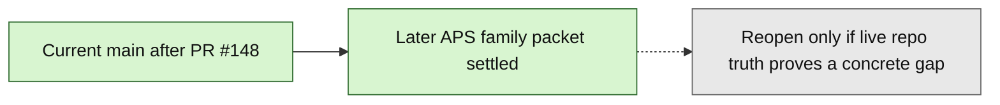

# Layer3 Progress Board

## Purpose

This file is the human-facing companion to `next_milestone_plans/layer3_progress_manifest.json`.
It tracks the bounded Layer3 Phase1A through APS validate-only runtime/report-ref chain already landed on current `main`, plus the landed `23_GATED_APS_PROMOTION_FREEZE.md` continuation freeze from PR `#145`, the workbench/package/handoff/export chain through PR `#289`, docs `70`/`71` plus PR `#316` for current-method registry implementation, the descriptive-summary governance/implementation chain through PR `#417`, docs `77`/`78`/`79` for associated-cohort service-materialize governance, PR `#424` as the bounded service-only associated-cohort `descriptive_summary` implementation, PR `#425` as exact `requested_method_name` gate hardening, docs `80`/`81` as selected-pass cohort execution governance, PR `#432` as the bounded selected-pass associated-cohort execution-start/result-status implementation, docs `82`/`83` as planning/control selected-pass associated-cohort result-review governance, PR `#438` as the bounded backend/API implementation of that result-review tranche, PR `#441` as planning-only associated-cohort result-review UI governance, PR `#443` as the bounded rendered `/review/layer3` implementation of that exact UI tranche, docs `86`/`87` as planning-only associated-cohort package-review preview/readiness governance, PR `#447` as the bounded read-only implementation of that preview/readiness tranche, docs `88`/`89` as planning-only associated-cohort package-construction governance, PR `#451` as the bounded implementation for that construction boundary, docs `90`/`91` as planning-only associated-cohort package-review submit governance, PR `#456` as the bounded implementation of that submit boundary, PR `#458` docs `92`/`93` as current-main planning-only associated-cohort handoff/export governance, PR `#460` as the bounded backend/API associated-cohort handoff/export prepare-only implementation, PR `#462` as the bounded rendered prepare UI authority-projection proof over that server state, PR `#464` docs `94`/`95` as current-main planning-only associated-cohort APS handoff dispatch governance, PR `#466` as the bounded backend/API implementation of that exact APS evidence-bundle handoff dispatch boundary, and docs `96`/`97` as associated-cohort external export/download readiness governance over that dispatch state, PR `#479` as the bounded backend/API implementation of that reference-only readiness boundary, docs `98`/`99` from PR `#481` as current-main associated-cohort same-origin delivery governance, PR `#483` as current-main backend/API proof that the existing delivery endpoint admits exact associated-cohort readiness, and docs `100`/`101` from PR `#485` as current-main planning/control settlement for associated-cohort rendered delivery activation over the existing generic delivery UI path, PR `#487` as current-main bounded implementation of the explicit server-authoritative associated-cohort delivery UI gate over that existing path, PR `#488` as the post-PR487 docs/control sync that marks that lane settled, docs `102`/`103` from PR `#497` as current-main signed delivery-reference governance, and PR `#499` as current-main bounded backend/API same-origin signed-reference generation/use implementation.

Current `main` additionally includes docs `102`/`103` as signed delivery-reference governance, PR `#499` as the bounded same-origin backend/API implementation, and PR `#513` as UI/theme trace alignment for the Claude Layer 3 prototype over one APS content document trace sample. PR `#499` admits only server-owned signed-reference generation and use through POST endpoints; PR `#513` admits only UI/theme trace representation. Neither makes public/provider URLs, connector/generic dispatch, destination selection, durable token/receipt/audit state, package mutation, schema/runtime/source widening, qualitative execution, broader UI, or full mockup behavior live.

Current-main continuation: PR `#514` implements the rendered `/review/layer3` same-origin signed-reference control governed by `104_signed-ui.md` over PR `#499` endpoints and PR `#487` delivery UI authority. `105_deferred-gates.md` keeps provider/public signed URLs, connector/destination dispatch, durable token/receipt/audit/revocation state, and qualitative APS content document execution as separate deferred decisions.

Current-main planning continuation: PR `#516` merged docs `106_DURABLE_FREEZE.md` and `107_DURABLE_CONTRACT.md`, selecting durable token, receipt, revocation, and audit state as the next planning/control question only. They do not implement durable runtime state, add model/migration files, persist tokens, create receipts, revoke tokens, write audit events, expose provider/public URLs, dispatch to connectors/destinations, change PR `#499` stateless HMAC behavior, change PR `#514` rendered controls, or admit qualitative APS content document execution.

Current-main planning continuation: PR `#518` merged docs `108_DURABLE_ENTRY.md` and `109_DURABLE_STATE.md` as durable-state implementation-entry planning/control. They name the future durable-state implementation entry surfaces, table family, service seam, API compatibility rule, test obligations, and stop conditions. They do not implement runtime behavior, add model/migration files, change PR `#499` stateless behavior, change PR `#514` rendered controls, expose provider/public URLs, dispatch to connectors/destinations, or admit qualitative APS content document execution.

Current-main continuation: PR `#520` implements only the bounded durable same-origin signed-reference runtime backing state behind the existing PR `#499` endpoints. It adds token hash records, generation/use receipts, audit rows, revocation table awareness without a public endpoint, durable missing-state failure, and single-use replay denial. It does not admit provider/public URLs, connector/destination dispatch, qualitative execution, rendered UI changes, package mutation, or source/schema/runtime widening.

Current-main residual settlement: PR `#522` settles confirmed APS parser/bridge/provenance review residuals after PR `#520` and PR `#521`. It hardens CSV/XLSX duplicate-header collision handling, XLSX sparse far-right column fail-closed behavior, dataset-bridge boolean null preservation, SEC/EDGAR admitted-form normalization and time-column diagnostics, CSV bridge coexistence with the generic table bridge, and newest APS provenance selection for Layer 3 material preview. It does not admit provider/public URLs, connector/destination dispatch, qualitative execution, rendered UI changes, package mutation, or new source/schema/runtime scope beyond those bounded parser/bridge/provenance corrections.

Planning continuation: docs `110`/`111` freeze provider/public URL behavior as planning/control only after PR `#520` durable same-origin signed-reference runtime and PR `#522` residual settlement. They do not implement provider URLs, public URLs, object-store ACL changes, connector/destination dispatch, rendered controls, package mutation, schema/runtime/source widening, qualitative execution, or any route. They require a later implementation-entry freeze to choose exactly one provider/public mode and prove provider/object-store authority, ACL/expiry/revocation/header/security behavior, leakage controls, and tests before code.

Planning continuation: docs `112`/`113` freeze connector/destination/generic downstream dispatch behavior as planning/control only after the same-origin delivery, same-origin signed-reference, durable state, residual-settlement, and provider/public URL governance chain. They do not implement connector runs, destination selection, generic downstream dispatch, rendered controls, provider/public URLs, package mutation, schema/runtime/source widening, qualitative execution, queue/retry/cancel behavior, or any route. They require a later implementation-entry freeze to choose exactly one dispatch mode and prove connector/destination authority, lifecycle, idempotency, authorization, receipt/audit, failure, and test behavior before code.

Planning continuation: docs `114`/`115` freeze qualitative APS content document execution behavior as planning/control only after PR `#525` connector/destination dispatch governance. They do not implement qualitative execution, routes, rendered controls, document trace changes, package/handoff/export behavior, provider/public URLs, connector/destination dispatch, source ingestion, schema/model/migration/runtime widening, or full mockup behavior. They require a later implementation-entry freeze to choose exactly `single_aps_doc_qualitative_pass` and prove APS document unit authority, chunk/citation/trace rules, execution owner, result/review vocabulary, anti-`DatasetVersion` isolation, failure behavior, and tests before code.

Current-main continuation: PR `#533` implements only bounded server-derived `state_action_contract` hardening over the existing workbench state model. Bootstrap, readiness, and session summary now expose that contract, and deferred capabilities remain recorded as not admitted. PR `#533` does not activate qualitative/hybrid/RAG behavior, provider/public URLs, connector/destination dispatch, source/schema/runtime widening, package mutation/reconstruction, frontend-only durable state, hidden LLM planning, or authentication/security hardening.

Current-main correction: PR `#535`/commit `7d07477a` later made the exact `single_aps_doc_qualitative_pass` live and retained server-revalidated frontend recovery proof. PR `#558` proof-hardened qualitative owner-service error mapping, and PR `#559` synchronized docs/proof. Only the exact single APS-document qualitative pass is admitted; broad qualitative, qualitative cohort, hybrid, RAG/vector, connector/destination, provider/public URL, source widening, package mutation/reconstruction, full mockup, hidden LLM planning, and auth/security behavior remain blocked.

Current-main proof/refactor correction: PR `#584`/commit `9cdd1e88` added no-behavior-change plan-flow request contract extraction proof. `backend/app/services/layer3_plan_flow_contract.py` now owns plan approval, plan revision, and execution selection forbidden-field contracts, while `backend/app/services/layer3_workbench.py` keeps emitted plan-flow behavior unchanged. This does not admit broad execution, package mutation/reconstruction, package payload rewrite, source widening, connector/destination dispatch, provider/public URL support, broad qualitative/hybrid/RAG execution, full mockup activation, or auth/security behavior.

Current-main proof/refactor correction: PR `#635` extends the same no-behavior-change plan-flow contract extraction posture by moving plan-preview source-class derivation for authority rails from `backend/app/services/layer3_workbench.py` into `backend/app/services/layer3_plan_flow_contract.py`. `backend/app/services/layer3_workbench.py` delegates through the same `_source_classes_from_plan_preview` alias at the existing plan-preview, plan-approval, and plan-revision call sites, while `backend/tests/test_layer3_plan_flow_contract.py` proves the sorted/deduplicated string projection and delegation. This does not admit route, DTO, model, migration, UI, execution, package, connector, provider/public URL, source expansion, qualitative/hybrid/RAG, full mockup, auth/security, or broad workbench behavior.

Current-main proof/refactor correction: PR `#636` continues the no-behavior-change plan-flow extraction posture by moving approved-plan set/pass payload projection from `backend/app/services/layer3_workbench.py` into `backend/app/services/layer3_plan_flow_contract.py`. The workbench keeps the same `_approved_set_payload` and `_approved_planned_pass_payload` aliases at the existing plan-approval call site, while `backend/tests/test_layer3_plan_flow_contract.py` proves clone/no-mutation behavior, approval-state marking, preview-only removal, and delegation. This does not admit route, DTO, model, migration, UI, execution, package, connector, provider/public URL, source expansion, qualitative/hybrid/RAG, full mockup, auth/security, or broad workbench behavior.

Current-main proof/refactor correction: PR `#637` adds no-behavior-change plan-flow state lookup extraction proof. `backend/app/services/layer3_plan_flow_state.py` now owns latest analysis-plan lookup ordering and active plan-revision-control lookup, while `backend/app/services/layer3_workbench.py` delegates through `_latest_analysis_plan` and `_plan_revision_control` aliases at existing call sites. `backend/tests/test_layer3_plan_flow_state.py` proves ordering, recovery-state filtering, and delegation. This does not admit route, DTO, model, migration, UI, execution, package, connector, provider/public URL, source expansion, qualitative/hybrid/RAG, full mockup, auth/security, or broad workbench behavior.

PR `#638` proof/refactor continuation: no-behavior-change plan-flow readiness summary extraction moves plan-preview readiness, plan-approval summary, and plan-revision summary projection helpers from `backend/app/services/layer3_workbench.py` into `backend/app/services/layer3_plan_flow_readiness.py`. `backend/app/services/layer3_workbench.py` delegates through the existing `_plan_preview_readiness`, `_plan_approval_summary`, and `_plan_revision_summary` aliases at existing call sites, while `backend/tests/test_layer3_plan_flow_readiness.py` proves cancelled-plan readiness, approved-plan cancellation cloning/delegation, and plan-revision-control summary delegation. This does not admit route, DTO, model, migration, UI, execution, package, connector, provider/public URL, source expansion, qualitative/hybrid/RAG, full mockup, auth/security, or broad workbench behavior.

Current-main proof/refactor correction: PR `#624`/commit `f4b3ab80` added no-behavior-change plan preview/approval error-mapping extraction proof. `backend/app/services/layer3_plan_errors.py` now owns the plan preview and plan approval `Layer3PassEntryError` to `Layer3WorkbenchError` mapping, while `backend/app/services/layer3_workbench.py` delegates to that helper and preserves emitted error codes, statuses, HTTP statuses, blocked fields, and next allowed actions. `backend/tests/test_layer3_plan_errors.py` covers the extracted mapping, and `tools/l3-progress-check.py` now guards the extraction boundary. This does not admit route, DTO, model, migration, UI, execution, package, connector, provider, source, qualitative/RAG, mockup, or auth/security behavior.

Current-main proof/refactor correction: PR `#628`/commit `ca8831df` added no-behavior-change analysis execution-start error-mapping extraction proof. `backend/app/services/layer3_execution_errors.py` owns the existing `analysis_execution_start_not_admitted` mapping for `Layer3PassEntryError` and `Layer3QualApsExecutionError`, while `backend/app/services/layer3_workbench.py` delegates to that helper. This preserves the emitted error code, status, HTTP status, recoverability defaults, blocked fields, and next allowed actions, and it does not admit new execution behavior, broad qualitative/RAG behavior, route, DTO, model, migration, UI, package, connector, provider, source, mockup, or auth/security behavior.

Current-main proof/refactor correction: PR `#630`/commit `a71e3cf5` added no-behavior-change Gate B summary-state extraction proof. `backend/app/services/layer3_gate_b_state.py` owns the existing Gate B decision vocabulary, decision counts, and session-summary reconstruction, while `backend/app/services/layer3_workbench.py` delegates to those helpers. This preserves emitted Gate B, Gate C, plan, and session-summary count behavior and does not admit execution behavior, route, DTO, model, migration, UI, package, connector, provider, source, qualitative/RAG, mockup, or auth/security behavior.

Current-main proof/refactor correction: PR `#632`/commit `56f2ea7b` added no-behavior-change Gate B material/decision-basis extraction proof after merge commit `58f33a33`. `backend/app/services/layer3_gate_b_state.py` owns the existing material-preview hash basis, candidate-decision manifest, and Gate B decision manifest ID construction, while `backend/app/services/layer3_workbench.py` delegates to those helpers. This preserves deterministic material-preview hash and Gate B decision-manifest semantics and does not admit execution behavior, route, DTO, model, migration, UI, package, connector, provider, source, qualitative/RAG, mockup, auth/security, or broad workbench behavior.

Current-main proof/refactor and audit-synthesis correction: PR `#609`/commit `ad51b1c6736cd51ec3dd30de914e59ddb4c66158` merged the no-behavior-change APS source-family extraction from `backend/app/services/layer3_workbench.py` into `backend/app/services/layer3_aps_source_family.py`, with focused proof in `backend/tests/test_layer3_aps_source_family.py` and unchanged emitted source-family response semantics. The multi-audit synthesis/adjudication report at `C:\Users\benny\Downloads\audit\AUDIT_SYNTHESIS_ADJUDICATION.md` is now the latest external adjudication artifact for post-PR609 planning/proof decisions: it accepts current-main progress/proof refresh as the first next action, API request-contract hardening for forbidden sentinel fields as the next implementation-quality action, and approved-plan cancel negative-invariant proof/widening correction before any broad feature admission. It explicitly keeps broad execution, broad qualitative/hybrid/RAG, source/upload expansion, provider/public URLs, connector/destination dispatch, package mutation/reconstruction, full mockup activation, frontend-only durable state, hidden LLM planning, broad workbench rewrite, and auth/security overbuild out of the immediate next slice.

Current-main request-boundary correction: PR `#634` hardens the preflight `manual_constraints` request contract selected by the synthesis/adjudication ordering. `backend/app/services/layer3_preflight_request_contract.py` now owns manual-constraint normalization plus recursive forbidden sentinel detection, `backend/app/services/layer3_workbench.py` rejects `preflight_manual_constraint_scope_not_admitted` before cloning those sentinels into normalized intent, and `backend/app/api/layer3.py` documents the known non-admitted nested manual-constraint fields in the preflight OpenAPI schema. This admits no L3PassRun or AnalysisRun creation, output/package/handoff/export artifact creation, source/schema/runtime widening, qualitative/hybrid/RAG activation, provider/public URL support, connector/destination dispatch, frontend-only durable state, hidden LLM planning, package mutation/reconstruction, broad workbench rewrite, full mockup activation, or auth/security behavior.

Current-main request-boundary correction: PR `#639` closes the residual exact deferred-sentinel gap from PR `#634`. `backend/app/services/layer3_preflight_request_contract.py` now rejects every exact capability name exposed by `STATE_ACTION_DEFERRED_CAPABILITIES` when supplied under `manual_constraints`, including `connector_destination_dispatch`, `package_mutation_reconstruction`, `full_mockup_activation`, `local_upload_or_directory_source_expansion`, and `auth_security_hardening`. `backend/tests/test_layer3_preflight_request_contract.py` proves the forbidden set covers the canonical deferred list, `backend/tests/test_layer3_api.py` proves API fail-closed blocked-field emission for representative exact sentinels, and `tools/l3-progress-check.py` guards the exact-name proof. This is boundary hardening only: it does not implement auth/security behavior and admits no execution, package, connector/destination, source/upload expansion, provider/public URL, qualitative/hybrid/RAG, full mockup, frontend-only durable state, hidden LLM planning, or broad workbench behavior.

PR `#640` proof/refactor continuation: no-behavior-change sublayer visualization state extraction moves the read-only sublayer state projection, shared Gate C typing/analysis serializers, and session-summary sublayer visualization assembly from `backend/app/services/layer3_workbench.py` into `backend/app/services/layer3_sublayer_state.py`. `backend/app/services/layer3_workbench.py` delegates through the existing private aliases at Gate C and session-summary call sites, while `backend/tests/test_layer3_sublayer_state.py` proves unsupported-shape projection, workbench delegation, latest-plan projection, pass-run projection, and no-side-effect state metadata. This does not admit route, DTO, model, migration, UI, execution behavior, package, connector/destination, provider/public URL, source/upload expansion, qualitative/hybrid/RAG, full mockup, auth/security, frontend-only durable state, hidden LLM planning, or broad workbench behavior.

PR `#641` proof/refactor continuation: no-behavior-change execution state extraction moves execution-selection state lookup, selected pass-run ordering, pass-run analysis-run id projection, execution-started projection, execution-state derivation, and analysis-execution-start state lookup from `backend/app/services/layer3_workbench.py` into `backend/app/services/layer3_execution_state.py`. `backend/app/services/layer3_workbench.py` delegates through existing private aliases at execution selection, start, status, review, and session-summary call sites, while `backend/tests/test_layer3_execution_state.py` proves workbench delegation, state-priority preservation, start-state projection, and pass-run ordering. This does not admit route, DTO, model, migration, UI, execution behavior, package, connector/destination, provider/public URL, source/upload expansion, qualitative/hybrid/RAG, full mockup, auth/security, frontend-only durable state, hidden LLM planning, package mutation/reconstruction, or broad workbench behavior.

PR `#642` proof/refactor continuation: no-behavior-change execution output metadata extraction moves read-only selected-pass output metadata file projection from `backend/app/services/layer3_workbench.py` into `backend/app/services/layer3_execution_output.py`. `backend/app/services/layer3_workbench.py` delegates through the existing `_output_metadata_summary` private alias at result/status and downstream readiness call sites, while `backend/tests/test_layer3_execution_output.py` proves missing, unreadable, malformed, and valid metadata projection parity. This does not admit route, DTO, model, migration, UI, execution behavior, package, connector/destination, provider/public URL, source/upload expansion, qualitative/hybrid/RAG, full mockup, auth/security, frontend-only durable state, hidden LLM planning, package mutation/reconstruction, or broad workbench behavior.

PR `#643` proof/refactor continuation: no-behavior-change execution result-review extraction moves result-review state lookup, reviewed-item normalization, and trace-summary projection from `backend/app/services/layer3_workbench.py` into `backend/app/services/layer3_execution_review.py`. `backend/app/services/layer3_workbench.py` delegates through existing private aliases at result-review and downstream readiness call sites, while `backend/tests/test_layer3_execution_review.py` proves state lookup, trace normalization, fail-closed malformed/oversized reviewed-item errors, and trace-summary fallback parity. This does not admit route, DTO, model, migration, UI, execution behavior, package, connector/destination, provider/public URL, source/upload expansion, qualitative/hybrid/RAG, full mockup, auth/security, frontend-only durable state, hidden LLM planning, package mutation/reconstruction, or broad workbench behavior.

PR `#644` proof/refactor continuation: no-behavior-change execution selection summary extraction moves read-only execution-selection readiness summary projection from `backend/app/services/layer3_workbench.py` into `backend/app/services/layer3_execution_selection.py`. `backend/app/services/layer3_workbench.py` delegates through the existing `_execution_selection_summary` private alias at session-summary/readiness call sites, while `backend/tests/test_layer3_execution_selection.py` proves available approved-plan summary, existing-selection summary, and blocked-reason parity. This does not admit route, DTO, model, migration, UI, execution behavior, package, connector/destination, provider/public URL, source/upload expansion, qualitative/hybrid/RAG, full mockup, auth/security, frontend-only durable state, hidden LLM planning, package mutation/reconstruction, or broad workbench behavior.

PR `#645` proof/refactor continuation: no-behavior-change execution selection response extraction moves execution-selection response projection from `backend/app/services/layer3_workbench.py` into `backend/app/services/layer3_execution_selection.py`. `backend/app/services/layer3_workbench.py` delegates through the existing `_execution_selection_response` private alias at the execution-selection call site, while `backend/tests/test_layer3_execution_selection.py` proves pass-run id/status projection, analysis-run id projection, downstream-unavailable projection, completed-state projection, preview-identity projection, and workbench delegation. This does not admit route, DTO, model, migration, UI, execution behavior, package, connector/destination, provider/public URL, source/upload expansion, qualitative/hybrid/RAG, full mockup, auth/security, frontend-only durable state, hidden LLM planning, package mutation/reconstruction, or broad workbench behavior.

PR `#646` proof/refactor continuation: no-behavior-change analysis execution-start response extraction moves execution-start response projection from `backend/app/services/layer3_workbench.py` into `backend/app/services/layer3_execution_start.py`. `backend/app/services/layer3_workbench.py` delegates through the existing `_analysis_execution_start_response` private alias at existing execution-start call sites, while `backend/tests/test_layer3_execution_start.py` proves execution-start response schema, pass-run status, output ref, analysis-run id, downstream-unavailable projection, completed-state projection, selected-method/dataset projection, preview identity, and workbench delegation. This does not admit route, DTO, model, migration, UI, execution behavior, package, connector/destination, provider/public URL, source/upload expansion, qualitative/hybrid/RAG, full mockup, auth/security, frontend-only durable state, hidden LLM planning, package mutation/reconstruction, or broad workbench behavior.

PR `#647` proof/refactor continuation: no-behavior-change execution result/status response extraction moves result/status response projection from `backend/app/services/layer3_workbench.py` into `backend/app/services/layer3_execution_status.py`. `backend/app/services/layer3_workbench.py` delegates through the existing `_execution_result_status_response` private alias at the result/status call site, while `backend/tests/test_layer3_execution_status.py` proves available and failed result/status response projection, output metadata echoing, output-metadata error echoing, pass scope/method/dataset projection, downstream-unavailable projection, next-state selection, and workbench delegation. This does not admit route, DTO, model, migration, UI, execution behavior, package, connector/destination, provider/public URL, source/upload expansion, qualitative/hybrid/RAG, full mockup, auth/security, frontend-only durable state, hidden LLM planning, package mutation/reconstruction, or broad workbench behavior.

PR `#648` proof/refactor continuation: no-behavior-change execution result-review response extraction moves result-review response projection from `backend/app/services/layer3_workbench.py` into existing `backend/app/services/layer3_execution_review.py`. `backend/app/services/layer3_workbench.py` delegates through the existing `_execution_result_review_response` private alias at result-review call sites, while `backend/tests/test_layer3_execution_review.py` proves response schema, preview identity, review record fields, cloned trace summary/reviewed items/source dataset ids, downstream-unavailable projection, review notes projection, pass metadata projection, and workbench delegation. This does not admit route, DTO, model, migration, UI, execution behavior, package, connector/destination, provider/public URL, source/upload expansion, qualitative/hybrid/RAG, full mockup, auth/security, frontend-only durable state, hidden LLM planning, package mutation/reconstruction, or broad workbench behavior.

Current package planning/control correction: `128_PACKAGE_REPLACEMENT_ARTIFACT_FREEZE.md` names `replacement_package_artifact_authority_only` as the next package lifecycle prerequisite before replacement package artifact generation, replacement package row creation, payload writes, rendered package mutation controls, or broad package mutation/reconstruction can be considered. It is planning/control only; current replacement package-set refs/hashes are metadata and are not proof that replacement payload bytes exist or were generated by a repo-owned owner service.

Current package manifest runtime correction: `129_PACKAGE_REPLACEMENT_ARTIFACT_MANIFEST_FREEZE.md` remains the planning authority for `replacement_package_artifact_manifest_only`, and the exact runtime is now live only as server-side manifest verification of existing replacement artifact refs/hashes. The admitted surfaces are `/api/v1/layer3/package/replacement-artifact/manifest/record`, `backend/app/services/layer3_replacement_package_artifact_manifest.py`, `L3ReplacementPackageArtifactManifest`, and `0020_layer3_replacement_package_artifact_manifest.py`. It still admits no payload generation, replacement package row creation, package row mutation, package payload write, rendered package mutation control, connector/destination dispatch, provider/public URL support, source widening, broad qualitative/hybrid/RAG execution, full mockup activation, or auth/security behavior.

Current package namespace planning/control correction: `130_PACKAGE_REPLACEMENT_NAMESPACE_FREEZE.md` selects future `replacement_package_namespace_rows` only as a separate replacement output package table design. It preserves current `L3OutputPackage` source-row authority and `uq_l3_output_package_session_kind`, and it does not admit runtime rows, routes, models, migrations, package payload writes, source-table row reuse, rendered controls, connector/destination dispatch, provider/public URL support, source widening, broad qualitative/hybrid/RAG execution, full mockup activation, auth/security behavior, or broad package mutation/reconstruction.

Current package namespace runtime correction: `131_PACKAGE_REPLACEMENT_NAMESPACE_ENTRY_FREEZE.md` governs the live bounded runtime for `replacement_package_namespace_rows`: `/api/v1/layer3/package/replacement-namespace/record`, `layer3_replacement_package_namespace.py`, `L3ReplacementOutputPackage`, `l3_replacement_output_package`, `0021_layer3_replacement_output_package.py`, strict DTOs, idempotency basis, stale-authority behavior, and required tests. It creates response-safe replacement namespace metadata rows only in `l3_replacement_output_package` and still admits no source package row mutation, package payload writes, rendered controls, or broad package mutation/reconstruction.

Current plan revision recovery planning/control correction: PR `#595` merged `132_PLAN_REVISION_RECOVERY_FREEZE.md` and `133_PLAN_REVISION_RECOVERY_CONTRACT.md` at `project6-origin/main=15c8ab17` as planning/control authority for `plan_revision_recovery_lifecycle`. That broader lifecycle remains bounded by the preview-refresh posture and does not admit approved-plan supersession, `L3AnalysisPlan` mutation, `L3PassRun` creation, `AnalysisRun` creation, package/handoff/export behavior, connector/destination dispatch, source widening, broad qualitative/hybrid/RAG behavior, full mockup activation, or auth/security behavior.

Current plan revision recovery runtime: PR `#599` merged `134_PLAN_REVISION_RECOVERY_ENTRY_FREEZE.md` as the live bounded runtime authority for `plan_revision_recovery_preview_refresh_entry` at `project6-origin/main=1e74a739a07623b7d91d405d946e6b1d221be6ff`. It admits `POST /api/v1/layer3/plan/revision/recover`, `backend/app/services/layer3_plan_revision_recovery.py`, `Layer3PlanRevisionRecoveryRequest`, `Layer3PlanRevisionRecoveryResponse`, schema ids `layer3.plan_revision_recovery_request.v1` / `layer3.plan_revision_recovery_result.v1`, summary-state recovery metadata in existing `L3Session.summary_json`, and fresh server-backed plan-preview identity after `plan_rejected` or `plan_revision_requested`.

Current plan revision recovery proof hardening: PR `#605` merged `backend/tests/test_layer3_plan_revision_recovery.py` at `project6-origin/main=db7c7a0811a8e1a1343a4b285dec050a03e4361b`. It directly proves the owner service success path, duplicate idempotency, preview marker creation, owner authority row-count stability, forbidden-field rejection before mutation, state/preview mismatch fail-closed behavior, approved-plan/pass-run blockers, and no downstream row/artifact creation. This is proof-only and does not change runtime behavior or admit approved-plan supersession, execution, package/handoff/export, or any broader deferred capability.

Current approved-plan correction planning/control freeze: `135_APPROVED_PLAN_CORRECTION_FREEZE.md` remains planning/control only for the broader `approved_plan_correction_lifecycle` after PR `#600`. The exact cancellation-without-replacement lane is now separately admitted by the doc 136 runtime branch; approved-plan reopening, replacement, deletion, supersession, and replacement-plan creation remain unavailable.

Current approved-plan cancel runtime: `136_APPROVED_PLAN_CANCEL_ENTRY_FREEZE.md` remains the historical entry freeze after PR `#602`; PR `#603` merged the bounded runtime at `main=c08c66c6d81ad26b0ff15387ab616161aa3b231f`. Current main implements only `approved_plan_cancel_without_replacement`: `POST /api/v1/layer3/plan/approved/cancel` through `backend/app/services/layer3_approved_plan_correction.py` marks the existing approved plan cancelled and records `approved_plan_cancel` state in existing plan/session JSON. It fails closed before mutation if same-session `L3PassRun`, `L3ReconciliationRecord`, or `L3OutputPackage` state already exists. It creates no replacement plan, no `L3PassRun`, no `AnalysisRun`, no output/package/handoff/export artifact, and admits no approved-plan supersession/replacement/reopening/deletion, connector/destination dispatch, source/schema/runtime widening, broad qualitative/hybrid/RAG behavior, full mockup activation, auth/security work, or broad package mutation/reconstruction.

Current approved-plan cancel proof hardening: after PR `#603` merged the runtime at `main=c08c66c6d81ad26b0ff15387ab616161aa3b231f`, PR `#612` merged the downstream-state blocker at `project6-origin/main=01023e82`. `backend/tests/test_layer3_approved_plan_correction.py` directly proves the owner service success path, duplicate idempotency, current-schema session-state extraction, forbidden-field rejection before mutation, stale-preview/pass-run fail-closed behavior, same-session orphan reconciliation/package state fail-closed behavior, and no downstream row/artifact creation. The orphan-state hardening changes only the pre-mutation blocker; it does not admit any broader approved-plan correction mode.

Current `main` also includes PR `#496` as narrow package-review submit legacy idempotency compatibility and proof-manifest SHA correction. It does not widen delivery, URL, connector, destination, package mutation, schema/runtime/source, broader UI, or full mockup behavior.

Current `main` additionally includes docs `72`/`73` from PR `#402` as descriptive-summary governance, PR `#411` as the bounded lower-level analysis API implementation, docs `75`/`76` as the single-item Gate C admission governance, PR `#417` as the bounded single-item Gate C admission implementation, docs `78`/`79` as service-only associated-cohort governance, PR `#424` as bounded service-only associated-cohort materialization, PR `#425` as exact metadata gate hardening, docs `80`/`81` as selected-pass cohort execution governance, PR `#432` as bounded selected-pass associated-cohort execution-start/result/status implementation, PR `#433` as post-PR432 proof-state docs/control sync only, PR `#434` as docs `82`/`83` planning/control selected-pass associated-cohort result-review governance, PR `#435` as post-PR434 count metadata correction only, PR `#436` as post-PR435 lineage metadata sync only, PR `#438` as bounded selected-pass associated-cohort result-review backend/API implementation, PR `#441` as planning-only associated-cohort result-review UI governance, PR `#443` as bounded rendered associated-cohort result-review UI implementation, docs `86`/`87` as planning-only associated-cohort package-review preview/readiness governance, and docs `88`/`89` as planning-only associated-cohort package-construction governance. `descriptive_summary` is now live through `run_analysis(...)`, the existing single-item Gate C wrapped quantitative path, the explicit service-owned associated-cohort `materialize_pass_entry(...)` path, exact selected-pass associated-cohort execution-start/result/status over existing backend/API surfaces, exact selected-pass associated-cohort result review through the existing backend/API result-review endpoint, exact rendered `/review/layer3` associated-cohort result-review presentation/control over that authority, and read-only associated-cohort package-review preview/readiness through PR `#447` over docs `86`/`87`. Docs `88`/`89` do not make associated-cohort package construction live by themselves. PR `#451` implements only the bounded package-construction slice: exactly one reconciliation row, three package rows, and three payload files after approved cohort result review plus matching package-preview hash. Docs `90`/`91` freeze only planning/control for associated-cohort package-review submit after PR `#451`; PR `#456` separately implements only that bounded submit decision and still does not make handoff/export live; PR `#458` docs `92`/`93` freeze associated-cohort handoff/export prepare-only governance and PR `#460` implements that bounded backend/API prepare-only state on current `main`. PR `#462` proves the existing rendered prepare control over that server-authoritative state and adds read-only pass/method/source-gate projection. PR `#464` docs `94`/`95` freeze associated-cohort APS handoff dispatch governance only, and PR `#466` separately implements only exact backend/API associated-cohort APS evidence-bundle handoff dispatch over that authority. Docs `96`/`97` freeze associated-cohort external export/download readiness governance, PR `#479` implements only that bounded reference-only readiness path, and docs `98`/`99` freeze associated-cohort same-origin delivery governance. PR `#483` proves the backend/API delivery path through the existing same-origin endpoint. PR `#485` docs `100`/`101` settle the rendered-control question by acknowledging the existing generic delivery UI path and requiring an explicit server-authoritative associated-cohort UI gate before activation. PR `#487` implements that gate with a server `delivery_ui` authority object and rendered-control admission checks over the existing same-origin form path. Public/signed URLs, connector/generic dispatch, destination selection, schema/runtime/source widening, qualitative/hybrid/RAG/vector, retry/recovery/rerun expansion, pass-entry changes, broader UI behavior, and full mockup behavior remain out.

This active progress packet also includes `74_L3_DEFERRED_IMPLEMENTATION_PLAYBOOK.md` from PR `#407` as operational guidance for activating and implementing remaining deferred items. PR `#411` used it for the lower-level `descriptive_summary` analysis-service tranche, PR `#417` used docs `75`/`76` for the single-item Gate C admission tranche, PR `#424`/`#425` used docs `78`/`79` for the service-only associated-cohort tranche, PR `#432` used docs `80`/`81` for the selected-pass associated-cohort execution-start/result-status tranche, PR `#438` used docs `82`/`83` for the exact selected-pass associated-cohort result-review backend/API tranche, PR `#443` used docs `84`/`85` for the exact rendered associated-cohort result-review UI tranche, docs `86`/`87` froze the read-only associated-cohort package-review preview/readiness governance boundary, PR `#447` implements only that preview/readiness tranche, docs `88`/`89` freeze only the associated-cohort package-construction planning/control boundary, PR `#451` implements that construction boundary, and docs `90`/`91` freeze only the associated-cohort package-review submit planning/control boundary; PR `#456` implements only that submit decision path, and PR `#458` docs `92`/`93` freeze associated-cohort handoff/export prepare-only governance and PR `#460` implements that bounded backend/API prepare-only state on current `main`; PR `#462` is the merged rendered prepare proof/projection pass over that state. This still does not alter the settled later-APS decision or make schema/runtime/source or downstream handoff/export behavior beyond prepare-only live.

Current `main` now includes docs `75`/`76` plus PR `#417` as the bounded single-item `descriptive_summary` Gate C admission tranche. It also includes `77_COHORT_REQS.md`, docs `78`/`79`, PR `#424`, and PR `#425` as the bounded service-materialize associated-cohort tranche: explicit `formation_basis_json["requested_method_name"] == "descriptive_summary"` selects `descriptive_summary`, while absent, malformed, trimmable, or non-descriptive metadata preserves the default `cross_correlation` cohort path. Docs `80`/`81` plus PR `#432` now admit only selected-pass associated-cohort `descriptive_summary` execution-start/result-status over existing backend/API surfaces; docs `82`/`83` plus PR `#438` now admit only exact selected-pass associated-cohort result review over that PR `#432` authority; docs `84`/`85` from PR `#441` plus PR `#443` now admit only exact rendered `/review/layer3` result-review presentation/control over that backend/API authority; docs `86`/`87` froze only read-only associated-cohort package-review preview/readiness governance, PR `#447` implements only that preview/readiness path, PR `#451` implements docs `88`/`89` as a bounded associated-cohort package-construction slice, and docs `90`/`91` freeze only planning/control for the package-review submit decision, PR `#456` implements only that submit decision, and PR `#458` docs `92`/`93` define the separate current-main handoff/export prepare-only governance boundary, PR `#460` implements only that backend/API prepare-only behavior, and PR `#462` proves the existing rendered prepare form against that server state while keeping all downstream dispatch behavior deferred until a later freeze. APS dispatch is live only through PR `#466`; docs `96`/`97` govern associated-cohort external export/download readiness, PR `#479` implements only bounded reference-only runtime readiness, docs `98`/`99` govern associated-cohort same-origin delivery, and PR `#483` proves backend/API delivery through the existing same-origin endpoint. Docs `100`/`101` are current-main planning/control from PR `#485` for explicit associated-cohort rendered delivery gating over the existing generic delivery form, and PR `#487` implements only that explicit server-authoritative gate. Connector dispatch, schema/runtime/source widening, qualitative/hybrid/RAG/vector behavior, retry/recovery/rerun expansion, pass-entry changes, broader UI behavior, and full mockup activation remain blocked.

It is intentionally scoped to:
- the landed milestone chain from Phase 1A feeder-ledger foundation through the bounded dedicated validate-only runtime/report-ref implementation lane
- the landed promotion continuation freeze from PR `#145`, its docs/progress sync from PR `#146`, the later APS family settlement closeout from PR `#147`, and the post-PR147 progress-packet closeout from PR `#148`
- the now-settled later APS family packet immediately beyond the landed dedicated validate-only boundary
- the merged planning-only deferred-prep docs from PR `#165`, the post-PR165 docs/progress/front-door sync from PR `#166`, the merged broader-workbench implementation-entry prep packet from PR `#168`, the post-PR168 current-main closeout from PR `#169`, the post-PR169 duplicate-default cleanup from PR `#170`, the merged qualitative single-item input packet from PR `#172`, the post-PR172 deferred-prep front-door tightening from PR `#174`, the merged planning-only first-slice setup target in `28_L3_WB_FIRST_SLICE_FREEZE.md` from PR `#178`, the merged planning-only endpoint/state companion in `29_L3_WB_FIRST_SLICE_API_AND_STATE_CONTRACT.md` from PR `#182`, the bounded first-slice workbench implementation from PR `#184`, the post-PR184 closeout/correction passes through PR `#190`, the merged planning-only second-slice plan-preview freeze packet from PR `#191`, the post-PR191 progress/tracked-metadata syncs from PRs `#192` and `#193`, the bounded read-only plan-preview implementation from PR `#194`, the post-PR194 proof/board-metadata closeouts from PRs `#195` and `#196`, the PR `#198` plan-approval freeze packet, the merged PR `#199` bounded plan-approval implementation, the PR `#203`/`#204` plan-revision freeze/count-correction pair, the merged PR `#205` bounded plan-revision control implementation, the PR `#206` docs/control sync, the merged PR `#207` plan-revision submission-hardening follow-up, the PRs `#208`/`#209`/`#210`/`#211` docs/progress cohesion syncs, the PR `#212` execution-readiness proof packet, the PR `#213` read-only readiness proof implementation, the PR `#215` execution-selection freeze packet, the PR `#216` bounded execution-selection shell implementation, and the PR `#217` analysis-execution-start freeze packet, all without reopening the settled packet or expanding live scope beyond separately admitted workbench slices
- the merged PR `#218` bounded analysis-execution-start implementation, which executes one existing selected/not-started single-item wrapped quantitative `L3PassRun` shell and still keeps result/package/handoff/source/schema/UI/full mockup scope out unless/until separately admitted
- the PR `#221` planning-only result/status freeze packet in `42_L3_WB_RESULT_STATUS_FREEZE.md` and `43_L3_WB_RESULT_STATUS_API_AND_STATE_CONTRACT.md`, plus the merged PR `#222` bounded result/status implementation, which adds read-only selected-pass execution-proof/status inspection without making result review, package review, handoff, rerun/recovery, UI changes, source/schema/runtime widening, or qualitative/hybrid/RAG/vector/full mockup behavior live
- the planning-only `44_L3_WB_RESULT_REVIEW_FREEZE.md` and `45_L3_WB_RESULT_REVIEW_API_AND_STATE_CONTRACT.md` result-review packet, which freezes only the boundary for one bounded selected-pass operator review decision after PR `#222` result/status authority and does not make result review, package review, handoff/export, rerun/recovery, source/schema/runtime widening, UI changes by itself, local upload/directory ingestion, qualitative/hybrid/RAG/vector execution, or full mockup behavior live
- the current-main PR `#227` bounded result-review implementation, which adds only `POST /api/v1/layer3/execution/result/review` for one terminal selected pass after result/status authority and must not be rendered as package review, handoff/export, rerun/recovery, source/schema/runtime widening, UI change, local upload/directory ingestion, qualitative/hybrid/RAG/vector execution, or full mockup activation
- the planning-only `46_L3_WB_RESULT_REVIEW_UI_FREEZE.md` and `47_L3_WB_RESULT_REVIEW_UI_STATE_CONTRACT.md` result-review UI packet from PR `#230`, plus the merged PR `#232` bounded UI implementation, which makes only `/review/layer3` session refresh, result/status inspection, and one selected-pass result-review submission control live while still excluding execution selection/start UI, package review, handoff/export, rerun/recovery, new backend endpoints by default, source/schema/runtime widening, local upload/directory ingestion, qualitative/hybrid/RAG/vector execution, and full mockup activation
- the merged planning-only PR `#234` `48_L3_WB_PACKAGE_REVIEW_FREEZE.md` and `49_L3_WB_PACKAGE_REVIEW_API_AND_STATE_CONTRACT.md` package-review preview packet, which freezes only read-only package-review readiness/preview governance after an approved selected-pass result review and does not make package review, package construction, package rows, `materialize_package_entry(...)`, handoff/export, rerun/recovery, source/schema/runtime widening, local upload/directory ingestion, qualitative/hybrid/RAG/vector execution, or full mockup activation live
- the merged PR `#235` bounded read-only package-review preview implementation, which adds a read-only `/api/v1/layer3/package/review/preview` endpoint plus `/review/layer3` inspection panel after approved selected-pass result review, and still does not create package/reconciliation/artifact/handoff/runtime/source-ingestion rows or payload files, call `materialize_package_entry(...)`, enable package-review submit/commit, handoff/export, rerun/recovery, schema/runtime widening, local upload/directory ingestion, qualitative/hybrid/RAG/vector execution, execution selection/start UI, or full mockup activation
- the merged planning-only `50_L3_WB_PACKAGE_CONSTRUCTION_FREEZE.md` and `51_L3_WB_PACKAGE_CONSTRUCTION_API_AND_STATE_CONTRACT.md` package-construction packet from PR `#237`, plus PR `#238` bounded package-construction implementation, which admits only `POST /api/v1/layer3/package/review/commit` creating exactly one `L3ReconciliationRecord`, three `L3OutputPackage` rows, and three package payload files after approved selected-pass result-review authority and matching package-preview hash, while handoff/export, source/schema/runtime widening, qualitative/hybrid/RAG/vector execution, and full mockup activation remain deferred; PR `#243` separately implements backend package-review submit and PR `#245` separately renders bounded package-review controls
- the merged PR `#241` planning-only `52_L3_WB_PACKAGE_REVIEW_SUBMIT_FREEZE.md` and `53_L3_WB_PACKAGE_REVIEW_SUBMIT_API_AND_STATE_CONTRACT.md` package-review submit/decision packet, which freezes only one future operator decision over an already constructed package set and does not make package-review submit live by itself, trigger handoff/export, mutate package payloads, create additional package/reconciliation/artifact rows, rebuild packages, widen source/schema/runtime scope, or activate qualitative/hybrid/RAG/vector/full mockup behavior
- the merged PR `#243` bounded backend package-review submit implementation for docs `52`/`53`: it adds `POST /api/v1/layer3/package/review/submit`, records one operator decision in existing JSON-bearing state after server-verifying the constructed package ids and payload hashes, does not mutate package rows or package payload refs/hashes, and by itself still does not enable handoff/export, package reconstruction, schema/runtime/source widening, rendered UI behavior, or qualitative/hybrid/RAG/vector/full mockup activation; PR `#245` separately renders the bounded controls
- the merged PR `#245` bounded rendered package-review UI implementation, which uses the already-live package-preview, package-construction commit, and package-review submit endpoints from `/review/layer3` without making handoff/export, package payload mutation, package reconstruction, source/schema/runtime widening, execution selection/start UI expansion, or full mockup activation live
- the merged PR `#247` post-review fallback hardening for that same PR `#245` rendered UI boundary: after package construction commit, package-review submit readiness may use fresh in-memory package-construction state if the post-commit session-summary refresh fails; it does not add a new endpoint, durable row family, package payload mutation, handoff/export, source/schema/runtime widening, or full mockup activation
- PR `#250` docs `54`/`55` as planning-only governance by themselves after package-review approval, plus PR `#251` bounded backend/API prepare-only implementation and PR `#252` blocker/session-summary hardening; this makes only an internal reference-envelope preparation endpoint live and still does not dispatch to APS or an external exporter, create physical export artifacts, create `AnalysisArtifact` rows, mutate package payloads, rebuild packages, or widen source/schema/runtime/full mockup scope
- PR `#255` docs `56`/`57` as planning-only rendered handoff/export preparation UI governance over the already-live backend prepare endpoint, plus PR `#256` as the bounded rendered prepare-only UI implementation; together they still do not admit APS handoff, external export/download, downstream dispatch, destination selection, physical artifacts, `AnalysisArtifact`, package mutation/reconstruction, source/schema/runtime widening, execution selection/start UI expansion, qualitative/hybrid/RAG/vector execution, or full mockup activation
- PR `#258` docs `58`/`59` as APS handoff dispatch governance after `handoff_export_prepared`, PR `#260` as the bounded backend/API implementation into the existing `aps_evidence_bundle_handoff` owner-service family, PR `#261` as fail-closed authority hardening, PR `#263` as APS package-row allowlist hardening, docs `60`/`61` as planning-only rendered APS dispatch UI governance, and PR `#266` as the bounded rendered APS dispatch UI implementation. Docs `60`/`61` still do not make UI behavior live by themselves, and connector dispatch, destination selection, package mutation/reconstruction, schema/runtime/source widening, and full mockup activation remain out
- docs `62`/`63` as planning-only external export/download readiness governance after `aps_handoff_dispatched`, plus PR `#269` as the bounded backend/API implementation of that readiness descriptor over the existing APS evidence-bundle handoff artifact; neither admits rendered browser download controls, public/signed URLs, connector dispatch, destination selection, generic downstream dispatch, package mutation/reconstruction, additional reconciliation/package/artifact rows, `AnalysisArtifact`, source/schema/runtime widening, rendered UI activation, execution expansion beyond already admitted work, qualitative/hybrid/RAG/vector execution, or full mockup activation
- docs `64`/`65` as planning-only rendered `/review/layer3` external export/download readiness UI governance over the already-live PR `#269` backend/API readiness endpoint, plus PR `#275` as the bounded rendered UI implementation. It admits only server-authoritative readiness rendering, read-only recorded descriptors, and one server-gated `prepare_external_export_download` UI action; it still does not admit rendered browser download controls, public/signed URLs, file streaming, connector dispatch, destination selection, generic downstream dispatch, package mutation/reconstruction, additional reconciliation/package/artifact rows, `AnalysisArtifact`, source/schema/runtime widening, qualitative/hybrid/RAG/vector execution, or full mockup activation
- docs `66`/`67` as planning-only external export/download delivery governance after `external_export_download_prepared`, plus PR `#278` as the bounded backend/API same-origin delivery implementation. Docs `66`/`67` do not make behavior live by themselves; PR `#278` streams only the existing validated APS evidence-bundle artifact after server-side authority proof and still does not render a download control, generate public/signed URLs, dispatch connectors or generic downstream targets, select destinations, mutate packages, create extra rows, widen schema/runtime/source scope, or activate the full mockup
- docs `68`/`69` as planning-only rendered `/review/layer3` download-control governance over the PR `#278` endpoint, plus PR `#282` as the bounded rendered UI implementation and PR `#285`/`#286` as review hardening inside that same UI/API boundary. Docs `68`/`69` do not implement UI behavior by themselves; PR `#282` renders only the server-gated same-origin delivery control, while PR `#285`/`#286` keep delivery browser-managed and fail-closed; PR `#289` separately hardens the backend/API delivery path so artifact validation/read/hash/stat happens after read-only transaction/row-lock release. They do not admit public/signed URLs, connector dispatch, destination selection, generic downstream dispatch, package mutation/reconstruction, additional rows, schema/runtime/source widening, or full mockup activation

If a future checkout carries additional qualitative single-item companion prep beyond current `main`, preserve that future prep as branch-local rather than merged-main history. The current `main` version of `27_L3_QUAL1_INPUTS.md` is already merged planning-only prep rather than an open review state.

It is not a general whole-repo roadmap.
It does not replace GitHub PR state.

## Authority Order

Use this order when refreshing this board:
1. GitHub PR state for merged vs open
2. current `project6-origin/main` repo truth
3. active planning docs and freeze docs

Hard rule:
- do not mark a step as landed on `main` from planning-doc wording alone

## Current Snapshot

As of `2026-05-06`:
- seed local checkout used to prepare this local-only progress/proof sync: `C:\Users\benny\OneDrive\Desktop\project6_REPO_MCP_FOLDER\worktrees\l3-synth-ref`
- valid local authority rule: use a clean checkout whose contents match the artifact state being refreshed; prefer current `main` for merged repo truth and the active branch checkout only when an open or branch-only milestone is explicitly declared
- authoritative remote branch: `project6-origin/main`
- snapshot base for this post-PR609 progress/proof sync: current `project6-origin/main` at `ad51b1c6736cd51ec3dd30de914e59ddb4c66158`; local git verified the clean sync worktree and authoritative remote point at the same commit after PR `#609` merged no-behavior-change APS source-family extraction
- 2026-05-07 supplemental current-main sync: PR `#702` is recorded below as a test-only standalone APS content-document qualitative API E2E proof on current main `4a5c0690`, and docs `138`/`139` are recorded as planning/control for the future qualitative APS package-review preview boundary; this addendum does not reinterpret the older post-PR609 snapshot base
- 2026-05-07 post-PR730 roadmap sync: doc `157_POST_730_ROADMAP_SYNC.md` records the current-main posture after raw mixed rendered materialization controls became live at merge commit `ec160cb3e5b829bb314498131a149b206378c3f7`; it is planning/control only and makes the next safest pass a post-PR730 practical readiness audit before any deeper rendered raw mixed downstream UI path.
- 2026-05-07 post-PR730 practical readiness audit: doc `158_POST_730_PRACTICAL_READINESS.md` records current-main validation after PR `#731`, including progress checker, page shell, sequential headless and headed raw mixed rendered smoke, and full workbench spec. It also records that the fixed-port `8031` shared Playwright harness must run headed/headless checks sequentially unless separate ports/state are configured.
- 2026-05-07 raw mixed rendered downstream blocker: doc `159_RAW_MIXED_RENDERED_DOWNSTREAM_BLOCKER.md` is historical PR `#732` evidence that the raw mixed rendered path could not drive beyond plan approval without scope widening because no rendered execution selection/start controls existed. Docs `160`/`161` and runtime doc `162` supersede that blocker as live guidance.
- 2026-05-07 rendered execution selection/start runtime: doc `162_RENDERED_EXECUTION_SELECTION_START_RUNTIME.md` records the bounded live `raw_mixed_rendered_execution_selection_start_controls` pass. The rendered workbench now exposes `#execution-select`, `#execution-start`, and `#execution-selection-start-panel`, reusing existing `/execution/select` and `/execution/start` contracts only, with browser proof stopped after result-status availability and no package/handoff/export expansion.
- 2026-05-07 rendered result-review freeze: docs `163_RENDERED_RESULT_REVIEW_FREEZE.md` and `164_RENDERED_RESULT_REVIEW_CONTRACT.md` select the next planning/control boundary, `raw_mixed_rendered_result_review_submit`, using existing `#result-review-decision`, `#result-review-notes`, and `#result-review-submit` controls over the existing `/execution/result/review` route after raw mixed rendered result/status authority. They admit no runtime behavior and stop before package/handoff/export unless a later freeze admits that downstream slice.
- 2026-05-08 rendered result-review proof: doc `165_RENDERED_RESULT_REVIEW_PROOF.md` records the live test-only `raw_mixed_rendered_result_review_submit` proof. The focused Playwright test drives raw mixed rendered materialization through result/status authority, submits one `changes_requested` result review through existing controls, and keeps package/handoff/export disabled.
- 2026-05-11 PR `#798` review-debt closeout: current main `231755fef6d913bde4568c809e43b6fdd421465c` shares one DatasetSourceProvenance admission predicate between APS/raw-mixed candidate listing and material preview, requires the explicit server-owned raw-mixed source-system sentinel before admitting raw-mixed materialized rows, and removes the stale Claude prototype manual source node while `SPEC_CHIPS` remains empty. This is a bounded review-debt correction only; it admits no new source class, no local upload/local-directory/web connector/RAG-vector behavior, no package/handoff/export expansion, no provider/public URL or connector/destination behavior, no full mockup activation, and no auth/security behavior change.
- post-PR609 progress/control correction: current main includes PR `#527` through PR `#530` as Layer 3 modular extraction/refactor work, PR `#531` as bounded Gate B idempotency/material-preview-hash hardening, PR `#533` as bounded server-derived `state_action_contract` hardening, PR `#584`/PR `#607` proof/refactor hardening, and PR `#609` as bounded no-behavior-change APS source-family extraction; remaining authentication/security work remains deferred from near-term planning
- planning/control addition: docs `110`/`111` define provider/public URL governance as not admitted and require a later implementation-entry freeze before provider/private signed URL, provider public URL, or public proxy URL behavior can be built
- planning/control addition: docs `112`/`113` define connector/destination dispatch governance as not admitted and require a later implementation-entry freeze before internal dispatch records, a named connector dispatch, or a named destination dispatch can be built
- current `main` includes the bounded APS multisource implementation slice from PR `#101`
- current `main` also includes the docs-only multisource closeout from PR `#102`
- current `main` also includes the landed export-package first shared-consumer freeze from PR `#106` and its docs-only closeout from PR `#107`
- current `main` also includes the bounded export-package handoff implementation slice from PR `#109`, its docs-only closeout from PR `#110`, and the exact-run export/export-package gate-hardening follow-up from PR `#111` and `#112`
- current `main` now includes the landed package-derived-context freeze from PR `#113`, the bounded package-derived context handoff implementation slice from PR `#115`, the earlier hardening pass from PR `#116`, the post-PR116 docs/progress sync from PR `#117`, and the malformed-scoped candidate-discovery closeout from PR `#119`
- current `main` now includes the landed context-dossier freeze from PR `#118`, the post-PR118 docs/progress sync from PR `#120`, and the bounded `aps_context_dossier_handoff` implementation slice from PR `#121` plus its docs/progress closeout from PR `#122`
- current `main` now includes the post-PR122 artifact-state fix from PR `#123`
- current `main` now includes the landed deterministic-insight continuation freeze from PR `#124`, the bounded deterministic insight handoff implementation slice from PR `#126`, and the post-PR126 docs/progress sync from PR `#127`
- current `main` now includes the landed deterministic-challenge continuation freeze from PR `#128`, the post-PR128 docs/progress sync from PR `#129`, the bounded deterministic challenge handoff implementation slice from PR `#130`, and the post-PR130 docs/progress sync from PR `#131`
- current `main` now includes the landed deterministic challenge review-packet continuation freeze from PR `#132`, the post-PR132 docs/progress sync from PR `#133`, the bounded deterministic challenge review-packet handoff slice from PR `#134`, and the post-PR134 docs/progress sync from PR `#135`
- current `main` now includes the landed validate-only-gates continuation freeze from PR `#136`, the post-PR136 docs/progress sync from PR `#137`, the bounded validate-only gate-report refresh lane from PR `#138`, and the post-PR138 docs/progress sync from PR `#139`
- current `main` now includes the landed dedicated validate-only runtime/report-ref continuation freeze from PR `#140`, the post-PR140 docs/progress sync from PR `#141`, the post-PR141 docs/progress sync from PR `#142`, the bounded dedicated validate-only runtime/report-ref implementation lane from PR `#143`, and the post-PR143 docs/progress sync from PR `#144`
- current `main` now also includes the landed read-only `23_GATED_APS_PROMOTION_FREEZE.md` freeze from PR `#145`, the post-PR145 docs/progress sync from PR `#146`, the later APS family settlement closeout from PR `#147`, and the post-PR147 progress-packet closeout from PR `#148`
- current `main` now also includes the merged planning-only `24_L3_WB_FREEZE.md` and `25_L3_QUAL1_FREEZE.md` docs from PR `#165`; they remain deferred-scope preparation artifacts and do not reopen the settled packet or change the merged milestone count
- current `main` now also includes the post-PR165 docs/progress/front-door sync from PR `#166`, which aligns the progress artifact, pack front door, and canonical status/index surfaces with the merged planning-only deferred-prep docs without changing the settled packet state
- current `main` now also includes the merged broader-workbench implementation-entry prep packet from PR `#168`, the post-PR168 current-main closeout from PR `#169`, and the post-PR169 duplicate-default cleanup from PR `#170`; together they land and finalize `26_L3_WB_INPUTS.md` plus companion updates to `24_L3_WB_FREEZE.md`, `25_L3_QUAL1_FREEZE.md`, `README_LAYER3_PHASE1A_PACK.md`, and the progress/control packet without changing the settled packet state or merged milestone count
- current `main` now also includes the merged qualitative single-item input packet from PR `#172`; together `27_L3_QUAL1_INPUTS.md` plus companion updates to `25_L3_QUAL1_FREEZE.md`, `README_LAYER3_PHASE1A_PACK.md`, and the progress/control packet remain planning-only deferred-scope prep and do not change the settled packet state or merged milestone count
- current `main` now also includes the post-PR172 deferred-prep front-door tightening from PR `#174`, which carries the merged workbench and qualitative companion prep into the remaining current-main status/front-door surfaces without changing the settled packet state or merged milestone count
- current `main` now also includes the merged planning-only `28_L3_WB_FIRST_SLICE_FREEZE.md` first-slice setup target from PR `#178`; it narrowed the later `/review/layer3` plus `/api/v1/layer3/...` target before implementation and remains the governing first-slice scope/no-go contract
- current `main` now also includes the merged planning-only `next_milestone_plans/Layer3_planning_docs/29_L3_WB_FIRST_SLICE_API_AND_STATE_CONTRACT.md` endpoint/state companion from PR `#182`; it remains the governing endpoint, DTO, persistence, authority-rail, browser-state, and proof contract
- current `main` now also includes the bounded first-slice workbench implementation from PR `#184`; `/review/layer3` and `/api/v1/layer3/...` are live for intent/preflight, deterministic source preview, material preview, Gate B decision recording, Gate C UI non-authoritative typing preview, explicit API owner-service typing materialization when `commit_typing` is true, explicit Gate C override unavailability, and session summary only
- current `main` now also includes the post-PR184 status/cohesion/explicit-Gate-C-typing and merged-review-feedback closeouts from PRs `#185` through `#190`; these preserve response envelopes, blocked Gate B error semantics, Gate C authority-rail counts/source context, and tracked-PR metadata without changing the 29 merged milestone count, settled packet state, or downstream no-go list
- current `main` now also includes the merged planning-only `30_L3_WB_PLAN_PREVIEW_FREEZE.md` and `31_L3_WB_PLAN_PREVIEW_API_AND_STATE_CONTRACT.md` second-slice packet from PR `#191`; it freezes read-only plan preview after explicit Gate C typing commit and still excludes execution, results, package review, handoff, qualitative/hybrid/RAG/vector execution, runtime snapshot DB writes, schema widening, and hidden LLM planning
- current `main` also includes the post-PR191 progress/tracked-metadata syncs from PRs `#192` and `#193`; they record the merged plan-preview packet and tracked-PR state in progress/control surfaces without expanding live route/API scope or downstream no-go boundaries
- current `main` now also includes the bounded read-only plan-preview implementation from PR `#194`; it activates `/api/v1/layer3/plan/preview` and the gated UI plan panel only after explicit Gate C typing commit, uses the owner-service preview path without materializing plan/pass rows, and still excludes execution, results, package review, handoff, runtime snapshot DB writes, schema widening, qualitative/hybrid/RAG/vector execution, and hidden LLM planning
- current `main` now also includes the post-PR194 proof/board-metadata closeouts from PRs `#195` and `#196`; they record post-merge proof and align manifest/board snapshot metadata without changing implementation scope, milestone counts, or downstream no-go boundaries
- PR `#199` is the bounded implementation lane for `32_L3_WB_PLAN_APPROVAL_FREEZE.md` and `33_L3_WB_PLAN_APPROVAL_API_AND_STATE_CONTRACT.md`; it makes only approval-only `L3AnalysisPlan` persistence live after server-backed plan preview and still does not admit `L3PassRun` creation, analysis execution, execution/results/package/handoff activation, runtime snapshot DB writes, schema widening, qualitative/hybrid/RAG/vector execution, or hidden LLM planning
- PR `#205` is the bounded implementation lane for `34_L3_WB_PLAN_REVISION_FREEZE.md` and `35_L3_WB_PLAN_REVISION_API_AND_STATE_CONTRACT.md`; it makes only pre-approval revision-control state live through `/api/v1/layer3/plan/revise` and the existing plan panel, and still does not reopen approved plans, create `L3AnalysisPlan` in the revision path, create `L3PassRun`, run analysis, write manifests, enable execution/results/package/handoff, widen runtime DB/schema behavior, or admit qualitative/hybrid/RAG/vector/LLM planning
- PR `#207` is the narrow hardening follow-up for the PR `#205` revision-control path; it serializes backend revision decisions with row locking and disables both revision controls behind a shared UI in-flight lock, without adding a new functional slice or changing the revision-control-only no-go list
- the artifact also tracks `next_milestone_plans/layer3-mockups/mockup-spec.txt` and `next_milestone_plans/layer3-mockups/assets.md` as mockup source context only; they do not change the settled packet state, merged milestone count, no-go boundaries, or binary asset dependency posture

## Program State Summary

- Done now on `main`: 29 merged milestones from Phase 1A feeder-ledger foundation through the landed APS promotion continuation freeze from PR `#145`, with its later docs/progress, settlement, and progress-packet closeouts from PR `#146`, `#147`, and `#148`
- Current focus: the bounded later APS family packet beyond the landed dedicated validate-only runtime/report-ref boundary is now settled on current `main` and tracked through the post-PR147 progress-packet closeout from PR `#148`; no further later APS family decision or implementation lane is currently justified by default
- Candidate next consumers: after PR `#479` readiness implementation, the next possible consumers are separate governance/implementation for associated-cohort delivery or rendered controls; no delivery/downstream behavior is admitted by PR `#479`
- Deferred but not active: 8 explicitly deferred scope items remain out until later freezes admit them; see the activation-criteria section below for the exact candidate-next and current-focus gates
- Current theme synthesis reference pack: `next_milestone_plans/Layer3_planning_docs/238_LAYER3_THEME_TO_FULL_PIPELINE_SYNTHESIS.md` consolidates the live `/review/layer3` admitted themes with the static Claude prototype boundary and the deferred category ladder; it is planning/reference-only and does not admit runtime behavior by itself
- Current `main` also includes the merged planning-only `24_L3_WB_FREEZE.md` and `25_L3_QUAL1_FREEZE.md` docs from PR `#165`, plus the post-PR165 docs/progress/front-door sync from PR `#166`; those landed docs prepare deferred-scope work and align artifact/front-door surfaces only, without changing the 29 merged milestone count or reopening the settled packet
- Current `main` also includes the merged broader-workbench implementation-entry prep packet from PR `#168`, the post-PR168 current-main closeout from PR `#169`, and the post-PR169 duplicate-default cleanup from PR `#170`; together they land and finalize `26_L3_WB_INPUTS.md` plus companion updates to `24_L3_WB_FREEZE.md`, `25_L3_QUAL1_FREEZE.md`, `README_LAYER3_PHASE1A_PACK.md`, and the progress/control packet, and they still remain planning-only deferred-scope prep rather than an active lane
- Current `main` also includes the merged qualitative single-item input packet from PR `#172`; together `27_L3_QUAL1_INPUTS.md` plus companion updates to `25_L3_QUAL1_FREEZE.md`, `README_LAYER3_PHASE1A_PACK.md`, and the progress/control packet remain planning-only deferred-scope prep rather than an active lane
- Current `main` also includes the post-PR172 deferred-prep front-door tightening from PR `#174`, which keeps the merged deferred-prep packet phrased consistently across the remaining current-main front-door/status surfaces without changing the settled packet state or merged milestone count
- Current `main` now also includes the merged planning-only `28_L3_WB_FIRST_SLICE_FREEZE.md` first-slice setup target from PR `#178`; it did not change the 29 merged milestone count or make `/review/layer3` or `/api/v1/layer3/...` live by itself, but it remains the governing scope/no-go contract for the later PR `#184` implementation
- Current `main` now also includes the merged planning-only first-slice API/state contract companion from PR `#182`; it froze implementation-entry endpoint and state details without activating the route/API by itself, but it remains the governing API/state contract for the later PR `#184` implementation
- Current `main` now also includes the landed bounded first-slice workbench implementation from PR `#184`; this makes `/review/layer3` and `/api/v1/layer3/...` live only for the first-slice shell/API and does not activate downstream plan, execution, results, package review, qualitative/hybrid/RAG/vector execution, runtime snapshot DB writes, schema widening, or handoff scope
- Current `main` now also includes the post-PR184 closeout/correction passes from PRs `#185` through `#190`; those passes tighten docs/status, explicit Gate C typing proof, Gate B blocked/error wording, Gate C authority-rail preservation, and PR-tracking metadata without expanding the first-slice shell/API or changing milestone counts
- Current `main` now also includes the merged second-slice plan-preview packet from PR `#191`, the PR `#194` bounded implementation, and the PRs `#195`/`#196` proof/board-metadata closeouts; read-only plan preview is live after explicit Gate C typing commit, while execution, results, package review, handoff, runtime snapshot DB writes, schema widening, qualitative/hybrid/RAG/vector execution, and hidden LLM planning remain out
- PR `#199` implements the third-slice plan-approval boundary with a new narrow owner-service helper; it keeps current `materialize_pass_entry(...)` execution-bearing and outside the workbench approval path
- Current `main` also includes PR `#200` plan-approval post-merge sync, PR `#201` mockup-spec approval-state sync, and PR `#202` workbench progress-control hardening; these are docs/control updates and do not make execution, results/package/handoff, runtime DB/schema widening, or qualitative/hybrid/RAG/vector/LLM planning live
- The repo-tracked mockup source mirror and visual-asset inventory are source context only; they preserve the planning input behind the first-slice setup without activating implementation scope or importing the binary/SVG mockup files as runtime dependencies
- Current `main` now includes PR `#212`, which landed `36_L3_WB_EXECUTION_READINESS_FREEZE.md`, `37_L3_WB_STATE_HASH_IDEMPOTENCY_CONTRACT.md`, and `layer3_workbench_proof_manifest.json` as planning-only execution-readiness proof/state gates before any later execution branch; they do not make execution or any downstream behavior live.
- Current `main` now also includes PR `#213`, which adds a bounded read-only implementation-readiness proof surface around that packet: `/api/v1/layer3/readiness`, explicit plan-preview identity/hash metadata, and approval/revision serialization checks. It still does not create pass runs, run analysis, write result/package/handoff artifacts, widen schema/runtime DB behavior, or admit qualitative/hybrid/RAG/vector execution.
- PR `#215` adds the execution-selection freeze packet, `38_L3_WB_EXECUTION_SELECTION_FREEZE.md` and `39_L3_WB_EXECUTION_SELECTION_API_AND_STATE_CONTRACT.md`, as planning-only governance for the then-future execution-selection/pass-run shell tranche. It narrows the next eligible implementation to selected/not-started `L3PassRun` shell creation from an approved, hash-matched plan and still does not admit `AnalysisRun`, analysis execution, results/package/handoff, approved-plan supersession, runtime DB/schema widening, source-breadth expansion, or full mockup activation.
- PR `#216` implements only the bounded execution-selection/pass-run shell tranche governed by PR `#215`: `POST /api/v1/layer3/execution/select` validates exactly one current approved plan, matches the approved preview id/hash, requires `client_request_id`, serializes through session/plan row locks, and creates selected/not-started `L3PassRun` shell rows only. It still does not call `materialize_pass_entry(...)`, create `AnalysisRun`, run analysis, write artifact manifests or result/package/handoff artifacts, reopen or supersede approved plans, widen runtime DB/schema behavior, expand source breadth, change UI, or activate the full mockup target state.
- PR `#217` adds `40_L3_WB_ANALYSIS_EXECUTION_START_FREEZE.md` and `41_L3_WB_ANALYSIS_EXECUTION_START_API_AND_STATE_CONTRACT.md` as planning-only governance for the next eligible selected-pass-run execution-start boundary. It selects only a future one-pass wrapped quantitative execution-start tranche from PR `#216` selected/not-started shells; it does not make analysis execution, result review, package review, handoff, source expansion, approved-plan supersession, runtime DB/schema widening, UI changes, qualitative/hybrid/RAG/vector execution, or full mockup activation live.
- PR `#218` is the merged bounded analysis-execution-start implementation on current `main`. It adds `POST /api/v1/layer3/execution/start` for one existing selected/not-started single-item wrapped quantitative `L3PassRun` shell, creates exactly one wrapped quantitative `AnalysisRun` plus selected-pass output metadata, preserves `client_request_id` idempotency, and still does not call `materialize_pass_entry(...)` as-is, create new `L3AnalysisPlan` or `L3PassRun` rows, run batch execution, enable result/package/handoff state, reopen or supersede approved plans, widen runtime DB/schema behavior, expand source breadth, change UI, or activate qualitative/hybrid/RAG/vector/full mockup scope.
- PR `#218` merged-main proof: `python -m pytest .\backend\tests\test_layer3_api.py -q` -> `17 passed, 3 warnings`; `python -m pytest .\backend\tests\test_layer3_pass_entry.py -q` -> `12 passed`; explicit PowerShell-expanded `test_layer3_*.py` backend family -> `123 passed, 3 warnings`; compileall and JSON syntax checks passed; `git diff --check` passed with line-ending warnings only.
- PR `#221` adds docs `42`/`43` as a planning-only result/status freeze packet after PR `#218`; it selects read-only selected-pass status and execution-proof inspection only, and it does not make `/api/v1/layer3/execution/result/status`, result review, package review, handoff, rerun/recovery, UI changes, source expansion, runtime DB/schema widening, qualitative/hybrid/RAG/vector execution, or full mockup behavior live by itself.
- PR `#222` implements the docs `42`/`43` boundary on current `main`: `POST /api/v1/layer3/execution/result/status` reads one terminal selected pass, validates session/approved-plan/preview/selection/execution-start/pass authority, reports available/missing-output/failed status, summarizes existing output metadata when readable, and writes no durable state.
- PR `#225` syncs the progress state vocabulary/render coverage and does not change live Layer 3 behavior.
- PR `#226` merged docs `44`/`45` as the planning-only result-review boundary after PR `#222`: one bounded operator review decision for one terminal selected pass that already satisfies result/status authority. PR `#227` now implements that boundary on current `main` as `POST /api/v1/layer3/execution/result/review` while still excluding package review, handoff/export, rerun/recovery, source/schema/runtime widening, UI changes, local upload/directory ingestion, qualitative/hybrid/RAG/vector execution, and full mockup activation.
- PR `#230` adds docs `46`/`47` to freeze the planning-only UI boundary after PR `#227`: a `/review/layer3` result-review presentation/control surface for existing backend result-review state. PR `#232` now implements only that bounded UI surface on current `main`.
- PR `#234` adds docs `48`/`49` as planning-only governance after PR `#232`: read-only package-review readiness/preview may be planned next only after an approved selected-pass result review, and the packet does not make package review, package construction, package rows, `materialize_package_entry(...)`, handoff/export, rerun/recovery, source/schema/runtime widening, local upload/directory ingestion, qualitative/hybrid/RAG/vector execution, or full mockup behavior live.
- PR `#235` carries the bounded read-only implementation for that governance boundary on current `main`. It adds a read-only `POST /api/v1/layer3/package/review/preview` endpoint and a `/review/layer3` package-preview inspection panel after approved selected-pass result review, and it keeps package construction, package/reconciliation rows, package payload files, handoff/export, `materialize_package_entry(...)`, rerun/recovery, source/schema/runtime widening, local upload/directory ingestion, qualitative/hybrid/RAG/vector execution, execution selection/start UI, and full mockup activation out.
- PR `#236` syncs package-preview postmerge docs/status state and does not change live Layer 3 behavior.
- PR `#237` adds docs `50`/`51` as planning-only package-construction governance after PR `#235`: the bounded commit step may create exactly one reconciliation row, three output-package rows, and three payload files only after server-validated package-preview and approved selected-pass result-review authority. PR `#238` implements that exact bounded package-construction commit as `POST /api/v1/layer3/package/review/commit`; it does not admit package-review submit/decision state, handoff/export, `materialize_package_entry(...)` as-is from `/review/layer3`, source/schema/runtime widening, local upload/directory ingestion, qualitative/hybrid/RAG/vector execution, or full mockup activation.
- PR `#241` adds docs `52`/`53` as planning-only package-review submit/decision governance after PR `#238`: the bounded future submit step may record exactly one operator decision over an already constructed package set, preferably in existing JSON-bearing state if no schema widening is required. They do not make `/api/v1/layer3/package/review/submit` live by themselves and do not admit handoff/export, package reconstruction, package payload mutation, additional package/reconciliation/artifact rows, source/schema/runtime widening, local upload/directory ingestion, qualitative/hybrid/RAG/vector execution, or full mockup activation.
- PR `#243` implements the bounded package-review submit backend governed by docs `52`/`53`: it adds backend-only `POST /api/v1/layer3/package/review/submit`, verifies the constructed package ids/hashes, records one decision object in existing reconciliation/session JSON, and keeps package rows/payloads plus handoff/export unchanged. It is current-main live as backend API/state only.
- PR `#250` adds docs `54`/`55` as planning-only governance by themselves for handoff/export preparation after package-review approval. PR `#251` separately implements the bounded backend/API `prepare_only` internal export-envelope endpoint over already-approved package-review state, and PR `#252` hardens blocker vocabulary plus active package-substate summary priority without making APS dispatch, external export, physical export artifacts, `AnalysisArtifact`, package payload mutation/reconstruction, source/schema/runtime widening, rendered handoff/export controls, or full mockup activation live.
- Docs `56`/`57` freeze the separate rendered `/review/layer3` handoff/export preparation UI boundary over that already-live backend prepare endpoint. They do not make UI controls live by themselves and do not admit APS handoff, external export/download, downstream dispatch, physical artifacts, `AnalysisArtifact`, package payload mutation/reconstruction, source/schema/runtime widening, execution selection/start UI expansion, qualitative/hybrid/RAG/vector execution, or full mockup activation. PR `#256` separately implements only bounded rendered prepare-only controls over that authority.
- Workbench slice state is tracked separately below as 83 structured records in this artifact state: 37 planning-only records, 46 current-main/active-branch live bounded implementation/proof records, 0 branch-only implementation candidate records, and 0 branch-local planning/control records. This keeps the settled later APS family decision from being confused with workbench readiness, keeps PR `#497` docs `102`/`103` as planning/control governance by themselves, records PR `#499` as the separate same-origin signed-reference backend/API implementation slice, records PR `#514` as the current-main rendered signed-reference UI slice, records docs `106`/`107` as durable-state planning/control after PR `#516`, records docs `108`/`109` as durable implementation-entry planning/control after PR `#518`, records PR `#520` as the current-main durable runtime implementation slice, records PR `#522` as bounded APS parser/bridge/provenance residual settlement, records docs `110`/`111` as provider/public URL planning/control, records docs `112`/`113` as connector/destination dispatch planning/control rather than live connector dispatch, records PR `#599` as the current-main bounded plan revision recovery preview-refresh runtime rather than branch-local planning or broad approved-plan supersession, records doc `135` as planning/control only for broader approved-plan correction, records doc `136` as the historical entry freeze, and records the active approved-plan cancel runtime as exactly cancellation without replacement.

## Layer 3 Workbench Current Decision

- Current workbench live state: current `main` ships the bounded first-slice shell/API from PR `#184`, read-only plan preview from PR `#194`, approval-only `L3AnalysisPlan` persistence from PR `#199`, pre-approval revision-control state from PR `#205` hardened by PR `#207`, read-only readiness proof from PR `#213`, bounded execution-selection/pass-run shell creation from PR `#216`, bounded selected-pass analysis-execution-start from PR `#218`, read-only selected-pass result/status inspection from PR `#222`, planning-only result-review governance from PR `#226`, bounded selected-pass result-review recording from PR `#227`, planning-only result-review UI governance from PR `#230`, bounded result-review UI controls from PR `#232`, planning-only package-review preview governance from PR `#234`, bounded read-only package-review preview inspection from PR `#235`, post-PR235 docs/status sync from PR `#236`, planning-only package-construction governance from PR `#237`, bounded package-construction commit from PR `#238`, planning-only package-review submit governance from PR `#241`, bounded backend package-review submit from PR `#243`, bounded rendered package-review controls from PR `#245`, post-PR245 docs/proof sync from PR `#246`, post-review submit-readiness fallback hardening from PR `#247`, and post-PR247 docs/proof/metadata syncs from PRs `#248`/`#249`. PR `#250` additionally carries planning-only handoff/export preparation governance in docs `54`/`55`; PR `#251` makes the bounded backend/API prepare-only endpoint live, PR `#252` hardens blocker vocabulary plus session-summary priority, PR `#255` docs `56`/`57` freeze the rendered handoff/export preparation UI boundary as planning-only governance by themselves, PR `#256` implements the bounded rendered prepare-only controls, PR `#257` syncs docs/progress after that UI landed, PR `#258` governs APS handoff dispatch in docs `58`/`59`, PR `#260` implements the backend/API APS dispatch endpoint, PR `#261` hardens malformed-provenance and unexpected-package-kind fail-closed handling, PR `#263` hardens APS package-row allowance to recorded dispatch state, PR `#266` renders bounded APS dispatch controls over that server authority, docs `62`/`63` govern external export/download readiness, PR `#269` implements only the bounded backend/API readiness descriptor, docs `64`/`65` govern rendered external export/download readiness UI, PR `#275` implements only that bounded rendered readiness UI, docs `66`/`67` govern delivery by themselves, PR `#278` implements only bounded backend/API same-origin delivery, docs `68`/`69` govern rendered delivery UI by themselves, PR `#282` implements only the bounded rendered delivery UI, PR `#285`/`#286` harden that same UI/API boundary without adding a new capability, and PR `#289` hardens backend/API delivery lock release inside the same endpoint boundary.
- Current decision state: APS handoff dispatch backend/API, bounded rendered APS dispatch UI, bounded backend/API external export/download readiness, bounded rendered external export/download readiness UI, bounded backend/API same-origin external export/download delivery, bounded rendered `/review/layer3` external export/download delivery UI, PR `#285`/`#286` delivery UI/API review hardening, and PR `#289` backend/API delivery lock-release hardening are live on current `main`.
- Current selected-pass associated-cohort `descriptive_summary` state: PR `#432` admits exact execution-start/result/status over existing backend/API surfaces, PR `#438` admits exact backend/API result review over that authority, PR `#443` admits only exact rendered `/review/layer3` associated-cohort result-review presentation/control, PR `#447` admits only read-only associated-cohort package-review preview/readiness inspection after that authority, PR `#451` implements docs `88`/`89` as a merged bounded associated-cohort package-construction slice, PR `#456` implements only bounded associated-cohort package-review submit, PR `#460` implements bounded backend/API associated-cohort handoff/export prepare-only state, PR `#462` proves the existing rendered prepare UI path over that state, PR `#464` lands docs `94`/`95` as current-main APS dispatch governance only, PR `#466` implements only the exact backend/API associated-cohort APS evidence-bundle handoff dispatch boundary over that authority, docs `96`/`97` govern associated-cohort external export/download readiness, PR `#479` implements only bounded reference-only readiness, docs `98`/`99` govern associated-cohort same-origin delivery, and PR `#483` proves backend/API delivery through the existing endpoint. PR `#485` docs `100`/`101` settle that associated-cohort rendered delivery activation over the existing generic delivery UI path must be explicit and server-authoritative before it can be treated as live. PR `#487` implements only that explicit gate: server `delivery_ui` authority, rendered admission checks, and forbidden-payload proof over the existing same-origin attachment form. PR `#499` implements only bounded backend/API same-origin signed-reference generation/use under docs `102`/`103`; PR `#514` implements only rendered same-origin signed-reference controls; docs `106`/`107` and docs `108`/`109` are current-main planning/control only after PR `#516` and PR `#518`. Public/provider URLs, connector dispatch, schema/runtime/source widening, retry/recovery/rerun expansion, broader UI behavior, durable runtime state, and full mockup activation remain deferred.
- Current selected method boundary: current `main` includes docs `72`/`73` from PR `#402` as governance for the existing `descriptive_summary` recommendation label, PR `#411` as the bounded lower-level analysis API implementation, and PR `#417` as the bounded single-item Gate C pass-entry admission. Docs `70`/`71` remain current-methods `AnalysisMethod` registry governance by themselves, PR `#316` separately implements the initial registry support guardrail, and PR `#411` adds only `descriptive_summary` registry membership plus deterministic lower-level execution. Associated-cohort Gate C pass-entry beyond the explicit service-owned and selected-pass chain, broader UI/source/runtime/schema widening, runtime readiness/delivery beyond docs `96`/`97`, connector dispatch, qualitative/hybrid/RAG/vector expansion, and full mockup activation remain deferred. Public or signed URLs, connector dispatch, destination selection, generic downstream dispatch, package mutation/reconstruction, additional row families, schema/runtime/source widening, qualitative/hybrid/RAG/vector expansion, and full mockup activation remain deferred until separately governed and implemented.
- Current post-PR316 control sync: PR `#398` records the refresh-spec current-boundary alignment without changing runtime behavior, workbench function, method admission, schema/runtime/source scope, UI activation, or the settled next-decision posture.
- PR `#245`/`#247` proof boundary: rendered package-review controls must preserve the PR `#243` backend invariants and the PR `#238` construction invariants: one current session, one approved plan, one selected terminal pass, one approved result-review record, matching package-preview hash, one reconciliation row, three output-package rows, three stable payload hashes, and one submit decision object in existing JSON-bearing state; PR `#247` additionally proves that submit readiness remains enabled from fresh package-construction commit state even if the post-commit session-summary refresh fails. PR `#251` then adds backend/API prepare-only handoff/export state over that approved submit basis, and PR `#260`/`#266` separately admit only bounded APS dispatch backend/API plus rendered UI behavior. PR `#278`/`#282` admit only same-origin delivery of the existing validated APS evidence-bundle artifact and its rendered control; PR `#285`/`#286` harden that same delivery UI/API path, and PR `#289` releases the backend delivery transaction/row lock before artifact validation/read/hash/stat, without widening it. There is still no `AnalysisArtifact`, no additional package/reconciliation rows beyond the already-live commit and APS handoff package-row contracts, no package payload mutation, no public or signed URL, no generic downstream dispatch, no destination selection, no rerun/recovery, no source/schema/runtime widening, and no full-mockup activation.
- Implemented bounded revision-control slice: plan rejection and revision-request semantics for the current server-backed preview before approval, with PR `#207` hardening the same bounded path against concurrent backend/UI submissions. This has lower blast radius than execution because it stays within the existing plan panel and pre-execution state model, does not reopen approved plans, and avoids starting analysis, writing manifests, packaging results, widening schema/runtime DB behavior, or invoking qualitative/hybrid/RAG/vector paths.
- Hard rule: the settled APS `next_required_decision` is not a workbench execution go-ahead, and docs `54`/`55` are not handoff/export execution authority by themselves.

## Layer 3 Workbench Slice Register

| Slice | Current chain state | Governing docs | Key PRs | Exact status |
| --- | --- | --- | --- | --- |
| Workbench deferred prep | merged planning-only | `24_L3_WB_FREEZE.md`, `25_L3_QUAL1_FREEZE.md`, `26_L3_WB_INPUTS.md`, `27_L3_QUAL1_INPUTS.md` | `#165`, `#166`, `#168`, `#169`, `#170`, `#172`, `#174` | Deferred-scope prep only; no live route/API activation, no APS milestone-count change |
| First-slice contract | merged planning-only | `28_L3_WB_FIRST_SLICE_FREEZE.md`, `29_L3_WB_FIRST_SLICE_API_AND_STATE_CONTRACT.md` | `#178`, `#182` | Governs the later first-slice implementation; no live route/API activation by itself |
| First-slice implementation | merged live bounded | `28_L3_WB_FIRST_SLICE_FREEZE.md`, `29_L3_WB_FIRST_SLICE_API_AND_STATE_CONTRACT.md` | `#184` through `#190` | `/review/layer3` and `/api/v1/layer3/...` live only for intent/preflight, deterministic source/material preview, Gate B decision recording, Gate C typing preview/materialization, Gate C override unavailability, and session summary |
| Plan-preview contract | merged planning-only | `30_L3_WB_PLAN_PREVIEW_FREEZE.md`, `31_L3_WB_PLAN_PREVIEW_API_AND_STATE_CONTRACT.md` | `#191`, `#192`, `#193` | Governs read-only plan preview after explicit Gate C typing commit; no preview implementation by itself |
| Plan-preview implementation | merged live bounded | `30_L3_WB_PLAN_PREVIEW_FREEZE.md`, `31_L3_WB_PLAN_PREVIEW_API_AND_STATE_CONTRACT.md` | `#194`, `#195`, `#196` | Adds read-only `/api/v1/layer3/plan/preview` and gated UI plan panel only after explicit Gate C typing commit; no plan/pass-row materialization or execution |
| Plan-approval contract | merged planning-only | `32_L3_WB_PLAN_APPROVAL_FREEZE.md`, `33_L3_WB_PLAN_APPROVAL_API_AND_STATE_CONTRACT.md` | `#198` | Governs operator approval and approved-plan formation; no approval implementation by itself |
| Plan-approval implementation | merged live bounded approval-only | `32_L3_WB_PLAN_APPROVAL_FREEZE.md`, `33_L3_WB_PLAN_APPROVAL_API_AND_STATE_CONTRACT.md` | `#199` | Adds approval-only `L3AnalysisPlan` persistence through `/api/v1/layer3/plan/approve`; no `materialize_pass_entry(...)`, `L3PassRun`, analysis execution, manifests, results/package/handoff, runtime DB/schema widening, or qualitative/hybrid/RAG/vector/LLM planning |
| Plan-revision contract | merged planning-only | `34_L3_WB_PLAN_REVISION_FREEZE.md`, `35_L3_WB_PLAN_REVISION_API_AND_STATE_CONTRACT.md` | `#203`, `#204` | Governs explicit operator rejection and revision request against the current server-backed preview before approval; PR `#205` is the separate implementation record |
| Plan-revision implementation | merged live bounded revision-control | `34_L3_WB_PLAN_REVISION_FREEZE.md`, `35_L3_WB_PLAN_REVISION_API_AND_STATE_CONTRACT.md` | `#205`, `#207` | Adds `/api/v1/layer3/plan/revise`, session-summary revision readiness, and existing plan-panel controls; PR `#207` hardens concurrent backend/UI submission behavior; no approved-plan reopening/supersession, no `L3AnalysisPlan` creation in the revision path, no `L3PassRun`, no `AnalysisRun`, no manifests, no execution/results/package/handoff, no runtime DB/schema widening, or qualitative/hybrid/RAG/vector/LLM planning |
| Execution-readiness contract | merged planning-only | `36_L3_WB_EXECUTION_READINESS_FREEZE.md`, `37_L3_WB_STATE_HASH_IDEMPOTENCY_CONTRACT.md`, `layer3_workbench_proof_manifest.json` | `#212` | Defines proof/readiness, state, preview-hash, idempotency, concurrency, revision-recovery, approved-plan-correction, output-taxonomy, and source-breadth gates before any later execution branch; no execution selected |
| Read-only readiness proof implementation | merged live bounded read-only | `36_L3_WB_EXECUTION_READINESS_FREEZE.md`, `37_L3_WB_STATE_HASH_IDEMPOTENCY_CONTRACT.md`, `layer3_workbench_proof_manifest.json` | `#213` | Adds `/api/v1/layer3/readiness`, plan-preview identity/hash metadata, and approval/revision serialization proof only; no `L3PassRun`, no `AnalysisRun`, no artifacts/manifests, no results/package/handoff, no schema/runtime DB widening, and no qualitative/hybrid/RAG/vector execution |
| Execution-selection contract | merged planning-only | `38_L3_WB_EXECUTION_SELECTION_FREEZE.md`, `39_L3_WB_EXECUTION_SELECTION_API_AND_STATE_CONTRACT.md` | `#215` | Freezes the next eligible implementation boundary as execution-selection/pass-run shell creation only after approved-plan and preview-hash validation; no `AnalysisRun`, no analysis execution, no result/package/handoff artifacts, no approved-plan supersession, no runtime DB/schema widening, no source-breadth expansion, and no full mockup activation |
| Execution-selection implementation | merged live bounded execution-selection | `38_L3_WB_EXECUTION_SELECTION_FREEZE.md`, `39_L3_WB_EXECUTION_SELECTION_API_AND_STATE_CONTRACT.md`, `36_L3_WB_EXECUTION_READINESS_FREEZE.md`, `37_L3_WB_STATE_HASH_IDEMPOTENCY_CONTRACT.md` | `#216` | Adds `POST /api/v1/layer3/execution/select`, selected/not-started `L3PassRun` shell creation, session-summary execution-selection state, approved-plan preview id/hash validation, required `client_request_id`, and duplicate/conflict handling; no `materialize_pass_entry(...)`, no `AnalysisRun`, no analysis execution, no artifact manifests, no result/package/handoff artifacts, no approved-plan reopening/supersession, no runtime DB/schema widening, no source-breadth expansion, no UI changes, and no full mockup activation |
| Analysis-execution-start contract | merged planning-only | `40_L3_WB_ANALYSIS_EXECUTION_START_FREEZE.md`, `41_L3_WB_ANALYSIS_EXECUTION_START_API_AND_STATE_CONTRACT.md`, `38_L3_WB_EXECUTION_SELECTION_FREEZE.md`, `39_L3_WB_EXECUTION_SELECTION_API_AND_STATE_CONTRACT.md` | `#217` | Freezes the next eligible implementation boundary as one selected-pass-run wrapped quantitative execution start from an existing PR `#216` selected/not-started shell; no live execution by itself, no `materialize_pass_entry(...)` as-is, no new `L3AnalysisPlan`, no new `L3PassRun`, no batch execution, no result/package/handoff, no approved-plan reopening/supersession, no runtime DB/schema widening, no source-breadth expansion, no UI changes, and no qualitative/hybrid/RAG/vector/full mockup activation |
| Analysis-execution-start implementation | merged live bounded analysis-execution-start | `40_L3_WB_ANALYSIS_EXECUTION_START_FREEZE.md`, `41_L3_WB_ANALYSIS_EXECUTION_START_API_AND_STATE_CONTRACT.md`, `38_L3_WB_EXECUTION_SELECTION_FREEZE.md`, `39_L3_WB_EXECUTION_SELECTION_API_AND_STATE_CONTRACT.md`, `36_L3_WB_EXECUTION_READINESS_FREEZE.md`, `37_L3_WB_STATE_HASH_IDEMPOTENCY_CONTRACT.md` | `#218` | Adds `POST /api/v1/layer3/execution/start` for one existing selected/not-started single-item wrapped quantitative `L3PassRun` shell; creates exactly one wrapped quantitative `AnalysisRun` and selected-pass output metadata; no new `L3AnalysisPlan`, no new `L3PassRun`, no batch execution, no result/package/handoff/source/schema/UI/full mockup activation, and no `materialize_pass_entry(...)` as-is call |
| Result/status contract | planning-only | `42_L3_WB_RESULT_STATUS_FREEZE.md`, `43_L3_WB_RESULT_STATUS_API_AND_STATE_CONTRACT.md`, `40_L3_WB_ANALYSIS_EXECUTION_START_FREEZE.md`, `41_L3_WB_ANALYSIS_EXECUTION_START_API_AND_STATE_CONTRACT.md` | PR `#221` | Freezes the next eligible boundary after PR `#218` as read-only selected-pass status and execution-proof inspection for one terminal pass; no live endpoint by itself, no result review, no result approval/rejection, no package review, no handoff, no rerun/recovery, no new analysis execution, no source/schema/runtime widening, no UI changes, and no qualitative/hybrid/RAG/vector/full mockup activation |
| Result/status implementation | merged live bounded read-only | `42_L3_WB_RESULT_STATUS_FREEZE.md`, `43_L3_WB_RESULT_STATUS_API_AND_STATE_CONTRACT.md`, `40_L3_WB_ANALYSIS_EXECUTION_START_FREEZE.md`, `41_L3_WB_ANALYSIS_EXECUTION_START_API_AND_STATE_CONTRACT.md` | `#222` | Adds current-main `POST /api/v1/layer3/execution/result/status` for one terminal selected pass; reads selected-pass status and existing output metadata only, writes no durable state, and still does not enable result review, result approval/rejection, package review, handoff, rerun/recovery, source/schema/runtime widening, UI changes, qualitative/hybrid/RAG/vector execution, local upload/directory ingestion, or full mockup activation |
| Result-review contract | planning-only | `44_L3_WB_RESULT_REVIEW_FREEZE.md`, `45_L3_WB_RESULT_REVIEW_API_AND_STATE_CONTRACT.md`, `42_L3_WB_RESULT_STATUS_FREEZE.md`, `43_L3_WB_RESULT_STATUS_API_AND_STATE_CONTRACT.md` | `#226` | Freezes the next eligible boundary after PR `#222` as one bounded operator review decision for one terminal selected pass with result/status authority; no live endpoint by itself, no package review, no handoff/export, no rerun/recovery, no new analysis execution, no new plan/pass/run/artifact/package/reconciliation rows, no source/schema/runtime widening, no UI changes by itself, no local upload/directory ingestion, and no qualitative/hybrid/RAG/vector/full mockup activation |
| Result-review implementation | merged live bounded result review | `44_L3_WB_RESULT_REVIEW_FREEZE.md`, `45_L3_WB_RESULT_REVIEW_API_AND_STATE_CONTRACT.md`, `42_L3_WB_RESULT_STATUS_FREEZE.md`, `43_L3_WB_RESULT_STATUS_API_AND_STATE_CONTRACT.md` | `#227` | Current-main backend endpoint adds `POST /api/v1/layer3/execution/result/review` for one terminal selected pass after result/status authority; records one bounded operator decision in existing JSON summaries only; no package review, no handoff/export, no rerun/recovery, no new analysis execution, no new plan/pass/run/AnalysisRun/AnalysisArtifact/package/reconciliation rows, no source/schema/runtime widening, no UI changes, no local upload/directory ingestion, and no qualitative/hybrid/RAG/vector/full mockup activation |
| Result-review UI presentation contract | planning-only | `46_L3_WB_RESULT_REVIEW_UI_FREEZE.md`, `47_L3_WB_RESULT_REVIEW_UI_STATE_CONTRACT.md`, `44_L3_WB_RESULT_REVIEW_FREEZE.md`, `45_L3_WB_RESULT_REVIEW_API_AND_STATE_CONTRACT.md` | `#230` | Freezes the `/review/layer3` presentation/control boundary for existing backend selected-pass result/status and result-review state; no live UI behavior by itself, no execution selection/start UI, no package review, no handoff/export, no rerun/recovery, no new backend endpoint by default, no source/schema/runtime widening, no local upload/directory ingestion, and no qualitative/hybrid/RAG/vector/full mockup activation |
| Result-review UI implementation | merged live bounded UI | `46_L3_WB_RESULT_REVIEW_UI_FREEZE.md`, `47_L3_WB_RESULT_REVIEW_UI_STATE_CONTRACT.md`, `44_L3_WB_RESULT_REVIEW_FREEZE.md`, `45_L3_WB_RESULT_REVIEW_API_AND_STATE_CONTRACT.md` | `#232` | Current-main `/review/layer3` UI can refresh session state, inspect selected-pass result/status, and submit one bounded result-review decision through existing backend endpoints; no execution selection/start UI, no package review, no handoff/export, no rerun/recovery, no new backend endpoints, no source/schema/runtime widening, no local upload/directory ingestion, and no qualitative/hybrid/RAG/vector/full mockup activation |
| Package-review preview contract | planning-only | `48_L3_WB_PACKAGE_REVIEW_FREEZE.md`, `49_L3_WB_PACKAGE_REVIEW_API_AND_STATE_CONTRACT.md`, `46_L3_WB_RESULT_REVIEW_UI_FREEZE.md`, `47_L3_WB_RESULT_REVIEW_UI_STATE_CONTRACT.md`, `08_GATED_PACKAGE_FREEZE.md` | `#234` | Freezes read-only package-review readiness/preview governance after an approved selected-pass result review; no package construction, no `L3OutputPackage`, no `L3ReconciliationRecord`, no `materialize_package_entry(...)` as-is, no package payloads, no handoff/export, no rerun/recovery, no source/schema/runtime widening, and no qualitative/hybrid/RAG/vector/full mockup activation |
| Package-review preview implementation | merged live bounded read-only | `48_L3_WB_PACKAGE_REVIEW_FREEZE.md`, `49_L3_WB_PACKAGE_REVIEW_API_AND_STATE_CONTRACT.md`, `46_L3_WB_RESULT_REVIEW_UI_FREEZE.md`, `47_L3_WB_RESULT_REVIEW_UI_STATE_CONTRACT.md`, `44_L3_WB_RESULT_REVIEW_FREEZE.md`, `45_L3_WB_RESULT_REVIEW_API_AND_STATE_CONTRACT.md`, `08_GATED_PACKAGE_FREEZE.md` | `#235` | Adds read-only `POST /api/v1/layer3/package/review/preview`, readiness/bootstrap state, and `/review/layer3` package-preview inspection after approved selected-pass result review; no package construction, no package/reconciliation/artifact/handoff/runtime/source-ingestion rows or payload files, no `materialize_package_entry(...)`, no package-review submit/commit, no handoff/export, no rerun/recovery, no source/schema/runtime widening, no execution selection/start UI, and no qualitative/hybrid/RAG/vector/full mockup activation |
| Package-construction contract | planning-only | `50_L3_WB_PACKAGE_CONSTRUCTION_FREEZE.md`, `51_L3_WB_PACKAGE_CONSTRUCTION_API_AND_STATE_CONTRACT.md`, `48_L3_WB_PACKAGE_REVIEW_FREEZE.md`, `49_L3_WB_PACKAGE_REVIEW_API_AND_STATE_CONTRACT.md`, `08_GATED_PACKAGE_FREEZE.md` | `#237` | Freezes package construction as the next bounded commit step after PR `#235`; PR `#238` is the separate implementation of that contract. This planning packet itself makes no endpoint/UI/schema behavior live and admits no package-review submit/decision state, no handoff/export, no `materialize_package_entry(...)` as-is from `/review/layer3`, no source/schema/runtime widening, and no qualitative/hybrid/RAG/vector/full mockup activation |
| Package-construction implementation | merged live bounded package construction | `50_L3_WB_PACKAGE_CONSTRUCTION_FREEZE.md`, `51_L3_WB_PACKAGE_CONSTRUCTION_API_AND_STATE_CONTRACT.md`, `48_L3_WB_PACKAGE_REVIEW_FREEZE.md`, `49_L3_WB_PACKAGE_REVIEW_API_AND_STATE_CONTRACT.md`, `08_GATED_PACKAGE_FREEZE.md` | `#238` | Adds backend-only `POST /api/v1/layer3/package/review/commit`; after approved selected-pass result review and matching package-preview hash, it creates exactly one `L3ReconciliationRecord`, three `L3OutputPackage` rows, and three payload files. It still admits no handoff/export, no `materialize_package_entry(...)` as-is from `/review/layer3`, no `AnalysisArtifact`, no new plan/pass/run rows, no source/schema/runtime widening by itself, and no qualitative/hybrid/RAG/vector/full mockup activation; PR `#243` separately implements backend package-review submit and PR `#245` separately renders bounded package-review controls |
| Package-review submit contract | planning-only | `52_L3_WB_PACKAGE_REVIEW_SUBMIT_FREEZE.md`, `53_L3_WB_PACKAGE_REVIEW_SUBMIT_API_AND_STATE_CONTRACT.md`, `50_L3_WB_PACKAGE_CONSTRUCTION_FREEZE.md`, `51_L3_WB_PACKAGE_CONSTRUCTION_API_AND_STATE_CONTRACT.md` | `#241` | Freezes one future operator package-review decision over an already constructed package set; no live endpoint by itself, no handoff/export, no package payload mutation, no package rebuild/amendment after changes requested, no extra package/reconciliation/artifact rows, no schema/runtime/source widening, and no qualitative/hybrid/RAG/vector/full mockup activation. The separate implementation is tracked below as merged current-main backend behavior from PR `#243`. |
| Package-review submit implementation | merged live bounded backend package-review submit | `52_L3_WB_PACKAGE_REVIEW_SUBMIT_FREEZE.md`, `53_L3_WB_PACKAGE_REVIEW_SUBMIT_API_AND_STATE_CONTRACT.md`, `50_L3_WB_PACKAGE_CONSTRUCTION_FREEZE.md`, `51_L3_WB_PACKAGE_CONSTRUCTION_API_AND_STATE_CONTRACT.md` | `#243` | Adds backend-only `POST /api/v1/layer3/package/review/submit` on current `main`; it records one operator decision in existing reconciliation/session JSON after verifying the selected approved result-review authority, package-preview hash, reconciliation id, output package ids, and payload hashes. It creates no additional package/reconciliation/artifact rows, mutates no package payload refs/hashes, enables no handoff/export, and by itself changes no rendered UI; PR `#245` separately renders the bounded controls. |
| Package-review submit UI implementation | merged live bounded package-review UI | `52_L3_WB_PACKAGE_REVIEW_SUBMIT_FREEZE.md`, `53_L3_WB_PACKAGE_REVIEW_SUBMIT_API_AND_STATE_CONTRACT.md`, `50_L3_WB_PACKAGE_CONSTRUCTION_FREEZE.md`, `51_L3_WB_PACKAGE_CONSTRUCTION_API_AND_STATE_CONTRACT.md`, `46_L3_WB_RESULT_REVIEW_UI_FREEZE.md`, `47_L3_WB_RESULT_REVIEW_UI_STATE_CONTRACT.md` | `#245`, `#247` | Renders package construction commit and package-review submit controls in `/review/layer3` using the existing PR `#238` and PR `#243` backend endpoints. PR `#247` hardens submit readiness after commit when post-commit session-summary refresh fails. It does not imply handoff/export, package payload mutation, package reconstruction, source/schema/runtime widening, execution selection/start UI expansion, local upload/directory ingestion, qualitative/hybrid/RAG/vector execution, or full mockup activation. |
| Handoff/export preparation contract | planning-only by itself | `54_L3_WB_HANDOFF_EXPORT_FREEZE.md`, `55_L3_WB_HANDOFF_EXPORT_API_AND_STATE_CONTRACT.md`, `52_L3_WB_PACKAGE_REVIEW_SUBMIT_FREEZE.md`, `53_L3_WB_PACKAGE_REVIEW_SUBMIT_API_AND_STATE_CONTRACT.md` | PR `#250` | Freezes an internal `prepare_only` handoff/export envelope after approved package-review submit. The docs alone do not make a live endpoint, APS dispatch, external export, physical export artifact, `AnalysisArtifact`, package payload mutation, package reconstruction, source/schema/runtime widening, or full mockup activation. |
| Handoff/export preparation implementation | merged live bounded backend/API | `54_L3_WB_HANDOFF_EXPORT_FREEZE.md`, `55_L3_WB_HANDOFF_EXPORT_API_AND_STATE_CONTRACT.md`, `52_L3_WB_PACKAGE_REVIEW_SUBMIT_FREEZE.md`, `53_L3_WB_PACKAGE_REVIEW_SUBMIT_API_AND_STATE_CONTRACT.md` | PR `#251`, PR `#252` | Adds `POST /api/v1/layer3/handoff/export/prepare` as an internal `prepare_only` endpoint over existing JSON-bearing workbench state after `package_review_approved` authority; PR `#252` aligns blocker vocabulary and session-summary priority. No rendered handoff/export controls, APS dispatch, external export, physical artifacts, `AnalysisArtifact`, package mutation/reconstruction, source/schema/runtime widening, or full mockup activation. |
| Handoff/export preparation UI contract | planning-only by itself | `56_L3_WB_HANDOFF_EXPORT_UI_FREEZE.md`, `57_L3_WB_HANDOFF_EXPORT_UI_STATE_CONTRACT.md`, `54_L3_WB_HANDOFF_EXPORT_FREEZE.md`, `55_L3_WB_HANDOFF_EXPORT_API_AND_STATE_CONTRACT.md` | PR `#255` | Freezes the rendered `/review/layer3` prepare-only control boundary over the existing backend endpoint. The docs alone do not make UI behavior live, change backend behavior, admit APS handoff, external export/download, downstream dispatch, physical artifacts, `AnalysisArtifact`, package mutation/reconstruction, source/schema/runtime widening, execution selection/start UI expansion, qualitative/hybrid/RAG/vector execution, or full mockup activation. |
| Handoff/export preparation UI implementation | merged live bounded prepare-only UI | `56_L3_WB_HANDOFF_EXPORT_UI_FREEZE.md`, `57_L3_WB_HANDOFF_EXPORT_UI_STATE_CONTRACT.md`, `54_L3_WB_HANDOFF_EXPORT_FREEZE.md`, `55_L3_WB_HANDOFF_EXPORT_API_AND_STATE_CONTRACT.md` | PR `#256` | Renders bounded `/review/layer3` prepare-only controls over the existing backend endpoint after server-reported `package_review_approved` and `handoff_export_prepare.available == true`; supports authorize/hold/decline/blocked decisions and read-only recorded-state presentation. No APS handoff, external export/download, downstream dispatch, destination selection, physical artifacts, `AnalysisArtifact`, package mutation/reconstruction, source/schema/runtime widening, execution selection/start UI expansion, qualitative/hybrid/RAG/vector execution, or full mockup activation. |
| APS handoff dispatch contract | governance; docs-only by itself | `58_L3_WB_APS_HANDOFF_DISPATCH_FREEZE.md`, `59_L3_WB_APS_HANDOFF_DISPATCH_API_AND_STATE_CONTRACT.md`, `54_L3_WB_HANDOFF_EXPORT_FREEZE.md`, `55_L3_WB_HANDOFF_EXPORT_API_AND_STATE_CONTRACT.md`, `09_GATED_APS_HANDOFF_FREEZE.md` | PR `#258` | Freezes the workbench APS handoff dispatch bridge from exactly one `handoff_export_prepared` envelope into the existing `aps_evidence_bundle_handoff` owner-service family. The docs alone do not make a dispatch endpoint or UI live and do not admit external export/download, connector dispatch, destination selection, package mutation/reconstruction, additional reconciliation rows, source/schema/runtime widening, execution selection/start UI expansion, qualitative/hybrid/RAG/vector execution, or full mockup activation. |
| APS handoff dispatch implementation | merged live bounded backend/API | `58_L3_WB_APS_HANDOFF_DISPATCH_FREEZE.md`, `59_L3_WB_APS_HANDOFF_DISPATCH_API_AND_STATE_CONTRACT.md`, `54_L3_WB_HANDOFF_EXPORT_FREEZE.md`, `55_L3_WB_HANDOFF_EXPORT_API_AND_STATE_CONTRACT.md`, `09_GATED_APS_HANDOFF_FREEZE.md` | PR `#260`, PR `#261`, PR `#263` | Implements `POST /api/v1/layer3/handoff/aps/dispatch` after `handoff_export_prepared` authority, server-verified package review/prepare/package refs and hashes, and owner-service APS provenance compatibility. PR `#261` hardens malformed canonical APS provenance and unexpected package-kind fail-closed behavior; PR `#263` hardens APS handoff package-row allowance so orphan/manual APS rows fail closed until dispatch state is recorded. That backend/API slice itself does not include rendered dispatch UI; PR `#266` separately implements only the bounded rendered UI. No external export/download, connector dispatch, destination selection, package mutation/reconstruction, additional reconciliation rows, source/schema/runtime widening, execution selection/start UI expansion beyond already admitted work, qualitative/hybrid/RAG/vector execution, or full mockup activation. |
| APS handoff dispatch UI contract | planning-only by itself | `60_L3_WB_APS_HANDOFF_DISPATCH_UI_FREEZE.md`, `61_L3_WB_APS_HANDOFF_DISPATCH_UI_STATE_CONTRACT.md`, `58_L3_WB_APS_HANDOFF_DISPATCH_FREEZE.md`, `59_L3_WB_APS_HANDOFF_DISPATCH_API_AND_STATE_CONTRACT.md` | PR `#265` | Freezes only a rendered `/review/layer3` APS dispatch readiness panel, one server-gated `dispatch_aps_handoff` submit control, and read-only recorded dispatch presentation over the already-live backend/API endpoint. The docs alone do not make UI behavior live, change backend behavior, admit external export/download, connector dispatch, destination selection, package mutation/reconstruction, additional reconciliation rows, `AnalysisArtifact`, source/schema/runtime widening, execution selection/start UI expansion, qualitative/hybrid/RAG/vector execution, or full mockup activation. |
| APS handoff dispatch UI implementation | merged live bounded rendered UI | `60_L3_WB_APS_HANDOFF_DISPATCH_UI_FREEZE.md`, `61_L3_WB_APS_HANDOFF_DISPATCH_UI_STATE_CONTRACT.md`, `58_L3_WB_APS_HANDOFF_DISPATCH_FREEZE.md`, `59_L3_WB_APS_HANDOFF_DISPATCH_API_AND_STATE_CONTRACT.md` | PR `#266` | Implements only the bounded rendered `/review/layer3` APS dispatch panel and one server-gated `dispatch_aps_handoff` action over the existing backend/API endpoint. It renders recorded dispatch read-only and keeps external export/download, connector dispatch, destination selection, package mutation/reconstruction, additional reconciliation rows, `AnalysisArtifact`, source/schema/runtime widening, execution expansion beyond already admitted work, qualitative/hybrid/RAG/vector execution, and full mockup activation out. |
| External export/download readiness implementation | merged live bounded backend/API | `62_L3_WB_EXTERNAL_EXPORT_DOWNLOAD_FREEZE.md`, `63_L3_WB_EXTERNAL_EXPORT_DOWNLOAD_API_AND_STATE_CONTRACT.md`, `58_L3_WB_APS_HANDOFF_DISPATCH_FREEZE.md`, `59_L3_WB_APS_HANDOFF_DISPATCH_API_AND_STATE_CONTRACT.md` | PR `#268`, PR `#269` | Docs `62`/`63` are planning-only governance by themselves; PR `#269` separately implements `POST /api/v1/layer3/handoff/export/download/prepare` as a bounded backend/API readiness descriptor after recorded `aps_handoff_dispatched` state. It records reference-only state over the existing APS evidence-bundle handoff artifact and does not make rendered browser download control, public/signed URL, connector dispatch, destination selection, generic downstream dispatch, package mutation/reconstruction, additional reconciliation/package/artifact rows, `AnalysisArtifact`, source/schema/runtime widening, rendered UI activation, qualitative/hybrid/RAG/vector execution, or full mockup activation live. |
| External export/download readiness UI implementation | merged live bounded rendered UI | `64_L3_WB_EXTERNAL_EXPORT_DOWNLOAD_READINESS_UI_FREEZE.md`, `65_L3_WB_EXTERNAL_EXPORT_DOWNLOAD_READINESS_UI_STATE_CONTRACT.md`, `62_L3_WB_EXTERNAL_EXPORT_DOWNLOAD_FREEZE.md`, `63_L3_WB_EXTERNAL_EXPORT_DOWNLOAD_API_AND_STATE_CONTRACT.md` | PR `#273`, PR `#274`, PR `#275` | Docs `64`/`65` are planning-only governance by themselves; PR `#274` corrects the request field to `export_download_target`; PR `#275` separately implements the bounded rendered `/review/layer3` readiness panel, one server-gated `prepare_external_export_download` action, and read-only recorded descriptor display. It does not admit rendered browser download control, public or signed URL generation, file streaming, connector dispatch, destination selection, generic downstream dispatch, package mutation/reconstruction, additional reconciliation/package/artifact rows, `AnalysisArtifact`, schema/runtime/source widening, qualitative/hybrid/RAG/vector execution, or full mockup activation. |
| External export/download delivery backend/API implementation | merged live bounded backend/API plus lock-release hardening | `66_L3_WB_EXTERNAL_EXPORT_DOWNLOAD_DELIVERY_FREEZE.md`, `67_L3_WB_EXTERNAL_EXPORT_DOWNLOAD_DELIVERY_API_AND_STATE_CONTRACT.md`, `62_L3_WB_EXTERNAL_EXPORT_DOWNLOAD_FREEZE.md`, `63_L3_WB_EXTERNAL_EXPORT_DOWNLOAD_API_AND_STATE_CONTRACT.md` | PR `#277`, PR `#278`, PR `#289` | Docs `66`/`67` are planning-only governance by themselves; PR `#278` separately implements `POST /api/v1/layer3/handoff/export/download/deliver` as bounded backend/API same-origin delivery after `external_export_download_prepared`. PR `#289` hardens that same endpoint so delivery snapshots scalar facts and releases the read-only DB transaction/row lock before APS bundle artifact validation/read/hash/stat. It streams only the existing validated APS evidence-bundle artifact after full server-side authority proof and does not render a download control, generate public/signed URLs, dispatch connectors or generic downstream targets, select destinations, mutate packages, create extra rows, widen schema/runtime/source scope, or activate the full mockup. |
| External export/download delivery UI implementation | merged live bounded rendered UI plus review hardening | `68_L3_WB_EXTERNAL_EXPORT_DOWNLOAD_DELIVERY_UI_FREEZE.md`, `69_L3_WB_EXTERNAL_EXPORT_DOWNLOAD_DELIVERY_UI_STATE_CONTRACT.md`, `66_L3_WB_EXTERNAL_EXPORT_DOWNLOAD_DELIVERY_FREEZE.md`, `67_L3_WB_EXTERNAL_EXPORT_DOWNLOAD_DELIVERY_API_AND_STATE_CONTRACT.md` | PR `#281`, PR `#282`, PR `#285`, PR `#286` | Docs `68`/`69` are planning-only governance by themselves; PR `#282` separately implements the bounded rendered `/review/layer3` delivery control over the PR `#278` endpoint. PR `#285`/`#286` harden that same UI/API boundary with browser-managed form delivery, UI-local submitted fallback state, and controlled malformed-JSON errors. They do not admit public/signed URLs, connector dispatch, destination selection, generic downstream dispatch, package mutation/reconstruction, additional rows, schema/runtime/source widening, or full mockup activation. |
| Analysis method registry governance | planning-only support boundary | `70_L3_ANALYSIS_METHOD_REGISTRY_FREEZE.md`, `71_L3_ANALYSIS_METHOD_REGISTRY_CONTRACT.md` | PR `#315` | Freezes only the current-methods quantitative registry boundary for existing `analysis.py` methods: `cross_correlation`, `decomposition`, and `structural_break`. The docs do not implement a registry, add methods, change execution behavior, change artifacts, widen schema/runtime/source scope, add qualitative/hybrid/RAG/vector behavior, or activate UI/full mockup behavior. |
| Analysis method registry implementation | merged live bounded support guardrail | `70_L3_ANALYSIS_METHOD_REGISTRY_FREEZE.md`, `71_L3_ANALYSIS_METHOD_REGISTRY_CONTRACT.md` | PR `#316` | Implements the current-methods registry in `backend/app/services/analysis.py` for exactly `cross_correlation`, `decomposition`, and `structural_break`, while preserving existing recommendation/execution behavior. It does not add methods, change artifacts, widen schema/runtime/source scope, add qualitative/hybrid/RAG/vector behavior, activate UI, or activate full mockup behavior. |
| Descriptive summary governance | current-main governance boundary | `72_L3_DESCRIPTIVE_SUMMARY_FREEZE.md`, `73_L3_DESCRIPTIVE_SUMMARY_CONTRACT.md` | PR `#402` | Freezes the method-expansion decision boundary for the existing `descriptive_summary` recommendation label. The docs by themselves did not implement the method, change Gate C pass-entry behavior, widen schema/runtime/source scope, add qualitative/hybrid/RAG/vector behavior, activate UI, or activate full mockup behavior. |
| Descriptive summary lower-level implementation | merged live lower-level analysis API method | `72_L3_DESCRIPTIVE_SUMMARY_FREEZE.md`, `73_L3_DESCRIPTIVE_SUMMARY_CONTRACT.md`, `74_L3_DEFERRED_IMPLEMENTATION_PLAYBOOK.md` | PR `#411` | Implements `descriptive_summary` only in `backend/app/services/analysis.py` and `tests/test_api.py`: registry membership, fallback execution for datasets outside starter time-series assumptions, deterministic JSON artifact output, and assumption/caveat rows. PR `#411` itself did not widen Gate C, UI, schema/runtime/source, package/handoff/export, connector dispatch, qualitative/hybrid/RAG/vector, or full mockup behavior; PR `#417` separately admitted only single-item Gate C pass-entry. |
| Descriptive summary Gate C admission | merged live bounded single-item pass-entry admission | `75_L3_DESCRIPTIVE_SUMMARY_GATEC_ADMISSION_FREEZE.md`, `76_L3_DESCRIPTIVE_SUMMARY_GATEC_ADMISSION_CONTRACT.md` | PR `#417` | Implements only single-item Gate C pass-entry admission for the already-live lower-level `descriptive_summary` method through the existing wrapped quantitative path. It does not admit service-only associated cohorts by itself, selected-pass cohort breadth, UI/schema/runtime/source, package/handoff/export, connector dispatch, qualitative/hybrid/RAG/vector behavior, or full mockup behavior. |
| Descriptive summary cohort requirements | requirements gate | `77_COHORT_REQS.md` | PR `#422` | Records the decisions required before associated-cohort `descriptive_summary` service governance: cohort data shape, method-selection rule, execution surface, provenance manifest, failure behavior, and proof expectations. It does not by itself admit selected-pass workbench cohort execution, UI/schema/runtime/source, package/handoff/export, connector dispatch, qualitative/hybrid/RAG/vector behavior, or full mockup activation. |
| Descriptive summary cohort service freeze | service contract | `78_COHORT_FREEZE.md`, `79_COHORT_CONTRACT.md` | PR `#423` | Selects only the `aligned_wide_table` plus `service_materialize_only` path with explicit `formation_basis_json["requested_method_name"] == "descriptive_summary"` metadata. PR `#424` separately implements that service path; PR `#425` hardens exact metadata matching. |
| Descriptive summary cohort service implementation | merged live bounded service materialization | `77_COHORT_REQS.md`, `78_COHORT_FREEZE.md`, `79_COHORT_CONTRACT.md`, `backend/app/services/layer3_pass_entry.py`, `backend/tests/test_layer3_pass_entry.py` | PR `#424`, PR `#425` | Implements only explicit service-owned associated-cohort `descriptive_summary` materialization through `materialize_pass_entry(...)` over the existing aligned wide-table cohort path. It preserves default `cross_correlation` for absent, malformed, trimmable, or non-descriptive metadata and does not admit selected-pass workbench cohort breadth, API/UI/schema/runtime/source widening, package/handoff/export, connector dispatch, qualitative/hybrid/RAG/vector behavior, or full mockup activation. |
| Descriptive summary selected-pass cohort execution | merged live bounded backend/API execution-start and result/status | `80_COHORT_EXECUTION_FREEZE.md`, `81_COHORT_EXECUTION_CONTRACT.md`, `backend/app/services/layer3_pass_entry.py`, `backend/app/services/layer3_workbench.py`, `backend/tests/test_layer3_pass_entry.py`, `backend/tests/test_layer3_api.py` | PR `#430`, PR `#432` | Docs `80`/`81` freeze the selected-pass associated-cohort `descriptive_summary` execution-start/result-status contract. PR `#432` implements only that bounded backend/API path: exact selected metadata/provenance is required, execution-start can run the associated-cohort pass, result/status can read the terminal output, and associated-cohort result review/package/handoff/export/UI/schema/runtime/source/connector/qualitative/hybrid/RAG/vector/full mockup behavior remains unavailable. |
| Descriptive summary selected-pass cohort result review freeze | planning-only | `82_COHORT_RESULT_REVIEW_FREEZE.md`, `83_COHORT_RESULT_REVIEW_CONTRACT.md`, `backend/app/services/layer3_workbench.py`, `backend/tests/test_layer3_api.py` | PR `#434`; metadata syncs `#435`/`#436` | Freezes governance for reuse of the existing `/api/v1/layer3/execution/result/review` endpoint for exact PR `#432` selected-pass associated-cohort `descriptive_summary` terminal outputs; docs `82`/`83` by themselves do not make behavior live and do not admit UI/package/handoff/export/schema/runtime/source/connector/qualitative/hybrid/RAG/vector/full mockup behavior. |
| Descriptive summary selected-pass cohort result review implementation | merged live bounded backend/API result review | `82_COHORT_RESULT_REVIEW_FREEZE.md`, `83_COHORT_RESULT_REVIEW_CONTRACT.md`, `backend/app/services/layer3_workbench.py`, `backend/tests/test_layer3_api.py` | PR `#438` | Implements only exact selected-pass associated-cohort `descriptive_summary` result review through the existing `/api/v1/layer3/execution/result/review` endpoint after PR `#432` result/status authority. It requires readable output metadata and matching source gate/cohort/method/source-dataset provenance, writes only existing `execution_result_review` JSON envelopes on `L3PassRun`/`L3Session`, preserves single-item result review, and does not admit UI/package/handoff/export/schema/runtime/source/connector/qualitative/hybrid/RAG/vector/retry/full mockup behavior. |
| Descriptive summary selected-pass cohort result review UI freeze | planning-only | `84_COHORT_RESULT_REVIEW_UI_FREEZE.md`, `85_COHORT_RESULT_REVIEW_UI_CONTRACT.md`, `80_COHORT_EXECUTION_FREEZE.md`, `81_COHORT_EXECUTION_CONTRACT.md`, `82_COHORT_RESULT_REVIEW_FREEZE.md`, `83_COHORT_RESULT_REVIEW_CONTRACT.md` | PR `#441` | Freezes only a future rendered `/review/layer3` presentation/control boundary for the exact PR `#432` selected-pass associated-cohort `descriptive_summary` execution-start/result-status plus PR `#438` backend/API result-review authority. Docs `84`/`85` do not make UI behavior live by themselves and do not admit backend/API changes, package/handoff/export, schema/runtime/source, connector, qualitative/hybrid/RAG/vector, retry/recovery, pass-entry, broader cohort review, or full mockup behavior. |
| Descriptive summary selected-pass cohort result review UI implementation | merged live bounded rendered UI | `84_COHORT_RESULT_REVIEW_UI_FREEZE.md`, `85_COHORT_RESULT_REVIEW_UI_CONTRACT.md`, `backend/app/review_ui/static/layer3.js`, `backend/tests/test_layer3_page.py`, `e2e/layer3-workbench.spec.js` | PR `#443` | Implements only exact rendered `/review/layer3` presentation/control for PR `#432` selected-pass associated-cohort execution-start/result/status authority plus PR `#438` backend/API result-review authority. It projects server provenance, submits traceable `reviewed_output_items`, preserves single-item result-review behavior, and keeps package/handoff/export controls unavailable for associated-cohort review state; it does not admit backend/API/schema/runtime/source/connector/qualitative/hybrid/RAG/vector/retry/pass-entry/broader UI/full mockup behavior. |
| Descriptive summary selected-pass cohort package-review preview freeze | planning-only | `86_COHORT_PACKAGE_REVIEW_FREEZE.md`, `87_COHORT_PACKAGE_REVIEW_CONTRACT.md`, `80_COHORT_EXECUTION_FREEZE.md`, `81_COHORT_EXECUTION_CONTRACT.md`, `82_COHORT_RESULT_REVIEW_FREEZE.md`, `83_COHORT_RESULT_REVIEW_CONTRACT.md`, `84_COHORT_RESULT_REVIEW_UI_FREEZE.md`, `85_COHORT_RESULT_REVIEW_UI_CONTRACT.md` | `#446` | Freezes only a read-only associated-cohort package-review preview/readiness boundary after exact PR `#432` execution-start/result/status authority, PR `#438` backend/API result-review authority, and PR `#443` rendered result-review UI authority. Docs `86`/`87` do not make package-preview behavior live by themselves and do not admit package construction, package-review submit, handoff/export, schema/runtime/source, connector, qualitative/hybrid/RAG/vector, retry/recovery, pass-entry, broader UI, or full mockup behavior. |
| Descriptive summary selected-pass cohort package-review preview implementation | merged live bounded read-only | `86_COHORT_PACKAGE_REVIEW_FREEZE.md`, `87_COHORT_PACKAGE_REVIEW_CONTRACT.md`, `80_COHORT_EXECUTION_FREEZE.md`, `81_COHORT_EXECUTION_CONTRACT.md`, `82_COHORT_RESULT_REVIEW_FREEZE.md`, `83_COHORT_RESULT_REVIEW_CONTRACT.md`, `84_COHORT_RESULT_REVIEW_UI_FREEZE.md`, `85_COHORT_RESULT_REVIEW_UI_CONTRACT.md`, `backend/app/services/layer3_workbench.py`, `backend/app/api/layer3.py`, `backend/app/review_ui/static/layer3.js`, `backend/tests/test_layer3_api.py`, `e2e/layer3-workbench.spec.js` | `#447` | Implements only read-only associated-cohort package-review preview/readiness inspection through existing backend/UI surfaces after exact approved PR `#432`/`#438`/`#443` authority. It creates no `L3OutputPackage` or `L3ReconciliationRecord`, emits no package payload files, keeps package construction/commit, package-review submit, handoff/export, APS dispatch, external export/download, connector, schema/runtime/source, qualitative/hybrid/RAG/vector, retry/recovery, pass-entry, broader UI, and full mockup behavior blocked, and preserves the existing single-item package chain. |
| Descriptive summary selected-pass cohort package-construction freeze | planning-only | `88_COHORT_PACKAGE_CONSTRUCTION_FREEZE.md`, `89_COHORT_PACKAGE_CONSTRUCTION_CONTRACT.md`, `86_COHORT_PACKAGE_REVIEW_FREEZE.md`, `87_COHORT_PACKAGE_REVIEW_CONTRACT.md`, `80_COHORT_EXECUTION_FREEZE.md`, `81_COHORT_EXECUTION_CONTRACT.md`, `82_COHORT_RESULT_REVIEW_FREEZE.md`, `83_COHORT_RESULT_REVIEW_CONTRACT.md`, `84_COHORT_RESULT_REVIEW_UI_FREEZE.md`, `85_COHORT_RESULT_REVIEW_UI_CONTRACT.md` | `#450` | Freezes only a future bounded associated-cohort package-construction commit boundary after exact PR `#432` execution-start/result/status authority, PR `#438` backend/API result-review authority, PR `#443` rendered result-review UI authority, and PR `#447` read-only package-review preview/readiness authority. Docs `88`/`89` do not make package construction live by themselves and do not admit package-review submit, handoff/export, schema/runtime/source, connector, qualitative/hybrid/RAG/vector, retry/recovery, pass-entry, broader UI, or full mockup behavior. |
| Descriptive summary selected-pass cohort package-construction implementation | merged live bounded implementation | `88_COHORT_PACKAGE_CONSTRUCTION_FREEZE.md`, `89_COHORT_PACKAGE_CONSTRUCTION_CONTRACT.md`, `backend/app/services/layer3_workbench.py`, `backend/app/services/layer3_package_entry.py`, `backend/app/api/layer3.py`, `backend/app/review_ui/static/layer3.js`, `backend/tests/test_layer3_api.py`, `e2e/layer3-workbench.spec.js` | PR `#451` | Implements only the docs `88`/`89` construction boundary as merged current-main behavior: exact selected-pass associated-cohort `descriptive_summary` package-review preview authority can commit exactly one reconciliation row, three package rows, and three payload files. Package-review submit, handoff/export, APS dispatch, external export/download, connector, schema/runtime/source/model/migration widening, retry/recovery beyond idempotent package construction, pass-entry changes, broader UI, qualitative/hybrid/RAG/vector, and full mockup behavior remain blocked. |
| Descriptive summary selected-pass cohort package-review submit freeze | planning-only | `90_COHORT_PACKAGE_REVIEW_SUBMIT_FREEZE.md`, `91_COHORT_PACKAGE_REVIEW_SUBMIT_CONTRACT.md`, `88_COHORT_PACKAGE_CONSTRUCTION_FREEZE.md`, `89_COHORT_PACKAGE_CONSTRUCTION_CONTRACT.md`, `86_COHORT_PACKAGE_REVIEW_FREEZE.md`, `87_COHORT_PACKAGE_REVIEW_CONTRACT.md` | PR `#454` | Freezes only a future bounded associated-cohort package-review submit/decision boundary after exact PR `#451` package-construction authority. Docs `90`/`91` do not make package-review submit live by themselves and do not admit handoff/export, APS dispatch, external export/download, schema/runtime/source, connector, qualitative/hybrid/RAG/vector, retry/recovery, pass-entry, broader UI, or full mockup behavior. |
| Descriptive summary selected-pass cohort package-review submit implementation | merged live bounded implementation | `90_COHORT_PACKAGE_REVIEW_SUBMIT_FREEZE.md`, `91_COHORT_PACKAGE_REVIEW_SUBMIT_CONTRACT.md`, `88_COHORT_PACKAGE_CONSTRUCTION_FREEZE.md`, `89_COHORT_PACKAGE_CONSTRUCTION_CONTRACT.md`, `backend/app/services/layer3_workbench.py`, `backend/app/review_ui/static/layer3.js`, `backend/tests/test_layer3_api.py`, `e2e/layer3-workbench.spec.js` | PR `#456` | Implements only the docs `90`/`91` submit boundary as merged current-main behavior: exact selected-pass associated-cohort `descriptive_summary` package-construction authority can record one package-review decision object in existing reconciliation/session JSON through the existing submit route and rendered control. Handoff/export, APS dispatch, external export/download, connector, schema/runtime/source/model/migration widening, retry/recovery beyond deterministic submit idempotency, pass-entry changes, broader UI, qualitative/hybrid/RAG/vector, and full mockup behavior remain blocked. |
| Descriptive summary selected-pass cohort handoff/export freeze | current-main planning-only | `92_COHORT_HANDOFF_EXPORT_FREEZE.md`, `93_COHORT_HANDOFF_EXPORT_CONTRACT.md`, `90_COHORT_PACKAGE_REVIEW_SUBMIT_FREEZE.md`, `91_COHORT_PACKAGE_REVIEW_SUBMIT_CONTRACT.md`, `backend/app/services/layer3_workbench.py`, `backend/tests/test_layer3_api.py`, `e2e/layer3-workbench.spec.js` | PR `#458` | Freezes only a future bounded associated-cohort handoff/export prepare-only decision boundary after exact PR `#456` approved package-review submit authority. Docs `92`/`93` do not make handoff/export live by themselves and do not admit APS dispatch, external export/download, connector, package payload copy/rewrite, package reconstruction, schema/runtime/source/model/migration widening, retry/recovery, pass-entry changes, broader UI, qualitative/hybrid/RAG/vector, or full mockup behavior. |
| Descriptive summary selected-pass cohort handoff/export prepare implementation | merged live bounded backend/API implementation | `92_COHORT_HANDOFF_EXPORT_FREEZE.md`, `93_COHORT_HANDOFF_EXPORT_CONTRACT.md`, `backend/app/services/layer3_workbench.py`, `backend/tests/test_layer3_api.py` | PR `#460` | Implements only the docs `92`/`93` prepare-only backend/API boundary as merged current-main behavior: exact selected-pass associated-cohort `descriptive_summary` package-review submit authority can record one internal handoff/export preparation object in existing JSON-bearing state. APS dispatch, external export/download, connector, rendered UI changes, package payload copy/rewrite, package reconstruction, schema/runtime/source/model/migration widening, retry/recovery, pass-entry changes, broader UI, qualitative/hybrid/RAG/vector, and full mockup behavior remain blocked. |
| Descriptive summary selected-pass cohort handoff/export prepare UI projection proof | merged live bounded rendered UI proof | `92_COHORT_HANDOFF_EXPORT_FREEZE.md`, `93_COHORT_HANDOFF_EXPORT_CONTRACT.md`, `backend/app/review_ui/static/layer3.js`, `e2e/layer3-workbench.spec.js` | PR `#462` | Proves the existing rendered `/review/layer3` handoff/export prepare controls over PR `#460` associated-cohort server authority and adds read-only pass type, pass scope, method, source gate, and package source gate projection. It does not add backend/API behavior, APS dispatch, external export/download, connector dispatch, package mutation, schema/runtime/source widening, broader UI, or full mockup behavior. |
| Descriptive summary selected-pass cohort APS handoff dispatch implementation | merged live bounded backend/API implementation | `94_COHORT_APS_HANDOFF_DISPATCH_FREEZE.md`, `95_COHORT_APS_HANDOFF_DISPATCH_CONTRACT.md`, `92_COHORT_HANDOFF_EXPORT_FREEZE.md`, `93_COHORT_HANDOFF_EXPORT_CONTRACT.md`, `58_L3_WB_APS_HANDOFF_DISPATCH_FREEZE.md`, `59_L3_WB_APS_HANDOFF_DISPATCH_API_AND_STATE_CONTRACT.md`, `backend/app/services/layer3_workbench.py`, `backend/app/services/layer3_aps_handoff.py`, `backend/tests/test_layer3_api.py` | PR `#464`, PR `#466` | PR `#466` implements only the docs `94`/`95` bounded associated-cohort APS evidence-bundle handoff dispatch boundary after exact PR `#460` prepare-only authority and PR `#462` rendered prepare proof. It records exactly one associated-cohort APS handoff dispatch object, one `aps_evidence_bundle_handoff` package row, and one APS evidence-bundle artifact through the existing owner-service family, while preserving fail-closed stale/mismatched provenance, duplicate conflict, orphan APS row, and owner-service provenance checks. External export/download readiness is governed by docs `96`/`97`, and PR `#479` implements only bounded reference-only readiness after exact PR `#466` dispatch authority; connector/generic dispatch, destination selection, package payload mutation/reconstruction, schema/runtime/source widening, broader UI, qualitative/hybrid/RAG/vector, pass-entry changes, and full mockup behavior remain blocked. |
| Descriptive summary selected-pass cohort external export/download readiness implementation | merged live bounded backend/API implementation | `96_COHORT_EXTERNAL_EXPORT_DOWNLOAD_FREEZE.md`, `97_COHORT_EXTERNAL_EXPORT_DOWNLOAD_CONTRACT.md`, `94_COHORT_APS_HANDOFF_DISPATCH_FREEZE.md`, `95_COHORT_APS_HANDOFF_DISPATCH_CONTRACT.md`, `backend/app/services/layer3_workbench.py`, `backend/tests/test_layer3_api.py` | PR `#479` | Implements only a reference-only associated-cohort external export/download readiness descriptor after exact PR `#466` APS handoff dispatch authority. PR `#479` does not admit browser delivery, rendered download controls, public/signed URLs, connector/generic dispatch, destination selection, package mutation/reconstruction, additional rows, schema/runtime/source widening, broader UI, qualitative/hybrid/RAG/vector, or full mockup behavior. |
| Descriptive summary selected-pass cohort external export/download delivery planning | current-main planning-only | `98_COHORT_EXTERNAL_EXPORT_DOWNLOAD_DELIVERY_FREEZE.md`, `99_COHORT_EXTERNAL_EXPORT_DOWNLOAD_DELIVERY_CONTRACT.md`, `96_COHORT_EXTERNAL_EXPORT_DOWNLOAD_FREEZE.md`, `97_COHORT_EXTERNAL_EXPORT_DOWNLOAD_CONTRACT.md`, `66_L3_WB_EXTERNAL_EXPORT_DOWNLOAD_DELIVERY_FREEZE.md`, `67_L3_WB_EXTERNAL_EXPORT_DOWNLOAD_DELIVERY_API_AND_STATE_CONTRACT.md` | PR `#481` | Freezes associated-cohort same-origin delivery governance after PR `#479` readiness. Docs `98`/`99` do not make associated-cohort rendered delivery activation, public/signed URLs, connector/generic dispatch, destination selection, package mutation, schema/runtime/source widening, broader UI, or full mockup behavior live by themselves. |
| Descriptive summary selected-pass cohort external export/download delivery implementation proof | merged live bounded read-only backend/API proof | `98_COHORT_EXTERNAL_EXPORT_DOWNLOAD_DELIVERY_FREEZE.md`, `99_COHORT_EXTERNAL_EXPORT_DOWNLOAD_DELIVERY_CONTRACT.md`, `backend/app/api/layer3.py`, `backend/app/services/layer3_workbench.py`, `backend/tests/test_layer3_api.py` | PR `#483` | Proves the existing same-origin delivery endpoint streams the existing APS evidence-bundle artifact for exact associated-cohort readiness, revalidates stale cohort authority before streaming, replays read-only, and creates no rows/files. It adds no new route, rendered control, URL, connector, destination, package mutation, schema/runtime/source widening, broader UI, or full mockup behavior. |
| Descriptive summary selected-pass cohort external export/download delivery UI settlement | current-main planning/control | `100_COHORT_EXTERNAL_EXPORT_DOWNLOAD_DELIVERY_UI_FREEZE.md`, `101_COHORT_EXTERNAL_EXPORT_DOWNLOAD_DELIVERY_UI_CONTRACT.md`, `98_COHORT_EXTERNAL_EXPORT_DOWNLOAD_DELIVERY_FREEZE.md`, `99_COHORT_EXTERNAL_EXPORT_DOWNLOAD_DELIVERY_CONTRACT.md`, `68_L3_WB_EXTERNAL_EXPORT_DOWNLOAD_DELIVERY_UI_FREEZE.md`, `69_L3_WB_EXTERNAL_EXPORT_DOWNLOAD_DELIVERY_UI_STATE_CONTRACT.md`, `backend/app/review_ui/static/layer3.js`, `backend/tests/test_layer3_page.py` | PR `#485` | Settles the associated-cohort rendered delivery-control governance question over the existing generic delivery UI path. It does not make runtime UI activation live by itself; PR `#487` is the separate implementation authority for the explicit server gate. |
| Descriptive summary selected-pass cohort external export/download delivery UI gate implementation | merged live bounded rendered UI | `100_COHORT_EXTERNAL_EXPORT_DOWNLOAD_DELIVERY_UI_FREEZE.md`, `101_COHORT_EXTERNAL_EXPORT_DOWNLOAD_DELIVERY_UI_CONTRACT.md`, `98_COHORT_EXTERNAL_EXPORT_DOWNLOAD_DELIVERY_FREEZE.md`, `99_COHORT_EXTERNAL_EXPORT_DOWNLOAD_DELIVERY_CONTRACT.md`, `backend/app/services/layer3_workbench.py`, `backend/app/api/layer3.py`, `backend/app/review_ui/static/layer3.js`, `backend/tests/test_layer3_api.py`, `backend/tests/test_layer3_page.py`, `e2e/layer3-workbench.spec.js` | PR `#487` | Implements only the docs `100`/`101` explicit associated-cohort rendered delivery UI gate: server `delivery_ui` authority for exact associated-cohort readiness, rendered admission checks before enabling the existing same-origin attachment form, read-only server UI basis display, and forbidden-payload browser proof. It adds no route, public/signed URL, connector/generic dispatch, destination selection, package mutation, schema/runtime/source widening, broader UI, or full mockup activation. |
| Descriptive summary selected-pass cohort external export/download signed URL governance | current-main planning/control | `102_COHORT_EXTERNAL_EXPORT_DOWNLOAD_SIGNED_URL_FREEZE.md`, `103_COHORT_EXTERNAL_EXPORT_DOWNLOAD_SIGNED_URL_CONTRACT.md`, `98_COHORT_EXTERNAL_EXPORT_DOWNLOAD_DELIVERY_FREEZE.md`, `99_COHORT_EXTERNAL_EXPORT_DOWNLOAD_DELIVERY_CONTRACT.md`, `100_COHORT_EXTERNAL_EXPORT_DOWNLOAD_DELIVERY_UI_FREEZE.md`, `101_COHORT_EXTERNAL_EXPORT_DOWNLOAD_DELIVERY_UI_CONTRACT.md`, `backend/app/services/layer3_workbench.py`, `backend/app/api/layer3.py`, `backend/tests/test_layer3_api.py` | PR `#497` | Freezes the implementation-entry questions for a short-lived, server-authorized signed delivery reference after PR `#483` same-origin delivery and PR `#487` rendered gate authority. Docs `102`/`103` make no signed-reference generation, token minting, URL serving, rendered signed URL control, public URL, connector/generic dispatch, destination selection, package mutation, durable token/receipt/audit state, schema/runtime/source widening, broader UI, or full mockup behavior live by themselves; PR `#499` is the separate implementation authority. |
| Descriptive summary selected-pass cohort external export/download signed-reference implementation | merged live bounded backend/API implementation | `102_COHORT_EXTERNAL_EXPORT_DOWNLOAD_SIGNED_URL_FREEZE.md`, `103_COHORT_EXTERNAL_EXPORT_DOWNLOAD_SIGNED_URL_CONTRACT.md`, `98_COHORT_EXTERNAL_EXPORT_DOWNLOAD_DELIVERY_FREEZE.md`, `99_COHORT_EXTERNAL_EXPORT_DOWNLOAD_DELIVERY_CONTRACT.md`, `backend/app/api/layer3.py`, `backend/app/services/layer3_workbench.py`, `backend/tests/test_layer3_api.py` | PR `#499` | Implements only the bounded same-origin signed delivery-reference backend/API path: `POST /api/v1/layer3/handoff/export/download/signed-reference/generate` and `POST /api/v1/layer3/handoff/export/download/signed-reference/use` after exact associated-cohort descriptive-summary readiness/delivery authority. It uses server-owned HMAC references with a 300-second TTL, revalidates current authority at generation and use, creates no rows/files, and preserves the existing PR `#483` attachment endpoint and PR `#487` rendered UI gate. It does not admit public/provider URLs, rendered signed-reference controls, connector/generic dispatch, destination selection, durable token/receipt/audit/revocation state, package mutation, schema/runtime/source widening, broader UI, or full mockup behavior. |
| Descriptive summary selected-pass cohort external export/download signed-reference UI | merged live bounded rendered UI | `104_signed-ui.md`, `105_deferred-gates.md`, `102_COHORT_EXTERNAL_EXPORT_DOWNLOAD_SIGNED_URL_FREEZE.md`, `103_COHORT_EXTERNAL_EXPORT_DOWNLOAD_SIGNED_URL_CONTRACT.md`, `backend/app/review_ui/static/layer3.html`, `backend/app/review_ui/static/layer3.js`, `backend/tests/test_layer3_page.py`, `e2e/layer3-workbench.spec.js` | PR `#514` | Implements only rendered `/review/layer3` same-origin signed-reference controls over PR `#499` endpoints and PR `#487` delivery UI authority. It does not admit provider/public URLs, connector/destination dispatch, durable token/receipt/audit/revocation state, qualitative execution, schema/runtime/source widening, package mutation, broader UI, or full mockup behavior. |
| Descriptive summary selected-pass cohort durable signed-reference state planning | current-main planning/control | `106_DURABLE_FREEZE.md`, `107_DURABLE_CONTRACT.md`, `105_deferred-gates.md`, `backend/app/services/layer3_workbench.py`, `backend/app/api/layer3.py`, `backend/tests/test_layer3_api.py` | PR `#516` | Selects durable token, receipt, revocation, and audit state as planning/control only after PR `#499` backend/API signed-reference behavior and PR `#514` rendered UI. It does not implement durable runtime behavior, add model/migration files, persist tokens, create receipts, revoke tokens, write audit events, expose provider/public URLs, dispatch to connectors/destinations, change PR `#499`, change PR `#514`, or admit qualitative execution. |
| Descriptive summary selected-pass cohort durable signed-reference implementation entry | current-main planning/control | `108_DURABLE_ENTRY.md`, `109_DURABLE_STATE.md`, `106_DURABLE_FREEZE.md`, `107_DURABLE_CONTRACT.md`, `backend/app/models/models.py`, `backend/alembic/versions`, `backend/app/services/layer3_workbench.py`, `backend/app/api/layer3.py`, `backend/tests/test_layer3_api.py` | PR `#518` | Names the future durable-state implementation entry surfaces, table family, service seam, API compatibility rule, test obligations, and stop conditions. Future write-set names include `backend/alembic/versions/0016_layer3_signed_reference_state.py`, `backend/app/services/layer3_signed_reference_state.py`, and `backend/tests/test_layer3_signed_reference_state.py`, but those files are not created in this docs/control sync lane. It remains planning/control only: no runtime behavior, no model/migration file, no token persistence, no receipt creation, no revocation behavior, no audit writes, no provider/public URL behavior, no connector/destination dispatch, no rendered UI change, and no qualitative execution. |
| Descriptive summary selected-pass cohort durable signed-reference runtime | current-main live bounded implementation | `106_DURABLE_FREEZE.md`, `107_DURABLE_CONTRACT.md`, `108_DURABLE_ENTRY.md`, `109_DURABLE_STATE.md`, `backend/app/models/models.py`, `backend/alembic/versions/0016_layer3_signed_reference_state.py`, `backend/app/services/layer3_signed_reference_state.py`, `backend/app/services/layer3_workbench.py`, `backend/app/api/layer3.py`, `backend/tests/test_layer3_api.py` | PR `#520` | Implements only durable control-plane backing state behind existing PR `#499` same-origin signed-reference generate/use endpoints: token hash records, generation/use receipts, audit rows, revocation table awareness without public endpoint, durable missing-state failure, and single-use replay denial. It does not admit provider/public URLs, connector/destination dispatch, rendered UI changes, qualitative execution, package mutation, or source/schema/runtime widening. |
| APS parser/bridge/provenance residual settlement | current-main live bounded residual settlement | `backend/app/services/nrc_aps_csv_parser.py`, `backend/app/services/nrc_aps_spreadsheet_parser.py`, `backend/app/services/nrc_aps_dataset_bridge.py`, `backend/app/services/nrc_aps_document_processing.py`, `backend/app/services/nrc_aps_sec_edgar_parser.py`, `backend/app/services/connectors_nrc_adams.py`, `backend/tests/test_nrc_aps_table_residuals.py`, `backend/tests/test_layer3_workbench.py`, `backend/tests/test_layer3_api.py`, `backend/tests/test_nrc_aps_run_config.py`, `next_milestone_plans/layer3_workbench_proof_manifest.json` | PR `#522` | Settles confirmed review residuals after PR `#520`/PR `#521`: CSV/XLSX duplicate-header collision handling, XLSX sparse far-right column fail-closed behavior, dataset-bridge boolean null preservation, SEC/EDGAR admitted-form normalization and time-column diagnostics, CSV bridge coexistence with the generic table bridge, and newest APS provenance ordering for material preview. It is not a new Layer 3 capability tranche and does not admit provider/public URLs, connector/destination dispatch, qualitative execution, rendered UI changes, package mutation, or new source/schema/runtime scope beyond those bounded corrections. |
| Descriptive summary selected-pass cohort provider/public URL governance | planning/control | `110_PROVIDER_URL_FREEZE.md`, `111_PROVIDER_URL_CONTRACT.md`, `105_deferred-gates.md`, `102_COHORT_EXTERNAL_EXPORT_DOWNLOAD_SIGNED_URL_FREEZE.md`, `103_COHORT_EXTERNAL_EXPORT_DOWNLOAD_SIGNED_URL_CONTRACT.md`, `106_DURABLE_FREEZE.md`, `107_DURABLE_CONTRACT.md`, `108_DURABLE_ENTRY.md`, `109_DURABLE_STATE.md`, `backend/app/services/layer3_workbench.py`, `backend/app/services/layer3_signed_reference_state.py`, `backend/app/api/layer3.py`, `backend/tests/test_layer3_api.py` | docs `110`/`111` | Freezes provider/public URL behavior as not admitted after the same-origin delivery, same-origin signed-reference UI, durable state, and PR `#522` residual-settlement chain. A future implementation-entry freeze must choose exactly one mode, prove provider/object-store authority, ACL/expiry/revocation/header/security behavior, leakage controls, and tests. It does not implement provider URLs, public URLs, object-store ACL changes, connector/destination dispatch, rendered controls, package mutation, schema/runtime/source widening, qualitative execution, or any route. |
| Descriptive summary selected-pass cohort connector dispatch governance | planning/control | `112_CONNECTOR_DISPATCH_FREEZE.md`, `113_CONNECTOR_DISPATCH_CONTRACT.md`, `105_deferred-gates.md`, `94_COHORT_APS_HANDOFF_DISPATCH_FREEZE.md`, `95_COHORT_APS_HANDOFF_DISPATCH_CONTRACT.md`, `110_PROVIDER_URL_FREEZE.md`, `111_PROVIDER_URL_CONTRACT.md`, `backend/app/services/layer3_workbench.py`, `backend/app/api/layer3.py`, `backend/app/api/router.py` | docs `112`/`113` | Freezes connector/destination/generic downstream dispatch behavior as not admitted after the same-origin delivery, same-origin signed-reference UI, durable state, PR `#522` residual-settlement, and provider/public URL governance chain. A future implementation-entry freeze must choose exactly one dispatch mode, prove connector/destination authority, lifecycle, idempotency, authorization, receipt/audit behavior, failure handling, and tests. It does not implement connector runs, destination selection, generic downstream dispatch, provider/public URLs, rendered controls, package mutation, schema/runtime/source widening, qualitative execution, queue/retry/cancel behavior, or any route. |
| Descriptive summary selected-pass cohort qualitative APS document execution governance | historical planning/control | `114_QUAL_APS_EXEC_FREEZE.md`, `115_QUAL_APS_EXEC_CONTRACT.md`, `105_deferred-gates.md`, `25_L3_QUAL1_FREEZE.md`, `27_L3_QUAL1_INPUTS.md`, `backend/app/services/layer3_workbench.py`, `backend/app/services/layer3_typing_entry.py`, `backend/app/services/layer3_pass_entry.py`, `backend/app/models/models.py`, `backend/tests/test_layer3_workbench.py`, `backend/tests/test_layer3_typing_entry.py`, `backend/tests/test_layer3_pass_entry.py` | docs `114`/`115` | Historical PR `#526` governance only. Docs `114`/`115` did not implement qualitative APS execution by themselves; doc `119`, current code, and the live bounded row below later admitted only the exact `single_aps_doc_qualitative_pass`. |
| Single APS-document qualitative execution boundary | merged live bounded backend/proof | `119_L3_QUAL_APS_EXEC_ENTRY_FREEZE.md`, `124_QUAL_HYBRID_RAG_FREEZE.md`, `117_L3_SYNTHESIS_AUTHORITY_BOUNDARY.md`, `118_L3_GOAL_AUDIT.md`, `120_L3_CLOSEOUT.md`, `backend/app/services/layer3_qual_aps_execution.py`, `backend/app/services/layer3_pass_entry.py`, `backend/app/services/layer3_workbench.py`, `backend/tests/test_layer3_qual_aps_execution.py`, `tools/l3-progress-check.py` | PR `#535`, PR `#558`, PR `#559` | Admits only `single_aps_doc_qualitative_pass`. PR `#558` proves owner-service errors map to `analysis_execution_start_not_admitted` while preserving selected-not-started state with no `AnalysisRun`, `DatasetVersion`, `L3OutputPackage`, `L3ReconciliationRecord`, `ConnectorRun`, or `ConnectorRunTarget` side effects. Broad qualitative, cohort qualitative, hybrid, RAG/vector, package/handoff/export, connector/destination, provider/public URL, source widening, full mockup, hidden LLM planning, and auth/security behavior remain blocked. |
| Plan-flow request contract extraction | merged live no-behavior-change refactor/proof | `117_L3_SYNTHESIS_AUTHORITY_BOUNDARY.md`, `118_L3_GOAL_AUDIT.md`, `120_L3_CLOSEOUT.md`, `backend/app/services/layer3_plan_flow_contract.py`, `backend/app/services/layer3_workbench.py`, `backend/tests/test_layer3_plan_flow_contract.py`, `backend/tests/test_layer3_workbench_package_state.py`, `tools/l3-progress-check.py` | PR `#584` plus PR `#607` package-state proof hardening at `f1cba09a84a47d0095a7fd682b835316ebde5496` | Extracts plan approval, plan revision, and execution selection forbidden-field contracts from `layer3_workbench.py` into `layer3_plan_flow_contract.py` without changing emitted plan-flow behavior. PR `#584` proof includes focused contract/API regressions and the full focused Layer 3 suite with `304 passed, 4 warnings`. PR `#607` package-state helper proof hardening covers package ordering, filtering, dispatched-package identity, unexpected-kind detection, and canonical payload value matching in `backend/tests/test_layer3_workbench_package_state.py` without activating package mutation/reconstruction. It does not admit `L3PassRun` creation beyond already admitted selected-not-started shells, `AnalysisRun` creation, execution-start behavior, package/handoff/export artifacts, source/schema/runtime widening, broad qualitative/hybrid/RAG behavior, provider/public URLs, connector/destination dispatch, frontend-only durable state, hidden LLM planning, package mutation/reconstruction, full mockup activation, or auth/security behavior. |
| Package-review preview state extraction | current-main no-behavior-change refactor/proof | `backend/app/services/layer3_workbench_package_state.py`, `backend/app/services/layer3_workbench.py`, `backend/tests/test_layer3_workbench_package_state.py`, `tools/l3-progress-check.py` | PR `#649`, merge commit `816ecb1d` | This package-review preview state extraction moves package-review preview state projection, candidate projection, and associated-cohort review-state admission from `layer3_workbench.py` into `layer3_workbench_package_state.py` without changing emitted package-review preview/session-summary behavior. Focused proof covers candidate projection, unavailable summary projection, approved summary projection, associated-cohort downstream blockers, and exact associated-cohort authority admission. It does not admit route, DTO, model, migration, UI, execution behavior, package payload writes, package mutation/reconstruction, connector/destination dispatch, source/upload expansion, provider/public URL support, qualitative/hybrid/RAG activation, full mockup activation, auth/security behavior, frontend-only durable state, hidden LLM planning, or broad workbench behavior. |
| Package-set helper extraction | current-main no-behavior-change refactor/proof | `backend/app/services/layer3_workbench_package_state.py`, `backend/app/services/layer3_workbench.py`, `backend/tests/test_layer3_workbench_package_state.py`, `tools/l3-progress-check.py` | PR `#651`, merge commit `d412591c` | This package-set helper extraction moves `packages_in_review_order`, `review_source_packages`, `canonical_payload_hashes`, and `canonical_payload_refs` from `layer3_workbench.py` into `layer3_workbench_package_state.py` without changing package ordering, package filtering, payload-ref canonicalization, or payload-hash canonicalization behavior. It does not admit route, DTO, model, migration, UI, execution behavior, package payload writes, package mutation/reconstruction, connector/destination dispatch, source/upload expansion, provider/public URL support, qualitative/hybrid/RAG activation, full mockup activation, auth/security behavior, frontend-only durable state, hidden LLM planning, or broad workbench behavior. |
| Package reconciliation state extraction | current-main no-behavior-change refactor/proof | `backend/app/services/layer3_workbench_package_state.py`, `backend/app/services/layer3_workbench.py`, `backend/tests/test_layer3_workbench_package_state.py`, `tools/l3-progress-check.py` | PR `#653`, merge commit `39ed6564` | This reconciliation state extraction moves `package_review_submit_from_reconciliation`, `handoff_export_prepare_from_reconciliation`, `aps_handoff_dispatch_from_reconciliation`, and `external_export_download_prepare_from_reconciliation` from `layer3_workbench.py` into `layer3_workbench_package_state.py` without changing JSON state lookup or schema-id fail-closed behavior. It does not admit route, DTO, model, migration, UI, execution behavior, package payload writes, package mutation/reconstruction, connector/destination dispatch, source/upload expansion, provider/public URL support, qualitative/hybrid/RAG activation, full mockup activation, auth/security behavior, frontend-only durable state, hidden LLM planning, or broad workbench behavior. |
| Package source projection extraction | current-main no-behavior-change refactor/proof | `backend/app/services/layer3_workbench_package_state.py`, `backend/app/services/layer3_workbench.py`, `backend/tests/test_layer3_workbench_package_state.py`, `tools/l3-progress-check.py` | PR `#655`, merge commit `0c797452` | This package source projection extraction moves `package_source_shape` and `package_source_dataset_version_ids` from `layer3_workbench.py` into `layer3_workbench_package_state.py` without changing source-shape or source-dataset-version projection behavior in package preview/commit responses. It does not admit route, DTO, model, migration, UI, execution behavior, package payload writes, package mutation/reconstruction, connector/destination dispatch, source/upload expansion, provider/public URL support, qualitative/hybrid/RAG activation, full mockup activation, auth/security behavior, frontend-only durable state, hidden LLM planning, or broad workbench behavior. |
| Package-review preview hash extraction | current-main no-behavior-change refactor/proof | `backend/app/services/layer3_workbench_package_state.py`, `backend/app/services/layer3_workbench.py`, `backend/tests/test_layer3_workbench_package_state.py`, `tools/l3-progress-check.py` | PR `#657`, merge commit `0a77ab6e` | This package-review preview hash extraction moves `package_review_preview_hash` and its stable identity basis from `layer3_workbench.py` into `layer3_workbench_package_state.py` without changing package-review preview hash semantics. It does not admit route, DTO, model, migration, UI, execution behavior, package payload writes, package mutation/reconstruction, connector/destination dispatch, source/upload expansion, provider/public URL support, qualitative/hybrid/RAG activation, full mockup activation, auth/security behavior, frontend-only durable state, hidden LLM planning, or broad workbench behavior. |
| Package owner compatibility extraction | current-main no-behavior-change refactor/proof | `backend/app/services/layer3_workbench_package_state.py`, `backend/app/services/layer3_workbench.py`, `backend/tests/test_layer3_workbench_package_state.py`, `tools/l3-progress-check.py` | PR `#659`, merge commit `f435b5b0` | This package owner compatibility extraction moves `package_owner_compatibility` and its read-only owner-service compatibility projection from `layer3_workbench.py` into `layer3_workbench_package_state.py` without changing package-review preview behavior. It does not admit route, DTO, model, migration, UI, execution behavior, package payload writes, package mutation/reconstruction, connector/destination dispatch, source/upload expansion, provider/public URL support, qualitative/hybrid/RAG activation, full mockup activation, auth/security behavior, frontend-only durable state, hidden LLM planning, or broad workbench behavior. |
| Package submit state helper extraction | current-main no-behavior-change refactor/proof | `backend/app/services/layer3_workbench_package_state.py`, `backend/app/services/layer3_workbench.py`, `backend/tests/test_layer3_workbench_package_state.py`, `tools/l3-progress-check.py` | PR `#661`, merge commit `a1c8df7c` | This package submit state helper extraction moves `legacy_package_review_submit_record_ref`, `cohort_package_construction_source`, and `package_review_submit_downstream_unavailable` from `layer3_workbench.py` into `layer3_workbench_package_state.py` without changing package-review submit behavior. It does not admit route, DTO, model, migration, UI, execution behavior, package payload writes, package mutation/reconstruction, connector/destination dispatch, source/upload expansion, provider/public URL support, qualitative/hybrid/RAG activation, full mockup activation, auth/security behavior, frontend-only durable state, hidden LLM planning, or broad workbench behavior. |
| Package identity map extraction | current-main no-behavior-change refactor/proof | `backend/app/services/layer3_workbench_package_state.py`, `backend/app/services/layer3_workbench.py`, `backend/tests/test_layer3_workbench_package_state.py`, `tools/l3-progress-check.py` | PR `#663`, merge commit `a3e9305a` | This package identity map extraction moves `review_package_ref_map` and `review_package_hash_map` from `layer3_workbench.py` into `layer3_workbench_package_state.py` without changing package handoff/export identity-map behavior. It does not admit route, DTO, model, migration, UI, execution behavior, package payload writes, package mutation/reconstruction, connector/destination dispatch, source/upload expansion, provider/public URL support, qualitative/hybrid/RAG activation, full mockup activation, auth/security behavior, frontend-only durable state, hidden LLM planning, or broad workbench behavior. |
| Package submit response extraction | current-main no-behavior-change refactor/proof | `backend/app/services/layer3_package_submit_response.py`, `backend/app/services/layer3_workbench.py`, `backend/tests/test_layer3_package_submit_response.py`, `tools/l3-progress-check.py` | PR `#665`, merge commit `6eab6c4d` | This package submit response extraction moves `package_review_submit_response` from `layer3_workbench.py` into `layer3_package_submit_response.py` while preserving the `_package_review_submit_response` workbench alias and without changing package-review submit response behavior. It does not admit route, DTO, model, migration, UI, execution behavior, package payload writes, package mutation/reconstruction, connector/destination dispatch, source/upload expansion, provider/public URL support, qualitative/hybrid/RAG activation, full mockup activation, auth/security behavior, frontend-only durable state, hidden LLM planning, or broad workbench behavior. |
| Handoff export prepare response extraction | current-main no-behavior-change refactor/proof | `backend/app/services/layer3_handoff_export_response.py`, `backend/app/services/layer3_workbench.py`, `backend/tests/test_layer3_handoff_export_response.py`, `tools/l3-progress-check.py` | PR `#667`, merge commit `dddb481a` | This handoff export prepare response extraction moves `handoff_export_prepare_response` from `layer3_workbench.py` into `layer3_handoff_export_response.py` while preserving the `_handoff_export_prepare_response` workbench alias and without changing handoff/export prepare response behavior. It does not admit route, DTO, model, migration, UI, execution behavior, package payload writes, package mutation/reconstruction, connector/destination dispatch, source/upload expansion, provider/public URL support, qualitative/hybrid/RAG activation, full mockup activation, auth/security behavior, frontend-only durable state, hidden LLM planning, or broad handoff/export behavior. |
| External export/download prepare response extraction | current-main no-behavior-change refactor/proof | `backend/app/services/layer3_external_export_response.py`, `backend/app/services/layer3_workbench.py`, `backend/tests/test_layer3_external_export_response.py`, `tools/l3-progress-check.py` | PR `#669`, merge commit `f6e51567` | This external export/download prepare response extraction moves `external_export_download_prepare_response` plus associated-cohort delivery UI projection from `layer3_workbench.py` into `layer3_external_export_response.py` while preserving workbench aliases and without changing external export/download prepare response behavior. It does not admit route, DTO, model, migration, UI, execution behavior, provider/public URLs, connector/destination dispatch, package payload writes, package mutation/reconstruction, source/upload expansion, qualitative/hybrid/RAG activation, full mockup activation, auth/security behavior, frontend-only durable state, hidden LLM planning, or broad external export/download behavior. |
| External export/download delivery helper extraction | current-main no-behavior-change refactor/proof | `backend/app/services/layer3_external_export_response.py`, `backend/app/services/layer3_workbench.py`, `backend/tests/test_layer3_external_export_response.py`, `backend/tests/test_layer3_api.py`, `tools/l3-progress-check.py` | PR `#671`, merge commit `6e1a55bb` | This external export/download delivery helper extraction moves `safe_download_token` and `external_export_download_prepare_payload_for_delivery` from `layer3_workbench.py` into `layer3_external_export_response.py` while preserving the `_safe_download_token` and `_external_export_download_prepare_payload_for_delivery` workbench aliases and without changing external export/download delivery behavior. It does not admit route, DTO, model, migration, UI, execution behavior, provider/public URLs, connector/destination dispatch, package payload writes, package mutation/reconstruction, source/upload expansion, qualitative/hybrid/RAG activation, full mockup activation, auth/security behavior, frontend-only durable state, hidden LLM planning, or broad external export/download behavior. |
| External export/download APS bundle identity extraction | current-main no-behavior-change refactor/proof | `backend/app/services/layer3_external_export_response.py`, `backend/app/services/layer3_workbench.py`, `backend/tests/test_layer3_external_export_response.py`, `backend/tests/test_layer3_api.py`, `tools/l3-progress-check.py` | PR `#673`, merge commit `563b3461` | This external export/download APS bundle identity extraction moves `aps_bundle_identity_for_external_export_download` from `layer3_workbench.py` into `layer3_external_export_response.py` while preserving the `_aps_bundle_identity_for_external_export_download` workbench alias and without changing external export/download prepare, delivery, or source-artifact validation behavior. It does not admit route, DTO, model, migration, UI, execution behavior, provider/public URLs, connector/destination dispatch, package payload writes, package mutation/reconstruction, source/upload expansion, qualitative/hybrid/RAG activation, full mockup activation, auth/security behavior, frontend-only durable state, hidden LLM planning, or broad external export/download behavior. |
| External export/download prepare summary extraction | current-main no-behavior-change refactor/proof | `backend/app/services/layer3_external_export_response.py`, `backend/app/services/layer3_workbench.py`, `backend/tests/test_layer3_external_export_response.py`, `backend/tests/test_layer3_api.py`, `tools/l3-progress-check.py` | PR `#675`, merge commit `e54584d2` | This external export/download prepare summary extraction moves `external_export_download_prepare_summary` from `layer3_workbench.py` into `layer3_external_export_response.py` while preserving the `_external_export_download_prepare_summary` workbench alias and without changing external export/download session-summary behavior. It does not admit route, DTO, model, migration, UI, execution behavior, provider/public URLs, connector/destination dispatch, package payload writes, package mutation/reconstruction, source/upload expansion, qualitative/hybrid/RAG activation, full mockup activation, auth/security behavior, frontend-only durable state, hidden LLM planning, or broad external export/download behavior. |
| External export/download delivery response extraction | current-main no-behavior-change refactor/proof | `backend/app/services/layer3_external_export_response.py`, `backend/app/services/layer3_workbench.py`, `backend/tests/test_layer3_external_export_response.py`, `backend/tests/test_layer3_api.py`, `tools/l3-progress-check.py` | PR `#677`, merge commit `cc415cfe` | This external export/download delivery response extraction moves `external_export_download_delivery_response` from the delivery tail of `layer3_workbench.py` into `layer3_external_export_response.py` while preserving the `_external_export_download_delivery_response` workbench alias and without changing same-origin external export/download delivery behavior. It does not admit route, DTO, model, migration, UI, execution behavior, provider/public URLs, connector/destination dispatch, package payload writes, package mutation/reconstruction, source/upload expansion, qualitative/hybrid/RAG activation, full mockup activation, auth/security behavior, frontend-only durable state, hidden LLM planning, or broad external export/download behavior. |
| External export/download delivery input parsing extraction | current-main no-behavior-change refactor/proof | `backend/app/services/layer3_external_export_contract.py`, `backend/app/services/layer3_workbench.py`, `backend/tests/test_layer3_external_export_contract.py`, `backend/tests/test_layer3_api.py`, `tools/l3-progress-check.py` | PR `#679`, merge commit `a9d21dad` | This external export/download delivery input parsing extraction moves `external_export_download_delivery_request_fields` from the delivery precheck block of `layer3_workbench.py` into `layer3_external_export_contract.py` while preserving workbench delegation and without changing same-origin external export/download delivery precheck behavior. It does not admit route, DTO, model, migration, UI, execution behavior, provider/public URLs, connector/destination dispatch, package payload writes, package mutation/reconstruction, source/upload expansion, qualitative/hybrid/RAG activation, full mockup activation, auth/security behavior, frontend-only durable state, hidden LLM planning, signed-reference behavior, or broad external export/download behavior. |
| External export/download delivery readiness matching extraction | current-main no-behavior-change refactor/proof | `backend/app/services/layer3_external_export_contract.py`, `backend/app/services/layer3_workbench.py`, `backend/tests/test_layer3_external_export_contract.py`, `backend/tests/test_layer3_api.py`, `tools/l3-progress-check.py` | PR `#681`, merge commit `c13e9621` | This external export/download delivery readiness matching extraction moves `external_export_download_delivery_readiness_mismatches` from the delivery validation block of `layer3_workbench.py` into `layer3_external_export_contract.py` while preserving workbench-owned error construction and without changing same-origin external export/download delivery readiness-mismatch behavior. It does not admit route, DTO, model, migration, UI, execution behavior, provider/public URLs, connector/destination dispatch, package payload writes, package mutation/reconstruction, source/upload expansion, qualitative/hybrid/RAG activation, full mockup activation, auth/security behavior, frontend-only durable state, hidden LLM planning, signed-reference behavior, or broad external export/download behavior. |
| Bounded Layer 3 API E2E current-main closeout | PR #688-era proof/control sync before mixed APS bridge | `backend/tests/test_layer3_bounded_e2e.py`, `backend/app/services/layer3_workbench.py`, `next_milestone_plans/layer3_progress_manifest.json`, `next_milestone_plans/layer3_workbench_proof_manifest.json`, `tools/l3-progress-check.py` | PR `#682` through PR `#687`, current main `342c71e5` | This PR #688-era current-main closeout records the PR `#682`/`#683` readiness-mismatch stale-helper guard, PR `#684` proof-hash correction, PR `#685` initial bounded API E2E boundary, PR `#686` API Gate C dataset-cohort formation, and PR `#687` API-created dataset-version cohort method-authority/E2E extension. That supported E2E path drove deterministic `dataset_version` material plus an APS source-preview companion through preflight, source/material preview, Gate B with APS flagged out, Gate C committed dataset-version cohort typing, plan approval, execution, result review, package review/commit/submit, and handoff/export prepare. It intentionally stopped at `aps_handoff_dispatch_blocked` because the quantitative cohort path had no admitted `aps_content_document` material-snapshot provenance for APS handoff. It did not admit mixed-corpus provenance, APS dispatch on that path, external export/download prepare/deliver on that blocked E2E path, provider/public URLs, connector/destination dispatch, source/upload expansion, qualitative associated-cohort or broad qualitative/hybrid/RAG behavior beyond the separately admitted exact `single_aps_doc_qualitative_pass`, package mutation/reconstruction, UI/browser durable authority, full mockup activation, hidden LLM planning, or auth/security behavior. |
| Mixed APS provenance bridge bounded E2E extension | current-main bounded runtime/test proof | `backend/app/services/layer3_workbench.py`, `backend/app/services/layer3_qual_aps_execution.py`, `backend/tests/test_layer3_bounded_e2e.py`, `backend/tests/test_layer3_workbench.py`, `next_milestone_plans/layer3_progress_manifest.json`, `next_milestone_plans/layer3_workbench_proof_manifest.json`, `tools/l3-progress-check.py` | PR `#689`, merge commit `70edbbf6` | This bridge carries approved API-created `aps_content_document` material selected with an admitted deterministic `dataset_version` associated cohort as `aps_handoff_companion_provenance`, stamps APS material snapshot identity with `run_id`/`target_id`, excludes that companion snapshot from `single_aps_doc_qualitative_pass` planned-pass admission, and extends the bounded API E2E through APS handoff dispatch, external export/download prepare, and same-origin `external_export_download_delivered` delivery. It does not admit broad qualitative/RAG/vector execution, qualitative associated-cohort execution, provider/public URLs, real connector/destination dispatch, local upload or local-directory ingestion, broad package mutation/reconstruction, package payload rewrite outside admitted package commit behavior, UI/browser durable authority, full mockup activation, hidden LLM planning, auth/security behavior, or unsupported source expansion. |
| Raw mixed-corpus seed-only bridge runtime | current-main bounded runtime | `next_milestone_plans/Layer3_planning_docs/137_RAW_MIXED_BRIDGE_FREEZE.md`, `backend/app/services/layer3_raw_mixed_bridge.py`, `backend/app/api/layer3.py`, `backend/tests/test_layer3_raw_mixed_bridge.py`, `backend/tests/test_layer3_api.py`, `next_milestone_plans/layer3_progress_manifest.json`, `next_milestone_plans/layer3_workbench_proof_manifest.json`, `tools/l3-progress-check.py` | PR `#690` docs freeze and PR `#691` runtime, merge commit `91838fa0` | This live bounded runtime admits only `raw_mixed_corpus_bridge_seed_only` through `POST /api/v1/layer3/source/mixed-corpus/seed`: a seed-only bridge from a hash-checked server-owned storage-root manifest into existing admitted `dataset_version` and `aps_content_document` source authority before a separate normal Layer 3 API flow. It reads existing source/provenance/linkage rows and writes no DB rows or files. It does not admit local upload, local-directory ingestion, broad file upload, web connector retrieval, RAG/vector retrieval, unbounded runtime DB source expansion, general source adapter registry behavior, flow execution inside seeding, model/migration changes, package mutation/reconstruction, connector/destination dispatch, provider/public URLs, UI/browser durable authority, full mockup activation, hidden LLM planning, or auth/security behavior. |
| Raw mixed bridge E2E/UI closeout through rendered plan approval | current-main bounded proof and rendered UI boundary | `backend/tests/test_layer3_raw_mixed_bridge.py`, `backend/tests/test_layer3_bounded_e2e.py`, `backend/tests/test_layer3_api.py`, `e2e/layer3-workbench.spec.js`, `e2e/layer3-helpers.js`, `backend/app/review_ui/static/layer3.js`, `next_milestone_plans/Layer3_execution_handoff/07_L3_UI_MANUAL_RUNBOOK.md`, `next_milestone_plans/Layer3_execution_handoff/08_L3_POST_695_REFERENCE_PLAN.md` | PR `#692` through PR `#700`, current main `faabff6d` | This closeout hardens the seed-only bridge failure modes, proves bridge-to-bounded API E2E integration using only seed-response IDs, proves the seed bridge as API setup for rendered `/review/layer3`, restores browser harness patch-state coverage, and fixes the rendered Gate B material-authority payload boundary so the existing UI can reach rendered Gate C, plan preview, and plan approval for the admitted `dataset_version` path while excluding the APS companion from planned-pass admission. PR `#700` changes only the rendered Gate B payload bridge in `layer3.js` and Playwright proof; it adds no new controls. Theme-specific posture remains proof-governed: existing workbench coverage includes theme persistence/isolation/focus/responsive smoke, and any later rendered control or style change must account for relevant themes in both headed and headless Chrome. This closeout does not admit raw ingestion, local upload, local-directory ingestion, web connector retrieval, RAG/vector retrieval, source adapter registry behavior, provider/public URLs, real connector/destination dispatch, broad package mutation/reconstruction, hidden LLM planning, full mockup activation, auth/security behavior, or frontend-only durable authority. |
| Standalone APS content-document qualitative E2E proof | current-main test-only API proof | `backend/tests/test_layer3_bounded_e2e.py`, `backend/tests/test_layer3_qual_aps_execution.py`, `backend/app/services/layer3_qual_aps_execution.py`, `next_milestone_plans/layer3_progress_manifest.json`, `next_milestone_plans/layer3_workbench_proof_manifest.json` | PR `#702`, merge commit `4a5c0690` | Adds one API-level bounded E2E proof for the admitted standalone `aps_content_document` qualitative path. The test seeds deterministic APS content authority separately from the Layer 3 flow, then drives preflight, source preview, material preview, Gate B, Gate C, plan preview, plan approval, execution selection, execution start, result status, and result review. It asserts APS-only DB/file state, output payload artifact creation, no `DatasetVersion`/`AnalysisRun` creation in qualitative execution, and fail-closed package preview with `qualitative_aps_package_review_preview_not_admitted`. It adds no runtime behavior, rendered UI control, route, DTO, model, migration, source expansion, package/handoff/export admission, connector/destination dispatch, provider/public URL, RAG/vector, hidden LLM, full mockup, auth/security, or theme behavior. |
| Qualitative APS package-review preview freeze | planning/control docs | `next_milestone_plans/Layer3_planning_docs/138_QUAL_APS_PACKAGE_REVIEW_FREEZE.md`, `next_milestone_plans/Layer3_planning_docs/139_QUAL_APS_PACKAGE_REVIEW_CONTRACT.md`, `next_milestone_plans/Layer3_planning_docs/105_deferred-gates.md`, `next_milestone_plans/README_LAYER3_PHASE1A_PACK.md`, `next_milestone_plans/layer3_progress_manifest.json`, `next_milestone_plans/layer3_workbench_proof_manifest.json` | PR `#704`, branch `codex/l3-qual-aps-package-freeze` | Freezes only the future `qual_aps_package_review_preview_only` planning boundary after PR `#702` proved the standalone APS content-document qualitative API path reaches result review and stops at `qualitative_aps_package_review_preview_not_admitted`. It selects read-only package-review preview/readiness as the next possible qualitative APS downstream step and explicitly keeps package construction, package-review submit, handoff/export, APS dispatch, external export/download, connector/destination dispatch, provider/public URLs, rendered controls, source expansion, RAG/vector, hidden LLM, full mockup, auth/security, and broad qualitative/hybrid behavior blocked. |
| Qualitative APS package-review preview runtime | current-main bounded runtime/API proof | `backend/app/services/layer3_workbench.py`, `backend/app/services/layer3_workbench_package_state.py`, `backend/app/api/layer3.py`, `backend/tests/test_layer3_bounded_e2e.py`, `next_milestone_plans/Layer3_planning_docs/138_QUAL_APS_PACKAGE_REVIEW_FREEZE.md`, `next_milestone_plans/Layer3_planning_docs/139_QUAL_APS_PACKAGE_REVIEW_CONTRACT.md`, `next_milestone_plans/layer3_progress_manifest.json`, `next_milestone_plans/layer3_workbench_proof_manifest.json`, `tools/l3-progress-check.py` | Branch `codex/l3-qual-aps-package-preview`, PR `#706` | Admitted `qual_aps_package_review_preview_only`: a read-only package-review preview for one approved standalone `aps_content_document` qualitative result through existing `POST /api/v1/layer3/package/review/preview` and response schema `layer3.qual_aps_package_review_preview.v1`. At the PR `#706` boundary, package-review submit was still blocked with `qualitative_aps_package_review_submit_not_admitted`; the later submit runtime row below supersedes only that blocker while preserving downstream blocks. |
| Qualitative APS package-construction freeze | planning/control docs | `next_milestone_plans/Layer3_planning_docs/140_QUAL_APS_PACKAGE_CONSTRUCTION_FREEZE.md`, `next_milestone_plans/Layer3_planning_docs/141_QUAL_APS_PACKAGE_CONSTRUCTION_CONTRACT.md`, `next_milestone_plans/Layer3_planning_docs/105_deferred-gates.md`, `next_milestone_plans/README_LAYER3_PHASE1A_PACK.md`, `next_milestone_plans/layer3_progress_manifest.json`, `next_milestone_plans/layer3_workbench_proof_manifest.json`, `tools/l3-progress-check.py` | Branch `codex/l3-qual-aps-package-construction-freeze`, PR `#708` | Selects only the future `qual_aps_package_construction_commit_entry` implementation-entry boundary after PR `#706` made read-only qualitative APS package-review preview live and PR `#707` closed submit/authority review debt. The selected future boundary would reuse `POST /api/v1/layer3/package/review/commit` for one approved standalone `aps_content_document` qualitative result, write exactly one reconciliation record, exactly three package rows, and server-owned payload files for `canonical_internal`, `user_facing`, and `review_facing`, then stop before package-review submit. It keeps submit, handoff/export, APS dispatch, external export/download, connector/destination dispatch, provider/public URLs, rendered controls/theme behavior, source expansion, RAG/vector, hidden LLM, full mockup, auth/security, model/migration expansion, broad qualitative/hybrid behavior, package mutation, and package supersession blocked. |
| Qualitative APS package-construction runtime | current-main bounded runtime/API proof | `backend/app/services/layer3_package_entry.py`, `backend/app/services/layer3_workbench.py`, `backend/app/services/layer3_workbench_package_state.py`, `backend/app/api/layer3.py`, `backend/tests/test_layer3_bounded_e2e.py`, `backend/tests/test_layer3_qual_aps_execution.py`, `next_milestone_plans/Layer3_planning_docs/140_QUAL_APS_PACKAGE_CONSTRUCTION_FREEZE.md`, `next_milestone_plans/Layer3_planning_docs/141_QUAL_APS_PACKAGE_CONSTRUCTION_CONTRACT.md`, `next_milestone_plans/layer3_progress_manifest.json`, `next_milestone_plans/layer3_workbench_proof_manifest.json`, `tools/l3-progress-check.py` | Branch `codex/l3-qual-aps-package-construction-impl`, PR `#709` | Admitted only `qual_aps_package_construction_commit_entry` through existing `POST /api/v1/layer3/package/review/commit` and response schema `layer3.qual_aps_package_construction_commit.v1`. The bounded E2E reached qualitative package construction, created exactly one `L3ReconciliationRecord`, exactly three `L3OutputPackage` rows, and exactly three server-owned payload files for `canonical_internal`, `user_facing`, and `review_facing`. At the PR `#709` boundary, package-review submit was still blocked; the later submit runtime row below supersedes only that blocker while preserving handoff/export, APS dispatch, external export/download, connector/destination dispatch, provider/public URL, rendered controls/theme, source expansion, RAG/vector, hidden LLM, full mockup, auth/security, model/migration, broad qualitative/hybrid, package mutation, and package supersession blocks. |
| Post-709 Layer 3 roadmap freeze | planning/control docs | `next_milestone_plans/Layer3_planning_docs/142_POST_709_ROADMAP_FREEZE.md`, `next_milestone_plans/README_LAYER3_PHASE1A_PACK.md`, `next_milestone_plans/layer3_progress_manifest.json`, `next_milestone_plans/layer3_workbench_proof_manifest.json` | Branch `codex/l3-post-709-roadmap-freeze`, PR `#710` | Centralizes the current-main future-pass order after PR `#709`. It now reflects the live qualitative APS package-review submit runtime and live qualitative APS handoff/export prepare runtime: next pass is qualitative APS APS dispatch freeze/contract, followed by qualitative APS dispatch runtime, qualitative APS external export/download, rendered qualitative APS UI/theme proof, source breadth, raw ingestion, broad qualitative/hybrid/RAG, output taxonomy/package lifecycle, connector/provider expansion, mockup activation, auth/security, and CI/performance/observability hardening. It is planning/control only and admits no future route, DTO, model, migration, service, runtime, UI, source, package, connector, provider, RAG, mockup, theme, or auth/security behavior by itself. |
| Qualitative APS package-review submit runtime | current-main bounded runtime/API proof | `backend/app/services/layer3_workbench.py`, `backend/app/services/layer3_package_submit_response.py`, `backend/app/services/layer3_workbench_package_state.py`, `backend/app/services/layer3_package_review_contract.py`, `backend/app/api/layer3.py`, `backend/tests/test_layer3_bounded_e2e.py`, `backend/tests/test_layer3_qual_aps_execution.py`, `backend/tests/test_layer3_package_submit_response.py`, `backend/tests/test_layer3_api.py`, `next_milestone_plans/Layer3_planning_docs/143_QUAL_APS_PACKAGE_REVIEW_SUBMIT_FREEZE.md`, `next_milestone_plans/Layer3_planning_docs/144_QUAL_APS_PACKAGE_REVIEW_SUBMIT_CONTRACT.md`, `tools/l3-progress-check.py` | Branch `codex/l3-qual-aps-package-submit` | Admits only `qual_aps_package_review_submit_entry` through existing `POST /api/v1/layer3/package/review/submit` and response schema `layer3.qual_aps_package_review_submit.v1`. The bounded E2E now reaches qualitative package-review submit, records exactly one package-review decision object in existing `L3ReconciliationRecord.summary_json` and optional `L3Session.summary_json`, creates no rows or files, preserves package refs/hashes/payload files, and still blocks handoff/export, APS dispatch, external export/download, connector/destination dispatch, provider/public URLs, rendered controls/theme behavior, source expansion, RAG/vector, hidden LLM, full mockup, auth/security, model/migration expansion, broad qualitative/hybrid behavior, package mutation/reconstruction, and package supersession. |
| Qualitative APS handoff/export prepare runtime | current-main bounded backend/API runtime | `backend/app/services/layer3_workbench.py`, `backend/app/services/layer3_handoff_contract.py`, `backend/app/services/layer3_handoff_export_response.py`, `backend/app/api/layer3.py`, `backend/tests/test_layer3_bounded_e2e.py`, `backend/tests/test_layer3_handoff_export_response.py`, `backend/tests/test_layer3_api.py`, `next_milestone_plans/Layer3_planning_docs/145_QUAL_APS_HANDOFF_EXPORT_PREPARE_FREEZE.md`, `next_milestone_plans/Layer3_planning_docs/146_QUAL_APS_HANDOFF_EXPORT_PREPARE_CONTRACT.md`, `next_milestone_plans/Layer3_planning_docs/142_POST_709_ROADMAP_FREEZE.md`, `next_milestone_plans/Layer3_planning_docs/105_deferred-gates.md`, `next_milestone_plans/README_LAYER3_PHASE1A_PACK.md`, `next_milestone_plans/layer3_progress_manifest.json`, `next_milestone_plans/layer3_workbench_proof_manifest.json`, `tools/l3-progress-check.py` | Branch `codex/l3-qual-aps-handoff-prepare-runtime` | Admits only `qual_aps_handoff_export_prepare_entry` through existing `POST /api/v1/layer3/handoff/export/prepare` and response schema `layer3.qual_aps_handoff_export_prepare.v1`. The bounded E2E now reaches qualitative handoff/export prepare, records exactly one prepare-only decision/envelope object in existing `L3ReconciliationRecord.summary_json` and optional `L3Session.summary_json`, creates no rows or files, preserves package refs/hashes/payload files, and keeps APS dispatch, external export/download, connector/destination dispatch, provider/public URLs, rendered controls/theme behavior, source expansion, RAG/vector, hidden LLM, full mockup, auth/security, model/migration, package mutation/reconstruction, and package supersession blocked. |
| Qualitative APS APS handoff dispatch runtime | current-main bounded backend/API runtime | `backend/app/services/layer3_workbench.py`, `backend/app/services/layer3_aps_handoff.py`, `backend/app/services/layer3_external_export_response.py`, `backend/app/api/layer3.py`, `backend/tests/test_layer3_bounded_e2e.py`, `next_milestone_plans/Layer3_planning_docs/147_QUAL_APS_APS_HANDOFF_DISPATCH_FREEZE.md`, `next_milestone_plans/Layer3_planning_docs/148_QUAL_APS_APS_HANDOFF_DISPATCH_CONTRACT.md`, `next_milestone_plans/Layer3_planning_docs/142_POST_709_ROADMAP_FREEZE.md`, `next_milestone_plans/Layer3_planning_docs/105_deferred-gates.md`, `next_milestone_plans/README_LAYER3_PHASE1A_PACK.md`, `next_milestone_plans/layer3_progress_manifest.json`, `next_milestone_plans/layer3_workbench_proof_manifest.json`, `tools/l3-progress-check.py` | Branch `codex/l3-qual-aps-dispatch-runtime` | Admits only `qual_aps_aps_handoff_dispatch_entry` through existing `POST /api/v1/layer3/handoff/aps/dispatch` and response schema `layer3.qual_aps_aps_handoff_dispatch.v1` after live qualitative APS handoff/export prepare. The runtime creates exactly one APS evidence-bundle handoff package row, writes one server-owned APS bundle artifact, records dispatch state in existing JSON-bearing state, and revalidates qualitative preview, construction, submit, prepare, envelope, package, payload, APS content, chunk, material, unit, and set authority. It keeps qualitative APS external export/download blocked with `qualitative_aps_external_export_download_not_admitted`, and keeps connector/destination dispatch, provider/public URLs, rendered controls/theme behavior, source expansion, RAG/vector, hidden LLM, full mockup, auth/security, model/migration, package mutation/reconstruction, and package supersession blocked. |
| Qualitative APS external export/download runtime | current-main bounded backend/API runtime | `backend/app/services/layer3_workbench.py`, `backend/app/services/layer3_external_export_response.py`, `backend/app/api/layer3.py`, `backend/tests/test_layer3_bounded_e2e.py`, `next_milestone_plans/Layer3_planning_docs/149_QUAL_APS_EXTERNAL_EXPORT_DOWNLOAD_FREEZE.md`, `next_milestone_plans/Layer3_planning_docs/150_QUAL_APS_EXTERNAL_EXPORT_DOWNLOAD_CONTRACT.md`, `next_milestone_plans/Layer3_planning_docs/142_POST_709_ROADMAP_FREEZE.md`, `next_milestone_plans/Layer3_planning_docs/105_deferred-gates.md`, `next_milestone_plans/README_LAYER3_PHASE1A_PACK.md`, `next_milestone_plans/layer3_progress_manifest.json`, `next_milestone_plans/layer3_workbench_proof_manifest.json`, `tools/l3-progress-check.py` | Branch `codex/l3-qual-aps-export-runtime` | Admits only `qual_aps_external_export_download_prepare_deliver` through existing `POST /api/v1/layer3/handoff/export/download/prepare` and `POST /api/v1/layer3/handoff/export/download/deliver` after live qualitative APS APS handoff dispatch. This is a current-main bounded backend/API runtime: prepare records one readiness JSON object over persisted qualitative APS dispatch authority, APS handoff package authority, and server-owned APS bundle artifact hash/size authority, and delivery performs same-origin APS bundle delivery by streaming the existing server-owned APS bundle artifact. It keeps connector/destination dispatch, provider/public URLs, signed URLs, rendered controls/theme behavior, source expansion, RAG/vector, hidden LLM, full mockup, auth/security, model/migration, package mutation/reconstruction, and package supersession blocked. |
| Qualitative APS rendered downstream UI runtime | current-main bounded rendered UI proof | `backend/app/review_ui/static/layer3.js`, `backend/tests/test_layer3_page.py`, `e2e/layer3-handoff.spec.js`, `e2e/layer3-helpers.js`, `next_milestone_plans/Layer3_planning_docs/151_QUAL_APS_RENDERED_UI_FREEZE.md`, `next_milestone_plans/Layer3_planning_docs/152_QUAL_APS_RENDERED_UI_CONTRACT.md`, `next_milestone_plans/Layer3_planning_docs/142_POST_709_ROADMAP_FREEZE.md`, `next_milestone_plans/Layer3_planning_docs/105_deferred-gates.md`, `next_milestone_plans/README_LAYER3_PHASE1A_PACK.md`, `next_milestone_plans/layer3_progress_manifest.json`, `next_milestone_plans/layer3_workbench_proof_manifest.json`, `tools/l3-progress-check.py` | Branch `codex/l3-qual-aps-ui-runtime` | Admits only `qual_aps_rendered_downstream_existing_controls_only`: API/test setup reaches approved standalone `aps_content_document` qualitative result review, then existing rendered `/review/layer3` controls drive qualitative package preview, package construction commit, package review submit, handoff/export prepare, APS handoff dispatch, and external export/download prepare. The UI uses server-authoritative response/session state, carries only admitted request fields, proves the path in headless and headed Chromium, and keeps qualitative delivery disabled when `delivery_ui` is null or absent. It adds no backend route/DTO/service/model/migration change, no new rendered controls, no raw ingestion, local upload, local-directory ingestion, web connector retrieval, source adapter registry behavior, RAG/vector retrieval, provider/public URLs, signed URLs, connector/destination dispatch, package mutation/reconstruction, hidden LLM planning, full mockup activation, auth/security behavior, model/migration changes, or frontend-only durable authority. |
| Source breadth freeze | planning/control docs | `next_milestone_plans/Layer3_planning_docs/153_SOURCE_BREADTH_FREEZE.md`, `next_milestone_plans/Layer3_planning_docs/142_POST_709_ROADMAP_FREEZE.md`, `next_milestone_plans/README_LAYER3_PHASE1A_PACK.md`, `next_milestone_plans/layer3_progress_manifest.json`, `next_milestone_plans/layer3_workbench_proof_manifest.json`, `tools/l3-progress-check.py` | Branch `codex/l3-source-breadth-freeze` | Freezes only `current_admitted_classes_with_server_owned_raw_materialization_only` before any raw-ingestion/source-adapter expansion. The current admitted source classes remain exactly `dataset_version` and `aps_content_document`; any later raw-ingestion/source-authority implementation must stay under server-owned storage-root, hash-checked authority for those existing families unless a later source-family freeze admits more. This planning/control pass does not make raw ingestion live and admits no route, DTO, model, migration, service runtime, UI control, source adapter registry, local upload, local-directory ingestion, web connector retrieval, RAG/vector retrieval, provider/public URL, connector/destination dispatch, package mutation/reconstruction, hidden LLM planning, full mockup activation, auth/security behavior, frontend-only durable authority, or theme behavior change. |
| Raw ingestion materialization freeze | planning/control docs | `next_milestone_plans/Layer3_planning_docs/154_RAW_INGESTION_MATERIALIZATION_FREEZE.md`, `next_milestone_plans/Layer3_planning_docs/153_SOURCE_BREADTH_FREEZE.md`, `next_milestone_plans/Layer3_planning_docs/137_RAW_MIXED_BRIDGE_FREEZE.md`, `next_milestone_plans/Layer3_planning_docs/142_POST_709_ROADMAP_FREEZE.md`, `next_milestone_plans/README_LAYER3_PHASE1A_PACK.md`, `next_milestone_plans/layer3_progress_manifest.json`, `next_milestone_plans/layer3_workbench_proof_manifest.json`, `tools/l3-progress-check.py` | Branch `codex/l3-raw-ingestion-freeze` | Freezes only `raw_mixed_existing_source_materialization_entry` as a future `POST /api/v1/layer3/source/mixed-corpus/materialize` boundary. A later runtime branch may materialize deterministic `dataset_version` and `aps_content_document` source authority rows from a server-owned, hash-checked manifest while keeping the existing seed route no-write and seed-only. This planning/control pass admits no runtime behavior, route, DTO, service, model, migration, file write, source adapter registry, local upload, local-directory ingestion, web connector retrieval, RAG/vector retrieval, provider/public URL, connector/destination dispatch, package mutation/reconstruction, hidden LLM planning, full mockup activation, auth/security behavior, rendered control, frontend-only durable authority, or theme behavior change. |
| Raw ingestion materialization runtime | bounded source-authority runtime | `next_milestone_plans/Layer3_planning_docs/154_RAW_INGESTION_MATERIALIZATION_FREEZE.md`, `backend/app/services/layer3_raw_mixed_materialization.py`, `backend/app/api/layer3.py`, `backend/tests/test_layer3_raw_mixed_materialization.py`, `next_milestone_plans/layer3_progress_manifest.json`, `next_milestone_plans/layer3_workbench_proof_manifest.json`, `tools/l3-progress-check.py` | Branch `codex/l3-raw-materialization-runtime` | Implements only `raw_mixed_existing_source_materialization_entry` through `POST /api/v1/layer3/source/mixed-corpus/materialize`: a server-owned, SHA-256 checked materialization manifest can create deterministic `Dataset`, `DatasetVersion`, `VariableDefinition`, `DatasetRow`, optional `VariableProfile`, `DatasetSourceProvenance`, `ConnectorRun`, `ConnectorRunTarget`, `ApsContentDocument`, `ApsContentChunk`, and `ApsContentLinkage` source-authority rows for the existing source/material preview path. It writes no files, starts no Layer 3 flow, leaves the seed route no-write and seed-only, and does not admit model/migration changes, source adapter registry behavior, local upload, local-directory ingestion, web connector retrieval, RAG/vector retrieval, provider/public URLs, connector/destination dispatch, package mutation/reconstruction, rendered controls/theme behavior, hidden LLM planning, full mockup activation, auth/security behavior, or frontend-only durable authority. |
| Raw ingestion materialization bounded E2E | bounded integration proof plus runtime hardening | `next_milestone_plans/Layer3_planning_docs/154_RAW_INGESTION_MATERIALIZATION_FREEZE.md`, `backend/app/services/layer3_raw_mixed_materialization.py`, `backend/tests/test_layer3_raw_mixed_materialization.py`, `backend/tests/test_layer3_bounded_e2e.py`, `next_milestone_plans/layer3_progress_manifest.json`, `next_milestone_plans/layer3_workbench_proof_manifest.json`, `tools/l3-progress-check.py` | Branch `codex/l3-materialization-followup` | Proves materialized two-dataset plus APS source authority can feed the existing bounded associated-cohort API E2E path through external export/download delivery using only IDs returned by `POST /api/v1/layer3/source/mixed-corpus/materialize`. The branch hardens `DatasetVersion.storage_ref` to persist the resolved server-owned path after SHA-256 validation so the existing dataframe loader can consume materialized source authority. It writes no files during materialization, starts no Layer 3 flow before the normal preflight/source/material/Gate B path, and admits no source-class/source-adapter/local upload/local-directory/web connector/RAG-vector/provider-public URL/connector-destination/package mutation/UI/theme/hidden LLM/full mockup/auth-security expansion. |
| Raw ingestion materialization rendered UI smoke | bounded rendered workbench proof using API setup only | `backend/tests/review_browser_server.py`, `e2e/layer3-workbench.spec.js`, `next_milestone_plans/layer3_progress_manifest.json`, `next_milestone_plans/layer3_workbench_proof_manifest.json`, `tools/l3-progress-check.py` | Branch `codex/l3-materialization-ui-smoke` | Adds one Playwright smoke proving the rendered `/review/layer3` workbench can consume source authority created by the live materialization endpoint. The test-only browser harness writes a server-owned materialization manifest, calls `POST /api/v1/layer3/source/mixed-corpus/materialize`, then uses only returned `dataset_version` and `aps_content_document` IDs through existing rendered source selection, material preview, Gate B, Gate C, plan preview, and plan approval controls. It adds no production backend route/service/DTO/model/migration change, no rendered UI control, and no raw ingestion/local upload/local-directory/web connector/RAG-vector/provider-public URL/connector-destination/package mutation/theme/hidden LLM/full mockup/auth-security expansion. |
| Raw mixed rendered manifest UI runtime | bounded rendered materialization controls | `next_milestone_plans/Layer3_planning_docs/155_RAW_MIXED_RENDERED_UI_FREEZE.md`, `next_milestone_plans/Layer3_planning_docs/156_RAW_MIXED_RENDERED_UI_CONTRACT.md`, `backend/app/review_ui/static/layer3.html`, `backend/app/review_ui/static/layer3.css`, `backend/app/review_ui/static/layer3.js`, `backend/tests/test_layer3_page.py`, `e2e/layer3-workbench.spec.js`, `next_milestone_plans/layer3_progress_manifest.json`, `next_milestone_plans/layer3_workbench_proof_manifest.json`, `tools/l3-progress-check.py` | Branch `codex/l3-raw-mixed-rendered-ui` | Implements the bounded `raw_mixed_server_owned_manifest_ref_ui_entry` controls in `/review/layer3`. The rendered UI accepts only server-owned manifest ref/hash/corpus batch/source-class/confirmation fields for the already-live materialization route, verifies the exact request allowlist, refreshes source candidates, selects only returned `dataset_version` and `aps_content_document` IDs through existing controls, and then continues through rendered source/material/Gate B/Gate C/plan approval. It adds no production backend route/service/DTO/model/migration change and admits no local upload/local-directory/web connector/RAG-vector/source-adapter/provider-public URL/connector-destination/package mutation/hidden LLM/full mockup/auth-security expansion or frontend-only durable authority. Theme posture is covered by existing theme tests plus the new rendered smoke in both headless and headed Chromium. |
| Post-PR730 roadmap sync | planning/control docs | `next_milestone_plans/Layer3_planning_docs/157_POST_730_ROADMAP_SYNC.md`, `next_milestone_plans/layer3_progress_board.md`, `next_milestone_plans/layer3_progress_manifest.json`, `next_milestone_plans/layer3_workbench_proof_manifest.json`, `tools/l3-progress-check.py` | Branch `codex/l3-post730-roadmap-sync` | Records the current-main roadmap posture after PR `#730` made `raw_mixed_server_owned_manifest_ref_ui_entry` live. It separates completed bounded source-breadth, raw materialization runtime, materialization-to-bounded-E2E proof, API-setup rendered UI smoke, and live rendered server-owned manifest-ref controls from future work. It ranks post-PR730 practical readiness audit before any deeper rendered raw mixed downstream UI path and admits no runtime behavior, route, DTO, service, model, migration, UI control, source-family expansion, source adapter registry, local upload, local-directory ingestion, web connector retrieval, RAG/vector retrieval, provider/public URL, connector/destination dispatch, package mutation/reconstruction, hidden LLM, full mockup, auth/security, broad ingestion, or frontend-only durable authority. |
| Post-PR730 practical readiness audit | report/control docs | `next_milestone_plans/Layer3_planning_docs/158_POST_730_PRACTICAL_READINESS.md`, `playwright.config.js`, `e2e/layer3-workbench.spec.js`, `backend/tests/test_layer3_page.py`, `next_milestone_plans/layer3_progress_manifest.json`, `next_milestone_plans/layer3_workbench_proof_manifest.json`, `tools/l3-progress-check.py` | Branch `codex/l3-post730-readiness-audit` | Records current-main practical readiness after PR `#730` and PR `#731`: progress checker, page shell test, sequential headless raw mixed rendered smoke, sequential headed raw mixed rendered smoke, and full workbench spec pass. It classifies an earlier parallel headed/headless attempt as invalid harness evidence because the shared browser harness uses fixed port `8031`, one worker, and non-parallel execution. It recommends the next pass as a test-only deeper rendered raw mixed downstream path using live raw mixed controls and existing downstream controls only, while admitting no runtime behavior, route, DTO, service, model, migration, UI control, source-family expansion, source adapter registry, local upload, local-directory ingestion, web connector retrieval, RAG/vector retrieval, provider/public URL, connector/destination dispatch, package mutation/reconstruction, hidden LLM, full mockup, auth/security, broad ingestion, or frontend-only durable authority. |
| Raw mixed rendered downstream blocker | planning/control blocker | `next_milestone_plans/Layer3_planning_docs/159_RAW_MIXED_RENDERED_DOWNSTREAM_BLOCKER.md`, `backend/app/review_ui/static/layer3.html`, `backend/app/review_ui/static/layer3.js`, `e2e/layer3-workbench.spec.js`, `next_milestone_plans/layer3_progress_manifest.json`, `next_milestone_plans/layer3_workbench_proof_manifest.json`, `tools/l3-progress-check.py` | Branch `codex/l3-raw-mixed-rendered-downstream` | Historical blocker record for the PR #732 current-main anchor, when the raw mixed rendered UI path could not honestly extend beyond plan approval without UI scope widening. The rendered UI has result/package/handoff controls, but no rendered execution selection/start controls, and the current raw mixed rendered smoke explicitly asserts execution/results/package remain unavailable and no execution/package/handoff paths are called after plan approval. This historical blocker was followed by the planning/control freeze for rendered execution selection/start controls and later runtime proof. This admits no runtime behavior, route, DTO, service, model, migration, UI control, source-family expansion, source adapter registry, local upload, local-directory ingestion, web connector retrieval, RAG/vector retrieval, provider/public URL, connector/destination dispatch, package mutation/reconstruction, hidden LLM, full mockup, auth/security, broad ingestion, or frontend-only durable authority. |
| Rendered execution selection/start freeze | planning/control docs | `next_milestone_plans/Layer3_planning_docs/160_RENDERED_EXECUTION_SELECTION_START_FREEZE.md`, `next_milestone_plans/Layer3_planning_docs/161_RENDERED_EXECUTION_SELECTION_START_CONTRACT.md`, `backend/app/api/layer3.py`, `backend/app/review_ui/static/layer3.html`, `backend/app/review_ui/static/layer3.js`, `e2e/layer3-workbench.spec.js`, `next_milestone_plans/layer3_progress_manifest.json`, `next_milestone_plans/layer3_workbench_proof_manifest.json`, `tools/l3-progress-check.py` | Branch `codex/l3-rendered-execution-freeze` | Freezes only the future `raw_mixed_rendered_execution_selection_start_controls` boundary after doc `159` proved the raw mixed rendered path stops at plan approval. A later implementation may add rendered `#execution-select`, `#execution-start`, and `#execution-selection-start-panel` controls that reuse existing `POST /api/v1/layer3/execution/select` and `POST /api/v1/layer3/execution/start` contracts with server-authoritative session, plan, preview, and selected pass-run state. This planning/control pass admits no runtime behavior, production backend route/DTO/service/model/migration change, source-family expansion, source adapter registry, local upload, local-directory ingestion, web connector retrieval, RAG/vector retrieval, provider/public URL, connector/destination dispatch, package mutation/reconstruction, hidden LLM, full mockup, auth/security behavior, broad ingestion, or frontend-only durable authority. Future proof must cover headed and headless Chromium sequentially on fixed port `8031` and verify `light`, `dark`, and `workbench` theme states. |
| Rendered execution selection/start runtime | bounded rendered workbench controls | `next_milestone_plans/Layer3_planning_docs/162_RENDERED_EXECUTION_SELECTION_START_RUNTIME.md`, `backend/app/review_ui/static/layer3.html`, `backend/app/review_ui/static/layer3.js`, `backend/tests/test_layer3_page.py`, `e2e/layer3-workbench.spec.js`, `next_milestone_plans/layer3_progress_manifest.json`, `next_milestone_plans/layer3_workbench_proof_manifest.json`, `tools/l3-progress-check.py` | Branch `codex/l3-rendered-execution-controls` | Implements bounded `raw_mixed_rendered_execution_selection_start_controls` in `/review/layer3`. The UI exposes `#execution-select`, `#execution-start`, and `#execution-selection-start-panel`, posts only admitted request fields to existing `POST /api/v1/layer3/execution/select` and `POST /api/v1/layer3/execution/start`, uses server-selected pass-run authority, and enables result-status inspection only after execution start. The focused Playwright proof `Layer 3 workbench drives raw mixed rendered execution selection and start` stops before result review/package/handoff/export and asserts those routes are not called. This admits no backend route/DTO/service/model/migration change, source expansion, source adapter registry, local upload/local-directory/web connector/RAG-vector/provider-public URL/connector-destination/package mutation/hidden LLM/full mockup/auth-security expansion, or frontend-only durable authority. |
| Rendered result-review freeze | planning/control docs | `next_milestone_plans/Layer3_planning_docs/163_RENDERED_RESULT_REVIEW_FREEZE.md`, `next_milestone_plans/Layer3_planning_docs/164_RENDERED_RESULT_REVIEW_CONTRACT.md`, `backend/app/api/layer3.py`, `backend/app/review_ui/static/layer3.html`, `backend/app/review_ui/static/layer3.js`, `e2e/layer3-workbench.spec.js`, `e2e/layer3-flow.spec.js`, `next_milestone_plans/layer3_progress_manifest.json`, `next_milestone_plans/layer3_workbench_proof_manifest.json`, `tools/l3-progress-check.py` | Branch `codex/l3-rendered-result-review-freeze` | Freezes only the future `raw_mixed_rendered_result_review_submit` boundary after doc `162` made rendered execution selection/start and result-status inspection live. A later pass may drive existing `#result-review-decision`, `#result-review-notes`, and `#result-review-submit` controls against existing `POST /api/v1/layer3/execution/result/review`, using only server-authoritative raw mixed selected-pass result/status state. This planning/control pass admits no runtime behavior, production backend route/DTO/service/model/migration change, new rendered controls unless a blocker is reported first, source expansion, source adapter registry, local upload/local-directory/web connector/RAG-vector/provider-public URL/connector-destination/package mutation/hidden LLM/full mockup/auth-security expansion, or frontend-only durable authority. Future proof must stop before package/handoff/export unless a separate freeze admits the next downstream slice. |
| Rendered result-review proof | test-only rendered workbench proof | `next_milestone_plans/Layer3_planning_docs/165_RENDERED_RESULT_REVIEW_PROOF.md`, `e2e/layer3-workbench.spec.js`, `backend/app/review_ui/static/layer3.html`, `backend/app/review_ui/static/layer3.js`, `next_milestone_plans/layer3_progress_manifest.json`, `next_milestone_plans/layer3_workbench_proof_manifest.json`, `tools/l3-progress-check.py` | Branch `codex/l3-rendered-result-review-proof` | Proves `raw_mixed_rendered_result_review_submit` without production behavior changes. The focused Playwright proof `Layer 3 workbench drives raw mixed rendered result-review submit` drives existing raw mixed rendered materialization through result/status authority, submits one `changes_requested` result review through existing `#result-review-decision`, `#result-review-notes`, and `#result-review-submit` controls, asserts the `/execution/result/review` request allowlist, verifies recorded result-review response state, checks light/dark/workbench theme posture, and keeps package/handoff/export controls disabled. This admits no backend route/DTO/service/model/migration change, rendered UI control change, source expansion, source adapter registry, local upload/local-directory/web connector/RAG-vector/provider-public URL/connector-destination/package mutation/hidden LLM/full mockup/auth-security expansion, or frontend-only durable authority. |
| PR 798 review-debt closeout | current-main bounded review correction | `backend/app/services/layer3_workbench.py`, `backend/tests/test_layer3_workbench.py`, `backend/app/review_ui/static/claude.html`, `backend/tests/test_layer3_page.py`, `next_milestone_plans/layer3_progress_manifest.json`, `next_milestone_plans/layer3_workbench_proof_manifest.json`, `tools/l3-progress-check.py` | PR `#798`, merge commit `231755fef6d913bde4568c809e43b6fdd421465c` | Shares one admitted DatasetSourceProvenance predicate across candidate listing and material preview, requires `local_operator_staged_server_owned_manifest` plus raw-mixed server-owned locator/fetch markers before admitting raw-mixed materialized rows, and removes the stale Claude prototype manual source node while `SPEC_CHIPS` remains empty. Focused tests prove raw-mixed provenance remains traceable through material preview, unrecognized raw-mixed source systems fail closed, and the manual source node is absent. This admits no new source class, source adapter registry, local upload/local-directory/web connector/RAG-vector behavior, package/handoff/export expansion, provider/public URL, connector/destination dispatch, full mockup activation, or auth/security behavior change. |
| Rendered package-review freeze | planning/control docs | `next_milestone_plans/Layer3_planning_docs/166_RENDERED_PACKAGE_REVIEW_FREEZE.md`, `next_milestone_plans/Layer3_planning_docs/167_RENDERED_PACKAGE_REVIEW_CONTRACT.md`, `backend/app/api/layer3.py`, `backend/app/review_ui/static/layer3.html`, `backend/app/review_ui/static/layer3.js`, `e2e/layer3-workbench.spec.js`, `next_milestone_plans/layer3_progress_manifest.json`, `next_milestone_plans/layer3_workbench_proof_manifest.json`, `tools/l3-progress-check.py` | Branch `codex/l3-package-freeze` | Freezes only the future `raw_mixed_rendered_package_review_preview_commit_submit` boundary after doc `165` proved raw mixed rendered result-review submit while intentionally using `changes_requested` to keep package controls disabled. A later pass may drive existing `#package-review-preview-inspect`, `#package-construction-commit`, `#package-review-submit-decision`, `#package-review-submit-notes`, `#package-review-submit`, and `#package-review-preview-panel` controls against existing `POST /api/v1/layer3/package/review/preview`, `POST /api/v1/layer3/package/review/commit`, and `POST /api/v1/layer3/package/review/submit` only after server-authoritative approved result-review state. This planning/control pass admits no runtime behavior, backend route/DTO/service/model/migration change, new rendered controls unless a blocker is reported first, source expansion, source adapter registry, local upload/local-directory/web connector/RAG-vector/provider-public URL/connector-destination/broad package mutation or reconstruction/package replacement or supersession/hidden LLM/full mockup/auth-security expansion, or frontend-only durable authority. Future proof must stop before handoff/export, APS dispatch, and external export/download unless a separate freeze admits the next downstream slice. |
| Plan error mapping extraction | current-main no-behavior-change refactor/proof | `backend/app/services/layer3_plan_errors.py`, `backend/app/services/layer3_workbench.py`, `backend/tests/test_layer3_plan_errors.py`, `tools/l3-progress-check.py` | PR `#624`, commit `f4b3ab80` | Extracts plan preview/approval `Layer3PassEntryError` to `Layer3WorkbenchError` mapping from `layer3_workbench.py` into `layer3_plan_errors.py` without changing emitted error codes, statuses, HTTP statuses, blocked fields, or next allowed actions. Focused proof covers preview and approval mapping branches, and the progress checker guards both workbench delegation and board/proof alignment. It does not admit route, DTO, model, migration, UI, execution, package, connector, provider, source, qualitative/RAG, mockup, or auth/security behavior. |
| Analysis execution-start error mapping extraction | current-main no-behavior-change refactor/proof | `backend/app/services/layer3_execution_errors.py`, `backend/app/services/layer3_workbench.py`, `backend/tests/test_layer3_execution_errors.py`, `tools/l3-progress-check.py` | PR `#628`, commit `ca8831df` | Extracts the existing `analysis_execution_start_not_admitted` mapping for `Layer3PassEntryError` and `Layer3QualApsExecutionError` from `layer3_workbench.py` into `layer3_execution_errors.py` without changing emitted error code, status, HTTP status, recoverability defaults, blocked fields, or next allowed actions. Focused proof covers both owner-service exception families and the progress checker guards the delegation and board alignment. It does not admit new execution behavior, broad qualitative/RAG behavior, route, DTO, model, migration, UI, package, connector, provider, source, mockup, or auth/security behavior. |
| Gate B summary state extraction | current-main no-behavior-change refactor/proof | `backend/app/services/layer3_gate_b_state.py`, `backend/app/services/layer3_workbench.py`, `backend/tests/test_layer3_gate_b_state.py`, `tools/l3-progress-check.py` | PR `#630`, commit `a71e3cf5` | Extracts the existing Gate B decision vocabulary, decision counts, and session-summary reconstruction from `layer3_workbench.py` into `layer3_gate_b_state.py` without changing emitted Gate B, Gate C, plan, or session-summary count behavior. Focused proof covers direct count behavior, summary-json precedence, and operator-context fallback while the progress checker guards delegation, stale local helper removal, and board alignment. It does not admit execution behavior, route, DTO, model, migration, UI, package, connector, provider, source, qualitative/RAG, mockup, or auth/security behavior. |
| Gate B material/decision basis extraction | current-main no-behavior-change refactor/proof | `backend/app/services/layer3_gate_b_state.py`, `backend/app/services/layer3_workbench.py`, `backend/tests/test_layer3_gate_b_state.py`, `tools/l3-progress-check.py` | PR `#632`, commit `56f2ea7b`, merge commit `58f33a33` | Extracts the existing material-preview hash basis, candidate-decision manifest, and Gate B decision manifest ID construction from `layer3_workbench.py` into `layer3_gate_b_state.py` without changing deterministic material-preview hash or decision-manifest semantics. Focused proof covers basis projection/defaults, canonical hash equivalence, sorted clone behavior, stable manifest IDs, and stale local helper removal. It does not admit execution behavior, route, DTO, model, migration, UI, package, connector, provider, source, qualitative/RAG, mockup, auth/security, or broad workbench behavior. |
| APS source-family extraction | current-main no-behavior-change refactor/proof | `backend/app/services/layer3_aps_source_family.py`, `backend/app/services/layer3_workbench.py`, `backend/tests/test_layer3_aps_source_family.py`, `backend/tests/test_layer3_workbench.py`, `backend/tests/test_layer3_api.py`, `tools/l3-progress-check.py` | PR `#609`, commit `ad51b1c6736cd51ec3dd30de914e59ddb4c66158` | Moves APS parser/source-family metadata and source-family summary construction out of `layer3_workbench.py` into `layer3_aps_source_family.py` without changing emitted source-family response semantics. Focused proof covers admitted parser mappings, unknown parser fallback, summary counts, and copy semantics without admitting broad source/upload expansion, local directory ingestion, RAG/vector retrieval, connector fetch, provider/public URL support, package mutation/reconstruction, full mockup activation, or auth/security behavior. |
| Package replacement artifact authority freeze | planning/control only | `128_PACKAGE_REPLACEMENT_ARTIFACT_FREEZE.md`, `105_deferred-gates.md`, `117_L3_SYNTHESIS_AUTHORITY_BOUNDARY.md`, `118_L3_GOAL_AUDIT.md`, `120_L3_CLOSEOUT.md`, `tools/l3-progress-check.py` | doc `128` | Freezes only the future `replacement_package_artifact_authority_only` prerequisite. It does not admit replacement package artifact generation, replacement package row creation, payload writes, rendered package mutation controls, connector/destination dispatch, provider/public URL support, source widening, broad qualitative/hybrid/RAG execution, full mockup activation, auth/security work, or broad package mutation/reconstruction. |
| Package replacement artifact manifest runtime | live bounded implementation | `129_PACKAGE_REPLACEMENT_ARTIFACT_MANIFEST_FREEZE.md`, `128_PACKAGE_REPLACEMENT_ARTIFACT_FREEZE.md`, `105_deferred-gates.md`, `117_L3_SYNTHESIS_AUTHORITY_BOUNDARY.md`, `118_L3_GOAL_AUDIT.md`, `120_L3_CLOSEOUT.md`, `backend/app/services/layer3_replacement_package_artifact_manifest.py`, `backend/app/api/layer3.py`, `backend/app/models/models.py`, `backend/alembic/versions/0020_layer3_replacement_package_artifact_manifest.py`, `backend/tests/test_layer3_replacement_package_artifact_manifest.py`, `tools/l3-progress-check.py` | doc `129` runtime | Admits only `replacement_package_artifact_manifest_only` server-side manifest verification of existing replacement refs/hashes with an immutable manifest row. It does not implement replacement package artifact generation, replacement package row creation, package row mutation, payload writes, rendered package mutation controls, connector/destination dispatch, provider/public URL support, source widening, broad qualitative/hybrid/RAG execution, full mockup activation, auth/security work, or broad package mutation/reconstruction. |
| Package replacement namespace freeze | planning/control only | `130_PACKAGE_REPLACEMENT_NAMESPACE_FREEZE.md`, `105_deferred-gates.md`, `117_L3_SYNTHESIS_AUTHORITY_BOUNDARY.md`, `118_L3_GOAL_AUDIT.md`, `120_L3_CLOSEOUT.md`, `backend/app/models/models.py`, `backend/alembic/versions/0015_layer3_package_entry.py`, `tools/l3-progress-check.py` | doc `130` | Freezes only future `replacement_package_namespace_rows` as a separate replacement output package table design. It preserves `uq_l3_output_package_session_kind` and does not admit replacement package row creation, source-table row reuse, model/migration changes, routes, payload writes, rendered package mutation controls, connector/destination dispatch, provider/public URL support, source widening, broad qualitative/hybrid/RAG execution, full mockup activation, auth/security work, or broad package mutation/reconstruction. |
| Package replacement namespace runtime | live bounded runtime | `131_PACKAGE_REPLACEMENT_NAMESPACE_ENTRY_FREEZE.md`, `130_PACKAGE_REPLACEMENT_NAMESPACE_FREEZE.md`, `105_deferred-gates.md`, `117_L3_SYNTHESIS_AUTHORITY_BOUNDARY.md`, `118_L3_GOAL_AUDIT.md`, `120_L3_CLOSEOUT.md`, `backend/app/services/layer3_replacement_package_namespace.py`, `backend/app/models/models.py`, `backend/alembic/versions/0021_layer3_replacement_output_package.py`, `backend/tests/test_layer3_replacement_package_namespace.py`, `backend/tests/test_layer3_api.py`, `tools/l3-progress-check.py` | doc `131` runtime | Implements only `replacement_package_namespace_rows`: route, service, model, table, migration, request/response DTOs, idempotency basis, stale-authority behavior, and required tests. It creates response-safe replacement namespace metadata rows only in `l3_replacement_output_package` and does not admit source-table row reuse, source package row mutation, payload writes, rendered package mutation controls, connector/destination dispatch, provider/public URL support, source widening, broad qualitative/hybrid/RAG execution, full mockup activation, auth/security work, or broad package mutation/reconstruction. |
| Plan revision recovery lifecycle freeze | current-main planning/control | `132_PLAN_REVISION_RECOVERY_FREEZE.md`, `133_PLAN_REVISION_RECOVERY_CONTRACT.md`, `105_deferred-gates.md`, `117_L3_SYNTHESIS_AUTHORITY_BOUNDARY.md`, `118_L3_GOAL_AUDIT.md`, `120_L3_CLOSEOUT.md`, `backend/app/services/layer3_state_model_contract.py`, `backend/app/services/layer3_plan_flow_contract.py`, `backend/app/services/layer3_workbench.py`, `backend/app/api/layer3.py`, `backend/tests/test_layer3_api.py`, `tools/l3-progress-check.py` | PR `#595` | Freezes `plan_revision_recovery_lifecycle` as the server-authorized preview-refresh recovery posture from terminal pre-approval revision-control states. The later doc `134` admits only the narrow preview-refresh runtime. Docs `132`/`133` still admit no approved-plan reopening/replacement/supersession/deletion, `L3AnalysisPlan` mutation, `L3PassRun` creation, `AnalysisRun` creation, package/handoff/export behavior, connector/destination dispatch, source/schema/runtime widening, provider/public URLs, broad qualitative/hybrid/RAG execution, frontend-only durable state, hidden LLM planning, full mockup activation, auth/security work, or broad package mutation/reconstruction. |
| Plan revision recovery preview-refresh runtime | live bounded runtime plus PR `#605` service proof | `134_PLAN_REVISION_RECOVERY_ENTRY_FREEZE.md`, `132_PLAN_REVISION_RECOVERY_FREEZE.md`, `133_PLAN_REVISION_RECOVERY_CONTRACT.md`, `105_deferred-gates.md`, `117_L3_SYNTHESIS_AUTHORITY_BOUNDARY.md`, `118_L3_GOAL_AUDIT.md`, `120_L3_CLOSEOUT.md`, `backend/app/services/layer3_plan_revision_recovery.py`, `backend/app/services/layer3_plan_revision_state.py`, `backend/tests/test_layer3_plan_revision_recovery.py`, `backend/app/services/layer3_state_model_contract.py`, `backend/app/services/layer3_plan_flow_contract.py`, `backend/app/services/layer3_readiness_contract.py`, `backend/app/services/layer3_bootstrap_contract.py`, `backend/app/services/layer3_workbench.py`, `backend/app/api/layer3.py`, `backend/tests/test_layer3_api.py`, `backend/tests/test_layer3_plan_flow_contract.py`, `backend/tests/test_layer3_state_model_contract.py`, `backend/tests/test_layer3_readiness_contract.py`, `backend/tests/test_layer3_bootstrap_contract.py`, `tools/l3-progress-check.py` | doc `134` runtime, PR `#605` proof | Implements only `plan_revision_recovery_preview_refresh_entry`: `POST /api/v1/layer3/plan/revision/recover`, strict request/response DTOs, summary-state recovery metadata in existing `L3Session.summary_json`, duplicate `client_request_id` determinism, and stale-preview invalidation requiring a fresh server-backed plan preview. Direct service proof now covers the owner-service success path, marker creation, owner authority row-count stability, fail-closed prechecks, and no downstream rows/artifacts. It admits no approved-plan reopening/replacement/supersession/deletion, `L3AnalysisPlan` mutation, `L3PassRun` creation, `AnalysisRun` creation, package/handoff/export behavior, connector/destination dispatch, source/schema/runtime widening, provider/public URLs, broad qualitative/hybrid/RAG execution, frontend-only durable state, hidden LLM planning, full mockup activation, auth/security work, or broad package mutation/reconstruction. |
| Approved plan correction freeze | planning/control for broader lifecycle | `135_APPROVED_PLAN_CORRECTION_FREEZE.md`, `105_deferred-gates.md`, `117_L3_SYNTHESIS_AUTHORITY_BOUNDARY.md`, `118_L3_GOAL_AUDIT.md`, `120_L3_CLOSEOUT.md`, `backend/app/services/layer3_readiness_contract.py`, `backend/app/services/layer3_plan_flow_contract.py`, `tools/l3-progress-check.py` | doc `135` | Freezes the broader `approved_plan_correction_lifecycle` as planning/control only. The separate cancel-without-replacement runtime is live, but approved-plan reopening/replacement/deletion/supersession, replacement-plan creation, package/handoff/export behavior, connector/destination dispatch, source/schema/runtime widening, provider/public URLs, broad qualitative/hybrid/RAG execution, frontend-only durable state, hidden LLM planning, full mockup activation, auth/security work, and broad package mutation/reconstruction remain blocked. |
| Approved plan cancel runtime | live bounded runtime | `136_APPROVED_PLAN_CANCEL_ENTRY_FREEZE.md`, `135_APPROVED_PLAN_CORRECTION_FREEZE.md`, `105_deferred-gates.md`, `117_L3_SYNTHESIS_AUTHORITY_BOUNDARY.md`, `118_L3_GOAL_AUDIT.md`, `120_L3_CLOSEOUT.md`, `backend/app/services/layer3_approved_plan_correction.py`, `backend/app/services/layer3_readiness_contract.py`, `backend/app/services/layer3_plan_flow_contract.py`, `backend/app/services/layer3_state_action_contract.py`, `backend/app/services/layer3_state_model_contract.py`, `backend/app/services/layer3_bootstrap_contract.py`, `backend/app/services/layer3_workbench.py`, `backend/app/api/layer3.py`, `backend/tests/test_layer3_api.py`, `backend/tests/test_layer3_plan_flow_contract.py`, `backend/tests/test_layer3_state_model_contract.py`, `backend/tests/test_layer3_readiness_contract.py`, `backend/tests/test_layer3_bootstrap_contract.py`, `tools/l3-progress-check.py` | doc `136` runtime branch | Implements only `approved_plan_cancel_without_replacement`: `POST /api/v1/layer3/plan/approved/cancel`, strict request/response DTOs, schema ids, existing approved-plan status/JSON cancellation state, and existing session summary state. It fails closed before mutation if same-session `L3PassRun`, `L3ReconciliationRecord`, or `L3OutputPackage` state already exists; creates no replacement plan, no `L3PassRun`, no `AnalysisRun`, no output/package/handoff/export artifact; and admits no approved-plan supersession/replacement/reopening/deletion, connector/destination dispatch, source/schema/runtime widening, provider/public URLs, broad qualitative/hybrid/RAG execution, frontend-only durable state, hidden LLM planning, full mockup activation, auth/security work, or broad package mutation/reconstruction. |

## Milestone Table

| Milestone | Current chain state | Governing doc | Key PRs | Notes |
| --- | --- | --- | --- | --- |
| Phase 1A feeder-ledger foundation | merged | `01_IMPLEMENTATION_ENTRY_BASELINE_REV2.md`, `02_PHASE1A_IMPLEMENTATION_PREP_SPEC_REV2.md`, `03_PHASE1A_VALIDATION_AND_EXECUTION_PLAN_REV2.md` | `#69` | First bounded implementation-entry slice |
| Gate C entry bridge | merged | `04_GATEC_ENTRY_FREEZE.md` | `#70` | Opens the first Gate C implementation freeze |
| Gate C typing-unit slice | merged | `05_GATEC_IMPLEMENTATION_FREEZE.md` | `#71`, `#72` | First write-enabled Gate C slice |
| Gate C single-item pass-entry slice | merged | `06_GATEC_PASS_FREEZE.md` | `#73`, `#74`, `#75` | Adds plan/pass entry for the single-item quantitative path |
| Gate C associated-cohort slice | merged | `07_GATEC_COHORT_FREEZE.md` | `#77`, `#79`, `#80` | Extends Gate C to the bounded cohort path |
| Gate D package-entry slice | merged | `08_GATED_PACKAGE_FREEZE.md` | `#81`, `#82`, `#84` | Adds internal canonical package entry |
| APS evidence-bundle handoff | merged | `09_GATED_APS_HANDOFF_FREEZE.md` | `#85`, `#86`, `#87` | First APS-facing bounded handoff |
| APS citation-pack handoff | merged | `10_GATED_APS_CITATION_FREEZE.md` | `#88`, `#89`, `#90` | Next APS continuation beyond evidence-bundle |
| APS evidence-report handoff | merged | `11_GATED_APS_REPORT_FREEZE.md` | `#91`, `#92`, `#93` | Bounded report-family continuation |
| APS evidence-report-export handoff | merged | `12_GATED_APS_REPORT_EXPORT_FREEZE.md` | `#94`, `#95`, `#96` | Bounded export-family continuation |
| APS export-derived context-packet | merged | `13_GATED_APS_CONTEXT_FREEZE.md` | `#97`, `#98`, `#99` | Direct export-derived context path |
| APS same-run multisource admission | merged | `14_GATED_APS_MULTISOURCE_FREEZE.md` | `#100`, `#101`, `#102` | Implementation and docs closeout are both landed on `main` |
| APS export-package first shared-consumer freeze | merged | `15_GATED_APS_EXPORT_PACKAGE_FREEZE.md` | `#106`, `#107` | Read-only freeze and docs closeout are both landed on `main` |
| APS evidence-report-export-package handoff | merged | `15_GATED_APS_EXPORT_PACKAGE_FREEZE.md` | `#109`, `#110`, `#111`, `#112` | Landed bounded implementation slice, docs closeout, and exact-run gate hardening |
| APS package-derived context continuation freeze | merged | `16_GATED_APS_PACKAGE_CONTEXT_FREEZE.md` | `#113` | Selects package-derived context packet as the next later shared APS family |
| APS package-derived context handoff | merged | `16_GATED_APS_PACKAGE_CONTEXT_FREEZE.md` | `#115`, `#116`, `#117`, `#119`, `#120` | Landed bounded handoff implementation slice plus hardening and docs/progress sync |
| APS context-dossier continuation freeze | merged | `17_GATED_APS_CONTEXT_DOSSIER_FREEZE.md` | `#118` | Preserves paired export-derived context packets as dossier inputs |
| APS context-dossier handoff | merged | `17_GATED_APS_CONTEXT_DOSSIER_FREEZE.md` | `#121`, `#122`, `#123` | Landed bounded implementation slice plus docs/progress and artifact-state closeout |
| APS deterministic-insight continuation freeze | merged | `18_GATED_APS_DETERMINISTIC_INSIGHT_FREEZE.md` | `#124`, `#125` | Landed read-only freeze plus merged-state docs/progress closeout |
| APS deterministic-insight handoff | merged | `18_GATED_APS_DETERMINISTIC_INSIGHT_FREEZE.md` | `#126`, `#127` | Landed bounded implementation slice plus docs/progress sync |
| APS deterministic-challenge continuation freeze | merged | `19_GATED_APS_DETERMINISTIC_CHALLENGE_FREEZE.md` | `#128`, `#129` | Landed read-only freeze plus docs/progress sync |
| APS deterministic-challenge handoff | merged | `19_GATED_APS_DETERMINISTIC_CHALLENGE_FREEZE.md` | `#130`, `#131` | Landed bounded implementation slice plus docs/progress sync |
| APS deterministic challenge review-packet continuation freeze | merged | `20_GATED_APS_REVIEW_PACKET_FREEZE.md` | `#132`, `#133` | Landed read-only freeze plus docs/progress sync |
| APS deterministic challenge review-packet handoff | merged | `20_GATED_APS_REVIEW_PACKET_FREEZE.md` | `#134`, `#135` | Landed bounded implementation slice plus docs/progress sync |
| APS validate-only-gates continuation freeze | merged | `21_GATED_APS_VALIDATE_ONLY_GATES_FREEZE.md` | `#136`, `#137` | Landed read-only freeze plus docs/progress sync |
| APS validate-only gate-report refresh lane | merged | `21_GATED_APS_VALIDATE_ONLY_GATES_FREEZE.md` | `#138`, `#139` | Landed bounded validate-only gate-report refresh lane plus docs/progress sync |
| APS dedicated validate-only runtime/report-ref continuation freeze | merged | `22_GATED_APS_VALIDATE_ONLY_RUNTIME_FREEZE.md` | `#140`, `#141`, `#142` | Landed read-only freeze plus both docs/progress sync passes |
| APS dedicated validate-only runtime/report-ref implementation lane | merged | `22_GATED_APS_VALIDATE_ONLY_RUNTIME_FREEZE.md` | `#143`, `#144` | Landed bounded implementation lane plus post-PR143 docs/progress sync |
| APS promotion continuation freeze | merged | `23_GATED_APS_PROMOTION_FREEZE.md` | `#145`, `#146`, `#147` | Landed read-only freeze from PR `#145`, post-PR145 docs/progress sync from PR `#146`, and later APS family settlement closeout from PR `#147`; live repo truth now also shows the existing promotion governance family already sufficient on current `main` |

## Completed Chain

The Program State Summary and Milestone Table above are the primary human-readable surfaces in this board.
The Mermaid views below are secondary visual aids only.

## Current Focus

The bounded later APS family packet beyond the landed dedicated validate-only runtime/report-ref boundary is now settled on current `main`.

The current method focus is narrower than broader deferred work: docs `72`/`73` govern, PR `#411` implements lower-level deterministic `descriptive_summary` analysis API support, PR `#417` admits the existing single-item Gate C wrapped quantitative path, PR `#424`/`#425` admit the explicit service-owned associated-cohort `materialize_pass_entry(...)` path, PR `#432` admits only selected-pass associated-cohort execution-start/result/status, PR `#438` admits only exact selected-pass associated-cohort result review over that PR `#432` authority, PR `#443` admits only exact rendered `/review/layer3` associated-cohort result-review presentation/control over that authority, PR `#447` implements only read-only associated-cohort package-review preview/readiness over docs `86`/`87`, PR `#451` implements docs `88`/`89` as the bounded associated-cohort package-construction slice, PR `#456` implements only bounded associated-cohort package-review submit, PR `#458` docs `92`/`93` freeze associated-cohort handoff/export prepare-only governance, PR `#460` implements that bounded backend/API prepare-only state on current `main`, PR `#462` proves the existing rendered prepare control over that server state, PR `#464` docs `94`/`95` select associated-cohort APS handoff dispatch governance only, and PR `#466` implements only exact backend/API associated-cohort APS evidence-bundle handoff dispatch. The current-main path does not admit schema/runtime/source widening, external export/download, connector dispatch, qualitative/hybrid/RAG/vector, retry/recovery beyond deterministic dispatch idempotency, pass-entry changes, broader UI behavior, or full mockup work.

Current-main selected-pass associated-cohort APS dispatch state:
- docs `94_COHORT_APS_HANDOFF_DISPATCH_FREEZE.md` and `95_COHORT_APS_HANDOFF_DISPATCH_CONTRACT.md` remain the governance source for associated-cohort APS evidence-bundle handoff dispatch after PR `#460`/`#462`
- PR `#466` implements only that bounded backend/API dispatch path and is live on current `main`
- the admitted success path creates exactly one associated-cohort APS handoff dispatch object, one `aps_evidence_bundle_handoff` package row, and one APS evidence-bundle artifact through the existing owner-service family
- invalid associated-cohort APS dispatch still fails closed with `associated_cohort_aps_handoff_dispatch_not_admitted` when the exact authority chain or provenance does not match
- external export/download readiness is admitted only for the exact docs `96`/`97` + PR `#466` authority chain; stale or mismatched cohort provenance remains blocked with `associated_cohort_external_export_download_prepare_not_admitted`
- connector/generic dispatch, destination selection, package mutation/reconstruction, schema/runtime/source widening, broader UI, qualitative/hybrid/RAG/vector, retry/recovery beyond deterministic dispatch idempotency, pass-entry changes, and full mockup behavior remain deferred

Current bounded selection state:
- current `main` is settled through the dedicated validate-only runtime/report-ref implementation lane from PR `#143` and the post-PR143 docs/progress sync from PR `#144`
- current `main` now also includes the landed read-only `23_GATED_APS_PROMOTION_FREEZE.md` freeze from PR `#145`, the post-PR145 docs/progress sync from PR `#146`, the later APS family settlement closeout from PR `#147`, and the post-PR147 progress-packet closeout from PR `#148`
- promotion is the landed first later-family choice on current `main` under `23_GATED_APS_PROMOTION_FREEZE.md`
- the existing promotion governance family is already sufficient on current `main` through `backend/app/services/nrc_aps_promotion_gate.py`, `tests/test_nrc_aps_promotion_gate.py`, `backend/app/services/nrc_aps_promotion_tuning.py`, `tests/test_nrc_aps_promotion_tuning.py`, `backend/app/services/nrc_adams_resources/aps_promotion_policy_v1.json`, and `project6.ps1`
- retrieval cutover already exists on current `main` as a separate validate-only parity-proof family through `backend/app/services/aps_retrieval_plane_cutover_validation.py`, `backend/tests/test_aps_retrieval_plane_cutover_validation.py`, `backend/tests/test_aps_retrieval_plane_cutover_gate.py`, `tools/nrc_aps_retrieval_cutover_gate.py`, and `project6.ps1`
- no further later APS family decision or implementation lane is currently justified by default from this merged-main state
- the landed freeze does not invent a separate repo-backed post-validate-only top-chain family

Hard rule:
- do not invent another later APS family lane by default from this merged-main state alone

## Candidate Next Consumers

Near-term direction as of the local-only `2026-05-06` sync:

- remaining authentication/security work is intentionally deferred and must not be selected as the next slice by default
- provider/public URL implementation, connector/destination dispatch, upload-security hardening, signed-reference security hardening, qualitative/hybrid/RAG execution, broad source/runtime/schema widening, package mutation/reconstruction, frontend-only durable state, hidden LLM planning, broad workbench rewrite, and full mockup activation remain blocked as immediate next slices
- PR `#531` now makes Gate B post-commit retry idempotency and material-preview hash hardening current-main bounded behavior; do not keep treating that exact slice as branch-only or unstarted
- PR `#533` now makes server-derived `state_action_contract` hardening current-main bounded behavior; do not keep treating canonical state/action contract hardening as unstarted unless fresh drift proof appears
- PR `#609` now makes APS source-family extraction current-main no-behavior-change refactor/proof; do not keep treating that exact slice as branch-only or unstarted
- the current external synthesis/adjudication report is `C:\Users\benny\Downloads\audit\AUDIT_SYNTHESIS_ADJUDICATION.md`; if work continues now, the supported order is progress/proof refresh first, API request-contract hardening for forbidden sentinel fields second, and approved-plan cancel negative-invariant proof/widening correction before any broad feature admission
- the historical candidate/deferred entries below remain useful boundary records, not near-term implementation recommendations

- current-main state: PR `#487` proves associated-cohort rendered delivery UI activation through an explicit server-authoritative gate over the existing same-origin attachment form
- current-main docs `102`/`103` from PR `#497` select signed delivery-reference planning/control questions; PR `#499` implements the bounded backend/API same-origin signed-reference generation/use path and proves token/signature strategy, route ownership, expiry, stale-authority failure, and no row/file creation
- current-main docs `106`/`107` select durable signed-reference token/receipt/revocation/audit state as planning/control only after PR `#516`; current-main docs `108`/`109` from PR `#518` name the implementation-entry surfaces and state contract
- PR `#520` implements the bounded durable runtime backing state behind the existing PR `#499` endpoints and is now current-main behavior
- PR `#522` settles only confirmed APS parser/bridge/provenance residuals after PR `#520`/PR `#521`; it is not provider/public URL, connector/destination dispatch, qualitative execution, rendered UI, package mutation, or broader source/schema/runtime admission
- docs `110`/`111` freeze provider/public URL behavior as planning/control only; implementation requires a later freeze with one selected mode and concrete provider/object-store authority
- docs `112`/`113` freeze connector/destination dispatch behavior as planning/control only; implementation requires a later freeze with one selected dispatch mode and concrete connector/destination authority
- docs `114`/`115` freeze qualitative APS content document execution as historical planning/control only; doc `119` and PR `#535`/commit `7d07477a` later admitted only the exact `single_aps_doc_qualitative_pass`, and PR `#558` proof-hardened its owner-service error boundary
- not live on current main from PR `#487`, docs `102`/`103`, PR `#499`, PR `#520`, PR `#522`, docs `110`/`111`, docs `112`/`113`, docs `114`/`115`, PR `#535`, PR `#558`, or PR `#559`: public/provider URLs, rendered signed URL controls beyond PR `#514`, connector/generic dispatch, destination selection, broad qualitative/hybrid/RAG execution beyond `single_aps_doc_qualitative_pass`, schema/runtime/source widening beyond the named durable table family and bounded parser/bridge/provenance fixes, package mutation/reconstruction, broader UI, and full mockup behavior remain blocked until separately frozen and implemented
- promotion governance is already sufficient on current `main`
- retrieval cutover already exists on current `main` as a separate validate-only parity-proof family

The textual section above remains primary if Mermaid rendering is unavailable.

## Deferred Scope

These remain explicitly out until later freezes admit them:
- direct shared `evidence_report_export_package` contract/runtime edits beyond the landed bounded export-package handoff and exact-run gate-hardening lane
- package-derived context implementation beyond the landed bounded handoff slice
- validate-only top-chain expansion
- future workbench route family
- broader qualitative, hybrid, comparative, or cross-modal Layer3 breadth
- runtime DB writes
- schema widening
- route/UI widening

## Deferred Scope Activation Criteria

Use this section when deciding whether any deferred item may graduate from the muted deferred list into either `Candidate Next Consumers` or `Current Focus`.

Hard rules:
- do not promote a deferred item from gray-box status just because it sounds adjacent to the settled packet
- candidate-next admission requires repo-confirmed evidence that the family is concrete, bounded, and not already settled elsewhere
- current-focus admission requires a planned or open bounded lane with named owner surfaces, explicit proof shape, and an exact no-go list
- a new additive workbench family is not the same thing as widening shipped review/document-trace/workbench surfaces
- broader package-derived-context work is not the same thing as reopening the shared export/export-package contract/runtime surfaces
- do not invent validate-only top-chain work unless live repo graph/tree truth defines a real post-`validate_only_gates` family

### 1. Direct shared `evidence_report_export_package` contract/runtime edits beyond the landed bounded export-package handoff and exact-run gate-hardening lane

Current boundary:
- current `main` lands the additive `aps_evidence_report_export_package_handoff` consumer plus narrow exact-run export/export-package gate hardening
- the settled packet does not admit a broader reopening of the shared evidence-report-export or evidence-report-export-package contract/runtime surfaces

Candidate-next admission requires:
- live repo truth proving a concrete downstream need that additive consumer code or the existing exact-run gate hardening cannot satisfy
- a new freeze that explicitly reopens the shared export/export-package contract/runtime surfaces instead of selecting another downstream consumer lane
- exact naming of the shared services, gates, contracts, tests, and operator entrypoints that would change, plus the precise no-go list that still remains out

Current-focus admission requires:
- `next_required_decision` or a tracked milestone explicitly selecting this shared-surface reopening as the active bounded lane
- an explicit upstream/downstream source boundary relative to `aps_multisource_admission` and `aps_evidence_report_export_package_handoff`
- proof that validates the shared contract/gate reopening while still keeping package-derived context, route/UI widening, runtime DB writes, and schema widening out unless separately admitted

Primary authority surfaces:
- `next_milestone_plans/Layer3_planning_docs/15_GATED_APS_EXPORT_PACKAGE_FREEZE.md`
- `backend/app/services/layer3_aps_report_export_package_handoff.py`
- `backend/app/services/nrc_aps_evidence_report_export_gate.py`
- `backend/app/services/nrc_aps_evidence_report_export_package_gate.py`
- `backend/tests/test_layer3_aps_report_export_package_handoff.py`
- `docs/nrc_adams/nrc_aps_status_handoff.md`

### 2. Package-derived context implementation beyond the landed bounded handoff slice

Current boundary:
- current `main` lands the bounded `aps_context_packet_package_handoff` slice and adjacent gate hardening only
- the live dossier-input rule still resolves from paired export-derived context packets, so package-derived context must not be presented as dossier-input proof by default

Candidate-next admission requires:
- live repo truth proving a concrete gap that the bounded package-derived-context handoff does not cover
- a new freeze that explicitly chooses the next package-derived-context continuation instead of implying that broader package-context work is already admitted
- an explicit rule preserving or deliberately replacing the current paired export-derived dossier-input boundary

Current-focus admission requires:
- a planned or open milestone naming the exact next package-context consumer or continuation, not just `broader package context`
- exact owner services, gates, tests, and provenance rules plus a precise keep-out list for dossier, deterministic, route/UI, runtime DB, and schema surfaces
- proof that the continuation does not misrepresent package-derived context as already equivalent to the paired export-derived dossier-input path

Primary authority surfaces:
- `next_milestone_plans/Layer3_planning_docs/16_GATED_APS_PACKAGE_CONTEXT_FREEZE.md`
- `next_milestone_plans/Layer3_planning_docs/17_GATED_APS_CONTEXT_DOSSIER_FREEZE.md`
- `backend/app/services/layer3_aps_context_packet_package_handoff.py`
- `backend/app/services/nrc_aps_context_packet_gate.py`
- `backend/tests/test_layer3_aps_context_packet_package_handoff.py`
- `docs/nrc_adams/nrc_aps_status_handoff.md`

### 3. Validate-only top-chain expansion

Current boundary:
- current `main` lands the dedicated validate-only runtime/report-ref boundary and the later APS family settlement packet
- the live downstream graph still ends the bounded tracked chain at `validate_only_gates`
- the landed promotion freeze explicitly says not to invent a separate repo-backed post-validate-only top-chain family without direct repo proof

Candidate-next admission requires:
- live repo graph/tree truth defining a concrete later named validate-only family beyond the current `validate_only_gates` boundary
- a new freeze explicitly selecting that validate-only family instead of promotion, retrieval-cutover parity proof, or the already-settled later-family closure posture
- repo truth showing the family is neither already sufficient nor already present elsewhere under a different settled lane

Current-focus admission requires:
- `next_required_decision` or a tracked milestone moving from `settled` to a planned/open validate-only continuation with exact named surfaces
- exact review graph/tree/runtime/report-ref or adjacent validate-only services, tests, CLI actions, and operator entrypoints for that family
- a proof plan that remains validate-only, fails closed on empty runtime, and still keeps promotion, retrieval cutover, route/UI widening, runtime DB writes, and schema widening out unless separately admitted

Primary authority surfaces:
- `next_milestone_plans/Layer3_planning_docs/21_GATED_APS_VALIDATE_ONLY_GATES_FREEZE.md`
- `next_milestone_plans/Layer3_planning_docs/22_GATED_APS_VALIDATE_ONLY_RUNTIME_FREEZE.md`
- `next_milestone_plans/Layer3_planning_docs/23_GATED_APS_PROMOTION_FREEZE.md`
- `backend/app/services/review_nrc_aps_graph.py`
- `backend/app/services/review_nrc_aps_tree.py`
- `project6.ps1`

### 4. Future workbench route family

Current boundary:
- current `main` already ships additive `/review/nrc-aps/workbench-compare` and `/review/nrc-aps/candidate-b-trace` surfaces, plus the same-checkout prep gate and browser coverage
- current `main` now also ships the bounded first-slice `/review/layer3` plus `/api/v1/layer3/...` workbench from PR `#184`
- current `main` now also ships read-only plan preview from PR `#194` and approval-only plan persistence from PR `#199`
- future workbench-route work therefore means either a later Layer 3 workbench slice beyond the shipped first-slice, read-only plan-preview, and approval-only plan-approval posture, or a different additive workbench family beyond the shipped compare, Candidate B Trace, and Layer 3 workbench posture
- `28_L3_WB_FIRST_SLICE_FREEZE.md` remains the scope/no-go contract for the now-landed first-slice workbench through intent/preflight, deterministic source selection, material preview, Gate B material review, and Gate C typing review
- `29_L3_WB_FIRST_SLICE_API_AND_STATE_CONTRACT.md` remains the endpoint, DTO, Gate B persistence, Gate C override-unavailability, authority-rail, browser-state, and proof contract for that landed first-slice implementation
- `30_L3_WB_PLAN_PREVIEW_FREEZE.md` and `31_L3_WB_PLAN_PREVIEW_API_AND_STATE_CONTRACT.md` remain the plan-preview freeze/API-state contract for the PR `#194` read-only plan-preview implementation
- `32_L3_WB_PLAN_APPROVAL_FREEZE.md` and `33_L3_WB_PLAN_APPROVAL_API_AND_STATE_CONTRACT.md` remain the plan-approval freeze/API-state contract for the PR `#199` approval-only persistence implementation

Candidate-next admission requires:
- browser/operator validation or a concrete product requirement proving that the shipped review/document-trace/workbench/Candidate B surfaces and the shipped Layer 3 first-slice, plan-preview, and approval-only plan-approval workbench are insufficient
- a new freeze specifying an additive workbench page/API family instead of smuggling the work into the existing review, document-trace, or shipped Layer 3 workbench contracts
- exact route/page/API surfaces, same-checkout or validate-only preparation rules, and any bundle-scope versus runtime-scope constraints governing the new family
- if extending the landed Layer 3 workbench, preserve the `28`/`29` first-slice, `30`/`31` plan-preview, `32`/`33` plan-approval, `34`/`35` plan-revision, `36`/`37` readiness/state, `38`/`39` execution-selection, `40`/`41` analysis-execution-start, and `42`/`43` result-status no-go lists unless a later freeze explicitly supersedes them

Current-focus admission requires:
- a planned or open next workbench milestone beyond the merged PR `#218` selected-pass execution-start boundary identifying the exact route/API additions, backend services, static UI files, plan-state behavior, source-binding behavior, and validation files that are in scope
- headed and headless Chrome validation as part of the lane contract for shell reachability and operator flow
- preservation of current Candidate B bundle-scoped, non-admitted boundaries and the Layer 3 workbench no-go lists unless the freeze explicitly reopens them

Primary authority surfaces:
- `next_milestone_plans/Layer3_planning_docs/24_L3_WB_FREEZE.md`
- `next_milestone_plans/Layer3_planning_docs/26_L3_WB_INPUTS.md`
- `next_milestone_plans/Layer3_planning_docs/28_L3_WB_FIRST_SLICE_FREEZE.md`
- `next_milestone_plans/Layer3_planning_docs/29_L3_WB_FIRST_SLICE_API_AND_STATE_CONTRACT.md`
- `next_milestone_plans/Layer3_planning_docs/30_L3_WB_PLAN_PREVIEW_FREEZE.md`
- `next_milestone_plans/Layer3_planning_docs/31_L3_WB_PLAN_PREVIEW_API_AND_STATE_CONTRACT.md`
- `next_milestone_plans/Layer3_planning_docs/32_L3_WB_PLAN_APPROVAL_FREEZE.md`
- `next_milestone_plans/Layer3_planning_docs/33_L3_WB_PLAN_APPROVAL_API_AND_STATE_CONTRACT.md`
- `next_milestone_plans/Layer3_planning_docs/34_L3_WB_PLAN_REVISION_FREEZE.md`
- `next_milestone_plans/Layer3_planning_docs/35_L3_WB_PLAN_REVISION_API_AND_STATE_CONTRACT.md`
- `next_milestone_plans/Layer3_planning_docs/36_L3_WB_EXECUTION_READINESS_FREEZE.md`
- `next_milestone_plans/Layer3_planning_docs/37_L3_WB_STATE_HASH_IDEMPOTENCY_CONTRACT.md`
- `next_milestone_plans/Layer3_planning_docs/38_L3_WB_EXECUTION_SELECTION_FREEZE.md`
- `next_milestone_plans/Layer3_planning_docs/39_L3_WB_EXECUTION_SELECTION_API_AND_STATE_CONTRACT.md`
- `next_milestone_plans/Layer3_planning_docs/40_L3_WB_ANALYSIS_EXECUTION_START_FREEZE.md`
- `next_milestone_plans/Layer3_planning_docs/41_L3_WB_ANALYSIS_EXECUTION_START_API_AND_STATE_CONTRACT.md`
- `backend/main.py`
- `backend/app/api/router.py`
- `backend/app/api/layer3.py`
- `backend/app/services/layer3_workbench.py`
- `backend/app/services/layer3_pass_entry.py`
- `backend/app/review_ui/static/layer3.html`
- `backend/app/review_ui/static/layer3.css`
- `backend/app/review_ui/static/layer3.js`
- `backend/tests/test_layer3_api.py`
- `backend/tests/test_layer3_page.py`
- `backend/tests/test_layer3_pass_entry.py`
- `backend/tests/test_layer3_workbench.py`
- `e2e/layer3-workbench.spec.js`
- `frontend_UI_plans/README.md`
- `frontend_UI_plans/wb-compare-spec.md`
- `frontend_UI_plans/wb-compare-contract.md`
- `frontend_UI_plans/wb-compare-blueprint.md`
- `frontend_UI_plans/wb-compare-validation.md`
- `frontend_UI_plans/nrc_aps_frontend_ui_operator_validation_guide.md`

### 5. Broader qualitative, hybrid, comparative, or cross-modal Layer3 breadth

Current boundary:
- the settled packet is a bounded quantitative/APS continuation chain
- docs `114`/`115` remain historical qualitative APS content document execution governance; doc `119` and current code now admit only the exact `single_aps_doc_qualitative_pass`
- no active freeze on current `main` admits broader qualitative, hybrid, comparative, RAG/vector, or cross-modal Layer3 breadth as a live lane

Candidate-next admission requires:
- a new freeze choosing one exact breadth axis beyond `single_aps_doc_qualitative_pass` instead of reopening all broader Layer3 breadth under a single umbrella label
- live repo truth identifying the concrete upstream inputs, downstream consumers, and proof surfaces for that chosen breadth axis
- an explicit statement of whether the work is additive consumer work, a review surface, or a separate program surface, plus what remains out
- for qualitative APS document execution specifically, the current live baseline is exactly `single_aps_doc_qualitative_pass`; any future work must prove why a second mode is necessary and preserve anti-`DatasetVersion` isolation

Current-focus admission requires:
- a planned or open milestone naming the exact owner files, tests, proof artifacts, and operational entrypoints for the chosen breadth lane
- a bounded source boundary relative to the settled APS chain so breadth work is not misread as a latent extension of the already-closed packet
- explicit control of route/UI widening, runtime DB writes, and schema widening unless the same freeze admits them
- tests proving qualitative-only APS document behavior changes only for the admitted path and that all cohort/hybrid/RAG/vector/provider/connector/package side effects remain blocked

Primary authority surfaces:
- `next_milestone_plans/Layer3_planning_docs/114_QUAL_APS_EXEC_FREEZE.md`
- `next_milestone_plans/Layer3_planning_docs/115_QUAL_APS_EXEC_CONTRACT.md`
- `next_milestone_plans/Layer3_planning_docs/25_L3_QUAL1_FREEZE.md`
- `next_milestone_plans/Layer3_planning_docs/27_L3_QUAL1_INPUTS.md`
- `backend/app/services/layer3_workbench.py`
- `backend/app/services/layer3_typing_entry.py`
- `backend/app/services/layer3_pass_entry.py`
- `next_milestone_plans/README_LAYER3_PHASE1A_PACK.md`
- `next_milestone_plans/layer3_progress_manifest.json`
- `next_milestone_plans/layer3_progress_board.md`
- `docs/nrc_adams/nrc_aps_status_handoff.md`

### 6. Runtime DB writes

Current boundary:
- current `main` treats review/document-trace runtime DBs as read-only evidence-plane surfaces
- runtime DB safety rails, operator authority labeling, and browser proof are landed, but write-enabled runtime behavior remains explicitly out

Candidate-next admission requires:
- live repo truth proving that the read-only evidence-plane model is insufficient and that the required writes belong in runtime snapshots rather than the control-plane DB
- a new freeze explicitly admitting write-enabled runtime behavior and defining which runtime DBs may be written, by which surfaces, and under what isolation model
- operator-safe authority rules that prevent accidental writes or migrations against immutable runtime snapshots

Current-focus admission requires:
- a planned or open lane naming the exact services, scripts, routes, and write paths that will perform runtime writes
- a proof plan using isolated runtime state while preserving the hard rule that validate-only actions remain validate-only and must not seed or generate artifacts
- docs and operator surfaces identifying write authority, rollback expectations, and cleanup semantics before the lane becomes current focus

Primary authority surfaces:
- `frontend_UI_plans/nrc_aps_runtime_db_reconceptualization_and_next_steps.md`
- `backend/app/api/review_nrc_aps.py`
- `backend/app/services/review_nrc_aps_runtime_db.py`
- `backend/tests/test_review_nrc_aps_runtime_db.py`
- `docs/nrc_adams/nrc_aps_status_handoff.md`

### 7. Schema widening

Current boundary:
- multiple freezes in the bounded chain explicitly keep schema widening out
- current `main` lands additive consumers and operator surfaces without changing the bounded packet schema boundary

Candidate-next admission requires:
- a concrete blocker proving that the required consumer, validation surface, or operator flow cannot be supported within the existing schema
- a new freeze enumerating the exact tables, models, fields, or indexes that would widen and the exact consumers that require them
- explicit separation from route/UI or runtime-write widening unless the same freeze deliberately admits a combined tranche

Current-focus admission requires:
- a planned or open write-enabled lane naming the exact model files, migration files, services, tests, and verification steps that own the schema change
- a proof plan including migration execution and direct validation of the widened schema boundary rather than only prose justification
- active-packet and front-door doc updates in the same lane because schema widening changes the meaning of the bounded packet, not just its implementation detail

Primary authority surfaces:
- `docs/nrc_adams/nrc_aps_status_handoff.md`
- `next_milestone_plans/README_LAYER3_PHASE1A_PACK.md`
- `backend/app/models/models.py`
- `backend/alembic`
- `project6.ps1`

### 8. Route/UI widening

Current boundary:
- current `main` already ships the bounded review, document-trace, workbench-compare, and Candidate B Trace posture plus runtime-authority transparency
- the settled Layer3/APS packet still explicitly keeps broader route or UI widening out

Candidate-next admission requires:
- browser/operator evidence proving that the shipped route/UI posture is insufficient, ambiguous, or incomplete for the intended operator task
- a new freeze specifying the exact page, route, API, and navigation surfaces that would widen, and clearly separating additive new surfaces from edits to shipped review/document-trace/workbench pages
- preservation of current runtime-authority and validate-only boundaries unless a separate freeze reopens them

Current-focus admission requires:
- a planned or open lane naming the exact frontend/backend owner files plus the headed/headless Chrome validation flow that will prove the widened surface
- active front-door docs updated in step with the implementation so operator guidance does not drift behind the shipped UI
- runtime DB writes and schema widening remaining separately admitted unless the same freeze explicitly reopens them

Primary authority surfaces:
- `frontend_UI_plans/README.md`
- `frontend_UI_plans/nrc_aps_review_ui_startup_and_smoke_test.md`
- `frontend_UI_plans/nrc_aps_frontend_ui_operator_validation_guide.md`
- `frontend_UI_plans/nrc_aps_runtime_db_reconceptualization_and_next_steps.md`
- `docs/nrc_adams/nrc_aps_status_handoff.md`

## Current Rendered Package-Review Proof

Rendered package-review proof: `168_RENDERED_PACKAGE_REVIEW_PROOF.md` records the live test-only proof for `raw_mixed_rendered_package_review_preview_commit_submit`. The focused browser proof `Layer 3 workbench drives raw mixed rendered package-review preview commit and submit` drives existing `/review/layer3` controls through approved raw mixed result review, package preview, package construction commit, and package-review submit against the existing `/package/review/preview`, `/package/review/commit`, and `/package/review/submit` routes. It proves `package_review_approved`, server-returned preview hash, reconciliation id, package ids/kinds, payload refs/hashes, and submit ref, while preserving the negative boundary against handoff/export, APS dispatch, external export/download, provider/public URL, connector/destination dispatch, package mutation/reconstruction, package replacement/supersession, rendered UI control changes, source expansion, RAG/vector, hidden LLM, full mockup, auth/security, and frontend-only durable authority.

## Current Rendered Handoff/Export Prepare Proof

Rendered handoff/export prepare proof: `171_RENDERED_HANDOFF_EXPORT_PROOF.md` records the live test-only proof for `raw_mixed_rendered_handoff_export_prepare`, governed by docs `169_RENDERED_HANDOFF_EXPORT_FREEZE.md` and `170_RENDERED_HANDOFF_EXPORT_CONTRACT.md`. The focused browser proof `Layer 3 workbench drives raw mixed rendered handoff export prepare` continues the existing `/review/layer3` raw mixed rendered path through approved package-review state and then submits the existing `#handoff-export-prepare-submit` control to `POST /api/v1/layer3/handoff/export/prepare`. It proves `handoff_export_prepared`, `prepare_record_ref`, `handoff_export_envelope`, package-review submit ref, package ids/kinds, payload refs/hashes, `internal_export_envelope`, and `prepare_only`, while preserving the negative boundary against APS dispatch request execution, external export/download prepare/deliver, provider/public URL, connector/destination dispatch, package mutation/reconstruction, package replacement/supersession, rendered UI control changes, source expansion, RAG/vector, hidden LLM, full mockup, auth/security, and frontend-only durable authority. Current rendered UI may surface APS dispatch readiness after handoff/export prepare; this proof records that readiness nuance but does not click the APS dispatch control or send `/handoff/aps/dispatch`.

## Current Rendered APS Handoff Dispatch Proof

Rendered APS handoff dispatch proof: `174_RENDERED_APS_HANDOFF_PROOF.md` records the live test-only proof for `raw_mixed_rendered_aps_handoff_dispatch`, governed by docs `172_RENDERED_APS_HANDOFF_FREEZE.md` and `173_RENDERED_APS_HANDOFF_CONTRACT.md`. The focused browser proof `Layer 3 workbench drives raw mixed rendered APS handoff dispatch` continues the existing `/review/layer3` raw mixed rendered path through `handoff_export_prepared` and then submits the existing `#aps-handoff-dispatch-submit` control to `POST /api/v1/layer3/handoff/aps/dispatch`. It proves `aps_handoff_dispatched`, `aps_handoff_record_ref`, `aps_bundle_ref`, `aps_bundle_id`, `aps_schema_id`, keyed source package refs/hashes, `aps_evidence_bundle`, and `server_side_aps_handoff`, while preserving the negative boundary against external export/download prepare/deliver, provider/public URL, connector/destination dispatch, package mutation/reconstruction, package replacement/supersession, rendered UI control changes, source expansion, RAG/vector, hidden LLM, full mockup, auth/security, and frontend-only durable authority. Current rendered UI may surface external export/download prepare readiness after APS dispatch; this proof records that readiness nuance but does not click the external export/download prepare control or send `/handoff/export/download`.

## Current Rendered External Export/Download Prepare Proof

Rendered external export/download prepare proof: `177_RENDERED_EXTERNAL_EXPORT_DOWNLOAD_PREPARE_PROOF.md` records the live test-only proof for `raw_mixed_rendered_external_export_download_prepare`, governed by docs `175_RENDERED_EXTERNAL_EXPORT_DOWNLOAD_PREPARE_FREEZE.md` and `176_RENDERED_EXTERNAL_EXPORT_DOWNLOAD_PREPARE_CONTRACT.md`. The focused browser proof `Layer 3 workbench drives raw mixed rendered external export download prepare` continues the existing `/review/layer3` raw mixed rendered path through `aps_handoff_dispatched` and then submits the existing `#external-export-download-prepare-submit` control to `POST /api/v1/layer3/handoff/export/download/prepare`. It proves `external_export_download_prepared`, `external_export_download_record_ref`, `export_download_descriptor_ref`, APS bundle ref/hash/size authority, `aps_evidence_bundle_download_reference`, `reference_only_prepare`, and `prepare_external_export_download`, while preserving the negative boundary against external export/download deliver, signed-reference generation/use, provider/public URL, connector/destination dispatch, package mutation/reconstruction, package replacement/supersession, rendered UI control changes, source expansion, RAG/vector, hidden LLM, full mockup, auth/security, and frontend-only durable authority. Current rendered UI may surface delivery readiness after prepare; this proof records that readiness nuance but does not click the delivery control or send `/handoff/export/download/deliver`.

## Current Rendered External Export/Download Delivery Proof

Rendered external export/download delivery proof: `180_RENDERED_EXTERNAL_EXPORT_DOWNLOAD_DELIVERY_PROOF.md` records the live test-only proof for `raw_mixed_rendered_external_export_download_delivery`, governed by docs `178_RENDERED_EXTERNAL_EXPORT_DOWNLOAD_DELIVERY_FREEZE.md` and `179_RENDERED_EXTERNAL_EXPORT_DOWNLOAD_DELIVERY_CONTRACT.md`. The focused browser proof `Layer 3 workbench drives raw mixed rendered external export download delivery` continues the existing `/review/layer3` raw mixed rendered path through `external_export_download_prepared` and then submits the existing `#external-export-download-delivery-submit` control to `POST /api/v1/layer3/handoff/export/download/deliver` as the existing browser-managed same-origin attachment form. It proves the form request allowlist, `layer3.external_export_download_delivery.v1` response header, `external_export_download_delivered`, `content-disposition` attachment handling, source artifact hash header, external export/download record ref header, `same_origin_artifact_stream`, and `deliver_external_export_download`, while preserving the negative boundary against signed-reference generation/use, provider/public URL, connector/destination dispatch, package mutation/reconstruction, package replacement/supersession, rendered UI control changes, source expansion, RAG/vector, hidden LLM, full mockup, auth/security, and frontend-only durable authority. Current rendered UI may surface signed-reference readiness after prepare; this proof records same-origin delivery only and does not click signed-reference controls or send `/handoff/export/download/signed-reference`.

## Current Rendered External Export/Download Signed-Reference Proof

Rendered external export/download signed-reference proof: `183_RENDERED_EXTERNAL_EXPORT_DOWNLOAD_SIGNED_REFERENCE_PROOF.md` records the live rendered proof for `raw_mixed_rendered_external_export_download_signed_reference`, governed by docs `181_RENDERED_EXTERNAL_EXPORT_DOWNLOAD_SIGNED_REFERENCE_FREEZE.md` and `182_RENDERED_EXTERNAL_EXPORT_DOWNLOAD_SIGNED_REFERENCE_CONTRACT.md`. The focused browser proof `Layer 3 workbench drives raw mixed rendered external export download signed reference` continues the existing `/review/layer3` raw mixed rendered path through `external_export_download_prepared` and then uses the existing `#external-export-download-signed-reference-generate`, `#external-export-download-signed-reference-use`, `#external-export-download-signed-reference-panel`, and operation dock controls over existing `POST /api/v1/layer3/handoff/export/download/signed-reference/generate` and `POST /api/v1/layer3/handoff/export/download/signed-reference/use`. It proves the generate request allowlist, `layer3.external_export_download_signed_reference.v1`, `external_export_download_signed_reference_ready`, `same_origin_signed_delivery_reference`, `server_hmac_with_durable_state`, `single_use`, source artifact hash/size authority, token-only use request, `layer3.external_export_download_signed_reference_use.v1` headers, and `external_export_download_signed_reference_delivered`. It includes one narrow rendered UI hardening so `#external-export-download-signed-reference-use` stays disabled after successful use and does not invite a backend replay-denied single-use action. It preserves the negative boundary against direct same-origin delivery in this proof, provider/public URL, connector/destination dispatch, package mutation/reconstruction, package replacement/supersession, new rendered UI controls, backend route/DTO/service/model/migration changes, source expansion, RAG/vector, hidden LLM, full mockup, auth/security, and frontend-only durable authority.

## Post-745 Downstream Expansion Freeze

Post-745 downstream expansion freeze: `184_POST_745_DOWNSTREAM_EXPANSION_FREEZE.md` and `185_POST_745_DOWNSTREAM_EXPANSION_CONTRACT.md` record the docs/proof-only planning boundary `post_745_raw_mixed_rendered_downstream_expansion_governance` after the rendered signed-reference proof. The selected future ordering is provider/public URL entry freeze, connector/destination dispatch entry freeze, rendered package mutation/reconstruction entry freeze, source breadth entry freeze, qualitative/hybrid/RAG/vector entry freeze, browser/full mockup activation freeze, and auth/security entry freeze. This boundary admits no implementation by itself and specifically blocks provider/public URLs, connector/destination dispatch, package mutation/reconstruction, source expansion beyond `dataset_version` and `aps_content_document`, local upload, local-directory ingestion, web connector retrieval, RAG/vector retrieval, hidden LLM planning, full mockup activation, auth/security behavior changes, new rendered controls, backend route/DTO/service/model/migration changes, and frontend-only durable authority. Future rendered work must preserve explicit light, dark, and workbench theme obligations and prove headed/headless Chromium consistency in the specific implementation-entry freeze that admits it.

## Post-746 Review-Debt Reconciliation Plan

Post-746 review-debt reconciliation plan: `186_REVIEW_DEBT.md` records the current-main blocker discovered after the PR `#738` through PR `#746` audit. It classifies unresolved merged-review threads from PRs `#738`, `#744`, `#745`, and `#746`, ranks the live behavior, proof, test-harness, and checker risks, and freezes `post_746_review_debt_reconciliation` as the immediate next pass before any provider/public URL, connector/destination dispatch, package mutation/reconstruction, source expansion, RAG/vector, mockup, auth/security, or other new Layer 3 capability work. This planning note admits no runtime behavior and does not mark any review debt fixed.

## Provider/Public URL Entry Freeze

Provider/public URL entry freeze: `187_PROVIDER_PUBLIC_URL_ENTRY_FREEZE.md` and `188_PROVIDER_PUBLIC_URL_ENTRY_CONTRACT.md` record the post-PR `#748` planning/control decision `provider_public_url_entry_freeze`. The selected entry decision is `deferred`, `selected_mode` is `null`, and `runtime_status` is `not_implemented` because provider storage authority, named use case, exposure classification, revocation contract, access authority, and security posture remain unverified. This boundary uses the V6 assurance pack only as reference context and admits no provider/public URL runtime, provider object write/copy/ACL change, connector/destination dispatch, package mutation/reconstruction, source expansion, RAG/vector retrieval, full mockup activation, hidden LLM planning, auth/security behavior change, new route/DTO/model/migration/service behavior, test behavior, rendered UI control, or frontend-only durable authority.

## Connector/Destination Dispatch Entry Freeze

Connector/destination dispatch entry freeze: `189_CONNECTOR_DESTINATION_ENTRY_FREEZE.md` and `190_CONNECTOR_DESTINATION_ENTRY_CONTRACT.md` record the post-PR `#749` planning/control decision `connector_destination_dispatch_entry_freeze`. The selected entry decision is `deferred`, `selected_mode` is `null`, and `runtime_status` is `not_implemented` because external connector authority, destination authority, named downstream use case, credential/access model, lifecycle/retry/cancel contract, and receipt/audit contract remain unverified. This boundary preserves the already-live `internal_dispatch_record_only` runtime from `121_CONNECTOR_DISPATCH_ENTRY_FREEZE.md` without expanding it, and admits no new connector/destination runtime, external connector invocation, destination write, connector-run creation, generic downstream dispatch, provider/public URL runtime, provider object write/copy/ACL change, package mutation/reconstruction, source expansion, RAG/vector retrieval, full mockup activation, hidden LLM planning, auth/security behavior change, new route/DTO/model/migration/service behavior, test behavior, rendered UI control, or frontend-only durable authority.

## Package Mutation/Reconstruction Rendered Entry Freeze

Package mutation/reconstruction rendered entry freeze: `191_PACKAGE_MUTATION_RENDERED_ENTRY_FREEZE.md` and `192_PACKAGE_MUTATION_RENDERED_ENTRY_CONTRACT.md` record the post-PR `#750` planning/control decision `package_mutation_reconstruction_rendered_entry_freeze`. The selected entry decision is `deferred`, `selected_mode` is `null`, and `runtime_status` is `not_implemented` because rendered operator mutation use case, rendered control authority, downstream invalidation policy, re-delivery compatibility rule, receipt/audit compatibility, and theme/headed/headless proof plan remain unverified. This boundary preserves the already-live backend/API package lifecycle runtimes (`package_supersession_preview_only`, `replacement_package_set_authority`, `package_supersession_commit_entry`, `replacement_package_artifact_manifest_only`, and `replacement_package_namespace_rows`) without expanding them, and admits no rendered package mutation runtime, rendered package mutation control, package payload rewrite, source `L3OutputPackage` row mutation, replacement payload generation, downstream invalidation runtime, re-delivery runtime, provider/public URL runtime, connector/destination dispatch, source expansion, RAG/vector retrieval, full mockup activation, hidden LLM planning, auth/security behavior change, new route/DTO/model/migration/service behavior, test behavior, or frontend-only durable authority.

## Source Breadth Entry Freeze

Source breadth entry freeze: `193_SOURCE_BREADTH_ENTRY_FREEZE.md` and `194_SOURCE_BREADTH_ENTRY_CONTRACT.md` record the post-PR `#751` planning/control decision `source_breadth_entry_freeze`. The selected entry decision is `deferred`, `selected_mode` is `null`, and `runtime_status` is `not_implemented` because new source-family authority, adapter contract, operator input/storage security model, downstream source semantics, and rendered theme/headed/headless proof plan remain unverified. This boundary preserves the existing `supported_source_classes_only`, `raw_mixed_corpus_bridge_seed_only`, and `raw_mixed_existing_source_materialization_entry` behavior without expanding source classes beyond `dataset_version` and `aps_content_document`, and admits no source adapter registry, local upload, local-directory ingestion, broad file upload, arbitrary local path input, web connector retrieval, RAG/vector retrieval, unbounded runtime DB source read, rendered source control change, package mutation/reconstruction, provider/public URL runtime, connector/destination dispatch, full mockup activation, hidden LLM planning, auth/security behavior change, new route/DTO/model/migration/service behavior, test behavior, or frontend-only durable authority.

## Qualitative Hybrid RAG Vector Entry Freeze

Qualitative/hybrid/RAG/vector entry freeze: `195_QUAL_HYBRID_RAG_VECTOR_ENTRY_FREEZE.md` and `196_QUAL_HYBRID_RAG_VECTOR_ENTRY_CONTRACT.md` record the post-PR `#752` planning/control decision `qual_hybrid_rag_vector_entry_freeze`. The selected entry decision is `deferred`, `selected_mode` is `null`, and `runtime_status` is `not_implemented` because broad qualitative authority, qualitative cohort authority, comparative/cross-document authority, hybrid execution semantics, RAG/vector retrieval authority, embedding/vector storage, prompt/model/provider security posture, output taxonomy, package compatibility, and rendered theme/headed/headless proof plan remain unverified. This boundary preserves the existing `single_aps_doc_qualitative_pass_only`, bounded qualitative APS backend/API downstream chain, and `qual_aps_rendered_downstream_existing_controls_only` behavior without broadening qualitative execution, and admits no broad qualitative execution, qualitative associated-cohort execution, comparative execution, cross-document synthesis, hybrid execution, RAG/vector retrieval, vector index creation, embedding generation, retrieval-augmented planning, hidden LLM planning, prompt/model/provider runtime, source expansion, package mutation/reconstruction, provider/public URL runtime, connector/destination dispatch, full mockup activation, auth/security behavior change, new route/DTO/model/migration/service behavior, test behavior, or rendered UI control.

## Browser Full Mockup Activation Entry Freeze

Browser/full mockup activation entry freeze: `197_BROWSER_FULL_MOCKUP_ACTIVATION_ENTRY_FREEZE.md` and `198_BROWSER_FULL_MOCKUP_ACTIVATION_ENTRY_CONTRACT.md` record the post-PR `#753` planning/control decision `browser_full_mockup_activation_freeze`. The selected entry decision is `deferred`, `selected_mode` is `null`, and `runtime_status` is `not_implemented` because full mockup source authority, route/API mapping, server-state contract, operator journey scope, theme/accessibility proof, headed/headless proof, and frontend durable-authority policy remain unverified. This boundary preserves `mockups_target_state_only`, existing server-authoritative rendered workbench controls, and bounded headed/headless proofs for admitted paths without activating target-state mockups, and admits no full mockup activation, frontend-only durable state, browser-local persistence as authority, new rendered controls, route/DTO/model/migration/service behavior, test behavior, source expansion, package mutation/reconstruction, provider/public URL runtime, connector/destination dispatch, broad qualitative/hybrid/RAG runtime, hidden LLM planning, or auth/security behavior change.

## Auth Security Entry Freeze

Auth/security entry freeze: `199_AUTH_SECURITY_ENTRY_FREEZE.md` and `200_AUTH_SECURITY_ENTRY_CONTRACT.md` record the post-PR `#754` planning/control decision `auth_security_entry_freeze`. The selected entry decision is `deferred`, `selected_mode` is `null`, and `runtime_status` is `not_implemented` because identity authority, tenant/session ownership, operator role/permission matrix, route dependency contract, audit-event contract, provider/connector secret policy, and browser identity/theme proof plan remain unverified. This boundary preserves the current local proof posture, nonlocal proxy-owned deployment guardrails, and forbidden auth/security override request fields without admitting route-level auth dependencies, tenant/session ownership runtime, operator permission runtime, storage exposure expansion, provider/connector credential behavior, rendered identity controls, source expansion, package mutation/reconstruction, provider/public URL runtime, connector/destination dispatch, full mockup activation, hidden LLM planning, broad qualitative/hybrid/RAG runtime, or frontend-only durable authority.

## CI Performance Observability Entry Freeze

CI/performance/observability entry freeze: `201_CI_PERFORMANCE_OBSERVABILITY_ENTRY_FREEZE.md` and `202_CI_PERFORMANCE_OBSERVABILITY_ENTRY_CONTRACT.md` record the post-PR `#755` planning/control decision `ci_performance_observability_entry_freeze`. The selected entry decision is `deferred`, `selected_mode` is `null`, and `runtime_status` is `not_implemented` because performance budget authority, flake policy, headed/headless CI matrix policy, observability event schema, audit-trace completeness contract, metrics/log/dashboard policy, and artifact retention taxonomy remain unverified. This boundary preserves the current focused Layer 3 backend pytest CI job, serial Chromium Playwright job, fixed-port single-worker browser harness profile, and HTML-report artifact posture without admitting CI workflow changes, performance gates, timing assertions, sharding/parallelism changes, headed browser CI, observability/audit runtime, metrics/log shipping, artifact retention changes, route/DTO/model/migration/service behavior, test behavior, rendered UI controls, source expansion, package mutation/reconstruction, provider/public URL runtime, connector/destination dispatch, full mockup activation, auth/security behavior change, hidden LLM planning, broad qualitative/hybrid/RAG runtime, or frontend-only durable authority.

## Post-756 Governance Closeout

Post-756 governance closeout: `203_POST_756_GOVERNANCE_CLOSEOUT.md` records the current-main planning/control closeout after the post-745 downstream entry-freeze chain. It confirms docs `187` through `202` now cover provider/public URL, connector/destination dispatch, rendered package mutation/reconstruction, source breadth, qualitative/hybrid/RAG/vector, browser/full mockup activation, auth/security, and CI/performance/observability as deferred entry boundaries with `selected_mode` null and `runtime_status` not implemented. It admits no runtime behavior and requires a later exact implementation-entry freeze before any broad provider, connector, package, source, RAG, mockup, auth/security, CI/performance/observability, or frontend durable-authority work.

## CI Observability Gap Inventory

CI observability gap inventory: `204_CI_OBSERVABILITY_GAP_INVENTORY.md` records the planning/control-only `ci_observability_gap_inventory_only` follow-up after the post-756 governance closeout. It inventories the current-main CI and browser harness posture from `.github/workflows/playwright.yml`, `playwright.config.js`, and `backend/tests/review_browser_server.py`, then freezes unresolved gaps for performance budget authority, flake policy, headed/headless parity, artifact taxonomy/redaction, observability event schema, audit-trace completeness, metrics/log/dashboard targets, runtime isolation/scaling, secret/path leakage, and ownership/triage. It admits no CI workflow change, Playwright configuration change, executable test change, runtime observability, audit-event runtime, artifact retention change, route/DTO/model/migration/service behavior, rendered UI control, source expansion, package mutation/reconstruction, provider/public URL runtime, connector/destination dispatch, RAG/vector retrieval, hidden LLM planning, full mockup activation, auth/security behavior change, or frontend-only durable authority.

## CI Failure Signal And Owner Runbook

CI failure signal and owner runbook: `205_CI_FAILURE_SIGNAL_OWNER_RUNBOOK.md` records the planning/control-only `ci_failure_signal_and_owner_runbook` follow-up after the CI observability gap inventory. It classifies the current `backend-layer3-api` and `test` CI checks, their first failure meanings, logical triage owners, rerun boundaries, merge prerequisites, and stop-before-merge rules. Owner labels are planning/triage labels only; this pass admits no CI workflow change, Playwright configuration change, dependency change, executable test change, CODEOWNERS or branch-protection change, automatic rerun bot, flake quarantine runtime, performance gate, headed-browser CI matrix, sharding/parallelism, observability or audit-event runtime, artifact retention change, route/DTO/model/migration/service behavior, rendered UI control, source expansion, package mutation/reconstruction, provider/public URL runtime, connector/destination dispatch, RAG/vector retrieval, hidden LLM planning, full mockup activation, auth/security behavior change, or frontend-only durable authority.

## Playwright Artifact Taxonomy Redaction Freeze

Playwright artifact taxonomy redaction freeze: `206_PLAYWRIGHT_ARTIFACT_TAXONOMY_REDACTION_FREEZE.md` records the planning/control-only `playwright_artifact_taxonomy_redaction_freeze` follow-up after the CI failure signal and owner runbook. It preserves the current `playwright-report` upload with 30-day retention and `trace: on-first-retry` posture while freezing artifact family labels for `html_report`, `retry_trace`, `screenshot`, `video`, `server_log`, `api_payload_receipt`, `performance_timing_receipt`, and `observability_event_receipt`. It also freezes forbidden artifact leakage classes and allowed response-safe metadata before any artifact expansion. This pass admits no CI workflow change, Playwright configuration change, dependency change, executable test change, artifact upload behavior change, artifact retention change, trace/screenshot/video policy change, server-log artifact, API payload receipt, performance timing receipt, observability event receipt, redaction scanner runtime, metrics/log shipping, dashboard, performance gate, flake quarantine runtime, headed-browser CI matrix, sharding/parallelism, route/DTO/model/migration/service behavior, rendered UI control, source expansion, package mutation/reconstruction, provider/public URL runtime, connector/destination dispatch, RAG/vector retrieval, hidden LLM planning, full mockup activation, auth/security behavior change, or frontend-only durable authority.

## Flake Policy Freeze

Flake policy freeze: `207_FLAKE_POLICY_FREEZE.md` records the planning/control-only `flake_policy_freeze` follow-up after the Playwright artifact taxonomy redaction freeze. It preserves the current serial Chromium Playwright job with CI-only retries and the focused backend Layer 3 pytest job while freezing failure classifications for `deterministic_failure`, `infrastructure_noise`, `candidate_flake`, `recurring_flake`, and `unknown_intermittent`. It defines merge/rerun boundaries and required evidence for flake reports without admitting CI workflow changes, Playwright configuration changes, retry count changes, worker count changes, sharding/parallelism, executable test changes, dependency changes, automatic rerun bots, quarantine runtime, skip/xfail policy changes, branch protection changes, CODEOWNERS changes, artifact upload or retention changes, trace/screenshot/video policy changes, performance gates, headed-browser CI matrix, observability/audit-event runtime, metrics/log shipping, route/DTO/model/migration/service behavior, rendered UI controls, source expansion, package mutation/reconstruction, provider/public URL runtime, connector/destination dispatch, RAG/vector retrieval, hidden LLM planning, full mockup activation, auth/security behavior change, or frontend-only durable authority.

## Performance Budget Discovery Freeze

Performance budget discovery freeze: `208_PERFORMANCE_BUDGET_DISCOVERY_FREEZE.md` records the planning/control-only `performance_budget_discovery_freeze` follow-up after the flake policy freeze. It preserves the current backend Layer 3 pytest and serial Chromium Playwright jobs while classifying existing `playwright_browser_install_seconds` and `playwright_test_seconds` workflow echo lines as transient log hints only, not budgets, baselines, SLOs, or merge gates. It freezes discovery segment labels for backend pytest duration, npm install duration, browser harness dependency install duration, Playwright browser install duration, Playwright test duration, review browser server startup duration, and rendered Layer 3 path duration. This pass admits no CI workflow change, Playwright configuration change, timeout change, retry count change, worker count change, sharding/parallelism, executable test change, dependency change, performance budget gate, runtime timing assertion, durable timing artifact, metrics/log shipping, dashboard, observability/audit-event runtime, artifact upload or retention change, trace/screenshot/video policy change, flake quarantine runtime, headed-browser CI matrix, route/DTO/model/migration/service behavior, rendered UI control, source expansion, package mutation/reconstruction, provider/public URL runtime, connector/destination dispatch, RAG/vector retrieval, hidden LLM planning, full mockup activation, auth/security behavior change, or frontend-only durable authority.

## Headed Headless Parity Freeze

Headed/headless parity freeze: `209_HEADED_HEADLESS_PARITY_FREEZE.md` records the planning/control-only `headed_headless_parity_freeze` follow-up after the performance budget discovery freeze. It preserves the current single serial Chromium project, `workers: 1`, `fullyParallel: false`, fixed port `8031`, and current CI headless Playwright posture while freezing future parity requirements for local-only vs CI-enforced browser mode, Playwright config changes, workflow/matrix cost, port isolation, artifact/redaction posture, flake/timeouts, performance impact, and theme obligations for `light`, `dark`, and `workbench`. This pass admits no CI workflow change, Playwright configuration change, browser project change, headed-browser CI matrix, headed mode runtime, worker count change, sharding/parallelism, fixed-port behavior change, executable test change, dependency change, artifact upload or retention change, trace/screenshot/video policy change, visual diff runtime, theme test runtime, rendered UI control, browser-local durable authority, frontend-only durable authority, performance gate, flake quarantine runtime, observability/audit-event runtime, metrics/log shipping, route/DTO/model/migration/service behavior, source expansion, package mutation/reconstruction, provider/public URL runtime, connector/destination dispatch, RAG/vector retrieval, hidden LLM planning, full mockup activation, or auth/security behavior change.

## Observability Audit Event Schema Freeze

Observability/audit event schema freeze: `210_OBSERVABILITY_AUDIT_EVENT_SCHEMA_FREEZE.md` records the planning/control-only `observability_audit_event_schema_freeze` follow-up after the headed/headless parity freeze. It keeps CI/performance/observability event runtime, CI/performance/observability audit-event runtime, metrics/log shipping, dashboard, telemetry receipt artifacts, CI/performance/observability event storage tables, CI/performance/observability event writer services, and browser-storage authority not implemented while explicitly leaving existing signed-reference audit-event runtime and storage out of scope. It freezes a future response-safe event schema allowlist, including `allowed_status_fields`, `allowed_hash_fields`, and forbidden authority fields. This pass admits no observability event runtime, CI/performance/observability audit-event runtime, CI/performance/observability event writer service, CI/performance/observability event storage table, telemetry receipt artifact, metrics/log shipping, dashboard, CI workflow change, Playwright configuration change, executable test change, dependency change, artifact upload or retention change, trace/screenshot/video policy change, performance gate, headed-browser CI matrix, sharding/parallelism, route/DTO/model/migration/service behavior, rendered UI control, browser-local durable authority, frontend-only durable authority, source expansion, package mutation/reconstruction, provider/public URL runtime, connector/destination dispatch, RAG/vector retrieval, hidden LLM planning, full mockup activation, or auth/security behavior change.

## CI Observability Chain Closeout

CI observability chain closeout: `211_CI_OBSERVABILITY_CHAIN_CLOSEOUT.md` records the current-main planning/control closeout for the CI/performance/observability prerequisite chain after docs `204` through `210`. It confirms the frozen boundaries for CI gap inventory, failure signals and owners, Playwright artifact taxonomy/redaction, flake policy, performance discovery, headed/headless parity with `light`, `dark`, and `workbench` theme obligations, and observability/audit event schema. It preserves the current `backend-layer3-api` job, current `test` Playwright job, single Chromium project, serial fixed-port browser harness posture, trace-on-first-retry setting, HTML report artifact posture, absence of durable CI/performance/observability event or audit-event runtime, and checker/progress/proof guardrails while leaving existing signed-reference audit-event runtime out of scope. It admits no CI workflow change, Playwright configuration change, executable test change, dependency change, retry/worker/sharding behavior change, browser mode change, artifact change, timing gate, flake quarantine runtime, CI/performance/observability event runtime, CI/performance/observability audit-event runtime, metrics/log shipping, dashboard, route/DTO/model/migration/service behavior, rendered UI control, source expansion, package mutation/reconstruction, provider/public URL runtime, connector/destination dispatch, RAG/vector retrieval, hidden LLM planning, full mockup activation, auth/security behavior change, or frontend-only durable authority. A later exact implementation-entry freeze remains required before any runtime work.

## CI Observability No Runtime Closeout

CI observability no-runtime closeout: `212_CI_OBSERVABILITY_NO_RUNTIME_CLOSEOUT.md` records the current-main planning/control decision to park CI/performance/observability runtime work after the completed docs `204` through `211` chain. The selected planning mode is `ci_observability_no_runtime_closeout`; `entry_decision` is `no_runtime_now`; `selected_runtime_mode` remains `null`; `runtime_status` remains `not_implemented`; and a later exact implementation-entry freeze remains required before any CI/performance/observability runtime, workflow, config, artifact, event, metric, dashboard, browser-mode, executable test, or durable authority change. This pass preserves the current `backend-layer3-api` and `test` jobs, serial fixed-port Chromium browser harness, trace-on-first-retry setting, `playwright-report` upload, and absence of durable CI/performance/observability event or audit-event runtime while leaving existing signed-reference audit-event runtime out of scope. The next implementation-eligible work should return to a concrete product/operator boundary such as provider/public URL, connector/destination, source breadth, package mutation, qualitative/RAG, mockup activation, auth/security, or only a later CI runtime entry freeze if CI itself becomes the concrete blocker.

## Provider Public URL Authority Discovery Closeout

Provider/public URL authority discovery closeout: `213_PROVIDER_PUBLIC_URL_AUTHORITY_DISCOVERY_CLOSEOUT.md` records the current-main planning/control result after returning from the CI/performance/observability chain. The selected planning mode is `provider_public_url_authority_discovery_closeout`; `entry_decision` is `no_runtime_now`; `selected_mode` remains `null`; `runtime_status` remains `not_implemented`; and the authority-discovery result is `insufficient_authority_for_provider_public_url_runtime` because provider storage authority, named downstream use case, artifact-family selection, exposure classification, TTL/revocation/audit contract, access authority, fake-provider test architecture, and leak-control proof remain unverified. This pass preserves the current same-origin attachment delivery and same-origin signed-reference posture, provider/public URL forbidden-field and disabled-flag guards, and light/dark/workbench theme obligations without admitting provider/public URL runtime, provider object materialization, provider object ACL changes, connector/destination dispatch, package mutation/reconstruction, source expansion, RAG/vector retrieval, full mockup activation, hidden LLM planning, auth/security behavior change, route/DTO/model/migration/service behavior, executable test behavior, rendered UI controls, CI workflow change, Playwright configuration change, or frontend-only durable authority. Runtime provider/public URL work remains blocked unless a later implementation-entry freeze proves same-origin delivery and signed references are insufficient for a named downstream use case.

## Connector Destination Authority Discovery Closeout

Connector/destination authority discovery closeout: `214_CONNECTOR_DESTINATION_AUTHORITY_DISCOVERY_CLOSEOUT.md` records the current-main planning/control result after provider/public URL authority discovery. The selected planning mode is `connector_destination_authority_discovery_closeout`; `entry_decision` is `no_runtime_now`; `selected_mode` remains `null`; `runtime_status` remains `not_implemented`; the already-live `internal_dispatch_record_only` path remains governed by doc `121`; and the authority-discovery result is `insufficient_authority_for_external_connector_destination_runtime` because external connector authority, destination authority, named downstream use case, selected connector/destination family, credential/access model, lifecycle/retry/cancel/timeout contract, receipt/audit contract, fake connector/destination test architecture, and leak-control proof remain unverified. This pass preserves existing internal record-only behavior, same-origin delivery, same-origin signed references, provider/public URL non-admission, connector/destination forbidden-field and disabled-flag guards, and light/dark/workbench theme obligations without admitting external connector invocation, destination write, connector-run creation, generic downstream dispatch, provider/public URL runtime, package mutation/reconstruction, source expansion, RAG/vector retrieval, full mockup activation, hidden LLM planning, auth/security behavior change, route/DTO/model/migration/service behavior, executable test behavior, rendered UI controls, CI workflow change, Playwright configuration change, or frontend-only durable authority. Runtime connector/destination work remains blocked unless a later implementation-entry freeze proves the existing bounded delivery and internal-record surfaces are insufficient for a named downstream use case.

## Source Breadth Authority Discovery Closeout

Source breadth authority discovery closeout: `215_SOURCE_BREADTH_AUTHORITY_DISCOVERY_CLOSEOUT.md` records the current-main planning/control result after connector/destination authority discovery. The selected planning mode is `source_breadth_authority_discovery_closeout`; `entry_decision` is `no_runtime_now`; `selected_mode` remains `null`; `runtime_status` remains `not_implemented`; current source authority remains `supported_source_classes_only`, `raw_mixed_corpus_bridge_seed_only`, and `raw_mixed_existing_source_materialization_entry`; and the authority-discovery result is `insufficient_authority_for_source_breadth_runtime` because new source-family authority, selected source family, selected adapter/input mode, operator input/storage security model, network retrieval policy, downstream source semantics, provenance contract, rendered source-control proof plan, and auth/security posture remain unverified. This pass preserves the admitted `dataset_version` and `aps_content_document` source classes, raw mixed seed/materialization boundaries, source forbidden-field and disabled-flag guards, and light/dark/workbench theme obligations without admitting source adapter registry behavior, local upload, local-directory ingestion, broad file upload, arbitrary local path input, web connector retrieval, RAG/vector retrieval, unbounded runtime DB source reads, rendered source controls, package mutation/reconstruction, provider/public URL runtime, connector/destination dispatch, full mockup activation, hidden LLM planning, auth/security behavior change, route/DTO/model/migration/service behavior, executable test behavior, CI workflow change, Playwright configuration change, or frontend-only durable authority. Runtime source-breadth work remains blocked unless a later implementation-entry freeze proves current admitted source classes are insufficient for a named source use case.

## Package Mutation Rendered Authority Discovery Closeout

Package mutation rendered authority discovery closeout: `216_PACKAGE_MUTATION_RENDERED_AUTHORITY_DISCOVERY_CLOSEOUT.md` records the current-main planning/control result after source-breadth authority discovery. The selected planning mode is `package_mutation_rendered_authority_discovery_closeout`; `entry_decision` is `no_runtime_now`; `selected_mode` remains `null`; `runtime_status` remains `not_implemented`; current backend package lifecycle authority remains `existing_bounded_backend_api_runtimes_admitted`; current rendered package review authority remains `existing_package_review_construct_submit_controls_admitted`; and the authority-discovery result is `insufficient_authority_for_rendered_package_mutation_runtime` because rendered package mutation control authority, selected rendered mutation mode, operator mutation use case, package payload source, downstream invalidation policy, re-delivery compatibility rule, receipt/audit compatibility, stale-authority failure plan, idempotency/replay/recovery policy, and headed/headless theme proof plan remain unverified. This pass preserves existing backend/API package lifecycle endpoints plus rendered package review preview, construction commit, and review submit controls without admitting rendered package mutation runtime, rendered package mutation controls, rendered supersession controls, rendered replacement namespace review, package lifecycle dashboard, package payload rewrite/generation, source `L3OutputPackage` row mutation, browser-supplied package diffs, downstream invalidation, re-delivery, provider/public URL runtime, connector/destination dispatch, source expansion, RAG/vector retrieval, full mockup activation, hidden LLM planning, auth/security behavior change, route/DTO/model/migration/service behavior, executable test behavior, CI workflow change, Playwright configuration change, or frontend-only durable authority. Runtime rendered package mutation work remains blocked unless a later implementation-entry freeze proves existing backend/API package lifecycle and rendered package review controls are insufficient for a named operator package-revision use case.

## Qualitative Hybrid RAG Authority Discovery Closeout

Qualitative hybrid RAG authority discovery closeout: `217_QUAL_HYBRID_RAG_AUTHORITY_DISCOVERY_CLOSEOUT.md` records the current-main planning/control result after package mutation rendered authority discovery. The selected planning mode is `qual_hybrid_rag_authority_discovery_closeout`; `entry_decision` is `no_runtime_now`; `selected_mode` remains `null`; `runtime_status` remains `not_implemented`; current qualitative execution remains `single_aps_doc_qualitative_pass_only`; current qualitative APS downstream authority remains `bounded_qual_aps_backend_api_downstream_chain`; current rendered qualitative APS authority remains `qual_aps_rendered_downstream_existing_controls_only`; and the authority-discovery result is `insufficient_authority_for_broad_qual_hybrid_rag_runtime` because broad qualitative authority, qualitative cohort authority, comparative/cross-document authority, hybrid execution semantics, retrieval corpus authority, RAG/vector retrieval authority, vector index storage model, embedding model authority, prompt/model/provider security posture, output taxonomy/package compatibility, leakage policy, auth/security posture, and headed/headless theme proof plan remain unverified. This pass preserves the exact single APS-document qualitative chain plus bounded qualitative APS downstream/rendered controls without admitting broad qualitative execution, qualitative associated-cohort execution, comparative execution, cross-document synthesis, hybrid execution, RAG/vector retrieval, vector index creation, embedding generation, retrieval-augmented planning, hidden LLM planning, prompt/model/provider runtime, output taxonomy expansion, source expansion, package mutation, provider/public URL runtime, connector/destination dispatch, full mockup activation, auth/security behavior change, route/DTO/model/migration/service behavior, executable test behavior, CI workflow change, Playwright configuration change, rendered UI controls, or frontend-only durable authority. Runtime qualitative/hybrid/RAG work remains blocked unless a later implementation-entry freeze proves the existing single APS-document qualitative chain is insufficient for a named analysis use case.

## Browser Full Mockup Authority Discovery Closeout

Browser/full mockup authority discovery closeout: `218_BROWSER_FULL_MOCKUP_AUTHORITY_DISCOVERY_CLOSEOUT.md` records the current-main planning/control result after qualitative/hybrid/RAG authority discovery. The selected planning mode is `browser_full_mockup_authority_discovery_closeout`; `entry_decision` is `no_runtime_now`; `selected_mode` remains `null`; `runtime_status` remains `not_implemented`; current mockup truth remains `mockups_target_state_only`; current rendered workbench authority remains `existing_server_authoritative_controls_only`; current browser proof remains `bounded_headed_headless_proofs_for_admitted_paths`; and the authority-discovery result is `insufficient_authority_for_full_mockup_activation_runtime` because full mockup source owner, selected activation mode, route/API contract, server-authority contract, mockup-to-live state mapping, durable state owner, browser-storage authority policy, operator journey scope, theme/accessibility/headed/headless plan, and leakage/auth-security posture remain unverified. This pass preserves target-state mockups plus existing server-authoritative rendered controls without admitting full mockup activation, frontend-only durable state, browser-local persistence as authority, browser-only workflow authority, new rendered controls, route/API behavior change, DTO behavior change, model/migration behavior, production service behavior, executable test behavior, Playwright configuration change, browser mode change, source expansion, package mutation/reconstruction, provider/public URL runtime, connector/destination dispatch, broad qualitative/hybrid/RAG behavior, hidden LLM planning, auth/security behavior change, CI workflow change, or theme-specific durable authority. Runtime browser/full mockup work remains blocked unless a later implementation-entry freeze proves existing server-authoritative rendered controls and target-state mockup documents are insufficient for a named operator journey.

## Auth Security Authority Discovery Closeout

Auth/security authority discovery closeout: `219_AUTH_SECURITY_AUTHORITY_DISCOVERY_CLOSEOUT.md` records the current-main planning/control result after browser/full mockup authority discovery. The selected planning mode is `auth_security_authority_discovery_closeout`; `entry_decision` is `no_runtime_now`; `selected_mode` remains `null`; `runtime_status` remains `not_implemented`; current deployment profile remains `local_default_with_nonlocal_proxy_guardrails`; current Layer 3 auth owner remains `none_or_proxy_config_only`; current storage exposure guardrail remains `nonlocal_direct_storage_disabled`; and the authority-discovery result is `insufficient_authority_for_layer3_auth_security_runtime` because identity authority, tenant/session ownership, operator role/permission matrix, route-level auth dependency contract, audit-event contract, provider/connector secret policy, browser identity/theme/accessibility plan, and leakage/threat model remain unverified. This pass preserves local/proxy deployment guardrails, storage exposure restrictions, and forbidden auth/security request-field posture without admitting authentication, authorization, tenant/session ownership runtime, operator permissions, route dependency changes, middleware changes, security audit-event runtime, provider secret handling, connector credential handling, rendered identity controls, route/API behavior change, DTO behavior change, model/migration behavior, production service behavior, executable test behavior, Playwright configuration change, browser mode change, source expansion, package mutation/reconstruction, provider/public URL runtime, connector/destination dispatch, broad qualitative/hybrid/RAG behavior, hidden LLM planning, full mockup activation, frontend-only durable authority, auth/security behavior change, or CI workflow change. Runtime auth/security work remains blocked unless a later implementation-entry freeze proves current deployment guardrails and forbidden-field posture are insufficient for a named security or operator-access use case.

## Post Authority Discovery Chain Closeout

Post authority discovery chain closeout: `220_POST_AUTHORITY_DISCOVERY_CHAIN_CLOSEOUT.md` records the current-main planning/control synthesis after docs `213` through `219`. The selected planning mode is `post_authority_discovery_chain_closeout`; `entry_decision` is `no_runtime_now`; `selected_runtime_mode` remains `null`; `runtime_status` remains `not_implemented`; covered authority boundaries are provider/public URL, connector/destination, source breadth, package mutation rendered, qualitative/hybrid/RAG, browser/full mockup, and auth/security; and the chain result is `no_product_runtime_selected`. This pass preserves existing bounded Layer 3 behavior and proof/checker guardrails while confirming that no closed product runtime family may start from the chain closeout alone. Future runtime work requires an exact implementation-entry freeze, one named use case, one selected mode, source-of-truth and route/API authority, owner service, DB/artifact/idempotency/concurrency/failure semantics, required tests, negative invariants, theme/headed/headless proof if rendered UI changes are admitted, and auth/security/leakage posture before implementation. It admits no provider/public URL runtime, external connector invocation, destination write, generic downstream dispatch, source adapter registry, local upload, local-directory ingestion, web connector retrieval, broad source expansion, package mutation/reconstruction, broad qualitative/hybrid/RAG runtime, vector/embedding behavior, hidden LLM planning, prompt/model/provider runtime, full mockup activation, frontend-only durable authority, auth/security behavior change, route/API behavior change, DTO behavior change, model/migration behavior, production service behavior, executable test behavior, rendered UI control, Playwright configuration change, CI workflow change, or cross-mode privilege escalation.

## Current Main Runtime Entry Readiness Report

Current-main runtime entry readiness report: `221_CURRENT_MAIN_RUNTIME_ENTRY_READINESS_REPORT.md` records the report-only `current_main_runtime_entry_readiness_report` after the post-authority-discovery chain closeout. The `entry_decision` is `report_only`; `selected_runtime_family` remains `null`; `selected_runtime_mode` remains `null`; `runtime_status` remains `not_implemented`; `authority_chain_status` is `closed_no_product_runtime_selected`; and the recommended next action is `choose_named_runtime_use_case_or_stop_at_planning`. Current main is ready for a future exact implementation-entry freeze only after one concrete use case is selected; it is not ready for direct provider/public URL, external connector/destination, source breadth, package mutation rendered, broad qualitative/hybrid/RAG, browser/full mockup, or auth/security runtime implementation from roadmap prose, mockups, authority-discovery closeouts, or the report alone. Any runtime entry freeze must name one runtime family, one selected mode, canonical source of truth, route/API contract, owner service, DB/artifact/idempotency/concurrency/failure semantics, tests, negative invariants, theme/headed/headless proof if rendered UI changes are admitted, auth/security/leakage posture, and stop conditions before implementation.

## Named Runtime Use Case Selection Gate

Named runtime use-case selection gate: `222_NAMED_RUNTIME_USE_CASE_SELECTION_GATE.md` records the planning/control-only `named_runtime_use_case_selection_gate` after the current-main runtime entry readiness report. The `entry_decision` is `selection_gate_only`; `selected_runtime_family` remains `null`; `selected_runtime_mode` remains `null`; `named_use_case_selected` is `false`; `runtime_status` remains `not_implemented`; and `implementation_entry_freeze_required` remains `true`. This pass makes the next-step decision explicit and checker-backed: future runtime work must first choose exactly one runtime family, exactly one selected mode, and one concrete operator/product use case, then prove current bounded behavior is insufficient and freeze source-of-truth, route/API, owner service, DB/artifact, idempotency, concurrency, failure, test, negative-invariant, theme/headed/headless, and auth/security/leakage authority. It admits no provider/public URL runtime, external connector invocation, destination write, source expansion, package mutation/reconstruction, broad qualitative/hybrid/RAG runtime, vector/embedding behavior, hidden LLM planning, prompt/model/provider runtime, full mockup activation, frontend-only durable authority, auth/security behavior change, route/API behavior change, DTO behavior change, model/migration behavior, production service behavior, executable test behavior, rendered UI control, Playwright configuration change, or CI workflow change.

## Provider Private Signed URL Use Case Selection

Provider private signed URL use-case selection: `223_PROVIDER_PRIVATE_SIGNED_URL_USE_CASE_SELECTION.md` records the planning/control-only `provider_private_signed_url_use_case_selection` after the named runtime use-case selection gate. The `entry_decision` is `use_case_selected_implementation_blocked`; `selected_runtime_family` is `provider_public_url_runtime`; `selected_runtime_mode` is `provider_private_signed_url`; `named_use_case_selected` is `external_downstream_recipient_private_artifact_delivery`; `runtime_status` remains `not_implemented`; `provider_storage_authority_status` is `unverified`; and `runtime_implementation_allowed` is `false`. This pass selects the future implementation-entry target where an operator needs to share one already-approved Layer 3 external export/download artifact with an external downstream recipient who cannot use the same-origin review UI session. It preserves current same-origin delivery and same-origin signed-reference behavior while requiring a later provider-private-signed-URL implementation-entry freeze before any runtime work. It admits no provider/private signed URL runtime, provider/public URL runtime, public proxy URL runtime, provider object write/copy/ACL behavior, same-origin signed-reference semantics change, connector/destination dispatch, source expansion, package mutation, broad qualitative/hybrid/RAG runtime, full mockup activation, hidden LLM planning, auth/security behavior change, route/API behavior change, DTO behavior change, model/migration behavior, production service behavior, executable test behavior, rendered UI control, Playwright configuration change, CI workflow change, or frontend-only durable authority.

## Provider Private Signed URL Implementation Entry Freeze

Provider private signed URL implementation-entry freeze: `224_PROVIDER_PRIVATE_SIGNED_URL_IMPLEMENTATION_ENTRY_FREEZE.md` records the planning/control-only `provider_private_signed_url_implementation_entry_freeze` after the provider-private signed URL use-case selection. The `entry_decision` is `implementation_entry_frozen_runtime_blocked`; `selected_runtime_family` is `provider_public_url_runtime`; `selected_runtime_mode` is `provider_private_signed_url`; `named_use_case_selected` is `external_downstream_recipient_private_artifact_delivery`; `runtime_status` remains `not_implemented`; `provider_storage_authority_status` is `unverified`; `selected_artifact_family_status` is `external_export_download_artifact_candidate_only`; `candidate_route_namespace` is `/api/v1/layer3/handoff/export/download/provider-private-signed-url`; `fake_provider_contract_double_required` is `true`; and `runtime_implementation_allowed` is `false`. This pass freezes the minimum future entry authority for provider/storage owner, artifact family, route/API, owner service, DB/artifact/idempotency/concurrency/stale/expiry/revocation/recovery semantics, fake-provider tests, leak controls, cache/referrer/content-disposition/CORS/CSP posture, audit/receipt behavior, auth/security posture, cross-mode negative tests, and headed/headless theme proof if rendered controls are admitted. It admits no provider/private signed URL runtime, provider/public URL runtime, public proxy URL runtime, provider object write/copy/ACL behavior, same-origin signed-reference semantics change, connector/destination dispatch, source expansion, package mutation, broad qualitative/hybrid/RAG runtime, full mockup activation, hidden LLM planning, auth/security behavior change, route/API behavior change, DTO behavior change, model/migration behavior, production service behavior, executable test behavior, rendered UI control, Playwright configuration change, CI workflow change, or frontend-only durable authority.

## Provider Private Signed URL Storage Authority Fake Provider Freeze

Provider private signed URL storage-authority/fake-provider freeze: `225_PROVIDER_PRIVATE_SIGNED_URL_STORAGE_AUTHORITY_FAKE_PROVIDER_FREEZE.md` records the planning/control-only `provider_private_signed_url_storage_authority_fake_provider_freeze` after the implementation-entry freeze. The `entry_decision` is `authority_freeze_runtime_blocked`; `selected_runtime_family` is `provider_public_url_runtime`; `selected_runtime_mode` is `provider_private_signed_url`; `named_use_case_selected` is `external_downstream_recipient_private_artifact_delivery`; `runtime_status` remains `not_implemented`; `provider_storage_authority_result` is `no_current_main_provider_storage_authority`; `provider_service_surface_status` is `absent`; `fake_provider_contract_double_status` is `required_not_implemented`; and `runtime_implementation_allowed` is `false`. Current main still proves same-origin external export/download and same-origin signed-reference authority only; no provider/storage service surface exists. This pass freezes required fake-provider capabilities for deterministic object identity, hash/size verification, private signed URL creation, TTL/expiry, revocation, replay policy, stale-authority rejection, failure injection, redacted audit receipts, and forbidden side effects. It admits no provider/private signed URL runtime, provider/public URL runtime, public proxy URL runtime, provider adapter or fake-provider implementation, provider object write/copy/ACL behavior, same-origin signed-reference semantics change, connector/destination dispatch, source expansion, package mutation, broad qualitative/hybrid/RAG runtime, full mockup activation, hidden LLM planning, auth/security behavior change, route/API behavior change, DTO behavior change, model/migration behavior, production service behavior, executable test behavior, rendered UI control, Playwright configuration change, CI workflow change, or frontend-only durable authority.

## Provider Private Signed URL Contract Only Freeze

Provider private signed URL contract-only freeze: `226_PROVIDER_PRIVATE_SIGNED_URL_CONTRACT_ONLY_FREEZE.md` records the planning/control-only `provider_private_signed_url_contract_only_freeze` after the provider storage-authority/fake-provider freeze. The `entry_decision` is `contract_frozen_runtime_blocked`; `selected_runtime_family` is `provider_public_url_runtime`; `selected_runtime_mode` is `provider_private_signed_url`; `named_use_case_selected` is `external_downstream_recipient_private_artifact_delivery`; `runtime_status` remains `not_implemented`; `provider_storage_authority_result` is `no_current_main_provider_storage_authority`; `fake_provider_contract_double_status` is `required_not_implemented`; `candidate_route_namespace` is `/api/v1/layer3/handoff/export/download/provider-private-signed-url`; `contract_only` is `true`; and `runtime_implementation_allowed` is `false`. This pass freezes candidate `prepare`, `use`, `revoke`, and `status` route shapes, request/response DTO fields, owner service names, provider-private states, idempotency/replay/revocation/stale-authority semantics, and required future tests without admitting runtime. It admits no provider/private signed URL runtime, provider/public URL runtime, public proxy URL runtime, provider adapter or fake-provider implementation, provider object write/copy/ACL behavior, same-origin signed-reference semantics change, connector/destination dispatch, source expansion, package mutation, broad qualitative/hybrid/RAG runtime, full mockup activation, hidden LLM planning, auth/security behavior change, route/API behavior change, DTO behavior change, model/migration behavior, production service behavior, executable test behavior, rendered UI control, Playwright configuration change, CI workflow change, or frontend-only durable authority.

## Provider Private Signed URL Fake Provider Contract

Provider private signed URL fake-provider contract: `227_PROVIDER_PRIVATE_SIGNED_URL_FAKE_PROVIDER_CONTRACT.md` records the current-main `provider_private_signed_url_fake_provider_contract` after the contract-only freeze. The `entry_decision` is `fake_provider_contract_implemented_runtime_blocked`; `selected_runtime_family` is `provider_public_url_runtime`; `selected_runtime_mode` is `provider_private_signed_url`; `named_use_case_selected` is `external_downstream_recipient_private_artifact_delivery`; `runtime_status` remains `not_implemented`; `provider_storage_authority_result` is `no_current_main_provider_storage_authority`; `fake_provider_contract_double_status` is `implemented_tested`; and `provider_private_signed_url_runtime` is `false`. The pass adds only the deterministic in-memory fake provider contract double in `backend/app/services/layer3_provider_private_signed_url_fake_provider.py` plus focused tests in `backend/tests/test_layer3_provider_private_signed_url_fake_provider.py`, proving deterministic object identity, hash/size validation, idempotent prepare, stale authority rejection, failure injection, TTL expiry, revocation, single-use replay denial, and redacted response/error/status/audit surfaces. It admits no provider/private signed URL runtime route, provider/public URL runtime, public proxy URL runtime, provider storage authority, provider object write/copy/ACL/network behavior, provider URL fields on same-origin routes, same-origin delivery or signed-reference semantics change, connector/destination dispatch, source expansion, package mutation, broad qualitative/hybrid/RAG runtime, full mockup activation, hidden LLM planning, auth/security behavior change, route/API behavior change, DTO behavior change, model/migration behavior, rendered UI control, Playwright configuration change, CI workflow change, or frontend-only durable authority.

## Provider Private Signed URL Storage Receipt Authority Freeze

Provider private signed URL storage/receipt authority freeze: `228_PROVIDER_PRIVATE_SIGNED_URL_STORAGE_RECEIPT_AUTHORITY_FREEZE.md` records the planning/control-only `provider_private_signed_url_storage_receipt_authority_freeze` after the fake-provider contract proof. The `entry_decision` is `storage_receipt_authority_frozen_runtime_blocked`; `selected_runtime_family` is `provider_public_url_runtime`; `selected_runtime_mode` is `provider_private_signed_url`; `named_use_case_selected` is `external_downstream_recipient_private_artifact_delivery`; `runtime_status` remains `not_implemented`; `fake_provider_contract_double_status` is `implemented_tested`; `provider_storage_authority_result` is `absent_for_provider_private_signed_url`; `same_origin_signed_reference_state_precedent` is `available_not_provider_private_authority`; and `provider_private_signed_url_runtime` is `false`. This pass classifies the existing `L3SignedReferenceToken`, `L3SignedReferenceReceipt`, `L3SignedReferenceRevocation`, `L3SignedReferenceAuditEvent`, `layer3_signed_reference_state.py`, and migration `0016_layer3_signed_reference_state.py` as same-origin signed-reference authority only, not provider-private authority. It freezes future storage, durable receipt, revocation, audit, expiry, replay, idempotency, stale-readiness, redaction, and auth/security requirements before routes. It admits no provider/private signed URL runtime route, provider/public URL runtime, public proxy URL runtime, provider storage service, provider-private model/migration, provider object write/copy/ACL/network behavior, provider URL fields on same-origin routes, same-origin delivery or signed-reference semantics change, connector/destination dispatch, source expansion, package mutation, broad qualitative/hybrid/RAG runtime, full mockup activation, hidden LLM planning, auth/security behavior change, route/API behavior change, DTO behavior change, rendered UI control, Playwright configuration change, CI workflow change, or frontend-only durable authority.

## Provider Private Signed URL Storage Receipt Durable State Freeze

Provider private signed URL storage/receipt durable-state freeze: `229_PROVIDER_PRIVATE_SIGNED_URL_DURABLE_STATE_FREEZE.md` records the planning/control-only `provider_private_signed_url_storage_receipt_durable_state_freeze` after the storage/receipt authority freeze. The `entry_decision` is `storage_receipt_durable_state_freeze_runtime_blocked`; `selected_runtime_family` is `provider_public_url_runtime`; `selected_runtime_mode` is `provider_private_signed_url`; `named_use_case_selected` is `external_downstream_recipient_private_artifact_delivery`; `runtime_status` remains `not_implemented`; `fake_provider_contract_double_status` is `implemented_tested`; `provider_storage_authority_result` is `absent_for_provider_private_signed_url`; `same_origin_signed_reference_state_precedent` is `available_not_provider_private_authority`; and `provider_private_signed_url_runtime` is `false`. This pass freezes `durable_receipt_identity`, artifact authority binding, `artifact_authority_binding`, `provider_object_identity_binding`, `client_request_id_idempotency`, expiry enforcement, revocation fail-close, replay/single-use policy, audit and redaction requirements, fake-provider failure handling, stale-authority fail-closed checks, and same-origin signed-reference compatibility claims before any route/model/migration admission. It admits no provider/private signed URL runtime route, provider/public URL runtime, public proxy URL runtime, provider storage authority, provider object write/copy/ACL/network behavior, provider URL fields on same-origin routes, same-origin delivery or signed-reference semantics change, connector/destination dispatch, source expansion, package mutation, broad qualitative/hybrid/RAG runtime, full mockup activation, hidden LLM planning, auth/security behavior change, route/API behavior change, DTO behavior change, rendered UI control, Playwright configuration change, CI workflow change, or frontend-only durable authority.

## Provider Private Signed URL Storage Receipt Durable State Contract

Provider private signed URL storage/receipt durable-state contract: `230_PROVIDER_PRIVATE_SIGNED_URL_DURABLE_STATE_CONTRACT.md` records the planning/control-only `provider_private_signed_url_storage_receipt_durable_state_contract` after the durable-state freeze. The `entry_decision` is `storage_receipt_durable_state_contract_runtime_blocked`; `selected_runtime_family` is `provider_public_url_runtime`; `selected_runtime_mode` is `provider_private_signed_url`; `named_use_case_selected` is `external_downstream_recipient_private_artifact_delivery`; `runtime_status` remains `not_implemented`; `fake_provider_contract_double_status` is `implemented_tested`; `provider_storage_authority_result` is `absent_for_provider_private_signed_url`; `same_origin_signed_reference_state_precedent` is `available_not_provider_private_authority`; and `provider_private_signed_url_runtime` is `false`. This contract freeze requires deterministic durable receipt identity, artifact and provider-object authority binding, conflict-aware `client_request_id` handling, expiry/revocation/replay semantics, audit redaction, stale-authority rejection, compatibility with same-origin signed-reference, and explicit validation requirements before any route/model/migration implementation. It also identifies `backend/app/services/layer3_provider_private_signed_url_state.py` and `backend/alembic/versions/0022_layer3_provider_private_signed_url_state.py` as likely future implementation files. It admits no provider/private signed URL runtime route, provider/public URL runtime, public proxy URL runtime, provider storage authority, provider object write/copy/ACL/network behavior, provider URL fields on same-origin routes, same-origin delivery or signed-reference semantics change, connector/destination dispatch, source expansion, package mutation, broad qualitative/hybrid/RAG runtime, full mockup activation, hidden LLM planning, auth/security behavior change, route/API behavior change, DTO behavior change, rendered UI control, Playwright configuration change, CI workflow change, or frontend-only durable authority.

## Provider Private Signed URL Durable State Substrate

Provider private signed URL durable-state substrate: branch `codex/l3-provider-private-signed-url-state-impl-2` implements the pre-route durable-state substrate gated by `228_PROVIDER_PRIVATE_SIGNED_URL_STORAGE_RECEIPT_AUTHORITY_FREEZE.md`, `229_PROVIDER_PRIVATE_SIGNED_URL_DURABLE_STATE_FREEZE.md`, and `230_PROVIDER_PRIVATE_SIGNED_URL_DURABLE_STATE_CONTRACT.md`, with review-debt hardening in `codex/l3-provider-state-review-debt`. `runtime_status` remains `not_implemented`; `durable_state_substrate_status` is `implemented_tested`; `provider_private_signed_url_runtime` is `false`; `provider_private_signed_url_route_dto_change` is `false`; `provider_private_signed_url_rendered_ui_change` is `false`; and `same_origin_signed_reference_semantics_changed` is `false`. This pass adds `L3ProviderPrivateSignedUrlObjectAuthority`, `L3ProviderPrivateSignedUrlReceipt`, `L3ProviderPrivateSignedUrlRevocation`, and `L3ProviderPrivateSignedUrlAuditEvent` in `backend/app/models/models.py`, migration `backend/alembic/versions/0022_layer3_provider_private_signed_url_state.py`, recipient-scope migration `backend/alembic/versions/0023_layer3_provider_private_signed_url_recipient_scope.py`, service `backend/app/services/layer3_provider_private_signed_url_state.py`, and proof `backend/tests/test_layer3_provider_private_signed_url_state.py`. The substrate proves `durable_receipt_identity`, `recipient_scope_request_basis_binding`, `concurrent_authority_creation_reuse`, `session_and_artifact_authority_binding`, `provider_object_identity_hash_binding`, `client_request_id_idempotency`, `revocation_idempotency_conflict`, `expiry_fail_closed`, `revocation_fail_closed`, `single_use_replay_denial`, `redacted_audit_events`, `wrong_session_or_artifact_authority_rejection`, `no_raw_bearer_token_storage`, and same-origin signed-reference compatibility before any provider-private route, DTO, rendered UI, provider-network write, provider/public URL runtime, public-proxy runtime, connector/destination dispatch, package mutation/reconstruction, or same-origin delivery change is admitted.

## Provider Private Signed URL Route Entry Freeze

Provider private signed URL route-entry freeze: `231_PROVIDER_PRIVATE_SIGNED_URL_ROUTE_ENTRY_FREEZE.md` records the current-main planning/control `provider_private_signed_url_route_entry_freeze` after the fake-provider and durable-state substrates are implemented and tested. The `entry_decision` is `route_entry_frozen_runtime_blocked`; `selected_runtime_family` is `provider_public_url_runtime`; `selected_runtime_mode` is `provider_private_signed_url`; `named_use_case_selected` is `external_downstream_recipient_private_artifact_delivery`; `runtime_status` remains `not_implemented`; `fake_provider_contract_double_status` is `implemented_tested`; `durable_state_substrate_status` is `implemented_tested`; `provider_private_signed_url_runtime` is `false`; `route_dto_change` is `false`; `rendered_ui_change` is `false`; `first_runtime_slice_candidate` is `prepare_status_backend_api_only`; and `implementation_entry_allowed_next` is `true`. It admits the next implementation pass only as a backend/API prepare-plus-status first slice and keeps use/revoke routes, rendered controls, provider network/object-store writes, provider/public URL runtime, public-proxy runtime, connector/destination dispatch, package mutation/reconstruction, source expansion, broad qualitative/hybrid/RAG/vector runtime, hidden LLM planning, full mockup activation, auth/security behavior change, same-origin delivery changes, same-origin signed-reference changes, Playwright behavior, and frontend-only durable authority blocked.

## Provider Private Signed URL Route API Contract

Provider private signed URL route/API contract: `232_PROVIDER_PRIVATE_SIGNED_URL_ROUTE_API_CONTRACT.md` records the current-main planning/control `provider_private_signed_url_route_api_contract` after the route-entry freeze. The `entry_decision` is `route_api_contract_frozen_runtime_blocked`; `selected_runtime_family` is `provider_public_url_runtime`; `selected_runtime_mode` is `provider_private_signed_url`; `named_use_case_selected` is `external_downstream_recipient_private_artifact_delivery`; `runtime_status` remains `not_implemented`; `fake_provider_contract_double_status` is `implemented_tested`; `durable_state_substrate_status` is `implemented_tested`; `provider_private_signed_url_runtime` is `false`; `route_dto_change` is `false`; `rendered_ui_change` is `false`; `first_runtime_slice` is `prepare_status_backend_api_only`; and `runtime_implementation_allowed_next` is `true`. It freezes only `POST /api/v1/layer3/handoff/export/download/provider-private-signed-url/prepare` and `GET /api/v1/layer3/handoff/export/download/provider-private-signed-url/status/{provider_signed_url_receipt_id}` as the next backend/API implementation target, with owner service `backend/app/services/layer3_provider_private_signed_url.py`, existing fake-provider and durable-state dependencies, OpenAPI/forbidden-field tests, stale authority fail-closed tests, redaction tests, idempotency tests, and cross-mode negative tests. It keeps provider-private `use` and `revoke`, rendered UI controls, provider network/object-store behavior, provider/public URL runtime, public-proxy runtime, connector/destination dispatch, package mutation/reconstruction, source expansion, broad qualitative/hybrid/RAG/vector runtime, hidden LLM planning, full mockup activation, auth/security behavior change, same-origin delivery changes, same-origin signed-reference changes, Playwright behavior, and frontend-only durable authority blocked.

## Provider Private Signed URL Prepare/Status API

Provider private signed URL prepare/status API: `233_PROVIDER_PRIVATE_SIGNED_URL_PREPARE_STATUS_API.md` records the current-main implementation/proof for `provider_private_signed_url_prepare_status_api`. The runtime status is `prepare_status_backend_api_only_implemented`: `POST /api/v1/layer3/handoff/export/download/provider-private-signed-url/prepare` and `GET /api/v1/layer3/handoff/export/download/provider-private-signed-url/status/{provider_signed_url_receipt_id}` are live over existing external export/download readiness authority, owner service `backend/app/services/layer3_provider_private_signed_url.py`, durable provider-private receipt state, and the deterministic fake provider. This slice is prepare/status backend API only; use/revoke deferred. It keeps rendered UI controls, provider network/object-store writes, provider/public URL runtime, public-proxy runtime, connector/destination dispatch, package mutation/reconstruction, source expansion, broad qualitative/hybrid/RAG/vector runtime, hidden LLM planning, full mockup activation, auth/security behavior change, same-origin delivery changes, same-origin signed-reference changes, Playwright behavior, and frontend-only durable authority blocked.

## Provider Private Signed URL Revoke-Only Freeze

Provider private signed URL revoke-only freeze: `234_PROVIDER_PRIVATE_SIGNED_URL_USE_REVOKE_FREEZE.md` and `235_PROVIDER_PRIVATE_SIGNED_URL_USE_REVOKE_CONTRACT.md` record the current-main corrective planning/control boundary after prepare/status became live. The filenames are retained for milestone continuity, but the selected next runtime slice is backend/API revoke only over existing durable provider-private receipt state. The use route remains deferred because current prepare/status behavior redacts provider-private URL/token material and durable state stores token hash/prefix metadata, not raw usable token material. The docs keep rendered controls, real provider network/object-store behavior, provider/public URL runtime, public-proxy runtime, connector/destination dispatch, package mutation/reconstruction, source expansion, broad qualitative/hybrid/RAG/vector runtime, hidden LLM planning, full mockup activation, auth/security behavior change, same-origin delivery changes, same-origin signed-reference changes, Playwright behavior, and frontend-only durable authority blocked.

## Provider Private Signed URL Revoke API

Provider private signed URL revoke API: `239_PROVIDER_PRIVATE_SIGNED_URL_REVOKE_API.md` records the current-main backend/API-only `provider_private_signed_url_revoke_api` runtime. The implemented route is `POST /api/v1/layer3/handoff/export/download/provider-private-signed-url/revoke`; it delegates durable mutation to the existing provider-private signed URL state layer, records revocation/idempotency/audit state, returns only redacted receipt-state responses, and keeps `use` absent behind the redacted-token boundary. This pass adds no rendered UI controls, raw token exposure, raw token durable persistence, provider network/object-store writes, provider/public URL runtime, public-proxy runtime, connector/destination dispatch, package mutation/reconstruction, source expansion, same-origin delivery changes, same-origin signed-reference changes, broad qualitative/hybrid/RAG/vector runtime, hidden LLM planning, full mockup activation, auth/security behavior change, Playwright behavior, or frontend-only durable authority.

## Provider Private Signed URL Use Authority Freeze

Provider private signed URL use authority freeze: `240_PROVIDER_PRIVATE_SIGNED_URL_USE_AUTHORITY_FREEZE.md` and `241_PROVIDER_PRIVATE_SIGNED_URL_USE_AUTHORITY_CONTRACT.md` record the current-main planning/control result after revoke became live. No token/delivery model is selected, so `POST /api/v1/layer3/handoff/export/download/provider-private-signed-url/use` remains blocked. The freeze requires a later model choice before any use route: client-held token, server-owned proxy use, encrypted server-retained token, or no-use-API external provider consumption. It admits no runtime behavior, rendered UI controls, raw token exposure, raw token durable persistence, provider network/object-store writes, provider/public URL runtime, public-proxy runtime, connector/destination dispatch, package mutation/reconstruction, source expansion, same-origin delivery changes, same-origin signed-reference changes, broad qualitative/hybrid/RAG/vector runtime, hidden LLM planning, full mockup activation, auth/security behavior change, Playwright behavior, or frontend-only durable authority.

## Layer 3 Live Theme Parity Proof

Layer 3 live theme parity proof: `242_LIVE_THEME_PARITY_PROOF.md` records the test-only `live_theme_parity_proof` over `/review/layer3`. The proof uses the canonical raw-mixed rendered external export/download signed-reference path, switches through `system`, `light`, `dark`, and `workbench` at `materialized-source-selection` and `signed-reference-delivered` checkpoints, restores the entry theme after each checkpoint, and validates the same target in headless and headed Chromium. It excludes Claude as prototype-only and admits no runtime behavior, production UI behavior, backend/API/model/migration/service change, rendered provider-private signed URL controls, provider network writes, provider/public URL runtime, public-proxy runtime, connector/destination dispatch, package mutation/reconstruction, source expansion, broad qualitative/hybrid/RAG/vector runtime, hidden LLM planning, full mockup activation, auth/security behavior change, or frontend-only durable authority.

## Provider Private Signed URL Use Model Closeout

Provider private signed URL use model closeout: `243_PROVIDER_PRIVATE_SIGNED_URL_USE_MODEL_CLOSEOUT.md` and `244_PROVIDER_PRIVATE_SIGNED_URL_USE_MODEL_CONTRACT.md` select `no_use_api_external_provider_consumption` for the current lane. The provider-private signed URL `use` route is intentionally closed and not implemented because current prepare/status/revoke behavior preserves redaction, durable state stores hash/prefix token metadata rather than raw usable token material, and no token custody/delivery model is admitted. Prepare/status/revoke remain the only admitted backend/API surfaces. This closeout admits no runtime behavior, rendered provider-private controls, raw token exposure, raw token durable persistence, provider network/object-store writes, provider/public URL runtime, public-proxy runtime, connector/destination dispatch, package mutation/reconstruction, source expansion, same-origin delivery changes, same-origin signed-reference changes, broad qualitative/hybrid/RAG/vector runtime, hidden LLM planning, full mockup activation, auth/security behavior change, or frontend-only durable authority.

## Provider Private Signed URL Rendered UI Freeze

Provider private signed URL rendered UI freeze: `245_PROVIDER_PRIVATE_SIGNED_URL_RENDERED_UI_FREEZE.md` and `246_PROVIDER_PRIVATE_SIGNED_URL_RENDERED_UI_CONTRACT.md` admit the next implementation only as `/review/layer3` rendered prepare/status/revoke controls over existing backend APIs. The `use` route remains closed and unavailable. The future implementation must show redacted provider-private state only, prove request allowlists, status-after-prepare and status-after-revoke behavior, forbidden-control absence, and headed/headless live-theme behavior across `system`, `light`, `dark`, and `workbench`. This freeze admits no backend/API/model/migration/service change, raw token exposure, raw token durable persistence, provider network/object-store writes, provider/public URL runtime, public-proxy runtime, connector/destination dispatch, package mutation/reconstruction, source expansion, same-origin delivery changes, same-origin signed-reference changes, broad qualitative/hybrid/RAG/vector runtime, hidden LLM planning, full mockup activation, auth/security behavior change, or frontend-only durable authority.

## Provider Private Signed URL Rendered UI Proof

Provider private signed URL rendered UI proof: `247_PROVIDER_PRIVATE_SIGNED_URL_RENDERED_UI_PROOF.md` records the bounded `/review/layer3` rendered prepare/status/revoke controls over the existing provider-private signed URL backend APIs. The rendered flow derives prepare authority from existing external export/download state, stores only the returned receipt id in browser state, inspects status by receipt id, revokes by receipt id with `operator_decision: revoke_provider_private_signed_url`, and displays only redacted provider-private state. The proof target is `Layer 3 workbench drives raw mixed rendered provider-private signed URL prepare status revoke`, including request allowlists, status-after-prepare, status-after-revoke, provider-private `use` control absence, provider-private `use` route-call absence, and headed/headless live-theme behavior across `system`, `light`, `dark`, and `workbench`. This pass admits no backend/API/model/migration/service change, raw token exposure, raw token durable persistence, provider network/object-store writes, provider/public URL runtime beyond the redacted provider-private marker, public-proxy runtime, connector/destination dispatch, package mutation/reconstruction, source expansion, same-origin delivery changes, same-origin signed-reference changes, broad qualitative/hybrid/RAG/vector runtime, hidden LLM planning, full mockup activation, auth/security behavior change, or frontend-only durable authority.

## Post Provider Private Roadmap Selection Freeze

Post provider private roadmap selection freeze: `248_POST_PROVIDER_PRIVATE_ROADMAP_SELECTION_FREEZE.md` records the current-main planning/control decision after provider-private rendered UI completion. The selected next lane is `source_breadth_reentry_authority_packet`, not direct source runtime implementation. The freeze preserves provider-private `use` as closed/not implemented, keeps connector/destination dispatch, package mutation/reconstruction, broad qualitative/hybrid/RAG, full mockup activation, auth/security behavior, route/API/DTO/model/migration/service behavior, executable test behavior, rendered UI controls, Playwright configuration changes, CI workflow changes, and frontend-only durable authority blocked, and requires a source-breadth reentry contract before implementation.

## Source Breadth Reentry Contract

Source breadth reentry contract: `249_SOURCE_BREADTH_REENTRY_CONTRACT.md` defines the evidence packet required before source breadth can become implementation-admissible. The required packet must name a concrete source use case, select exactly one source family or no-runtime outcome, prove why current `dataset_version` and `aps_content_document` behavior is insufficient, define source-of-truth ownership, storage/security, adapter/input mode, provenance, downstream semantics, rendered-control obligations if any, and auth/security/leakage posture. It admits no source runtime, source adapter registry, local upload, local-directory ingestion, web connector retrieval, RAG/vector retrieval, route/API/DTO/model/migration/service behavior, executable test behavior, rendered source controls, connector/destination dispatch, package mutation/reconstruction, full mockup activation, auth/security behavior, hidden LLM planning, or frontend-only durable authority.

## Source Breadth Authority Packet

Source breadth authority packet: `250_SOURCE_BREADTH_AUTHORITY_PACKET.md` records the current-main source-breadth reentry gate outcome as `entry_decision: no_runtime_now`. Current repo authority proves `dataset_version` and `aps_content_document` remain the only supported source classes, with current-class raw-mixed seed/materialization through server-owned, hash-checked manifests. It does not prove readiness for a new source family because no named source use case, selected source family, adapter/input mode, new-source storage/security model, network retrieval policy, rendered source-control plan, or auth/security posture is selected. This packet admits no source runtime, source adapter registry, local upload, local-directory ingestion, web connector retrieval, RAG/vector retrieval, route/API/DTO/model/migration/service behavior, executable test behavior, rendered source controls, connector/destination dispatch, package mutation/reconstruction, full mockup activation, auth/security behavior, hidden LLM planning, or frontend-only durable authority.

## Post 807 Closeout

Post 807 closeout: `251_POST_807_CLOSEOUT.md` records PR `#807` as merged into current `main` at `9ffc5c64154b5175f56cb0e1b15b9ffc1492f233`. The closeout preserves the PR #807 outcome as planning/control only: post-provider-private roadmap selection is current-main authority, source breadth remains the selected next planning lane, source-breadth runtime remains blocked with `entry_decision: no_runtime_now`, and no source runtime, connector/destination dispatch, package mutation/reconstruction, broad qualitative/hybrid/RAG, full mockup activation, auth/security behavior, route/API/DTO/model/migration/service behavior, executable test behavior, rendered controls, or frontend-only durable authority is admitted.

## Goal Stack Implementation Audit

Goal stack implementation audit: `252_GOAL_STACK_IMPLEMENTATION_AUDIT_FREEZE.md` records the current-main bounded implementation state for source breadth, source runtime, source rendered controls, connector/destination reentry, package mutation reentry, qualitative/hybrid/RAG reentry, and full mockup activation. The audit separates live bounded implementations from blocked expansions: current-class source runtime, raw-mixed current-class rendered controls, internal connector dispatch record-only behavior, backend package lifecycle authority, and single APS-document qualitative execution are live; new source-family runtime, external connector/destination writes, rendered package mutation controls, broad qualitative/hybrid/RAG/vector behavior, and full mockup activation remain blocked until a later one-mode freeze proves the missing authority and validation plan.

## Source Rendered Control Decision

Source rendered-control decision: `253_SOURCE_RENDERED_CONTROL_DECISION_FREEZE.md` records the current-main rendered source-control posture after the goal-stack audit. Existing `/review/layer3` raw-mixed current-class controls are live and bounded to server-backed `dataset_version` and `aps_content_document` authority; no new source-family selector, local upload, local-directory ingestion, arbitrary local path picker, web connector retrieval, RAG/vector retrieval, source adapter registry, package mutation, connector/destination dispatch, full mockup activation, or browser-owned source authority is admitted.

## Connector Destination Reentry Decision

Connector/destination reentry decision: `254_CONNECTOR_DESTINATION_REENTRY_DECISION_FREEZE.md` records the current-main connector/destination posture after the source rendered-control decision. Existing `/api/v1/layer3/handoff/connector/record` internal dispatch record-only behavior is live and bounded to server-authority receipts over already prepared artifacts; external connector invocation, destination writes, connector-run creation, generic downstream dispatch, rendered connector/destination controls, provider/public URL side effects, package mutation, source expansion, broad qualitative/hybrid/RAG behavior, full mockup activation, and browser-owned connector/destination authority remain blocked until a later one-mode freeze proves the missing authority and validation plan.

## Source Intake Gate B Material Admission Freeze

- Status: `completed_source_intake_gate_b_material_admission_freeze`.
- Branch: `codex/l3-source-intake-gate-b-freeze`.
- Governing doc: `next_milestone_plans/Layer3_planning_docs/293_SOURCE_INTAKE_GATE_B_MATERIAL_ADMISSION_FREEZE.md`.
- Mode: `source_intake_gate_b_material_admission`.
- Named operator/product use case: `operator_uploaded_source_intake_feeds_gate_b_material_review`.
- Canonical source of truth: `L3SourceIntakeRecord`.
- This is planning/control only; it admits no runtime behavior, rendered UI behavior, backend route, DTO, model, migration, or service change by itself.
- Next allowed code-bearing action: `implement_source_intake_gate_b_material_admission_runtime` only, with exact request/response contracts, stale-authority/idempotency/replay/duplicate/rollback semantics, leakage controls, and negative tests for every adjacent blocked mode.
- Blocked scope remains generic source upload, broad file upload, local path/local directory authority, web connector retrieval, RAG/vector indexing, non-text binary preview, package construction/mutation, provider-private signed URL prepare, connector/destination dispatch, execution start, auth/security behavior, backend expansion outside the exact Gate B admission contract, and frontend-only durable authority.

## Refresh Inputs

Refresh this board against:
- `next_milestone_plans/layer3_progress_manifest.json`
- `next_milestone_plans/progress-ui-spec.md`
- `next_milestone_plans/progress-prompt.md`
- `docs/nrc_adams/nrc_aps_status_handoff.md`
- `next_milestone_plans/README_LAYER3_PHASE1A_PACK.md`
- `next_milestone_plans/Layer3_planning_docs/01_IMPLEMENTATION_ENTRY_BASELINE_REV2.md`
- `next_milestone_plans/Layer3_planning_docs/02_PHASE1A_IMPLEMENTATION_PREP_SPEC_REV2.md`
- `next_milestone_plans/Layer3_planning_docs/03_PHASE1A_VALIDATION_AND_EXECUTION_PLAN_REV2.md`
- `next_milestone_plans/Layer3_planning_docs/04_GATEC_ENTRY_FREEZE.md` through `103_COHORT_EXTERNAL_EXPORT_DOWNLOAD_SIGNED_URL_CONTRACT.md`
- `backend/app/services/review_nrc_aps_graph.py`
- `backend/app/services/nrc_aps_validate_only_gates_contract.py`
- `backend/app/services/nrc_aps_validate_only_gates.py`
- `backend/app/services/nrc_aps_validate_only_gates_gate.py`
- `backend/app/services/review_nrc_aps_runtime.py`
- `backend/app/services/review_nrc_aps_gate_reports.py`
- `backend/app/services/connectors_sciencebase.py`
- `backend/app/services/nrc_aps_promotion_gate.py`
- `backend/app/services/nrc_aps_promotion_tuning.py`
- `backend/app/services/aps_retrieval_plane_cutover_validation.py`
- `tests/test_nrc_aps_promotion_gate.py`
- `tests/test_nrc_aps_promotion_tuning.py`
- `backend/tests/test_aps_retrieval_plane_cutover_validation.py`
- `backend/tests/test_aps_retrieval_plane_cutover_gate.py`
- `tools/nrc_aps_retrieval_cutover_gate.py`
- `project6.ps1`
- GitHub PR state for every PR explicitly named by the active progress packet: `layer3_progress_manifest.json`, this board, `layer3_progress_refresh_spec.md`, `progress-ui-spec.md`, `progress-prompt.md`, `README_LAYER3_PHASE1A_PACK.md`, and the referenced `Layer3_planning_docs` files. Treat this as an intentionally scoped derived set, not a frozen exhaustive enumeration; verify merged/open state, merge commit SHA, PR URL, and pending docs-closeout status from GitHub before using a PR as current-main authority.

## Package Mutation Reentry Decision

`255_PACKAGE_MUTATION_REENTRY_DECISION_FREEZE.md` records the current-main package posture after connector/destination reentry: bounded backend/API package lifecycle runtimes are live for preview, replacement set authority, supersession commit lineage, replacement artifact manifest, and replacement namespace rows; rendered package mutation controls, broad package mutation/reconstruction, source package row mutation, source package payload rewrite, replacement package payload generation, downstream invalidation/re-delivery runtime, provider/public URL behavior, connector/destination dispatch side effects, source expansion, broad qualitative/hybrid/RAG behavior, full mockup activation, and browser-owned package authority remain blocked.

## Qual Hybrid RAG Reentry Decision

`256_QUAL_HYBRID_RAG_REENTRY_DECISION_FREEZE.md` records the current-main qualitative/hybrid/RAG posture after package mutation reentry: the single APS-document qualitative pass and bounded qualitative APS downstream chain are live; broad qualitative execution, cohort/comparative/cross-document analysis, hybrid execution, RAG/vector retrieval, vector indexes, embeddings, prompt/model/provider runtime, rendered qualitative/RAG controls, source expansion, package mutation side effects, provider/public URL behavior, connector/destination dispatch, full mockup activation, and browser-owned execution authority remain blocked.

## Full Mockup Activation Reentry Decision

`257_FULL_MOCKUP_ACTIVATION_REENTRY_DECISION_FREEZE.md` records the current-main mockup/browser posture after qualitative/hybrid/RAG reentry: mockups remain target-state design/specification inputs and existing rendered controls remain live only where server-authoritative paths are already proven; full mockup activation, frontend-only durable workflow state, browser-local persistence as authority, new rendered mockup controls, route/API changes, source expansion, package mutation, provider/public URL behavior, connector/destination dispatch, broad qualitative/hybrid/RAG behavior, hidden LLM planning, auth/security behavior, and browser-owned workflow authority remain blocked.

## Goal Stack Reentry Closeout And Implementation Gate

`258_GOAL_STACK_REENTRY_CLOSEOUT_AND_IMPLEMENTATION_GATE.md` closes the goal-stack reentry sequence as a planning/control and bounded-runtime audit stack. The completed reentry freezes do not admit broad runtime activation; the next implementation must first select exactly one named runtime mode and prove server authority, request/response contracts, stale-authority/idempotency behavior, negative invariants, leakage controls, and headed/headless/theme proof where rendered UI changes are admitted.

## Post Reentry Runtime Selection Sync

`259_POST_REENTRY_RUNTIME_SELECTION_SYNC.md` records the current-main post-reentry runtime selection posture: the goal-stack reentry closeout is complete, but no runtime family, runtime mode, or named use case is selected. Any next implementation must first create one exact named runtime-use-case freeze with server authority, contracts, stale-authority/idempotency rules, negative tests, leakage controls, and headed/headless/theme proof where rendered UI changes are admitted.

## Post Reentry Named Use Case Adjudication

`260_POST_REENTRY_NAMED_USE_CASE_ADJUDICATION.md` ranks the post-reentry candidate runtime families and selects `source_breadth_named_use_case_packet` as the next planning lane. Runtime remains blocked: the next packet must either name one concrete source use case with authority, storage/security, provenance, downstream semantics, rendered-control obligations, and auth/security posture, or close source breadth again as no-runtime.

## Source Breadth Named Use Case Packet

`261_SOURCE_BREADTH_NAMED_USE_CASE_PACKET.md` closed the selected source-breadth named-use-case packet as no-runtime at that checkpoint because no concrete new source use case is present in that packet. That historical no-runtime posture is superseded only for the later PR `#861` `operator_single_upload_source_intake` record-only slice; local directory ingestion, broad file upload/source expansion, local path authority, web connector retrieval, RAG/vector retrieval, unbounded runtime DB reads, rendered source controls, and source adapter registry behavior remain blocked.

## Connector Destination Named Target Packet

`262_CONNECTOR_DESTINATION_NAMED_TARGET_PACKET.md` closes the connector/destination named-target packet as no-runtime. Current authority proves only `internal_dispatch_record_only`; external connector invocation, destination writes, connector-run creation, generic downstream dispatch, rendered connector/destination controls, provider/public URL side effects, retry/cancel lifecycle, and credential-bearing target behavior remain blocked.

## Package Mutation Named Action Packet

`263_PACKAGE_MUTATION_NAMED_ACTION_PACKET.md` closes the package mutation named-action packet as no-runtime. Current authority proves bounded backend/API package lifecycle behavior, but rendered package mutation controls, package payload rewrite/generation, source package row mutation, downstream invalidation, re-delivery, and browser-owned package authority remain blocked.

## Qual Hybrid RAG Named Analysis Packet

`264_QUAL_HYBRID_RAG_NAMED_ANALYSIS_PACKET.md` closes the qualitative/hybrid/RAG named-analysis packet as no-runtime. Current authority proves only the single APS-document qualitative pass and bounded qualitative APS downstream chain; broad qualitative execution, cross-document synthesis, hybrid execution, RAG/vector retrieval, vector indexes, embeddings, prompt/model/provider runtime, output taxonomy expansion, and rendered qualitative/RAG controls remain blocked.

## Full Mockup Named Journey Packet

`265_FULL_MOCKUP_NAMED_JOURNEY_PACKET.md` closes the full mockup named-journey packet as no-runtime. Mockups remain target-state design/specification inputs; full mockup activation, frontend-only durable state, browser-local persistence as authority, new rendered mockup controls, route/API behavior changes, and browser-owned workflow authority remain blocked.

## Auth Security Named Mode Packet

`266_AUTH_SECURITY_NAMED_MODE_PACKET.md` closes the auth/security named-mode packet as no-runtime. Local/proxy deployment guardrails remain live, but route-level identity, authorization, tenant/session ownership, operator permissions, audit security events, provider/connector secret policy, rendered identity controls, and auth/security runtime behavior remain blocked.

## Post Reentry Named Packet Closeout

`267_POST_REENTRY_NAMED_PACKET_CLOSEOUT.md` closed the post-reentry named packet stack as no runtime selected before the later source-intake runtime packet. Docs `259` through `266` remain the historical named-packet closeout basis. PR `#861` supersedes that posture only for `source_breadth_runtime` as `operator_single_upload_source_intake`; connector/destination, package mutation, qualitative/hybrid/RAG, full mockup activation, auth/security, and every downstream use of the new source-intake record still require one exact use case naming the family, mode, server authority, contracts, stale-authority/idempotency rules, negative tests, leakage controls, and headed/headless/theme proof where rendered behavior is admitted.

## Mockup Theme Freeze

`268_MOCKUP_THEME_FREEZE.md` selects the dedicated `layer3_mockup_workbench_theme` product/UX target: a pixel-perfect functional rendition of the Layer 3 mockup/user-flow corpus under `/review/layer3`. The freeze corrects prior target-state-only wording without making runtime live; implementation remains blocked until a separate entry-freeze maps server-authoritative workbench state to exact mockup frames, classifies contextual text boxes, defines visual-diff/headed/headless proof, and preserves no-go boundaries for source expansion, RAG/vector, external connector/destination, package mutation, full mockup activation, and auth/security behavior.
## Mockup Theme Entry Freeze

- Status: implementation-entry selected as planning/control only; no runtime behavior changed in this pass.
- Selected first slice: `mockup_theme_shell_and_fixture_projection` for `layer3_mockup_workbench_theme` on `/review/layer3`.
- Visual target: selected first-slice frames from `userflow`, `clear-screenshots`, and `focus_on_these`, with deterministic `semiconductor_infrastructure_auto_supply_chain` fixture projection where current runtime cannot produce the visualized state.
- Required proof outcome: headed Chrome, headless Chrome, visual diff or screenshot comparison, responsive stacked layout, keyboard navigation, contrast, and non-color-only status labeling were required for this entry-freeze path; later mockup shell/proof, visual-diff harness, pixel-refinement, and pixel-proof closeout entries record that the admitted first-slice proof path has been executed and closed. New visual work now requires a new explicit mockup frame target or threshold gap.
- Forbidden without refreeze: backend API/model/migration/service behavior, new source runtime, connector/destination writes, rendered package mutation controls, broad qualitative/hybrid/RAG runtime, auth/security runtime, full mockup durable workflow activation, and browser-owned durable authority.

## Mockup Theme Shell Implementation

- Status: rendered UI implementation for `layer3_mockup_workbench_theme`; no backend API/model/migration/service behavior change.
- Implemented first slice: `mockup_theme_shell_and_fixture_projection` with the `semiconductor_infrastructure_auto_supply_chain` fixture projection.
- UI scope: theme selector option, exact theme preference, `data-theme-variant` mapping, static fixture shell, Pre-3A/Gate B/Gate C/Sublayer 3A/3B/3C cards, unavailable future-behavior markers, and acceptance-frame disclosure.
- Still blocked: source expansion, external connector/destination runtime, package mutation, broad qualitative/hybrid/RAG runtime, auth/security runtime, full mockup durable workflow activation, and frontend-only durable authority.

## Mockup Runtime Gate

- `271_MOCKUP_RUNTIME_GATE.md` records no runtime selected after mockup visual proof.
- The gate keeps the static theme/frame proof separate from backend API/model/migration/service behavior, source runtime, connector/destination dispatch, package mutation, broad qualitative/hybrid/RAG runtime, full durable mockup activation, auth/security runtime, and frontend-only durable authority.
- Next runtime work requires `exact_named_server_authoritative_runtime_use_case_freeze`; without that named server authority, the correct posture remains planning/control only.

## PDF Location Use Case Freeze

- `272_PDF_LOCATION_FREEZE.md` selects `pdf_location_from_aps_content_document_citation` as the first named server-authoritative runtime use case after the mockup runtime gate.
- The selected activation mode is `single_mockup_screen_read_only_projection` over existing `ApsContentDocument`, chunk page refs, `visual_page_refs_json`, and `citations[].highlight_spans` authority.
- This freeze is planning/control only; next code may implement only `implement_read_only_pdf_location_projection_from_existing_authority`, with no raw PDF blob streaming, source expansion, package mutation, connector/destination dispatch, auth/security widening, or full durable mockup activation.

## PDF Location Projection Implementation

- `273_PDF_LOCATION_PROJECTION.md` implements `read_only_pdf_location_projection_from_existing_authority` as `layer3.pdf_location_projection.v1` session-summary state.
- The implementation adds `pdf_location_projection` to `/api/v1/layer3/session/{session_id}` through `backend/app/services/layer3_pdf_location.py`, without a new endpoint, model, migration, PDF byte stream, source adapter, connector dispatch, package mutation, auth/security change, or browser-owned authority.
- Targeted tests prove successful projection from existing APS document/chunk/page authority, fail-closed missing document/page authority, and no exposure of raw PDF/blob/diagnostics refs.

## PDF Location Theme Projection

- `274_PDF_LOCATION_THEME.md` implements `rendered_pdf_location_projection_from_session_summary` in the dedicated `layer3_mockup_workbench_theme`.
- The rendered panel is `#mockup-pdf-location-projection` and reads only `State.sessionSummary.pdf_location_projection`; it issues no new backend requests and falls back to `Read-only server projection pending` when session-summary authority is unavailable.
- This is a rendered UI behavior change only; it does not add a route/API change, model, migration, raw PDF blob streaming, source expansion, package mutation, connector/destination dispatch, auth/security widening, browser-owned authoritative PDF location, or full durable mockup activation.

## Mockup Visual Diff Freeze

- `275_MOCKUP_VISUAL_DIFF_FREEZE.md` selects `repo_local_mockup_frame_visual_diff_acceptance` as a planning/control proof mode for pixel-faithful mockup-theme work.
- The next allowed action is `implement_repo_local_mockup_visual_diff_harness`, using `next_milestone_plans/layer3-mockups/frames/manifest.json` as frame authority and headed/headless Chromium coverage as proof requirements.
- This freeze does not claim current visual parity and does not change backend API/model/migration/service behavior, source runtime, connector/destination dispatch, package mutation, qualitative/hybrid/RAG runtime, full durable mockup activation, or auth/security behavior.

## Mockup Visual Diff Harness

- `276_MOCKUP_VISUAL_DIFF_HARNESS.md` implements `repo_local_mockup_frame_visual_diff_acceptance` as a deterministic Playwright/browser-canvas comparison harness.
- The harness compares all eight repo-local frame entries against their rendered selectors, attaches `layer3-mockup-visual-diff-metrics.json`, and enforces the calibrated `MOCKUP_VISUAL_DIFF_LIMITS` without adding image-diff dependencies.
- This is a proof-harness implementation only; it does not claim pixel-perfect parity and does not change backend API/model/migration/service behavior, source runtime, connector/destination dispatch, package mutation, qualitative/hybrid/RAG runtime, full durable mockup activation, or auth/security behavior.

## Mockup Pixel Refinement

- `277_MOCKUP_PIXEL_REFINEMENT.md` implements `pdf_location_frame_selector_precision_and_threshold_tightening` as the first bounded visual-diff refinement after the harness.
- The PDF-location frame now maps to `#mockup-pdf-location-card` instead of the whole `#mockup-userflow-board`, while user-flow frames remain mapped to `#mockup-userflow-board`.
- The visual-diff harness limits tighten to `normalizedMeanDeltaMax: 0.30` and `highDeltaRatioMax: 0.34`; this improves proof strictness but still does not claim full pixel-perfect parity or admit runtime widening.

## Mockup Threshold Tightening

- `278_MOCKUP_THRESHOLD_TIGHTENING.md` implements `visual_diff_threshold_tightening_to_observed_envelope` after the selector precision pass.
- The visual-diff harness limits now tighten further to `normalizedMeanDeltaMax: 0.19` and `highDeltaRatioMax: 0.305`, against a measured post-refinement worst frame of `0.272669` and `0.299356`.
- This is proof-hardening only; it does not claim full pixel-perfect parity and does not change backend API/model/migration/service behavior, source runtime, connector/destination dispatch, package mutation, qualitative/hybrid/RAG runtime, full durable mockup activation, or auth/security behavior.

## Mockup PDF-Location Panel Refinement

- `279_MOCKUP_PDF_LOCATION_PANEL_REFINEMENT.md` records `pdf_location_panel_structure_and_slide_selector_refinement` as the latest bounded visual-refinement pass.
- The pass reshapes `#mockup-pdf-location-card` into a five-region static PDF-location board and remaps `slide_1_projection`, `slide_general_projection`, and `slide_usecase_projection` to `#mockup-fixture-scenario`.
- Current visual-diff limits are `normalizedMeanDeltaMax: 0.19` and `highDeltaRatioMax: 0.305`; the current worst mean frame is `userflow_overview_2_projection` at `0.253353/0.300960`, and the current worst high-delta frame is `pdf_location_projection` at `0.221211/0.312841`.
- The pass is rendered-theme proof work only; no backend API/model/migration/service behavior, source runtime, connector/destination dispatch, package mutation, broad qualitative/hybrid/RAG runtime, full durable mockup activation, auth/security widening, or browser-owned durable authority is admitted.

## Mockup Overview Selector Refinement

- `280_MOCKUP_OVERVIEW_SELECTOR_REFINEMENT.md` records `overview_frame_selector_refinement_to_theme_shell` as the latest bounded selector-refinement pass.
- `userflow_overview_1_projection` and `userflow_overview_2_projection` now map to `#mockup-theme-shell` because the source frames depict full-workbench overview/montage flows rather than only the user-flow/PDF-location board.
- Current visual-diff limits are `normalizedMeanDeltaMax: 0.19` and `highDeltaRatioMax: 0.305`; the current measured worst frame is `pdf_location_projection` at `0.221211/0.312841`.
- The pass is selector/proof work only; no rendered UI behavior, backend API/model/migration/service behavior, source runtime, connector/destination dispatch, package mutation, broad qualitative/hybrid/RAG runtime, full durable mockup activation, auth/security widening, or browser-owned durable authority is admitted.

## Mockup PDF-Location Contrast Refinement

- `281_MOCKUP_PDF_CONTRAST_REFINEMENT.md` records `pdf_location_contrast_palette_refinement` as the latest bounded visual-refinement pass.
- The pass adjusts only the `#mockup-pdf-location-card` static palette toward the repo-local mid-gray PDF-location frame while preserving the five-region structure and existing selectors.
- Current visual-diff limits are `normalizedMeanDeltaMax: 0.19` and `highDeltaRatioMax: 0.305`; `pdf_location_projection` improved from `0.221211/0.312841` to `0.190949/0.300808`.
- Current worst mean is `slide_usecase_projection` at `0.216169/0.116944`; current worst high-delta is `pdf_location_projection` at `0.190949/0.300808`.
- The pass is rendered-theme proof work only; no backend API/model/migration/service behavior, source runtime, connector/destination dispatch, package mutation, broad qualitative/hybrid/RAG runtime, full durable mockup activation, auth/security widening, or browser-owned durable authority is admitted.

## Mockup Fixture Slide Refinement

- `282_MOCKUP_FIXTURE_SLIDE_REFINEMENT.md` records `fixture_query_spec_slide_structure_refinement` as the latest bounded visual-refinement pass.
- The pass reshapes `#mockup-fixture-scenario` into a vertical query/spec slide projection with disabled manual-specification chips.
- Current visual-diff limits are `normalizedMeanDeltaMax: 0.19` and `highDeltaRatioMax: 0.305`; `slide_usecase_projection` improved from `0.216169/0.116944` to `0.072746/0.072854`.
- Current measured worst frame is `pdf_location_projection` at `0.191193/0.301313`.
- The pass is rendered-theme proof work only; no backend API/model/migration/service behavior, source runtime, connector/destination dispatch, package mutation, broad qualitative/hybrid/RAG runtime, full durable mockup activation, auth/security widening, or browser-owned durable authority is admitted.

## Mockup PDF-Location Text-Density Refinement

- `283_MOCKUP_PDF_TEXT_DENSITY_REFINEMENT.md` records `pdf_location_text_density_and_disabled_chip_refinement` as the latest bounded visual-refinement pass.
- The pass reduces dense dark text mass and the dark disabled-control patch inside `#mockup-pdf-location-card` while preserving the existing five-region static projection.
- Current visual-diff limits are `normalizedMeanDeltaMax: 0.19` and `highDeltaRatioMax: 0.305`; `pdf_location_projection` improved from `0.191193/0.301313` to `0.188340/0.298573`.
- The pass is rendered-theme proof work only; no backend API/model/migration/service behavior, source runtime, connector/destination dispatch, package mutation, broad qualitative/hybrid/RAG runtime, full durable mockup activation, auth/security widening, or browser-owned durable authority is admitted.

## Mockup Pixel Proof Closeout

- `284_MOCKUP_PIXEL_PROOF_CLOSEOUT.md` records `mockup_pixel_proof_closeout` after the bounded visual-diff and pixel-refinement sequence.
- Current visual-diff limits are `normalizedMeanDeltaMax: 0.19` and `highDeltaRatioMax: 0.305`; current measured worst frame is `pdf_location_projection` at `0.188340/0.298573`.
- The closeout admits no runtime/backend/rendered-UI behavior. The next non-visual implementation boundary is `exact_named_server_authoritative_runtime_use_case_freeze`.
- Further visual-only work is allowed only if a new explicit mockup frame target or threshold gap is named.

## Runtime Freeze Intake Checklist

- `285_RUNTIME_FREEZE_INTAKE_CHECKLIST.md` records `runtime_freeze_intake_checklist` after the mockup pixel-proof closeout.
- Boundary is `no_runtime_implementation_without_named_use_case`.
- The next non-visual implementation must start with `exact_named_server_authoritative_runtime_use_case_freeze` for exactly one runtime family.
- Eligible families remain `source_breadth_runtime`, `external_connector_destination_runtime`, `rendered_package_mutation_runtime`, `broad_qual_hybrid_rag_runtime`, `full_mockup_durable_activation`, and `auth_security_runtime`.

## Source Breadth Runtime Entry

- `286_SOURCE_BREADTH_RUNTIME_ENTRY_FREEZE.md` records the first live `source_breadth_runtime` implementation after the intake checklist.
- PR `#861` implements `operator_single_upload_source_intake` through `POST /api/v1/layer3/source/intake/upload`, `L3SourceIntakeRecord`, `l3_source_intake_record`, and `backend/app/services/layer3_source_intake.py`.
- The route records server-owned source identity, content and metadata hashes, provenance, freshness, relative storage pointer, and downstream eligibility for a single operator-uploaded source.
- Source-preview classes remain `dataset_version` and `aps_content_document`; generic source upload/source expansion remains disabled.
- operator-uploaded material preview remains blocked, and broad file upload, local directory/local path authority, web connector retrieval, RAG/vector indexing, unbounded runtime DB source reads/writes, rendered source controls, and package construction require a later named freeze.

## Source Intake Inventory Read-only

- `287_SOURCE_INTAKE_INVENTORY_FREEZE.md` selects the bounded read-only inventory follow-up for the existing `source_breadth_runtime` intake record.
- Branch `codex/l3-source-intake-hardening` implements `operator_source_intake_inventory_read_only` through `GET /api/v1/layer3/source/intake/inventory`, backed only by `L3SourceIntakeRecord`.
- The route lists safe source-intake metadata, relative storage references, hashes, provenance, freshness, and downstream eligibility for recorded `operator_uploaded_single_source` rows.
- The route rejects non-recorded status, rejects any source family except `operator_uploaded_single_source`, exposes no file bytes or absolute paths, and performs no writes.
- operator-uploaded material preview remains blocked, and RAG/vector indexing, web connector use, generic source upload, local path/local directory authority, package construction, rendered source controls, and unbounded runtime DB behavior still require a later named freeze.

## Source Intake Material Preview

- `288_SOURCE_INTAKE_MATERIAL_PREVIEW_FREEZE.md` selects the bounded operator-uploaded material preview follow-up for the existing source-intake record and inventory surfaces.
- Branch `codex/l3-source-intake-preview` implements `operator_source_intake_material_preview_read_only` through `GET /api/v1/layer3/source/intake/{source_intake_record_id}/preview`, backed only by `L3SourceIntakeRecord`.
- The route verifies the server-owned storage object hash against `content_sha256`, returns bounded UTF-8 text preview for text-like media only, and exposes no absolute paths.
- The route normalizes media-type parameters before admission checks and streams hash/preview extraction to avoid full-file memory coupling.
- The route rejects unknown records, non-recorded rows, non-operator-uploaded source families, invalid `max_chars`, storage refs outside `raw/layer3-source-intake`, missing storage objects, hash mismatch, and non-text-like media.
- RAG/vector indexing, web connector use, generic source upload, local path/local directory authority, package construction, rendered source controls, non-text binary preview, and unbounded runtime DB behavior still require a later named freeze.

## Source Intake Upload Contract Guard

- `289_SOURCE_INTAKE_UPLOAD_CONTRACT_GUARD.md` hardens the existing operator-upload route without admitting a new source family.
- Branch `codex/l3-source-intake-upload-guard` moves multipart form-field normalization into `normalise_source_intake_form_items(...)`.
- Duplicate non-file multipart form fields now fail closed with `source_intake_duplicate_field` instead of being collapsed by last-write-wins dictionary construction.
- Existing forbidden-field, unknown-field, idempotency, hash, storage-ref, inventory, and bounded-preview behavior remains unchanged.
- Generic source upload, local path/local directory authority, web connector expansion, RAG/vector indexing, package construction, rendered source controls, non-text binary preview, and unbounded runtime DB behavior remain blocked.

## Source Intake File Part Guard

- `290_SOURCE_INTAKE_FILE_PART_GUARD.md` hardens the existing operator-upload route without admitting a new source family.
- Branch `codex/l3-source-intake-file-guard` extends `normalise_source_intake_form_items(...)` to detect multipart file-part ambiguity before bytes are read or persisted.
- Duplicate multipart `file` parts now fail closed with `source_intake_duplicate_file_field`.
- Existing duplicate non-file field, forbidden-field, unknown-field, idempotency, hash, storage-ref, inventory, and bounded-preview behavior remains unchanged.
- Generic source upload, broad file upload, local path/local directory authority, web connector expansion, RAG/vector indexing, package construction, rendered source controls, non-text binary preview, and unbounded runtime DB behavior remain blocked.

## Source Intake Review Debt Closeout

- `291_SOURCE_INTAKE_REVIEW_DEBT_CLOSEOUT.md` settles source-intake review debt from prior merged PRs without admitting a new source family.
- Branch `codex/l3-source-intake-closeout` caps new `source_description` values, truncates legacy inventory descriptions, keeps malformed inventory limits inside the source-intake 400 error contract, normalizes stale persisted preview eligibility at response time, and updates stale material-preview next-action wording.
- PR `#868` already settled parameterized media-type preview admission; this pass records that item as addressed in the closeout chain.
- Existing upload, inventory, bounded-preview, duplicate-field, duplicate-file, forbidden-field, unknown-field, idempotency, hash, and storage-ref behavior remains unchanged except for the review-debt fixes above.
- Generic source upload, broad file upload, local path/local directory authority, web connector expansion, RAG/vector indexing, package construction, rendered source controls, non-text binary preview, and unbounded runtime DB behavior remain blocked.
## Source Intake Rendered Controls

- Status: branch-local implementation/proof for `source_intake_rendered_controls`.
- Branch: `codex/l3-source-intake-rendered-controls`.
- Governing doc: `next_milestone_plans/Layer3_planning_docs/292_SOURCE_INTAKE_RENDERED_CONTROLS.md`.
- Mode: `operator_source_intake_rendered_controls`.
- Canonical source of truth: `L3SourceIntakeRecord`.
- Rendered route: `/review/layer3`.
- Admitted path: existing source-intake upload, inventory, and bounded preview APIs only.
- Review hardening: operation dock registration, single-flight upload submit guard, and durable upload success preservation when inventory refresh fails.
- Blocked scope: backend route/DTO/model/migration/service change, generic source upload, local path/local directory authority, web connector retrieval, RAG/vector indexing, package construction/mutation, provider-private signed URL prepare, connector/destination dispatch, execution start, auth/security behavior, and frontend-only durable authority.

## Source Intake Current-State Sync

- Current source-intake posture now includes the exact admitted chain: `operator_single_upload_source_intake`, `operator_source_intake_inventory_read_only`, `operator_source_intake_material_preview_read_only`, upload duplicate-field/file guards, source-intake review-debt closeout, and `operator_source_intake_rendered_controls` on `/review/layer3`.
- Earlier board/progress statements that said operator-uploaded material preview or rendered source-intake controls were still blocked are superseded only for those exact bounded modes; package construction, Gate B admission from uploaded material, RAG/vector indexing, web connector retrieval, generic/broad upload, local path/local-directory authority, connector/destination dispatch, provider-private signed URL prepare, execution start, auth/security behavior, backend route/DTO/model/migration/service expansion, and frontend-only durable authority remain blocked.
- If the next product step is to use an operator-uploaded source inside the normal Layer 3 flow, the next freeze should be `source_intake_gate_b_material_admission` with `L3SourceIntakeRecord` as canonical authority, exact request/response contracts, stale-authority/idempotency semantics, negative tests for every adjacent blocked mode, leakage controls, and headed/headless/theme proof before implementation.

## Source Intake Gate B Material Admission Runtime

- Status: branch-local implementation/proof for `source_intake_gate_b_material_admission_runtime`.
- Branch: `codex/l3-source-intake-gate-b-runtime`.
- Governing doc: `next_milestone_plans/Layer3_planning_docs/294_SOURCE_INTAKE_GATE_B_MATERIAL_ADMISSION_RUNTIME.md`.
- Mode: `source_intake_gate_b_material_admission`.
- Canonical source of truth: `L3SourceIntakeRecord`.
- Preview route: `GET /api/v1/layer3/source/intake/{source_intake_record_id}/preview`.
- Gate B route: `POST /api/v1/layer3/gate-b/decision`.
- Material candidate: `mat-source_intake_record-` with source class `operator_uploaded_single_source` and `material_preview_hash` derived through the normal Gate B hash basis.
- Side-effect boundary: successful admission creates only existing Gate B selection state (`L3Session`, `L3SelectionManifest`, `L3Descriptor`, `L3MaterialSnapshot`, `L3GateBIdempotencyKey`) and creates no `L3PassRun`, `AnalysisRun`, `AnalysisArtifact`, or `L3OutputPackage`.
- Blocked scope: new route, model, migration, rendered UI behavior, generic/broad upload, local path/local-directory authority, web connector retrieval, RAG/vector indexing, package construction/mutation, connector/destination dispatch, provider-private signed URL prepare, execution start, auth/security behavior, frontend-only durable authority, and non-text binary preview.
- Next likely boundary: `source_intake_gate_b_rendered_admission_controls_freeze`.

## Source Intake Gate B Rendered Admission Controls Freeze

- Status: planning/control freeze for `source_intake_gate_b_rendered_admission_controls_freeze`.
- Branch: `codex/l3-source-intake-gate-b-rendered-freeze`.
- Governing doc: `next_milestone_plans/Layer3_planning_docs/295_SOURCE_INTAKE_GATE_B_RENDERED_ADMISSION_CONTROLS_FREEZE.md`.
- Selected rendered-control mode: `source_intake_gate_b_rendered_admission_controls`.
- Runtime predecessor: `source_intake_gate_b_material_admission_runtime`.
- Canonical source of truth: `L3SourceIntakeRecord`.
- Admitted future rendered path: `/review/layer3` may submit server-previewed `mat-source_intake_record-` candidates to `POST /api/v1/layer3/gate-b/decision`.
- Implementation allowed next: `implement_source_intake_gate_b_rendered_admission_controls`.
- Required future proof: submitted `decision_basis` and `material_preview_hash` must come from the source-intake preview response; browser state must not become durable authority; headed and headless browser proof must both exercise the admission path.
- Blocked scope: new backend route, DTO widening, model/migration change, package construction/mutation, connector/destination dispatch, provider URL behavior, execution start, RAG/vector indexing, web connector retrieval, generic/broad upload, local path/local-directory authority, non-text binary preview, auth/security behavior, and frontend-only durable authority.

## Source Intake Gate B Rendered Admission Controls

Status: current-main implementation with targeted validation passed for `source_intake_gate_b_rendered_admission_controls`.

Implementation branch: `codex/l3-source-intake-gate-b-rendered-controls`.

Implementation commit: `f079d0ffc3d760bc24a948141745d5852ccd061c`.

Merged PR: `#879`.

Merge commit/current-main authority: `204d551a88b136882d1ee27a2c31d02798e2547c`.

Doc: `296_SOURCE_INTAKE_GATE_B_RENDERED_ADMISSION_CONTROLS.md`.

This slice renders the doc-295 source-intake Gate B admission boundary on `/review/layer3`: the panel uses the existing source-intake upload, inventory, and preview APIs, then submits exactly the server-previewed `mat-source_intake_record-` candidate to the existing Gate B decision API. The submitted decision basis copies `source_ref`, `query_basis`, `provenance_ref`, `source_identity`, `source_provenance`, `payload`, and `load_summary` from the server preview response, and the submitted `material_preview_hash` must match that preview response. No `preflight_id` or `source_set_id` is fabricated for source-intake admission.

Proof scope: `backend/app/review_ui/static/layer3.html`, `backend/app/review_ui/static/layer3.css`, `backend/app/review_ui/static/layer3.js`, `backend/tests/test_layer3_page.py`, `e2e/layer3-workbench.spec.js`, `next_milestone_plans/layer3_progress_manifest.json`, `next_milestone_plans/layer3_workbench_proof_manifest.json`, and `tools/l3-progress-check.py`.

Blocked scope preserved: no new backend route, DTO, model, migration, service, package construction/mutation, connector/destination dispatch, provider URL behavior, execution start, RAG/vector indexing, web connector retrieval, generic/broad source upload, local path/directory authority, non-text binary preview, auth/security behavior, or frontend-only durable authority.

Current-main proof: GitHub `backend-layer3-api` and `test` passed for PR `#879`, and post-merge `python .\tools\l3-progress-check.py` passed against `project6-origin/main` at `204d551a88b136882d1ee27a2c31d02798e2547c`.

## Source Intake Gate C Typing Entry Freeze

- Status: planning/control freeze for `source_intake_gate_c_typing_entry`.
- Branch: `codex/l3-source-intake-gate-c-freeze`.
- Governing doc: `next_milestone_plans/Layer3_planning_docs/297_SOURCE_INTAKE_GATE_C_TYPING_ENTRY_FREEZE.md`.
- Runtime predecessor: `source_intake_gate_b_rendered_admission_controls`.
- Selected runtime family: `source_breadth_runtime`.
- Selected runtime mode: `source_intake_gate_c_typing_entry`.
- Named operator/product use case: `operator_uploaded_single_source_commits_gate_c_typing`.
- Canonical source of truth: server-owned Gate B state derived from `L3SourceIntakeRecord`, specifically `L3Session`, latest `L3SelectionManifest`, `L3Descriptor`, and `L3MaterialSnapshot` rows for `operator_uploaded_single_source`.
- Repo-confirmed failure boundary: `backend/app/services/layer3_typing_entry.py` currently supports only `dataset_version` and `aps_content_document`; source-intake material admitted by Gate B has no proven Gate C typing rule yet.
- Future typing semantics: `operator_uploaded_single_source` must commit as qualitative `document_chunks` with an atomic analysis unit, durable server-row authority, and no browser-state authority.
- Next allowed code-bearing action: `implement_source_intake_gate_c_typing_entry` only.
- Required future proof: source-intake Gate C commit, duplicate typing fail-closed behavior, no downstream rows/artifacts, unsupported adjacent shapes remain blocked, and headed/headless proof only if rendered controls change.
- Blocked scope: generic/broad upload, local path/local-directory authority, web connector retrieval, RAG/vector indexing, plan approval, execution start, package construction/mutation, handoff/export dispatch, connector/destination dispatch, provider/private URL behavior, model/migration changes, new backend route, auth/security behavior, non-text binary preview, and frontend-only durable authority.

## Source Intake Gate C Typing Entry

- Status: current-main implementation/proof for `source_intake_gate_c_typing_entry`.
- Branch: `codex/l3-source-intake-gate-c-typing`.
- Implementation commit: `c77bc9902efff6d9b5e058882b0059c6a0fcc9f1`.
- Merged PR: `#882`.
- Merge commit/current-main authority: `7752ee9e51941f254b30767e4ff4f414977daefe`.
- GitHub checks: `backend-layer3-api` success and `test` success.
- Governing doc: `next_milestone_plans/Layer3_planning_docs/298_SOURCE_INTAKE_GATE_C_TYPING_ENTRY.md`.
- Freeze predecessor: `next_milestone_plans/Layer3_planning_docs/297_SOURCE_INTAKE_GATE_C_TYPING_ENTRY_FREEZE.md`.
- Canonical source of truth: server-owned Gate B state derived from `L3SourceIntakeRecord`, finalized `L3Session`, and `L3MaterialSnapshot` rows for `operator_uploaded_single_source`.
- Implemented owner-service boundary: `backend/app/services/layer3_typing_entry.py` admits `operator_uploaded_single_source` through `SUPPORTED_TYPING_RULES` as qualitative `document_chunks` with `confidence_basis` `frozen_source_intake_text_document_default`.
- Proof: `backend/tests/test_layer3_typing_entry.py` covers source-intake Gate C typing, duplicate commit fail-closed behavior, unsupported adjacent shape blocking, finalized-session requirement, atomic singleton unit formation, and no `AnalysisRun` side effect.
- Targeted validation: `pytest .\backend\tests\test_layer3_typing_entry.py` passed with 5 tests.
- Blocked scope remains plan approval, execution start, package construction/mutation, handoff/export dispatch, connector/destination dispatch, RAG/vector indexing, provider/private URL behavior, local path/local-directory authority, generic/broad upload, model/migration changes, new backend route, rendered UI changes, auth/security behavior, non-text binary preview, and frontend-only durable authority.
- Next required decision: `source_intake_plan_preview_boundary_freeze` before source-intake Gate C output is allowed to drive plan preview/approval semantics beyond existing generic readiness.

## Source Intake Plan Preview Boundary Freeze

- Status: planning/control freeze for `source_intake_plan_preview_boundary`.
- Branch: `codex/l3-source-intake-plan-preview-freeze`.
- Governing doc: `next_milestone_plans/Layer3_planning_docs/299_SOURCE_INTAKE_PLAN_PREVIEW_BOUNDARY_FREEZE.md`.
- Runtime predecessor: `source_intake_gate_c_typing_entry`.
- Selected runtime family: `source_breadth_runtime`.
- Selected runtime mode: `source_intake_plan_preview_boundary`.
- Named operator/product use case: `operator_uploaded_single_source_previews_plan_after_gate_c_typing`.
- Canonical source of truth: server-owned Gate C state derived from `L3SourceIntakeRecord`, specifically finalized `L3Session`, `L3AnalysisSet`, `L3AnalysisUnit`, and `L3MaterialSnapshot` rows for qualitative `operator_uploaded_single_source` material.
- Repo-confirmed failure boundary: `backend/app/services/layer3_pass_entry.py` `_classify_sets` admits quantitative dataset-version sets and APS qualitative single-document sets, but source-intake qualitative singleton plan preview needs its own admission rule.
- Future preview semantics: existing `POST /api/v1/layer3/plan/preview` may return preview-only source-intake planned-pass material after committed source-intake Gate C typing, without creating `L3AnalysisPlan`, `L3PassRun`, `AnalysisRun`, `AnalysisArtifact`, `L3OutputPackage`, package, connector, provider, RAG/vector, local-authority, auth/security, or frontend-only durable state.
- Next allowed code-bearing action: `implement_source_intake_plan_preview_boundary` only.
- Required future proof: source-intake preview-only planned pass, source-intake-specific pass scope/source gate, deterministic preview hash, no downstream rows/artifacts, APS/dataset behavior unchanged, unsupported adjacent qualitative shapes blocked, and headed/headless proof only if rendered controls change.
- Blocked scope: source-intake plan approval, execution start, package construction/mutation, handoff/export dispatch, connector/destination dispatch, provider/private URL behavior, web connector retrieval, RAG/vector indexing, generic/broad upload, local path/local-directory authority, model/migration changes, new backend route, rendered UI changes, auth/security behavior, non-text binary preview, and frontend-only durable authority.

## Source Intake Plan Preview Boundary

- Status: current-main implementation/proof for `source_intake_plan_preview_boundary`.
- Branch: `codex/l3-source-intake-plan-preview`.
- Implementation commit: `46af1d10828ef1bbe0eb7459a1dca6c5a3e1a0fc`.
- Merged PR: `#885`.
- Merge commit/current-main authority: `28ab25cc0dc1d8e2e1d92f017f817990dc5ed05c`.
- GitHub checks: `backend-layer3-api` success and `test` success.
- Governing doc: `next_milestone_plans/Layer3_planning_docs/300_SOURCE_INTAKE_PLAN_PREVIEW_BOUNDARY.md`.
- Freeze predecessor: `next_milestone_plans/Layer3_planning_docs/299_SOURCE_INTAKE_PLAN_PREVIEW_BOUNDARY_FREEZE.md`.
- Canonical source of truth: server-owned Gate C state derived from `L3SourceIntakeRecord`, finalized `L3Session`, qualitative `L3AnalysisSet`, `L3AnalysisUnit`, and `L3MaterialSnapshot` rows for `operator_uploaded_single_source`.
- Implemented owner-service boundary: `backend/app/services/layer3_pass_entry.py` admits source-intake qualitative single-item analysis sets for preview-only plan material with pass scope `qualitative_single_item_operator_uploaded_source`, source gate `299_SOURCE_INTAKE_PLAN_PREVIEW_BOUNDARY_FREEZE`, engine family `source_intake_qualitative_preview`, and selected method marker `operator_uploaded_source_review_preview`.
- Approval guard: `approve_pass_entry_plan` fails closed for source-intake preview candidates, so source-intake plan approval remains blocked in this slice.
- Proof: `backend/tests/test_layer3_pass_entry.py` covers source-intake preview-only planned pass formation, deterministic preview hash, source summary projection, no downstream row/artifact creation, and source-intake plan approval blocking.
- Targeted validation: `pytest .\backend\tests\test_layer3_pass_entry.py` passed with 22 tests.
- Blocked scope remains source-intake plan approval, execution start, package construction/mutation, handoff/export dispatch, connector/destination dispatch, RAG/vector indexing, provider/private URL behavior, local path/local-directory authority, generic/broad upload, model/migration changes, new backend route, rendered UI changes, auth/security behavior, non-text binary preview, and frontend-only durable authority.
- Next required decision: `source_intake_plan_approval_boundary_freeze` before source-intake preview-only plan material may become an approved plan.

## Source Intake Plan Approval Boundary Freeze

- Status: planning/control freeze for `source_intake_plan_approval_boundary`.
- Branch: `codex/l3-source-intake-plan-approval-freeze`.
- Governing doc: `next_milestone_plans/Layer3_planning_docs/301_SOURCE_INTAKE_PLAN_APPROVAL_BOUNDARY_FREEZE.md`.
- Runtime predecessor: `source_intake_plan_preview_boundary`.
- Selected runtime family: `source_breadth_runtime`.
- Selected runtime mode: `source_intake_plan_approval_boundary`.
- Named operator/product use case: `operator_uploaded_single_source_approves_previewed_plan_after_gate_c_typing`.
- Canonical source of truth: server-owned Gate C and plan-preview state derived from `L3SourceIntakeRecord`, specifically finalized `L3Session`, qualitative `L3AnalysisSet`, `L3AnalysisUnit`, `L3MaterialSnapshot`, and the service-owned preview hash/payload emitted by `backend/app/services/layer3_pass_entry.py`.
- Repo-confirmed failure boundary: `approve_pass_entry_plan` currently fails closed for source-intake preview candidates with `source-intake plan approval is not admitted by this preview-only boundary`.
- Future approval semantics: `POST /api/v1/layer3/plan/approve` may persist only an approval-only `L3AnalysisPlan` for the existing source-intake preview candidate after preview-hash revalidation and operator confirmation.
- Next allowed code-bearing action: `implement_source_intake_plan_approval_boundary` only.
- Required future proof: approval-only source-intake `L3AnalysisPlan`, preserved preview/source identity, hash-mismatch and missing-confirmation fail-closed behavior, no `L3PassRun`/`AnalysisRun`/`AnalysisArtifact`/`L3OutputPackage`, execution still blocked, existing dataset-version and APS qualitative behavior unchanged, and unsupported adjacent qualitative shapes still blocked.
- Blocked scope: execution start, package construction/mutation, handoff/export dispatch, connector/destination dispatch, provider/private URL behavior, web connector retrieval, RAG/vector indexing, generic/broad upload, local path/local-directory authority, model/migration changes, new backend route, rendered UI changes, auth/security behavior, non-text binary preview, and frontend-only durable authority.

## Source Intake Plan Approval Boundary

- Status: current-main implementation/proof for `source_intake_plan_approval_boundary`.
- Branch: `codex/l3-source-intake-plan-approval`.
- Implementation commit: `29f499b9c9c49222c38da500d750891b44abe1b4`.
- Merged PR: `#888`.
- Merge commit/current-main authority: `98a189aaf43eff89d785c10384d6ac5256de7fd0`.
- GitHub checks: `backend-layer3-api` success and `test` success.
- Governing doc: `next_milestone_plans/Layer3_planning_docs/302_SOURCE_INTAKE_PLAN_APPROVAL_BOUNDARY.md`.
- Freeze predecessor: `next_milestone_plans/Layer3_planning_docs/301_SOURCE_INTAKE_PLAN_APPROVAL_BOUNDARY_FREEZE.md`.
- Canonical source of truth: server-owned Gate C and plan-preview state derived from `L3SourceIntakeRecord`, finalized `L3Session`, qualitative `L3AnalysisSet`, `L3AnalysisUnit`, `L3MaterialSnapshot`, and the source-intake plan preview hash/payload emitted by `backend/app/services/layer3_pass_entry.py`.
- Implemented owner-service boundary: `approve_pass_entry_plan` allows source-intake qualitative preview candidates to become approval-only `L3AnalysisPlan` rows while preserving preview hash, `source_intake_record_id`, `candidate_id`, `pass_scope`, `source_gate`, `engine_family`, and `selected_method_name`.
- Proof: `backend/tests/test_layer3_pass_entry.py` covers source-intake approval-only persistence, hash-mismatch fail-closed behavior, missing-operator-confirmation fail-closed behavior, no `L3PassRun`/`AnalysisRun`/`AnalysisArtifact`/`L3OutputPackage` side effects, and selected-pass execution still blocked for `source_intake_qualitative_preview`.
- Targeted validation: `pytest .\backend\tests\test_layer3_pass_entry.py` passed with 24 tests.
- Blocked scope remains execution start, package construction/mutation, handoff/export dispatch, connector/destination dispatch, RAG/vector indexing, provider/private URL behavior, local path/local-directory authority, generic/broad upload, model/migration changes, new backend route, rendered UI changes, auth/security behavior, non-text binary preview, and frontend-only durable authority.
- Next required decision: `source_intake_execution_selection_boundary_freeze` before a source-intake approved plan may create selected pass-run state or start execution.

## Source Intake Execution Selection Guard

- Status: current-main corrective guard/proof for `source_intake_execution_selection_guard`.
- Branch: `codex/l3-source-intake-exec-selection-guard`.
- Implementation commit: `609b6262f13163a4043c76c9b4f952ecc3eeb9fc`.
- Merged PR: `#890`.
- Merge commit/current-main authority: `c0c8defd169d3132bbed9fa202f829794f86b32f`.
- GitHub checks: `backend-layer3-api` success and `test` success.
- Governing doc: `next_milestone_plans/Layer3_planning_docs/303_SOURCE_INTAKE_EXECUTION_SELECTION_GUARD.md`.
- Corrective predecessor: `next_milestone_plans/Layer3_planning_docs/302_SOURCE_INTAKE_PLAN_APPROVAL_BOUNDARY.md`.
- Canonical source of truth: server-owned approved `L3AnalysisPlan` payload derived from `L3SourceIntakeRecord` Gate C and plan-preview state.
- Corrected boundary: `backend/app/services/layer3_workbench.py` rejects source-intake approved planned passes before `L3PassRun` shell creation when `pass_scope` is `qualitative_single_item_operator_uploaded_source` or `engine_family` is `source_intake_qualitative_preview`.
- Error contract: `source_intake_execution_selection_not_admitted`, blocked field `analysis_plan_id`, next action `freeze_source_intake_execution_selection_boundary`.
- Proof: `backend/tests/test_layer3_workbench.py` proves no `L3PassRun` is created for a source-intake approved plan, and `pytest .\backend\tests\test_layer3_workbench.py` passed with 22 tests.
- Blocked scope remains source-intake execution selection, execution start, package construction/mutation, connector/destination dispatch, RAG/vector indexing, provider/private URL behavior, local path/local-directory authority, generic/broad upload, model/migration changes, new backend route, rendered UI changes, auth/security behavior, non-text binary preview, and frontend-only durable authority.
- Next required decision remains `source_intake_execution_selection_boundary_freeze`.

## Source Intake Execution Selection Boundary Freeze

- Status: planning/control freeze for `source_intake_execution_selection_boundary`.
- Branch: `codex/l3-source-intake-exec-selection-freeze-2`.
- Governing doc: `next_milestone_plans/Layer3_planning_docs/304_SOURCE_INTAKE_EXECUTION_SELECTION_BOUNDARY_FREEZE.md`.
- Runtime predecessor: `source_intake_execution_selection_guard`.
- Selected runtime family: `source_breadth_runtime`.
- Selected runtime mode: `source_intake_execution_selection_boundary`.
- Named operator/product use case: `operator_uploaded_single_source_selects_approved_plan_for_execution_shell`.
- Canonical source of truth: server-owned approved `L3AnalysisPlan` payload derived from `L3SourceIntakeRecord` Gate C and plan-preview state, plus existing `L3Session` execution-selection summary state.
- Repo-confirmed failure boundary: `execution_selection` currently rejects source-intake approved planned passes before `L3PassRun` shell creation with `source_intake_execution_selection_not_admitted`.
- Future selection semantics: existing `execution_selection` may create only selected-not-started `L3PassRun` shells for the source-intake approved plan, preserving preview/source identity and idempotency while creating no execution/artifact/package state.
- Next allowed code-bearing action: `implement_source_intake_execution_selection_boundary` only.
- Required future proof: selected-not-started `L3PassRun` shell creation, preview/source identity preservation, preview mismatch fail-closed behavior, idempotent replay/conflict behavior, no `AnalysisRun`/`AnalysisArtifact`/`L3OutputPackage`, source-intake execution start still blocked, and existing execution-selection behavior unchanged.
- Blocked scope: execution start, package construction/mutation, handoff/export dispatch, connector/destination dispatch, provider/private URL behavior, web connector retrieval, RAG/vector indexing, generic/broad upload, local path/local-directory authority, model/migration changes, new backend route, rendered UI changes, auth/security behavior, non-text binary preview, and frontend-only durable authority.

## Source Intake Execution Selection Boundary

- Status: current-main implementation/proof for `source_intake_execution_selection_boundary`.
- Branch: `codex/l3-source-intake-exec-selection`.
- Implementation commit: `cc4044b6a8ec555bcac381bf230440e00f83b6dc`.
- Merged PR: `#893`.
- Merge commit/current-main authority: `ca3640bfb315666fd6550f2c19048fa1a37a9b44`.
- GitHub checks: `backend-layer3-api` success and `test` success.
- Governing doc: `next_milestone_plans/Layer3_planning_docs/305_SOURCE_INTAKE_EXECUTION_SELECTION_BOUNDARY.md`.
- Freeze predecessor: `next_milestone_plans/Layer3_planning_docs/304_SOURCE_INTAKE_EXECUTION_SELECTION_BOUNDARY_FREEZE.md`.
- Canonical source of truth: server-owned approved `L3AnalysisPlan` payload derived from `L3SourceIntakeRecord` Gate C and plan-preview state, plus existing `L3Session` execution-selection summary state.
- Implemented owner-service boundary: `execution_selection` creates selected-not-started `L3PassRun` shell rows for source-intake approved planned passes while preserving preview/source identity and idempotent replay behavior.
- Execution-start guard: `analysis_execution_start` still rejects source-intake selected pass runs with `unsupported_analysis_execution_engine`.
- Proof: `backend/tests/test_layer3_workbench.py` covers source-intake selected-not-started shell creation, preview/source identity preservation, idempotent replay without duplicate pass-run creation, and execution-start blocking.
- Targeted validation: `pytest .\backend\tests\test_layer3_workbench.py` passed with 22 tests.
- Blocked scope remains execution start, package construction/mutation, handoff/export dispatch, connector/destination dispatch, RAG/vector indexing, provider/private URL behavior, local path/local-directory authority, generic/broad upload, model/migration changes, new backend route, rendered UI changes, auth/security behavior, non-text binary preview, and frontend-only durable authority.
- Next required decision: `source_intake_execution_start_boundary_freeze` before a selected source-intake pass run may start execution.

## Source Intake Execution Start Boundary Freeze

Current-main planning/control continuation: doc `306_SOURCE_INTAKE_EXECUTION_START_BOUNDARY_FREEZE.md` freezes `source_intake_execution_start_boundary` as the next exact boundary after PR `#893` selected-not-started source-intake pass-run shell creation and PR `#894` current-main proof/control sync. The repo-confirmed failure boundary is `analysis_execution_start` rejecting source-intake selected pass runs with `unsupported_analysis_execution_engine` in `backend/app/services/layer3_workbench.py`.

The next code-bearing action is `implement_source_intake_execution_start_boundary` only. It must reuse the existing `analysis_execution_start` request contract, revalidate the current approved plan and preview identity, require a selected `source_intake_qualitative_preview` pass run with `qualitative_single_item_operator_uploaded_source`, preserve `source_intake_record_id` and `candidate_id`, and avoid creating `AnalysisRun`, package, handoff, export, connector, provider, RAG/vector, route, UI, model, migration, auth/security, or broad qualitative behavior.

## Source Intake Execution Start Boundary

Branch-local implementation continuation: doc `307_SOURCE_INTAKE_EXECUTION_START_BOUNDARY.md` records `source_intake_execution_start_boundary` on branch `codex/l3-source-intake-exec-start`. `backend/app/services/layer3_workbench.py` now admits exactly the frozen source-intake selected pass identity through `analysis_execution_start`, loads `L3SourceIntakeRecord` from server-owned state, writes deterministic `layer3.source_intake_execution_output.v1` metadata, completes the selected pass run, and keeps `AnalysisRun`, package, connector, provider, RAG/vector, route, UI, model, migration, and auth/security behavior absent.

Targeted validation: `pytest .\backend\tests\test_layer3_workbench.py` passed with 22 tests. Next required decision is `source_intake_execution_result_status_boundary_freeze` before source-intake execution output may be inspected through result/status or downstream review/package surfaces.

Current-main sync: PR `#896` merged this implementation at `1bcfd43ad7bae61f0c79f9142eefcc4131a16c8a` with `backend-layer3-api` and `test` checks successful and no PR comments/reviews/reviewThreads requiring action. The next required decision remains `source_intake_execution_result_status_boundary_freeze`.

## Source Intake Execution Result Status Boundary Freeze

Current-main planning/control continuation: doc `308_SOURCE_INTAKE_EXECUTION_RESULT_STATUS_BOUNDARY_FREEZE.md` freezes `source_intake_execution_result_status_boundary` as the next exact read-only boundary after PR `#896` deterministic source-intake execution-start metadata and PR `#897` current-main proof/control sync. The repo-confirmed failure boundary is `execution_result_status` rejecting source-intake completed pass runs with `unsupported_execution_result_status_engine` in `backend/app/services/layer3_workbench.py`.

The next code-bearing action is `implement_source_intake_execution_result_status_boundary` only. It must reuse the existing `execution_result_status` request contract, revalidate execution-selection and preview identity, require completed source-intake execution output with `layer3.source_intake_execution_output.v1`, preserve source-intake identity, and avoid creating `AnalysisRun`, package, handoff, export, connector, provider, RAG/vector, route, UI, model, migration, auth/security, or broad qualitative behavior.

## Source Intake Execution Result Status Boundary

Current-main implementation continuation: PR `#899` merged doc `309_SOURCE_INTAKE_EXECUTION_RESULT_STATUS_BOUNDARY.md` and `source_intake_execution_result_status_boundary` at `8ac4b18f2a6445b6515d6c08aee3d064e96b9b88` with `backend-layer3-api` and `test` checks successful and three Code Review P2 threads resolved. `backend/app/services/layer3_workbench.py` now admits exactly the frozen source-intake completed pass identity through `execution_result_status`, validates deterministic `layer3.source_intake_execution_output.v1` metadata against selected pass-run and planned-pass authority, preserves no-`AnalysisRun` result/status semantics, and keeps result review, package, connector, provider, RAG/vector, route, UI, model, migration, and auth/security behavior absent.

Code Review closeout: PR `#899` P2 review feedback is addressed by recomputing output hash authority from loaded payload content, rejecting any source-intake `AnalysisRun` reference, and blocking source-intake result-review downstream admission with `source_intake_result_review_not_admitted`.

Targeted validation: `pytest .\backend\tests\test_layer3_workbench.py` passed with 22 tests; `python .\tools\l3-progress-check.py` passed on merged main. Next required decision is `source_intake_execution_result_review_boundary_freeze` before source-intake execution output may move from read-only status inspection into result review or downstream package surfaces.

## Source Intake Execution Result Review Boundary Freeze

Current-main planning/control continuation: doc `310_SOURCE_INTAKE_EXECUTION_RESULT_REVIEW_BOUNDARY_FREEZE.md` freezes `source_intake_execution_result_review_boundary` as the next exact owner-service boundary after PR `#899` source-intake result/status and PR `#900` current-main proof/control sync. The repo-confirmed failure boundary is `execution_result_review` blocking source-intake output with `source_intake_result_review_not_admitted` in `backend/app/services/layer3_workbench.py`.

The next code-bearing action is `implement_source_intake_execution_result_review_boundary` only. It must reuse the existing `execution_result_review` request contract, require admitted `execution_result_status` over `layer3.source_intake_execution_output.v1`, preserve source-intake identity and no-`AnalysisRun` semantics, and avoid package, handoff, export, connector, provider, RAG/vector, route, UI, model, migration, auth/security, or broad qualitative behavior.

## Source Intake Execution Result Review Boundary

Current-main implementation continuation: PR `#902` merged doc `311_SOURCE_INTAKE_EXECUTION_RESULT_REVIEW_BOUNDARY.md` and `source_intake_execution_result_review_boundary` at `ff4dc0a36aef7a9e1bb60ca66a246f53e0545792` with `backend-layer3-api` and `test` checks successful and no comments/reviews/reviewThreads requiring action. `backend/app/services/layer3_workbench.py` now admits exactly the frozen source-intake result/status authority through `execution_result_review`, persists bounded source-intake review state, and keeps package review, package construction, handoff/export, connector, provider, RAG/vector, route, UI, model, migration, auth/security, and broad qualitative behavior absent.

Targeted validation: `pytest .\backend\tests\test_layer3_workbench.py` passed with 22 tests; `python .\tools\l3-progress-check.py` passed after fast-forwarding local `main` to the PR `#902` merge commit. Next required decision is `source_intake_package_review_preview_boundary_freeze` before source-intake reviewed output may move into package-review preview or downstream package surfaces.

## Source Intake Package Review Preview Boundary Freeze

Planning/control continuation: doc `312_SOURCE_INTAKE_PACKAGE_REVIEW_PREVIEW_BOUNDARY_FREEZE.md` freezes `source_intake_package_review_preview_boundary` as the next exact owner-service boundary after PR `#902` source-intake result-review and PR `#903` current-main proof/control sync. The repo-confirmed failure boundary is `package_review_preview` blocking source-intake reviewed output with `source_intake_package_review_preview_not_admitted` in `backend/app/services/layer3_workbench.py`.

The next code-bearing action is `implement_source_intake_package_review_preview_boundary` only. It must reuse the existing `package_review_preview` request contract, require available source-intake result/status plus approved source-intake result-review state over `layer3.source_intake_execution_output.v1`, preserve source-intake identity and no-`AnalysisRun` semantics, and avoid package construction, package review submit, handoff/export, connector, provider, RAG/vector, route, UI, model, migration, auth/security, or broad qualitative behavior.

## Source Intake Package Review Preview Boundary

Current-main implementation continuation: PR `#905` merged doc `313_SOURCE_INTAKE_PACKAGE_REVIEW_PREVIEW_BOUNDARY.md` and `source_intake_package_review_preview_boundary` at `bf6539c85212f7f0b4d3e08d9b8c4c6344dec5ab` with `backend-layer3-api` and `test` checks successful and no comments/reviews/reviewThreads requiring action. `backend/app/services/layer3_workbench.py` now admits exactly the frozen source-intake approved result-review authority through `package_review_preview`, returns read-only `layer3.source_intake_package_review_preview.v1` readiness with deterministic preview hash identity, and keeps package construction, package review submit, handoff/export, connector, provider, RAG/vector, route, UI, model, migration, auth/security, and broad qualitative behavior absent.

Targeted validation: `pytest .\backend\tests\test_layer3_workbench.py` passed with 22 tests; `python .\tools\l3-progress-check.py` passed after fast-forwarding local `main` to the PR `#905` merge commit. Next required decision is `source_intake_package_construction_commit_boundary_freeze` before source-intake package-preview readiness may move into package construction or downstream package surfaces.

## Source Intake Package Construction Commit Boundary Freeze

Planning/control continuation: doc `314_SOURCE_INTAKE_PACKAGE_CONSTRUCTION_COMMIT_BOUNDARY_FREEZE.md` freezes `source_intake_package_construction_commit_boundary` as the next exact owner-service boundary after PR `#905` source-intake package-review preview and PR `#906` current-main proof/control sync. The repo-confirmed failure boundary is `package_construction_commit` blocking source-intake package-preview readiness with `source_intake_package_construction_commit_not_admitted` in `backend/app/services/layer3_workbench.py`.

The next code-bearing action is `implement_source_intake_package_construction_commit_boundary` only. It must reuse the existing `package_construction_commit` request contract, require source-intake package-review preview readiness over `layer3.source_intake_package_review_preview.v1`, preserve source-intake identity and no-`AnalysisRun` semantics, and avoid package review submit, handoff/export, connector, provider, RAG/vector, route, UI, model, migration, auth/security, or broad qualitative behavior.

## Source Intake Package Construction Commit Boundary

Branch-local implementation continuation: doc `315_SOURCE_INTAKE_PACKAGE_CONSTRUCTION_COMMIT_BOUNDARY.md` and branch `codex/l3-source-intake-package-construction` implement the frozen source-intake package construction commit boundary after doc `314_SOURCE_INTAKE_PACKAGE_CONSTRUCTION_COMMIT_BOUNDARY_FREEZE.md`. `backend/app/services/layer3_workbench.py` now admits exactly the source-intake package-review preview authority through `package_construction_commit`, returns `layer3.source_intake_package_construction_commit.v1`, persists durable source-intake package/reconciliation state through the existing package materializer, and preserves `source_intake_record_id`, `candidate_id`, output payload hash, package refs, and package hashes without an `AnalysisRun`.

Targeted validation: `pytest .\backend\tests\test_layer3_workbench.py` is the code-bearing proof for `test_execution_start_runs_source_intake_selected_pass_without_analysis_run`; `python .\tools\l3-progress-check.py` is the progress/control proof. The next required decision is `source_intake_package_review_submit_boundary_freeze`; package review submit, handoff/export, APS handoff dispatch, external export/download, connector, provider URL, RAG/vector, UI, model, migration, auth/security, and broad qualitative behavior remain blocked.

## Source Intake Package Review Submit Boundary Freeze

Planning/control continuation: doc `316_SOURCE_INTAKE_PACKAGE_REVIEW_SUBMIT_BOUNDARY_FREEZE.md` freezes `source_intake_package_review_submit_boundary` as the next exact owner-service boundary after current-main PR `#908` source-intake package construction. The repo-confirmed failure boundary is `package_review_submit` blocking source-intake package construction state with `source_intake_package_review_submit_not_admitted` in `backend/app/services/layer3_workbench.py`.

The next code-bearing action is `implement_source_intake_package_review_submit_boundary` only. It must reuse the existing `package_review_submit` request contract, require durable source-intake package construction authority over `layer3.source_intake_package_construction_commit.v1`, preserve source-intake identity plus package payload refs/hashes, and avoid handoff/export, APS dispatch, external export/download, connector, provider, RAG/vector, route, UI, model, migration, auth/security, or broad qualitative behavior.

## Source Intake Package Review Submit Boundary

Branch-local implementation continuation: doc `317_SOURCE_INTAKE_PACKAGE_REVIEW_SUBMIT_BOUNDARY.md` and branch `codex/l3-source-intake-package-review-submit` implement the frozen source-intake package-review submit boundary after doc `316_SOURCE_INTAKE_PACKAGE_REVIEW_SUBMIT_BOUNDARY_FREEZE.md`. `backend/app/services/layer3_workbench.py` now admits exactly the durable source-intake package construction authority through `package_review_submit`, returns `layer3.source_intake_package_review_submit.v1`, records bounded submit decision state without an `AnalysisRun`, and preserves source-intake identity plus package payload refs/hashes.

Targeted validation: `pytest .\backend\tests\test_layer3_workbench.py` is the code-bearing proof for `test_execution_start_runs_source_intake_selected_pass_without_analysis_run`; `python .\tools\l3-progress-check.py` is the progress/control proof. The next required decision is `source_intake_handoff_export_prepare_boundary_freeze`; handoff/export, APS dispatch, external export/download, connector, provider URL, RAG/vector, route, UI, model, migration, auth/security, and broad qualitative behavior remain blocked.

## Source Intake Handoff Export Prepare Boundary Freeze

Planning/control continuation: doc `318_SOURCE_INTAKE_HANDOFF_EXPORT_PREPARE_BOUNDARY_FREEZE.md` freezes `source_intake_handoff_export_prepare_boundary` as the next exact owner-service boundary after current-main PR `#910` source-intake package-review submit. The repo-confirmed failure boundary is `handoff_export_prepare` blocking source-intake submit state with `source_intake_handoff_export_prepare_not_admitted` in `backend/app/services/layer3_workbench.py`.

The next code-bearing action is `implement_source_intake_handoff_export_prepare_boundary` only. It must reuse the existing `handoff_export_prepare` request contract, require durable source-intake package-review submit authority over `layer3.source_intake_package_review_submit.v1`, preserve source-intake identity plus package payload refs/hashes, and avoid APS dispatch, external export/download delivery, connector, provider, RAG/vector, route, UI, model, migration, auth/security, or broad qualitative behavior.

## Source Intake Handoff Export Prepare Boundary

Branch-local implementation continuation: doc `319_SOURCE_INTAKE_HANDOFF_EXPORT_PREPARE_BOUNDARY.md` and branch `codex/l3-source-intake-handoff-export` implement the frozen source-intake handoff/export prepare boundary after doc `318_SOURCE_INTAKE_HANDOFF_EXPORT_PREPARE_BOUNDARY_FREEZE.md`. `backend/app/services/layer3_workbench.py` now admits exactly the durable source-intake package-review submit authority through `handoff_export_prepare`, returns `layer3.source_intake_handoff_export_prepare.v1`, records bounded internal export-envelope prepare state without an `AnalysisRun`, and preserves source-intake identity plus package payload refs/hashes.

Targeted validation: `pytest .\backend\tests\test_layer3_workbench.py` is the code-bearing proof for `test_execution_start_runs_source_intake_selected_pass_without_analysis_run`; `python .\tools\l3-progress-check.py` is the progress/control proof. The next required decision is `source_intake_aps_handoff_dispatch_boundary_freeze`; APS dispatch, external export/download, connector, provider URL, RAG/vector, route, UI, model, migration, auth/security, and broad qualitative behavior remain blocked.

## Source Intake APS Handoff Dispatch Boundary Freeze

Current branch-local planning/control freeze: `320_SOURCE_INTAKE_APS_HANDOFF_DISPATCH_BOUNDARY_FREEZE.md` selects `source_intake_aps_handoff_dispatch_boundary` as the next exact owner-service runtime boundary after `319_SOURCE_INTAKE_HANDOFF_EXPORT_PREPARE_BOUNDARY.md`. Current repo authority still blocks source-intake APS handoff dispatch at `source_intake_aps_handoff_dispatch_not_admitted`; the next code-bearing slice may only admit one server-side APS evidence-bundle handoff from durable source-intake handoff/export prepare state. This freeze admits no runtime behavior, rendered UI, route/model/migration/auth changes, external export/download, connector/destination dispatch, provider URL behavior, RAG/vector behavior, source expansion, package mutation/reconstruction, or broad qualitative/full mockup behavior.

## Source Intake APS Handoff Dispatch Boundary

Branch-local implementation: `321_SOURCE_INTAKE_APS_HANDOFF_DISPATCH_BOUNDARY.md` implements `source_intake_aps_handoff_dispatch_boundary` after doc `320`. It admits only server-owned source-intake handoff/export prepare authority through the existing `aps_handoff_dispatch` contract, preserves source-intake identity and source package refs/hashes, creates exactly one APS evidence-bundle handoff package on success, and keeps external export/download plus connector/provider/RAG/UI/model/auth/package-mutation surfaces blocked; the next boundary remains `source_intake_external_export_download_boundary_freeze` if that downstream lane is still desired.

## Source Intake External Export Download Boundary Freeze

Current branch-local planning/control freeze: `322_SOURCE_INTAKE_EXTERNAL_EXPORT_DOWNLOAD_BOUNDARY_FREEZE.md` selects `source_intake_external_export_download_boundary` as the next exact owner-service runtime boundary after `321_SOURCE_INTAKE_APS_HANDOFF_DISPATCH_BOUNDARY.md`. Current repo authority admits source-intake APS evidence-bundle handoff dispatch but still blocks source-intake external export/download at `source_intake_external_export_download_not_admitted`; the next code-bearing slice may only admit one bounded same-origin export/download readiness or delivery path over durable source-intake APS handoff dispatch state. This freeze admits no runtime behavior, rendered UI, route/model/migration/auth changes, connector/destination dispatch, provider/public URL behavior, RAG/vector behavior, source expansion, package mutation/reconstruction, broad qualitative behavior, or full mockup behavior.

## Source Intake External Export Download Boundary

Branch-local implementation: `323_SOURCE_INTAKE_EXTERNAL_EXPORT_DOWNLOAD_BOUNDARY.md` and branch `codex/l3-source-intake-export-download` implement the frozen source-intake external export/download prepare/readiness boundary after doc `322`. `backend/app/services/layer3_workbench.py` now admits exactly durable source-intake APS handoff dispatch authority through `external_export_download_prepare`, and `backend/app/services/layer3_external_export_response.py` emits `layer3.source_intake_external_export_download_prepare.v1` for that bounded readiness state. The path preserves source-intake identity, package refs/hashes, APS handoff refs, and APS bundle identity without creating `AnalysisRun` or mutating source packages.

Targeted validation: `python -m pytest .\backend\tests\test_layer3_workbench.py` passed with 22 tests. The next required decision is `source_intake_external_export_download_delivery_boundary_freeze`; actual delivery, rendered UI, connector/destination dispatch, provider URL behavior, signed-reference behavior, RAG/vector behavior, route/model/migration/auth changes, source expansion, package mutation/reconstruction, broad qualitative behavior, and full mockup behavior remain blocked.

## Source Intake External Export Download Delivery Boundary Freeze

Branch-local planning/control continuation: `324_SOURCE_INTAKE_EXTERNAL_EXPORT_DOWNLOAD_DELIVERY_BOUNDARY_FREEZE.md` selects `source_intake_external_export_download_delivery_boundary` as the next exact owner-service runtime boundary after `323_SOURCE_INTAKE_EXTERNAL_EXPORT_DOWNLOAD_BOUNDARY.md`. Audit found that source-intake prepare/readiness could otherwise reach the existing generic delivery path, so this branch also hardens `external_export_download_deliver` with `source_intake_external_export_download_delivery_not_admitted` until a dedicated delivery implementation is frozen and proven.

The next code-bearing slice may only admit source-intake same-origin artifact streaming from durable source-intake prepare/readiness, APS handoff dispatch, APS bundle package identity, descriptor identity, artifact hash/size, and source-intake identity. Rendered UI controls, connector/destination dispatch, provider public/private URLs, signed-reference behavior, RAG/vector behavior, route/model/migration/auth changes, source expansion, package mutation/reconstruction, broad qualitative behavior, and full mockup behavior remain blocked.

## Source Intake External Export Download Delivery Boundary

Branch-local implementation: `325_SOURCE_INTAKE_EXTERNAL_EXPORT_DOWNLOAD_DELIVERY_BOUNDARY.md` and branch `codex/l3-source-intake-download-delivery` implement the frozen source-intake same-origin delivery boundary after doc `324`. `external_export_download_deliver` now admits source-intake prepare/readiness state, revalidates the durable source-intake delivery authority chain, and returns an `ExternalExportDownloadDelivery` with `X-Layer3-Schema-Id: layer3.source_intake_external_export_download_delivery.v1` for the existing APS evidence-bundle handoff package.

Targeted validation: `python -m pytest .\backend\tests\test_layer3_workbench.py` passed with 22 tests. The next required decision is `source_intake_external_export_download_rendered_controls_boundary_freeze`; rendered UI controls, connector/destination dispatch, provider public/private URLs, signed-reference behavior, RAG/vector behavior, route/model/migration/auth changes, source expansion, package mutation/reconstruction, broad qualitative behavior, and full mockup behavior remain blocked.

## Source Intake External Export Download Rendered Controls Boundary Freeze

Current branch-local planning/control freeze: `326_SOURCE_INTAKE_EXTERNAL_EXPORT_DOWNLOAD_RENDERED_CONTROLS_BOUNDARY_FREEZE.md` selects `source_intake_external_export_download_rendered_controls_boundary` as the next exact rendered boundary after current-main source-intake same-origin delivery from doc `325`. It records the historical pre-doc-327 rendered absence boundary; current-main live rendered behavior is governed by the later implementation proof. The next code-bearing slice may only project the already-admitted server-owned same-origin delivery path. Provider/public/signed URL controls, connector/destination controls, local path/local directory authority, package mutation/reconstruction controls, source expansion, RAG/vector controls, route/model/migration/auth changes, broad qualitative behavior, and full mockup behavior remain blocked.

## Source Intake External Export Download Rendered Controls Boundary

Branch-local implementation: `327_SOURCE_INTAKE_EXTERNAL_EXPORT_DOWNLOAD_RENDERED_CONTROLS_BOUNDARY.md` and branch `codex/l3-source-intake-rendered-delivery-controls` implement the rendered source-intake same-origin delivery controls selected by doc `326`. `backend/app/review_ui/static/layer3.js` now recognizes source-intake external export/download delivery as an explicit family via `layer3.source_intake_external_export_download_prepare.v1`, derives `source_intake_external_export_download_delivery_ui_ready` only from complete server prepare/readiness state, and keeps signed-reference, provider URL, connector/destination, package mutation, source expansion, RAG/vector, route/model/migration/auth, broad qualitative, and full mockup behavior blocked.

Targeted validation: `python -m pytest .\backend\tests\test_layer3_page.py` passed with 3 tests. The next required action is current-main proof/control sync and then a separate named freeze for the next deferred lane; do not treat this rendered-control implementation as admitting provider/public URLs, connector/destination dispatch, package mutation, source expansion, RAG/vector, full mockup, or auth/security behavior.

## Source Intake External Export Download Rendered Controls Current-main Sync

Current-main proof/control sync: PR `#920` merged `327_SOURCE_INTAKE_EXTERNAL_EXPORT_DOWNLOAD_RENDERED_CONTROLS_BOUNDARY.md` at `11185c51b1af4c68a8df9f28a1fd0bb66cf5cf32`. The rendered `/review/layer3` source-intake external export/download delivery controls are now current-main behavior over `layer3.source_intake_external_export_download_prepare.v1` and existing same-origin delivery authority.

The sync doc `328_SOURCE_INTAKE_EXTERNAL_EXPORT_DOWNLOAD_RENDERED_CONTROLS_CURRENT_MAIN_SYNC.md` records the merge gate: final GitHub `backend-layer3-api` and `test` checks passed, no comments/reviews/reviewThreads required action, merge state was `CLEAN`, and post-merge `python .\tools\l3-progress-check.py` passed on `project6-origin/main` at `11185c51b1af4c68a8df9f28a1fd0bb66cf5cf32`. Provider/public URLs, source-intake signed-reference generation/use, connector/destination dispatch, package mutation/reconstruction, source expansion, RAG/vector behavior, full mockup activation, broad qualitative behavior, route/model/migration changes, and auth/security behavior remain blocked.

## Source Intake External Export Download Signed Reference Boundary Freeze

Planning/control continuation: doc `329_SOURCE_INTAKE_EXTERNAL_EXPORT_DOWNLOAD_SIGNED_REFERENCE_BOUNDARY_FREEZE.md` selects `source_intake_external_export_download_signed_reference_boundary` as the next exact server-authoritative runtime boundary after current-main PR `#920`. Current repo authority blocks this path through `external_export_download_signed_reference_scope_not_admitted` because `_signed_reference_required_cohort_authority` admits only associated-cohort descriptive-summary delivery authority, while rendered source-intake controls also block signed-reference generation/use with `!isSourceIntakeExternalExportDownloadState(external)`.

The next code-bearing slice may only admit source-intake same-origin signed-reference generation/use over `layer3.source_intake_external_export_download_prepare.v1` plus `layer3.source_intake_external_export_download_delivery.v1`, preserving source-intake identity, APS bundle identity, artifact hash/size, token-only use, durable signed-reference replay policy, and delivery-authority revalidation. Provider/public URLs, provider-private URL behavior, connector/destination dispatch, package mutation/reconstruction, source expansion, local-directory authority, web connector retrieval, RAG/vector behavior, broad qualitative behavior, full mockup activation, route/model/migration changes, and auth/security behavior remain blocked.

## Source Intake External Export Download Signed Reference Boundary

Branch-local implementation: `330_SOURCE_INTAKE_EXTERNAL_EXPORT_DOWNLOAD_SIGNED_REFERENCE_BOUNDARY.md` and branch `codex/l3-source-intake-signed-reference` implement the frozen source-intake signed-reference boundary after doc `329`. `external_export_download_generate_signed_reference` and `external_export_download_use_signed_reference` now admit source-intake external export/download prepare plus same-origin delivery authority through a second explicit signed-reference rail, `source_intake_external_export_download_signed_reference_gate`, preserving source-intake identity, APS bundle identity, artifact hash/size, token-only use, durable signed-reference state, and delivery-authority revalidation.

Targeted validation: `python -m pytest .\backend\tests\test_layer3_workbench.py .\backend\tests\test_layer3_page.py` passed with `25 passed`, and `npx playwright test e2e/layer3-workbench.spec.js e2e/layer3-handoff.spec.js --project=chromium` passed with `34 passed`. `python .\tools\l3-progress-check.py` remains the final progress/control proof before merge. Provider/public URLs, connector/destination dispatch, package mutation/reconstruction, source expansion, local-directory authority, web connector retrieval, RAG/vector behavior, broad qualitative behavior, full mockup activation, route/model/migration changes, and auth/security behavior remain blocked.

## Source Intake External Export Download Signed Reference Current-main Sync

Current-main proof/control sync: PR `#922` merged `330_SOURCE_INTAKE_EXTERNAL_EXPORT_DOWNLOAD_SIGNED_REFERENCE_BOUNDARY.md` at `d4df0c4892303a3fd05fd1c6a87edeaf880682cf`. The source-intake external export/download signed-reference path is now current-main behavior through `source_intake_external_export_download_signed_reference_gate`.

The sync doc `331_SOURCE_INTAKE_EXTERNAL_EXPORT_DOWNLOAD_SIGNED_REFERENCE_CURRENT_MAIN_SYNC.md` records the merge gate: final GitHub `backend-layer3-api` and `test` checks passed, no comments/reviews/reviewThreads required action, merge state was `CLEAN`, and post-merge `python .\tools\l3-progress-check.py` passed on `project6-origin/main` at `d4df0c4892303a3fd05fd1c6a87edeaf880682cf`. Provider-private/public URL behavior, connector/destination dispatch, package mutation/reconstruction, source expansion, RAG/vector behavior, full mockup activation, broad qualitative behavior, route/model/migration changes, and auth/security behavior remain blocked.

## Source Intake Provider Private Signed URL Boundary Freeze

Planning/control continuation: doc `332_SOURCE_INTAKE_PROVIDER_PRIVATE_SIGNED_URL_BOUNDARY_FREEZE.md` selects `source_intake_provider_private_signed_url_boundary` as the next exact downstream boundary after current-main PR `#922`. Current repo authority still blocks source-intake provider-private signed URL controls, with the planning failure boundary named `source_intake_provider_private_signed_url_not_admitted`.

The next code-bearing action is `implement_source_intake_provider_private_signed_url_boundary` only. It must start by auditing backend provider-private admission plus rendered provider-private signed URL controls, then admit only provider-private signed URL prepare/status/revoke over complete source-intake prepare, delivery, and token-only same-origin signed-reference authority. Public URLs, connector/destination dispatch, package mutation/reconstruction, source expansion, local-directory authority, web connector retrieval, RAG/vector behavior, broad qualitative behavior, full mockup activation, route/model/migration changes, auth/security behavior, and frontend-only durable authority remain blocked.

## Source Intake Provider Private Signed URL Boundary

Branch-local implementation: doc `333_SOURCE_INTAKE_PROVIDER_PRIVATE_SIGNED_URL_BOUNDARY.md` admits only `source_intake_provider_private_signed_url_boundary` over source-intake external export/download prepare authority after a same-origin signed-reference use receipt exists. The service owner is `backend/app/services/layer3_provider_private_signed_url.py`; rendered projection is `backend/app/review_ui/static/layer3.js`.

The implemented guard requires `signed_reference_receipt_id`, resolves durable `L3SignedReferenceReceipt` and `L3SignedReferenceToken` state, requires the token to be `used`, and compares the signed-reference authority snapshot against the source-intake prepare/readiness identity before provider-private prepare can create provider URL authority. Public URLs, connector/destination dispatch, package mutation/reconstruction, source expansion, local-directory authority, web connector retrieval, RAG/vector behavior, broad qualitative behavior, full mockup activation, route/model/migration changes, auth/security behavior, and frontend-only durable authority remain blocked.

Validation status is `branch_local_implemented_targeted_tests_passed` until local targeted backend/API/rendered tests, progress-check, and diff hygiene pass.

## Source Intake Provider Private Signed URL Current-main Sync

Current-main proof/control sync: PR `#924` merged `333_SOURCE_INTAKE_PROVIDER_PRIVATE_SIGNED_URL_BOUNDARY.md` at `1ff2e3a4d55e41d1936f067cbc9c8f9a610f448e`. The source-intake provider-private signed URL path is now current-main behavior when source-intake external export/download readiness is backed by same-origin signed-reference use receipt authority.

The sync doc `334_SOURCE_INTAKE_PROVIDER_PRIVATE_SIGNED_URL_CURRENT_MAIN_SYNC.md` records the merge gate: GitHub `backend-layer3-api` and `test` checks passed, comments/reviews/reviewThreads were empty, merge state was `CLEAN`, and post-merge `python .\tools\l3-progress-check.py` passed on `project6-origin/main` at `1ff2e3a4d55e41d1936f067cbc9c8f9a610f448e`.

## Source Intake Provider Public URL Boundary Freeze

Planning/control continuation: doc `335_SOURCE_INTAKE_PROVIDER_PUBLIC_URL_BOUNDARY_FREEZE.md` selects `source_intake_provider_public_url_boundary` as the next exact downstream boundary after current-main PR `#924`. Current repo authority still blocks provider-public URL behavior through forbidden public URL fields, `public_url_enabled: False` authority rails, same-origin delivery public URL disablement, and the historical provider/public URL governance docs `110`/`111`.

The next code-bearing action is `implement_source_intake_provider_public_url_boundary` only, and only after auditing provider/object-store authority, TTL, revocation, redaction, leak controls, receipt/audit behavior, stale-authority failures, rendered controls, and auth/security implications. Public proxy URL runtime, connector/destination dispatch, package mutation/reconstruction, source expansion, local-directory authority, web connector retrieval, RAG/vector behavior, broad qualitative behavior, full mockup activation, route/model/migration changes, auth/security behavior, and frontend-only durable authority remain blocked.

## Source Intake Provider Public URL Boundary Audit

Branch-local implementation-entry audit: `336_SOURCE_INTAKE_PROVIDER_PUBLIC_URL_BOUNDARY_AUDIT.md` records that `source_intake_provider_public_url_boundary` is not safe to implement as a runtime slice from current-main authority. Repo evidence shows provider-public URL behavior is represented only as forbidden/deferred fields and disabled authority rails; durable state exists for provider-private signed URL receipts, but there is no provider-public URL row family, route, DTO, lifecycle, revocation, redaction, or rendered-control substrate.

The next required action is `source_intake_provider_public_url_authority_contract` as planning/control only. Provider-public URL runtime, public proxy URL runtime, connector/destination dispatch, package mutation/reconstruction, source expansion, local-directory authority, web connector retrieval, RAG/vector behavior, broad qualitative behavior, full mockup activation, route/model/migration changes, auth/security behavior, and frontend-only durable authority remain blocked.

## Source Intake Provider Public URL Authority Contract

Branch-local planning/control contract: `337_SOURCE_INTAKE_PROVIDER_PUBLIC_URL_AUTHORITY_CONTRACT.md` records `source_intake_provider_public_url_authority_contract` as the required predecessor to any provider-public URL runtime. The contract keeps runtime blocked until a later substrate freeze proves provider/object-store authority, public URL identity, redaction, TTL/expiry, revocation, stale-authority failure, route/DTO shape, model/migration shape, rendered-control behavior, auth/security behavior, and tests.

The next required decision is `source_intake_provider_public_url_substrate_freeze`. Provider-public URL runtime, public proxy URL runtime, connector/destination dispatch, package mutation/reconstruction, source expansion, local-directory authority, web connector retrieval, RAG/vector behavior, broad qualitative behavior, full mockup activation, route/model/migration changes, auth/security behavior, and frontend-only durable authority remain blocked.

## Source Intake Provider Public URL Substrate Freeze

Branch-local planning/control freeze: `338_SOURCE_INTAKE_PROVIDER_PUBLIC_URL_SUBSTRATE_FREEZE.md` selects `source_intake_provider_public_url_durable_state_substrate` as the next bounded code-bearing slice after doc `337`. The future implementation may add only durable provider-public URL authority/receipt/revocation/audit state, a fake-provider contract double, and owner-service tests proving identity, redaction, TTL, revocation, stale-authority, idempotency, and no raw public URL persistence or exposure.

Provider-public URL routes, rendered controls, public URL delivery/use, public proxy URL runtime, connector/destination dispatch, package mutation/reconstruction, source expansion, local-directory authority, web connector retrieval, RAG/vector behavior, broad qualitative behavior, full mockup activation, auth/security behavior, and frontend-only durable authority remain blocked.

## Source Intake Provider Public URL Durable State Substrate

Branch-local implementation: `339_SOURCE_INTAKE_PROVIDER_PUBLIC_URL_DURABLE_STATE_SUBSTRATE.md` and branch `codex/l3-provider-public-state-substrate` implement only `source_intake_provider_public_url_durable_state_substrate`. The change adds provider-public URL authority/receipt/revocation/audit models, migration `0024_layer3_provider_public_url_state.py`, state service `layer3_provider_public_url_state.py`, fake-provider contract double `layer3_provider_public_url_fake_provider.py`, and focused owner-service tests.

Validation status is `branch_local_implemented_targeted_tests_passed`: targeted provider-public state tests, adjacent provider-private state tests, progress check, and diff hygiene passed. Provider-public routes, rendered controls, public URL delivery/use, `public_url_enabled: True`, public proxy runtime, connector/destination dispatch, package mutation/reconstruction, source expansion, RAG/vector behavior, broad qualitative behavior, full mockup activation, auth/security behavior, and frontend-only durable authority remain blocked.

## Source Intake Provider Public URL Durable State Current-main Sync

Current-main proof/control sync: PR `#929` merged `339_SOURCE_INTAKE_PROVIDER_PUBLIC_URL_DURABLE_STATE_SUBSTRATE.md` at `7b83e7490b67e6f0f5eb815cc84716388292b1fc`. The provider-public URL durable-state substrate is now current-main behavior, limited to authority/receipt/revocation/audit models, migration `0024_layer3_provider_public_url_state.py`, state service, fake-provider contract double, and owner-service tests.

The sync doc `340_SOURCE_INTAKE_PROVIDER_PUBLIC_URL_DURABLE_STATE_CURRENT_MAIN_SYNC.md` records the merge gate: GitHub `backend-layer3-api` and `test` checks passed, comments/reviews/reviewThreads were empty, merge state was `CLEAN`, and post-merge `python .\tools\l3-progress-check.py` passed. Provider-public URL routes, rendered controls, delivery/use, `public_url_enabled: True`, public proxy runtime, connector/destination dispatch, package mutation/reconstruction, source expansion, RAG/vector behavior, broad qualitative behavior, full mockup activation, auth/security behavior, and frontend-only durable authority remain blocked.

The next required decision is `source_intake_provider_public_url_route_entry_freeze`.

## Source Intake Provider Public URL Route Entry Freeze

Branch-local planning/control freeze: `341_SOURCE_INTAKE_PROVIDER_PUBLIC_URL_ROUTE_ENTRY_FREEZE.md` selects `source_intake_provider_public_url_prepare_status_backend_api` as the next bounded code-bearing slice after the current-main provider-public URL durable-state substrate from PR `#929`.

The next implementation may add only backend/API prepare and status surfaces over server-owned source-intake, provider-private, and provider-public durable-state authority. Public URL delivery/use, revoke route, rendered controls, `public_url_enabled: True` on existing rails, raw public URL persistence or response exposure, provider network/object-store writes, public proxy URL runtime, connector/destination dispatch, package mutation/reconstruction, source expansion, RAG/vector behavior, broad qualitative behavior, full mockup activation, auth/security behavior, and frontend-only durable authority remain blocked.

## Source Intake Provider Public URL Prepare/Status Backend API

Branch-local implementation: `342_SOURCE_INTAKE_PROVIDER_PUBLIC_URL_PREPARE_STATUS_BACKEND_API.md` and branch `codex/l3-provider-public-prepare-status-api` implement only `source_intake_provider_public_url_prepare_status_backend_api`. The change adds owner service `backend/app/services/layer3_provider_public_url.py`, POST `/api/v1/layer3/handoff/export/download/provider-public-url/prepare`, GET `/api/v1/layer3/handoff/export/download/provider-public-url/status/{provider_public_url_receipt_id}`, DTO/schema guards, and focused API tests.

Validation status is `branch_local_implemented_targeted_tests_passed`: targeted provider-public API tests, provider-public durable-state tests, progress check, and diff hygiene passed. Provider-public delivery/use, revoke, rendered controls, `public_url_enabled: True`, raw public URL persistence or response exposure, provider network/object-store writes, public proxy runtime, connector/destination dispatch, package mutation/reconstruction, source expansion, RAG/vector behavior, broad qualitative behavior, full mockup activation, auth/security behavior, and frontend-only durable authority remain blocked.

The next required action is `source_intake_provider_public_url_prepare_status_backend_api_current_main_sync` after merge.

## Source Intake Provider Public URL Prepare/Status Current-main Sync

Current-main proof/control sync: PR `#932` merged `342_SOURCE_INTAKE_PROVIDER_PUBLIC_URL_PREPARE_STATUS_BACKEND_API.md` at `57a6c8f99f4b6f4e62b008214fd5c439c0db34b5`. Provider-public URL prepare/status backend API is now current-main behavior, limited to the owner service, prepare route, status route, DTO/schema guards, focused API tests, and progress/proof controls.

The sync doc `343_SOURCE_INTAKE_PROVIDER_PUBLIC_URL_PREPARE_STATUS_CURRENT_MAIN_SYNC.md` records the merge gate: GitHub `backend-layer3-api` and `test` checks passed, comments/reviews/reviewThreads were empty, merge state was `CLEAN`, and post-merge `python .\tools\l3-progress-check.py` passed. Provider-public delivery/use, revoke, rendered controls, `public_url_enabled: True`, raw public URL persistence or response exposure, provider network/object-store writes, public proxy runtime, connector/destination dispatch, package mutation/reconstruction, source expansion, RAG/vector behavior, broad qualitative behavior, full mockup activation, auth/security behavior, and frontend-only durable authority remain blocked.

The next required decision is `source_intake_provider_public_url_next_route_or_rendered_control_freeze`.

## Source Intake Provider Public URL Revoke Route Freeze

Branch-local planning/control freeze: `344_SOURCE_INTAKE_PROVIDER_PUBLIC_URL_REVOKE_ROUTE_FREEZE.md` selects `implement_source_intake_provider_public_url_revoke_backend_api` as the next bounded code-bearing slice after the current-main provider-public prepare/status API sync. The sequencing rule is `revocation_before_delivery_use`: provider-public revocation semantics must be explicit before any future public URL delivery/use exposure.

The next implementation may add only POST `/api/v1/layer3/handoff/export/download/provider-public-url/revoke`, provider-public revoke DTOs, owner-service revoke logic, API tests for OpenAPI shape/idempotency/fail-closed redaction, and progress/proof updates. Provider-public delivery/use, rendered controls, `public_url_enabled: True`, raw public URL persistence or response exposure, provider network/object-store writes, public proxy runtime, connector/destination dispatch, package mutation/reconstruction, source expansion, RAG/vector behavior, broad qualitative behavior, full mockup activation, auth/security behavior, and frontend-only durable authority remain blocked.

## Source Intake Provider Public URL Revoke Backend API

Branch-local implementation: `345_SOURCE_INTAKE_PROVIDER_PUBLIC_URL_REVOKE_BACKEND_API.md` and branch `codex/l3-provider-public-revoke-api` implement only `source_intake_provider_public_url_revoke_backend_api`. The change adds owner-service revoke logic, POST `/api/v1/layer3/handoff/export/download/provider-public-url/revoke`, DTO/schema guards, and focused API tests proving OpenAPI shape, idempotency, conflict fail-closed behavior, missing receipt fail-closed behavior, forbidden raw URL field redaction, and status-observed revoked state.

Validation status is `branch_local_implemented_targeted_tests_passed`: targeted provider-public API tests, provider-public durable-state tests, progress check, and diff hygiene passed. Provider-public delivery/use, rendered controls, `public_url_enabled: True`, raw public URL persistence or response exposure, provider network/object-store writes, public proxy runtime, connector/destination dispatch, package mutation/reconstruction, source expansion, RAG/vector behavior, broad qualitative behavior, full mockup activation, auth/security behavior, and frontend-only durable authority remain blocked.

The next required action is `source_intake_provider_public_url_revoke_backend_api_current_main_sync` after merge.

## Source Intake Provider Public URL Revoke Current-main Sync

Current-main proof/control sync: PR `#935` merged `345_SOURCE_INTAKE_PROVIDER_PUBLIC_URL_REVOKE_BACKEND_API.md` at `4f29b6db1879749ada7a2d5e66aa3ff6778f79e1`. Provider-public URL revoke backend API is now current-main behavior, limited to owner-service revoke logic, POST `/api/v1/layer3/handoff/export/download/provider-public-url/revoke`, DTO/schema guards, focused API tests, and progress/proof controls.

The sync doc `346_SOURCE_INTAKE_PROVIDER_PUBLIC_URL_REVOKE_CURRENT_MAIN_SYNC.md` records the merge gate: GitHub `backend-layer3-api` and `test` checks passed, comments/reviews/reviewThreads were empty, merge state was `CLEAN`, and post-merge `python .\tools\l3-progress-check.py` passed. Provider-public delivery/use, rendered controls, `public_url_enabled: True`, raw public URL persistence or response exposure, provider network/object-store writes, public proxy runtime, connector/destination dispatch, package mutation/reconstruction, source expansion, RAG/vector behavior, broad qualitative behavior, full mockup activation, auth/security behavior, and frontend-only durable authority remain blocked.

The next required decision is `source_intake_provider_public_url_delivery_use_or_rendered_control_freeze`.

## Source Intake Provider Public URL Rendered Controls Freeze

Branch-local planning/control freeze: `347_SOURCE_INTAKE_PROVIDER_PUBLIC_URL_RENDERED_CONTROLS_FREEZE.md` selects `implement_source_intake_provider_public_url_rendered_controls` as the next bounded implementation after current-main provider-public revoke API sync. The selected surface is rendered controls over prepare/status/revoke only, not delivery/use, because delivery/use would require raw public URL exposure, `public_url_enabled: True`, public access semantics, and auth/security authority that remain blocked.

The next implementation may add only rendered controls backed by the existing provider-public prepare/status/revoke APIs, redacted state display, disabled/blocked delivery-use affordances, headed/headless browser proof, and progress/proof updates. Provider-public delivery/use, raw public URL display, `public_url_enabled: True`, raw public URL persistence or response exposure, provider network/object-store writes, public proxy runtime, connector/destination dispatch, package mutation/reconstruction, source expansion, RAG/vector behavior, broad qualitative behavior, full mockup activation, auth/security behavior, and frontend-only durable authority remain blocked.

## Source Intake Provider Public URL Rendered Controls

Branch-local implementation: `348_SOURCE_INTAKE_PROVIDER_PUBLIC_URL_RENDERED_CONTROLS.md` and branch `codex/l3-provider-public-rendered-controls` add only `/review/layer3` rendered provider-public prepare/status/revoke controls over the existing backend APIs.

The implementation keeps delivery/use, raw public URL display, public proxy runtime, `public_url_enabled: True`, connector/destination dispatch, package mutation, source expansion, broad qualitative/RAG/vector behavior, full mockup activation, auth/security behavior, and frontend-only durable provider-public authority blocked.

## Source Intake Provider Public URL Rendered Controls Current-main Sync

Current-main proof/control sync: PR `#938` merged `348_SOURCE_INTAKE_PROVIDER_PUBLIC_URL_RENDERED_CONTROLS.md` and the bounded `/review/layer3` provider-public prepare/status/revoke rendered controls at merge commit `e0540652e9528cb72e68bc4af625254f5b7a44a0`.

The sync doc `349_SOURCE_INTAKE_PROVIDER_PUBLIC_URL_RENDERED_CONTROLS_CURRENT_MAIN_SYNC.md` records the merge gate: GitHub `backend-layer3-api` and `test` checks passed, comments/reviews/review threads were empty, merge state was `CLEAN`, and post-merge `project6-origin/main` progress check passed. Provider-public delivery/use, raw public URL exposure, public proxy runtime, connector/destination dispatch, package mutation, source expansion, broad qualitative/RAG/vector behavior, full mockup activation, auth/security behavior, and frontend-only durable authority remain blocked.

## Source Intake Provider Public URL Delivery/Use Freeze

Branch-local planning/control freeze: `350_SOURCE_INTAKE_PROVIDER_PUBLIC_URL_DELIVERY_USE_FREEZE.md` records `source_intake_provider_public_url_delivery_use_freeze` after current-main provider-public rendered controls sync from PR `#939`.

Delivery/use is not selected as the next implementation. The next allowed action is `select_next_deferred_server_authoritative_layer3_lane_or_write_provider_public_delivery_use_authority_contract`: either write a provider-public delivery/use authority contract as planning/control only, or select a separate deferred server-authoritative Layer 3 lane. Provider-public delivery/use routes, raw public URL display, `public_url_enabled: True`, raw public URL persistence or response exposure, provider network/object-store writes, public proxy runtime, connector/destination dispatch, package mutation/reconstruction, source expansion, RAG/vector behavior, broad qualitative behavior, full mockup activation, auth/security behavior, and frontend-only durable authority remain blocked.

## Source Intake Provider Public URL Delivery/Use Freeze Current-main Sync

Current-main proof/control sync: PR `#940` merged `350_SOURCE_INTAKE_PROVIDER_PUBLIC_URL_DELIVERY_USE_FREEZE.md` at merge commit `05c1977a8be9393fe311b9c67aa5593c0016cd66`.

The sync doc `351_SOURCE_INTAKE_PROVIDER_PUBLIC_URL_DELIVERY_USE_FREEZE_CURRENT_MAIN_SYNC.md` records the merge gate: GitHub `backend-layer3-api` and `test` checks passed, comments/reviews/review threads were empty, merge state was `CLEAN`, and post-merge `project6-origin/main` progress check passed. The next required decision remains `select_next_deferred_server_authoritative_layer3_lane_or_write_provider_public_delivery_use_authority_contract`; provider-public delivery/use implementation remains blocked.

## Source Intake Provider Public URL Delivery/Use Authority Contract

Branch-local planning/control authority contract: `352_SOURCE_INTAKE_PROVIDER_PUBLIC_URL_DELIVERY_USE_AUTHORITY_CONTRACT.md` completes `provider_public_url_delivery_use_authority_contract_only` after current-main PR `#941`.

The contract keeps provider-public delivery/use blocked and records the required proof before any future raw public URL delivery/use implementation can be reopened: route/DTO shape, raw URL response policy, `public_url_enabled: True` authority, provider/object-store owner, public access behavior, TTL/credential lifetime, revocation after exposure, HTTPS/transport assumptions, API auth/security, leak controls, cache headers, audit redaction, browser proof, and fail-closed negative tests. The next required decision is `next_deferred_server_authoritative_runtime_lane_freeze`.

## Source Intake Provider Public URL Delivery/Use Authority Contract Current-main Sync

Current-main proof/control sync: PR `#942` merged `352_SOURCE_INTAKE_PROVIDER_PUBLIC_URL_DELIVERY_USE_AUTHORITY_CONTRACT.md` at merge commit `6c493ea1ba44329ebaba93a86b04fb932efd07b4`.

The sync doc `353_SOURCE_INTAKE_PROVIDER_PUBLIC_URL_DELIVERY_USE_AUTHORITY_CONTRACT_CURRENT_MAIN_SYNC.md` records the merge gate: GitHub `backend-layer3-api` and `test` checks passed, comments/reviews/review threads were empty, merge state was `CLEAN`, and post-merge `project6-origin/main` progress check passed. Provider-public delivery/use remains blocked; the next required decision is `next_deferred_server_authoritative_runtime_lane_freeze`.

## Next Deferred Server-authoritative Runtime Lane Freeze

Branch-local planning/control freeze: `354_NEXT_DEFERRED_SERVER_AUTHORITATIVE_RUNTIME_LANE_FREEZE.md` selects `connector_destination_named_target_revalidation_packet` as the next deferred lane after the provider-public delivery/use authority contract current-main sync.

The freeze does not admit connector runtime. It selects a revalidation packet only, because connector/destination is the nearest downstream integration candidate after handoff/export and provider URL planning, while current-main authority still lacks a named connector or destination target. Package mutation, broad qualitative/hybrid/RAG behavior, full mockup activation, auth/security behavior, provider-public delivery/use, and frontend-only durable authority remain blocked.

## Next Deferred Server-authoritative Runtime Lane Current-main Sync

Current-main proof/control sync: PR `#944` merged `354_NEXT_DEFERRED_SERVER_AUTHORITATIVE_RUNTIME_LANE_FREEZE.md` at merge commit `531c57f836a4b47fcaae96922f93ff239a945f2b`.

The sync doc `355_NEXT_DEFERRED_SERVER_AUTHORITATIVE_RUNTIME_LANE_CURRENT_MAIN_SYNC.md` records the merge gate: GitHub `backend-layer3-api` and `test` checks passed, comments/reviews/review threads were empty, merge state was `CLEAN`, and post-merge `project6-origin/main` progress check passed. Connector/destination runtime remains blocked; the next required action is `connector_destination_named_target_revalidation_packet` in doc `356_CONNECTOR_DESTINATION_NAMED_TARGET_REVALIDATION_PACKET.md`.

## Connector Destination Named Target Revalidation Packet

Branch-local planning/control packet: `356_CONNECTOR_DESTINATION_NAMED_TARGET_REVALIDATION_PACKET.md` revalidates connector/destination after the provider-public lane and next-deferred-lane freeze.

The result is `no_runtime_now_named_connector_or_destination_absent`. Current repo authority still admits only `internal_dispatch_record_only` through `/api/v1/layer3/handoff/connector/record`; external connector invocation, destination writes, connector-run creation, generic downstream dispatch, rendered connector/destination controls, provider-public delivery/use, package mutation, source expansion, RAG/vector behavior, broad qualitative behavior, full mockup activation, auth/security behavior, and frontend-only durable authority remain blocked.

## Connector Destination Named Target Revalidation Current-main Sync

Current-main proof/control sync: PR `#946` merged `356_CONNECTOR_DESTINATION_NAMED_TARGET_REVALIDATION_PACKET.md` at merge commit `4a96c514893e62cfa92358847faa807eea020309`.

The sync doc `357_CONNECTOR_DESTINATION_NAMED_TARGET_REVALIDATION_CURRENT_MAIN_SYNC.md` records the merge gate: GitHub `backend-layer3-api` and `test` checks passed, comments/reviews/review threads were empty, merge state was `CLEAN`, and post-merge `project6-origin/main` progress check passed. Connector/destination remains settled as no-runtime-now; the next whole-project decision is `next_deferred_server_authoritative_runtime_lane_freeze_after_connector_no_runtime`.

## Next Deferred Server-authoritative Runtime Lane After Connector Freeze

Branch-local planning/control freeze: `358_NEXT_DEFERRED_SERVER_AUTHORITATIVE_RUNTIME_LANE_AFTER_CONNECTOR_FREEZE.md` selects `package_mutation_named_action_revalidation_packet` as the next deferred lane after connector/destination closed as no-runtime-now.

The freeze admits no package mutation runtime. It selects a revalidation packet only, because current repo authority still lacks a named rendered operator package-revision action. Package mutation/reconstruction, package payload rewrite, package row mutation, rendered package mutation controls, connector/destination dispatch, provider-public delivery/use, source expansion, RAG/vector behavior, broad qualitative behavior, full mockup activation, auth/security behavior, and frontend-only durable authority remain blocked.

## Next Deferred Server-authoritative Runtime Lane After Connector Current-main Sync

Current-main proof/control sync: PR `#948` merged `358_NEXT_DEFERRED_SERVER_AUTHORITATIVE_RUNTIME_LANE_AFTER_CONNECTOR_FREEZE.md` at merge commit `a25b272c0e601888a1d253bef363b10fd677c3d9`.

The sync doc `359_NEXT_DEFERRED_SERVER_AUTHORITATIVE_RUNTIME_LANE_AFTER_CONNECTOR_CURRENT_MAIN_SYNC.md` records the merge gate: GitHub `backend-layer3-api` and `test` checks passed, comments/reviews/review threads were empty, merge state was `CLEAN`, and post-merge `project6-origin/main` progress check passed. Package mutation runtime remains blocked; the next required action is `package_mutation_named_action_revalidation_packet` in doc `360_PACKAGE_MUTATION_NAMED_ACTION_REVALIDATION_PACKET.md`.

## Package Mutation Named Action Revalidation Packet

Branch-local planning/control packet: `360_PACKAGE_MUTATION_NAMED_ACTION_REVALIDATION_PACKET.md` revalidates package mutation after connector/destination no-runtime sync and the package-action lane freeze.

The result is `no_runtime_now_named_rendered_package_action_absent`. Current repo authority admits bounded backend package lifecycle metadata and read-only package supersession preview, but still lacks a named rendered operator package-revision action. Package mutation/reconstruction, package payload rewrite/write, package row mutation, rendered package mutation controls, connector/destination dispatch, provider-public delivery/use, source expansion, RAG/vector behavior, broad qualitative behavior, full mockup activation, auth/security behavior, and frontend-only durable authority remain blocked.

## Package Mutation Named Action Revalidation Current-Main Sync

Current-main proof/control sync: PR `#950` merged `360_PACKAGE_MUTATION_NAMED_ACTION_REVALIDATION_PACKET.md` at merge commit `87729b2a1693227c4cbe928bd64872491d70eaf7`.

The sync doc `361_PACKAGE_MUTATION_NAMED_ACTION_REVALIDATION_CURRENT_MAIN_SYNC.md` records the merge gate: GitHub `backend-layer3-api` and `test` checks passed, comments/reviews/review threads were empty, merge state was `CLEAN`, and post-merge `project6-origin/main` progress check passed. Package mutation runtime remains blocked as `no_runtime_now_named_rendered_package_action_absent`; the next whole-project decision is `next_deferred_server_authoritative_runtime_lane_freeze_after_package_action_no_runtime`.

## Next Deferred Server-Authoritative Runtime Lane After Package Action Freeze

Branch-local planning/control freeze: `362_NEXT_DEFERRED_SERVER_AUTHORITATIVE_RUNTIME_LANE_AFTER_PACKAGE_ACTION_FREEZE.md` follows the current-main package action no-runtime sync and selects `broad_qualitative_hybrid_rag_named_mode_revalidation_packet` as the next packet only.

The freeze result is `selected_broad_qualitative_hybrid_rag_named_mode_revalidation_packet_only`. Broad qualitative runtime, hybrid execution, RAG/vector indexing or retrieval, named analysis mode implementation, source expansion, connector/destination dispatch, provider-public delivery/use, package mutation/reconstruction, rendered package mutation controls, full mockup activation, auth/security behavior, route/model/migration/schema changes, and frontend-only durable authority remain blocked. After merge, the immediate next action is `current_main_sync_next_deferred_runtime_lane_after_package_action_freeze` before the selected packet proceeds.

## Next Deferred Runtime Lane After Package Action Current-Main Sync

Current-main proof/control sync: PR `#952` merged `362_NEXT_DEFERRED_SERVER_AUTHORITATIVE_RUNTIME_LANE_AFTER_PACKAGE_ACTION_FREEZE.md` at merge commit `cc5780519eb7afcb4323d19acdc5b852b96bdc8c`.

The sync doc `363_NEXT_DEFERRED_SERVER_AUTHORITATIVE_RUNTIME_LANE_AFTER_PACKAGE_ACTION_CURRENT_MAIN_SYNC.md` records the merge gate: GitHub `backend-layer3-api` and `test` checks passed, comments/reviews/review threads were empty, merge state was `CLEAN`, and post-merge `project6-origin/main` progress check passed. The next required action is `broad_qualitative_hybrid_rag_named_mode_revalidation_packet` in doc `364_BROAD_QUALITATIVE_HYBRID_RAG_NAMED_MODE_REVALIDATION_PACKET.md`; broad qualitative runtime, hybrid execution, RAG/vector behavior, and adjacent deferred surfaces remain blocked until that packet is completed.

## Broad Qualitative Hybrid RAG Named Mode Revalidation Packet

Branch-local planning/control packet: `364_BROAD_QUALITATIVE_HYBRID_RAG_NAMED_MODE_REVALIDATION_PACKET.md` revalidates the selected broad qualitative/hybrid/RAG named-mode packet after the current-main after-package lane sync.

The result is `no_runtime_now_broad_qualitative_hybrid_rag_named_mode_absent`. Current repo authority admits `single_aps_doc_qualitative_pass` only; broad qualitative runtime, associated-cohort qualitative runtime, comparative qualitative runtime, cross-document synthesis, hybrid execution, RAG/vector indexing or retrieval, hidden LLM planning, source expansion, connector/destination dispatch, provider-public delivery/use, package mutation/reconstruction, full mockup activation, auth/security behavior, route/model/migration/schema changes, and frontend-only durable authority remain blocked.

## Broad Qualitative Hybrid RAG Named Mode Revalidation Current-Main Sync

Current-main proof/control sync: PR `#954` merged `364_BROAD_QUALITATIVE_HYBRID_RAG_NAMED_MODE_REVALIDATION_PACKET.md` at merge commit `ecd2ec8eec55de6919dde85647af84da8a068415`.

The sync doc `365_BROAD_QUALITATIVE_HYBRID_RAG_NAMED_MODE_REVALIDATION_CURRENT_MAIN_SYNC.md` records the merge gate: GitHub `backend-layer3-api` and `test` checks passed, comments/reviews/review threads were empty, merge state was `CLEAN`, and post-merge `project6-origin/main` progress check passed. Broad qualitative/hybrid/RAG remains no-runtime-now as `no_runtime_now_broad_qualitative_hybrid_rag_named_mode_absent`; the next whole-project decision is `next_deferred_server_authoritative_runtime_lane_freeze_after_broad_qualitative_hybrid_rag_no_runtime`.

## Next Deferred Server-Authoritative Runtime Lane After Broad Qual RAG Freeze

Branch-local planning/control freeze: `366_NEXT_DEFERRED_SERVER_AUTHORITATIVE_RUNTIME_LANE_AFTER_BROAD_QUAL_RAG_FREEZE.md` follows the current-main broad qualitative/hybrid/RAG no-runtime sync and selects `source_expansion_named_source_family_revalidation_packet` as the next packet only.

The freeze result is `selected_source_expansion_named_source_family_revalidation_packet_only`. Arbitrary local-directory source runtime, broad file-upload source runtime, web connector source runtime, RAG/vector source runtime, unbounded runtime DB source expansion, generic source upload beyond bounded source-intake, broad qualitative/hybrid runtime, connector/destination dispatch, provider-public delivery/use, package mutation/reconstruction, full mockup activation, auth/security behavior, route/model/migration/schema changes, and frontend-only durable authority remain blocked. After merge, the immediate next action is `current_main_sync_next_deferred_runtime_lane_after_broad_qual_rag_freeze` before the selected packet proceeds.

## Next Deferred Runtime Lane After Broad Qual RAG Current-Main Sync

Current-main proof/control sync: PR `#956` merged `366_NEXT_DEFERRED_SERVER_AUTHORITATIVE_RUNTIME_LANE_AFTER_BROAD_QUAL_RAG_FREEZE.md` at merge commit `b93d114864bbef2a6c90dc4a8f9130f680865936`.

The sync doc `367_NEXT_DEFERRED_SERVER_AUTHORITATIVE_RUNTIME_LANE_AFTER_BROAD_QUAL_RAG_CURRENT_MAIN_SYNC.md` records the merge gate: GitHub `backend-layer3-api` and `test` checks passed, comments/reviews/review threads were empty, merge state was `CLEAN`, and post-merge `project6-origin/main` progress check passed. The next required action is `source_expansion_named_source_family_revalidation_packet` in doc `368_SOURCE_EXPANSION_NAMED_SOURCE_FAMILY_REVALIDATION_PACKET.md`; source expansion runtime and adjacent deferred surfaces remain blocked until that packet is completed.

## Source Expansion Named Source Family Revalidation Packet

Branch-local planning/control packet: `368_SOURCE_EXPANSION_NAMED_SOURCE_FAMILY_REVALIDATION_PACKET.md` revalidates the selected source-expansion named-source-family packet after the current-main after-broad-qual/RAG lane sync.

The result is `no_runtime_now_source_expansion_named_source_family_absent`. Current repo authority admits only `dataset_version`, `aps_content_document`, and bounded `operator_uploaded_single_source` source-intake/Gate B material admission. Arbitrary local-directory source runtime, broad file-upload source runtime, web connector source runtime, RAG/vector source runtime, unbounded runtime DB source expansion, generic source upload beyond bounded source-intake, source expansion route/model/migration, full mockup activation, auth/security behavior, and frontend-only durable authority remain blocked.

## Source Expansion Named Source Family Revalidation Current-Main Sync

Current-main proof/control sync: PR `#958` merged `368_SOURCE_EXPANSION_NAMED_SOURCE_FAMILY_REVALIDATION_PACKET.md` at merge commit `ff8cbff97726b317dee4bd66f370d631d4211a7b`.

The sync doc `369_SOURCE_EXPANSION_NAMED_SOURCE_FAMILY_REVALIDATION_CURRENT_MAIN_SYNC.md` records the merge gate: GitHub `backend-layer3-api` and `test` checks passed, comments/reviews/review threads were empty, merge state was `CLEAN`, and post-merge `project6-origin/main` progress check passed. Source expansion remains no-runtime-now as `no_runtime_now_source_expansion_named_source_family_absent`; the next whole-project decision is `next_deferred_server_authoritative_runtime_lane_freeze_after_source_expansion_no_runtime`.

## Next Deferred Server-Authoritative Runtime Lane After Source Expansion Freeze

Branch-local planning/control freeze: `370_NEXT_DEFERRED_SERVER_AUTHORITATIVE_RUNTIME_LANE_AFTER_SOURCE_EXPANSION_FREEZE.md` follows the current-main source-expansion no-runtime sync and selects `full_mockup_activation_named_target_revalidation_packet` as the next packet only.

The freeze result is `selected_full_mockup_activation_named_target_revalidation_packet_only`. Full mockup activation runtime, frontend-only durable state, mockup-driven runtime mutation, browser-local persistence, source expansion, connector/destination dispatch, provider-public delivery/use, package mutation/reconstruction, broad qualitative/hybrid/RAG runtime, auth/security behavior, route/model/migration/schema changes, and frontend-only durable authority remain blocked. After merge, the immediate next action is `current_main_sync_next_deferred_runtime_lane_after_source_expansion_freeze`.

## Next Deferred Runtime Lane After Source Expansion Current-Main Sync

Current-main proof/control sync: PR `#960` merged `370_NEXT_DEFERRED_SERVER_AUTHORITATIVE_RUNTIME_LANE_AFTER_SOURCE_EXPANSION_FREEZE.md` at merge commit `fa8e8b7f557c541a56e63b27a23697b2f04af9cb`.

The sync doc `371_NEXT_DEFERRED_SERVER_AUTHORITATIVE_RUNTIME_LANE_AFTER_SOURCE_EXPANSION_CURRENT_MAIN_SYNC.md` records the merge gate: GitHub `backend-layer3-api` and `test` checks passed, comments/reviews/review threads were empty, merge state was `CLEAN`, and post-merge `project6-origin/main` progress check passed. The next required action is `full_mockup_activation_named_target_revalidation_packet` in doc `372_FULL_MOCKUP_ACTIVATION_NAMED_TARGET_REVALIDATION_PACKET.md`; full mockup activation runtime and adjacent deferred surfaces remain blocked until that packet is completed.

## Full Mockup Activation Named Target Revalidation Packet

Branch-local planning/control packet: `372_FULL_MOCKUP_ACTIVATION_NAMED_TARGET_REVALIDATION_PACKET.md` revalidates the selected full mockup activation named-target packet after the current-main full-mockup lane sync.

The result is `no_runtime_now_full_mockup_activation_named_target_absent`. Current repo authority keeps mockups in `mockups_target_state_only` mode as target-state design specifications, not runtime authority. Full mockup activation runtime, frontend-only durable state, browser-local persistence, mockup-driven runtime mutation, auth/security behavior, route/model/migration/schema changes, and frontend-only durable authority remain blocked.

## Full Mockup Activation Named Target Revalidation Current-Main Sync

Current-main proof/control sync: PR `#962` merged `372_FULL_MOCKUP_ACTIVATION_NAMED_TARGET_REVALIDATION_PACKET.md` at merge commit `1268492d9a15cce22d6d8de409515f331afe5de5`.

The sync doc `373_FULL_MOCKUP_ACTIVATION_NAMED_TARGET_REVALIDATION_CURRENT_MAIN_SYNC.md` records the merge gate: GitHub `backend-layer3-api` and `test` checks passed, comments/reviews/review threads were empty, merge state was `CLEAN`, and post-merge `project6-origin/main` progress check passed. Full mockup activation remains no-runtime-now as `no_runtime_now_full_mockup_activation_named_target_absent`; the next whole-project decision is `next_deferred_server_authoritative_runtime_lane_freeze_after_full_mockup_no_runtime`.

## Next Deferred Server-Authoritative Runtime Lane After Full Mockup Freeze

Branch-local planning/control freeze: `374_NEXT_DEFERRED_SERVER_AUTHORITATIVE_RUNTIME_LANE_AFTER_FULL_MOCKUP_FREEZE.md` follows the current-main full-mockup no-runtime sync and selects `auth_security_hardening_named_behavior_revalidation_packet` as the next packet only.

The freeze result is `selected_auth_security_hardening_named_behavior_revalidation_packet_only`. Auth/security behavior, auth/security hardening runtime, auth/security override, authorization model changes, authentication flow changes, route/model/migration/schema changes, frontend-only durable state, and frontend-only durable authority remain blocked. After merge, the immediate next action is `current_main_sync_next_deferred_runtime_lane_after_full_mockup_freeze`.

## Next Deferred Runtime Lane After Full Mockup Current-Main Sync

Current-main proof/control sync: PR `#964` merged `374_NEXT_DEFERRED_SERVER_AUTHORITATIVE_RUNTIME_LANE_AFTER_FULL_MOCKUP_FREEZE.md` at merge commit `1de305b1684db152f75f00b77eafb35017a09419`.

The sync doc `375_NEXT_DEFERRED_SERVER_AUTHORITATIVE_RUNTIME_LANE_AFTER_FULL_MOCKUP_CURRENT_MAIN_SYNC.md` records the merge gate: GitHub `backend-layer3-api` and `test` checks passed, comments/reviews/review threads were empty, merge state was `CLEAN`, and post-merge `project6-origin/main` progress check passed. The next required action is `auth_security_hardening_named_behavior_revalidation_packet` in doc `376_AUTH_SECURITY_HARDENING_NAMED_BEHAVIOR_REVALIDATION_PACKET.md`; auth/security runtime behavior remains blocked until that packet is completed.

## Auth Security Hardening Named Behavior Revalidation Packet

Branch-local planning/control packet: `376_AUTH_SECURITY_HARDENING_NAMED_BEHAVIOR_REVALIDATION_PACKET.md` revalidates the selected auth/security hardening named-behavior packet after the current-main auth/security lane sync.

The result is `no_runtime_now_auth_security_hardening_named_behavior_absent`. Current repo authority treats auth/security hardening as forbidden/deferred request scope and does not name one concrete security behavior or protected runtime surface. Auth/security behavior, auth/security hardening runtime, auth/security override, authorization model changes, authentication flow changes, permission model changes, route/model/migration/schema changes, and frontend-only durable authority remain blocked.

## Auth Security Hardening Named Behavior Revalidation Current-Main Sync

Current-main proof/control sync: PR `#966` merged `376_AUTH_SECURITY_HARDENING_NAMED_BEHAVIOR_REVALIDATION_PACKET.md` at merge commit `92b7e93db6827a720881acdcc4370dc4c725a632`.

The sync doc `377_AUTH_SECURITY_HARDENING_NAMED_BEHAVIOR_REVALIDATION_CURRENT_MAIN_SYNC.md` records the merge gate: GitHub `backend-layer3-api` and `test` checks passed, comments/reviews/review threads were empty, merge state was `CLEAN`, and post-merge `project6-origin/main` progress check passed. Auth/security hardening remains no-runtime-now as `no_runtime_now_auth_security_hardening_named_behavior_absent`; the next whole-project action is `current_main_deferred_lane_completion_audit_after_auth_security_no_runtime`.

## Deferred Server-Authoritative Runtime Lane Completion Audit

Branch-local planning/control audit: `378_DEFERRED_SERVER_AUTHORITATIVE_RUNTIME_LANE_COMPLETION_AUDIT.md` follows the current-main auth/security sync and records `current_main_deferred_server_authoritative_runtime_lanes_closed_or_blocked`.

The audit selects no additional runtime lane. Provider-public delivery/use, connector/destination, package mutation, broad qualitative/hybrid/RAG, source expansion, full mockup activation, and auth/security hardening are closed or blocked by current-main authority. Frontend-only durable authority is preserved as a no-go invariant, not treated as an unclosed server-authoritative runtime lane. The next whole-project action is `layer3_deferred_lane_chain_closeout_after_completion_audit`.

## Deferred Server-Authoritative Runtime Lane Chain Closeout

Branch-local planning/control closeout: `379_DEFERRED_SERVER_AUTHORITATIVE_RUNTIME_LANE_CHAIN_CLOSEOUT.md` follows the merged completion audit and records `layer3_deferred_lane_chain_closed_after_completion_audit`.

No additional runtime lane is selected. The deferred server-authoritative runtime lane chain is closed under current authority; future Layer 3 implementation must begin from a new exact named product/use-case requirement with its own freeze, contract, tests, review-thread gate, and current-main sync. The next action is `no_current_deferred_server_authoritative_runtime_lane_goal_action_remaining`.

## Review Debt Remediation Packet

Branch-local review-debt remediation packet: `380_REVIEW_DEBT_REMEDIATION_PACKET.md` follows the final deferred-lane chain closeout and selects `review_debt_remediation_packet` only.

The packet remediates confirmed current-main review-debt residues: corrupted JSON validation command strings from PR `#905`, duplicate Alembic heads from PR `#929`, stale package preview route authority from PR `#950`, stale final closeout decision mirrors, and missing `l3-progress-check.py` guards for those cases. It admits no runtime behavior, rendered UI behavior, provider-public delivery/use, connector/destination dispatch, package mutation runtime, broad qualitative/hybrid/RAG runtime, source expansion, full mockup activation, auth/security hardening, or frontend-only durable authority. The next required action is `current_main_sync_review_debt_remediation_after_merge`.

## Review Debt Remediation Current-Main Sync

Current-main proof/control sync: PR `#970` merged `380_REVIEW_DEBT_REMEDIATION_PACKET.md` at merge commit `43ab47e31888fd9d64044da3b5b58cb3b2a24d95`.

The sync doc `381_REVIEW_DEBT_REMEDIATION_CURRENT_MAIN_SYNC.md` records `review_debt_current_main_sync_packet` and `current_main_sync_review_debt_remediation_fulfilled_by_pr_970`. The sync admits no runtime behavior and preserves `no_current_deferred_server_authoritative_runtime_lane_goal_action_remaining`.

## Next Layer 3 Server-Authoritative Runtime Tranche Selection Freeze

Branch-local planning/control selection freeze: `382_NEXT_LAYER3_SERVER_AUTHORITATIVE_RUNTIME_TRANCHE_SELECTION_FREEZE.md` follows the review-debt current-main sync and PR `#974` through PR `#976` review-hygiene closeouts.

The selected next exact named freeze is `source_intake_provider_public_url_delivery_use_runtime_freeze`. This selection is based on the provider-public lane being the only closed deferred lane with current server-owned durable state, backend prepare/status/revoke APIs, rendered prepare/status/revoke controls, and an explicit delivery/use authority-proof checklist in docs `352` and `353`. The selection admits no runtime behavior: provider-public delivery/use route, raw public URL exposure, `public_url_enabled: True`, public proxy runtime, provider network/object-store writes, rendered delivery/use controls, connector/destination dispatch, package mutation, source expansion, RAG/vector behavior, broad qualitative behavior, full mockup activation, auth/security behavior, and frontend-only durable authority remain blocked until that next freeze is written, proved, reviewed, merged, and current-main synced.

## Source Intake Provider Public URL Delivery/Use Runtime Freeze

Branch-local planning/control freeze: `383_SOURCE_INTAKE_PROVIDER_PUBLIC_URL_DELIVERY_USE_RUNTIME_FREEZE.md` follows the current-main selection freeze and audits whether provider-public delivery/use can be admitted.

The freeze result is `no_runtime_now_provider_public_delivery_use_raw_url_authority_absent`. Current main stores provider-public URL authority as redacted durable metadata with hash/prefix only, `raw_public_url_exposed: False`, and `public_url_enabled: False`; `test_layer3_api.py` also asserts provider-public `/use` and `/deliver` routes are absent. No code-bearing provider-public delivery/use implementation is selected. Raw public URL exposure, `public_url_enabled: True`, provider/object-store writes, public proxy runtime, rendered delivery/use controls, connector/destination dispatch, package mutation, source expansion, RAG/vector behavior, broad qualitative behavior, full mockup activation, auth/security behavior, and frontend-only durable authority remain blocked. The next required action is `current_main_sync_source_intake_provider_public_url_delivery_use_runtime_freeze_after_merge`.

## Source Intake Provider Public URL Delivery/Use Runtime Freeze Current-Main Sync

Current-main proof/control sync: PR `#978` merged `383_SOURCE_INTAKE_PROVIDER_PUBLIC_URL_DELIVERY_USE_RUNTIME_FREEZE.md` at merge commit `7c957834fa84fd926b194326fa89a76ee8d4e87a`.

The sync doc `384_SOURCE_INTAKE_PROVIDER_PUBLIC_URL_DELIVERY_USE_RUNTIME_FREEZE_CURRENT_MAIN_SYNC.md` records the merge gate: GitHub `backend-layer3-api` and `test` checks passed, comments/reviews/review threads were empty, merge state was `CLEAN`, and post-merge `project6-origin/main` progress check passed. Provider-public delivery/use remains no-runtime-now as `no_runtime_now_provider_public_delivery_use_raw_url_authority_absent`; the next required decision is `select_next_bounded_layer3_runtime_tranche_via_later_exact_named_freeze_only`.

## Layer 3 Runtime Freeze Sequence Completion Audit After Provider-Public No-Runtime

Branch-local planning/control completion audit: `385_LAYER3_RUNTIME_FREEZE_SEQUENCE_COMPLETION_AUDIT_AFTER_PROVIDER_PUBLIC_NO_RUNTIME.md` follows the current-main provider-public delivery/use no-runtime sync and records `layer3_runtime_freeze_sequence_completed_after_provider_public_no_runtime`.

The audit selects no additional exact named runtime freeze. The selected sequence is complete under current repo authority: doc `382` selected `source_intake_provider_public_url_delivery_use_runtime_freeze`, doc `383` executed that freeze and stopped as `no_runtime_now_provider_public_delivery_use_raw_url_authority_absent`, and doc `384` synced the result to current main after PR `#979` at merge commit `6ee362bee60c4818e726c379b44ec745b8672d1a`. Connector/destination, package mutation, broad qualitative/hybrid/RAG, source expansion, full mockup activation, auth/security hardening, and frontend-only durable authority remain blocked. The next whole-project posture is `await_new_exact_named_layer3_product_use_case_requirement`.

## Rendered Package Lifecycle Read-Only Dashboard Freeze

Branch-local implementation-entry freeze: `386_RENDERED_PACKAGE_LIFECYCLE_READ_ONLY_DASHBOARD_FREEZE.md` selects the exact named product/use case `operator_inspects_package_lifecycle_without_mutation` and selected mode `rendered_package_lifecycle_read_only_dashboard`.

The freeze admits no runtime implementation in this pass. The next allowed action is `implement_rendered_package_lifecycle_read_only_dashboard` only if source audit proves current server responses already expose sufficient response-safe package lifecycle state. Otherwise the next action is `stop_and_write_package_lifecycle_response_authority_freeze`. Package mutation, rendered mutation controls, package payload writes, source package row mutation, downstream invalidation, re-delivery, provider-public delivery/use, connector/destination dispatch, source expansion, RAG/vector behavior, full mockup activation, auth/security behavior, frontend-only durable authority, and backend route/DTO/model/migration/service behavior remain blocked.

## Rendered Package Lifecycle Read-Only Dashboard Proof

Branch-local rendered UI proof: `387_RENDERED_PACKAGE_LIFECYCLE_READ_ONLY_DASHBOARD_PROOF.md` implements the allowed `rendered_package_lifecycle_read_only_dashboard` surface after source audit proved existing server responses expose sufficient response-safe package lifecycle fields.

The implementation adds `package-lifecycle-dashboard-panel` as read-only `/review/layer3` inspection over `existing_server_response_authority`. It changes no backend route, DTO, model, migration, service behavior, schema, or executable backend test behavior. Focused headless Chromium proof passed, focused headed Chromium proof passed, headed/headless Chromium proof passed, and the qualitative APS package-review compatibility path passed. Package mutation, payload rewrite, connector dispatch, provider-public delivery/use, and frontend-only durable authority remain blocked. The next required action after PR merge is a current-main sync doc.

## Rendered Package Lifecycle Read-Only Dashboard Current-Main Sync

Current-main proof/control sync: PR `#983` merged `387_RENDERED_PACKAGE_LIFECYCLE_READ_ONLY_DASHBOARD_PROOF.md` and the read-only package lifecycle dashboard at merge commit `c8e020af40efbefcf078d4b80715b7e3920400d7`.

The sync doc `388_RENDERED_PACKAGE_LIFECYCLE_READ_ONLY_DASHBOARD_CURRENT_MAIN_SYNC.md` records the merge gate: GitHub `backend-layer3-api` and `test` checks passed, PR comments were empty, PR reviews were empty, PR reviewThreads totalCount was `0`, mergeability was `MERGEABLE`, and post-merge `project6-origin/main` progress check passed. The dashboard is now current-main rendered inspection behavior only; package mutation, payload rewrite, connector dispatch, provider-public delivery/use, frontend-only durable authority, and backend route/DTO/model/migration/service behavior remain blocked. The next whole-project posture is `await_next_exact_named_layer3_product_use_case_requirement_after_package_lifecycle_dashboard_sync`.

## Rendered Package Lifecycle Dashboard Review Fix

Branch-local review fix: `389_RENDERED_PACKAGE_LIFECYCLE_DASHBOARD_REVIEW_FIX.md` addresses PR `#983` review threads `PRRT_kwDORzuv8M6B-1Ee`, `PRRT_kwDORzuv8M6B-1Ei`, and `PRRT_kwDORzuv8M6B-1En`.

The fix makes `packageLifecycleDashboardState` preserve recorded non-approved submit states and prioritize construction/submit errors before ready-state fallbacks. Focused E2E proof is `Layer 3 package lifecycle dashboard prioritizes recorded and error states`. No backend route, DTO, model, migration, service behavior, package mutation authority, provider-public delivery/use, connector/destination dispatch, or frontend-only durable authority is admitted.

## Rendered Package Lifecycle Dashboard Review Fix Current-Main Sync

Current-main proof/control sync: PR `#985` merged `389_RENDERED_PACKAGE_LIFECYCLE_DASHBOARD_REVIEW_FIX.md` and the rendered package lifecycle dashboard review fix at merge commit `64cd70d592703a24021995e6adcc2d8e3a0810f2`.

The sync doc `390_RENDERED_PACKAGE_LIFECYCLE_DASHBOARD_REVIEW_FIX_CURRENT_MAIN_SYNC.md` records the merge gate: GitHub `backend-layer3-api` and `test` checks passed, PR comments were empty, PR reviews were `COMMENTED`, PR reviewThreads totalCount was `1`, reviewThread `PRRT_kwDORzuv8M6B_FCv` was resolved, unresolved reviewThreads were `0`, mergeability was `MERGEABLE`, and post-merge `project6-origin/main` progress check passed. The review fix is now current-main synced as `current_main_synced_rendered_package_lifecycle_dashboard_review_fix`. Package mutation, rendered mutation controls, package payload writes, provider-public delivery/use, connector/destination dispatch, source expansion, RAG/vector behavior, auth/security behavior, frontend-only durable authority, and backend route/DTO/model/migration/service behavior remain blocked. The next whole-project posture is `await_next_exact_named_layer3_product_use_case_requirement_after_package_lifecycle_dashboard_review_fix_sync`.

## Downstream Access Lifecycle Read-Only Dashboard Freeze

Branch-local implementation-entry freeze: `391_DOWNSTREAM_ACCESS_LIFECYCLE_READ_ONLY_DASHBOARD_FREEZE.md` selects the exact named product/use case `operator_inspects_downstream_access_lifecycle_without_dispatch_or_raw_url_use` and selected mode `rendered_downstream_access_lifecycle_read_only_dashboard`.

The freeze admits no runtime implementation in this pass. The next allowed action is `implement_rendered_downstream_access_lifecycle_read_only_dashboard` only if source audit proves current server responses already expose sufficient response-safe downstream access lifecycle state. Otherwise the next action is `stop_and_write_downstream_access_response_authority_freeze`. External connector invocation, destination writes, connector-run creation, provider-public delivery/use, raw public URL display/use, public proxy runtime, provider network/object-store writes, package mutation, source expansion, RAG/vector behavior, full mockup activation, auth/security behavior, frontend-only durable authority, and backend route/DTO/model/migration/service behavior remain blocked.

## Downstream Access Lifecycle Read-Only Dashboard Freeze Current-Main Sync

Current-main proof/control sync: PR `#987` merged `391_DOWNSTREAM_ACCESS_LIFECYCLE_READ_ONLY_DASHBOARD_FREEZE.md` at merge commit `3ec3bb7f9644cba2cba26c2044e571058d19bdf8`.

The sync doc `392_DOWNSTREAM_ACCESS_LIFECYCLE_READ_ONLY_DASHBOARD_FREEZE_CURRENT_MAIN_SYNC.md` records the merge gate: GitHub `backend-layer3-api` and `test` checks passed, PR comments were empty, PR reviews were empty, PR reviewThreads totalCount was `0`, mergeability was `MERGEABLE`, and post-merge `project6-origin/main` progress check passed. The freeze is now current-main synced as `current_main_synced_downstream_access_lifecycle_read_only_dashboard_freeze`. The next allowed action is `implement_rendered_downstream_access_lifecycle_read_only_dashboard`, gated by source audit over existing response-safe downstream access lifecycle fields; otherwise the lane must stop and write `stop_and_write_downstream_access_response_authority_freeze`. External connector invocation, destination writes, connector-run creation, provider-public delivery/use, raw public URL display/use, public proxy runtime, provider network/object-store writes, package mutation, source expansion, RAG/vector behavior, auth/security behavior, frontend-only durable authority, and backend route/DTO/model/migration/service behavior remain blocked.

## Downstream Access Lifecycle Read-Only Dashboard Proof

Branch-local proof: `393_DOWNSTREAM_ACCESS_LIFECYCLE_READ_ONLY_DASHBOARD_PROOF.md` implements `downstream-access-lifecycle-dashboard-panel` as a read-only `/review/layer3` inspection surface over `existing_server_response_authority`.

The source audit proved current UI/server response state already exposes sufficient response-safe downstream access lifecycle fields for the rendered dashboard. The implementation adds no backend route, DTO, model, migration, service behavior, schema shape, provider network/object-store behavior, connector invocation, destination write, provider-public delivery/use, raw public URL display/use, public proxy runtime, package mutation, source expansion, RAG/vector behavior, auth/security behavior, or frontend-only durable authority.

The branch-local proof includes `node --check .\backend\app\review_ui\static\layer3.js`, `python -m pytest .\backend\tests\test_layer3_page.py -q`, focused headless Chromium `npx playwright test e2e/layer3-handoff.spec.js --project=chromium`, and focused headed Chromium `npx playwright test e2e/layer3-handoff.spec.js --project=chromium --headed`, all passing before PR. The next required action after merge is `current_main_sync_downstream_access_lifecycle_dashboard_after_merge`.

## Downstream Access Lifecycle Read-Only Dashboard Current-Main Sync

Current-main proof/control sync: PR `#989` merged `393_DOWNSTREAM_ACCESS_LIFECYCLE_READ_ONLY_DASHBOARD_PROOF.md` and the read-only downstream access lifecycle dashboard at merge commit `f45dcb55d9645aca29df36e177905f9496e26f25`.

The sync doc `394_DOWNSTREAM_ACCESS_LIFECYCLE_READ_ONLY_DASHBOARD_CURRENT_MAIN_SYNC.md` records the merge gate: GitHub `backend-layer3-api` and `test` checks passed, PR comments were empty, PR reviews were empty, PR reviewThreads totalCount was `0`, unresolved reviewThreads were `0`, mergeability was `MERGEABLE`, and post-merge `project6-origin/main` progress check passed. The dashboard is now current-main rendered inspection behavior only as `current_main_synced_rendered_downstream_access_lifecycle_read_only_dashboard`. External connector invocation, destination write, connector-run creation, provider-public delivery/use, raw public URL display/use, public proxy runtime, provider network/object-store write, package mutation, source expansion, RAG/vector behavior, auth/security behavior, frontend-only durable authority, and backend route/DTO/model/migration/service behavior remain blocked. The next whole-project posture is `await_next_exact_named_layer3_product_use_case_requirement_after_downstream_access_lifecycle_dashboard_sync`.

## Layer 3 End-To-End Governance Lifecycle Read-Only Dashboard Freeze

Branch-local implementation-entry freeze: `395_LAYER3_END_TO_END_GOVERNANCE_LIFECYCLE_READ_ONLY_DASHBOARD_FREEZE.md` follows the downstream access lifecycle dashboard current-main sync and selects the exact named product/use case `operator_inspects_layer3_end_to_end_governance_lifecycle_without_mutation_or_dispatch`.

The selected implementation-entry mode is `rendered_layer3_end_to_end_governance_lifecycle_read_only_dashboard`. This freeze admits no runtime implementation in this pass. The next allowed action is `implement_rendered_layer3_end_to_end_governance_lifecycle_read_only_dashboard` only if source audit proves current server/UI responses already expose sufficient response-safe lifecycle state across source intake, Gate B, Gate C, plan/execution, package lifecycle, handoff/export, downstream access, provider URL receipt/redaction state, and connector record-only boundaries. Otherwise the next action is `stop_and_write_layer3_end_to_end_lifecycle_response_authority_freeze`. Package mutation, external connector invocation, destination write, connector-run creation, provider-public delivery/use, raw public URL display/use, public proxy runtime, provider network/object-store write, source expansion, RAG/vector behavior, auth/security behavior, frontend-only durable authority, and backend route/DTO/model/migration/service behavior remain blocked. The next required action after merge is `current_main_sync_layer3_end_to_end_governance_lifecycle_freeze_after_merge`.

## Layer 3 End-To-End Governance Lifecycle Read-Only Dashboard Freeze Current-Main Sync

Current-main proof/control sync: PR `#991` merged `395_LAYER3_END_TO_END_GOVERNANCE_LIFECYCLE_READ_ONLY_DASHBOARD_FREEZE.md` at merge commit `ac9e7b35e77951c2d09df26802144536aa74aa78`.

The sync doc `396_LAYER3_END_TO_END_GOVERNANCE_LIFECYCLE_READ_ONLY_DASHBOARD_FREEZE_CURRENT_MAIN_SYNC.md` records the merge gate: GitHub `backend-layer3-api` and `test` checks passed, PR comments were empty, PR reviews were empty, PR reviewThreads totalCount was `0`, unresolved reviewThreads were `0`, mergeability was `MERGEABLE`, and post-merge `project6-origin/main` progress check passed. The freeze is now current-main synced as `current_main_synced_layer3_end_to_end_governance_lifecycle_read_only_dashboard_freeze`. The next allowed action is `implement_rendered_layer3_end_to_end_governance_lifecycle_read_only_dashboard`, gated by source audit over existing response-safe lifecycle fields; otherwise the lane must stop and write `stop_and_write_layer3_end_to_end_lifecycle_response_authority_freeze`. Package mutation, external connector invocation, destination write, connector-run creation, provider-public delivery/use, raw public URL display/use, public proxy runtime, provider network/object-store write, source expansion, RAG/vector behavior, auth/security behavior, frontend-only durable authority, and backend route/DTO/model/migration/service behavior remain blocked.

## Layer 3 End-To-End Governance Lifecycle Read-Only Dashboard Proof

Branch-local rendered UI proof: `397_LAYER3_END_TO_END_GOVERNANCE_LIFECYCLE_READ_ONLY_DASHBOARD_PROOF.md` implements `layer3-e2e-governance-lifecycle-dashboard-panel` as a read-only `/review/layer3` inspection surface over `existing_server_response_authority`.

The source audit proved current UI/server response state already exposes sufficient response-safe lifecycle fields across source intake/Gate B, Gate C, plan preview/approval, execution/result review, package lifecycle, handoff/export, downstream access, and provider/connector boundaries. The implementation adds no backend route, DTO, model, migration, service behavior, schema shape, provider network/object-store behavior, connector invocation, destination write, provider-public delivery/use, raw public URL display/use, public proxy runtime, package mutation, source expansion, RAG/vector behavior, auth/security behavior, or frontend-only durable authority.

The branch-local proof includes `node --check .\backend\app\review_ui\static\layer3.js`, `python -m pytest .\backend\tests\test_layer3_page.py -q`, focused headless Chromium `npx playwright test e2e/layer3-handoff.spec.js --project=chromium`, and focused headed Chromium `npx playwright test e2e/layer3-handoff.spec.js --project=chromium --headed`, all passing before PR. The dashboard remains read-only and the next required action after merge is `current_main_sync_layer3_end_to_end_governance_lifecycle_dashboard_after_merge`.

## Layer 3 End-To-End Governance Lifecycle Read-Only Dashboard Current-Main Sync

Current-main proof/control sync: PR `#993` merged `397_LAYER3_END_TO_END_GOVERNANCE_LIFECYCLE_READ_ONLY_DASHBOARD_PROOF.md` at merge commit `b7a1f59b3b8aaf5cc234e020e67d9b7697a14c41`.

The sync doc `398_LAYER3_END_TO_END_GOVERNANCE_LIFECYCLE_READ_ONLY_DASHBOARD_CURRENT_MAIN_SYNC.md` records the merge gate: GitHub `backend-layer3-api` and `test` checks passed, PR comments were empty, PR reviews were empty, PR reviewThreads totalCount was `0`, unresolved reviewThreads were `0`, mergeability was `MERGEABLE`, and post-merge `project6-origin/main` progress check passed. The dashboard is now current-main rendered inspection behavior only as `current_main_synced_rendered_layer3_end_to_end_governance_lifecycle_read_only_dashboard`. External connector invocation, destination write, connector-run creation, provider-public delivery/use, raw public URL display/use, public proxy runtime, provider network/object-store write, package mutation, source expansion, RAG/vector behavior, auth/security behavior, frontend-only durable authority, and backend route/DTO/model/migration/service behavior remain blocked. The next whole-project posture is `await_next_exact_named_layer3_product_use_case_requirement_after_end_to_end_governance_lifecycle_dashboard_sync`.

## Layer 3 Connector Destination Authority Discovery Freeze

Branch-local planning/control freeze: `399_LAYER3_CONNECTOR_DESTINATION_AUTHORITY_DISCOVERY_FREEZE.md` selects the exact named product/use case `operator_reviews_connector_destination_dispatch_authority_gap_without_external_invocation`.

The selected freeze mode is `connector_destination_dispatch_authority_discovery`. Current main has an admitted `internal_dispatch_record_only` substrate through `backend/app/services/layer3_connector_dispatch_entry.py`, but that substrate forbids connector keys, connector runs, destination IDs/URLs/secrets, provider URL fields, package mutation fields, source expansion fields, RAG fields, retry/rerun fields, and hidden LLM fields. It returns `external_connector_invocation_enabled: False`, `destination_write_enabled: False`, and `connector_run_created: False`. The next required action after merge is `current_main_sync_connector_destination_authority_discovery_freeze_after_merge`; runtime connector/destination dispatch may not proceed unless a later discovery pass identifies a named connector, named destination, owner service, credential/security model, and fail-closed side-effect policy.

## Layer 3 Connector Destination Authority Discovery Freeze Current-Main Sync

Current-main proof/control sync: PR `#995` merged `399_LAYER3_CONNECTOR_DESTINATION_AUTHORITY_DISCOVERY_FREEZE.md` at merge commit `66982e6d30f3dba5033c72ad61982ae282f2c49f`.

The sync doc `400_LAYER3_CONNECTOR_DESTINATION_AUTHORITY_DISCOVERY_FREEZE_CURRENT_MAIN_SYNC.md` records the merge gate: GitHub `backend-layer3-api` and `test` checks passed, PR comments were empty, PR reviews were empty, PR reviewThreads totalCount was `0`, unresolved reviewThreads were `0`, mergeability was `MERGEABLE`, and post-merge `project6-origin/main` progress check passed. The freeze is now current-main synced as `current_main_synced_connector_destination_authority_discovery_freeze`. The next allowed action is `conduct_connector_destination_dispatch_authority_discovery`; if that discovery cannot identify a named connector, named destination, owner service, credential/security model, and fail-closed side-effect policy, it must stop as `no_runtime_now_connector_destination_named_target_absent`. Runtime connector/destination dispatch, external connector invocation, destination write, connector-run creation, generic downstream dispatch, rendered connector action controls, provider-public delivery/use, raw public URL display/use, package mutation, source expansion, RAG/vector behavior, auth/security behavior, model/migration change, and frontend-only durable authority remain blocked.

## Layer 3 Connector Destination Authority Discovery Closeout

Branch-local planning/control closeout: `401_LAYER3_CONNECTOR_DESTINATION_AUTHORITY_DISCOVERY_CLOSEOUT.md` executes `conduct_connector_destination_dispatch_authority_discovery` and stops as `no_runtime_now_connector_destination_named_target_absent`.

The discovery confirms current Layer 3 authority remains `internal_dispatch_record_only` through `backend/app/services/layer3_connector_dispatch_entry.py` and `POST /api/v1/layer3/handoff/connector/record`. It also distinguishes the adjacent source/retrieval connector APIs for `sciencebase_public`, `sciencebase_mcs`, `nrc_adams_aps`, and `senate_lda` from Layer 3 downstream delivery authority. Those generic connector APIs do not provide a named Layer 3 downstream destination target, Layer 3 destination write, Layer 3 connector dispatch route, or Layer 3 delivery side-effect contract.

The discovery result is `insufficient_authority_for_layer3_connector_destination_runtime`: no named Layer 3 connector, named destination, owner runtime service, credential/security model, fail-closed side-effect policy, receipt/audit/idempotency/replay contract, or runtime negative-test matrix is identified. No runtime behavior, external connector invocation, destination write, connector-run creation, generic downstream dispatch, rendered connector action controls, provider-public delivery/use, package mutation, source expansion, RAG/vector behavior, auth/security behavior, model/migration change, or frontend-only durable authority is admitted. The next whole-project posture is `await_next_exact_named_layer3_product_use_case_requirement_after_connector_destination_no_runtime_closeout`.

## Layer 3 Connector Destination Authority Discovery Closeout Current-Main Sync

Current-main proof/control sync: PR `#997` merged `401_LAYER3_CONNECTOR_DESTINATION_AUTHORITY_DISCOVERY_CLOSEOUT.md` at merge commit `b8b80698f73eff27d3b9519defa9992d19d09ce7`.

The sync doc `402_LAYER3_CONNECTOR_DESTINATION_AUTHORITY_DISCOVERY_CLOSEOUT_CURRENT_MAIN_SYNC.md` records the merge gate: GitHub `backend-layer3-api` and `test` checks passed, PR comments were empty, PR reviews were empty, PR reviewThreads totalCount was `0`, unresolved reviewThreads were `0`, mergeability was `MERGEABLE`, and post-merge `project6-origin/main` progress check passed. The closeout is now current-main synced as `current_main_synced_connector_destination_authority_discovery_closeout`. The next whole-project posture is `await_next_exact_named_layer3_product_use_case_requirement_after_connector_destination_no_runtime_closeout`. Runtime connector/destination dispatch, external connector invocation, destination write, connector-run creation, generic downstream dispatch, rendered connector action controls, provider-public delivery/use, raw public URL display/use, package mutation, source expansion, RAG/vector behavior, auth/security behavior, model/migration change, and frontend-only durable authority remain blocked.

## Layer 3 Product Use-Case Requirement Selection Freeze

Branch-local planning/control freeze: `403_LAYER3_PRODUCT_USE_CASE_REQUIREMENT_SELECTION_FREEZE.md` follows the connector/destination no-runtime closeout sync and selects the exact named milestone `select_next_layer3_product_use_case_requirement_after_connector_destination_no_runtime_closeout`.

The exact named product/use case is `operator_selects_next_layer3_product_use_case_requirement_without_runtime_expansion`; selected freeze mode is `layer3_product_use_case_requirement_selection_freeze`; entry decision is `freeze_only`; runtime status is `not_implemented`. This pass admits only the planning/control selection gate. The next implementation-facing pass must name one concrete product/use-case behavior and prove current-main authority before any runtime, API, UI, schema, service, connector, provider, package, source, RAG, or auth/security change is admitted. The required next action after merge is `current_main_sync_layer3_product_use_case_requirement_selection_freeze_after_merge`.

## Layer 3 Product Use-Case Requirement Selection Freeze Current-Main Sync

Current-main proof/control sync: PR `#999` merged `403_LAYER3_PRODUCT_USE_CASE_REQUIREMENT_SELECTION_FREEZE.md` at merge commit `6b050feb6c37c0e6667a8cc17c4440e3701e70ac`.

The sync doc `404_LAYER3_PRODUCT_USE_CASE_REQUIREMENT_SELECTION_FREEZE_CURRENT_MAIN_SYNC.md` records the merge gate: GitHub `backend-layer3-api` and `test` checks passed, PR comments were empty, PR reviews were empty, PR reviewThreads totalCount was `0`, unresolved reviewThreads were `0`, mergeability was `MERGEABLE`, and post-merge `project6-origin/main` progress check passed. The freeze is now current-main synced as `current_main_synced_layer3_product_use_case_requirement_selection_freeze`. The next whole-project posture is `await_next_exact_named_layer3_product_use_case_behavior_after_requirement_selection_freeze_sync`. Runtime behavior, external connector invocation, destination write, connector-run creation, generic downstream dispatch, rendered connector action controls, provider-public delivery/use, raw public URL display/use, package mutation, source expansion, RAG/vector behavior, auth/security behavior, backend route/service behavior, schema/model/migration change, and frontend-only durable authority remain blocked.

## Layer 3 Product Use-Case Behavior Authority Freeze

Branch-local planning/control freeze: `405_LAYER3_PRODUCT_USE_CASE_BEHAVIOR_AUTHORITY_FREEZE.md` follows the product/use-case requirement selection current-main sync and selects the exact named product/use-case behavior `operator_reviews_layer3_server_authority_matrix_for_next_runtime_tranche_without_mutation_or_dispatch`.

The selected freeze mode is `layer3_product_use_case_behavior_authority_freeze`; entry decision is `freeze_only`; runtime status is `not_implemented`. This pass admits only a planning/control freeze for a read-only operator review of whether current main contains enough server-authoritative state, owner services, route contracts, response contracts, security rules, and validation contracts to admit a later runtime tranche. The next allowed action is `conduct_layer3_product_use_case_behavior_authority_audit`; if the audit cannot prove sufficient authority, it must stop as `no_runtime_now_layer3_product_use_case_behavior_authority_absent`. The required next action after merge is `current_main_sync_layer3_product_use_case_behavior_authority_freeze_after_merge`.

## Layer 3 Product Use-Case Behavior Authority Freeze Current-Main Sync

Current-main proof/control sync: PR `#1001` merged `405_LAYER3_PRODUCT_USE_CASE_BEHAVIOR_AUTHORITY_FREEZE.md` at merge commit `d01c2aaae80fb5e5458e6d17aab2c087eacb0ed1`.

The sync doc `406_LAYER3_PRODUCT_USE_CASE_BEHAVIOR_AUTHORITY_FREEZE_CURRENT_MAIN_SYNC.md` records the merge gate: GitHub `backend-layer3-api` and `test` checks passed, PR comments were empty, PR reviews were empty, PR reviewThreads totalCount was `0`, unresolved reviewThreads were `0`, mergeability was `MERGEABLE`, and post-merge `project6-origin/main` progress check passed. The freeze is now current-main synced as `current_main_synced_layer3_product_use_case_behavior_authority_freeze`. The next allowed action is `conduct_layer3_product_use_case_behavior_authority_audit`; if that audit cannot prove sufficient current-main authority, it must stop as `no_runtime_now_layer3_product_use_case_behavior_authority_absent`. The next whole-project posture is `await_layer3_product_use_case_behavior_authority_audit_after_freeze_sync`. Runtime behavior, external connector invocation, destination write, connector-run creation, generic downstream dispatch, rendered connector action controls, provider-public delivery/use, raw public URL display/use, package mutation, source expansion, RAG/vector behavior, auth/security behavior, backend route/service behavior, schema/model/migration change, and frontend-only durable authority remain blocked.

## Layer 3 Product Use-Case Behavior Authority Audit

Branch-local planning/control audit: `407_LAYER3_PRODUCT_USE_CASE_BEHAVIOR_AUTHORITY_AUDIT.md` executes `conduct_layer3_product_use_case_behavior_authority_audit` after the product/use-case behavior authority freeze current-main sync.

The selected exact behavior remains `operator_reviews_layer3_server_authority_matrix_for_next_runtime_tranche_without_mutation_or_dispatch`. Current main contains reusable substrates: the generic `state_action_matrix` with scope `server_authoritative_workbench_states_and_actions`, bootstrap/readiness/session summary exposure, the existing authority rail and lifecycle dashboards, and the `internal_dispatch_record_only` connector record surface. Those substrates remain response-safe and read-only or record-only.

The audit result is `no_runtime_now_layer3_product_use_case_behavior_authority_absent`: current main does not identify an exact admitted route, response DTO, owner service, rendered panel, runtime-tranche admission result vocabulary, or behavior-specific negative-test matrix for the selected server-authority matrix review. No runtime behavior, external connector invocation, destination write, connector-run creation, generic downstream dispatch, rendered connector action controls, provider-public delivery/use, raw public URL display/use, package mutation, source expansion, RAG/vector behavior, auth/security behavior, backend route/service behavior, schema/model/migration change, or frontend-only durable authority is admitted. The next required action after merge is `current_main_sync_layer3_product_use_case_behavior_authority_audit_after_merge`.

## Layer 3 Product Use-Case Behavior Authority Audit Current-Main Sync

Current-main proof/control sync: PR `#1003` merged `407_LAYER3_PRODUCT_USE_CASE_BEHAVIOR_AUTHORITY_AUDIT.md` at merge commit `152b41d8443250ef20e319fc3a84d5ccd3e41ec1`.

The sync doc `408_LAYER3_PRODUCT_USE_CASE_BEHAVIOR_AUTHORITY_AUDIT_CURRENT_MAIN_SYNC.md` records the merge gate: GitHub `backend-layer3-api` and `test` checks passed, PR comments were empty, PR reviews included one automated Codex `COMMENTED` review, PR reviewThreads totalCount was `1`, unresolved reviewThreads were `0`, outdated reviewThreads were `1`, resolved reviewThreads were `1`, mergeability was `MERGEABLE`, and post-merge `project6-origin/main` progress check passed. The review comment about an EOF blank line was addressed before merge and is present in squash merge commit `152b41d8443250ef20e319fc3a84d5ccd3e41ec1`. The audit is now current-main synced as `current_main_synced_layer3_product_use_case_behavior_authority_audit`; the no-runtime result remains `no_runtime_now_layer3_product_use_case_behavior_authority_absent`. The next whole-project posture is `await_next_exact_layer3_authority_substrate_freeze_after_behavior_authority_no_runtime_sync`. Runtime behavior, external connector invocation, destination write, connector-run creation, generic downstream dispatch, rendered connector action controls, provider-public delivery/use, raw public URL display/use, package mutation, source expansion, RAG/vector behavior, auth/security behavior, backend route/service behavior, schema/model/migration change, and frontend-only durable authority remain blocked.

## Layer 3 Next Runtime Tranche Authority Matrix Contract Freeze

Branch-local planning/control freeze: `409_LAYER3_NEXT_RUNTIME_TRANCHE_AUTHORITY_MATRIX_CONTRACT_FREEZE.md` follows the behavior authority audit current-main sync and selects the exact authority substrate `layer3_next_runtime_tranche_authority_matrix_contract_without_mutation_or_dispatch`.

The selected freeze mode is `layer3_next_runtime_tranche_authority_matrix_contract_freeze`; entry decision is `freeze_only`; runtime status is `not_implemented`. The next allowed action is `conduct_layer3_next_runtime_tranche_authority_matrix_contract_audit`; if that audit cannot prove sufficient current-main authority for a response-safe matrix contract, it must stop as `no_runtime_now_layer3_next_runtime_tranche_authority_matrix_contract_absent`. The required next action after merge is `current_main_sync_layer3_next_runtime_tranche_authority_matrix_contract_freeze_after_merge`. Runtime behavior, external connector invocation, destination write, connector-run creation, generic downstream dispatch, rendered connector action controls, provider-public delivery/use, raw public URL display/use, package mutation, source expansion, RAG/vector behavior, auth/security behavior, backend route/service behavior, schema/model/migration change, and frontend-only durable authority remain blocked.

## Layer 3 Next Runtime Tranche Authority Matrix Contract Freeze Current-Main Sync

Current-main proof/control sync: PR `#1005` merged `409_LAYER3_NEXT_RUNTIME_TRANCHE_AUTHORITY_MATRIX_CONTRACT_FREEZE.md` at merge commit `3ab1a2a67cc1768ca6fb8da39b93f0fa9f0f6cf2`.

The sync doc `410_LAYER3_NEXT_RUNTIME_TRANCHE_AUTHORITY_MATRIX_CONTRACT_FREEZE_CURRENT_MAIN_SYNC.md` records the merge gate: GitHub `backend-layer3-api` and `test` checks passed, PR comments were empty, PR reviews were empty, PR reviewThreads totalCount was `0`, unresolved reviewThreads were `0`, mergeability was `MERGEABLE`, and post-merge `project6-origin/main` progress check passed. The freeze is now current-main synced as `current_main_synced_layer3_next_runtime_tranche_authority_matrix_contract_freeze`. The next allowed action is `conduct_layer3_next_runtime_tranche_authority_matrix_contract_audit`; if that audit cannot prove sufficient current-main authority, it must stop as `no_runtime_now_layer3_next_runtime_tranche_authority_matrix_contract_absent`. The next whole-project posture is `await_layer3_next_runtime_tranche_authority_matrix_contract_audit_after_freeze_sync`. Runtime behavior, external connector invocation, destination write, connector-run creation, generic downstream dispatch, rendered connector action controls, provider-public delivery/use, raw public URL display/use, package mutation, source expansion, RAG/vector behavior, auth/security behavior, backend route/service behavior, schema/model/migration change, and frontend-only durable authority remain blocked.

## Layer 3 Next Runtime Tranche Authority Matrix Contract Audit

Branch-local planning/control audit: `411_LAYER3_NEXT_RUNTIME_TRANCHE_AUTHORITY_MATRIX_CONTRACT_AUDIT.md` executes `conduct_layer3_next_runtime_tranche_authority_matrix_contract_audit` after the authority matrix contract freeze current-main sync.

Current main contains useful substrates: `STATE_ACTION_CONTRACT_SCHEMA_ID = "layer3.state_action_contract.v1"`, the existing `state_action_matrix`, `admitted_capabilities`, `deferred_capabilities`, state model authority sources, bootstrap/readiness/session summary exposure, API response model requirements, and signature projection in `backend/app/review_ui/static/layer3.js`. The current tests prove the existing state/action contract, admitted capability list, deferred capability list, and state model equality checks.

The audit result is `no_runtime_now_layer3_next_runtime_tranche_authority_matrix_contract_absent`: current main does not identify a distinct `layer3_next_runtime_tranche_authority_matrix_contract` service, schema id, route, response DTO, row/column vocabulary, admission result vocabulary, rendered operator panel, fail-closed route contract, or behavior-specific negative-test matrix. The existing `state_action_matrix` is equal to current workbench state model rows and remains adjacent substrate, not an exact next-runtime-tranche authority matrix contract. No runtime behavior, external connector invocation, destination write, connector-run creation, generic downstream dispatch, rendered connector action controls, provider-public delivery/use, raw public URL display/use, package mutation, source expansion, RAG/vector behavior, auth/security behavior, backend route/service behavior, schema/model/migration change, or frontend-only durable authority is admitted. The next required action after merge is `current_main_sync_layer3_next_runtime_tranche_authority_matrix_contract_audit_after_merge`.

## Layer 3 Next Runtime Tranche Authority Matrix Contract Audit Current-Main Sync

Current-main proof/control sync: PR `#1007` merged `411_LAYER3_NEXT_RUNTIME_TRANCHE_AUTHORITY_MATRIX_CONTRACT_AUDIT.md` at merge commit `8e046ceb613f52f91c062440253ced3cba525a51`.

The sync doc `412_LAYER3_NEXT_RUNTIME_TRANCHE_AUTHORITY_MATRIX_CONTRACT_AUDIT_CURRENT_MAIN_SYNC.md` records the merge gate: GitHub `backend-layer3-api` and `test` checks passed, PR comments were empty, PR reviews were empty, PR reviewThreads totalCount was `0`, unresolved reviewThreads were `0`, mergeability was `MERGEABLE`, and post-merge `project6-origin/main` progress check passed. The audit is now current-main synced as `current_main_synced_layer3_next_runtime_tranche_authority_matrix_contract_audit`; the no-runtime result remains `no_runtime_now_layer3_next_runtime_tranche_authority_matrix_contract_absent`. The next whole-project posture is `await_next_exact_layer3_authority_contract_requirement_after_authority_matrix_no_runtime_sync`. Runtime behavior, external connector invocation, destination write, connector-run creation, generic downstream dispatch, rendered connector action controls, provider-public delivery/use, raw public URL display/use, package mutation, source expansion, RAG/vector behavior, auth/security behavior, backend route/service behavior, schema/model/migration change, and frontend-only durable authority remain blocked.

## Layer 3 Authority Contract Requirement Freeze

Branch-local planning/control freeze: `413_LAYER3_AUTHORITY_CONTRACT_REQUIREMENT_FREEZE.md` follows the authority matrix contract audit current-main sync and selects the exact authority contract requirement `layer3_next_runtime_tranche_authority_matrix_contract_requirement_definition_without_runtime_exposure_or_dispatch`.

The selected freeze mode is `layer3_authority_contract_requirement_freeze`; entry decision is `freeze_only`; runtime status is `not_implemented`. This pass admits only a planning/control freeze for auditing whether current main can name the required service owner, schema id, response-safe matrix shape, admission vocabulary, route/DTO posture, rendered review posture, and negative-test posture without implementing runtime exposure or dispatch. The next allowed action is `conduct_layer3_authority_contract_requirement_audit`; if that audit cannot prove sufficient current-main authority, it must stop as `no_runtime_now_layer3_authority_contract_requirement_absent`. The required next action after merge is `current_main_sync_layer3_authority_contract_requirement_freeze_after_merge`. Runtime behavior, external connector invocation, destination write, connector-run creation, generic downstream dispatch, rendered connector action controls, provider-public delivery/use, raw public URL display/use, package mutation, source expansion, RAG/vector behavior, auth/security behavior, backend route/service behavior, schema/model/migration change, and frontend-only durable authority remain blocked.

## Layer 3 Authority Contract Requirement Freeze Current-Main Sync

Current-main proof/control sync: PR `#1009` merged `413_LAYER3_AUTHORITY_CONTRACT_REQUIREMENT_FREEZE.md` at merge commit `8ed731ec6ca18a9978deba6aae89144b15d8424d`.

The sync doc `414_LAYER3_AUTHORITY_CONTRACT_REQUIREMENT_FREEZE_CURRENT_MAIN_SYNC.md` records the merge gate: GitHub `backend-layer3-api` and `test` checks passed, PR comments were empty, PR reviews were empty, PR reviewThreads totalCount was `0`, unresolved reviewThreads were `0`, mergeability was `MERGEABLE`, and post-merge `project6-origin/main` progress check passed. The freeze is now current-main synced as `current_main_synced_layer3_authority_contract_requirement_freeze`. The next allowed action is `conduct_layer3_authority_contract_requirement_audit`; if that audit cannot prove sufficient current-main authority, it must stop as `no_runtime_now_layer3_authority_contract_requirement_absent`. The next whole-project posture is `await_layer3_authority_contract_requirement_audit_after_freeze_sync`. Runtime behavior, external connector invocation, destination write, connector-run creation, generic downstream dispatch, rendered connector action controls, provider-public delivery/use, raw public URL display/use, package mutation, source expansion, RAG/vector behavior, auth/security behavior, backend route/service behavior, schema/model/migration change, and frontend-only durable authority remain blocked.

## Layer 3 Authority Contract Requirement Audit

Branch-local planning/control audit: `415_LAYER3_AUTHORITY_CONTRACT_REQUIREMENT_AUDIT.md` executes `conduct_layer3_authority_contract_requirement_audit` after the authority contract requirement freeze current-main sync.

The audit result is `layer3_authority_contract_requirement_definition_admitted_for_planning_control_only`: current main has enough contract and response-pattern authority to define the future requirement in planning/control artifacts only. The requirement definition names the future owner service `backend/app/services/layer3_authority_matrix_contract.py`, schema id `layer3.authority_matrix_contract.v1`, scope `server_authoritative_next_runtime_tranche_authority_matrix`, required source contracts, matrix row and column vocabulary, admission vocabulary, fail-closed behavior, and test posture. It does not admit backend service implementation, route/API exposure, response DTO change, rendered operator panel, schema/model/migration change, connector/provider behavior, dispatch, package mutation, source expansion, RAG/vector behavior, auth/security behavior, or runtime behavior. The next required action after merge is `current_main_sync_layer3_authority_contract_requirement_audit_after_merge`; after sync, the next whole-project posture is `await_layer3_authority_matrix_contract_definition_freeze_after_requirement_audit_sync`.

## Layer 3 Authority Contract Requirement Audit Current-Main Sync

Current-main proof/control sync: PR `#1011` merged `415_LAYER3_AUTHORITY_CONTRACT_REQUIREMENT_AUDIT.md` at merge commit `119feb3666e851f312030bdc8fee8a61eb25e441`.

The sync doc `416_LAYER3_AUTHORITY_CONTRACT_REQUIREMENT_AUDIT_CURRENT_MAIN_SYNC.md` records the merge gate: GitHub `backend-layer3-api` and `test` checks passed, PR comments were empty, PR reviews were empty, PR reviewThreads totalCount was `0`, unresolved reviewThreads were `0`, mergeability was `MERGEABLE`, and post-merge `project6-origin/main` progress check passed. The audit is now current-main synced as `current_main_synced_layer3_authority_contract_requirement_audit`; the planning/control-only result remains `layer3_authority_contract_requirement_definition_admitted_for_planning_control_only`. The next whole-project posture is `await_layer3_authority_matrix_contract_definition_freeze_after_requirement_audit_sync`. Runtime behavior, external connector invocation, destination write, connector-run creation, generic downstream dispatch, rendered connector action controls, provider-public delivery/use, raw public URL display/use, package mutation, source expansion, RAG/vector behavior, auth/security behavior, backend route/service behavior, schema/model/migration change, and frontend-only durable authority remain blocked.

## Layer 3 Authority Matrix Contract Definition Freeze

Branch-local planning/control freeze: `417_LAYER3_AUTHORITY_MATRIX_CONTRACT_DEFINITION_FREEZE.md` follows the authority contract requirement audit current-main sync and selects the exact contract definition `layer3_authority_matrix_contract_definition_without_service_route_schema_or_ui_implementation`.

The selected freeze mode is `layer3_authority_matrix_contract_definition_freeze`; entry decision is `freeze_only`; runtime status is `not_implemented`. This pass admits only a planning/control freeze for auditing whether current main can define the authority matrix contract shape without creating the backend service, route, DTO, rendered panel, schema/model/migration, connector/provider behavior, dispatch, or runtime behavior. The next allowed action is `conduct_layer3_authority_matrix_contract_definition_audit`; if that audit cannot prove sufficient current-main authority, it must stop as `no_runtime_now_layer3_authority_matrix_contract_definition_absent`. The required next action after merge is `current_main_sync_layer3_authority_matrix_contract_definition_freeze_after_merge`. Backend service files, route/API exposure, response DTO changes, rendered operator panels, schema/model/migration changes, runtime behavior, connector/provider behavior, dispatch, package mutation, source expansion, RAG/vector behavior, auth/security behavior, and frontend-only durable authority remain blocked.

## Layer 3 Authority Matrix Contract Definition Freeze Current-Main Sync

Current-main proof/control sync: PR `#1013` merged `417_LAYER3_AUTHORITY_MATRIX_CONTRACT_DEFINITION_FREEZE.md` at merge commit `38acfdb45b2906b5116f6518810ffecf8b798b2d`.

The sync doc `418_LAYER3_AUTHORITY_MATRIX_CONTRACT_DEFINITION_FREEZE_CURRENT_MAIN_SYNC.md` records the merge gate: GitHub `backend-layer3-api` and `test` checks passed, PR comments were empty, PR reviews were empty, PR reviewThreads totalCount was `0`, unresolved reviewThreads were `0`, mergeability was `MERGEABLE`, and post-merge `project6-origin/main` progress check passed. The freeze is now current-main synced as `current_main_synced_layer3_authority_matrix_contract_definition_freeze`. The next allowed action is `conduct_layer3_authority_matrix_contract_definition_audit`; if that audit cannot prove sufficient current-main authority, it must stop as `no_runtime_now_layer3_authority_matrix_contract_definition_absent`. The next whole-project posture is `await_layer3_authority_matrix_contract_definition_audit_after_freeze_sync`. Backend service files, route/API exposure, response DTO changes, rendered operator panels, schema/model/migration changes, runtime behavior, connector/provider behavior, dispatch, package mutation, source expansion, RAG/vector behavior, auth/security behavior, and frontend-only durable authority remain blocked.

## Layer 3 Authority Matrix Contract Definition Audit

Branch-local planning/control audit: `419_LAYER3_AUTHORITY_MATRIX_CONTRACT_DEFINITION_AUDIT.md` executes `conduct_layer3_authority_matrix_contract_definition_audit` after the authority matrix contract definition freeze current-main sync.

The audit result is `layer3_authority_matrix_contract_definition_admitted_for_planning_control_only`: current main has enough requirement, state/action, state-model, response-envelope, and test-pattern authority to define the authority matrix contract shape in planning/control artifacts only. The admitted definition names contract definition id `layer3_authority_matrix_contract_definition_v1`, future source owner `backend/app/services/layer3_authority_matrix_contract.py`, future schema id `layer3.authority_matrix_contract.v1`, scope `server_authoritative_next_runtime_tranche_authority_matrix`, source contracts, matrix rows and columns, admission vocabulary, fail-closed result, and runtime preconditions. No backend service file, route/API exposure, response DTO change, rendered operator panel, schema/model/migration change, connector/provider behavior, dispatch, package mutation, source expansion, RAG/vector behavior, auth/security behavior, or runtime behavior is admitted. The next required action after merge is `current_main_sync_layer3_authority_matrix_contract_definition_audit_after_merge`; after sync, the next whole-project posture is `await_layer3_authority_matrix_pure_contract_source_freeze_after_definition_audit_sync`.

## Layer 3 Authority Matrix Contract Definition Audit Current-Main Sync

Current-main proof/control sync: PR `#1015` merged `419_LAYER3_AUTHORITY_MATRIX_CONTRACT_DEFINITION_AUDIT.md` at merge commit `e1b9cab42aed04ab6d5713e8deb358db0f08eddf`.

The sync doc `420_LAYER3_AUTHORITY_MATRIX_CONTRACT_DEFINITION_AUDIT_CURRENT_MAIN_SYNC.md` records the merge gate: GitHub `backend-layer3-api` and `test` checks passed, PR comments were empty, PR reviews were empty, PR reviewThreads totalCount was `0`, unresolved reviewThreads were `0`, mergeability was `MERGEABLE`, and post-merge `project6-origin/main` progress check passed. The audit is now current-main synced as `current_main_synced_layer3_authority_matrix_contract_definition_audit`; the planning/control-only result remains `layer3_authority_matrix_contract_definition_admitted_for_planning_control_only`. The next whole-project posture is `await_layer3_authority_matrix_pure_contract_source_freeze_after_definition_audit_sync`. Runtime behavior, external connector invocation, destination write, connector-run creation, generic downstream dispatch, rendered connector action controls, provider-public delivery/use, raw public URL display/use, package mutation, source expansion, RAG/vector behavior, auth/security behavior, backend route/service behavior, schema/model/migration change, and frontend-only durable authority remain blocked.

## Layer 3 Authority Matrix Pure Contract Source Freeze

Branch-local planning/control freeze: `421_LAYER3_AUTHORITY_MATRIX_PURE_CONTRACT_SOURCE_FREEZE.md` follows the authority matrix contract definition audit current-main sync and selects the exact source slice `layer3_authority_matrix_pure_contract_source_without_route_api_schema_ui_or_runtime_behavior`.

The selected freeze mode is `layer3_authority_matrix_pure_contract_source_freeze`; entry decision is `freeze_only`; runtime status is `not_implemented`. This pass admits only a planning/control freeze for auditing whether current main can create the pure backend source contract file `backend/app/services/layer3_authority_matrix_contract.py` without route/API exposure, response DTO change, rendered operator panel, schema/model/migration change, connector/provider behavior, dispatch, or runtime behavior. The next allowed action is `conduct_layer3_authority_matrix_pure_contract_source_audit`; if that audit cannot prove sufficient current-main authority, it must stop as `no_runtime_now_layer3_authority_matrix_pure_contract_source_absent`. The required next action after merge is `current_main_sync_layer3_authority_matrix_pure_contract_source_freeze_after_merge`. Backend service file creation, route/API exposure, response DTO changes, rendered operator panels, schema/model/migration changes, runtime behavior, connector/provider behavior, dispatch, package mutation, source expansion, RAG/vector behavior, auth/security behavior, and frontend-only durable authority remain blocked.

## Layer 3 Authority Matrix Pure Contract Source Freeze Current-Main Sync

Current-main proof/control sync: PR `#1017` merged `421_LAYER3_AUTHORITY_MATRIX_PURE_CONTRACT_SOURCE_FREEZE.md` at merge commit `1eba655d7dc0b8ad16062802c40edbc99f9c5788`.

The sync doc `422_LAYER3_AUTHORITY_MATRIX_PURE_CONTRACT_SOURCE_FREEZE_CURRENT_MAIN_SYNC.md` records the merge gate: GitHub `backend-layer3-api` and `test` checks passed, PR comments were empty, PR reviews were empty, PR reviewThreads totalCount was `0`, unresolved reviewThreads were `0`, mergeability was `MERGEABLE`, and post-merge `project6-origin/main` progress check passed. The freeze is now current-main synced as `current_main_synced_layer3_authority_matrix_pure_contract_source_freeze`. The next allowed action is `conduct_layer3_authority_matrix_pure_contract_source_audit`; if that audit cannot prove sufficient current-main authority, it must stop as `no_runtime_now_layer3_authority_matrix_pure_contract_source_absent`. The next whole-project posture is `await_layer3_authority_matrix_pure_contract_source_audit_after_freeze_sync`. Backend service files, route/API exposure, response DTO changes, rendered operator panels, schema/model/migration changes, runtime behavior, connector/provider behavior, dispatch, package mutation, source expansion, RAG/vector behavior, auth/security behavior, and frontend-only durable authority remain blocked.

## Layer 3 Authority Matrix Pure Contract Source Audit

Branch-local planning/control audit: `423_LAYER3_AUTHORITY_MATRIX_PURE_CONTRACT_SOURCE_AUDIT.md` executes `conduct_layer3_authority_matrix_pure_contract_source_audit` after the pure contract source freeze current-main sync.

The audit result is `layer3_authority_matrix_pure_contract_source_admitted_for_pure_source_implementation`: current main has enough definition, source-contract, state-model, response-envelope, and test-pattern authority to admit a later pure backend source file implementation for `backend/app/services/layer3_authority_matrix_contract.py`. The admitted implementation boundary is limited to the source contract schema id `layer3.authority_matrix_contract.v1`, contract definition id `layer3_authority_matrix_contract_definition_v1`, scope `server_authoritative_next_runtime_tranche_authority_matrix`, source contract ids, matrix rows and columns, admission vocabulary, and fail-closed result. No backend service file is created by this audit, and no route/API exposure, response DTO change, rendered operator panel, schema/model/migration change, connector/provider behavior, dispatch, package mutation, source expansion, RAG/vector behavior, auth/security behavior, or runtime behavior is admitted. The next required action after merge is `current_main_sync_layer3_authority_matrix_pure_contract_source_audit_after_merge`; after sync, the next whole-project posture is `await_layer3_authority_matrix_pure_contract_source_implementation_after_audit_sync`.

## Layer 3 Authority Matrix Pure Contract Source Audit Current-Main Sync

Current-main proof/control sync: PR `#1019` merged `423_LAYER3_AUTHORITY_MATRIX_PURE_CONTRACT_SOURCE_AUDIT.md` at merge commit `0385a1b4dce2eea5a8aa763e3eeb3ca42aca3654`.

The sync doc `424_LAYER3_AUTHORITY_MATRIX_PURE_CONTRACT_SOURCE_AUDIT_CURRENT_MAIN_SYNC.md` records the merge gate: GitHub `backend-layer3-api` and `test` checks passed, PR comments were empty, PR reviews were empty, PR reviewThreads totalCount was `0`, unresolved reviewThreads were `0`, mergeability was `MERGEABLE`, and post-merge `project6-origin/main` progress check passed. The audit is now current-main synced as `current_main_synced_layer3_authority_matrix_pure_contract_source_audit`; the implementation-admitting result remains `layer3_authority_matrix_pure_contract_source_admitted_for_pure_source_implementation`. The next whole-project posture is `await_layer3_authority_matrix_pure_contract_source_implementation_after_audit_sync`. Route/API exposure, response DTO changes, rendered operator panels, schema/model/migration changes, runtime behavior, connector/provider behavior, dispatch, package mutation, source expansion, RAG/vector behavior, auth/security behavior, and frontend-only durable authority remain blocked.

## Layer 3 Authority Matrix Pure Contract Source Implementation

Branch-local pure source implementation: `425_LAYER3_AUTHORITY_MATRIX_PURE_CONTRACT_SOURCE_IMPLEMENTATION.md` follows the pure contract source audit current-main sync and implements `backend/app/services/layer3_authority_matrix_contract.py`.

The implementation result is `layer3_authority_matrix_pure_contract_source_implemented`: the new pure source contract defines schema id `layer3.authority_matrix_contract.v1`, contract definition id `layer3_authority_matrix_contract_definition_v1`, scope `server_authoritative_next_runtime_tranche_authority_matrix`, source contract ids, matrix rows and columns, admission vocabulary, fail-closed result, and defensive-copy builder behavior. Targeted tests are added in `backend/tests/test_layer3_authority_matrix_contract.py`. No route/API exposure, response DTO change, rendered operator panel, schema/model/migration change, connector/provider behavior, dispatch, package mutation, source expansion, RAG/vector behavior, auth/security behavior, or runtime behavior is admitted. The next required action after merge is `current_main_sync_layer3_authority_matrix_pure_contract_source_implementation_after_merge`; after sync, the next whole-project posture is `await_layer3_authority_matrix_contract_exposure_freeze_after_pure_source_sync`.

## Layer 3 Authority Matrix Pure Contract Source Implementation Current-Main Sync

Current-main proof/control sync: PR `#1021` merged `425_LAYER3_AUTHORITY_MATRIX_PURE_CONTRACT_SOURCE_IMPLEMENTATION.md` at merge commit `a4eda7f59edb5bbe353f8d3fd090eff9ae0d5efb`.

The sync doc `426_LAYER3_AUTHORITY_MATRIX_PURE_CONTRACT_SOURCE_IMPLEMENTATION_CURRENT_MAIN_SYNC.md` records the merge gate: GitHub `backend-layer3-api` and `test` checks passed, PR comments were empty, PR reviews were empty, PR reviewThreads totalCount was `0`, unresolved reviewThreads were `0`, mergeability was `MERGEABLE`, and post-merge `project6-origin/main` progress check plus targeted authority-matrix contract tests passed. The implementation is now current-main synced as `current_main_synced_layer3_authority_matrix_pure_contract_source_implementation`; the pure-source result remains `layer3_authority_matrix_pure_contract_source_implemented`. The next whole-project posture is `await_layer3_authority_matrix_contract_exposure_freeze_after_pure_source_sync`. Route/API exposure, response DTO changes, rendered operator panels, schema/model/migration changes, runtime behavior, connector/provider behavior, dispatch, package mutation, source expansion, RAG/vector behavior, auth/security behavior, and frontend-only durable authority remain blocked.

## Layer 3 Authority Matrix Contract Exposure Freeze

Branch-local planning/control freeze: `427_LAYER3_AUTHORITY_MATRIX_CONTRACT_EXPOSURE_FREEZE.md` follows the pure contract source implementation current-main sync and selects `layer3_authority_matrix_contract_exposure_freeze`.

The selected exact exposure slice is `layer3_authority_matrix_contract_exposure_audit_without_runtime_provider_connector_schema_model_migration_or_ui_behavior`. The next allowed action is `conduct_layer3_authority_matrix_contract_exposure_audit`, which must determine whether the pure authority matrix contract can be exposed through read-only bootstrap/readiness wiring, a separate read-only route, or no exposure yet. If current-main authority is insufficient, the next pass must stop as `no_runtime_now_layer3_authority_matrix_contract_exposure_not_admitted`. The required next action after merge is `current_main_sync_layer3_authority_matrix_contract_exposure_freeze_after_merge`; after sync, the next whole-project posture is `await_layer3_authority_matrix_contract_exposure_audit_after_freeze_sync`. Route/API exposure, response DTO changes, rendered operator panels, schema/model/migration changes, runtime behavior, connector/provider behavior, dispatch, package mutation, source expansion, RAG/vector behavior, auth/security behavior, and frontend-only durable authority remain blocked by this freeze.

## Layer 3 Authority Matrix Contract Exposure Freeze Current-Main Sync

Current-main proof/control sync: PR `#1023` merged `427_LAYER3_AUTHORITY_MATRIX_CONTRACT_EXPOSURE_FREEZE.md` at merge commit `0cb670f29c34008dd5f461a8f1b169a7840b5164`.

The sync doc `428_LAYER3_AUTHORITY_MATRIX_CONTRACT_EXPOSURE_FREEZE_CURRENT_MAIN_SYNC.md` records the merge gate: GitHub `backend-layer3-api` and `test` checks passed, PR comments were empty, PR reviews were empty, PR reviewThreads totalCount was `0`, unresolved reviewThreads were `0`, mergeability was `MERGEABLE`, and post-merge `project6-origin/main` progress check plus targeted authority-matrix, bootstrap/readiness OpenAPI, and workbench exposure-pattern tests passed. The freeze is now current-main synced as `current_main_synced_layer3_authority_matrix_contract_exposure_freeze`. The next allowed action is `conduct_layer3_authority_matrix_contract_exposure_audit`; if insufficient, stop as `no_runtime_now_layer3_authority_matrix_contract_exposure_not_admitted`. The next whole-project posture is `await_layer3_authority_matrix_contract_exposure_audit_after_freeze_sync`. Route/API exposure, response DTO changes, rendered operator panels, schema/model/migration changes, runtime behavior, connector/provider behavior, dispatch, package mutation, source expansion, RAG/vector behavior, auth/security behavior, and frontend-only durable authority remain blocked.

## Layer 3 Authority Matrix Contract Exposure Audit

Branch-local planning/control audit: `429_LAYER3_AUTHORITY_MATRIX_CONTRACT_EXPOSURE_AUDIT.md` follows the exposure freeze current-main sync and audits existing source-contract, workbench, bootstrap/readiness, API response-model, OpenAPI-test, and workbench-test authority.

The audit result is `layer3_authority_matrix_contract_exposure_admitted_for_read_only_bootstrap_readiness_implementation`: a later implementation may add read-only `authority_matrix_contract` exposure to existing bootstrap and readiness response paths, with explicit response-model fields and targeted body/OpenAPI tests. It does not admit a separate route, rendered operator panel, schema/model/migration change, connector/provider behavior, dispatch, package mutation, source expansion, RAG/vector behavior, auth/security behavior, or runtime behavior. The next required action after merge is `current_main_sync_layer3_authority_matrix_contract_exposure_audit_after_merge`; after sync, the next whole-project posture is `await_layer3_authority_matrix_contract_exposure_implementation_after_audit_sync`.

## Layer 3 Authority Matrix Contract Exposure Audit Current-Main Sync

Current-main proof/control sync: PR `#1025` merged `429_LAYER3_AUTHORITY_MATRIX_CONTRACT_EXPOSURE_AUDIT.md` at merge commit `eafeaf6781eee86806c021b0aa585c3f8b3af7c3`.

The sync doc `430_LAYER3_AUTHORITY_MATRIX_CONTRACT_EXPOSURE_AUDIT_CURRENT_MAIN_SYNC.md` records the merge gate: GitHub `backend-layer3-api` and `test` checks passed, PR comments were empty, PR reviews were empty, PR reviewThreads totalCount was `0`, unresolved reviewThreads were `0`, mergeability was `MERGEABLE`, and post-merge `project6-origin/main` progress check plus targeted authority-matrix, bootstrap/readiness OpenAPI, and workbench exposure-pattern tests passed. The audit is now current-main synced as `current_main_synced_layer3_authority_matrix_contract_exposure_audit`; the audit result remains `layer3_authority_matrix_contract_exposure_admitted_for_read_only_bootstrap_readiness_implementation`. The next whole-project posture is `await_layer3_authority_matrix_contract_exposure_implementation_after_audit_sync`. New routes, rendered UI, schema/model/migration changes, runtime behavior, connector/provider behavior, dispatch, package mutation, source expansion, RAG/vector behavior, auth/security behavior, and frontend-only durable authority remain blocked.

## Layer 3 Authority Matrix Contract Exposure Implementation

Branch-local bounded implementation: `431_LAYER3_AUTHORITY_MATRIX_CONTRACT_EXPOSURE_IMPLEMENTATION.md` follows the exposure audit current-main sync and implements read-only `authority_matrix_contract` exposure through existing bootstrap/readiness paths.

The implementation result is `layer3_authority_matrix_contract_exposure_implemented_for_read_only_bootstrap_readiness`: `backend/app/services/layer3_authority_matrix_contract.py` preserves the pure fail-closed source builder and adds an `exposure_aware_read_only_bootstrap_readiness` response variant, `backend/app/services/layer3_workbench.py` passes that response variant into `build_bootstrap_contract()` and `build_readiness_contract()`, the bootstrap/readiness contract builders include the payload, and `backend/app/api/layer3.py` declares explicit `authority_matrix_contract: dict[str, Any]` response-model fields. Targeted workbench/API/authority-matrix tests prove response-body and OpenAPI exposure while preserving no new route, no rendered UI, no schema/model/migration, no runtime execution behavior, no connector/provider behavior, no package/source/RAG/auth behavior, and no frontend-only durable authority. The next required action after merge is `current_main_sync_layer3_authority_matrix_contract_exposure_implementation_after_merge`; after sync, the next whole-project posture is `await_layer3_next_governed_runtime_tranche_freeze_after_authority_matrix_exposure_sync`.

## Layer 3 Authority Matrix Contract Exposure Implementation Current-Main Sync

Current-main proof/control sync: PR `#1027` merged `431_LAYER3_AUTHORITY_MATRIX_CONTRACT_EXPOSURE_IMPLEMENTATION.md` at merge commit `f5f68133257229dc5c31f9d42bb5f7ccd3fcf564`.

The sync doc `432_LAYER3_AUTHORITY_MATRIX_CONTRACT_EXPOSURE_IMPLEMENTATION_CURRENT_MAIN_SYNC.md` records the merge gate: GitHub `backend-layer3-api` and `test` checks passed, PR comments were empty, PR reviews included one automated `COMMENTED` review on superseded commit `8ce457d14c30fc78ecb934afb9d734780a8bfffc`, PR reviewThreads totalCount was `3`, unresolved reviewThreads were `0`, resolved reviewThreads were `3`, mergeability was `MERGEABLE`, and post-merge `project6-origin/main` progress check plus targeted authority-matrix, bootstrap/readiness OpenAPI, bootstrap/readiness builder, workbench, and full Layer 3 backend guardrail tests passed. The implementation is now current-main synced as `current_main_synced_layer3_authority_matrix_contract_exposure_implementation`; the implementation result remains `layer3_authority_matrix_contract_exposure_implemented_for_read_only_bootstrap_readiness`. The next whole-project posture is `await_layer3_next_governed_runtime_tranche_freeze_after_authority_matrix_exposure_sync`. Separate routes, rendered UI, schema/model/migration changes, runtime behavior, connector/provider behavior, dispatch, package mutation, source expansion, RAG/vector behavior, auth/security behavior, and frontend-only durable authority remain blocked.

## Layer 3 Next Governed Runtime Tranche Selection Freeze

Branch-local planning/control freeze: `433_LAYER3_NEXT_GOVERNED_RUNTIME_TRANCHE_SELECTION_FREEZE.md` follows the authority-matrix exposure implementation current-main sync and selects `layer3_next_governed_runtime_tranche_selection_freeze`.

The selected exact milestone is `select_layer3_next_governed_runtime_tranche_after_authority_matrix_exposure_sync`; the next allowed audit is `conduct_layer3_next_governed_runtime_tranche_selection_audit_after_authority_matrix_exposure_sync`. The operator behavior is `operator_reviews_exposed_authority_matrix_to_select_next_runtime_tranche_without_mutation_or_dispatch`. This freeze admits no runtime, route, service, response-model, schema/model/migration, rendered UI, connector/provider, dispatch, package mutation, source expansion, RAG/vector, full mockup, auth/security, or frontend-only durable authority behavior. The next required action after merge is `current_main_sync_layer3_next_governed_runtime_tranche_selection_freeze_after_merge`; after sync, the next whole-project posture is `await_layer3_next_governed_runtime_tranche_selection_audit_after_freeze_sync`.

## Layer 3 Next Governed Runtime Tranche Selection Freeze Current-Main Sync

Current-main proof/control sync: PR `#1029` merged `433_LAYER3_NEXT_GOVERNED_RUNTIME_TRANCHE_SELECTION_FREEZE.md` at merge commit `0ae8e1f91bb09596d175931b5f3e6f5149f1c3ee`.

The sync doc `434_LAYER3_NEXT_GOVERNED_RUNTIME_TRANCHE_SELECTION_FREEZE_CURRENT_MAIN_SYNC.md` records the merge gate: GitHub `backend-layer3-api` and `test` checks passed, PR comments were empty, PR reviews were empty, PR reviewThreads totalCount was `0`, unresolved reviewThreads were `0`, mergeability was `MERGEABLE`, and post-merge `project6-origin/main` JSON manifest checks, `tools/l3-progress-check.py` compile, and progress check passed. The freeze is now current-main synced as `current_main_synced_layer3_next_governed_runtime_tranche_selection_freeze`; the next exact audit is `conduct_layer3_next_governed_runtime_tranche_selection_audit_after_authority_matrix_exposure_sync`. The next whole-project posture is `await_layer3_next_governed_runtime_tranche_selection_audit_after_freeze_sync`. Runtime, route, service, UI, schema/model/migration, connector/provider, dispatch, package, source, RAG/vector, full mockup, auth/security, and frontend-only durable authority remain blocked.

## Layer 3 Next Governed Runtime Tranche Selection Audit

Branch-local planning/control audit: `435_LAYER3_NEXT_GOVERNED_RUNTIME_TRANCHE_SELECTION_AUDIT.md` follows the next governed runtime tranche selection freeze current-main sync and executes `conduct_layer3_next_governed_runtime_tranche_selection_audit_after_authority_matrix_exposure_sync`.

The audit result is `no_runtime_now_layer3_next_governed_runtime_tranche_authority_absent`. The audit revalidates source-intake provider-public delivery/use reopening, connector/destination named target revalidation, package mutation named action revalidation, source expansion named source-family revalidation, broad qualitative/hybrid/RAG named mode revalidation, full mockup activation named runtime target revalidation, auth/security named behavior revalidation, and rendered authority-matrix review surface. Current main proves only read-only bootstrap/readiness authority-matrix exposure plus the already-admitted narrow record-only or immutable lifecycle actions; it does not prove the missing raw URL authority, named connector/destination target, broad package mutation/reconstruction authority, new source-family runtime authority, broad qualitative/hybrid/RAG mode, mockup activation target, auth/security policy owner, or rendered authority-matrix UI behavior required to select a code-bearing runtime tranche. The selected code-bearing action is `none`. The next required action after merge is `current_main_sync_layer3_next_governed_runtime_tranche_selection_audit_after_merge`; after sync, the next whole-project posture is `await_new_exact_named_layer3_runtime_authority_input_after_next_governed_runtime_tranche_no_runtime_sync`. Runtime, route, service, UI, schema/model/migration, connector/provider, dispatch, package mutation, source expansion, RAG/vector, full mockup, auth/security, and frontend-only durable authority remain blocked.

## Layer 3 Next Governed Runtime Tranche Selection Audit Current-Main Sync

Current-main proof/control sync: PR `#1031` merged `435_LAYER3_NEXT_GOVERNED_RUNTIME_TRANCHE_SELECTION_AUDIT.md` at merge commit `25b14efc58d48a612d31485019d9a6c594aa28b2`.

The sync doc `436_LAYER3_NEXT_GOVERNED_RUNTIME_TRANCHE_SELECTION_AUDIT_CURRENT_MAIN_SYNC.md` records the merge gate: GitHub `backend-layer3-api` and `test` checks passed, PR comments were empty, PR reviews were empty, PR reviewThreads totalCount was `0`, unresolved reviewThreads were `0`, mergeability was `MERGEABLE`, and post-merge `project6-origin/main` JSON manifest checks, `tools/l3-progress-check.py` compile, and progress check passed. The audit is now current-main synced as `current_main_synced_layer3_next_governed_runtime_tranche_selection_audit`; the audit result remains `no_runtime_now_layer3_next_governed_runtime_tranche_authority_absent`, with selected code-bearing action `none`, entry decision `audit_no_runtime_authority_absent`, and runtime status `not_implemented`. The next whole-project posture is `await_new_exact_named_layer3_runtime_authority_input_after_next_governed_runtime_tranche_no_runtime_sync`. Runtime, route, service, UI, schema/model/migration, connector/provider, dispatch, package mutation, source expansion, RAG/vector, full mockup, auth/security, and frontend-only durable authority remain blocked.

## Layer 3 Authority Matrix Rendered Review Surface Freeze

Branch-local planning/control freeze: `437_LAYER3_AUTHORITY_MATRIX_RENDERED_REVIEW_SURFACE_FREEZE.md` follows the no-runtime governed tranche audit current-main sync and selects `layer3_authority_matrix_rendered_review_surface_freeze`.

The selected exact product/use-case behavior is `operator_reviews_exposed_layer3_authority_matrix_in_rendered_review_surface_without_mutation_or_dispatch`. This freeze admits only a source-audit question for a later read-only `/review/layer3` authority-matrix inspection surface over the existing bootstrap/readiness `authority_matrix_contract` response payload. It does not implement UI behavior, backend route behavior, service behavior, schema/model/migration changes, provider-public delivery/use, connector/destination dispatch, package mutation, source expansion, RAG/vector behavior, full mockup activation, auth/security behavior, or frontend-only durable authority. The next allowed action is `conduct_layer3_authority_matrix_rendered_review_surface_source_audit`; if current main does not expose enough response-safe matrix data without backend changes, the audit must stop as `no_ui_now_layer3_authority_matrix_rendered_review_surface_authority_absent`. The next required action after merge is `current_main_sync_layer3_authority_matrix_rendered_review_surface_freeze_after_merge`; after sync, the next whole-project posture is `await_layer3_authority_matrix_rendered_review_surface_source_audit_after_freeze_sync`.

## Layer 3 Authority Matrix Rendered Review Surface Freeze Current-Main Sync

Current-main proof/control sync: PR `#1033` merged `437_LAYER3_AUTHORITY_MATRIX_RENDERED_REVIEW_SURFACE_FREEZE.md` at merge commit `ece3491250c3fe203e02bd434de2917a19e0f2e8`.

The sync doc `438_LAYER3_AUTHORITY_MATRIX_RENDERED_REVIEW_SURFACE_FREEZE_CURRENT_MAIN_SYNC.md` records the merge gate: GitHub `backend-layer3-api` and `test` checks passed, PR comments were empty, PR reviews were empty, PR reviewThreads totalCount was `0`, unresolved reviewThreads were `0`, mergeability was `MERGEABLE`, and post-merge `project6-origin/main` JSON manifest checks, `tools/l3-progress-check.py` compile, and progress check passed. The freeze is now current-main synced as `current_main_synced_layer3_authority_matrix_rendered_review_surface_freeze`; the selected exact behavior remains `operator_reviews_exposed_layer3_authority_matrix_in_rendered_review_surface_without_mutation_or_dispatch`; the next allowed action is `conduct_layer3_authority_matrix_rendered_review_surface_source_audit`. The next whole-project posture is `await_layer3_authority_matrix_rendered_review_surface_source_audit_after_freeze_sync`. Runtime, route, service, UI, schema/model/migration, connector/provider, dispatch, package mutation, source expansion, RAG/vector, full mockup, auth/security, and frontend-only durable authority remain blocked.

## Layer 3 Authority Matrix Rendered Review Surface Source Audit

Branch-local planning/control source audit: `439_LAYER3_AUTHORITY_MATRIX_RENDERED_REVIEW_SURFACE_SOURCE_AUDIT.md` follows the authority-matrix rendered review freeze current-main sync and executes `conduct_layer3_authority_matrix_rendered_review_surface_source_audit`.

The audit result is `layer3_authority_matrix_rendered_review_surface_admitted_for_read_only_ui_implementation`: current main already exposes `authority_matrix_contract` through existing bootstrap/readiness response paths, `/review/layer3` already fetches bootstrap into `State.bootstrap`, and the review UI already has read-only dashboard render patterns and static page tests suitable for a bounded operator inspection surface. A later implementation may render only a read-only `/review/layer3` panel over `State.bootstrap.authority_matrix_contract`, with fail-closed absent/malformed handling and tests proving no new route fetch, no mutation/dispatch/provider-public/raw-url behavior, and no frontend-only durable authority. The next required action after merge is `current_main_sync_layer3_authority_matrix_rendered_review_surface_source_audit_after_merge`; after sync, the next whole-project posture is `await_layer3_authority_matrix_rendered_review_surface_implementation_after_audit_sync`. Runtime, backend route/service/response-model/schema/model/migration behavior, connector/provider behavior, dispatch, package mutation, source expansion, RAG/vector behavior, full mockup activation, auth/security behavior, and frontend-only durable authority remain blocked.

## Layer 3 Authority Matrix Rendered Review Surface Source Audit Current-Main Sync

Current-main proof/control sync: PR `#1035` merged `439_LAYER3_AUTHORITY_MATRIX_RENDERED_REVIEW_SURFACE_SOURCE_AUDIT.md` at merge commit `2062debbf3f6caf83cb1e7210e76cb6cd3239ac0`.

The sync doc `440_LAYER3_AUTHORITY_MATRIX_RENDERED_REVIEW_SURFACE_SOURCE_AUDIT_CURRENT_MAIN_SYNC.md` records the merge gate: GitHub `backend-layer3-api` and `test` checks passed, PR comments were empty, PR reviews were empty, PR reviewThreads totalCount was `0`, unresolved reviewThreads were `0`, mergeability was `CLEAN`, and post-merge `project6-origin/main` JSON manifest checks, `tools/l3-progress-check.py` compile, and progress check passed. The audit is now current-main synced as `current_main_synced_layer3_authority_matrix_rendered_review_surface_source_audit`; the audit result remains `layer3_authority_matrix_rendered_review_surface_admitted_for_read_only_ui_implementation`; the next whole-project posture is `await_layer3_authority_matrix_rendered_review_surface_implementation_after_audit_sync`. No implementation begins in this sync, and runtime/backend route/service/response-model/schema/model/migration/source/package/connector/provider/RAG/auth/frontend-durable behavior remains blocked.

## Layer 3 Authority Matrix Rendered Review Surface Implementation

Branch-local rendered UI implementation: `441_LAYER3_AUTHORITY_MATRIX_RENDERED_REVIEW_SURFACE_IMPLEMENTATION.md` follows the source-audit current-main sync and implements `layer3_authority_matrix_rendered_review_surface_implemented_for_read_only_bootstrap_panel`.

The `/review/layer3` page now has `#authority-matrix-review-panel` with `data-rendered-mode="rendered_authority_matrix_read_only_review_surface"`. The panel reads only `State.bootstrap.authority_matrix_contract`, renders server-provided contract identity, exposure context, fail-closed result, matrix rows, admission results, blocked scopes, and next allowed actions, and fails closed as `authority_matrix_bootstrap_contract_unavailable` when bootstrap matrix data is absent or malformed. `backend/tests/test_layer3_page.py` proves the panel ID, rendered-mode marker, JS constants/render functions, bootstrap-only authority, unavailable/fail-closed states, CSS classes, and absence of `/authority-matrix` route fetches; `e2e/layer3-workbench.spec.js` proves the live rendered panel from `/api/v1/layer3/bootstrap` in both headless and headed Chromium. Targeted validation passed with `python -m pytest .\backend\tests\test_layer3_page.py -q`, `npx playwright test e2e/layer3-workbench.spec.js --project=chromium -g "authority matrix"`, `npx playwright test e2e/layer3-workbench.spec.js --project=chromium --headed -g "authority matrix"`, and the full `npx playwright test e2e/layer3-workbench.spec.js --project=chromium`. The next required action after merge is `current_main_sync_layer3_authority_matrix_rendered_review_surface_implementation_after_merge`; after sync, the next whole-project posture is `await_next_exact_named_layer3_runtime_or_review_surface_requirement_after_authority_matrix_rendered_review_sync`. Runtime, backend route/service/response-model/schema/model/migration behavior, connector/provider behavior, dispatch, package mutation, source expansion, RAG/vector behavior, full mockup activation, auth/security behavior, and frontend-only durable authority remain blocked.

## Layer 3 Authority Matrix Rendered Review Surface Implementation Current-Main Sync

Current-main proof/control sync: PR `#1037` merged `441_LAYER3_AUTHORITY_MATRIX_RENDERED_REVIEW_SURFACE_IMPLEMENTATION.md` at merge commit `c553ea7a8e4fd4ed49da2f7c09b14828cafa098d`.

The sync doc `442_LAYER3_AUTHORITY_MATRIX_RENDERED_REVIEW_SURFACE_IMPLEMENTATION_CURRENT_MAIN_SYNC.md` records the merge gate: GitHub `backend-layer3-api` and `test` checks passed, PR comments were empty, PR reviews were empty, PR reviewThreads totalCount was `0`, unresolved reviewThreads were `0`, mergeability was `MERGEABLE`, and post-merge `project6-origin/main` JSON manifest checks, `tools/l3-progress-check.py` compile, and progress check passed. The implementation is now current-main synced as `current_main_synced_layer3_authority_matrix_rendered_review_surface_implementation`; the implementation result remains `layer3_authority_matrix_rendered_review_surface_implemented_for_read_only_bootstrap_panel`; the next whole-project posture is `await_next_exact_named_layer3_runtime_or_review_surface_requirement_after_authority_matrix_rendered_review_sync`. No new implementation begins in this sync, and runtime/backend route/service/response-model/schema/model/migration/source/package/connector/provider/RAG/auth/frontend-durable behavior remains blocked.

## Layer 3 Post Authority Matrix Runtime Selection Freeze

Branch-local planning/control freeze: `443_LAYER3_POST_AUTHORITY_MATRIX_RUNTIME_SELECTION_FREEZE.md` follows the rendered authority-matrix implementation current-main sync and selects `select_layer3_next_runtime_or_review_surface_requirement_after_authority_matrix_rendered_review_sync`.

The selected exact audit is `conduct_layer3_post_authority_matrix_runtime_selection_audit`: use the now-visible read-only authority matrix and current-main progress state to choose exactly one next runtime or review-surface requirement, or stop as `no_runtime_now_layer3_post_authority_matrix_runtime_requirement_not_admitted` if no candidate is sufficiently authorized. This freeze admits no runtime, backend route/service/response-model/schema/model/migration behavior, rendered UI implementation, connector/provider behavior, dispatch, package mutation, source expansion, RAG/vector behavior, full mockup activation, auth/security behavior, or frontend-only durable authority. The next required action after merge is `current_main_sync_layer3_post_authority_matrix_runtime_selection_freeze_after_merge`; after sync, the next whole-project posture is `await_layer3_post_authority_matrix_runtime_selection_audit_after_freeze_sync`.

## Layer 3 Post Authority Matrix Runtime Selection Freeze Current-Main Sync

Current-main proof/control sync: PR `#1039` merged `443_LAYER3_POST_AUTHORITY_MATRIX_RUNTIME_SELECTION_FREEZE.md` at merge commit `cb712c3888c0c50e7b9b14dee71a6c82f5873402`.

The sync doc `444_LAYER3_POST_AUTHORITY_MATRIX_RUNTIME_SELECTION_FREEZE_CURRENT_MAIN_SYNC.md` records the merge gate: GitHub `backend-layer3-api` and `test` checks passed, PR comments were empty, PR reviews were empty, PR reviewThreads totalCount was `0`, unresolved reviewThreads were `0`, mergeability was `MERGEABLE`, and post-merge `project6-origin/main` JSON manifest checks, `tools/l3-progress-check.py` compile, and progress check passed. The freeze is now current-main synced as `current_main_synced_layer3_post_authority_matrix_runtime_selection_freeze`; the next exact audit remains `conduct_layer3_post_authority_matrix_runtime_selection_audit`; the next whole-project posture is `await_layer3_post_authority_matrix_runtime_selection_audit_after_freeze_sync`. No implementation begins in this sync, and runtime/backend route/service/response-model/schema/model/migration/rendered UI/source/package/connector/provider/RAG/auth/frontend-durable behavior remains blocked.

## Layer 3 Post Authority Matrix Runtime Selection Audit

Branch-local planning/control audit: `445_LAYER3_POST_AUTHORITY_MATRIX_RUNTIME_SELECTION_AUDIT.md` follows the post-authority-matrix runtime selection freeze current-main sync and executes `conduct_layer3_post_authority_matrix_runtime_selection_audit`.

The audit result is `layer3_authority_matrix_rendered_review_posture_reconciliation_freeze_admitted`. No code-bearing runtime tranche is selected; source-intake provider-public delivery/use, connector/destination target behavior, package lifecycle mutation/reconstruction, handoff/export and downstream access expansion, source expansion, RAG/vector behavior, full mockup activation, auth/security runtime, separate authority-matrix route work, and separate DTO/schema module work remain not admitted. Current main proves the read-only `#authority-matrix-review-panel` exists over `State.bootstrap.authority_matrix_contract`, while the server-owned matrix still reports `rendered_review_posture` as `blocked_no_runtime_authority` with `next_allowed_action` `freeze_rendered_review_before_ui_work`. The selected next requirement is `authority_matrix_rendered_review_posture_reconciliation`, and the next exact milestone is `freeze_layer3_authority_matrix_rendered_review_posture_reconciliation_before_contract_update`. The next required action after merge is `current_main_sync_layer3_post_authority_matrix_runtime_selection_audit_after_merge`; after sync, the next whole-project posture is `await_layer3_authority_matrix_rendered_review_posture_reconciliation_freeze_after_audit_sync`. Runtime/backend route/service/response-model/schema/model/migration/rendered UI/source/package/connector/provider/RAG/auth/frontend-durable behavior remains blocked.

## Layer 3 Post Authority Matrix Runtime Selection Audit Current-Main Sync

Current-main proof/control sync: PR `#1041` merged `445_LAYER3_POST_AUTHORITY_MATRIX_RUNTIME_SELECTION_AUDIT.md` at merge commit `5496265f3b9b70c22fc525078bce5eb5825af033`.

The sync doc `446_LAYER3_POST_AUTHORITY_MATRIX_RUNTIME_SELECTION_AUDIT_CURRENT_MAIN_SYNC.md` records the merge gate: GitHub `backend-layer3-api` and `test` checks passed, PR comments were empty, PR reviews were empty, PR reviewThreads totalCount was `0`, unresolved reviewThreads were `0`, mergeability was `MERGEABLE`, and post-merge `project6-origin/main` JSON manifest checks, `tools/l3-progress-check.py` compile, and progress check passed. The audit is now current-main synced as `current_main_synced_layer3_post_authority_matrix_runtime_selection_audit`; the audit result remains `layer3_authority_matrix_rendered_review_posture_reconciliation_freeze_admitted`; selected runtime action remains `none`; the next exact milestone remains `freeze_layer3_authority_matrix_rendered_review_posture_reconciliation_before_contract_update`. The next whole-project posture is `await_layer3_authority_matrix_rendered_review_posture_reconciliation_freeze_after_audit_sync`. No implementation begins in this sync, and runtime/backend route/service/response-model/schema/model/migration/rendered UI/source/package/connector/provider/RAG/auth/frontend-durable behavior remains blocked.

## Layer 3 Authority Matrix Rendered Review Posture Reconciliation Freeze

Branch-local planning/control freeze: `447_LAYER3_AUTHORITY_MATRIX_RENDERED_REVIEW_POSTURE_RECONCILIATION_FREEZE.md` follows the post-authority-matrix runtime selection audit current-main sync and selects `freeze_layer3_authority_matrix_rendered_review_posture_reconciliation_before_contract_update`.

The selected exact audit is `conduct_layer3_authority_matrix_rendered_review_posture_reconciliation_source_audit`: inspect whether current main has enough authority to update the server-owned `rendered_review_posture` row in `backend/app/services/layer3_authority_matrix_contract.py` so it no longer describes the already-implemented read-only `#authority-matrix-review-panel` as not admitted, while preserving `blocked_no_runtime_authority` for runtime behavior. This freeze admits no contract update, runtime behavior, backend route/service/response-model/schema/model/migration behavior, rendered UI behavior, connector/provider behavior, dispatch, package mutation, source expansion, RAG/vector behavior, full mockup activation, auth/security behavior, or frontend-only durable authority. The next required action after merge is `current_main_sync_layer3_authority_matrix_rendered_review_posture_reconciliation_freeze_after_merge`; after sync, the next whole-project posture is `await_layer3_authority_matrix_rendered_review_posture_reconciliation_source_audit_after_freeze_sync`.

## Layer 3 Authority Matrix Rendered Review Posture Reconciliation Freeze Current-Main Sync

Current-main proof/control sync: PR `#1043` merged `447_LAYER3_AUTHORITY_MATRIX_RENDERED_REVIEW_POSTURE_RECONCILIATION_FREEZE.md` at merge commit `26954f8b9b9076bd0ba7fe7fb2428cf263f7d511`.

The sync doc `448_LAYER3_AUTHORITY_MATRIX_RENDERED_REVIEW_POSTURE_RECONCILIATION_FREEZE_CURRENT_MAIN_SYNC.md` records the merge gate: GitHub `backend-layer3-api` and `test` checks passed, PR comments were empty, PR reviews were empty, PR reviewThreads totalCount was `0`, unresolved reviewThreads were `0`, mergeability was `MERGEABLE`, and post-merge `project6-origin/main` JSON manifest checks, `tools/l3-progress-check.py` compile, and progress check passed. The freeze is now current-main synced as `current_main_synced_layer3_authority_matrix_rendered_review_posture_reconciliation_freeze`; the selected exact audit remains `conduct_layer3_authority_matrix_rendered_review_posture_reconciliation_source_audit`; the next whole-project posture is `await_layer3_authority_matrix_rendered_review_posture_reconciliation_source_audit_after_freeze_sync`. No implementation begins in this sync, and contract update/runtime/backend route/service/response-model/schema/model/migration/rendered UI/source/package/connector/provider/RAG/auth/frontend-durable behavior remains blocked.

## Layer 3 Authority Matrix Rendered Review Posture Reconciliation Source Audit

Branch-local planning/control source audit: `449_LAYER3_AUTHORITY_MATRIX_RENDERED_REVIEW_POSTURE_RECONCILIATION_SOURCE_AUDIT.md` follows the rendered-review posture reconciliation freeze current-main sync and executes `conduct_layer3_authority_matrix_rendered_review_posture_reconciliation_source_audit`.

The audit result is `layer3_authority_matrix_rendered_review_posture_reconciliation_contract_update_admitted`. Current main proves the read-only `#authority-matrix-review-panel` exists over `State.bootstrap.authority_matrix_contract`, while the server-owned `rendered_review_posture` row still reports `blocked_no_runtime_authority`, blocks `rendered_operator_panel`, and points to `freeze_rendered_review_before_ui_work`. The selected later implementation boundary is `update_rendered_review_posture_row_for_existing_read_only_panel_only`: update only the source-contract row and focused tests so the exposed matrix reflects the already-implemented read-only panel while preserving `blocked_no_runtime_authority` for runtime behavior and keeping frontend-only durable authority blocked. The next required action after merge is `current_main_sync_layer3_authority_matrix_rendered_review_posture_reconciliation_source_audit_after_merge`; after sync, the next whole-project posture is `await_layer3_authority_matrix_rendered_review_posture_reconciliation_contract_update_after_audit_sync`. Runtime/backend route/service/response-model/schema/model/migration/rendered UI/source/package/connector/provider/RAG/auth/frontend-durable behavior remains blocked.

## Layer 3 Authority Matrix Rendered Review Posture Reconciliation Source Audit Current-Main Sync

Current-main proof/control sync: PR `#1045` merged `449_LAYER3_AUTHORITY_MATRIX_RENDERED_REVIEW_POSTURE_RECONCILIATION_SOURCE_AUDIT.md` at merge commit `33ee1be9750279712454b2613cf1ceb435a3627f`.

The sync doc `450_LAYER3_AUTHORITY_MATRIX_RENDERED_REVIEW_POSTURE_RECONCILIATION_SOURCE_AUDIT_CURRENT_MAIN_SYNC.md` records the merge gate: GitHub `backend-layer3-api` and `test` checks passed, PR comments were empty, PR reviews were empty, PR reviewThreads totalCount was `0`, unresolved reviewThreads were `0`, mergeability was `MERGEABLE`, and post-merge `project6-origin/main` JSON manifest checks, `tools/l3-progress-check.py` compile, and progress check passed. The audit is now current-main synced as `current_main_synced_layer3_authority_matrix_rendered_review_posture_reconciliation_source_audit`; the audit result remains `layer3_authority_matrix_rendered_review_posture_reconciliation_contract_update_admitted`; the selected implementation boundary remains `update_rendered_review_posture_row_for_existing_read_only_panel_only`; the selected code-bearing action remains `later_source_contract_only_update`. The next whole-project posture is `await_layer3_authority_matrix_rendered_review_posture_reconciliation_contract_update_after_audit_sync`. No implementation begins in this sync, and contract update/runtime/backend route/service/response-model/schema/model/migration/rendered UI/source/package/connector/provider/RAG/auth/frontend-durable behavior remains blocked.

## Layer 3 Authority Matrix Rendered Review Posture Reconciliation Contract Update

Branch-local bounded implementation: `451_LAYER3_AUTHORITY_MATRIX_RENDERED_REVIEW_POSTURE_RECONCILIATION_CONTRACT_UPDATE.md` follows the source-audit current-main sync and implements `update_rendered_review_posture_row_for_existing_read_only_panel_only`.

The implementation result is `layer3_authority_matrix_rendered_review_posture_reconciled_for_existing_read_only_panel`. The base `build_authority_matrix_contract()` remains fail-closed for `rendered_review_posture` and keeps `blocked_no_runtime_authority` as the contract-level runtime fail-closed result. The exposed bootstrap/readiness variant now reports `rendered_review_posture` as `admitted_for_existing_read_only_rendered_review_panel`, because current main already implements the read-only `#authority-matrix-review-panel` over `State.bootstrap.authority_matrix_contract`. The exposed row keeps `frontend_only_durable_authority` blocked and points to `sync_rendered_review_posture_before_next_runtime_freeze`; focused tests prove the side-effect runtime blocks, separate route/API block, and contract-level fail-closed result remain intact. The next required action after merge is `current_main_sync_layer3_authority_matrix_rendered_review_posture_reconciliation_contract_update_after_merge`; after sync, the next whole-project posture is `await_next_exact_named_layer3_runtime_or_review_surface_requirement_after_rendered_review_posture_reconciliation_sync`. Runtime/backend route/service/response-model/schema/model/migration/rendered UI/source/package/connector/provider/RAG/auth/frontend-durable behavior remains blocked.

## Layer 3 Authority Matrix Rendered Review Posture Reconciliation Contract Update Current-Main Sync

Current-main proof/control sync: PR `#1047` merged `451_LAYER3_AUTHORITY_MATRIX_RENDERED_REVIEW_POSTURE_RECONCILIATION_CONTRACT_UPDATE.md` at merge commit `bbea9130f2c570939d99240285e61f85d7212788`.

The sync doc `452_LAYER3_AUTHORITY_MATRIX_RENDERED_REVIEW_POSTURE_RECONCILIATION_CONTRACT_UPDATE_CURRENT_MAIN_SYNC.md` records the merge gate: GitHub `backend-layer3-api` and `test` checks passed, PR comments were empty, PR reviews were empty, PR reviewThreads totalCount was `0`, unresolved reviewThreads were `0`, mergeability was `MERGEABLE`, and post-merge `project6-origin/main` JSON manifest checks, `tools/l3-progress-check.py` compile, progress check, and contract inspection passed. The implementation is now current-main synced as `current_main_synced_layer3_authority_matrix_rendered_review_posture_reconciliation_contract_update`; the implementation result remains `layer3_authority_matrix_rendered_review_posture_reconciled_for_existing_read_only_panel`. The next whole-project posture is `await_next_exact_named_layer3_runtime_or_review_surface_requirement_after_rendered_review_posture_reconciliation_sync`. No implementation begins in this sync, and runtime/backend route/service/response-model/schema/model/migration/rendered UI/source/package/connector/provider/RAG/auth/frontend-durable behavior remains blocked.

## Layer 3 Post Rendered Review Posture Reconciliation Requirement Selection Freeze

Branch-local planning/control freeze: `453_LAYER3_POST_RENDERED_REVIEW_POSTURE_RECONCILIATION_REQUIREMENT_SELECTION_FREEZE.md` follows the rendered-review posture reconciliation contract-update current-main sync and selects `freeze_layer3_next_runtime_or_review_surface_requirement_after_rendered_review_posture_reconciliation_sync`.

The selected exact audit is `conduct_layer3_post_rendered_review_posture_reconciliation_requirement_selection_audit`: use the synced authority matrix and current-main progress state to choose exactly one next runtime or review-surface requirement, or stop as `no_runtime_now_layer3_post_rendered_review_posture_requirement_not_admitted` if no candidate is sufficiently authorized. This freeze admits no runtime behavior, backend route/service/response-model/schema/model/migration behavior, rendered UI implementation, connector/provider behavior, dispatch, package mutation, source expansion, RAG/vector behavior, full mockup activation, auth/security behavior, or frontend-only durable authority. The next required action after merge is `current_main_sync_layer3_post_rendered_review_posture_reconciliation_requirement_selection_freeze_after_merge`; after sync, the next whole-project posture is `await_layer3_post_rendered_review_posture_reconciliation_requirement_selection_audit_after_freeze_sync`.

## Layer 3 Post Rendered Review Posture Reconciliation Requirement Selection Freeze Current-Main Sync

Current-main proof/control sync: PR `#1049` merged `453_LAYER3_POST_RENDERED_REVIEW_POSTURE_RECONCILIATION_REQUIREMENT_SELECTION_FREEZE.md` at merge commit `2f1e5d49084cd7cb989fffeec3cbcfcd104f5985`.

The sync doc `454_LAYER3_POST_RENDERED_REVIEW_POSTURE_RECONCILIATION_REQUIREMENT_SELECTION_FREEZE_CURRENT_MAIN_SYNC.md` records the merge gate: GitHub `backend-layer3-api` and `test` checks passed, PR comments were empty, PR reviews were empty, PR reviewThreads totalCount was `0`, unresolved reviewThreads were `0`, mergeability was `MERGEABLE`, and post-merge `project6-origin/main` JSON manifest checks, `tools/l3-progress-check.py` compile, and progress check passed. The freeze is now current-main synced as `current_main_synced_layer3_post_rendered_review_posture_reconciliation_requirement_selection_freeze`; the selected exact audit remains `conduct_layer3_post_rendered_review_posture_reconciliation_requirement_selection_audit`. The next whole-project posture is `await_layer3_post_rendered_review_posture_reconciliation_requirement_selection_audit_after_freeze_sync`. No implementation begins in this sync, and runtime/backend route/service/response-model/schema/model/migration/rendered UI/source/package/connector/provider/RAG/auth/frontend-durable behavior remains blocked.

## Layer 3 Post Rendered Review Posture Reconciliation Requirement Selection Audit

Branch-local planning/control audit: `455_LAYER3_POST_RENDERED_REVIEW_POSTURE_RECONCILIATION_REQUIREMENT_SELECTION_AUDIT.md` follows the requirement-selection freeze current-main sync and executes `conduct_layer3_post_rendered_review_posture_reconciliation_requirement_selection_audit`.

The audit result is `layer3_separate_authority_matrix_route_freeze_admitted`. No code-bearing runtime tranche is selected; selected runtime action is `none`. The selected next requirement is `separate_authority_matrix_route`, and the next exact milestone is `freeze_layer3_separate_authority_matrix_route_before_route_work`. Current main proves the exposed authority matrix now reconciles `rendered_review_posture` with the existing read-only panel while still failing closed for runtime behavior. The `route_api_posture` row still blocks `separate_authority_matrix_route` and points to `freeze_separate_route_before_route_work`, so only a later planning/control freeze is admitted. The next required action after merge is `current_main_sync_layer3_post_rendered_review_posture_reconciliation_requirement_selection_audit_after_merge`; after sync, the next whole-project posture is `await_layer3_separate_authority_matrix_route_freeze_after_requirement_selection_audit_sync`. Runtime/backend route/service/response-model/schema/model/migration/rendered UI/source/package/connector/provider/RAG/auth/frontend-durable behavior remains blocked.

## Layer 3 Post Rendered Review Posture Reconciliation Requirement Selection Audit Current-Main Sync

Current-main proof/control sync: PR `#1051` merged `455_LAYER3_POST_RENDERED_REVIEW_POSTURE_RECONCILIATION_REQUIREMENT_SELECTION_AUDIT.md` at merge commit `9c7133b2717c85a10fe5393a2f0725626ea607ab`.

The sync doc `456_LAYER3_POST_RENDERED_REVIEW_POSTURE_RECONCILIATION_REQUIREMENT_SELECTION_AUDIT_CURRENT_MAIN_SYNC.md` records the merge gate: GitHub `backend-layer3-api` and `test` checks passed, PR comments were empty, PR reviews were empty, PR reviewThreads totalCount was `0`, unresolved reviewThreads were `0`, mergeability was `MERGEABLE`, and post-merge `project6-origin/main` JSON manifest checks, `tools/l3-progress-check.py` compile, and progress check passed. The audit is now current-main synced as `current_main_synced_layer3_post_rendered_review_posture_reconciliation_requirement_selection_audit`; the audit result remains `layer3_separate_authority_matrix_route_freeze_admitted`; selected runtime action remains `none`; the next exact milestone remains `freeze_layer3_separate_authority_matrix_route_before_route_work`. The next whole-project posture is `await_layer3_separate_authority_matrix_route_freeze_after_requirement_selection_audit_sync`. No implementation begins in this sync, and runtime/backend route/service/response-model/schema/model/migration/rendered UI/source/package/connector/provider/RAG/auth/frontend-durable behavior remains blocked.

## Layer 3 Separate Authority Matrix Route Freeze

Branch-local planning/control freeze: `457_LAYER3_SEPARATE_AUTHORITY_MATRIX_ROUTE_FREEZE.md` follows the post rendered-review posture requirement-selection audit current-main sync and selects `freeze_layer3_separate_authority_matrix_route_before_route_work`.

The selected exact audit is `conduct_layer3_separate_authority_matrix_route_source_audit`: inspect whether current main has enough authority for a later separate read-only authority-matrix route over the already server-owned `build_exposed_authority_matrix_contract()` payload. Current main proves only existing bootstrap/readiness response exposure; the `route_api_posture` row still blocks `separate_authority_matrix_route` and points to `freeze_separate_route_before_route_work`. This freeze admits no route implementation, runtime behavior, service runtime behavior, response-model/schema/model/migration behavior, rendered UI implementation, connector/provider behavior, dispatch, package mutation, source expansion, RAG/vector behavior, full mockup activation, auth/security behavior, or frontend-only durable authority. The next required action after merge is `current_main_sync_layer3_separate_authority_matrix_route_freeze_after_merge`; after sync, the next whole-project posture is `await_layer3_separate_authority_matrix_route_source_audit_after_freeze_sync`.

## Layer 3 Separate Authority Matrix Route Freeze Current-Main Sync

Current-main proof/control sync: PR `#1053` merged `457_LAYER3_SEPARATE_AUTHORITY_MATRIX_ROUTE_FREEZE.md` at merge commit `7c6e834125e42960c65ae9d4ce07330bb0219562`.

The sync doc `458_LAYER3_SEPARATE_AUTHORITY_MATRIX_ROUTE_FREEZE_CURRENT_MAIN_SYNC.md` records the merge gate: GitHub `backend-layer3-api` and `test` checks passed, PR comments were empty, PR reviews were empty, PR reviewThreads totalCount was `0`, unresolved reviewThreads were `0`, mergeability was `MERGEABLE`, and post-merge `project6-origin/main` JSON manifest checks, `tools/l3-progress-check.py` compile, and progress check passed. The freeze is now current-main synced as `current_main_synced_layer3_separate_authority_matrix_route_freeze`; the selected exact audit remains `conduct_layer3_separate_authority_matrix_route_source_audit`; the next whole-project posture is `await_layer3_separate_authority_matrix_route_source_audit_after_freeze_sync`. No implementation begins in this sync, and route implementation/runtime/backend route/service/response-model/schema/model/migration/rendered UI/source/package/connector/provider/RAG/auth/frontend-durable behavior remains blocked.

## Layer 3 Separate Authority Matrix Route Source Audit

Branch-local planning/control source audit: `459_LAYER3_SEPARATE_AUTHORITY_MATRIX_ROUTE_SOURCE_AUDIT.md` follows the separate authority-matrix route freeze current-main sync and executes `conduct_layer3_separate_authority_matrix_route_source_audit`.

The audit result is `layer3_separate_authority_matrix_route_admitted_for_read_only_route_implementation`. Current main proves the server-owned `build_exposed_authority_matrix_contract()` payload already reaches bootstrap/readiness, `backend/app/api/layer3.py` already response-models `authority_matrix_contract` for those read-only routes, and focused tests prove `/api/v1/layer3/authority-matrix` is not present today while runtime side-effect scopes remain blocked. A later implementation may add only a read-only `GET /api/v1/layer3/authority-matrix` route over the existing exposed contract, with focused tests and authority-matrix row reconciliation. The next required action after merge is `current_main_sync_layer3_separate_authority_matrix_route_source_audit_after_merge`; after sync, the next whole-project posture is `await_layer3_separate_authority_matrix_route_implementation_after_audit_sync`. Runtime/backend service behavior beyond read-only contract exposure, schema/model/migration, rendered UI, source/package/connector/provider/RAG/auth/frontend-durable behavior remains blocked.

## Layer 3 Separate Authority Matrix Route Source Audit Current-Main Sync

Current-main proof/control sync: PR `#1055` merged `459_LAYER3_SEPARATE_AUTHORITY_MATRIX_ROUTE_SOURCE_AUDIT.md` at merge commit `f81f710083f5b24aa6f5da6cb14774a864350041`.

The sync doc `460_LAYER3_SEPARATE_AUTHORITY_MATRIX_ROUTE_SOURCE_AUDIT_CURRENT_MAIN_SYNC.md` records the merge gate: GitHub `backend-layer3-api` and `test` checks passed, PR comments were empty, PR reviews were empty, PR reviewThreads totalCount was `0`, unresolved reviewThreads were `0`, mergeability was `MERGEABLE`, and post-merge `project6-origin/main` JSON manifest checks, `tools/l3-progress-check.py` compile, and progress check passed. The audit is now current-main synced as `current_main_synced_layer3_separate_authority_matrix_route_source_audit`; the audit result remains `layer3_separate_authority_matrix_route_admitted_for_read_only_route_implementation`; the selected implementation boundary remains `add_read_only_authority_matrix_route_over_existing_exposed_contract_only`. The next whole-project posture is `await_layer3_separate_authority_matrix_route_implementation_after_audit_sync`. No implementation begins in this sync, and route implementation/runtime/schema/model/migration/rendered UI/source/package/connector/provider/RAG/auth/frontend-durable behavior remains blocked.

## Layer 3 Separate Authority Matrix Route Implementation

Branch-local bounded implementation: `461_LAYER3_SEPARATE_AUTHORITY_MATRIX_ROUTE_IMPLEMENTATION.md` follows the source-audit current-main sync and implements `add_read_only_authority_matrix_route_over_existing_exposed_contract_only`.

The implementation result is `layer3_separate_authority_matrix_route_implemented_for_read_only_exposed_contract`. `backend/app/api/layer3.py` now exposes `GET /api/v1/layer3/authority-matrix` with `Layer3AuthorityMatrixResponse`; `backend/app/services/layer3_workbench.py` returns the standard Layer 3 envelope over the existing `build_exposed_authority_matrix_contract()` payload; and `backend/app/services/layer3_authority_matrix_contract.py` reconciles `route_api_posture` to `admitted_for_read_only_authority_matrix_route` while keeping runtime side-effect scopes blocked. Focused API/contract validation passed with `python -m pytest .\backend\tests\test_layer3_authority_matrix_contract.py .\backend\tests\test_layer3_api.py -k "authority_matrix or bootstrap_readiness_openapi_contracts" -q`; broader workbench guardrail validation passed with `python -m pytest .\backend\tests\test_layer3_workbench.py -k "bootstrap_is_explicit_about_first_slice_limits or state_action_contract_is_derived_from_state_model_without_admitting_deferred_work" -q`. The next required action after merge is `current_main_sync_layer3_separate_authority_matrix_route_implementation_after_merge`; after sync, the next whole-project posture is `await_next_exact_named_layer3_runtime_or_review_surface_requirement_after_separate_authority_matrix_route_sync`. Runtime/backend service runtime/schema/model/migration/rendered UI/source/package/connector/provider/RAG/auth/frontend-durable behavior remains blocked.

## Layer 3 Separate Authority Matrix Route Implementation Current-Main Sync

Current-main proof/control sync: PR `#1057` merged `461_LAYER3_SEPARATE_AUTHORITY_MATRIX_ROUTE_IMPLEMENTATION.md` at merge commit `51e6474b09d39efbfa46a1f765135ab9b866d146`.

The sync doc `462_LAYER3_SEPARATE_AUTHORITY_MATRIX_ROUTE_IMPLEMENTATION_CURRENT_MAIN_SYNC.md` records the merge gate: GitHub `backend-layer3-api` and `test` checks passed, PR comments were empty, one automated `COMMENTED` review was present, PR reviewThreads totalCount was `1`, unresolved reviewThreads were `0`, the actionable thread about stale workbench guardrail expectations was addressed by updating `backend/tests/test_layer3_workbench.py` and then resolved, mergeability was `MERGEABLE`, and post-merge `project6-origin/main` JSON manifest checks, `tools/l3-progress-check.py` compile, and progress check passed. The implementation is now current-main synced as `current_main_synced_layer3_separate_authority_matrix_route_implementation`; the implementation result remains `layer3_separate_authority_matrix_route_implemented_for_read_only_exposed_contract`; the live read-only route remains `GET /api/v1/layer3/authority-matrix`; and the next whole-project posture is `await_next_exact_named_layer3_runtime_or_review_surface_requirement_after_separate_authority_matrix_route_sync`. No new implementation begins in this sync, and additional runtime/service runtime/response-model/schema/model/migration/rendered UI/source/package/connector/provider/RAG/auth/frontend-durable behavior remains blocked.

## Layer 3 Post Authority Matrix Route Requirement Selection Freeze

Planning/control freeze: `463_LAYER3_POST_AUTHORITY_MATRIX_ROUTE_REQUIREMENT_SELECTION_FREEZE.md` follows the authority-matrix route implementation current-main sync and selects `freeze_layer3_next_runtime_or_review_surface_requirement_after_separate_authority_matrix_route_sync`.

The selected exact audit is `conduct_layer3_post_separate_authority_matrix_route_requirement_selection_audit`: use the synced authority matrix route, exposed authority matrix rows, and current-main progress state to choose exactly one next runtime or review-surface requirement, or stop as `no_runtime_now_layer3_post_separate_authority_matrix_route_requirement_not_admitted`. Current main proves the read-only authority-matrix route is live and synced, `route_api_posture` is `admitted_for_read_only_authority_matrix_route`, and runtime/service runtime/response-model/schema/model/migration/rendered UI/source/package/connector/provider/RAG/auth/frontend-durable behavior remains blocked. The next required action after merge is `current_main_sync_layer3_post_authority_matrix_route_requirement_selection_freeze_after_merge`; after sync, the next whole-project posture is `await_layer3_post_authority_matrix_route_requirement_selection_audit_after_freeze_sync`.

## Layer 3 Post Authority Matrix Route Requirement Selection Freeze Current-Main Sync

Current-main proof/control sync: PR `#1059` merged `463_LAYER3_POST_AUTHORITY_MATRIX_ROUTE_REQUIREMENT_SELECTION_FREEZE.md` at merge commit `0b33fa8d8d6679441dcb8104ffcff50b68b26c29`.

The sync doc `464_LAYER3_POST_AUTHORITY_MATRIX_ROUTE_REQUIREMENT_SELECTION_FREEZE_CURRENT_MAIN_SYNC.md` records the merge gate: GitHub `backend-layer3-api` and `test` checks passed, PR comments were empty, PR reviews were empty, PR reviewThreads totalCount was `0`, unresolved reviewThreads were `0`, mergeability was `MERGEABLE`, and post-merge `project6-origin/main` JSON manifest checks, `tools/l3-progress-check.py` compile, and progress check passed. The freeze is now current-main synced as `current_main_synced_layer3_post_authority_matrix_route_requirement_selection_freeze`; the selected exact audit remains `conduct_layer3_post_separate_authority_matrix_route_requirement_selection_audit`; the no-admission stop result remains `no_runtime_now_layer3_post_separate_authority_matrix_route_requirement_not_admitted`; and the next whole-project posture is `await_layer3_post_authority_matrix_route_requirement_selection_audit_after_freeze_sync`. No implementation begins in this sync, and runtime/backend route/service/response-model/schema/model/migration/rendered UI/source/package/connector/provider/RAG/auth/frontend-durable behavior remains blocked.

## Layer 3 Post Authority Matrix Route Requirement Selection Audit

Branch-local planning/control audit: `465_LAYER3_POST_AUTHORITY_MATRIX_ROUTE_REQUIREMENT_SELECTION_AUDIT.md` follows the post-authority-matrix-route requirement-selection freeze current-main sync and executes `conduct_layer3_post_separate_authority_matrix_route_requirement_selection_audit`.

The audit result is `no_runtime_now_layer3_post_separate_authority_matrix_route_requirement_not_admitted`. No code-bearing runtime tranche is selected, selected runtime action is `none`, and selected next requirement is `none`. Current main proves the read-only authority-matrix route is live and synced, but `response_dto_posture` still blocks schema/model and separate DTO work, `rendered_review_posture` still blocks frontend-only durable authority, `side_effect_policy` still blocks runtime behavior, connector/provider behavior, dispatch, package mutation, source expansion, and RAG/vector behavior, and `auth_security_posture` remains `blocked_no_runtime_authority`. The next required action after merge is `current_main_sync_layer3_post_authority_matrix_route_requirement_selection_audit_after_merge`; after sync, the next whole-project posture is `await_new_layer3_runtime_or_review_surface_authority_after_post_authority_matrix_route_no_runtime_sync`.

## Layer 3 Post Authority Matrix Route Requirement Selection Audit Current-Main Sync

Current-main proof/control sync: PR `#1061` merged `465_LAYER3_POST_AUTHORITY_MATRIX_ROUTE_REQUIREMENT_SELECTION_AUDIT.md` at merge commit `2762a67f1984dc464d86f04e4710f11842a011e6`.

The sync doc `466_LAYER3_POST_AUTHORITY_MATRIX_ROUTE_REQUIREMENT_SELECTION_AUDIT_CURRENT_MAIN_SYNC.md` records the merge gate: GitHub `backend-layer3-api` and `test` checks passed, PR comments were empty, PR reviews were empty, PR reviewThreads totalCount was `0`, unresolved reviewThreads were `0`, mergeability was `MERGEABLE`, and post-merge `project6-origin/main` JSON manifest checks, `tools/l3-progress-check.py` compile, and progress check passed. The audit is now current-main synced as `current_main_synced_layer3_post_authority_matrix_route_requirement_selection_audit`; the audit result remains `no_runtime_now_layer3_post_separate_authority_matrix_route_requirement_not_admitted`; selected runtime action remains `none`; selected next requirement remains `none`; and the next whole-project posture is `await_new_layer3_runtime_or_review_surface_authority_after_post_authority_matrix_route_no_runtime_sync`. No implementation begins in this sync, and runtime/backend route/service/response-model/schema/model/migration/rendered UI/source/package/connector/provider/RAG/auth/frontend-durable behavior remains blocked.

## Layer 3 Post Authority Matrix Route Sequence Completion Audit

Current-main completion audit: `467_LAYER3_POST_AUTHORITY_MATRIX_ROUTE_SEQUENCE_COMPLETION_AUDIT.md` follows the post-authority-matrix-route requirement-selection audit current-main sync.

The audit result is `layer3_post_authority_matrix_route_sequence_completed_no_runtime_now`. The sequence from docs `463` through `466` is complete under current authority: the read-only authority-matrix route is implemented and synced, the requirement-selection audit closed as `no_runtime_now_layer3_post_separate_authority_matrix_route_requirement_not_admitted`, selected runtime action remains `none`, and selected next requirement remains `none`. No additional runtime/review-surface requirement is selectable from current main. The completion state is `no_current_layer3_post_authority_matrix_route_sequence_goal_action_remaining_under_current_authority`; the next whole-project posture is `await_new_exact_named_layer3_product_use_case_requirement`. Runtime/backend route/service/response-model/schema/model/migration/rendered UI/source/package/connector/provider/RAG/auth/frontend-durable behavior remains blocked.

## Layer 3 Post Authority Matrix Route Sequence Completion Audit Current-Main Sync

Current-main proof/control sync: PR `#1063` merged `467_LAYER3_POST_AUTHORITY_MATRIX_ROUTE_SEQUENCE_COMPLETION_AUDIT.md` at merge commit `286008fa7f9518f00f9a01245b5194d0302daf0c`.

The sync doc `468_LAYER3_POST_AUTHORITY_MATRIX_ROUTE_SEQUENCE_COMPLETION_AUDIT_CURRENT_MAIN_SYNC.md` records the merge gate: GitHub `backend-layer3-api` and `test` checks passed, PR comments were empty, PR reviews were empty, PR reviewThreads totalCount was `0`, unresolved reviewThreads were `0`, mergeability was `MERGEABLE`, and post-merge `project6-origin/main` JSON manifest checks, `tools/l3-progress-check.py` compile, and progress check passed. The completion audit is now current-main synced as `current_main_synced_layer3_post_authority_matrix_route_sequence_completion_audit`; the completion result remains `layer3_post_authority_matrix_route_sequence_completed_no_runtime_now`; the completion state remains `no_current_layer3_post_authority_matrix_route_sequence_goal_action_remaining_under_current_authority`; and the next whole-project posture is `await_new_exact_named_layer3_product_use_case_requirement`. No implementation begins in this sync, and runtime/backend route/service/response-model/schema/model/migration/rendered UI/source/package/connector/provider/RAG/auth/frontend-durable behavior remains blocked.

## Layer 3 Product Use-Case Requirement Selection Freeze After Post Authority Route Sequence

Branch-local planning/control freeze: `469_LAYER3_PRODUCT_USE_CASE_REQUIREMENT_SELECTION_FREEZE_AFTER_POST_AUTHORITY_ROUTE_SEQUENCE.md` follows the post-authority-matrix-route sequence completion audit current-main sync and selects `select_next_layer3_product_use_case_requirement_after_post_authority_matrix_route_sequence_completion`.

The exact named product/use case is `operator_selects_next_layer3_product_use_case_requirement_without_runtime_expansion`; the selected freeze mode is `layer3_product_use_case_requirement_selection_freeze`; the entry decision is `freeze_only`; and the runtime status is `not_implemented`. This pass admits only a planning/control selection gate for the next Layer 3 product/use-case requirement. The next implementation-facing pass must name one concrete product/use-case behavior and prove current-main authority before any runtime, API, UI, schema, service, connector, provider, package, source, RAG, auth/security, rendered UI, or frontend-only durable-authority change is admitted. The next required action after merge is `current_main_sync_layer3_product_use_case_requirement_selection_freeze_after_post_authority_route_sequence_merge`; after sync, the next whole-project posture is `await_next_exact_named_layer3_product_use_case_behavior_after_post_authority_route_requirement_selection_freeze_sync`.

## Layer 3 Product Use-Case Requirement Selection Freeze After Post Authority Route Sequence Current-Main Sync

Current-main proof/control sync: PR `#1065` merged `469_LAYER3_PRODUCT_USE_CASE_REQUIREMENT_SELECTION_FREEZE_AFTER_POST_AUTHORITY_ROUTE_SEQUENCE.md` at merge commit `154c7b753e896392ba1ac7892a908441bbd9e3fa`.

The sync doc `470_LAYER3_PRODUCT_USE_CASE_REQUIREMENT_SELECTION_FREEZE_AFTER_POST_AUTHORITY_ROUTE_SEQUENCE_CURRENT_MAIN_SYNC.md` records the merge gate: GitHub `backend-layer3-api` and `test` checks passed, PR comments were empty, PR reviews were empty, PR reviewThreads totalCount was `0`, unresolved reviewThreads were `0`, mergeability was `MERGEABLE`, merge state was `CLEAN`, and post-merge `project6-origin/main` JSON manifest checks, `tools/l3-progress-check.py` compile, and progress check passed. The freeze is now current-main synced as `current_main_synced_layer3_product_use_case_requirement_selection_freeze_after_post_authority_route_sequence`; the selected exact milestone remains `select_next_layer3_product_use_case_requirement_after_post_authority_matrix_route_sequence_completion`; the selected exact named product/use case remains `operator_selects_next_layer3_product_use_case_requirement_without_runtime_expansion`; and the next whole-project posture is `await_next_exact_named_layer3_product_use_case_behavior_after_post_authority_route_requirement_selection_freeze_sync`. No implementation begins in this sync, and runtime/backend route/service/response-model/schema/model/migration/rendered UI/source/package/connector/provider/RAG/auth/frontend-durable behavior remains blocked.

## Layer 3 Product Use-Case Behavior Authority Freeze After Post Authority Route Requirement Selection Sync

Branch-local planning/control freeze: `471_LAYER3_PRODUCT_USE_CASE_BEHAVIOR_AUTHORITY_FREEZE_AFTER_POST_AUTHORITY_ROUTE_REQUIREMENT_SELECTION_SYNC.md` follows the product/use-case requirement selection freeze current-main sync and selects `freeze_layer3_product_use_case_behavior_authority_after_post_authority_route_requirement_selection_sync`.

The exact named product/use-case behavior is `operator_reviews_synced_layer3_authority_matrix_route_for_next_product_use_case_behavior_without_mutation_or_dispatch`; the selected freeze mode is `layer3_product_use_case_behavior_authority_freeze`; the entry decision is `freeze_only`; and the runtime status is `not_implemented`. This pass admits only a planning/control freeze for read-only review of the current-main authority matrix route and progress state. The next allowed action is `conduct_layer3_product_use_case_behavior_authority_audit_after_post_authority_route_requirement_selection_sync`; if that audit cannot prove sufficient authority, it must stop as `no_runtime_now_layer3_product_use_case_behavior_authority_absent_after_post_authority_route_sequence`. The next required action after merge is `current_main_sync_layer3_product_use_case_behavior_authority_freeze_after_post_authority_route_merge`. No runtime/backend route/service/response-model/schema/model/migration/rendered UI/source/package/connector/provider/RAG/auth/frontend-durable behavior is admitted by this freeze.

## Layer 3 Product Use-Case Behavior Authority Freeze After Post Authority Route Current-Main Sync

Current-main proof/control sync: PR `#1067` merged `471_LAYER3_PRODUCT_USE_CASE_BEHAVIOR_AUTHORITY_FREEZE_AFTER_POST_AUTHORITY_ROUTE_REQUIREMENT_SELECTION_SYNC.md` at merge commit `1c9e439f4e34e8163563014f2cda025ce65346cd`.

The sync doc `472_LAYER3_PRODUCT_USE_CASE_BEHAVIOR_AUTHORITY_FREEZE_AFTER_POST_AUTHORITY_ROUTE_CURRENT_MAIN_SYNC.md` records the merge gate: GitHub `backend-layer3-api` and `test` checks passed, PR comments were empty, PR reviews were empty, PR reviewThreads totalCount was `0`, unresolved reviewThreads were `0`, mergeability was `MERGEABLE`, merge state was `CLEAN`, and post-merge `project6-origin/main` JSON manifest checks, `tools/l3-progress-check.py` compile, and progress check passed. The freeze is now current-main synced as `current_main_synced_layer3_product_use_case_behavior_authority_freeze_after_post_authority_route_requirement_selection`; the selected exact milestone remains `freeze_layer3_product_use_case_behavior_authority_after_post_authority_route_requirement_selection_sync`; the selected exact product/use-case behavior remains `operator_reviews_synced_layer3_authority_matrix_route_for_next_product_use_case_behavior_without_mutation_or_dispatch`; and the next whole-project posture is `await_layer3_product_use_case_behavior_authority_audit_after_post_authority_route_freeze_sync`. No implementation begins in this sync, and runtime/backend route/service/response-model/schema/model/migration/rendered UI/source/package/connector/provider/RAG/auth/frontend-durable behavior remains blocked.

## Layer 3 Product Use-Case Behavior Authority Audit After Post Authority Route Freeze Sync

Branch-local planning/control audit: `473_LAYER3_PRODUCT_USE_CASE_BEHAVIOR_AUTHORITY_AUDIT_AFTER_POST_AUTHORITY_ROUTE_FREEZE_SYNC.md` follows the product/use-case behavior authority freeze current-main sync and executes `conduct_layer3_product_use_case_behavior_authority_audit_after_post_authority_route_requirement_selection_sync`.

The audit result is `no_runtime_now_layer3_product_use_case_behavior_authority_absent_after_post_authority_route_sequence`. Current main proves the read-only authority-matrix route exists through `Layer3AuthorityMatrixResponse`, `GET /api/v1/layer3/authority-matrix`, and `layer3.authority_matrix_route.v1` over `build_exposed_authority_matrix_contract()`, but it does not admit a runtime implementation tranche: `response_dto_posture` still blocks schema/model/migration and separate DTO-module changes, `rendered_review_posture` still blocks frontend-only durable authority, `side_effect_policy` still blocks runtime behavior and side effects, and `auth_security_posture` remains blocked. Selected implementation action is `none`. The next required action after merge is `current_main_sync_layer3_product_use_case_behavior_authority_audit_after_post_authority_route_merge`; after sync, the next whole-project posture is `await_new_exact_named_layer3_product_use_case_requirement_after_post_authority_route_behavior_no_runtime_sync`.

## Layer 3 Product Use-Case Behavior Authority Audit After Post Authority Route Current-Main Sync

Current-main proof/control sync: PR `#1069` merged `473_LAYER3_PRODUCT_USE_CASE_BEHAVIOR_AUTHORITY_AUDIT_AFTER_POST_AUTHORITY_ROUTE_FREEZE_SYNC.md` at merge commit `aeb8f82bdc10e4918f7f5d05344de4f148d6e70d`.

The sync doc `474_LAYER3_PRODUCT_USE_CASE_BEHAVIOR_AUTHORITY_AUDIT_AFTER_POST_AUTHORITY_ROUTE_CURRENT_MAIN_SYNC.md` records the merge gate: GitHub `backend-layer3-api` and `test` checks passed, PR comments were empty, PR reviews were empty, PR reviewThreads totalCount was `0`, unresolved reviewThreads were `0`, mergeability was `MERGEABLE`, merge state was `CLEAN`, and post-merge `project6-origin/main` JSON manifest checks, `tools/l3-progress-check.py` compile, and progress check passed. The audit is now current-main synced as `current_main_synced_layer3_product_use_case_behavior_authority_audit_after_post_authority_route`; the audit result remains `no_runtime_now_layer3_product_use_case_behavior_authority_absent_after_post_authority_route_sequence`; selected implementation action remains `none`; and the next whole-project posture is `await_new_exact_named_layer3_product_use_case_requirement_after_post_authority_route_behavior_no_runtime_sync`. No implementation begins in this sync, and runtime/backend route/service/response-model/schema/model/migration/rendered UI/source/package/connector/provider/RAG/auth/frontend-durable behavior remains blocked.

## Layer 3 Product Use-Case Requirement Selection Freeze After Post Authority Route Behavior No-Runtime Sync

Branch-local planning/control freeze: `475_LAYER3_PRODUCT_USE_CASE_REQUIREMENT_SELECTION_FREEZE_AFTER_POST_AUTHORITY_ROUTE_BEHAVIOR_NO_RUNTIME_SYNC.md` follows the product/use-case behavior authority audit current-main sync and selects `select_next_layer3_product_use_case_requirement_after_post_authority_route_behavior_no_runtime_sync`.

The exact named product/use case is `operator_selects_next_layer3_product_use_case_requirement_after_behavior_authority_no_runtime_without_runtime_expansion`; the selected freeze mode is `layer3_product_use_case_requirement_selection_freeze`; the entry decision is `freeze_only`; and the runtime status is `not_implemented`. This pass admits only a planning/control selection gate after the previous behavior authority audit closed as no-runtime. The next implementation-facing pass must name one concrete product/use-case behavior and prove current-main authority before any runtime/API/UI/schema/service/connector/provider/package/source/RAG/auth-security change is admitted. The next required action after merge is `current_main_sync_layer3_product_use_case_requirement_selection_freeze_after_post_authority_route_behavior_no_runtime_merge`; after sync, the next whole-project posture is `await_next_exact_named_layer3_product_use_case_behavior_after_post_authority_route_behavior_no_runtime_requirement_selection_sync`.

## Layer 3 Product Use-Case Requirement Selection Freeze After Post Authority Route Behavior No-Runtime Current-Main Sync

Current-main proof/control sync: PR `#1071` merged `475_LAYER3_PRODUCT_USE_CASE_REQUIREMENT_SELECTION_FREEZE_AFTER_POST_AUTHORITY_ROUTE_BEHAVIOR_NO_RUNTIME_SYNC.md` at merge commit `0381931f7ada32366edfdd5c802bf157feec982c`.

The sync doc `476_LAYER3_PRODUCT_USE_CASE_REQUIREMENT_SELECTION_FREEZE_AFTER_POST_AUTHORITY_ROUTE_BEHAVIOR_NO_RUNTIME_CURRENT_MAIN_SYNC.md` records the merge gate: GitHub `backend-layer3-api` and `test` checks passed, PR comments were empty, PR reviews were empty, PR reviewThreads totalCount was `0`, unresolved reviewThreads were `0`, mergeability was `MERGEABLE`, merge state was `CLEAN`, and post-merge `project6-origin/main` JSON manifest checks, `tools/l3-progress-check.py` compile, and progress check passed. The freeze is now current-main synced as `current_main_synced_layer3_product_use_case_requirement_selection_freeze_after_post_authority_route_behavior_no_runtime`; the selected exact milestone remains `select_next_layer3_product_use_case_requirement_after_post_authority_route_behavior_no_runtime_sync`; the selected exact named product/use case remains `operator_selects_next_layer3_product_use_case_requirement_after_behavior_authority_no_runtime_without_runtime_expansion`; and the next whole-project posture is `await_next_exact_named_layer3_product_use_case_behavior_after_post_authority_route_behavior_no_runtime_requirement_selection_sync`. No implementation begins in this sync, and runtime/backend route/service/response-model/schema/model/migration/rendered UI/source/package/connector/provider/RAG/auth/frontend-durable behavior remains blocked.

## Layer 3 Product Use-Case Behavior Authority Freeze After Post Authority Route Behavior No-Runtime Requirement Sync

Branch-local planning/control freeze: `477_LAYER3_PRODUCT_USE_CASE_BEHAVIOR_AUTHORITY_FREEZE_AFTER_POST_AUTHORITY_ROUTE_BEHAVIOR_NO_RUNTIME_REQUIREMENT_SYNC.md` follows the product/use-case requirement selection freeze current-main sync and selects `freeze_layer3_product_use_case_behavior_authority_after_post_authority_route_behavior_no_runtime_requirement_sync`.

The exact named product/use-case behavior is `operator_reviews_synced_layer3_authority_matrix_route_after_behavior_no_runtime_requirement_selection_without_mutation_or_dispatch`; the selected freeze mode is `layer3_product_use_case_behavior_authority_freeze`; the entry decision is `freeze_only`; and the runtime status is `not_implemented`. This pass admits only a planning/control freeze for the selected read-only operator review behavior. The next allowed action is `conduct_layer3_product_use_case_behavior_authority_audit_after_post_authority_route_behavior_no_runtime_requirement_sync`; if current-main authority is insufficient, the audit must stop as `no_runtime_now_layer3_product_use_case_behavior_authority_absent_after_post_authority_route_behavior_no_runtime_sequence`. The next required action after merge is `current_main_sync_layer3_product_use_case_behavior_authority_freeze_after_post_authority_route_behavior_no_runtime_merge`; after sync, the next whole-project posture is `await_layer3_product_use_case_behavior_authority_audit_after_post_authority_route_behavior_no_runtime_freeze_sync`.

No implementation begins in this freeze, and runtime/API/UI/schema/service/connector/provider/package/source/RAG/auth-security behavior remains blocked pending the authority audit.

## Layer 3 Product Use-Case Behavior Authority Freeze After Post Authority Route Behavior No-Runtime Requirement Current-Main Sync

Current-main proof/control sync: PR `#1073` merged `477_LAYER3_PRODUCT_USE_CASE_BEHAVIOR_AUTHORITY_FREEZE_AFTER_POST_AUTHORITY_ROUTE_BEHAVIOR_NO_RUNTIME_REQUIREMENT_SYNC.md` at merge commit `d72a66fab0c42a1c52955350036d6e2a69ce45a2`.

The sync doc `478_LAYER3_PRODUCT_USE_CASE_BEHAVIOR_AUTHORITY_FREEZE_AFTER_POST_AUTHORITY_ROUTE_BEHAVIOR_NO_RUNTIME_REQUIREMENT_CURRENT_MAIN_SYNC.md` records the merge gate: GitHub `backend-layer3-api` and `test` checks passed, PR comments were empty, PR reviews were empty, PR reviewThreads totalCount was `0`, unresolved reviewThreads were `0`, mergeability was `MERGEABLE`, merge state was `CLEAN`, and post-merge `project6-origin/main` JSON manifest checks, `tools/l3-progress-check.py` compile, and progress check passed. The freeze is now current-main synced as `current_main_synced_layer3_product_use_case_behavior_authority_freeze_after_post_authority_route_behavior_no_runtime_requirement`; the selected exact milestone remains `freeze_layer3_product_use_case_behavior_authority_after_post_authority_route_behavior_no_runtime_requirement_sync`; the selected exact named product/use-case behavior remains `operator_reviews_synced_layer3_authority_matrix_route_after_behavior_no_runtime_requirement_selection_without_mutation_or_dispatch`; and the next whole-project posture is `await_layer3_product_use_case_behavior_authority_audit_after_post_authority_route_behavior_no_runtime_freeze_sync`. No implementation begins in this sync, and runtime/backend route/service/response-model/schema/model/migration/rendered UI/source/package/connector/provider/RAG/auth/frontend-durable behavior remains blocked.

## Layer 3 Product Use-Case Behavior Authority Audit After Post Authority Route Behavior No-Runtime Freeze Sync

Branch-local planning/control audit: `479_LAYER3_PRODUCT_USE_CASE_BEHAVIOR_AUTHORITY_AUDIT_AFTER_POST_AUTHORITY_ROUTE_BEHAVIOR_NO_RUNTIME_FREEZE_SYNC.md` follows the product/use-case behavior authority freeze current-main sync and audits `operator_reviews_synced_layer3_authority_matrix_route_after_behavior_no_runtime_requirement_selection_without_mutation_or_dispatch`.

The audit result is `layer3_product_use_case_behavior_authority_read_only_current_main_satisfied_no_runtime`: current main already contains the read-only `GET /api/v1/layer3/authority-matrix` route, `Layer3AuthorityMatrixResponse`, exposed `layer3.authority_matrix_route.v1` envelope over `build_exposed_authority_matrix_contract()`, and read-only `#authority-matrix-review-panel` over `State.bootstrap.authority_matrix_contract`. It selects implementation action `none` because the behavior is already represented as a current-main control surface. No runtime/backend route/service/response-model/schema/model/migration/rendered UI/source/package/connector/provider/RAG/auth/frontend-durable behavior is admitted. The next required action after merge is `current_main_sync_layer3_product_use_case_behavior_authority_audit_after_post_authority_route_behavior_no_runtime_merge`; after sync, the next whole-project posture is `await_new_exact_named_layer3_product_use_case_requirement_after_post_authority_route_behavior_no_runtime_behavior_audit_sync`.

## Layer 3 Product Use-Case Behavior Authority Audit After Post Authority Route Behavior No-Runtime Current-Main Sync

Current-main proof/control sync: PR `#1075` merged `479_LAYER3_PRODUCT_USE_CASE_BEHAVIOR_AUTHORITY_AUDIT_AFTER_POST_AUTHORITY_ROUTE_BEHAVIOR_NO_RUNTIME_FREEZE_SYNC.md` at merge commit `e9434f7fafac3aa055bf10373ddb67cb556df8d9`.

The sync doc `480_LAYER3_PRODUCT_USE_CASE_BEHAVIOR_AUTHORITY_AUDIT_AFTER_POST_AUTHORITY_ROUTE_BEHAVIOR_NO_RUNTIME_CURRENT_MAIN_SYNC.md` records the merge gate: GitHub `backend-layer3-api` and `test` checks passed, PR comments were empty, PR reviews were empty, PR reviewThreads totalCount was `0`, unresolved reviewThreads were `0`, mergeability was `MERGEABLE`, merge state was `CLEAN`, and post-merge `project6-origin/main` JSON manifest checks, `tools/l3-progress-check.py` compile, and progress check passed. The audit is now current-main synced as `current_main_synced_layer3_product_use_case_behavior_authority_audit_after_post_authority_route_behavior_no_runtime`; the audit result remains `layer3_product_use_case_behavior_authority_read_only_current_main_satisfied_no_runtime`; selected implementation action remains `none`; and the next whole-project posture is `await_new_exact_named_layer3_product_use_case_requirement_after_post_authority_route_behavior_no_runtime_behavior_audit_sync`. No implementation begins in this sync, and runtime/backend route/service/response-model/schema/model/migration/rendered UI/source/package/connector/provider/RAG/auth/frontend-durable behavior remains blocked.

## Layer 3 Product Use-Case Requirement Selection Freeze After Post Authority Route Behavior No-Runtime Audit Sync

Branch-local planning/control freeze: `481_LAYER3_PRODUCT_USE_CASE_REQUIREMENT_SELECTION_FREEZE_AFTER_POST_AUTHORITY_ROUTE_BEHAVIOR_NO_RUNTIME_AUDIT_SYNC.md` follows the product/use-case behavior authority audit current-main sync and selects `select_next_layer3_product_use_case_requirement_after_post_authority_route_behavior_no_runtime_behavior_audit_sync`.

The exact named product/use case is `operator_selects_next_layer3_product_use_case_requirement_after_read_only_behavior_authority_audit_without_runtime_expansion`; the selected freeze mode is `layer3_product_use_case_requirement_selection_freeze`; the entry decision is `freeze_only`; and the runtime status is `not_implemented`. This pass admits only a planning/control selection gate after the read-only behavior audit synced with no implementation action selected. The next implementation-facing pass must name one concrete product/use-case behavior and prove current-main authority before any runtime/API/UI/schema/service/connector/provider/package/source/RAG/auth-security change is admitted. The next required action after merge is `current_main_sync_layer3_product_use_case_requirement_selection_freeze_after_post_authority_route_behavior_no_runtime_audit_merge`; after sync, the next whole-project posture is `await_next_exact_named_layer3_product_use_case_behavior_after_post_authority_route_behavior_no_runtime_behavior_audit_requirement_selection_sync`.

## Layer 3 Product Use-Case Requirement Selection Freeze After Post Authority Route Behavior No-Runtime Audit Current-Main Sync

Current-main proof/control sync: PR `#1077` merged `481_LAYER3_PRODUCT_USE_CASE_REQUIREMENT_SELECTION_FREEZE_AFTER_POST_AUTHORITY_ROUTE_BEHAVIOR_NO_RUNTIME_AUDIT_SYNC.md` at merge commit `fa29a4040edd10a8ac3a42a190069f57c67fc2bf`.

The sync doc `482_LAYER3_PRODUCT_USE_CASE_REQUIREMENT_SELECTION_FREEZE_AFTER_POST_AUTHORITY_ROUTE_BEHAVIOR_NO_RUNTIME_AUDIT_CURRENT_MAIN_SYNC.md` records the merge gate: GitHub `backend-layer3-api` and `test` checks passed, PR comments were empty, PR reviews were empty, PR reviewThreads totalCount was `0`, unresolved reviewThreads were `0`, mergeability was `MERGEABLE`, merge state was `CLEAN`, and post-merge `project6-origin/main` JSON manifest checks, `tools/l3-progress-check.py` compile, and progress check passed. The freeze is now current-main synced as `current_main_synced_layer3_product_use_case_requirement_selection_freeze_after_post_authority_route_behavior_no_runtime_audit`; the selected exact milestone remains `select_next_layer3_product_use_case_requirement_after_post_authority_route_behavior_no_runtime_behavior_audit_sync`; the selected exact named product/use case remains `operator_selects_next_layer3_product_use_case_requirement_after_read_only_behavior_authority_audit_without_runtime_expansion`; and the next whole-project posture is `await_next_exact_named_layer3_product_use_case_behavior_after_post_authority_route_behavior_no_runtime_behavior_audit_requirement_selection_sync`. No implementation begins in this sync, and runtime/backend route/service/response-model/schema/model/migration/rendered UI/source/package/connector/provider/RAG/auth/frontend-durable behavior remains blocked.

## Layer 3 End-to-End Governance Lifecycle Behavior Freeze After Requirement Selection Sync

Branch-local planning/control freeze: `483_LAYER3_END_TO_END_GOVERNANCE_LIFECYCLE_BEHAVIOR_FREEZE_AFTER_REQUIREMENT_SELECTION_SYNC.md` follows the product/use-case requirement selection freeze current-main sync and selects `freeze_layer3_end_to_end_governance_lifecycle_behavior_authority_after_post_authority_route_behavior_no_runtime_requirement_sync`.

The exact named product/use-case behavior is `operator_reviews_layer3_end_to_end_governance_lifecycle_after_requirement_selection_without_mutation_or_dispatch`; the selected freeze mode is `layer3_product_use_case_behavior_authority_freeze`; the entry decision is `freeze_only`; and the runtime status is `not_implemented`. This pass admits only a planning/control freeze for the selected read-only end-to-end governance lifecycle review behavior. The next allowed action is `conduct_layer3_end_to_end_governance_lifecycle_behavior_authority_audit_after_requirement_selection_sync`; if current-main authority is insufficient, the audit must stop as `no_runtime_now_layer3_end_to_end_governance_lifecycle_authority_absent_after_requirement_selection`. The next required action after merge is `current_main_sync_layer3_end_to_end_governance_lifecycle_behavior_freeze_after_requirement_selection_merge`; after sync, the next whole-project posture is `await_layer3_end_to_end_governance_lifecycle_behavior_authority_audit_after_requirement_selection_freeze_sync`.

## Layer 3 End-to-End Governance Lifecycle Behavior Freeze Current-Main Sync

Current-main proof/control sync: PR `#1079` merged `483_LAYER3_END_TO_END_GOVERNANCE_LIFECYCLE_BEHAVIOR_FREEZE_AFTER_REQUIREMENT_SELECTION_SYNC.md` at merge commit `657943fb825d8f43f51abc8cbae053683cf31fca`.

The sync doc `484_LAYER3_END_TO_END_GOVERNANCE_LIFECYCLE_BEHAVIOR_FREEZE_CURRENT_MAIN_SYNC.md` records the merge gate: GitHub `backend-layer3-api` and `test` checks passed, PR comments were empty, PR reviews were empty, PR reviewThreads totalCount was `0`, unresolved reviewThreads were `0`, mergeability was `MERGEABLE`, merge state was `CLEAN`, and post-merge `project6-origin/main` JSON manifest checks, `tools/l3-progress-check.py` compile, and progress check passed. The freeze is now current-main synced as `current_main_synced_layer3_end_to_end_governance_lifecycle_behavior_freeze_after_requirement_selection`; the selected exact milestone remains `freeze_layer3_end_to_end_governance_lifecycle_behavior_authority_after_post_authority_route_behavior_no_runtime_requirement_sync`; the selected exact named product/use-case behavior remains `operator_reviews_layer3_end_to_end_governance_lifecycle_after_requirement_selection_without_mutation_or_dispatch`; and the next whole-project posture is `await_layer3_end_to_end_governance_lifecycle_behavior_authority_audit_after_requirement_selection_freeze_sync`. No implementation begins in this sync, and runtime/backend route/service/response-model/schema/model/migration/rendered UI/source/package/connector/provider/RAG/auth/frontend-durable behavior remains blocked.

## Layer 3 End-to-End Governance Lifecycle Behavior Authority Audit After Requirement Selection Freeze Sync

Branch-local planning/control audit: `485_LAYER3_END_TO_END_GOVERNANCE_LIFECYCLE_BEHAVIOR_AUTHORITY_AUDIT_AFTER_REQUIREMENT_SELECTION_FREEZE_SYNC.md` audits `operator_reviews_layer3_end_to_end_governance_lifecycle_after_requirement_selection_without_mutation_or_dispatch` at current-main preflight commit `fc1538fdd728dec98f6a8672901a2290235b7170`.

The audit result is `layer3_end_to_end_governance_lifecycle_behavior_authority_read_only_current_main_satisfied_no_runtime`; the entry decision is `read_only_current_main_control_surface_only`; runtime status remains `not_implemented`; and selected implementation action is `none`. Current main already contains `#layer3-e2e-governance-lifecycle-dashboard-panel`, `rendered_layer3_end_to_end_governance_lifecycle_read_only_dashboard`, `operator_inspects_layer3_end_to_end_governance_lifecycle_without_mutation_or_dispatch`, `renderLayer3E2EGovernanceLifecycleDashboardPanel`, `GET /api/v1/layer3/bootstrap`, and `GET /api/v1/layer3/session/{session_id}`. The `reviews` freeze wording is satisfied only as the existing read-only inspection/review dashboard; no runtime, rendered UI implementation, route, response-model, schema, connector/provider, package, source, RAG, auth/security, or frontend-durable behavior is admitted. Validation passed for `backend/tests/test_layer3_page.py`, `backend/tests/test_layer3_api.py::test_layer3_bootstrap_readiness_openapi_contracts`, and `backend/tests/test_layer3_workbench.py::test_bootstrap_is_explicit_about_first_slice_limits`. The next required action after merge is `current_main_sync_layer3_end_to_end_governance_lifecycle_behavior_authority_audit_after_requirement_selection_merge`; after sync, the next whole-project posture is `await_new_exact_named_layer3_product_use_case_requirement_after_end_to_end_governance_lifecycle_behavior_audit_sync`.

## Layer 3 End-to-End Governance Lifecycle Behavior Authority Audit Current-Main Sync

Current-main proof/control sync: PR `#1081` merged `485_LAYER3_END_TO_END_GOVERNANCE_LIFECYCLE_BEHAVIOR_AUTHORITY_AUDIT_AFTER_REQUIREMENT_SELECTION_FREEZE_SYNC.md` at merge commit `1e4cae3b0e2f31f14241ab54a5e4108a635f4ee4`.

The sync doc `486_LAYER3_END_TO_END_GOVERNANCE_LIFECYCLE_BEHAVIOR_AUTHORITY_AUDIT_CURRENT_MAIN_SYNC.md` records the merge gate: GitHub `backend-layer3-api` and `test` checks passed, PR comments were empty, PR reviews were empty, PR reviewThreads totalCount was `0`, unresolved reviewThreads were `0`, mergeability was `MERGEABLE`, merge state was `CLEAN`, and post-merge `project6-origin/main` JSON manifest checks, `tools/l3-progress-check.py` compile, and progress check passed. The audit is now current-main synced as `current_main_synced_layer3_end_to_end_governance_lifecycle_behavior_authority_audit_after_requirement_selection`; audit result remains `layer3_end_to_end_governance_lifecycle_behavior_authority_read_only_current_main_satisfied_no_runtime`; entry decision remains `read_only_current_main_control_surface_only`; selected implementation action remains `none`; and the next whole-project posture is `await_new_exact_named_layer3_product_use_case_requirement_after_end_to_end_governance_lifecycle_behavior_audit_sync`. No implementation begins in this sync, and runtime/backend route/service/response-model/schema/model/migration/rendered UI/source/package/connector/provider/RAG/auth/frontend-durable behavior remains blocked.

## Layer 3 Product Use-Case Requirement Selection Freeze After End-to-End Governance Lifecycle Behavior Audit Sync

Branch-local planning/control freeze: `487_LAYER3_PRODUCT_USE_CASE_REQUIREMENT_SELECTION_FREEZE_AFTER_END_TO_END_GOVERNANCE_LIFECYCLE_BEHAVIOR_AUDIT_SYNC.md` follows the end-to-end governance lifecycle behavior authority audit current-main sync and selects `select_next_layer3_product_use_case_requirement_after_end_to_end_governance_lifecycle_behavior_audit_sync`.

The exact named product/use case is `operator_selects_next_layer3_product_use_case_requirement_after_read_only_end_to_end_governance_lifecycle_behavior_authority_audit_without_runtime_expansion`; the selected freeze mode is `layer3_product_use_case_requirement_selection_freeze`; the entry decision is `freeze_only`; and the runtime status is `not_implemented`. This pass admits only a planning/control selection gate. The next implementation-facing pass must name one concrete product/use-case behavior and prove current-main authority before any runtime/API/UI/schema/service/connector/provider/package/source/RAG/auth/security change is admitted. The next required action after merge is `current_main_sync_layer3_product_use_case_requirement_selection_freeze_after_end_to_end_governance_lifecycle_behavior_audit_merge`; after sync, the next whole-project posture is `await_next_exact_named_layer3_product_use_case_behavior_after_end_to_end_governance_lifecycle_behavior_audit_requirement_selection_sync`.

## Layer 3 Product Use-Case Requirement Selection Freeze After End-to-End Governance Lifecycle Behavior Audit Current-Main Sync

Current-main proof/control sync: PR `#1083` merged `487_LAYER3_PRODUCT_USE_CASE_REQUIREMENT_SELECTION_FREEZE_AFTER_END_TO_END_GOVERNANCE_LIFECYCLE_BEHAVIOR_AUDIT_SYNC.md` at merge commit `38d223ba0167cd97efc35d06d0b82bcd464529aa`.

The sync doc `488_LAYER3_PRODUCT_USE_CASE_REQUIREMENT_SELECTION_FREEZE_AFTER_END_TO_END_GOVERNANCE_LIFECYCLE_BEHAVIOR_AUDIT_CURRENT_MAIN_SYNC.md` records the merge gate: GitHub `backend-layer3-api` and `test` checks passed, PR comments were empty, PR reviews were empty, PR reviewThreads totalCount was `0`, unresolved reviewThreads were `0`, mergeability was `MERGEABLE`, merge state was `CLEAN`, and post-merge `project6-origin/main` JSON manifest checks, `tools/l3-progress-check.py` compile, and progress check passed. The freeze is now current-main synced as `current_main_synced_layer3_product_use_case_requirement_selection_freeze_after_end_to_end_governance_lifecycle_behavior_audit`; the selected exact milestone remains `select_next_layer3_product_use_case_requirement_after_end_to_end_governance_lifecycle_behavior_audit_sync`; the selected exact named product/use case remains `operator_selects_next_layer3_product_use_case_requirement_after_read_only_end_to_end_governance_lifecycle_behavior_authority_audit_without_runtime_expansion`; and the next whole-project posture is `await_next_exact_named_layer3_product_use_case_behavior_after_end_to_end_governance_lifecycle_behavior_audit_requirement_selection_sync`. No implementation begins in this sync, and runtime/backend route/service/response-model/schema/model/migration/rendered UI/source/package/connector/provider/RAG/auth/frontend-durable behavior remains blocked.

## Layer 3 Product Use-Case Behavior Freeze After End-to-End Governance Lifecycle Requirement Sync

Branch-local planning/control freeze: `489_LAYER3_PRODUCT_USE_CASE_BEHAVIOR_FREEZE_AFTER_END_TO_END_GOVERNANCE_LIFECYCLE_REQUIREMENT_SYNC.md` follows the product/use-case requirement selection freeze current-main sync and selects `freeze_layer3_source_intake_to_provider_private_signed_reference_delivery_boundary_behavior_after_end_to_end_governance_lifecycle_requirement_sync`.

The exact named product/use-case behavior is `operator_reviews_layer3_source_intake_to_provider_private_signed_reference_delivery_boundary_after_lifecycle_requirement_selection_without_mutation_or_dispatch`; the selected freeze mode is `layer3_product_use_case_behavior_authority_freeze`; the entry decision is `freeze_only`; and the runtime status is `not_implemented`. This pass admits only a planning/control freeze for the selected read-only boundary review behavior. The next allowed action is `conduct_layer3_source_intake_to_provider_private_signed_reference_delivery_boundary_authority_audit_after_lifecycle_requirement_selection_sync`; if current-main authority is insufficient, the audit must stop as `no_runtime_now_layer3_source_intake_to_provider_private_signed_reference_delivery_boundary_authority_absent_after_lifecycle_requirement_selection`. The next required action after merge is `current_main_sync_layer3_product_use_case_behavior_freeze_after_end_to_end_governance_lifecycle_requirement_selection_merge`; after sync, the next whole-project posture is `await_layer3_source_intake_to_provider_private_signed_reference_delivery_boundary_authority_audit_after_lifecycle_requirement_selection_freeze_sync`.

No implementation begins in this freeze, and runtime/backend route/service/response-model/schema/model/migration/rendered UI/source/package/connector/provider/RAG/auth/frontend-durable behavior remains blocked.

## Layer 3 Product Use-Case Behavior Freeze After End-to-End Governance Lifecycle Requirement Current-Main Sync

Current-main proof/control sync: PR `#1085` merged `489_LAYER3_PRODUCT_USE_CASE_BEHAVIOR_FREEZE_AFTER_END_TO_END_GOVERNANCE_LIFECYCLE_REQUIREMENT_SYNC.md` at merge commit `b17f5b96cf11b5d6c0a70d5a51110bba4a28f106`.

The sync doc `490_LAYER3_PRODUCT_USE_CASE_BEHAVIOR_FREEZE_AFTER_END_TO_END_GOVERNANCE_LIFECYCLE_REQUIREMENT_CURRENT_MAIN_SYNC.md` records the merge gate: GitHub `backend-layer3-api` and `test` checks passed, PR comments were empty, PR reviews were empty, PR reviewThreads totalCount was `0`, unresolved reviewThreads were `0`, mergeability was `MERGEABLE`, merge state was `CLEAN`, and post-merge `project6-origin/main` JSON manifest checks, `tools/l3-progress-check.py` compile, and progress check passed. The freeze is now current-main synced as `current_main_synced_layer3_product_use_case_behavior_freeze_after_end_to_end_governance_lifecycle_requirement`; the selected exact milestone remains `freeze_layer3_source_intake_to_provider_private_signed_reference_delivery_boundary_behavior_after_end_to_end_governance_lifecycle_requirement_sync`; the selected exact named product/use-case behavior remains `operator_reviews_layer3_source_intake_to_provider_private_signed_reference_delivery_boundary_after_lifecycle_requirement_selection_without_mutation_or_dispatch`; and the next whole-project posture is `await_layer3_source_intake_to_provider_private_signed_reference_delivery_boundary_authority_audit_after_lifecycle_requirement_selection_freeze_sync`. No implementation begins in this sync, and runtime/backend route/service/response-model/schema/model/migration/rendered UI/source/package/connector/provider/RAG/auth/frontend-durable behavior remains blocked.

## Layer 3 Source Intake to Provider-Private Signed-Reference Delivery Boundary Authority Audit After Lifecycle Requirement Freeze Sync

Branch-local planning/control audit: `491_LAYER3_SOURCE_INTAKE_TO_PROVIDER_PRIVATE_SIGNED_REFERENCE_DELIVERY_BOUNDARY_AUTHORITY_AUDIT_AFTER_LIFECYCLE_REQUIREMENT_FREEZE_SYNC.md` audits `operator_reviews_layer3_source_intake_to_provider_private_signed_reference_delivery_boundary_after_lifecycle_requirement_selection_without_mutation_or_dispatch` at current-main preflight commit `ab0e3706b14fb4c8dc3206e5009fed0b217f0c85`.

The audit result is `layer3_source_intake_to_provider_private_signed_reference_delivery_boundary_authority_current_main_satisfied_no_runtime`; the entry decision is `read_only_current_main_control_surface_only`; runtime status remains `not_implemented`; and selected implementation action is `none`. Current main already contains the signed-reference docs `329`-`331`, provider-private docs `332`-`334`, `backend/app/services/layer3_provider_private_signed_url.py`, bounded provider-private API contracts in `backend/app/api/layer3.py`, and rendered gating in `backend/app/review_ui/static/layer3.js`. Validation passed for `backend/tests/test_layer3_workbench.py::test_execution_start_runs_source_intake_selected_pass_without_analysis_run`, `backend/tests/test_layer3_page.py::test_layer3_page_route_serves_workbench_shell`, and `backend/tests/test_layer3_api.py::test_layer3_api_provider_private_signed_url_openapi_prepare_status_schema`. The next required action after merge is `current_main_sync_layer3_source_intake_to_provider_private_signed_reference_delivery_boundary_authority_audit_after_lifecycle_requirement_merge`; after sync, the next whole-project posture is `await_new_exact_named_layer3_product_use_case_requirement_after_source_intake_to_provider_private_signed_reference_delivery_boundary_audit_sync`.

No implementation begins in this audit, and runtime/backend route/service/response-model/schema/model/migration/rendered UI/source/package/connector/provider/RAG/auth/frontend-durable behavior remains blocked.

## Layer 3 Handoff/Export Boundary Authority Audit Current-Main Sync

Current-main proof/control sync: PR `#1105` merged `509_LAYER3_HANDOFF_EXPORT_BOUNDARY_AUTHORITY_AUDIT_AFTER_PACKAGE_LIFECYCLE_AUDIT_REQUIREMENT_FREEZE_SYNC.md` at merge commit `942140ccfb6510af3cb51b9a91f3f81f0b9588de`.

The sync doc `510_LAYER3_HANDOFF_EXPORT_BOUNDARY_AUTHORITY_AUDIT_CURRENT_MAIN_SYNC.md` records the merge gate: GitHub `backend-layer3-api` and `test` checks passed, PR comments were empty, PR reviews were empty, PR reviewThreads totalCount was `0`, unresolved reviewThreads were `0`, mergeability was `MERGEABLE`, merge state was `CLEAN`, and post-merge `project6-origin/main` JSON manifest checks, `tools/l3-progress-check.py` compile, and progress check passed. The audit is now current-main synced as `current_main_synced_layer3_handoff_export_boundary_authority_audit_after_package_lifecycle_audit_requirement`; audit result remains `layer3_handoff_export_boundary_authority_current_main_satisfied_no_runtime`; selected implementation action remains `none`; and the next whole-project posture is `await_new_exact_named_layer3_product_use_case_requirement_after_handoff_export_boundary_audit_sync`. No implementation begins in this sync, and runtime/backend route/service/response-model/schema/model/migration/rendered UI/source/package/connector/provider/RAG/auth/frontend-durable behavior remains blocked.

## Layer 3 Product Use-Case Requirement Selection Freeze After Handoff/Export Audit Sync

Branch-local planning/control freeze: `511_LAYER3_PRODUCT_USE_CASE_REQUIREMENT_SELECTION_FREEZE_AFTER_HANDOFF_EXPORT_AUDIT_SYNC.md` follows the handoff/export boundary authority audit current-main sync and selects `select_next_layer3_product_use_case_requirement_after_handoff_export_boundary_audit_sync`.

The exact named product/use case is `operator_selects_next_layer3_product_use_case_requirement_after_read_only_handoff_export_boundary_authority_audit_without_runtime_expansion`; the selected freeze mode is `layer3_product_use_case_requirement_selection_freeze`; the entry decision is `freeze_only`; and the runtime status is `not_implemented`. This pass admits only a planning/control selection gate. The next implementation-facing pass must name one concrete product/use-case behavior and prove current-main authority before any runtime/API/UI/schema/service/connector/provider/package/source/RAG/auth/security change is admitted. The next required action after merge is `current_main_sync_layer3_product_use_case_requirement_selection_freeze_after_handoff_export_boundary_audit_merge`; after sync, the next whole-project posture is `await_next_exact_named_layer3_product_use_case_behavior_after_handoff_export_boundary_audit_requirement_selection_sync`.

## Layer 3 Product Use-Case Requirement Selection Freeze After Handoff/Export Audit Current-Main Sync

Current-main proof/control sync: PR `#1107` merged `511_LAYER3_PRODUCT_USE_CASE_REQUIREMENT_SELECTION_FREEZE_AFTER_HANDOFF_EXPORT_AUDIT_SYNC.md` at merge commit `b980f66f700fcb3de6b1a49039935abff9097c3e`.

The sync doc `512_LAYER3_PRODUCT_USE_CASE_REQUIREMENT_SELECTION_FREEZE_AFTER_HANDOFF_EXPORT_AUDIT_CURRENT_MAIN_SYNC.md` records the merge gate: GitHub `backend-layer3-api` and `test` checks passed, PR comments were empty, PR reviews were empty, PR reviewThreads totalCount was `0`, unresolved reviewThreads were `0`, mergeability was `MERGEABLE`, merge state was `CLEAN`, and post-merge `project6-origin/main` JSON manifest checks, `tools/l3-progress-check.py` compile, and progress check passed. The freeze is now current-main synced as `current_main_synced_layer3_product_use_case_requirement_selection_freeze_after_handoff_export_audit`; the selected exact milestone remains `select_next_layer3_product_use_case_requirement_after_handoff_export_boundary_audit_sync`; the selected exact named product/use case remains `operator_selects_next_layer3_product_use_case_requirement_after_read_only_handoff_export_boundary_authority_audit_without_runtime_expansion`; and the next whole-project posture is `await_next_exact_named_layer3_product_use_case_behavior_after_handoff_export_boundary_audit_requirement_selection_sync`. No implementation begins in this sync, and runtime/backend route/service/response-model/schema/model/migration/rendered UI/source/package/connector/provider/RAG/auth/frontend-durable behavior remains blocked.

## Layer 3 Product Use-Case Behavior Freeze After Handoff/Export Audit Requirement Sync

Branch-local planning/control freeze: `513_LAYER3_PRODUCT_USE_CASE_BEHAVIOR_FREEZE_AFTER_HANDOFF_EXPORT_AUDIT_REQUIREMENT_SYNC.md` follows the handoff/export audit requirement-selection current-main sync and selects `freeze_layer3_connector_destination_dispatch_boundary_behavior_after_handoff_export_audit_requirement_sync`.

The exact named product/use-case behavior is `operator_reviews_layer3_connector_destination_dispatch_boundary_after_handoff_export_audit_requirement_selection_without_external_connector_invocation_or_destination_write`; the selected freeze mode is `layer3_product_use_case_behavior_authority_freeze`; the entry decision is `freeze_only`; and the runtime status is `not_implemented`. This pass admits only a planning/control freeze for the selected read-only connector/destination dispatch boundary review behavior. The next allowed action is `conduct_layer3_connector_destination_dispatch_boundary_authority_audit_after_handoff_export_audit_requirement_selection_sync`; if current-main authority is insufficient, the audit must stop as `no_runtime_now_layer3_connector_destination_dispatch_boundary_authority_absent_after_handoff_export_audit_requirement_selection`. The next required action after merge is `current_main_sync_layer3_product_use_case_behavior_freeze_after_handoff_export_audit_requirement_selection_merge`; after sync, the next whole-project posture is `await_layer3_connector_destination_dispatch_boundary_authority_audit_after_handoff_export_audit_requirement_selection_freeze_sync`.

## Layer 3 Product Use-Case Behavior Freeze After Handoff/Export Audit Requirement Current-Main Sync

Current-main proof/control sync: PR `#1109` merged `513_LAYER3_PRODUCT_USE_CASE_BEHAVIOR_FREEZE_AFTER_HANDOFF_EXPORT_AUDIT_REQUIREMENT_SYNC.md` at merge commit `caeeead9da11c7be90b9fd21651deaaa48c5c239`.

The sync doc `514_LAYER3_PRODUCT_USE_CASE_BEHAVIOR_FREEZE_AFTER_HANDOFF_EXPORT_AUDIT_REQUIREMENT_CURRENT_MAIN_SYNC.md` records the merge gate: GitHub `backend-layer3-api` and `test` checks passed, PR comments were empty, PR reviews were empty, PR reviewThreads totalCount was `0`, unresolved reviewThreads were `0`, mergeability was `MERGEABLE`, merge state was `CLEAN`, and post-merge `project6-origin/main` JSON manifest checks, `tools/l3-progress-check.py` compile, and progress check passed. The freeze is now current-main synced as `current_main_synced_layer3_product_use_case_behavior_freeze_after_handoff_export_audit_requirement`; the selected exact milestone remains `freeze_layer3_connector_destination_dispatch_boundary_behavior_after_handoff_export_audit_requirement_sync`; the selected exact named product/use-case behavior remains `operator_reviews_layer3_connector_destination_dispatch_boundary_after_handoff_export_audit_requirement_selection_without_external_connector_invocation_or_destination_write`; and the next whole-project posture is `await_layer3_connector_destination_dispatch_boundary_authority_audit_after_handoff_export_audit_requirement_selection_freeze_sync`. No implementation begins in this sync, and runtime/backend route/service/response-model/schema/model/migration/rendered UI/source/package/connector/provider/RAG/auth/frontend-durable behavior remains blocked.

## Layer 3 Connector/Destination Dispatch Boundary Authority Audit After Handoff/Export Audit Requirement Selection Freeze Sync

Current-main authority audit: `515_LAYER3_CONNECTOR_DESTINATION_DISPATCH_BOUNDARY_AUTHORITY_AUDIT_AFTER_HANDOFF_EXPORT_AUDIT_REQUIREMENT_SELECTION_FREEZE_SYNC.md` follows behavior-freeze current-main sync doc `514_LAYER3_PRODUCT_USE_CASE_BEHAVIOR_FREEZE_AFTER_HANDOFF_EXPORT_AUDIT_REQUIREMENT_CURRENT_MAIN_SYNC.md` from preflight commit `12c49cd2d8542761a7b92d1f3808b9e3b8921576`.

The selected exact milestone is `conduct_layer3_connector_destination_dispatch_boundary_authority_audit_after_handoff_export_audit_requirement_selection_sync`; the audited behavior is `operator_reviews_layer3_connector_destination_dispatch_boundary_after_handoff_export_audit_requirement_selection_without_external_connector_invocation_or_destination_write`; the audit result is `layer3_connector_destination_dispatch_boundary_authority_current_main_satisfied_no_runtime`; the entry decision is `read_only_current_main_control_surface_only`; runtime status is `not_implemented`; and the selected implementation action is `none`. Current main already exposes `/handoff/connector/record` and `record_internal_connector_dispatch` as an internal dispatch record only, while explicitly keeping `external_connector_invocation_enabled: False`, `destination_write_enabled: False`, `connector_run_created: False`, and `provider_public_url_enabled: False`. Required next action after merge is `current_main_sync_layer3_connector_destination_dispatch_boundary_authority_audit_after_handoff_export_audit_requirement_selection_merge`; after sync, the next whole-project posture is `await_new_exact_named_layer3_product_use_case_requirement_after_connector_destination_dispatch_boundary_audit_sync`.

## Layer 3 Connector/Destination Dispatch Boundary Authority Audit Current-Main Sync

Current-main proof/control sync: PR `#1111` merged `515_LAYER3_CONNECTOR_DESTINATION_DISPATCH_BOUNDARY_AUTHORITY_AUDIT_AFTER_HANDOFF_EXPORT_AUDIT_REQUIREMENT_SELECTION_FREEZE_SYNC.md` at merge commit `6a6d966aed59b0d85ac508ef954b6b613faed7b1`.

The sync doc `516_LAYER3_CONNECTOR_DESTINATION_DISPATCH_BOUNDARY_AUTHORITY_AUDIT_CURRENT_MAIN_SYNC.md` records the merge gate: GitHub `backend-layer3-api` and `test` checks passed, PR comments were empty, PR reviews were empty, PR reviewThreads totalCount was `0`, unresolved reviewThreads were `0`, mergeability was `MERGEABLE`, merge state was `CLEAN`, and post-merge `project6-origin/main` JSON manifest checks, `tools/l3-progress-check.py` compile, and progress check passed. The audit is now current-main synced as `current_main_synced_layer3_connector_destination_dispatch_boundary_authority_audit_after_handoff_export_audit_requirement_selection`; the audit result remains `layer3_connector_destination_dispatch_boundary_authority_current_main_satisfied_no_runtime`; selected implementation action remains `none`; and the next whole-project posture is `await_new_exact_named_layer3_product_use_case_requirement_after_connector_destination_dispatch_boundary_audit_sync`. No implementation begins in this sync, and runtime/backend route/service/response-model/schema/model/migration/rendered UI/source/package/connector/provider/RAG/auth/frontend-durable behavior remains blocked.

## Layer 3 Product Use-Case Requirement Selection Freeze After Connector/Destination Audit Sync

Branch-local planning/control freeze: `517_LAYER3_PRODUCT_USE_CASE_REQUIREMENT_SELECTION_FREEZE_AFTER_CONNECTOR_DESTINATION_AUDIT_SYNC.md` follows the connector/destination dispatch boundary authority audit current-main sync and selects `select_next_layer3_product_use_case_requirement_after_connector_destination_dispatch_boundary_audit_sync`.

The exact named product/use case is `operator_selects_next_layer3_product_use_case_requirement_after_read_only_connector_destination_dispatch_boundary_authority_audit_without_runtime_expansion`; the selected freeze mode is `layer3_product_use_case_requirement_selection_freeze`; the entry decision is `freeze_only`; and runtime status is `not_implemented`. This pass admits only a planning/control selection gate. The next implementation-facing pass must name one concrete product/use-case behavior and prove current-main authority before any runtime/API/UI/schema/service/connector/provider/package/source/RAG/auth/security change is admitted. The next required action after merge is `current_main_sync_layer3_product_use_case_requirement_selection_freeze_after_connector_destination_dispatch_boundary_audit_merge`; after sync, the next whole-project posture is `await_next_exact_named_layer3_product_use_case_behavior_after_connector_destination_dispatch_boundary_audit_requirement_selection_sync`.

## Layer 3 Product Use-Case Requirement Selection Freeze After Connector/Destination Audit Current-Main Sync

Current-main proof/control sync: PR `#1113` merged `517_LAYER3_PRODUCT_USE_CASE_REQUIREMENT_SELECTION_FREEZE_AFTER_CONNECTOR_DESTINATION_AUDIT_SYNC.md` at merge commit `71f9f2074e83061f6668c5231cf40d368e0cf464`.

The sync doc `518_LAYER3_PRODUCT_USE_CASE_REQUIREMENT_SELECTION_FREEZE_AFTER_CONNECTOR_DESTINATION_AUDIT_CURRENT_MAIN_SYNC.md` records the merge gate: GitHub `backend-layer3-api` and `test` checks passed, PR comments were empty, PR reviews were empty, PR reviewThreads totalCount was `0`, unresolved reviewThreads were `0`, mergeability was `MERGEABLE`, merge state was `CLEAN`, and post-merge `project6-origin/main` JSON manifest checks, `tools/l3-progress-check.py` compile, and progress check passed. The freeze is now current-main synced as `current_main_synced_layer3_product_use_case_requirement_selection_freeze_after_connector_destination_audit`; the selected exact milestone remains `select_next_layer3_product_use_case_requirement_after_connector_destination_dispatch_boundary_audit_sync`; the selected exact named product/use case remains `operator_selects_next_layer3_product_use_case_requirement_after_read_only_connector_destination_dispatch_boundary_authority_audit_without_runtime_expansion`; and the next whole-project posture is `await_next_exact_named_layer3_product_use_case_behavior_after_connector_destination_dispatch_boundary_audit_requirement_selection_sync`. No implementation begins in this sync, and runtime/backend route/service/response-model/schema/model/migration/rendered UI/source/package/connector/provider/RAG/auth/frontend-durable behavior remains blocked.

## Layer 3 Product Use-Case Behavior Freeze After Connector/Destination Audit Requirement Sync

Branch-local planning/control freeze: `519_LAYER3_PRODUCT_USE_CASE_BEHAVIOR_FREEZE_AFTER_CONNECTOR_DESTINATION_AUDIT_REQUIREMENT_SYNC.md` follows the connector/destination audit requirement-selection current-main sync and selects `freeze_layer3_end_to_end_governance_lifecycle_behavior_after_connector_destination_audit_requirement_sync`.

The exact named product/use-case behavior is `operator_reviews_layer3_end_to_end_governance_lifecycle_after_connector_destination_dispatch_boundary_audit_requirement_selection_without_mutation_or_dispatch`; the selected freeze mode is `layer3_product_use_case_behavior_authority_freeze`; the entry decision is `freeze_only`; and the runtime status is `not_implemented`. This pass admits only a planning/control freeze for the selected read-only end-to-end governance lifecycle review behavior after the connector/destination boundary closed as read-only/no-runtime. The next allowed action is `conduct_layer3_end_to_end_governance_lifecycle_behavior_authority_audit_after_connector_destination_audit_requirement_selection_sync`; if current-main authority is insufficient, the audit must stop as `no_runtime_now_layer3_end_to_end_governance_lifecycle_authority_absent_after_connector_destination_audit_requirement_selection`. The next required action after merge is `current_main_sync_layer3_product_use_case_behavior_freeze_after_connector_destination_audit_requirement_selection_merge`; after sync, the next whole-project posture is `await_layer3_end_to_end_governance_lifecycle_behavior_authority_audit_after_connector_destination_audit_requirement_selection_freeze_sync`.

No implementation begins in this freeze, and runtime/backend route/service/response-model/schema/model/migration/rendered UI/source/package/connector/provider/RAG/auth/frontend-durable behavior remains blocked.

## Layer 3 Product Use-Case Behavior Freeze After Connector/Destination Audit Requirement Current-Main Sync

Current-main proof/control sync: PR `#1115` merged `519_LAYER3_PRODUCT_USE_CASE_BEHAVIOR_FREEZE_AFTER_CONNECTOR_DESTINATION_AUDIT_REQUIREMENT_SYNC.md` at merge commit `15a304c45626dd6c7973f1773591900df8eff2dc`.

The sync doc `520_LAYER3_PRODUCT_USE_CASE_BEHAVIOR_FREEZE_AFTER_CONNECTOR_DESTINATION_AUDIT_REQUIREMENT_CURRENT_MAIN_SYNC.md` records the merge gate: GitHub `backend-layer3-api` and `test` checks passed, PR comments were empty, PR reviews were empty, PR reviewThreads totalCount was `0`, unresolved reviewThreads were `0`, mergeability was `MERGEABLE`, merge state was `CLEAN`, and post-merge `project6-origin/main` JSON manifest checks, `tools/l3-progress-check.py` compile, and progress check passed. The freeze is now current-main synced as `current_main_synced_layer3_product_use_case_behavior_freeze_after_connector_destination_audit_requirement`; the selected exact milestone remains `freeze_layer3_end_to_end_governance_lifecycle_behavior_after_connector_destination_audit_requirement_sync`; the selected exact named product/use-case behavior remains `operator_reviews_layer3_end_to_end_governance_lifecycle_after_connector_destination_dispatch_boundary_audit_requirement_selection_without_mutation_or_dispatch`; and the next whole-project posture is `await_layer3_end_to_end_governance_lifecycle_behavior_authority_audit_after_connector_destination_audit_requirement_selection_freeze_sync`. No implementation begins in this sync, and runtime/backend route/service/response-model/schema/model/migration/rendered UI/source/package/connector/provider/RAG/auth/frontend-durable behavior remains blocked.

## Layer 3 End-to-End Governance Lifecycle Behavior Authority Audit After Connector/Destination Audit Requirement Freeze Sync

Branch-local planning/control audit: `521_LAYER3_END_TO_END_GOVERNANCE_LIFECYCLE_BEHAVIOR_AUTHORITY_AUDIT_AFTER_CONNECTOR_DESTINATION_AUDIT_REQUIREMENT_FREEZE_SYNC.md` audits `operator_reviews_layer3_end_to_end_governance_lifecycle_after_connector_destination_dispatch_boundary_audit_requirement_selection_without_mutation_or_dispatch` at current-main preflight commit `59ebb666987b4dec8a88105c54a4797c8e3d5100`.

The audit result is `layer3_end_to_end_governance_lifecycle_behavior_authority_read_only_current_main_satisfied_no_runtime_after_connector_destination_audit_requirement`; the entry decision is `read_only_current_main_control_surface_only`; runtime status remains `not_implemented`; and selected implementation action is `none`. Current main already contains the read-only `/review/layer3` end-to-end governance lifecycle dashboard over server-owned bootstrap/session-summary state, with connector/destination dispatch, provider-public delivery/use, raw public URL display/use, package mutation, source expansion, RAG/vector behavior, auth/security behavior, and frontend durable authority blocked. Targeted lifecycle dashboard and bootstrap validation passed. The next required action after merge is `current_main_sync_layer3_end_to_end_governance_lifecycle_behavior_authority_audit_after_connector_destination_audit_requirement_merge`; after sync, the next whole-project posture is `await_new_exact_named_layer3_product_use_case_requirement_after_end_to_end_governance_lifecycle_behavior_audit_after_connector_destination_audit_requirement_sync`.

No implementation begins in this audit, and runtime/backend route/service/response-model/schema/model/migration/rendered UI/source/package/connector/provider/RAG/auth/frontend-durable behavior remains blocked.

## Layer 3 End-to-End Governance Lifecycle Behavior Authority Audit After Connector/Destination Audit Requirement Current-Main Sync

Current-main proof/control sync: PR `#1117` merged `521_LAYER3_END_TO_END_GOVERNANCE_LIFECYCLE_BEHAVIOR_AUTHORITY_AUDIT_AFTER_CONNECTOR_DESTINATION_AUDIT_REQUIREMENT_FREEZE_SYNC.md` at merge commit `6be32a61d0451c014d97d4b434b1cfa7553bbfc8`.

The sync doc `522_LAYER3_END_TO_END_GOVERNANCE_LIFECYCLE_BEHAVIOR_AUTHORITY_AUDIT_AFTER_CONNECTOR_DESTINATION_AUDIT_REQUIREMENT_CURRENT_MAIN_SYNC.md` records the merge gate: GitHub `backend-layer3-api` and `test` checks passed, PR comments were empty, PR reviews were empty, PR reviewThreads totalCount was `0`, unresolved reviewThreads were `0`, mergeability was `MERGEABLE`, merge state was `CLEAN`, and post-merge `project6-origin/main` JSON manifest checks, `tools/l3-progress-check.py` compile, and progress check passed. The audit is now current-main synced as `current_main_synced_layer3_end_to_end_governance_lifecycle_behavior_authority_audit_after_connector_destination_audit_requirement`; the audit result remains `layer3_end_to_end_governance_lifecycle_behavior_authority_read_only_current_main_satisfied_no_runtime_after_connector_destination_audit_requirement`; selected implementation action remains `none`; and the next whole-project posture is `await_new_exact_named_layer3_product_use_case_requirement_after_end_to_end_governance_lifecycle_behavior_audit_after_connector_destination_audit_requirement_sync`. No implementation begins in this sync, and runtime/backend route/service/response-model/schema/model/migration/rendered UI/source/package/connector/provider/RAG/auth/frontend-durable behavior remains blocked.

## Layer 3 Product Use-Case Requirement Selection Freeze After End-to-End Governance Lifecycle Audit Sync

Branch-local planning/control freeze: `523_LAYER3_PRODUCT_USE_CASE_REQUIREMENT_SELECTION_FREEZE_AFTER_END_TO_END_GOVERNANCE_LIFECYCLE_AUDIT_SYNC.md` follows the end-to-end governance lifecycle behavior authority audit current-main sync and selects `select_next_layer3_product_use_case_requirement_after_end_to_end_governance_lifecycle_behavior_audit_after_connector_destination_audit_requirement_sync`.

The exact named product/use case is `operator_selects_next_layer3_product_use_case_requirement_after_read_only_end_to_end_governance_lifecycle_behavior_authority_audit_after_connector_destination_audit_requirement_without_runtime_expansion`; the selected freeze mode is `layer3_product_use_case_requirement_selection_freeze`; the entry decision is `freeze_only`; and the runtime status is `not_implemented`. This pass admits only a planning/control selection gate. The next implementation-facing pass must name one concrete product/use-case behavior and prove current-main authority before any runtime/API/UI/schema/service/connector/provider/package/source/RAG/auth/security change is admitted. The next required action after merge is `current_main_sync_layer3_product_use_case_requirement_selection_freeze_after_end_to_end_governance_lifecycle_behavior_audit_after_connector_destination_audit_requirement_merge`; after sync, the next whole-project posture is `await_next_exact_named_layer3_product_use_case_behavior_after_end_to_end_governance_lifecycle_behavior_audit_after_connector_destination_audit_requirement_selection_sync`.

## Layer 3 Product Use-Case Requirement Selection Freeze After End-to-End Governance Lifecycle Audit Current-Main Sync

Current-main proof/control sync: PR `#1119` merged `523_LAYER3_PRODUCT_USE_CASE_REQUIREMENT_SELECTION_FREEZE_AFTER_END_TO_END_GOVERNANCE_LIFECYCLE_AUDIT_SYNC.md` at merge commit `9e844499135f19c8de58be88d1c42aca7446b9ec`.

The sync doc `524_LAYER3_PRODUCT_USE_CASE_REQUIREMENT_SELECTION_FREEZE_AFTER_END_TO_END_GOVERNANCE_LIFECYCLE_AUDIT_CURRENT_MAIN_SYNC.md` records the merge gate: GitHub `backend-layer3-api` and `test` checks passed, PR comments were empty, PR reviews were empty, PR reviewThreads totalCount was `0`, unresolved reviewThreads were `0`, mergeability was `MERGEABLE`, merge state was `CLEAN`, and post-merge `project6-origin/main` JSON manifest checks, `tools/l3-progress-check.py` compile, and progress check passed. The freeze is now current-main synced as `current_main_synced_layer3_product_use_case_requirement_selection_freeze_after_end_to_end_governance_lifecycle_behavior_audit_after_connector_destination_audit_requirement`; the selected exact milestone remains `select_next_layer3_product_use_case_requirement_after_end_to_end_governance_lifecycle_behavior_audit_after_connector_destination_audit_requirement_sync`; the selected exact named product/use case remains `operator_selects_next_layer3_product_use_case_requirement_after_read_only_end_to_end_governance_lifecycle_behavior_authority_audit_after_connector_destination_audit_requirement_without_runtime_expansion`; and the next whole-project posture is `await_next_exact_named_layer3_product_use_case_behavior_after_end_to_end_governance_lifecycle_behavior_audit_after_connector_destination_audit_requirement_selection_sync`. No implementation begins in this sync, and runtime/backend route/service/response-model/schema/model/migration/rendered UI/source/package/connector/provider/RAG/auth/frontend-durable behavior remains blocked.

## Layer 3 Product Use-Case Behavior Freeze After End-to-End Governance Lifecycle Audit Connector/Destination Requirement Sync

Branch-local planning/control freeze: `525_LAYER3_PRODUCT_USE_CASE_BEHAVIOR_FREEZE_AFTER_END_TO_END_GOVERNANCE_LIFECYCLE_AUDIT_CONNECTOR_DESTINATION_REQUIREMENT_SYNC.md` follows the end-to-end governance lifecycle audit connector/destination requirement-selection current-main sync and selects `freeze_layer3_source_intake_to_provider_private_signed_reference_delivery_boundary_behavior_after_end_to_end_governance_lifecycle_behavior_audit_after_connector_destination_audit_requirement_selection_sync`.

The exact named product/use-case behavior is `operator_reviews_layer3_source_intake_to_provider_private_signed_reference_delivery_boundary_after_end_to_end_governance_lifecycle_connector_destination_audit_requirement_selection_without_mutation_or_dispatch`; the selected freeze mode is `layer3_product_use_case_behavior_authority_freeze`; the entry decision is `freeze_only`; and the runtime status is `not_implemented`. This pass admits only a planning/control freeze for the selected read-only source-intake to provider-private signed-reference delivery boundary review behavior. The next allowed action is `conduct_layer3_source_intake_to_provider_private_signed_reference_delivery_boundary_authority_audit_after_end_to_end_governance_lifecycle_behavior_audit_after_connector_destination_audit_requirement_selection_sync`; if current-main authority is insufficient, the audit must stop as `no_runtime_now_layer3_source_intake_to_provider_private_signed_reference_delivery_boundary_authority_absent_after_end_to_end_governance_lifecycle_behavior_audit_after_connector_destination_audit_requirement_selection`. The next required action after merge is `current_main_sync_layer3_product_use_case_behavior_freeze_after_end_to_end_governance_lifecycle_behavior_audit_after_connector_destination_audit_requirement_selection_merge`; after sync, the next whole-project posture is `await_layer3_source_intake_to_provider_private_signed_reference_delivery_boundary_authority_audit_after_end_to_end_governance_lifecycle_behavior_audit_after_connector_destination_audit_requirement_selection_freeze_sync`.

No implementation begins in this freeze, and runtime/backend route/service/response-model/schema/model/migration/rendered UI/source/package/connector/provider/RAG/auth/frontend-durable behavior remains blocked.

## Layer 3 Product Use-Case Behavior Freeze After End-to-End Governance Lifecycle Audit Connector/Destination Requirement Current-Main Sync

Current-main proof/control sync: PR `#1121` merged `525_LAYER3_PRODUCT_USE_CASE_BEHAVIOR_FREEZE_AFTER_END_TO_END_GOVERNANCE_LIFECYCLE_AUDIT_CONNECTOR_DESTINATION_REQUIREMENT_SYNC.md` at merge commit `a31b76e56a188d852c932a6f894c997daf15e573`.

The sync doc `526_LAYER3_PRODUCT_USE_CASE_BEHAVIOR_FREEZE_AFTER_END_TO_END_GOVERNANCE_LIFECYCLE_AUDIT_CONNECTOR_DESTINATION_REQUIREMENT_CURRENT_MAIN_SYNC.md` records the merge gate: GitHub `backend-layer3-api` and `test` checks passed, PR comments were empty, PR reviews were empty, PR reviewThreads totalCount was `0`, unresolved reviewThreads were `0`, mergeability was `MERGEABLE`, merge state was `CLEAN`, and post-merge `project6-origin/main` JSON manifest checks, `tools/l3-progress-check.py` compile, and progress check passed. The freeze is now current-main synced as `current_main_synced_layer3_product_use_case_behavior_freeze_after_end_to_end_governance_lifecycle_behavior_audit_after_connector_destination_audit_requirement`; the selected exact milestone remains `freeze_layer3_source_intake_to_provider_private_signed_reference_delivery_boundary_behavior_after_end_to_end_governance_lifecycle_behavior_audit_after_connector_destination_audit_requirement_selection_sync`; the selected exact named product/use-case behavior remains `operator_reviews_layer3_source_intake_to_provider_private_signed_reference_delivery_boundary_after_end_to_end_governance_lifecycle_connector_destination_audit_requirement_selection_without_mutation_or_dispatch`; and the next whole-project posture is `await_layer3_source_intake_to_provider_private_signed_reference_delivery_boundary_authority_audit_after_end_to_end_governance_lifecycle_behavior_audit_after_connector_destination_audit_requirement_selection_freeze_sync`. No implementation begins in this sync, and runtime/backend route/service/response-model/schema/model/migration/rendered UI/source/package/connector/provider/RAG/auth/frontend-durable behavior remains blocked.

## Layer 3 Source Intake to Provider-Private Signed-Reference Delivery Boundary Authority Audit After E2E Connector Requirement Freeze Sync

Branch-local planning/control audit: `527_LAYER3_SOURCE_INTAKE_TO_PROVIDER_PRIVATE_SIGNED_REFERENCE_DELIVERY_BOUNDARY_AUTHORITY_AUDIT_AFTER_E2E_CONNECTOR_REQUIREMENT_FREEZE_SYNC.md` audits `operator_reviews_layer3_source_intake_to_provider_private_signed_reference_delivery_boundary_after_end_to_end_governance_lifecycle_connector_destination_audit_requirement_selection_without_mutation_or_dispatch` at current-main preflight commit `e6d92d823b7b0562e37b3b7f51379edfa8af35fe`.

The audit result is `layer3_source_intake_to_provider_private_signed_reference_delivery_boundary_authority_current_main_satisfied_no_runtime_after_end_to_end_governance_lifecycle_connector_destination_requirement`; the entry decision is `read_only_current_main_control_surface_only`; runtime status remains `not_implemented`; and selected implementation action is `none`. Current main already contains source-intake same-origin signed-reference generation/use, provider-private prepare/status/revoke over source-intake external export/download authority, bounded provider-private service checks over signed-reference receipts/tokens, API contracts that forbid raw provider/public URL and connector/destination fields, and rendered controls that hand off only `signed_reference_receipt_id`. Targeted source-intake provider-private boundary validation passed. The next required action after merge is `current_main_sync_layer3_source_intake_to_provider_private_signed_reference_delivery_boundary_authority_audit_after_end_to_end_governance_lifecycle_connector_destination_requirement_merge`; after sync, the next whole-project posture is `await_new_exact_named_layer3_product_use_case_requirement_after_source_intake_to_provider_private_signed_reference_delivery_boundary_audit_after_end_to_end_governance_lifecycle_connector_destination_requirement_sync`.

No implementation begins in this audit, and runtime/backend route/service/response-model/schema/model/migration/rendered UI/source/package/connector/provider/RAG/auth/frontend-durable behavior remains blocked.

## Layer 3 Source Intake to Provider-Private Signed-Reference Delivery Boundary Authority Audit After E2E Connector Requirement Current-Main Sync

Current-main proof/control sync: PR `#1123` merged `527_LAYER3_SOURCE_INTAKE_TO_PROVIDER_PRIVATE_SIGNED_REFERENCE_DELIVERY_BOUNDARY_AUTHORITY_AUDIT_AFTER_E2E_CONNECTOR_REQUIREMENT_FREEZE_SYNC.md` at merge commit `9c2eb4058a8e426cfa5b019403228eafc70a41a1`.

The sync doc `528_LAYER3_SOURCE_INTAKE_TO_PROVIDER_PRIVATE_SIGNED_REFERENCE_DELIVERY_BOUNDARY_AUTHORITY_AUDIT_AFTER_E2E_CONNECTOR_REQUIREMENT_CURRENT_MAIN_SYNC.md` records the merge gate: GitHub `backend-layer3-api` and `test` checks passed, PR comments were empty, PR reviews were empty, PR reviewThreads totalCount was `0`, unresolved reviewThreads were `0`, mergeability was `MERGEABLE`, merge state was `CLEAN`, and post-merge `project6-origin/main` JSON manifest checks, `tools/l3-progress-check.py` compile, and progress check passed. The audit is now current-main synced as `current_main_synced_layer3_source_intake_to_provider_private_signed_reference_delivery_boundary_authority_audit_after_end_to_end_governance_lifecycle_connector_destination_requirement`; the audit result remains `layer3_source_intake_to_provider_private_signed_reference_delivery_boundary_authority_current_main_satisfied_no_runtime_after_end_to_end_governance_lifecycle_connector_destination_requirement`; selected implementation action remains `none`; and the next whole-project posture is `await_new_exact_named_layer3_product_use_case_requirement_after_source_intake_to_provider_private_signed_reference_delivery_boundary_audit_after_end_to_end_governance_lifecycle_connector_destination_requirement_sync`. No implementation begins in this sync, and runtime/backend route/service/response-model/schema/model/migration/rendered UI/source/package/connector/provider/RAG/auth/frontend-durable behavior remains blocked.

## Layer 3 Product Use-Case Requirement Selection Freeze After Source Intake Provider-Private E2E Connector Audit Sync

Branch-local planning/control freeze: `529_LAYER3_PRODUCT_USE_CASE_REQUIREMENT_SELECTION_FREEZE_AFTER_SOURCE_INTAKE_PROVIDER_PRIVATE_E2E_CONNECTOR_AUDIT_SYNC.md` follows the source-intake to provider-private signed-reference delivery boundary authority audit after E2E connector/destination requirement current-main sync and selects `select_next_layer3_product_use_case_requirement_after_source_intake_to_provider_private_signed_reference_delivery_boundary_audit_after_end_to_end_governance_lifecycle_connector_destination_requirement_sync`.

The exact named product/use case is `operator_selects_next_layer3_product_use_case_requirement_after_read_only_source_intake_to_provider_private_signed_reference_delivery_boundary_authority_audit_after_end_to_end_governance_lifecycle_connector_destination_requirement_without_runtime_expansion`; the selected freeze mode is `layer3_product_use_case_requirement_selection_freeze`; the entry decision is `freeze_only`; and the runtime status is `not_implemented`. This pass admits only a planning/control selection gate. The next implementation-facing pass must name one concrete product/use-case behavior and prove current-main authority before any runtime/API/UI/schema/service/connector/provider/package/source/RAG/auth/security change is admitted. The next required action after merge is `current_main_sync_layer3_product_use_case_requirement_selection_freeze_after_source_intake_to_provider_private_signed_reference_delivery_boundary_audit_after_end_to_end_governance_lifecycle_connector_destination_requirement_merge`; after sync, the next whole-project posture is `await_next_exact_named_layer3_product_use_case_behavior_after_source_intake_to_provider_private_signed_reference_delivery_boundary_audit_after_end_to_end_governance_lifecycle_connector_destination_requirement_selection_sync`.

No implementation begins in this freeze, and runtime/backend route/service/response-model/schema/model/migration/rendered UI/source/package/connector/provider/RAG/auth/frontend-durable behavior remains blocked.

## Layer 3 Source Intake to Provider-Private Signed-Reference Delivery Boundary Authority Audit Current-Main Sync

Current-main proof/control sync: PR `#1087` merged `491_LAYER3_SOURCE_INTAKE_TO_PROVIDER_PRIVATE_SIGNED_REFERENCE_DELIVERY_BOUNDARY_AUTHORITY_AUDIT_AFTER_LIFECYCLE_REQUIREMENT_FREEZE_SYNC.md` at merge commit `1b834489261ec760fc8698511634377cb9ea5dff`.

The sync doc `492_LAYER3_SOURCE_INTAKE_TO_PROVIDER_PRIVATE_SIGNED_REFERENCE_DELIVERY_BOUNDARY_AUTHORITY_AUDIT_CURRENT_MAIN_SYNC.md` records the merge gate: GitHub `backend-layer3-api` and `test` checks passed, PR comments were empty, PR reviews were empty, PR reviewThreads totalCount was `0`, unresolved reviewThreads were `0`, mergeability was `MERGEABLE`, merge state was `CLEAN`, and post-merge `project6-origin/main` JSON manifest checks, `tools/l3-progress-check.py` compile, and progress check passed. The audit is now current-main synced as `current_main_synced_layer3_source_intake_to_provider_private_signed_reference_delivery_boundary_authority_audit_after_lifecycle_requirement`; the audit result remains `layer3_source_intake_to_provider_private_signed_reference_delivery_boundary_authority_current_main_satisfied_no_runtime`; selected implementation action remains `none`; and the next whole-project posture is `await_new_exact_named_layer3_product_use_case_requirement_after_source_intake_to_provider_private_signed_reference_delivery_boundary_audit_sync`. No implementation begins in this sync, and runtime/backend route/service/response-model/schema/model/migration/rendered UI/source/package/connector/provider/RAG/auth/frontend-durable behavior remains blocked.

## Layer 3 Product Use-Case Requirement Selection Freeze After Source Intake Provider-Private Audit Sync

Branch-local planning/control freeze: `493_LAYER3_PRODUCT_USE_CASE_REQUIREMENT_SELECTION_FREEZE_AFTER_SOURCE_INTAKE_PROVIDER_PRIVATE_AUDIT_SYNC.md` follows the source-intake to provider-private signed-reference delivery boundary authority audit current-main sync and selects `select_next_layer3_product_use_case_requirement_after_source_intake_to_provider_private_signed_reference_delivery_boundary_audit_sync`.

The exact named product/use case is `operator_selects_next_layer3_product_use_case_requirement_after_read_only_source_intake_to_provider_private_signed_reference_delivery_boundary_authority_audit_without_runtime_expansion`; the selected freeze mode is `layer3_product_use_case_requirement_selection_freeze`; the entry decision is `freeze_only`; and the runtime status is `not_implemented`. This pass admits only a planning/control selection gate. The next implementation-facing pass must name one concrete product/use-case behavior and prove current-main authority before any runtime/API/UI/schema/service/connector/provider/package/source/RAG/auth/security change is admitted. The next required action after merge is `current_main_sync_layer3_product_use_case_requirement_selection_freeze_after_source_intake_to_provider_private_signed_reference_delivery_boundary_audit_merge`; after sync, the next whole-project posture is `await_next_exact_named_layer3_product_use_case_behavior_after_source_intake_to_provider_private_signed_reference_delivery_boundary_audit_requirement_selection_sync`.

## Layer 3 Product Use-Case Requirement Selection Freeze After Source Intake Provider-Private Audit Current-Main Sync

Current-main proof/control sync: PR `#1089` merged `493_LAYER3_PRODUCT_USE_CASE_REQUIREMENT_SELECTION_FREEZE_AFTER_SOURCE_INTAKE_PROVIDER_PRIVATE_AUDIT_SYNC.md` at merge commit `e6565c43390b38517b0fe6d68383dfc9514c4dce`.

The sync doc `494_LAYER3_PRODUCT_USE_CASE_REQUIREMENT_SELECTION_FREEZE_AFTER_SOURCE_INTAKE_PROVIDER_PRIVATE_AUDIT_CURRENT_MAIN_SYNC.md` records the merge gate: GitHub `backend-layer3-api` and `test` checks passed, PR comments were empty, PR reviews were empty, PR reviewThreads totalCount was `0`, unresolved reviewThreads were `0`, mergeability was `MERGEABLE`, merge state was `CLEAN`, and post-merge `project6-origin/main` JSON manifest checks, `tools/l3-progress-check.py` compile, and progress check passed. The freeze is now current-main synced as `current_main_synced_layer3_product_use_case_requirement_selection_freeze_after_source_intake_provider_private_audit`; the selected exact milestone remains `select_next_layer3_product_use_case_requirement_after_source_intake_to_provider_private_signed_reference_delivery_boundary_audit_sync`; the selected exact named product/use case remains `operator_selects_next_layer3_product_use_case_requirement_after_read_only_source_intake_to_provider_private_signed_reference_delivery_boundary_authority_audit_without_runtime_expansion`; and the next whole-project posture is `await_next_exact_named_layer3_product_use_case_behavior_after_source_intake_to_provider_private_signed_reference_delivery_boundary_audit_requirement_selection_sync`. No implementation begins in this sync, and runtime/backend route/service/response-model/schema/model/migration/rendered UI/source/package/connector/provider/RAG/auth/frontend-durable behavior remains blocked.

## Layer 3 Product Use-Case Behavior Freeze After Source Intake Provider-Private Audit Requirement Sync

Branch-local planning/control freeze: `495_LAYER3_PRODUCT_USE_CASE_BEHAVIOR_FREEZE_AFTER_SOURCE_INTAKE_PROVIDER_PRIVATE_AUDIT_REQUIREMENT_SYNC.md` follows the source-intake provider-private audit requirement-selection current-main sync and selects `freeze_layer3_provider_public_delivery_use_no_runtime_boundary_behavior_after_source_intake_provider_private_audit_requirement_sync`.

The exact named product/use-case behavior is `operator_reviews_layer3_provider_public_delivery_use_no_runtime_boundary_after_source_intake_provider_private_signed_reference_audit_requirement_selection_without_raw_public_url_exposure_or_dispatch`; the selected freeze mode is `layer3_product_use_case_behavior_authority_freeze`; the entry decision is `freeze_only`; and the runtime status is `not_implemented`. This pass admits only a planning/control freeze for the selected read-only provider-public delivery/use no-runtime boundary review behavior. The next allowed action is `conduct_layer3_provider_public_delivery_use_no_runtime_boundary_authority_audit_after_source_intake_provider_private_audit_requirement_selection_sync`; if current-main authority is insufficient, the audit must stop as `no_runtime_now_layer3_provider_public_delivery_use_boundary_authority_absent_after_source_intake_provider_private_audit_requirement_selection`. The next required action after merge is `current_main_sync_layer3_product_use_case_behavior_freeze_after_source_intake_provider_private_audit_requirement_selection_merge`; after sync, the next whole-project posture is `await_layer3_provider_public_delivery_use_no_runtime_boundary_authority_audit_after_source_intake_provider_private_audit_requirement_selection_freeze_sync`.

No implementation begins in this freeze, and provider-public delivery/use, raw public URL exposure, public proxy runtime, provider network/object-store writes, connector/destination dispatch, package mutation, source expansion, RAG/vector behavior, auth/security behavior, and frontend-only durable authority remain blocked.

## Layer 3 Product Use-Case Behavior Freeze After Source Intake Provider-Private Audit Requirement Current-Main Sync

Current-main proof/control sync: PR `#1091` merged `495_LAYER3_PRODUCT_USE_CASE_BEHAVIOR_FREEZE_AFTER_SOURCE_INTAKE_PROVIDER_PRIVATE_AUDIT_REQUIREMENT_SYNC.md` at merge commit `c4b92fe24f67bc8fdfeba996dd9caa5fb80e25d7`.

The sync doc `496_LAYER3_PRODUCT_USE_CASE_BEHAVIOR_FREEZE_AFTER_SOURCE_INTAKE_PROVIDER_PRIVATE_AUDIT_REQUIREMENT_CURRENT_MAIN_SYNC.md` records the merge gate: GitHub `backend-layer3-api` and `test` checks passed, PR comments were empty, PR reviews were empty, PR reviewThreads totalCount was `0`, unresolved reviewThreads were `0`, mergeability was `MERGEABLE`, merge state was `CLEAN`, and post-merge `project6-origin/main` JSON manifest checks, `tools/l3-progress-check.py` compile, and progress check passed. The freeze is now current-main synced as `current_main_synced_layer3_product_use_case_behavior_freeze_after_source_intake_provider_private_audit_requirement`; the selected exact milestone remains `freeze_layer3_provider_public_delivery_use_no_runtime_boundary_behavior_after_source_intake_provider_private_audit_requirement_sync`; the selected exact named product/use-case behavior remains `operator_reviews_layer3_provider_public_delivery_use_no_runtime_boundary_after_source_intake_provider_private_signed_reference_audit_requirement_selection_without_raw_public_url_exposure_or_dispatch`; and the next whole-project posture is `await_layer3_provider_public_delivery_use_no_runtime_boundary_authority_audit_after_source_intake_provider_private_audit_requirement_selection_freeze_sync`. No implementation begins in this sync, and runtime/backend route/service/response-model/schema/model/migration/rendered UI/source/package/connector/provider/RAG/auth/frontend-durable behavior remains blocked.

## Layer 3 Provider-Public Delivery/Use No-Runtime Boundary Authority Audit After Source Intake Provider-Private Audit Requirement Freeze Sync

Branch-local planning/control audit: `497_LAYER3_PROVIDER_PUBLIC_DELIVERY_USE_NO_RUNTIME_BOUNDARY_AUTHORITY_AUDIT_AFTER_SOURCE_INTAKE_PROVIDER_PRIVATE_AUDIT_REQUIREMENT_FREEZE_SYNC.md` audits `operator_reviews_layer3_provider_public_delivery_use_no_runtime_boundary_after_source_intake_provider_private_signed_reference_audit_requirement_selection_without_raw_public_url_exposure_or_dispatch` at current-main preflight commit `15f01e927ac8023425415eaa4d9e34ff094d4d99`.

The audit result is `layer3_provider_public_delivery_use_no_runtime_boundary_authority_current_main_satisfied_no_runtime`; the entry decision is `read_only_current_main_control_surface_only`; runtime status remains `not_implemented`; and selected implementation action is `none`. Current main already contains provider-public delivery/use block docs `350`, `353`, and `385`, prepare/status/revoke-only routes in `backend/app/api/layer3.py`, redacted no-runtime owner services in `backend/app/services/layer3_provider_public_url.py` and `backend/app/services/layer3_provider_public_url_state.py`, rendered blocked-scope text and redacted controls in `backend/app/review_ui/static/layer3.html` and `backend/app/review_ui/static/layer3.js`, and targeted tests proving route absence, forbidden raw URL fields, redaction, idempotency, expiry, stale-authority rejection, and revoke behavior. The next required action after merge is `current_main_sync_layer3_provider_public_delivery_use_no_runtime_boundary_authority_audit_after_source_intake_provider_private_audit_requirement_merge`; after sync, the next whole-project posture is `await_new_exact_named_layer3_product_use_case_requirement_after_provider_public_delivery_use_no_runtime_boundary_audit_sync`.

No implementation begins in this audit, and provider-public delivery/use, raw public URL exposure, public proxy runtime, provider network/object-store writes, connector/destination dispatch, package mutation, source expansion, RAG/vector behavior, auth/security behavior, and frontend-only durable authority remain blocked.

## Layer 3 Provider-Public Delivery/Use No-Runtime Boundary Authority Audit Current-Main Sync

Current-main proof/control sync: PR `#1093` merged `497_LAYER3_PROVIDER_PUBLIC_DELIVERY_USE_NO_RUNTIME_BOUNDARY_AUTHORITY_AUDIT_AFTER_SOURCE_INTAKE_PROVIDER_PRIVATE_AUDIT_REQUIREMENT_FREEZE_SYNC.md` at merge commit `d283ec039dfb8796d6062eee402a2b6a67fb1d51`.

The sync doc `498_LAYER3_PROVIDER_PUBLIC_DELIVERY_USE_NO_RUNTIME_BOUNDARY_AUTHORITY_AUDIT_CURRENT_MAIN_SYNC.md` records the merge gate: GitHub `backend-layer3-api` and `test` checks passed, PR comments were empty, PR reviews were empty, PR reviewThreads totalCount was `0`, unresolved reviewThreads were `0`, mergeability was `MERGEABLE`, merge state was `CLEAN`, and post-merge `project6-origin/main` JSON manifest checks, `tools/l3-progress-check.py` compile, and progress check passed. The audit is now current-main synced as `current_main_synced_layer3_provider_public_delivery_use_no_runtime_boundary_authority_audit_after_source_intake_provider_private_audit_requirement`; the audit result remains `layer3_provider_public_delivery_use_no_runtime_boundary_authority_current_main_satisfied_no_runtime`; selected implementation action remains `none`; and the next whole-project posture is `await_new_exact_named_layer3_product_use_case_requirement_after_provider_public_delivery_use_no_runtime_boundary_audit_sync`. No implementation begins in this sync, and runtime/backend route/service/response-model/schema/model/migration/rendered UI/source/package/connector/provider/RAG/auth/frontend-durable behavior remains blocked.

## Layer 3 Product Use-Case Requirement Selection Freeze After Provider-Public Audit Sync

Branch-local planning/control freeze: `499_LAYER3_PRODUCT_USE_CASE_REQUIREMENT_SELECTION_FREEZE_AFTER_PROVIDER_PUBLIC_AUDIT_SYNC.md` follows the provider-public delivery/use no-runtime boundary authority audit current-main sync and selects `select_next_layer3_product_use_case_requirement_after_provider_public_delivery_use_no_runtime_boundary_audit_sync`.

The exact named product/use case is `operator_selects_next_layer3_product_use_case_requirement_after_read_only_provider_public_delivery_use_no_runtime_boundary_authority_audit_without_runtime_expansion`; the selected freeze mode is `layer3_product_use_case_requirement_selection_freeze`; the entry decision is `freeze_only`; and the runtime status is `not_implemented`. This pass admits only a planning/control selection gate. The next implementation-facing pass must name one concrete product/use-case behavior and prove current-main authority before any runtime/API/UI/schema/service/connector/provider/package/source/RAG/auth/security change is admitted. The next required action after merge is `current_main_sync_layer3_product_use_case_requirement_selection_freeze_after_provider_public_delivery_use_no_runtime_boundary_audit_merge`; after sync, the next whole-project posture is `await_next_exact_named_layer3_product_use_case_behavior_after_provider_public_delivery_use_no_runtime_boundary_audit_requirement_selection_sync`.

## Layer 3 Product Use-Case Requirement Selection Freeze After Provider-Public Audit Current-Main Sync

Current-main proof/control sync: PR `#1095` merged `499_LAYER3_PRODUCT_USE_CASE_REQUIREMENT_SELECTION_FREEZE_AFTER_PROVIDER_PUBLIC_AUDIT_SYNC.md` at merge commit `f6ee4adeb2dce76456e9282c7ae7504812829304`.

The sync doc `500_LAYER3_PRODUCT_USE_CASE_REQUIREMENT_SELECTION_FREEZE_AFTER_PROVIDER_PUBLIC_AUDIT_CURRENT_MAIN_SYNC.md` records the merge gate: GitHub `backend-layer3-api` and `test` checks passed, PR comments were empty, PR reviews were empty, PR reviewThreads totalCount was `0`, unresolved reviewThreads were `0`, mergeability was `MERGEABLE`, merge state was `CLEAN`, and post-merge `project6-origin/main` JSON manifest checks, `tools/l3-progress-check.py` compile, and progress check passed. The freeze is now current-main synced as `current_main_synced_layer3_product_use_case_requirement_selection_freeze_after_provider_public_audit`; the selected exact milestone remains `select_next_layer3_product_use_case_requirement_after_provider_public_delivery_use_no_runtime_boundary_audit_sync`; the selected exact named product/use case remains `operator_selects_next_layer3_product_use_case_requirement_after_read_only_provider_public_delivery_use_no_runtime_boundary_authority_audit_without_runtime_expansion`; and the next whole-project posture is `await_next_exact_named_layer3_product_use_case_behavior_after_provider_public_delivery_use_no_runtime_boundary_audit_requirement_selection_sync`. No implementation begins in this sync, and runtime/backend route/service/response-model/schema/model/migration/rendered UI/source/package/connector/provider/RAG/auth/frontend-durable behavior remains blocked.

## Layer 3 Product Use-Case Behavior Freeze After Provider-Public Audit Requirement Sync

Branch-local planning/control freeze: `501_LAYER3_PRODUCT_USE_CASE_BEHAVIOR_FREEZE_AFTER_PROVIDER_PUBLIC_AUDIT_REQUIREMENT_SYNC.md` follows the provider-public audit requirement-selection current-main sync and selects `freeze_layer3_package_lifecycle_non_mutation_boundary_behavior_after_provider_public_audit_requirement_sync`.

The exact named product/use-case behavior is `operator_reviews_layer3_package_lifecycle_non_mutation_boundary_after_provider_public_no_runtime_audit_requirement_selection_without_package_mutation_or_dispatch`; the selected freeze mode is `layer3_product_use_case_behavior_authority_freeze`; the entry decision is `freeze_only`; and the runtime status is `not_implemented`. This pass admits only a planning/control freeze for the selected read-only package-lifecycle non-mutation boundary review behavior. The next allowed action is `conduct_layer3_package_lifecycle_non_mutation_boundary_authority_audit_after_provider_public_audit_requirement_selection_sync`; if current-main authority is insufficient, the audit must stop as `no_runtime_now_layer3_package_lifecycle_non_mutation_boundary_authority_absent_after_provider_public_audit_requirement_selection`. The next required action after merge is `current_main_sync_layer3_product_use_case_behavior_freeze_after_provider_public_audit_requirement_selection_merge`; after sync, the next whole-project posture is `await_layer3_package_lifecycle_non_mutation_boundary_authority_audit_after_provider_public_audit_requirement_selection_freeze_sync`.

No implementation begins in this freeze, and package mutation, package reconstruction, package payload rewrite, replacement artifact generation, provider-public delivery/use, raw public URL exposure, public proxy runtime, provider network/object-store writes, connector/destination dispatch, source expansion, RAG/vector behavior, auth/security behavior, and frontend-only durable authority remain blocked.

## Layer 3 Product Use-Case Behavior Freeze After Provider-Public Audit Requirement Current-Main Sync

Current-main proof/control sync: PR `#1097` merged `501_LAYER3_PRODUCT_USE_CASE_BEHAVIOR_FREEZE_AFTER_PROVIDER_PUBLIC_AUDIT_REQUIREMENT_SYNC.md` at merge commit `a15a946fc2a644a8854e543ba79f3526dfcc2788`.

The sync doc `502_LAYER3_PRODUCT_USE_CASE_BEHAVIOR_FREEZE_AFTER_PROVIDER_PUBLIC_AUDIT_REQUIREMENT_CURRENT_MAIN_SYNC.md` records the merge gate: GitHub `backend-layer3-api` and `test` checks passed, PR comments were empty, PR reviews were empty, PR reviewThreads totalCount was `0`, unresolved reviewThreads were `0`, mergeability was `MERGEABLE`, merge state was `CLEAN`, and post-merge `project6-origin/main` JSON manifest checks, `tools/l3-progress-check.py` compile, and progress check passed. The freeze is now current-main synced as `current_main_synced_layer3_product_use_case_behavior_freeze_after_provider_public_audit_requirement`; the selected exact milestone remains `freeze_layer3_package_lifecycle_non_mutation_boundary_behavior_after_provider_public_audit_requirement_sync`; the selected exact named product/use-case behavior remains `operator_reviews_layer3_package_lifecycle_non_mutation_boundary_after_provider_public_no_runtime_audit_requirement_selection_without_package_mutation_or_dispatch`; and the next whole-project posture is `await_layer3_package_lifecycle_non_mutation_boundary_authority_audit_after_provider_public_audit_requirement_selection_freeze_sync`. No implementation begins in this sync, and runtime/backend route/service/response-model/schema/model/migration/rendered UI/source/package/connector/provider/RAG/auth/frontend-durable behavior remains blocked.

## Layer 3 Package-Lifecycle Non-Mutation Boundary Authority Audit After Provider-Public Audit Requirement Freeze Sync

Branch-local planning/control audit: `503_LAYER3_PACKAGE_LIFECYCLE_NON_MUTATION_BOUNDARY_AUTHORITY_AUDIT_AFTER_PROVIDER_PUBLIC_AUDIT_REQUIREMENT_FREEZE_SYNC.md` audits `operator_reviews_layer3_package_lifecycle_non_mutation_boundary_after_provider_public_no_runtime_audit_requirement_selection_without_package_mutation_or_dispatch` at current-main preflight commit `108803c0e72d858ab25b4844c0b200dff06592ab`.

The audit result is `layer3_package_lifecycle_non_mutation_boundary_authority_current_main_satisfied_no_runtime`; the entry decision is `read_only_current_main_control_surface_only`; runtime status remains `not_implemented`; and selected implementation action is `none`. Current main already contains bounded package review/construction/submit, package supersession preview, replacement package-set authority, supersession commit lineage, replacement artifact manifest verification, replacement namespace rows, and handoff/export control surfaces, while broad package mutation/reconstruction, payload rewrite, replacement artifact generation, provider-public delivery/use, connector/destination dispatch, source expansion, RAG/vector behavior, auth/security changes, and frontend-only durable authority remain blocked. Targeted package-lifecycle proof passed with `46 passed`. The next required action after merge is `current_main_sync_layer3_package_lifecycle_non_mutation_boundary_authority_audit_after_provider_public_audit_requirement_merge`; after sync, the next whole-project posture is `await_new_exact_named_layer3_product_use_case_requirement_after_package_lifecycle_non_mutation_boundary_audit_sync`.

No implementation begins in this audit, and runtime/backend route/service/response-model/schema/model/migration/rendered UI/source/package/connector/provider/RAG/auth/frontend-durable behavior remains blocked.

## Layer 3 Package-Lifecycle Non-Mutation Boundary Authority Audit Current-Main Sync

Current-main proof/control sync: PR `#1099` merged `503_LAYER3_PACKAGE_LIFECYCLE_NON_MUTATION_BOUNDARY_AUTHORITY_AUDIT_AFTER_PROVIDER_PUBLIC_AUDIT_REQUIREMENT_FREEZE_SYNC.md` at merge commit `9401b12546bae01d9dcef640af9b139f9fb45148`.

The sync doc `504_LAYER3_PACKAGE_LIFECYCLE_NON_MUTATION_BOUNDARY_AUTHORITY_AUDIT_CURRENT_MAIN_SYNC.md` records the merge gate: GitHub `backend-layer3-api` and `test` checks passed, PR comments were empty, PR reviews were empty, PR reviewThreads totalCount was `0`, unresolved reviewThreads were `0`, mergeability was `MERGEABLE`, merge state was `CLEAN`, and post-merge `project6-origin/main` JSON manifest checks, `tools/l3-progress-check.py` compile, and progress check passed. The audit is now current-main synced as `current_main_synced_layer3_package_lifecycle_non_mutation_boundary_authority_audit_after_provider_public_audit_requirement`; the audit result remains `layer3_package_lifecycle_non_mutation_boundary_authority_current_main_satisfied_no_runtime`; entry decision remains `read_only_current_main_control_surface_only`; selected implementation action remains `none`; and the next whole-project posture is `await_new_exact_named_layer3_product_use_case_requirement_after_package_lifecycle_non_mutation_boundary_audit_sync`. No implementation begins in this sync, and runtime/backend route/service/response-model/schema/model/migration/rendered UI/source/package/connector/provider/RAG/auth/frontend-durable behavior remains blocked.

## Layer 3 Product Use-Case Requirement Selection Freeze After Package-Lifecycle Audit Sync

Branch-local planning/control freeze: `505_LAYER3_PRODUCT_USE_CASE_REQUIREMENT_SELECTION_FREEZE_AFTER_PACKAGE_LIFECYCLE_AUDIT_SYNC.md` follows the package-lifecycle non-mutation boundary authority audit current-main sync and selects `select_next_layer3_product_use_case_requirement_after_package_lifecycle_non_mutation_boundary_audit_sync`.

The exact named product/use case is `operator_selects_next_layer3_product_use_case_requirement_after_read_only_package_lifecycle_non_mutation_boundary_authority_audit_without_runtime_expansion`; the selected freeze mode is `layer3_product_use_case_requirement_selection_freeze`; the entry decision is `freeze_only`; and the runtime status is `not_implemented`. This pass admits only a planning/control selection gate. The next implementation-facing pass must name one concrete product/use-case behavior and prove current-main authority before any runtime/API/UI/schema/service/connector/provider/package/source/RAG/auth/security change is admitted. The next required action after merge is `current_main_sync_layer3_product_use_case_requirement_selection_freeze_after_package_lifecycle_non_mutation_boundary_audit_merge`; after sync, the next whole-project posture is `await_next_exact_named_layer3_product_use_case_behavior_after_package_lifecycle_non_mutation_boundary_audit_requirement_selection_sync`.

## Layer 3 Product Use-Case Requirement Selection Freeze After Package-Lifecycle Audit Current-Main Sync

Current-main proof/control sync: PR `#1101` merged `505_LAYER3_PRODUCT_USE_CASE_REQUIREMENT_SELECTION_FREEZE_AFTER_PACKAGE_LIFECYCLE_AUDIT_SYNC.md` at merge commit `4435bb5fdcb9bccf411647663ee25ce3a3ea6a24`.

The sync doc `506_LAYER3_PRODUCT_USE_CASE_REQUIREMENT_SELECTION_FREEZE_AFTER_PACKAGE_LIFECYCLE_AUDIT_CURRENT_MAIN_SYNC.md` records the merge gate: GitHub `backend-layer3-api` and `test` checks passed, PR comments were empty, PR reviews were empty, PR reviewThreads totalCount was `0`, unresolved reviewThreads were `0`, mergeability was `MERGEABLE`, merge state was `CLEAN`, and post-merge `project6-origin/main` JSON manifest checks, `tools/l3-progress-check.py` compile, and progress check passed. The freeze is now current-main synced as `current_main_synced_layer3_product_use_case_requirement_selection_freeze_after_package_lifecycle_audit`; the selected exact milestone remains `select_next_layer3_product_use_case_requirement_after_package_lifecycle_non_mutation_boundary_audit_sync`; the selected exact named product/use case remains `operator_selects_next_layer3_product_use_case_requirement_after_read_only_package_lifecycle_non_mutation_boundary_authority_audit_without_runtime_expansion`; and the next whole-project posture is `await_next_exact_named_layer3_product_use_case_behavior_after_package_lifecycle_non_mutation_boundary_audit_requirement_selection_sync`. No implementation begins in this sync, and runtime/backend route/service/response-model/schema/model/migration/rendered UI/source/package/connector/provider/RAG/auth/frontend-durable behavior remains blocked.

## Layer 3 Product Use-Case Behavior Freeze After Package-Lifecycle Audit Requirement Sync

Branch-local planning/control freeze: `507_LAYER3_PRODUCT_USE_CASE_BEHAVIOR_FREEZE_AFTER_PACKAGE_LIFECYCLE_AUDIT_REQUIREMENT_SYNC.md` follows the package-lifecycle audit requirement-selection current-main sync and selects `freeze_layer3_handoff_export_boundary_behavior_after_package_lifecycle_audit_requirement_sync`.

The exact named product/use-case behavior is `operator_reviews_layer3_handoff_export_boundary_after_package_lifecycle_non_mutation_audit_requirement_selection_without_connector_provider_or_destination_dispatch`; the selected freeze mode is `layer3_product_use_case_behavior_authority_freeze`; the entry decision is `freeze_only`; and the runtime status is `not_implemented`. This pass admits only a planning/control freeze for the selected read-only handoff/export boundary review behavior. The next allowed action is `conduct_layer3_handoff_export_boundary_authority_audit_after_package_lifecycle_audit_requirement_selection_sync`; if current-main authority is insufficient, the audit must stop as `no_runtime_now_layer3_handoff_export_boundary_authority_absent_after_package_lifecycle_audit_requirement_selection`. The next required action after merge is `current_main_sync_layer3_product_use_case_behavior_freeze_after_package_lifecycle_audit_requirement_selection_merge`; after sync, the next whole-project posture is `await_layer3_handoff_export_boundary_authority_audit_after_package_lifecycle_audit_requirement_selection_freeze_sync`.

No implementation begins in this freeze, and connector/provider/destination dispatch, provider-public delivery/use, raw public URL exposure, public proxy runtime, provider network/object-store writes, package mutation, package reconstruction, package payload rewrite, replacement artifact generation, source expansion, RAG/vector behavior, auth/security behavior, and frontend-only durable authority remain blocked.

## Layer 3 Product Use-Case Behavior Freeze After Package-Lifecycle Audit Requirement Current-Main Sync

Current-main proof/control sync: PR `#1103` merged `507_LAYER3_PRODUCT_USE_CASE_BEHAVIOR_FREEZE_AFTER_PACKAGE_LIFECYCLE_AUDIT_REQUIREMENT_SYNC.md` at merge commit `e9b470c6482a7c4c8bbb7e1427283494bbad5ae4`.

The sync doc `508_LAYER3_PRODUCT_USE_CASE_BEHAVIOR_FREEZE_AFTER_PACKAGE_LIFECYCLE_AUDIT_REQUIREMENT_CURRENT_MAIN_SYNC.md` records the merge gate: GitHub `backend-layer3-api` and `test` checks passed, PR comments were empty, PR reviews were empty, PR reviewThreads totalCount was `0`, unresolved reviewThreads were `0`, mergeability was `MERGEABLE`, merge state was `CLEAN`, and post-merge `project6-origin/main` JSON manifest checks, `tools/l3-progress-check.py` compile, and progress check passed. The freeze is now current-main synced as `current_main_synced_layer3_product_use_case_behavior_freeze_after_package_lifecycle_audit_requirement`; the selected exact milestone remains `freeze_layer3_handoff_export_boundary_behavior_after_package_lifecycle_audit_requirement_sync`; the selected exact named product/use-case behavior remains `operator_reviews_layer3_handoff_export_boundary_after_package_lifecycle_non_mutation_audit_requirement_selection_without_connector_provider_or_destination_dispatch`; and the next whole-project posture is `await_layer3_handoff_export_boundary_authority_audit_after_package_lifecycle_audit_requirement_selection_freeze_sync`. No implementation begins in this sync, and runtime/backend route/service/response-model/schema/model/migration/rendered UI/source/package/connector/provider/RAG/auth/frontend-durable behavior remains blocked.

## Layer 3 Handoff/Export Boundary Authority Audit After Package-Lifecycle Audit Requirement Freeze Sync

Branch-local planning/control audit: `509_LAYER3_HANDOFF_EXPORT_BOUNDARY_AUTHORITY_AUDIT_AFTER_PACKAGE_LIFECYCLE_AUDIT_REQUIREMENT_FREEZE_SYNC.md` audits `operator_reviews_layer3_handoff_export_boundary_after_package_lifecycle_non_mutation_audit_requirement_selection_without_connector_provider_or_destination_dispatch` at current-main preflight commit `ea9199b1943ae15e7e3f0d371c624000f13a70e0`.

The audit result is `layer3_handoff_export_boundary_authority_current_main_satisfied_no_runtime`; the entry decision is `read_only_current_main_control_surface_only`; runtime status remains `not_implemented`; and selected implementation action is `none`. Current main already contains bounded handoff/export routes, handoff export prepare, APS handoff dispatch, external export/download prepare and delivery, signed-reference generate/use, provider-private/provider-public URL control surfaces, external export/download forbidden-field contracts, and an internal connector dispatch record lane that keeps external connector invocation, destination writes, connector-run creation, and provider-public URL use disabled. Targeted handoff/export API contract validation is required before merge. The next required action after merge is `current_main_sync_layer3_handoff_export_boundary_authority_audit_after_package_lifecycle_audit_requirement_merge`; after sync, the next whole-project posture is `await_new_exact_named_layer3_product_use_case_requirement_after_handoff_export_boundary_audit_sync`.

No implementation begins in this audit, and runtime/backend route/service/response-model/schema/model/migration/rendered UI/source/package/connector/provider/RAG/auth/frontend-durable behavior remains blocked.
