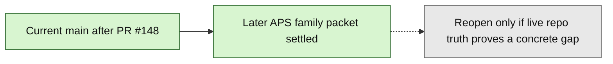

# Layer3 Progress Board

## Purpose

This file is the human-facing companion to `next_milestone_plans/layer3_progress_manifest.json`.
It tracks the bounded Layer3 Phase1A through APS validate-only runtime/report-ref chain already landed on current `main`, plus the landed `23_GATED_APS_PROMOTION_FREEZE.md` continuation freeze from PR `#145`, the post-PR145 docs/progress sync from PR `#146`, the later APS family settlement closeout from PR `#147`, the post-PR147 progress-packet closeout from PR `#148`, the merged planning-only `24_L3_WB_FREEZE.md` / `25_L3_QUAL1_FREEZE.md` deferred-prep docs from PR `#165`, the post-PR165 docs/progress/front-door sync from PR `#166`, the merged broader-workbench implementation-entry prep packet from PR `#168`, the post-PR168 current-main closeout from PR `#169`, the post-PR169 duplicate-default cleanup from PR `#170`, the merged qualitative single-item input packet from PR `#172`, the post-PR172 deferred-prep front-door tightening from PR `#174`, the merged planning-only `28_L3_WB_FIRST_SLICE_FREEZE.md` first-slice setup target from PR `#178`, the merged planning-only `29_L3_WB_FIRST_SLICE_API_AND_STATE_CONTRACT.md` endpoint/state companion from PR `#182`, the landed bounded first-slice workbench implementation from PR `#184`, the post-PR184 status/cohesion/explicit-Gate-C-typing/review-feedback closeouts through PR `#190` as the current live first-slice surface, the merged planning-only `30_L3_WB_PLAN_PREVIEW_FREEZE.md` / `31_L3_WB_PLAN_PREVIEW_API_AND_STATE_CONTRACT.md` second-slice plan-preview packet from PR `#191`, and the post-PR191 progress-metadata sync from PR `#192`.

It is intentionally scoped to:
- the landed milestone chain from Phase 1A feeder-ledger foundation through the bounded dedicated validate-only runtime/report-ref implementation lane
- the landed promotion continuation freeze from PR `#145`, its docs/progress sync from PR `#146`, the later APS family settlement closeout from PR `#147`, and the post-PR147 progress-packet closeout from PR `#148`
- the now-settled later APS family packet immediately beyond the landed dedicated validate-only boundary
- the merged planning-only deferred-prep docs from PR `#165`, the post-PR165 docs/progress/front-door sync from PR `#166`, the merged broader-workbench implementation-entry prep packet from PR `#168`, the post-PR168 current-main closeout from PR `#169`, the post-PR169 duplicate-default cleanup from PR `#170`, the merged qualitative single-item input packet from PR `#172`, the post-PR172 deferred-prep front-door tightening from PR `#174`, the merged planning-only first-slice setup target in `28_L3_WB_FIRST_SLICE_FREEZE.md` from PR `#178`, the merged planning-only endpoint/state companion in `29_L3_WB_FIRST_SLICE_API_AND_STATE_CONTRACT.md` from PR `#182`, the bounded first-slice workbench implementation from PR `#184`, the post-PR184 closeout/correction passes through PR `#190`, and the merged planning-only second-slice plan-preview freeze packet from PR `#191`, plus the post-PR191 progress-metadata sync from PR `#192`, all without reopening the settled packet or expanding live scope beyond separately admitted workbench slices

If a future checkout carries additional qualitative single-item companion prep beyond current `main`, preserve that future prep as branch-local rather than merged-main history. The current `main` version of `27_L3_QUAL1_INPUTS.md` is already merged planning-only prep rather than an open review state.

It is not a general whole-repo roadmap.
It does not replace GitHub PR state.

## Authority Order

Use this order when refreshing this board:
1. GitHub PR state for merged vs open
2. current `project6-origin/main` repo truth
3. active planning docs and freeze docs

Hard rule:
- do not mark a step as landed on `main` from planning-doc wording alone

## Current Snapshot

As of `2026-04-25`:
- seed local checkout used to prepare this artifact: `C:\Users\benny\OneDrive\Desktop\project6_REPO_MCP_FOLDER\worktrees\l3-pr-tracking-sync`
- valid local authority rule: use a clean checkout whose contents match the artifact state being refreshed; prefer current `main` for merged repo truth and the active branch checkout when an open or branch-only milestone is declared
- authoritative remote branch: `project6-origin/main`
- snapshot base `main` commit at this artifact refresh: `5b8c6a7678bd2cdd6fb2b39b27f294469fbef9e0`
- current `main` includes the bounded APS multisource implementation slice from PR `#101`
- current `main` also includes the docs-only multisource closeout from PR `#102`
- current `main` also includes the landed export-package first shared-consumer freeze from PR `#106` and its docs-only closeout from PR `#107`
- current `main` also includes the bounded export-package handoff implementation slice from PR `#109`, its docs-only closeout from PR `#110`, and the exact-run export/export-package gate-hardening follow-up from PR `#111` and `#112`
- current `main` now includes the landed package-derived-context freeze from PR `#113`, the bounded package-derived context handoff implementation slice from PR `#115`, the earlier hardening pass from PR `#116`, the post-PR116 docs/progress sync from PR `#117`, and the malformed-scoped candidate-discovery closeout from PR `#119`
- current `main` now includes the landed context-dossier freeze from PR `#118`, the post-PR118 docs/progress sync from PR `#120`, and the bounded `aps_context_dossier_handoff` implementation slice from PR `#121` plus its docs/progress closeout from PR `#122`
- current `main` now includes the post-PR122 artifact-state fix from PR `#123`
- current `main` now includes the landed deterministic-insight continuation freeze from PR `#124`, the bounded deterministic insight handoff implementation slice from PR `#126`, and the post-PR126 docs/progress sync from PR `#127`
- current `main` now includes the landed deterministic-challenge continuation freeze from PR `#128`, the post-PR128 docs/progress sync from PR `#129`, the bounded deterministic challenge handoff implementation slice from PR `#130`, and the post-PR130 docs/progress sync from PR `#131`
- current `main` now includes the landed deterministic challenge review-packet continuation freeze from PR `#132`, the post-PR132 docs/progress sync from PR `#133`, the bounded deterministic challenge review-packet handoff slice from PR `#134`, and the post-PR134 docs/progress sync from PR `#135`
- current `main` now includes the landed validate-only-gates continuation freeze from PR `#136`, the post-PR136 docs/progress sync from PR `#137`, the bounded validate-only gate-report refresh lane from PR `#138`, and the post-PR138 docs/progress sync from PR `#139`
- current `main` now includes the landed dedicated validate-only runtime/report-ref continuation freeze from PR `#140`, the post-PR140 docs/progress sync from PR `#141`, the post-PR141 docs/progress sync from PR `#142`, the bounded dedicated validate-only runtime/report-ref implementation lane from PR `#143`, and the post-PR143 docs/progress sync from PR `#144`
- current `main` now also includes the landed read-only `23_GATED_APS_PROMOTION_FREEZE.md` freeze from PR `#145`, the post-PR145 docs/progress sync from PR `#146`, the later APS family settlement closeout from PR `#147`, and the post-PR147 progress-packet closeout from PR `#148`
- current `main` now also includes the merged planning-only `24_L3_WB_FREEZE.md` and `25_L3_QUAL1_FREEZE.md` docs from PR `#165`; they remain deferred-scope preparation artifacts and do not reopen the settled packet or change the merged milestone count
- current `main` now also includes the post-PR165 docs/progress/front-door sync from PR `#166`, which aligns the progress artifact, pack front door, and canonical status/index surfaces with the merged planning-only deferred-prep docs without changing the settled packet state
- current `main` now also includes the merged broader-workbench implementation-entry prep packet from PR `#168`, the post-PR168 current-main closeout from PR `#169`, and the post-PR169 duplicate-default cleanup from PR `#170`; together they land and finalize `26_L3_WB_INPUTS.md` plus companion updates to `24_L3_WB_FREEZE.md`, `25_L3_QUAL1_FREEZE.md`, `README_LAYER3_PHASE1A_PACK.md`, and the progress/control packet without changing the settled packet state or merged milestone count
- current `main` now also includes the merged qualitative single-item input packet from PR `#172`; together `27_L3_QUAL1_INPUTS.md` plus companion updates to `25_L3_QUAL1_FREEZE.md`, `README_LAYER3_PHASE1A_PACK.md`, and the progress/control packet remain planning-only deferred-scope prep and do not change the settled packet state or merged milestone count
- current `main` now also includes the post-PR172 deferred-prep front-door tightening from PR `#174`, which carries the merged workbench and qualitative companion prep into the remaining current-main status/front-door surfaces without changing the settled packet state or merged milestone count
- current `main` now also includes the merged planning-only `28_L3_WB_FIRST_SLICE_FREEZE.md` first-slice setup target from PR `#178`; it narrowed the later `/review/layer3` plus `/api/v1/layer3/...` target before implementation and remains the governing first-slice scope/no-go contract
- current `main` now also includes the merged planning-only `next_milestone_plans/Layer3_planning_docs/29_L3_WB_FIRST_SLICE_API_AND_STATE_CONTRACT.md` endpoint/state companion from PR `#182`; it remains the governing endpoint, DTO, persistence, authority-rail, browser-state, and proof contract
- current `main` now also includes the bounded first-slice workbench implementation from PR `#184`; `/review/layer3` and `/api/v1/layer3/...` are live for intent/preflight, deterministic source preview, material preview, Gate B decision recording, Gate C UI non-authoritative typing preview, explicit API owner-service typing materialization when `commit_typing` is true, explicit Gate C override unavailability, and session summary only
- current `main` now also includes the post-PR184 status/cohesion/explicit-Gate-C-typing and merged-review-feedback closeouts from PRs `#185` through `#190`; these preserve response envelopes, blocked Gate B error semantics, Gate C authority-rail counts/source context, and tracked-PR metadata without changing the 29 merged milestone count, settled packet state, or downstream no-go list
- current `main` now also includes the merged planning-only `30_L3_WB_PLAN_PREVIEW_FREEZE.md` and `31_L3_WB_PLAN_PREVIEW_API_AND_STATE_CONTRACT.md` second-slice packet from PR `#191`; it freezes read-only plan preview after explicit Gate C typing commit and still excludes execution, results, package review, handoff, qualitative/hybrid/RAG/vector execution, runtime snapshot DB writes, schema widening, and hidden LLM planning
- current `main` also includes the post-PR191 progress-metadata sync from PR `#192`; it records the merged plan-preview packet in the progress/control surfaces and does not expand live route/API scope or downstream no-go boundaries
- the artifact also tracks `next_milestone_plans/layer3-mockups/mockup-spec.txt` and `next_milestone_plans/layer3-mockups/assets.md` as mockup source context only; they do not change the settled packet state, merged milestone count, no-go boundaries, or binary asset dependency posture

## Program State Summary

- Done now on `main`: 29 merged milestones from Phase 1A feeder-ledger foundation through the landed APS promotion continuation freeze from PR `#145`, with its later docs/progress, settlement, and progress-packet closeouts from PR `#146`, `#147`, and `#148`
- Current focus: the bounded later APS family packet beyond the landed dedicated validate-only runtime/report-ref boundary is now settled on current `main` and tracked through the post-PR147 progress-packet closeout from PR `#148`; no further later APS family decision or implementation lane is currently justified by default
- Candidate next consumers: none active in this bounded packet; promotion governance is already sufficient on current `main`, and retrieval cutover already exists there as a separate validate-only parity-proof family
- Deferred but not active: 8 explicitly deferred scope items remain out until later freezes admit them; see the activation-criteria section below for the exact candidate-next and current-focus gates
- Current `main` also includes the merged planning-only `24_L3_WB_FREEZE.md` and `25_L3_QUAL1_FREEZE.md` docs from PR `#165`, plus the post-PR165 docs/progress/front-door sync from PR `#166`; those landed docs prepare deferred-scope work and align artifact/front-door surfaces only, without changing the 29 merged milestone count or reopening the settled packet
- Current `main` also includes the merged broader-workbench implementation-entry prep packet from PR `#168`, the post-PR168 current-main closeout from PR `#169`, and the post-PR169 duplicate-default cleanup from PR `#170`; together they land and finalize `26_L3_WB_INPUTS.md` plus companion updates to `24_L3_WB_FREEZE.md`, `25_L3_QUAL1_FREEZE.md`, `README_LAYER3_PHASE1A_PACK.md`, and the progress/control packet, and they still remain planning-only deferred-scope prep rather than an active lane
- Current `main` also includes the merged qualitative single-item input packet from PR `#172`; together `27_L3_QUAL1_INPUTS.md` plus companion updates to `25_L3_QUAL1_FREEZE.md`, `README_LAYER3_PHASE1A_PACK.md`, and the progress/control packet remain planning-only deferred-scope prep rather than an active lane
- Current `main` also includes the post-PR172 deferred-prep front-door tightening from PR `#174`, which keeps the merged deferred-prep packet phrased consistently across the remaining current-main front-door/status surfaces without changing the settled packet state or merged milestone count
- Current `main` now also includes the merged planning-only `28_L3_WB_FIRST_SLICE_FREEZE.md` first-slice setup target from PR `#178`; it did not change the 29 merged milestone count or make `/review/layer3` or `/api/v1/layer3/...` live by itself, but it remains the governing scope/no-go contract for the later PR `#184` implementation
- Current `main` now also includes the merged planning-only first-slice API/state contract companion from PR `#182`; it froze implementation-entry endpoint and state details without activating the route/API by itself, but it remains the governing API/state contract for the later PR `#184` implementation
- Current `main` now also includes the landed bounded first-slice workbench implementation from PR `#184`; this makes `/review/layer3` and `/api/v1/layer3/...` live only for the first-slice shell/API and does not activate downstream plan, execution, results, package review, qualitative/hybrid/RAG/vector execution, runtime snapshot DB writes, schema widening, or handoff scope
- Current `main` now also includes the post-PR184 closeout/correction passes from PRs `#185` through `#190`; those passes tighten docs/status, explicit Gate C typing proof, Gate B blocked/error wording, Gate C authority-rail preservation, and PR-tracking metadata without expanding the first-slice shell/API or changing milestone counts
- Current `main` now also includes the merged second-slice plan-preview packet from PR `#191`; it freezes the next workbench target as read-only plan preview only, with implementation still pending and execution, results, package review, handoff, runtime snapshot DB writes, schema widening, qualitative/hybrid/RAG/vector execution, and hidden LLM planning still out
- The repo-tracked mockup source mirror and visual-asset inventory are source context only; they preserve the planning input behind the first-slice setup without activating implementation scope or importing the binary/SVG mockup files as runtime dependencies

## Milestone Table

| Milestone | Current chain state | Governing doc | Key PRs | Notes |
| --- | --- | --- | --- | --- |
| Phase 1A feeder-ledger foundation | merged | `01_IMPLEMENTATION_ENTRY_BASELINE_REV2.md`, `02_PHASE1A_IMPLEMENTATION_PREP_SPEC_REV2.md`, `03_PHASE1A_VALIDATION_AND_EXECUTION_PLAN_REV2.md` | `#69` | First bounded implementation-entry slice |
| Gate C entry bridge | merged | `04_GATEC_ENTRY_FREEZE.md` | `#70` | Opens the first Gate C implementation freeze |
| Gate C typing-unit slice | merged | `05_GATEC_IMPLEMENTATION_FREEZE.md` | `#71`, `#72` | First write-enabled Gate C slice |
| Gate C single-item pass-entry slice | merged | `06_GATEC_PASS_FREEZE.md` | `#73`, `#74`, `#75` | Adds plan/pass entry for the single-item quantitative path |
| Gate C associated-cohort slice | merged | `07_GATEC_COHORT_FREEZE.md` | `#77`, `#79`, `#80` | Extends Gate C to the bounded cohort path |
| Gate D package-entry slice | merged | `08_GATED_PACKAGE_FREEZE.md` | `#81`, `#82`, `#84` | Adds internal canonical package entry |
| APS evidence-bundle handoff | merged | `09_GATED_APS_HANDOFF_FREEZE.md` | `#85`, `#86`, `#87` | First APS-facing bounded handoff |
| APS citation-pack handoff | merged | `10_GATED_APS_CITATION_FREEZE.md` | `#88`, `#89`, `#90` | Next APS continuation beyond evidence-bundle |
| APS evidence-report handoff | merged | `11_GATED_APS_REPORT_FREEZE.md` | `#91`, `#92`, `#93` | Bounded report-family continuation |
| APS evidence-report-export handoff | merged | `12_GATED_APS_REPORT_EXPORT_FREEZE.md` | `#94`, `#95`, `#96` | Bounded export-family continuation |
| APS export-derived context-packet | merged | `13_GATED_APS_CONTEXT_FREEZE.md` | `#97`, `#98`, `#99` | Direct export-derived context path |
| APS same-run multisource admission | merged | `14_GATED_APS_MULTISOURCE_FREEZE.md` | `#100`, `#101`, `#102` | Implementation and docs closeout are both landed on `main` |
| APS export-package first shared-consumer freeze | merged | `15_GATED_APS_EXPORT_PACKAGE_FREEZE.md` | `#106`, `#107` | Read-only freeze and docs closeout are both landed on `main` |
| APS evidence-report-export-package handoff | merged | `15_GATED_APS_EXPORT_PACKAGE_FREEZE.md` | `#109`, `#110`, `#111`, `#112` | Landed bounded implementation slice, docs closeout, and exact-run gate hardening |
| APS package-derived context continuation freeze | merged | `16_GATED_APS_PACKAGE_CONTEXT_FREEZE.md` | `#113` | Selects package-derived context packet as the next later shared APS family |
| APS package-derived context handoff | merged | `16_GATED_APS_PACKAGE_CONTEXT_FREEZE.md` | `#115`, `#116`, `#117`, `#119`, `#120` | Landed bounded handoff implementation slice plus hardening and docs/progress sync |
| APS context-dossier continuation freeze | merged | `17_GATED_APS_CONTEXT_DOSSIER_FREEZE.md` | `#118` | Preserves paired export-derived context packets as dossier inputs |
| APS context-dossier handoff | merged | `17_GATED_APS_CONTEXT_DOSSIER_FREEZE.md` | `#121`, `#122`, `#123` | Landed bounded implementation slice plus docs/progress and artifact-state closeout |
| APS deterministic-insight continuation freeze | merged | `18_GATED_APS_DETERMINISTIC_INSIGHT_FREEZE.md` | `#124`, `#125` | Landed read-only freeze plus merged-state docs/progress closeout |
| APS deterministic-insight handoff | merged | `18_GATED_APS_DETERMINISTIC_INSIGHT_FREEZE.md` | `#126`, `#127` | Landed bounded implementation slice plus docs/progress sync |
| APS deterministic-challenge continuation freeze | merged | `19_GATED_APS_DETERMINISTIC_CHALLENGE_FREEZE.md` | `#128`, `#129` | Landed read-only freeze plus docs/progress sync |
| APS deterministic-challenge handoff | merged | `19_GATED_APS_DETERMINISTIC_CHALLENGE_FREEZE.md` | `#130`, `#131` | Landed bounded implementation slice plus docs/progress sync |
| APS deterministic challenge review-packet continuation freeze | merged | `20_GATED_APS_REVIEW_PACKET_FREEZE.md` | `#132`, `#133` | Landed read-only freeze plus docs/progress sync |
| APS deterministic challenge review-packet handoff | merged | `20_GATED_APS_REVIEW_PACKET_FREEZE.md` | `#134`, `#135` | Landed bounded implementation slice plus docs/progress sync |
| APS validate-only-gates continuation freeze | merged | `21_GATED_APS_VALIDATE_ONLY_GATES_FREEZE.md` | `#136`, `#137` | Landed read-only freeze plus docs/progress sync |
| APS validate-only gate-report refresh lane | merged | `21_GATED_APS_VALIDATE_ONLY_GATES_FREEZE.md` | `#138`, `#139` | Landed bounded validate-only gate-report refresh lane plus docs/progress sync |
| APS dedicated validate-only runtime/report-ref continuation freeze | merged | `22_GATED_APS_VALIDATE_ONLY_RUNTIME_FREEZE.md` | `#140`, `#141`, `#142` | Landed read-only freeze plus both docs/progress sync passes |
| APS dedicated validate-only runtime/report-ref implementation lane | merged | `22_GATED_APS_VALIDATE_ONLY_RUNTIME_FREEZE.md` | `#143`, `#144` | Landed bounded implementation lane plus post-PR143 docs/progress sync |
| APS promotion continuation freeze | merged | `23_GATED_APS_PROMOTION_FREEZE.md` | `#145`, `#146`, `#147` | Landed read-only freeze from PR `#145`, post-PR145 docs/progress sync from PR `#146`, and later APS family settlement closeout from PR `#147`; live repo truth now also shows the existing promotion governance family already sufficient on current `main` |

## Completed Chain

The Program State Summary and Milestone Table above are the primary human-readable surfaces in this board.
The Mermaid views below are secondary visual aids only.

## Current Focus

The bounded later APS family packet beyond the landed dedicated validate-only runtime/report-ref boundary is now settled on current `main`.

Current bounded selection state:
- current `main` is settled through the dedicated validate-only runtime/report-ref implementation lane from PR `#143` and the post-PR143 docs/progress sync from PR `#144`
- current `main` now also includes the landed read-only `23_GATED_APS_PROMOTION_FREEZE.md` freeze from PR `#145`, the post-PR145 docs/progress sync from PR `#146`, the later APS family settlement closeout from PR `#147`, and the post-PR147 progress-packet closeout from PR `#148`
- promotion is the landed first later-family choice on current `main` under `23_GATED_APS_PROMOTION_FREEZE.md`
- the existing promotion governance family is already sufficient on current `main` through `backend/app/services/nrc_aps_promotion_gate.py`, `tests/test_nrc_aps_promotion_gate.py`, `backend/app/services/nrc_aps_promotion_tuning.py`, `tests/test_nrc_aps_promotion_tuning.py`, `backend/app/services/nrc_adams_resources/aps_promotion_policy_v1.json`, and `project6.ps1`
- retrieval cutover already exists on current `main` as a separate validate-only parity-proof family through `backend/app/services/aps_retrieval_plane_cutover_validation.py`, `backend/tests/test_aps_retrieval_plane_cutover_validation.py`, `backend/tests/test_aps_retrieval_plane_cutover_gate.py`, `tools/nrc_aps_retrieval_cutover_gate.py`, and `project6.ps1`
- no further later APS family decision or implementation lane is currently justified by default from this merged-main state
- the landed freeze does not invent a separate repo-backed post-validate-only top-chain family

Hard rule:
- do not invent another later APS family lane by default from this merged-main state alone

## Candidate Next Consumers

- none active in this bounded packet
- promotion governance is already sufficient on current `main`
- retrieval cutover already exists on current `main` as a separate validate-only parity-proof family

The textual section above remains primary if Mermaid rendering is unavailable.

## Deferred Scope

These remain explicitly out until later freezes admit them:
- direct shared `evidence_report_export_package` contract/runtime edits beyond the landed bounded export-package handoff and exact-run gate-hardening lane
- package-derived context implementation beyond the landed bounded handoff slice
- validate-only top-chain expansion
- future workbench route family
- broader qualitative, hybrid, comparative, or cross-modal Layer3 breadth
- runtime DB writes
- schema widening
- route/UI widening

## Deferred Scope Activation Criteria

Use this section when deciding whether any deferred item may graduate from the muted deferred list into either `Candidate Next Consumers` or `Current Focus`.

Hard rules:
- do not promote a deferred item from gray-box status just because it sounds adjacent to the settled packet
- candidate-next admission requires repo-confirmed evidence that the family is concrete, bounded, and not already settled elsewhere
- current-focus admission requires a planned or open bounded lane with named owner surfaces, explicit proof shape, and an exact no-go list
- a new additive workbench family is not the same thing as widening shipped review/document-trace/workbench surfaces
- broader package-derived-context work is not the same thing as reopening the shared export/export-package contract/runtime surfaces
- do not invent validate-only top-chain work unless live repo graph/tree truth defines a real post-`validate_only_gates` family

### 1. Direct shared `evidence_report_export_package` contract/runtime edits beyond the landed bounded export-package handoff and exact-run gate-hardening lane

Current boundary:
- current `main` lands the additive `aps_evidence_report_export_package_handoff` consumer plus narrow exact-run export/export-package gate hardening
- the settled packet does not admit a broader reopening of the shared evidence-report-export or evidence-report-export-package contract/runtime surfaces

Candidate-next admission requires:
- live repo truth proving a concrete downstream need that additive consumer code or the existing exact-run gate hardening cannot satisfy
- a new freeze that explicitly reopens the shared export/export-package contract/runtime surfaces instead of selecting another downstream consumer lane
- exact naming of the shared services, gates, contracts, tests, and operator entrypoints that would change, plus the precise no-go list that still remains out

Current-focus admission requires:
- `next_required_decision` or a tracked milestone explicitly selecting this shared-surface reopening as the active bounded lane
- an explicit upstream/downstream source boundary relative to `aps_multisource_admission` and `aps_evidence_report_export_package_handoff`
- proof that validates the shared contract/gate reopening while still keeping package-derived context, route/UI widening, runtime DB writes, and schema widening out unless separately admitted

Primary authority surfaces:
- `next_milestone_plans/Layer3_planning_docs/15_GATED_APS_EXPORT_PACKAGE_FREEZE.md`
- `backend/app/services/layer3_aps_report_export_package_handoff.py`
- `backend/app/services/nrc_aps_evidence_report_export_gate.py`
- `backend/app/services/nrc_aps_evidence_report_export_package_gate.py`
- `backend/tests/test_layer3_aps_report_export_package_handoff.py`
- `docs/nrc_adams/nrc_aps_status_handoff.md`

### 2. Package-derived context implementation beyond the landed bounded handoff slice

Current boundary:
- current `main` lands the bounded `aps_context_packet_package_handoff` slice and adjacent gate hardening only
- the live dossier-input rule still resolves from paired export-derived context packets, so package-derived context must not be presented as dossier-input proof by default

Candidate-next admission requires:
- live repo truth proving a concrete gap that the bounded package-derived-context handoff does not cover
- a new freeze that explicitly chooses the next package-derived-context continuation instead of implying that broader package-context work is already admitted
- an explicit rule preserving or deliberately replacing the current paired export-derived dossier-input boundary

Current-focus admission requires:
- a planned or open milestone naming the exact next package-context consumer or continuation, not just `broader package context`
- exact owner services, gates, tests, and provenance rules plus a precise keep-out list for dossier, deterministic, route/UI, runtime DB, and schema surfaces
- proof that the continuation does not misrepresent package-derived context as already equivalent to the paired export-derived dossier-input path

Primary authority surfaces:
- `next_milestone_plans/Layer3_planning_docs/16_GATED_APS_PACKAGE_CONTEXT_FREEZE.md`
- `next_milestone_plans/Layer3_planning_docs/17_GATED_APS_CONTEXT_DOSSIER_FREEZE.md`
- `backend/app/services/layer3_aps_context_packet_package_handoff.py`
- `backend/app/services/nrc_aps_context_packet_gate.py`
- `backend/tests/test_layer3_aps_context_packet_package_handoff.py`
- `docs/nrc_adams/nrc_aps_status_handoff.md`

### 3. Validate-only top-chain expansion

Current boundary:
- current `main` lands the dedicated validate-only runtime/report-ref boundary and the later APS family settlement packet
- the live downstream graph still ends the bounded tracked chain at `validate_only_gates`
- the landed promotion freeze explicitly says not to invent a separate repo-backed post-validate-only top-chain family without direct repo proof

Candidate-next admission requires:
- live repo graph/tree truth defining a concrete later named validate-only family beyond the current `validate_only_gates` boundary
- a new freeze explicitly selecting that validate-only family instead of promotion, retrieval-cutover parity proof, or the already-settled later-family closure posture
- repo truth showing the family is neither already sufficient nor already present elsewhere under a different settled lane

Current-focus admission requires:
- `next_required_decision` or a tracked milestone moving from `settled` to a planned/open validate-only continuation with exact named surfaces
- exact review graph/tree/runtime/report-ref or adjacent validate-only services, tests, CLI actions, and operator entrypoints for that family
- a proof plan that remains validate-only, fails closed on empty runtime, and still keeps promotion, retrieval cutover, route/UI widening, runtime DB writes, and schema widening out unless separately admitted

Primary authority surfaces:
- `next_milestone_plans/Layer3_planning_docs/21_GATED_APS_VALIDATE_ONLY_GATES_FREEZE.md`
- `next_milestone_plans/Layer3_planning_docs/22_GATED_APS_VALIDATE_ONLY_RUNTIME_FREEZE.md`
- `next_milestone_plans/Layer3_planning_docs/23_GATED_APS_PROMOTION_FREEZE.md`
- `backend/app/services/review_nrc_aps_graph.py`
- `backend/app/services/review_nrc_aps_tree.py`
- `project6.ps1`

### 4. Future workbench route family

Current boundary:
- current `main` already ships additive `/review/nrc-aps/workbench-compare` and `/review/nrc-aps/candidate-b-trace` surfaces, plus the same-checkout prep gate and browser coverage
- current `main` now also ships the bounded first-slice `/review/layer3` plus `/api/v1/layer3/...` workbench from PR `#184`
- future workbench-route work therefore means either a second Layer 3 workbench slice beyond the shipped first-slice shell/API, or a different additive workbench family beyond the shipped compare, Candidate B Trace, and Layer 3 first-slice posture
- `28_L3_WB_FIRST_SLICE_FREEZE.md` remains the scope/no-go contract for the now-landed first-slice workbench through intent/preflight, deterministic source selection, material preview, Gate B material review, and Gate C typing review
- `29_L3_WB_FIRST_SLICE_API_AND_STATE_CONTRACT.md` remains the endpoint, DTO, Gate B persistence, Gate C override-unavailability, authority-rail, browser-state, and proof contract for that landed first-slice implementation

Candidate-next admission requires:
- browser/operator validation or a concrete product requirement proving that the shipped review/document-trace/workbench/Candidate B surfaces and the shipped Layer 3 first-slice workbench are insufficient
- a new freeze specifying an additive workbench page/API family instead of smuggling the work into the existing review or document-trace contracts
- exact route/page/API surfaces, same-checkout or validate-only preparation rules, and any bundle-scope versus runtime-scope constraints governing the new family
- if extending the landed Layer 3 first-slice workbench, preserve the `28_L3_WB_FIRST_SLICE_FREEZE.md` and `29_L3_WB_FIRST_SLICE_API_AND_STATE_CONTRACT.md` no-go list unless a later freeze explicitly supersedes it

Current-focus admission requires:
- a planned or open second-slice milestone identifying the exact route/API additions, backend services, static UI files, source-binding behavior, Gate C behavior, and validation files that are in scope
- headed and headless Chrome validation as part of the lane contract for shell reachability and operator flow
- preservation of current Candidate B bundle-scoped, non-admitted boundaries unless the freeze explicitly reopens them

Primary authority surfaces:
- `next_milestone_plans/Layer3_planning_docs/24_L3_WB_FREEZE.md`
- `next_milestone_plans/Layer3_planning_docs/26_L3_WB_INPUTS.md`
- `next_milestone_plans/Layer3_planning_docs/28_L3_WB_FIRST_SLICE_FREEZE.md`
- `next_milestone_plans/Layer3_planning_docs/29_L3_WB_FIRST_SLICE_API_AND_STATE_CONTRACT.md`
- `backend/main.py`
- `backend/app/api/router.py`
- `backend/app/api/layer3.py`
- `backend/app/services/layer3_workbench.py`
- `backend/app/review_ui/static/layer3.html`
- `backend/app/review_ui/static/layer3.css`
- `backend/app/review_ui/static/layer3.js`
- `frontend_UI_plans/README.md`
- `frontend_UI_plans/wb-compare-spec.md`
- `frontend_UI_plans/wb-compare-contract.md`
- `frontend_UI_plans/wb-compare-blueprint.md`
- `frontend_UI_plans/wb-compare-validation.md`
- `frontend_UI_plans/nrc_aps_frontend_ui_operator_validation_guide.md`

### 5. Broader qualitative, hybrid, comparative, or cross-modal Layer3 breadth

Current boundary:
- the settled packet is a bounded quantitative/APS continuation chain
- no active freeze on current `main` admits broader qualitative, hybrid, comparative, or cross-modal Layer3 breadth as a next lane

Candidate-next admission requires:
- a new freeze choosing one exact breadth axis instead of reopening all broader Layer3 breadth under a single umbrella label
- live repo truth identifying the concrete upstream inputs, downstream consumers, and proof surfaces for that chosen breadth axis
- an explicit statement of whether the work is additive consumer work, a review surface, or a separate program surface, plus what remains out

Current-focus admission requires:
- a planned or open milestone naming the exact owner files, tests, proof artifacts, and operational entrypoints for the chosen breadth lane
- a bounded source boundary relative to the settled APS chain so breadth work is not misread as a latent extension of the already-closed packet
- explicit control of route/UI widening, runtime DB writes, and schema widening unless the same freeze admits them

Primary authority surfaces:
- `next_milestone_plans/Layer3_planning_docs/25_L3_QUAL1_FREEZE.md`
- `next_milestone_plans/Layer3_planning_docs/27_L3_QUAL1_INPUTS.md`
- `next_milestone_plans/README_LAYER3_PHASE1A_PACK.md`
- `next_milestone_plans/layer3_progress_manifest.json`
- `next_milestone_plans/layer3_progress_board.md`
- `docs/nrc_adams/nrc_aps_status_handoff.md`

### 6. Runtime DB writes

Current boundary:
- current `main` treats review/document-trace runtime DBs as read-only evidence-plane surfaces
- runtime DB safety rails, operator authority labeling, and browser proof are landed, but write-enabled runtime behavior remains explicitly out

Candidate-next admission requires:
- live repo truth proving that the read-only evidence-plane model is insufficient and that the required writes belong in runtime snapshots rather than the control-plane DB
- a new freeze explicitly admitting write-enabled runtime behavior and defining which runtime DBs may be written, by which surfaces, and under what isolation model
- operator-safe authority rules that prevent accidental writes or migrations against immutable runtime snapshots

Current-focus admission requires:
- a planned or open lane naming the exact services, scripts, routes, and write paths that will perform runtime writes
- a proof plan using isolated runtime state while preserving the hard rule that validate-only actions remain validate-only and must not seed or generate artifacts
- docs and operator surfaces identifying write authority, rollback expectations, and cleanup semantics before the lane becomes current focus

Primary authority surfaces:
- `frontend_UI_plans/nrc_aps_runtime_db_reconceptualization_and_next_steps.md`
- `backend/app/api/review_nrc_aps.py`
- `backend/app/services/review_nrc_aps_runtime_db.py`
- `backend/tests/test_review_nrc_aps_runtime_db.py`
- `docs/nrc_adams/nrc_aps_status_handoff.md`

### 7. Schema widening

Current boundary:
- multiple freezes in the bounded chain explicitly keep schema widening out
- current `main` lands additive consumers and operator surfaces without changing the bounded packet schema boundary

Candidate-next admission requires:
- a concrete blocker proving that the required consumer, validation surface, or operator flow cannot be supported within the existing schema
- a new freeze enumerating the exact tables, models, fields, or indexes that would widen and the exact consumers that require them
- explicit separation from route/UI or runtime-write widening unless the same freeze deliberately admits a combined tranche

Current-focus admission requires:
- a planned or open write-enabled lane naming the exact model files, migration files, services, tests, and verification steps that own the schema change
- a proof plan including migration execution and direct validation of the widened schema boundary rather than only prose justification
- active-packet and front-door doc updates in the same lane because schema widening changes the meaning of the bounded packet, not just its implementation detail

Primary authority surfaces:
- `docs/nrc_adams/nrc_aps_status_handoff.md`
- `next_milestone_plans/README_LAYER3_PHASE1A_PACK.md`
- `backend/app/models/models.py`
- `backend/alembic`
- `project6.ps1`

### 8. Route/UI widening

Current boundary:
- current `main` already ships the bounded review, document-trace, workbench-compare, and Candidate B Trace posture plus runtime-authority transparency
- the settled Layer3/APS packet still explicitly keeps broader route or UI widening out

Candidate-next admission requires:
- browser/operator evidence proving that the shipped route/UI posture is insufficient, ambiguous, or incomplete for the intended operator task
- a new freeze specifying the exact page, route, API, and navigation surfaces that would widen, and clearly separating additive new surfaces from edits to shipped review/document-trace/workbench pages
- preservation of current runtime-authority and validate-only boundaries unless a separate freeze reopens them

Current-focus admission requires:
- a planned or open lane naming the exact frontend/backend owner files plus the headed/headless Chrome validation flow that will prove the widened surface
- active front-door docs updated in step with the implementation so operator guidance does not drift behind the shipped UI
- runtime DB writes and schema widening remaining separately admitted unless the same freeze explicitly reopens them

Primary authority surfaces:
- `frontend_UI_plans/README.md`
- `frontend_UI_plans/nrc_aps_review_ui_startup_and_smoke_test.md`
- `frontend_UI_plans/nrc_aps_frontend_ui_operator_validation_guide.md`
- `frontend_UI_plans/nrc_aps_runtime_db_reconceptualization_and_next_steps.md`
- `docs/nrc_adams/nrc_aps_status_handoff.md`

## Refresh Inputs

Refresh this board against:
- `next_milestone_plans/layer3_progress_manifest.json`
- `next_milestone_plans/progress-ui-spec.md`
- `next_milestone_plans/progress-prompt.md`
- `docs/nrc_adams/nrc_aps_status_handoff.md`
- `next_milestone_plans/README_LAYER3_PHASE1A_PACK.md`
- `next_milestone_plans/Layer3_planning_docs/01_IMPLEMENTATION_ENTRY_BASELINE_REV2.md`
- `next_milestone_plans/Layer3_planning_docs/02_PHASE1A_IMPLEMENTATION_PREP_SPEC_REV2.md`
- `next_milestone_plans/Layer3_planning_docs/03_PHASE1A_VALIDATION_AND_EXECUTION_PLAN_REV2.md`
- `next_milestone_plans/Layer3_planning_docs/04_GATEC_ENTRY_FREEZE.md` through `31_L3_WB_PLAN_PREVIEW_API_AND_STATE_CONTRACT.md`
- `backend/app/services/review_nrc_aps_graph.py`
- `backend/app/services/nrc_aps_validate_only_gates_contract.py`
- `backend/app/services/nrc_aps_validate_only_gates.py`
- `backend/app/services/nrc_aps_validate_only_gates_gate.py`
- `backend/app/services/review_nrc_aps_runtime.py`
- `backend/app/services/review_nrc_aps_gate_reports.py`
- `backend/app/services/connectors_sciencebase.py`
- `backend/app/services/nrc_aps_promotion_gate.py`
- `backend/app/services/nrc_aps_promotion_tuning.py`
- `backend/app/services/aps_retrieval_plane_cutover_validation.py`
- `tests/test_nrc_aps_promotion_gate.py`
- `tests/test_nrc_aps_promotion_tuning.py`
- `backend/tests/test_aps_retrieval_plane_cutover_validation.py`
- `backend/tests/test_aps_retrieval_plane_cutover_gate.py`
- `tools/nrc_aps_retrieval_cutover_gate.py`
- `project6.ps1`
- GitHub PR state for `#69`, `#70`, `#71`, `#72`, `#73`, `#74`, `#75`, `#77`, `#79`, `#80`, `#81`, `#82`, `#84`, `#85`, `#86`, `#87`, `#88`, `#89`, `#90`, `#91`, `#92`, `#93`, `#94`, `#95`, `#96`, `#97`, `#98`, `#99`, `#100`, `#101`, `#102`, `#106`, `#107`, `#108`, `#109`, `#110`, `#111`, `#112`, `#113`, `#115`, `#116`, `#117`, `#118`, `#119`, `#120`, `#121`, `#122`, `#123`, `#124`, `#125`, `#126`, `#127`, `#128`, `#129`, `#130`, `#131`, `#132`, `#133`, `#134`, `#135`, `#136`, `#137`, `#138`, `#139`, `#140`, `#141`, `#142`, `#143`, `#144`, `#145`, `#146`, `#147`, `#148`, `#165`, `#166`, `#167`, `#168`, `#169`, `#170`, `#172`, `#174`, `#178`, `#181`, `#182`, `#183`, `#184`, `#185`, `#186`, `#187`, `#188`, and `#189`
