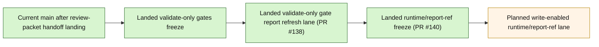

# Layer3 Progress Board

## Purpose

This file is the human-facing companion to `next_milestone_plans/layer3_progress_manifest.json`.
It tracks the bounded Layer3 Phase1A through APS multisource chain, plus the now-landed first shared-consumer freeze that follows multisource, plus the now-landed bounded export-package handoff implementation slice governed by that freeze, plus the now-landed package-derived-context freeze that follows that landed boundary, plus the now-landed bounded package-derived context handoff implementation slice and the now-landed malformed-scoped candidate-discovery closeout beyond that landed package-context boundary, plus the now-landed read-only context-dossier freeze that preserves paired export-derived context packets as dossier inputs, plus the now-landed bounded context-dossier handoff implementation slice and its docs/progress sync on current `main`, plus the now-landed read-only deterministic-insight continuation freeze on current `main` beyond the landed dossier boundary, plus the now-landed bounded deterministic insight handoff implementation slice and narrow deterministic gate hardening beyond that landed freeze, plus the now-landed read-only deterministic-challenge continuation freeze on current `main` beyond that landed deterministic-insight boundary, plus the now-landed bounded deterministic challenge handoff implementation slice, plus the now-landed deterministic challenge review-packet continuation freeze and bounded review-packet handoff implementation slice, plus the now-landed validate-only-gates freeze from PR `#136`, its docs/progress sync from PR `#137`, the now-landed bounded validate-only gate-report refresh lane from PR `#138` plus its docs/progress sync from PR `#139` beyond that landed review-packet boundary, and the now-landed dedicated validate-only runtime/report-ref continuation freeze from PR `#140` beyond that landed generic boundary.
It is intentionally scoped to:
- the landed milestone chain from Phase 1A feeder-ledger entry through APS multisource admission
- the now-landed docs-only closeout that followed multisource landing
- the landed first shared-consumer freeze that selects the first downstream shared APS consumer beyond multisource
- the now-landed bounded export-package handoff implementation slice on current `main`
- the now-landed package-derived-context freeze on current `main`
- the now-landed bounded package-derived context handoff implementation slice beyond that landed freeze
- the now-landed read-only `17_GATED_APS_CONTEXT_DOSSIER_FREEZE.md` freeze beyond the landed package-context boundary
- the now-landed bounded `aps_context_dossier_handoff` implementation slice on current `main`
- the now-landed read-only `18_GATED_APS_DETERMINISTIC_INSIGHT_FREEZE.md` freeze on current `main` beyond the landed dossier boundary
- the now-landed bounded `aps_deterministic_insight_artifact_handoff` implementation slice and narrow deterministic gate hardening beyond that landed freeze
- the now-landed read-only `19_GATED_APS_DETERMINISTIC_CHALLENGE_FREEZE.md` freeze on current `main` beyond the landed deterministic-insight boundary
- the now-landed bounded `aps_deterministic_challenge_artifact_handoff` implementation slice and narrow deterministic challenge gate hardening beyond that landed freeze
- the now-landed read-only `20_GATED_APS_REVIEW_PACKET_FREEZE.md` freeze on current `main` beyond the landed deterministic-challenge boundary
- the now-landed bounded `aps_deterministic_challenge_review_packet_handoff` implementation slice and narrow review-packet gate hardening beyond that landed freeze
- the now-landed read-only `21_GATED_APS_VALIDATE_ONLY_GATES_FREEZE.md` freeze on current `main` beyond the landed deterministic challenge review-packet handoff
- the now-landed bounded validate-only gate-report refresh lane beyond that landed freeze
- the now-landed read-only `22_GATED_APS_VALIDATE_ONLY_RUNTIME_FREEZE.md` freeze from PR `#140` beyond that landed generic gate-report boundary

It is not a general whole-repo roadmap.
It does not replace GitHub PR state.

## Authority Order

Use this order when refreshing this board:
1. GitHub PR state for merged vs open
2. current `project6-origin/main` repo truth
3. active planning docs and freeze docs

Hard rule:
- do not mark a step as landed on `main` from planning-doc wording alone

## Current Snapshot

As of `2026-04-21`:
- seed local checkout used to prepare this artifact: `C:\Users\benny\OneDrive\Desktop\project6_REPO_MCP_FOLDER\worktrees\l3-progress-main`
- valid local authority rule: use a clean checkout whose contents match the artifact state being refreshed; prefer current `main` for merged repo truth and the active branch checkout when a branch-only milestone is declared
- authoritative remote branch: `project6-origin/main`
- snapshot base `main` commit at this artifact refresh: `156aca324c399b211de451e26f29555f89122c08`
- current `main` includes the bounded APS multisource implementation slice from PR `#101`
- current `main` also includes the docs-only multisource closeout from PR `#102`
- current `main` also includes the landed export-package first shared-consumer freeze from PR `#106` and its docs-only closeout from PR `#107`
- current `main` also now includes the bounded export-package handoff implementation slice from PR `#109` and its docs-only closeout from PR `#110`, rooted in `backend/app/services/layer3_aps_report_export_package_handoff.py` and `backend/tests/test_layer3_aps_report_export_package_handoff.py`
- current `main` also now includes the exact-run export/export-package gate-hardening follow-up from PR `#111` and PR `#112`
- current `main` now includes the landed `16_GATED_APS_PACKAGE_CONTEXT_FREEZE.md` package-derived-context freeze from PR `#113`
- current `main` now also includes the bounded package-derived context handoff implementation slice from PR `#115`, rooted in `backend/app/services/layer3_aps_context_packet_package_handoff.py` and `backend/tests/test_layer3_aps_context_packet_package_handoff.py`
- current `main` now also includes the merged PR `#119` malformed-scoped candidate-discovery closeout across `backend/app/services/nrc_aps_evidence_report_export_gate.py`, `backend/app/services/nrc_aps_evidence_report_export_package_gate.py`, `backend/app/services/nrc_aps_context_packet_gate.py`, `backend/tests/test_layer3_aps_report_export_handoff.py`, `backend/tests/test_layer3_aps_report_export_package_handoff.py`, and `backend/tests/test_layer3_aps_context_packet_package_handoff.py`
- current `main` also includes the post-PR116 docs/progress sync from PR `#117`
- current `main` now also includes the landed read-only `17_GATED_APS_CONTEXT_DOSSIER_FREEZE.md` freeze from PR `#118`, selecting `context_dossier` as the next later shared APS family after the landed package-context milestone while preserving paired export-derived context packets as the live dossier input branch
- current `main` also includes the post-PR118 docs/progress sync from PR `#120`
- current `main` now also includes the bounded `aps_context_dossier_handoff` implementation slice from PR `#121`, rooted in `backend/app/services/layer3_aps_context_dossier_handoff.py`, `backend/app/services/nrc_aps_context_dossier_gate.py`, and `backend/tests/test_layer3_aps_context_dossier_handoff.py`
- current `main` also includes the post-PR121 docs/progress sync from PR `#122`
- current `main` also includes the post-PR122 artifact-state fix from PR `#123`
- current `main` now also includes the landed read-only `18_GATED_APS_DETERMINISTIC_INSIGHT_FREEZE.md` freeze from PR `#124`, selecting `deterministic_insight_artifact` as the next deterministic continuation beyond the landed dossier boundary
- current `main` now also includes the bounded deterministic insight handoff implementation slice from PR `#126`, rooted in `backend/app/services/layer3_aps_deterministic_insight_artifact_handoff.py` and `backend/tests/test_layer3_aps_deterministic_insight_artifact_handoff.py`, plus the narrow deterministic gate hardening in `backend/app/services/nrc_aps_deterministic_insight_artifact_gate.py`
- current `main` now also includes the post-PR126 docs/progress sync from PR `#127`
- current `main` now also includes the landed read-only `19_GATED_APS_DETERMINISTIC_CHALLENGE_FREEZE.md` freeze from PR `#128`, selecting `deterministic_challenge_artifact` as the next deterministic continuation beyond the landed deterministic-insight boundary
- current `main` now also includes the post-PR128 docs/progress sync from PR `#129`
- current `main` now also includes the bounded deterministic challenge handoff implementation slice from PR `#130`, rooted in `backend/app/services/layer3_aps_deterministic_challenge_artifact_handoff.py`, `backend/app/services/nrc_aps_deterministic_challenge_artifact_gate.py`, and `backend/tests/test_layer3_aps_deterministic_challenge_artifact_handoff.py`
- current `main` now also includes the post-PR130 docs/progress sync from PR `#131`
- current `main` now also includes the landed read-only `20_GATED_APS_REVIEW_PACKET_FREEZE.md` freeze from PR `#132`, selecting `deterministic_challenge_review_packet` as the next deterministic continuation beyond the now-landed deterministic challenge handoff
- current `main` now also includes the post-PR132 docs/progress sync from PR `#133`
- current `main` now also includes the bounded deterministic challenge review-packet handoff slice from PR `#134`, rooted in `backend/app/services/layer3_aps_deterministic_challenge_review_packet_handoff.py`, plus the narrow review-packet gate hardening in `backend/app/services/nrc_aps_deterministic_challenge_review_packet_gate.py`
- current `main` now also includes the post-PR134 docs/progress sync from PR `#135`
- current `main` now also includes the read-only `21_GATED_APS_VALIDATE_ONLY_GATES_FREEZE.md` freeze from PR `#136`, selecting `validate_only_gates` as the next verification continuation beyond the landed deterministic challenge review-packet handoff while keeping later validate-only execution/report refresh, promotion, retrieval cutover, route/UI, runtime DB, and schema widening out
- current `main` now also includes the post-PR136 docs/progress sync from PR `#137`
- current `main` now also includes the bounded validate-only gate-report refresh lane from PR `#138`, rooted in `backend/app/services/review_nrc_aps_gate_reports.py`, `tools/nrc_aps_refresh_review_gate_reports.py`, `tools/run_nrc_aps_local_corpus_e2e.py`, `backend/tests/test_review_nrc_aps_gate_reports.py`, and `project6.ps1`
- current `main` now also includes the post-PR138 docs/progress sync from PR `#139`
- current `main` now also includes the read-only `22_GATED_APS_VALIDATE_ONLY_RUNTIME_FREEZE.md` freeze from PR `#140`, selecting the dedicated validate-only family-specific runtime/report-ref decision as the next bounded continuation beyond that landed generic gate-report boundary

## Program State Summary

- Done now on `main`: 27 merged milestones from Phase 1A feeder-ledger foundation through the landed APS dedicated validate-only runtime/report-ref continuation freeze beyond the validate-only gate-report refresh lane
- Current focus: no open PR remains inside this bounded packet after PR `#140` landed on current `main`; the next bounded move, if continuation resumes, is the write-enabled dedicated validate-only runtime/report-ref lane selected by that landed freeze
- Candidate next consumers: the landed `validate_only_gates` family choice and the landed dedicated validate-only runtime/report-ref freeze are now both complete on current `main`; the next later continuation would be the bounded implementation lane selected by `22_GATED_APS_VALIDATE_ONLY_RUNTIME_FREEZE.md`
- Deferred but not active: 8 explicitly deferred scope items remain out until later freezes admit them

## Milestone Status

| Milestone | Current chain state | Governing doc | Key PRs | Notes |
| --- | --- | --- | --- | --- |
| Phase 1A feeder-ledger foundation | merged | `01_IMPLEMENTATION_ENTRY_BASELINE_REV2.md`, `03_PHASE1A_VALIDATION_AND_EXECUTION_PLAN_REV2.md` | `#69` | First bounded implementation-entry slice |
| Gate C entry bridge | merged | `04_GATEC_ENTRY_FREEZE.md` | `#70` | Opens the first Gate C implementation freeze |
| Gate C typing-unit slice | merged | `05_GATEC_IMPLEMENTATION_FREEZE.md` | `#71`, `#72` | First write-enabled Gate C slice |
| Gate C single-item pass-entry slice | merged | `06_GATEC_PASS_FREEZE.md` | `#73`, `#74`, `#75` | Adds plan/pass entry for the single-item quantitative path |
| Gate C associated-cohort slice | merged | `07_GATEC_COHORT_FREEZE.md` | `#77`, `#79`, `#80` | Extends Gate C to the bounded cohort path |
| Gate D package-entry slice | merged | `08_GATED_PACKAGE_FREEZE.md` | `#81`, `#82`, `#84` | Adds internal canonical package entry |
| APS evidence-bundle handoff | merged | `09_GATED_APS_HANDOFF_FREEZE.md` | `#85`, `#86`, `#87` | First APS-facing bounded handoff |
| APS citation-pack handoff | merged | `10_GATED_APS_CITATION_FREEZE.md` | `#88`, `#89`, `#90` | Next APS continuation beyond evidence-bundle |
| APS evidence-report handoff | merged | `11_GATED_APS_REPORT_FREEZE.md` | `#91`, `#92`, `#93` | Bounded report-family continuation |
| APS evidence-report-export handoff | merged | `12_GATED_APS_REPORT_EXPORT_FREEZE.md` | `#94`, `#95`, `#96` | Bounded export-family continuation |
| APS export-derived context-packet | merged | `13_GATED_APS_CONTEXT_FREEZE.md` | `#97`, `#98`, `#99` | Direct export-derived context path |
| APS same-run multisource admission | merged | `14_GATED_APS_MULTISOURCE_FREEZE.md` | `#100`, `#101`, `#102` | Implementation and its docs closeout are both landed on `main` |
| APS export-package first shared-consumer freeze | merged | `15_GATED_APS_EXPORT_PACKAGE_FREEZE.md` | `#106` | Landed read-only freeze selects `evidence_report_export_package` as the first downstream shared APS consumer on `main` |
| APS evidence-report-export-package handoff | merged | `15_GATED_APS_EXPORT_PACKAGE_FREEZE.md` | `#109`, `#110`, `#111`, `#112` | Landed bounded implementation slice rooted in `layer3_aps_report_export_package_handoff.py`, plus docs closeout and exact-run export/export-package gate hardening |
| APS package-derived context continuation freeze | merged | `16_GATED_APS_PACKAGE_CONTEXT_FREEZE.md` | `#113` | Landed read-only freeze selects package-derived context packet as the next later shared APS family beyond the landed export-package boundary |
| APS package-derived context handoff | merged | `16_GATED_APS_PACKAGE_CONTEXT_FREEZE.md` | `#115`, `#116`, `#119` | Landed bounded handoff implementation slice; PR `#116` was an earlier hardening pass, and PR `#119` lands the remaining malformed-scoped candidate-discovery closeout |
| APS context-dossier continuation freeze | merged | `17_GATED_APS_CONTEXT_DOSSIER_FREEZE.md` | `#118` | Landed read-only freeze preserves paired export-derived context packets as dossier inputs and settles `context_dossier` as the next later shared APS family beyond the landed package-context milestone |
| APS context-dossier handoff | merged | `17_GATED_APS_CONTEXT_DOSSIER_FREEZE.md` | `#121` | Landed bounded implementation slice rooted in `layer3_aps_context_dossier_handoff.py`, with narrow dossier gate hardening; package-derived context stays gating provenance only while paired export-derived context packets remain the dossier input branch |
| APS deterministic-insight continuation freeze | merged | `18_GATED_APS_DETERMINISTIC_INSIGHT_FREEZE.md` | `#124` | Landed read-only freeze on current `main` selects `deterministic_insight_artifact` as the next deterministic continuation beyond the landed dossier boundary; it does not itself land deterministic implementation, challenge/review-packet fan-out, or schema widening |
| APS deterministic-insight handoff | merged | `18_GATED_APS_DETERMINISTIC_INSIGHT_FREEZE.md` | `#126` | Landed bounded implementation slice rooted in `layer3_aps_deterministic_insight_artifact_handoff.py`, plus narrow deterministic gate hardening in `nrc_aps_deterministic_insight_artifact_gate.py`; one persisted dossier source boundary is preserved, `ConnectorRun.query_plan_json` stays untouched, and later deterministic fan-out remains out |
| APS deterministic-challenge continuation freeze | merged | `19_GATED_APS_DETERMINISTIC_CHALLENGE_FREEZE.md` | `#128` | Landed read-only freeze on current `main` selects `deterministic_challenge_artifact` as the next deterministic continuation beyond the landed deterministic-insight boundary without yet admitting implementation, challenge-review-packet fan-out, validate-only expansion, route/UI widening, runtime DB writes, or schema widening |
| APS deterministic-challenge handoff | merged | `19_GATED_APS_DETERMINISTIC_CHALLENGE_FREEZE.md` | `#130` | Landed bounded implementation slice rooted in `layer3_aps_deterministic_challenge_artifact_handoff.py`, plus narrow deterministic challenge gate hardening in `nrc_aps_deterministic_challenge_artifact_gate.py`; one persisted deterministic insight artifact remains the immediate source boundary and later deterministic fan-out stays out |
| APS deterministic challenge review-packet continuation freeze | merged | `20_GATED_APS_REVIEW_PACKET_FREEZE.md` | `#132` | Landed read-only freeze selects `deterministic_challenge_review_packet` as the next deterministic continuation beyond the landed deterministic challenge handoff; later write-enabled review-packet handoff and validate-only expansion remain later |
| APS deterministic challenge review-packet handoff | merged | `20_GATED_APS_REVIEW_PACKET_FREEZE.md` | `#134` | Landed bounded handoff lane is rooted in `layer3_aps_deterministic_challenge_review_packet_handoff.py` and `test_layer3_aps_deterministic_challenge_review_packet_handoff.py`, with narrow adjacent hardening in `nrc_aps_deterministic_challenge_review_packet_gate.py`; validate-only gates remain later |
| APS validate-only-gates continuation freeze | merged | `21_GATED_APS_VALIDATE_ONLY_GATES_FREEZE.md` | `#136`, `#137` | Landed read-only freeze on current `main` from PR `#136`, plus its docs/progress sync from PR `#137`, selects `validate_only_gates` as the next verification continuation beyond the landed deterministic challenge review-packet handoff while making explicit that current `main` still relies on generic gate-report surfaces rather than a dedicated validate-only runtime family |
| APS validate-only gate-report refresh lane | merged | `21_GATED_APS_VALIDATE_ONLY_GATES_FREEZE.md` | `#138` | Landed bounded validate-only lane is rooted in `review_nrc_aps_gate_reports.py`, `nrc_aps_refresh_review_gate_reports.py`, `run_nrc_aps_local_corpus_e2e.py`, `test_review_nrc_aps_gate_reports.py`, and `project6.ps1`; it refreshes one adopted review runtime's `gate_reports` plus `summary.gate_results` without promotion, retrieval cutover, route/UI, runtime DB, schema, or dedicated validate-only runtime-family widening |
| APS dedicated validate-only runtime/report-ref continuation freeze | merged | `22_GATED_APS_VALIDATE_ONLY_RUNTIME_FREEZE.md` | `#140` | Landed read-only freeze from PR `#140` selects the dedicated validate-only family-specific runtime/report-ref decision as the next bounded continuation beyond the landed generic gate-report refresh lane while still excluding implementation, promotion, retrieval cutover, route/UI, runtime DB, and schema widening |
| APS dedicated validate-only runtime/report-ref implementation lane | planned | `22_GATED_APS_VALIDATE_ONLY_RUNTIME_FREEZE.md` | planned | Planned bounded write-enabled continuation selected by the landed `22_GATED_APS_VALIDATE_ONLY_RUNTIME_FREEZE.md` freeze; expected owner surfaces remain the validate-only runtime/report-ref family rooted in `connectors_sciencebase.py`, `review_nrc_aps_graph.py`, `review_nrc_aps_tree.py`, `review_nrc_aps_details.py`, `project6.ps1`, and any newly admitted dedicated `nrc_aps_validate_only_gates_*` surfaces without promotion, retrieval cutover, route/UI, runtime DB, or schema widening |

## What Is Complete

The Program State Summary and Milestone Status table above are the primary human-readable surfaces in this board.
The Mermaid views below are secondary visual aids only.

## Next Required Decision

The immediate required move is no longer to land PR `#138` or PR `#140`; both the bounded validate-only gate-report refresh lane and the dedicated validate-only runtime/report-ref freeze are now landed on current `main`. The next bounded move, if continuation resumes, is the write-enabled dedicated validate-only runtime/report-ref lane selected by that landed freeze.

Current bounded selection state:
- selected first consumer on current `main`: `evidence_report_export_package`
- landed bounded handoff lane: `aps_evidence_report_export_package_handoff`
- landed next freeze: `#113` for `16_GATED_APS_PACKAGE_CONTEXT_FREEZE.md`
- landed bounded handoff implementation: package-derived context packet via PR `#115`
- earlier hardening pass on current `main`: PR `#116`
- landed malformed-scoped candidate-discovery closeout on current `main`: PR `#119`
- landed read-only continuation freeze: PR `#118` for `17_GATED_APS_CONTEXT_DOSSIER_FREEZE.md`
- landed bounded implementation lane: PR `#121` for `aps_context_dossier_handoff`
- dossier input branch must remain paired export-derived context packets
- landed deterministic continuation freeze: PR `#124` for `18_GATED_APS_DETERMINISTIC_INSIGHT_FREEZE.md`
- landed deterministic handoff implementation: PR `#126` for `aps_deterministic_insight_artifact_handoff`
- landed next freeze target: PR `#128` for `19_GATED_APS_DETERMINISTIC_CHALLENGE_FREEZE.md`
- landed bounded handoff implementation: PR `#130` for `deterministic_challenge_artifact`
- landed next freeze target: PR `#132` for `20_GATED_APS_REVIEW_PACKET_FREEZE.md`
- landed bounded handoff implementation: PR `#134` for `deterministic_challenge_review_packet`
- landed post-PR134 docs/progress sync: PR `#135`
- landed read-only continuation freeze on current `main`: PR `#136` for `21_GATED_APS_VALIDATE_ONLY_GATES_FREEZE.md`
- landed post-PR136 docs/progress sync on current `main`: PR `#137`
- landed bounded validate-only gate-report refresh lane on current `main`: PR `#138`
- landed post-PR138 docs/progress sync on current `main`: PR `#139`
- current planned next implementation lane: the dedicated validate-only runtime/report-ref continuation selected by `22_GATED_APS_VALIDATE_ONLY_RUNTIME_FREEZE.md`

Hard rule:
- do not skip directly to validate-only gates before the bounded deterministic challenge review-packet chain is settled and landed
- do not present package-derived context as dossier input proof in this tranche

The textual section above remains primary if Mermaid rendering is unavailable.

## Deferred Scope

These remain explicitly out until later freezes admit them:
- direct shared `evidence_report_export_package` contract/runtime edits beyond the landed bounded export-package handoff and exact-run gate-hardening lane
- package-derived context implementation beyond a bounded handoff lane rooted in the landed freeze
- deterministic challenge and review-packet fan-out
- validate-only top-chain expansion
- future workbench route family
- route/UI widening
- runtime DB writes
- schema widening
- broader qualitative, hybrid, comparative, or cross-modal Layer3 breadth

## Refresh Inputs

Refresh this board against:
- `next_milestone_plans/layer3_progress_manifest.json`
- `next_milestone_plans/progress-ui-spec.md`
- `next_milestone_plans/progress-prompt.md`
- `docs/nrc_adams/nrc_aps_status_handoff.md`
- `next_milestone_plans/README_LAYER3_PHASE1A_PACK.md`
- `next_milestone_plans/Layer3_planning_docs/01_IMPLEMENTATION_ENTRY_BASELINE_REV2.md`
- `next_milestone_plans/Layer3_planning_docs/03_PHASE1A_VALIDATION_AND_EXECUTION_PLAN_REV2.md`
- `next_milestone_plans/Layer3_planning_docs/04_GATEC_ENTRY_FREEZE.md` through `16_GATED_APS_PACKAGE_CONTEXT_FREEZE.md`
- `next_milestone_plans/Layer3_planning_docs/17_GATED_APS_CONTEXT_DOSSIER_FREEZE.md`
- `next_milestone_plans/Layer3_planning_docs/18_GATED_APS_DETERMINISTIC_INSIGHT_FREEZE.md`
- `next_milestone_plans/Layer3_planning_docs/19_GATED_APS_DETERMINISTIC_CHALLENGE_FREEZE.md`
- `backend/app/services/layer3_aps_context_dossier_handoff.py`
- `backend/app/services/nrc_aps_context_dossier_gate.py`
- `backend/tests/test_layer3_aps_context_dossier_handoff.py`
- `backend/app/services/nrc_aps_deterministic_insight_artifact_contract.py`
- `backend/app/services/nrc_aps_deterministic_insight_artifact.py`
- `backend/app/services/nrc_aps_deterministic_insight_artifact_gate.py`
- `backend/app/services/layer3_aps_deterministic_insight_artifact_handoff.py`
- `backend/tests/test_layer3_aps_deterministic_insight_artifact_handoff.py`
- `backend/app/services/nrc_aps_deterministic_challenge_artifact_contract.py`
- `backend/app/services/nrc_aps_deterministic_challenge_artifact.py`
- `backend/app/services/nrc_aps_deterministic_challenge_artifact_gate.py`
- `backend/app/services/review_nrc_aps_graph.py`
- `backend/app/services/nrc_aps_evidence_report_export_gate.py`
- `backend/app/services/nrc_aps_evidence_report_export_package_gate.py`
- `backend/app/services/layer3_aps_context_packet_package_handoff.py`
- `backend/app/services/nrc_aps_context_packet_gate.py`
- `backend/tests/test_layer3_aps_context_packet_handoff.py`
- `backend/tests/test_layer3_aps_context_packet_package_handoff.py`
- `next_milestone_plans/Layer3_planning_docs/20_GATED_APS_REVIEW_PACKET_FREEZE.md`
- `next_milestone_plans/Layer3_planning_docs/21_GATED_APS_VALIDATE_ONLY_GATES_FREEZE.md`
- `next_milestone_plans/Layer3_planning_docs/22_GATED_APS_VALIDATE_ONLY_RUNTIME_FREEZE.md`
- `backend/app/services/nrc_aps_deterministic_challenge_review_packet_contract.py`
- `backend/app/services/nrc_aps_deterministic_challenge_review_packet.py`
- `backend/app/services/nrc_aps_deterministic_challenge_review_packet_gate.py`
- `backend/app/services/layer3_aps_deterministic_challenge_review_packet_handoff.py`
- `backend/tests/test_layer3_aps_deterministic_challenge_review_packet_handoff.py`
- `backend/app/services/review_nrc_aps_tree.py`
- `backend/app/services/connectors_sciencebase.py`
- `project6.ps1`
- GitHub PR state for `#69`, `#70`, `#71`, `#72`, `#73`, `#74`, `#75`, `#77`, `#79`, `#80`, `#81`, `#82`, `#84`, `#85`, `#86`, `#87`, `#88`, `#89`, `#90`, `#91`, `#92`, `#93`, `#94`, `#95`, `#96`, `#97`, `#98`, `#99`, `#100`, `#101`, `#102`, `#106`, `#107`, `#108`, `#109`, `#110`, `#111`, `#112`, `#113`, `#115`, `#116`, `#117`, `#118`, `#119`, `#120`, `#121`, `#122`, `#123`, `#124`, `#126`, `#127`, `#128`, `#129`, `#130`, `#131`, `#132`, `#133`, `#134`, `#135`, `#136`, `#137`, `#138`, `#139`, and `#140`
