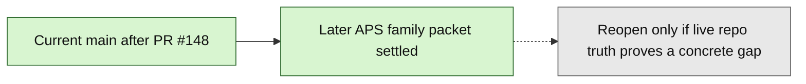

# Layer3 Progress Board

## Purpose

This file is the human-facing companion to `next_milestone_plans/layer3_progress_manifest.json`.
It tracks the bounded Layer3 Phase1A through APS validate-only runtime/report-ref chain already landed on current `main`, plus the landed `23_GATED_APS_PROMOTION_FREEZE.md` continuation freeze from PR `#145`, the workbench/package/handoff/export chain through PR `#289`, docs `70`/`71` plus PR `#316` for current-method registry implementation, the descriptive-summary governance/implementation chain through PR `#417`, docs `77`/`78`/`79` for associated-cohort service-materialize governance, PR `#424` as the bounded service-only associated-cohort `descriptive_summary` implementation, PR `#425` as exact `requested_method_name` gate hardening, docs `80`/`81` as selected-pass cohort execution governance, PR `#432` as the bounded selected-pass associated-cohort execution-start/result-status implementation, docs `82`/`83` as planning/control selected-pass associated-cohort result-review governance, PR `#438` as the bounded backend/API implementation of that result-review tranche, PR `#441` as planning-only associated-cohort result-review UI governance, PR `#443` as the bounded rendered `/review/layer3` implementation of that exact UI tranche, and docs `86`/`87` as planning-only associated-cohort package-review preview/readiness governance.

Current `main` additionally includes docs `72`/`73` from PR `#402` as descriptive-summary governance, PR `#411` as the bounded lower-level analysis API implementation, docs `75`/`76` as the single-item Gate C admission governance, PR `#417` as the bounded single-item Gate C admission implementation, docs `78`/`79` as service-only associated-cohort governance, PR `#424` as bounded service-only associated-cohort materialization, PR `#425` as exact metadata gate hardening, docs `80`/`81` as selected-pass cohort execution governance, PR `#432` as bounded selected-pass associated-cohort execution-start/result/status implementation, PR `#433` as post-PR432 proof-state docs/control sync only, PR `#434` as docs `82`/`83` planning/control selected-pass associated-cohort result-review governance, PR `#435` as post-PR434 count metadata correction only, PR `#436` as post-PR435 lineage metadata sync only, PR `#438` as bounded selected-pass associated-cohort result-review backend/API implementation, PR `#441` as planning-only associated-cohort result-review UI governance, PR `#443` as bounded rendered associated-cohort result-review UI implementation, and docs `86`/`87` as planning-only associated-cohort package-review preview/readiness governance. `descriptive_summary` is now live through `run_analysis(...)`, the existing single-item Gate C wrapped quantitative path, the explicit service-owned associated-cohort `materialize_pass_entry(...)` path, exact selected-pass associated-cohort execution-start/result/status over existing backend/API surfaces, exact selected-pass associated-cohort result review through the existing backend/API result-review endpoint, exact rendered `/review/layer3` associated-cohort result-review presentation/control over that authority, and planning-only associated-cohort package-review preview/readiness governance through docs `86`/`87`. Schema/runtime/source widening, live package preview, package construction, package-review submit, handoff, export, connector dispatch, qualitative/hybrid/RAG/vector, retry/recovery, pass-entry changes, broader UI behavior, and full mockup behavior remain out.

This active progress packet also includes `74_L3_DEFERRED_IMPLEMENTATION_PLAYBOOK.md` from PR `#407` as operational guidance for activating and implementing remaining deferred items. PR `#411` used it for the lower-level `descriptive_summary` analysis-service tranche, PR `#417` used docs `75`/`76` for the single-item Gate C admission tranche, PR `#424`/`#425` used docs `78`/`79` for the service-only associated-cohort tranche, PR `#432` used docs `80`/`81` for the selected-pass associated-cohort execution-start/result-status tranche, PR `#438` used docs `82`/`83` for the exact selected-pass associated-cohort result-review backend/API tranche, PR `#443` used docs `84`/`85` for the exact rendered associated-cohort result-review UI tranche, and docs `86`/`87` now freeze only the next read-only associated-cohort package-review preview/readiness governance boundary; it still does not alter the settled later-APS decision or make schema/runtime/source/package construction/package-review submit/handoff/export deferred behavior live.

Current `main` now includes docs `75`/`76` plus PR `#417` as the bounded single-item `descriptive_summary` Gate C admission tranche. It also includes `77_COHORT_REQS.md`, docs `78`/`79`, PR `#424`, and PR `#425` as the bounded service-materialize associated-cohort tranche: explicit `formation_basis_json["requested_method_name"] == "descriptive_summary"` selects `descriptive_summary`, while absent, malformed, trimmable, or non-descriptive metadata preserves the default `cross_correlation` cohort path. Docs `80`/`81` plus PR `#432` now admit only selected-pass associated-cohort `descriptive_summary` execution-start/result-status over existing backend/API surfaces; docs `82`/`83` plus PR `#438` now admit only exact selected-pass associated-cohort result review over that PR `#432` authority; docs `84`/`85` from PR `#441` plus PR `#443` now admit only exact rendered `/review/layer3` result-review presentation/control over that backend/API authority; docs `86`/`87` now freeze only future read-only associated-cohort package-review preview/readiness governance. Schema/runtime/source widening, live package preview, package construction, package-review submit, handoff/export, connector dispatch, qualitative/hybrid/RAG/vector behavior, retry/recovery, pass-entry changes, broader UI behavior, and full mockup activation remain blocked.

It is intentionally scoped to:
- the landed milestone chain from Phase 1A feeder-ledger foundation through the bounded dedicated validate-only runtime/report-ref implementation lane
- the landed promotion continuation freeze from PR `#145`, its docs/progress sync from PR `#146`, the later APS family settlement closeout from PR `#147`, and the post-PR147 progress-packet closeout from PR `#148`
- the now-settled later APS family packet immediately beyond the landed dedicated validate-only boundary
- the merged planning-only deferred-prep docs from PR `#165`, the post-PR165 docs/progress/front-door sync from PR `#166`, the merged broader-workbench implementation-entry prep packet from PR `#168`, the post-PR168 current-main closeout from PR `#169`, the post-PR169 duplicate-default cleanup from PR `#170`, the merged qualitative single-item input packet from PR `#172`, the post-PR172 deferred-prep front-door tightening from PR `#174`, the merged planning-only first-slice setup target in `28_L3_WB_FIRST_SLICE_FREEZE.md` from PR `#178`, the merged planning-only endpoint/state companion in `29_L3_WB_FIRST_SLICE_API_AND_STATE_CONTRACT.md` from PR `#182`, the bounded first-slice workbench implementation from PR `#184`, the post-PR184 closeout/correction passes through PR `#190`, the merged planning-only second-slice plan-preview freeze packet from PR `#191`, the post-PR191 progress/tracked-metadata syncs from PRs `#192` and `#193`, the bounded read-only plan-preview implementation from PR `#194`, the post-PR194 proof/board-metadata closeouts from PRs `#195` and `#196`, the PR `#198` plan-approval freeze packet, the merged PR `#199` bounded plan-approval implementation, the PR `#203`/`#204` plan-revision freeze/count-correction pair, the merged PR `#205` bounded plan-revision control implementation, the PR `#206` docs/control sync, the merged PR `#207` plan-revision submission-hardening follow-up, the PRs `#208`/`#209`/`#210`/`#211` docs/progress cohesion syncs, the PR `#212` execution-readiness proof packet, the PR `#213` read-only readiness proof implementation, the PR `#215` execution-selection freeze packet, the PR `#216` bounded execution-selection shell implementation, and the PR `#217` analysis-execution-start freeze packet, all without reopening the settled packet or expanding live scope beyond separately admitted workbench slices
- the merged PR `#218` bounded analysis-execution-start implementation, which executes one existing selected/not-started single-item wrapped quantitative `L3PassRun` shell and still keeps result/package/handoff/source/schema/UI/full mockup scope out unless/until separately admitted
- the PR `#221` planning-only result/status freeze packet in `42_L3_WB_RESULT_STATUS_FREEZE.md` and `43_L3_WB_RESULT_STATUS_API_AND_STATE_CONTRACT.md`, plus the merged PR `#222` bounded result/status implementation, which adds read-only selected-pass execution-proof/status inspection without making result review, package review, handoff, rerun/recovery, UI changes, source/schema/runtime widening, or qualitative/hybrid/RAG/vector/full mockup behavior live
- the planning-only `44_L3_WB_RESULT_REVIEW_FREEZE.md` and `45_L3_WB_RESULT_REVIEW_API_AND_STATE_CONTRACT.md` result-review packet, which freezes only the boundary for one bounded selected-pass operator review decision after PR `#222` result/status authority and does not make result review, package review, handoff/export, rerun/recovery, source/schema/runtime widening, UI changes by itself, local upload/directory ingestion, qualitative/hybrid/RAG/vector execution, or full mockup behavior live
- the current-main PR `#227` bounded result-review implementation, which adds only `POST /api/v1/layer3/execution/result/review` for one terminal selected pass after result/status authority and must not be rendered as package review, handoff/export, rerun/recovery, source/schema/runtime widening, UI change, local upload/directory ingestion, qualitative/hybrid/RAG/vector execution, or full mockup activation
- the planning-only `46_L3_WB_RESULT_REVIEW_UI_FREEZE.md` and `47_L3_WB_RESULT_REVIEW_UI_STATE_CONTRACT.md` result-review UI packet from PR `#230`, plus the merged PR `#232` bounded UI implementation, which makes only `/review/layer3` session refresh, result/status inspection, and one selected-pass result-review submission control live while still excluding execution selection/start UI, package review, handoff/export, rerun/recovery, new backend endpoints by default, source/schema/runtime widening, local upload/directory ingestion, qualitative/hybrid/RAG/vector execution, and full mockup activation
- the merged planning-only PR `#234` `48_L3_WB_PACKAGE_REVIEW_FREEZE.md` and `49_L3_WB_PACKAGE_REVIEW_API_AND_STATE_CONTRACT.md` package-review preview packet, which freezes only read-only package-review readiness/preview governance after an approved selected-pass result review and does not make package review, package construction, package rows, `materialize_package_entry(...)`, handoff/export, rerun/recovery, source/schema/runtime widening, local upload/directory ingestion, qualitative/hybrid/RAG/vector execution, or full mockup activation live
- the merged PR `#235` bounded read-only package-review preview implementation, which adds a read-only `/api/v1/layer3/package/review/preview` endpoint plus `/review/layer3` inspection panel after approved selected-pass result review, and still does not create package/reconciliation/artifact/handoff/runtime/source-ingestion rows or payload files, call `materialize_package_entry(...)`, enable package-review submit/commit, handoff/export, rerun/recovery, schema/runtime widening, local upload/directory ingestion, qualitative/hybrid/RAG/vector execution, execution selection/start UI, or full mockup activation
- the merged planning-only `50_L3_WB_PACKAGE_CONSTRUCTION_FREEZE.md` and `51_L3_WB_PACKAGE_CONSTRUCTION_API_AND_STATE_CONTRACT.md` package-construction packet from PR `#237`, plus PR `#238` bounded package-construction implementation, which admits only `POST /api/v1/layer3/package/review/commit` creating exactly one `L3ReconciliationRecord`, three `L3OutputPackage` rows, and three package payload files after approved selected-pass result-review authority and matching package-preview hash, while handoff/export, source/schema/runtime widening, qualitative/hybrid/RAG/vector execution, and full mockup activation remain deferred; PR `#243` separately implements backend package-review submit and PR `#245` separately renders bounded package-review controls
- the merged PR `#241` planning-only `52_L3_WB_PACKAGE_REVIEW_SUBMIT_FREEZE.md` and `53_L3_WB_PACKAGE_REVIEW_SUBMIT_API_AND_STATE_CONTRACT.md` package-review submit/decision packet, which freezes only one future operator decision over an already constructed package set and does not make package-review submit live by itself, trigger handoff/export, mutate package payloads, create additional package/reconciliation/artifact rows, rebuild packages, widen source/schema/runtime scope, or activate qualitative/hybrid/RAG/vector/full mockup behavior
- the merged PR `#243` bounded backend package-review submit implementation for docs `52`/`53`: it adds `POST /api/v1/layer3/package/review/submit`, records one operator decision in existing JSON-bearing state after server-verifying the constructed package ids and payload hashes, does not mutate package rows or package payload refs/hashes, and by itself still does not enable handoff/export, package reconstruction, schema/runtime/source widening, rendered UI behavior, or qualitative/hybrid/RAG/vector/full mockup activation; PR `#245` separately renders the bounded controls
- the merged PR `#245` bounded rendered package-review UI implementation, which uses the already-live package-preview, package-construction commit, and package-review submit endpoints from `/review/layer3` without making handoff/export, package payload mutation, package reconstruction, source/schema/runtime widening, execution selection/start UI expansion, or full mockup activation live
- the merged PR `#247` post-review fallback hardening for that same PR `#245` rendered UI boundary: after package construction commit, package-review submit readiness may use fresh in-memory package-construction state if the post-commit session-summary refresh fails; it does not add a new endpoint, durable row family, package payload mutation, handoff/export, source/schema/runtime widening, or full mockup activation
- PR `#250` docs `54`/`55` as planning-only governance by themselves after package-review approval, plus PR `#251` bounded backend/API prepare-only implementation and PR `#252` blocker/session-summary hardening; this makes only an internal reference-envelope preparation endpoint live and still does not dispatch to APS or an external exporter, create physical export artifacts, create `AnalysisArtifact` rows, mutate package payloads, rebuild packages, or widen source/schema/runtime/full mockup scope
- PR `#255` docs `56`/`57` as planning-only rendered handoff/export preparation UI governance over the already-live backend prepare endpoint, plus PR `#256` as the bounded rendered prepare-only UI implementation; together they still do not admit APS handoff, external export/download, downstream dispatch, destination selection, physical artifacts, `AnalysisArtifact`, package mutation/reconstruction, source/schema/runtime widening, execution selection/start UI expansion, qualitative/hybrid/RAG/vector execution, or full mockup activation
- PR `#258` docs `58`/`59` as APS handoff dispatch governance after `handoff_export_prepared`, PR `#260` as the bounded backend/API implementation into the existing `aps_evidence_bundle_handoff` owner-service family, PR `#261` as fail-closed authority hardening, PR `#263` as APS package-row allowlist hardening, docs `60`/`61` as planning-only rendered APS dispatch UI governance, and PR `#266` as the bounded rendered APS dispatch UI implementation. Docs `60`/`61` still do not make UI behavior live by themselves, and connector dispatch, destination selection, package mutation/reconstruction, schema/runtime/source widening, and full mockup activation remain out
- docs `62`/`63` as planning-only external export/download readiness governance after `aps_handoff_dispatched`, plus PR `#269` as the bounded backend/API implementation of that readiness descriptor over the existing APS evidence-bundle handoff artifact; neither admits rendered browser download controls, public/signed URLs, connector dispatch, destination selection, generic downstream dispatch, package mutation/reconstruction, additional reconciliation/package/artifact rows, `AnalysisArtifact`, source/schema/runtime widening, rendered UI activation, execution expansion beyond already admitted work, qualitative/hybrid/RAG/vector execution, or full mockup activation
- docs `64`/`65` as planning-only rendered `/review/layer3` external export/download readiness UI governance over the already-live PR `#269` backend/API readiness endpoint, plus PR `#275` as the bounded rendered UI implementation. It admits only server-authoritative readiness rendering, read-only recorded descriptors, and one server-gated `prepare_external_export_download` UI action; it still does not admit rendered browser download controls, public/signed URLs, file streaming, connector dispatch, destination selection, generic downstream dispatch, package mutation/reconstruction, additional reconciliation/package/artifact rows, `AnalysisArtifact`, source/schema/runtime widening, qualitative/hybrid/RAG/vector execution, or full mockup activation
- docs `66`/`67` as planning-only external export/download delivery governance after `external_export_download_prepared`, plus PR `#278` as the bounded backend/API same-origin delivery implementation. Docs `66`/`67` do not make behavior live by themselves; PR `#278` streams only the existing validated APS evidence-bundle artifact after server-side authority proof and still does not render a download control, generate public/signed URLs, dispatch connectors or generic downstream targets, select destinations, mutate packages, create extra rows, widen schema/runtime/source scope, or activate the full mockup
- docs `68`/`69` as planning-only rendered `/review/layer3` download-control governance over the PR `#278` endpoint, plus PR `#282` as the bounded rendered UI implementation and PR `#285`/`#286` as review hardening inside that same UI/API boundary. Docs `68`/`69` do not implement UI behavior by themselves; PR `#282` renders only the server-gated same-origin delivery control, while PR `#285`/`#286` keep delivery browser-managed and fail-closed; PR `#289` separately hardens the backend/API delivery path so artifact validation/read/hash/stat happens after read-only transaction/row-lock release. They do not admit public/signed URLs, connector dispatch, destination selection, generic downstream dispatch, package mutation/reconstruction, additional rows, schema/runtime/source widening, or full mockup activation

If a future checkout carries additional qualitative single-item companion prep beyond current `main`, preserve that future prep as branch-local rather than merged-main history. The current `main` version of `27_L3_QUAL1_INPUTS.md` is already merged planning-only prep rather than an open review state.

It is not a general whole-repo roadmap.
It does not replace GitHub PR state.

## Authority Order

Use this order when refreshing this board:
1. GitHub PR state for merged vs open
2. current `project6-origin/main` repo truth
3. active planning docs and freeze docs

Hard rule:
- do not mark a step as landed on `main` from planning-doc wording alone

## Current Snapshot

As of `2026-05-02`:
- seed local checkout used to prepare this result-review planning refresh: `C:\Users\benny\OneDrive\Desktop\project6_REPO_MCP_FOLDER\worktrees\l3-desc-cohort-audit-p33`
- valid local authority rule: use a clean checkout whose contents match the artifact state being refreshed; prefer current `main` for merged repo truth and the active branch checkout only when an open or branch-only milestone is explicitly declared
- authoritative remote branch: `project6-origin/main`
- snapshot base for this selected-pass associated-cohort result-review UI implementation state: current `project6-origin/main` at `0ad0da0f` after PR `#443` merged the bounded rendered associated-cohort result-review UI implementation; PR `#443` does not admit backend/API changes, schema/runtime/source widening, package/handoff/export, connector dispatch, qualitative/hybrid/RAG/vector, retry/recovery, pass-entry changes, broader UI behavior, or full mockup behavior
- current `main` includes the bounded APS multisource implementation slice from PR `#101`
- current `main` also includes the docs-only multisource closeout from PR `#102`
- current `main` also includes the landed export-package first shared-consumer freeze from PR `#106` and its docs-only closeout from PR `#107`
- current `main` also includes the bounded export-package handoff implementation slice from PR `#109`, its docs-only closeout from PR `#110`, and the exact-run export/export-package gate-hardening follow-up from PR `#111` and `#112`
- current `main` now includes the landed package-derived-context freeze from PR `#113`, the bounded package-derived context handoff implementation slice from PR `#115`, the earlier hardening pass from PR `#116`, the post-PR116 docs/progress sync from PR `#117`, and the malformed-scoped candidate-discovery closeout from PR `#119`
- current `main` now includes the landed context-dossier freeze from PR `#118`, the post-PR118 docs/progress sync from PR `#120`, and the bounded `aps_context_dossier_handoff` implementation slice from PR `#121` plus its docs/progress closeout from PR `#122`
- current `main` now includes the post-PR122 artifact-state fix from PR `#123`
- current `main` now includes the landed deterministic-insight continuation freeze from PR `#124`, the bounded deterministic insight handoff implementation slice from PR `#126`, and the post-PR126 docs/progress sync from PR `#127`
- current `main` now includes the landed deterministic-challenge continuation freeze from PR `#128`, the post-PR128 docs/progress sync from PR `#129`, the bounded deterministic challenge handoff implementation slice from PR `#130`, and the post-PR130 docs/progress sync from PR `#131`
- current `main` now includes the landed deterministic challenge review-packet continuation freeze from PR `#132`, the post-PR132 docs/progress sync from PR `#133`, the bounded deterministic challenge review-packet handoff slice from PR `#134`, and the post-PR134 docs/progress sync from PR `#135`
- current `main` now includes the landed validate-only-gates continuation freeze from PR `#136`, the post-PR136 docs/progress sync from PR `#137`, the bounded validate-only gate-report refresh lane from PR `#138`, and the post-PR138 docs/progress sync from PR `#139`
- current `main` now includes the landed dedicated validate-only runtime/report-ref continuation freeze from PR `#140`, the post-PR140 docs/progress sync from PR `#141`, the post-PR141 docs/progress sync from PR `#142`, the bounded dedicated validate-only runtime/report-ref implementation lane from PR `#143`, and the post-PR143 docs/progress sync from PR `#144`
- current `main` now also includes the landed read-only `23_GATED_APS_PROMOTION_FREEZE.md` freeze from PR `#145`, the post-PR145 docs/progress sync from PR `#146`, the later APS family settlement closeout from PR `#147`, and the post-PR147 progress-packet closeout from PR `#148`
- current `main` now also includes the merged planning-only `24_L3_WB_FREEZE.md` and `25_L3_QUAL1_FREEZE.md` docs from PR `#165`; they remain deferred-scope preparation artifacts and do not reopen the settled packet or change the merged milestone count
- current `main` now also includes the post-PR165 docs/progress/front-door sync from PR `#166`, which aligns the progress artifact, pack front door, and canonical status/index surfaces with the merged planning-only deferred-prep docs without changing the settled packet state
- current `main` now also includes the merged broader-workbench implementation-entry prep packet from PR `#168`, the post-PR168 current-main closeout from PR `#169`, and the post-PR169 duplicate-default cleanup from PR `#170`; together they land and finalize `26_L3_WB_INPUTS.md` plus companion updates to `24_L3_WB_FREEZE.md`, `25_L3_QUAL1_FREEZE.md`, `README_LAYER3_PHASE1A_PACK.md`, and the progress/control packet without changing the settled packet state or merged milestone count
- current `main` now also includes the merged qualitative single-item input packet from PR `#172`; together `27_L3_QUAL1_INPUTS.md` plus companion updates to `25_L3_QUAL1_FREEZE.md`, `README_LAYER3_PHASE1A_PACK.md`, and the progress/control packet remain planning-only deferred-scope prep and do not change the settled packet state or merged milestone count
- current `main` now also includes the post-PR172 deferred-prep front-door tightening from PR `#174`, which carries the merged workbench and qualitative companion prep into the remaining current-main status/front-door surfaces without changing the settled packet state or merged milestone count
- current `main` now also includes the merged planning-only `28_L3_WB_FIRST_SLICE_FREEZE.md` first-slice setup target from PR `#178`; it narrowed the later `/review/layer3` plus `/api/v1/layer3/...` target before implementation and remains the governing first-slice scope/no-go contract
- current `main` now also includes the merged planning-only `next_milestone_plans/Layer3_planning_docs/29_L3_WB_FIRST_SLICE_API_AND_STATE_CONTRACT.md` endpoint/state companion from PR `#182`; it remains the governing endpoint, DTO, persistence, authority-rail, browser-state, and proof contract
- current `main` now also includes the bounded first-slice workbench implementation from PR `#184`; `/review/layer3` and `/api/v1/layer3/...` are live for intent/preflight, deterministic source preview, material preview, Gate B decision recording, Gate C UI non-authoritative typing preview, explicit API owner-service typing materialization when `commit_typing` is true, explicit Gate C override unavailability, and session summary only
- current `main` now also includes the post-PR184 status/cohesion/explicit-Gate-C-typing and merged-review-feedback closeouts from PRs `#185` through `#190`; these preserve response envelopes, blocked Gate B error semantics, Gate C authority-rail counts/source context, and tracked-PR metadata without changing the 29 merged milestone count, settled packet state, or downstream no-go list
- current `main` now also includes the merged planning-only `30_L3_WB_PLAN_PREVIEW_FREEZE.md` and `31_L3_WB_PLAN_PREVIEW_API_AND_STATE_CONTRACT.md` second-slice packet from PR `#191`; it freezes read-only plan preview after explicit Gate C typing commit and still excludes execution, results, package review, handoff, qualitative/hybrid/RAG/vector execution, runtime snapshot DB writes, schema widening, and hidden LLM planning
- current `main` also includes the post-PR191 progress/tracked-metadata syncs from PRs `#192` and `#193`; they record the merged plan-preview packet and tracked-PR state in progress/control surfaces without expanding live route/API scope or downstream no-go boundaries
- current `main` now also includes the bounded read-only plan-preview implementation from PR `#194`; it activates `/api/v1/layer3/plan/preview` and the gated UI plan panel only after explicit Gate C typing commit, uses the owner-service preview path without materializing plan/pass rows, and still excludes execution, results, package review, handoff, runtime snapshot DB writes, schema widening, qualitative/hybrid/RAG/vector execution, and hidden LLM planning
- current `main` now also includes the post-PR194 proof/board-metadata closeouts from PRs `#195` and `#196`; they record post-merge proof and align manifest/board snapshot metadata without changing implementation scope, milestone counts, or downstream no-go boundaries
- PR `#199` is the bounded implementation lane for `32_L3_WB_PLAN_APPROVAL_FREEZE.md` and `33_L3_WB_PLAN_APPROVAL_API_AND_STATE_CONTRACT.md`; it makes only approval-only `L3AnalysisPlan` persistence live after server-backed plan preview and still does not admit `L3PassRun` creation, analysis execution, execution/results/package/handoff activation, runtime snapshot DB writes, schema widening, qualitative/hybrid/RAG/vector execution, or hidden LLM planning
- PR `#205` is the bounded implementation lane for `34_L3_WB_PLAN_REVISION_FREEZE.md` and `35_L3_WB_PLAN_REVISION_API_AND_STATE_CONTRACT.md`; it makes only pre-approval revision-control state live through `/api/v1/layer3/plan/revise` and the existing plan panel, and still does not reopen approved plans, create `L3AnalysisPlan` in the revision path, create `L3PassRun`, run analysis, write manifests, enable execution/results/package/handoff, widen runtime DB/schema behavior, or admit qualitative/hybrid/RAG/vector/LLM planning
- PR `#207` is the narrow hardening follow-up for the PR `#205` revision-control path; it serializes backend revision decisions with row locking and disables both revision controls behind a shared UI in-flight lock, without adding a new functional slice or changing the revision-control-only no-go list
- the artifact also tracks `next_milestone_plans/layer3-mockups/mockup-spec.txt` and `next_milestone_plans/layer3-mockups/assets.md` as mockup source context only; they do not change the settled packet state, merged milestone count, no-go boundaries, or binary asset dependency posture

## Program State Summary

- Done now on `main`: 29 merged milestones from Phase 1A feeder-ledger foundation through the landed APS promotion continuation freeze from PR `#145`, with its later docs/progress, settlement, and progress-packet closeouts from PR `#146`, `#147`, and `#148`
- Current focus: the bounded later APS family packet beyond the landed dedicated validate-only runtime/report-ref boundary is now settled on current `main` and tracked through the post-PR147 progress-packet closeout from PR `#148`; no further later APS family decision or implementation lane is currently justified by default
- Candidate next consumers: none active in this bounded packet; promotion governance is already sufficient on current `main`, and retrieval cutover already exists there as a separate validate-only parity-proof family
- Deferred but not active: 8 explicitly deferred scope items remain out until later freezes admit them; see the activation-criteria section below for the exact candidate-next and current-focus gates
- Current `main` also includes the merged planning-only `24_L3_WB_FREEZE.md` and `25_L3_QUAL1_FREEZE.md` docs from PR `#165`, plus the post-PR165 docs/progress/front-door sync from PR `#166`; those landed docs prepare deferred-scope work and align artifact/front-door surfaces only, without changing the 29 merged milestone count or reopening the settled packet
- Current `main` also includes the merged broader-workbench implementation-entry prep packet from PR `#168`, the post-PR168 current-main closeout from PR `#169`, and the post-PR169 duplicate-default cleanup from PR `#170`; together they land and finalize `26_L3_WB_INPUTS.md` plus companion updates to `24_L3_WB_FREEZE.md`, `25_L3_QUAL1_FREEZE.md`, `README_LAYER3_PHASE1A_PACK.md`, and the progress/control packet, and they still remain planning-only deferred-scope prep rather than an active lane
- Current `main` also includes the merged qualitative single-item input packet from PR `#172`; together `27_L3_QUAL1_INPUTS.md` plus companion updates to `25_L3_QUAL1_FREEZE.md`, `README_LAYER3_PHASE1A_PACK.md`, and the progress/control packet remain planning-only deferred-scope prep rather than an active lane
- Current `main` also includes the post-PR172 deferred-prep front-door tightening from PR `#174`, which keeps the merged deferred-prep packet phrased consistently across the remaining current-main front-door/status surfaces without changing the settled packet state or merged milestone count
- Current `main` now also includes the merged planning-only `28_L3_WB_FIRST_SLICE_FREEZE.md` first-slice setup target from PR `#178`; it did not change the 29 merged milestone count or make `/review/layer3` or `/api/v1/layer3/...` live by itself, but it remains the governing scope/no-go contract for the later PR `#184` implementation
- Current `main` now also includes the merged planning-only first-slice API/state contract companion from PR `#182`; it froze implementation-entry endpoint and state details without activating the route/API by itself, but it remains the governing API/state contract for the later PR `#184` implementation
- Current `main` now also includes the landed bounded first-slice workbench implementation from PR `#184`; this makes `/review/layer3` and `/api/v1/layer3/...` live only for the first-slice shell/API and does not activate downstream plan, execution, results, package review, qualitative/hybrid/RAG/vector execution, runtime snapshot DB writes, schema widening, or handoff scope
- Current `main` now also includes the post-PR184 closeout/correction passes from PRs `#185` through `#190`; those passes tighten docs/status, explicit Gate C typing proof, Gate B blocked/error wording, Gate C authority-rail preservation, and PR-tracking metadata without expanding the first-slice shell/API or changing milestone counts
- Current `main` now also includes the merged second-slice plan-preview packet from PR `#191`, the PR `#194` bounded implementation, and the PRs `#195`/`#196` proof/board-metadata closeouts; read-only plan preview is live after explicit Gate C typing commit, while execution, results, package review, handoff, runtime snapshot DB writes, schema widening, qualitative/hybrid/RAG/vector execution, and hidden LLM planning remain out
- PR `#199` implements the third-slice plan-approval boundary with a new narrow owner-service helper; it keeps current `materialize_pass_entry(...)` execution-bearing and outside the workbench approval path
- Current `main` also includes PR `#200` plan-approval post-merge sync, PR `#201` mockup-spec approval-state sync, and PR `#202` workbench progress-control hardening; these are docs/control updates and do not make execution, results/package/handoff, runtime DB/schema widening, or qualitative/hybrid/RAG/vector/LLM planning live
- The repo-tracked mockup source mirror and visual-asset inventory are source context only; they preserve the planning input behind the first-slice setup without activating implementation scope or importing the binary/SVG mockup files as runtime dependencies
- Current `main` now includes PR `#212`, which landed `36_L3_WB_EXECUTION_READINESS_FREEZE.md`, `37_L3_WB_STATE_HASH_IDEMPOTENCY_CONTRACT.md`, and `layer3_workbench_proof_manifest.json` as planning-only execution-readiness proof/state gates before any later execution branch; they do not make execution or any downstream behavior live.
- Current `main` now also includes PR `#213`, which adds a bounded read-only implementation-readiness proof surface around that packet: `/api/v1/layer3/readiness`, explicit plan-preview identity/hash metadata, and approval/revision serialization checks. It still does not create pass runs, run analysis, write result/package/handoff artifacts, widen schema/runtime DB behavior, or admit qualitative/hybrid/RAG/vector execution.
- PR `#215` adds the execution-selection freeze packet, `38_L3_WB_EXECUTION_SELECTION_FREEZE.md` and `39_L3_WB_EXECUTION_SELECTION_API_AND_STATE_CONTRACT.md`, as planning-only governance for the then-future execution-selection/pass-run shell tranche. It narrows the next eligible implementation to selected/not-started `L3PassRun` shell creation from an approved, hash-matched plan and still does not admit `AnalysisRun`, analysis execution, results/package/handoff, approved-plan supersession, runtime DB/schema widening, source-breadth expansion, or full mockup activation.
- PR `#216` implements only the bounded execution-selection/pass-run shell tranche governed by PR `#215`: `POST /api/v1/layer3/execution/select` validates exactly one current approved plan, matches the approved preview id/hash, requires `client_request_id`, serializes through session/plan row locks, and creates selected/not-started `L3PassRun` shell rows only. It still does not call `materialize_pass_entry(...)`, create `AnalysisRun`, run analysis, write artifact manifests or result/package/handoff artifacts, reopen or supersede approved plans, widen runtime DB/schema behavior, expand source breadth, change UI, or activate the full mockup target state.
- PR `#217` adds `40_L3_WB_ANALYSIS_EXECUTION_START_FREEZE.md` and `41_L3_WB_ANALYSIS_EXECUTION_START_API_AND_STATE_CONTRACT.md` as planning-only governance for the next eligible selected-pass-run execution-start boundary. It selects only a future one-pass wrapped quantitative execution-start tranche from PR `#216` selected/not-started shells; it does not make analysis execution, result review, package review, handoff, source expansion, approved-plan supersession, runtime DB/schema widening, UI changes, qualitative/hybrid/RAG/vector execution, or full mockup activation live.
- PR `#218` is the merged bounded analysis-execution-start implementation on current `main`. It adds `POST /api/v1/layer3/execution/start` for one existing selected/not-started single-item wrapped quantitative `L3PassRun` shell, creates exactly one wrapped quantitative `AnalysisRun` plus selected-pass output metadata, preserves `client_request_id` idempotency, and still does not call `materialize_pass_entry(...)` as-is, create new `L3AnalysisPlan` or `L3PassRun` rows, run batch execution, enable result/package/handoff state, reopen or supersede approved plans, widen runtime DB/schema behavior, expand source breadth, change UI, or activate qualitative/hybrid/RAG/vector/full mockup scope.
- PR `#218` merged-main proof: `python -m pytest .\backend\tests\test_layer3_api.py -q` -> `17 passed, 3 warnings`; `python -m pytest .\backend\tests\test_layer3_pass_entry.py -q` -> `12 passed`; explicit PowerShell-expanded `test_layer3_*.py` backend family -> `123 passed, 3 warnings`; compileall and JSON syntax checks passed; `git diff --check` passed with line-ending warnings only.
- PR `#221` adds docs `42`/`43` as a planning-only result/status freeze packet after PR `#218`; it selects read-only selected-pass status and execution-proof inspection only, and it does not make `/api/v1/layer3/execution/result/status`, result review, package review, handoff, rerun/recovery, UI changes, source expansion, runtime DB/schema widening, qualitative/hybrid/RAG/vector execution, or full mockup behavior live by itself.
- PR `#222` implements the docs `42`/`43` boundary on current `main`: `POST /api/v1/layer3/execution/result/status` reads one terminal selected pass, validates session/approved-plan/preview/selection/execution-start/pass authority, reports available/missing-output/failed status, summarizes existing output metadata when readable, and writes no durable state.
- PR `#225` syncs the progress state vocabulary/render coverage and does not change live Layer 3 behavior.
- PR `#226` merged docs `44`/`45` as the planning-only result-review boundary after PR `#222`: one bounded operator review decision for one terminal selected pass that already satisfies result/status authority. PR `#227` now implements that boundary on current `main` as `POST /api/v1/layer3/execution/result/review` while still excluding package review, handoff/export, rerun/recovery, source/schema/runtime widening, UI changes, local upload/directory ingestion, qualitative/hybrid/RAG/vector execution, and full mockup activation.
- PR `#230` adds docs `46`/`47` to freeze the planning-only UI boundary after PR `#227`: a `/review/layer3` result-review presentation/control surface for existing backend result-review state. PR `#232` now implements only that bounded UI surface on current `main`.
- PR `#234` adds docs `48`/`49` as planning-only governance after PR `#232`: read-only package-review readiness/preview may be planned next only after an approved selected-pass result review, and the packet does not make package review, package construction, package rows, `materialize_package_entry(...)`, handoff/export, rerun/recovery, source/schema/runtime widening, local upload/directory ingestion, qualitative/hybrid/RAG/vector execution, or full mockup behavior live.
- PR `#235` carries the bounded read-only implementation for that governance boundary on current `main`. It adds a read-only `POST /api/v1/layer3/package/review/preview` endpoint and a `/review/layer3` package-preview inspection panel after approved selected-pass result review, and it keeps package construction, package/reconciliation rows, package payload files, handoff/export, `materialize_package_entry(...)`, rerun/recovery, source/schema/runtime widening, local upload/directory ingestion, qualitative/hybrid/RAG/vector execution, execution selection/start UI, and full mockup activation out.
- PR `#236` syncs package-preview postmerge docs/status state and does not change live Layer 3 behavior.
- PR `#237` adds docs `50`/`51` as planning-only package-construction governance after PR `#235`: the bounded commit step may create exactly one reconciliation row, three output-package rows, and three payload files only after server-validated package-preview and approved selected-pass result-review authority. PR `#238` implements that exact bounded package-construction commit as `POST /api/v1/layer3/package/review/commit`; it does not admit package-review submit/decision state, handoff/export, `materialize_package_entry(...)` as-is from `/review/layer3`, source/schema/runtime widening, local upload/directory ingestion, qualitative/hybrid/RAG/vector execution, or full mockup activation.
- PR `#241` adds docs `52`/`53` as planning-only package-review submit/decision governance after PR `#238`: the bounded future submit step may record exactly one operator decision over an already constructed package set, preferably in existing JSON-bearing state if no schema widening is required. They do not make `/api/v1/layer3/package/review/submit` live by themselves and do not admit handoff/export, package reconstruction, package payload mutation, additional package/reconciliation/artifact rows, source/schema/runtime widening, local upload/directory ingestion, qualitative/hybrid/RAG/vector execution, or full mockup activation.
- PR `#243` implements the bounded package-review submit backend governed by docs `52`/`53`: it adds backend-only `POST /api/v1/layer3/package/review/submit`, verifies the constructed package ids/hashes, records one decision object in existing reconciliation/session JSON, and keeps package rows/payloads plus handoff/export unchanged. It is current-main live as backend API/state only.
- PR `#250` adds docs `54`/`55` as planning-only governance by themselves for handoff/export preparation after package-review approval. PR `#251` separately implements the bounded backend/API `prepare_only` internal export-envelope endpoint over already-approved package-review state, and PR `#252` hardens blocker vocabulary plus active package-substate summary priority without making APS dispatch, external export, physical export artifacts, `AnalysisArtifact`, package payload mutation/reconstruction, source/schema/runtime widening, rendered handoff/export controls, or full mockup activation live.
- Docs `56`/`57` freeze the separate rendered `/review/layer3` handoff/export preparation UI boundary over that already-live backend prepare endpoint. They do not make UI controls live by themselves and do not admit APS handoff, external export/download, downstream dispatch, physical artifacts, `AnalysisArtifact`, package payload mutation/reconstruction, source/schema/runtime widening, execution selection/start UI expansion, qualitative/hybrid/RAG/vector execution, or full mockup activation. PR `#256` separately implements only bounded rendered prepare-only controls over that authority.
- Workbench slice state is tracked separately below as 50 structured records in this artifact state: 22 planning-only records, 28 current-main live bounded implementation records, 0 branch-only implementation candidate records, and 0 branch-local planning records. This keeps the settled later APS family decision from being confused with workbench readiness, and keeps PRs `#184`, `#194`, `#199`, `#205`, `#207`, `#212`, `#213`, `#215`, `#216`, `#217`, `#218`, `#221`, `#222`, `#225`, `#226`, `#227`, `#230`, `#232`, `#234`, `#235`, `#236`, `#237`, `#238`, `#241`, `#243`, `#245`, `#247`, `#250`, `#251`, `#252`, `#255`, `#256`, `#258`, `#260`, `#261`, `#263`, `#266`, `#269`, `#275`, `#278`, `#282`, `#285`, `#286`, `#289`, `#316`, `#402`, `#411`, `#417`, `#422`, `#423`, `#424`, `#425`, `#430`, `#432`, `#433`, `#434`, `#435`, `#436`, `#438`, `#441`, docs `82`/`83`, and docs `84`/`85` separated from new functional-slice counting.

## Layer 3 Workbench Current Decision

- Current workbench live state: current `main` ships the bounded first-slice shell/API from PR `#184`, read-only plan preview from PR `#194`, approval-only `L3AnalysisPlan` persistence from PR `#199`, pre-approval revision-control state from PR `#205` hardened by PR `#207`, read-only readiness proof from PR `#213`, bounded execution-selection/pass-run shell creation from PR `#216`, bounded selected-pass analysis-execution-start from PR `#218`, read-only selected-pass result/status inspection from PR `#222`, planning-only result-review governance from PR `#226`, bounded selected-pass result-review recording from PR `#227`, planning-only result-review UI governance from PR `#230`, bounded result-review UI controls from PR `#232`, planning-only package-review preview governance from PR `#234`, bounded read-only package-review preview inspection from PR `#235`, post-PR235 docs/status sync from PR `#236`, planning-only package-construction governance from PR `#237`, bounded package-construction commit from PR `#238`, planning-only package-review submit governance from PR `#241`, bounded backend package-review submit from PR `#243`, bounded rendered package-review controls from PR `#245`, post-PR245 docs/proof sync from PR `#246`, post-review submit-readiness fallback hardening from PR `#247`, and post-PR247 docs/proof/metadata syncs from PRs `#248`/`#249`. PR `#250` additionally carries planning-only handoff/export preparation governance in docs `54`/`55`; PR `#251` makes the bounded backend/API prepare-only endpoint live, PR `#252` hardens blocker vocabulary plus session-summary priority, PR `#255` docs `56`/`57` freeze the rendered handoff/export preparation UI boundary as planning-only governance by themselves, PR `#256` implements the bounded rendered prepare-only controls, PR `#257` syncs docs/progress after that UI landed, PR `#258` governs APS handoff dispatch in docs `58`/`59`, PR `#260` implements the backend/API APS dispatch endpoint, PR `#261` hardens malformed-provenance and unexpected-package-kind fail-closed handling, PR `#263` hardens APS package-row allowance to recorded dispatch state, PR `#266` renders bounded APS dispatch controls over that server authority, docs `62`/`63` govern external export/download readiness, PR `#269` implements only the bounded backend/API readiness descriptor, docs `64`/`65` govern rendered external export/download readiness UI, PR `#275` implements only that bounded rendered readiness UI, docs `66`/`67` govern delivery by themselves, PR `#278` implements only bounded backend/API same-origin delivery, docs `68`/`69` govern rendered delivery UI by themselves, PR `#282` implements only the bounded rendered delivery UI, PR `#285`/`#286` harden that same UI/API boundary without adding a new capability, and PR `#289` hardens backend/API delivery lock release inside the same endpoint boundary.
- Current decision state: APS handoff dispatch backend/API, bounded rendered APS dispatch UI, bounded backend/API external export/download readiness, bounded rendered external export/download readiness UI, bounded backend/API same-origin external export/download delivery, bounded rendered `/review/layer3` external export/download delivery UI, PR `#285`/`#286` delivery UI/API review hardening, and PR `#289` backend/API delivery lock-release hardening are live on current `main`.
- Current selected-pass associated-cohort `descriptive_summary` state: PR `#432` admits exact execution-start/result/status over existing backend/API surfaces, PR `#438` admits exact backend/API result review over that authority, and PR `#443` admits only exact rendered `/review/layer3` associated-cohort result-review presentation/control; package/handoff/export, schema/runtime/source widening, connector dispatch, retry/recovery, broader UI behavior, and full mockup activation remain deferred.
- Current selected method boundary: current `main` includes docs `72`/`73` from PR `#402` as governance for the existing `descriptive_summary` recommendation label, PR `#411` as the bounded lower-level analysis API implementation, and PR `#417` as the bounded single-item Gate C pass-entry admission. Docs `70`/`71` remain current-methods `AnalysisMethod` registry governance by themselves, PR `#316` separately implements the initial registry support guardrail, and PR `#411` adds only `descriptive_summary` registry membership plus deterministic lower-level execution. Associated-cohort Gate C pass-entry beyond the explicit service-owned and selected-pass chain, broader UI/source/runtime/schema widening, package/handoff/export, connector dispatch, qualitative/hybrid/RAG/vector expansion, and full mockup activation remain deferred. Public or signed URLs, connector dispatch, destination selection, generic downstream dispatch, package mutation/reconstruction, additional row families, schema/runtime/source widening, qualitative/hybrid/RAG/vector expansion, and full mockup activation remain deferred until separately governed and implemented.
- Current post-PR316 control sync: PR `#398` records the refresh-spec current-boundary alignment without changing runtime behavior, workbench function, method admission, schema/runtime/source scope, UI activation, or the settled next-decision posture.
- PR `#245`/`#247` proof boundary: rendered package-review controls must preserve the PR `#243` backend invariants and the PR `#238` construction invariants: one current session, one approved plan, one selected terminal pass, one approved result-review record, matching package-preview hash, one reconciliation row, three output-package rows, three stable payload hashes, and one submit decision object in existing JSON-bearing state; PR `#247` additionally proves that submit readiness remains enabled from fresh package-construction commit state even if the post-commit session-summary refresh fails. PR `#251` then adds backend/API prepare-only handoff/export state over that approved submit basis, and PR `#260`/`#266` separately admit only bounded APS dispatch backend/API plus rendered UI behavior. PR `#278`/`#282` admit only same-origin delivery of the existing validated APS evidence-bundle artifact and its rendered control; PR `#285`/`#286` harden that same delivery UI/API path, and PR `#289` releases the backend delivery transaction/row lock before artifact validation/read/hash/stat, without widening it. There is still no `AnalysisArtifact`, no additional package/reconciliation rows beyond the already-live commit and APS handoff package-row contracts, no package payload mutation, no public or signed URL, no generic downstream dispatch, no destination selection, no rerun/recovery, no source/schema/runtime widening, and no full-mockup activation.
- Implemented bounded revision-control slice: plan rejection and revision-request semantics for the current server-backed preview before approval, with PR `#207` hardening the same bounded path against concurrent backend/UI submissions. This has lower blast radius than execution because it stays within the existing plan panel and pre-execution state model, does not reopen approved plans, and avoids starting analysis, writing manifests, packaging results, widening schema/runtime DB behavior, or invoking qualitative/hybrid/RAG/vector paths.
- Hard rule: the settled APS `next_required_decision` is not a workbench execution go-ahead, and docs `54`/`55` are not handoff/export execution authority by themselves.

## Layer 3 Workbench Slice Register

| Slice | Current chain state | Governing docs | Key PRs | Exact status |
| --- | --- | --- | --- | --- |
| Workbench deferred prep | merged planning-only | `24_L3_WB_FREEZE.md`, `25_L3_QUAL1_FREEZE.md`, `26_L3_WB_INPUTS.md`, `27_L3_QUAL1_INPUTS.md` | `#165`, `#166`, `#168`, `#169`, `#170`, `#172`, `#174` | Deferred-scope prep only; no live route/API activation, no APS milestone-count change |
| First-slice contract | merged planning-only | `28_L3_WB_FIRST_SLICE_FREEZE.md`, `29_L3_WB_FIRST_SLICE_API_AND_STATE_CONTRACT.md` | `#178`, `#182` | Governs the later first-slice implementation; no live route/API activation by itself |
| First-slice implementation | merged live bounded | `28_L3_WB_FIRST_SLICE_FREEZE.md`, `29_L3_WB_FIRST_SLICE_API_AND_STATE_CONTRACT.md` | `#184` through `#190` | `/review/layer3` and `/api/v1/layer3/...` live only for intent/preflight, deterministic source/material preview, Gate B decision recording, Gate C typing preview/materialization, Gate C override unavailability, and session summary |
| Plan-preview contract | merged planning-only | `30_L3_WB_PLAN_PREVIEW_FREEZE.md`, `31_L3_WB_PLAN_PREVIEW_API_AND_STATE_CONTRACT.md` | `#191`, `#192`, `#193` | Governs read-only plan preview after explicit Gate C typing commit; no preview implementation by itself |
| Plan-preview implementation | merged live bounded | `30_L3_WB_PLAN_PREVIEW_FREEZE.md`, `31_L3_WB_PLAN_PREVIEW_API_AND_STATE_CONTRACT.md` | `#194`, `#195`, `#196` | Adds read-only `/api/v1/layer3/plan/preview` and gated UI plan panel only after explicit Gate C typing commit; no plan/pass-row materialization or execution |
| Plan-approval contract | merged planning-only | `32_L3_WB_PLAN_APPROVAL_FREEZE.md`, `33_L3_WB_PLAN_APPROVAL_API_AND_STATE_CONTRACT.md` | `#198` | Governs operator approval and approved-plan formation; no approval implementation by itself |
| Plan-approval implementation | merged live bounded approval-only | `32_L3_WB_PLAN_APPROVAL_FREEZE.md`, `33_L3_WB_PLAN_APPROVAL_API_AND_STATE_CONTRACT.md` | `#199` | Adds approval-only `L3AnalysisPlan` persistence through `/api/v1/layer3/plan/approve`; no `materialize_pass_entry(...)`, `L3PassRun`, analysis execution, manifests, results/package/handoff, runtime DB/schema widening, or qualitative/hybrid/RAG/vector/LLM planning |
| Plan-revision contract | merged planning-only | `34_L3_WB_PLAN_REVISION_FREEZE.md`, `35_L3_WB_PLAN_REVISION_API_AND_STATE_CONTRACT.md` | `#203`, `#204` | Governs explicit operator rejection and revision request against the current server-backed preview before approval; PR `#205` is the separate implementation record |
| Plan-revision implementation | merged live bounded revision-control | `34_L3_WB_PLAN_REVISION_FREEZE.md`, `35_L3_WB_PLAN_REVISION_API_AND_STATE_CONTRACT.md` | `#205`, `#207` | Adds `/api/v1/layer3/plan/revise`, session-summary revision readiness, and existing plan-panel controls; PR `#207` hardens concurrent backend/UI submission behavior; no approved-plan reopening/supersession, no `L3AnalysisPlan` creation in the revision path, no `L3PassRun`, no `AnalysisRun`, no manifests, no execution/results/package/handoff, no runtime DB/schema widening, or qualitative/hybrid/RAG/vector/LLM planning |
| Execution-readiness contract | merged planning-only | `36_L3_WB_EXECUTION_READINESS_FREEZE.md`, `37_L3_WB_STATE_HASH_IDEMPOTENCY_CONTRACT.md`, `layer3_workbench_proof_manifest.json` | `#212` | Defines proof/readiness, state, preview-hash, idempotency, concurrency, revision-recovery, approved-plan-correction, output-taxonomy, and source-breadth gates before any later execution branch; no execution selected |
| Read-only readiness proof implementation | merged live bounded read-only | `36_L3_WB_EXECUTION_READINESS_FREEZE.md`, `37_L3_WB_STATE_HASH_IDEMPOTENCY_CONTRACT.md`, `layer3_workbench_proof_manifest.json` | `#213` | Adds `/api/v1/layer3/readiness`, plan-preview identity/hash metadata, and approval/revision serialization proof only; no `L3PassRun`, no `AnalysisRun`, no artifacts/manifests, no results/package/handoff, no schema/runtime DB widening, and no qualitative/hybrid/RAG/vector execution |
| Execution-selection contract | merged planning-only | `38_L3_WB_EXECUTION_SELECTION_FREEZE.md`, `39_L3_WB_EXECUTION_SELECTION_API_AND_STATE_CONTRACT.md` | `#215` | Freezes the next eligible implementation boundary as execution-selection/pass-run shell creation only after approved-plan and preview-hash validation; no `AnalysisRun`, no analysis execution, no result/package/handoff artifacts, no approved-plan supersession, no runtime DB/schema widening, no source-breadth expansion, and no full mockup activation |
| Execution-selection implementation | merged live bounded execution-selection | `38_L3_WB_EXECUTION_SELECTION_FREEZE.md`, `39_L3_WB_EXECUTION_SELECTION_API_AND_STATE_CONTRACT.md`, `36_L3_WB_EXECUTION_READINESS_FREEZE.md`, `37_L3_WB_STATE_HASH_IDEMPOTENCY_CONTRACT.md` | `#216` | Adds `POST /api/v1/layer3/execution/select`, selected/not-started `L3PassRun` shell creation, session-summary execution-selection state, approved-plan preview id/hash validation, required `client_request_id`, and duplicate/conflict handling; no `materialize_pass_entry(...)`, no `AnalysisRun`, no analysis execution, no artifact manifests, no result/package/handoff artifacts, no approved-plan reopening/supersession, no runtime DB/schema widening, no source-breadth expansion, no UI changes, and no full mockup activation |
| Analysis-execution-start contract | merged planning-only | `40_L3_WB_ANALYSIS_EXECUTION_START_FREEZE.md`, `41_L3_WB_ANALYSIS_EXECUTION_START_API_AND_STATE_CONTRACT.md`, `38_L3_WB_EXECUTION_SELECTION_FREEZE.md`, `39_L3_WB_EXECUTION_SELECTION_API_AND_STATE_CONTRACT.md` | `#217` | Freezes the next eligible implementation boundary as one selected-pass-run wrapped quantitative execution start from an existing PR `#216` selected/not-started shell; no live execution by itself, no `materialize_pass_entry(...)` as-is, no new `L3AnalysisPlan`, no new `L3PassRun`, no batch execution, no result/package/handoff, no approved-plan reopening/supersession, no runtime DB/schema widening, no source-breadth expansion, no UI changes, and no qualitative/hybrid/RAG/vector/full mockup activation |
| Analysis-execution-start implementation | merged live bounded analysis-execution-start | `40_L3_WB_ANALYSIS_EXECUTION_START_FREEZE.md`, `41_L3_WB_ANALYSIS_EXECUTION_START_API_AND_STATE_CONTRACT.md`, `38_L3_WB_EXECUTION_SELECTION_FREEZE.md`, `39_L3_WB_EXECUTION_SELECTION_API_AND_STATE_CONTRACT.md`, `36_L3_WB_EXECUTION_READINESS_FREEZE.md`, `37_L3_WB_STATE_HASH_IDEMPOTENCY_CONTRACT.md` | `#218` | Adds `POST /api/v1/layer3/execution/start` for one existing selected/not-started single-item wrapped quantitative `L3PassRun` shell; creates exactly one wrapped quantitative `AnalysisRun` and selected-pass output metadata; no new `L3AnalysisPlan`, no new `L3PassRun`, no batch execution, no result/package/handoff/source/schema/UI/full mockup activation, and no `materialize_pass_entry(...)` as-is call |
| Result/status contract | planning-only | `42_L3_WB_RESULT_STATUS_FREEZE.md`, `43_L3_WB_RESULT_STATUS_API_AND_STATE_CONTRACT.md`, `40_L3_WB_ANALYSIS_EXECUTION_START_FREEZE.md`, `41_L3_WB_ANALYSIS_EXECUTION_START_API_AND_STATE_CONTRACT.md` | PR `#221` | Freezes the next eligible boundary after PR `#218` as read-only selected-pass status and execution-proof inspection for one terminal pass; no live endpoint by itself, no result review, no result approval/rejection, no package review, no handoff, no rerun/recovery, no new analysis execution, no source/schema/runtime widening, no UI changes, and no qualitative/hybrid/RAG/vector/full mockup activation |
| Result/status implementation | merged live bounded read-only | `42_L3_WB_RESULT_STATUS_FREEZE.md`, `43_L3_WB_RESULT_STATUS_API_AND_STATE_CONTRACT.md`, `40_L3_WB_ANALYSIS_EXECUTION_START_FREEZE.md`, `41_L3_WB_ANALYSIS_EXECUTION_START_API_AND_STATE_CONTRACT.md` | `#222` | Adds current-main `POST /api/v1/layer3/execution/result/status` for one terminal selected pass; reads selected-pass status and existing output metadata only, writes no durable state, and still does not enable result review, result approval/rejection, package review, handoff, rerun/recovery, source/schema/runtime widening, UI changes, qualitative/hybrid/RAG/vector execution, local upload/directory ingestion, or full mockup activation |
| Result-review contract | planning-only | `44_L3_WB_RESULT_REVIEW_FREEZE.md`, `45_L3_WB_RESULT_REVIEW_API_AND_STATE_CONTRACT.md`, `42_L3_WB_RESULT_STATUS_FREEZE.md`, `43_L3_WB_RESULT_STATUS_API_AND_STATE_CONTRACT.md` | `#226` | Freezes the next eligible boundary after PR `#222` as one bounded operator review decision for one terminal selected pass with result/status authority; no live endpoint by itself, no package review, no handoff/export, no rerun/recovery, no new analysis execution, no new plan/pass/run/artifact/package/reconciliation rows, no source/schema/runtime widening, no UI changes by itself, no local upload/directory ingestion, and no qualitative/hybrid/RAG/vector/full mockup activation |
| Result-review implementation | merged live bounded result review | `44_L3_WB_RESULT_REVIEW_FREEZE.md`, `45_L3_WB_RESULT_REVIEW_API_AND_STATE_CONTRACT.md`, `42_L3_WB_RESULT_STATUS_FREEZE.md`, `43_L3_WB_RESULT_STATUS_API_AND_STATE_CONTRACT.md` | `#227` | Current-main backend endpoint adds `POST /api/v1/layer3/execution/result/review` for one terminal selected pass after result/status authority; records one bounded operator decision in existing JSON summaries only; no package review, no handoff/export, no rerun/recovery, no new analysis execution, no new plan/pass/run/AnalysisRun/AnalysisArtifact/package/reconciliation rows, no source/schema/runtime widening, no UI changes, no local upload/directory ingestion, and no qualitative/hybrid/RAG/vector/full mockup activation |
| Result-review UI presentation contract | planning-only | `46_L3_WB_RESULT_REVIEW_UI_FREEZE.md`, `47_L3_WB_RESULT_REVIEW_UI_STATE_CONTRACT.md`, `44_L3_WB_RESULT_REVIEW_FREEZE.md`, `45_L3_WB_RESULT_REVIEW_API_AND_STATE_CONTRACT.md` | `#230` | Freezes the `/review/layer3` presentation/control boundary for existing backend selected-pass result/status and result-review state; no live UI behavior by itself, no execution selection/start UI, no package review, no handoff/export, no rerun/recovery, no new backend endpoint by default, no source/schema/runtime widening, no local upload/directory ingestion, and no qualitative/hybrid/RAG/vector/full mockup activation |
| Result-review UI implementation | merged live bounded UI | `46_L3_WB_RESULT_REVIEW_UI_FREEZE.md`, `47_L3_WB_RESULT_REVIEW_UI_STATE_CONTRACT.md`, `44_L3_WB_RESULT_REVIEW_FREEZE.md`, `45_L3_WB_RESULT_REVIEW_API_AND_STATE_CONTRACT.md` | `#232` | Current-main `/review/layer3` UI can refresh session state, inspect selected-pass result/status, and submit one bounded result-review decision through existing backend endpoints; no execution selection/start UI, no package review, no handoff/export, no rerun/recovery, no new backend endpoints, no source/schema/runtime widening, no local upload/directory ingestion, and no qualitative/hybrid/RAG/vector/full mockup activation |
| Package-review preview contract | planning-only | `48_L3_WB_PACKAGE_REVIEW_FREEZE.md`, `49_L3_WB_PACKAGE_REVIEW_API_AND_STATE_CONTRACT.md`, `46_L3_WB_RESULT_REVIEW_UI_FREEZE.md`, `47_L3_WB_RESULT_REVIEW_UI_STATE_CONTRACT.md`, `08_GATED_PACKAGE_FREEZE.md` | `#234` | Freezes read-only package-review readiness/preview governance after an approved selected-pass result review; no package construction, no `L3OutputPackage`, no `L3ReconciliationRecord`, no `materialize_package_entry(...)` as-is, no package payloads, no handoff/export, no rerun/recovery, no source/schema/runtime widening, and no qualitative/hybrid/RAG/vector/full mockup activation |
| Package-review preview implementation | merged live bounded read-only | `48_L3_WB_PACKAGE_REVIEW_FREEZE.md`, `49_L3_WB_PACKAGE_REVIEW_API_AND_STATE_CONTRACT.md`, `46_L3_WB_RESULT_REVIEW_UI_FREEZE.md`, `47_L3_WB_RESULT_REVIEW_UI_STATE_CONTRACT.md`, `44_L3_WB_RESULT_REVIEW_FREEZE.md`, `45_L3_WB_RESULT_REVIEW_API_AND_STATE_CONTRACT.md`, `08_GATED_PACKAGE_FREEZE.md` | `#235` | Adds read-only `POST /api/v1/layer3/package/review/preview`, readiness/bootstrap state, and `/review/layer3` package-preview inspection after approved selected-pass result review; no package construction, no package/reconciliation/artifact/handoff/runtime/source-ingestion rows or payload files, no `materialize_package_entry(...)`, no package-review submit/commit, no handoff/export, no rerun/recovery, no source/schema/runtime widening, no execution selection/start UI, and no qualitative/hybrid/RAG/vector/full mockup activation |
| Package-construction contract | planning-only | `50_L3_WB_PACKAGE_CONSTRUCTION_FREEZE.md`, `51_L3_WB_PACKAGE_CONSTRUCTION_API_AND_STATE_CONTRACT.md`, `48_L3_WB_PACKAGE_REVIEW_FREEZE.md`, `49_L3_WB_PACKAGE_REVIEW_API_AND_STATE_CONTRACT.md`, `08_GATED_PACKAGE_FREEZE.md` | `#237` | Freezes package construction as the next bounded commit step after PR `#235`; PR `#238` is the separate implementation of that contract. This planning packet itself makes no endpoint/UI/schema behavior live and admits no package-review submit/decision state, no handoff/export, no `materialize_package_entry(...)` as-is from `/review/layer3`, no source/schema/runtime widening, and no qualitative/hybrid/RAG/vector/full mockup activation |
| Package-construction implementation | merged live bounded package construction | `50_L3_WB_PACKAGE_CONSTRUCTION_FREEZE.md`, `51_L3_WB_PACKAGE_CONSTRUCTION_API_AND_STATE_CONTRACT.md`, `48_L3_WB_PACKAGE_REVIEW_FREEZE.md`, `49_L3_WB_PACKAGE_REVIEW_API_AND_STATE_CONTRACT.md`, `08_GATED_PACKAGE_FREEZE.md` | `#238` | Adds backend-only `POST /api/v1/layer3/package/review/commit`; after approved selected-pass result review and matching package-preview hash, it creates exactly one `L3ReconciliationRecord`, three `L3OutputPackage` rows, and three payload files. It still admits no handoff/export, no `materialize_package_entry(...)` as-is from `/review/layer3`, no `AnalysisArtifact`, no new plan/pass/run rows, no source/schema/runtime widening by itself, and no qualitative/hybrid/RAG/vector/full mockup activation; PR `#243` separately implements backend package-review submit and PR `#245` separately renders bounded package-review controls |
| Package-review submit contract | planning-only | `52_L3_WB_PACKAGE_REVIEW_SUBMIT_FREEZE.md`, `53_L3_WB_PACKAGE_REVIEW_SUBMIT_API_AND_STATE_CONTRACT.md`, `50_L3_WB_PACKAGE_CONSTRUCTION_FREEZE.md`, `51_L3_WB_PACKAGE_CONSTRUCTION_API_AND_STATE_CONTRACT.md` | `#241` | Freezes one future operator package-review decision over an already constructed package set; no live endpoint by itself, no handoff/export, no package payload mutation, no package rebuild/amendment after changes requested, no extra package/reconciliation/artifact rows, no schema/runtime/source widening, and no qualitative/hybrid/RAG/vector/full mockup activation. The separate implementation is tracked below as merged current-main backend behavior from PR `#243`. |
| Package-review submit implementation | merged live bounded backend package-review submit | `52_L3_WB_PACKAGE_REVIEW_SUBMIT_FREEZE.md`, `53_L3_WB_PACKAGE_REVIEW_SUBMIT_API_AND_STATE_CONTRACT.md`, `50_L3_WB_PACKAGE_CONSTRUCTION_FREEZE.md`, `51_L3_WB_PACKAGE_CONSTRUCTION_API_AND_STATE_CONTRACT.md` | `#243` | Adds backend-only `POST /api/v1/layer3/package/review/submit` on current `main`; it records one operator decision in existing reconciliation/session JSON after verifying the selected approved result-review authority, package-preview hash, reconciliation id, output package ids, and payload hashes. It creates no additional package/reconciliation/artifact rows, mutates no package payload refs/hashes, enables no handoff/export, and by itself changes no rendered UI; PR `#245` separately renders the bounded controls. |
| Package-review submit UI implementation | merged live bounded package-review UI | `52_L3_WB_PACKAGE_REVIEW_SUBMIT_FREEZE.md`, `53_L3_WB_PACKAGE_REVIEW_SUBMIT_API_AND_STATE_CONTRACT.md`, `50_L3_WB_PACKAGE_CONSTRUCTION_FREEZE.md`, `51_L3_WB_PACKAGE_CONSTRUCTION_API_AND_STATE_CONTRACT.md`, `46_L3_WB_RESULT_REVIEW_UI_FREEZE.md`, `47_L3_WB_RESULT_REVIEW_UI_STATE_CONTRACT.md` | `#245`, `#247` | Renders package construction commit and package-review submit controls in `/review/layer3` using the existing PR `#238` and PR `#243` backend endpoints. PR `#247` hardens submit readiness after commit when post-commit session-summary refresh fails. It does not imply handoff/export, package payload mutation, package reconstruction, source/schema/runtime widening, execution selection/start UI expansion, local upload/directory ingestion, qualitative/hybrid/RAG/vector execution, or full mockup activation. |
| Handoff/export preparation contract | planning-only by itself | `54_L3_WB_HANDOFF_EXPORT_FREEZE.md`, `55_L3_WB_HANDOFF_EXPORT_API_AND_STATE_CONTRACT.md`, `52_L3_WB_PACKAGE_REVIEW_SUBMIT_FREEZE.md`, `53_L3_WB_PACKAGE_REVIEW_SUBMIT_API_AND_STATE_CONTRACT.md` | PR `#250` | Freezes an internal `prepare_only` handoff/export envelope after approved package-review submit. The docs alone do not make a live endpoint, APS dispatch, external export, physical export artifact, `AnalysisArtifact`, package payload mutation, package reconstruction, source/schema/runtime widening, or full mockup activation. |
| Handoff/export preparation implementation | merged live bounded backend/API | `54_L3_WB_HANDOFF_EXPORT_FREEZE.md`, `55_L3_WB_HANDOFF_EXPORT_API_AND_STATE_CONTRACT.md`, `52_L3_WB_PACKAGE_REVIEW_SUBMIT_FREEZE.md`, `53_L3_WB_PACKAGE_REVIEW_SUBMIT_API_AND_STATE_CONTRACT.md` | PR `#251`, PR `#252` | Adds `POST /api/v1/layer3/handoff/export/prepare` as an internal `prepare_only` endpoint over existing JSON-bearing workbench state after `package_review_approved` authority; PR `#252` aligns blocker vocabulary and session-summary priority. No rendered handoff/export controls, APS dispatch, external export, physical artifacts, `AnalysisArtifact`, package mutation/reconstruction, source/schema/runtime widening, or full mockup activation. |
| Handoff/export preparation UI contract | planning-only by itself | `56_L3_WB_HANDOFF_EXPORT_UI_FREEZE.md`, `57_L3_WB_HANDOFF_EXPORT_UI_STATE_CONTRACT.md`, `54_L3_WB_HANDOFF_EXPORT_FREEZE.md`, `55_L3_WB_HANDOFF_EXPORT_API_AND_STATE_CONTRACT.md` | PR `#255` | Freezes the rendered `/review/layer3` prepare-only control boundary over the existing backend endpoint. The docs alone do not make UI behavior live, change backend behavior, admit APS handoff, external export/download, downstream dispatch, physical artifacts, `AnalysisArtifact`, package mutation/reconstruction, source/schema/runtime widening, execution selection/start UI expansion, qualitative/hybrid/RAG/vector execution, or full mockup activation. |
| Handoff/export preparation UI implementation | merged live bounded prepare-only UI | `56_L3_WB_HANDOFF_EXPORT_UI_FREEZE.md`, `57_L3_WB_HANDOFF_EXPORT_UI_STATE_CONTRACT.md`, `54_L3_WB_HANDOFF_EXPORT_FREEZE.md`, `55_L3_WB_HANDOFF_EXPORT_API_AND_STATE_CONTRACT.md` | PR `#256` | Renders bounded `/review/layer3` prepare-only controls over the existing backend endpoint after server-reported `package_review_approved` and `handoff_export_prepare.available == true`; supports authorize/hold/decline/blocked decisions and read-only recorded-state presentation. No APS handoff, external export/download, downstream dispatch, destination selection, physical artifacts, `AnalysisArtifact`, package mutation/reconstruction, source/schema/runtime widening, execution selection/start UI expansion, qualitative/hybrid/RAG/vector execution, or full mockup activation. |
| APS handoff dispatch contract | governance; docs-only by itself | `58_L3_WB_APS_HANDOFF_DISPATCH_FREEZE.md`, `59_L3_WB_APS_HANDOFF_DISPATCH_API_AND_STATE_CONTRACT.md`, `54_L3_WB_HANDOFF_EXPORT_FREEZE.md`, `55_L3_WB_HANDOFF_EXPORT_API_AND_STATE_CONTRACT.md`, `09_GATED_APS_HANDOFF_FREEZE.md` | PR `#258` | Freezes the workbench APS handoff dispatch bridge from exactly one `handoff_export_prepared` envelope into the existing `aps_evidence_bundle_handoff` owner-service family. The docs alone do not make a dispatch endpoint or UI live and do not admit external export/download, connector dispatch, destination selection, package mutation/reconstruction, additional reconciliation rows, source/schema/runtime widening, execution selection/start UI expansion, qualitative/hybrid/RAG/vector execution, or full mockup activation. |
| APS handoff dispatch implementation | merged live bounded backend/API | `58_L3_WB_APS_HANDOFF_DISPATCH_FREEZE.md`, `59_L3_WB_APS_HANDOFF_DISPATCH_API_AND_STATE_CONTRACT.md`, `54_L3_WB_HANDOFF_EXPORT_FREEZE.md`, `55_L3_WB_HANDOFF_EXPORT_API_AND_STATE_CONTRACT.md`, `09_GATED_APS_HANDOFF_FREEZE.md` | PR `#260`, PR `#261`, PR `#263` | Implements `POST /api/v1/layer3/handoff/aps/dispatch` after `handoff_export_prepared` authority, server-verified package review/prepare/package refs and hashes, and owner-service APS provenance compatibility. PR `#261` hardens malformed canonical APS provenance and unexpected package-kind fail-closed behavior; PR `#263` hardens APS handoff package-row allowance so orphan/manual APS rows fail closed until dispatch state is recorded. That backend/API slice itself does not include rendered dispatch UI; PR `#266` separately implements only the bounded rendered UI. No external export/download, connector dispatch, destination selection, package mutation/reconstruction, additional reconciliation rows, source/schema/runtime widening, execution selection/start UI expansion beyond already admitted work, qualitative/hybrid/RAG/vector execution, or full mockup activation. |
| APS handoff dispatch UI contract | planning-only by itself | `60_L3_WB_APS_HANDOFF_DISPATCH_UI_FREEZE.md`, `61_L3_WB_APS_HANDOFF_DISPATCH_UI_STATE_CONTRACT.md`, `58_L3_WB_APS_HANDOFF_DISPATCH_FREEZE.md`, `59_L3_WB_APS_HANDOFF_DISPATCH_API_AND_STATE_CONTRACT.md` | PR `#265` | Freezes only a rendered `/review/layer3` APS dispatch readiness panel, one server-gated `dispatch_aps_handoff` submit control, and read-only recorded dispatch presentation over the already-live backend/API endpoint. The docs alone do not make UI behavior live, change backend behavior, admit external export/download, connector dispatch, destination selection, package mutation/reconstruction, additional reconciliation rows, `AnalysisArtifact`, source/schema/runtime widening, execution selection/start UI expansion, qualitative/hybrid/RAG/vector execution, or full mockup activation. |
| APS handoff dispatch UI implementation | merged live bounded rendered UI | `60_L3_WB_APS_HANDOFF_DISPATCH_UI_FREEZE.md`, `61_L3_WB_APS_HANDOFF_DISPATCH_UI_STATE_CONTRACT.md`, `58_L3_WB_APS_HANDOFF_DISPATCH_FREEZE.md`, `59_L3_WB_APS_HANDOFF_DISPATCH_API_AND_STATE_CONTRACT.md` | PR `#266` | Implements only the bounded rendered `/review/layer3` APS dispatch panel and one server-gated `dispatch_aps_handoff` action over the existing backend/API endpoint. It renders recorded dispatch read-only and keeps external export/download, connector dispatch, destination selection, package mutation/reconstruction, additional reconciliation rows, `AnalysisArtifact`, source/schema/runtime widening, execution expansion beyond already admitted work, qualitative/hybrid/RAG/vector execution, and full mockup activation out. |
| External export/download readiness implementation | merged live bounded backend/API | `62_L3_WB_EXTERNAL_EXPORT_DOWNLOAD_FREEZE.md`, `63_L3_WB_EXTERNAL_EXPORT_DOWNLOAD_API_AND_STATE_CONTRACT.md`, `58_L3_WB_APS_HANDOFF_DISPATCH_FREEZE.md`, `59_L3_WB_APS_HANDOFF_DISPATCH_API_AND_STATE_CONTRACT.md` | PR `#268`, PR `#269` | Docs `62`/`63` are planning-only governance by themselves; PR `#269` separately implements `POST /api/v1/layer3/handoff/export/download/prepare` as a bounded backend/API readiness descriptor after recorded `aps_handoff_dispatched` state. It records reference-only state over the existing APS evidence-bundle handoff artifact and does not make rendered browser download control, public/signed URL, connector dispatch, destination selection, generic downstream dispatch, package mutation/reconstruction, additional reconciliation/package/artifact rows, `AnalysisArtifact`, source/schema/runtime widening, rendered UI activation, qualitative/hybrid/RAG/vector execution, or full mockup activation live. |
| External export/download readiness UI implementation | merged live bounded rendered UI | `64_L3_WB_EXTERNAL_EXPORT_DOWNLOAD_READINESS_UI_FREEZE.md`, `65_L3_WB_EXTERNAL_EXPORT_DOWNLOAD_READINESS_UI_STATE_CONTRACT.md`, `62_L3_WB_EXTERNAL_EXPORT_DOWNLOAD_FREEZE.md`, `63_L3_WB_EXTERNAL_EXPORT_DOWNLOAD_API_AND_STATE_CONTRACT.md` | PR `#273`, PR `#274`, PR `#275` | Docs `64`/`65` are planning-only governance by themselves; PR `#274` corrects the request field to `export_download_target`; PR `#275` separately implements the bounded rendered `/review/layer3` readiness panel, one server-gated `prepare_external_export_download` action, and read-only recorded descriptor display. It does not admit rendered browser download control, public or signed URL generation, file streaming, connector dispatch, destination selection, generic downstream dispatch, package mutation/reconstruction, additional reconciliation/package/artifact rows, `AnalysisArtifact`, schema/runtime/source widening, qualitative/hybrid/RAG/vector execution, or full mockup activation. |
| External export/download delivery backend/API implementation | merged live bounded backend/API plus lock-release hardening | `66_L3_WB_EXTERNAL_EXPORT_DOWNLOAD_DELIVERY_FREEZE.md`, `67_L3_WB_EXTERNAL_EXPORT_DOWNLOAD_DELIVERY_API_AND_STATE_CONTRACT.md`, `62_L3_WB_EXTERNAL_EXPORT_DOWNLOAD_FREEZE.md`, `63_L3_WB_EXTERNAL_EXPORT_DOWNLOAD_API_AND_STATE_CONTRACT.md` | PR `#277`, PR `#278`, PR `#289` | Docs `66`/`67` are planning-only governance by themselves; PR `#278` separately implements `POST /api/v1/layer3/handoff/export/download/deliver` as bounded backend/API same-origin delivery after `external_export_download_prepared`. PR `#289` hardens that same endpoint so delivery snapshots scalar facts and releases the read-only DB transaction/row lock before APS bundle artifact validation/read/hash/stat. It streams only the existing validated APS evidence-bundle artifact after full server-side authority proof and does not render a download control, generate public/signed URLs, dispatch connectors or generic downstream targets, select destinations, mutate packages, create extra rows, widen schema/runtime/source scope, or activate the full mockup. |
| External export/download delivery UI implementation | merged live bounded rendered UI plus review hardening | `68_L3_WB_EXTERNAL_EXPORT_DOWNLOAD_DELIVERY_UI_FREEZE.md`, `69_L3_WB_EXTERNAL_EXPORT_DOWNLOAD_DELIVERY_UI_STATE_CONTRACT.md`, `66_L3_WB_EXTERNAL_EXPORT_DOWNLOAD_DELIVERY_FREEZE.md`, `67_L3_WB_EXTERNAL_EXPORT_DOWNLOAD_DELIVERY_API_AND_STATE_CONTRACT.md` | PR `#281`, PR `#282`, PR `#285`, PR `#286` | Docs `68`/`69` are planning-only governance by themselves; PR `#282` separately implements the bounded rendered `/review/layer3` delivery control over the PR `#278` endpoint. PR `#285`/`#286` harden that same UI/API boundary with browser-managed form delivery, UI-local submitted fallback state, and controlled malformed-JSON errors. They do not admit public/signed URLs, connector dispatch, destination selection, generic downstream dispatch, package mutation/reconstruction, additional rows, schema/runtime/source widening, or full mockup activation. |
| Analysis method registry governance | planning-only support boundary | `70_L3_ANALYSIS_METHOD_REGISTRY_FREEZE.md`, `71_L3_ANALYSIS_METHOD_REGISTRY_CONTRACT.md` | PR `#315` | Freezes only the current-methods quantitative registry boundary for existing `analysis.py` methods: `cross_correlation`, `decomposition`, and `structural_break`. The docs do not implement a registry, add methods, change execution behavior, change artifacts, widen schema/runtime/source scope, add qualitative/hybrid/RAG/vector behavior, or activate UI/full mockup behavior. |
| Analysis method registry implementation | merged live bounded support guardrail | `70_L3_ANALYSIS_METHOD_REGISTRY_FREEZE.md`, `71_L3_ANALYSIS_METHOD_REGISTRY_CONTRACT.md` | PR `#316` | Implements the current-methods registry in `backend/app/services/analysis.py` for exactly `cross_correlation`, `decomposition`, and `structural_break`, while preserving existing recommendation/execution behavior. It does not add methods, change artifacts, widen schema/runtime/source scope, add qualitative/hybrid/RAG/vector behavior, activate UI, or activate full mockup behavior. |
| Descriptive summary governance | current-main governance boundary | `72_L3_DESCRIPTIVE_SUMMARY_FREEZE.md`, `73_L3_DESCRIPTIVE_SUMMARY_CONTRACT.md` | PR `#402` | Freezes the method-expansion decision boundary for the existing `descriptive_summary` recommendation label. The docs by themselves did not implement the method, change Gate C pass-entry behavior, widen schema/runtime/source scope, add qualitative/hybrid/RAG/vector behavior, activate UI, or activate full mockup behavior. |
| Descriptive summary lower-level implementation | merged live lower-level analysis API method | `72_L3_DESCRIPTIVE_SUMMARY_FREEZE.md`, `73_L3_DESCRIPTIVE_SUMMARY_CONTRACT.md`, `74_L3_DEFERRED_IMPLEMENTATION_PLAYBOOK.md` | PR `#411` | Implements `descriptive_summary` only in `backend/app/services/analysis.py` and `tests/test_api.py`: registry membership, fallback execution for datasets outside starter time-series assumptions, deterministic JSON artifact output, and assumption/caveat rows. PR `#411` itself did not widen Gate C, UI, schema/runtime/source, package/handoff/export, connector dispatch, qualitative/hybrid/RAG/vector, or full mockup behavior; PR `#417` separately admitted only single-item Gate C pass-entry. |
| Descriptive summary Gate C admission | merged live bounded single-item pass-entry admission | `75_L3_DESCRIPTIVE_SUMMARY_GATEC_ADMISSION_FREEZE.md`, `76_L3_DESCRIPTIVE_SUMMARY_GATEC_ADMISSION_CONTRACT.md` | PR `#417` | Implements only single-item Gate C pass-entry admission for the already-live lower-level `descriptive_summary` method through the existing wrapped quantitative path. It does not admit service-only associated cohorts by itself, selected-pass cohort breadth, UI/schema/runtime/source, package/handoff/export, connector dispatch, qualitative/hybrid/RAG/vector behavior, or full mockup behavior. |
| Descriptive summary cohort requirements | requirements gate | `77_COHORT_REQS.md` | PR `#422` | Records the decisions required before associated-cohort `descriptive_summary` service governance: cohort data shape, method-selection rule, execution surface, provenance manifest, failure behavior, and proof expectations. It does not by itself admit selected-pass workbench cohort execution, UI/schema/runtime/source, package/handoff/export, connector dispatch, qualitative/hybrid/RAG/vector behavior, or full mockup activation. |
| Descriptive summary cohort service freeze | service contract | `78_COHORT_FREEZE.md`, `79_COHORT_CONTRACT.md` | PR `#423` | Selects only the `aligned_wide_table` plus `service_materialize_only` path with explicit `formation_basis_json["requested_method_name"] == "descriptive_summary"` metadata. PR `#424` separately implements that service path; PR `#425` hardens exact metadata matching. |
| Descriptive summary cohort service implementation | merged live bounded service materialization | `77_COHORT_REQS.md`, `78_COHORT_FREEZE.md`, `79_COHORT_CONTRACT.md`, `backend/app/services/layer3_pass_entry.py`, `backend/tests/test_layer3_pass_entry.py` | PR `#424`, PR `#425` | Implements only explicit service-owned associated-cohort `descriptive_summary` materialization through `materialize_pass_entry(...)` over the existing aligned wide-table cohort path. It preserves default `cross_correlation` for absent, malformed, trimmable, or non-descriptive metadata and does not admit selected-pass workbench cohort breadth, API/UI/schema/runtime/source widening, package/handoff/export, connector dispatch, qualitative/hybrid/RAG/vector behavior, or full mockup activation. |
| Descriptive summary selected-pass cohort execution | merged live bounded backend/API execution-start and result/status | `80_COHORT_EXECUTION_FREEZE.md`, `81_COHORT_EXECUTION_CONTRACT.md`, `backend/app/services/layer3_pass_entry.py`, `backend/app/services/layer3_workbench.py`, `backend/tests/test_layer3_pass_entry.py`, `backend/tests/test_layer3_api.py` | PR `#430`, PR `#432` | Docs `80`/`81` freeze the selected-pass associated-cohort `descriptive_summary` execution-start/result-status contract. PR `#432` implements only that bounded backend/API path: exact selected metadata/provenance is required, execution-start can run the associated-cohort pass, result/status can read the terminal output, and associated-cohort result review/package/handoff/export/UI/schema/runtime/source/connector/qualitative/hybrid/RAG/vector/full mockup behavior remains unavailable. |
| Descriptive summary selected-pass cohort result review freeze | planning-only | `82_COHORT_RESULT_REVIEW_FREEZE.md`, `83_COHORT_RESULT_REVIEW_CONTRACT.md`, `backend/app/services/layer3_workbench.py`, `backend/tests/test_layer3_api.py` | PR `#434`; metadata syncs `#435`/`#436` | Freezes governance for reuse of the existing `/api/v1/layer3/execution/result/review` endpoint for exact PR `#432` selected-pass associated-cohort `descriptive_summary` terminal outputs; docs `82`/`83` by themselves do not make behavior live and do not admit UI/package/handoff/export/schema/runtime/source/connector/qualitative/hybrid/RAG/vector/full mockup behavior. |
| Descriptive summary selected-pass cohort result review implementation | merged live bounded backend/API result review | `82_COHORT_RESULT_REVIEW_FREEZE.md`, `83_COHORT_RESULT_REVIEW_CONTRACT.md`, `backend/app/services/layer3_workbench.py`, `backend/tests/test_layer3_api.py` | PR `#438` | Implements only exact selected-pass associated-cohort `descriptive_summary` result review through the existing `/api/v1/layer3/execution/result/review` endpoint after PR `#432` result/status authority. It requires readable output metadata and matching source gate/cohort/method/source-dataset provenance, writes only existing `execution_result_review` JSON envelopes on `L3PassRun`/`L3Session`, preserves single-item result review, and does not admit UI/package/handoff/export/schema/runtime/source/connector/qualitative/hybrid/RAG/vector/retry/full mockup behavior. |
| Descriptive summary selected-pass cohort result review UI freeze | planning-only | `84_COHORT_RESULT_REVIEW_UI_FREEZE.md`, `85_COHORT_RESULT_REVIEW_UI_CONTRACT.md`, `80_COHORT_EXECUTION_FREEZE.md`, `81_COHORT_EXECUTION_CONTRACT.md`, `82_COHORT_RESULT_REVIEW_FREEZE.md`, `83_COHORT_RESULT_REVIEW_CONTRACT.md` | PR `#441` | Freezes only a future rendered `/review/layer3` presentation/control boundary for the exact PR `#432` selected-pass associated-cohort `descriptive_summary` execution-start/result-status plus PR `#438` backend/API result-review authority. Docs `84`/`85` do not make UI behavior live by themselves and do not admit backend/API changes, package/handoff/export, schema/runtime/source, connector, qualitative/hybrid/RAG/vector, retry/recovery, pass-entry, broader cohort review, or full mockup behavior. |
| Descriptive summary selected-pass cohort result review UI implementation | merged live bounded rendered UI | `84_COHORT_RESULT_REVIEW_UI_FREEZE.md`, `85_COHORT_RESULT_REVIEW_UI_CONTRACT.md`, `backend/app/review_ui/static/layer3.js`, `backend/tests/test_layer3_page.py`, `e2e/layer3-workbench.spec.js` | PR `#443` | Implements only exact rendered `/review/layer3` presentation/control for PR `#432` selected-pass associated-cohort execution-start/result/status authority plus PR `#438` backend/API result-review authority. It projects server provenance, submits traceable `reviewed_output_items`, preserves single-item result-review behavior, and keeps package/handoff/export controls unavailable for associated-cohort review state; it does not admit backend/API/schema/runtime/source/connector/qualitative/hybrid/RAG/vector/retry/pass-entry/broader UI/full mockup behavior. |
| Descriptive summary selected-pass cohort package-review preview freeze | planning-only | `86_COHORT_PACKAGE_REVIEW_FREEZE.md`, `87_COHORT_PACKAGE_REVIEW_CONTRACT.md`, `80_COHORT_EXECUTION_FREEZE.md`, `81_COHORT_EXECUTION_CONTRACT.md`, `82_COHORT_RESULT_REVIEW_FREEZE.md`, `83_COHORT_RESULT_REVIEW_CONTRACT.md`, `84_COHORT_RESULT_REVIEW_UI_FREEZE.md`, `85_COHORT_RESULT_REVIEW_UI_CONTRACT.md` | pending implementation selection | Freezes only a future read-only associated-cohort package-review preview/readiness boundary after exact PR `#432` execution-start/result/status authority, PR `#438` backend/API result-review authority, and PR `#443` rendered result-review UI authority. Docs `86`/`87` do not make package-preview behavior live by themselves and do not admit package construction, package-review submit, handoff/export, schema/runtime/source, connector, qualitative/hybrid/RAG/vector, retry/recovery, pass-entry, broader UI, or full mockup behavior. |

## Milestone Table

| Milestone | Current chain state | Governing doc | Key PRs | Notes |
| --- | --- | --- | --- | --- |
| Phase 1A feeder-ledger foundation | merged | `01_IMPLEMENTATION_ENTRY_BASELINE_REV2.md`, `02_PHASE1A_IMPLEMENTATION_PREP_SPEC_REV2.md`, `03_PHASE1A_VALIDATION_AND_EXECUTION_PLAN_REV2.md` | `#69` | First bounded implementation-entry slice |
| Gate C entry bridge | merged | `04_GATEC_ENTRY_FREEZE.md` | `#70` | Opens the first Gate C implementation freeze |
| Gate C typing-unit slice | merged | `05_GATEC_IMPLEMENTATION_FREEZE.md` | `#71`, `#72` | First write-enabled Gate C slice |
| Gate C single-item pass-entry slice | merged | `06_GATEC_PASS_FREEZE.md` | `#73`, `#74`, `#75` | Adds plan/pass entry for the single-item quantitative path |
| Gate C associated-cohort slice | merged | `07_GATEC_COHORT_FREEZE.md` | `#77`, `#79`, `#80` | Extends Gate C to the bounded cohort path |
| Gate D package-entry slice | merged | `08_GATED_PACKAGE_FREEZE.md` | `#81`, `#82`, `#84` | Adds internal canonical package entry |
| APS evidence-bundle handoff | merged | `09_GATED_APS_HANDOFF_FREEZE.md` | `#85`, `#86`, `#87` | First APS-facing bounded handoff |
| APS citation-pack handoff | merged | `10_GATED_APS_CITATION_FREEZE.md` | `#88`, `#89`, `#90` | Next APS continuation beyond evidence-bundle |
| APS evidence-report handoff | merged | `11_GATED_APS_REPORT_FREEZE.md` | `#91`, `#92`, `#93` | Bounded report-family continuation |
| APS evidence-report-export handoff | merged | `12_GATED_APS_REPORT_EXPORT_FREEZE.md` | `#94`, `#95`, `#96` | Bounded export-family continuation |
| APS export-derived context-packet | merged | `13_GATED_APS_CONTEXT_FREEZE.md` | `#97`, `#98`, `#99` | Direct export-derived context path |
| APS same-run multisource admission | merged | `14_GATED_APS_MULTISOURCE_FREEZE.md` | `#100`, `#101`, `#102` | Implementation and docs closeout are both landed on `main` |
| APS export-package first shared-consumer freeze | merged | `15_GATED_APS_EXPORT_PACKAGE_FREEZE.md` | `#106`, `#107` | Read-only freeze and docs closeout are both landed on `main` |
| APS evidence-report-export-package handoff | merged | `15_GATED_APS_EXPORT_PACKAGE_FREEZE.md` | `#109`, `#110`, `#111`, `#112` | Landed bounded implementation slice, docs closeout, and exact-run gate hardening |
| APS package-derived context continuation freeze | merged | `16_GATED_APS_PACKAGE_CONTEXT_FREEZE.md` | `#113` | Selects package-derived context packet as the next later shared APS family |
| APS package-derived context handoff | merged | `16_GATED_APS_PACKAGE_CONTEXT_FREEZE.md` | `#115`, `#116`, `#117`, `#119`, `#120` | Landed bounded handoff implementation slice plus hardening and docs/progress sync |
| APS context-dossier continuation freeze | merged | `17_GATED_APS_CONTEXT_DOSSIER_FREEZE.md` | `#118` | Preserves paired export-derived context packets as dossier inputs |
| APS context-dossier handoff | merged | `17_GATED_APS_CONTEXT_DOSSIER_FREEZE.md` | `#121`, `#122`, `#123` | Landed bounded implementation slice plus docs/progress and artifact-state closeout |
| APS deterministic-insight continuation freeze | merged | `18_GATED_APS_DETERMINISTIC_INSIGHT_FREEZE.md` | `#124`, `#125` | Landed read-only freeze plus merged-state docs/progress closeout |
| APS deterministic-insight handoff | merged | `18_GATED_APS_DETERMINISTIC_INSIGHT_FREEZE.md` | `#126`, `#127` | Landed bounded implementation slice plus docs/progress sync |
| APS deterministic-challenge continuation freeze | merged | `19_GATED_APS_DETERMINISTIC_CHALLENGE_FREEZE.md` | `#128`, `#129` | Landed read-only freeze plus docs/progress sync |
| APS deterministic-challenge handoff | merged | `19_GATED_APS_DETERMINISTIC_CHALLENGE_FREEZE.md` | `#130`, `#131` | Landed bounded implementation slice plus docs/progress sync |
| APS deterministic challenge review-packet continuation freeze | merged | `20_GATED_APS_REVIEW_PACKET_FREEZE.md` | `#132`, `#133` | Landed read-only freeze plus docs/progress sync |
| APS deterministic challenge review-packet handoff | merged | `20_GATED_APS_REVIEW_PACKET_FREEZE.md` | `#134`, `#135` | Landed bounded implementation slice plus docs/progress sync |
| APS validate-only-gates continuation freeze | merged | `21_GATED_APS_VALIDATE_ONLY_GATES_FREEZE.md` | `#136`, `#137` | Landed read-only freeze plus docs/progress sync |
| APS validate-only gate-report refresh lane | merged | `21_GATED_APS_VALIDATE_ONLY_GATES_FREEZE.md` | `#138`, `#139` | Landed bounded validate-only gate-report refresh lane plus docs/progress sync |
| APS dedicated validate-only runtime/report-ref continuation freeze | merged | `22_GATED_APS_VALIDATE_ONLY_RUNTIME_FREEZE.md` | `#140`, `#141`, `#142` | Landed read-only freeze plus both docs/progress sync passes |
| APS dedicated validate-only runtime/report-ref implementation lane | merged | `22_GATED_APS_VALIDATE_ONLY_RUNTIME_FREEZE.md` | `#143`, `#144` | Landed bounded implementation lane plus post-PR143 docs/progress sync |
| APS promotion continuation freeze | merged | `23_GATED_APS_PROMOTION_FREEZE.md` | `#145`, `#146`, `#147` | Landed read-only freeze from PR `#145`, post-PR145 docs/progress sync from PR `#146`, and later APS family settlement closeout from PR `#147`; live repo truth now also shows the existing promotion governance family already sufficient on current `main` |

## Completed Chain

The Program State Summary and Milestone Table above are the primary human-readable surfaces in this board.
The Mermaid views below are secondary visual aids only.

## Current Focus

The bounded later APS family packet beyond the landed dedicated validate-only runtime/report-ref boundary is now settled on current `main`.

The current method focus is narrower than broader deferred work: docs `72`/`73` govern, PR `#411` implements lower-level deterministic `descriptive_summary` analysis API support, PR `#417` admits the existing single-item Gate C wrapped quantitative path, PR `#424`/`#425` admit the explicit service-owned associated-cohort `materialize_pass_entry(...)` path, PR `#432` admits only selected-pass associated-cohort execution-start/result/status, PR `#438` admits only exact selected-pass associated-cohort result review over that PR `#432` authority, PR `#443` admits only exact rendered `/review/layer3` associated-cohort result-review presentation/control over that authority, and docs `86`/`87` now select only planning/control governance for a future read-only associated-cohort package-review preview/readiness tranche. The current live path does not admit schema/runtime/source widening, package construction, package-review submit, handoff/export, connector dispatch, qualitative/hybrid/RAG/vector, retry/recovery, pass-entry changes, broader UI behavior, or full mockup work.

Current bounded selection state:
- current `main` is settled through the dedicated validate-only runtime/report-ref implementation lane from PR `#143` and the post-PR143 docs/progress sync from PR `#144`
- current `main` now also includes the landed read-only `23_GATED_APS_PROMOTION_FREEZE.md` freeze from PR `#145`, the post-PR145 docs/progress sync from PR `#146`, the later APS family settlement closeout from PR `#147`, and the post-PR147 progress-packet closeout from PR `#148`
- promotion is the landed first later-family choice on current `main` under `23_GATED_APS_PROMOTION_FREEZE.md`
- the existing promotion governance family is already sufficient on current `main` through `backend/app/services/nrc_aps_promotion_gate.py`, `tests/test_nrc_aps_promotion_gate.py`, `backend/app/services/nrc_aps_promotion_tuning.py`, `tests/test_nrc_aps_promotion_tuning.py`, `backend/app/services/nrc_adams_resources/aps_promotion_policy_v1.json`, and `project6.ps1`
- retrieval cutover already exists on current `main` as a separate validate-only parity-proof family through `backend/app/services/aps_retrieval_plane_cutover_validation.py`, `backend/tests/test_aps_retrieval_plane_cutover_validation.py`, `backend/tests/test_aps_retrieval_plane_cutover_gate.py`, `tools/nrc_aps_retrieval_cutover_gate.py`, and `project6.ps1`
- no further later APS family decision or implementation lane is currently justified by default from this merged-main state
- the landed freeze does not invent a separate repo-backed post-validate-only top-chain family

Hard rule:
- do not invent another later APS family lane by default from this merged-main state alone

## Candidate Next Consumers

- none active in this bounded packet
- promotion governance is already sufficient on current `main`
- retrieval cutover already exists on current `main` as a separate validate-only parity-proof family

The textual section above remains primary if Mermaid rendering is unavailable.

## Deferred Scope

These remain explicitly out until later freezes admit them:
- direct shared `evidence_report_export_package` contract/runtime edits beyond the landed bounded export-package handoff and exact-run gate-hardening lane
- package-derived context implementation beyond the landed bounded handoff slice
- validate-only top-chain expansion
- future workbench route family
- broader qualitative, hybrid, comparative, or cross-modal Layer3 breadth
- runtime DB writes
- schema widening
- route/UI widening

## Deferred Scope Activation Criteria

Use this section when deciding whether any deferred item may graduate from the muted deferred list into either `Candidate Next Consumers` or `Current Focus`.

Hard rules:
- do not promote a deferred item from gray-box status just because it sounds adjacent to the settled packet
- candidate-next admission requires repo-confirmed evidence that the family is concrete, bounded, and not already settled elsewhere
- current-focus admission requires a planned or open bounded lane with named owner surfaces, explicit proof shape, and an exact no-go list
- a new additive workbench family is not the same thing as widening shipped review/document-trace/workbench surfaces
- broader package-derived-context work is not the same thing as reopening the shared export/export-package contract/runtime surfaces
- do not invent validate-only top-chain work unless live repo graph/tree truth defines a real post-`validate_only_gates` family

### 1. Direct shared `evidence_report_export_package` contract/runtime edits beyond the landed bounded export-package handoff and exact-run gate-hardening lane

Current boundary:
- current `main` lands the additive `aps_evidence_report_export_package_handoff` consumer plus narrow exact-run export/export-package gate hardening
- the settled packet does not admit a broader reopening of the shared evidence-report-export or evidence-report-export-package contract/runtime surfaces

Candidate-next admission requires:
- live repo truth proving a concrete downstream need that additive consumer code or the existing exact-run gate hardening cannot satisfy
- a new freeze that explicitly reopens the shared export/export-package contract/runtime surfaces instead of selecting another downstream consumer lane
- exact naming of the shared services, gates, contracts, tests, and operator entrypoints that would change, plus the precise no-go list that still remains out

Current-focus admission requires:
- `next_required_decision` or a tracked milestone explicitly selecting this shared-surface reopening as the active bounded lane
- an explicit upstream/downstream source boundary relative to `aps_multisource_admission` and `aps_evidence_report_export_package_handoff`
- proof that validates the shared contract/gate reopening while still keeping package-derived context, route/UI widening, runtime DB writes, and schema widening out unless separately admitted

Primary authority surfaces:
- `next_milestone_plans/Layer3_planning_docs/15_GATED_APS_EXPORT_PACKAGE_FREEZE.md`
- `backend/app/services/layer3_aps_report_export_package_handoff.py`
- `backend/app/services/nrc_aps_evidence_report_export_gate.py`
- `backend/app/services/nrc_aps_evidence_report_export_package_gate.py`
- `backend/tests/test_layer3_aps_report_export_package_handoff.py`
- `docs/nrc_adams/nrc_aps_status_handoff.md`

### 2. Package-derived context implementation beyond the landed bounded handoff slice

Current boundary:
- current `main` lands the bounded `aps_context_packet_package_handoff` slice and adjacent gate hardening only
- the live dossier-input rule still resolves from paired export-derived context packets, so package-derived context must not be presented as dossier-input proof by default

Candidate-next admission requires:
- live repo truth proving a concrete gap that the bounded package-derived-context handoff does not cover
- a new freeze that explicitly chooses the next package-derived-context continuation instead of implying that broader package-context work is already admitted
- an explicit rule preserving or deliberately replacing the current paired export-derived dossier-input boundary

Current-focus admission requires:
- a planned or open milestone naming the exact next package-context consumer or continuation, not just `broader package context`
- exact owner services, gates, tests, and provenance rules plus a precise keep-out list for dossier, deterministic, route/UI, runtime DB, and schema surfaces
- proof that the continuation does not misrepresent package-derived context as already equivalent to the paired export-derived dossier-input path

Primary authority surfaces:
- `next_milestone_plans/Layer3_planning_docs/16_GATED_APS_PACKAGE_CONTEXT_FREEZE.md`
- `next_milestone_plans/Layer3_planning_docs/17_GATED_APS_CONTEXT_DOSSIER_FREEZE.md`
- `backend/app/services/layer3_aps_context_packet_package_handoff.py`
- `backend/app/services/nrc_aps_context_packet_gate.py`
- `backend/tests/test_layer3_aps_context_packet_package_handoff.py`
- `docs/nrc_adams/nrc_aps_status_handoff.md`

### 3. Validate-only top-chain expansion

Current boundary:
- current `main` lands the dedicated validate-only runtime/report-ref boundary and the later APS family settlement packet
- the live downstream graph still ends the bounded tracked chain at `validate_only_gates`
- the landed promotion freeze explicitly says not to invent a separate repo-backed post-validate-only top-chain family without direct repo proof

Candidate-next admission requires:
- live repo graph/tree truth defining a concrete later named validate-only family beyond the current `validate_only_gates` boundary
- a new freeze explicitly selecting that validate-only family instead of promotion, retrieval-cutover parity proof, or the already-settled later-family closure posture
- repo truth showing the family is neither already sufficient nor already present elsewhere under a different settled lane

Current-focus admission requires:
- `next_required_decision` or a tracked milestone moving from `settled` to a planned/open validate-only continuation with exact named surfaces
- exact review graph/tree/runtime/report-ref or adjacent validate-only services, tests, CLI actions, and operator entrypoints for that family
- a proof plan that remains validate-only, fails closed on empty runtime, and still keeps promotion, retrieval cutover, route/UI widening, runtime DB writes, and schema widening out unless separately admitted

Primary authority surfaces:
- `next_milestone_plans/Layer3_planning_docs/21_GATED_APS_VALIDATE_ONLY_GATES_FREEZE.md`
- `next_milestone_plans/Layer3_planning_docs/22_GATED_APS_VALIDATE_ONLY_RUNTIME_FREEZE.md`
- `next_milestone_plans/Layer3_planning_docs/23_GATED_APS_PROMOTION_FREEZE.md`
- `backend/app/services/review_nrc_aps_graph.py`
- `backend/app/services/review_nrc_aps_tree.py`
- `project6.ps1`

### 4. Future workbench route family

Current boundary:
- current `main` already ships additive `/review/nrc-aps/workbench-compare` and `/review/nrc-aps/candidate-b-trace` surfaces, plus the same-checkout prep gate and browser coverage
- current `main` now also ships the bounded first-slice `/review/layer3` plus `/api/v1/layer3/...` workbench from PR `#184`
- current `main` now also ships read-only plan preview from PR `#194` and approval-only plan persistence from PR `#199`
- future workbench-route work therefore means either a later Layer 3 workbench slice beyond the shipped first-slice, read-only plan-preview, and approval-only plan-approval posture, or a different additive workbench family beyond the shipped compare, Candidate B Trace, and Layer 3 workbench posture
- `28_L3_WB_FIRST_SLICE_FREEZE.md` remains the scope/no-go contract for the now-landed first-slice workbench through intent/preflight, deterministic source selection, material preview, Gate B material review, and Gate C typing review
- `29_L3_WB_FIRST_SLICE_API_AND_STATE_CONTRACT.md` remains the endpoint, DTO, Gate B persistence, Gate C override-unavailability, authority-rail, browser-state, and proof contract for that landed first-slice implementation
- `30_L3_WB_PLAN_PREVIEW_FREEZE.md` and `31_L3_WB_PLAN_PREVIEW_API_AND_STATE_CONTRACT.md` remain the plan-preview freeze/API-state contract for the PR `#194` read-only plan-preview implementation
- `32_L3_WB_PLAN_APPROVAL_FREEZE.md` and `33_L3_WB_PLAN_APPROVAL_API_AND_STATE_CONTRACT.md` remain the plan-approval freeze/API-state contract for the PR `#199` approval-only persistence implementation

Candidate-next admission requires:
- browser/operator validation or a concrete product requirement proving that the shipped review/document-trace/workbench/Candidate B surfaces and the shipped Layer 3 first-slice, plan-preview, and approval-only plan-approval workbench are insufficient
- a new freeze specifying an additive workbench page/API family instead of smuggling the work into the existing review, document-trace, or shipped Layer 3 workbench contracts
- exact route/page/API surfaces, same-checkout or validate-only preparation rules, and any bundle-scope versus runtime-scope constraints governing the new family
- if extending the landed Layer 3 workbench, preserve the `28`/`29` first-slice, `30`/`31` plan-preview, `32`/`33` plan-approval, `34`/`35` plan-revision, `36`/`37` readiness/state, `38`/`39` execution-selection, `40`/`41` analysis-execution-start, and `42`/`43` result-status no-go lists unless a later freeze explicitly supersedes them

Current-focus admission requires:
- a planned or open next workbench milestone beyond the merged PR `#218` selected-pass execution-start boundary identifying the exact route/API additions, backend services, static UI files, plan-state behavior, source-binding behavior, and validation files that are in scope
- headed and headless Chrome validation as part of the lane contract for shell reachability and operator flow
- preservation of current Candidate B bundle-scoped, non-admitted boundaries and the Layer 3 workbench no-go lists unless the freeze explicitly reopens them

Primary authority surfaces:
- `next_milestone_plans/Layer3_planning_docs/24_L3_WB_FREEZE.md`
- `next_milestone_plans/Layer3_planning_docs/26_L3_WB_INPUTS.md`
- `next_milestone_plans/Layer3_planning_docs/28_L3_WB_FIRST_SLICE_FREEZE.md`
- `next_milestone_plans/Layer3_planning_docs/29_L3_WB_FIRST_SLICE_API_AND_STATE_CONTRACT.md`
- `next_milestone_plans/Layer3_planning_docs/30_L3_WB_PLAN_PREVIEW_FREEZE.md`
- `next_milestone_plans/Layer3_planning_docs/31_L3_WB_PLAN_PREVIEW_API_AND_STATE_CONTRACT.md`
- `next_milestone_plans/Layer3_planning_docs/32_L3_WB_PLAN_APPROVAL_FREEZE.md`
- `next_milestone_plans/Layer3_planning_docs/33_L3_WB_PLAN_APPROVAL_API_AND_STATE_CONTRACT.md`
- `next_milestone_plans/Layer3_planning_docs/34_L3_WB_PLAN_REVISION_FREEZE.md`
- `next_milestone_plans/Layer3_planning_docs/35_L3_WB_PLAN_REVISION_API_AND_STATE_CONTRACT.md`
- `next_milestone_plans/Layer3_planning_docs/36_L3_WB_EXECUTION_READINESS_FREEZE.md`
- `next_milestone_plans/Layer3_planning_docs/37_L3_WB_STATE_HASH_IDEMPOTENCY_CONTRACT.md`
- `next_milestone_plans/Layer3_planning_docs/38_L3_WB_EXECUTION_SELECTION_FREEZE.md`
- `next_milestone_plans/Layer3_planning_docs/39_L3_WB_EXECUTION_SELECTION_API_AND_STATE_CONTRACT.md`
- `next_milestone_plans/Layer3_planning_docs/40_L3_WB_ANALYSIS_EXECUTION_START_FREEZE.md`
- `next_milestone_plans/Layer3_planning_docs/41_L3_WB_ANALYSIS_EXECUTION_START_API_AND_STATE_CONTRACT.md`
- `backend/main.py`
- `backend/app/api/router.py`
- `backend/app/api/layer3.py`
- `backend/app/services/layer3_workbench.py`
- `backend/app/services/layer3_pass_entry.py`
- `backend/app/review_ui/static/layer3.html`
- `backend/app/review_ui/static/layer3.css`
- `backend/app/review_ui/static/layer3.js`
- `backend/tests/test_layer3_api.py`
- `backend/tests/test_layer3_page.py`
- `backend/tests/test_layer3_pass_entry.py`
- `backend/tests/test_layer3_workbench.py`
- `e2e/layer3-workbench.spec.js`
- `frontend_UI_plans/README.md`
- `frontend_UI_plans/wb-compare-spec.md`
- `frontend_UI_plans/wb-compare-contract.md`
- `frontend_UI_plans/wb-compare-blueprint.md`
- `frontend_UI_plans/wb-compare-validation.md`
- `frontend_UI_plans/nrc_aps_frontend_ui_operator_validation_guide.md`

### 5. Broader qualitative, hybrid, comparative, or cross-modal Layer3 breadth

Current boundary:
- the settled packet is a bounded quantitative/APS continuation chain
- no active freeze on current `main` admits broader qualitative, hybrid, comparative, or cross-modal Layer3 breadth as a next lane

Candidate-next admission requires:
- a new freeze choosing one exact breadth axis instead of reopening all broader Layer3 breadth under a single umbrella label
- live repo truth identifying the concrete upstream inputs, downstream consumers, and proof surfaces for that chosen breadth axis
- an explicit statement of whether the work is additive consumer work, a review surface, or a separate program surface, plus what remains out

Current-focus admission requires:
- a planned or open milestone naming the exact owner files, tests, proof artifacts, and operational entrypoints for the chosen breadth lane
- a bounded source boundary relative to the settled APS chain so breadth work is not misread as a latent extension of the already-closed packet
- explicit control of route/UI widening, runtime DB writes, and schema widening unless the same freeze admits them

Primary authority surfaces:
- `next_milestone_plans/Layer3_planning_docs/25_L3_QUAL1_FREEZE.md`
- `next_milestone_plans/Layer3_planning_docs/27_L3_QUAL1_INPUTS.md`
- `next_milestone_plans/README_LAYER3_PHASE1A_PACK.md`
- `next_milestone_plans/layer3_progress_manifest.json`
- `next_milestone_plans/layer3_progress_board.md`
- `docs/nrc_adams/nrc_aps_status_handoff.md`

### 6. Runtime DB writes

Current boundary:
- current `main` treats review/document-trace runtime DBs as read-only evidence-plane surfaces
- runtime DB safety rails, operator authority labeling, and browser proof are landed, but write-enabled runtime behavior remains explicitly out

Candidate-next admission requires:
- live repo truth proving that the read-only evidence-plane model is insufficient and that the required writes belong in runtime snapshots rather than the control-plane DB
- a new freeze explicitly admitting write-enabled runtime behavior and defining which runtime DBs may be written, by which surfaces, and under what isolation model
- operator-safe authority rules that prevent accidental writes or migrations against immutable runtime snapshots

Current-focus admission requires:
- a planned or open lane naming the exact services, scripts, routes, and write paths that will perform runtime writes
- a proof plan using isolated runtime state while preserving the hard rule that validate-only actions remain validate-only and must not seed or generate artifacts
- docs and operator surfaces identifying write authority, rollback expectations, and cleanup semantics before the lane becomes current focus

Primary authority surfaces:
- `frontend_UI_plans/nrc_aps_runtime_db_reconceptualization_and_next_steps.md`
- `backend/app/api/review_nrc_aps.py`
- `backend/app/services/review_nrc_aps_runtime_db.py`
- `backend/tests/test_review_nrc_aps_runtime_db.py`
- `docs/nrc_adams/nrc_aps_status_handoff.md`

### 7. Schema widening

Current boundary:
- multiple freezes in the bounded chain explicitly keep schema widening out
- current `main` lands additive consumers and operator surfaces without changing the bounded packet schema boundary

Candidate-next admission requires:
- a concrete blocker proving that the required consumer, validation surface, or operator flow cannot be supported within the existing schema
- a new freeze enumerating the exact tables, models, fields, or indexes that would widen and the exact consumers that require them
- explicit separation from route/UI or runtime-write widening unless the same freeze deliberately admits a combined tranche

Current-focus admission requires:
- a planned or open write-enabled lane naming the exact model files, migration files, services, tests, and verification steps that own the schema change
- a proof plan including migration execution and direct validation of the widened schema boundary rather than only prose justification
- active-packet and front-door doc updates in the same lane because schema widening changes the meaning of the bounded packet, not just its implementation detail

Primary authority surfaces:
- `docs/nrc_adams/nrc_aps_status_handoff.md`
- `next_milestone_plans/README_LAYER3_PHASE1A_PACK.md`
- `backend/app/models/models.py`
- `backend/alembic`
- `project6.ps1`

### 8. Route/UI widening

Current boundary:
- current `main` already ships the bounded review, document-trace, workbench-compare, and Candidate B Trace posture plus runtime-authority transparency
- the settled Layer3/APS packet still explicitly keeps broader route or UI widening out

Candidate-next admission requires:
- browser/operator evidence proving that the shipped route/UI posture is insufficient, ambiguous, or incomplete for the intended operator task
- a new freeze specifying the exact page, route, API, and navigation surfaces that would widen, and clearly separating additive new surfaces from edits to shipped review/document-trace/workbench pages
- preservation of current runtime-authority and validate-only boundaries unless a separate freeze reopens them

Current-focus admission requires:
- a planned or open lane naming the exact frontend/backend owner files plus the headed/headless Chrome validation flow that will prove the widened surface
- active front-door docs updated in step with the implementation so operator guidance does not drift behind the shipped UI
- runtime DB writes and schema widening remaining separately admitted unless the same freeze explicitly reopens them

Primary authority surfaces:
- `frontend_UI_plans/README.md`
- `frontend_UI_plans/nrc_aps_review_ui_startup_and_smoke_test.md`
- `frontend_UI_plans/nrc_aps_frontend_ui_operator_validation_guide.md`
- `frontend_UI_plans/nrc_aps_runtime_db_reconceptualization_and_next_steps.md`
- `docs/nrc_adams/nrc_aps_status_handoff.md`

## Refresh Inputs

Refresh this board against:
- `next_milestone_plans/layer3_progress_manifest.json`
- `next_milestone_plans/progress-ui-spec.md`
- `next_milestone_plans/progress-prompt.md`
- `docs/nrc_adams/nrc_aps_status_handoff.md`
- `next_milestone_plans/README_LAYER3_PHASE1A_PACK.md`
- `next_milestone_plans/Layer3_planning_docs/01_IMPLEMENTATION_ENTRY_BASELINE_REV2.md`
- `next_milestone_plans/Layer3_planning_docs/02_PHASE1A_IMPLEMENTATION_PREP_SPEC_REV2.md`
- `next_milestone_plans/Layer3_planning_docs/03_PHASE1A_VALIDATION_AND_EXECUTION_PLAN_REV2.md`
- `next_milestone_plans/Layer3_planning_docs/04_GATEC_ENTRY_FREEZE.md` through `83_COHORT_RESULT_REVIEW_CONTRACT.md`
- `backend/app/services/review_nrc_aps_graph.py`
- `backend/app/services/nrc_aps_validate_only_gates_contract.py`
- `backend/app/services/nrc_aps_validate_only_gates.py`
- `backend/app/services/nrc_aps_validate_only_gates_gate.py`
- `backend/app/services/review_nrc_aps_runtime.py`
- `backend/app/services/review_nrc_aps_gate_reports.py`
- `backend/app/services/connectors_sciencebase.py`
- `backend/app/services/nrc_aps_promotion_gate.py`
- `backend/app/services/nrc_aps_promotion_tuning.py`
- `backend/app/services/aps_retrieval_plane_cutover_validation.py`
- `tests/test_nrc_aps_promotion_gate.py`
- `tests/test_nrc_aps_promotion_tuning.py`
- `backend/tests/test_aps_retrieval_plane_cutover_validation.py`
- `backend/tests/test_aps_retrieval_plane_cutover_gate.py`
- `tools/nrc_aps_retrieval_cutover_gate.py`
- `project6.ps1`
- GitHub PR state for `#69`, `#70`, `#71`, `#72`, `#73`, `#74`, `#75`, `#77`, `#79`, `#80`, `#81`, `#82`, `#84`, `#85`, `#86`, `#87`, `#88`, `#89`, `#90`, `#91`, `#92`, `#93`, `#94`, `#95`, `#96`, `#97`, `#98`, `#99`, `#100`, `#101`, `#102`, `#106`, `#107`, `#108`, `#109`, `#110`, `#111`, `#112`, `#113`, `#115`, `#116`, `#117`, `#118`, `#119`, `#120`, `#121`, `#122`, `#123`, `#124`, `#125`, `#126`, `#127`, `#128`, `#129`, `#130`, `#131`, `#132`, `#133`, `#134`, `#135`, `#136`, `#137`, `#138`, `#139`, `#140`, `#141`, `#142`, `#143`, `#144`, `#145`, `#146`, `#147`, `#148`, `#165`, `#166`, `#167`, `#168`, `#169`, `#170`, `#172`, `#174`, `#178`, `#181`, `#182`, `#183`, `#184`, `#185`, `#186`, `#187`, `#188`, `#189`, `#190`, `#191`, `#192`, `#193`, `#194`, `#195`, `#196`, `#198`, `#199`, `#200`, `#201`, `#202`, `#203`, `#204`, `#205`, `#206`, `#207`, `#208`, `#209`, `#210`, `#211`, `#212`, `#213`, `#215`, `#216`, `#217`, `#218`, `#219`, `#220`, `#221`, `#222`, `#223`, `#224`, `#225`, `#226`, `#227`, `#228`, `#229`, `#230`, `#232`, `#233`, `#234`, `#235`, `#236`, `#237`, `#238`, `#241`, `#242`, `#243`, `#244`, `#245`, `#246`, `#247`, `#248`, `#249`, `#250`, `#251`, `#252`, `#253`, `#254`, `#255`, `#256`, `#257`, `#258`, `#260`, `#261`, `#263`, `#265`, `#266`, `#268`, `#269`, `#273`, `#274`, `#275`, `#277`, `#278`, `#281`, `#282`, `#283`, `#284`, `#285`, `#286`, `#289`, `#315`, `#316`, `#398`, `#399`, `#400`, `#401`, `#402`, `#404`, `#407`, `#411`, `#416`, `#417`, `#422`, `#423`, `#424`, `#425`, `#426`, `#427`, `#428`, `#429`, `#430`, `#432`
