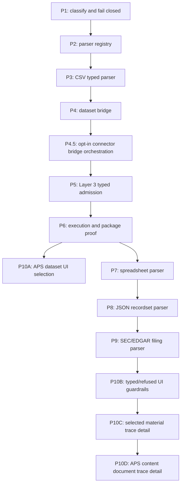

# Implementation Plan

Status: proposed phased implementation. Each phase is intended to be independently reviewable and testable.

## Planning Principle

The next work should not start by adding broad parser behavior. It should first make the current classification boundary stricter and more observable, because the main risk is silent semantic loss.

The implementation should proceed from lowest blast radius to highest:

1. Classification and refusal hardening.
2. Parser registry and diagnostics envelope.
3. One narrow typed parser.
4. Dataset bridge.
5. Layer 3 workbench source/material admission.
6. UI/operator surfacing only after backend authority exists.

## Cross-Phase Guardrails

Every implementation phase must preserve these architecture constraints:

- Do not mix media detection, parser execution, dataset materialization, and workbench state logic in one helper.
- Do not make a parser success path depend on UI labels, run display names, or review-page state.
- Do not route structured data through `aps_content_document` merely because that path already reaches Layer 3.
- Do not widen Candidate B beyond PDF.
- Do not introduce schema or migration work without a separate freeze that names exact model, migration, service, and test impacts.
- Do not make archive processing recursive in a way that hides skipped or failed members.
- Do not add multiple parser families in one PR unless a prior registry slice has already made the addition mechanical and independently testable.
- Do not claim a source family is supported until positive and negative fixtures prove parser, diagnostics, downstream mapping, and refusal behavior.

## Phase P0: Current Planning Pack

Status: this folder.

Scope:

- Record current capability boundary.
- Define target contract.
- Define validation matrix.
- Identify open decisions.

No-go:

- No source changes.
- No test changes.
- No schema changes.
- No runtime artifact generation.

Exit criteria:

- Docs are internally consistent.
- Docs distinguish live implementation from target design.
- Docs identify the immediate safe implementation tranche.

## Phase P1: Media Classification Hardening

Status: implemented in the current branch for declared/filename/sniffed typed candidates and ZIP typed/refused members. This status does not imply parser admission.

Goal:

Prevent lossy or incorrect source-family admission before adding new parsers.

Likely edit surface:

- `backend/app/services/nrc_aps_media_detection.py`
- `backend/app/services/nrc_aps_artifact_ingestion.py`
- `backend/app/services/connectors_nrc_adams.py`
- Existing media-detection and artifact-ingestion tests.

Requirements:

- Preserve current PDF/text/image/ZIP behavior where already proven.
- Add file extension and original filename context to detection when available.
- Detect Office Open XML containers such as `.xlsx` and classify them as spreadsheet before generic ZIP handling.
- Treat standalone CSV as candidate table, not generic qualitative text, only when a parser is admitted; before admission, report precise unsupported typed-table status.
- Keep JSON/XML/HTML refused unless an admitted parser family is requested and available.
- Record declared/sniffed/effective/media-family/parser-family diagnostics in artifact payloads.

Stop condition:

- Every supported, refused, and ambiguous type in the validation matrix has deterministic diagnostics.
- No newly recognized type is silently routed through an old generic text/archive success path.

Implemented boundary:

- CSV declared/filename artifacts fail closed as `typed_content_type_not_admitted`.
- XLS/XLSX/XLSM filename or OOXML package evidence is classified as spreadsheet before generic ZIP; `.xlsx` is now parser-admitted by Phase P7, while `.xls` and `.xlsm` remain unadmitted.
- At the P1 boundary, JSON/XML/HTML declared/sniffed/extension evidence was refused; Phase P8 later admits only bounded JSON recordsets while XML/HTML remain refused.
- ZIP members with typed/refused extensions are recorded as member-level unadmitted/refused outcomes instead of flattened into text.
- Existing PDF/text/image/generic-ZIP behavior is preserved.

## Phase P2: Parser Registry Skeleton

Status: implemented in the current branch as metadata-only parser admission. This status does not imply CSV, spreadsheet, JSON, SEC/EDGAR, dataset bridge, schema, Layer 3 source-shape, or UI support.

Goal:

Separate media classification from parser implementation so new formats can be added without branching the current document processor into an unbounded file-type dispatcher.

Likely edit surface:

- `backend/app/services/nrc_aps_parser_registry.py`
- `backend/app/services/nrc_aps_document_processing.py`
- `backend/app/services/connectors_nrc_adams.py`
- Parser-registry and focused document-processing tests.

Requirements:

- Registry entries define parser family, admitted content types/extensions, input preconditions, output representation families, and failure tokens.
- Existing PDF baseline, Candidate B PDF, plain text, image OCR, and archive handling become registry entries or registry-compatible wrappers.
- Unsupported parser lookup fails closed with stable tokens.
- Registry output can carry document units today and typed units later.

Stop condition:

- Existing tests still pass.
- New tests prove registry selection without changing existing document outputs.
- Candidate B remains PDF-only.

Implemented boundary:

- A compact parser registry resolves the already-admitted processors for baseline PDF, Candidate B PDF, plain text, image OCR, and archive bundles.
- The registry returns stable contract id, version, admission status, parser family, parser output family, parser contract id, and fail-closed tokens for unsupported lookups.
- Existing document-processing outputs now include parser-registry metadata.
- Connector processing diagnostics and extraction payloads now preserve parser-registry metadata.
- Existing processor dispatch remains unchanged; the registry is not yet an execution framework.
- Candidate B remains admitted only for `application/pdf`.

## Phase P3: CSV/Delimited Table Parser

Status: implemented in the current branch as typed parser diagnostics only. This status does not imply dataset materialization, Layer 3 typed source admission, schema, migration, or UI support.

Goal:

Admit one narrow typed parser before broader spreadsheet/filing work.

Likely edit surface:

- `backend/app/services/nrc_aps_csv_parser.py`
- `backend/app/services/nrc_aps_media_detection.py`
- `backend/app/services/nrc_aps_parser_registry.py`
- `backend/app/services/nrc_aps_document_processing.py`
- `backend/app/services/connectors_nrc_adams.py`
- `backend/app/services/nrc_aps_content_index.py`
- CSV parser, media detection, parser registry, document processing, artifact ingestion, and archive tests.

Requirements:

- Accept only bounded-size CSV/delimited files under explicit admitted media/extension conditions.
- Detect delimiter, header row, row count, column count, encoding, null markers, numeric columns, and time-column candidates.
- Emit `table_units` and optional `time_series_units`.
- Preserve raw row provenance sufficient to trace table rows back to source target/member.
- Fail closed on malformed encodings, extreme row/column counts, inconsistent rows beyond policy, formula injection risks for downstream exports, and empty tables.

Stop condition:

- Parser diagnostics can prove whether a source is qualitative text, table-like CSV, or unsupported.
- The docs and tests do not claim Layer 3 analysis support until dataset bridge orchestration and Layer 3 source admission exist.

Implemented boundary:

- Standalone declared CSV and filename `.csv` artifacts are admitted as `text/csv` when the body has a text signature and no higher-priority refused or non-text signature.
- The parser accepts bounded CSV/delimited files and reports encoding, delimiter, header decision, row count, column count, null markers, column kinds, numeric columns, and time-column candidates.
- The parser emits `table_units` and optional `time_series_units`.
- CSV parser output is preserved in document-processing and connector diagnostics.
- ZIP `.csv` members are parsed for table diagnostics and are not flattened into normalized document text.
- CSV output intentionally has no `ordered_units` and no normalized document text.
- No dataset rows, variables, source-shape changes, Layer 3 material preview changes, or UI changes are created.

## Phase P4: Dataset Bridge

Status: implemented in the current branch as an explicit callable bridge service. Connector orchestration is handled separately in Phase P4.5. This status does not imply Layer 3 typed source admission, UI support, schema changes, or non-CSV parser support.

Goal:

Materialize admitted typed table/time-series parser output into existing dataset models or an explicitly governed bridge model.

Likely edit surface:

- `backend/app/services/nrc_aps_dataset_bridge.py`
- `tests/test_nrc_aps_dataset_bridge.py`
- Existing dataset models; no migration was required for the implemented bridge slice.

Requirements:

- Create or link `Dataset`, `DatasetVersion`, `VariableDefinition`, `VariableProfile`, and `DatasetRow` records only after parser output passes validation.
- Preserve source-system, run, target, raw blob, parser family, parser version, and representation contract provenance.
- Record time column, frequency hint, numeric variables, missingness, and type-confidence diagnostics.
- Keep materialization idempotent for the same source content hash and parser contract.
- Fail closed if required provenance is missing.

Stop condition:

- A fixture CSV can be acquired or fixture-fed, parsed, materialized to dataset records, and queried as a `dataset_version` with stable provenance.

Implemented boundary:

- The bridge accepts CSV parser output from target artifact payloads.
- The bridge materializes one `Dataset`, one `DatasetVersion`, `VariableDefinition` rows, `DatasetRow` JSON rows, dataframe storage, `DatasetExternalIdentity`, and `DatasetSourceProvenance`.
- Dataset/version ids are deterministic for the same source artifact key, parser contract, table index, and table hash.
- Re-running the same content/parser contract is idempotent.
- Existing dataset provenance models were sufficient for this tranche; no schema or migration work was added.
- The bridge service is explicit/callable; Phase P4.5 is the only runtime path that invokes it from connector finalization. It does not add Layer 3 source admission.

## Phase P4.5: Connector Dataset Bridge Orchestration

Status: implemented in the current branch as default-off connector orchestration for CSV dataset materialization only.

Goal:

Make APS runtime runs capable of producing first-class dataset authority from processed CSV target artifacts without making all CSV ingestion automatic or altering Layer 3 admission.

Edit surface:

- `backend/app/services/connectors_nrc_adams.py`
- `backend/app/services/connectors_sciencebase.py`
- `tests/test_nrc_aps_dataset_bridge.py`
- `tests/test_api.py`

Requirements:

- Add an explicit `csv_dataset_bridge_enabled` config gate, default `false`.
- Invoke the bridge only after connector finalization has produced processed target artifacts with `parser_family="csv_table"` and `typed_content_contract_id="aps_csv_table_units_v1"`.
- Preserve idempotency by reusing the deterministic dataset bridge source artifact key.
- Write a run-level bridge report and expose it through connector `report_refs`.
- Link successful targets to `dataset_id`, `dataset_version_id`, bridge contract id, source artifact key, and bridge report ref.
- Mark bridge materialization failures as `completed_with_errors` without changing PDF/document success paths.

Implemented boundary:

- `hydrate_process` runs with `csv_dataset_bridge_enabled=true` can materialize processed CSV table artifacts into existing dataset authority during connector finalization.
- Non-CSV processed artifacts are skipped with explicit report diagnostics.
- Failed bridge materialization emits a report and appends `aps_csv_dataset_bridge_failed`.
- Existing PDF/text/image/ZIP content indexing and APS document evidence paths remain separate.
- No schema, migration, UI, API route definition, or Layer 3 source-admission changes were added.

Stop condition:

- A route-level APS run test proves CSV fixture content is downloaded, parsed, materialized, linked to the connector target, and exposed through `report_refs`.

## Phase P5: Layer 3 Workbench Typed Admission

Status: implemented in the current branch for explicit APS-derived `DatasetVersion` admission through the existing Layer 3 `dataset_version` source shape.

Goal:

Admit APS-derived typed datasets into the Layer 3 workbench without corrupting existing `aps_content_document` behavior.

Likely edit surface:

- `backend/app/services/layer3_workbench.py`
- `backend/app/services/layer3_typing_entry.py`
- `backend/app/api/layer3.py` only if endpoint schemas need explicit source-family fields.
- Layer 3 API tests.

Requirements:

- Source preview preserves the existing supported source classes and does not add a new source class for APS-derived datasets.
- Material preview accepts explicit `dataset_version_ids` and distinguishes plain `dataset_version` from APS-derived `dataset_version` by provenance fields.
- Material preview shows `planning_shape_family="tabular_numeric"` for explicit dataset/version records and marks candidates incomplete when variable definitions are absent.
- Gate B source identity includes the dataset ids and APS provenance refs.
- Gate C typing uses existing quantitative rules for dataset-shaped material.
- Qualitative document-chunk APS paths remain unchanged.

Implemented boundary:

- `material_preview` remains backward-compatible for synthetic preview candidates when no real `dataset_version_ids` are provided.
- DB-backed material preview now projects `Dataset`, `DatasetVersion`, `VariableDefinition`, and APS `DatasetSourceProvenance` fields into candidate source identity, provenance, payload, and load summary.
- The API material-preview route now passes a database session and documents optional top-level or filter-level `dataset_version_ids`.
- Gate B persists echoed real source identity/provenance into `L3MaterialSnapshot`.
- Gate C and plan preview reuse the existing `dataset_version` quantitative typing/pass-entry path; no new typing rule or source shape was added.
- Tests prove APS-derived dataset material can move from material preview through Gate B, Gate C commit, and plan preview.

No-go:

- No schema or migration changes.
- No UI changes.
- No new source class.
- No automatic selection of all bridged datasets.
- No claim that JSON, spreadsheet, SEC/EDGAR, or mixed table/document parsers are supported.

Stop condition:

- An APS-derived dataset fixture with `DatasetSourceProvenance.source_system="nrc_adams_aps"` reaches Layer 3 plan preview with `dataset_version_id` preserved and `planning_shape_family="tabular_numeric"`.

Stop condition:

- A typed APS-derived dataset can pass source preview, material preview, Gate B, Gate C, plan preview, and execution eligibility checks without masquerading as `aps_content_document`.

## Phase P6: Analysis Execution And Package Path

Status: implemented in the current branch for APS-derived single `DatasetVersion` selected-pass execution/result/package proof.

Goal:

Prove that typed APS-derived datasets work through the existing quantitative Layer 3 execution and package path.

Likely edit surface:

- Tests first.
- Service changes only if existing source identity/state checks assume non-APS dataset provenance.

Requirements:

- Run descriptive summary for general typed tables.
- Run time-series methods only when time/numeric prerequisites are met.
- Preserve source provenance in result/status/package/handoff summaries.
- Keep existing APS document evidence handoff separate from quantitative dataset package behavior unless a mixed-source package is explicitly governed.

Implemented boundary:

- API proof now moves an APS-derived CSV bridge dataset from material preview through Gate B, Gate C, plan preview, plan approval, execution selection, execution start, result status, result review, package preview, and package construction commit.
- Package preview and package commit now expose `source_shape="dataset_version"` and `source_dataset_version_ids` for single dataset-version selected-pass packages instead of leaving source shape empty.
- This phase proves selected-pass quantitative package construction, not APS document evidence-bundle handoff or mixed qualitative/table packages.

Stop condition:

- End-to-end test proves APS fixture CSV to dataset to Layer 3 selected-pass result/status/package preview or package construction, depending on selected tranche.

## Phase P7: Spreadsheet Parser

Status: bounded implementation added for `.xlsx` after the CSV parser and dataset bridge patterns were proven. Connector finalization for bounded standalone XLSX table units is handled separately by Phase P7.5. This does not admit `.xls`, `.xlsm`, encrypted workbooks, formula-bearing workbooks, arbitrary ranges, archive-member XLSX orchestration, schema changes, or new Layer 3 source semantics.

Goal:

Admit workbook files after CSV parser and dataset bridge patterns are proven.

Requirements:

- Detect `.xlsx` and related workbook containers before generic ZIP handling.
- Record workbook/sheet/table metadata.
- Decide formula policy: values-only, formulas-only diagnostics, or both.
- Materialize selected sheets/tables explicitly, not every arbitrary cell range by default.
- Fail closed on encrypted files, unsupported binary formats, macros, oversized workbooks, ambiguous sheets, and empty tables.

Stop condition:

- XLSX is no longer a ZIP ambiguity risk.
- At least one simple workbook fixture is parsed and materialized with sheet/table provenance.

## Phase P7.5: Generic Table Bridge Orchestration

Status: bounded implementation added after Phase P7 to avoid carrying CSV-named connector orchestration into XLSX.

Goal:

Allow processed CSV/XLSX table-unit artifacts to be materialized during connector finalization under an explicit generic table bridge gate, while preserving the legacy CSV-only bridge gate for compatibility.

Requirements:

- Add a separate `table_dataset_bridge_enabled` config gate with default `false`; do not silently broaden `csv_dataset_bridge_enabled`.
- Emit `aps.table_dataset_bridge_run.v1` reports and `aps_table_dataset_bridge_*` refs for generic table bridge runs.
- Keep `csv_dataset_bridge_enabled`, `aps.csv_dataset_bridge_run.v1`, and `aps_csv_dataset_bridge_*` refs stable for existing CSV consumers.
- Invoke the generic bridge only for processed artifacts with admitted table-unit parser contracts: `csv_table`/`aps_csv_table_units_v1` or `xlsx_workbook`/`aps_xlsx_table_units_v1`.
- Preserve deterministic `Dataset`, `DatasetVersion`, variable, row, and provenance materialization with parser-family-specific source modes.
- Expose generic bridge report refs through connector run detail responses.
- Do not add schema/model/migration changes, new Layer 3 source semantics, or broad workbook semantics in this phase.

Stop condition:

- Focused tests prove legacy CSV bridge compatibility, generic XLSX connector materialization, route-level generic bridge report refs, target dataset refs, and XLSX provenance.

## Phase P8: JSON Recordset Parser

Status: bounded implementation added for standalone JSON recordsets after the generic table bridge was proven. This does not admit arbitrary structured JSON, nested flattening, archive-member JSON orchestration, schema changes, new Layer 3 source semantics, or JSON/XML/HTML filing semantics.

Goal:

Admit only table-like JSON, not arbitrary JSON documents.

Requirements:

- Accept JSON arrays of objects or a configured path to records.
- Refuse nested heterogeneous objects unless flattening policy is explicit.
- Preserve field paths, data types, null/missing behavior, and row provenance.
- Keep arbitrary JSON refused until a structured parser contract is added.

Stop condition:

- JSON recordset fixture materializes as dataset rows.
- Non-recordset JSON fails closed with explicit diagnostics.

Implemented boundary:

- `application/json` is admitted only to the `json_recordset` parser path.
- Root JSON arrays of flat objects are accepted.
- Object roots require a configured record path such as `data.records`.
- Nested/list/object values, heterogeneous keys, empty arrays, invalid JSON, oversized JSON, and object roots without a configured record path fail closed.
- Parser output emits `table_units`, optional `time_series_units`, field paths, record paths, row counts, column kinds, numeric columns, and time-column candidates.
- Generic table bridge materialization supports `json_recordset` under `aps_table_dataset_bridge_v1` with `source_mode="artifact_json_recordset_parser"`.
- Connector finalization can materialize processed JSON recordset artifacts only when `table_dataset_bridge_enabled=true`.

## Phase P9: SEC/EDGAR Filing Parser

Status: implemented for bounded complete submission text files with plain document text and simple delimited `<TABLE>` blocks.

Goal:

Handle filings as mixed qualitative plus structured data, not as one generic document text blob.

Requirements:

- Select first admitted filing forms and encodings before broad implementation.
- Parse filing metadata, sections, exhibits, and tables where deterministically available.
- Preserve section/table linkage.
- Decide Inline XBRL and XML/XHTML admission separately from simple text/SGML filings.
- Map narrative sections to document chunks and extracted tables to dataset bridge.

Stop condition:

- One narrow EDGAR fixture proves mixed output with both document evidence and table/dataset provenance.

Implemented P9 focused commands:

- `python -m pytest .\tests\test_nrc_aps_sec_edgar_parser.py .\tests\test_nrc_aps_media_detection.py .\tests\test_nrc_aps_parser_registry.py .\tests\test_nrc_aps_document_processing.py .\tests\test_nrc_aps_artifact_ingestion.py .\tests\test_nrc_aps_dataset_bridge.py .\tests\test_api.py -k "sec_edgar or parser_registry or media_detection or dataset_bridge" -q`: `43 passed`, `112 deselected`.
- `python -m pytest .\tests\test_nrc_aps_sec_edgar_parser.py .\tests\test_nrc_aps_document_processing.py .\tests\test_nrc_aps_artifact_ingestion.py .\tests\test_nrc_aps_dataset_bridge.py .\tests\test_api.py -k "sec_edgar" -q`: `11 passed`, `126 deselected`.

P9 residual no-go list:

- HTML/XML/inline XBRL filing documents remain refused.
- Unsupported form types remain fail-closed unless explicitly admitted by config.
- Ambiguous financial statement extraction, nested filing semantics, archive-member filing orchestration, schema/model/migration changes, new Layer 3 source shapes, and mixed-source package semantics remain deferred.

## Phase P10: UI And Operator Surfacing

Status: partially implemented as bounded Phase P10A for Layer 3 APS-derived `DatasetVersion` candidate listing and explicit selection, bounded Phase P10B for source-family admission/refusal guardrails in that same workbench panel, bounded Phase P10C for selected-material dataset trace/detail surfacing in the Gate B material ledger, and bounded Phase P10D for selected APS content-document candidate listing plus selected-material trace/detail surfacing.

Goal:

Expose the new source families in review/workbench surfaces only after backend authority exists.

Requirements:

- Workbench source cards show content family, parser family, provenance, and unsupported/refusal diagnostics.
- Document trace remains document-oriented.
- Dataset trace or typed-source trace is added only if needed; do not overload the PDF document trace page with non-document table semantics.
- Browser verification uses both headed and headless Chrome when UI assets change.
- P10A specifically adds a read-only Layer 3 `dataset-version-candidates` endpoint backed by existing `DatasetSourceProvenance`, plus workbench controls that select/paste `DatasetVersion` IDs and pass them to material preview as `dataset_version_ids`.
- P10B specifically adds server-owned source-family metadata for admitted/materialized APS table families and deferred/refused guardrails, then renders that metadata in the existing Layer 3 candidate-selection panel without adding schema, migration, parser, or source-shape changes.
- P10C specifically adds server-owned selected-material source trace metadata to material preview for APS-derived `DatasetVersion` rows, then renders parser contract, dataset/version, variable, storage, source artifact, diagnostics, target, and accession refs in the Gate B material ledger without adding a new endpoint or source shape.
- P10D specifically adds a read-only Layer 3 `aps-content-document-candidates` endpoint backed by `ApsContentDocument` and `ApsContentLinkage`, workbench controls that select/paste APS content IDs as `aps_content_document_ids`, and selected-material trace metadata from `ApsContentDocument`, `ApsContentChunk`, and `ApsContentLinkage` authority.

Stop condition:

- P10A stop condition is met when an operator can discover/select APS-derived bridge dataset versions in the Layer 3 workbench without reading raw JSON.
- P10B stop condition is met when an operator can distinguish server-backed CSV, XLSX, JSON recordset, and bounded SEC/EDGAR text table dataset-version candidates from explicitly deferred/refused families in the Layer 3 workbench without reading raw JSON.
- P10C stop condition is met when an operator can inspect selected APS-derived `DatasetVersion` source trace detail in the Gate B material ledger without reading raw JSON.
- P10D stop condition is met when an operator can discover/select indexed APS content documents and inspect selected document/chunk/linkage trace detail in the Gate B material ledger without reading raw JSON.
- A broader trace/detail UI tranche remains separate from P10D and should not be claimed as completed until operators can inspect richer detail views for mixed filings and refused artifacts without reading raw JSON.

## Target Implementation Flow

## Immediate Recommendation

The next implementation PR should not repeat P10A APS-derived dataset selection, P10B source-family guardrails, P10C selected dataset trace detail, P10D selected APS content-document trace detail, P8 JSON recordset materialization, or P9 bounded SEC/EDGAR complete-submission materialization. The next narrow slice should either add refused/mixed-source trace surfacing only where backed by server authority, or add a separate SEC/EDGAR HTML/XML/inline-XBRL parser only after a dedicated contract is specified.
