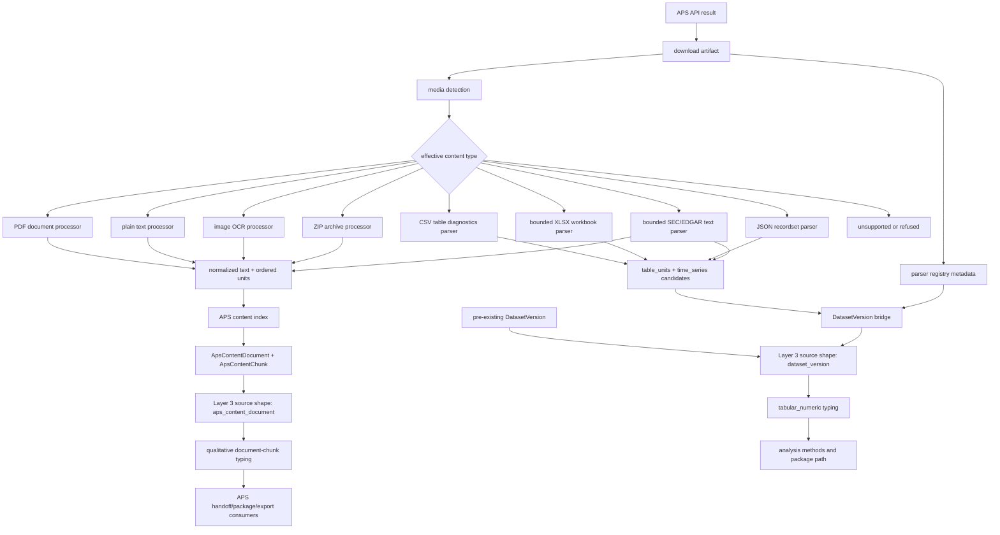
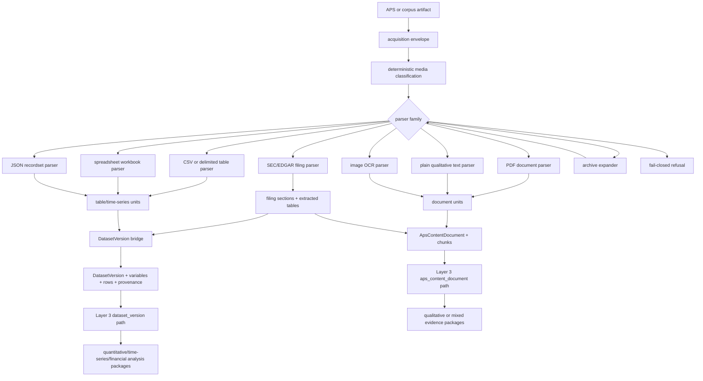

# Multi-Type APS Ingestion Plan

Status: planning/design pack plus implemented Phase P1 media hardening, Phase
P2 parser registry skeleton, Phase P3 CSV typed diagnostics, Phase P4 callable
dataset bridge, Phase P4.5 opt-in CSV connector orchestration, Phase P5 Layer
3 APS-derived dataset admission, Phase P6 execution/package proof, bounded
Phase P10A operator selection surfacing, Phase P7 bounded XLSX
parser/materialization, Phase P7.5 opt-in generic table dataset bridge
orchestration, bounded Phase P8 JSON recordset parser/materialization, bounded
Phase P9 plain-text SEC/EDGAR filing parser/materialization, bounded Phase
P10B typed/refused workbench source-family surfacing, bounded Phase P10C
selected-material dataset trace/detail surfacing, bounded Phase P10D selected
APS content-document trace/detail surfacing, current-main SEC-specific
HTML/iXBRL source-family admission through the governed SEC parser receipt
chain, a current-main SEC HTML/iXBRL reconciliation closeout, bounded Phase
P10E server-owned raw mixed trace labeling, bounded Phase P10F
refused/deferred source-family guardrail trace detail, bounded Phase P10G Gate
C unsupported material snapshot trace detail, bounded Phase P10H parser-level
refused APS artifact trace detail, bounded Phase P11 mixed-source package
semantics readiness, bounded Phase P12 governed mixed-source package contract,
bounded Phase P13 package-family policy registry, bounded Phase P13A
route-level package-family policy gates, bounded Phase P14 read-only
mixed-source package review preview, bounded Phase P15 mixed-source package
construction commit freeze, current-main Phase P15 mixed-source package
construction commit runtime, bounded Phase P16 mixed-source package-review
submit freeze, current-main Phase P16 mixed-source package-review submit
runtime, bounded Phase P17 mixed-source handoff/export prepare freeze,
current-main Phase P17 mixed-source handoff/export prepare runtime, bounded
Phase P17A mixed-source rendered handoff status freeze, current-main Phase
P17A mixed-source rendered handoff prepare runtime, current-main P17A sync,
bounded Phase P18 mixed-source APS handoff dispatch freeze, current-main Phase
P18 mixed-source APS handoff dispatch runtime, current-main P18 sync, bounded
Phase P19 mixed-source external export/download readiness freeze, current-main
Phase P19 mixed-source external export/download readiness runtime,
current-main P19 sync, bounded Phase P20 mixed-source external export/download
delivery freeze, current-main Phase P20 mixed-source external
export/download delivery runtime, current-main P20 sync, and bounded Phase P21
mixed-source rendered delivery controls freeze, current-main Phase P21
mixed-source rendered delivery controls runtime, current-main P21 sync, and
bounded Phase P22 mixed-source same-origin signed-reference governance freeze.

Last audited main authority before the Phase P9 branch: `project6-origin/main` at `61df2c0d77a398d4aa582bb864caf6a209679e47`.

Current SEC HTML/iXBRL reconciliation authority: `project6-origin/main` at `86b9786df4723135c62a60ed145c5bbff04b3703`.

Historical seed worktree: `worktrees/multi-ingest-plan`.

Historical seed branch: `codex/multitype-ingestion-plan-p1`.

Historical seed base: `project6-origin/main` at `94bd339fb3c76a6151aeb7d0d618f48e0ab2e35f`.

## Purpose

This folder defines the current end-to-end completion boundary and the remaining implementation plan for non-PDF and typed-source ingestion through NRC APS artifact processing, content indexing, and the Layer 3 workbench sublayers.

The user question is not just "can the pipeline download non-PDF files?" The actual requirement is whether the pipeline preserves the original corpus artifact's specific data shape and semantics while moving downstream. That includes plain qualitative text, tabular/numeric data, time-series data, spreadsheets, JSON recordsets, SEC/EDGAR filing formats, and mixed qualitative-plus-table artifacts.

## Authority And Limits

Confirmed live authority comes from tracked source files and tracked planning/status docs in this worktree. The repo-level instructions reference `.codesight/wiki/index.md` and `.codesight/CODESIGHT.md`, but both files are absent in this current worktree; this pack records that as an authority gap rather than treating the wiki as available.

This lane began as a planning/spec/design pack and now also includes bounded
runtime and docs/control slices through P22. It still does not change schema,
migrations, Layer 3 typing rules, parser behavior, Candidate B behavior,
connector/provider/destination behavior, or mixed-source package payload
rewrite semantics. The API changes are limited to material-preview accepting
explicit `dataset_version_ids` and `aps_content_document_ids`, read-only Layer
3 candidate-list endpoints for APS-derived `DatasetVersion` rows and indexed
APS content documents, source-family metadata plus guardrail trace detail for
admitted/deferred/refused APS table families and the server-owned raw mixed
materialization sentinel, selected-material source trace metadata for
APS-derived `DatasetVersion` rows and selected `ApsContentDocument` rows, a
read-only mixed-source package-readiness projection over already-valid
`dataset_version` plus `aps_content_document` material candidates, Gate C
unsupported material snapshot trace detail for persisted `L3MaterialSnapshot`
records that cannot be typed, package-family policy answers for existing
package families and mixed `dataset_version` plus `aps_content_document`
preview/commit/submit/handoff-prepare admission, route-level package-family
policy gates for server-owned selected-pass review state, a mixed-source
package review preview derived from committed Gate B material authority,
mixed-source package construction commit from server-recomputed P14/P12
authority, material-authority mixed-source package-review submit over existing
P15 package rows, material-authority mixed-source handoff/export prepare over
existing P16 submit state, rendered material-authority mixed-source
handoff/export prepare controls over that P17 API path, current-main
reference-only mixed-source APS handoff dispatch state over the P17 prepare
state, current-main reference-only mixed-source external export/download
readiness state over the P18 dispatch state, a P20 same-origin delivery freeze
over that readiness state, current-main P20 same-origin mixed-source
artifact-stream delivery over current package rows and recorded P19 readiness,
current-main P20 sync, a P21 rendered delivery controls freeze over the
already-admitted P20 same-origin stream, current-main P21 rendered controls
runtime, current-main P21 sync, and a P22 docs/control freeze for mixed-source
same-origin signed-reference governance over the existing P19/P20/P21 chain.
Connector run/report refs expose the generic
table dataset bridge only when explicitly enabled.

P18 now has current-main runtime proof for mixed-source APS handoff dispatch as the prerequisite downstream surface before external export/download readiness can be pursued. The runtime records reference-only dispatch state and does not admit external export/download, delivery, provider, connector, destination, local outbox, schema, parser, source-shape, payload rewrite, or production-readiness behavior.

P19 has current-main runtime proof for mixed-source external export/download readiness over the recorded P18 reference-only APS handoff dispatch state. The runtime records reference-only readiness state only and does not admit external export/download delivery, download, signed reference, public URL, connector, provider, destination, local outbox, schema, parser, source-shape, package payload rewrite, excluded-tool behavior, or production-readiness behavior.

P20 freezes mixed-source external export/download delivery as the next exact
downstream surface over the recorded P19 readiness state. Current main now
implements only same-origin artifact-stream delivery for a server-revalidated
existing mixed-source package artifact. It still does not admit rendered browser
download controls, download URLs, signed references, public/provider URLs,
connector/provider/destination behavior, schema/model/migration changes,
parser/source-shape expansion, package payload rewrite, excluded-tool behavior,
or production-readiness behavior.

P21 freezes rendered mixed-source delivery controls as the next exact
downstream surface over the already-live P20 same-origin artifact stream. This
freeze is docs/control only. Future implementation may use only server-owned
P20/P19/session-summary material authority and the existing delivery route; it
does not admit UI/static behavior by itself, download URLs, signed references,
provider/public URL behavior, connector/destination behavior, schema/model/
migration changes, parser/source-shape expansion, package payload rewrite,
excluded-tool behavior, or production readiness.

Current main now includes the Phase P21 mixed-source rendered delivery controls
runtime and `52-p21-current-main-sync.md`. The rendered control uses
`State.sessionSummary.external_export_download_readiness` as the rendered source
of truth, submits the existing P20 delivery route with `operator_decision:
deliver_mixed_source_external_export_download`, selects only the
`review_facing` mixed package, prefers refreshed delivered state over optimistic
local submitted state, keeps stale source-directory prepare state from taking
over mixed-source routes, and keeps signed-reference, provider/public URL,
connector/destination, schema/parser/source-shape, package payload rewrite, SEC
XBRL, excluded-tool, and production-readiness behavior blocked until a separate
freeze selects them.

P22 freezes mixed-source same-origin signed-reference governance as the next
exact downstream surface after P21. This freeze is docs/control only. Future
implementation may admit signed-reference generation/use only after server-side
revalidation of the full P14/P15/P16/P17/P18/P19/P20/P21 material-authority
chain and the current `review_facing` package row. Provider/public URLs,
connector/destination dispatch, durable-state schema changes, rendered controls,
package payload rewrite, source-shape expansion, SEC XBRL, excluded-tool
behavior, value reveal, default-on behavior, and production readiness remain
blocked unless a later freeze selects them.

This folder is the front door for the new lane. Shared progress manifests and Layer 3 control packets are updated only when this heterogeneous-ingestion lane changes a tracked milestone claim. Lane-local docs remain planning authority until source, tests, and control-spine entries support a current implementation claim.

## Current Verdict

The current implementation is end-to-end for APS document-chunk ingestion and downstream Layer 3 APS evidence-bundle style handoff. It is also end-to-end for APS-derived CSV dataset-version selection through the bounded Layer 3 path, and bounded for XLSX, JSON recordset, and plain-text SEC/EDGAR filing table parser/materialization plus opt-in connector finalization through the generic table bridge. It is not complete for all first-class typed non-PDF data ingestion families.

| Source family | Current status | Strict interpretation |
| --- | --- | --- |
| APS PDF through baseline/Candidate A-style document processing | Implemented for document extraction, normalized text, content units, chunk indexing, audited review/workbench surfaces, audited Layer 3 APS document evidence consumers, parser-registry metadata, and explicit workbench selection/trace detail for indexed APS content documents | Complete only for document/text/chunk semantics |
| APS PDF through Candidate B OpenDataLoader PDF | Implemented as opt-in, PDF-only, fail-closed document-processing engine with parser-registry metadata | Complete only for PDF document extraction into the existing document contract |
| `text/plain` | Implemented as qualitative text normalization and text-block units with parser-registry metadata | Partial; this is not a typed qualitative corpus model beyond document chunks |
| Images | Implemented as OCR text units with parser-registry metadata | Partial; image pixels/regions are not a typed Layer 3 data source |
| ZIP archives | Implemented as archive bundle for supported member types with parser-registry metadata | Partial; typed/refused member extensions are surfaced as member-level outcomes; CSV members are parsed for table diagnostics and not flattened into text |
| CSV | Parser, legacy CSV bridge, generic table bridge, opt-in connector bridge orchestration, Layer 3 APS-derived `DatasetVersion` admission, selected-pass execution/package proof, and bounded workbench selection surfacing implemented for typed diagnostics | Partial; `hydrate_process` runs with either legacy `csv_dataset_bridge_enabled=true` or generic `table_dataset_bridge_enabled=true` can materialize CSV `table_units` into `DatasetVersion` authority. Those versions can now be listed/selected in the Layer 3 workbench and enter material preview/Gate B/Gate C/plan/execution/result/package when explicitly selected |
| XLS/XLSX spreadsheets | Bounded `.xlsx` parser/materialization implemented for a single explicit non-empty sheet/table, with opt-in connector orchestration through the generic table bridge | Partial; `.xlsx` is detected before generic ZIP, emits `xlsx_workbook` table units with workbook/sheet provenance, and can be materialized during connector finalization when `artifact_pipeline_mode="hydrate_process"` and `table_dataset_bridge_enabled=true`. `.xls` binary workbooks, `.xlsm` macro workbooks, encrypted workbooks, formulas, ambiguous multi-sheet workbooks without explicit selection, arbitrary cell ranges, archive-member XLSX orchestration, and new Layer 3 source semantics remain fail-closed or deferred. |
| JSON recordsets | Bounded parser/materialization implemented for root arrays of flat objects or object roots with configured record paths, with opt-in connector orchestration through the generic table bridge | Partial; table-like JSON can emit `json_recordset` table units and materialize to `DatasetVersion` when `artifact_pipeline_mode="hydrate_process"` and `table_dataset_bridge_enabled=true`. Arbitrary nested JSON documents, heterogeneous records, missing record paths for object roots, archive-member JSON orchestration, schema changes, new Layer 3 source semantics, and JSON-as-structured-document behavior remain fail-closed or deferred. |
| XML/HTML | Explicitly refused by the generic APS SEC/EDGAR text parser | Declared/sniffed/extension XML/HTML remain refused by `nrc_aps_sec_edgar_parser.py`; this does not negate the separate current-main SEC-specific HTML/iXBRL parser receipt chain |
| SEC/EDGAR filings/submissions | Bounded parser/materialization implemented for complete submission text files plus current-main SEC-specific HTML/iXBRL source-family admission | Partial; SEC/EDGAR complete submission signatures are sniffed as `application/x-sec-edgar-submission`, metadata/sections become document units, extracted delimited table blocks can materialize through the generic table bridge, and only admitted forms such as `10-K`, `10-Q`, and `8-K` are allowed by default. Current main separately admits `sec_edgar_html_inline_xbrl_source_family_parser_v1` as the governed SEC HTML/iXBRL parser receipt path. Unsupported forms, ambiguous tables, archive-member orchestration, schema changes, broad generic XML/HTML parsing, new mixed-source Layer 3 semantics, and richer financial statement semantics remain fail-closed or deferred. |
| Existing `dataset_version` time-series/financial/tabular data | Implemented downstream in Layer 3 when already present as dataset records | CSV, bounded XLSX, bounded JSON recordset, and bounded SEC/EDGAR table artifacts can now create dataset records behind explicit bridge gates; explicit Layer 3 material preview can now carry APS-derived dataset provenance into Gate B/Gate C/plan preview |

## Architecture Quality Bar

The remaining lane must be built for flexibility and non-fragility, not just format coverage. The docs in this folder treat these as acceptance requirements:

- Modularity: media classification, parser selection, parser execution, representation contracts, dataset materialization, content indexing, Layer 3 admission, and UI/operator projection must remain separable layers.
- Scalability: adding a new parser family must mean adding a registry entry, parser implementation, fixtures, diagnostics, and downstream mapping, not editing unrelated workbench or PDF-specific branches.
- Fail-closed behavior: unknown, ambiguous, malformed, unsupported, empty, or unadmitted inputs must produce explicit diagnostics and must not silently downgrade into text/archive success.
- Provenance stability: every chunk, table, dataset row, package, and handoff record must retain enough source identity to trace back to run, target, raw blob, parser family, parser version, and content contract.
- Backward compatibility: existing PDF, Candidate B PDF-only, text, image, ZIP, `aps_content_document`, and `dataset_version` behavior must remain stable unless a later implementation PR explicitly changes and tests that boundary.
- Bounded growth: each tranche must have a narrow parser/source-family target and a no-go list; broad "support heterogeneous files" is not an implementation unit.

## Current Flow

## Target Flow

## What Is Completely Planned And Implemented Today

The live repo has the APS document pipeline and audited Layer 3 workbench downstream consumers implemented for the existing `aps_content_document` source shape. The live repo also has a separate `dataset_version` source shape that supports quantitative/tabular/time-series work once dataset rows and variable metadata already exist.

The live repo does not yet have a complete plan-plus-implementation for all
non-PDF APS artifacts or heterogeneous corpus files. CSV now has parser
diagnostics, dataset bridge materialization, explicit Layer 3 admission,
selected-pass execution/package proof, and bounded Layer 3 UI/operator
selection. XLSX now has bounded parser diagnostics, explicit dataset
materialization for one selected/simple sheet, and opt-in connector
auto-orchestration through the generic table bridge, but not broad workbook
semantics, archive-member XLSX orchestration, or new Layer 3 source semantics.
JSON recordsets now have bounded parser diagnostics, explicit dataset
materialization, and opt-in connector auto-orchestration through the generic
table bridge, but not arbitrary JSON document semantics or archive-member JSON
orchestration. SEC/EDGAR now has a bounded plain-text complete-submission
parser that emits filing sections and simple table units, and current main
separately admits the governed SEC HTML/iXBRL parser receipt chain.
Parser-level unsupported-media APS artifact refusals now have read-only
workbench trace surfacing from persisted artifact-ingestion run/target payloads.
The material-preview API now exposes a read-only readiness contract when valid
`dataset_version` and `aps_content_document` candidates are selected together,
this pack defines the governed mixed-source package contract, the package-family
policy registry now keeps existing package-family answers explicit while
admitting `mixed_dataset_document` package-review preview, construction commit,
package-review submit, and handoff/export prepare from material authority,
route-level gates keep legacy selected-pass mixed markers out of the package
lifecycle, and the package-review preview plus construction plus submit plus
handoff/export prepare routes derive mixed-source package authority from
committed Gate B material authority and existing package rows. The P17 runtime
records a reference-only prepare envelope over approved P16 submit authority
through the direct material-authority API path. The P17A rendered control now
submits that existing P17 material-authority shape from server-owned mixed-source
summary state, while preserving selected-pass and source-directory qualitative
handoff/export flows. P18 now records current-main reference-only mixed-source
APS handoff dispatch state as the next exact downstream prerequisite before
mixed-source external export/download readiness. P19 now has current-main
runtime proof for mixed-source external export/download readiness as a
reference-only readiness state over P18 dispatch authority. P20 now freezes and
current main implements same-origin mixed-source external export/download
delivery over that P19 readiness state. P21 now freezes and current main
implements rendered mixed-source delivery controls over the existing P20
same-origin stream. The repo still does
not admit unsupported forms, ambiguous financial-statement semantics, archive-member
orchestration, broad generic XML/HTML parsing, download URLs, signed
references at runtime for mixed-source packages, public/provider URL
behavior, connector/provider/destination behavior for mixed sources, or
request-supplied mixed-source payload rewrite semantics.

## Immediate Next Tranche

Phase P22 is branch-local docs/control freeze only. It selects mixed-source
same-origin signed-reference governance as the next downstream surface after
rendered mixed-source delivery controls. The next immediate implementation
tranche, after this freeze merges and current-main syncs, is mixed-source
same-origin signed-reference generation/use over the existing P19/P20/P21
delivery authority only. Do not implement provider/public URL governance,
connector/destination dispatch, durable audit or revocation expansion,
product-flow usability proof, or a product-authority checkpoint until a later
freeze selects exactly one of those surfaces.

The next implementation pass should not repeat the APS-derived dataset
selection, source-family surfacing, selected-material trace-detail, SEC
HTML/iXBRL reconciliation, server-owned raw mixed trace-labeling,
refused/deferred guardrail trace-detail, Gate C unsupported material
trace-detail, P10H parser-level unsupported-media artifact refusal trace-detail,
P13/P13A policy gates, P14 mixed preview slices, the P15 construction-commit
freeze, the P15 construction runtime slice, the P16 submit freeze, the P16
submit runtime slice, the P17 handoff/export prepare freeze, the P17
handoff/export prepare runtime slice, the P17A rendered status/runtime slices,
this P18 mixed-source APS handoff dispatch freeze, the P18 mixed-source APS
handoff dispatch runtime slice, this P19 mixed-source external export/download
readiness freeze, this P19 readiness runtime slice, this P19 current-main sync,
this P20 mixed-source external export/download delivery freeze, this P20
same-origin delivery runtime slice, this P20 current-main sync, this P21
rendered delivery controls freeze, this P21 rendered controls runtime slice,
this P21 current-main sync, or this P22 mixed-source signed-reference
governance freeze. Remaining work is:

1. Implement mixed-source same-origin signed-reference generation/use only after
   the P22 freeze merges and current-main syncs. The implementation must bind to
   mixed-source material authority and keep associated-cohort/source-intake
   signed-reference authority separate.
2. Decide whether to deprecate the legacy
   `csv_dataset_bridge_enabled`/`aps.csv_dataset_bridge_run.v1` compatibility
   path after downstream consumers have adopted the generic table bridge
   contract.
3. Pursue future parser-level refusal trace work only when a new failure class
   has server-owned run/target authority and requires more than the current
   unsupported-media diagnostic rows.

## Pack Files

This section intentionally lists the supporting pack files. `README.md` is the front door for the folder rather than a child entry in the list.

- `01-live-audit.md` records the live implementation evidence and completion boundary.
- `02-contract.md` defines the target typed content/source contract and invariants.
- `03-implementation.md` decomposes the remaining work into bounded implementation phases.
- `04-validation.md` defines the required validation and regression matrix.
- `05-decisions.md` captures decisions, open questions, and grill-me self-audit checkpoints.
- `06-adequacy-audit.md` records the final scope, consistency, and justification audit for this planning-entry pack.
- `07-p1-closeout.md` records the implemented Phase P1 boundary, validation, and residual caveats.
- `08-p2-closeout.md` records the implemented Phase P2 parser-registry boundary, validation, and residual caveats.
- `09-p3-closeout.md` records the implemented Phase P3 CSV typed-diagnostics boundary, validation, and residual caveats.
- `10-p4-closeout.md` records the implemented Phase P4 callable dataset-bridge boundary, validation, and residual caveats.
- `11-p4-5-closeout.md` records the implemented Phase P4.5 opt-in connector bridge orchestration, validation, and residual caveats.
- `12-p5-closeout.md` records the implemented Phase P5 Layer 3 APS-derived dataset admission, validation, and residual caveats.
- `13-p6-closeout.md` records the implemented Phase P6 selected-pass execution/result/package proof, validation, and residual caveats.
- `14-p10a-closeout.md` records the bounded Phase P10A Layer 3 UI/operator selection surfacing, validation, and residual caveats.
- `15-p7-closeout.md` records the bounded Phase P7 XLSX parser/materialization boundary, validation, and residual caveats.
- `16-p7-5-closeout.md` records the bounded Phase P7.5 generic table bridge orchestration boundary, validation, and residual caveats.
- `17-p8-closeout.md` records the bounded Phase P8 JSON recordset parser/materialization boundary, validation, and residual caveats.
- `18-p9-closeout.md` records the bounded Phase P9 SEC/EDGAR complete-submission parser/materialization boundary, validation, and residual caveats.
- `19-p10b-closeout.md` records the bounded Phase P10B Layer 3 workbench source-family surfacing boundary, validation, and residual caveats.
- `20-p10c-closeout.md` records the bounded Phase P10C selected-material trace/detail surfacing boundary, validation, and residual caveats.
- `21-p10d-closeout.md` records the bounded Phase P10D APS content-document selection and selected-material trace/detail boundary, validation, and residual caveats.
- `22-sec-ixbrl-reconcile-closeout.md` records the current-main reconciliation boundary for SEC-specific HTML/iXBRL admission through the governed SEC parser receipt chain while preserving generic XML/HTML refusal.
- `23-p10e-raw-mixed-trace-closeout.md` records the bounded Phase P10E server-owned raw mixed trace-labeling boundary, validation, and residual caveats.
- `24-p10f-guardrail-trace-closeout.md` records the bounded Phase P10F refused/deferred source-family guardrail trace-detail boundary, validation, and residual caveats.
- `25-p10g-gate-c-unsupported-trace-closeout.md` records the bounded Phase P10G Gate C unsupported material snapshot trace-detail boundary, validation, and residual caveats.
- `26-p10h-refused-artifact-trace-closeout.md` records the bounded Phase P10H parser-level refused APS artifact trace-detail boundary, validation, and residual caveats.
- `27-p11-mixed-readiness-closeout.md` records the bounded Phase P11 mixed-source package semantics readiness boundary, validation, and residual caveats.
- `28-p12-mixed-package-contract.md` records the governed mixed-source package contract that must precede mixed-source package runtime behavior.
- `29-p13-package-family-policy.md` records the no-behavior-change package-family policy registry and the explicit mixed-source runtime block.
- `30-p13a-package-family-route-gates.md` records the route-level package-family policy gate hardening for package preview, commit, submit, and handoff/export preparation.
- `31-p14-mixed-preview.md` records the current-main mixed-source package review preview boundary that precedes P15 construction.
- `32-p15-mixed-construction-freeze.md` freezes the next mixed-source package construction commit boundary without admitting runtime behavior.
- `33-p15-runtime-closeout.md` records the current-main mixed-source package construction commit runtime boundary.
- `34-p16-mixed-submit-freeze.md` freezes the next mixed-source package-review submit boundary without admitting runtime behavior.
- `35-p16-runtime-closeout.md` records the current-main mixed-source package-review submit runtime boundary.
- `36-p17-mixed-handoff-freeze.md` freezes the next mixed-source handoff/export prepare-only boundary without admitting runtime behavior.
- `37-p17-runtime-closeout.md` records the current-main mixed-source handoff/export prepare runtime boundary.
- `38-p17a-rendered-status-freeze.md` freezes the next mixed-source rendered/operator handoff status path without admitting runtime behavior.
- `39-p17a-rendered-runtime-closeout.md` records the bounded rendered material-authority handoff/export prepare control for the existing P17 mixed-source API path.
- `40-p17a-current-main-sync.md` records the current-main sync after PR #2210 and PR #2211 review-debt closeout.
- `41-p18-mixed-aps-handoff-freeze.md` freezes mixed-source APS handoff dispatch as the prerequisite downstream surface before external export/download readiness can be pursued, without admitting runtime behavior.
- `42-p18-runtime-closeout.md` records current-main mixed-source APS handoff dispatch runtime proof over the P17 reference-only prepare state.
- `43-p18-current-main-sync.md` records the current-main sync after PR #2216 and PR #2217 review-debt closeout.
- `44-p19-mixed-export-download-readiness-freeze.md` freezes mixed-source external export/download readiness as the next exact downstream surface over the recorded P18 reference-only APS handoff dispatch state, without admitting runtime behavior.
- `45-p19-runtime-closeout.md` records the current-main mixed-source external export/download readiness runtime proof over P18 dispatch authority.
- `46-p19-current-main-sync.md` records the current-main sync after PR #2220.
- `47-p20-mixed-export-download-delivery-freeze.md` freezes mixed-source same-origin external export/download delivery as the next exact downstream surface over the recorded P19 readiness state, without admitting runtime behavior.
- `48-p20-runtime-closeout.md` records the current-main mixed-source same-origin external export/download delivery runtime proof over recorded P19 readiness.
- `49-p20-current-main-sync.md` records the current-main sync after PR #2223.
- `50-p21-rendered-delivery-freeze.md` freezes rendered mixed-source delivery controls over the existing P20 same-origin delivery runtime, without admitting UI/static or runtime behavior.
- `51-p21-rendered-runtime-closeout.md` records the current-main Phase P21 mixed-source rendered delivery controls runtime proof over current-main P20/P19 authority.
- `52-p21-current-main-sync.md` records the current-main sync after PR #2226.
- `53-p22-mixed-signed-reference-freeze.md` freezes mixed-source same-origin signed-reference governance over the current P19/P20/P21 delivery chain, without admitting runtime behavior.
