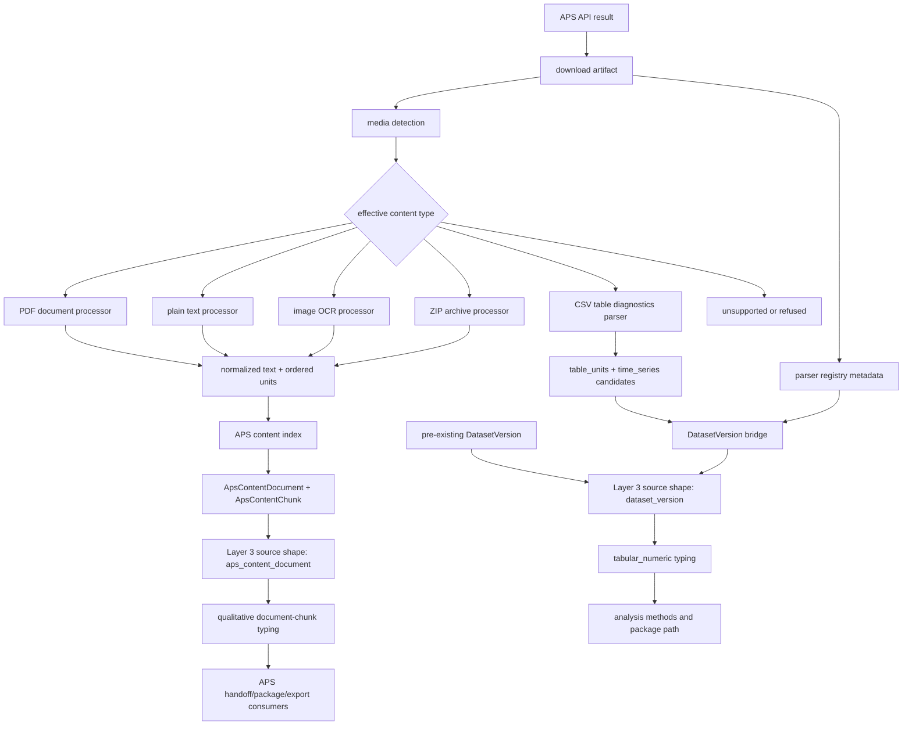
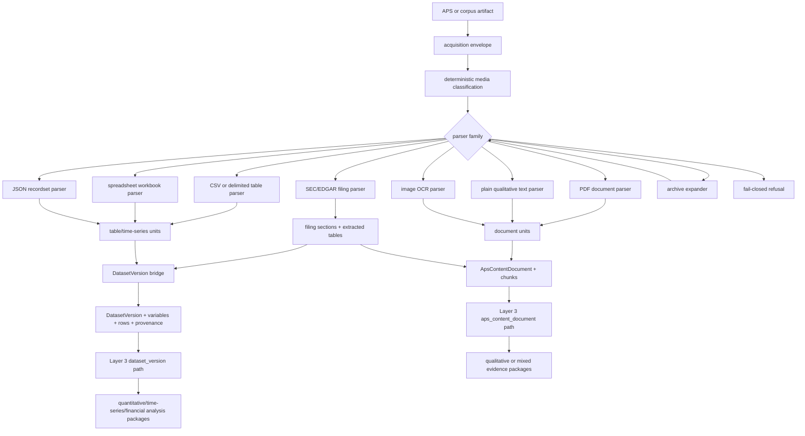

# Multi-Type APS Ingestion Plan

Status: planning/design pack plus implemented Phase P1 media hardening, Phase P2 parser registry skeleton, Phase P3 CSV typed diagnostics, Phase P4 callable dataset bridge, Phase P4.5 opt-in connector orchestration, Phase P5 Layer 3 APS-derived dataset admission, Phase P6 execution/package proof, and bounded Phase P10A operator selection surfacing on 2026-05-03.

Worktree: `worktrees/multi-ingest-plan`

Branch: `codex/multitype-ingestion-plan-p1`

Base authority: `project6-origin/main` at `94bd339fb3c76a6151aeb7d0d618f48e0ab2e35f`.

## Purpose

This folder defines the current end-to-end completion boundary and the remaining implementation plan for non-PDF and typed-source ingestion through NRC APS artifact processing, content indexing, and the Layer 3 workbench sublayers.

The user question is not just "can the pipeline download non-PDF files?" The actual requirement is whether the pipeline preserves the original corpus artifact's specific data shape and semantics while moving downstream. That includes plain qualitative text, tabular/numeric data, time-series data, spreadsheets, JSON recordsets, SEC/EDGAR filing formats, and mixed qualitative-plus-table artifacts.

## Authority And Limits

Confirmed live authority comes from tracked source files and tracked planning/status docs in this worktree. The repo-level instructions reference `.codesight/wiki/index.md` and `.codesight/CODESIGHT.md`, but both files are absent in this current worktree; this pack records that as an authority gap rather than treating the wiki as available.

This lane began as a planning/spec/design pack and now also includes Phase P1, Phase P2, Phase P3, Phase P4, Phase P4.5, Phase P5, Phase P6, and bounded Phase P10A source/test/UI changes. It still does not change schema, migrations, or Layer 3 typing rules. The API changes are limited to material-preview accepting explicit `dataset_version_ids` and a read-only Layer 3 candidate-list endpoint that projects APS-derived `DatasetVersion` rows from existing `DatasetSourceProvenance` authority.

This folder is the front door for the new lane. Existing progress manifests and Layer 3 control packets were not modified in this pass because doing so would imply this heterogeneous-ingestion lane has been admitted into the settled milestone-control spine. That should be a separate governance sync after the implementation-entry slice is accepted.

## Current Verdict

The current implementation is end-to-end for APS document-chunk ingestion and downstream Layer 3 APS evidence-bundle style handoff, not for first-class typed non-PDF data ingestion.

| Source family | Current status | Strict interpretation |
| --- | --- | --- |
| APS PDF through baseline/Candidate A-style document processing | Implemented for document extraction, normalized text, content units, chunk indexing, audited review/workbench surfaces, audited Layer 3 APS document evidence consumers, and parser-registry metadata | Complete only for document/text/chunk semantics |
| APS PDF through Candidate B OpenDataLoader PDF | Implemented as opt-in, PDF-only, fail-closed document-processing engine with parser-registry metadata | Complete only for PDF document extraction into the existing document contract |
| `text/plain` | Implemented as qualitative text normalization and text-block units with parser-registry metadata | Partial; this is not a typed qualitative corpus model beyond document chunks |
| Images | Implemented as OCR text units with parser-registry metadata | Partial; image pixels/regions are not a typed Layer 3 data source |
| ZIP archives | Implemented as archive bundle for supported member types with parser-registry metadata | Partial; typed/refused member extensions are surfaced as member-level outcomes; CSV members are parsed for table diagnostics and not flattened into text |
| CSV | Parser, callable dataset bridge, opt-in connector bridge orchestration, Layer 3 APS-derived `DatasetVersion` admission, selected-pass execution/package proof, and bounded workbench selection surfacing implemented for typed diagnostics | Partial; `hydrate_process` runs with `csv_dataset_bridge_enabled=true` can materialize `table_units` into `DatasetVersion` authority and those versions can now be listed/selected in the Layer 3 workbench and enter material preview/Gate B/Gate C/plan/execution/result/package when explicitly selected, but non-CSV typed parsers do not exist yet |
| XLS/XLSX spreadsheets | Not first-class | XLS/XLSX/XLSM are now fail-closed as unadmitted spreadsheet candidates by extension or OOXML package sniffing; no workbook parser exists yet |
| JSON/XML/HTML | Explicitly refused today | Declared/sniffed/extension JSON/XML/HTML are refused; no typed recordset, structured document, or filing parser exists yet |
| SEC/EDGAR filings/submissions | Not first-class | Plain-text filings may flow as text; HTML/XML/SGML/structured filings have no admitted parser family |
| Existing `dataset_version` time-series/financial/tabular data | Implemented downstream in Layer 3 when already present as dataset records | CSV APS artifacts can now create dataset records behind an explicit bridge gate; explicit Layer 3 material preview can now carry APS-derived dataset provenance into Gate B/Gate C/plan preview |

## Architecture Quality Bar

The remaining lane must be built for flexibility and non-fragility, not just format coverage. The docs in this folder treat these as acceptance requirements:

- Modularity: media classification, parser selection, parser execution, representation contracts, dataset materialization, content indexing, Layer 3 admission, and UI/operator projection must remain separable layers.
- Scalability: adding a new parser family must mean adding a registry entry, parser implementation, fixtures, diagnostics, and downstream mapping, not editing unrelated workbench or PDF-specific branches.
- Fail-closed behavior: unknown, ambiguous, malformed, unsupported, empty, or unadmitted inputs must produce explicit diagnostics and must not silently downgrade into text/archive success.
- Provenance stability: every chunk, table, dataset row, package, and handoff record must retain enough source identity to trace back to run, target, raw blob, parser family, parser version, and content contract.
- Backward compatibility: existing PDF, Candidate B PDF-only, text, image, ZIP, `aps_content_document`, and `dataset_version` behavior must remain stable unless a later implementation PR explicitly changes and tests that boundary.
- Bounded growth: each tranche must have a narrow parser/source-family target and a no-go list; broad "support heterogeneous files" is not an implementation unit.

## Current Flow

## Target Flow

## What Is Completely Planned And Implemented Today

The live repo has the APS document pipeline and audited Layer 3 workbench downstream consumers implemented for the existing `aps_content_document` source shape. The live repo also has a separate `dataset_version` source shape that supports quantitative/tabular/time-series work once dataset rows and variable metadata already exist.

The live repo does not yet have a complete plan-plus-implementation for all non-PDF APS artifacts or heterogeneous corpus files. CSV now has parser diagnostics, dataset bridge materialization, explicit Layer 3 admission, selected-pass execution/package proof, and bounded Layer 3 UI/operator selection. Additional typed parser families beyond CSV remain missing.

## Immediate Next Tranche

Phase P1 detection/classification hardening has been implemented in this branch for CSV, XLS/XLSX/XLSM, JSON/XML/HTML, and ZIP typed/refused members. Phase P2 parser-registry metadata has been implemented for the current document processors. Phase P3 CSV/delimited table diagnostics have been implemented for bounded CSV inputs. Phase P4 can materialize admitted CSV table units into dataset authority when explicitly invoked. Phase P4.5 runs that bridge during connector finalization only when `csv_dataset_bridge_enabled=true` and processed CSV table artifacts exist. Phase P5 admits explicitly selected APS-derived dataset versions into Layer 3 using the existing `dataset_version` source shape. Phase P6 proves selected-pass execution/result/package preservation for that path. Phase P10A exposes APS-derived dataset-version candidates in the Layer 3 workbench and passes selected/pasted IDs through material preview.

The next implementation pass should not repeat the APS-derived CSV dataset selection slice. Remaining work is:

1. JSON, spreadsheet, and SEC/EDGAR parser slices after the CSV bridge pattern is proven.
2. Broader Phase P10 UI surfacing for typed/refused/mixed source families only as those families become backed by server authority.
3. Mixed qualitative-plus-table package semantics only after at least one mixed parser contract is implemented and tested.

## Pack Files

This section intentionally lists the supporting pack files. `README.md` is the front door for the folder rather than a child entry in the list.

- `01-live-audit.md` records the live implementation evidence and completion boundary.
- `02-contract.md` defines the target typed content/source contract and invariants.
- `03-implementation.md` decomposes the remaining work into bounded implementation phases.
- `04-validation.md` defines the required validation and regression matrix.
- `05-decisions.md` captures decisions, open questions, and grill-me self-audit checkpoints.
- `06-adequacy-audit.md` records the final scope, consistency, and justification audit for this planning-entry pack.
- `07-p1-closeout.md` records the implemented Phase P1 boundary, validation, and residual caveats.
- `08-p2-closeout.md` records the implemented Phase P2 parser-registry boundary, validation, and residual caveats.
- `09-p3-closeout.md` records the implemented Phase P3 CSV typed-diagnostics boundary, validation, and residual caveats.
- `10-p4-closeout.md` records the implemented Phase P4 callable dataset-bridge boundary, validation, and residual caveats.
- `11-p4-5-closeout.md` records the implemented Phase P4.5 opt-in connector bridge orchestration, validation, and residual caveats.
- `12-p5-closeout.md` records the implemented Phase P5 Layer 3 APS-derived dataset admission, validation, and residual caveats.
- `13-p6-closeout.md` records the implemented Phase P6 selected-pass execution/result/package proof, validation, and residual caveats.
- `14-p10a-closeout.md` records the bounded Phase P10A Layer 3 UI/operator selection surfacing, validation, and residual caveats.
